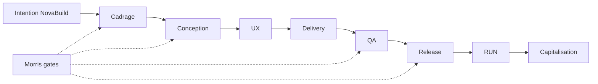

# 03 — Storyline — SFIA Discovery Experience

| Métadonnée | Valeur |
|------------|--------|
| **Statut** | **Candidate** |
| **Propriétaire** | Morris |
| **Baseline** | SFIA v2.4 |
| **Horodatage** | 2026-07-14 18:10 Europe/Paris (CEST) |
| **Branche** | `documentation/sfia-discovery-product-design` |
| **HEAD** | `14446b91019c1e320c12533124201b9a3dd4863d` |

---

## 1. Objectif

Écrire le **scénario produit** — fil rouge, contrastes, moments de preuve, climax et sorties.

---

## 2. Ouverture narrative

> **Scène :** Un dirigeant de PME du BTP — l'entreprise **NovaBuild** est un **cas pédagogique composite** : entreprise et déroulé narratif **fictifs**, besoins et catégories de livrables **inspirés** de situations réalistes et d'actifs SFIA vérifiables. NovaBuild a besoin d'une application pour piloter ses chantiers et réserves. Il a testé ChatGPT pour « faire une app ». Résultat : des bouts de code, des idées, aucune traçabilité, personne pour maintenir.

**Question du lecteur :** « Et SFIA, concrètement, ça change quoi ? »

---

## 3. Contraste tripartite

| Dimension | Projet classique | IA libre (ChatGPT/Cursor) | SFIA |
|-----------|------------------|---------------------------|------|
| Cadre | Cahier des charges lourd | Aucun | Cycles bornés |
| Traçabilité | Variable | Faible | Git + PR |
| Vitesse | Lente | Rapide mais chaotique | Rapide **et** gouverné |
| Décision | Comité | Utilisateur seul | Morris (gates) |
| Livrables | Documents projet | Fragments code | Artefacts par cycle |
| Capitalisation | Difficile | Absente | REX, méthode |

**Note :** comparaison **pédagogique** — pas claim benchmark chiffré non sourcé.

---

## 4. Révélation progressive de SFIA

1. **Acte I** — NovaBuild reconnaît le chaos (retards, rework, IA non maîtrisée)
2. **Acte II** — SFIA introduite comme **usine logicielle gouvernée**
3. **Acte III** — On suit le projet NovaBuild cycle par cycle
4. **Acte IV** — On voit les livrables s'accumuler
5. **Acte V** — On comprend pourquoi ça tient (gates, Git, review)
6. **Acte VI** — NovaBuild (PME) et l'ESN partenaire se projettent
7. **Acte VII** — Accès méthode pour qui veut approfondir

---

## 5. Fil rouge projet NovaBuild

> NovaBuild est un cas pédagogique composite. L'entreprise et le déroulé narratif sont fictifs. Les besoins, catégories de livrables, contrôles et mécanismes visibles sont inspirés de situations réalistes et d'actifs SFIA vérifiables. Le récit ne constitue ni un témoignage client ni la reproduction exacte d'un projet réel.

**Lien de preuve (catégories réelles, contenu scénarisé) :** cycles documentés type Chantiers360 (`projects/chantiers360/`, capitalisations v2.5) — **synthèse narrative**, pas export brut ni attribution client à NovaBuild.

| Distinction | NovaBuild | SFIA réel |
|-------------|-----------|-----------|
| Entreprise | Fiction | — |
| Enchaînement cycles | Scénarisé | Traçable Git |
| Types de livrables | Inspirés | Produits dans projects/ |
| Gates Morris | Narrés | Décisions réelles |
| Résultats chiffrés | **Interdits** | Uniquement si sourcés |

| Phase | Problème projet | Action SFIA visible | Rôles | Livrable observable | Gate Morris | Valeur | Preuve Git | Masqué |
|-------|-----------------|---------------------|-------|---------------------|-------------|--------|------------|--------|
| **Intention** | Besoin métier flou | Cycle cadrage | Morris, ChatGPT | Note cadrage | GO scope | Alignement | framing docs | Prompts |
| **Cadrage** | Périmètre | Cycle fonctionnel | PO, ChatGPT | Backlog initial | Validation | Clarté | backlog samples | Catalog |
| **Conception** | Spec incomplète | Archi fonctionnelle | Architecte, Cursor | Diagrammes, ADR | GO archi | Réduction rework | functional-architecture-method | Templates intégraux |
| **UX** | UI incohérente | Cycle UX/UI | Designer, Cursor | Maquettes / Penpot | Revue Morris | UX alignée | ux deliverables | Figma raw |
| **Delivery** | Code non tracé | Cycles delivery | Dev, Cursor | PR, code | Merge GO | Incréments | PR history | CI secrets |
| **QA** | Régressions | Cycle QA | QA, Cursor | Rapport QA, captures | GO release | Qualité | qa reports | Test scripts complets |
| **Release** | Mise en prod | Cycle release | Morris | Release notes | GO deploy | Disponibilité | release docs | Infra |
| **RUN** | Exploitation | Cycle RUN readiness | Ops | Runbook | GO | Continuité | run readiness | — |
| **Capitalisation** | Perte REX | Cycle cap. | Morris | REX, méthode | GO cap. | Amélioration continue | capitalization docs | — |

*(Tableau pédagogique — événements NovaBuild scénarisés ; catégories alignées sur actifs SFIA réels.)*

---

## 6. Moments de preuve (climax)

| # | Moment | Contenu |
|---|--------|---------|
| M1 | Premier cycle terminé avec PR merge | « Quelque chose de concret existe dans Git » |
| M2 | Review pack lu par Morris | « La qualité est contrôlée » |
| M3 | Capture runtime QA | « L'application fonctionne » |
| M4 | REX capitalisation | « La méthode s'améliore » |

**Climax narratif recommandé :** M3 — démonstration visuelle application NovaBuild (capture ou schéma — **pas** code source intégral).

---

## 7. Transitions et sorties

| Sortie | Condition | Destination |
|--------|-----------|-------------|
| Teaser 3 min | Dirigeant pressé | Acte I + II résumé |
| Conviction 20 min | PO intéressé | Acte III + IV |
| Approfondissement | Architecte | Acte VII + Git |
| Contact / GO Morris | Prospect qualifié | Hors Notion — process commercial Morris |

---

## 8. Points de projection utilisateur

- « Mon équipe ressemble à NovaBuild »
- « Mon ESN pourrait livrer ainsi »
- « Je vois où Morris intervient »
- « Je ne veux pas reconstruire SFIA — je veux l'utiliser »

---

## 9. Crédibilité et limites

| Affirmation | Statut |
|-------------|--------|
| Des cycles SFIA ont produit des livrables réels (ex. Chantiers360) | **Observation** — sources Git |
| NovaBuild est un client réel | **Fiction pédagogique** — cas composite validé |
| NovaBuild reproduit exactement un projet client | **Interdit** |
| SFIA garantit succès projet | **Interdit** |
| IA exécute seule | **Interdit** |

---

## 10. Diagramme fil rouge (Mermaid)

---

## Liens

→ [02 Architecture narrative](02-sfia-discovery-narrative-architecture.md) · [04 Personas](04-sfia-discovery-personas-and-reading-journeys.md)
