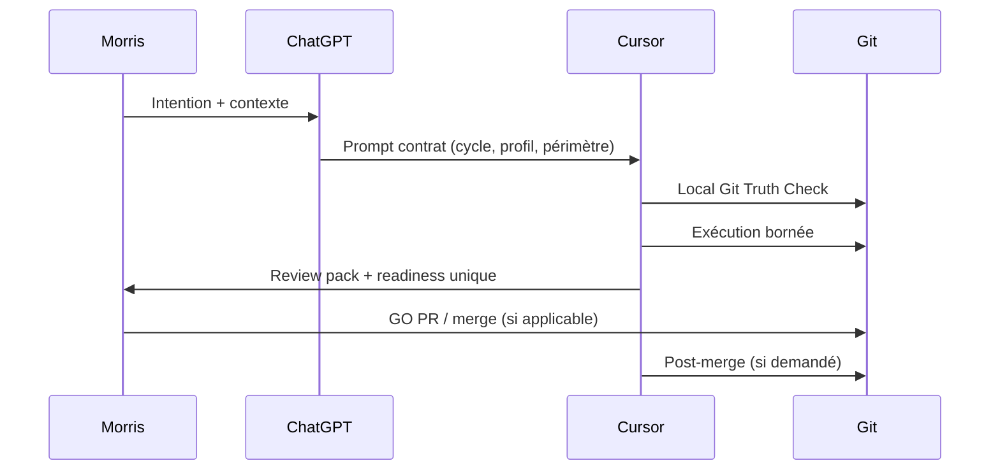

# 03 — Comment fonctionne un cycle

| Métadonnée | Valeur |
|------------|--------|
| **Page P0** | 03 — Comment fonctionne un cycle |
| **Statut** | Draft éditorial — non publié |
| **Cycle** | Cycle 2 |
| **Baseline** | SFIA v2.4 |
| **Audience** | Chef de projet, développeur, qualité |
| **Niveau** | L2 |
| **Propriétaire** | Morris |
| **Sources Git** | `sfia-chatgpt-cursor-operating-model.md` ; `prompts/templates/sfia-cycle-execution-template.md` (extrait — **Candidate v2.5**) |
| **Commit** | `6407913689b14e84e0a487a3137ff290bb6e2ff8` |
| **Date** | 2026-07-13 13:11 Europe/Paris |

---

## 1. Objectif de la page

Expliquer le déroulement type d'un cycle SFIA — de la qualification à la capitalisation — sans reproduire le template d'exécution Cursor intégral.

## 2. À retenir en 30 secondes

- **Un cycle = un résultat utile** (document, code, revue, capitalisation).
- **ChatGPT** qualifie et produit le prompt ; **Cursor** exécute dans Git ; **Morris** tranche les gates.
- **Local Git Truth Check** en tête d'exécution.
- **Une seule readiness** par cycle (pas plusieurs verdicts concurrents).
- Fin typique : PR → merge → post-merge → capitalisation éventuelle.

## 3. Contenu éditorial principal

### Étapes clés

| Phase | Qui | Quoi |
|-------|-----|------|
| 1. Intention | Morris | Objectif, périmètre, gates |
| 2. Qualification | ChatGPT | Type de cycle, profil, review pack, handoff |
| 3. Vérité Git | Cursor | Branche, HEAD, working tree |
| 4. Exécution | Cursor | Actions dans périmètre autorisé |
| 5. Revue | Review pack / Morris | Preuves, réserves |
| 6. Readiness | Cursor | **Un** verdict (ex. READY FOR REVIEW) |
| 7. PR / merge | Morris GO | Si prévu par le cycle |
| 8. Post-merge | Cursor | Vérif intégration, suite |
| 9. Capitalisation | Cycle dédié | Si apprentissage durable |

### Schéma de séquence

## 4. Fonctionnement ou parcours

Après cette page → [04 Cycles et profils](sfia-notion-04-cycles-profiles-gates-editorial-draft.md) pour le référentiel des 15 cycles (**Candidate v2.5**).

## 5. Exemple pédagogique

Cycle « corriger un lien dans un doc » : profil **Light**, review pack **none** ou **light**, une readiness **READY FOR COMMIT**, pas de gate merge si Morris n'a pas demandé la PR.

## 6. Points de vigilance

- Le template `sfia-cycle-execution-template.md` est **Candidate v2.5 — non baseline** ; v2.4 reste la référence opérationnelle jusqu'à validation Morris.
- **Review Handoff Git** : requis ou non selon le prompt — pas automatique.
- Ne pas lancer plusieurs readiness (« prêt pour X » et « prêt pour Y ») dans le même cycle.

## 7. Liens

→ [04 Cycles](sfia-notion-04-cycles-profiles-gates-editorial-draft.md) · [05 Routage](sfia-notion-05-request-routing-editorial-draft.md) · [08 Mise en place](sfia-notion-08-setup-sfia-editorial-draft.md) · [07 Gouvernance](sfia-notion-07-governance-guardrails-editorial-draft.md)

## 8. Sources Git

- `method/sfia-fast-track/core/sfia-chatgpt-cursor-operating-model.md`
- `prompts/templates/sfia-cycle-execution-template.md` (Candidate — extraits §4, §7, §9)

## 9. Métadonnées publication

Type : synthèse éditoriale + schéma. Lien Git vers template complet pour exécuteurs.

## 10. Réserves

Diagramme Mermaid à valider visuellement en Notion au cycle 3.
