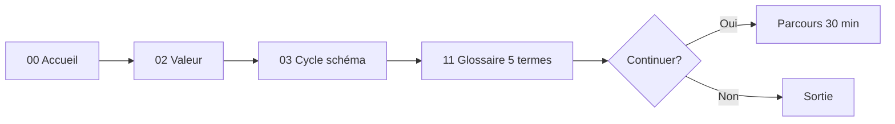
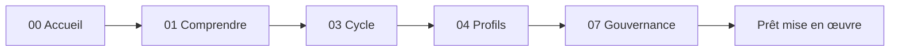
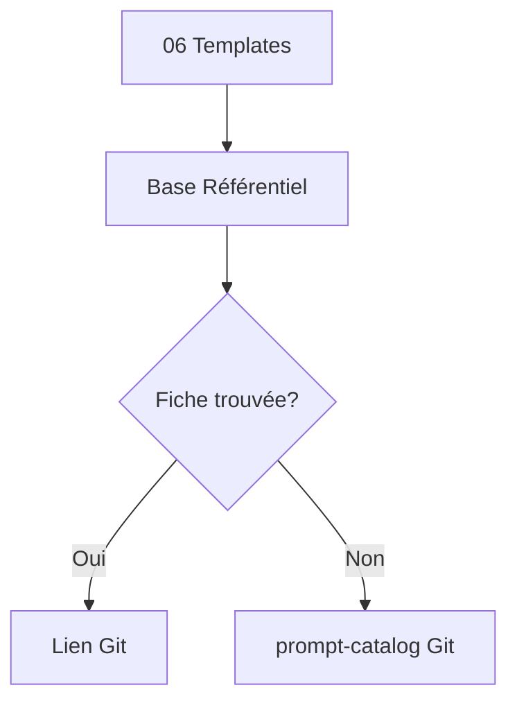

# 06 — User journeys — SFIA Notion

| Métadonnée | Valeur |
|------------|--------|
| **Statut** | **Candidate** — expérimentation UX documentaire Notion |
| **Usage** | Parcours utilisateur — non capitalisé |
| **Baseline opérationnelle** | SFIA v2.4 |
| **Propriétaire** | Morris |
| **Source de vérité** | Git |
| **Capitalisation méthode** | Non réalisée |
| **Implémentation Notion** | Cycle ultérieur |
| **Horodatage** | 2026-07-14 12:06 Europe/Paris (CEST) |
| **Branche** | `documentation/sfia-notion-ux-conception` |
| **HEAD source** | `ee6c358750ecd18f7ba884ec51c8c7db3eaf3faa` |

---

## A. Découvrir SFIA en 5 minutes

| Champ | Valeur |
|-------|--------|
| **Persona** | Nouveau visiteur / dirigeant |
| **Contexte** | Première visite espace Notion privé Morris |
| **Déclencheur** | Lien partagé ou exploration |
| **Objectif** | Savoir ce qu'est SFIA et si ça vaut la peine d'aller plus loin |
| **Durée cible** | 5 minutes |
| **Étapes** | Accueil → Valeur → Cycle (schéma) → Glossaire (5 termes) |
| **Décisions** | Continuer 30 min ou sortir |
| **Friction** | Jargon, trop de pages |
| **Résultat** | Vision claire : Git exécute, Notion explique |
| **Sortie Git** | Non requise |
| **Indicateur réussite** | Utilisateur cite 2 bénéfices SFIA |
| **Desktop** | Hero + 3 CTA visibles sans scroll |
| **Mobile** | Parcours empilé, callout 30 s lisible |
| **Échec / récupération** | Perdu → footer Accueil ; glossaire |



---

## B. Comprendre SFIA en 30 minutes

| Champ | Valeur |
|-------|--------|
| **Persona** | Chef de projet / PO |
| **Contexte** | Doit évaluer SFIA pour un futur projet |
| **Déclencheur** | Après parcours 5 min ou accès direct |
| **Objectif** | Comprendre acteurs, cycles, gates, gouvernance |
| **Durée cible** | 30 minutes |
| **Étapes** | Accueil → Comprendre → Cycle → Profils → Gouvernance |
| **Décisions** | Quel profil pour quel type de demande |
| **Friction** | v2.5 Candidate vs v2.4 baseline |
| **Résultat** | Carte mentale cycles + gates Morris |
| **Sortie Git** | Optionnelle — operating-model |
| **Indicateur réussite** | Identifie 3 gates et rôle Morris |
| **Desktop** | Tables profils lisibles |
| **Mobile** | Toggles pour tables longues |
| **Échec / récupération** | Confusion v2.5 → callout Candidate |



---

## C. Lancer un premier cycle

| Champ | Valeur |
|-------|--------|
| **Persona** | PO / tech lead |
| **Contexte** | Workspace SFIA disponible, demande métier formulée |
| **Déclencheur** | « Je veux lancer un cycle documentation » |
| **Objectif** | Identifier cycle, profil, template ; préparer exécution Git |
| **Durée cible** | 20–40 minutes |
| **Étapes** | Accueil → Mise en place → Routage → Templates → **Git** |
| **Décisions** | Cycle type, profil Light/Standard/Critical |
| **Friction** | Croire que Notion exécute Cursor |
| **Résultat** | Prompt prêt à copier dans Cursor depuis Git |
| **Sortie Git** | **Obligatoire** — routing-guide, prompt-catalog |
| **Indicateur réussite** | Branche créée dans Git |
| **Desktop** | Matrice routage + lien template |
| **Mobile** | Checklist mise en place scannable |
| **Échec / récupération** | Mauvais cycle → retour 05 Routage |

```text
Accueil → 08 Mise en place (checklist)
       → 05 Routage (matrice 8 demandes)
       → 06 Templates (index)
       → GIT : ouvrir Cursor, cycle-execution-template
```

---

## D. Contribuer à la méthode

| Champ | Valeur |
|-------|--------|
| **Persona** | Contributeur technique / responsable méthode |
| **Contexte** | Propose amélioration méthode SFIA |
| **Déclencheur** | « Je veux modifier un garde-fou » |
| **Objectif** | Comprendre chemins protégés, process PR, gates |
| **Durée cible** | 15–25 minutes |
| **Étapes** | Accueil → Gouvernance → Templates → Documents → Git PR |
| **Décisions** | Fichier cible, profil Critical ou non |
| **Friction** | Modifier Notion au lieu de Git |
| **Résultat** | PR sur branche dédiée — pas changement Notion seul |
| **Sortie Git** | **Obligatoire** — rules-and-guardrails, protected paths |
| **Indicateur réussite** | PR créée sur method/ ou docs/ |
| **Desktop** | Table garde-fous complète |
| **Mobile** | Callout « Git uniquement » visible |
| **Échec / récupération** | Tentative edit Notion → callout Attention |

---

## E. Vérifier une règle ou un statut documentaire

| Champ | Valeur |
|-------|--------|
| **Persona** | Morris / qualité |
| **Contexte** | Doute sur statut Candidate ou divergence |
| **Déclencheur** | « Ce contenu est-il baseline ? » |
| **Objectif** | Confirmer statut, source Git, règle divergence |
| **Durée cible** | 5–10 minutes |
| **Étapes** | Page concernée → Gouvernance → Git source → comparaison |
| **Décisions** | Resync éditorial nécessaire ou non |
| **Friction** | Métadonnées commit obsolètes |
| **Résultat** | Verdict Git prime documenté |
| **Sortie Git** | Commit SHA sur page vs main actuel |
| **Indicateur réussite** | Écart identifié ou confirmé aligné |
| **Desktop** | Métadonnées + callout Candidate |
| **Mobile** | Même flux |
| **Échec / récupération** | SHA absent → QA UX-06 backlog |

---

## F. Trouver un actif dans le Référentiel

| Champ | Valeur |
|-------|--------|
| **Persona** | Développeur / contributeur |
| **Contexte** | Besoin d'un template ou prompt précis |
| **Déclencheur** | « Où est le template cycle execution ? » |
| **Objectif** | Localiser asset sans parcourir repo |
| **Durée cible** | 2–5 minutes |
| **Étapes** | 06 Templates → Base Référentiel (filtre) → lien Git |
| **Décisions** | Ouvrir Git ou rester Notion |
| **Friction** | Catalog intégral dupliqué |
| **Résultat** | Chemin Git identifié |
| **Sortie Git** | prompts/templates/... |
| **Indicateur réussite** | Fichier ouvert en < 3 clics depuis accueil |
| **Desktop** | Vue base filtrée type=template |
| **Mobile** | Lien direct depuis 06 |
| **Échec / récupération** | Asset absent base → lien catalog Git |



---

## Synthèse parcours

| ID | Parcours | Durée | Sortie Git |
|----|----------|-------|------------|
| A | Découvrir 5 min | 5 min | Non |
| B | Comprendre 30 min | 30 min | Optionnel |
| C | Premier cycle | 20–40 min | **Oui** |
| D | Contribuer méthode | 15–25 min | **Oui** |
| E | Vérifier statut | 5–10 min | **Oui** |
| F | Trouver actif | 2–5 min | **Oui** |

---

## Liens

→ [03 Navigation](03-sfia-notion-navigation-model.md) · [05 Templates](05-sfia-notion-page-templates.md) · [07 Roadmap](07-sfia-notion-ux-roadmap.md)
