# Interv360 — Revue premier jet Figma

**Projet** : PRJ-INTERV360  
**Phase source** : 02-architecture  
**Phase cible** : UX/UI / Figma  
**Statut** : Reviewed — V1  
**Type** : Revue UX/UI premier jet  
**Source** : captures Figma + `figma-production-prompt.md` + `figma-design-instructions.md`  
**Objet** : évaluer le premier jet Figma et préparer les ajustements futurs

---

## 1. Objectif du document

Ce document trace la **revue du premier jet Figma Interv360**.

- le fichier Figma a été **généré** à partir du `figma-production-prompt.md` ;
- la revue s'appuie sur les **captures exportées** stockées dans Git (`figma-first-draft-screens/`) ;
- la revue **ne produit pas** de nouveau Figma, backlog, user stories ou code ;
- elle sert à **valider le niveau atteint** et à **identifier les ajustements futurs**.

---

## 2. Contexte et contrainte

- le **premier jet est exploitable** pour une revue projet ;
- le rendu est issu d'un **outil de génération Figma** (prompt de production) ;
- une **première V1 a été améliorée** par une itération de polish UI (SLA, responsables, prochaines actions, CTA contextuels, planning détaillé, mobile terrain) ;
- la **version gratuite de Figma** utilisée **ne permet plus** d'améliorer la maquette immédiatement (crédits épuisés) ;
- la **V1 est figée provisoirement** ;
- les améliorations restantes seront **documentées** pour une future itération V2.

---

## 3. Captures analysées

| Écran / page | Capture | Statut |
|--------------|---------|--------|
| **Cover / Context** | `figma-first-draft-screens/00-cover-context.png` | Analysée |
| **Tableau de bord SAV** | `figma-first-draft-screens/05-dashboard-sav.png` | Analysée |
| **Liste des demandes** | `figma-first-draft-screens/06-liste-demandes.png` | Analysée |
| **Fiche demande SAV** | `figma-first-draft-screens/07-fiche-demande-sav.png` | Analysée |
| **Planning semaine** | `figma-first-draft-screens/08-planning-semaine.png` | Analysée |
| **Fiche intervention mobile** | `figma-first-draft-screens/09-fiche-intervention-mobile.png` | Analysée |
| **Compte rendu mobile** | `figma-first-draft-screens/10-compte-rendu-mobile.png` | Analysée |
| **Suivi erreurs intégration** | `figma-first-draft-screens/11-suivi-erreurs-integration.png` | Analysée |
| **Vue dirigeant** | `figma-first-draft-screens/12-vue-dirigeant.png` | Analysée |
| **Validation checklist** | `figma-first-draft-screens/13-validation-checklist.png` | Analysée |
| **Archive / Explorations** | `figma-first-draft-screens/99-archive.png` | Analysée |

**Pages non exportées individuellement**

Les pages **01 — Design principles**, **02 — Tokens**, **03 — Components** et **04 — User flows MVP** n'ont **pas** fait l'objet d'un export PNG dédié. Elles ne sont **pas analysées** comme captures séparées. **Aucun fichier inventé** pour ces pages.

Certains éléments de principes, design system, composants et flux MVP sont cependant **visibles** dans `00-cover-context.png` (cartes Principes / Design system / Flux MVP, bibliothèque composants enrichie) et **réutilisés** dans les écrans métier. Cette absence n'empêche pas la revue V1 : l'objectif principal est d'évaluer les **écrans MVP** et les **garde-fous** associés.

---

## 4. Synthèse d'évaluation

Le premier jet Figma atteint un **niveau satisfaisant** pour une revue PO / UX / RSSI / Architecte. Il respecte **globalement** le périmètre MVP, les garde-fous ADR P1/P2, la direction **Enterprise clean**, l'**absence d'IA**, l'**absence de portail client**, la **signature optionnelle** et la **séparation dashboard SAV / vue dirigeant**.

Le rendu est **crédible** grâce à l'ajout de SLA, responsables, prochaines actions, CTA contextuels, planning détaillé et écrans mobiles terrain.

Les limites restantes relèvent principalement du **polish UI**, de la **maturité visuelle** et de quelques **ajustements mineurs** de wording ou de composants.

| Indicateur | Valeur |
|------------|--------|
| **Qualité globale indicative** | 8,3 / 10 |
| **Statut** | Présentable en revue |
| **Niveau** | V1 solide, non définitive |

---

## 5. Points validés

| Critère | Évaluation | Commentaire |
|---------|------------|-------------|
| **8 écrans MVP présents** | Validé | Captures 05–12 couvrent le noyau |
| **Direction Enterprise clean** | Validé | Fond clair, teal discret, cartes aérées |
| **Dashboard SAV actionnable** | Validé | KPI, CTA « Qualifier 12 demandes », alertes |
| **Vue dirigeant séparée** | Validé | Écran distinct, ton synthétique |
| **Liste des demandes crédible** | Validé | Colonnes métier, SLA, responsable |
| **Fiche demande structurée** | Validé | Sections, onglets, historique |
| **Planning semaine lisible** | Validé | Techniciens, créneaux, conflits |
| **Mobile technicien orienté terrain** | Validé | CTA démarrer, actions terrain |
| **Compte rendu signature optionnelle** | Validé | « Continuer sans signature » visible |
| **Anomalies messages métier** | Validé | Reprise disponible, pas de log brut |
| **Checklist validation présente** | Validé | Capture 13 |
| **Archive vide / hors périmètre** | Validé | Capture 99 |
| **Pas d'IA** | Validé | Aucun composant IA |
| **Pas de portail client** | Validé | — |
| **Pas de logs techniques** | Validé | — |
| **Wording prudent** | Validé | Badges conformes §6 prompt |
| **Design system minimal partiel** | Partiel | Visible cover + composants inline |

---

## 6. Revue par écran

### 6.1 Cover / Context

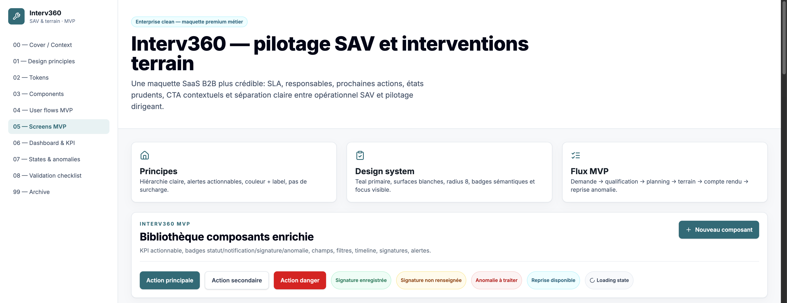

**Points positifs**

- positionnement clair — « pilotage SAV et interventions terrain » ;
- mention **Enterprise clean** ;
- contexte MVP compréhensible (SLA, managers, séparation SAV / dirigeant) ;
- composants enrichis visibles (badges signature, anomalie, reprise, loading) ;
- rappel des **principes**, **design system** et **flux MVP** en cartes.

**Ajustements futurs**

- exporter séparément les pages 01–04 si une V2 le permet.

**Statut** : **Validé V1**

---

### 6.2 Tableau de bord SAV complet

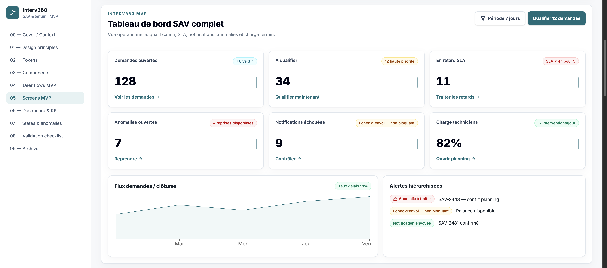

**Points positifs**

- KPI actionnables (128 demandes, 34 à qualifier, 11 retard SLA, 7 anomalies, 9 notif échouées, 82 % charge) ;
- CTA « Qualifier 12 demandes » pertinent ;
- alertes hiérarchisées (anomalie, échec non bloquant, notification envoyée) ;
- filtre période 7 jours ;
- graphe flux demandes/clôtures ;
- séparation claire avec vue dirigeant.

**Ajustements futurs**

- clarifier ou supprimer les **petites barres verticales** dans les cartes KPI ;
- renforcer hiérarchie KPI critiques vs secondaires ;
- améliorer lisibilité du graphe si nécessaire.

**Statut** : **Validé V1 — polish futur**

---

### 6.3 Liste des demandes

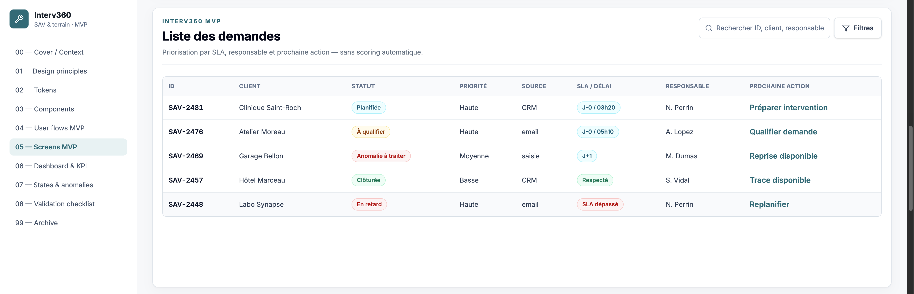

**Points positifs**

- colonnes métier : ID, client, statut, priorité, source, SLA/délai, responsable, prochaine action ;
- lecture SAV crédible ;
- statuts visibles en badges ;
- aucune promesse IA.

**Ajustements futurs**

- tri visuel par SLA ou priorité optionnel ;
- cohérence statuts / couleurs.

**Statut** : **Validé V1**

---

### 6.4 Fiche demande SAV

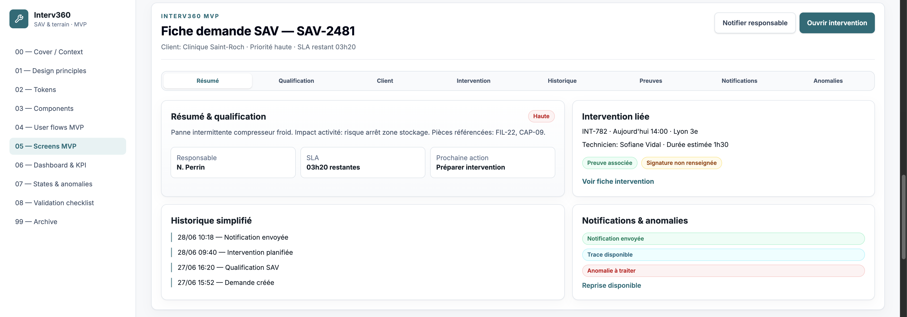

**Points positifs**

- structure claire avec navigation sections ;
- résumé, qualification, intervention liée, historique, notifications/anomalies ;
- CTA « Notifier responsable », « Ouvrir intervention » ;
- SLA et prochaine action visibles.

**Ajustements futurs**

- vérifier onglets Client / Preuves / Notifications — ne pas promettre détail hors MVP ;
- garder contenus légers ;
- éviter logique portail ou centre notifications.

**Statut** : **Validé V1 — attention wording / promesse**

---

### 6.5 Planning semaine

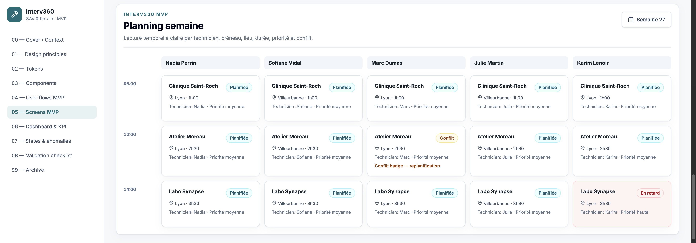

**Points positifs**

- lecture par technicien ;
- repères horaires ;
- cartes intervention détaillées ;
- conflit et retard visibles ;
- planning plus crédible qu'à la génération initiale.

**Ajustements futurs**

- renforcer lecture temporelle en V2 ;
- clarifier structure jour/semaine ;
- pas d'optimisation IA ni prédiction.

**Statut** : **Validé V1 — amélioration future possible**

---

### 6.6 Fiche intervention technicien

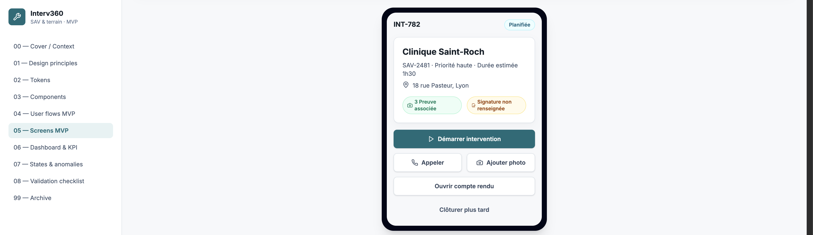

**Points positifs**

- **mobile prioritaire** ;
- CTA « Démarrer intervention » clair ;
- actions terrain : appeler, ajouter photo, ouvrir compte rendu ;
- preuves et signature visibles ;
- pas de surcharge excessive.

**Ajustements futurs**

- hiérarchiser actions secondaires ;
- vérifier « Clôturer plus tard » — ne pas suggérer workflow non cadré.

**Statut** : **Validé V1**

---

### 6.7 Compte rendu intervention

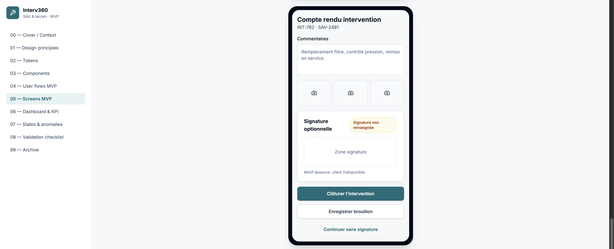

**Points positifs**

- signature **optionnelle** ;
- « **Continuer sans signature** » visible ;
- bouton clôturer présent ;
- preuves/photos sans promesse conservation réelle ;
- wording prudent (signature enregistrée / non renseignée).

**Ajustements futurs**

- « Enregistrer brouillon » — action secondaire à surveiller (workflow plus complet suggéré) ;
- pas de signature certifiée ni archivage réel.

**Statut** : **Validé V1 — action brouillon à surveiller**

---

### 6.8 Suivi erreurs d'intégration

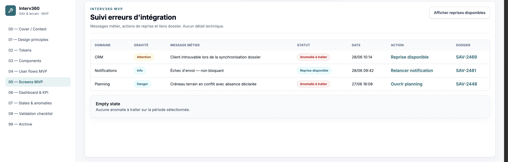

**Points positifs**

- messages **métier** ;
- action **reprise disponible** ;
- lien dossier ;
- pas de log brut ni SIEM ;
- empty state présent.

**Ajustements futurs**

- cohérence gravité / statut ;
- hiérarchisation des actions.

**Statut** : **Validé V1**

---

### 6.9 Vue pilotage dirigeant avancée

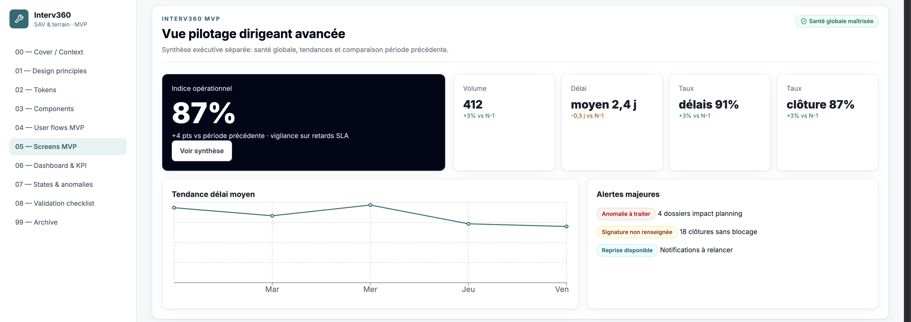

**Points positifs**

- **bien séparée** du dashboard SAV ;
- indice opérationnel, tendances, comparaison période ;
- alertes majeures ;
- pas de drill-down technique ni logs.

**Ajustements futurs**

- carte noire « Indice opérationnel » très contrastée — **adoucir en V2** ;
- tendances simples, non prédictives.

**Statut** : **Validé V1 — polish visuel futur**

---

### 6.10 Validation checklist

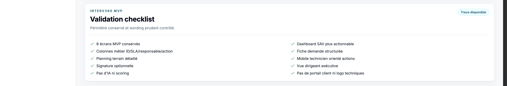

**Points positifs**

- checklist claire ;
- périmètre conservé ;
- absence IA, portail client, logs techniques confirmée ;
- points métier principaux validés.

**Ajustements futurs**

- compléter avec retours revue PO / UX / RSSI / Architecte.

**Statut** : **Validé V1**

---

### 6.11 Archive / Explorations

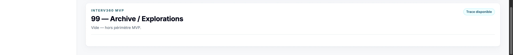

**Points positifs**

- section vide ;
- hors périmètre MVP respecté ;
- pas d'exploration post-MVP non maîtrisée.

**Ajustements futurs**

- conserver vide tant que arbitrages post-MVP non réouverts.

**Statut** : **Validé V1**

---

## 7. Garde-fous ADR P1/P2 respectés

| Garde-fou | Statut | Commentaire |
|-----------|--------|-------------|
| Contrats simulés non exposés comme intégrations réelles | OK | Pas de connecteurs réels affichés |
| Erreurs visibles en message métier | OK | Écran anomalies |
| Reprise manuelle simulée | OK | « Reprise disponible » |
| Journalisation minimale non exposée en logs | OK | Pas de dump |
| Preuves fictives | OK | Compteurs, photos associées |
| Notifications simples | OK | Échec non bloquant |
| Signature optionnelle | OK | CR mobile |
| Dashboards séparés | OK | 05 vs 12 |
| IA post-MVP | OK | Absente |
| Pas de portail client | OK | — |
| Pas de BI avancée | OK | Tendances simples |
| Pas de signature juridique complète | OK | Wording prudent |

---

## 8. Points d'attention

- certains écrans restent encore **générés / flat** (style outil IA) ;
- la **carte noire dirigeant** peut être trop contrastée ;
- **planning** encore perfectible (lecture temporelle) ;
- certaines **actions secondaires** peuvent suggérer des workflows non cadrés (brouillon CR, « Clôturer plus tard », onglets fiche) ;
- **onglets fiche demande** à surveiller (Preuves / Notifications) ;
- pages **01–04 non exportées** individuellement ;
- **pas d'amélioration immédiate** possible — limite crédits Figma gratuit.

---

## 9. Ajustements futurs recommandés

| Priorité | Ajustement | Écran concerné |
|----------|------------|----------------|
| **P1** | Supprimer ou clarifier barres verticales KPI | Dashboard SAV |
| **P1** | Vérifier wording onglets et actions secondaires | Fiche demande, CR |
| **P2** | Adoucir carte indice opérationnel | Vue dirigeant |
| **P2** | Améliorer planning temporel | Planning |
| **P2** | Affiner hiérarchie mobile | Fiche intervention, CR |
| **P3** | Améliorer graphs | Dashboard SAV, dirigeant |
| **P3** | Enrichir états empty/loading/error | Listes, anomalies |
| **P3** | Exporter pages 01–04 si V2 | Structure Figma |

---

## 10. Décision de revue

**Le premier jet Figma Interv360 est validé comme V1 présentable pour revue projet.**

Conditions :

- ne **pas** considérer la maquette comme **définitive** ;
- ne **pas** lancer backlog, user stories ou code à partir de cette V1 **sans validation** transverse ;
- **organiser une revue** PO / UX / RSSI / Architecte ;
- **documenter les retours** de cette revue ;
- **préparer une V2** si crédits Figma ou autre outil disponible.

---

## 11. Valeur projet

| Valeur projet | Commentaire |
|---------------|-------------|
| **Premier support visuel exploitable** | Démonstration parties prenantes |
| **Démonstrateur lisible** | MVP compréhensible |
| **Meilleure compréhension du MVP** | 8 écrans tangibles |
| **Support de discussion** | PO, RSSI, Architecte |
| **Support validation transverse** | Avant delivery |
| **Base pour future revue QA** | Parcours visibles |

---

## 12. Valeur SFIA

| Élément | Capitalisation |
|---------|----------------|
| **Première revue Figma post-ADR** | Processus documenté |
| **Checklist validation maquette** | §5, §10, capture 13 |
| **Grille d'évaluation design généré** | §5, note 8,3/10 |
| **Standard V1 présentable / non définitive** | §10 décision |
| **Retour usage outil Figma gratuit** | §2 contrainte crédits |
| **Limitation crédits comme contrainte projet** | Figement V1 |
| **Stockage captures preuve visuelle** | `figma-first-draft-screens/` versionné Git |

---

## 13. Prochaines actions

1. **Préparer une revue PO / UX / RSSI / Architecte** sur les captures V1.
2. **Conserver les captures** de la V1 dans Git (dossier `figma-first-draft-screens/`).
3. **Documenter les retours** de revue (note ou issue projet).
4. **Préparer une V2** future si crédits / outil disponible.
5. **Ne pas lancer** backlog, user stories ou code avant validation.

---

## 14. Conclusion

Le **premier jet Figma Interv360** est **suffisamment qualitatif** pour servir de **support de revue**.

Il respecte le **périmètre MVP** et les **garde-fous ADR P1/P2**. Les améliorations restantes relèvent principalement du **polish UI**, de la **hiérarchie visuelle** et de certains **ajustements de wording ou composants**.

Compte tenu de la **limite de crédits Figma**, la **V1 est figée provisoirement** et peut être utilisée comme **base de validation projet**.

La revue s'appuie sur les captures stockées dans **`figma-first-draft-screens/`**.

---

*Revue premier jet Figma — projet Interv360 — gouvernance SFIA.*
