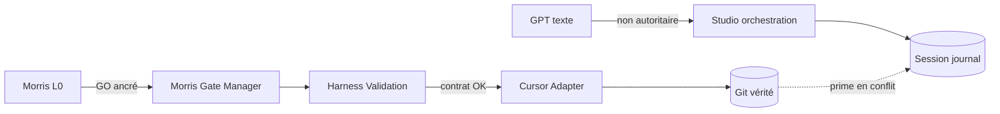

# SFIA Studio — Architecture fonctionnelle OPS1

| Métadonnée | Valeur |
|------------|--------|
| **Document** | `48-ops1-functional-architecture.md` |
| **Cycle** | 3 — Architecture fonctionnelle |
| **Profil** | Standard |
| **Typologie** | POC / ARCHITECTURE FONCTIONNELLE / PRODUIT / DOC |
| **Gate d’ouverture** | `G-OPS1-FUNC-ARCH` — **consommé** |
| **Gate de validation** | `G-OPS1-FUNC-ARCH-VAL` — **consommé** — Morris — 2026-07-20 15:30 CEST |
| **Baseline Git** | `origin/main` @ `b4b9df577a39fe564c3a787a23501786682e1740` |
| **Branche** | `architecture/sfia-studio-ops1-functional` |
| **Statut** | `functional-architecture-validated-with-reservations` — **validé Morris avec réserves** (2026-07-20 15:30 CEST) |
| **Autorité** | Morris (L0) |
| **Décisions** | `OPS1-FA-CAND-01`…`22` **validées** (réserves maintenues) |
| **Horodatage validation Morris** | 2026-07-20 15:30 CEST |
| **Sources** | [`41`](./41-operational-vertical-slice-1-framing.md)–[`47`](./47-ops1-functional-decision-pack.md) |
| **Companions** | [`49`](./49-ops1-functional-components-and-interactions.md) · [`50`](./50-ops1-functional-architecture-decision-pack.md) · UX OPS1 [`51`](./51-ops1-ux-ui-contract.md)–[`53`](./53-ops1-ux-ui-decision-pack.md) (**validés avec réserves**) · Scénario OPS1 [`54`](./54-ops1-operational-scenario.md)–[`56`](./56-ops1-scenario-decision-pack.md) (**validés avec amendements**) |
| **Horodatage production** | 2026-07-20 15:14 CEST |

> Architecture **fonctionnelle** du Vertical Slice Opérationnel 1 — **validée avec réserves** sous `G-OPS1-FUNC-ARCH-VAL` (2026-07-20 15:30 CEST).
> Hérite du cadrage validé (`G-OPS1-FRAMING-VAL`) et de la conception validée avec réserves (`G-OPS1-FUNC-DESIGN-VAL`).
> Décisions `OPS1-FA-CAND-01`…`22` **validées** ; réserves héritées **inchangées**.
> **Aucun** choix de stack, BDD, API, protocole, code, Figma, backlog, delivery, live ou MVP.
> Aucun cycle suivant ouvert automatiquement — voir [`50`](./50-ops1-functional-architecture-decision-pack.md).

---

## 1. Objet, portée et non-objectifs

### Objet

Définir les **domaines**, **composants fonctionnels**, **frontières de responsabilité et d’autorité**, et l’**orchestration** du parcours OPS1, de façon compatible avec CAP-01…21, FR-001…032 et FLOW-01…32.

### Portée

- Architecture fonctionnelle OPS1 uniquement ;
- composants et interactions (détail : doc 49) ;
- décisions candidates (doc 50) ;
- sécurité / RGPD / FinOps / a11y / perf / observabilité **fonctionnelles**.

### Non-objectifs

- Stack, BDD physique, endpoints, protocoles, cloud ;
- code, harness implémentation, packages ;
- écrans Figma / UX visuelle ;
- backlog, delivery, live, MVP ;
- arbitrage des réserves FD-CAND-13/15/20/26 ;
- cartographie exacte des chemins Campus360 (`G-OPS1-SCENARIO-VAL`).

---

## 2. Principes d’architecture fonctionnelle

1. **Conversation-first** — GPT réel et libre ; fixtures = tests uniquement.
2. **Chat ≠ GO** — le texte conversationnel n’autorise jamais une exécution.
3. **Action séparée** — `ProposedAction` est un objet distinct du dialogue.
4. **Morris exclusif** — GO / NO-GO / CORRIGER / ABANDONNER / STOP / clôture.
5. **Harness indépendant** — revalidation fail-closed hors confiance GPT.
6. **Cursor borné** — exécute uniquement un contrat ancré (allowlist + HEAD + hash).
7. **Git vérité** — HEAD, fichiers, diffs ; store de session = journal, pas vérité.
8. **Campus360 + allowlist** — éligibilité ≠ autorisation ; allowlist exhaustive par action.
9. **Fail-closed** — doute sur gate/contrat/sources → STOP ou refus.
10. **Simplicité** — pas de distribution prématurée ; responsabilités distinctes seulement si utiles maintenant.

---

## 3. Vue d’ensemble des domaines fonctionnels

Les domaines ci-dessous sont **logiques**. Ils ne préjugent pas de microservices.

| Domaine | Intention |
|---------|-----------|
| **D1 — Interaction et conversation** | Fil multi-tours, auteurs, clarifications |
| **D2 — Session et contexte** | CycleSession, phases, reprise, condensation |
| **D3 — Sources Git** | Sélection explicite, ancrage, cohérence |
| **D4 — Proposition d’action** | ProposedAction, allowlist, refinement |
| **D5 — Autorisation Morris** | Gates, décisions horodatées |
| **D6 — Validation indépendante** | Harness revalidation, anti double-exec |
| **D7 — Exécution bornée** | Contrat, Cursor, Markdown allowlist |
| **D8 — Preuves et résultats** | Rapports, diffs, EvidenceReference |
| **D9 — Audit et journal** | Traçabilité reconstructible |
| **D10 — FinOps** | Compteurs, alertes, confirmation coût élevé |
| **D11 — Erreurs et STOP** | Fail-closed, priorités STOP/FAILED |

```text
[D1 Conversation] ←→ [D2 Session]
        ↓                    ↓
[D3 Sources Git] ←→ [D4 Action] → [D5 Morris Gate]
                                      ↓
                              [D6 Harness]
                                      ↓
                              [D7 Exécution]
                                      ↓
                    [D8 Preuves] → [D1 post-exec] → [D5 clôture]
                                      ↓
                         [D9 Audit]  [D10 FinOps]  [D11 STOP]
```

---

## 4. Carte des composants fonctionnels

Composants candidats (détail contrats : doc 49) :

| Composant | Domaine principal |
|-----------|-------------------|
| Conversation Workspace | D1 |
| Cycle Session Manager | D2 |
| Context and Source Selector | D2 / D3 |
| Git Truth Adapter (fonctionnel) | D3 |
| Action Proposal Manager | D4 |
| Morris Gate Manager | D5 |
| Harness Validation Boundary | D6 |
| Execution Contract Manager | D7 |
| Cursor Execution Adapter (fonctionnel) | D7 |
| Evidence and Result Collector | D8 |
| Audit Journal | D9 |
| FinOps Guard | D10 |
| Session Persistence Capability | D2 / D9 |
| Error and STOP Coordinator | D11 |

---

## 5. Frontières de responsabilité

| Acteur / capacité | Peut | Ne peut pas |
|-------------------|------|-------------|
| **Morris** | Décider, corriger, stopper, clôturer | Exécuter Cursor à la place du contrat |
| **GPT** | Converser, proposer, analyser (candidat) | Autoriser, exécuter, muter Git |
| **SFIA Studio (UI/orchestration fct)** | Présenter, orchestrer objets, journaliser | Contourner harness ou Morris |
| **Harness** | Revalider, refuser, verrouiller | Décider GO métier |
| **Cursor** | Exécuter contrat allowlisté | Étendre allowlist, remote auto |
| **Git** | Vérité technique/documentaire | Décider |
| **Persistance session** | Journal / reprise | Contredire Git sans STOP |

---

## 6. Frontières de confiance et d’autorité



Règles :

- Contenu fichiers lus = **données non autoritaires** (anti prompt-injection).
- `originKind=real` requis pour preuve opératoire.
- Aucune autorité globale Campus360.

---

## 7. Orchestration nominale OPS1

Chaîne structurante (héritage cadrage) :

```text
Session OPEN
  → conversation libre multi-tours
  → (optionnel) ProposedAction + allowlist
  → ActionGate Morris
  → GO ancré
  → revalidation harness
  → exécution Cursor bornée
  → rapport + preuves
  → conversation post-exécution
  → AnalysisCandidate (optionnel)
  → décision Morris finale
  → CLOSE / CORRECT / RELAUNCH / ABANDON
```

Couverture CAP : CAP-01…21 (voir matrices doc 49).

---

## 8. Orchestration sans action

- Conversation libre (FLOW-03…05) ;
- signal `ACTION_NOT_REQUIRED` possible (CAP-07) ;
- clôture sans exécution admissible ;
- aucune surface d’exécution n’est activée.

---

## 9. Orchestration avec action candidate

1. Action Proposal Manager émet `ProposedAction` + allowlist exhaustive (1..n) ;
2. correction chat ou surface structurée (FLOW-07/08) ;
3. soumission gate (FLOW-10) ;
4. hors allowlist / allowlist vide = refus de soumission.

---

## 10. Gate Morris et revalidation harness

- Morris Gate Manager : GO / NO-GO / CORRIGER / ABANDONNER / STOP (FLOW-11…14).
- GO **porte sur** l’allowlist présentée ; extension post-GO = **interdit** (FR-030).
- Harness Validation Boundary : revalide ancrage (contractHash, HEAD, allowlist) **indépendamment** du texte GPT (FLOW-15/16).
- Échec harness = pas d’exécution.

---

## 11. Exécution Cursor bornée

- Execution Contract Manager fige le contrat (copie allowlist GO).
- Cursor Execution Adapter exécute uniquement les chemins allowlistés.
- Interdits : commit/push/PR/merge auto ; hors allowlist ; hors Campus360 éligible.
- Anti double-exécution sur `contractHash` (FR-010, FLOW-28).

---

## 12. Résultat, preuves et reprise conversationnelle

- Evidence and Result Collector : rapport, diffs consolidés et par fichier (FR-031).
- Rapport incomplet bloque clôture nominale et re-exec même contrat (FR-013).
- Conversation post-exécution **obligatoire** après exécution dans le BeB (FR-019, FLOW-21).

---

## 13. Clôture, consultation et continuation

- `CLOSED` rend la session **immuable** (lecture seule).
- Toute nouvelle activité crée une **continuation liée** (nouvel identifiant + référence explicite à la session source) — **jamais** de réouverture silencieuse.
- Historique source **non muté** ; nouvelle action ⇒ nouveau contrat + nouveau gate.
- Ambiguïté de restauration ⇒ `STOP` / `FAILED` / lecture seule.
- ABANDONED / STOPPED / FAILED **non** auto-rouverts.
- Statut : `FD-CAND-13 — LIFTED: LINKED CONTINUATION, NEVER SILENT REOPEN` (voir [`54`](./54-ops1-operational-scenario.md) §4bis).
- Consultation après CLOSE via reprise lecture (FLOW-02 / CAP-20).

---

## 14. Gestion des erreurs, STOP et fail-closed

| Situation | Comportement |
|-----------|--------------|
| Doute gate/contrat/sources | STOP ou refus (FR-025) |
| STOP | Prioritaire ; freeze exécution |
| FAILED / rapport incomplet | Bloque clôture nominale |
| Timeout | ≠ GO (FR-011) |
| Retry auto coûteux | Interdit (FR-012) |
| Hors allowlist / sans GO | Refus + preuve négative (PN-01, PN-06) |

Error and STOP Coordinator centralise les transitions d’erreur sans créer d’autorité parallèle à Morris.

---

## 15. Gestion fonctionnelle de la persistance

Session Persistence Capability conserve au minimum :

- messages, actions, gates, contrats, rapports, décisions, evidence, FinOps, réserves, timestamps+fuseau, ancrages Git.

Les brouillons UI non confirmés n’ont pas à survivre.

---

## 16. Relation entre store de session et Git

| Besoin | Source de vérité |
|--------|------------------|
| HEAD / fichiers / diffs | **Git** |
| Journal conversationnel / décisions | Store session |
| Conflit | **Git prime** → STOP/lecture seule si ambigu (FR-015) |

Aucune duplication de vérité : le store **référence** Git, il ne le remplace pas.

---

## 17. Sécurité fonctionnelle

- Secrets exclus chat/rapports/logs (FR-024) ;
- sources sélectionnées explicitement (FR-021) ;
- outils allowlistés ; default deny (FR-006) ;
- contenu fichier non autoritaire (FR-016) ;
- séparation d’autorité GPT / Morris / harness / Cursor.

---

## 18. RGPD et minimisation

- Finalité = pilotage POC OPS1 ;
- minimisation des données de session ;
- rétention / export = **OPEN** (hors validation architecture) ;
- **aucun claim** de conformité légale.

---

## 19. FinOps fonctionnel

- Compteurs séparés conversation / structuration / analyse (FR-023) ;
- alerte et confirmation avant coût élevé ;
- seuils numériques = **réserve** (FD-CAND-15) — non arbitrés ici.

---

## 20. Accessibilité fonctionnelle

- Navigation clavier des surfaces (thread, action, gate, rapport) ;
- annonces d’état non purement visuelles ;
- distinction d’auteurs lisible ;
- détail UX visuelle = cycle `G-OPS1-UX` **consommé** — docs [`51`](./51-ops1-ux-ui-contract.md)–[`53`](./53-ops1-ux-ui-decision-pack.md) **validés avec réserves** ; `G-OPS1-UX-VAL` **consommé** (2026-07-20 16:52 CEST) ; réserves UX-R01…UX-R04 maintenues.

---

## 21. Performance perçue

- Feedback d’état pendant appels / exécution ;
- timeouts visibles ;
- reprise sans perte de journal ;
- **pas de SLA inventé**.

---

## 22. Observabilité et auditabilité

Corrélations minimales : `sessionId`, `messageId`, `actionId`, `contractHash`, `originKind`, timestamps+fuseau.

Audit Journal reconstruit l’historique (CAP-21).

---

## 23. Dépendances vers UX, architecture technique et backlog

| Vers | Contenu routé | Gate |
|------|---------------|------|
| UX/UI | Surfaces, Figma, microcopy visuelle | `G-OPS1-UX` + `G-OPS1-UX-VAL` **consommés** — docs `51`–`53` **validés avec réserves** (UX-R01…UX-R04) |
| Architecture technique | Stack, BDD, API, protocole, isolation OS/réseau | `G-OPS1-TECH-ARCH` (fermé) |
| Scénario | Cartographie / allowlist / branche / continuation | Docs `54`–`56` **validés avec amendements** — `GO G-OPS1-SCENARIO-VAL — VALIDATION AVEC AMENDEMENTS — 2026-07-20 18:34:47 CEST` ; FD-CAND-13/20/26 levées (périmètre OPS1) |
| Backlog | Découpage I1–I7 opérationnel | `G-OPS1-BACKLOG` (fermé) |

Aucune ouverture automatique.

---

## 24. Réserves héritées (OPEN — non arbitrées)

- FD-CAND-13 — **levée** (continuation liée) ;
- FD-CAND-15 — FinOps numériques — **maintenue** jusqu’au gate FinOps/live ;
- FD-CAND-20 — **levée pour OPS1** (1..n explicite, pas de wildcard) ;
- FD-CAND-26 — **levée pour Campus360 OPS1** (`03` protégé par défaut) ;
- convention de branche Campus360 ;
- preuve GPT live / Cursor live ;
- CI distante ;
- isolation OS/réseau.

---

## 25. Critères de validation (`G-OPS1-FUNC-ARCH-VAL`) — satisfaits

Confirmés sous validation Morris (2026-07-20 15:30 CEST) :

1. Domaines D1–D11 et 14 composants couvrent CAP-01…21 ;
2. FLOW-01…32 rattachés à des composants ;
3. FR-001…032 rattachées à des frontières ;
4. Autorité Morris / harness / Cursor intacte ;
5. Git / session sans double vérité ;
6. Réserves listées et **non** résolues silencieusement ;
7. Aucun choix technique implicite ;
8. Aucun claim MVP / production / READY FOR DELIVERY.

---

## 26. Verdict

`functional-architecture-validated-with-reservations`

`SFIA STUDIO OPS1 FUNCTIONAL ARCHITECTURE VALIDATED WITH RESERVATIONS`

Gate `G-OPS1-FUNC-ARCH` consommé — 2026-07-20 15:14 CEST.
Gate `G-OPS1-FUNC-ARCH-VAL` **consommé** — Morris — 2026-07-20 15:30 CEST.
11 domaines D1–D11 retenus ; 14 composants fonctionnels retenus ; frontières Morris / GPT / harness / Cursor / Git / persistance retenues ; couverture CAP/FLOW/FR confirmée.
Réserves : FD-CAND-13/20/26 **levées** (OPS1) ; FD-CAND-15 **maintenue** ; UX-R01…R04 **maintenues** ; isolation/CI **routées** vers tech-arch (non conçues ici) ; live **fermé**.
UX : docs `51`–`53` validés avec réserves. Scénario : docs `54`–`56` **validés avec amendements** (`G-OPS1-SCENARIO-VAL` consommé). Architecture technique, backlog, delivery, live et MVP : **fermés**.
