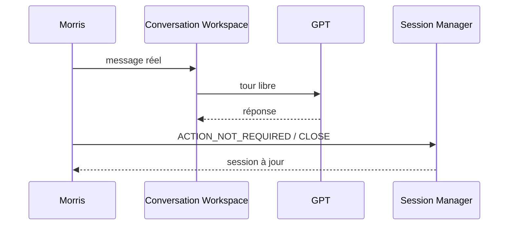
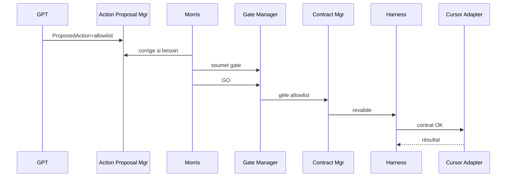
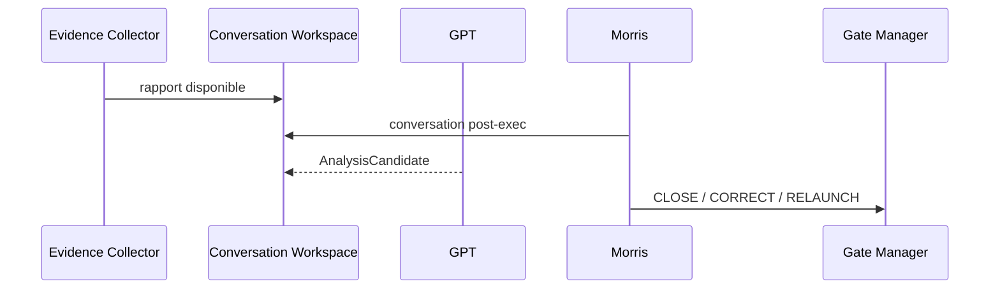
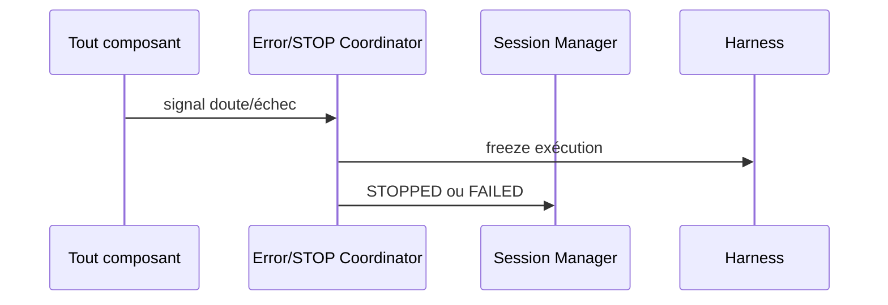
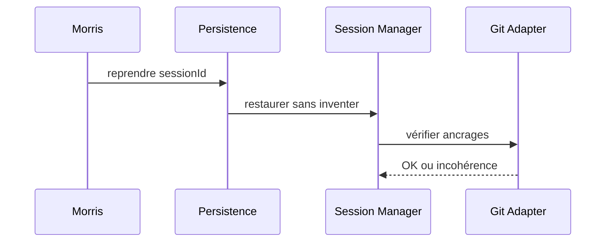
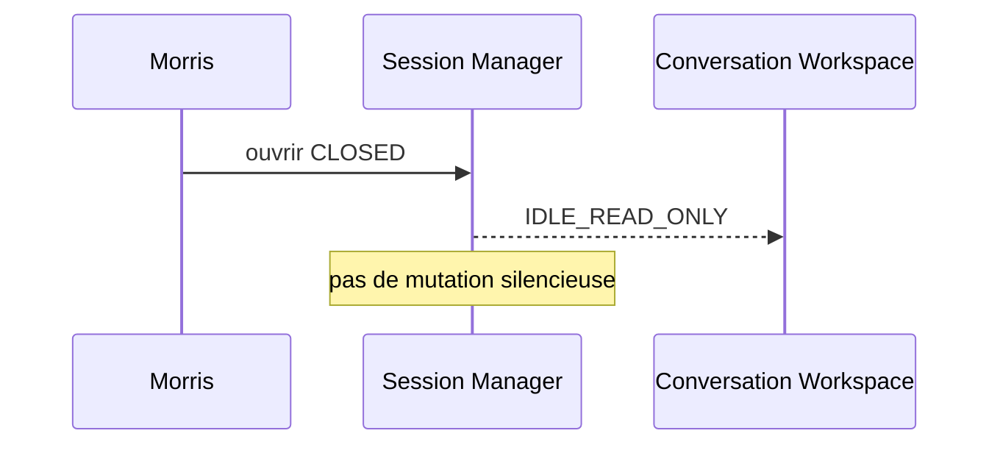

# SFIA Studio — Composants et interactions fonctionnelles OPS1

| Métadonnée | Valeur |
|------------|--------|
| **Document** | `49-ops1-functional-components-and-interactions.md` |
| **Cycle** | 3 — Architecture fonctionnelle |
| **Profil** | Standard |
| **Gate d’ouverture** | `G-OPS1-FUNC-ARCH` — consommé |
| **Gate de validation** | `G-OPS1-FUNC-ARCH-VAL` — fermé |
| **Baseline Git** | `origin/main` @ `b4b9df577a39fe564c3a787a23501786682e1740` |
| **Branche** | `architecture/sfia-studio-ops1-functional` (locale — aucun push) |
| **Statut** | `functional-architecture-candidate` — **CANDIDATE — MORRIS VALIDATION REQUIRED** |
| **Companion** | [`48`](./48-ops1-functional-architecture.md) · [`50`](./50-ops1-functional-architecture-decision-pack.md) |
| **Horodatage** | 2026-07-20 15:14 CEST |

> Contrats fonctionnels des composants OPS1.  
> **Aucun** framework, endpoint, table, queue ou protocole imposé.

---

## 1. Convention de description

Pour chaque composant :

- raison d’être · responsabilités · exclusions · données · événements in/out · décisions autorisées/interdites · interactions · erreurs · preuves · transverses.

Challenge (rappel) : utile maintenant ? responsabilité distincte ? dette ? plus simple ? repo-first ? gate Morris ? frontière fct vs tech prématuré ?

---

## 2. Catalogue des composants

### 2.1 Conversation Workspace

| Élément | Contenu |
|---------|---------|
| **Raison** | Surface de dialogue réel multi-tours (CAP-03…05) |
| **Responsabilités** | Afficher/éditer le fil ; distinguer auteurs ; transmettre messages `originKind=real` |
| **Exclusions** | Autoriser exécution ; modifier Git ; figer un script de preuve |
| **Données** | `ConversationMessage[]` ; auteur ; timestamp+TZ |
| **In** | Message Morris ; réponse GPT ; événements système |
| **Out** | Message émis ; demande de clarification |
| **Autorisé** | Converser librement |
| **Interdit** | Traiter le chat comme GO |
| **Interactions** | Cycle Session Manager ; Action Proposal Manager (lecture contexte) |
| **Erreurs** | Source GPT indisponible → signal Error/STOP Coordinator |
| **Preuves** | Fil non scénarisé consultable |
| **Transverses** | A11y thread ; FinOps compteur conversation ; secrets exclus |

### 2.2 Cycle Session Manager

| Élément | Contenu |
|---------|---------|
| **Raison** | Agrégat `CycleSession` et couches d’état (CAP-01,02,19,20) |
| **Responsabilités** | OPEN/CLOSE/ABANDON/STOP/FAILED ; phases conversationnelles ; reprise |
| **Exclusions** | Exécuter Cursor ; décider GO |
| **Données** | `CycleSession` ; 4 couches d’état |
| **In** | Ouverture ; décisions Morris ; STOP ; fin d’exécution |
| **Out** | Transitions d’état ; session lecture seule |
| **Autorisé** | Appliquer transitions conformes FR |
| **Interdit** | Muter une session CLOSED ; autoriser exécution |
| **Interactions** | Tous les composants via état de session |
| **Erreurs** | Ambiguïté reprise → STOPPED/FAILED/read-only |
| **Preuves** | Journal d’états horodaté |
| **Transverses** | Observabilité `sessionId` |

### 2.3 Context and Source Selector

| Élément | Contenu |
|---------|---------|
| **Raison** | Contexte utile + sources Git explicites (CAP-04,06 ; FR-014,021) |
| **Responsabilités** | Maintenir `ConversationContext` ; sélectionner `SourceReference[]` |
| **Exclusions** | Ingest automatique du dépôt entier ; décision Morris |
| **Données** | Contexte condensé ; liste sources |
| **In** | Choix Morris ; condensation explicite |
| **Out** | Contexte mis à jour ; sources sélectionnées |
| **Autorisé** | Condensation contrôlée et explicite |
| **Interdit** | Inventer du contexte à la reprise |
| **Interactions** | Git Truth Adapter ; Conversation Workspace |
| **Erreurs** | Source incohérente → FLOW-30 / STOP |
| **Preuves** | Trace des sources sélectionnées |
| **Transverses** | Minimisation RGPD |

### 2.4 Git Truth Adapter (fonctionnel)

| Élément | Contenu |
|---------|---------|
| **Raison** | Exposer HEAD/fichiers/diffs comme vérité (FR-015) |
| **Responsabilités** | Fournir ancrages `baseSha`/`headSha` ; diffs ; existence chemins |
| **Exclusions** | Commit/push/PR ; politique de branche (→ SCENARIO-VAL) |
| **Données** | SHA ; chemins ; diffs |
| **In** | Requête d’ancrage ; chemins allowlist |
| **Out** | Snapshot vérité ; erreur incohérence |
| **Autorisé** | Lire vérité Git |
| **Interdit** | Muter remote ; autoriser action |
| **Interactions** | Harness ; Evidence Collector ; Context Selector |
| **Erreurs** | Indisponibilité → FLOW-30 |
| **Preuves** | SHA ancrés dans contrats/rapports |
| **Transverses** | Audit |

### 2.5 Action Proposal Manager

| Élément | Contenu |
|---------|---------|
| **Raison** | Objet action séparé du chat (CAP-08,09 ; FR-003,026…032) |
| **Responsabilités** | Créer/corriger/retirer `ProposedAction` ; allowlist exhaustive 1..n |
| **Exclusions** | GO ; exécution ; autorisation globale Campus360 |
| **Données** | ProposedAction ; allowlist consult/create/modify |
| **In** | Proposition GPT ; corrections Morris |
| **Out** | Candidat prêt pour gate ; ACTION_NOT_REQUIRED ; withdrawn |
| **Autorisé** | Structurer l’intention d’action |
| **Interdit** | Exécuter ; étendre allowlist après GO |
| **Interactions** | Conversation Workspace ; Morris Gate Manager |
| **Erreurs** | Allowlist vide → refus soumission |
| **Preuves** | Panneau action ≠ bulle chat (PN-05) |
| **Transverses** | FinOps structuration |

### 2.6 Morris Gate Manager

| Élément | Contenu |
|---------|---------|
| **Raison** | Autorité exclusive Morris (CAP-10…12,18 ; FR-004,017) |
| **Responsabilités** | Ouvrir gate ; enregistrer GO/NO-GO/CORRIGER/ABANDONNER/STOP/clôture |
| **Exclusions** | Revalidation technique (harness) ; exécution |
| **Données** | `ActionGate` ; `MorrisDecision` + TZ |
| **In** | Soumission action ; choix Morris |
| **Out** | Décision ancrée (allowlist gelée si GO) |
| **Autorisé** | Toute décision métier OPS1 |
| **Interdit** | Déléguer GO à GPT |
| **Interactions** | Action Proposal ; Harness ; Session Manager |
| **Erreurs** | Gate incomplet → pas de GO |
| **Preuves** | Décision horodatée consultable |
| **Transverses** | A11y panneau gate |

### 2.7 Harness Validation Boundary

| Élément | Contenu |
|---------|---------|
| **Raison** | Contrôle indépendant avant exécution (CAP-13 ; FR-005,025) |
| **Responsabilités** | Revalider contrat ; default deny ; anti double-exec |
| **Exclusions** | Décision métier Morris |
| **Données** | Résultat revalidation ; verrou `contractHash` |
| **In** | Contrat candidat post-GO |
| **Out** | OK / refus fail-closed |
| **Autorisé** | Bloquer exécution |
| **Interdit** | Accorder GO |
| **Interactions** | Execution Contract Manager ; Cursor Adapter |
| **Erreurs** | Refus → FLOW-16 ; tentative hors GO → PN-01 |
| **Preuves** | Journal de revalidation |
| **Transverses** | Sécurité fail-closed |

### 2.8 Execution Contract Manager

| Élément | Contenu |
|---------|---------|
| **Raison** | Figer le contrat d’exécution (FR-005,030) |
| **Responsabilités** | Copier allowlist GO ; produire `ExecutionContract` + hash |
| **Exclusions** | Modifier allowlist post-GO ; remote |
| **Données** | ExecutionContract |
| **In** | Décision GO |
| **Out** | Contrat pour harness/Cursor |
| **Autorisé** | Ancrer |
| **Interdit** | Ajouter chemins après GO |
| **Interactions** | Gate Manager ; Harness ; Cursor Adapter |
| **Erreurs** | Incohérence hash → STOP |
| **Preuves** | ContractHash dans journal |
| **Transverses** | Observabilité |

### 2.9 Cursor Execution Adapter (fonctionnel)

| Élément | Contenu |
|---------|---------|
| **Raison** | Exécuter Markdown borné (CAP-14 ; FR-007,028,029) |
| **Responsabilités** | Appliquer contrat allowlisté localement |
| **Exclusions** | Commit/push/PR/merge auto ; hors allowlist |
| **Données** | Résultat d’exécution brut |
| **In** | Contrat revalidé |
| **Out** | Succès / échec / timeout |
| **Autorisé** | Mutations fichiers allowlistés |
| **Interdit** | Effets distants ; extension allowlist |
| **Interactions** | Harness ; Evidence Collector ; Git Adapter |
| **Erreurs** | FLOW-19 ; timeout ≠ GO |
| **Preuves** | PN-03 remote auto absent |
| **Transverses** | FinOps exécution si compteur distinct |

### 2.10 Evidence and Result Collector

| Élément | Contenu |
|---------|---------|
| **Raison** | Rapport et preuves (CAP-15 ; FR-013,031) |
| **Responsabilités** | `ExecutionReport` ; diffs consolidés + par fichier ; `EvidenceReference` |
| **Exclusions** | Clôturer automatiquement |
| **Données** | Rapport ; evidence |
| **In** | Résultat Cursor ; SHA |
| **Out** | Rapport disponible / incomplet |
| **Autorisé** | Bloquer clôture si incomplet |
| **Interdit** | Masquer un fichier allowlist |
| **Interactions** | Cursor Adapter ; Conversation (post-exec) ; Audit |
| **Erreurs** | Rapport incomplet → blocage |
| **Preuves** | Evidence consultables |
| **Transverses** | Audit |

### 2.11 Audit Journal

| Élément | Contenu |
|---------|---------|
| **Raison** | Histoire reconstructible (CAP-21 ; FR-017) |
| **Responsabilités** | Journaliser décisions, états, originKind, corrélations |
| **Exclusions** | Décider |
| **Données** | Entrées d’audit |
| **In** | Événements de tous composants |
| **Out** | Historique consultable |
| **Autorisé** | Append-only fonctionnel |
| **Interdit** | Réécrire l’histoire sans trace |
| **Interactions** | Session Persistence ; tous |
| **Erreurs** | Échec journal → fail-closed si critique |
| **Preuves** | CAP-21 |
| **Transverses** | Observabilité ; RGPD minimisation |

### 2.12 FinOps Guard

| Élément | Contenu |
|---------|---------|
| **Raison** | Budgets fonctionnels (FR-023 ; FD-CAND-15 OPEN) |
| **Responsabilités** | Compteurs conv/struct/analyse ; alerte ; confirmation coût élevé |
| **Exclusions** | Fixer seuils numériques (réserve) |
| **Données** | `FinOpsUsage` |
| **In** | Appels / étapes coûteuses |
| **Out** | Alerte ; demande confirmation |
| **Autorisé** | Bloquer étape coûteuse sans confirmation |
| **Interdit** | Inventer des plafonds « validés » |
| **Interactions** | Conversation ; Action ; Analysis |
| **Erreurs** | Dépassement → FLOW-29 |
| **Preuves** | Compteurs consultables |
| **Transverses** | FinOps |

### 2.13 Session Persistence Capability

| Élément | Contenu |
|---------|---------|
| **Raison** | Survie journal / reprise (CAP-02,20) |
| **Responsabilités** | Persister objets session ; restaurer sans inventer |
| **Exclusions** | Remplacer Git comme vérité |
| **Données** | Snapshot session |
| **In** | Mutations session |
| **Out** | Session restaurée |
| **Autorisé** | Reprise lecture / continuation selon état |
| **Interdit** | Contredire Git sans STOP |
| **Interactions** | Session Manager ; Audit ; Git Adapter |
| **Erreurs** | Ambiguïté → read-only/STOP |
| **Preuves** | Reprise démontrable |
| **Transverses** | RGPD ; perf perçue |

### 2.14 Error and STOP Coordinator

| Élément | Contenu |
|---------|---------|
| **Raison** | Priorité STOP/FAILED (CAP-12 ; FR-011,012,025) |
| **Responsabilités** | Centraliser STOP ; timeouts ; refus ; freeze exécution |
| **Exclusions** | Remplacer Morris pour clôture métier |
| **Données** | Codes d’erreur fonctionnels |
| **In** | Signaux d’échec de tout composant |
| **Out** | Transition STOPPED/FAILED ; messages |
| **Autorisé** | Préempter l’exécution |
| **Interdit** | Accorder GO |
| **Interactions** | Session Manager ; Harness ; Gate Manager |
| **Erreurs** | N/A (est le gestionnaire) |
| **Preuves** | PN-01…06 journalisées |
| **Transverses** | Sécurité ; a11y erreurs |

---

## 3. Matrices

### 3.1 Composants × acteurs

| Composant | Morris | GPT | Studio | Harness | Cursor | Git |
|-----------|:------:|:---:|:------:|:-------:|:------:|:---:|
| Conversation Workspace | R/W | W | orch | — | — | — |
| Cycle Session Manager | décide états | — | orch | signal | signal | ancre |
| Context/Source Selector | choisit | lit ctx | orch | — | — | lit |
| Git Truth Adapter | — | — | lit | lit | lit | **vérité** |
| Action Proposal Manager | corrige | propose | orch | — | — | — |
| Morris Gate Manager | **décide** | — | présente | — | — | — |
| Harness Validation | — | — | — | **décide tech** | — | lit |
| Execution Contract Mgr | ancré par GO | — | orch | lit | lit | ancre |
| Cursor Adapter | — | — | — | autorise | **exécute** | écrit local |
| Evidence Collector | consulte | — | orch | — | fournit | diffs |
| Audit Journal | consulte | — | écrit | écrit | écrit | — |
| FinOps Guard | confirme | — | orch | — | — | — |
| Session Persistence | — | — | lit/écrit | — | — | ref |
| Error/STOP Coordinator | STOP | — | orch | refuse | stop | — |

### 3.2 Composants × objets

| Objet | Propriétaire fonctionnel principal |
|-------|-----------------------------------|
| CycleSession | Cycle Session Manager |
| ConversationMessage / Context | Conversation Workspace / Context Selector |
| SourceReference | Context and Source Selector |
| ProposedAction | Action Proposal Manager |
| ActionGate / MorrisDecision | Morris Gate Manager |
| ExecutionContract | Execution Contract Manager |
| ExecutionReport / EvidenceReference | Evidence and Result Collector |
| AnalysisCandidate | Conversation Workspace + Gate (jamais auto-CLOSE) |
| FinOpsUsage | FinOps Guard |
| Reservation | Session Manager (porte) / Audit |

### 3.3 Composants × FLOW-01…32 (couverture)

| FLOW | Composants clés |
|------|-----------------|
| 01–02 | Session Manager ; Persistence ; Context |
| 03–05 | Conversation Workspace |
| 06–09 | Action Proposal Manager |
| 10–14 | Morris Gate Manager ; Error/STOP |
| 15–17 | Harness ; Contract Manager ; Error/STOP |
| 18–19 | Cursor Adapter ; Evidence ; Error/STOP |
| 20–23 | Evidence ; Conversation ; Action (nouveau gate) |
| 24–26 | Gate Manager ; Session Manager |
| 27 | Persistence ; Session Manager |
| 28 | Harness ; Contract Manager |
| 29 | FinOps Guard |
| 30 | Git Truth Adapter ; Error/STOP |
| 31 | Context ; Harness ; Error/STOP |
| 32 | Tous (scénario Campus360 capacités) |

### 3.4 Matrice d’autorité (rappel)

| Décision | Autorité |
|----------|----------|
| Contenu conversation | Morris + GPT (libre) |
| GO exécution | **Morris seul** |
| Revalidation contrat | **Harness** |
| Mutation fichiers | **Cursor** sous contrat |
| Vérité HEAD/diff | **Git** |
| Clôture / continuation | **Morris** (mécanisme continuation OPEN) |

---

## 4. Séquences (Mermaid)

### 4.1 Conversation sans action

### 4.2 Action → gate → harness → exécution

### 4.3 Post-exécution → analyse → décision

### 4.4 STOP / FAILED

### 4.5 Reprise de session

### 4.6 Consultation après CLOSE

---

## 5. Routage UX / architecture technique

### Vers UX (`G-OPS1-UX` — fermé)

- Layout thread / panneau action / gate / rapport ;
- Figma, microcopy visuelle, focus states détaillés ;
- composants UI concrets.

### Vers architecture technique (`G-OPS1-TECH-ARCH` — fermé)

- Stack, BDD, API, protocole, filesystems ;
- isolation OS/réseau, CI distante ;
- choix modèle GPT définitif ;
- implémentation harness/Cursor.

---

## 6. Couverture CAP / FR (synthèse)

| CAP | Composant(s) |
|-----|--------------|
| 01–02,19–20 | Session Manager ; Persistence |
| 03–05 | Conversation Workspace |
| 04,06 | Context/Source Selector |
| 07–09 | Action Proposal Manager |
| 10–12,18 | Morris Gate Manager ; Error/STOP |
| 13 | Harness |
| 14 | Contract Mgr ; Cursor Adapter |
| 15–16 | Evidence ; Conversation |
| 17 | Conversation + Gate (candidateOnly) |
| 21 | Audit Journal |

| FR packs | Frontière |
|----------|-----------|
| 001–003,018–019,022 | Conversation / Action séparées |
| 004,017 | Morris Gate |
| 005–006,008–010,025–032 | Harness + Contract + Allowlist |
| 007 | Cursor + politique no remote |
| 011–013 | Error/STOP + Evidence |
| 014–016,021 | Context + Git |
| 020 | Analysis candidateOnly |
| 023–024 | FinOps + Sécurité |

---

## 7. Verdict candidat

`functional-architecture-candidate`

Composants et interactions **candidats** — validation Morris requise (`G-OPS1-FUNC-ARCH-VAL`).
Aucun choix technique. Réserves héritées **non arbitrées**.
