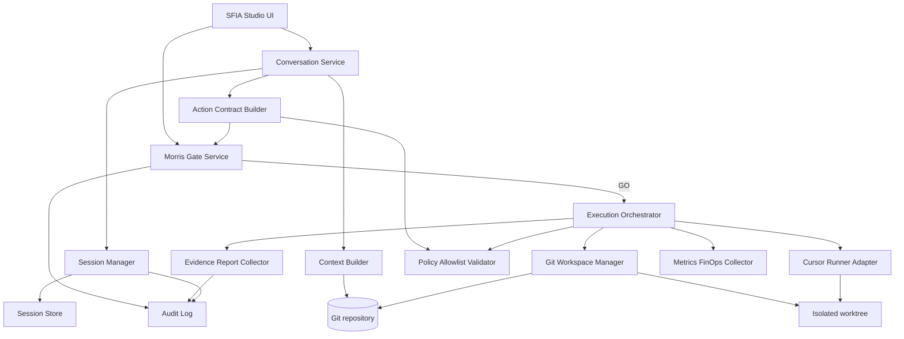
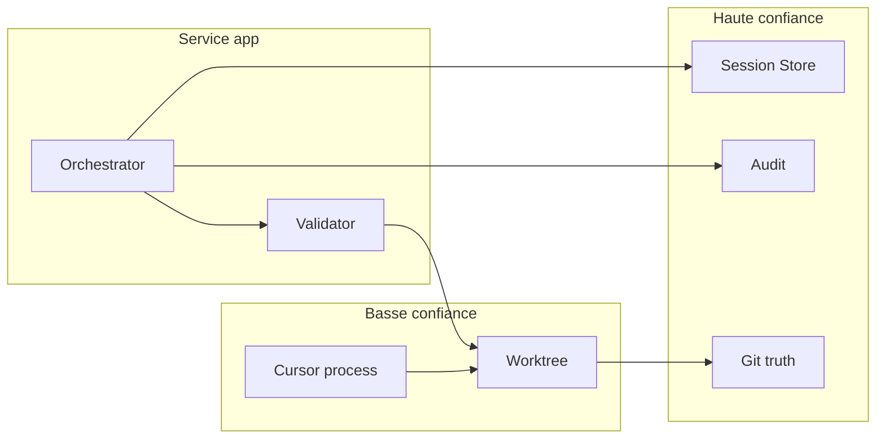
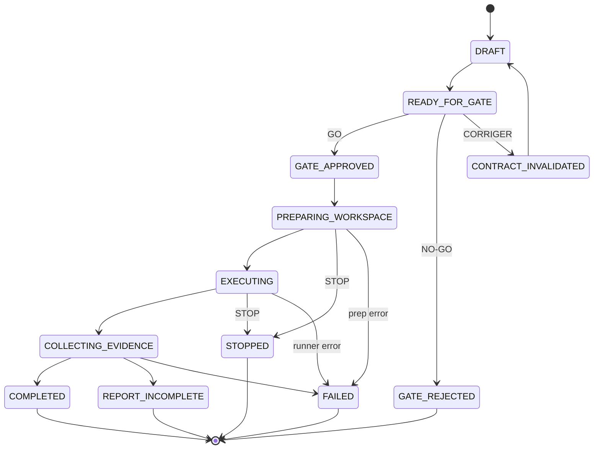

# SFIA Studio — Composants, sécurité et runtime OPS1 (validé avec amendements)

| Métadonnée | Valeur |
|------------|--------|
| **Document** | `58-ops1-technical-components-security-and-runtime.md` |
| **Cycle** | 6 — Architecture technique |
| **Profil** | Standard |
| **Statut** | `technical-runtime-validated-with-amendments` — **validé avec amendements** (2026-07-20 19:17:11 CEST) |
| **Gate validation** | `G-OPS1-TECH-ARCH-VAL` — **consommé** — `GO G-OPS1-TECH-ARCH-VAL — VALIDATION AVEC AMENDEMENTS — 2026-07-20 19:17:11 CEST` |
| **Companion** | [`57`](./57-ops1-technical-architecture.md) · [`59`](./59-ops1-technical-architecture-decision-pack.md) |
| **Baseline** | `origin/main` @ `ac2bcbf52e6170668e1a5cc0071c572026938635` |
| **Branche** | `design/sfia-studio-ops1-technical-architecture` |
| **Horodatage** | 2026-07-20 18:55:53 CEST |

> Composants, runtime et sécurité **validés avec amendements** sous `GO G-OPS1-TECH-ARCH-VAL — VALIDATION AVEC AMENDEMENTS — 2026-07-20 19:17:11 CEST`.
> Worktree = isolation Git OPS1 (**pas** sandbox OS forte) · stockage SQLite opérationnel + fichiers append-only · CI clarifiée.

---

## 1. Diagramme de composants



---

## 2. Matrice composants / responsabilités

| Composant | Responsabilités | Interdit |
|-----------|-----------------|----------|
| UI | Afficher états, gate, rapports | Créer GO implicite |
| Conversation Service | Dialogue GPT réel | Autoriser exécution |
| Session Manager | OPEN/CLOSE/continuation | Muter CLOSED |
| Context Builder | Contexte sélectionné | Lire secrets |
| Action Contract Builder | Contrat + hash | Exécuter |
| Morris Gate Service | Journaliser décision | Auto-GO |
| Execution Orchestrator | Enchaîner post-GO | Élargir allowlist |
| Git Workspace Manager | Worktree/branche | Push remote |
| Cursor Runner Adapter | Exécuter borné | Shell libre / réseau |
| Policy Validator | Paths, deny, symlinks | Accepter wildcard |
| Evidence Collector | Diffs + contrôles sortie | COMPLETED si incomplete |
| Audit Log | Append-only (fichiers immuables / export) | Effacer preuves |
| Session Store | SQLite opérationnel (états/locks/tentatives) | Contredire Git ; servir d’état concurrent via fichiers seuls |
| FinOps Collector | Compteurs/alertes | Inventer seuils |

---

## 3. Matrice flux / données / contrôles

| Étape | Données | Contrôle |
|-------|---------|----------|
| Chat | Messages | Session active |
| Contrat | Allowlist, SHA | Canonicalisation + hash |
| Gate | Motif, décision | Morris L0 |
| Prépare WS | baseHeadSha | Worktree propre |
| Exécute | Patches | Revalidate HEAD+hash+allowlist |
| Sortie | Diff | Check allowlist/secrets/diff-check |
| Rapport | Artefacts | Couverture 1..n |
| Clôture | Summary | Immutabilité |

---

## 4. Trust boundaries (rappel opérationnel)



Réseau et GitHub distant : **hors trust** pour OPS1 (bloqués).

**Amendement 1 :** le worktree est en **basse confiance** pour l’exécution ; l’isolation Git ne suffit pas — les contrôles runner sont obligatoires.

---

## 5. Modèle de déploiement candidat

```text
Developer workstation (macOS)
  ├─ SFIA Studio app (local)
  ├─ Session Store (SQLite opérationnel) + Audit (fichiers append-only)
  ├─ Git clone (sfia-workspace) — vérité documentaire
  └─ Isolated worktrees under .sfia-exec/<executionId>/
       └─ Cursor runner (CWD borné · env filtré · no credentials · no network · no remote git)
```

Pas de cloud obligatoire. Pas de daemon industrialisé requis pour la preuve OPS1. Worktree = isolation Git, **pas** sandbox OS forte.

---

## 6. Stratégie workspace & Git (Amendement 1)

| Règle | Contenu validé avec amendements |
|-------|--------------------------------|
| Isolation Git | Worktree dédié — **pas** une sandbox OS forte |
| Racine exécution | Répertoire dédié hors working tree principal |
| Création | `git worktree add` depuis `baseHeadSha` |
| Branche | `scenario/campus360-<slug>-<id>` |
| Runner complémentaire | CWD borné · env filtré · credentials absents · réseau off · remote Git refusé · contrôles pré/post |
| Écriture | Uniquement chemins allowlistés après `realpath` |
| Symlink | Refus si cible hors racine workspace |
| Remote | Wrapper refusant push/fetch write/PR/merge |
| Conteneur | Trajectoire candidate avant élargissement hors OPS1 |
| Cleanup | GO Morris distinct ; preuves d’abord |

---

## 7. Stockage hybride (Amendement 2)

| Couche | Rôle |
|--------|------|
| Documents projet | **Git** — vérité documentaire |
| **SQLite** | Source **opérationnelle** : sessions, états, locks, idempotence, tentatives, index, corrélations |
| **Fichiers append-only** | Artefacts **immuables** : contrats gelés, décisions gate, rapports, diffs, preuves, journaux exportables |
| Cloud DB | **Hors** OPS1 |

SQLite ≠ remplacement de Git. Append-only ≠ source d’état concurrente.

---

## 8. Machine d’état (validée avec amendements)



### Amendement 3 — Tentatives

- `contractHash` = contrat immuable ; `executionAttemptId` = tentative unique.
- Une seule tentative **active** par contrat ; aucun retry auto.
- Nouvelle tentative = décision Morris explicite ; tentatives antérieures conservées.
- `REPORT_INCOMPLETE` : pas de COMPLETED silencieux ; pas de relance auto.
- Verrouillage : lock sur (`contractHash`, tentative active) pendant PREPARING/EXECUTING.

---

## 9. Gestion des erreurs

| Situation | État | Suite |
|-----------|------|-------|
| Validation path | CONTRACT_INVALIDATED / FAILED | Nouveau contrat |
| HEAD drift | FAILED | Nouveau gate |
| Cursor crash | FAILED | Analyse candidate ; décision Morris |
| Contrôle sortie KO | REPORT_INCOMPLETE ou FAILED | Pas COMPLETED |
| STOP | STOPPED | Preuves gardées |
| Store unavailable | FAILED | Fail-closed |

---

## 10. Contrôles de sécurité runtime

1. Canonical path + prefix check.
2. Deny `..`, absolus hors root, symlinks sortants.
3. Allowlist exacte post-résolution.
4. Env allowlist ; pas de tokens GitHub dans runner.
5. Network default deny.
6. Git subcommand allowlist (status/diff/add local only si besoin) — **pas** push.
7. Timeout runner.
8. Scan secrets pré/post.
9. Revalidation HEAD+hash pré-exec.
10. Seal report + audit event.

---

## 11. Observabilité

Corrélation : `sessionId` · `contractId` · `contractHash` · `executionAttemptId` · `parentSessionId`.
Horodatage avec fuseau. Export consultation Morris. Pas de secret dans logs.

---

## 12. CI — trajectoire (Amendement 4)

| Phase | Contrôles | Périmètre |
|-------|-----------|-----------|
| **Socle (local)** | Schéma contrat, hash, HEAD, allowlist, chemins, symlinks, secrets, `git diff --check`, format rapport | Dès implémentation du socle |
| **Intégration / DevOps (PR)** | Lint MD, liens, refs docs, statuts/gates, fichiers protégés, format preuves, tests négatifs automatisables | Cycle distinct |
| **Hors scope** | Pipeline delivery, déploiement, release, production | Fermé |

Pas de claim « FULL CI IMPLEMENTED ». FinOps seuils : OPEN (FD-CAND-15).

---

## 13. Options comparées (rappel)

| Thème | Options | Reco candidate |
|-------|---------|----------------|
| Isolation | Worktree / Conteneur / VM | Worktree (= isolation Git) + contrôles runner ; conteneur = trajectoire |
| Stockage | SQLite ops / fichiers append-only / SGBD cloud | SQLite ops + fichiers append-only |
| Hash | SHA-256 / autre | SHA-256 |
| Réseau | Deny / allowlist limitée | Deny |
| Cleanup | Manuel GO / auto | Manuel GO |

---

## 14. Risques et mitigations (complément)

Voir [`57`](./57-ops1-technical-architecture.md) §14. Dette : worktree ≠ sandbox OS forte ; CI PR non branchée ici ; FinOps numériques OPEN ; UX-R01…R04 hors scope runtime.

---

## 15. Anti-claims

Pas de READY FOR IMPLEMENTATION · STACK FINALIZED · LIVE READY · PRODUCTION READY · SANDBOX STRONG ISOLATION · FULL CI IMPLEMENTED.

---

## 16. Verdict

`technical-runtime-validated-with-amendments`

`GO G-OPS1-TECH-ARCH-VAL — VALIDATION AVEC AMENDEMENTS — 2026-07-20 19:17:11 CEST`

Composants / runtime validés avec amendements. Stack non finalisée. Backlog / delivery / live fermés.
