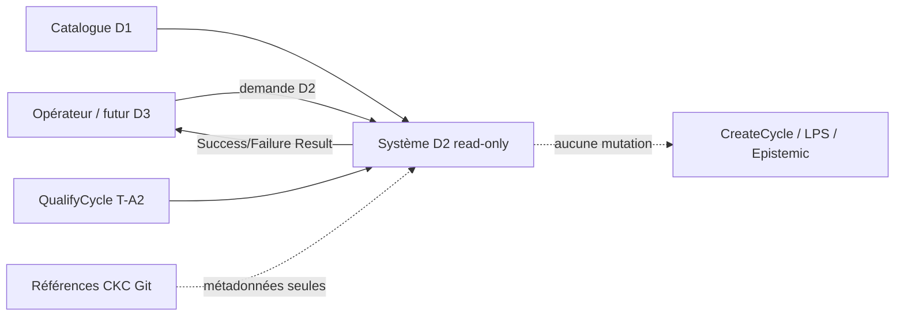
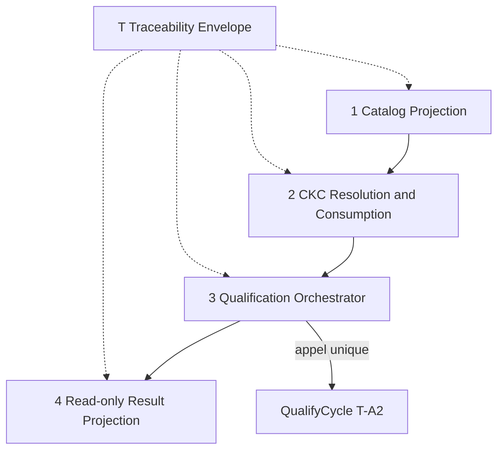
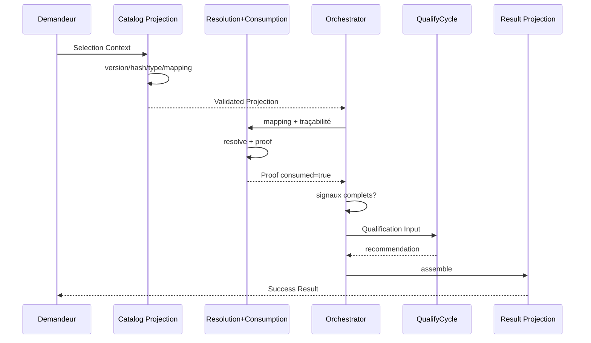
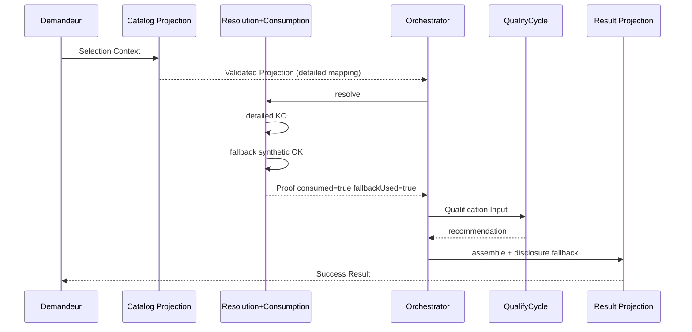
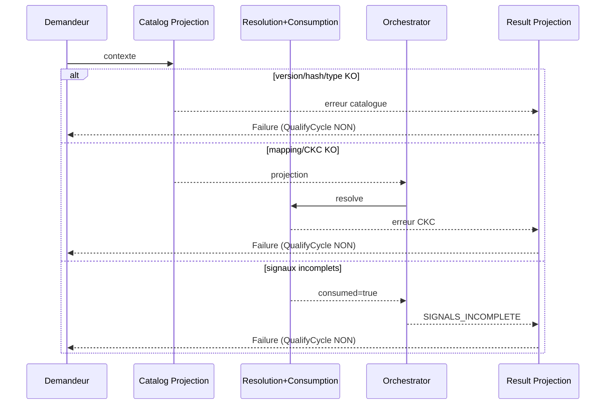
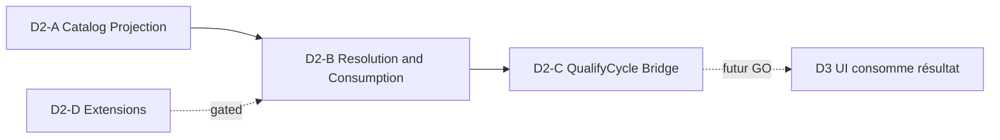

# 17 — V3.1-D2 CKC Resolver & QualifyCycle Bridge — Architecture fonctionnelle

## A. Métadonnées

| Champ | Valeur |
|-------|--------|
| **Date/heure/fuseau** | 2026-08-01 15:20:47 CEST (+0200) |
| **Cycle projet** | 3 — Architecture fonctionnelle |
| **Profil SFIA** | **Critical** |
| **Typologie** | DOC |
| **Gate Morris** | Formulation : « ok go architecture fonctionnelle D2 » — 2026-08-01 15:13 CEST (+0200) |
| **Branche** | `framing/sfia-studio-v3-1-d2-ckc-resolver-cadrage` |
| **Base** | `main` @ `e1befcb80ed5e3c789a7de9036a8207d6b3e6771` |
| **CKC** | Fallback : carte synthétique + §4.3 · method-candidate · `executionAuthority=false` |
| **Statut** | `FUNCTIONAL ARCHITECTURE ADOPTED — TECHNICAL ARCHITECTURE AUTHORIZED — NO DELIVERY — D3 NOT OPENED` |
| **Doc 15** | **strictement inchangé** |
| **Doc technique** | [`18-v3-1-d2-ckc-resolver-qualify-cycle-bridge-technical-architecture.md`](./18-v3-1-d2-ckc-resolver-qualify-cycle-bridge-technical-architecture.md) |
| **Code / UI / D3 / CreateCycle** | **non** |

## B. Gate Morris et autorité

**Autorisé (cycle FA historique) :** architecture fonctionnelle ; options FA-A/B/C ; decision pack D-V3.1-D2-FA ; traçabilité ; handoff.

**Interdit (cycle FA historique) :** architecture technique ; code ; Delivery ; D3 ; UI ; Figma ; CreateCycle ; D2-D ; adoption implicite des décisions FA ; promotion méthode.

**Justification Critical :** frontières structurantes catalogue / resolver / consommation / bridge / résultat / D3 ; mauvais découpage → duplication, fail-open, dette, incohérence T-A2. Critical ≠ autorité d’exécution ni Delivery.

## B2. Decision record Morris — FA adoptées · architecture technique autorisée

| Champ | Valeur |
|-------|--------|
| **Formulation réelle Morris** | `FA-01 = FA-C` · `FA-02 = preuve autonome logiquement, colocalisée dans le composant 2` · `FA-03 = resolver : résolution + projection T-A2` · `FA-04 = normalisation orchestrateur + Result Projection` · `FA-05 = statut détaillé produit par le resolver et conservé ensuite` · `FA-06 = contrôle version/hash dans Catalog Projection` · `FA-07 = correlationId + événements minimaux` · `FA-08 = contrat résultat unique pour D3` · `FA-09 = composants répartis clairement entre D2-A/B/C` · `FA-10 = adaptation contrôlée de T-A2` · `FA-11 = événements fonctionnels minimaux` · `FA-12 = architecture technique avant backlog Delivery` · « ok pour les recommandations » |
| **Adoption** | Immédiatement antérieure au GO architecture technique |
| **Heure d’adoption transcript** | **indisponible** |
| **Date documentaire d’enregistrement** | 2026-08-01 16:29:26 CEST (+0200) |
| **GO architecture technique** | 2026-08-01 16:16 CEST (+0200) — `GO ARCHITECTURE TECHNIQUE SFIA STUDIO V3.1-D2 — APPLY ADOPTED D-V3.1-D2-FA-01…12 — NO DELIVERY — NO D3 — NO UI — NO CREATECYCLE — NO METHOD PROMOTION` |
| **Option retenue** | **FA-C** (Catalog Projection · Resolution+Consumption · Orchestrator · Result Projection · Envelope T) |
| **Conséquence** | Architecture technique **autorisée** · Delivery / backlog / D3 / UI / CreateCycle / D2-D **fermés** |
| **Document 18** | [`18-…-technical-architecture.md`](./18-v3-1-d2-ckc-resolver-qualify-cycle-bridge-technical-architecture.md) |

## C. Sources consultées

Gouvernance · carte synthétique · routing matrix · §4.3 · framing 08/12–16/README · D1 · T-A2 ports/types/qualify/errors/MemoryCkcResolver (observations) · handoff `308130e…`.

## D. Héritage validé

| Source | Statut |
|--------|--------|
| D1 catalogue | Intégré `main` |
| D-V3.1-D2-01…12 | `ADOPTED BY MORRIS` (doc 15) |
| Doc 16 | Validée par Morris 15:13 CEST — règles/AC/scénarios **inchangés** |
| T-A2 QualifyCycle | Inchangé — observation |
| Ports CKC T-A2 | Observation — non décision FA |

## E. Problème d’architecture fonctionnelle

Comment structurer les responsabilités pour réaliser le parcours read-only du doc 16 sans chevauchement, sans fail-open, sans sur-architecture, et en préservant le slicing D2-A→B→C ?

## F. Objectifs et principes

Respecter les 20 principes du GO (Git contractuel, no Markdown parse, catalogue autoritatif, type sélectionné, resolver ≠ profil, QualifyCycle ≠ CKC, bridge sans duplication, consumed avant exploitabilité, fail-closed avant QualifyCycle, preuve structurée, statut D2 + projection T-A2, `executionAuthority=false`, `isMorrisDecision=false`, read-only, Core seul, fallback substitution, extensions fermées, D3 consomme résultat, responsabilités vérifiables).

## G. Vue de contexte



## H. Carte des composants fonctionnels

### Recommandation candidate (non adoptée) — modèle FA-C



Variantes étudiées : FA-A (3) · FA-B (5) · FA-C (4) — §AH.

## I. Responsabilités et exclusions (FA-C candidate)

### 1 — Cycle Type Catalog Projection (D2-A)

| Inclut | Exclut |
|--------|--------|
| Version/hash check | Résolution CKC |
| Type sélectionnable + lifecycle | Preuve consumed |
| Mapping CKC Core exposé | QualifyCycle / profil |
| Erreurs catalogue | Mutations |

### 2 — CKC Resolution and Consumption (D2-B)

| Inclut | Exclut |
|--------|--------|
| Priorité detailed/fallback/synthetic | Profil / QualifyCycle |
| Statut détaillé D2 + projection T-A2 | Extensions multi-CKC |
| Invariants + preuve structurée | Assemblage résultat D3 |
| `executionAuthority=false` | UI |

**Sous-responsabilités logiques (même composant FA-C) :** Resolver · Consumption Validator/Proof Builder — séparables en FA-B.

### 3 — Profile Qualification Orchestrator (D2-C)

| Inclut | Exclut |
|--------|--------|
| Enchaînement + signaux | Recalcul profil |
| Bloquer si non consommé | Création cycle |
| Appel unique QualifyCycle | Parsing CKC |

### 4 — D2 Read-only Result Projection (D2-C)

| Inclut | Exclut |
|--------|--------|
| Assemblage Success/Failure | Règles métier |
| Disclosures / réserves | Persistance |
| Contrat unique pour D3 | Multi-appels internes |

### T — Error and Traceability Envelope (transverse)

correlationId · horodatages · codes · blocking/retryable/recoverable · événements fonctionnels · pas d’IAM.

## J. Frontières et dépendances

```text
Catalog Projection ──▶ Resolution+Consumption ──▶ Orchestrator ──▶ Result Projection
                              │                        │
                              │                        └──▶ QualifyCycle (externe T-A2)
                              └── interdit d’appeler QualifyCycle
```

Dépendances **interdites** : Catalog → QualifyCycle ; Resolver → Result sans orchestrateur ; Result → Resolver ; tout → CreateCycle.

## K. Contrats d’entrée

### Catalog Selection Context

`cycleTypeId` · `catalogVersion` · `catalogHash` · `correlationId`

### Qualification Input (vers QualifyCycle uniquement)

`signals` (6) · `cycleTypeId` · `objective?`/`scope?` non scorés · **pas** `requestedProfile`

## L. Contrats de sortie

### Validated Cycle Type Projection

type + label + description + lifecycle + mapping CKC + version + hash + correlationId

### CKC Resolution Result

statut détaillé D2 · level/status/source T-A2 · refs · fallbackUsed · doctrineStatus · `executionAuthority=false` · resolvedAt · correlationId · exploitable

### CKC Consumption Proof

Champs doc 16 §P — `consumed=true` **uniquement** si resolved_* valide

### D2 Success / Failure Result

Conforme doc 16 §R — Success assemblé par Result Projection ; Failure normalisé (voir FA-04)

## M. Flux nominal bout en bout



## N. Flux detailed

Mapping detailed + primary OK → `resolved_detailed` · fallbackUsed=false · preuve · QualifyCycle si signaux OK.

## O. Flux synthetic primaire

Mapping synthetic + primary OK → `resolved_synthetic` · fallbackUsed=false.

## P. Flux fallback synthetic

Detailed KO + fallback OK → `resolved_fallback_synthetic` · fallbackUsed=true · disclosure obligatoire · QualifyCycle autorisé.



## Q. Flux fail-closed



**Règle centrale :** aucun échec antérieur à la qualification n’appelle QualifyCycle ; aucun Failure avec profil exploitable ou `consumed=true`.

## R. Projection catalogue D1

Propriétaire : composant 1 · source autoritative D1 · erreurs : VERSION/STALE/UNKNOWN/NOT_SELECTABLE.

## S. Résolution CKC Core

Propriétaire : composant 2 (sous-rôle Resolver) · priorités doc 16 · produit statut D2 + projection T-A2 · n’appelle pas QualifyCycle.

## T. Validation et preuve de consommation

Propriétaire logique : Consumption Validator (FA-C : dans composant 2 ; FA-B : composant autonome) · `consumed=true` seulement après invariants · refuse extensions implicites.

## U. Bridge QualifyCycle

= Orchestrator (composant 3) · orchestration seule · QualifyCycle inchangé.

## V. Projection du résultat read-only

= composant 4 · assemble Success/Failure · frontière unique D3.

## W. Statuts D2 et mapping T-A2

Reprise **stricte** doc 16 §O.

| Où | Qui |
|----|-----|
| Statut détaillé D2 | Resolver (comp. 2) |
| Projection T-A2 | Resolver (comp. 2) |
| Compensation primary/fallback | Statut D2 conservé dans Proof + Success Result |
| Exposition D3 | Result Projection |

Pas de nouveaux enums T-A2.

## X. Erreurs, normalisation et recovery

**Recommandation candidate (FA-04) :** normalisation dans **Orchestrator + Result Projection** — chaque composant émet une erreur locale ; l’orchestrateur/projection produit le Failure Result unique.

Codes : inchangés vs doc 16 §S · mapping T-A2 candidat inchangé.

## Y. Version, hash et correlationId

| Concern | Responsable candidat |
|---------|----------------------|
| Fournir version/hash attendus | Demandeur / contexte |
| Vérifier version/hash | Catalog Projection (premier contrôle) |
| Hash de référence conceptuel | Catalogue D1 (algo → tech) |
| Stale vs CKC invalid | Codes distincts `CATALOG_*` vs `CKC_*` |
| correlationId entrée | obligatoire ; absent → Failure |
| Propagation | Envelope T sur tous contrats |

Double contrôle borné (catalogue + orchestrateur) = option FA-06 — reco candidate : **projection catalogue** comme point principal.

## Z. Traçabilité et événements fonctionnels

Événements candidats (minimaux, non preuve production) :

| Événement | Obligatoire? |
|-----------|--------------|
| catalog projection validated | oui |
| CKC resolution started/succeeded/failed | oui |
| CKC fallback used | oui si fallback |
| CKC consumption validated/rejected | oui |
| profile qualification started/succeeded | oui si appelé |
| D2 result produced / request failed | oui |

Données : correlationId · cycleTypeId? · statut? · code? · pas de données sensibles.

## AA. Frontière D2/D3

```text
D3 ──lit──▶ D2 Success Result | D2 Failure Result
D3 ──interdit──▶ appels séparés resolver/QualifyCycle / recalcul / extensions
```

**Reco candidate FA-08 :** contrat résultat **unique**.

## AB. Extensibilité multi-CKC / D2-D

Core seul · zéro extension · fallback substitution · pas de collection d’extensions · D2-D fermé · extensibilité documentaire seulement.

## AC. Allocation D2-A / D2-B / D2-C



| Lot | Composants FA-C | Sortie |
|-----|-----------------|--------|
| **D2-A** | Catalog Projection (+ envelope partiel) | Validated Cycle Type Projection |
| **D2-B** | Resolution + Consumption | Proof ou Failure CKC |
| **D2-C** | Orchestrator + Result Projection | Success/Failure D2 |
| **D2-D** | — | **gated** |

**Reco FA-09 :** composants **strictement séparés par lot** avec contrats progressifs.

## AD. Dépendances et ordre

D1 → D2-A → D2-B → D2-C → (D3 futur) · T-A2 QualifyCycle requis dès D2-C · D2-D après GO.

## AE. Invariants d’architecture fonctionnelle

1. Un propriétaire unique par responsabilité.
2. Fail-closed avant QualifyCycle.
3. Statut D2 + T-A2 toujours co-présents en succès CKC.
4. `executionAuthority=false` / `isMorrisDecision=false`.
5. Aucune mutation.
6. Aucune extension active.
7. Indépendance framework/protocole/stockage.

## AF. Critères d’acceptation d’architecture

AC-D2-FA-01…20 — conformes au GO (propriétaire unique, catalogue ne résout pas, resolver sans profil, consumed après invariants, bridge sans duplication T-A2, statut D2+T-A2, fallback visible, échec bloque QualifyCycle, pas de profil/consumed en Failure, version/hash/correlationId, frontière D3 unique, pas de mutation, authority false, pas d’extensions, slicing distinct, indépendance tech, perte T-A2 documentée, normalisation erreurs, événements non production-ready, décisions FA soumises à Morris).

## AG. Scénarios de validation architecturale

| # | Scénario | Composants | QualifyCycle | Résultat |
|---|----------|------------|--------------|----------|
| 1 | Detailed → Light | 1→2→3→QC→4 | oui | Success Light |
| 2 | Synthetic → Standard | idem | oui | Success Standard |
| 3 | Fallback + disclosure | idem | oui | Success + fallbackUsed |
| 4 | Critical + CKC OK | idem | oui | Success Critical |
| 5 | Version incompatible | 1→4 | non | Failure |
| 6 | Hash stale | 1→4 | non | Failure |
| 7 | Type non sélectionnable | 1→4 | non | Failure |
| 8 | Mapping invalide | 1→2→4 | non | Failure |
| 9 | Résolution incohérente | 1→2→4 | non | Failure |
| 10 | executionAuthority=true | 1→2→4 | non | Failure |
| 11 | Preuve incomplète | 1→2→4 | non | Failure |
| 12 | Signaux incomplets | 1→2→3→4 | non | Failure |
| 13 | Critical+lowRiskBounded | 1→2→3→QC→4 | oui | Critical (T-A2) |
| 14 | Capitalization | idem | oui | capitalizationViaCycleTypeId |
| 15 | Erreur interne | *→4 | non si avant QC | Failure |
| 16 | D3 appelle QC direct | — | interdit | Anti-claim |
| 17 | Extension implicite | 2→4 | non | Failure |
| 18 | correlationId perdu | *→4 | non | Failure |
| 19 | Mismatch statut/T-A2 | 2→4 | non | Failure |
| 20 | consumed après échec | 2/4 | non | Invariant cassé → Failure |

## AH. Options et trade-offs

| Critère | FA-A (3) | FA-B (5) | FA-C (4) |
|---------|----------|----------|----------|
| Simplicité | Haute | Basse | Moyenne |
| Cohésion preuve | Risque couplage resolver | Haute | Haute si sous-rôles clairs |
| Couplage | Moyen-élevé | Faible | Moyen |
| Testabilité | Moyenne | Haute | Haute |
| Sur-architecture | Faible | Risque | Contrôlé |
| Slicing A/B/C | Moins net | Très net | Net |
| Compatibilité T-A2 | OK | OK | OK |
| Impact D3 | Bridge chargé | Clair | Clair |
| Dette | Moyenne si grossit | Contrats nombreux | Équilibrée |

### Challenge — propriétaire de la preuve

| Option | Cohésion | Fail-closed | Slicing |
|--------|----------|-------------|---------|
| Resolver seul | Risque mélange | Moyen | B flou |
| Autonome | Haute | Haute | B net (FA-B) |
| Bridge | Mauvaise | Risque late | C pollué |

**Reco candidate :** preuve = **responsabilité autonome logique** ; sous FA-C elle vit dans le composant 2 comme Validator distinct du Resolver ; sous FA-B = composant 3 dédié.

### Recommandation candidate globale (**ADOPTÉE — FA-C**)

**FA-C** — quatre composants : équilibre Critical / anti-sur-architecture ; preuve distincte logiquement dans Resolution+Consumption ; orchestrateur mince ; projection résultat séparée pour D3.

**Statut :** `DECIDED — ADOPTED BY MORRIS` (voir §B2).

## AI. Decision pack Morris

**Statut pack :** `DECIDED — ADOPTED BY MORRIS` pour D-V3.1-D2-FA-01…12 (formulation §B2). Options et trade-offs historiques **conservés**.

### D-V3.1-D2-FA-01 — Modèle de composants

- Options : FA-A / FA-B / FA-C
- Reco candidate : **FA-C**
- **Retenu :** FA-C
- Statut : **DECIDED — ADOPTED BY MORRIS**

### D-V3.1-D2-FA-02 — Propriétaire de la preuve

- Options : resolver / autonome / bridge
- Reco candidate : **autonome** (logique ; colocated en FA-C dans comp. 2)
- **Retenu :** preuve autonome logiquement, colocalisée dans le composant 2
- Statut : **DECIDED — ADOPTED BY MORRIS**

### D-V3.1-D2-FA-03 — Frontière du resolver

- Options : résolution only / + projection T-A2 / + consommation
- Reco candidate : **résolution + projection T-A2** ; consommation séparée logiquement (même comp. si FA-C)
- **Retenu :** résolution + projection T-A2
- Statut : **DECIDED — ADOPTED BY MORRIS**

### D-V3.1-D2-FA-04 — Point de normalisation des erreurs

- Options : chaque composant / orchestrateur / projection
- Reco candidate : **orchestrateur + projection résultat**
- **Retenu :** orchestrateur + Result Projection
- Statut : **DECIDED — ADOPTED BY MORRIS**

### D-V3.1-D2-FA-05 — Propriétaire du statut détaillé D2

- Options : resolver / preuve / résultat final only
- Reco candidate : **resolver** (produit) ; preuve et résultat le **conservent**
- **Retenu :** statut détaillé produit par le resolver et conservé ensuite
- Statut : **DECIDED — ADOPTED BY MORRIS**

### D-V3.1-D2-FA-06 — Point de contrôle version/hash

- Options : projection catalogue / bridge / double contrôle
- Reco candidate : **projection catalogue** (principal)
- **Retenu :** contrôle version/hash dans Catalog Projection
- Statut : **DECIDED — ADOPTED BY MORRIS**

### D-V3.1-D2-FA-07 — Modèle de traçabilité

- Options : correlationId minimal / +événements / enveloppe complète
- Reco candidate : **correlationId + événements fonctionnels minimaux**
- **Retenu :** correlationId + événements minimaux
- Statut : **DECIDED — ADOPTED BY MORRIS**

### D-V3.1-D2-FA-08 — Frontière D3

- Options : contrat unique / appels séparés / projection spécifique
- Reco candidate : **contrat résultat unique**
- **Retenu :** contrat résultat unique pour D3
- Statut : **DECIDED — ADOPTED BY MORRIS**

### D-V3.1-D2-FA-09 — Allocation D2-A/B/C

- Options : séparés par lot / partagés progressifs / lot unique
- Reco candidate : **composants séparés par lot**
- **Retenu :** composants répartis clairement entre D2-A/B/C · D2-D gated
- Statut : **DECIDED — ADOPTED BY MORRIS**

### D-V3.1-D2-FA-10 — Compatibilité T-A2

- Options : réutilisation directe / adaptation contrôlée / domaine parallèle
- Reco candidate : **adaptation contrôlée** ; domaine parallèle **rejeté** sauf preuve exceptionnelle
- **Retenu :** adaptation contrôlée de T-A2
- Statut : **DECIDED — ADOPTED BY MORRIS**

### D-V3.1-D2-FA-11 — Formalisation des événements

- Options : aucun / minimaux / audit complet
- Reco candidate : **événements fonctionnels minimaux**
- **Retenu :** événements fonctionnels minimaux
- Statut : **DECIDED — ADOPTED BY MORRIS**

### D-V3.1-D2-FA-12 — Gate de sortie

- Options : arbitrage puis archi technique / arbitrage puis backlog D2-A / Delivery directe
- Reco candidate : **arbitrage Morris puis architecture technique** (ou backlog D2-A si archi technique légère différée) — **pas** Delivery directe
- **Retenu :** architecture technique avant backlog Delivery
- Statut : **DECIDED — ADOPTED BY MORRIS**

## AJ. Questions réservées à l’architecture technique

Fichiers/modules · classes · CkcResolverPort · ResolveCycleKnowledgeContract · composition root · DI · TS contracts · enums · erreurs · hash algo · sérialisation · validation refs sans Markdown · source métadonnées · cache · perf · audit · tests · migration · packaging D2-A/B/C.

**Traitées comme options dans le document 18 — non tranchées ici.** Voir [`18`](./18-v3-1-d2-ckc-resolver-qualify-cycle-bridge-technical-architecture.md).

## AK. Risques et réserves

Sur-architecture · composants artificiels · chevauchements · confusion resolver/consommation/bridge · domaine parallèle · duplication T-A2 · perte primary/fallback · hash mal borné · correlationId perdu · normalisation trop tardive · fail-open · D3 multi-couplé · multi-CKC implicite · slicing non livrable · audit disproportionné · tech anticipée · Delivery implicite · **INHERITED-R-01 ACCEPTED — STILL TRACEABLE — NOT LIFTED**.

## AL. Gates suivants candidats

```text
GO ARCHITECTURE TECHNIQUE SFIA STUDIO V3.1-D2 —
APPLY ADOPTED D-V3.1-D2-FA-01…12 —
NO DELIVERY —
NO D3 —
NO UI —
NO CREATECYCLE —
NO METHOD PROMOTION
```

**Statut :** **consommé** (2026-08-01 16:16 CEST) — voir document 18.

Gate ultérieur (ne pas exécuter ici) : arbitrage decision pack D-V3.1-D2-TA-01…12.

## AM. Verdict

```text
V3.1-D2 FUNCTIONAL ARCHITECTURE ADOPTED —
D-V3.1-D2-FA-01…12 RECORDED AS ADOPTED BY MORRIS —
FA-C RETAINED —
TECHNICAL ARCHITECTURE AUTHORIZED —
NO DELIVERY —
NO D3 —
NO UI —
NO FIGMA —
NO CREATECYCLE —
NO METHOD PROMOTION
```

**Statut :** `FUNCTIONAL ARCHITECTURE ADOPTED — TECHNICAL ARCHITECTURE AUTHORIZED — BACKLOG AND DELIVERY REQUIRE DISTINCT MORRIS GATES — D3 NOT OPENED`
