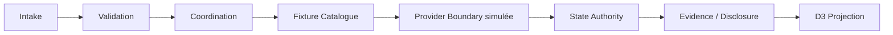

# 22 — V3.1-D2-D Integration Foundation — Architecture fonctionnelle

## A. Métadonnées

| Champ | Valeur |
|-------|--------|
| **Date** | 2026-08-03 17:28:30 CEST (+0200) |
| **Cycle** | Cycle 3 — Architecture fonctionnelle |
| **Profil SFIA** | **Critical** |
| **Typologie** | EVOL — documentation-only |
| **Projet** | SFIA Studio V3.1-D2-D Integration Foundation |
| **Branche** | `architecture/sfia-studio-v3-1-d2-d-integration-foundation-functional-architecture` |
| **Publication branch candidate** | `docs/sfia-studio-v3-1-d2-d-foundation-publication` |
| **Base** | `main@004296ac9355ef9906584f5d86be6182a96dd2fd` |
| **Documents amont** | `20-…-cadrage.md` (arbitrated) · `21-…-functional-design.md` (arbitrated) |
| **CKC** | fallback method-candidate : `02-fifteen-cycles-synthetic-map.md` + `sfia-v2.5-project-cycles-method-candidate.md` §4.3 — aucune autorité d'exécution ; aucun CKC détaillé inventé |
| **Statut** | `D2-D FUNCTIONAL ARCHITECTURE — ARBITRATED BY MORRIS — DOCUMENTARY PACKAGE VERSIONED VIA GIT — AUTHORITATIVE PUBLICATION STATE FOLLOWS PR/MAIN — NO TECHNICAL ARCHITECTURE OR DELIVERY AUTHORIZED` |
| **Code / API / SDK / UI / backlog** | **non** |

### GO Morris consommé

```text
GO ARBITRATION SFIA STUDIO V3.1-D2-D FUNCTIONAL DESIGN

ADOPT:

D-V3.1-D2D-FD-01:
ADOPT THE TWELVE FUNCTIONAL OBJECTS AS THE CANONICAL D2-D
FUNCTIONAL VOCABULARY.
TECHNICAL NAMES AND REPRESENTATIONS REMAIN UNDECIDED.

D-V3.1-D2D-FD-02:
ADOPT THE EIGHT-STATE EXTENSIBLE STATE-A MODEL:
IDLE, RUNNING, AWAITING_HUMAN, SUCCEEDED, FAILED,
CANCELLED, TIMED_OUT, BLOCKED.
NO ADDITIONAL PERSISTENT STATE-B STATES.

D-V3.1-D2D-FD-03:
ADOPT THE DOCUMENTED TRANSITION RULES.
ANY EXECUTION AFTER A TERMINAL STATE REQUIRES A NEW RUN
WITH A NEW EXECUTION IDENTITY.

D-V3.1-D2D-FD-04:
BLOCKED APPLIES WHEN EXECUTION CANNOT LEGITIMATELY START OR CONTINUE
WITHOUT A FATAL EXTERNAL OPERATION FAILURE.
FAILED APPLIES WHEN AN ENGAGED OPERATION FAILS.

D-V3.1-D2D-FD-05:
PARTIAL RESULTS MUST NEVER PRODUCE SUCCEEDED.
COMPLETENESS AND PARTIALITY MUST BE EXPLICITLY DISCLOSED.

D-V3.1-D2D-FD-06:
STRUCTURAL HUMAN GATES USE AWAITING_HUMAN.
NO AUTOMATIC STRUCTURAL DECISION.
EXPLICIT HUMAN-DECISION DEADLINE EXPIRY → TIMED_OUT.
MISSING, REFUSED OR UNSATISFIED GATE → BLOCKED.

D-V3.1-D2D-FD-07:
CANCELLATION IS TERMINAL FOR THE LOCAL RUN.
LATE PROVIDER RESULTS MUST NOT ALTER THE TERMINAL STATE
OR BECOME A SUCCESS RESULT.
THEY MAY ONLY BE RECORDED AS REDACTED EVIDENCE.

D-V3.1-D2D-FD-08:
FIXTURE, SANDBOX-REAL AND REAL ARE THE THREE MANDATORY
SOURCE DISCLOSURES.
A FIXTURE MUST NEVER BE PRESENTED AS REAL.

D-V3.1-D2D-FD-09:
ADOPT THE NORMALIZED FUNCTIONAL FAILURE FAMILIES DOCUMENTED IN §S.
TECHNICAL ERROR CODES REMAIN AN ARCHITECTURE DECISION.

D-V3.1-D2D-FD-10:
ADOPT THE FUNCTIONAL EVENT CATALOGUE AND STRICT REDACTION RULES.
NO SECRET, COMPLETE PROMPT OR COMPLETE PROVIDER RESPONSE
IN EVENTS BY DEFAULT.

D-V3.1-D2D-FD-11:
ADOPT THE PROVIDER-INDEPENDENT D3 FUNCTIONAL PROJECTION.
D3 MUST NOT DEPEND DIRECTLY ON OPENAI, GITHUB OR CURSOR.

D-V3.1-D2D-FD-12:
ADOPT THREE DISTINCT READINESS LEVELS:
UX EXPLORATION READINESS,
UI DELIVERY READINESS,
STRONG RUNTIME VERDICT READINESS.

NEXT:
GO ARCHITECTURE FONCTIONNELLE SFIA STUDIO V3.1-D2-D

NO ARCHITECTURE TECHNIQUE
NO BACKLOG
NO DELIVERY
NO UI CODE
NO CREATECYCLE
NO GIT WRITE
NO METHOD PROMOTION
```

Date/heure décision Morris FD : 2026-08-03 17:19 CEST (+0200).

**NO GIT WRITE :** aucun index/commit/push/PR/merge projet ; docs locaux non trackés ; push L3 handoff distinct.

### Marqueurs épistémiques

| Marqueur | Usage |
|----------|-------|
| **Décision Morris adoptée** | D-CAD-01…12 · D-FD-01…12 |
| **Observation repo** | Fait Git vérifiable |
| **Hypothèse de réutilisation** | platform/harness — non validée |
| **Option d'architecture fonctionnelle** | MOD / RUNTIME / REUSE |
| **Recommandation candidate** | Non adoptée |
| **Décision FA candidate** | FA-01…12 — NOT DECIDED |
| **Inconnue** | Lacune ouverte |
| **Réserve** | OPEN transportée |

---

## B. Décisions héritées

### Décisions CAD (cadrage) — DECIDED — ADOPTED BY MORRIS

Strict minimal foundation · contracts before D3 UI Delivery · ports before SDK · read-only first · Extensible STATE-A · INT-C · sandbox before Cursor réel · secrets server-only · structured events + redaction · R-C défense en profondeur · D2-D1→D2-D2→D2-D3 · trois readiness D3.

### Décisions FD (conception) — DECIDED — ADOPTED BY MORRIS

Douze objets · huit états · transitions + nouveau run · blocked vs failed · partial never succeeded · human gates · cancel terminal + late evidence-only · trois disclosures · familles d'erreurs · catalogue événements · projection D3 provider-independent · trois readiness.

### Toujours non décidés (technique)

Noms/représentations techniques · codes d'erreur techniques · SDK · protocoles · runtime owner · secret store · auth GitHub · capacité Cursor produit · transport événements · persistance · async.

---

## C. Finalité architecturale fonctionnelle

Structurer les **responsabilités**, **autorités** et **flux** nécessaires pour préparer, contrôler, suivre et restituer une exécution externe **read-only**, sans exposer les fournisseurs à D3 et sans autoriser une mutation Git.

---

## D. Principes structurants hérités

1. Strict minimal foundation
2. Contract-first
3. Read-only first
4. Provider independence
5. Single functional authority per responsibility
6. Fail-closed
7. Human decision first
8. fixture / sandbox-real / real truthfulness
9. Evidence before success
10. No partial-as-success
11. No provider coupling in D3
12. No Git write
13. No CreateCycle

---

## E. Périmètre et hors périmètre

**Périmètre :** modules fonctionnels · responsabilités · autorités · interfaces · flux · dépendances · ownership objets · projection D3 · slicing D2-D.

**Hors périmètre :** technologies · déploiement · persistance technique · protocoles · SDK · code · UI · backlog · writes · CreateCycle · RUN readiness.

---

## F. Baseline fonctionnelle et observations repo

| Observation | Contenu |
|-------------|---------|
| D2-C | Core qualification read-only intégré (`oa/cycle`) |
| vertical-slice-runtime | Runtime applicatif local existant |
| platform AI / GitHub tools / harness Cursor | Capacités en **silos** |
| Package D2-D unifié | **Absent** |
| Réutilisation | **Hypothèse** jusqu'à architecture technique |
| Double runtime | Risque **ouvert** |

Ne pas conclure que les modules observés doivent être réutilisés.

---

## G. Options de découpage fonctionnel

### Option MOD-A — provider-centric

Modules principaux par fournisseur (AI, GitHub, Cursor) + coordination commune.

| Critère | Évaluation |
|---------|------------|
| Strict minimal | Faible (triple surface) |
| Couplage fournisseur | Élevé |
| Ownership | Flou sur états/disclosures |
| Double runtime | Moyen |
| Testabilité | Par provider, contrats transverses fragiles |
| Impact D3 | Risque de fuite provider |
| Évolutivité | Ajout provider = nouveau module |
| Dette / réversibilité | Dette haute · réversibilité moyenne |
| Sur-architecture | Moyenne |

### Option MOD-B — capability-centric minimal

Modules transverses : Intake/Context · Coordination · Validation/Policy · Provider Boundary · State/Human Gate · Evidence/Disclosure · Events/Usage · Fixtures.

| Critère | Évaluation |
|---------|------------|
| Strict minimal | Bonne |
| Couplage fournisseur | Faible (lanes isolées) |
| Ownership | Clair si autorités uniques |
| Double runtime | Adressable via RUNTIME options |
| Testabilité | Haute (contrats + fixtures) |
| Impact D3 | Projection indépendante naturelle |
| Évolutivité | Bonne |
| Dette / réversibilité | Dette maîtrisée · haute réversibilité |
| Sur-architecture | Faible si 8 capacités tenues |

### Option MOD-C — orchestration-centric consolidated

Une responsabilité centrale large + frontières externes fines.

| Critère | Évaluation |
|---------|------------|
| Strict minimal | Trompeuse (monolithe) |
| Couplage | Interne élevé |
| Ownership | Ambigu |
| Double runtime | Aggravé |
| Testabilité | Difficile |
| Sur-architecture | Haute (god-module) |

**Recommandation candidate : MOD-B** — **NOT DECIDED** (FA-01).

---

## H. Décomposition fonctionnelle candidate recommandée

Noms de **travail** · découpage **non adopté** · aucune correspondance package/code.

### 1. Execution Intake & Context

Recevoir intention · assembler contexte · préserver source/disclosures · ne pas exploiter payload non validé.

### 2. Execution Coordination

Coordonner un run · appeler capacités dans l'ordre · **ne pas** arbitrer Morris · **ne pas** posséder validation/transitions · empêcher flux provider→D3 directs.

### 3. Validation & Read-only Policy

Validation entrées/sorties · fail-closed · interdiction mutation · permissions read-only · chemins protégés · préconditions sandbox/gates.

### 4. Provider Capability Boundary

Représenter AI/Git/Cursor · isoler différences · disponibilité/limites · normaliser résultats/erreurs · **aucune** implémentation exposée à D3.

### 5. State & Human Gate Authority

Autorité des huit états · transitions · nouveau run après terminal · `awaiting_human` · `timed_out` vs `blocked` selon FD-06.

### 6. Evidence, Failure & Disclosure

Normaliser succès/partiel/failure · preuves · fixture/sandbox-real/real · empêcher partial→succeeded · late results = preuves seulement.

### 7. Execution Events & Usage

Événements FD-10 · redaction · usage/coût seulement si fournis et validés · **pas** de transport/stockage décidé.

### 8. Contract Fixture Catalogue

Scénarios déterministes · mêmes contrats · nominal+erreurs · signaler divergence · **jamais** présenté comme réel.

---

## I. Capacités externes et dépendances

| Capacité | Rôle | Reçoit | Produit | Autorité | Limites | Confiance | R/W | Preuve | Disclosure |
|----------|------|--------|---------|----------|---------|-----------|-----|--------|------------|
| D2-C Qualification Core | Qualifier cycle CKC | Signaux/projection | Success/Failure | D2-C | Read-only ; pas CreateCycle | Interne | R | Audit cycle | Core intégré |
| Git Provider | Git Truth distant | Refs allowlist | Métadonnées | Provider Boundary | **Read-only** | Externe | R | Refs/CI | sandbox-real/real |
| AI Provider | Opération AI bornée | Contexte minimisé | Résultat+usage? | Provider Boundary | Server secret | Externe | — | Usage validé | provider abstrait |
| Cursor Worker | Exécution sandbox | Contrat borné | Événements+résultat | Provider Boundary | Read-only ; **UNVERIFIED** | Externe | R | Sandbox | UNVERIFIED si besoin |
| Secret Source | Credentials serveur | Identité secret | Valeur mémoire serveur | Secret boundary | Jamais dans objets D2-D exposables | Critique | — | Identité seule | jamais valeur |
| Sandbox | Isolation workspace | Périmètre | Conformité/preuves | Policy + Provider | Write hors trajectoire | Isolé | R | Conformité | mode |
| D3 Projection Consumer | Présenter | Projection | Affichage futur | **Aucune** sur état/provider | Lecture seule | Non fiable | R | — | obligatoire |
| Morris / Human Decision | Gates structurantes | Question+preuves | Décision | Morris | Pas auto | Haute | — | Décision tracée | — |

Indisponibilité / incapacité : mappée vers `blocked` / `failed` / `provider_unavailable` / gate selon FD-04/06/09.

---

## J. Matrice responsabilités / autorités

| Objet | Producteur | Propriétaire | Lecteurs | Autorité modif. | Visibilité D3 | Sensibilité | Preuve |
|-------|------------|--------------|----------|-----------------|---------------|-------------|--------|
| Execution Intent | Intake | Intake | Coord, Policy, D3 | Intake (pré-run) | Résumé | Faible | Intent id |
| Execution Context | Intake | Intake | Coord, Policy, Providers | Intake | Partiel | Refs | Context id |
| Provider Capability | Provider Boundary | Provider Boundary | Coord, Policy, State | Provider Boundary | Disponibilité | Faible | Capability |
| Validation Outcome | Validation & Policy | Validation & Policy | Coord, State | Validation & Policy | Motif | Faible | Outcome |
| Execution Run | Coordination / State | State Authority | Tous | State (identité) | Oui | Faible | Run id |
| Execution State | State Authority | **State Authority** | Tous, D3 | **State Authority seule** | Oui | Faible | Transitions |
| External Result | Provider Boundary | Evidence/Disclosure | State, D3 | Evidence (complétude) | Oui redacted | Moyen | Result |
| Execution Evidence | Evidence/Disclosure | Evidence/Disclosure | D3, Events | Evidence | Oui redacted | Moyen | Evidence |
| Source Disclosure | Intake + Evidence | Evidence/Disclosure | D3 | Evidence | **Obligatoire** | Faible | Source |
| Human Decision Gate | State / Human Gate | Human Gate Authority | D3, Morris | Morris (décision) | Question+statut | Faible | Decision |
| Usage Summary | Events & Usage | Events & Usage | D3 | Events (si validé) | Si disponible | Faible | Usage |
| Normalized Failure | Provider/Policy → Evidence | Evidence/Disclosure | State, D3 | Evidence | Message redacted | Moyen | Failure |

Pas de schéma technique.

---

## K. Autorités fonctionnelles

| Autorité | Responsabilité unique |
|----------|----------------------|
| Morris | Décisions structurantes |
| D2-C | Résultat qualification D2-C |
| Validation & Policy | Conformité avant engagement |
| State & Human Gate | État et transitions |
| Provider Boundary | Capacité + résultat fournisseur normalisé |
| Evidence/Disclosure | Provenance et complétude |
| Events/Usage | Événement redacted + usage validé |
| D3 | Présentation **uniquement** — jamais autorité provider ou état |

**Conflits potentiels :** Coordination usurpant State · D3 invoquant provider · Provider publiant état · Evidence contournée par succès direct · D2-C dupliquant Policy.

---

## L. Interface fonctionnelle — Intake → Coordination

Échange fonctionnel (sans signature technique) :

- intention validée
- contexte
- source demandée (`fixture` \| `sandbox-real` \| `real`)
- opération souhaitée
- contraintes
- correlation identity
- gate éventuelle
- résultat de validation

---

## M. Interface fonctionnelle — Coordination → Validation & Policy

**Entrée :** contexte · permissions · source · provider demandé · paths · payload · gate · sandbox.

**Résultats candidats :** `permitted` · `blocked` · normalized validation failure.

---

## N. Interface fonctionnelle — Coordination → Provider Boundary

**Entrée :** capacité demandée · contexte minimisé · opération read-only · limites · cancellation · timeout · disclosure de source.

**Résultats candidats :** capacité disponible · résultat complet · résultat partiel · failure normalisée · timeout · cancellation · preuve brute redacted candidate.

---

## O. Interface fonctionnelle — Provider Boundary → State Authority

Événements de début/fin · résultat · failure · cancellation · timeout · indisponibilité · résultat tardif.

**State Authority seule** responsable de l'état final.

---

## P. Interface fonctionnelle — Human Gate

Question de décision · preuves redacted · options autorisées · deadline éventuelle · décision · refus · absence · expiration.

Aucune décision structurante automatique (FD-06).

---

## Q. Interface fonctionnelle — Evidence/Disclosure → D3 Projection

Contrat fournisseur-indépendant :

run identity · état · progression · source · provider **abstrait** · résultat · completeness · failure · blocked reason · preuve · qualification D2-C · human gate · cancellation possible · usage · réserves · limites.

**D3 ne reçoit jamais :** secret · objet SDK · erreur brute · prompt/réponse complets par défaut · commande arbitraire · capacité write.

---

## R. Flux fonctionnel nominal fixture



Séquence : source `fixture` · mêmes contrats · déterminisme · succès **seulement** après validation des sorties · disclosure fixture obligatoire.

---

## S. Flux fonctionnel nominal sandbox-real

**FUNCTIONAL TARGET — TECHNICAL CAPABILITY UNVERIFIED**

```mermaid
flowchart LR
  I[Intake] --> VP[Validation and Policy]
  VP --> SB[Sandbox validation]
  SB --> G[Git read]
  G --> QC[D2-C qualification]
  QC --> AI[AI bounded]
  AI --> CU[Cursor read-only]
  CU --> VR[Validate results]
  VR --> ST[State Authority]
  ST --> ED[Evidence / Disclosure]
  ED --> D3[D3 Projection]
```



Cursor produit **UNVERIFIED** jusqu'à check dédié (CAD-07).

---

## T. Flux awaiting_human

1. Déclenchement gate structurante
2. Suspension → `awaiting_human`
3. Publication question + preuves redacted
4. Décision Morris
5. Reprise (`running`) ou `blocked` (refus/non satisfait/absent)
6. Deadline expiry explicite → `timed_out`
7. **Aucune** progression automatique

---

## U. Flux cancellation

1. Requête cancel
2. Validation autorité (opérateur/Morris)
3. Transition locale → `cancelled` (terminal)
4. Propagation fonctionnelle au provider (best-effort)
5. Résultat tardif → preuve redacted **seulement**
6. État terminal **immuable** (FD-07)

---

## V. Flux timeout

- Timeout opérationnel vs global (concepts fonctionnels)
- État terminal `timed_out`
- Preuve horodatée
- Nouvelle exécution = **nouveau run**
- Aucun retry infini
- **Aucune** durée numérique décidée ici

---

## W. Flux blocked / failed

| | blocked | failed |
|--|---------|--------|
| Sens | Impossibilité légitime avant/sans failure fatale d'op engagée | Opération engagée a échoué |
| Causes | validation, permission, sandbox, gate, capability | provider/op failure |
| Producteur cause | Validation & Policy / Provider Capability | Provider Boundary |
| Décideur état | **State Authority** | **State Authority** |

---

## X. Flux résultat partiel

Détection complétude (Evidence) · marquage partiel · preuve · état non-`succeeded` · exposition D3 · **aucune** promotion silencieuse (FD-05).

---

## Y. Flux résultat tardif

État terminal déjà atteint · résultat provider tardif · **aucune** modification état/résultat officiel · preuve redacted distincte · événement candidat (FD-07).

---

## Z. Flux R-QA-D2C-01

### Ligne 1 — Validation & Policy D2-D

Rejet `null`/`undefined` **avant** lecture métadonnées.

### Ligne 2 — Correctif D2-C séparé

Normalisation interne bornée · cycle et gate **séparés** (CAD-10).

**R-QA-D2C-01 :** `OPEN — NOT LIFTED`
**R-QA-REV-01 / R-QA-REV-02 :** `OPEN NOT LIFTED`
Aucune levée anticipée · aucune fusion des responsabilités.

---

## AA. Matrice failure → responsabilité → état

| Famille | Producteur | Normalisateur | État candidat | Retry | Humain | Disclosure | Preuve | Interdit |
|---------|------------|---------------|---------------|-------|--------|------------|--------|----------|
| validation | Policy | Evidence | blocked | après correction | non | motif | outcome | secrets |
| authentication | Policy/Provider | Evidence | blocked/failed | après credential | parfois | famille | — | secrets |
| authorization | Policy/Provider | Evidence | blocked/failed | après droits | parfois | famille | — | tokens |
| provider_unavailable | Provider | Evidence | failed/blocked | nouveau run | non | provider abstrait | — | détails bruts |
| rate_limited | Provider | Evidence | failed/blocked | différé borné | non | famille | — | — |
| timed_out | State/Provider | Evidence | timed_out | nouveau run | non | bornes | timestamps | — |
| cancelled | State | Evidence | cancelled | nouveau run | non | qui/quand | — | — |
| sandbox_blocked | Policy | Evidence | blocked | conformité | parfois | famille | conformité | chemins sensibles |
| protected_path | Policy | Evidence | blocked/failed | non si interdit | oui | famille | path class | chemins bruts |
| mutation_forbidden | Policy | Evidence | blocked | changer intent | non | famille | — | — |
| human_gate_required | Human Gate | Evidence | awaiting_human/blocked | après décision | **oui** | question | gate | — |
| invalid_provider_result | Provider | Evidence | failed | nouveau run | non | famille | — | payload brut |
| internal_normalized_failure | Coord/interne | Evidence | failed | limité | parfois | famille | — | stack |

---

## AB. Matrice source et disclosures

| Source | Capacités | Preuves | Secrets | Risques | D3 disclosure | Valeur probante | Succès |
|--------|-----------|---------|---------|---------|---------------|-----------------|--------|
| fixture | Simulation contrats | Déterministes | Aucun | Drift | `fixture` obligatoire | Contrat | Après validation |
| sandbox-real | Providers sandbox read-only | Sandbox+ops | Server-only | UNVERIFIED Cursor | `sandbox-real` | Moyenne→haute | Après validation |
| real | Providers réels bornés | Ops réelles | Server-only | Coût/fuite | `real` | Haute | Après validation |

Fixture **jamais** présentée comme real (FD-08).

---

## AC. Frontière secrets

- Secret Source externe
- Server-only
- Identité du secret (pas la valeur) dans le domaine
- Disponibilité / expiration / révocation / usage auditables sans valeur
- **Aucune** valeur dans objets D2-D exposables, D3, événements, preuves, fixtures
- **Aucun** choix de stockage

---

## AD. Frontière sandbox

- Conformité attendue avant Cursor réel
- Mode fixture · mode sandbox-real read-only
- Write futur **hors trajectoire** (D2-D4)
- Paths autorisés / protégés
- Commande bornée = capacité fonctionnelle **future**
- **Aucune** technologie d'isolation décidée

---

## AE. Frontière D2-C

- D2-C reste Core read-only
- D2-D l'invoque comme capacité de qualification
- D2-D **ne duplique pas** ses règles
- D2-C **ne coordonne pas** les fournisseurs
- D2-C **ne gère pas** D3
- R-QA-D2C-01 : responsabilités séparées (Policy D2-D vs correctif D2-C)

---

## AF. Frontière D3

- Projection fournisseur-indépendante (FD-11)
- Lecture uniquement
- Aucune décision d'état / Morris / invocation provider
- Aucune connaissance de secret
- Aucune capacité Git write
- Disclosures obligatoires

---

## AG. Double runtime — options

### RUNTIME-A — étendre vertical-slice-runtime

| Critère | Éval |
|---------|------|
| Cohérence | Risque de confondre UI slice et D2-D |
| Dette | Couplage historique |
| Duplication | Faible à court terme, floue ensuite |
| Migration | Difficile si découplage tardif |
| Impact D3 | Fuite possible |
| Réversibilité | Basse |

### RUNTIME-B — autorité D2-D distincte + adapter UI

| Critère | Éval |
|---------|------|
| Cohérence | Bonne séparation |
| Dette | Deux surfaces à maintenir |
| Duplication | Risque si VS non retiré |
| Impact D3 | Clair |
| Réversibilité | Moyenne |

### RUNTIME-C — autorité D2-D unique fonctionnelle ; runtime existant = façade/infra à arbitrer techniquement

| Critère | Éval |
|---------|------|
| Cohérence | Maximale au niveau fonctionnel |
| Dette | Report décision technique |
| Duplication | Contrôlée si façade honnête |
| Impact technique futur | Explicitement ouvert |
| Réversibilité | Haute |

**Recommandation candidate : RUNTIME-C** — **NOT DECIDED** (FA-09).

---

## AH. Réutilisation platform/harness — options

| Option | Idée | Claim |
|--------|------|-------|
| REUSE-A | Réutilisation directe | Compatibilité **non** claimable |
| REUSE-B | Enveloppement derrière frontières D2-D | Hypothèse préférée |
| REUSE-C | Réécriture ciblée | Coût élevé |

Conserver : réutilisation = **hypothèse** · décision technique future · **aucun** claim de compatibilité.

**Recommandation candidate : REUSE-B** — **NOT DECIDED** (FA-10).

---

## AI. Slicing fonctionnel D2-D

| Slice | Capacités | Sortie fonctionnelle | Dépendances |
|-------|-----------|----------------------|-------------|
| **D2-D1** | objets/contrats · validation · état · transitions · failure · disclosures · fixtures | Contrats testables + fixtures | FD adoptées |
| **D2-D2** | provider boundaries · sandbox · secret boundary · events/usage · adapters read-only futurs | Frontières read-only + redaction | D2-D1 |
| **D2-D3** | coordination bout-en-bout · walking skeleton sandbox-real · preuve D3 · **aucun write** | Preuve end-to-end | D2-D2 + sandbox + R-QA gates |
| **D2-D4** | write capabilities | **Hors trajectoire** | GO distinct |

Aucune story écrite.

---

## AJ. Dépendances vers architecture technique

Sans résoudre : représentation contrats · validation library · runtime owner · async · persistance · provider adapters · authentification · secret store · sandbox technology · cancellation · timeout · event transport · observability sink · rate-limit · deployment · multi-instance · test strategy.

---

## AK. Dépendances vers backlog

Besoins futurs (pas de stories) : modules adoptés · interfaces adoptées · ownership · flux · invariants · critères de sortie par slice · dépendances · réserves.

---

## AL. Risques d'architecture fonctionnelle

| ID | Risque | P | I | Mitigation | Décision | Cycle |
|----|--------|---|---|------------|----------|-------|
| RA-01 | Sur-architecture | M | M | MOD-B minimal | FA-01 | FA |
| RA-02 | Coordination monolithique | M | H | Coord sans ownership règles | FA-02 | FA |
| RA-03 | Provider leakage | M | H | Boundary + D3 projection | FA-05/08 | FA |
| RA-04 | Double runtime | H | H | RUNTIME-C | FA-09 | FA/Tech |
| RA-05 | Ownership ambigu | M | H | Matrices J/K | FA-02..07 | FA |
| RA-06 | State Authority contournée | M | H | Invariant unique owner | FA-03 | D2-D1 |
| RA-07 | D3 orchestrateur | M | H | AF frontière | FA-08 | D3 |
| RA-08 | Duplication D2-C | M | H | AE | — | Correctif |
| RA-09 | Fixture divergence | M | H | Catalogue + parité | FA-02 | D2-D1 |
| RA-10 | Evidence non fiable | M | H | Authority unique | FA-04 | D2-D1 |
| RA-11 | Human gate contournée | M | H | FA-07 | FA-07 | D3 |
| RA-12 | Secret leakage | M | H | AC | FA-06 | D2-D2 |
| RA-13 | Mutation Git | M | H | Policy read-only | CAD-04 | Toujours |
| RA-14 | Partiel mal classé | M | H | FD-05 | FA-04 | D2-D1 |
| RA-15 | Résultats tardifs | M | M | FD-07 | FA-03/04 | D2-D2 |
| RA-16 | Erreurs non normalisées | M | M | AA | FA-05 | D2-D1 |
| RA-17 | Slicing incohérent | M | M | AI mapping | FA-11 | Backlog |

---

## AM. Invariants architecturaux fonctionnels

1. Un seul propriétaire de l'état
2. Un seul propriétaire de la provenance et complétude
3. D3 provider-independent
4. D2-C non dupliqué
5. Providers sans accès direct à D3
6. Aucune mutation Git
7. Aucun secret dans le domaine D2-D exposable
8. Aucune progression structurante sans Morris
9. Aucun succès partiel
10. Aucun résultat tardif modifiant un terminal
11. Fixtures conformes aux mêmes contrats
12. Validation avant exploitation
13. Aucune architecture technique implicite
14. Aucun CreateCycle

---

## AN. Critères d'acceptation de l'architecture fonctionnelle

| ID | Critère observable |
|----|-------------------|
| AA-01 | Chaque responsabilité a une autorité unique documentée |
| AA-02 | Flux fixture : Intake→…→D3 avec disclosure fixture |
| AA-03 | Flux sandbox-real marqué UNVERIFIED / FUNCTIONAL TARGET |
| AA-04 | blocked vs failed séparés selon FD-04 |
| AA-05 | awaiting_human sans auto-progress ; expiry→timed_out ; missing→blocked |
| AA-06 | timeout et cancellation terminaux ; late≠success |
| AA-07 | partial jamais succeeded |
| AA-08 | D3 projection sans dépendance provider directe |
| AA-09 | D2-C invoqué, non dupliqué |
| AA-10 | secret absent des objets exposables |
| AA-11 | write Git interdit dans trajectoire |
| AA-12 | R-QA-D2C-01 deux lignes ; réserve OPEN |
| AA-13 | slicing D2-D1/2/3 mappé ; D2-D4 hors trajectoire |
| AA-14 | aucune décision technique (SDK/runtime/store) adoptée |

---

## AO. Questions ouvertes

Runtime technique · réutilisation exacte · capacités Cursor · auth GitHub · Secret Store · persistance · async · cancellation provider · source de vérité des événements · multi-instance · rétention · granularité des preuves.

---

## AP. Decision pack Morris — Architecture fonctionnelle

Toutes : **NOT DECIDED — MORRIS ARBITRATION REQUIRED**

### D-V3.1-D2D-FA-01 — Découpage MOD-A/B/C

- **Question :** Quel découpage fonctionnel ?
- **Options :** MOD-A · MOD-B · MOD-C
- **Reco candidate :** MOD-B
- **Gate :** arbitrage puis technique

### D-V3.1-D2D-FA-02 — Liste et responsabilité des modules

- **Reco candidate :** huit capacités §H

### D-V3.1-D2D-FA-03 — Autorité unique Execution State

- **Reco candidate :** State & Human Gate Authority seule

### D-V3.1-D2D-FA-04 — Autorité Evidence/Disclosure/Completeness

- **Reco candidate :** Evidence, Failure & Disclosure unique

### D-V3.1-D2D-FA-05 — Provider Capability Boundary

- **Reco candidate :** boundary unique avec lanes AI/Git/Cursor

### D-V3.1-D2D-FA-06 — Validation & Read-only Policy Boundary

- **Reco candidate :** Policy unique fail-closed + read-only

### D-V3.1-D2D-FA-07 — Human Gate Authority

- **Reco candidate :** au sein de State & Human Gate ; Morris décide

### D-V3.1-D2D-FA-08 — Projection D3 provider-independent

- **Reco candidate :** contrat §Q

### D-V3.1-D2D-FA-09 — Double runtime RUNTIME-A/B/C

- **Reco candidate :** RUNTIME-C

### D-V3.1-D2D-FA-10 — Réutilisation REUSE-A/B/C

- **Reco candidate :** REUSE-B (hypothèse)

### D-V3.1-D2D-FA-11 — Mapping D2-D1/D2-D2/D2-D3

- **Reco candidate :** mapping §AI ; D2-D4 hors trajectoire

### D-V3.1-D2D-FA-12 — Critères de sortie vers architecture technique

- **Reco candidate :** FA adoptées + matrices J/K + interfaces L–Q + invariants AM + AA-14 satisfaits avant GO technique

Pour chaque : impacts Delivery/D3 ; dette si report ; réversibilité haute tant que technique non figée ; dépendances CAD+FD ; gate suivante = GO Architecture technique **après** arbitrage.

---


## AP2. Decision record Morris — 2026-08-03 17:42 CEST (+0200)

Les recommandations et options de la section **AP** restent conservées comme **historique candidat**. Elles ne sont pas réécrites rétrospectivement. Le présent enregistrement documente l'arbitrage Morris consommé.

### GO Morris d'arbitrage et de publication

```text
GO ARBITRATION SFIA STUDIO V3.1-D2-D FUNCTIONAL ARCHITECTURE

ADOPT:

D-V3.1-D2D-FA-01:
ADOPT MOD-B — CAPABILITY-CENTRIC MINIMAL —
AS THE D2-D FUNCTIONAL DECOMPOSITION.
THIS DOES NOT DEFINE TECHNICAL SERVICES, PACKAGES OR DEPLOYMENT UNITS.

D-V3.1-D2D-FA-02:
ADOPT THE EIGHT FUNCTIONAL CAPABILITIES:
EXECUTION INTAKE & CONTEXT,
EXECUTION COORDINATION,
VALIDATION & READ-ONLY POLICY,
PROVIDER CAPABILITY BOUNDARY,
STATE & HUMAN GATE AUTHORITY,
EVIDENCE / FAILURE / DISCLOSURE,
EXECUTION EVENTS & USAGE,
CONTRACT FIXTURE CATALOGUE.

THESE ARE FUNCTIONAL RESPONSIBILITIES,
NOT TECHNICAL MODULES OR MICROSERVICES.

D-V3.1-D2D-FA-03:
STATE & HUMAN GATE AUTHORITY IS THE SOLE FUNCTIONAL AUTHORITY
FOR EXECUTION STATE AND TRANSITIONS.
COORDINATION AND PROVIDERS MUST NOT MUTATE STATE DIRECTLY.

D-V3.1-D2D-FA-04:
EVIDENCE / FAILURE / DISCLOSURE IS THE SOLE FUNCTIONAL AUTHORITY
FOR PROVENANCE, COMPLETENESS, PARTIALITY AND OFFICIAL EVIDENCE.
PROVIDER OUTPUT ALONE CANNOT DECLARE SUCCESS.

D-V3.1-D2D-FA-05:
ADOPT ONE PROVIDER CAPABILITY BOUNDARY
WITH DISTINCT AI, GIT AND CURSOR FUNCTIONAL LANES.
PROVIDER-SPECIFIC DETAILS MUST REMAIN BEHIND THIS BOUNDARY.

D-V3.1-D2D-FA-06:
VALIDATION & READ-ONLY POLICY IS THE SOLE PRE-ENGAGEMENT
FUNCTIONAL AUTHORITY.
IT MUST APPLY FAIL-CLOSED VALIDATION, READ-ONLY PERMISSIONS,
PROTECTED-PATH RULES, SANDBOX PRECONDITIONS AND REQUIRED GATES
BEFORE ANY PROVIDER OPERATION.

D-V3.1-D2D-FA-07:
HUMAN GATE RESPONSIBILITY REMAINS WITHIN
STATE & HUMAN GATE AUTHORITY.
MORRIS REMAINS THE SOLE AUTHORITY FOR STRUCTURAL DECISIONS.
NO AUTOMATIC STRUCTURAL APPROVAL.

D-V3.1-D2D-FA-08:
ADOPT THE PROVIDER-INDEPENDENT, READ-ONLY D3 PROJECTION
DEFINED IN DOCUMENT 22 §Q.
D3 IS A PRESENTATION CONSUMER,
NOT AN ORCHESTRATOR OR STATE AUTHORITY.

D-V3.1-D2D-FA-09:
ADOPT RUNTIME-C AT THE FUNCTIONAL LEVEL:
D2-D HAS ONE FUNCTIONAL AUTHORITY.
THE EXISTING VERTICAL-SLICE RUNTIME MAY ONLY BE TREATED AS
A FUTURE FACADE OR INFRASTRUCTURE OPTION.
NO TECHNICAL RUNTIME IS SELECTED BY THIS DECISION.

D-V3.1-D2D-FA-10:
ADOPT REUSE-B AS A TECHNICAL-EVALUATION PRINCIPLE:
FIRST EVALUATE EXISTING PLATFORM AND HARNESS CAPABILITIES
BEHIND THE ADOPTED D2-D BOUNDARIES.

NO COMPATIBILITY IS ASSUMED.
DIRECT REUSE, WRAPPING OR TARGETED REWRITE REMAIN
TECHNICAL ARCHITECTURE DECISIONS.

D-V3.1-D2D-FA-11:
ADOPT THE FUNCTIONAL SLICING:

D2-D1:
CONTRACTS, VALIDATION, STATES, TRANSITIONS,
FAILURES, DISCLOSURES AND FIXTURES.

D2-D2:
PROVIDER BOUNDARIES, SANDBOX, SECRET BOUNDARY,
EVENTS / USAGE AND FUTURE READ-ONLY ADAPTERS.

D2-D3:
END-TO-END COORDINATION,
READ-ONLY SANDBOXED WALKING SKELETON
AND STRONG D3 RUNTIME EVIDENCE.

D2-D4 WRITE CAPABILITIES REMAIN OUT OF TRAJECTORY.

D-V3.1-D2D-FA-12:
ADOPT THE EXIT CRITERIA FOR TECHNICAL ARCHITECTURE:
FUNCTIONAL DECISIONS ADOPTED,
OWNERSHIP AND AUTHORITY MATRICES VALIDATED,
INTERFACES L–Q VALIDATED,
FUNCTIONAL INVARIANTS VALIDATED,
D2-C / D2-D / D3 BOUNDARIES CLOSED,
AND NO TECHNICAL CHOICE PRE-ADOPTED.

NEXT:
GO DOCUMENTARY PUBLICATION SFIA STUDIO V3.1-D2-D
CADRAGE + FUNCTIONAL DESIGN + FUNCTIONAL ARCHITECTURE

PUBLISH DOCUMENTS 20, 21 AND 22 AS ONE COHERENT
DOCUMENTARY PACKAGE BEFORE TECHNICAL ARCHITECTURE.

NO ARCHITECTURE TECHNIQUE
NO BACKLOG
NO DELIVERY
NO UI CODE
NO CREATECYCLE
NO GIT WRITE IN THIS ARBITRATION CYCLE
NO METHOD PROMOTION
```

Date/heure de la décision Morris : **2026-08-03 17:42 CEST (+0200)**

### Table des décisions FA adoptées

| ID | Choix adopté | Statut | Conséquence | Décision technique restante |
|----|--------------|--------|-------------|------------------------------|
| D-V3.1-D2D-FA-01 | MOD-B capability-centric minimal. Aucun service, package ou deployment unit technique défini. | DECIDED — ADOPTED BY MORRIS | Décomposition fonctionnelle D2-D | Packages/services techniques |
| D-V3.1-D2D-FA-02 | Huit capacités fonctionnelles adoptées. Elles ne sont pas des microservices ou modules techniques. | DECIDED — ADOPTED BY MORRIS | Responsabilités fonctionnelles canoniques | Mapping code/packages |
| D-V3.1-D2D-FA-03 | State & Human Gate Authority seule autorité fonctionnelle des états et transitions. | DECIDED — ADOPTED BY MORRIS | Coordination/providers ne mutent pas l'état | Runtime technique owner |
| D-V3.1-D2D-FA-04 | Evidence / Failure / Disclosure seule autorité de provenance, complétude, partialité et preuve officielle. | DECIDED — ADOPTED BY MORRIS | Provider output ≠ succès | Représentation preuves |
| D-V3.1-D2D-FA-05 | Une Provider Capability Boundary avec lanes fonctionnelles AI, Git et Cursor. | DECIDED — ADOPTED BY MORRIS | Détails provider derrière la frontière | Adapters/SDK |
| D-V3.1-D2D-FA-06 | Validation & Read-only Policy seule autorité fonctionnelle pré-engagement. | DECIDED — ADOPTED BY MORRIS | Fail-closed avant toute op provider | Validation library |
| D-V3.1-D2D-FA-07 | Human Gate dans State & Human Gate Authority. Morris seul décideur structurant. Aucune approbation automatique. | DECIDED — ADOPTED BY MORRIS | Pas d'auto-approval | Mécanisme UI/API futur |
| D-V3.1-D2D-FA-08 | Projection D3 provider-independent et read-only. D3 consommateur de présentation uniquement. | DECIDED — ADOPTED BY MORRIS | D3 ≠ orchestrateur | DTO techniques D3 |
| D-V3.1-D2D-FA-09 | RUNTIME-C adopté au niveau fonctionnel uniquement. Aucun runtime technique sélectionné. | DECIDED — ADOPTED BY MORRIS | Une autorité fonctionnelle D2-D | Choix runtime technique |
| D-V3.1-D2D-FA-10 | REUSE-B adopté comme principe d'évaluation technique. Aucune compatibilité supposée. Reuse, wrapper ou rewrite restent des décisions techniques. | DECIDED — ADOPTED BY MORRIS | Évaluer platform/harness derrière frontières | Reuse/wrap/rewrite |
| D-V3.1-D2D-FA-11 | Slicing D2-D1 → D2-D2 → D2-D3 adopté. D2-D4 write hors trajectoire. | DECIDED — ADOPTED BY MORRIS | Trajectoire Delivery documentaire | Backlog stories |
| D-V3.1-D2D-FA-12 | Critères de sortie vers architecture technique adoptés. Ils n'autorisent pas l'architecture technique avant publication documentaire intégrée et post-merge validée. | DECIDED — ADOPTED BY MORRIS | Gate technique post-publication | GO Architecture technique |

**Réserves conservées :** R-QA-REV-01 OPEN NOT LIFTED · R-QA-REV-02 OPEN NOT LIFTED · R-QA-D2C-01 OPEN — NOT LIFTED.

---

## AQ. Recommandations candidates

Sans adoption :

- **MOD-B** capability-centric minimal
- Huit capacités fonctionnelles §H
- Execution Coordination **sans** ownership des règles
- State & Human Gate Authority unique
- Evidence/Disclosure Authority unique
- Provider Boundary unique avec lanes AI/Git/Cursor
- D3 projection read-only provider-independent
- **RUNTIME-C**
- **REUSE-B**
- Slicing D2-D1 → D2-D2 → D2-D3

---

## AR. Trajectoire candidate

Après arbitrage FA **seulement** :

1. Architecture technique D2-D
2. Backlog D2-D
3. Cycles Delivery séparés
4. UX D3 exploratoire selon readiness

Aucune transition automatique. Aucun GO Backlog/Delivery/D3 immédiatement consommable.

---

## AS. Anti-claims

Interdit : functional architecture adopted · technical architecture decided · runtime selected · providers integrated · reuse validated · sandbox/secrets secure · backlog ready · ready for Delivery · D3 opened · UI ready · Git write / CreateCycle enabled · reserve lifted · RUN READY · method promoted.

---

## AT. Verdict documentaire

```text
D2-D FUNCTIONAL ARCHITECTURE — ARBITRATED BY MORRIS —
D-CAD-01…12 / D-FD-01…12 / D-FA-01…12 ADOPTED —
DOCUMENTARY PACKAGE 20–22 VERSIONED VIA GIT —
AUTHORITATIVE PUBLICATION STATE FOLLOWS PR/MAIN —
NO TECHNICAL ARCHITECTURE ADOPTED —
NO BACKLOG CREATED —
NO DELIVERY AUTHORIZED —
NO UI CODE —
NO FIGMA —
NO CREATECYCLE —
NO GIT WRITE CAPABILITY —
NO METHOD PROMOTION
```

### Prochaine gate candidate

**Trace de consommation :**

- GO Documentary Publication SFIA Studio V3.1-D2-D **reçu et consommé** ;
- package 20–22 publié dans une branche et une draft PR dédiées ;
- le statut Git-authoritative est la **PR** tant qu'elle n'est pas mergée ;
- **main** devient autorité uniquement après merge ;
- architecture technique **interdite** avant merge et validation post-merge de cette publication ;
- prochaine gate : `GO PR READINESS SFIA STUDIO V3.1-D2-D DOCUMENTARY PUBLICATION` ;
- **aucun** GO merge implicite ;
- **aucun** GO architecture technique implicite.
