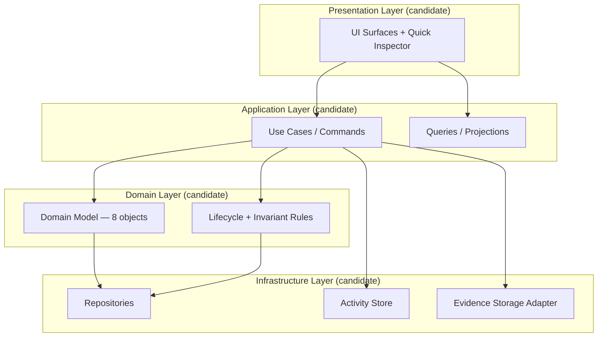
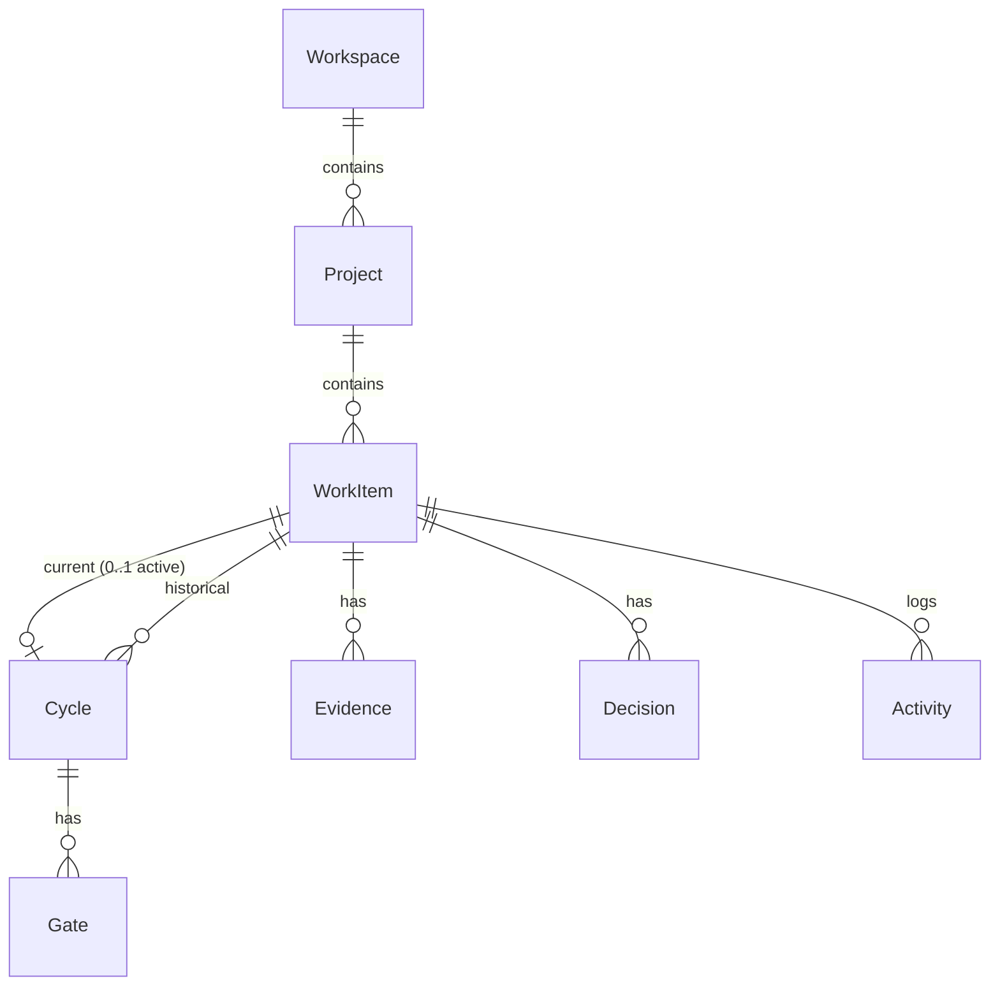

# SFIA Task Manager — M1 Technical Architecture Candidate

**Projet :** SFIA Task Manager
**Chemin :** `projects/sfia-task-manager/04-technical-architecture/2026-08-22-m1-technical-architecture.md`
**Cycle :** Cycle 5 — Technical Architecture
**Profil :** Standard
**Typologie :** DOC / TECHNICAL ARCHITECTURE CANDIDATE
**Baseline process :** SFIA v2.6
**Statut :** TECHNICAL ARCHITECTURE — CANDIDATE REFERENCE VALIDATED BY MORRIS — NOT ADOPTED FOR IMPLEMENTATION

---

## A. Purpose

### Objectif

Proposer une **architecture technique candidate** permettant de transformer, sans les remettre en cause :

- l'architecture fonctionnelle validée Cycle 3 ;
- la référence UX/UI Cycle 4 (contrat + design Figma candidate) ;
- les invariants fonctionnels M1 (I1–I12, AC01–AC16) ;

en un **contrat technique exploitable** pour une future implémentation.

### Relation avec l'architecture fonctionnelle

| Entrée Cycle 3 | Traduction technique candidate |
|----------------|--------------------------------|
| Zones A–G (responsabilités fonctionnelles) | Boundaries logiques candidates pour modules/composants — **sans choix définitif** |
| 8 objets M1 + ownership matrix | Modèle de domaine et persistence candidate |
| Interaction contracts sémantiques | Use cases / commandes / API candidates |
| Surfaces G = projections | Couche présentation candidate — non source de vérité |
| Activity append-only fonctionnelle | Journal d'événements / audit trail candidate |

Ce document **ne remplace pas** l'architecture fonctionnelle. Toute tension non résolue : l'architecture fonctionnelle et les décisions Morris prévalent.

### Relation avec la référence UX/UI

| Entrée Cycle 4 | Traduction technique candidate |
|----------------|--------------------------------|
| 5 surfaces métier + Quick Inspector | Routes/vues candidates mappées 1:1 aux frames Figma |
| Hiérarchie State → Next Action → Evidence → Decision | Ordre de chargement / priorité UI candidate |
| États critiques 06–10 | Variantes de vue / routes dérivées — pas nouveaux objets |
| Design Figma candidate | Référence visuelle pour implémentation future — **non binding stack** |
| Tokens / palette | **OPEN** — candidats documentés en design brief, non promus |

L'UX/UI reference informe **comment** présenter ; l'architecture fonctionnelle informe **quoi** autoriser techniquement.

### Autorité et qualification

**GO Morris (Cycle 5 open) :**

OPEN CYCLE 5 TECHNICAL ARCHITECTURE — STANDARD — USE VALIDATED FUNCTIONAL ARCHITECTURE AND UX/UI REFERENCE AS INPUT — NO DELIVERY / NO BACKLOG EXECUTION / NO IMPLEMENTATION

### Morris Cycle 5 Validation Decision

GO MORRIS — VALIDATE CYCLE 5 TECHNICAL ARCHITECTURE CANDIDATE AS REFERENCE — KEEP TD-01 TO TD-12 OPEN FOR IMPLEMENTATION DECISION — NO DELIVERY / NO BACKLOG EXECUTION IMPLIED

| Qualification | Valeur |
|---------------|--------|
| Nature | Documentaire / candidate reference uniquement |
| Architecture validated as candidate reference | **YES** |
| Architecture adopted for implementation | **NO** |
| Stack choisie | **NO** — TD-01→TD-12 remain OPEN |
| Implementation | **NOT EXECUTED** |
| Backlog execution | **NOT EXECUTED** |
| Delivery | **NOT EXECUTED** |
| M1 | **NOT READY** |
| AC demonstrated | **0/16** |

---

## B. System Boundary

### Inside the system (M1 candidate scope)

| Boundary | Contenu |
|----------|---------|
| **Core domain** | Lifecycle Work Item, Cycle execution, Gates, Evidence, Human Decision, Activity |
| **Organisation** | Workspace, Project, regroupement WI |
| **Presentation** | Workboard, Work Item, Cycle Workspace, Review & Decision, Project, Quick Inspector |
| **Rules engine (candidate)** | Enforcement I1–I12, transitions lifecycle, guards Cannot Ready / Done / NO-GO / REPLAN |
| **Audit** | Activity journal reconstructible (AF-P8, AC15) |

### Outside the system (explicit exclusions M1)

| External | Relation |
|----------|----------|
| **Git provider (native)** | Hors M1 — refs manuelles/informationnelles uniquement (I11) |
| **CI/CD pipelines** | Hors M1 |
| **Identity provider / SSO** | Hors M1 — auth candidate OPEN |
| **AI agent / Cursor product** | Hors M1 — recommendation-only si un jour intégré |
| **Email / notifications** | Hors M1 |
| **File storage cloud natif** | Hors M1 — Evidence = records + références candidate |
| **Analytics / reporting avancé** | Hors M1 |

### Dependencies potentielles (non choisies)

| Dependency type | Candidate need | Decision |
|-----------------|----------------|----------|
| Runtime (browser / desktop / server) | Exécuter UI + logique métier | **OPEN** |
| Persistence store | Objets M1 + Activity | **OPEN** |
| File/blob store (optional) | Attachments Evidence | **OPEN** |
| Auth provider (optional) | Single-user M1 → multi-user future | **OPEN** |

---

## C. Runtime Architecture Candidate

### Type d'application candidate (options — non exclusives)

| Option | Description | Fit M1 | Trade-off candidate |
|--------|-------------|--------|---------------------|
| **A1 — SPA + API** | Frontend riche + backend REST/GraphQL | Fort — surfaces denses, états complexes | 2 runtimes à opérer |
| **A2 — Full-stack monolith** | UI + domaine + persistence même déploiement | Fort — M1 scope borné | Scaling horizontal plus tard |
| **A3 — Local-first desktop** | App locale avec persistence embarquée | Moyen — operator unique M1 | Distribution / updates |
| **A4 — SSR hybrid** | Server-rendered + hydration client | Moyen | Complexité routing/état |

**Qualification :** Option candidate **A1 ou A2** à évaluer — alignement fort avec desktop-first 1440×1024 et densité UX. **Décision Morris requise.**

### Responsabilités principales (layers candidates)



### Séparation composants candidate

| Composant candidate | Responsabilité | Zone fonctionnelle |
|--------------------|----------------|---------------------|
| **Presentation** | Rendu surfaces, états UI, disabled+reason | G |
| **Application / Use Cases** | Orchestration interactions (Qualify, StartCycle, ApplyGo, …) | B–E |
| **Domain** | Entités, invariants, transitions autorisées | B–E |
| **Infrastructure** | Persistence, Activity append, file refs | F, D |
| **Integration adapters** | Git refs manuels, imports futurs | C (informational) |

**Règle :** Decision verdict logic reste dans Domain/Application — jamais dans Presentation seule (AC16, I1).

---

## D. Frontend Candidate

### Responsabilités UI

| Responsabilité | Détail |
|----------------|--------|
| **Projection** | Afficher état courant des objets — ne pas posséder lifecycle/verdict |
| **Interaction dispatch** | Émettre intentions utilisateur vers use cases |
| **State presentation** | Lifecycle column, badges, Blocked flag, gate status |
| **Disabled + reason** | Toute action indisponible expose cause (UX-P7, spec E01–E16) |
| **Navigation contextuelle** | Conserver WI/Cycle/Project context entre surfaces |

### Mapping Figma → routes/vues candidates

| Frame Figma | Node ID | Route/view candidate | Surface métier |
|-------------|---------|---------------------|----------------|
| 01 Workboard | `13:2` | `/workboard` | Workboard |
| Quick Inspector | `13:91` | panel transversal on `/workboard` | Quick Inspector |
| 02 Work Item | `13:114` | `/work-items/:id` | Work Item |
| 03 Cycle Workspace | `14:2` | `/work-items/:id/cycle` | Cycle Workspace |
| 04 Review & Decision | `14:106` | `/work-items/:id/review` | Review & Decision |
| 05 Project | `14:184` | `/projects/:id` | Project |
| 06 Blocked | `16:2` | variant `/work-items/:id` (blocked) | Critical state |
| 07 Cannot Ready | `16:27` | variant `/work-items/:id` (cannot-ready) | Critical state |
| 08 GO WITH RESERVE | `16:74` | variant `/work-items/:id/review` | Critical state |
| 09 REPLAN | `16:96` | variant `/work-items/:id/review` | Critical state |
| 10 Empty Workspace | `16:119` | `/` or `/empty` | Empty state |

**Note :** Critical states = **variants de vue** sur surfaces existantes — pas nouvelles routes métier.

### Gestion états UI candidate

| Pattern candidate | Usage |
|-------------------|-------|
| **Server/state sync** | Source de vérité = backend/domain — UI recharge après commande |
| **Optimistic UI (optional)** | Candidate future — risque AC16 si mal borné |
| **Form state local** | Qualification, reserve text, decision author/date — ephemeral until submit |
| **Selection state** | Workboard card selection → Quick Inspector payload |

### Gestion interactions candidate

| Interaction class | Frontend behavior candidate |
|-------------------|----------------------------|
| **Structural commands** | Qualify, StartCycle, Block, ApplyGo — confirm + disabled guards |
| **Evidence attach** | Form + file/reference metadata — manual M1 |
| **Decision record** | Explicit human fields (author, date, verdict) — no auto-fill verdict |
| **Navigation-only** | Open Work Item, Open Cycle — read context |

### Framework candidate (OPEN)

Options à évaluer : React, Vue, Svelte, Solid — avec state management candidate (TanStack Query, Redux, Zustand, etc.). **Aucune option adoptée.**

---

## E. Backend / Services Candidate

### Logique métier (domain services candidates)

| Service candidate | Zone | Responsabilités |
|-----------------|------|-----------------|
| **WorkItemLifecycleService** | B | Transitions lifecycle, Blocked flag, next_action, Cannot Ready guards |
| **CycleExecutionService** | C | StartCycle, one-active-Cycle (I3), contract enforcement, gate updates |
| **EvidenceService** | D | AttachEvidence, expected vs actual comparison inputs |
| **DecisionService** | E | RecordDecision, ApplyGo/GoWithReserve/NoGo/Replan — **human-only** |
| **ActivityService** | F | Append events on every structural interaction |
| **ProjectWorkspaceService** | A | CreateProject, aggregate queries |

### Lifecycle enforcement candidate

| Rule | Technical enforcement candidate |
|------|--------------------------------|
| I3 one active Cycle | Unique constraint / domain guard on `current_cycle_id` |
| I1 human verdict for Done | DecisionService gate — no Done without Decision record |
| I2 exit proof satisfied | EvidenceService + DecisionService joint validation |
| I8 Blocked orthogonal | Separate `blocked` flag — not lifecycle column enum |
| NO-GO (FQ01) | DecisionService returns WI to In Progress, Cycle stays Active |
| REPLAN | CycleService closes historical, WI → Qualified/Ready |

### Decision handling candidate

```
DecisionService.applyVerdict(verdict, author, date, reason?, reserve?)
  → validate Decision Pending
  → validate exit_proof if GO*
  → persist Decision (immutable record candidate)
  → apply lifecycle + Cycle effects per verdict
  → append Activity events
  → return updated projections
```

**Interdit techniquement :** auto-verdict, scheduled Done, AI-triggered ApplyGo without human confirmation.

### Evidence handling candidate

| Aspect | Candidate approach |
|--------|-------------------|
| Storage | Evidence record + optional blob reference |
| Types | validation note, screenshot, git ref manual, review summary |
| Attachment | Operator-initiated only (AC09) |
| Comparison | Review surface loads expected (WI exit_proof) vs actual (Evidence records) |
| Delete policy | **OPEN** (FQ04) — default candidate: no delete post-Decision |

---

## F. Data Architecture Candidate

### Objets persistés (candidate entity model)

| Entity | Key fields candidate | Authority |
|--------|---------------------|-----------|
| **Workspace** | id, name, created_at | A |
| **Project** | id, workspace_id, intent, created_at | A |
| **WorkItem** | id, project_id, status, blocked, blocked_reason, unblock_condition, next_action, qualification fields, exit_proof_spec, current_cycle_id | B |
| **Cycle** | id, work_item_id, status (active/historical), profile, scope, guardrails, git_refs_manual, started_at, closed_at | C |
| **Gate** | id, cycle_id, name, status, reason | C |
| **Evidence** | id, work_item_id, cycle_id?, type, reference, content_ref, attached_at | D |
| **Decision** | id, work_item_id, cycle_id, verdict, author, date, reason, reserve, recorded_at | E |
| **Activity** | id, entity_type, entity_id, event_type, payload, timestamp | F |

### Relations candidate



### Historique et audit trail candidate

| Mechanism | Candidate |
|-----------|-----------|
| **Activity table/event log** | Append-only — every structural interaction |
| **Cycle historical** | Status=historical — never overwrite (I4) |
| **Decision records** | Immutable after record — corrections = new Activity note, not silent edit |
| **Evidence preservation** | Retained on REPLAN/NO-GO — FQ04 OPEN for delete policy |

### Ownership / consistency candidate

| Pattern candidate | Usage |
|-------------------|-------|
| **Single writer per aggregate** | WorkItem aggregate root for lifecycle |
| **Transactional commands** | StartCycle, ApplyGo — atomic state + Activity |
| **Optimistic concurrency (optional)** | Version field on WorkItem — **OPEN** |

### Persistence technology (OPEN)

Options candidates : PostgreSQL, SQLite, embedded DB, document store. **Aucune base choisie.** Schema detail deferred to implementation cycle after Morris adoption.

---

## G. Identity / Security Candidate

### M1 assumption candidate

| Aspect | M1 candidate | Future |
|--------|--------------|--------|
| **Users** | Single operator implicit (local/dev) | Multi-user |
| **Decision authority** | Same operator en M1 | Role-based separation candidate |
| **Auth** | None or minimal local | SSO/OAuth candidate |
| **Authorization** | All commands allowed to operator | RBAC by role candidate |

### Authentication candidate (OPEN)

| Option | Fit M1 | Notes |
|--------|--------|-------|
| No auth (local tool) | High for dev/demo | Not production |
| Simple session auth | Medium | Enables future multi-user |
| SSO (OIDC) | Low for M1 | Enterprise future |

### Authorization candidate (OPEN)

| Role candidate (future) | Permissions candidate |
|-------------------------|----------------------|
| **Operator** | CRUD WI, attach evidence, prepare review |
| **Decision authority** | Record/apply Decision only |
| **Viewer** | Read-only projections |

M1 : distinction Operator vs Decision authority may be **same user, different UI affordances** — not enforced by RBAC until Morris decides.

### Security constraints candidate

| Constraint | Candidate enforcement |
|------------|----------------------|
| No auto structural decision | Server-side guards (AC16) |
| Human Decision fields required | Validation on RecordDecision |
| No silent disabled | API returns reason codes → UI displays |
| Audit trail | Activity immutable append |

---

## H. Integration Boundaries

### Git (manual / informational — I11)

| Aspect | M1 candidate |
|--------|--------------|
| Native Git sync | **OUT OF SCOPE** |
| Git refs on Cycle | Manual text fields — display in Cycle Workspace |
| Future native Git | Separate integration adapter — future cycle + Morris GO |

### Files externes

| Type | Candidate |
|------|-----------|
| Evidence screenshots | File upload → blob store reference on Evidence record |
| Validation notes | Text or file attachment |
| Export/import | **OPEN** — not required M1 |

### APIs externes

| API | M1 |
|-----|-----|
| External REST/GraphQL consumption | **NONE** |
| Webhooks | **NONE** |
| Future SFIA Studio convergence | **N/A** — distinct project unless Morris decides |

### Imports/exports candidate (OPEN)

Future candidates : JSON export of Project/WI history for backup — not M1 scope.

---

## I. Evidence Strategy (AC01–AC16)

### Principle

AC demonstration requires **observable, reproducible proofs** — not architecture adoption alone. This section defines how the **candidate architecture enables** future demonstration.

| Proof type | Candidate mechanism |
|------------|---------------------|
| **E2E scenario tests** | Script Playwright/Cypress against deployed candidate |
| **Domain integration tests** | Test use cases with in-memory or test DB |
| **Activity audit assertions** | Verify event sequence for AC15 |
| **API contract tests** | Verify guards return expected errors (E01, E05, …) |

### AC mapping — preuves attendues

| AC | Observable proof candidate | Events / states vérifiables |
|----|---------------------------|----------------------------|
| AC01 | Project entity exists, visible on Project surface | `project.created` Activity |
| AC02 | WI created with status=Inbox | `work_item.created`, status=Inbox |
| AC03 | Qualification fields populated, status=Qualified | `lifecycle.changed` → Qualified |
| AC04 | Ready transition rejected, reason lists missing fields | Guard error E01, status stays Qualified |
| AC05 | Cycle created, WI In Progress | `cycle.started`, current_cycle set |
| AC06 | Second StartCycle rejected while active | Guard E02, one active Cycle |
| AC07 | Gate blocks transition when pending | Gate status pending, transition refused |
| AC08 | Blocked=true, lifecycle unchanged, reason+unblock present | `work_item.blocked`, status unchanged |
| AC09 | Evidence record attached manually | `evidence.attached` |
| AC10 | Review shows scope/guardrails/exit_proof | Query projection completeness |
| AC11 | Decision record with author/date/verdict | `decision.recorded` |
| AC12 | Done rejected without decision or exit_proof | Guards E05/E06 |
| AC13 | REPLAN closes Cycle historical, WI reset trajectory | `replan.executed`, new Cycle NOT auto-created |
| AC14 | Workboard/Project show current states | Projection query test |
| AC15 | Activity timeline reconstructs full path | Activity sequence assertion |
| AC16 | No API/command applies verdict without human Decision | Negative test — auto paths blocked |

**AC demonstrated : 0/16** — architecture candidate maps all AC ; demonstration deferred to implementation cycle.

---

## J. Technical Decisions Open

Toutes les décisions structurantes restent **OPEN — Morris decision required**.

| # | Decision | Options candidates (non exhaustif) | Impact | Status |
|---|----------|-----------------------------------|--------|--------|
| TD-01 | **Stack frontend** | React, Vue, Svelte, Solid | Surfaces, hiring, ecosystem | **OPEN** |
| TD-02 | **Stack backend** | Node, Python, Go, Rust, .NET | Domain implementation | **OPEN** |
| TD-03 | **Runtime topology** | SPA+API, monolith, local-first | Ops complexity | **OPEN** |
| TD-04 | **Persistence** | PostgreSQL, SQLite, embedded | Deployment, scaling | **OPEN** |
| TD-05 | **Evidence blob storage** | DB blob, filesystem, S3-compatible | Attachments | **OPEN** |
| TD-06 | **Hosting** | Local, VPS, cloud PaaS, container | Availability | **OPEN** |
| TD-07 | **Authentication** | None, session, OIDC | Multi-user path | **OPEN** |
| TD-08 | **Authorization model** | Single-user, RBAC | Decision separation | **OPEN** |
| TD-09 | **API style** | REST, GraphQL, RPC, in-process | Frontend coupling | **OPEN** |
| TD-10 | **Observability** | Logs, metrics, tracing | RUN readiness | **OPEN** |
| TD-11 | **CI/CD** | GitHub Actions, other | Delivery pipeline | **OPEN** |
| TD-12 | **Design tokens binding** | CSS vars, Tailwind, design system lib | UI fidelity vs Figma | **OPEN** |

**Aucune option ci-dessus n'est adoptée par ce document.**

---

## K. Risks / Constraints

### Risks

| ID | Risk | Mitigation candidate |
|----|------|---------------------|
| TR-01 | UI becomes source of truth (surfaces own state) | Strict projection pattern ; server-authoritative |
| TR-02 | Decision automation creep (AC16 violation) | DecisionService isolated ; no background jobs on verdict |
| TR-03 | Lifecycle/Cycle desync (I3 violation) | Aggregate root + DB constraint candidate |
| TR-04 | Evidence loss on REPLAN (I5) | Immutable Evidence + explicit FQ04 policy before delete |
| TR-05 | Over-engineering before M1 demo | Defer microservices, event sourcing, CQRS |
| TR-06 | Figma drift from implementation | Design coverage checklist per surface |
| TR-07 | Stack decision premature | This cycle = candidate only ; Morris gate before code |

### Constraints

| Constraint | Source |
|------------|--------|
| 8 objects only — no 9th | Functional architecture |
| Human Decision never automated | I1, AC16 |
| Git manual only M1 | I11 |
| Blocked orthogonal | I8 |
| One active Cycle | I3 |
| Desktop-first 1440×1024 | UX contract |
| M1 NOT READY / 0/16 AC | All cycles |
| FQ02–FQ05 OPEN | Functional spec |

### Potential debt candidates

| Debt | Trigger |
|------|---------|
| Single-user auth shortcut | Choosing no auth for M1 demo |
| In-memory Activity for prototype | Before persistence decision |
| Hardcoded Workspace | M1 single-tenant assumption |

---

## L. Next Architecture Gate

### Morris Cycle 5 validation (current)

**MORRIS TECHNICAL ARCHITECTURE REVIEW — COMPLETED AS CANDIDATE REFERENCE**

GO MORRIS — VALIDATE CYCLE 5 TECHNICAL ARCHITECTURE CANDIDATE AS REFERENCE — KEEP TD-01 TO TD-12 OPEN FOR IMPLEMENTATION DECISION — NO DELIVERY / NO BACKLOG EXECUTION IMPLIED

| Outcome realized | Effect |
|------------------|--------|
| **Validate as candidate reference** | Document frozen as technical architecture *reference* ; TD-01→TD-12 remain OPEN ; no implementation adoption |

### Conditions de passage vers implémentation

| # | Condition | Status |
|---|-----------|--------|
| G1 | Morris validates technical architecture candidate as reference | **DONE — AS REFERENCE** |
| G2 | Stack decisions TD-01–12 resolved by Morris for implementation | **OPEN** |
| G3 | UX/UI reference validated by Morris (Cycle 4) | **DONE — AS DESIGN REFERENCE** |
| G4 | Backlog cycle authorized (separate Morris GO) | **NOT AUTHORIZED** |
| G5 | Delivery cycle authorized (separate Morris GO) | **NOT AUTHORIZED** |
| G6 | M1 AC demonstration plan accepted | **OPEN** |

### Downstream candidates (NOT AUTHORIZED)

| Cycle candidate | Input from this document |
|-----------------|-------------------------|
| Backlog / user stories | Interaction contracts → stories |
| Delivery / implementation | Domain model + surfaces |
| QA / validation | AC proof strategy §I |
| DevOps | TD-11, hosting |

**No backlog or delivery authorized by Cycle 5 validation.** Implementation decision requires separate Morris GO resolving TD-01→TD-12.

---

## Explicit non-decisions

- Frontend framework adopted
- Backend language adopted
- Database chosen
- Cloud/hosting chosen
- Auth provider chosen
- API protocol chosen
- Microservices split
- Event sourcing / CQRS
- Git native integration
- Design tokens finalized
- M1 READY
- Implementation started

---

## Traceability

| Source | Path | Status consumed |
|--------|------|-----------------|
| Functional spec | `01-functional/2026-08-19-m1-functional-spec.md` | VALIDATED BY MORRIS |
| Functional architecture | `02-architecture/2026-08-20-m1-functional-architecture.md` | VALIDATED BY MORRIS |
| UX/UI contract | `03-design/2026-08-20-m1-ux-ui-contract.md` | VALIDATED BY MORRIS AS CYCLE 4 DESIGN REFERENCE |
| Figma design brief | `03-design/2026-08-20-figma-design-brief.md` | VALIDATED BY MORRIS AS CYCLE 4 DESIGN REFERENCE |
| Figma source | fileKey `2U8pJCYBMtGxaK0F0Ef1nO` | VALIDATED BY MORRIS AS CYCLE 4 DESIGN REFERENCE |

---

## Explicit separation

Ce projet n'est **pas** SFIA Studio v3. SFIA v2.6 = baseline process. Architecture **technique candidate reference** — **VALIDATED BY MORRIS AS REFERENCE** — **NOT ADOPTED FOR IMPLEMENTATION**.
