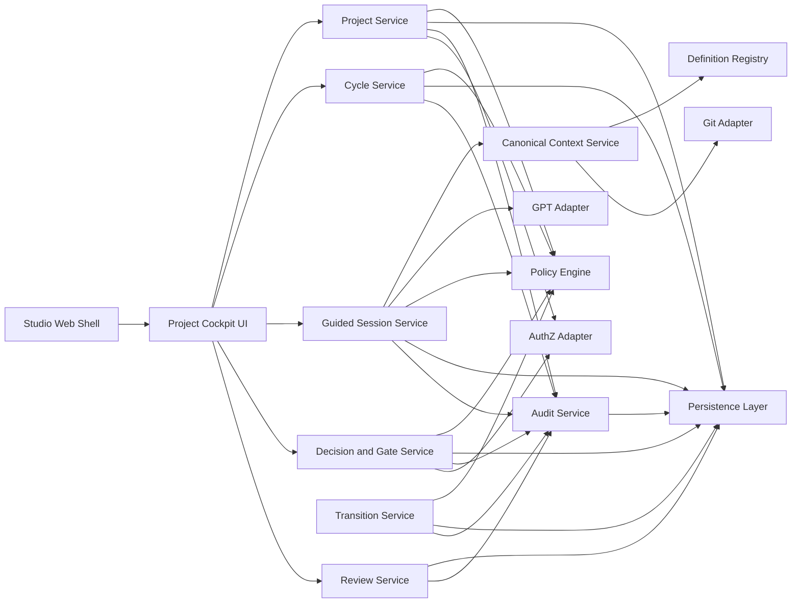
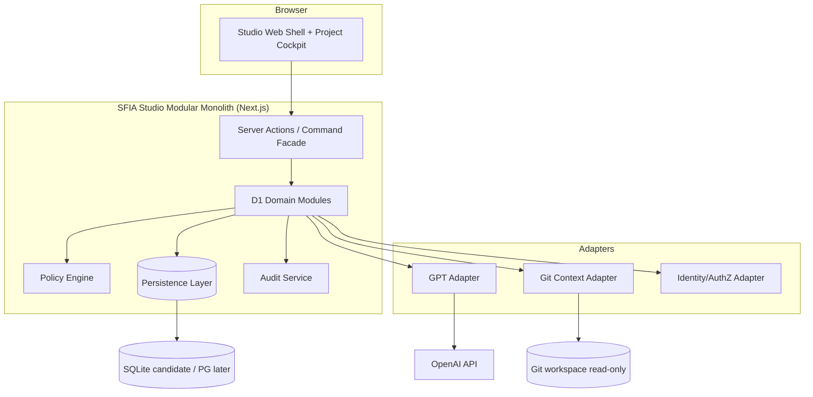
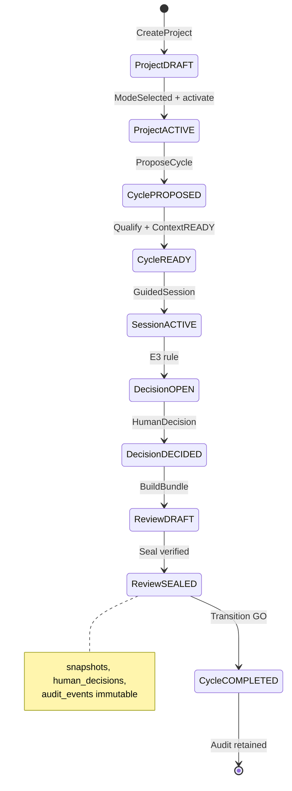
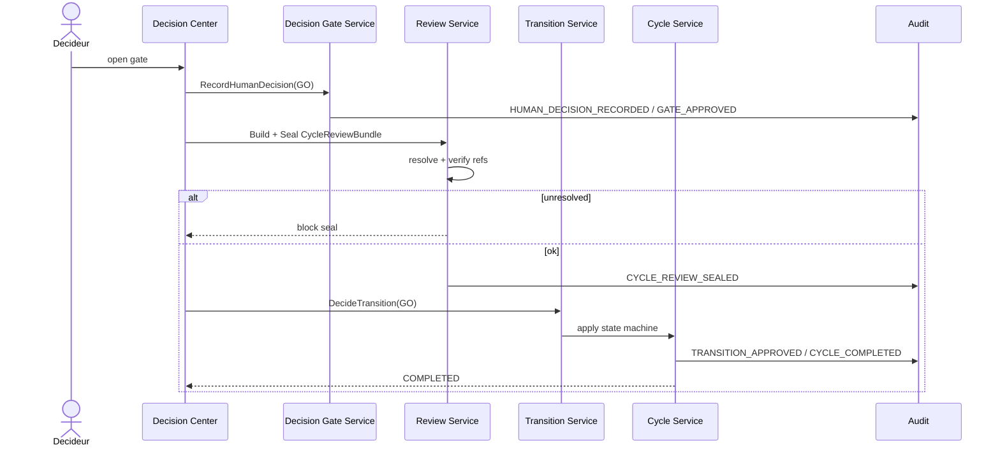
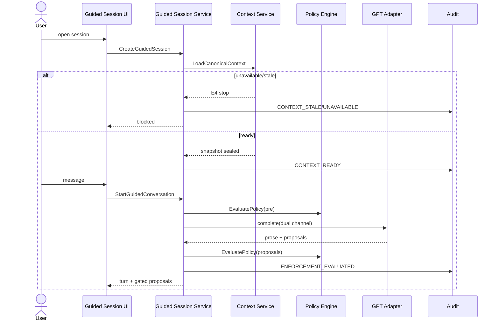
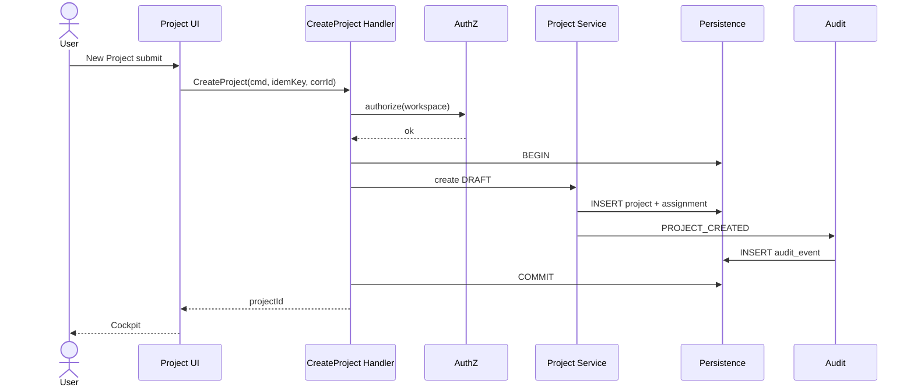

# Review Pack Full — SFIA v3.0 D1 Implementation Design

## 1. Métadonnées

- **Date/heure/fuseau :** 2026-07-22 18:18:19 CEST
- **Cycle :** 7 — Architecture technique (ARCHI/CONCEPTION/EVOL)
- **Profil :** Critical
- **Gate consommé :** GO VALIDATION V3-MODELED — FOUNDATION AND SLICE D1
- **Gate suivant :** GO VALIDATION CONCEPTION D1 — IMPLEMENTATION READINESS
- **Repo/branche :** mcleland147/sfia-workspace · delivery/sfia-studio-control-tower-fast-track
- **HEAD/base :** 32e5271842b9a344a7e292614675c27ea8ed941b
- **Handoff précédent :** 5f5e2758821d10ac06d9b8e7b3e11e4b8d189857
- **Baseline :** SFIA v2.6
- **Statut v3 :** V3-MODELED CANDIDATE (inchangé)
- **BCDI :** BCDI-D1-PROJECT-FRAMING-DESIGN
- **État Git initial :** dirty attendu (CT + framing + modeled) · staged vide · HEAD=origin/main

## 2. Sources consultées

- sfia-v3-modeled README + 01–10 + schemas/** + examples/**
- sfia-v3-framing 01–29 (priorité archi 09/10, journeys, enforcement, review, Option D)
- handoff modeled 5f5e275
- docs 66–74 + OPS1/CT code en lecture (Next 15, node:sqlite, openai, ajv6, server actions patterns)
- method/prompts canoniques v2.6 en lecture

## 3. Périmètre / hors scope

Inclus : conception implémentable D1 Project Framing.
Exclus : code, migrations, deps, API runtime, écrans runtime, D2/D3 complets, adoption v3.

## 4. Synthèse décisions

- Modular monolith Next.js
- Server Actions + command handlers
- SQLite node:sqlite pour I1 ; SQL portable PG later
- GPT dual-channel non-mutateur
- Policy déterministe E0–E4
- Premier incrément : D1-I1 Project foundation

## 5. Fichiers Markdown (contenu complet)


### `projects/sfia-studio/sfia-v3-design/d1-project-framing/README.md`

```markdown
# SFIA v3.0 — D1 Project Framing — Implementation Design

| Champ | Valeur |
|-------|--------|
| **Statut** | **D1 IMPLEMENTATION DESIGN CANDIDATE** |
| **BCDI** | `BCDI-D1-PROJECT-FRAMING-DESIGN` |
| **Gate consommé** | `GO VALIDATION V3-MODELED — FOUNDATION AND SLICE D1` |
| **Gate suivant** | `GO VALIDATION CONCEPTION D1 — IMPLEMENTATION READINESS` |
| **Baseline** | SFIA v2.6 |
| **Statut v3** | V3-MODELED CANDIDATE (inchangé) |
| **Code / migrations** | Interdits dans ce cycle |

## Objectif

Transformer `sfia-v3-modeled` (slice D1) en dossier de conception implémentable : composants, services, API/commandes, persistance, GPT borné, policies/gates, UX, ReviewBundle, sécurité, RUN, tests, backlog.

## Contenu

| # | Fichier |
|---|---------|
| 01 | Scope & décisions de conception |
| 02 | Architecture de composants cible |
| 03 | Services applicatifs & responsabilités |
| 04 | Contrats API / commandes |
| 05 | Persistance & transactions |
| 06 | Conception GuidedSession GPT |
| 07 | Policy & orchestration des gates |
| 08 | Parcours UX & contrats d’écran |
| 09 | ReviewBundle & audit |
| 10 | Sécurité, RGPD, permissions |
| 11 | Observabilité, RUN, résilience |
| 12 | Stratégie de tests & acceptation |
| 13 | Découpage delivery & backlog |
| 14 | ADR technologiques candidats |
| 15 | Decision pack — implementation readiness |
| diagrams/ | Mermaid (conteneurs, composants, séquences, data lifecycle) |

## Sources d’entrée

- `projects/sfia-studio/sfia-v3-modeled/**` (validé gate)
- `projects/sfia-studio/sfia-v3-framing/01–29`
- Acquis Control Tower / OPS1 (`node:sqlite`, Next.js server actions, conversation GPT, Git read, policy/gate patterns) — **réutilisation logique**, pas modification ici

## Anti-claims

Pas V3-IMPLEMENTED · pas adoption v3 · pas code · pas migrations · pas D2/D3 complets · canoniques v2.6 intactes.

```

### `projects/sfia-studio/sfia-v3-design/d1-project-framing/01-design-scope-and-decisions.md`

```markdown
# 01 — Design scope and decisions

| Champ | Valeur |
|-------|--------|
| BCDI | BCDI-D1-PROJECT-FRAMING-DESIGN |
| Modeled source | BCDI-D1-PROJECT-FRAMING-MODEL |

## 1. Périmètre inclus

Parcours unique :

Workspace → CreateProject → SelectMethodMode → ProjectTrajectory → Propose/Open Cycle cadrage → GuidedSession → ContextSnapshot → conversation guidée → EnforcementEvaluation → Reserve/DecisionRequest → GateInstance → HumanDecision → TransitionProposal → CycleReviewBundle → DecideTransition → CompleteCycle → AuditEvents.

Objets : WorkspaceReference, Project, ProjectTrajectory, CycleInstance, GuidedSession, ContextSnapshot, EnforcementRule/Evaluation, Reserve, DecisionRequest, GateInstance, HumanDecision, TransitionProposal, CycleReviewBundle, AuditEvent, Assignment, DoctrineDefinitionApplied.

## 2. Hors périmètre (placeholders / refs externes)

ActionCandidate, ExecutionContract, Cursor runtime, Evidence technique D2, Action/ReleaseReview, Capitalization D3, connecteurs externes complets, OpenAPI exécutable, Figma.

## 3. Décisions de conception candidates (ce cycle)

| ID | Décision | Statut |
|----|----------|--------|
| DD-01 | Modular monolith Next.js (même app Studio) | candidate |
| DD-02 | Façade = Server Actions + command handlers internes | candidate |
| DD-03 | Persistance D1 : SQLite (`node:sqlite`) pour 1er incrément ; schéma portable PostgreSQL | candidate |
| DD-04 | JSON Schema Draft-07 (ajv6 présent) pour validation instances | candidate (héritage modeled) |
| DD-05 | GPT = dual channel (prose + propositions structurées) ; jamais mutateur d’état | candidate |
| DD-06 | Policy Engine déterministe avant/après GPT | candidate |
| DD-07 | Audit append-only ; pas d’event sourcing complet | candidate (D5 framing) |
| DD-08 | Premier incrément utile = D1-I1 Project foundation | candidate |

## 4. Non-décisions (gates humains)

- Adoption v3 · GO IMPLEMENTATION D1 · choix définitif PostgreSQL prod · multi-user IdP · ajv8 / Draft 2020-12 · découpage microservices.

## 5. Contraintes dures

- Fail-closed E4 · human-governed E3 · git-truth ContextSnapshot · ReviewBundle résolvable+vérifié · aucune règle déterministe portée par GPT.

```

### `projects/sfia-studio/sfia-v3-design/d1-project-framing/02-target-component-architecture.md`

```markdown
# 02 — Target component architecture

## 1. Recommandation de déploiement

| Option | Verdict |
|--------|---------|
| **Modular monolith** (Next.js app + modules domaine) | **Recommandé candidat** |
| Services séparés | Rejeté pour D1 (ops/coût prématurés) |
| Hybride (monolithe + workers) | Reporté ; jobs sync suffisent D1 |

**Justification :** stack Studio existante = Next 15 + React 19 + `node:sqlite` OPS1 + OpenAI provider + server-side orchestration. D1 doit étendre le monolithe modulaire (Option C CT) sans inventer une plateforme.

Voir `diagrams/d1-container-diagram.mmd` et `d1-component-diagram.mmd`.

## 2. Composants logiques D1

| Composant | Responsabilité | Possède | Fusion possible |
|-----------|----------------|---------|-----------------|
| Studio Web Shell | Navigation workspace, mode badge, layout | — | — |
| Project Cockpit UI | Vue projet, cycles, décisions | — | Shell |
| Project Service | CRUD Project, mode, trajectory, archive | Project, Trajectory | — |
| Cycle Service | CycleInstance lifecycle | CycleInstance | Transition Service |
| Guided Session Service | Session + turns orchestration | GuidedSession | Conversation (OPS1) |
| Canonical Context Service | Load/seal ContextSnapshot, stale checks | ContextSnapshot | Definition Registry |
| Definition Registry | doctrineVersion + definitionDigests | DoctrineDefinitionApplied | Context Service |
| Policy Engine | Évalue E0–E4 D1 rules | EnforcementEvaluation | — |
| Decision & Gate Service | DR, Gate, HumanDecision | Decision*, Gate* | — |
| Transition Service | TransitionProposal + effets état | TransitionProposal | Cycle Service |
| Review Service | Build/seal CycleReviewBundle | ReviewBundle | — |
| Audit Service | Append-only AuditEvent | AuditEvent | — |
| Identity/AuthZ Adapter | Rôles, assignments | Assignment | Stub mono-opérateur |
| Git Context Adapter | HEAD, blobs, digests (read-only) | — | Réutilise CT Git local |
| GPT Adapter | Completions structurées bornées | — | Réutilise openaiProvider |
| Persistence Layer | Transactions SQL | tables D1 | `node:sqlite` + future PG |

## 3. Matrice composants (extraits)

### Project Service
- API : CreateProject, SelectMethodMode, DefineTrajectory, ArchiveProject
- Deps : Persistence, AuthZ, Audit, Policy
- Events : PROJECT_CREATED, PROJECT_MODE_SELECTED, PROJECT_ACTIVATED
- GPT : aucun
- Erreurs : UNAUTHORIZED, CONFLICT (optimistic lock), MODE_REQUIRED
- Observabilité : project_create_total, project_state

### Guided Session Service
- API : CreateGuidedSession, StartGuidedConversation
- Deps : Context, GPT Adapter, Policy, Audit
- Events : SESSION_*, CONTEXT_*, RULE_MATCHED
- GPT : reformule/propose ; n’écrit pas l’état
- Risque : prompt injection → isolation contexte + redaction

### Policy Engine
- API : EvaluatePolicy
- Deps : rules catalog (JSON defs), Project/Cycle state
- Deterministe 100 %
- Events : ENFORCEMENT_EVALUATED
- Cache : candidate court TTL ; invalidé sur digest/state change

### Decision & Gate Service
- API : RequestHumanDecision, OpenGate, RecordHumanDecision
- Sealed HumanDecision immutable
- Events : DECISION_*, GATE_*

### Review Service
- Règle : MODIFIED CONTENT MUST BE RESOLVABLE AND VERIFIED
- Deps : Git Adapter, Context, Audit refs
- Events : CYCLE_REVIEW_SEALED

## 4. Frontières

- **UI** ne mute jamais SQL directement.
- **GPT Adapter** n’appelle pas Persistence.
- **Policy** avant effet d’état.
- **Cursor/Execution** hors D1 (pas de composant D1).

## 5. Mapping acquis OPS1/CT (lecture seule)

| Acquis | Usage D1 design |
|--------|-----------------|
| `conversation/service.ts` + openaiProvider | Pattern Guided Session |
| `db.ts` / repository / session_events | Pattern persistence + audit table |
| actionGate / decisions UI | Pattern Gate Modal / Decision Center |
| Git tools read | Git Context Adapter |
| sfia canonical context engine | Canonical Context + Definition Registry |
| Ops1SessionScreen | Expérimental → remplacé par Project Cockpit / Guided Session screens |

```

### `projects/sfia-studio/sfia-v3-design/d1-project-framing/03-application-services-and-responsibilities.md`

```markdown
# 03 — Application services and responsibilities

Chaque cas d’usage = commande applicative (handler) dans le modular monolith.

Légende colonnes : AuthZ · Preconditions · Aggregates · Rules · Tx · Events · Idempotence · Errors.

## Catalogue des use cases

### CreateProject
- Commande : `CreateProject`
- Acteur : user assignable `project_owner`
- AuthZ : workspace membership
- Précond : WorkspaceReference résolu
- Aggregats : Workspace → new Project(DRAFT)
- Rules : —
- Tx : insert project + assignment owner + audit
- Events : PROJECT_CREATED
- Résultat : projectId
- Idempotence : Idempotency-Key → même projectId
- Errors : WS_NOT_FOUND, UNAUTHORIZED
- Tests : nominal + duplicate key

### SelectProjectMethodMode
- Acteur : project_owner
- Précond : Project DRAFT|ACTIVE ; mode null ou change gated
- Rules : D1-MODE-REQUIRED (si activate sans mode)
- Events : PROJECT_MODE_SELECTED
- Gate : MethodModeGate (E3) si claim v3_candidate

### DefineProjectTrajectory
- Acteur : owner + GPT suggestion optionnelle
- Aggregats : ProjectTrajectory
- Events : (candidate) TRAJECTORY_UPDATED — ou audit générique
- GPT : peut proposer draft ; commit = humain

### ProposeCycle / OpenCycle
- Acteur : owner
- Précond : methodMode set ; Project not ARCHIVED
- Rules : D1-MODE-REQUIRED, D1-CYCLE-INCOMPAT, D1-V3-CLAIM-INELIGIBLE
- States : PROPOSED → QUALIFYING → READY
- Events : CYCLE_PROPOSED, CYCLE_QUALIFICATION_STARTED, CYCLE_OPENED

### CreateGuidedSession
- Précond : Cycle READY|ACTIVE
- Rules : D1-FREE-CHAT, D1-NO-PROJECT
- Events : SESSION_CREATED

### LoadCanonicalContext
- Service : Canonical Context + Git Adapter + Definition Registry
- Rules : D1-CONTEXT-UNAVAILABLE, D1-CONTEXT-STALE, D1-DIGEST-MISMATCH
- Events : CONTEXT_LOADING_STARTED, CONTEXT_READY | CONTEXT_STALE
- Snapshot sealed immutable

### StartGuidedConversation
- Dual channel GPT
- Policy evaluate after each structured proposal
- Events : RULE_MATCHED, ENFORCEMENT_EVALUATED
- GPT ne mute pas state

### EvaluatePolicy
- Input : trigger + object refs + actor
- Output : EnforcementEvaluation { level, ruleIds, effect, explanationKey, correctionOptions }
- Fail-closed on engine error (E4)

### CreateReserve / RequestHumanDecision / OpenGate
- E2/E3 paths
- Events : RESERVE_CREATED, DECISION_REQUESTED
- Gate types : voir doc 07

### RecordHumanDecision
- Acteur : decision_maker / approver selon gate
- Rules : D1-ROLE-UNAUTHORIZED
- Sealed record immutable
- Events : HUMAN_DECISION_RECORDED, GATE_APPROVED|REJECTED

### ProposeTransition / DecideTransition
- Rules : D1-HUMAN-DECISION-REQUIRED, D1-INVALID-TRANSITION
- Events : TRANSITION_PROPOSED, TRANSITION_APPROVED

### BuildCycleReviewBundle / SealCycleReviewBundle
- Rules : refs résolvables + digests vérifiés
- Events : CYCLE_REVIEW_SEALED
- Incomplete → cannot complete cycle

### CompleteCycle / OpenNextCycle
- Rules : D1-CYCLE-NO-REVIEW
- Events : CYCLE_COMPLETED, NEXT_CYCLE_OPENED

### ArchiveProject
- Précond : CLOSED or GO
- Soft delete assignments optional ; audit retained

## Responsabilités croisées

| Concern | Owner |
|---------|-------|
| State machine integrity | Cycle / Project Services + Policy |
| Deterministic rules | Policy Engine only |
| Prose & suggestions | GPT Adapter via Guided Session |
| Proof & non-repudiation | HumanDecision + Audit + ReviewBundle |
| Git truth | Context Service + Git Adapter |

```

### `projects/sfia-studio/sfia-v3-design/d1-project-framing/04-api-and-command-contracts.md`

```markdown
# 04 — API and command contracts

## 1. Modèle d’accès recommandé (candidat)

| Option | Verdict |
|--------|---------|
| REST public large | Non pour D1 |
| **Server Actions + command handlers** | **Recommandé** (aligné Next/OPS1) |
| Event bus distribué | Non |
| Internal in-process command bus | Oui (handlers purs testables) |

Version API logique : `d1/v0`. Correlation-ID obligatoire. Idempotency-Key sur mutations.

## 2. Commandes synchrones (candidats)

| Commande | Méthode/chemin candidat | Rôle | Enforcement | Request (min) | Response | Errors |
|----------|-------------------------|------|-------------|---------------|----------|--------|
| CreateProject | SA `d1.createProject` | user→owner | — | `{workspaceId,title,idempotencyKey}` | `{projectId,state}` | 403,404,409 |
| SelectMethodMode | SA `d1.selectMethodMode` | owner | D1-MODE / V3-CLAIM | `{projectId,methodMode,expectedVersion}` | `{project}` | 403,409,422 |
| DefineTrajectory | SA `d1.defineTrajectory` | owner | — | `{projectId,contentRef}` | `{trajectoryId}` | 403,409 |
| ProposeCycle | SA `d1.proposeCycle` | owner | D1-MODE, CYCLE-INCOMPAT | `{projectId,cycleType}` | `{cycleId,state}` | 422 |
| OpenCycle | SA `d1.openCycle` | owner | same | `{cycleId}` | `{cycle}` | 409 |
| CreateGuidedSession | SA `d1.createGuidedSession` | user | D1-FREE-CHAT | `{cycleId}` | `{sessionId}` | 422 |
| LoadCanonicalContext | SA `d1.loadCanonicalContext` | system/user | CONTEXT-* | `{sessionId}` | `{snapshotId,status}` | 503,STALE |
| StartGuidedConversation | SA `d1.sendGuidedTurn` | user | FREE-CHAT, CONTEXT-STALE | `{sessionId,message}` | `{turn,proposals[]}` | 429,503 |
| EvaluatePolicy | internal | system | — | `{trigger,refs,actor}` | `{evaluation}` | ENGINE_FAIL→E4 |
| CreateReserve | SA/internal | system/user | E2 | `{cycleId,type,reason}` | `{reserveId}` | — |
| RequestHumanDecision | SA `d1.requestDecision` | system/user | E3 | `{cycleId,kind}` | `{decisionRequestId}` | — |
| OpenGate | SA `d1.openGate` | system | ROLE | `{decisionRequestId,gateKind}` | `{gateId}` | 403 |
| RecordHumanDecision | SA `d1.recordDecision` | decideur | ROLE | `{gateId,verdict,rationale,expectedVersion}` | `{decisionId}` | 403,409,EXPIRED |
| ProposeTransition | SA `d1.proposeTransition` | owner/GPT-draft | HUMAN-DECISION, INVALID-TRANSITION | `{cycleId,to}` | `{proposalId}` | 422 |
| BuildReviewBundle | SA `d1.buildReviewBundle` | system/owner | — | `{cycleId}` | `{bundleId,status:DRAFT}` | — |
| SealReviewBundle | SA `d1.sealReviewBundle` | decideur | NO-REVIEW | `{bundleId}` | `{status:SEALED,digests}` | UNRESOLVED_REF |
| DecideTransition | SA `d1.decideTransition` | decideur | gates | `{proposalId,verdict}` | `{cycleState}` | 403 |
| CompleteCycle | SA `d1.completeCycle` | owner/decideur | NO-REVIEW | `{cycleId}` | `{state:COMPLETED}` | 422 |
| OpenNextCycle | SA `d1.openNextCycle` | owner | — | `{projectId,fromCycleId}` | `{nextCycleId}` | — |
| ArchiveProject | SA `d1.archiveProject` | admin/owner | — | `{projectId}` | `{state:ARCHIVED}` | 409 |

## 3. Lectures

| Query | Path candidat | Notes |
|-------|---------------|-------|
| GetWorkspaceHome | `d1.getWorkspace` | projects list |
| GetProjectCockpit | `d1.getProject` | cycles, mode, open gates |
| GetGuidedSession | `d1.getSession` | turns, context status |
| GetDecisionCenter | `d1.listOpenDecisions` | gates OPEN |
| GetAuditTimeline | `d1.listAuditEvents` | filter project/cycle |
| GetReviewBundle | `d1.getReviewBundle` | DRAFT/SEALED view |

## 4. Événements internes

Bus **in-process** : après commit SQL, émettre vers Audit Service (même transaction) + hooks UI (revalidate). Pas de broker externe D1.

## 5. Contrats GPT / Git / Review

- GPT : input `GuidedTurnRequest` → output `{prose, proposals: GuidedProposal[]}` validé JSON Schema candidat
- Git : `resolveBlob(path,ref) → {bytes,sha256}` ; `getHead() → sha`
- Review : `resolveAndVerify(refs[]) → {ok,failures[]}`

## 6. Headers / meta communs

`correlationId`, `causationId?`, `actorId`, `idempotencyKey?`, `doctrineVersion`, `clientSchemaVersion: 0.1.0-d1`.

```

### `projects/sfia-studio/sfia-v3-design/d1-project-framing/05-persistence-and-transaction-design.md`

```markdown
# 05 — Persistence and transaction design

## 1. Recommandation candidate (1er incrément)

| Option | Verdict |
|--------|---------|
| **SQLite via `node:sqlite` (comme OPS1)** | **Recommandé candidat D1-I1** |
| PostgreSQL immédiat | Option future prod multi-user |
| Abstraction SQL portable (types + repositories) | **Oui** — écrire SQL dialect-safe |
| ORM (Prisma/Drizzle) | **Non pour D1** — absent du package.json ; SQL explicite |

Statut : **candidate jusqu’au gate humain**. Pas de migration dans ce cycle.

## 2. Agrégats transactionnels

| Agrégat | Racine | Inclus |
|---------|--------|--------|
| ProjectAgg | projects | trajectories, assignments, doctrine_definitions_applied |
| CycleAgg | cycle_instances | guided_sessions (ref), transition_proposals |
| SessionAgg | guided_sessions | turns (table fille), context_snapshot_id |
| DecisionAgg | decision_requests | gate_instances, human_decisions |
| ReviewAgg | review_bundles | review_bundle_refs |
| AuditStream | audit_events | append-only, no update |

## 3. Frontières de transaction

Une commande = **une transaction SQL** :
1. load aggregates + version check
2. EvaluatePolicy (read)
3. mutate aggregates
4. insert audit_events
5. commit

Exceptions : LoadCanonicalContext peut commit snapshot même si session BLOCKED ; GPT call **hors** transaction (call → puis commande ApplyGuidedProposals).

## 4. Tables candidates (physique logique)

Alignées modeled doc 04 + :

- `guided_turns` (session_id, seq, role, prose_ref, proposals_json, created_at)
- `enforcement_evaluations` (optional materialization ; sinon payload audit)
- `idempotency_keys` (key, command, response_json, created_at)
- `schema_meta` (version)

Contraintes CHECK sur enums d’état (modeled 03).
`version INTEGER NOT NULL` sur projects, cycles, sessions, gates, bundles.
Sealed : human_decisions, context_snapshots, audit_events, sealed review payload — **no UPDATE**.

## 5. Index

Comme modeled + `idempotency_keys(key UNIQUE)` · `guided_turns(session_id,seq UNIQUE)` · `assignments(project_id,principal_id)`.

## 6. Soft delete / rétention

- projects/cycles/sessions : `deleted_at` nullable
- audit_events : never delete ; redaction job candidate
- PII actors : store actorId ; email hors audit payload

## 7. Concurrence

Optimistic locking `WHERE version=?` → 409 CONFLICT.
Gates EXPIRED via job/lecture lazy.
Pas de distributed lock D1.

## 8. Snapshots & digests

ContextSnapshot stocke `head_sha`, `definition_digests_json`, `created_at`.
Stale si `head_sha != current HEAD` ou digest map mismatch.

## 9. Portabilité PG

Éviter extensions SQLite-only dans SQL D1 ; JSON as TEXT ; timestamps ISO-8601 TEXT/TIMESTAMPTZ compatible.

```

### `projects/sfia-studio/sfia-v3-design/d1-project-framing/06-gpt-guided-session-design.md`

```markdown
# 06 — GPT guided session design

## 1. Rôle exact

| GPT peut | GPT ne peut pas |
|----------|-----------------|
| Clarifier, reformuler, challenger | Modifier l’état SQL |
| Proposer trajectoire / synthèse | Approuver un gate |
| Identifier un manque | Enregistrer HumanDecision |
| Suggérer décision / transition (draft) | Autoriser transition / contourner policy |
| | Lever une réserve / lancer exécution D2 |

## 2. Dual channel

1. **Prose** : texte libre affiché (non exécutable)
2. **Proposals structurées** : validées JSON Schema candidat → Policy Engine → éventuellement DecisionRequest

## 3. Contrats candidats (pas schémas figés hors modeled)

### GuidedTurn
`{ turnId, sessionId, role: user|assistant, prose, createdAt, contextSnapshotId }`

### GuidedProposal
`{ proposalId, kind: trajectory|decision|transition|reserve|question, payload, confidence? }`

### DecisionProposal / TransitionProposalDraft
Sous-types de GuidedProposal ; application = commandes humaines/moteur, pas auto-apply.

### ContextUsageReceipt
`{ snapshotId, headSha, doctrineVersion, definitionDigests, tokenEstimate, redactions[] }` — audit minimal + UI Context Status.

## 4. Construction du contexte

Priorité (budget tokens) :
1. System instructions D1 (rôle GPT borné, anti-claims)
2. ContextUsageReceipt + digests
3. Project + Cycle summaries
4. Open reserves / DecisionRequests
5. Trajectory excerpt
6. Recent turns (fenêtre)
7. Doctrine excerpts **via digests allowlisted** (pas de lecture libre filesystem GPT)

Stale detection : si snapshot stale → bloquer send (E4 D1-CONTEXT-STALE) avant appel GPT.

## 5. Validation sortie

- Parse JSON proposals
- Schema validate
- Reject unknown kinds
- Policy EvaluatePolicy on each proposal
- Hallucination guards : refuse claims of GO/APPROVED ; refuse file paths hors allowlist context

## 6. Retries / erreurs

- Provider timeout → user-visible retry ; no state mutate
- Malformed output → one repair prompt max puis BLOCKED + Reserve
- Injection : strip tool/system markers ; no secrets in context

## 7. Audit

Log : attempt ids, model, token counts, snapshotId, proposalIds — **not** full prose if PII flagged (redaction policy).

## 8. Réutilisation OPS1

Pattern `conversation/service.ts` + `openaiProvider` + toolLoop **sans** tools d’exécution D2 ; tools éventuels = lecture contexte déjà chargé uniquement (candidate, borné).

```

### `projects/sfia-studio/sfia-v3-design/d1-project-framing/07-policy-and-gate-orchestration-design.md`

```markdown
# 07 — Policy and gate orchestration design

## 1. Projection runtime E0–E4

| Niveau | Effet runtime D1 |
|--------|------------------|
| E0 | Informational UI / log |
| E1 | Warning ; continue |
| E2 | Create Reserve ; may continue with banner |
| E3 | DecisionRequest + Gate ; block effect until HumanDecision |
| E4 | Hard block ; no state transition |

## 2. Moments d’évaluation

- Before command mutate
- After GPT structured proposal
- Before CompleteCycle / DecideTransition
- On context load and before each guided turn

## 3. Priorité / conflits

1. E4 wins over lower
2. Same level : union of correctionOptions ; most restrictive effect
3. Engine failure → treat as E4 fail-closed
4. No GPT arbitration of conflicts

## 4. Composition

Rules catalog JSON (modeled) loaded by Definition Registry digests.
`EvaluatePolicy(trigger, facts)` → ordered matched rules + dominant effect.

## 5. Explication / réserve / dérogation

- `userExplanationKey` → i18n UI
- Reserve : E2 path ; status OPEN until resolved
- Dérogation : **non** en D1 sauf gate humain explicite futur (hors scope)
- Expiration gates : `expires_at` ; lazy expire on read
- Révocation : Gate REVOKED + audit ; does not delete HumanDecision history

## 6. Cache / stale policy

Cache evaluations by `(ruleDigest, factsHash)` TTL short.
Invalidate on project/cycle version bump or context digest change.

## 7. Gates D1

| Gate | Trigger | Role | Preuves | Effet débloqué | Events |
|------|---------|------|---------|----------------|--------|
| ProjectCreationGate | optional org policy | owner | workspace auth | CreateProject | GATE_* |
| MethodModeGate | select mode / activate | owner/decideur | eligibility facts | mode persisted / ACTIVE | PROJECT_MODE_SELECTED |
| CycleOpeningGate | OpenCycle | owner | mode, project state | CYCLE_OPENED | |
| HumanDecisionGate | DecisionRequest OPEN | decideur | DR payload, context receipt | DECIDED | HUMAN_DECISION_RECORDED |
| TransitionGate | DecideTransition | decideur | proposal + review sealed? | state transition | TRANSITION_APPROVED |
| CycleCompletionGate | CompleteCycle | decideur/owner | ReviewBundle SEALED | COMPLETED | CYCLE_COMPLETED |

États gate : OPEN → APPROVED|REJECTED|EXPIRED|REVOKED (modeled 03).

## 8. Mapping rules → gates

D1-MODE-REQUIRED → MethodModeGate
D1-HUMAN-DECISION-REQUIRED / D1-CYCLE-NO-REVIEW → HumanDecisionGate / CycleCompletionGate
D1-ROLE-UNAUTHORIZED → block OpenGate/Record
D1-INVALID-TRANSITION → no TransitionGate open
E4 rules → no gate (hard stop) except informational link to correction.

```

### `projects/sfia-studio/sfia-v3-design/d1-project-framing/08-user-journey-and-screen-contracts.md`

```markdown
# 08 — User journey and screen contracts

## Parcours nominal

Workspace Home → New Project → Project Cockpit → select MethodMode → Project Framing (trajectory) → open Cycle → Guided Session (+ Context Status) → Reserve Panel / Decision Center → Gate Modal → Transition Review → Cycle Review seal → Audit Timeline.

## Contrats d’écran

| Écran | Objectif | Données | Actions | États | E | A11y | Acceptation |
|-------|----------|---------|---------|-------|---|------|-------------|
| Workspace Home | Lister projets | projects[] | create, open | L/E/Err | E4 no-project en v3 | landmarks | liste + CTA visible |
| New Project | Créer | form title | submit | validating | — | labels | CreateProject OK |
| Project Cockpit | Pilotage | project, cycles, openGates | open cycle, archive | stale badge | mode badge | headings | mode visible |
| Project Framing | Trajectory | trajectory | edit, ask GPT draft | — | E1 | — | save trajectory |
| Cycle Header | État cycle | cycle state machine | pause/cancel | — | — | live region state | state announced |
| Guided Session | Conversation | turns, proposals | send, apply draft? | context stale lock | E4 stale/free-chat | chat a11y | cannot send if stale |
| Context Status | Digests/HEAD | ContextUsageReceipt | reload | stale/unavail | E4 | status text | shows headSha |
| Reserve Panel | E2 items | reserves | acknowledge | — | E2 | — | reserve listed |
| Decision Center | Open DRs/gates | list | open gate | empty | E3 | — | gate reachable |
| Gate Modal | Décider | gate payload | approve/reject | expired | E3/E4 role | focus trap | RecordHumanDecision |
| Transition Review | Review proposal | proposal | approve/reject | — | E3 | — | invalid transition blocked |
| Cycle Review | Bundle | refs+digests | seal, export MD | unresolved | E3 no-review | — | seal only if verified |
| Audit Timeline | Preuve | events | filter | — | — | table | events append-only visible |

## Visuel

Réutiliser design system Studio existant ; pas de nouveau Figma obligatoire.
Recommandation : cycle UX ultérieur pour cockpits D1 si GO design.

## Permissions UI

Masquer actions non autorisées **et** refuser côté serveur (doc 10). Responsive : mobile lecture + décisions ; drafting préféré desktop.

```

### `projects/sfia-studio/sfia-v3-design/d1-project-framing/09-reviewbundle-and-audit-design.md`

```markdown
# 09 — ReviewBundle and audit design

## 1. CycleReviewBundle D1

### Moment
- Build : dès VALIDATING / fin cadrage (DRAFT)
- Progressive : ajouter refs à chaque livrable (trajectory, decisions, context, validation results, reserves)
- Seal : décideur après resolve+verify
- Export : Markdown handoff optionnel (baseline v2.6 encore active)
- Archive : après COMPLETED

### Règle
**MODIFIED CONTENT MUST BE RESOLVABLE AND VERIFIED**

Même sans code modifié, résoudre : docs cadrage projet, décisions, trajectoire, contexte, validation results, réserves, audit refs.

### Pipeline
1. Review Service collecte refs
2. Git Adapter / Persistence résolvent contenu
3. sha256 digests
4. ValidationResults struct
5. Seal → immutable payload + state SEALED
6. Audit CYCLE_REVIEW_SEALED
7. CompleteCycle autorisé

### Erreurs / reprise
- UNRESOLVED_REF / DIGEST_MISMATCH → rester DRAFT
- Retry reload context puis rebuild
- Pas de seal partiel silencieux

## 2. Responsabilités

| Service | Rôle |
|---------|------|
| Review Service | orchestration build/seal |
| Git Adapter | blobs/paths |
| Context Service | snapshot ref + digests |
| Decision Service | DR/HD refs |
| Audit Service | event ids referenced |

## 3. Audit append-only

Tous eventTypes modeled doc 06.
Champs communs AuditEvent schema.
Redaction : pas d’email, pas de secrets, pas de prose complète si flagged.
CorrelationId = parcours utilisateur ; CausationId = event parent.

## 4. Contrôles obligatoires au seal

| Contrôle | Fail |
|----------|------|
| Resolve all refs | block seal |
| Verify digests | block seal |
| Accessibility not `missing` for required | block |
| HumanVerdict present for completion path | block complete |
| AuditReferences non-empty for sealed cycle | warn E1 / policy candidate |

```

### `projects/sfia-studio/sfia-v3-design/d1-project-framing/10-security-rgpd-and-permission-model.md`

```markdown
# 10 — Security, RGPD and permission model

## 1. Rôles D1

| Rôle | Capacité principale |
|------|---------------------|
| user | participer session liée |
| project_owner (responsable) | créer/activer projet, cycles, trajectory |
| decision_maker (décideur) | gates E3, seal review, transitions |
| approver | gates où séparation requise (candidate) |
| admin | assignments, archive policies |
| system | context load, policy eval |

Séparation **responsable / décideur** recommandée pour TransitionGate & CycleCompletionGate (même personne tolérée en proto mono-opérateur avec audit explicite — **risque** à gate sécurité).

## 2. Matrice Role × Action × Object × Enforcement × Audit

| Role | Action | Object | E | Audit |
|------|--------|--------|---|-------|
| user | sendGuidedTurn | GuidedSession | E4 free-chat/stale | SESSION/ENFORCEMENT |
| owner | createProject | Workspace | — | PROJECT_CREATED |
| owner | selectMethodMode | Project | E3/E4 claim | PROJECT_MODE_SELECTED |
| owner | openCycle | Cycle | E3 incompat | CYCLE_* |
| decideur | recordDecision | Gate | E4 role | HUMAN_DECISION_* |
| decideur | sealReview | Bundle | E3 | CYCLE_REVIEW_SEALED |
| decideur | decideTransition | Proposal | E3/E4 | TRANSITION_* |
| admin | assignRole | Assignment | — | (audit) |
| system | evaluatePolicy | * | fail-closed | ENFORCEMENT_* |
| * | writeDoctrine | defs | E4 DEF-MODIFY | ENFORCEMENT |

## 3. Contrôles serveur

Toujours AuthZ server-side. UI hide ≠ security.
Workspace isolation : queries filtrées `workspace_id`.
Git : read-only adapter ; path allowlist doctrine.
GPT : no secrets ; limited tools ; prompt-injection guards (doc 06).
Idempotency keys bound to actor.

## 4. RGPD

- Données perso : actor identifiers, conversation prose
- Base légale candidate : intérêt légitime outil interne / contrat travail (à valider RSSI)
- Rétention : audit long ; prose session TTL plus court (candidate)
- Soft delete projets ; anonymiser actor display on export
- Droit d’accès : export ReviewBundle redacted
- Pas de sous-traitance GPT sans DPA revue (risque cycle sécu)

## 5. Risques → cycle sécurité dédié avant implémentation large

- Multi-user réel / IdP
- Séparation des devoirs stricte
- DPA OpenAI / logging prompts
- Retention & purge jobs
- Threat model prompt injection avancé

Proto mono-opérateur D1-I1 acceptable **si** anti-claims et audit présents.

```

### `projects/sfia-studio/sfia-v3-design/d1-project-framing/11-observability-run-and-resilience.md`

```markdown
# 11 — Observability, RUN and resilience

## 1. Télémétrie

- **Logs** structurés JSON : correlationId, projectId, cycleId, command, outcome
- **Metrics** : counters/histograms (création projet, context load ms, stale rate, gate latency, seal rate, transition errors)
- **Traces** : span per command ; child span GPT/Git
- **Business events** = AuditEvent stream (source of truth métier)

## 2. Dépendances & modes dégradés

| Dépendance | Indispo | Comportement D1 |
|------------|---------|-----------------|
| SQL | down | fail closed 503 ; no mute GPT-only |
| Git | down | CONTEXT_UNAVAILABLE E4 ; fallback claim v2.6 manual path (UI) |
| GPT | down | session BLOCKED ; reserves ; no auto-success |
| Policy engine | fail | E4 |

## 3. Reprise

- Idempotent command retry
- Rebuild ContextSnapshot
- Rebuild ReviewBundle DRAFT
- No silent auto-retry of sealed mutations

## 4. Backup / restore / archive

- SQLite file backup candidate (ops)
- Audit export
- Archived projects read-only

## 5. Support / diagnostic

Audit Timeline + correlationId search + ContextUsageReceipt + gate history.

## 6. SLI candidats (pas de SLO contractuel)

| SLI | Description |
|-----|-------------|
| project_create_success_rate | CreateProject OK |
| context_load_latency_p95 | LoadCanonicalContext |
| context_stale_rate | stale detections / sessions |
| decision_latency | OPEN gate → HumanDecision |
| gates_blocked_rate | E3/E4 blocks |
| review_sealed_rate | cycles with SEALED bundle |
| transition_error_rate | invalid transitions |
| d1_journey_availability | end-to-end readiness probe |

SLO chiffrés : **gate humain requis** (non fixés ici).

```

### `projects/sfia-studio/sfia-v3-design/d1-project-framing/12-test-strategy-and-acceptance-criteria.md`

```markdown
# 12 — Test strategy and acceptance criteria

## 1. Pyramide

| Couche | Cible |
|--------|-------|
| Unit | state machines, policy pure functions, validators |
| Schema | ajv Draft-07 modeled schemas + examples |
| Policy | 13 rules D1 × match/non-match |
| Service | command handlers + tx boundaries (sqlite test db) |
| Integration | Git adapter fake + GPT fake provider |
| Persistence | optimistic lock, sealed immutability, idempotency |
| GPT contract | structured output schema + hallucination guards |
| Security | AuthZ matrix samples ; injection fixtures |
| A11y | axe on screens (pattern Studio) |
| E2E | Playwright parcours nominal + stops |
| Resilience | GPT/Git/SQL down |
| Audit | append-only + correlation |

## 2. Scénarios critiques

1. Création nominale bout-en-bout
2. Projet sans mode → E3 MethodModeGate
3. Contexte indisponible → E4
4. Contexte stale → E4 block send
5. Rôle non habilité → E4
6. Décision rejetée → no transition
7. Gate expiré → EXPIRED
8. Transition invalide → E4
9. Complete sans ReviewBundle sealed → E3
10. Retry idempotent CreateProject
11. Conflict optimistic locking
12. Fallback UI v2.6 claim
13. Claim v3 ineligible → E4

## 3. Matrice Requirement → Test → Evidence → Gate

| Req | Test | Evidence | Gate |
|-----|------|----------|------|
| D1 parcours | E2E nominal | playwright report | GO IMPLEMENTATION lots |
| E0–E4 | policy tests | vitest | same |
| States | state machine unit | vitest | same |
| Review resolve/verify | review service tests | vitest | I7 |
| No GPT mutate | GPT contract tests | vitest | I2 |
| AuthZ | security tests | vitest | I5/I8 |
| Schemas | ajv validate | validation json | modeled heritage |
| A11y | axe | report | I8 |
| RUN SLI hooks | metrics unit | code | I8 |

## 4. Critères d’acceptation transverses

- Aucune mutation sans AuthZ
- Aucune transition hors machine
- Seal impossible si ref unresolved
- Audit event pour chaque commande structurante
- Baseline v2.6 non modifiée

```

### `projects/sfia-studio/sfia-v3-design/d1-project-framing/13-delivery-slicing-and-backlog.md`

```markdown
# 13 — Delivery slicing and backlog

## 1. Lots candidats

| Lot | Valeur | Dépendances | Modules candidats | Tests | Risques | Gate | Sortie |
|-----|--------|-------------|-------------------|-------|---------|------|--------|
| **D1-I1 Project foundation** | 1er objet métier réel | design GO | Project Service, WS ref, assignments stub, UI New Project/Cockpit minimal, audit | unit+e2e create | schema drift | GO IMPLEMENTATION D1-I1 | Project DRAFT/ACTIVE + mode |
| D1-I2 Cycle + GuidedSession | conversation liée projet | I1 | Cycle/Session services, UI session | service+e2e | GPT cost | I2 | session bound |
| D1-I3 Context + Definition Registry | git-truth | I2 | Context, Git adapter, digests | integration | git perf | I3 | CONTEXT_READY/STALE |
| D1-I4 Policy E0–E4 + reserves | enforcement | I3 | Policy Engine, Reserve panel | policy tests | rule conflicts | I4 | E4 stops proven |
| D1-I5 Decisions + gates | human governance | I4 | Decision/Gate, Gate Modal | security+e2e | SoD | I5 | HumanDecision sealed |
| D1-I6 Transition + completion | clôture cycle | I5 | Transition Service | state tests | invalid edges | I6 | COMPLETED |
| D1-I7 ReviewBundle + audit UX | preuve cycle | I6 | Review Service, timeline | resolve/verify | digest bugs | I7 | SEALED bundle |
| D1-I8 UX harden, security, RUN | production-grade | I1–I7 | a11y, metrics, auth | a11y+resilience | scope creep | I8 | readiness pack |

## 2. Challenge du découpage

Fusion I2+I3 possible si trop fin ; **ne pas** fusionner I1 avec GPT (valeur sans provider).
I7 ne doit pas précéder I5 (bundle sans décisions = creux).

## 3. Premier incrément réellement utile (recommandation)

**D1-I1 — Project foundation**

Pourquoi : prouve Project-first (P1), mode méthodo, persistence D1, audit, AuthZ stub, sans dépendre GPT/Git complexes.

Critères de sortie I1 :
- CreateProject + SelectMethodMode + Cockpit lecture
- Audit PROJECT_*
- Tests schema/state project
- Aucun Cursor/D2
- Feature flag / route isolée sous Studio

Dette I1 : mono-opérateur ; SQLite only ; UI minimale.

```

### `projects/sfia-studio/sfia-v3-design/d1-project-framing/14-dependency-and-technology-decision-record.md`

```markdown
# 14 — Dependency and technology decision record

Toutes les décisions sont **candidates** jusqu’au gate humain. Aucune install / modif package.json dans ce cycle.

| ID | Domaine | Contexte | Options | Recommandation | Impacts | Dette | Réversibilité | Gate |
|----|---------|----------|---------|----------------|---------|-------|---------------|------|
| T-01 | Architecture | D1 dans Studio | micro / modular mono / hybrid | **Modular monolith** | simple ops | extract later | haute | readiness |
| T-02 | Web | existant Next 15 | Next / other | **Next.js 15 App Router** | align CT | — | basse | — |
| T-03 | API | mutations | REST / SA+handlers / tRPC | **Server Actions + handlers** | testable | versioning | moyenne | readiness |
| T-04 | Persistence | OPS1 sqlite | sqlite / PG / both-abs | **sqlite node:sqlite I1** ; SQL portable | fast | PG later | moyenne | impl I1 |
| T-05 | ORM | none in pkg | raw SQL / drizzle / prisma | **raw SQL repositories** | explicite | ORM later | haute | — |
| T-06 | SQL engine prod | future | PG / other | **PG candidate later** | multi-user | dual-run | moyenne | sécu/run |
| T-07 | JSON Schema | ajv6 present | draft-07 / 2020-12+ajv8 | **Draft-07 + ajv6** | no install | migrate | moyenne | modeled |
| T-08 | UI state | React 19 | RSC+SA / client stores | **RSC + SA ; local client state minimal** | simple | — | haute | — |
| T-09 | Event journal | D5 hybrid | ES full / append table | **append audit table** | align doctrine | no replay engine | haute | — |
| T-10 | Jobs | expirations | sync lazy / queue | **lazy expire + optional cron later** | simple | missed expire delay | haute | I8 |
| T-11 | Auth | mono-op | stub / IdP | **stub assignments I1** ; IdP later | risk SoD | sécu cycle | moyenne | sécu |
| T-12 | Observability | none product | console / OTEL | **structured logs + metrics hooks** | enough D1 | OTEL later | haute | I8 |
| T-13 | Artifacts | review export | MD file / blob store | **MD export + DB sealed JSON** | v2.6 handoff | object store | haute | I7 |
| T-14 | Tests | vitest+playwright | keep | **keep** | align | — | — | — |
| T-15 | GPT | openai sdk | keep | **keep openai provider pattern** | cost | model pin | moyenne | I2 |

## Interdits technologiques ce cycle

Installer deps · modifier lockfiles · choisir définitivement PG · introduire broker · MCP universel.

```

### `projects/sfia-studio/sfia-v3-design/d1-project-framing/15-d1-implementation-readiness-decision-pack.md`

```markdown
# 15 — D1 implementation readiness decision pack

| Champ | Valeur |
|-------|--------|
| Statut proposé | **D1 IMPLEMENTATION DESIGN CANDIDATE** |
| Verdict cible | SFIA v3.0 D1 IMPLEMENTATION DESIGN READY — HUMAN DECISION REQUIRED |
| Gate suivant | `GO VALIDATION CONCEPTION D1 — IMPLEMENTATION READINESS` |
| Gate fermé | `GO IMPLEMENTATION D1` (non consommé) |

## Synthèse readiness

| Critère | Statut |
|---------|--------|
| Périmètre D1 borné | OK |
| Composants / responsabilités | OK |
| API/commandes | OK |
| Transactions | OK |
| GPT borné dual-channel | OK |
| E0–E4 + gates | OK |
| Écrans contractuels | OK |
| ReviewBundle + audit | OK |
| Sécurité/RGPD traités | OK (risques listés) |
| Observabilité/RUN | OK (SLI sans SLO) |
| Tests | OK |
| Backlog I1–I8 | OK |
| Décisions tech explicites candidates | OK |
| Aucune implémentation | OK |
| Hors périmètre intact | OK |

## Décisions humaines requises

1. Valider conception (`GO VALIDATION CONCEPTION D1 — IMPLEMENTATION READINESS`)
2. Approuver modular monolith + Server Actions + SQLite I1
3. Approuver premier lot **D1-I1 Project foundation**
4. Trancher tolérance mono-opérateur / SoD pour proto
5. Autoriser ou non cycle sécurité dédié avant I5 multi-user

## Décisions non prises

GO IMPLEMENTATION · V3-IMPLEMENTED · adoption v3 · PG prod · IdP · ajv8 · D2 design · code/migrations

## Réserves

- DESIGN-R01 : Auth stub insuffisant pour multi-user
- DESIGN-R02 : SLOs non chiffrés
- DESIGN-R03 : Figma D1 non produit (cycle UX optionnel)
- DESIGN-R04 : Event `TRAJECTORY_UPDATED` non dans catalog modeled (audit générique)

## Dette

Schémas GuidedTurn non ajoutés au modeled · dual DB sqlite/PG · extraction Policy package · UX polish I8

## Anti-claims

Pas code · pas migrations · pas deps · pas V3-IMPLEMENTED · pas adoption · framing/modeled non modifiés · v2.6 intact · pas commit projet

## Verdict

**SFIA v3.0 D1 IMPLEMENTATION DESIGN READY — HUMAN DECISION REQUIRED**

```

## 6. Diagrammes Mermaid (contenu complet)

### `projects/sfia-studio/sfia-v3-design/d1-project-framing/diagrams/d1-component-diagram.mmd`



```

### `projects/sfia-studio/sfia-v3-design/d1-project-framing/diagrams/d1-container-diagram.mmd`



```

### `projects/sfia-studio/sfia-v3-design/d1-project-framing/diagrams/d1-data-lifecycle.mmd`



```

### `projects/sfia-studio/sfia-v3-design/d1-project-framing/diagrams/d1-sequence-decision-transition.mmd`



```

### `projects/sfia-studio/sfia-v3-design/d1-project-framing/diagrams/d1-sequence-guided-session.mmd`



```

### `projects/sfia-studio/sfia-v3-design/d1-project-framing/diagrams/d1-sequence-project-creation.mmd`



```

## 7. Réserves / dette / anti-claims

- DESIGN-R01 Auth stub multi-user
- DESIGN-R02 SLOs non chiffrés
- DESIGN-R03 Figma D1 non produit
- DESIGN-R04 TRAJECTORY_UPDATED hors catalog modeled
- Dette : GuidedTurn schemas · dual DB · Policy package · UX I8
- Anti-claims : pas IMPLEMENTED · pas code · pas migrations · pas deps · framing/modeled/app non modifiés ce cycle · v2.6 intact · pas commit projet

## 8. Décisions humaines / non prises

Requises : GO VALIDATION CONCEPTION D1 ; stack I1 ; lot D1-I1 ; SoD mono-op ; cycle sécu avant multi-user.
Non prises : GO IMPLEMENTATION · adoption · PG définitif · IdP · ajv8 · D2.

## 9. État Git final

```
HEAD=32e5271842b9a344a7e292614675c27ea8ed941b
branch=delivery/sfia-studio-control-tower-fast-track
staged=0
?? projects/sfia-studio/sfia-v3-design/
```

**VERDICT :** SFIA v3.0 D1 IMPLEMENTATION DESIGN READY — HUMAN DECISION REQUIRED
