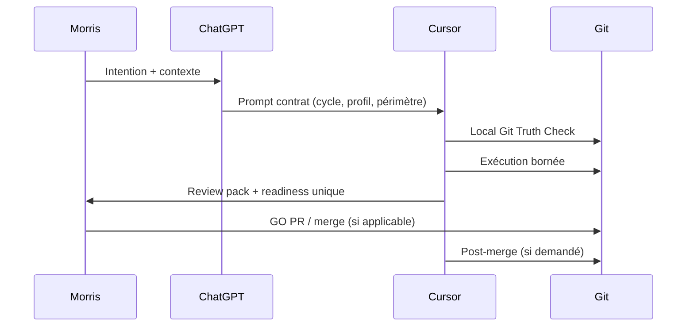

# SFIA Review Pack — Notion Editorial P0 Cycle 2

**Horodatage :** 2026-07-13 15:11 Europe/Paris (CEST)
**Repository :** mcleland147/sfia-workspace
**Workspace :** /Users/morris/Projects/sfia-workspace
**Cycle :** Préparation Notion — Cycle 2 — Préparation éditoriale P0
**Type de cycle :** 9 — QA / validation (correctif handoff)
**Profil SFIA :** Standard
**Typologie v2.4 :** DOC
**Branche projet :** documentation/sfia-notion-editorial-p0
**HEAD projet :** 6407913689b14e84e0a487a3137ff290bb6e2ff8
**origin/main :** 6407913689b14e84e0a487a3137ff290bb6e2ff8
**Merge commit PR #191 :** 6407913689b14e84e0a487a3137ff290bb6e2ff8
**Statut livrables :** 12 fichiers editorial — locaux non commités
**Verdict cycle 2 :** READY FOR REVIEW

---

## Local Git Truth Check

| Contrôle | Résultat |
|----------|----------|
| Branche | documentation/sfia-notion-editorial-p0 |
| HEAD | 6407913689b14e84e0a487a3137ff290bb6e2ff8 |
| origin/main | 6407913689b14e84e0a487a3137ff290bb6e2ff8 |
| git status | 12 untracked editorial + .tmp-sfia-review + .sfia |
| staged | aucun |
| commit cycle 2 | aucun |
| 12 fichiers editorial | présents |
| review pack | présent |
| **Verdict** | **PASS** |

## Sources consultées

### Méthode
- prompts/templates/sfia-cycle-execution-template.md
- method/sfia-fast-track/core/sfia-cycle-routing-guide.md
- method/sfia-fast-track/core/sfia-chatgpt-cursor-operating-model.md
- method/sfia-fast-track/core/sfia-rules-and-guardrails.md

### Conception Notion cycle 1 (Git main)
- sfia-notion-product-vision.md
- sfia-notion-information-architecture.md
- sfia-notion-publication-governance.md
- sfia-notion-mvp-backlog.md

### Livrables cycle 2 (local)
- editorial/README.md
- editorial/sfia-notion-00-home-editorial-draft.md
- editorial/sfia-notion-01-understand-sfia-editorial-draft.md
- editorial/sfia-notion-02-value-proposition-editorial-draft.md
- editorial/sfia-notion-03-how-a-cycle-works-editorial-draft.md
- editorial/sfia-notion-04-cycles-profiles-gates-editorial-draft.md
- editorial/sfia-notion-05-request-routing-editorial-draft.md
- editorial/sfia-notion-06-templates-prompts-deliverables-editorial-draft.md
- editorial/sfia-notion-07-governance-guardrails-editorial-draft.md
- editorial/sfia-notion-08-setup-sfia-editorial-draft.md
- editorial/sfia-notion-11-glossary-editorial-draft.md
- editorial/sfia-notion-p0-editorial-review-checklist.md

## Qualification

- **Cycle :** QA / validation corrective — publication handoff Git
- **Profil :** Standard
- **Objectif :** rendre les 12 brouillons consultables par ChatGPT via handoff
- **Limite :** aucun commit des brouillons ; push uniquement sfia/review-handoff

## Fichiers créés cycle 2

| # | Fichier | Rôle | Lignes |
|---|---------|------|-------:|
| 1 | `README.md` | README.md — index du pack editorial | 63 |
| 2 | `sfia-notion-00-home-editorial-draft.md` | 00 — Accueil | 114 |
| 3 | `sfia-notion-01-understand-sfia-editorial-draft.md` | 01 — Comprendre SFIA | 93 |
| 4 | `sfia-notion-02-value-proposition-editorial-draft.md` | 02 — Proposition de valeur | 99 |
| 5 | `sfia-notion-03-how-a-cycle-works-editorial-draft.md` | 03 — Comment fonctionne un cycle | 93 |
| 6 | `sfia-notion-04-cycles-profiles-gates-editorial-draft.md` | 04 — Cycles, profils et gates | 102 |
| 7 | `sfia-notion-05-request-routing-editorial-draft.md` | 05 — Routage des demandes | 86 |
| 8 | `sfia-notion-06-templates-prompts-deliverables-editorial-draft.md` | 06 — Templates, prompts et livrables | 95 |
| 9 | `sfia-notion-07-governance-guardrails-editorial-draft.md` | 07 — Gouvernance et garde-fous | 114 |
| 10 | `sfia-notion-08-setup-sfia-editorial-draft.md` | 08 — Mettre SFIA en place | 100 |
| 11 | `sfia-notion-11-glossary-editorial-draft.md` | 11 — Glossaire | 87 |
| 12 | `sfia-notion-p0-editorial-review-checklist.md` | Checklist relecture P0 | 126 |

## Fichiers modifiés

- **Projet :** aucun fichier versionné modifié
- **Review pack :** reconstruit intégralement (format canonique cycle 2)
- **Handoff :** remplacement sur branche sfia/review-handoff

## Contenu complet — 12 fichiers

---

# FICHIER 1 — README.md

# SFIA Notion — Brouillons éditoriaux P0 (Cycle 2)

**Répertoire :** `method/sfia-fast-track/documentation/notion/editorial/`
**Horodatage :** 2026-07-13 13:11 Europe/Paris (CEST)
**Cycle :** Préparation Notion — Cycle 2 — Préparation éditoriale P0 dans Git
**Statut :** **Draft Candidate — non publié dans Notion**
**Contrat éditorial d'origine :** PR #191 — merge `6407913689b14e84e0a487a3137ff290bb6e2ff8`
**Branche de travail :** `documentation/sfia-notion-editorial-p0`

---

## Rôle du répertoire

Ce dossier contient les **brouillons éditoriaux Markdown** des pages Notion **P0** définies dans le cycle 1 (Product Vision, Information Architecture, Publication Governance, MVP Backlog).

| Principe | Application |
|----------|-------------|
| **Git prime** | Ces fichiers sont des drafts versionnés ; la source canonique de la méthode reste dans `docs/`, `method/`, `prompts/` |
| **Non publié** | Aucun contenu de ce dossier n'est publié dans Notion tant que le cycle 3 n'a pas reçu un GO Morris explicite |
| **Éditorialisation** | Synthèses pédagogiques — pas de copie intégrale des documents canoniques |
| **Baseline** | SFIA **v2.4** = baseline opérationnelle ; éléments **v2.5 Candidate** explicitement marqués |

---

## Inventaire des brouillons

| Fichier | Page cible | Niveau |
|---------|------------|--------|
| `sfia-notion-00-home-editorial-draft.md` | Accueil | L0–L1 |
| `sfia-notion-01-understand-sfia-editorial-draft.md` | 01 — Comprendre SFIA | L1–L2 |
| `sfia-notion-02-value-proposition-editorial-draft.md` | 02 — Proposition de valeur | L1 |
| `sfia-notion-03-how-a-cycle-works-editorial-draft.md` | 03 — Comment fonctionne un cycle | L2 |
| `sfia-notion-04-cycles-profiles-gates-editorial-draft.md` | 04 — Cycles, profils et gates | L2 |
| `sfia-notion-05-request-routing-editorial-draft.md` | 05 — Routage des demandes | L2 |
| `sfia-notion-06-templates-prompts-deliverables-editorial-draft.md` | 06 — Templates, prompts et livrables | L3 |
| `sfia-notion-07-governance-guardrails-editorial-draft.md` | 07 — Gouvernance et garde-fous | L2–L3 |
| `sfia-notion-08-setup-sfia-editorial-draft.md` | 08 — Mettre SFIA en place | L3 |
| `sfia-notion-11-glossary-editorial-draft.md` | 11 — Glossaire | L1–L4 |
| `sfia-notion-p0-editorial-review-checklist.md` | Checklist relecture pack P0 | — |

**Hors périmètre cycle 2 :**

- **§09 Cas d'usage** — P1
- **§10 Documents de référence** — vue Base Référentiel (cycle 3)

---

## Règles de passage au cycle 3

1. **Revue Morris** des brouillons P0 (checklist incluse).
2. **Commit + PR** du pack editorial sur `main`.
3. **GO Morris** publication Notion P0 (cycle 3 distinct).
4. Création **nouvel espace Notion** recommandé (décision cycle 1) — pas de raw sync.
5. Publication **L0 manuelle assistée** — métadonnées Git sur chaque page.
6. Aucune utilisation de `tools/cmp-001/`, API Notion ou payload JSON sans cycle dédié.

---

## Garde-fous

- Ne pas traiter ces drafts comme source canonique.
- Ne pas modifier les prompts, templates ou core method depuis ce dossier.
- En cas de divergence avec Git → **Git prime**.

---

# FICHIER 2 — sfia-notion-00-home-editorial-draft.md

# SFIA — Accueil

| Métadonnée | Valeur |
|------------|--------|
| **Page P0** | 00 — Accueil |
| **Statut** | Draft éditorial — non publié |
| **Cycle** | Préparation Notion — Cycle 2 |
| **Profil** | Standard |
| **Baseline opérationnelle** | SFIA v2.4 |
| **Éléments v2.5** | Candidate — non baseline |
| **Audience principale** | Tous |
| **Niveau de lecture** | L0–L1 |
| **Propriétaire éditorial** | À confirmer par Morris |
| **Sources Git** | `README.md` ; `method/sfia-fast-track/README.md` ; `method/sfia-fast-track/core/sfia-knowledge-layer.md` |
| **Commit source** | `6407913689b14e84e0a487a3137ff290bb6e2ff8` |
| **Date** | 2026-07-13 13:11 Europe/Paris |

---

## 1. Objectif de la page

Orienter tout visiteur en moins de 30 secondes : comprendre ce qu'est SFIA, où se trouve la vérité documentaire, et choisir un parcours de lecture adapté.

## 2. À retenir en 30 secondes

- **SFIA** structure la livraison de produits numériques avec assistance IA, sous gouvernance humaine.
- **Git** (`mcleland147/sfia-workspace`) est la **source de vérité** — méthode, prompts, décisions, historique.
- **Notion** (futur espace) sera un **guide de compréhension** — pas un miroir du repository.
- Trois parcours : **5 min** (découvrir), **30 min** (comprendre), **mise en œuvre** (démarrer un projet).
- La baseline opérationnelle est **SFIA v2.4** ; certains contenus méthode v2.5 sont **Candidate — non baseline**.

## 3. Contenu éditorial principal

### Bienvenue dans SFIA

SFIA (Software Factory Intelligence Approach) est une méthode de livraison **rapide, contrôlée et capitalisable** pour créer des applications avec l'aide de l'IA — sans perdre la traçabilité, la qualité ni la décision humaine.

Ce guide Notion (en préparation) vous aide à **comprendre** et **naviguer** la méthode. Pour **exécuter** un cycle — modifier la méthode, lancer Cursor, ouvrir une PR — vous travaillez toujours dans le **repository Git**.

### Schéma Git ↔ Notion

```text
┌─────────────────────────────────────────────────────────┐
│  GIT — source de vérité                                  │
│  méthode · prompts · templates · décisions · rapports      │
└───────────────────────────┬─────────────────────────────┘
                            │ synthèse éditoriale validée
                            ▼
┌─────────────────────────────────────────────────────────┐
│  NOTION — guide de compréhension (futur)                 │
│  navigation · pédagogie · onboarding · démonstration     │
└─────────────────────────────────────────────────────────┘

Règle : en cas de divergence → Git prime.
```

## 4. Fonctionnement ou parcours

### Parcours 1 — Découvrir en 5 minutes

`Accueil` → [02 Proposition de valeur](sfia-notion-02-value-proposition-editorial-draft.md) → [03 Comment fonctionne un cycle](sfia-notion-03-how-a-cycle-works-editorial-draft.md) (schéma) → [11 Glossaire](sfia-notion-11-glossary-editorial-draft.md) (5 termes clés)

### Parcours 2 — Comprendre en 30 minutes

`Accueil` → [01 Comprendre SFIA](sfia-notion-01-understand-sfia-editorial-draft.md) → [03 Cycle](sfia-notion-03-how-a-cycle-works-editorial-draft.md) → [04 Cycles et profils](sfia-notion-04-cycles-profiles-gates-editorial-draft.md) → [07 Gouvernance](sfia-notion-07-governance-guardrails-editorial-draft.md) (résumé)

### Parcours 3 — Mettre SFIA en œuvre

`Accueil` → [08 Mise en place](sfia-notion-08-setup-sfia-editorial-draft.md) → [05 Routage](sfia-notion-05-request-routing-editorial-draft.md) → [06 Templates et prompts](sfia-notion-06-templates-prompts-deliverables-editorial-draft.md)

## 5. Exemple pédagogique

> Un chef de projet reçoit une demande « préparer la release ». Il ne parcourt pas 900 fichiers Markdown : il consulte la page **Routage**, identifie le cycle **Déploiement / release** (profil probable Critical), puis retourne dans Git pour l'exécution Cursor avec le bon contrat.

## 6. Points de vigilance

- Notion **ne remplace pas** Git pour les décisions structurantes.
- Les contenus **Candidate** (dont le catalogue v2.5 cycles) ne sont pas la baseline tant que Morris ne les a pas validés.
- Aucune **synchronisation automatique** Git → Notion n'est prévue au MVP.

## 7. Liens vers les autres pages

| Page | Lien draft |
|------|------------|
| 01 Comprendre SFIA | `sfia-notion-01-understand-sfia-editorial-draft.md` |
| 02 Proposition de valeur | `sfia-notion-02-value-proposition-editorial-draft.md` |
| 03 Comment fonctionne un cycle | `sfia-notion-03-how-a-cycle-works-editorial-draft.md` |
| 08 Mettre SFIA en place | `sfia-notion-08-setup-sfia-editorial-draft.md` |
| 11 Glossaire | `sfia-notion-11-glossary-editorial-draft.md` |

## 8. Sources canoniques Git

| Source | Rôle |
|--------|------|
| `README.md` | Vision workspace |
| `method/sfia-fast-track/README.md` | Entrée méthode Fast Track |
| `method/sfia-fast-track/core/sfia-knowledge-layer.md` | Doctrine Git / Notion |

## 9. Métadonnées de publication futures

| Champ Notion | Valeur prévue |
|--------------|---------------|
| Type contenu | synthèse éditoriale |
| Statut page | brouillon → publié (cycle 3) |
| Visibilité | contributeur / public (à trancher Morris) |
| Dernière sync Git | à renseigner au cycle 3 |

## 10. Réserves et décisions Morris

| Élément | Statut |
|---------|--------|
| Propriétaire éditorial | **À confirmer** |
| Visibilité externe espace Notion | **Décision cycle 3** |
| Cas d'usage §09 | **P1 — hors cycle 2** |

---

# FICHIER 3 — sfia-notion-01-understand-sfia-editorial-draft.md

# 01 — Comprendre SFIA

| Métadonnée | Valeur |
|------------|--------|
| **Page P0** | 01 — Comprendre SFIA |
| **Statut** | Draft éditorial — non publié |
| **Cycle** | Préparation Notion — Cycle 2 |
| **Profil** | Standard |
| **Baseline** | SFIA v2.4 |
| **v2.5** | Candidate — non baseline |
| **Audience** | Nouvel utilisateur, PO, chef de projet |
| **Niveau** | L1–L2 |
| **Propriétaire** | À confirmer par Morris |
| **Sources Git** | `method/sfia-fast-track/core/sfia-chatgpt-cursor-operating-model.md` ; `docs/foundation/sfia-engineering-principles.md` ; `method/sfia-fast-track/README.md` |
| **Commit** | `6407913689b14e84e0a487a3137ff290bb6e2ff8` |
| **Date** | 2026-07-13 13:11 Europe/Paris |

---

## 1. Objectif de la page

Donner une définition claire de SFIA, des rôles dans la boucle opératoire, et du cadre documentaire (baseline, candidate, validated) — sans imposer la lecture du repository.

## 2. À retenir en 30 secondes

- SFIA = méthode de livraison **contrôlée** avec IA (ChatGPT + Cursor) et **validation humaine** (Morris).
- **Un cycle = un objectif utile** — branche Git dédiée, traçabilité, PR quand pertinent.
- **Git** porte la méthode ; **Notion** aide à la comprendre.
- **Baseline opérationnelle : SFIA v2.4**. Les évolutions v2.5 sont **Candidate** jusqu'à validation explicite.

## 3. Contenu éditorial principal

### Qu'est-ce que SFIA ?

SFIA Fast Track est la méthode utilisée pour livrer des produits numériques en combinant :

- cadrage et objectifs bornés ;
- cycles courts avec garde-fous ;
- prompts Cursor comme **contrats d'exécution** ;
- revues, PR et capitalisation ;
- montée progressive en automatisation.

### Les trois acteurs

| Acteur | Rôle |
|--------|------|
| **Morris** | Autorité de décision — gates structurants, merge, validation baseline |
| **ChatGPT** | Qualification, instanciation des prompts, revue (via handoff Git si requis) |
| **Cursor** | Exécution repository — ne décide pas, n'élargit pas le périmètre |

### Cycle de vie documentaire

| Statut | Signification pour le lecteur |
|--------|------------------------------|
| **validated** | Référence opérationnelle stable (baseline v2.4) |
| **candidate** | Proposition en test — **non baseline** |
| **draft** | Travail en cours |
| **historical** | Contexte passé — ne pas appliquer sans vérification |

### Niveau d'automatisation actuel

SFIA v1.1 correspond au **niveau 0** : orchestration **manuelle assistée**. Les moteurs (prompt generation, validation, repository execution) sont spécifiés mais l'humain reste au centre des décisions structurantes.

## 4. Fonctionnement ou parcours

**Suite recommandée :** cette page → [03 Comment fonctionne un cycle](sfia-notion-03-how-a-cycle-works-editorial-draft.md) → [04 Cycles et profils](sfia-notion-04-cycles-profiles-gates-editorial-draft.md).

## 5. Exemple pédagogique

Un PO découvre SFIA : il lit cette page, comprend que Morris valide les merges critiques, puis consulte **Routage** pour savoir quel cycle ouvrir pour « rédiger des user stories » — sans ouvrir le prompt catalog.

## 6. Points de vigilance

- Ne pas confondre **profil Capitalization** (intention de capitaliser) avec **Critical** (risque structurant).
- Les documents **Candidate v2.5** (ex. template d'exécution cycles projet) enrichissent la méthode mais **ne remplacent pas** v2.4 tant que non validés.

## 7. Liens parcours

→ [02 Valeur](sfia-notion-02-value-proposition-editorial-draft.md) · [03 Cycle](sfia-notion-03-how-a-cycle-works-editorial-draft.md) · [07 Gouvernance](sfia-notion-07-governance-guardrails-editorial-draft.md) · [11 Glossaire](sfia-notion-11-glossary-editorial-draft.md)

## 8. Sources canoniques Git

- `method/sfia-fast-track/core/sfia-chatgpt-cursor-operating-model.md` (validated)
- `docs/foundation/sfia-engineering-principles.md` (validated)
- `method/sfia-fast-track/README.md` (validated)

## 9. Métadonnées publication futures

Type : **canonical summary** + synthèse éditoriale. Badge Candidate sur mentions v2.5.

## 10. Réserves Morris

Propriétaire éditorial à confirmer. Niveau de détail automation (niveaux 1–4) : résumé seulement — détail dans Git.

---

# FICHIER 4 — sfia-notion-02-value-proposition-editorial-draft.md

# 02 — Proposition de valeur

| Métadonnée | Valeur |
|------------|--------|
| **Page P0** | 02 — Proposition de valeur |
| **Statut** | Draft éditorial — non publié |
| **Cycle** | Cycle 2 |
| **Baseline** | SFIA v2.4 |
| **Audience** | Dirigeant, prospect, chef de projet |
| **Niveau** | L1 |
| **Propriétaire** | À confirmer par Morris |
| **Sources Git** | `method/sfia-fast-track/core/sfia-global-capitalization-reference.md` ; `docs/architecture/sfia-platform-architecture.md` |
| **Commit** | `6407913689b14e84e0a487a3137ff290bb6e2ff8` |
| **Date** | 2026-07-13 13:11 Europe/Paris |

> **Note source :** le cycle 1 cite parfois `documentation/capitalization/sfia-global-capitalization-reference.md` — le chemin canonique actuel est `method/sfia-fast-track/core/sfia-global-capitalization-reference.md`.

---

## 1. Objectif de la page

Articuler pourquoi SFIA existe et quels bénéfices concrets elle apporte — métier, projet, qualité, onboarding — sans promesses non sourcées.

## 2. À retenir en 30 secondes

- SFIA réduit le chaos des livraisons assistées IA grâce à **cycles bornés**, **garde-fous** et **traçabilité Git**.
- Chaque livraison peut **capitaliser** des apprentissages réutilisables.
- La méthode sépare **comprendre** (Notion futur) et **exécuter** (Git).
- Les preuves projet (cas d'usage) arrivent en **P1** — pas dans ce pack.

## 3. Contenu éditorial principal

### Bénéfices métier

| Bénéfice | Explication |
|----------|-------------|
| **Lisibilité** | Parcours par intention, pas par dossiers techniques |
| **Décision éclairée** | Gates Morris explicites avant actions irréversibles |
| **Réduction du risque IA** | Prompt = contrat ; périmètre fichiers ; stop conditions |
| **Capitalisation** | REX et méthode enrichissent les cycles suivants |

### Bénéfices projet

- Cycles courts avec **un seul objectif** identifiable.
- PR ciblées — pas de « big bang » documentaire.
- Post-merge et clôture structurés.
- Patterns réutilisables (templates, checklists).

### Bénéfices qualité et gouvernance

- Review pack proportionné (none / light / full).
- Distinction observation / recommandation / décision validée.
- Repository-first : faits durables versionnés.

### Onboarding

- Parcours 5 min / 30 min / mise en œuvre (voir Accueil).
- Glossaire centralisé.
- Liens vers assets d'exécution dans Git.

### Différenciation (sourcée)

| Anti-pattern évité | Approche SFIA |
|--------------------|---------------|
| IA sans contrat d'exécution | Prompt Cursor instancié |
| Documentation hors Git | Git = source de vérité |
| Miroir Notion du repo | Couche éditorialisée |
| Décisions implicites | Gates Morris |
| Cycles sans fin | Une readiness par cycle |

## 4. Fonctionnement ou parcours

Dirigeant : **02** → teaser cas d'usage (P1) → [01 Comprendre](sfia-notion-01-understand-sfia-editorial-draft.md) si approfondissement.

## 5. Exemple pédagogique

Une direction demande « comment vous livrez avec l'IA » : on présente la proposition de valeur + schéma cycle (page 03) — sans montrer le repository.

## 6. Points de vigilance

- Pas d'affirmation commerciale chiffrée non présente dans les sources Git.
- Platform architecture et automation = vision — certains éléments **candidate** ou roadmap.

## 7. Liens

→ [03 Cycle](sfia-notion-03-how-a-cycle-works-editorial-draft.md) · [01 Comprendre](sfia-notion-01-understand-sfia-editorial-draft.md) · Accueil

## 8. Sources Git

- `method/sfia-fast-track/core/sfia-global-capitalization-reference.md`
- `docs/architecture/sfia-platform-architecture.md`

## 9. Métadonnées publication

Type : **marketing** + synthèse éditoriale. Relecture Morris avant publication externe.

## 10. Réserves

Cas d'usage Interv360/Chantiers360 : **P1**. Propriétaire éditorial : à confirmer.

---

# FICHIER 5 — sfia-notion-03-how-a-cycle-works-editorial-draft.md

# 03 — Comment fonctionne un cycle

| Métadonnée | Valeur |
|------------|--------|
| **Page P0** | 03 — Comment fonctionne un cycle |
| **Statut** | Draft éditorial — non publié |
| **Cycle** | Cycle 2 |
| **Baseline** | SFIA v2.4 |
| **Audience** | Chef de projet, développeur, qualité |
| **Niveau** | L2 |
| **Propriétaire** | À confirmer par Morris |
| **Sources Git** | `sfia-chatgpt-cursor-operating-model.md` ; `prompts/templates/sfia-cycle-execution-template.md` (extrait — **Candidate v2.5**) |
| **Commit** | `6407913689b14e84e0a487a3137ff290bb6e2ff8` |
| **Date** | 2026-07-13 13:11 Europe/Paris |

---

## 1. Objectif de la page

Expliquer le déroulement type d'un cycle SFIA — de la qualification à la capitalisation — sans reproduire le template d'exécution Cursor intégral.

## 2. À retenir en 30 secondes

- **Un cycle = un résultat utile** (document, code, revue, capitalisation).
- **ChatGPT** qualifie et produit le prompt ; **Cursor** exécute dans Git ; **Morris** tranche les gates.
- **Local Git Truth Check** en tête d'exécution.
- **Une seule readiness** par cycle (pas plusieurs verdicts concurrents).
- Fin typique : PR → merge → post-merge → capitalisation éventuelle.

## 3. Contenu éditorial principal

### Étapes clés

| Phase | Qui | Quoi |
|-------|-----|------|
| 1. Intention | Morris | Objectif, périmètre, gates |
| 2. Qualification | ChatGPT | Type de cycle, profil, review pack, handoff |
| 3. Vérité Git | Cursor | Branche, HEAD, working tree |
| 4. Exécution | Cursor | Actions dans périmètre autorisé |
| 5. Revue | Review pack / Morris | Preuves, réserves |
| 6. Readiness | Cursor | **Un** verdict (ex. READY FOR REVIEW) |
| 7. PR / merge | Morris GO | Si prévu par le cycle |
| 8. Post-merge | Cursor | Vérif intégration, suite |
| 9. Capitalisation | Cycle dédié | Si apprentissage durable |

### Schéma de séquence



## 4. Fonctionnement ou parcours

Après cette page → [04 Cycles et profils](sfia-notion-04-cycles-profiles-gates-editorial-draft.md) pour le référentiel des 15 cycles (**Candidate v2.5**).

## 5. Exemple pédagogique

Cycle « corriger un lien dans un doc » : profil **Light**, review pack **none** ou **light**, une readiness **READY FOR COMMIT**, pas de gate merge si Morris n'a pas demandé la PR.

## 6. Points de vigilance

- Le template `sfia-cycle-execution-template.md` est **Candidate v2.5 — non baseline** ; v2.4 reste la référence opérationnelle jusqu'à validation Morris.
- **Review Handoff Git** : requis ou non selon le prompt — pas automatique.
- Ne pas lancer plusieurs readiness (« prêt pour X » et « prêt pour Y ») dans le même cycle.

## 7. Liens

→ [04 Cycles](sfia-notion-04-cycles-profiles-gates-editorial-draft.md) · [05 Routage](sfia-notion-05-request-routing-editorial-draft.md) · [08 Mise en place](sfia-notion-08-setup-sfia-editorial-draft.md) · [07 Gouvernance](sfia-notion-07-governance-guardrails-editorial-draft.md)

## 8. Sources Git

- `method/sfia-fast-track/core/sfia-chatgpt-cursor-operating-model.md`
- `prompts/templates/sfia-cycle-execution-template.md` (Candidate — extraits §4, §7, §9)

## 9. Métadonnées publication

Type : synthèse éditoriale + schéma. Lien Git vers template complet pour exécuteurs.

## 10. Réserves

Diagramme Mermaid à valider visuellement en Notion au cycle 3.

---

# FICHIER 6 — sfia-notion-04-cycles-profiles-gates-editorial-draft.md

# 04 — Cycles, profils et gates

| Métadonnée | Valeur |
|------------|--------|
| **Page P0** | 04 — Cycles, profils et gates |
| **Statut** | Draft éditorial — non publié |
| **Cycle** | Cycle 2 |
| **Baseline** | SFIA v2.4 |
| **v2.5 cycles** | **Candidate — non baseline** |
| **Audience** | PMO, PO, responsable méthode |
| **Niveau** | L2 |
| **Propriétaire** | À confirmer par Morris |
| **Sources Git** | `method/sfia-fast-track/core/sfia-cycle-routing-guide.md` ; `prompts/templates/sfia-cycle-execution-template.md` §4 (**Candidate**) |
| **Commit** | `6407913689b14e84e0a487a3137ff290bb6e2ff8` |
| **Date** | 2026-07-13 13:11 Europe/Paris |

---

## 1. Objectif de la page

Présenter les **15 cycles projet** SFIA v2.5 (Candidate), les **4 profils**, et la logique des **gates Morris** — sans les confondre avec la baseline v2.4.

## 2. À retenir en 30 secondes

- **15 cycles** couvrent le projet de bout en bout (cadrage → capitalisation).
- **Profils** : Light, Standard (défaut), Critical (justifié), Capitalization (intention REX).
- **Critical ≠ Capitalization** ; Critical **jamais implicite**.
- **Gates Morris** = décisions structurantes (merge, publication, doctrine).
- Catalogue v2.5 cycles : **Candidate — non baseline**.

## 3. Contenu éditorial principal

### Les 15 cycles projet *(Candidate v2.5 — non baseline)*

| # | Cycle | Catégorie |
|---|-------|-----------|
| 1 | Cadrage | Quasi systématique |
| 2 | Conception fonctionnelle | Quasi systématique |
| 3 | Architecture fonctionnelle | Activable |
| 4 | UX/UI | Activable |
| 5 | Backlog / user stories | Quasi systématique |
| 6 | Architecture technique | Activable |
| 7 | Intégration / DevOps | Activable |
| 8 | Delivery / implémentation | Quasi systématique |
| 9 | QA / validation | Quasi systématique |
| 10 | Sécurité / RSSI | Activable |
| 11 | Déploiement / release | Activable |
| 12 | Observabilité / RUN readiness | Activable |
| 13 | PR readiness | Quasi systématique |
| 14 | Post-merge | Quasi systématique |
| 15 | Capitalisation / REX | Proportionné |

> **Baseline opérationnelle : SFIA v2.4.** Ce référentiel 15 cycles provient du template d'exécution **v2.5 candidate** — à utiliser comme aide, pas comme norme validée tant que Morris n'a pas promu v2.5.

### Les quatre profils

| Profil | Quand l'envisager |
|--------|-------------------|
| **Light** | Faible risque, ≤3 fichiers doc, pas de chemin protégé |
| **Standard** | Cycle courant — **défaut** si doute sans risque structurant |
| **Critical** | Risque structurant — **justification obligatoire** |
| **Capitalization** | Intention de capitaliser — profondeur Light/Standard/Critical selon portée |

### Exemples de gates Morris

| Gate | Exemple |
|------|---------|
| GO merge | Après revue PR |
| GO publication Notion | Cycle 3 distinct |
| GO modification doctrine | Prompt catalog, core method |
| GO Critical | Arbitrage architecture, prod, sécurité |
| GO baseline v2.5 | Promotion méthode — **non acquise** |

## 4. Fonctionnement ou parcours

Cette page alimente la future **Base Cycles** (cycle 3). En lecture : compléter avec [05 Routage](sfia-notion-05-request-routing-editorial-draft.md).

## 5. Exemple pédagogique

Demande « capitaliser un REX » → cycle **15 Capitalisation**, profil **Capitalization**, profondeur **Standard** ou **Critical** selon portée — pas Critical automatique.

## 6. Points de vigilance

- Ne pas présenter v2.5 comme baseline dans Notion sans badge et sans décision Morris.
- Une **readiness unique** par cycle — voir page 03.

## 7. Liens

→ [05 Routage](sfia-notion-05-request-routing-editorial-draft.md) · [03 Cycle](sfia-notion-03-how-a-cycle-works-editorial-draft.md) · [07 Gouvernance](sfia-notion-07-governance-guardrails-editorial-draft.md)

## 8. Sources Git

- `method/sfia-fast-track/core/sfia-cycle-routing-guide.md` (candidate)
- `prompts/templates/sfia-cycle-execution-template.md` §4 (candidate v2.5)

## 9. Métadonnées publication

Future **vue Base Cycles**. Badge « Candidate v2.5 » obligatoire sur la page.

## 10. Réserves

Promotion v2.5 baseline : **décision Morris non prise**.

---

# FICHIER 7 — sfia-notion-05-request-routing-editorial-draft.md

# 05 — Routage des demandes

| Métadonnée | Valeur |
|------------|--------|
| **Page P0** | 05 — Routage des demandes |
| **Statut** | Draft éditorial — non publié |
| **Cycle** | Cycle 2 |
| **Baseline** | SFIA v2.4 |
| **Audience** | PO, chef de projet, architecte |
| **Niveau** | L2 |
| **Propriétaire** | À confirmer par Morris |
| **Sources Git** | `method/sfia-fast-track/core/sfia-cycle-routing-guide.md` ; `prompts/templates/sfia-cycle-execution-template.md` §4.4 (Candidate) |
| **Commit** | `6407913689b14e84e0a487a3137ff290bb6e2ff8` |
| **Date** | 2026-07-13 13:11 Europe/Paris |

---

## 1. Objectif de la page

Aider à mapper une **demande Morris** vers un **type de cycle**, un **profil** probable et les **gates** éventuels — sans automatiser l'arbitrage.

## 2. À retenir en 30 secondes

- Le **routing guide Git** est la référence — pas la mémoire conversationnelle.
- ChatGPT qualifie **avant** de générer le prompt Cursor.
- **Standard** par défaut si doute sans risque structurant.
- **Critical** exige justification explicite.
- Notion **n'automatise pas** les décisions.

## 3. Contenu éditorial principal

### Matrice — demandes types *(aide — Candidate v2.5 pour cycles 1–15)*

| Demande type | Cycle recommandé | Profil probable | Risque | Gate Morris |
|--------------|------------------|-----------------|--------|-------------|
| Corriger un document mono-fichier | 1 Cadrage ou 8 Delivery doc | Light | Faible | Rare |
| Préparer une PR | 13 PR readiness | Standard (Light si ≤3 fichiers doc) | Moyen | GO PR si demandé |
| Nouveau parcours UI / écran | 4 UX/UI | Standard ou Critical | Moyen–élevé | GO design / Figma si fidélité |
| Arbitrage architecture | 3 Archi fonctionnelle ou 6 Archi technique | **Critical** | Élevé | **Oui** |
| Clôture après merge | 14 Post-merge | Light ou Standard | Faible | GO post-merge |
| Capitaliser une leçon / REX | 15 Capitalisation | Capitalization | Variable | GO capitalisation |
| Implémenter une feature bornée | 8 Delivery | Standard | Moyen | Selon périmètre |
| Go-live / sécurité / production | 9 QA, 10 RSSI, 11 Release | **Critical** | Élevé | **Oui** |

> Les numéros de cycles 1–15 renvoient au référentiel **v2.5 Candidate**. En baseline v2.4, s'appuyer sur le **routing guide** et le **prompt catalog** pour l'exécution effective.

### Chaîne de routage documentaire

```text
routing guide → méthode cycles v2.5 (candidate) → template d'exécution (candidate)
→ operating model → guardrails → contexte projet → prompt Cursor
```

## 4. Fonctionnement ou parcours

1. Formuler la demande en un objectif identifiable.
2. Consulter cette matrice (aide) puis le **routing guide Git**.
3. Choisir profil et review pack (none / light / full).
4. Décider handoff Git (required / not required) dans le prompt.
5. Exécuter dans Git — pas dans Notion.

## 5. Exemple pédagogique

« Préparer la conception Notion » → cycle **2 Conception fonctionnelle**, profil **Standard**, review pack **full**, handoff **required** — comme le cycle 1 qui a produit la PR #191.

## 6. Points de vigilance

- Une matrice Notion **ne remplace pas** la lecture du routing guide à jour sur `main`.
- Ne pas déduire un **GO merge** ou **GO publication** du seul routage.

## 7. Liens

→ [04 Cycles](sfia-notion-04-cycles-profiles-gates-editorial-draft.md) · [06 Templates](sfia-notion-06-templates-prompts-deliverables-editorial-draft.md) · [08 Mise en place](sfia-notion-08-setup-sfia-editorial-draft.md)

## 8. Sources Git

- `method/sfia-fast-track/core/sfia-cycle-routing-guide.md`
- `prompts/templates/sfia-cycle-execution-template.md` §4.4 (Candidate)

## 9. Métadonnées publication

Future **vue filtrée Base Cycles**. Mise à jour manuelle si routing guide évolue.

## 10. Réserves

Matrice à resynchroniser si promotion v2.5 baseline — **non acquise**.

---

# FICHIER 8 — sfia-notion-06-templates-prompts-deliverables-editorial-draft.md

# 06 — Templates, prompts et livrables

| Métadonnée | Valeur |
|------------|--------|
| **Page P0** | 06 — Templates, prompts et livrables |
| **Statut** | Draft éditorial — non publié |
| **Cycle** | Cycle 2 |
| **Baseline** | SFIA v2.4 |
| **Audience** | Développeur, qualité, contributeur méthode |
| **Niveau** | L3 |
| **Propriétaire** | À confirmer par Morris |
| **Sources Git** | `prompts/prompt-catalog.md` ; `prompts/templates/README.md` ; `method/sfia-fast-track/templates/` |
| **Commit** | `6407913689b14e84e0a487a3137ff290bb6e2ff8` |
| **Date** | 2026-07-13 13:11 Europe/Paris |

---

## 1. Objectif de la page

Clarifier la différence entre **template**, **prompt**, **checklist** et **livrable** — et indiquer **quand retourner dans Git** pour l'exécution.

## 2. À retenir en 30 secondes

- **Templates** = squelettes réutilisables (PR, cycle, capitalisation…).
- **Prompts** = contrats d'exécution Cursor instanciés par ChatGPT.
- **Checklists** = contrôles qualité avant/après livraison.
- **Livrables** = résultats d'un cycle (fichiers, rapports, PR).
- Le **prompt catalog** et les **templates numérotés** vivent dans Git — Notion ne les modifie **jamais**.

## 3. Contenu éditorial principal

### Définitions

| Concept | Rôle | Où dans Git |
|---------|------|-------------|
| **Template** | Structure attendue d'un document ou message | `prompts/templates/`, `method/.../templates/` |
| **Prompt** | Instructions complètes pour Cursor | Instancié depuis catalog + templates |
| **Checklist** | Liste de vérifications | `method/sfia-fast-track/checklists/` |
| **Livrable** | Sortie concrète du cycle | Branche, fichiers, review pack, PR |

### Familles de prompts (aperçu — pas de copie catalog)

| Famille | Usage typique |
|---------|---------------|
| Cadrage / fondation | Créer ou mettre à jour documents normatifs |
| Validation | Contrôler un résultat Cursor |
| PR / post-merge | Préparer merge et clôture |
| Capitalisation | Promouvoir un apprentissage en méthode |
| Notion preparation | Mapping sans publication |
| UX / QA / tooling | Blocs spécialisés selon cycle |

### Templates numérotés (référence)

Les templates `01` à `10` sous `prompts/templates/` couvrent le pipeline documentaire (foundation, checklist, PR summary, post-merge, capitalisation, Notion mapping, cleanup…). Le **template d'exécution de cycle** (`sfia-cycle-execution-template.md`) est **Candidate v2.5** — il sert à **générer** des prompts Cursor, pas à être envoyé tel quel à Cursor.

### Quand retourner dans Git

| Besoin | Action |
|--------|--------|
| Exécuter un cycle | Ouvrir le prompt instancié + fichiers cibles dans le repo |
| Modifier un template canonique | PR sur `prompts/` — gate Morris |
| Consulter une checklist complète | Lire le fichier checklist dans Git |
| Publier dans Notion | **Cycle 3** — pas depuis cette page |

## 4. Fonctionnement ou parcours

Contributeur : **06** → ouvre `prompts/templates/README.md` dans Git → choisit le template → cycle Cursor avec ChatGPT.

## 5. Exemple pédagogique

Cycle capitalisation : template `08-capitalize-method-asset.md` + sources evidence — le livrable est un **fichier méthode dans Git**, pas une page Notion.

## 6. Points de vigilance

- **Ne pas copier** le prompt catalog dans Notion — métadonnées et liens seulement (future Base Référentiel).
- Notion **ne modifie aucun prompt canonique**.
- `05-validate-pr-readiness.md` peut exister hors certains manifestes — vérifier dans Git.

## 7. Liens

→ [03 Cycle](sfia-notion-03-how-a-cycle-works-editorial-draft.md) · [05 Routage](sfia-notion-05-request-routing-editorial-draft.md) · [08 Mise en place](sfia-notion-08-setup-sfia-editorial-draft.md) · [11 Glossaire](sfia-notion-11-glossary-editorial-draft.md)

## 8. Sources Git

- `prompts/prompt-catalog.md` (candidate v1.1)
- `prompts/templates/README.md`
- `method/sfia-fast-track/templates/` (cycle, PR, post-merge…)

## 9. Métadonnées publication

Type : **metadata + synthèse**. Entrées Référentiel par template/prompt (cycle 3).

## 10. Réserves

Catalog = spine opérationnelle — toute évolution = cycle Git dédié.

---

# FICHIER 9 — sfia-notion-07-governance-guardrails-editorial-draft.md

# 07 — Gouvernance et garde-fous

| Métadonnée | Valeur |
|------------|--------|
| **Page P0** | 07 — Gouvernance et garde-fous |
| **Statut** | Draft éditorial — non publié |
| **Cycle** | Cycle 2 |
| **Baseline** | SFIA v2.4 |
| **Audience** | Responsable méthode, Morris, qualité |
| **Niveau** | L2–L3 |
| **Propriétaire** | À confirmer par Morris |
| **Sources Git** | `sfia-rules-and-guardrails.md` ; `sfia-knowledge-layer.md` ; `sfia-notion-publication-governance.md` |
| **Commit** | `6407913689b14e84e0a487a3137ff290bb6e2ff8` |
| **Date** | 2026-07-13 13:11 Europe/Paris |

---

## 1. Objectif de la page

Exposer la gouvernance Git ↔ Notion, les rôles, les types de contenu et les **interdictions** (raw sync, API, CMP) — en distinguant validation éditoriale et GO de publication.

## 2. À retenir en 30 secondes

- **Git prime** toujours en cas de divergence.
- Notion = **synthèse éditorialisée**, pas source canonique.
- Publication Notion = **L0 manuelle** au MVP — cycle 3 + GO Morris.
- **Aucune** raw sync, API Notion, CMP ou auto-publish dans le périmètre actuel.
- Validation éditoriale ≠ autorisation de publier.

## 3. Contenu éditorial principal

### Hiérarchie des sources

| Rang | Source |
|------|--------|
| 1 | Git `main` |
| 2 | Documents foundation / core **validated** |
| 3 | Documents **candidate** (badge obligatoire) |
| 4 | Notion (guide) |
| 5 | Exports JSON historiques — **exclus** |

### Types de contenu

| Type | Modifiable dans Notion ? |
|------|--------------------------|
| Canonique (résumé) | Non — via Git |
| Synthèse éditoriale | Oui — avec métadonnées |
| Extrait / exemple | Reformulé — lien Git |
| Marketing | Oui — revue Morris |
| Interne / archive | Visibilité restreinte |

### Rôles

| Rôle | Responsabilité |
|------|----------------|
| Morris | Gates structurants, merge, publication |
| Propriétaire éditorial | Cohérence pages Notion (à désigner) |
| Mainteneur Git | PR sur méthode canonique |
| Cursor / ChatGPT | Exécution / qualification — pas publish Notion |

### Workflow cible (résumé)

```text
Modification Git → PR → merge → préparation éditoriale → validation humaine
→ mise à jour Notion (manuelle) → métadonnées commit → QA cohérence
```

### Niveaux d'automatisation (information — sans promesse)

| Niveau | Description | MVP |
|--------|-------------|-----|
| L0 | Publication manuelle assistée | **Cible** |
| L1 | Contrôle métadonnées | Post-MVP |
| L2 | Brouillons guidés dans Git | Post-MVP |
| L3+ | Publication bornée / sync | **Hors cible** sans GO |

### Interdictions explicites

- **Raw sync** repository → Notion
- **API Notion** depuis cycles documentaires
- **`tools/cmp-001/`** et payload JSON CMP
- **Auto-publish** ou webhooks merge → Notion
- Décisions structurantes **automatisées**

## 4. Fonctionnement ou parcours

Avant toute publication (cycle 3) : relire `sfia-notion-publication-governance.md` dans Git + checklist P0.

## 5. Exemple pédagogique

Après merge PR #191 : les brouillons de ce dossier `editorial/` sont validés par Morris — **seulement alors** un opérateur crée les pages Notion en L0, en copiant le texte et en renseignant le SHA `6407913…` ou le commit de merge des drafts.

## 6. Points de vigilance

- Ne pas transformer une **recommandation** (ex. nouvel espace Notion) en **décision validée** sans GO.
- Legacy Notion : stratégie archive — **décision cycle 3**.

## 7. Liens

→ [01 Comprendre](sfia-notion-01-understand-sfia-editorial-draft.md) · [03 Cycle](sfia-notion-03-how-a-cycle-works-editorial-draft.md) · `sfia-notion-publication-governance.md` (Git)

## 8. Sources Git

- `method/sfia-fast-track/core/sfia-rules-and-guardrails.md`
- `method/sfia-fast-track/core/sfia-knowledge-layer.md`
- `method/sfia-fast-track/documentation/notion/sfia-notion-publication-governance.md`

## 9. Métadonnées publication

Type : canonical summary + gouvernance. Lien vers doc governance complet dans Git.

## 10. Réserves

Propriétaire éditorial et permissions Notion : **Morris**.

---

# FICHIER 10 — sfia-notion-08-setup-sfia-editorial-draft.md

# 08 — Mettre SFIA en place

| Métadonnée | Valeur |
|------------|--------|
| **Page P0** | 08 — Mettre SFIA en place |
| **Statut** | Draft éditorial — non publié |
| **Cycle** | Cycle 2 |
| **Baseline** | SFIA v2.4 |
| **Audience** | Chef de projet, tech lead |
| **Niveau** | L3 |
| **Propriétaire** | À confirmer par Morris |
| **Sources Git** | `docs/architecture/sfia-repository-blueprint.md` ; `method/sfia-fast-track/README.md` ; checklists (index) |
| **Commit** | `6407913689b14e84e0a487a3137ff290bb6e2ff8` |
| **Date** | 2026-07-13 13:11 Europe/Paris |

---

## 1. Objectif de la page

Guider le démarrage pratique d'un projet ou contributeur SFIA — prérequis, rôles, premier cycle — avec checklist actionnable.

## 2. À retenir en 30 secondes

- Cloner le workspace ; comprendre **main** comme référence.
- Identifier **Morris**, **ChatGPT**, **Cursor** et leurs rôles.
- Qualifier la demande → cycle → profil → branche dédiée.
- Exécuter avec **Local Git Truth Check** et **une readiness**.
- PR et merge seulement avec **GO Morris**.

## 3. Contenu éditorial principal

### Prérequis

| Élément | Détail |
|---------|--------|
| Repository | Accès `mcleland147/sfia-workspace` |
| Outils | Git, Cursor, ChatGPT (projet configuré) |
| Connaissance | Lire [01 Comprendre](sfia-notion-01-understand-sfia-editorial-draft.md) |
| Baseline | Méthode **v2.4** — repérer les docs **candidate** |

### Structure minimale à connaître

| Zone Git | Contenu |
|----------|---------|
| `docs/foundation/` | Principes d'ingénierie |
| `docs/architecture/` | Pipeline, blueprint |
| `method/sfia-fast-track/` | Méthode opérationnelle |
| `prompts/` | Catalog et templates |
| `projects/` | Projets de référence (lecture sélective) |

### Rôles sur un nouveau sujet

- **Morris** : objectif, gates, GO PR/merge.
- **ChatGPT** : prompt contrat borné.
- **Cursor** : exécution dans périmètre fichiers.

## 4. Checklist — démarrage (≥10 étapes)

| # | Étape | Action |
|---|-------|--------|
| 1 | Clarifier l'objectif | Une phrase — résultat identifiable |
| 2 | Qualifier le cycle | [05 Routage](sfia-notion-05-request-routing-editorial-draft.md) + routing guide Git |
| 3 | Choisir le profil | Light / Standard / Critical / Capitalization |
| 4 | Lister fichiers autorisés / interdits | Dans le prompt |
| 5 | Vérifier Git local | `main` aligné `origin/main` |
| 6 | Créer une branche dédiée | Nom explicite (`delivery/…`, `docs/…`) |
| 7 | Exécuter Cursor | Respecter stop conditions |
| 8 | Produire review pack | Si light/full requis |
| 9 | Readiness unique | READY FOR REVIEW / COMMIT / etc. |
| 10 | PR si prévu | Après GO Morris — puis post-merge si demandé |
| 11 | Capitaliser si utile | Cycle 15 dédié |
| 12 | Consulter glossaire | [11](sfia-notion-11-glossary-editorial-draft.md) en cas de doute |

## 5. Exemple pédagogique

Nouveau contributeur documentation : cycle **8 Delivery** doc-only, profil **Standard**, branche `documentation/…`, 1–3 fichiers, review pack **light**, pas de merge sans Morris.

## 6. Points de vigilance

- Ne pas commiter `.tmp-sfia-review/` sans GO.
- Ne pas modifier `prompts/` ou `core/` sans cycle et gate explicites.
- Blueprint repository = référence technique — lire dans Git pour le détail.

## 7. Liens

→ [03 Cycle](sfia-notion-03-how-a-cycle-works-editorial-draft.md) · [05 Routage](sfia-notion-05-request-routing-editorial-draft.md) · [06 Templates](sfia-notion-06-templates-prompts-deliverables-editorial-draft.md) · [11 Glossaire](sfia-notion-11-glossary-editorial-draft.md)

## 8. Sources Git

- `docs/architecture/sfia-repository-blueprint.md`
- `method/sfia-fast-track/README.md`
- `method/sfia-fast-track/checklists/` (index — lecture Git)

## 9. Métadonnées publication

Type : pratique / onboarding. Checklist à maintenir si blueprint évolue.

## 10. Réserves

Détail checklists : renvoi Git — pas de copie intégrale dans Notion.

---

# FICHIER 11 — sfia-notion-11-glossary-editorial-draft.md

# 11 — Glossaire SFIA

| Métadonnée | Valeur |
|------------|--------|
| **Page P0** | 11 — Glossaire |
| **Statut** | Draft éditorial — non publié |
| **Cycle** | Cycle 2 |
| **Baseline** | SFIA v2.4 |
| **Audience** | Tous |
| **Niveau** | L1–L4 |
| **Propriétaire** | À confirmer par Morris |
| **Sources Git** | operating-model ; routing-guide ; engineering-principles ; cycle-execution-template (Candidate) |
| **Commit** | `6407913689b14e84e0a487a3137ff290bb6e2ff8` |
| **Date** | 2026-07-13 13:11 Europe/Paris |

---

## 1. Objectif de la page

Centraliser le vocabulaire SFIA — définitions courtes, liens vers pages détaillées, signalement des termes **Candidate**.

## 2. À retenir en 30 secondes

Le glossaire évite de parcourir le repository pour comprendre un terme. En cas de conflit avec Git → **Git prime**.

## 3. Contenu éditorial principal — termes (≥20)

| Terme | Définition | Lien / note |
|-------|------------|-------------|
| **SFIA** | Méthode de livraison contrôlée avec IA (ChatGPT, Cursor) et gouvernance humaine. | [01](sfia-notion-01-understand-sfia-editorial-draft.md) |
| **Baseline** | Référence opérationnelle validée — **SFIA v2.4** actuellement. | [01](sfia-notion-01-understand-sfia-editorial-draft.md) |
| **Candidate** | Statut « en test » — **non baseline** tant que Morris n'a pas validé. | [01](sfia-notion-01-understand-sfia-editorial-draft.md) |
| **Validated** | Document ou règle stable pour l'exécution courante. | [07](sfia-notion-07-governance-guardrails-editorial-draft.md) |
| **Cycle** | Séquence de travail à **objectif unique** (cadrage, delivery, capitalisation…). | [03](sfia-notion-03-how-a-cycle-works-editorial-draft.md) |
| **Profil SFIA** | Niveau de rigueur : Light, Standard, Critical, Capitalization. | [04](sfia-notion-04-cycles-profiles-gates-editorial-draft.md) |
| **Gate Morris** | Point de décision humaine obligatoire (merge, publication, doctrine…). | [04](sfia-notion-04-cycles-profiles-gates-editorial-draft.md) |
| **Light** | Profil faible risque, périmètre étroit. | [04](sfia-notion-04-cycles-profiles-gates-editorial-draft.md) |
| **Standard** | Profil par défaut si doute sans risque structurant. | [04](sfia-notion-04-cycles-profiles-gates-editorial-draft.md) |
| **Critical** | Profil risque structurant — **justification obligatoire**. | [04](sfia-notion-04-cycles-profiles-gates-editorial-draft.md) |
| **Capitalization** | Profil exprimant l'intention de capitaliser — ≠ Critical. | [04](sfia-notion-04-cycles-profiles-gates-editorial-draft.md) |
| **Readiness** | Verdict unique de fin de cycle (ex. READY FOR REVIEW). | [03](sfia-notion-03-how-a-cycle-works-editorial-draft.md) |
| **Review pack** | Artefact temporaire de revue (none / light / full). | [03](sfia-notion-03-how-a-cycle-works-editorial-draft.md) |
| **Review handoff** | Copie Git du review pack sur branche `sfia/review-handoff` pour ChatGPT. | [03](sfia-notion-03-how-a-cycle-works-editorial-draft.md) |
| **Local Git Truth Check** | Vérification branche, HEAD, working tree avant exécution. | [03](sfia-notion-03-how-a-cycle-works-editorial-draft.md) |
| **Source de vérité** | Git `main` — contenu canonique et historique. | [07](sfia-notion-07-governance-guardrails-editorial-draft.md) |
| **Cursor** | Exécuteur repository — applique le prompt contrat. | [01](sfia-notion-01-understand-sfia-editorial-draft.md) |
| **Prompt** | Contrat d'exécution instancié pour Cursor. | [06](sfia-notion-06-templates-prompts-deliverables-editorial-draft.md) |
| **Template** | Squelette réutilisable pour documents ou prompts. | [06](sfia-notion-06-templates-prompts-deliverables-editorial-draft.md) |
| **PR** | Pull Request — revue avant intégration à `main`. | [03](sfia-notion-03-how-a-cycle-works-editorial-draft.md) |
| **Post-merge** | Vérifications après merge (intégration, suite). | [03](sfia-notion-03-how-a-cycle-works-editorial-draft.md) |
| **Capitalisation** | Promotion d'un apprentissage stable en actif méthode. | [02](sfia-notion-02-value-proposition-editorial-draft.md) |
| **CMP** | Content Management Platform — outillage `tools/cmp-001/` — **hors périmètre publication Notion MVP**. | [07](sfia-notion-07-governance-guardrails-editorial-draft.md) |
| **Raw sync** | Copie brute repo → Notion — **interdit**. | [07](sfia-notion-07-governance-guardrails-editorial-draft.md) |
| **15 cycles v2.5** | Référentiel cycles projet — **Candidate — non baseline**. | [04](sfia-notion-04-cycles-profiles-gates-editorial-draft.md) |
| **Routing guide** | Document Git de routage des demandes vers cycles. | [05](sfia-notion-05-request-routing-editorial-draft.md) |
| **L0–L4** | Niveaux de lecture (flash → référence profonde). | Accueil |

## 4. Fonctionnement ou parcours

Utiliser en complément de toute page — lien retour [Accueil](sfia-notion-00-home-editorial-draft.md).

## 5. Exemple pédagogique

Un développeur rencontre « handoff required » : il consulte le glossaire, lit la page Cycle, puis le template d'exécution dans Git.

## 6. Points de vigilance

- Termes **Candidate** : ne pas enseigner comme norme sans badge.
- CMP et raw sync : rappel d'**interdiction**, pas de procédure.

## 7. Liens croisés

Toutes les pages P0 du pack `editorial/`.

## 8. Sources Git

- `method/sfia-fast-track/core/sfia-chatgpt-cursor-operating-model.md`
- `method/sfia-fast-track/core/sfia-cycle-routing-guide.md`
- `docs/foundation/sfia-engineering-principles.md`

## 9. Métadonnées publication

Peut devenir base « Glossaire » Notion — entrées liées aux pages P0.

## 10. Réserves

Enrichissement continu — revue Morris si nouveaux termes v2.5 promus.

---

# FICHIER 12 — sfia-notion-p0-editorial-review-checklist.md

# SFIA Notion P0 — Checklist de relecture éditoriale

**Document :** `method/sfia-fast-track/documentation/notion/editorial/sfia-notion-p0-editorial-review-checklist.md`
**Horodatage :** 2026-07-13 13:11 Europe/Paris (CEST)
**Cycle :** Préparation Notion — Cycle 2
**Statut :** Draft — outil de revue Morris / ChatGPT
**Commit référence contrat :** `6407913689b14e84e0a487a3137ff290bb6e2ff8` (PR #191)
**Pack couvert :** 10 brouillons P0 + README

---

## Mode d'emploi

Cocher après revue de **chaque** brouillon et du pack global. Une case non cochée = réserve à traiter avant PR ou cycle 3.

---

## A. Conformité contrat cycle 1

| # | Critère | ☐ |
|---|---------|---|
| A1 | Aligné `sfia-notion-product-vision.md` | |
| A2 | Aligné `sfia-notion-information-architecture.md` (pages P0 §00–08, 11) | |
| A3 | Aligné `sfia-notion-publication-governance.md` | |
| A4 | Aligné `sfia-notion-mvp-backlog.md` (P0 uniquement) | |
| A5 | §09 cas d'usage **absent** (P1) | |
| A6 | §10 référence **non simulée** par long draft | |

---

## B. Par brouillon (répéter ×10)

| # | Critère | ☐ |
|---|---------|---|
| B1 | En-tête obligatoire complet (10 champs) | |
| B2 | Corps : 10 sections présentes | |
| B3 | Audience et niveau L0–L4 cohérents | |
| B4 | « À retenir en 30 secondes » actionnable | |
| B5 | Pas de copie intégrale catalog / template / foundation | |
| B6 | Sources Git listées et **existantes** sur `main` | |
| B7 | Badge **Candidate** sur v2.5 où pertinent | |
| B8 | **v2.4 = baseline** explicitée | |
| B9 | Liens internes vers autres drafts | |
| B10 | Métadonnées publication futures renseignées | |
| B11 | Propriétaire = « à confirmer Morris » (pas inventé) | |
| B12 | Aucune décision Morris présentée comme validée si non acquise | |

---

## C. Exigences spécifiques par page

| Page | Critère | ☐ |
|------|---------|---|
| 00 Accueil | 3 parcours + CTA + schéma Git↔Notion | |
| 01 | Acteurs Morris/ChatGPT/Cursor + statuts doc | |
| 02 | Bénéfices sourcés — pas de claim commercial inventé | |
| 03 | Readiness **unique** + séquence cycle | |
| 04 | 15 cycles + badge Candidate + 4 profils | |
| 05 | ≥ **8** demandes types dans matrice | |
| 06 | Distinction template/prompt/checklist/livrable | |
| 07 | Interdictions raw sync / API / CMP | |
| 08 | ≥ **10** étapes checklist mise en place | |
| 11 | ≥ **20** termes glossaire | |

---

## D. Cohérence transversale

| # | Critère | ☐ |
|---|---------|---|
| D1 | Termes glossaire alignés avec les autres pages | |
| D2 | Même formulation « Git prime » | |
| D3 | Même position baseline v2.4 / candidate v2.5 | |
| D4 | Parcours Accueil référencent des pages existantes | |
| D5 | README liste les 11 fichiers correctement | |

---

## E. Sécurité et garde-fous

| # | Critère | ☐ |
|---|---------|---|
| E1 | Aucun secret, token, credential | |
| E2 | Aucune instruction **positive** raw sync / auto-publish | |
| E3 | Aucune instruction API Notion exécutable | |
| E4 | Aucune référence action `tools/cmp-001/` | |
| E5 | Aucun contenu projet brut (Interv360/Chantiers360) | |
| E6 | Aucune promotion SFIA v2.5/v2.6 baseline | |
| E7 | Aucune relance SFIA 3.0 | |
| E8 | Mentions d'interdiction = conformes (pas procédure) | |

---

## F. Lisibilité et pédagogie

| # | Critère | ☐ |
|---|---------|---|
| F1 | Jargon Git/Cursor réduit pour audiences métier | |
| F2 | Termes techniques définis ou liés au glossaire | |
| F3 | Progressive disclosure respectée | |
| F4 | Tables et listes scannables | |

---

## G. Verdict pack (Morris)

| Verdict | ☐ |
|---------|---|
| **READY** — pack validé pour PR Git | |
| **READY WITH RESERVES** — réserves listées ci-dessous | |
| **NOT READY** — corrections requises | |

### Réserves documentées

_(à compléter par Morris / ChatGPT)_

---

## H. Suite autorisée après validation

| Étape | Gate |
|-------|------|
| Commit + PR pack `editorial/` | GO Morris |
| Cycle 3 publication Notion | GO distinct post-merge |

**Interdit sans GO :** publication Notion, API, CMP, merge cycle 3.

---

## Vérifications éditoriales

| Contrôle | Résultat |
|----------|----------|
| Structure commune (10 sections) | ✓ chaque brouillon P0 |
| En-têtes et métadonnées | ✓ |
| v2.4 baseline explicitée | ✓ |
| v2.5 Candidate — non baseline | ✓ pages 03–05 |
| Demandes routage (page 05) | ✓ 8 lignes matrice |
| Étapes mise en place (page 08) | ✓ 12 étapes checklist |
| Termes glossaire (page 11) | ✓ 27 termes |
| §09 P1 absent | ✓ |
| §10 faux contenu absent | ✓ |
| Liens internes entre drafts | ✓ |
| Sources Git référencées | ✓ |
| Propriétaire éditorial | à confirmer Morris |
| Décision Morris inventée | ✓ aucune |

## Contrôles de garde-fous

- Aucune page Notion ✓
- Aucune base Notion ✓
- Aucune API Notion ✓
- Aucun CMP ✓
- Aucun raw sync (interdictions documentées uniquement) ✓
- Aucun secret ✓
- Aucune action publication ✓
- Aucun commit livrables ✓
- Aucun push branche projet ✓
- Aucune PR / merge ✓

## Réserves

1. Propriétaire éditorial à désigner par Morris
2. Validation Morris du pack avant commit/PR editorial
3. Cycle 3 publication Notion non ouvert
4. Écart chemin source : global-capitalization-reference dans core/ (documenté page 02)

## Décisions Morris

### Déjà validées
- Architecture MVP §01–11
- Modèle de page et métadonnées
- Git source de vérité
- Préparation éditoriale P0 dans Git

### Encore requises
- Validation du pack éditorial
- Propriétaire éditorial
- GO commit et PR branche documentation/sfia-notion-editorial-p0
- GO cycle 3 publication Notion (séparé)

## Review Handoff Git

- **Décision :** required
- **Justification :** livrables locaux non commités — ChatGPT doit lire handoff
- **Branche :** sfia/review-handoff
- **Fichier :** sfia-review-handoff/latest-chatgpt-review.md
- **SHA avant :** 338c23609ed5eb39280eac3a9460ada9bb60f3eb
- **SHA commit handoff :** d570366d1b8309fe48a32e12123bc0b819e099e3
- **Push :** success — `git push origin HEAD:refs/heads/sfia/review-handoff`
- **git ls-remote :** d570366d1b8309fe48a32e12123bc0b819e099e3 — correspond au commit local
- **Relecture distante :** origin/sfia/review-handoff — 1401 lignes, 12 fichiers `# FICHIER`, cycle 2 confirmé
- **Comparaison local/distant :** identique (`diff -q` PASS)

## Content coverage

| Champ | Valeur |
|-------|--------|
| 12 fichiers contenu complet | yes |
| synthesis only | no |
| placeholders | none |
| review pack verdict | complete |

## Verdict

**HANDOFF UPDATED — REMOTE VERIFIED**
