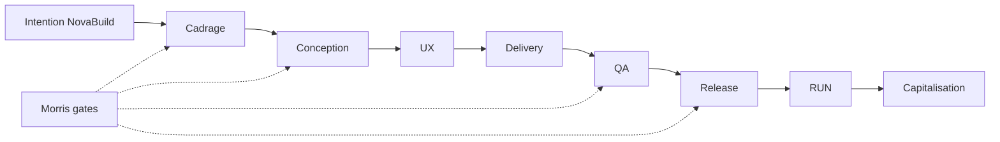

# SFIA Review Pack — Discovery Experience Product Design (Correctif R1–R3)

**Horodatage :** 2026-07-14 18:12 CEST
**Repository :** mcleland147/sfia-workspace
**Cycle :** SFIA Discovery Experience — Correctif réserves Product Design (cycle 9 QA)
**Profil SFIA :** Standard
**Typologie v2.4 :** DOC
**Branche projet :** documentation/sfia-discovery-product-design
**HEAD/base :** 14446b91019c1e320c12533124201b9a3dd4863d
**origin/main :** 14446b91019c1e320c12533124201b9a3dd4863d
**Statut :** Candidate — non baseline
**Verdict :** DISCOVERY PRODUCT DESIGN CORRECTED — READY FOR COMMIT
**Handoff commit précédent :** 0c5e31c82678449b02281ae5e166e8f14075d9a6

---

## Local Git Truth Check

| Contrôle | Résultat |
|----------|----------|
| pwd | /Users/morris/Projects/sfia-workspace |
| Branche active | documentation/sfia-discovery-product-design |
| HEAD | 14446b91019c1e320c12533124201b9a3dd4863d |
| origin/main | 14446b91019c1e320c12533124201b9a3dd4863d |
| Base ancestor OK | ✓ |
| 9 fichiers discovery-product-design/ | ✓ untracked |
| Fichiers staged | 0 |
| Fichiers versionnés hors périmètre modifiés | 0 |
| Commit projet | aucun |
| Push projet | aucun |
| **Verdict** | **PASS** |

## Sources consultées

- prompts/templates/sfia-cycle-execution-template.md
- method/sfia-fast-track/core/sfia-cycle-routing-guide.md
- method/sfia-fast-track/core/sfia-chatgpt-cursor-operating-model.md
- method/sfia-fast-track/core/sfia-rules-and-guardrails.md
- origin/sfia/review-handoff @ 0c5e31c82678449b02281ae5e166e8f14075d9a6 (handoff précédent)
- Corpus discovery-product-design/ (9 fichiers) — avant/après correctif

## Qualification

- Cycle 9 QA / validation corrective · Profil Standard · DOC · Candidate
- Périmètre borné : R1, R2, R3 uniquement — pas de reconception corpus

## Décisions Morris appliquées

- GO traitement R1 (NovaBuild composite définitif) ✓
- GO traitement R2 (suppression statistiques non sourcées Acte I) ✓
- GO traitement R3 (séparation Git / Notion roadmap) ✓
- NovaBuild retenu comme fil rouge pédagogique composite ✓
- Aucun GO commit/push/PR/merge projet ✓
- Aucune modification Notion ✓

## État initial R1 — Fil rouge NovaBuild

- Formulations hésitantes : « cas générique inspiré Chantiers360 », « Morris tranchera fil rouge définitif », « BatiNova vs Chantiers360 vs générique » (README)
- NovaBuild présenté comme option ou « fiction sauf décision Morris contraire » (05, 03)
- Fil rouge « à valider » dans décisions ouvertes

## Correction R1

- NovaBuild qualifié **cas pédagogique composite validé** dans README, 01, 02, 03, 04, 05, 07, 08
- Formulation de référence intégrée (03 §5, README)
- Table distinction fiction / preuves SFIA réelles (03)
- Retrait des décisions ouvertes sur le choix du fil rouge
- Contrôle C19 + test 4.8 (08) : lecteur distingue fiction NovaBuild et preuves réelles
- Chantiers360 conservé uniquement comme **catégorie d'actifs vérifiables**, pas comme fil rouge alternatif

## État initial R2 — Statistiques génériques

- Acte I (02) : preuve = « Statistiques génériques, anti-patterns »
- Risque de chiffres sectoriels non sourcés dans la narration d'ouverture

## Correction R2

- Acte I (02) : preuves **qualitatives vérifiables** uniquement (fragmentation, rework, IA non reproductible, etc.) — sans chiffres inventés
- Règle éditoriale explicite §05 : aucun chiffre performance/coût/délai sans source
- Contrôle C20 + test 4.9 (08)
- Note pédagogique conservée en 03 §3 : pas de benchmark chiffré non sourcé

## État initial R3 — Roadmap Git/Notion

- PD-02 combinait conception éditoriale et création pages Notion
- Pas de cycles PD-nA / PD-nB distincts

## Correction R3

- Roadmap 07 refondée : PD-02A/B à PD-06A/B + PD-07/08
- Modèle A/B documenté avec gates, merge recommandé, règle source Git avant Notion
- README, 06, 08 alignés (PD-02A gates, PD-03B+, PD-06B)
- Framework acceptation : grille roadmap Git/Notion + GO PD-02A/02B

## Fichiers modifiés (9 — correctif intégral corpus Candidate)

| # | Fichier | Lignes |
|---|---------|-------:|
| 1 | `README.md` | 119 |
| 2 | `01-sfia-discovery-product-vision.md` | 195 |
| 3 | `02-sfia-discovery-narrative-architecture.md` | 181 |
| 4 | `03-sfia-discovery-storyline.md` | 149 |
| 5 | `04-sfia-discovery-personas-and-reading-journeys.md` | 160 |
| 6 | `05-sfia-discovery-editorial-contract.md` | 166 |
| 7 | `06-sfia-discovery-target-information-architecture.md` | 187 |
| 8 | `07-sfia-discovery-transformation-roadmap.md` | 162 |
| 9 | `08-sfia-discovery-acceptance-framework.md` | 143 |

## Fichiers inchangés (hors périmètre)

Aucun fichier hors `discovery-product-design/` modifié.

## Volume final

Total lignes : 1462

## Contrôles NovaBuild

| Recherche | Résultat |
|-----------|----------|
| NovaBuild ou Chantiers360 (fil rouge) | Absent |
| fil rouge à sélectionner | Absent |
| sauf décision Morris (fil rouge) | Absent |
| BatiNova | Absent |
| NovaBuild composite explicite | ✓ README, 03, 05 |

## Contrôles preuves et statistiques

| Recherche | Résultat |
|-----------|----------|
| statistiques génériques | Absent |
| Acte I preuves qualitatives | ✓ 02 |
| Règle chiffres §05 | ✓ |
| C20 acceptation | ✓ 08 |

## Contrôles roadmap Git / Notion

| Recherche | Résultat |
|-----------|----------|
| PD-02A/B … PD-06A/B | ✓ 07 |
| PD-02 sans suffixe A/B | Absent |
| Règle merge Git avant Notion | ✓ 07 §1 |

## Contrôles Git (post-correctif)

- git status --short : 9 fichiers untracked discovery-product-design/ uniquement
- git diff --cached : vide
- Aucun commit projet

## Garde-fous

- Vision produit, 7 actes, personas, contrat, IA cible : non modifiés hors impacts R1–R3
- Aucune modification Notion ✓
- Aucune capitalisation / promotion baseline ✓

## Réserves restantes

Aucune réserve éditoriale R1–R3 ouverte.

## Décisions Morris requises

- GO commit / PR corpus Product Design
- GO PD-02A editorial (cycle suivant)

## Actions non réalisées (conformément au mandat)

- Commit projet · Push projet · PR · Merge · Modification Notion · Capitalisation · Promotion baseline

## Verdict

**DISCOVERY PRODUCT DESIGN CORRECTED — READY FOR COMMIT**

---

## Contenu complet — 9 fichiers


---

# FICHIER 1 — README.md

# SFIA Discovery Experience — Product Design (Cycle 2 fonctionnel)

| Métadonnée | Valeur |
|------------|--------|
| **Statut** | **Candidate** — conception produit documentaire |
| **Usage** | Contrat Product Design « SFIA Discovery Experience » |
| **Baseline opérationnelle** | SFIA v2.4 |
| **Propriétaire** | Morris |
| **Source de vérité** | Git (`mcleland147/sfia-workspace`) |
| **Capitalisation méthode** | Non réalisée |
| **Implémentation Notion** | Cycles PD-nB distincts (après PD-nA Git) |
| **Horodatage** | 2026-07-14 18:10 Europe/Paris (CEST) |
| **Branche** | `documentation/sfia-discovery-product-design` |
| **HEAD source** | `14446b91019c1e320c12533124201b9a3dd4863d` |

---

## Rôle du dossier

Ce répertoire formalise le **contrat de Product Design** pour transformer l'espace Notion SFIA en **IDE métier** et **expérience de découverte du produit** — fondée sur une narration métier, fonctionnelle et orientée valeur.

| Principe | Application |
|----------|-------------|
| **Repartir du lecteur** | Parcours mental du non-initié — pas de l'arborescence §00–11 |
| **Storytelling** | Sept actes narratifs + fil rouge **NovaBuild** (cas composite validé) |
| **Transparence sélective** | Valeur et capacités visibles ; recettes internes masquées |
| **Git prime** | Conception dans Git ; Notion = couche d'expérience future |
| **Candidate** | Aucune baseline ; revue Morris avant implémentation |

---

## Constat de départ (UX-06)

L'espace Notion actuel (11 pages P0, bases Référentiel et Cycles) est **propre, structuré et cohérent visuellement** (contrat UX-01, UX-02–06). Toutefois la **profondeur éditoriale de valeur** reste insuffisante : le lecteur comprend les composants, cycles et acteurs, mais pas suffisamment **pourquoi SFIA existe**, **ce qu'elle transforme** et **comment se projeter**.

Ce cycle **ne modifie pas Notion** — il conçoit la transformation narrative cible.

---

## Inventaire des livrables (9)

| # | Fichier | Responsabilité |
|---|---------|----------------|
| 1 | [01-sfia-discovery-product-vision.md](01-sfia-discovery-product-vision.md) | Vision produit, promesse, anti-objectifs |
| 2 | [02-sfia-discovery-narrative-architecture.md](02-sfia-discovery-narrative-architecture.md) | Architecture en 7 actes |
| 3 | [03-sfia-discovery-storyline.md](03-sfia-discovery-storyline.md) | Scénario, fil rouge projet PME |
| 4 | [04-sfia-discovery-personas-and-reading-journeys.md](04-sfia-discovery-personas-and-reading-journeys.md) | 6 personas, 5 niveaux de lecture |
| 5 | [05-sfia-discovery-editorial-contract.md](05-sfia-discovery-editorial-contract.md) | Voix, confidentialité, matrice d'information |
| 6 | [06-sfia-discovery-target-information-architecture.md](06-sfia-discovery-target-information-architecture.md) | Nouvelle arborescence, mapping ancien → cible |
| 7 | [07-sfia-discovery-transformation-roadmap.md](07-sfia-discovery-transformation-roadmap.md) | Incréments PD-01, PD-nA/B, PD-07–08 |
| 8 | [08-sfia-discovery-acceptance-framework.md](08-sfia-discovery-acceptance-framework.md) | Critères d'acceptation, grilles de test |

---

## Ordre de lecture

1. Vision → 2. Architecture narrative → 3. Storyline → 4. Personas → 5. Contrat éditorial → 6. IA cible → 7. Roadmap → 8. Acceptation

---

## Relation avec les cycles antérieurs

| Cycle | Apport | Limite pour Discovery |
|-------|--------|------------------------|
| Notion cycle 1 | Vision produit, IA §01–11 | Trop structurée par numérotation |
| Editorial P0 (PR #193) | Contenu pages actuelles | Trop méthodologique, peu narratif |
| UX-01 (PR #194) | Navigation, design system | UX correcte, valeur métier insuffisante |
| **Discovery (présent)** | Narration, storytelling, IA cible | Conception uniquement |

---

## Trajectoire vers l'implémentation

```text
Product Design (présent) → validation Morris → préparation éditoriale Git
  → préparation éditoriale Git (PD-nA) → implémentation Notion (PD-nB) → QA (PD-07) → capitalisation (PD-08)
```

**Gates futurs :** GO commit/PR corpus · GO PD-02A editorial · GO PD-nB Notion · GO capitalisation.

---

## Fil rouge NovaBuild (décision Morris — R1)

> **NovaBuild** est un **cas pédagogique composite**. L'entreprise et le déroulé narratif sont **fictifs**. Les besoins, catégories de livrables, contrôles et mécanismes visibles sont **inspirés** de situations réalistes et d'actifs SFIA vérifiables (ex. catégories produites dans des cycles Chantiers360 documentés dans Git). Le récit **ne constitue ni un témoignage client ni la reproduction exacte** d'un projet réel.

| Type | NovaBuild |
|------|-----------|
| Entreprise | Fiction narrative |
| Enchaînement projet | Scénarisé pédagogiquement |
| Catégories de livrables | Inspirées d'actifs SFIA réels |
| Résultats chiffrés | **Interdits** sans source |

---

## Décisions Morris validées

- GO cycle Product Design Discovery
- GO nouvelle architecture narrative
- GO remise en question structure pages actuelles (proposition, pas exécution)
- GO storytelling orienté valeur
- GO fil rouge **NovaBuild** (cas composite) — R1
- Aucune modification Notion dans ce cycle

## Décisions non prises

- Validation architecture cible pages (implémentation)
- GO premier cycle PD-02A editorial
- GO implémentation Notion (PD-nB)
- Promotion baseline ou capitalisation méthode

---

## Garde-fous

- Ne pas modifier pages Notion, editorial, ux ou method/core
- Ne pas exposer prompts/templates complets
- Ne pas promouvoir v2.5/v2.6 baseline
- Ne pas committer ce cycle sans GO Morris

---

# FICHIER 2 — 01-sfia-discovery-product-vision.md

# 01 — Vision produit — SFIA Discovery Experience

| Métadonnée | Valeur |
|------------|--------|
| **Statut** | **Candidate** |
| **Propriétaire** | Morris |
| **Baseline** | SFIA v2.4 |
| **Source de vérité** | Git |
| **Horodatage** | 2026-07-14 18:10 Europe/Paris (CEST) |
| **Branche** | `documentation/sfia-discovery-product-design` |
| **HEAD** | `14446b91019c1e320c12533124201b9a3dd4863d` |

---

## 1. Problème produit

Un dirigeant de PME, un chef de projet ou un prospect technique découvre SFIA via Notion ou une présentation. Aujourd'hui il obtient :

- une description **correcte** des cycles, profils, gates et acteurs ;
- une séparation Git/Notion **claire** ;
- une navigation **fonctionnelle**.

Il n'obtient pas suffisamment :

- la **raison d'être** de SFIA face aux projets classiques ;
- la **différenciation** face à ChatGPT + Cursor utilisés librement ;
- une **projection** sur un projet réel de bout en bout ;
- la **valeur économique et organisationnelle** pour une PME, une ESN ou une équipe interne ;
- la **confiance** que la méthode apporte des garanties sans promettre l'impossible.

**Observation (constat UX-06) :** l'espace décrit la méthode ; il ne **raconte** pas encore le produit SFIA.

---

## 2. Vision

> **SFIA Discovery Experience** transforme Notion en **IDE métier SFIA** : un environnement de découverte où l'on comprend la valeur, la transformation, les rôles, les livrables et les garanties — avant d'entrer dans Git pour exécuter.

**Formulation produit (à challenger par Morris) :**

> SFIA est une **équipe projet virtuelle industrialisée et gouvernée**, qui transforme une intention métier en produit applicatif traçable, sous le contrôle d'un décideur humain.

**Formulation grand public :**

> SFIA structure la création de logiciels avec l'IA comme **assistant contrôlé** — pas comme pilote autonome.

---

## 3. Rôle de Notion

| Couche | Rôle |
|--------|------|
| **Git** | Vérité — méthode, exécution, prompts, historique, preuves |
| **Notion (cible Discovery)** | Expérience — narration, valeur, démonstration, projection |
| **Morris** | Autorité — gates, merge, validation baseline |

Notion devient : point d'entrée métier, storytelling, preuves sélectionnées, parcours par persona — **sans** miroir repo ni catalogue brut.

---

## 4. Notion « IDE métier » — signification

| Dimension | IDE métier SFIA |
|-----------|-----------------|
| Entrée | Question métier (« pourquoi », « combien ça change », « pour qui ») |
| Navigation | Par actes narratifs et parcours temps — pas par numéro § |
| Preuve | Livrables visibles, extrait projet, témoignages structurés |
| Sortie | Décision d'approfondir, contact, ou passage Git pour exécution |
| Interdit | Terminal d'exécution, éditeur de prompts, sync Git |

---

## 5. Différence Git / Notion

| Question | Notion | Git |
|----------|--------|-----|
| Pourquoi SFIA ? | ✓ Acte I | Résumé foundation |
| Comment router un cycle ? | Orientation L2 | routing-guide complet |
| Quel prompt exact ? | **Non** | prompts/ |
| Preuve fil rouge NovaBuild (composite) | Synthèse narrative | Catégories livrables dans projects/ |

**Principe :** transparence fonctionnelle, opacité méthodologique sélective.

---

## 6. Promesse fonctionnelle

| Promesse | Démontrable | Non promis |
|----------|-------------|------------|
| Cycles courts et traçables | ✓ Exemples Git | Zéro dette technique |
| IA assistée sous contrôle humain | ✓ Operating model | Autonomie totale |
| Livrables identifiés par cycle | ✓ Fil rouge | Livrables sans effort |
| Gouvernance Morris sur gates | ✓ Schéma rôles | Décisions automatiques |
| Capitalisation des acquis | ✓ REX Chantiers360 | Succès garanti |

---

## 7. Utilisateurs visés

Dirigeant PME · Chef de projet / PO · Équipe technique · ESN / partenaire · Contributeur méthode · Prospect non technique.

---

## 8. Transformation attendue

| Avant (lecteur) | Après (Discovery) |
|-----------------|-------------------|
| « SFIA = docs + IA » | « SFIA = usine logicielle gouvernée » |
| « Encore une méthode » | « Réponse au chaos projet + IA libre » |
| « Trop technique » | « Je vois mon rôle et mes gains » |
| « Où est la preuve ? » | « J'ai suivi un fil rouge crédible et distingué fiction / preuves » |

---

## 9. Bénéfices par audience

| Audience | Bénéfice clé |
|----------|--------------|
| PME | Visibilité, cadence, maîtrise des coûts de delivery |
| Chef de projet | Enchaînement clair, livrables, moins de rework |
| Technique | Moins de flou spec, garde-fous, traçabilité PR |
| ESN | Méthode reproductible, démonstration crédible client |
| Morris | Décisions structurantes préservées |

---

## 10. Anti-objectifs

- Miroir Git · Catalogue prompts · Doc méthode pure · Secrets d'exécution exposés
- Projet 100 % autonome IA · Remplacement total experts · Garantie succès · Zéro risque
- Promotion v2.5/v2.6 baseline · SFIA 3.0 · Modification Notion dans ce cycle

---

## 11. Principes d'expérience

1. **Lecteur d'abord** — questions métier avant structure
2. **Story avant spec** — actes narratifs avant §01–11
3. **Preuve avant promesse** — livrables et REX sourcés
4. **Progressive disclosure** — 3 min → 45 min
5. **Humain visible** — Morris, gates, limites
6. **Comparaison explicite** — classique / IA libre / SFIA
7. **Opacité sélective** — pas de recette complète

---

## 12. Indicateurs de réussite

| ID | Indicateur |
|----|------------|
| I1 | Non-technique reformule SFIA en < 2 min après parcours 10 min |
| I2 | Distinction IA libre vs SFIA articulée sans aide |
| I3 | ≥ 5 livrables concrets cités après Acte IV |
| I4 | Persona identifie « son » parcours en < 30 s |
| I5 | Aucune fuite prompt catalog en test confidentialité |
| I6 | Envie de poursuivre (score ≥ 4/5) sur test prospect PME |

---

## 13. Risques

| Risque | Mitigation |
|--------|------------|
| Sur-promesse commerciale | Contrat éditorial §05, framework §08 |
| Exposition méthode | Matrice confidentialité |
| Fil rouge confondu avec client réel | Qualification composite NovaBuild · contrôles §08 |
| Trop long | Parcours temps bornés |
| Conflit avec P0 existant | Mapping migration §06, pas suppression immédiate |

---

## 14. Frontière pédagogie / marketing / secret

| Type | Notion Discovery | Git |
|------|------------------|-----|
| Pédagogie | Capacités, rôles, cycles simplifiés | Détail |
| Marketing | Valeur, différenciation, projection | — |
| Documentation | Synthèse gouvernance | Canonique |
| Secret méthodologique | **Masqué** | Prompts, routing détaillé, automation |

---

## 15. Décisions Morris

**Validées :** GO Product Design · IDE métier · narration · remise en question structure (proposition) · fil rouge **NovaBuild composite** (R1).

**Futures :** GO commit corpus · GO PD-02A editorial · GO implémentation Notion (PD-nB) · capitalisation.

---

## Sources Git

- `sfia-notion-product-vision.md` · `ux/01-sfia-notion-ux-vision.md`
- `sfia-chatgpt-cursor-operating-model.md` · `sfia-engineering-principles.md`
- `sfia-platform-architecture.md` · capitalisations Chantiers360

---

# FICHIER 3 — 02-sfia-discovery-narrative-architecture.md

# 02 — Architecture narrative — SFIA Discovery Experience

| Métadonnée | Valeur |
|------------|--------|
| **Statut** | **Candidate** |
| **Propriétaire** | Morris |
| **Baseline** | SFIA v2.4 |
| **Horodatage** | 2026-07-14 18:10 Europe/Paris (CEST) |
| **Branche** | `documentation/sfia-discovery-product-design` |
| **HEAD** | `14446b91019c1e320c12533124201b9a3dd4863d` |

---

## 1. Objectif

Concevoir le **récit produit** en sept actes — indépendamment de la numérotation Notion §00–11. Chaque acte répond à une question du lecteur et prépare l'acte suivant.

---

## 2. Vue d'ensemble

```text
ACTE I   Pourquoi SFIA existe
ACTE II  Une nouvelle façon de conduire un projet
ACTE III Suivons un vrai projet
ACTE IV  Ce que SFIA produit
ACTE V   Pourquoi cela fonctionne
ACTE VI  Se projeter avec SFIA
ACTE VII Explorer la méthode (annexes)
```

---

## 3. ACTE I — Pourquoi SFIA existe

| Champ | Contenu |
|-------|---------|
| **Question lecteur** | Pourquoi une autre méthode ? Quel problème concret ? |
| **Objectif** | Créer l'urgence et la reconnaissance du problème |
| **Message** | Les projets numériques échouent par manque de cadre, pas par manque d'outils IA |
| **Émotion** | « C'est notre situation » |
| **Preuve** | Observations qualitatives vérifiables : fragmentation des responsabilités · perte de décisions · spécifications contradictoires · rework · dépendance à quelques experts · prompts improvisés · résultats IA difficiles à reproduire · manque de traçabilité · passage difficile du besoin au delivery · gouvernance implicite · coûts organisationnels décrits **sans chiffres inventés** (anti-patterns documentés · situations métier reconnaissables · illustration NovaBuild · hypothèses explicitement signalées) |
| **Niveau détail** | L0–L1 |
| **Révélé** | Douleur PME, chaos IA libre, coût du flou |
| **Masqué** | Architecture SFIA interne |
| **Transition** | « Et si une autre voie existait ? » |
| **Durée** | 3–5 min |
| **Personas** | Dirigeant PME, prospect |

---

## 4. ACTE II — Une nouvelle façon de conduire un projet

| Champ | Contenu |
|-------|---------|
| **Question** | En quoi SFIA diffère-t-elle de ChatGPT/Cursor libres et d'une ESN classique ? |
| **Objectif** | Poser le contraste tripartite |
| **Message** | SFIA = cycles + gouvernance + IA assistée + traçabilité Git |
| **Émotion** | « Enfin un cadre » |
| **Preuve** | Tableau comparatif (projet classique / IA libre / SFIA) |
| **Niveau** | L1 |
| **Révélé** | Rôles Morris / ChatGPT / Cursor / Git / Notion |
| **Masqué** | Prompt catalog, routing détaillé |
| **Transition** | « Voyons concrètement sur un projet » |
| **Durée** | 8–10 min |
| **Personas** | Chef de projet, ESN, technique |

---

## 5. ACTE III — Suivons un vrai projet

| Champ | Contenu |
|-------|---------|
| **Question** | À quoi ressemble un projet piloté avec SFIA ? |
| **Objectif** | Fil rouge narratif bout en bout |
| **Message** | De l'intention métier à la mise en service — avec gates humaines |
| **Émotion** | « Je me projette » |
| **Preuve** | Fil rouge **NovaBuild** (cas pédagogique composite) — catégories de livrables et mécanismes inspirés d'actifs SFIA vérifiables (ex. cycles Chantiers360 en Git) ; récit fictif, pas reproduction exacte d'un projet client |
| **Niveau** | L1–L2 |
| **Révélé** | Étapes cadrage → RUN, livrables par phase |
| **Masqué** | Contenu brut projects/, prompts exécutés |
| **Transition** | « Que produit-on exactement ? » |
| **Durée** | 15–20 min |
| **Personas** | Tous — cœur Discovery |

---

## 6. ACTE IV — Ce que SFIA produit

| Champ | Contenu |
|-------|---------|
| **Question** | Quels livrables et résultats concrets ? |
| **Objectif** | Matérialiser la valeur |
| **Message** | Chaque cycle produit un artefact identifiable et traçable |
| **Émotion** | « C'est tangible » |
| **Preuve** | Galerie livrables (ADR, BPMN, backlog, review pack, QA…) |
| **Niveau** | L2 |
| **Révélé** | Types livrables, exemples visuels autorisés |
| **Masqué** | Templates complets |
| **Transition** | « Pourquoi ça tient la route ? » |
| **Durée** | 10 min |
| **Personas** | PO, PMO, ESN |

---

## 7. ACTE V — Pourquoi cela fonctionne

| Champ | Contenu |
|-------|---------|
| **Question** | Quelles garanties et limites ? |
| **Objectif** | Crédibilité — pas sur-promesse |
| **Message** | Garde-fous, gates Morris, Git prime, capitalisation |
| **Émotion** | « Confiance raisonnée » |
| **Preuve** | Gouvernance résumée, limites explicites |
| **Niveau** | L2 |
| **Révélé** | Ce qui est garanti vs ce qui ne l'est pas |
| **Masqué** | Protected paths, rules complètes |
| **Transition** | « Et pour mon contexte ? » |
| **Durée** | 8 min |
| **Personas** | Dirigeant, responsable méthode |

---

## 8. ACTE VI — Se projeter avec SFIA

| Champ | Contenu |
|-------|---------|
| **Question** | Quelle valeur pour moi (PME, ESN, tech) ? |
| **Objectif** | Personnalisation par persona |
| **Message** | Parcours et gains spécifiques |
| **Émotion** | « C'est pour nous » |
| **Preuve** | Fiches persona + CTA |
| **Niveau** | L1 |
| **Révélé** | Bénéfices par segment |
| **Masqué** | Pricing, contrats commerciaux (hors scope) |
| **Transition** | « Approfondir la méthode ? » |
| **Durée** | 5–10 min |
| **Personas** | Ciblés |

---

## 9. ACTE VII — Explorer la méthode

| Champ | Contenu |
|-------|---------|
| **Question** | Comment approfondir / exécuter ? |
| **Objectif** | Porte vers annexes et Git |
| **Message** | Méthode disponible — exécution dans Git |
| **Émotion** | « Je sais où aller » |
| **Preuve** | Liens Référentiel, glossaire, setup |
| **Niveau** | L2–L4 |
| **Révélé** | Index méthode simplifié |
| **Masqué** | — (renvoi Git pour détail) |
| **Transition** | Sortie ou boucle approfondissement |
| **Durée** | Libre |
| **Personas** | Contributeur, architecte |

---

## 10. Règles transversales actes

- Un acte = une intention principale
- Chaque acte se termine par une **question** ou **CTA** vers le suivant
- Les pages P0 actuelles (§01–08) deviennent **matière** des actes VII ou annexes — pas structure primaire
- Durée totale parcours complet : 45–60 min (lecture active)

---

## 11. Hypothèses et options

| Élément | Statut |
|---------|--------|
| 7 actes | **Validé** Morris |
| Fil rouge NovaBuild (composite) | **Validé** Morris — R1 |
| Acte VII reprend glossaire/routage | **Hypothèse** — contenu P0 recyclé en annexe |

---

## Liens

→ [03 Storyline](03-sfia-discovery-storyline.md) · [06 IA cible](06-sfia-discovery-target-information-architecture.md)

---

# FICHIER 4 — 03-sfia-discovery-storyline.md

# 03 — Storyline — SFIA Discovery Experience

| Métadonnée | Valeur |
|------------|--------|
| **Statut** | **Candidate** |
| **Propriétaire** | Morris |
| **Baseline** | SFIA v2.4 |
| **Horodatage** | 2026-07-14 18:10 Europe/Paris (CEST) |
| **Branche** | `documentation/sfia-discovery-product-design` |
| **HEAD** | `14446b91019c1e320c12533124201b9a3dd4863d` |

---

## 1. Objectif

Écrire le **scénario produit** — fil rouge, contrastes, moments de preuve, climax et sorties.

---

## 2. Ouverture narrative

> **Scène :** Un dirigeant de PME du BTP — l'entreprise **NovaBuild** est un **cas pédagogique composite** : entreprise et déroulé narratif **fictifs**, besoins et catégories de livrables **inspirés** de situations réalistes et d'actifs SFIA vérifiables. NovaBuild a besoin d'une application pour piloter ses chantiers et réserves. Il a testé ChatGPT pour « faire une app ». Résultat : des bouts de code, des idées, aucune traçabilité, personne pour maintenir.

**Question du lecteur :** « Et SFIA, concrètement, ça change quoi ? »

---

## 3. Contraste tripartite

| Dimension | Projet classique | IA libre (ChatGPT/Cursor) | SFIA |
|-----------|------------------|---------------------------|------|
| Cadre | Cahier des charges lourd | Aucun | Cycles bornés |
| Traçabilité | Variable | Faible | Git + PR |
| Vitesse | Lente | Rapide mais chaotique | Rapide **et** gouverné |
| Décision | Comité | Utilisateur seul | Morris (gates) |
| Livrables | Documents projet | Fragments code | Artefacts par cycle |
| Capitalisation | Difficile | Absente | REX, méthode |

**Note :** comparaison **pédagogique** — pas claim benchmark chiffré non sourcé.

---

## 4. Révélation progressive de SFIA

1. **Acte I** — NovaBuild reconnaît le chaos (retards, rework, IA non maîtrisée)
2. **Acte II** — SFIA introduite comme **usine logicielle gouvernée**
3. **Acte III** — On suit le projet NovaBuild cycle par cycle
4. **Acte IV** — On voit les livrables s'accumuler
5. **Acte V** — On comprend pourquoi ça tient (gates, Git, review)
6. **Acte VI** — NovaBuild (PME) et l'ESN partenaire se projettent
7. **Acte VII** — Accès méthode pour qui veut approfondir

---

## 5. Fil rouge projet NovaBuild

> NovaBuild est un cas pédagogique composite. L'entreprise et le déroulé narratif sont fictifs. Les besoins, catégories de livrables, contrôles et mécanismes visibles sont inspirés de situations réalistes et d'actifs SFIA vérifiables. Le récit ne constitue ni un témoignage client ni la reproduction exacte d'un projet réel.

**Lien de preuve (catégories réelles, contenu scénarisé) :** cycles documentés type Chantiers360 (`projects/chantiers360/`, capitalisations v2.5) — **synthèse narrative**, pas export brut ni attribution client à NovaBuild.

| Distinction | NovaBuild | SFIA réel |
|-------------|-----------|-----------|
| Entreprise | Fiction | — |
| Enchaînement cycles | Scénarisé | Traçable Git |
| Types de livrables | Inspirés | Produits dans projects/ |
| Gates Morris | Narrés | Décisions réelles |
| Résultats chiffrés | **Interdits** | Uniquement si sourcés |

| Phase | Problème projet | Action SFIA visible | Rôles | Livrable observable | Gate Morris | Valeur | Preuve Git | Masqué |
|-------|-----------------|---------------------|-------|---------------------|-------------|--------|------------|--------|
| **Intention** | Besoin métier flou | Cycle cadrage | Morris, ChatGPT | Note cadrage | GO scope | Alignement | framing docs | Prompts |
| **Cadrage** | Périmètre | Cycle fonctionnel | PO, ChatGPT | Backlog initial | Validation | Clarté | backlog samples | Catalog |
| **Conception** | Spec incomplète | Archi fonctionnelle | Architecte, Cursor | Diagrammes, ADR | GO archi | Réduction rework | functional-architecture-method | Templates intégraux |
| **UX** | UI incohérente | Cycle UX/UI | Designer, Cursor | Maquettes / Penpot | Revue Morris | UX alignée | ux deliverables | Figma raw |
| **Delivery** | Code non tracé | Cycles delivery | Dev, Cursor | PR, code | Merge GO | Incréments | PR history | CI secrets |
| **QA** | Régressions | Cycle QA | QA, Cursor | Rapport QA, captures | GO release | Qualité | qa reports | Test scripts complets |
| **Release** | Mise en prod | Cycle release | Morris | Release notes | GO deploy | Disponibilité | release docs | Infra |
| **RUN** | Exploitation | Cycle RUN readiness | Ops | Runbook | GO | Continuité | run readiness | — |
| **Capitalisation** | Perte REX | Cycle cap. | Morris | REX, méthode | GO cap. | Amélioration continue | capitalization docs | — |

*(Tableau pédagogique — événements NovaBuild scénarisés ; catégories alignées sur actifs SFIA réels.)*

---

## 6. Moments de preuve (climax)

| # | Moment | Contenu |
|---|--------|---------|
| M1 | Premier cycle terminé avec PR merge | « Quelque chose de concret existe dans Git » |
| M2 | Review pack lu par Morris | « La qualité est contrôlée » |
| M3 | Capture runtime QA | « L'application fonctionne » |
| M4 | REX capitalisation | « La méthode s'améliore » |

**Climax narratif recommandé :** M3 — démonstration visuelle application NovaBuild (capture ou schéma — **pas** code source intégral).

---

## 7. Transitions et sorties

| Sortie | Condition | Destination |
|--------|-----------|-------------|
| Teaser 3 min | Dirigeant pressé | Acte I + II résumé |
| Conviction 20 min | PO intéressé | Acte III + IV |
| Approfondissement | Architecte | Acte VII + Git |
| Contact / GO Morris | Prospect qualifié | Hors Notion — process commercial Morris |

---

## 8. Points de projection utilisateur

- « Mon équipe ressemble à NovaBuild »
- « Mon ESN pourrait livrer ainsi »
- « Je vois où Morris intervient »
- « Je ne veux pas reconstruire SFIA — je veux l'utiliser »

---

## 9. Crédibilité et limites

| Affirmation | Statut |
|-------------|--------|
| Des cycles SFIA ont produit des livrables réels (ex. Chantiers360) | **Observation** — sources Git |
| NovaBuild est un client réel | **Fiction pédagogique** — cas composite validé |
| NovaBuild reproduit exactement un projet client | **Interdit** |
| SFIA garantit succès projet | **Interdit** |
| IA exécute seule | **Interdit** |

---

## 10. Diagramme fil rouge (Mermaid)



---

## Liens

→ [02 Architecture narrative](02-sfia-discovery-narrative-architecture.md) · [04 Personas](04-sfia-discovery-personas-and-reading-journeys.md)

---

# FICHIER 5 — 04-sfia-discovery-personas-and-reading-journeys.md

# 04 — Personas et parcours de lecture — SFIA Discovery Experience

| Métadonnée | Valeur |
|------------|--------|
| **Statut** | **Candidate** |
| **Propriétaire** | Morris |
| **Baseline** | SFIA v2.4 |
| **Horodatage** | 2026-07-14 18:10 Europe/Paris (CEST) |
| **Branche** | `documentation/sfia-discovery-product-design` |
| **HEAD** | `14446b91019c1e320c12533124201b9a3dd4863d` |

---

## 1. Personas (6 minimum)

### 1.1 Dirigeant de PME

| Champ | Contenu |
|-------|---------|
| Problème | Coût, délais, dépendance prestataires, IA non maîtrisée |
| Maturité | Faible technique |
| Question initiale | « Pourquoi payer une méthode ? » |
| Attente | ROI, risque maîtrisé, simplicité |
| Objection | « Encore du consulting » |
| Preuve | Fil rouge NovaBuild (composite), livrables visibles, distinction fiction/preuves |
| Vocabulaire | Business, pas Git |
| Profondeur max | L1 |
| CTA | Parcours 10 min → contact Morris |
| Parcours | Acte I → II → VI |

### 1.2 Chef de projet / PO

| Champ | Contenu |
|-------|---------|
| Problème | Flou scope, rework, coordination IA/équipe |
| Maturité | Moyenne |
| Question | « Comment structurer un projet avec SFIA ? » |
| Attente | Cycles, livrables, gates |
| Objection | « Trop lourd ? » |
| Preuve | Acte III complet, galerie livrables |
| Vocabulaire | Cycle, backlog, gate |
| Profondeur | L2 |
| CTA | Parcours 30 min → setup |
| Parcours | I → II → III → IV → VII (setup) |

### 1.3 Équipe technique

| Champ | Contenu |
|-------|---------|
| Problème | Specs instables, dette, prompts ad hoc |
| Maturité | Élevée |
| Question | « Qu'est-ce que Cursor fait vraiment ? » |
| Attente | Garde-fous, PR, templates (orientation) |
| Objection | « Je préfère coder seul » |
| Preuve | Delivery + QA du fil rouge |
| Vocabulaire | PR, branch, review pack |
| Profondeur | L3 |
| CTA | Acte VII → Git |
| Parcours | II → III → IV → VII |

### 1.4 ESN / partenaire

| Champ | Contenu |
|-------|---------|
| Problème | Différenciation offre, reproductibilité |
| Maturité | Variable |
| Question | « Puis-je vendre / appliquer SFIA chez mes clients ? » |
| Attente | Méthode reproductible, preuves |
| Objection | « Propriétaire Morris ? » |
| Preuve | REX et capitalisation SFIA réels (ex. Chantiers360 en Git) — distincts du récit NovaBuild |
| Vocabulaire | Delivery, gouvernance |
| Profondeur | L2 |
| CTA | Acte VI (ESN) → Morris |
| Parcours | I → II → III → V → VI |

### 1.5 Contributeur méthode

| Champ | Contenu |
|-------|---------|
| Problème | Comprendre sans exposer secrets |
| Maturité | Élevée |
| Question | « Où est la frontière Notion/Git ? » |
| Attente | Gouvernance claire |
| Objection | « Notion va diverger » |
| Preuve | Acte V + VII |
| Profondeur | L3–L4 |
| CTA | Git contribution |
| Parcours | V → VII |

### 1.6 Prospect non technique

| Champ | Contenu |
|-------|---------|
| Problème | Peur IA, incompréhension |
| Maturité | Très faible |
| Question | « C'est quoi SFIA en une phrase ? » |
| Attente | Simplicité, confiance |
| Objection | « Trop compliqué » |
| Preuve | Acte I teaser, analogie équipe virtuelle |
| Profondeur | L0 |
| CTA | 3 min ou sortie |
| Parcours | I (résumé) → II (schéma) |

---

## 2. Niveaux de lecture

| Niveau | Durée | Objectif | Actes | Résultat |
|--------|-------|----------|-------|----------|
| **Teaser** | 3 min | Accroche | I (extrait) | Curiosité |
| **Compréhension** | 10 min | Différenciation | I + II | Distinction IA libre |
| **Conviction** | 20 min | Crédibilité | I–IV (condensé) | Projet imagé |
| **Démonstration** | 30–45 min | Projection | I–VI | Décision approfondir |
| **Exploration** | Libre | Méthode | VII + annexes | Passage Git |

---

## 3. Parcours détaillés

### 3.1 Teaser 3 minutes

| Ordre | Chapitre | Temps | Indispensable |
|-------|----------|-------|---------------|
| 1 | Pourquoi SFIA (Acte I résumé) | 1 min | ✓ |
| 2 | Contraste IA libre (Acte II schéma) | 1 min | ✓ |
| 3 | CTA « 10 min » ou sortie | 1 min | ✓ |

### 3.2 Compréhension 10 minutes

Acte I complet → Acte II complet → CTA conviction

### 3.3 Conviction 20 minutes

I → II → III (extrait fil rouge 3 phases) → IV (galerie 5 livrables)

### 3.4 Démonstration 45 minutes

I → II → III (complet) → IV → V → VI (persona choisi)

### 3.5 Exploration libre

Hub Acte VII · Annexes glossaire · Liens Git · Bases Référentiel/Cycles

---

## 4. Contenu facultatif par parcours

| Parcours | Facultatif |
|----------|------------|
| Teaser | Tout sauf I–II |
| Compréhension | III–VII |
| Conviction | V détail, VII |
| Démonstration | VII complet |
| Exploration | Actes I–VI si déjà lus |

---

## Liens

→ [02 Actes](02-sfia-discovery-narrative-architecture.md) · [06 IA cible](06-sfia-discovery-target-information-architecture.md)

---

# FICHIER 6 — 05-sfia-discovery-editorial-contract.md

# 05 — Contrat éditorial — SFIA Discovery Experience

| Métadonnée | Valeur |
|------------|--------|
| **Statut** | **Candidate** |
| **Propriétaire** | Morris |
| **Baseline** | SFIA v2.4 |
| **Horodatage** | 2026-07-14 18:10 Europe/Paris (CEST) |
| **Branche** | `documentation/sfia-discovery-product-design` |
| **HEAD** | `14446b91019c1e320c12533124201b9a3dd4863d` |

---

## 1. Voix éditoriale

| Dimension | Règle |
|-----------|-------|
| Ton | Confiant, concret, pédagogique — jamais arrogant |
| Personne | « Vous » pour le lecteur ; « SFIA » en troisième personne |
| Registre | Métier d'abord, technique en annexe |
| Longueur phrases | ≤ 25 mots en corps principal |
| Analogies | Autorisées (équipe virtuelle, usine logicielle) — pas de hype |

---

## 2. Niveau de langage

| Audience | Niveau |
|----------|--------|
| Dirigeant / prospect | B1–B2 métier |
| PO / PMO | B2 avec termes SFIA définis |
| Technique | B2–C1 avec liens Git |
| Glossaire | Obligatoire pour tout terme SFIA non trivial |

---

## 3. Rapport métier / technique

- **80/20** métier/valeur sur Actes I–VI
- **20/80** technique sur Acte VII
- Jamais de dump Git dans le corps narratif
- Schémas ASCII ou visuels — pas de code exécutable

---

## 4. Règles de storytelling

1. Toujours un **protagoniste** (NovaBuild ou persona)
2. Toujours un **conflit** (chaos projet / IA libre)
3. Toujours une **preuve** avant une promesse
4. Distinction **observation / hypothèse / recommandation / décision Morris**
5. Pas de cliffhanger sans résolution dans le parcours 45 min

---

## 5. Frontière preuve / promesse

| Autorisé | Interdit |
|----------|----------|
| « Chantiers360 a produit X » (sourcé Git) | « SFIA double votre CA » |
| « Réduit le rework **lorsque** le cadre est suivi » | « Zéro bug » |
| « Morris valide les gates structurants » | « Plus besoin de chef de projet » |

---

## 6. Règles d'usage des exemples

- Projets réels : **synthèse** uniquement — gate Morris pour contenu client
- **NovaBuild** : cas pédagogique **composite validé** — entreprise et récit fictifs ; catégories de livrables inspirées d'actifs SFIA vérifiables ; jamais présenté comme client réel
- Captures : autorisées si anonymisées
- Pas de données client identifiables

### Règle chiffres et promesses quantitatives (R2)

> Aucun chiffre de performance, de coût, de délai, de réduction du risque ou de succès ne peut être publié sans source vérifiable et qualification explicite du contexte.

---

## 7. Confidentialité méthodologique

**Principe :** le lecteur comprend capacités et valeur **sans** reconstruire SFIA intégralement.

| Catégorie | Notion Discovery | Git |
|-----------|------------------|-----|
| Public / démontrable | Valeur, rôles, types livrables | — |
| Pédagogique | Cycles simplifiés, schéma operating model | Détail |
| Repository | Index, renvois | Canonique |
| Protégé / non publié | — | Prompt catalog intégral, routing exhaustif, automation engines, seuils internes |

---

## 8. Matrice d'information

| Information | Niveau Discovery | Exemple |
|-------------|------------------|---------|
| « SFIA utilise des cycles » | Public | Acte II |
| « 15 types de cycles existent » | Pédagogique | Acte VII résumé |
| « Matrice routage complète » | Repository | Lien Git |
| « Texte prompt catalog §X » | Protégé | Non publié |
| « Seuils Critical implicites » | Protégé | Non publié |

---

## 9. Termes autorisés / déconseillés / interdits

| Terme | Statut |
|-------|--------|
| Cycle, gate, review pack (définis) | Autorisé |
| Baseline (v2.4 only) | Autorisé avec qualification |
| Candidate v2.5 | Autorisé avec badge |
| « SFIA 3.0 » | **Interdit** |
| « Autopilot », « magic » | **Interdit** |
| « Baseline UX » / « standard officiel » | **Interdit** (Candidate) |
| Jargon Git non expliqué (rebase, cherry-pick) | Déconseillé Actes I–VI |

---

## 10. Comparaisons

### vs équipe projet classique

- SFIA **cadre** et **accélère** — ne remplace pas la réflexion métier
- Morris **tranche** — ne disparaît pas

### vs ChatGPT / Cursor libres

- IA libre = **vitesse sans gouvernance**
- SFIA = **vitesse + traçabilité + gates + capitalisation**

---

## 11. Garde-fous promesses

- Aucune garantie délai absolu
- Aucune garantie coût fixe
- Aucune promesse conformité réglementaire sans preuve
- IA = assistée, pas autonome

---

## 12. Niveau de détail maximal par type

| Type page | Max |
|-----------|-----|
| Acte narratif | 3 écrans desktop |
| Fiche persona | 1 écran |
| Galerie livrable | 5 items visibles + lien « plus dans Git » |
| Annexe technique | 2 écrans + lien Git |

---

## 13. Critères qualité page

- Une intention · 30 secondes en tête · Preuve · CTA · Pas de mur de texte · Mobile scannable

---

## 14. Critères d'arrêt

Page trop longue si > 4 écrans sans toggle · Trop abstraite si aucun exemple en 2 premiers paragraphes

---

## Liens

→ [08 Acceptation](08-sfia-discovery-acceptance-framework.md) · [01 Vision](01-sfia-discovery-product-vision.md)

---

# FICHIER 7 — 06-sfia-discovery-target-information-architecture.md

# 06 — Architecture cible de l'information — SFIA Discovery Experience

| Métadonnée | Valeur |
|------------|--------|
| **Statut** | **Candidate** |
| **Propriétaire** | Morris |
| **Baseline** | SFIA v2.4 |
| **Horodatage** | 2026-07-14 18:10 Europe/Paris (CEST) |
| **Branche** | `documentation/sfia-discovery-product-design` |
| **HEAD** | `14446b91019c1e320c12533124201b9a3dd4863d` |

---

## 1. Objectif

Proposer une **nouvelle architecture de pages** orientée Discovery — sans supprimer réellement les pages Notion existantes. Mapping ancien → cible pour migration future.

---

## 2. Arborescence cible (narrative)

```text
SFIA Discovery — Accueil (Hub)
├── ACTE I — Pourquoi SFIA existe
├── ACTE II — Une nouvelle façon de piloter un projet
├── ACTE III — Suivons NovaBuild (fil rouge)
│   ├── III.1 Intention et cadrage
│   ├── III.2 Conception et UX
│   ├── III.3 Delivery et QA
│   └── III.4 Release et RUN
├── ACTE IV — Ce que SFIA produit (galerie livrables)
├── ACTE V — Pourquoi cela fonctionne (garanties et limites)
├── ACTE VI — Se projeter (par persona)
│   ├── VI.1 Dirigeant PME
│   ├── VI.2 Chef de projet
│   ├── VI.3 Équipe technique
│   └── VI.4 ESN partenaire
├── ACTE VII — Explorer la méthode (annexes)
│   ├── Cycles et profils (simplifié)
│   ├── Routage (orientation)
│   ├── Templates et assets (index)
│   ├── Gouvernance (résumé)
│   ├── Mettre SFIA en place
│   ├── Documents de référence (vue base)
│   └── Glossaire
└── Meta — Gouvernance espace · Sources Git · Statut Candidate
```

**Bases (position inchangée conceptuellement) :**

- **Référentiel SFIA** — embed Acte IV + VII
- **Cycles SFIA** — embed Acte VII

---

## 3. Table page actuelle → page cible

| Page P0 actuelle | Action cible | Destination narrative |
|------------------|--------------|---------------------|
| 00 Accueil | **Remplacer** | Hub Discovery (nouveau hero + parcours temps) |
| 01 Comprendre SFIA | **Fusionner** | Acte II + extrait Acte V |
| 02 Proposition de valeur | **Fusionner** | Acte I + Acte VI |
| 03 Comment fonctionne un cycle | **Déplacer** | Acte III (schéma) + Acte VII |
| 04 Cycles, profils, gates | **Renommer + simplifier** | Acte VII — Cycles (Candidate badge) |
| 05 Routage | **Réduire** | Acte VII — orientation uniquement |
| 06 Templates, prompts | **Index** | Acte VII — liens Référentiel |
| 07 Gouvernance | **Fusionner** | Acte V + Meta |
| 08 Mise en place | **Conserver annexe** | Acte VII |
| 10 Documents référence | **Conserver** | Acte VII — vue base |
| 11 Glossaire | **Conserver annexe** | Acte VII |

**§09 Cas d'usage :** création future P1 — hors parcours principal Discovery.

---

## 4. Table chapitre → question lecteur

| Chapitre | Question |
|----------|----------|
| Hub | Par où commencer selon mon temps ? |
| Acte I | Pourquoi SFIA ? |
| Acte II | En quoi est-ce différent ? |
| Acte III | Comment se déroule un vrai projet ? |
| Acte IV | Que produit-on ? |
| Acte V | Pourquoi faire confiance ? |
| Acte VI | Qu'est-ce que j'y gagne ? |
| Acte VII | Comment approfondir ? |

---

## 5. Table chapitre → source Git

| Chapitre | Sources principales |
|----------|---------------------|
| Acte I | engineering-principles, platform-architecture (résumé) |
| Acte II | operating-model, product-vision |
| Acte III | delivery-pipeline, projects/chantiers360 (synthèse) |
| Acte IV | bpmn-deliverables-standard, review pack examples |
| Acte V | rules-and-guardrails, publication-governance |
| Acte VI | product-vision personas, capitalization |
| Acte VII | editorial P0 existant, routing-guide (index) |

---

## 6. Table chapitre → preuve métier

| Chapitre | Preuve |
|----------|--------|
| Acte I | Anti-patterns documentés |
| Acte II | Tableau comparatif |
| Acte III | Fil rouge NovaBuild |
| Acte IV | Captures livrables |
| Acte V | Gates Morris, Git prime |
| Acte VI | Fiches persona |
| Acte VII | Bases peuplées |

---

## 7. Table chapitre → confidentialité

| Chapitre | Niveau max |
|----------|------------|
| I–VI | Public / pédagogique |
| VII cycles/routage | Pédagogique — pas catalog |
| VII templates | Index → Git |
| Meta | Gouvernance résumée |

---

## 8. Transitions précédent / suivant (extrait)

| Page | Précédent | Suivant |
|------|-----------|---------|
| Hub | — | Acte I ou parcours choisi |
| Acte I | Hub | Acte II |
| Acte II | I | III |
| Acte III.1 | II | III.2 |
| … | … | … |
| Acte VII | VI | Hub / Git |

*(Détail complet en implémentation PD-03B+)*

---

## 9. Portes d'entrée par persona

| Persona | Entrée | Parcours défaut |
|---------|--------|-----------------|
| Dirigeant PME | Hub → « 10 min » | I → II → VI.1 |
| PO | Hub → « Projet » | I → III |
| Technique | Hub → « Livrables » | IV → VII |
| ESN | Hub → « Partenaire » | II → VI.4 |
| Prospect | Hub → « 3 min » | I teaser |

---

## 10. Navigation globale

- **Hub central** — jamais sidebar Notion comme navigation primaire
- **Fil d'Ariane narratif** — Acte · Section
- **Parcours temps** — badges 3/10/20/45 min
- **Footer** — Git prime · Candidate · Morris · date sync

---

## 11. Niveaux de lecture L0–L4

| Niveau | Pages |
|--------|-------|
| L0 | Hub, Acte I teaser |
| L1 | I, II, VI |
| L2 | III, IV, V |
| L3 | VII setup, templates index |
| L4 | VII référence, glossaire complet |

---

## 12. Hypothèses

- Anciennes pages P0 **archivées** ou **redirigées** en PD-06B — pas supprimées sans GO
- Numérotation §00–11 **retirée du parcours principal** — conservée en métadonnées Git

---

## Liens

→ [07 Roadmap](07-sfia-discovery-transformation-roadmap.md) · [03 Storyline](03-sfia-discovery-storyline.md)

---

# FICHIER 8 — 07-sfia-discovery-transformation-roadmap.md

# 07 — Roadmap de transformation — SFIA Discovery Experience

| Métadonnée | Valeur |
|------------|--------|
| **Statut** | **Candidate** |
| **Propriétaire** | Morris |
| **Baseline** | SFIA v2.4 |
| **Horodatage** | 2026-07-14 18:10 Europe/Paris (CEST) |
| **Branche** | `documentation/sfia-discovery-product-design` |
| **HEAD** | `14446b91019c1e320c12533124201b9a3dd4863d` |

---

## 1. Positionnement

| Phase | Contenu |
|-------|---------|
| **PD-01** | Product Design Candidate — corpus présent |
| **PD-nA** | Préparation éditoriale Git (brouillons complets) |
| **PD-nB** | Implémentation Notion L0 (après validation source Git) |
| **PD-07** | QA narrative et métier |
| **PD-08** | Décision capitalisation — GO Morris |

**Règle structurante :** chaque incrément de contenu suit **deux cycles distincts** — préparation Git (A) puis implémentation Notion (B).

> La source éditoriale Git doit être validée avant toute implémentation Notion. Le merge préalable est **recommandé** pour les incréments structurants ; toute exception exige une décision Morris explicite et une source Git stable identifiable.

**Aucune action Notion dans PD-01 ni dans les cycles A.**

---

## 2. Modèle A / B

| Cycle | Périmètre | Livrables | Gate |
|-------|-----------|-----------|------|
| **A — Git** | Brouillons Markdown complets dans `discovery/` ou équivalent | Review pack, handoff si requis | GO Morris commit/PR/merge |
| **B — Notion** | Lecture version Git validée ; action L0 manuelle | Pages Notion, revue visuelle | GO Morris implémentation ; rollback possible |

Chaque **B** exige : source Git stable · aucune écriture Git pendant B · pas d'automatisation · revue Morris.

---

## 3. Incréments

### PD-01 — Product Design Candidate ✓ (présent)

Contrat Product Design — 9 fichiers — gate GO commit/PR corpus.

### PD-02A — Préparation éditoriale Git : Hub + Acte I

| Champ | Valeur |
|-------|--------|
| Objectif | Brouillons Hub Discovery + Acte I complets |
| Git | Création fichiers editorial Discovery |
| Review pack | Full ou light selon profil |
| Gate Morris | Validation narrative Acte I |
| Notion | **Aucune** |

### PD-02B — Implémentation Notion : Hub + Acte I

| Champ | Valeur |
|-------|--------|
| Objectif | Matérialiser Hub + Acte I dans Notion |
| Prérequis | PD-02A validé ; merge Git **recommandé** |
| Notion | Création pages L0 — manuel |
| Git | Lecture seule |
| Rollback | Restaurer depuis editorial Git |
| Gate | Revue visuelle Morris |

### PD-03A — Préparation éditoriale Git : fil rouge NovaBuild

| Champ | Valeur |
|-------|--------|
| Objectif | Brouillons Acte III (III.1–III.4) — cas composite NovaBuild |
| Preuve | Catégories livrables SFIA vérifiables — pas export projet brut |
| Gate | Test PO + distinction fiction/preuve |

### PD-03B — Implémentation Notion : Acte III

| Prérequis | PD-03A validé |
| Notion | Pages fil rouge |
| Gate | Confidentialité + crédibilité narrative |

### PD-04A — Préparation Git : Actes II, IV, V

Brouillons contraste tripartite, galerie livrables, garanties/limites.

### PD-04B — Implémentation Notion : Actes II, IV, V

Matérialisation L0 après validation 04A.

### PD-05A — Préparation Git : Actes VI et VII

Brouillons personas + annexes méthode simplifiées.

### PD-05B — Implémentation Notion : Actes VI et VII

Pages persona + portail annexes ; mapping P0 legacy documenté.

### PD-06A — Préparation Git : plan migration legacy

Plan redirections §00–11 → architecture Discovery — pas de suppression Notion dans A.

### PD-06B — Migration contrôlée Notion

Redirections, archivage parcours legacy — gate Morris GO migration.

### PD-07 — QA narrative et métier

Framework §08 · dépend PD-02B–06B · verdict acceptation.

### PD-08 — Décision capitalisation

Évaluer promotion method/core — GO Morris explicite.

---

## 4. Dépendances globales

```text
PD-01
├── PD-02A → PD-02B
├── PD-03A → PD-03B  (peut chevaucher 02A après gate Morris)
├── PD-04A → PD-04B  (après 03A recommandé)
├── PD-05A → PD-05B
├── PD-06A → PD-06B  (après 05B)
├── PD-07 (après 06B)
└── PD-08 (après PD-07)
```

**Parallélisme autorisé en préparation (A)** — pas en implémentation (B) sans source Git validée par incrément.

---

## 5. Distinction phases (synthèse)

```text
Conception (PD-01)
  → Préparation éditoriale Git (PD-nA)
    → Implémentation Notion (PD-nB)
      → QA (PD-07)
        → Capitalisation? (PD-08)
```

---

## 6. Quick wins post-PD-01

- GO commit/PR corpus PD-01
- Lancement PD-02A (Hub + Acte I editorial Git)

---

## 7. Critères capitalisation (PD-08)

Itérations réelles · usage amélioré · gabarits réutilisables · dette acceptable · **GO Morris**

---

## Liens

→ [08 Acceptation](08-sfia-discovery-acceptance-framework.md) · [README](README.md)

---

# FICHIER 9 — 08-sfia-discovery-acceptance-framework.md

# 08 — Framework d'acceptation — SFIA Discovery Experience

| Métadonnée | Valeur |
|------------|--------|
| **Statut** | **Candidate** |
| **Propriétaire** | Morris |
| **Baseline** | SFIA v2.4 |
| **Horodatage** | 2026-07-14 18:10 Europe/Paris (CEST) |
| **Branche** | `documentation/sfia-discovery-product-design` |
| **HEAD** | `14446b91019c1e320c12533124201b9a3dd4863d` |

---

## 1. Objectif

Définir les **critères de jugement** de la future expérience Discovery — avant et après implémentation Notion (PD-07).

---

## 2. Critères minimum (18)

| # | Critère | Mesure |
|---|---------|--------|
| C1 | Compréhension immédiate valeur | Reformulation 2 min post 10 min |
| C2 | Distinction classique / IA libre / SFIA | Quiz 3 items |
| C3 | Raconter SFIA avec ses mots | Entretien 5 min |
| C4 | Rôles Morris/ChatGPT/Cursor/Git/Notion | Schéma annoté |
| C5 | Projet bout en bout | Récit 5 phases minimum |
| C6 | Livrables concrets identifiés | ≥ 5 types cités |
| C7 | Garanties et limites | 2 garanties + 2 limites |
| C8 | Projection persona | « Mon cas » articulé |
| C9 | Envie poursuivre | Score ≥ 4/5 |
| C10 | Absence fuite méthodologique | Audit prompts/catalog |
| C11 | Absence promesse excessive | Revue éditoriale §05 |
| C12 | Cohérence Git | Métadonnées SHA |
| C13 | Navigation sans impasse | Walkthrough 4 parcours |
| C14 | Temps lecture maîtrisé | Parcours dans budget |
| C15 | Métier > méthode | Ratio contenu Actes I–VI |
| C16 | Mobile lisible | Test 2 pages |
| C17 | Accessibilité | Pas couleur seule |
| C18 | Candidate visible | Badge v2.5 |
| C19 | Distinction fiction NovaBuild / preuves SFIA | Test explicite post Acte III |
| C20 | Absence statistiques non sourcées | Revue Acte I + corpus — aucun chiffre sans source |

---

## 3. Grille revue Morris

| Domaine | Question | ☐ |
|---------|----------|---|
| Vision | IDE métier clair ? | |
| Narration | Actes cohérents ? | |
| Fil rouge | NovaBuild composite distingué des preuves réelles ? | |
| Chiffres | Aucune statistique non sourcée (Acte I) ? | |
| Confidentialité | Pas de fuite ? | |
| Promesses | Sobres ? | |
| Migration | Mapping P0 acceptable ? | |
| Roadmap | Cycles Git (A) / Notion (B) séparés ? | |
| GO PD-02A | Editorial Hub + Acte I autorisé ? | |

---

## 4. Tests utilisateurs

### 4.1 Lecteur non technique

- Parcours 10 min · Reformulation · Score C1, C3, C9

### 4.2 Chef de projet

- Parcours 30 min · Identification livrables · C5, C6

### 4.3 Développeur

- Acte VII + lien Git · Pas de frustration « manque détail » si renvoi clair · C4

### 4.4 Prospect PME

- Teaser 3 min + conviction partielle · C1, C8

### 4.5 Test confidentialité

- Chercher prompt catalog, routing exhaustif, automation — **doit échouer** sur Notion · C10

### 4.6 Test valeur

- « Qu'achète-on avec SFIA ? » — réponse métier sans jargon · C15

### 4.7 Test storytelling

- Récit NovaBuild fluide · C5

### 4.8 Test NovaBuild / preuves

- Après Acte III : le lecteur distingue fiction NovaBuild et preuves SFIA réelles · C19

### 4.9 Test statistiques

- Revue Acte I : aucun taux, économie ou gain chiffré sans source · C20

---

## 5. Verdicts possibles

| Verdict | Signification |
|---------|---------------|
| **DISCOVERY PRODUCT DESIGN CORRECTED — READY FOR COMMIT** | Réserves R1–R3 traitées ; corpus PD-01 prêt pour commit/PR |
| **DISCOVERY PRODUCT DESIGN READY** | Corpus PD-01 validé pour commit/PR |
| **READY WITH EDITORIAL RESERVES** | Corrections mineures documentées |
| **NARRATIVE INSUFFICIENT** | Actes ou fil rouge à retravailler |
| **VALUE PROPOSITION INSUFFICIENT** | Actes I–II faibles |
| **METHODOLOGY OVEREXPOSED** | Confidentialité violée |
| **MORRIS DECISION REQUIRED** | Arbitrage positioning |

---

## 6. Application cycle présent (PD-01)

Ce framework s'applique **pleinement** à PD-07 (QA Notion). Pour PD-01 :

- Revue Morris sur **documents Git** via critères C1–C8 en **lecture simulée**
- C10–C13 à l'implémentation
- Verdict attendu post-revue : **DISCOVERY PRODUCT DESIGN READY** ou réserves

---

## 7. Seuils GO / NO-GO implémentation

| Condition | GO PD-02A (Git) | GO PD-02B (Notion) |
|-----------|-----------------|---------------------|
| PD-01 merged | Requis | Requis |
| Fil rouge NovaBuild composite documenté | Requis | Requis |
| Brouillons Hub + Acte I validés Morris | Requis | Requis |
| Source Git stable (merge recommandé) | — | Requis |
| Contrat éditorial validé | Requis | Requis |
| Statistique non sourcée détectée | **NO-GO** | **NO-GO** |
| METHODOLOGY OVEREXPOSED | **NO-GO** | **NO-GO** |

---

## Liens

→ [05 Contrat éditorial](05-sfia-discovery-editorial-contract.md) · [07 Roadmap](07-sfia-discovery-transformation-roadmap.md)
