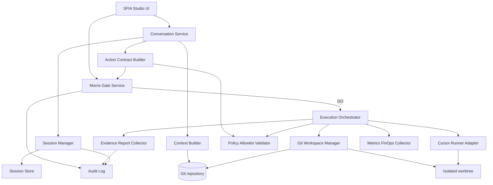
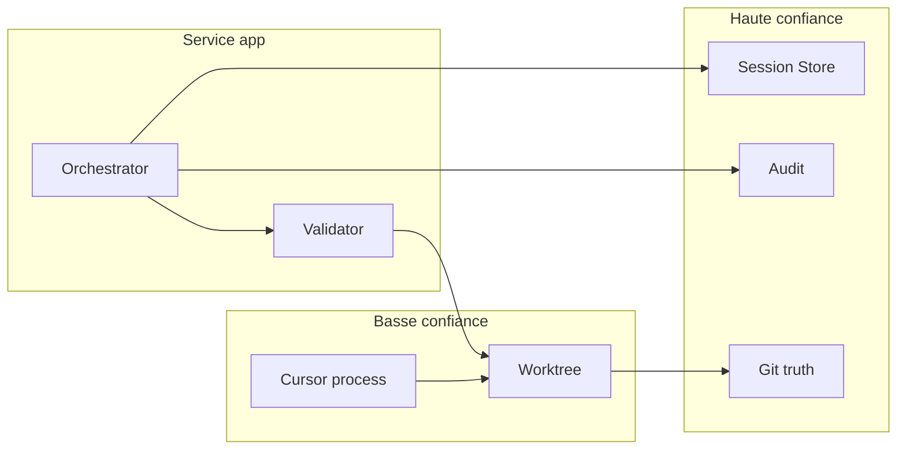
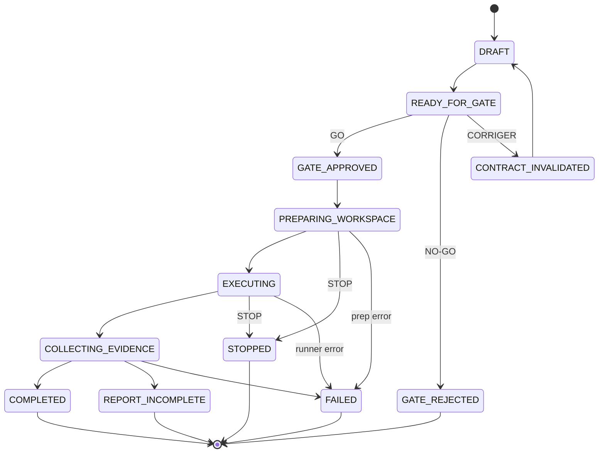

# SFIA Studio — Review Pack / Handoff local — OPS1 Architecture technique (candidate)

- **Date/heure/fuseau :** 2026-07-20 18:58:14 CEST
- **Repository :** mcleland147/sfia-workspace
- **Branche :** `design/sfia-studio-ops1-technical-architecture`
- **HEAD :** `ac2bcbf52e6170668e1a5cc0071c572026938635`
- **origin/main / base :** `ac2bcbf52e6170668e1a5cc0071c572026938635`
- **Merge-base :** `ac2bcbf52e6170668e1a5cc0071c572026938635`
- **Cycle / profil :** 6 — Architecture technique · Standard
- **Gate d’ouverture :** `GO G-OPS1-TECH-ARCH — OPEN TECHNICAL ARCHITECTURE CYCLE` — consommé
- **Gate de validation :** `G-OPS1-TECH-ARCH-VAL` — **AWAITING**
- **Numérotation :** `57` · `58` · `59` (libres, retenus)
- **Push handoff distant :** **non** (préparation locale uniquement)

> Verdict : `OPS1 TECHNICAL ARCHITECTURE DOCUMENTED — READY FOR MORRIS VALIDATION`
> Ne valide aucune décision technique · ne fixe pas de stack · n’ouvre pas backlog/delivery · n’autorise aucun commit/push.

---

## État Git

```
 M projects/sfia-studio/41-operational-vertical-slice-1-framing.md
 M projects/sfia-studio/45-ops1-functional-design.md
 M projects/sfia-studio/48-ops1-functional-architecture.md
 M projects/sfia-studio/54-ops1-operational-scenario.md
 M projects/sfia-studio/README.md
?? .tmp-sfia-review/
?? projects/.tmp-sfia-review/
?? projects/sfia-studio/57-ops1-technical-architecture.md
?? projects/sfia-studio/58-ops1-technical-components-security-and-runtime.md
?? projects/sfia-studio/59-ops1-technical-architecture-decision-pack.md

```

```
 .../41-operational-vertical-slice-1-framing.md     |  6 +++---
 projects/sfia-studio/45-ops1-functional-design.md  |  4 ++--
 .../sfia-studio/48-ops1-functional-architecture.md |  6 +++---
 .../sfia-studio/54-ops1-operational-scenario.md    |  7 ++++---
 projects/sfia-studio/README.md                     | 22 ++++++++++++++++------
 5 files changed, 28 insertions(+), 17 deletions(-)

```

Staged : **vide**. Campus360 / packs 44/47/50/53/56 : **non modifiés**.

## Sources consultées

Template SFIA · README · docs `41`–`56` · Campus360 README/01/02/03 · handoff post-merge scénario (lecture)

## Fichiers créés

- `57-ops1-technical-architecture.md`
- `58-ops1-technical-components-security-and-runtime.md`
- `59-ops1-technical-architecture-decision-pack.md`

## Fichiers modifiés (propagation minimale)

- `41` · `45` · `48` · `54` · `README`

## Architecture proposée (synthèse substantielle)

- Isolation **candidate** : worktree Git local dédié par exécution (Option A) ; conteneur = trajectoire ; VM = overkill.
- Validation déterministe : contrat canonique + SHA-256 candidat ; allowlist 1..n ; revalidation HEAD pré-exec.
- Git : branche `scenario/campus360-<slug>-<id>` locale ; pas de remote auto ; pas de commit d’exécution OPS1 par défaut.
- Persistance : fichiers locaux (+ SQLite optionnel) ; CLOSED immuable ; continuation liée.
- États : DRAFT…CLOSED avec STOP prioritaire, REPORT_INCOMPLETE, idempotence `contractHash`.
- CI documentaire minimale définie, **non implémentée**.
- FinOps : mécanismes sans seuils ; FD-CAND-15 maintenue.
- Sécurité : fail-closed path/symlink/secrets/network/remote/TOCTOU/rejeu.

## Options comparées

Isolation A/B/C · stockage files/SQLite/SGBD · hash SHA-256 · réseau deny · cleanup GO-only — voir docs 57–58.

## Décisions candidates

26 × `OPS1-TECH-CAND-01…26` · toutes `AWAITING G-OPS1-TECH-ARCH-VAL` · 0 VALIDATED.

## Réserves

FD-CAND-15 · UX-R01…R04 · isolation host partagée (si worktree) · CI non branchée · seuils FinOps OPEN · backlog/delivery/live fermés.

## Contrôles

- `git diff --check` OK
- Périmètre conforme
- Mermaid : 3 blocs dans doc 58
- Anti-claims OK
- Staged vide
- Aucun secret/PII réel

## Actions interdites non effectuées

Pas de commit · push · PR · merge · code · Campus360 · méthode · Figma · handoff distant · seuils FinOps inventés

## Décisions Morris attendues

Arbitrer `OPS1-TECH-CAND-01…26` sous `G-OPS1-TECH-ARCH-VAL` (isolation, hash/gate, stockage, CI, FinOps, conditions backlog/delivery).

## Verdict

`OPS1 TECHNICAL ARCHITECTURE DOCUMENTED — READY FOR MORRIS VALIDATION`

`REVIEW HANDOFF PREPARED LOCALLY — PUSH REQUIRES MORRIS GO`

---

## Annexe A — Document 57 (complet)

# SFIA Studio — Architecture technique OPS1 (candidate)

| Métadonnée | Valeur |
|------------|--------|
| **Document** | `57-ops1-technical-architecture.md` |
| **Cycle** | 6 — Architecture technique |
| **Profil** | Standard |
| **Typologie** | DOC / TECH-ARCH / SECURITY / DEVOPS / OBSERVABILITY / FINOPS / VALIDATION |
| **Gate d’ouverture** | `GO G-OPS1-TECH-ARCH — OPEN TECHNICAL ARCHITECTURE CYCLE` — **consommé** |
| **Gate de validation** | `G-OPS1-TECH-ARCH-VAL` — **AWAITING** |
| **Statut** | `technical-architecture-candidate` — **candidat** ; non validé |
| **Branche** | `design/sfia-studio-ops1-technical-architecture` |
| **Baseline Git** | `origin/main` @ `ac2bcbf52e6170668e1a5cc0071c572026938635` |
| **Companions** | [`58`](./58-ops1-technical-components-security-and-runtime.md) · [`59`](./59-ops1-technical-architecture-decision-pack.md) |
| **Héritage** | [`41`](./41-operational-vertical-slice-1-framing.md)–[`56`](./56-ops1-scenario-decision-pack.md) |
| **Autorité** | Morris (L0) |
| **Horodatage production** | 2026-07-20 18:55:53 CEST |

> Architecture technique **candidate** pour OPS1.
> Fondée sur le scénario validé avec amendements (`54`–`56`) et les contrats cadrage / conception / archi fct / UX.
> **Aucune** décision technique n’est validée. **Aucun** code, backlog, live, delivery ou MVP.
> Décisions : [`59`](./59-ops1-technical-architecture-decision-pack.md) — `OPS1-TECH-CAND-*` · `AWAITING G-OPS1-TECH-ARCH-VAL`.

---

## 1. Objet et non-objectifs

### Objet

Définir une architecture technique **exploitable et bornée** pour une exécution Cursor réelle OPS1 : isolation, validation déterministe du contrat, ancrage Git, workspaces, persistance, états, preuves, CI documentaire minimale, observabilité et garde-fous FinOps (sans seuils numériques).

### Non-objectifs

- Implémentation, backlog, user stories, delivery, déploiement, live, production, MVP.
- Modification Campus360 / méthode / prompts / Figma.
- Choix irréversible de fournisseur cloud ou stack « finale ».
- Fixation de montants, token limits ou timeouts numériques définitifs (FD-CAND-15).

---

## 2. Principes structurants

1. **Git** = source de vérité documentaire et d’ancrage d’exécution.
2. **Fail-closed** et **default deny**.
3. Aucun effet d’exécution sans **gate Morris** valide + contrat gelé.
4. Séparation **conversation / décision / exécution**.
5. Isolation **par session d’exécution** (pas le working tree principal).
6. Preuves **immuables** (append-only) ; session `CLOSED` immuable.
7. Continuation **liée** — jamais de réouverture silencieuse (FD-CAND-13).
8. Aucun **remote Git** automatique ; aucun **retry** automatique.
9. Allowlist **1..n** exhaustive ; **aucune wildcard** ; `03` protégé par défaut.
10. Timeout ≠ GO ; STOP prioritaire.

---

## 3. Vue d’ensemble des composants (candidats)

| Composant | Rôle |
|-----------|------|
| **SFIA Studio UI** | Surfaces conversation, action, gate, rapport, clôture |
| **Conversation Service** | Messages multi-tours GPT réels |
| **Session Manager** | Cycle de vie session / continuation / CLOSE |
| **Context Builder** | Contexte Git sélectionné + condensation |
| **Action Contract Builder** | Contrat d’action + allowlist + hash |
| **Morris Gate Service** | Présentation et journalisation GO/NO-GO/CORRIGER/ABANDONNER/STOP |
| **Execution Orchestrator** | Enchaînement post-GO fail-closed |
| **Git Workspace Manager** | Worktree/workspace isolé, branche d’exécution |
| **Cursor Runner Adapter** | Lancement Cursor borné au contrat |
| **Policy / Allowlist Validator** | Résolution chemins, denylist, symlinks, hors allowlist |
| **Evidence and Report Collector** | Diffs, contrôles sortie, rapport consolidé + par fichier |
| **Audit Log** | Événements append-only |
| **Session Store** | Persistance sessions / contrats / preuves |
| **Metrics / FinOps Collector** | Compteurs et alertes (seuils OPEN) |

Les noms sont **candidats**, non définitifs.

---

## 4. Frontières de confiance

| Frontière | Entrées | Sorties | Contrôle | Identité | Confiance | Échec |
|-----------|---------|---------|----------|----------|-----------|-------|
| Navigateur / UI | Actions Morris, texte | Affichage états | CSRF/session app (hors détail) | Morris L0 | Moyenne | Refus UI |
| Service applicatif | Messages, décisions | Contrats, états | Authz Morris, schémas | Service | Haute (logique métier) | Fail-closed |
| Session Store | Entités | Lectures | ACL locale, immutabilité CLOSED | Store | Haute données | STOP/FAILED |
| Dépôt Git source | SHA, refs | Blobs, diffs | Lecture contrôlée | Git local | Haute vérité | Refus ancrage |
| Workspace isolé | Checkout SHA | Fichiers allowlistés | Path resolve, deny | Workspace | Basse (exécutable) | STOP |
| Processus Cursor | Contrat, prompt borné | Patches locaux | Allowlist, timeout | Runner | Basse | FAILED/STOPPED |
| Réseau | — | — | **Désactivé par défaut** ou allowlist réseau | — | Nulle par défaut | Refus |
| GitHub distant | — | — | **Bloqué** (pas de push/PR/merge auto) | — | Nulle OPS1 | Refus |
| Secrets / credentials | — | — | Absents env/prompt/rapport | — | Critique | STOP |

---

## 5. Flux nominal technique

1. Conversation GPT réelle (Conversation Service).
2. Qualification : action optionnelle vs `ACTION_NOT_REQUIRED`.
3. Action Contract Builder crée le contrat (reads/creates/modifies/denied).
4. Résolution `baseHeadSha` depuis `baseRef` (ex. `origin/main`).
5. Policy Validator vérifie chemins (normalisation, pas de `..`, pas hors racine, pas symlink sortant).
6. Canonicalisation + `contractHash`.
7. Morris Gate Service présente le gate.
8. Décision Morris journalisée (timestamp + fuseau).
9. GO ⇒ **gel** du contrat (immuable).
10. Git Workspace Manager crée workspace/worktree + branche d’exécution.
11. Cursor Runner exécute **uniquement** après revalidation HEAD + hash + allowlist.
12. Evidence Collector capture diffs et métadonnées.
13. Contrôles de sortie (voir §13).
14. Rapport consolidé + par fichier.
15. Reprise conversationnelle ; analyse GPT **candidate**.
16. Clôture `CLOSED` immuable ; continuation liée si nouvelle activité.

---

## 6. Flux alternatifs

| Cas | Comportement technique |
|-----|------------------------|
| NO-GO / ABANDONNER | Aucun workspace ; décision auditée ; chat peut continuer |
| CORRIGER avant GO | Invalidation contrat ; nouveau hash ; nouveau gate |
| Extension après GO | **Refus** ; nouveau contrat + gate obligatoires |
| STOP | Prioritaire ; arrêt / non-démarrage ; preuves conservées |
| HEAD divergent post-GO | Refus exécution / invalidation |
| Hash invalide | Refus |
| Hors allowlist / symlink sortant | Refus fail-closed |
| Working tree sale (hors isolé) | Refus démarrage |
| Timeout | ≠ GO ; STOPPED/FAILED selon politique |
| Échec Cursor | Rapport d’échec ; **pas** de retry auto |
| Rapport incomplet | `REPORT_INCOMPLETE` ; pas COMPLETED ; pas re-run même hash |
| Double exécution | Refus (idempotence `contractHash`) |
| Continuation | Nouvel id + `parentSessionId` ; historique source intact |

---

## 7. Isolation d’exécution — options comparées

### Option A — Worktree Git local isolé (**recommandation candidate**)

| | |
|--|--|
| **Bénéfices** | Proportionné OPS1 ; ancrage SHA natif ; diffs Git naturels ; faible coût |
| **Limites** | Moins isolé qu’un conteneur (même host) |
| **Sécurité** | Bonne si path/symlink/deny remote stricts |
| **Coût / complexité** | Faibles |
| **Adéquation OPS1** | **Haute** |

### Option B — Conteneur local éphémère

| | |
|--|--|
| **Bénéfices** | Isolation FS/réseau plus forte |
| **Limites** | Complexité Docker/runtime ; montage Git à concevoir |
| **Sécurité** | Meilleure surface |
| **Coût / complexité** | Moyens–élevés |
| **Adéquation OPS1** | Moyenne (upgrade possible) |

### Option C — VM / runner distant

| | |
|--|--|
| **Bénéfices** | Isolation maximale |
| **Limites** | Coût, ops, latence, overkill POC |
| **Sécurité** | Forte |
| **Coût / complexité** | Élevés |
| **Adéquation OPS1** | Faible à ce stade |

**Recommandation candidate :** Option A (worktree local isolé) + politique réseau default-deny + blocage remote Git ; Option B comme trajectoire si preuves d’évasion host.

Exigences communes : workspace dédié · SHA explicite · branche dédiée · pas de working tree principal · résolution réelle des chemins · allowlist post-résolution · pas de wildcard · secrets absents · timeout · preuves avant cleanup · cleanup sous GO distinct.

---

## 8. Contrat d’action déterministe (schéma conceptuel)

| Champ | Rôle | Dans hash ? |
|-------|------|-------------|
| `contractId` | Identifiant | Oui |
| `sessionId` | Session | Oui |
| `parentSessionId` | Continuation | Oui si présent |
| `repository` | Repo | Oui |
| `baseRef` | Réf. autorisée | Oui |
| `baseHeadSha` | SHA ancré | Oui |
| `executionBranch` | Branche locale | Oui |
| `allowedReads[]` | Lecture | Oui (ordre trié) |
| `allowedCreates[]` | Création | Oui (trié) |
| `allowedModifies[]` | Modification | Oui (trié) |
| `deniedPaths[]` | Deny | Oui (trié) |
| `objective` | Objectif | Oui |
| `constraints` | Contraintes | Oui |
| `expectedReport` | Attentes preuve | Oui |
| `contractHash` | Empreinte | — (résultat) |
| `createdAt` | Création | Oui |
| `expiresAt` | Expiration **candidate** | Oui si présent |
| `gateDecision` | GO/… | Non (post-hash) ou hash « gated » distinct — **à arbitrer** |
| `gateActor` / `gateTimestamp` | Preuve décision | Hors hash contrat pré-gate |
| `executionStatus` | Runtime | Non |

**Canonicalisation candidate :** JSON canonique (clés ordonnées, tableaux triés, UTF-8, pas d’espaces non significatifs) → **SHA-256** (algorithme **candidat**).

Règles : invalidation = nouveau contrat + nouveau hash ; **aucune mutation** après GO ; revalidation HEAD **immédiatement** avant exécution.

---

## 9. Git et branches

| Usage | Convention candidate |
|-------|----------------------|
| Conception tech-arch | `design/sfia-studio-ops1-technical-architecture` |
| Exécution OPS1 | `scenario/campus360-<action-slug>-<session-id-court>` |
| Base | SHA explicite (`baseHeadSha`) |
| Localité | Locale ; **pas** de push/merge auto |
| Collision / sale | Refus ; nouveau nom / cleanup gouverné |
| Diff | Exclusivement vs `baseHeadSha` |
| Commits d’exécution | **Interdits** dans OPS1 sauf décision ultérieure |
| Cleanup | Après preuves + **GO Morris distinct** |

---

## 10. Persistance — entités conceptuelles

| Entité | Finalité | Immutabilité | Sensible |
|--------|----------|--------------|----------|
| `CycleSession` | Vie de session | CLOSED immuable | Moyen |
| `ConversationMessage` | Fil | Append-only | Oui (contenu) |
| `ConversationContextSnapshot` | Contexte condensé | Snapshot | Moyen |
| `ActionContract` | Contrat | Gelé post-GO | Moyen |
| `GateDecision` | Décision Morris | Immuable | Faible |
| `ExecutionAttempt` | Tentative | Append-only | Moyen |
| `ExecutionEvidence` | Diffs/preuves | Append-only | Moyen |
| `ExecutionReport` | Rapport | Immuable une fois scellé | Moyen |
| `AuditEvent` | Journal | Append-only | Faible |
| `ContinuationLink` | Lien parent→enfant | Immuable | Faible |

**Source de vérité fichiers :** Git. Store = orchestration / preuves applicatives, ne contredit pas Git.

### Options stockage

| Option | Adéquation OPS1 | Note |
|--------|-----------------|------|
| Fichiers structurés locaux | Haute | Simple, auditable |
| SQLite | Haute | Requêtes / idempotence |
| SGBD géré | Faible–moyenne | Overkill |

**Recommandation candidate :** fichiers structurés + SQLite optionnel pour index/verrous — **non validé**.

---

## 11. États techniques (candidats)

`DRAFT` → `READY_FOR_GATE` → `GATE_APPROVED` | `GATE_REJECTED` | `CONTRACT_INVALIDATED` → `PREPARING_WORKSPACE` → `EXECUTING` → `COLLECTING_EVIDENCE` → `COMPLETED` | `REPORT_INCOMPLETE` | `STOPPED` | `FAILED` → session `CLOSED`.

- STOP prioritaire depuis EXECUTING / PREPARING.
- Timeout ≠ GATE_APPROVED.
- Pas de retry auto.
- Idempotence : clé `contractHash` (+ `executionAttemptId`).
- Double exécution refusée.
- Crash : reprise lecture + décision Morris ; pas de reprise opaque.
- Verrou concurrent sur `contractHash` en EXECUTING.

---

## 12. Contrôles de sortie (obligatoires)

HEAD de base inchangé · fichiers = allowlist · pas de symlink sortant · pas de protégé (`03` etc.) · diff lisible · `git diff --check` · scan secrets · rapport consolidé + par fichier · statut commande · durée · métriques conso · preuves négatives · **aucune** action distante.

Échec ⇒ `STOPPED` / `FAILED` / `REPORT_INCOMPLETE` — **jamais** `COMPLETED` silencieux.

---

## 13. CI documentaire minimale (candidate, non implémentée)

| Moment | Contrôles |
|--------|-----------|
| Avant Cursor | Schéma contrat, chemins, hash, HEAD, denylist, secrets |
| Après Cursor | Diff check, allowlist, secrets, rapport, PN automatisables |
| PR (futur) | Lint MD, liens, refs docs, périmètre, packs protégés |

Bloquants vs informatifs : à figer sous `G-OPS1-TECH-ARCH-VAL` / delivery.

---

## 14. Sécurité — risques (synthèse)

| Risque | Préventif | Détectif | Fail-closed |
|--------|-----------|----------|-------------|
| Prompt injection doc | Contenu ≠ autorité | Audit | Ignorer claims fichier |
| Traversal / `..` | Normalize + root jail | Path audit | Refus |
| Symlink escape | `realpath` + prefix check | Scan | Refus |
| Command injection | Pas de shell libre | Allowlist cmds | STOP |
| Secrets | Env filtré ; absents prompt/rapport | Scan | STOP |
| Exfil réseau | Network deny | Logs | STOP |
| Git remote | Block push/fetch write | Wrapper Git | Refus |
| Hors allowlist | Validator | Diff gate | Refus |
| TOCTOU HEAD/fichiers | Revalidate pre-exec | Compare SHA | Invalidation |
| Substitution contrat | Hash + gel | Recalc | Refus |
| Rejeu / double exec | Idempotence lock | Attempt log | Refus |
| Falsification rapport | Scellage + audit | Hash preuves | FAILED |
| Confusion continuation | `parentSessionId` | Audit | STOP |

Dette résiduelle : isolation host partagée (si Option A) ; seuils FinOps OPEN ; CI non branchée.

---

## 15. Observabilité et audit

Événements minimaux : session créée · contrat créé/invalidé · hash · gate affiché · décision Morris · HEAD vérifié · workspace créé · exécution start/end · STOP · contrôle échoué · rapport · clôture · continuation · cleanup demandé/exécuté.

Chaque événement : timestamp+fuseau · ids corrélés · acteur · statut · payload minimal · **sans secrets**.

---

## 16. FinOps et performance

`FD-CAND-15 — MAINTAINED UNTIL FINOPS/LIVE GATE`

Mécanismes uniquement : compteurs conversation / structuration / analyse · durée Cursor · nb fichiers · volume diff · retries (attendu 0 auto) · taille contexte · alertes · confirmation Morris avant dépassement · condensation contrôlée · lecture seule.

**Aucun** montant / token limit / timeout numérique définitif dans ce document.

---

## 17. RGPD technique proportionné

Données : messages, auteur décisions, métadonnées Git, rapports, logs, ids session, éventuel PII dans Markdown.

Contrôles : minimisation · pas de secrets · masquage logs · rétention **candidate** · accès Morris · export/suppression encadrés vs immutabilité preuves.

Pas de base légale ni durée définitive inventées.

---

## 18. Condition d’ouverture des cycles suivants

| Cycle | Condition candidate |
|-------|---------------------|
| Backlog OPS1 | Tech-arch **validée** Morris (`G-OPS1-TECH-ARCH-VAL`) + GO backlog distinct |
| Delivery / implémentation | Backlog + GO delivery distinct |
| Live | FinOps numériques + GO live |
| Cleanup branches | GO distinct |

---

## 19. Anti-claims

Pas de : ARCHITECTURE TECHNIQUE VALIDÉE · READY FOR DELIVERY · READY FOR IMPLEMENTATION · PRODUCTION READY · OPS1 PROVEN · MVP DEFINED · LIVE READY · STACK FINALIZED.

---

## 20. Verdict documentaire

`technical-architecture-candidate`

`OPS1 TECHNICAL ARCHITECTURE DOCUMENTED — READY FOR MORRIS VALIDATION`

Gate `G-OPS1-TECH-ARCH-VAL` **AWAITING**.


---

## Annexe B — Document 58 (complet)

# SFIA Studio — Composants, sécurité et runtime OPS1 (candidat)

| Métadonnée | Valeur |
|------------|--------|
| **Document** | `58-ops1-technical-components-security-and-runtime.md` |
| **Cycle** | 6 — Architecture technique |
| **Profil** | Standard |
| **Statut** | `technical-runtime-candidate` — **candidat** |
| **Gate validation** | `G-OPS1-TECH-ARCH-VAL` — **AWAITING** |
| **Companion** | [`57`](./57-ops1-technical-architecture.md) · [`59`](./59-ops1-technical-architecture-decision-pack.md) |
| **Baseline** | `origin/main` @ `ac2bcbf52e6170668e1a5cc0071c572026938635` |
| **Branche** | `design/sfia-studio-ops1-technical-architecture` |
| **Horodatage** | 2026-07-20 18:55:53 CEST |

> Détail composants, matrices, runtime, sécurité et CI minimale — **candidat**, non validé.

---

## 1. Diagramme de composants



---

## 2. Matrice composants / responsabilités

| Composant | Responsabilités | Interdit |
|-----------|-----------------|----------|
| UI | Afficher états, gate, rapports | Créer GO implicite |
| Conversation Service | Dialogue GPT réel | Autoriser exécution |
| Session Manager | OPEN/CLOSE/continuation | Muter CLOSED |
| Context Builder | Contexte sélectionné | Lire secrets |
| Action Contract Builder | Contrat + hash | Exécuter |
| Morris Gate Service | Journaliser décision | Auto-GO |
| Execution Orchestrator | Enchaîner post-GO | Élargir allowlist |
| Git Workspace Manager | Worktree/branche | Push remote |
| Cursor Runner Adapter | Exécuter borné | Shell libre / réseau |
| Policy Validator | Paths, deny, symlinks | Accepter wildcard |
| Evidence Collector | Diffs + contrôles sortie | COMPLETED si incomplete |
| Audit Log | Append-only | Effacer preuves |
| Session Store | Persistance | Contredire Git |
| FinOps Collector | Compteurs/alertes | Inventer seuils |

---

## 3. Matrice flux / données / contrôles

| Étape | Données | Contrôle |
|-------|---------|----------|
| Chat | Messages | Session active |
| Contrat | Allowlist, SHA | Canonicalisation + hash |
| Gate | Motif, décision | Morris L0 |
| Prépare WS | baseHeadSha | Worktree propre |
| Exécute | Patches | Revalidate HEAD+hash+allowlist |
| Sortie | Diff | Check allowlist/secrets/diff-check |
| Rapport | Artefacts | Couverture 1..n |
| Clôture | Summary | Immutabilité |

---

## 4. Trust boundaries (rappel opérationnel)



Réseau et GitHub distant : **hors trust** pour OPS1 (bloqués).

---

## 5. Modèle de déploiement candidat

```text
Developer workstation (macOS)
  ├─ SFIA Studio app (local)
  ├─ Session Store + Audit (local files / SQLite candidat)
  ├─ Git clone (sfia-workspace)
  └─ Isolated worktrees under .sfia-exec/<executionId>/   (candidat)
       └─ Cursor runner (no network / no remote git)
```

Pas de cloud obligatoire. Pas de daemon industrialisé requis pour la preuve OPS1.

---

## 6. Stratégie workspace & Git

| Règle | Contenu candidat |
|-------|------------------|
| Racine exécution | Répertoire dédié hors working tree principal |
| Création | `git worktree add` depuis `baseHeadSha` |
| Branche | `scenario/campus360-<slug>-<id>` |
| Écriture | Uniquement chemins allowlistés après `realpath` |
| Symlink | Refus si cible hors racine workspace |
| Remote | Wrapper refusant push/fetch write/PR |
| Cleanup | GO Morris distinct ; preuves d’abord |

---

## 7. Stockage candidat

| Couche | Proposition candidate |
|--------|----------------------|
| Documents projet | Git `main` |
| Sessions / contrats / audit | Fichiers JSONL/JSON versionnés localement **hors** allowlist action Campus360 |
| Index / locks | SQLite optionnel |
| Preuves diff | Fichiers immuables liés `executionAttemptId` |

---

## 8. Machine d’état (candidat)



Verrouillage : mutex/`executionLock` sur `contractHash` pendant PREPARING/EXECUTING.
Idempotence : refuse second EXECUTING pour même hash.

---

## 9. Gestion des erreurs

| Situation | État | Suite |
|-----------|------|-------|
| Validation path | CONTRACT_INVALIDATED / FAILED | Nouveau contrat |
| HEAD drift | FAILED | Nouveau gate |
| Cursor crash | FAILED | Analyse candidate ; décision Morris |
| Contrôle sortie KO | REPORT_INCOMPLETE ou FAILED | Pas COMPLETED |
| STOP | STOPPED | Preuves gardées |
| Store unavailable | FAILED | Fail-closed |

---

## 10. Contrôles de sécurité runtime

1. Canonical path + prefix check.
2. Deny `..`, absolus hors root, symlinks sortants.
3. Allowlist exacte post-résolution.
4. Env allowlist ; pas de tokens GitHub dans runner.
5. Network default deny.
6. Git subcommand allowlist (status/diff/add local only si besoin) — **pas** push.
7. Timeout runner.
8. Scan secrets pré/post.
9. Revalidation HEAD+hash pré-exec.
10. Seal report + audit event.

---

## 11. Observabilité

Corrélation : `sessionId` · `contractId` · `contractHash` · `executionAttemptId` · `parentSessionId`.
Horodatage avec fuseau. Export consultation Morris. Pas de secret dans logs.

---

## 12. CI minimale (candidate)

| Pipeline | Bloquant |
|----------|----------|
| Lint Markdown / liens | Oui (doc) |
| Refs 41–59 | Oui |
| Statuts/gates cohérents | Oui |
| Secrets/PII scan | Oui |
| `git diff --check` | Oui |
| Contrat schema check | Oui (quand outillé) |
| PN automatisables | Progressif |
| Perf / FinOps seuils | Non (OPEN) |

---

## 13. Options comparées (rappel)

| Thème | Options | Reco candidate |
|-------|---------|----------------|
| Isolation | Worktree / Conteneur / VM | Worktree |
| Stockage | Files / SQLite / SGBD | Files + SQLite opt. |
| Hash | SHA-256 / autre | SHA-256 |
| Réseau | Deny / allowlist limitée | Deny |
| Cleanup | Manuel GO / auto | Manuel GO |

---

## 14. Risques et mitigations (complément)

Voir [`57`](./57-ops1-technical-architecture.md) §14. Dette : isolation host partagée ; CI non branchée ; FinOps numériques OPEN ; UX-R01…R04 hors scope runtime.

---

## 15. Anti-claims

Pas de ARCHITECTURE TECHNIQUE VALIDÉE · READY FOR IMPLEMENTATION · STACK FINALIZED · LIVE READY · PRODUCTION READY.

---

## 16. Verdict

`technical-runtime-candidate`

Prêt pour revue ChatGPT et arbitrage Morris sous `G-OPS1-TECH-ARCH-VAL`.


---

## Annexe C — Document 59 (complet)

# SFIA Studio — Decision pack architecture technique OPS1 (candidat)

| Métadonnée | Valeur |
|------------|--------|
| **Document** | `59-ops1-technical-architecture-decision-pack.md` |
| **Cycle** | 6 — Architecture technique |
| **Profil** | Standard |
| **Statut** | `technical-decisions-candidate` — **aucune décision validée** |
| **Gate d’ouverture** | `GO G-OPS1-TECH-ARCH` — consommé |
| **Gate de validation** | `G-OPS1-TECH-ARCH-VAL` — **AWAITING** |
| **Décisions** | `OPS1-TECH-CAND-01`…`26` |
| **Companions** | [`57`](./57-ops1-technical-architecture.md) · [`58`](./58-ops1-technical-components-security-and-runtime.md) |
| **Baseline** | `origin/main` @ `ac2bcbf52e6170668e1a5cc0071c572026938635` |
| **Branche** | `design/sfia-studio-ops1-technical-architecture` |
| **Horodatage** | 2026-07-20 18:55:53 CEST |
| **Autorité** | Morris (L0) |

> Decision pack **candidat**. Aucune `OPS1-TECH-CAND-*` n’est VALIDATED.
> Ne pas confondre ouverture du cycle et validation technique.

---

## 1. Synthèse

| Élément | Valeur |
|---------|--------|
| Nombre | **26** |
| Statut collectif | `AWAITING G-OPS1-TECH-ARCH-VAL` |
| Isolation reco | Worktree local isolé |
| Hash reco | SHA-256 canonique |
| FinOps | FD-CAND-15 maintenue |
| Fermé | Backlog · delivery · live · MVP · production · code |

---

## 2. Décisions candidates

## OPS1-TECH-CAND-01 — Modèle d’isolation

| Champ | Contenu |
|-------|---------|
| **Sujet** | Modèle d’isolation |
| **Proposition** | Isolation par exécution via workspace/worktree dédié. |
| **Alternatives** | Exécution dans le working tree principal ; sandbox partagée multi-sessions. |
| **Justification** | Réduit la contamination du clone principal. |
| **Impacts** | Change le runtime Cursor. |
| **Risques** | Fuite si mauvaise racine. |
| **Dette** | Outillage worktree. |
| **Réserve** | — |
| **Recommandation** | Retenir la proposition comme **candidate** jusqu’à `G-OPS1-TECH-ARCH-VAL`. |
| **Décision Morris** | `AWAITING G-OPS1-TECH-ARCH-VAL` |
## OPS1-TECH-CAND-02 — Worktree vs conteneur vs VM

| Champ | Contenu |
|-------|---------|
| **Sujet** | Worktree vs conteneur vs VM |
| **Proposition** | Retenir worktree Git local isolé pour OPS1 ; conteneur en trajectoire. |
| **Alternatives** | Conteneur immédiat ; VM distante. |
| **Justification** | Proportionné au POC OPS1. |
| **Impacts** | Moins d’ops que Docker/VM. |
| **Risques** | Isolation host partagée. |
| **Dette** | Évaluer conteneur si évasion. |
| **Réserve** | Sécurité host |
| **Recommandation** | Retenir la proposition comme **candidate** jusqu’à `G-OPS1-TECH-ARCH-VAL`. |
| **Décision Morris** | `AWAITING G-OPS1-TECH-ARCH-VAL` |
## OPS1-TECH-CAND-03 — Politique réseau

| Champ | Contenu |
|-------|---------|
| **Sujet** | Politique réseau |
| **Proposition** | Réseau désactivé par défaut pour le runner Cursor. |
| **Alternatives** | Allowlist HTTP limitée ; réseau ouvert. |
| **Justification** | Réduit exfiltration. |
| **Impacts** | Bloque plugins réseau. |
| **Risques** | Besoins réseau futurs. |
| **Dette** | Politique d’exception sous GO. |
| **Réserve** | — |
| **Recommandation** | Retenir la proposition comme **candidate** jusqu’à `G-OPS1-TECH-ARCH-VAL`. |
| **Décision Morris** | `AWAITING G-OPS1-TECH-ARCH-VAL` |
## OPS1-TECH-CAND-04 — Politique secrets

| Champ | Contenu |
|-------|---------|
| **Sujet** | Politique secrets |
| **Proposition** | Aucun secret dans env runner, prompt, rapport ou allowlist. |
| **Alternatives** | Secrets injectés temporairement. |
| **Justification** | Fail-closed credentials. |
| **Impacts** | Intégrations limitées. |
| **Risques** | Fuite via fichiers. |
| **Dette** | Scans secrets obligatoires. |
| **Réserve** | — |
| **Recommandation** | Retenir la proposition comme **candidate** jusqu’à `G-OPS1-TECH-ARCH-VAL`. |
| **Décision Morris** | `AWAITING G-OPS1-TECH-ARCH-VAL` |
## OPS1-TECH-CAND-05 — Validation des chemins

| Champ | Contenu |
|-------|---------|
| **Sujet** | Validation des chemins |
| **Proposition** | Normalisation + `realpath` + préfixe racine + allowlist post-résolution. |
| **Alternatives** | Glob wildcard ; confiance path relatif. |
| **Justification** | Aligné scénario 55. |
| **Impacts** | Refuse chemins ambigus. |
| **Risques** | TOCTOU résiduel. |
| **Dette** | Revalidate pré-exec. |
| **Réserve** | — |
| **Recommandation** | Retenir la proposition comme **candidate** jusqu’à `G-OPS1-TECH-ARCH-VAL`. |
| **Décision Morris** | `AWAITING G-OPS1-TECH-ARCH-VAL` |
## OPS1-TECH-CAND-06 — Gestion des symlinks

| Champ | Contenu |
|-------|---------|
| **Sujet** | Gestion des symlinks |
| **Proposition** | Refuser symlink dont la cible résolue sort du workspace. |
| **Alternatives** | Suivre symlinks ; ignorer. |
| **Justification** | Empêche escape. |
| **Impacts** | Peut casser liens utiles hors scope. |
| **Risques** | Symlink races. |
| **Dette** | Scan post-exec. |
| **Réserve** | — |
| **Recommandation** | Retenir la proposition comme **candidate** jusqu’à `G-OPS1-TECH-ARCH-VAL`. |
| **Décision Morris** | `AWAITING G-OPS1-TECH-ARCH-VAL` |
## OPS1-TECH-CAND-07 — Canonicalisation du contrat

| Champ | Contenu |
|-------|---------|
| **Sujet** | Canonicalisation du contrat |
| **Proposition** | JSON canonique (clés ordonnées, tableaux triés, UTF-8) avant hash. |
| **Alternatives** | Hash ad hoc non ordonné. |
| **Justification** | Déterminisme. |
| **Impacts** | Contraint sérialisation. |
| **Risques** | Divergence implémentations. |
| **Dette** | Tests golden hash. |
| **Réserve** | — |
| **Recommandation** | Retenir la proposition comme **candidate** jusqu’à `G-OPS1-TECH-ARCH-VAL`. |
| **Décision Morris** | `AWAITING G-OPS1-TECH-ARCH-VAL` |
## OPS1-TECH-CAND-08 — Algorithme de hash candidat

| Champ | Contenu |
|-------|---------|
| **Sujet** | Algorithme de hash candidat |
| **Proposition** | SHA-256 du contrat canonique pré-gate. |
| **Alternatives** | SHA-1 ; signature asymétrique immédiate. |
| **Justification** | Standard, suffisant OPS1. |
| **Impacts** | Pas de non-répudiation crypto forte. |
| **Risques** | Collision théorique négligeable. |
| **Dette** | Signer plus tard si besoin. |
| **Réserve** | — |
| **Recommandation** | Retenir la proposition comme **candidate** jusqu’à `G-OPS1-TECH-ARCH-VAL`. |
| **Décision Morris** | `AWAITING G-OPS1-TECH-ARCH-VAL` |
## OPS1-TECH-CAND-09 — Revalidation HEAD

| Champ | Contenu |
|-------|---------|
| **Sujet** | Revalidation HEAD |
| **Proposition** | Revalider `baseHeadSha` immédiatement avant EXECUTING. |
| **Alternatives** | Faire confiance au SHA du GO. |
| **Justification** | Mitige TOCTOU. |
| **Impacts** | Peut invalider GO si main avance. |
| **Risques** | Friction. |
| **Dette** | Nouveau gate si drift. |
| **Réserve** | — |
| **Recommandation** | Retenir la proposition comme **candidate** jusqu’à `G-OPS1-TECH-ARCH-VAL`. |
| **Décision Morris** | `AWAITING G-OPS1-TECH-ARCH-VAL` |
## OPS1-TECH-CAND-10 — Branche d’exécution

| Champ | Contenu |
|-------|---------|
| **Sujet** | Branche d’exécution |
| **Proposition** | Convention `scenario/campus360-<slug>-<id>` locale. |
| **Alternatives** | Branche unique partagée ; pas de branche. |
| **Justification** | Traçabilité. |
| **Impacts** | Collisions possibles. |
| **Risques** | Cleanup manuel. |
| **Dette** | FD-CAND-26 aligné. |
| **Réserve** | — |
| **Recommandation** | Retenir la proposition comme **candidate** jusqu’à `G-OPS1-TECH-ARCH-VAL`. |
| **Décision Morris** | `AWAITING G-OPS1-TECH-ARCH-VAL` |
## OPS1-TECH-CAND-11 — Stratégie de commit d’exécution

| Champ | Contenu |
|-------|---------|
| **Sujet** | Stratégie de commit d’exécution |
| **Proposition** | Aucun commit d’exécution dans OPS1 par défaut. |
| **Alternatives** | Commit auto local ; commit+push. |
| **Justification** | Preuves via diffs non commités. |
| **Impacts** | Pas d’historique commit d’action. |
| **Risques** | Perte si cleanup précoce. |
| **Dette** | GO ultérieur possible. |
| **Réserve** | — |
| **Recommandation** | Retenir la proposition comme **candidate** jusqu’à `G-OPS1-TECH-ARCH-VAL`. |
| **Décision Morris** | `AWAITING G-OPS1-TECH-ARCH-VAL` |
## OPS1-TECH-CAND-12 — Stratégie de stockage

| Champ | Contenu |
|-------|---------|
| **Sujet** | Stratégie de stockage |
| **Proposition** | Fichiers structurés locaux + SQLite optionnel pour locks/index. |
| **Alternatives** | SGBD cloud ; mémoire seule. |
| **Justification** | Proportionné. |
| **Impacts** | Ops locale. |
| **Risques** | Backup local. |
| **Dette** | — |
| **Réserve** | — |
| **Recommandation** | Retenir la proposition comme **candidate** jusqu’à `G-OPS1-TECH-ARCH-VAL`. |
| **Décision Morris** | `AWAITING G-OPS1-TECH-ARCH-VAL` |
## OPS1-TECH-CAND-13 — Modèle de continuation

| Champ | Contenu |
|-------|---------|
| **Sujet** | Modèle de continuation |
| **Proposition** | Continuation liée : nouvel id + `parentSessionId` ; source immuable. |
| **Alternatives** | Réouvrir CLOSED ; cloner mutable. |
| **Justification** | FD-CAND-13. |
| **Impacts** | Modèle session plus riche. |
| **Risques** | Confusion UX. |
| **Dette** | UX-R02 microcopy. |
| **Réserve** | — |
| **Recommandation** | Retenir la proposition comme **candidate** jusqu’à `G-OPS1-TECH-ARCH-VAL`. |
| **Décision Morris** | `AWAITING G-OPS1-TECH-ARCH-VAL` |
## OPS1-TECH-CAND-14 — Idempotence

| Champ | Contenu |
|-------|---------|
| **Sujet** | Idempotence |
| **Proposition** | Clé `contractHash` ; refus double EXECUTING. |
| **Alternatives** | Retries auto N fois. |
| **Justification** | Anti double exécution. |
| **Impacts** | Pas de self-heal. |
| **Risques** | Intervention Morris. |
| **Dette** | — |
| **Réserve** | — |
| **Recommandation** | Retenir la proposition comme **candidate** jusqu’à `G-OPS1-TECH-ARCH-VAL`. |
| **Décision Morris** | `AWAITING G-OPS1-TECH-ARCH-VAL` |
## OPS1-TECH-CAND-15 — Verrouillage concurrent

| Champ | Contenu |
|-------|---------|
| **Sujet** | Verrouillage concurrent |
| **Proposition** | Lock exclusif pendant PREPARING/EXECUTING. |
| **Alternatives** | Optimistic only. |
| **Justification** | Évite courses. |
| **Impacts** | Complexité store. |
| **Risques** | Deadlocks. |
| **Dette** | Timeout lock candidat OPEN. |
| **Réserve** | — |
| **Recommandation** | Retenir la proposition comme **candidate** jusqu’à `G-OPS1-TECH-ARCH-VAL`. |
| **Décision Morris** | `AWAITING G-OPS1-TECH-ARCH-VAL` |
## OPS1-TECH-CAND-16 — Récupération après crash

| Champ | Contenu |
|-------|---------|
| **Sujet** | Récupération après crash |
| **Proposition** | Reprise en lecture + décision Morris ; pas de resume opaque. |
| **Alternatives** | Auto-resume Cursor. |
| **Justification** | Contrôle Morris. |
| **Impacts** | Temps manuel. |
| **Risques** | État orphelin. |
| **Dette** | Réconciliation manuelle. |
| **Réserve** | — |
| **Recommandation** | Retenir la proposition comme **candidate** jusqu’à `G-OPS1-TECH-ARCH-VAL`. |
| **Décision Morris** | `AWAITING G-OPS1-TECH-ARCH-VAL` |
## OPS1-TECH-CAND-17 — Rapport incomplet

| Champ | Contenu |
|-------|---------|
| **Sujet** | Rapport incomplet |
| **Proposition** | État `REPORT_INCOMPLETE` ; interdit COMPLETED ; interdit re-run même hash. |
| **Alternatives** | COMPLETED avec dette. |
| **Justification** | Intégrité preuve. |
| **Impacts** | Friction. |
| **Risques** | Nouveaux contrats. |
| **Dette** | — |
| **Réserve** | — |
| **Recommandation** | Retenir la proposition comme **candidate** jusqu’à `G-OPS1-TECH-ARCH-VAL`. |
| **Décision Morris** | `AWAITING G-OPS1-TECH-ARCH-VAL` |
## OPS1-TECH-CAND-18 — Audit append-only

| Champ | Contenu |
|-------|---------|
| **Sujet** | Audit append-only |
| **Proposition** | Journal d’événements append-only corrélé. |
| **Alternatives** | Logs rotatifs destructifs. |
| **Justification** | Traçabilité. |
| **Impacts** | Volume stockage. |
| **Risques** | Rétention candidate. |
| **Dette** | RGPD rétention OPEN. |
| **Réserve** | — |
| **Recommandation** | Retenir la proposition comme **candidate** jusqu’à `G-OPS1-TECH-ARCH-VAL`. |
| **Décision Morris** | `AWAITING G-OPS1-TECH-ARCH-VAL` |
## OPS1-TECH-CAND-19 — Observabilité

| Champ | Contenu |
|-------|---------|
| **Sujet** | Observabilité |
| **Proposition** | Événements minimaux §15 doc 57 + métriques durée/fichiers. |
| **Alternatives** | APM complet immédiat. |
| **Justification** | Suffisant OPS1. |
| **Impacts** | Visibilité limitée. |
| **Risques** | Étendre plus tard. |
| **Dette** | — |
| **Réserve** | — |
| **Recommandation** | Retenir la proposition comme **candidate** jusqu’à `G-OPS1-TECH-ARCH-VAL`. |
| **Décision Morris** | `AWAITING G-OPS1-TECH-ARCH-VAL` |
## OPS1-TECH-CAND-20 — CI documentaire minimale

| Champ | Contenu |
|-------|---------|
| **Sujet** | CI documentaire minimale |
| **Proposition** | Lint MD, liens, secrets, diff-check, schéma contrat, PN progressifs — **non branchée ici**. |
| **Alternatives** | CI delivery complète. |
| **Justification** | Routage scénario. |
| **Impacts** | Pas d’automatisation tant que non outillée. |
| **Risques** | Faux sentiment de couverture. |
| **Dette** | Branchage sous delivery GO. |
| **Réserve** | — |
| **Recommandation** | Retenir la proposition comme **candidate** jusqu’à `G-OPS1-TECH-ARCH-VAL`. |
| **Décision Morris** | `AWAITING G-OPS1-TECH-ARCH-VAL` |
## OPS1-TECH-CAND-21 — Politique de cleanup

| Champ | Contenu |
|-------|---------|
| **Sujet** | Politique de cleanup |
| **Proposition** | Cleanup workspace/branche seulement après GO Morris distinct. |
| **Alternatives** | Cleanup auto fin de session. |
| **Justification** | Préserve preuves. |
| **Impacts** | Branches orphelines. |
| **Risques** | Procédure ops. |
| **Dette** | — |
| **Réserve** | — |
| **Recommandation** | Retenir la proposition comme **candidate** jusqu’à `G-OPS1-TECH-ARCH-VAL`. |
| **Décision Morris** | `AWAITING G-OPS1-TECH-ARCH-VAL` |
## OPS1-TECH-CAND-22 — FinOps

| Champ | Contenu |
|-------|---------|
| **Sujet** | FinOps |
| **Proposition** | Compteurs/alertes/confirmation ; **aucun seuil numérique** ; FD-CAND-15 maintenue. |
| **Alternatives** | Fixer tokens/€ maintenant. |
| **Justification** | Évite fausse précision. |
| **Impacts** | Coût live non borné numériquement. |
| **Risques** | Gate FinOps/live. |
| **Dette** | FD-CAND-15 |
| **Réserve** | — |
| **Recommandation** | Retenir la proposition comme **candidate** jusqu’à `G-OPS1-TECH-ARCH-VAL`. |
| **Décision Morris** | `AWAITING G-OPS1-TECH-ARCH-VAL` |
## OPS1-TECH-CAND-23 — Condition d’ouverture backlog

| Champ | Contenu |
|-------|---------|
| **Sujet** | Condition d’ouverture backlog |
| **Proposition** | Backlog OPS1 seulement après `G-OPS1-TECH-ARCH-VAL` + GO backlog distinct. |
| **Alternatives** | Ouvrir backlog dès ce document. |
| **Justification** | Routage SFIA. |
| **Impacts** | Retarde stories. |
| **Risques** | Pression à coder. |
| **Dette** | — |
| **Réserve** | — |
| **Recommandation** | Retenir la proposition comme **candidate** jusqu’à `G-OPS1-TECH-ARCH-VAL`. |
| **Décision Morris** | `AWAITING G-OPS1-TECH-ARCH-VAL` |
## OPS1-TECH-CAND-24 — Condition d’ouverture delivery

| Champ | Contenu |
|-------|---------|
| **Sujet** | Condition d’ouverture delivery |
| **Proposition** | Delivery seulement après backlog + GO delivery distinct. |
| **Alternatives** | Coder dès tech-arch candidate. |
| **Justification** | Évite implémentation prématurée. |
| **Impacts** | Pas de code maintenant. |
| **Risques** | Attente. |
| **Dette** | — |
| **Réserve** | — |
| **Recommandation** | Retenir la proposition comme **candidate** jusqu’à `G-OPS1-TECH-ARCH-VAL`. |
| **Décision Morris** | `AWAITING G-OPS1-TECH-ARCH-VAL` |
## OPS1-TECH-CAND-25 — Inclusion gateDecision dans hash

| Champ | Contenu |
|-------|---------|
| **Sujet** | Inclusion gateDecision dans hash |
| **Proposition** | Hash pré-gate du contrat ; décision gate journalisée séparément (lien `contractHash`). |
| **Alternatives** | Inclure GO dans le même hash mutable. |
| **Justification** | Évite mutation post-GO. |
| **Impacts** | Deux artefacts à corréler. |
| **Risques** | Confusion opérationnelle. |
| **Dette** | Arbitrage Morris utile. |
| **Réserve** | — |
| **Recommandation** | Retenir la proposition comme **candidate** jusqu’à `G-OPS1-TECH-ARCH-VAL`. |
| **Décision Morris** | `AWAITING G-OPS1-TECH-ARCH-VAL` |
## OPS1-TECH-CAND-26 — Bloquer Git remote dans runner

| Champ | Contenu |
|-------|---------|
| **Sujet** | Bloquer Git remote dans runner |
| **Proposition** | Wrapper/policy refusant push/fetch write/PR/merge. |
| **Alternatives** | Confiance à la discipline humaine. |
| **Justification** | Exigence scénario. |
| **Impacts** | Friction debug. |
| **Risques** | Bypass local root. |
| **Dette** | Défense en profondeur. |
| **Réserve** | — |
| **Recommandation** | Retenir la proposition comme **candidate** jusqu’à `G-OPS1-TECH-ARCH-VAL`. |
| **Décision Morris** | `AWAITING G-OPS1-TECH-ARCH-VAL` |


---

## 3. Couverture minimale

| Thème | CAND |
|-------|------|
| Isolation / worktree / réseau / secrets | 01–04 |
| Paths / symlinks / canonicalisation / hash / HEAD | 05–09 |
| Branche / commit / stockage / continuation | 10–13 |
| Idempotence / lock / crash / rapport | 14–17 |
| Audit / observabilité / CI / cleanup | 18–21 |
| FinOps / backlog / delivery / hash-gate / remote | 22–26 |

---

## 4. Réserves

- FD-CAND-15 maintenue
- UX-R01…R04 maintenues (hors conception runtime détaillée)
- Isolation host partagée si worktree
- CI non implémentée
- Seuils FinOps / timeouts numériques OPEN
- Backlog / delivery / live **fermés**

---

## 5. Anti-claims

Aucune décision VALIDATED. Pas de ARCHITECTURE TECHNIQUE VALIDÉE · READY FOR IMPLEMENTATION · STACK FINALIZED · LIVE READY · PRODUCTION READY · OPS1 PROVEN · MVP DEFINED.

---

## 6. Verdict

`technical-decisions-candidate`

`OPS1 TECHNICAL ARCHITECTURE DECISIONS READY FOR MORRIS VALIDATION`

En attente de `G-OPS1-TECH-ARCH-VAL`.


---

## Annexe D — Diff propagation

```diff
diff --git a/projects/sfia-studio/41-operational-vertical-slice-1-framing.md b/projects/sfia-studio/41-operational-vertical-slice-1-framing.md
index 02303aa..0f57576 100644
--- a/projects/sfia-studio/41-operational-vertical-slice-1-framing.md
+++ b/projects/sfia-studio/41-operational-vertical-slice-1-framing.md
@@ -9,7 +9,7 @@
 | **Baseline** | SFIA v2.6 opérationnelle sur `main` |
 | **Gates consommés** | `G-SFIA-STUDIO-OPERATIONAL-SLICE-1-FRAMING` · `G-OPS1-FRAMING-REAL-CONVERSATION-AMENDMENT` · `G-OPS1-FRAMING-VAL` |
 | **Statut** | `framing-validated-with-reservations` — **validé Morris avec réserves** (2026-07-20 12:21 CEST) ; cadrage `41`–`44` **intégré** via PR [#235](https://github.com/mcleland147/sfia-workspace/pull/235) (squash `b686eb1`) — post-merge + cleanup **terminés** ; conception fonctionnelle `45`–`47` **intégrée** via PR [#237](https://github.com/mcleland147/sfia-workspace/pull/237) (squash `6cbf37482c7d384ef5630259d58a2e223a607925`) — post-merge **validé** (2026-07-20 14:29 CEST) ; UX OPS1 `51`–`53` **validés avec réserves** (`G-OPS1-UX-VAL` 2026-07-20 16:52 CEST) ; POC **maintenu** ; réserves fonctionnelles **inchangées** ; architecture technique, backlog, delivery, live, MVP **fermés** |
-| **Companions** | [`42`](./42-operational-vertical-slice-1-flow-and-session-model.md) · [`43`](./43-operational-vertical-slice-1-scope-and-success-criteria.md) · [`44`](./44-operational-vertical-slice-1-decision-pack.md) · UX OPS1 [`51`](./51-ops1-ux-ui-contract.md)–[`53`](./53-ops1-ux-ui-decision-pack.md) (**validés avec réserves** ; `G-OPS1-UX-VAL` consommé — 2026-07-20 16:52 CEST) · Scénario OPS1 [`54`](./54-ops1-operational-scenario.md)–[`56`](./56-ops1-scenario-decision-pack.md) (**validés avec amendements** ; `G-OPS1-SCENARIO-VAL` consommé — 2026-07-20 18:34:47 CEST) |
+| **Companions** | [`42`](./42-operational-vertical-slice-1-flow-and-session-model.md) · [`43`](./43-operational-vertical-slice-1-scope-and-success-criteria.md) · [`44`](./44-operational-vertical-slice-1-decision-pack.md) · UX OPS1 [`51`](./51-ops1-ux-ui-contract.md)–[`53`](./53-ops1-ux-ui-decision-pack.md) (**validés avec réserves** ; `G-OPS1-UX-VAL` consommé — 2026-07-20 16:52 CEST) · Scénario OPS1 [`54`](./54-ops1-operational-scenario.md)–[`56`](./56-ops1-scenario-decision-pack.md) (**validés avec amendements** ; `G-OPS1-SCENARIO-VAL` consommé — 2026-07-20 18:34:47 CEST)  · Tech-arch [`57`](./57-ops1-technical-architecture.md)–[`59`](./59-ops1-technical-architecture-decision-pack.md) (**candidats** ; `AWAITING G-OPS1-TECH-ARCH-VAL`) |
 | **Base Git de cadrage** | `origin/main` @ `6a4c4a7044a54698f96e5ba8ce3a85f60c0afc25` |
 | **Intégration cadrage** | PR [#235](https://github.com/mcleland147/sfia-workspace/pull/235) MERGED — squash `b686eb1394bb4d550eeff1dd64669b3d405579ad` |
 | **Intégration conception fonctionnelle** | PR [#237](https://github.com/mcleland147/sfia-workspace/pull/237) MERGED — squash `6cbf37482c7d384ef5630259d58a2e223a607925` |
@@ -19,7 +19,7 @@
 > **Cadrage validé avec réserves** sous `G-OPS1-FRAMING-VAL` — conversation GPT réelle et libre au centre ; action Markdown gouvernée.
 > Documents `41`–`44` **intégrés sur `main`** via PR [#235](https://github.com/mcleland147/sfia-workspace/pull/235) (squash `b686eb1394bb4d550eeff1dd64669b3d405579ad`) ; post-merge et cleanup **terminés**.
 > Conception fonctionnelle OPS1 (`45`–`47`) **validée avec réserves** sous `G-OPS1-FUNC-DESIGN-VAL` (2026-07-20 13:46 CEST), **intégrée et canonique sur `main`** via PR [#237](https://github.com/mcleland147/sfia-workspace/pull/237) (squash merge `6cbf37482c7d384ef5630259d58a2e223a607925`) ; post-merge **validé** (2026-07-20 14:29 CEST).
-> UX OPS1 **validée avec réserves**. Scénario OPS1 docs `54`–`56` **validés avec amendements** (`G-OPS1-SCENARIO-VAL` consommé — 2026-07-20 18:34:47 CEST). FD-CAND-13/20/26 **levées** (périmètre OPS1) ; FD-CAND-15 **maintenue** ; UX-R01…R04 **maintenues**. Architecture technique, backlog, delivery, live et MVP **restent fermés**.
+> UX OPS1 **validée avec réserves**. Scénario OPS1 docs `54`–`56` **validés avec amendements** (`G-OPS1-SCENARIO-VAL` consommé — 2026-07-20 18:34:47 CEST). FD-CAND-13/20/26 **levées** (périmètre OPS1) ; FD-CAND-15 **maintenue** ; UX-R01…R04 **maintenues**. Architecture technique : cycle documentaire **candidat** (`57`–`59`, validation AWAITING). Backlog, delivery, live et MVP **restent fermés**.
 > Aucun claim MVP, production-ready ou industrialisation.

 ---
@@ -365,4 +365,4 @@ Conversation réelle et libre
 `SFIA STUDIO OPS1 FRAMING VALIDATED WITH RESERVATIONS`

 Cadrage **intégré** et **canonique** sur `main` (PR [#235](https://github.com/mcleland147/sfia-workspace/pull/235)). Conception fonctionnelle OPS1 **validée avec réserves** sous `G-OPS1-FUNC-DESIGN-VAL` (2026-07-20 13:46 CEST), **intégrée et canonique sur `main`** via PR [#237](https://github.com/mcleland147/sfia-workspace/pull/237) (squash `6cbf37482c7d384ef5630259d58a2e223a607925`) — post-merge **validé** (2026-07-20 14:29 CEST) — voir [`45`](./45-ops1-functional-design.md)–[`47`](./47-ops1-functional-decision-pack.md).
-UX OPS1 **validée avec réserves** (UX-R01…UX-R04 ouvertes). Scénario OPS1 [`54`](./54-ops1-operational-scenario.md)–[`56`](./56-ops1-scenario-decision-pack.md) **validés avec amendements** (`G-OPS1-SCENARIO-VAL` — 2026-07-20 18:34:47 CEST). FD-CAND-13/20/26 levées pour OPS1 ; FD-CAND-15 maintenue. Gates architecture technique / backlog / delivery / live / MVP : **fermés** — voir [`44`](./44-operational-vertical-slice-1-decision-pack.md).
+UX OPS1 **validée avec réserves** (UX-R01…UX-R04 ouvertes). Scénario OPS1 [`54`](./54-ops1-operational-scenario.md)–[`56`](./56-ops1-scenario-decision-pack.md) **validés avec amendements** (`G-OPS1-SCENARIO-VAL` — 2026-07-20 18:34:47 CEST). FD-CAND-13/20/26 levées pour OPS1 ; FD-CAND-15 maintenue. Architecture technique OPS1 : docs candidats [`57`](./57-ops1-technical-architecture.md)–[`59`](./59-ops1-technical-architecture-decision-pack.md) — `G-OPS1-TECH-ARCH-VAL` **AWAITING**. Gates backlog / delivery / live / MVP : **fermés** — voir [`44`](./44-operational-vertical-slice-1-decision-pack.md).
diff --git a/projects/sfia-studio/45-ops1-functional-design.md b/projects/sfia-studio/45-ops1-functional-design.md
index 38b1c71..208cfe5 100644
--- a/projects/sfia-studio/45-ops1-functional-design.md
+++ b/projects/sfia-studio/45-ops1-functional-design.md
@@ -12,7 +12,7 @@
 | **Branche de conception** | `design/sfia-studio-ops1-functional` — fusionnée via PR [#237](https://github.com/mcleland147/sfia-workspace/pull/237) ; branche conservée temporairement en attente du cleanup Morris |
 | **Statut** | `functional-design-validated-with-reservations` — **validé Morris avec réserves** (2026-07-20 13:46 CEST) ; amendement final multi-fichiers + allowlist (2026-07-20 13:36 CEST) ; **intégré et canonique sur `main`** ; post-merge **validé** (2026-07-20 14:29 CEST) ; réserves 13, 15, 20, 26 **inchangées** ; aucun cycle suivant ouvert automatiquement |
 | **Autorité** | Morris (L0) |
-| **Companions** | [`46`](./46-ops1-functional-flows-and-rules.md) · [`47`](./47-ops1-functional-decision-pack.md) · UX OPS1 [`51`](./51-ops1-ux-ui-contract.md)–[`53`](./53-ops1-ux-ui-decision-pack.md) (**validés avec réserves** ; `G-OPS1-UX-VAL` consommé — 2026-07-20 16:52 CEST) · Scénario OPS1 [`54`](./54-ops1-operational-scenario.md)–[`56`](./56-ops1-scenario-decision-pack.md) (**validés avec amendements** ; `G-OPS1-SCENARIO-VAL` — 2026-07-20 18:34:47 CEST) |
+| **Companions** | [`46`](./46-ops1-functional-flows-and-rules.md) · [`47`](./47-ops1-functional-decision-pack.md) · UX OPS1 [`51`](./51-ops1-ux-ui-contract.md)–[`53`](./53-ops1-ux-ui-decision-pack.md) (**validés avec réserves** ; `G-OPS1-UX-VAL` consommé — 2026-07-20 16:52 CEST) · Scénario OPS1 [`54`](./54-ops1-operational-scenario.md)–[`56`](./56-ops1-scenario-decision-pack.md) (**validés avec amendements** ; `G-OPS1-SCENARIO-VAL` — 2026-07-20 18:34:47 CEST)  · Tech-arch [`57`](./57-ops1-technical-architecture.md)–[`59`](./59-ops1-technical-architecture-decision-pack.md) (**candidats**) |
 | **Entrées cadrage** | [`41`](./41-operational-vertical-slice-1-framing.md) · [`42`](./42-operational-vertical-slice-1-flow-and-session-model.md) · [`43`](./43-operational-vertical-slice-1-scope-and-success-criteria.md) · [`44`](./44-operational-vertical-slice-1-decision-pack.md) |
 | **Socle historique (lecture)** | [`08`](./08-functional-design.md) · [`09`](./09-functional-flows-and-rules.md) · [`10`](./10-functional-decision-pack.md) |
 | **Horodatage production** | 2026-07-20 13:10 CEST |
@@ -540,7 +540,7 @@ Souhaitables `43` §6.2 : couverts comme **candidats** (coût visible, condensat
 | Noms techniques définitifs d’états/champs | Conception / archi fonctionnelle | Ajustement normal |
 | Surfaces conversation / Figma | Cycle UX — `G-OPS1-UX` | **Cycle distinct normal** |
 | Architecture fonctionnelle | Cycle — `G-OPS1-FUNC-ARCH` | **Cycle distinct normal** |
-| Stack / BDD / API / protocole | Cycle **6 — Architecture technique** (`G-OPS1-TECH-ARCH` si établi) | **Routé** — hors réserves conception |
+| Stack / BDD / API / protocole | Cycle **6 — Architecture technique** — docs candidats [`57`](./57-ops1-technical-architecture.md)–[`59`](./59-ops1-technical-architecture-decision-pack.md) ; `G-OPS1-TECH-ARCH-VAL` **AWAITING** | Ouvert comme **candidat documentaire** ; non validé ; backlog/delivery toujours fermés |
 | Découpage I1–I7 en stories | `G-OPS1-BACKLOG` | Fermé |
 | Implémentation / live GPT / Cursor | Delivery / live (gates distincts) | Fermé |
 | Cartographie chemins éligibles Campus360 + branche + allowlist | `G-OPS1-SCENARIO-VAL` **consommé** | Docs [`54`](./54-ops1-operational-scenario.md)–[`56`](./56-ops1-scenario-decision-pack.md) **validés avec amendements** ; FD-CAND-20/26 **levées** pour OPS1 ; `03` protégé par défaut |
diff --git a/projects/sfia-studio/48-ops1-functional-architecture.md b/projects/sfia-studio/48-ops1-functional-architecture.md
index 0ea4661..3b68ec2 100644
--- a/projects/sfia-studio/48-ops1-functional-architecture.md
+++ b/projects/sfia-studio/48-ops1-functional-architecture.md
@@ -15,7 +15,7 @@
 | **Décisions** | `OPS1-FA-CAND-01`…`22` **validées** (réserves maintenues) |
 | **Horodatage validation Morris** | 2026-07-20 15:30 CEST |
 | **Sources** | [`41`](./41-operational-vertical-slice-1-framing.md)–[`47`](./47-ops1-functional-decision-pack.md) |
-| **Companions** | [`49`](./49-ops1-functional-components-and-interactions.md) · [`50`](./50-ops1-functional-architecture-decision-pack.md) · UX OPS1 [`51`](./51-ops1-ux-ui-contract.md)–[`53`](./53-ops1-ux-ui-decision-pack.md) (**validés avec réserves**) · Scénario OPS1 [`54`](./54-ops1-operational-scenario.md)–[`56`](./56-ops1-scenario-decision-pack.md) (**validés avec amendements**) |
+| **Companions** | [`49`](./49-ops1-functional-components-and-interactions.md) · [`50`](./50-ops1-functional-architecture-decision-pack.md) · UX OPS1 [`51`](./51-ops1-ux-ui-contract.md)–[`53`](./53-ops1-ux-ui-decision-pack.md) (**validés avec réserves**) · Scénario OPS1 [`54`](./54-ops1-operational-scenario.md)–[`56`](./56-ops1-scenario-decision-pack.md) (**validés avec amendements**)  · Tech-arch [`57`](./57-ops1-technical-architecture.md)–[`59`](./59-ops1-technical-architecture-decision-pack.md) (**candidats**) |
 | **Horodatage production** | 2026-07-20 15:14 CEST |

 > Architecture **fonctionnelle** du Vertical Slice Opérationnel 1 — **validée avec réserves** sous `G-OPS1-FUNC-ARCH-VAL` (2026-07-20 15:30 CEST).
@@ -376,5 +376,5 @@ Confirmés sous validation Morris (2026-07-20 15:30 CEST) :
 Gate `G-OPS1-FUNC-ARCH` consommé — 2026-07-20 15:14 CEST.
 Gate `G-OPS1-FUNC-ARCH-VAL` **consommé** — Morris — 2026-07-20 15:30 CEST.
 11 domaines D1–D11 retenus ; 14 composants fonctionnels retenus ; frontières Morris / GPT / harness / Cursor / Git / persistance retenues ; couverture CAP/FLOW/FR confirmée.
-Réserves : FD-CAND-13/20/26 **levées** (OPS1) ; FD-CAND-15 **maintenue** ; UX-R01…R04 **maintenues** ; isolation/CI **routées** vers tech-arch (non conçues ici) ; live **fermé**.
-UX : docs `51`–`53` validés avec réserves. Scénario : docs `54`–`56` **validés avec amendements** (`G-OPS1-SCENARIO-VAL` consommé). Architecture technique, backlog, delivery, live et MVP : **fermés**.
+Réserves : FD-CAND-13/20/26 **levées** (OPS1) ; FD-CAND-15 **maintenue** ; UX-R01…R04 **maintenues** ; isolation/CI **conçues en candidat** dans [`57`](./57-ops1-technical-architecture.md)–[`58`](./58-ops1-technical-components-security-and-runtime.md) (validation AWAITING) ; live **fermé**.
+UX : docs `51`–`53` validés avec réserves. Scénario : docs `54`–`56` **validés avec amendements** (`G-OPS1-SCENARIO-VAL` consommé). Architecture technique : candidats [`57`](./57-ops1-technical-architecture.md)–[`59`](./59-ops1-technical-architecture-decision-pack.md) (`G-OPS1-TECH-ARCH-VAL` AWAITING). Backlog, delivery, live et MVP : **fermés**.
diff --git a/projects/sfia-studio/54-ops1-operational-scenario.md b/projects/sfia-studio/54-ops1-operational-scenario.md
index a8adbd1..c9bda35 100644
--- a/projects/sfia-studio/54-ops1-operational-scenario.md
+++ b/projects/sfia-studio/54-ops1-operational-scenario.md
@@ -11,14 +11,14 @@
 | **Statut** | `validated-with-amendments` — **validé Morris avec amendements** (2026-07-20 18:34:47 CEST) |
 | **Branche** | `design/sfia-studio-ops1-scenario` |
 | **Baseline Git** | `origin/main` @ `5a595b0dfcc01302ce8e7f729fee2dd383735388` |
-| **Companions** | [`55`](./55-ops1-campus360-scope-and-allowlist-rules.md) · [`56`](./56-ops1-scenario-decision-pack.md) |
+| **Companions** | [`55`](./55-ops1-campus360-scope-and-allowlist-rules.md) · [`56`](./56-ops1-scenario-decision-pack.md)  · Tech-arch [`57`](./57-ops1-technical-architecture.md)–[`59`](./59-ops1-technical-architecture-decision-pack.md) (**candidats**) |
 | **Héritage** | [`41`](./41-operational-vertical-slice-1-framing.md)–[`53`](./53-ops1-ux-ui-decision-pack.md) |
 | **Autorité** | Morris (L0) |
 | **Horodatage production** | 2026-07-20 18:08:37 CEST |

 > Scénario opérationnel **validé avec amendements** sous `GO G-OPS1-SCENARIO-VAL — VALIDATION AVEC AMENDEMENTS — 2026-07-20 18:34:47 CEST`.
 > Décisions `OPS1-SCENARIO-CAND-01…22` **validées avec amendements** — voir [`56`](./56-ops1-scenario-decision-pack.md).
-> **N’ouvre pas** l’architecture technique, le backlog, le code, la delivery, le live, le MVP ni la production.
+> Scénario validé. Architecture technique : cycle documentaire **candidat** (`57`–`59`). **N’ouvre pas** le backlog, le code, la delivery, le live, le MVP ni la production.

 ---

@@ -322,7 +322,8 @@ Champs minimaux du contrat **fonctionnel** (pas de schéma JSON technique figé)
 | FD-CAND-15 | `MAINTAINED UNTIL FINOPS/LIVE GATE` |
 | UX-R01…R04 | **Maintenues** (UX-R01 tablette/mobile après desktop ; UX-R02 microcopies avant delivery ; UX-R03 DS avant industrialisation ; UX-R04 transverse) |
 | Isolation / CI | `ROUTED TO OPS1 TECHNICAL ARCHITECTURE — NOT DESIGNED HERE` |
-| Tech-arch / backlog / delivery / live / MVP | **Fermés** |
+| Tech-arch | Docs candidats [`57`](./57-ops1-technical-architecture.md)–[`59`](./59-ops1-technical-architecture-decision-pack.md) — `G-OPS1-TECH-ARCH-VAL` **AWAITING** |
+| Backlog / delivery / live / MVP | **Fermés** |

 ---

diff --git a/projects/sfia-studio/README.md b/projects/sfia-studio/README.md
index 7c9ccd4..f0b48a6 100644
--- a/projects/sfia-studio/README.md
+++ b/projects/sfia-studio/README.md
@@ -21,7 +21,7 @@
 | **Backlog POC** | `26`–`28` — **INTÉGRÉS** (#223) |
 | **Harness POC** | `harness/` — delivery local POC-G9 ; Cursor **fixture** ; Docker **non retenu** |
 | **POC** | **Non lancé** (pas d’industrialisation / daemon) |
-| **Prochaine décision** | Choix Morris du cycle suivant (architecture technique / backlog / autre) — **non ouverts automatiquement** ; scénario OPS1 **validé avec amendements** (`G-OPS1-SCENARIO-VAL` consommé) |
+| **Prochaine décision** | Validation Morris architecture technique OPS1 (`G-OPS1-TECH-ARCH-VAL`) — docs `57`–`59` **candidats** ; backlog / delivery / live / MVP — **non ouverts automatiquement** |

 ---

@@ -368,11 +368,12 @@ Décision Morris de validation de la conception fonctionnelle et des FD-CAND-01

 ## 8. Prochaine décision

-1. Scénario OPS1 **validé avec amendements** — docs [`54`](./54-ops1-operational-scenario.md)–[`56`](./56-ops1-scenario-decision-pack.md) · `GO G-OPS1-SCENARIO-VAL — VALIDATION AVEC AMENDEMENTS — 2026-07-20 18:34:47 CEST`.
-2. Architecture technique / backlog / delivery / live GPT-Cursor / MVP — **FERMÉS** (non ouverts automatiquement).
-3. Réserves restantes : FD-CAND-15 · UX-R01…R04 · live · CI/isolation (routées tech-arch) · FinOps numériques.
+1. Scénario OPS1 **validé avec amendements** — docs [`54`](./54-ops1-operational-scenario.md)–[`56`](./56-ops1-scenario-decision-pack.md).
+2. Architecture technique OPS1 — docs candidats [`57`](./57-ops1-technical-architecture.md)–[`59`](./59-ops1-technical-architecture-decision-pack.md) · `G-OPS1-TECH-ARCH-VAL` **AWAITING**.
+3. Backlog / delivery / live GPT-Cursor / MVP — **FERMÉS** (non ouverts automatiquement).
+4. Réserves restantes : FD-CAND-15 · UX-R01…R04 · live · FinOps numériques ; isolation/CI conçues en candidat (non validées).

-**Verdict documentaire courant :** `SFIA STUDIO OPS1 SCENARIO VALIDATED WITH AMENDMENTS`
+**Verdict documentaire courant :** `SFIA STUDIO OPS1 TECHNICAL ARCHITECTURE CANDIDATE — AWAITING G-OPS1-TECH-ARCH-VAL`


 ---
@@ -388,6 +389,7 @@ Décision Morris de validation de la conception fonctionnelle et des FD-CAND-01
 | Conception / archi OPS1 | Docs `45`–`50` — **VALIDATED WITH RESERVATIONS** ; intégrés (PR #237 / #239) |
 | UX/UI OPS1 | Docs `51`–`53` — **VALIDATED WITH RESERVATIONS** (`G-OPS1-UX-VAL` 2026-07-20 16:52 CEST) ; Figma page `61:2` référence desktop ; UX-R01…UX-R04 ouvertes |
 | Scénario OPS1 | Docs `54`–`56` — **VALIDATED WITH AMENDMENTS** (`G-OPS1-SCENARIO-VAL` — 2026-07-20 18:34:47 CEST) ; FD-CAND-13/20/26 levées (OPS1) ; FD-CAND-15 maintenue ; UX-R01…R04 maintenues |
+| Architecture technique OPS1 | Docs `57`–`59` — **CANDIDATES** ; `G-OPS1-TECH-ARCH-VAL` **AWAITING** ; isolation/worktree/contrats/CI minimale candidats |
 | Handoff | `sfia/review-handoff` |

 ---
@@ -447,4 +449,12 @@ Décision Morris de validation de la conception fonctionnelle et des FD-CAND-01
 | [55-ops1-campus360-scope-and-allowlist-rules.md](./55-ops1-campus360-scope-and-allowlist-rules.md) | Cartographie Campus360 + allowlist + branche ; `03` protégé — **VALIDATED WITH AMENDMENTS** |
 | [56-ops1-scenario-decision-pack.md](./56-ops1-scenario-decision-pack.md) | `OPS1-SCENARIO-CAND-01`…`22` — **VALIDATED WITH AMENDMENTS** |

-*SFIA Studio — POC maintenu — A–E CLOSED_WITH_RESERVATIONS — OPS1 framing/design/arch/UX/scenario VALIDATED WITH AMENDMENTS/RESERVATIONS — MVP / delivery non ouverts.*
+### Architecture technique OPS1 (candidats — `G-OPS1-TECH-ARCH-VAL` AWAITING)
+
+| Document | Rôle |
+|----------|------|
+| [57-ops1-technical-architecture.md](./57-ops1-technical-architecture.md) | Architecture technique — **CANDIDATE** |
+| [58-ops1-technical-components-security-and-runtime.md](./58-ops1-technical-components-security-and-runtime.md) | Composants / sécurité / runtime — **CANDIDATE** |
+| [59-ops1-technical-architecture-decision-pack.md](./59-ops1-technical-architecture-decision-pack.md) | `OPS1-TECH-CAND-01`…`26` — **AWAITING G-OPS1-TECH-ARCH-VAL** |
+
+*SFIA Studio — POC maintenu — OPS1 scénario VALIDATED WITH AMENDMENTS — tech-arch CANDIDATE — backlog / delivery / MVP non ouverts.*

```
