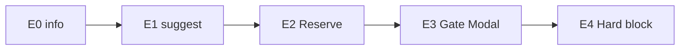
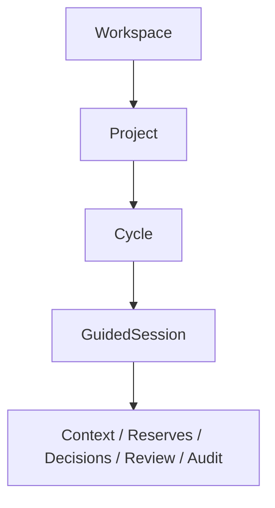
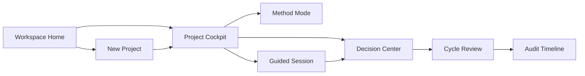
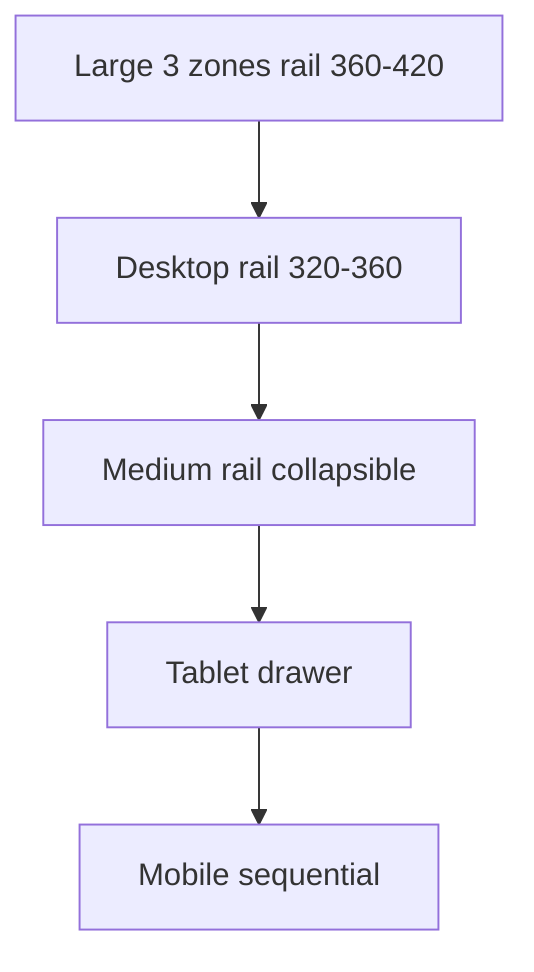

# Review Pack Full — SFIA v3.0 D1 UX/UI Doctrine-aligned Shell and Project Journey

## 1. Métadonnées

- **Date/heure/fuseau :** 2026-07-22 18:52:41 CEST
- **Cycle :** 4 — UX/UI (UX/CONCEPTION/ARCHI/DOC)
- **Profil :** Critical
- **Gate consommé :** GO CYCLE UX/UI D1 — DOCTRINE-ALIGNED SHELL AND PROJECT JOURNEY
- **Gate suivant :** GO VALIDATION UX/UI D1 — DOCTRINE-ALIGNED SHELL AND PROJECT JOURNEY
- **Gate fermé :** GO IMPLEMENTATION D1-I1 — PROJECT FOUNDATION
- **Repo/branche :** mcleland147/sfia-workspace · delivery/sfia-studio-control-tower-fast-track
- **HEAD/base :** 32e5271842b9a344a7e292614675c27ea8ed941b
- **Handoff précédent :** 46bad298f5875e99a7ca4d804842cd5ebe9a6814
- **Baseline :** SFIA v2.6
- **Statut v3 :** V3-MODELED CANDIDATE
- **BCDI :** BCDI-D1-UX-DOCTRINE-ALIGNED-JOURNEY

## 2. Décisions humaines

- DESIGN-R01 mono-opérateur I1 : accepté
- DESIGN-R02 SLI/SLO : accepté (SLO reportés)
- DESIGN-R04 audit trajectoire générique : accepté
- DESIGN-R03 Figma obligatoire avant I1 : **exécuté dans ce cycle**

## 3. Runtime evidence

- URL : http://127.0.0.1:3020/nouvelle-demande
- Captures : `.tmp-sfia-review/screenshots-d1-ux/runtime-{1728,1440,1280,1024}.png`
- Figma runtime capture (preuve, non cible) : node `4:2` · https://www.figma.com/design/IS70XDnBMvZuJYmaI5eZT2?node-id=4-2
- Figma previews cibles : `.tmp-sfia-review/screenshots-d1-ux/figma-cockpit-1440.png`, `figma-cockpit-1728.png`

### Métriques

```json
[
  {
    "viewport": 1728,
    "title": "SFIA Studio",
    "h1": "Nouvelle demande",
    "viewportInner": {
      "w": 1728,
      "h": 1024
    },
    "scroll": {
      "x": 1728,
      "y": 1024
    },
    "bodyWidth": 1728,
    "pageWidth": 1440,
    "pageMinWidth": "1440px",
    "pageWidthCss": "1440px",
    "railWidth": 64,
    "mainWidth": 1376,
    "copilotWidth": 340,
    "unusedRight": 288,
    "shot": "/Users/morris/Projects/sfia-workspace/.tmp-sfia-review/screenshots-d1-ux/runtime-1728.png"
  },
  {
    "viewport": 1440,
    "title": "SFIA Studio",
    "h1": "Nouvelle demande",
    "viewportInner": {
      "w": 1440,
      "h": 1024
    },
    "scroll": {
      "x": 1440,
      "y": 1024
    },
    "bodyWidth": 1440,
    "pageWidth": 1440,
    "pageMinWidth": "1440px",
    "pageWidthCss": "1440px",
    "railWidth": 64,
    "mainWidth": 1376,
    "copilotWidth": 340,
    "unusedRight": 0,
    "shot": "/Users/morris/Projects/sfia-workspace/.tmp-sfia-review/screenshots-d1-ux/runtime-1440.png"
  },
  {
    "viewport": 1280,
    "title": "SFIA Studio",
    "h1": "Nouvelle demande",
    "viewportInner": {
      "w": 1280,
      "h": 1024
    },
    "scroll": {
      "x": 1440,
      "y": 1024
    },
    "bodyWidth": 1280,
    "pageWidth": 1440,
    "pageMinWidth": "1440px",
    "pageWidthCss": "1440px",
    "railWidth": 64,
    "mainWidth": 1376,
    "copilotWidth": 340,
    "unusedRight": -160,
    "shot": "/Users/morris/Projects/sfia-workspace/.tmp-sfia-review/screenshots-d1-ux/runtime-1280.png"
  },
  {
    "viewport": 1024,
    "title": "SFIA Studio",
    "h1": "Nouvelle demande",
    "viewportInner": {
      "w": 1024,
      "h": 1024
    },
    "scroll": {
      "x": 1440,
      "y": 1024
    },
    "bodyWidth": 1024,
    "pageWidth": 1440,
    "pageMinWidth": "1440px",
    "pageWidthCss": "1440px",
    "railWidth": 64,
    "mainWidth": 1376,
    "copilotWidth": 340,
    "unusedRight": -416,
    "shot": "/Users/morris/Projects/sfia-workspace/.tmp-sfia-review/screenshots-d1-ux/runtime-1024.png"
  }
]
```

## 4. Cause technique confirmée

`app/styles/shell.module.css` + `tokens.css` :
- `min-width/width: 1440px`, `height: 1024px` artboard
- canvas/copilot largeurs fixes
- pas de shell fluide `minmax(0,1fr)` + clamp rail

**Aucune modification code** dans ce cycle.

## 5. Figma

- Plan unique : team::1653291379918403018
- File : SFIA Studio — D1 Doctrine-aligned UX
- fileKey : IS70XDnBMvZuJYmaI5eZT2
- URL : https://www.figma.com/design/IS70XDnBMvZuJYmaI5eZT2
- Page : D1 — Project Framing UX (`1:2`)
- 13 frames écran + components · Auto Layout · dimensions confirmées (registre 15)

## 6. Documents UX (contenu complet)


### `projects/sfia-studio/sfia-v3-design/d1-ux-ui/README.md`

```markdown
# SFIA v3.0 — D1 UX/UI — Doctrine-aligned Shell and Project Journey

| Champ | Valeur |
|-------|--------|
| **Statut** | **D1 UX/UI CONTRACT CANDIDATE** |
| **BCDI** | `BCDI-D1-UX-DOCTRINE-ALIGNED-JOURNEY` |
| **Gate consommé** | `GO CYCLE UX/UI D1 — DOCTRINE-ALIGNED SHELL AND PROJECT JOURNEY` |
| **Gate suivant** | `GO VALIDATION UX/UI D1 — DOCTRINE-ALIGNED SHELL AND PROJECT JOURNEY` |
| **Gate fermé** | `GO IMPLEMENTATION D1-I1 — PROJECT FOUNDATION` |
| **Baseline** | SFIA v2.6 |
| **Statut v3** | V3-MODELED CANDIDATE |
| **Code/CSS** | Interdits |

## Décisions humaines déjà validées

- **DESIGN-R01** : mono-opérateur accepté pour D1-I1 uniquement.
- **DESIGN-R02** : SLI instrumentés ; SLO chiffrés reportés au RUN readiness.
- **DESIGN-R04** : audit générique provisoire pour trajectoire.
- **DESIGN-R03** : Figma + validation UX **obligatoires** avant GO IMPLEMENTATION D1-I1.

## Principe

Le chat est un **composant** du parcours. L’objet principal reste **Project**.

## Contenu

| # | Fichier |
|---|---------|
| 01 | Audit UX runtime actuel |
| 02 | Doctrine → IA |
| 03 | Navigation & routes |
| 04 | Studio Shell layout contract |
| 05 | Inventaire écrans & priorités |
| 06–11 | Contrats écrans |
| 12 | Responsive |
| 13 | Accessibilité |
| 14 | Tokens & composants |
| 15 | Registre frames Figma |
| 16 | Comparaison Figma/runtime |
| 17 | Acceptation & tests |
| 18 | Decision pack |

## Anti-claims

Pas de code · pas CSS · pas D1-I1 · pas V3-IMPLEMENTED · framing/modeled/design D1 non modifiés.

```

### `projects/sfia-studio/sfia-v3-design/d1-ux-ui/01-current-state-ux-audit.md`

```markdown
# 01 — Current-state UX audit

## 1. Observation visuelle (Morris + captures locales)

| Observation | Statut |
|-------------|--------|
| Page « Nouvelle demande » centrée Session OPS1 | Confirmé runtime |
| Journal conversationnel = zone principale | Confirmé |
| Copilot + parcours I6 panneau droit | Confirmé |
| Hiérarchie demande/session/exécution | Confirmé |
| Large zone inutilisée à droite sur viewports > 1440 | **Mesuré** |
| Contenu ne remplit pas viewport large | **Mesuré** |
| Colonnes insuffisamment fluides | Confirmé code |
| Project/Cycle/Context/Gates peu matérialisés | Confirmé |

## 2. Preuves runtime (2026-07-22)

URL : `http://127.0.0.1:3020/nouvelle-demande`
Captures : `.tmp-sfia-review/screenshots-d1-ux/runtime-{1728,1440,1280,1024}.png`
Métriques : `.tmp-sfia-review/screenshots-d1-ux/runtime-metrics.json`

| Viewport | pageWidth CSS | unusedRight | scrollWidth | h1 |
|----------|---------------|-------------|-------------|-----|
| 1728 | 1440px | **288px** | 1728 | Nouvelle demande |
| 1440 | 1440px | 0 | 1440 | Nouvelle demande |
| 1280 | 1440px | -160 (overflow H) | **1440** | Nouvelle demande |
| 1024 | 1440px | -416 (overflow H) | **1440** | Nouvelle demande |

Rail = 64px · Copilot = 340px · Main ≈ 1376px (dans shell 1440).

## 3. Cause technique confirmée (lecture code, non corrigée)

Fichiers : `app/styles/shell.module.css`, `app/styles/tokens.css`.

- `.page { min-width: 1440px; }`
- `.pageFloating` / `.pageFlush` : `width: 1440px; height: 1024px;`
- Tokens layout figés sur référence Figma P0 1440×1024 (`--sfia-canvas-width-flush: 972px`, `--sfia-copilot-width-flush: 340px`, etc.)
- Grid floating à largeurs fixes, pas `minmax(0,1fr)` + clamp rail contextuel.

**Conclusion :** le shell est un **cadre artboard 1440×1024**, pas un layout fluide viewport. Sur 1728 → bande vide ; sur <1440 → scroll horizontal.

## 4. Écart doctrinal

| Doctrine D1 | Runtime actuel |
|-------------|----------------|
| Project-first | Session/Demande-first |
| Cycle Header / MethodMode | Badge mode partiel OPS1 ; pas Cycle métier |
| Contextual rail = Context/Reserves/Decisions | Copilot + I6 steps |
| Chat = composant GuidedSession | Chat = centre produit |
| E0–E4 language | Gates action OPS1, pas langage E0–E4 D1 |

## 5. Recommandation UX (hors correction code)

Remplacer artboard fixe par shell fluide (doc 04) ; Project Cockpit pivot ; Copilot → ContextualRail doctrinal.

```

### `projects/sfia-studio/sfia-v3-design/d1-ux-ui/02-doctrine-to-information-architecture.md`

```markdown
# 02 — Doctrine to information architecture

## Niveaux visibles

| Niveau | Objet | Visible où |
|--------|-------|------------|
| 1 | Workspace | Shell / Workspace Home |
| 2 | Project | Cockpit, breadcrumbs, header |
| 3 | Cycle | Cycle Header, stepper |
| 4 | GuidedSession / travail | Guided Session main |
| 5 | Context / Reserves / Decisions / Review / Audit | Contextual rail + écrans dédiés |

## Navigation

- **Primaire** : Workspace → Projects → (Settings stub)
- **Secondaire (projet)** : Cockpit · Framing · Cycle · Session · Decisions · Review · Audit
- **Breadcrumbs** : Workspace / Project / Cycle / Session
- **Persistants** : MethodModeBadge · ProjectStateBadge · Cycle actif · ContextStatus · open gates count

## Interdit comme IA visible

Incréments techniques OPS1 I4/I5/I6 comme architecture métier.

## Mapping design 08

Les 13 écrans design D1 restent la référence fonctionnelle ; ce dossier UX précise hiérarchie visuelle et shell.

```

### `projects/sfia-studio/sfia-v3-design/d1-ux-ui/03-d1-navigation-and-route-model.md`

```markdown
# 03 — Navigation and route model (candidat)

| Route candidate | Écran | Notes |
|-----------------|-------|-------|
| `/` ou `/workspace` | Workspace Home | I1 |
| `/projects/new` | New Project | I1 |
| `/projects/[id]` | Project Cockpit | I1 pivot |
| `/projects/[id]/method-mode` | Method Mode | I1 |
| `/projects/[id]/framing` | Project Framing | post-I1 |
| `/projects/[id]/cycles/[cid]` | Cycle Header + hub | I2 |
| `/projects/[id]/cycles/[cid]/session/[sid]` | Guided Session | I2 |
| `/projects/[id]/decisions` | Decision Center | I5 |
| `/projects/[id]/cycles/[cid]/review` | Cycle Review | I7 |
| `/projects/[id]/audit` | Audit Timeline | I7/I8 |

OPS1 `/nouvelle-demande` = **legacy runtime preuve**, pas cible D1.

```

### `projects/sfia-studio/sfia-v3-design/d1-ux-ui/04-studio-shell-layout-contract.md`

```markdown
# 04 — Studio Shell layout contract

## Verdict sur le candidat proposé

Le modèle `nav | minmax(0,1fr) | clamp(320px,24vw,420px)` est **retenu** avec ajustements.

## Zones

| Zone | Largeur | Comportement |
|------|---------|--------------|
| Navigation latérale | 64–80px | fixe/compacte ; tooltip ; actif/focus |
| Zone métier | `minmax(0, 1fr)` | **aucun max-width global** ; scroll vertical maîtrisé ; max-width **local** optionnel (ex. prose 72ch) |
| Panneau contextuel | desktop large `clamp(320px, 24vw, 420px)` ; desktop `320–360px` | collapsible 1100–1280 ; drawer tablet ; bottom sheet / vue dédiée mobile |

## Gutters

24–32 desktop · 16–24 medium · 16 tablet

## CSS futur (documentation seule — non implémenté)

```css
.shell {
  display: grid;
  grid-template-columns:
    var(--sfia-nav, 72px)
    minmax(0, 1fr)
    clamp(320px, 24vw, 420px);
  min-height: 100dvh;
  width: 100%;
}
```

## Interdits

- artboard global 1440×1024 laissant bande vide ;
- largeurs fixes ignorant viewport ;
- conversation imposant largeur page ;
- Copilot dominant hiérarchie métier ;
- scrolls imbriqués non maîtrisés.

## Remplacement conceptuel

`CopilotPanel` → `ContextualRail` (Context, Reserves, Decisions, Gates, Next action).

```

### `projects/sfia-studio/sfia-v3-design/d1-ux-ui/05-d1-screen-inventory-and-priorities.md`

```markdown
# 05 — Screen inventory and priorities

| # | Écran | Priorité Figma I1 | Fidélité |
|---|-------|-------------------|----------|
| 1 | Workspace Home | **Obligatoire** | haute |
| 2 | New Project | **Obligatoire** | haute |
| 3 | Project Cockpit | **Obligatoire** | haute |
| — | Method Mode | **Obligatoire** | haute |
| 4 | Project Framing | cohérente | medium |
| 5 | Cycle Header | partiel dans Cockpit/Session | medium |
| 6 | Guided Session | **Obligatoire** desktop | haute |
| 7 | Context Status | dans rail | medium |
| 8 | Reserve Panel | dans rail / Decision | medium |
| 9 | Decision Center | **Obligatoire** | haute |
| 10 | Gate Modal | overlay Decision | medium |
| 11 | Transition Review | medium | medium |
| 12 | Cycle Review | **Obligatoire** | haute |
| 13 | Audit Timeline | medium | medium |

Hors scope : ExecutionContract, Cursor, Evidence D2, Action/Release Review.

```

### `projects/sfia-studio/sfia-v3-design/d1-ux-ui/06-workspace-home-contract.md`

```markdown
# 06 — Workspace Home contract

## Objectif
Point d’entrée Project-first : lister, créer, voir ce qui bloque.

## Contenu
- Projets récents / actifs
- Projets nécessitant décision
- Cycles bloqués / réserves ouvertes
- MethodMode badge par projet
- CTA Nouveau projet
- Accès clôturés (lecture seule)

## États
empty · loading · error · single project · many · mono-opérateur (R01)

## Non-objectifs
Dashboard métriques surchargé avant données réelles.

## Acceptation
CTA create visible ; aucune session OPS1 comme hub.

```

### `projects/sfia-studio/sfia-v3-design/d1-ux-ui/07-new-project-contract.md`

```markdown
# 07 — New Project contract

## Parcours court (max 6 étapes)
1. Identité
2. Objectif
3. Contexte initial (léger)
4. MethodMode (v2.6 / transition / v3 candidate) + claims
5. Responsable/décideur (même user OK en I1 / R01)
6. Confirmation → Project DRAFT + audit

## Principes
Pas de questionnaire exhaustif. Cadrage détaillé = Cycle + GuidedSession.

## Matérialiser
Différence modes · claims · décision humaine · effet création · audit générique.

```

### `projects/sfia-studio/sfia-v3-design/d1-ux-ui/08-project-cockpit-contract.md`

```markdown
# 08 — Project Cockpit contract (écran pivot)

## Zones
1. **ProjectHeader** — identité, MethodModeBadge, ProjectStateBadge
2. **Project nav** — Framing / Cycle / Session / Decisions / Review / Audit
3. **Main work** — cycle actif, étape, prochaine action, trajectoire résumé (pas journal permanent)
4. **ContextualRail** — ContextStatus, reserves, open decisions/gates, last events
5. **Actions gated** — E3 visibles, pas contournables

## Règle
Le chat n’apparaît qu’après **Open Guided Session**.

```

### `projects/sfia-studio/sfia-v3-design/d1-ux-ui/09-project-framing-and-guided-session-contract.md`

```markdown
# 09 — Project Framing & Guided Session

## Framing
Édition trajectoire + synthèse ; GPT draft optionnel ; commit humain.

## Guided Session — dual channel
| Canal conversationnel | Canal de contrôle |
|-----------------------|-------------------|
| prose, clarification, challenge, synthèse | ContextStatus, proposals, reserves, DR, gates, transitions, preuves |

## Jamais masqué
Project · Cycle · Context · MethodMode · Gate ouvert · stale · actions structurantes

## Transition visuelle
Cockpit → Open Session → Work → Review proposals → Human decision → Cockpit / Transition Review

```

### `projects/sfia-studio/sfia-v3-design/d1-ux-ui/10-context-reserves-decisions-and-gates-contract.md`

```markdown
# 10 — Context, Reserves, Decisions, Gates

## Context Status
headSha · digests · READY/STALE/UNAVAILABLE · reload · live region stale

## Reserves (E2)
ReserveCard list · obligatoire avant continuation soft

## Decision Center
DR OPEN · Gate cards · deep link Gate Modal

## Gate Modal
focus trap · verdict GO/NO-GO · rationale · expired state · E3 block

## Langage E0–E4 (non couleur seule)
icône + libellé + texte + statut + focus + annonce SR

```

### `projects/sfia-studio/sfia-v3-design/d1-ux-ui/11-transition-reviewbundle-and-audit-contract.md`

```markdown
# 11 — Transition, ReviewBundle, Audit

## Transition Review
proposal from→to · preconds · ReviewBundle status · DecideTransition

## Cycle Review
refs résolvables+vérifiées · digests · seal · export MD optionnel (baseline v2.6)

## Audit Timeline
events append-only · filter project/cycle · correlationId · pas de mutation

```

### `projects/sfia-studio/sfia-v3-design/d1-ux-ui/12-responsive-and-breakpoint-contract.md`

```markdown
# 12 — Responsive & breakpoints

| Breakpoint | Zones | Rail |
|------------|-------|------|
| Large ≥1600 | 3 zones | 360–420 |
| Desktop 1280–1599 | 3 zones | 320–360 |
| Medium 1100–1279 | rail collapsible | — |
| Tablet 768–1099 | drawer | nav compacte |
| Mobile <768 | séquentiel | gates en vues dédiées |

Frames Figma détaillées : 1728 / 1440 / 1280 / 1024. Mobile documenté, frames optionnelles.

```

### `projects/sfia-studio/sfia-v3-design/d1-ux-ui/13-accessibility-and-interaction-contract.md`

```markdown
# 13 — Accessibility & interaction (WCAG 2.2 AA candidat)

## Exigences
clavier complet · focus visible · landmarks · titres · contraste · états non-couleur · targets · modal trap · live regions (gates/stale) · reduced motion · zoom 200% · responsive sans perte info

## Matrice (synthèse)

| Screen | Keyboard | Focus | Semantics | Contrast | Errors | Live |
|--------|----------|-------|-----------|----------|--------|------|
| Workspace Home | Y | Y | main/nav | Y | Y | — |
| New Project | Y | Y | form | Y | Y | — |
| Project Cockpit | Y | Y | complementary rail | Y | Y | gates count |
| Guided Session | Y | Y | log+form | Y | Y | stale |
| Decision Center | Y | Y | list | Y | Y | — |
| Gate Modal | trap | initial | dialog | Y | Y | announce open |
| Cycle Review | Y | Y | status | Y | Y | seal result |

```

### `projects/sfia-studio/sfia-v3-design/d1-ux-ui/14-design-tokens-and-component-contract.md`

```markdown
# 14 — Tokens & components

## Audit tokens existants (`tokens.css`)
Réutiliser couleurs/ombres/fonts Studio. **Ne pas** réutiliser layout artboard 1440×1024 comme vérité D1.

Nouveaux tokens candidats (non implémentés) :
`--sfia-nav-width`, `--sfia-context-rail-min/max`, `--sfia-shell-gutter`, `--sfia-e0..e4-*`

## Composants UX candidats

| Composant | Rôle | Variants | A11y | Mapping code futur |
|-----------|------|----------|------|--------------------|
| AppShell | grid 3 zones | collapsed rail | landmarks | remplace StudioShell layout |
| WorkspaceSwitcher | WS | — | combobox | new |
| ProjectHeader | identité+badges | — | heading | new |
| MethodModeBadge | mode | v26/transition/v3 | status | extend globalModeBadge |
| ProjectStateBadge | state | DRAFT… | status | new |
| CycleHeader | cycle state | — | status | new |
| CycleStepper | progression | — | — | new |
| ContextStatus | digests | ready/stale | live | new |
| ReserveCard | E2 | open/resolved | — | new |
| DecisionCard | DR | open/decided | — | new |
| GateDialog | E3 | open/expired | dialog | extend action gate UI |
| GuidedConversation | chat | — | log | from Ops1 journal |
| StructuredProposal | proposals | kinds | — | new |
| ContextualRail | control channel | collapsed | complementary | replace Copilot |
| ReviewSummary | bundle | draft/sealed | — | new |
| AuditTimeline | events | — | table | extend events |
| Empty/Error/StaleBanner | states | — | alert | new |

Aucun composant n’est baseline avant validation UX.

```

### `projects/sfia-studio/sfia-v3-design/d1-ux-ui/15-figma-frame-register.md`

```markdown
# 15 — Figma frame register

| Champ | Valeur |
|-------|--------|
| **Plan** | L'équipe de Morris CLELAND (`team::1653291379918403018`) — unique |
| **File** | SFIA Studio — D1 Doctrine-aligned UX |
| **fileKey** | `IS70XDnBMvZuJYmaI5eZT2` |
| **URL** | https://www.figma.com/design/IS70XDnBMvZuJYmaI5eZT2 |
| **Page** | D1 — Project Framing UX (`1:2`) |
| **Statut** | Frames éditables Auto Layout · dimensions confirmées |

## Frames

| Frame | node id | W×H | Layout | Source doctrinale | Runtime correspondant | Statut |
|-------|---------|-----|--------|-------------------|----------------------|--------|
| D1 / Components | `1:3` | 364×79 | HORIZONTAL | tokens/components | — | primitives |
| D1 / 1440 / Workspace Home | `2:2` | **1440×1024** | HORIZONTAL AL | framing 11/15 · design 08 | aucun (cible) ; legacy `/` | OK |
| D1 / 1440 / New Project | `2:24` | **1440×1024** | HORIZONTAL AL | design 07 · UX 07 | — | OK |
| D1 / 1440 / Project Cockpit | `2:46` | **1440×1024** | HORIZONTAL AL | design 08 · UX 08 | — | OK I1 |
| D1 / 1440 / Method Mode | `3:2` | **1440×1024** | HORIZONTAL AL | modeled mode · UX 07 | — | OK I1 |
| D1 / 1440 / Guided Session | `3:25` | **1440×1024** | HORIZONTAL AL | design 06/09 · UX 09 | `/nouvelle-demande` (écart) | OK |
| D1 / 1440 / Decision Center | `3:51` | **1440×1024** | HORIZONTAL AL | design 07/10 · UX 10 | OPS1 action gate (écart) | OK |
| D1 / 1440 / Cycle Review | `3:73` | **1440×1024** | HORIZONTAL AL | modeled 07 · UX 11 | — | OK |
| D1 / 1728 / Project Cockpit | `3:97` | **1728×1024** | HORIZONTAL AL | UX 12 large | runtime unusedRight 288px | OK |
| D1 / 1728 / Guided Session | `3:120` | **1728×1024** | HORIZONTAL AL | UX 12 | runtime 1728 | OK |
| D1 / 1280 / Project Cockpit | `3:143` | **1280×1024** | HORIZONTAL AL | UX 12 | runtime overflow H | OK |
| D1 / 1280 / Guided Session | `3:165` | **1280×1024** | HORIZONTAL AL | UX 12 | runtime 1280 | OK |
| D1 / 1024 / Project Cockpit | `3:187` | **1024×1024** | HORIZONTAL AL | UX 12 tablet | runtime 1024 | OK |
| D1 / 1024 / Guided Session | `3:209` | **1024×1024** | HORIZONTAL AL | UX 12 tablet | runtime 1024 | OK |

## Shell contract encoded in frames

`Nav 72` + `Main FILL` + `ContextualRail` (≈320–415 selon largeur) · gutters 24 · Auto Layout HORIZONTAL.

## Réserves Figma

- UX-R02 : composants from-scratch (pas de Code Connect Studio riche)
- Capture runtime Figma : via injection navigateur (sans modif source) — voir registre preuves
- Mobile frames non produites (documentées doc 12)


## Runtime capture in Figma

| Item | Value |
|------|-------|
| node | `4:2` (renamed evidence) |
| URL | https://www.figma.com/design/IS70XDnBMvZuJYmaI5eZT2?node-id=4-2 |
| Role | **Preuve existant** — pas la cible D1 |
| Local screenshots | `.tmp-sfia-review/screenshots-d1-ux/runtime-*.png` |
| Metrics | `.tmp-sfia-review/screenshots-d1-ux/runtime-metrics.json` |

```

### `projects/sfia-studio/sfia-v3-design/d1-ux-ui/16-figma-runtime-comparison-plan.md`

```markdown
# 16 — Figma / runtime comparison

| Aspect | Runtime observé | Cible Figma | Écart | Impact doctrine | Priorité | Lot | Preuve |
|--------|-----------------|-------------|-------|-----------------|----------|-----|--------|
| Largeur globale | 1440px fixe | 100% viewport fluide | critique | shell | P0 | I1 | metrics+frames |
| Usage viewport | 288px vides @1728 | plein usage | critique | trust | P0 | I1 | runtime-1728.png |
| Overflow <1440 | scrollH 1440 | fluide/collapse | critique | usable | P0 | I1 | runtime-1280/1024 |
| Navigation | rail icons OPS1 | Workspace/Project IA | fort | Project-first | P0 | I1 | frames Home/Cockpit |
| Page identity | Nouvelle demande | Workspace/Project | fort | D1 | P0 | I1 | h1 metrics |
| Project-first | absent | Cockpit pivot | critique | P1 | P0 | I1 | frame Cockpit |
| Cycle visibility | I6 steps copilot | CycleHeader | fort | D1 | P1 | I2 | frames |
| Context visibility | faible | ContextStatus rail | fort | git-truth | P1 | I3 | frames Session |
| Rail | Copilot dominant | ContextualRail | fort | hierarchy | P0 | I1 | frames |
| Conversation | centre | composant Session | critique | doctrine | P0 | I2 | frames Session |
| Decisions/gates | action gate OPS1 | Decision Center + GateDialog E3 | fort | E3 | P1 | I5 | frames |
| Responsive | artboard only | breakpoints doc12 | critique | a11y | P0 | I1/I8 | frames 1728–1024 |
| Accessibility | partielle | contrat 13 | moyen | AA | P1 | I8 | matrix |

```

### `projects/sfia-studio/sfia-v3-design/d1-ux-ui/17-d1-ux-acceptance-and-test-matrix.md`

```markdown
# 17 — UX acceptance & test matrix

| Critère | Preuve | Gate |
|---------|--------|------|
| Frames I1 éditables Auto Layout | registre 15 | GO VALIDATION UX/UI D1 |
| Dimensions confirmées | get_metadata / use_figma return | same |
| Runtime capturé 4 viewports | screenshots-d1-ux | same |
| Cause 1440 confirmée | doc 01 + shell.module.css | same |
| Project-first IA | docs 02/08 | same |
| 13 écrans contractés | 06–11 | same |
| E0–E4 IHM | 10 + 14 | same |
| A11y/responsive | 12–13 | same |
| Comparaison complète | 16 | same |
| Aucun code modifié | git status app unchanged this cycle | same |

Tests futurs I1 : visual regression shell fluide · a11y axe · keyboard Cockpit · no H-scroll ≥1024.

```

### `projects/sfia-studio/sfia-v3-design/d1-ux-ui/18-d1-ux-decision-pack.md`

```markdown
# 18 — D1 UX decision pack

| Champ | Valeur |
|-------|--------|
| Statut | **D1 UX/UI CONTRACT CANDIDATE** |
| Verdict cible | SFIA v3.0 D1 UX/UI CONTRACT READY — FIGMA VERIFIED — HUMAN DECISION REQUIRED |
| Gate suivant | GO VALIDATION UX/UI D1 |
| R03 | **Satisfait** si frames Figma + dimensions + comparaison OK |

## Décisions humaines requises
1. Valider contrat UX/UI D1 (gate)
2. Valider shell fluide vs artboard 1440
3. Valider ContextualRail vs Copilot
4. Autoriser GO IMPLEMENTATION D1-I1 **seulement après** ce gate

## Non prises
Implémentation CSS/React · D2 UX · SLO chiffrés · multi-op UI

## Réserves
- UX-R01 : mobile frames non détaillées
- UX-R02 : design system Figma créé from-scratch (peu de composants lib existants Code Connect Studio)
- UX-R03 : capture runtime = preuve existant, pas cible

## Anti-claims
Pas code · pas I1 · pas IMPLEMENTED · d1-project-framing non modifié

```

## 7. Diagrammes

### `projects/sfia-studio/sfia-v3-design/d1-ux-ui/diagrams/d1-decision-and-gate-flow.mmd`



```

### `projects/sfia-studio/sfia-v3-design/d1-ux-ui/diagrams/d1-information-architecture.mmd`



```

### `projects/sfia-studio/sfia-v3-design/d1-ux-ui/diagrams/d1-navigation-flow.mmd`



```

### `projects/sfia-studio/sfia-v3-design/d1-ux-ui/diagrams/d1-responsive-layout.mmd`



```

## 8. Réserves / dette / anti-claims

- UX-R01 mobile frames non détaillées
- UX-R02 design system Figma from-scratch
- UX-R03 capture runtime = preuve, pas cible
- Dette : tokens layout fluides en code (I1) · ContextualRail React · a11y hardening I8
- Anti-claims : pas code/CSS · pas I1 · pas IMPLEMENTED · framing/modeled/d1-project-framing non modifiés · pas commit projet

## 9. Décisions humaines / non prises

Requises : GO VALIDATION UX/UI D1 ; valider shell fluide ; ContextualRail vs Copilot ; n’ouvrir I1 qu’après ce gate.
Non prises : implémentation · D2 UX · SLO chiffrés · multi-op UI.

## 10. État Git final

```
HEAD=32e5271842b9a344a7e292614675c27ea8ed941b
branch=delivery/sfia-studio-control-tower-fast-track
staged=0
```

**VERDICT :** SFIA v3.0 D1 UX/UI CONTRACT READY — FIGMA VERIFIED — HUMAN DECISION REQUIRED
