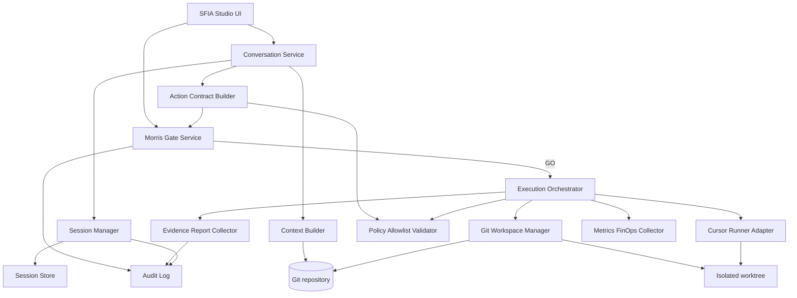
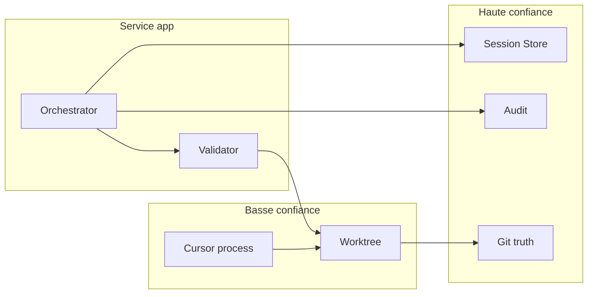
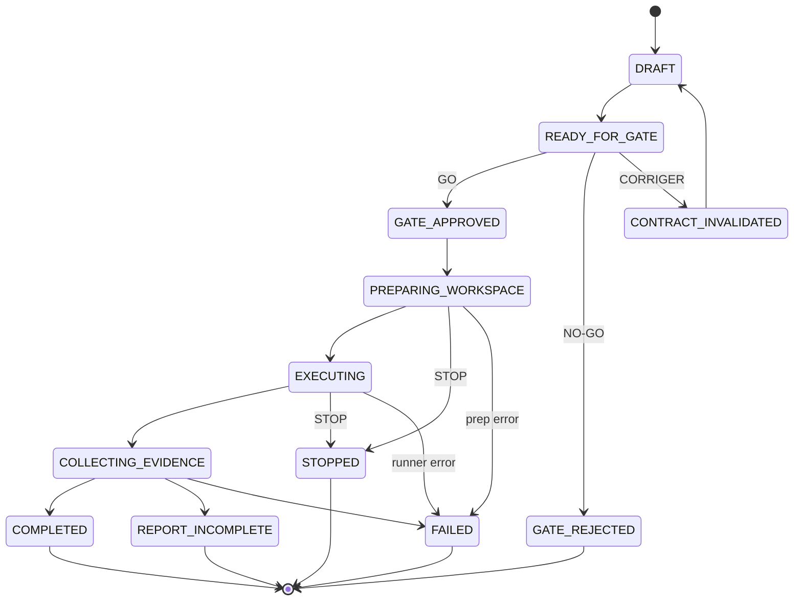

# Review pack — OPS1 Technical Architecture PR readiness

## Métadonnées

| Champ | Valeur |
|-------|--------|
| **Date / heure / fuseau** | 2026-07-20 20:08:00 CEST |
| **Repository** | `mcleland147/sfia-workspace` |
| **Branche** | `design/sfia-studio-ops1-technical-architecture` |
| **HEAD** | `b495a567afab1f74fe816ad210bdf25812cf55ec` |
| **Base / origin/main** | `134be301792efbf6f9739d13f0572062ef976da7` |
| **Merge-base** | `134be301792efbf6f9739d13f0572062ef976da7` |
| **SHA distant branche** | `b495a567afab1f74fe816ad210bdf25812cf55ec` |
| **Commit** | `b495a567afab1f74fe816ad210bdf25812cf55ec` — `docs: validate OPS1 technical architecture` |
| **Base initiale (pré-rebase)** | `ac2bcbf52e6170668e1a5cc0071c572026938635` |
| **PR Draft** | [#243](https://github.com/mcleland147/sfia-workspace/pull/243) |
| **Décision Morris** | `GO COMMIT PUSH PR DRAFT — OPS1 TECHNICAL ARCHITECTURE` |
| **Gate validé antérieur** | `GO G-OPS1-TECH-ARCH-VAL — VALIDATION AVEC AMENDEMENTS` — 2026-07-20 19:17:11 CEST |
| **Mode handoff** | `publish-in-cycle` |
| **Merge** | **Aucun** |

## Huit fichiers commités

```text
M	projects/sfia-studio/41-operational-vertical-slice-1-framing.md
M	projects/sfia-studio/45-ops1-functional-design.md
M	projects/sfia-studio/48-ops1-functional-architecture.md
M	projects/sfia-studio/54-ops1-operational-scenario.md
A	projects/sfia-studio/57-ops1-technical-architecture.md
A	projects/sfia-studio/58-ops1-technical-components-security-and-runtime.md
A	projects/sfia-studio/59-ops1-technical-architecture-decision-pack.md
M	projects/sfia-studio/README.md

```

```text
 .../41-operational-vertical-slice-1-framing.md     |   8 +-
 projects/sfia-studio/45-ops1-functional-design.md  |   4 +-
 .../sfia-studio/48-ops1-functional-architecture.md |   6 +-
 .../sfia-studio/54-ops1-operational-scenario.md    |   9 +-
 .../sfia-studio/57-ops1-technical-architecture.md  | 450 ++++++++++++++++++++
 ...s1-technical-components-security-and-runtime.md | 292 +++++++++++++
 ...59-ops1-technical-architecture-decision-pack.md | 472 +++++++++++++++++++++
 projects/sfia-studio/README.md                     |  22 +-
 8 files changed, 1244 insertions(+), 19 deletions(-)

```

## Statut des 26 décisions

Toutes : `VALIDATED WITH AMENDMENTS — G-OPS1-TECH-ARCH-VAL — Morris — 2026-07-20 19:17:11 CEST` · **0** AWAITING

| ID | Sujet | Amendement |
|----|-------|------------|
| `OPS1-TECH-CAND-01` | Modèle d’isolation | Amendement 1 — worktree = isolation Git ; runner impose CWD/env/credentials/réseau/remote/contrôles ; pas sandbox OS forte. |
| `OPS1-TECH-CAND-02` | Worktree vs conteneur vs VM | Amendement 1 — worktree retenu ; conteneur = trajectoire avant élargissement hors OPS1. |
| `OPS1-TECH-CAND-03` | Politique réseau | — |
| `OPS1-TECH-CAND-04` | Politique secrets | — |
| `OPS1-TECH-CAND-05` | Validation des chemins | — |
| `OPS1-TECH-CAND-06` | Gestion des symlinks | — |
| `OPS1-TECH-CAND-07` | Canonicalisation du contrat | — |
| `OPS1-TECH-CAND-08` | Algorithme de hash candidat | — |
| `OPS1-TECH-CAND-09` | Revalidation HEAD | — |
| `OPS1-TECH-CAND-10` | Branche d’exécution | — |
| `OPS1-TECH-CAND-11` | Stratégie de commit d’exécution | — |
| `OPS1-TECH-CAND-12` | Stratégie de stockage | Amendement 2 — SQLite = source opérationnelle (sessions/états/locks/idempotence/tentatives/index) ; fichiers append-only = artefacts immuables ; Git = vérité documentaire ; pas de cloud DB. |
| `OPS1-TECH-CAND-13` | Modèle de continuation | — |
| `OPS1-TECH-CAND-14` | Idempotence | Amendement 3 — `contractHash` immuable vs `executionAttemptId` ; une tentative active ; pas de retry auto ; nouvelle tentative = GO Morris ; conservation de toutes les tentatives. |
| `OPS1-TECH-CAND-15` | Verrouillage concurrent | Amendement 3 — lock sur (contractHash, tentative active). |
| `OPS1-TECH-CAND-16` | Récupération après crash | Amendement 3 — reprise lecture + décision Morris ; pas de resume opaque ; nouvelle tentative explicite. |
| `OPS1-TECH-CAND-17` | Rapport incomplet | Amendement 3 — REPORT_INCOMPLETE : pas COMPLETED silencieux ; pas relance auto ; nouvelle tentative sous décision Morris. |
| `OPS1-TECH-CAND-18` | Audit append-only | — |
| `OPS1-TECH-CAND-19` | Observabilité | — |
| `OPS1-TECH-CAND-20` | CI documentaire minimale | Amendement 4 — CI locale socle (contrat/hash/HEAD/allowlist/paths/symlinks/secrets/diff-check/rapport) ; CI PR = cycle Intégration/DevOps ; hors scope = delivery/deploy/release/prod. |
| `OPS1-TECH-CAND-21` | Politique de cleanup | — |
| `OPS1-TECH-CAND-22` | FinOps | — |
| `OPS1-TECH-CAND-23` | Condition d’ouverture backlog | — |
| `OPS1-TECH-CAND-24` | Condition d’ouverture delivery | — |
| `OPS1-TECH-CAND-25` | Inclusion gateDecision dans hash | — |
| `OPS1-TECH-CAND-26` | Bloquer Git remote dans runner | — |

## Quatre amendements

1. Isolation — worktree = isolation Git, pas sandbox forte
2. Stockage — SQLite opérationnel + fichiers append-only
3. Idempotence — `contractHash` ≠ `executionAttemptId`
4. CI — contrôles locaux socle + CI PR au cycle DevOps

## Réserves maintenues

- FD-CAND-15
- UX-R01…R04
- Stack / fournisseur non finalisés
- Backlog / code / delivery / live / MVP fermés

## Contrôles

```text
?? .tmp-sfia-review/
?? projects/.tmp-sfia-review/

```

| Contrôle | Résultat |
|----------|----------|
| 8 fichiers | OK |
| 26 CAND / 0 AWAITING | OK |
| 4 amendements | OK |
| Mermaid / liens | OK |
| Packs protégés | Intacts |
| Claims interdits (affirmations) | Absents |
| Merge | **Aucun** |

## Risques

- Worktree ≠ sandbox OS forte
- CI PR = cycle DevOps distinct
- FinOps numériques OPEN

## Rollback

Fermer PR #243 sans merge / revert éventuel → `main` sans docs `57`–`59`.

## Diff propagations

```diff
diff --git a/projects/sfia-studio/41-operational-vertical-slice-1-framing.md b/projects/sfia-studio/41-operational-vertical-slice-1-framing.md
index 02303aa..2548906 100644
--- a/projects/sfia-studio/41-operational-vertical-slice-1-framing.md
+++ b/projects/sfia-studio/41-operational-vertical-slice-1-framing.md
@@ -8,8 +8,8 @@
 | **Typologie** | POC / CADRAGE / PRODUIT / VALIDATION |
 | **Baseline** | SFIA v2.6 opérationnelle sur `main` |
 | **Gates consommés** | `G-SFIA-STUDIO-OPERATIONAL-SLICE-1-FRAMING` · `G-OPS1-FRAMING-REAL-CONVERSATION-AMENDMENT` · `G-OPS1-FRAMING-VAL` |
-| **Statut** | `framing-validated-with-reservations` — **validé Morris avec réserves** (2026-07-20 12:21 CEST) ; cadrage `41`–`44` **intégré** via PR [#235](https://github.com/mcleland147/sfia-workspace/pull/235) (squash `b686eb1`) — post-merge + cleanup **terminés** ; conception fonctionnelle `45`–`47` **intégrée** via PR [#237](https://github.com/mcleland147/sfia-workspace/pull/237) (squash `6cbf37482c7d384ef5630259d58a2e223a607925`) — post-merge **validé** (2026-07-20 14:29 CEST) ; UX OPS1 `51`–`53` **validés avec réserves** (`G-OPS1-UX-VAL` 2026-07-20 16:52 CEST) ; POC **maintenu** ; réserves fonctionnelles **inchangées** ; architecture technique, backlog, delivery, live, MVP **fermés** |
-| **Companions** | [`42`](./42-operational-vertical-slice-1-flow-and-session-model.md) · [`43`](./43-operational-vertical-slice-1-scope-and-success-criteria.md) · [`44`](./44-operational-vertical-slice-1-decision-pack.md) · UX OPS1 [`51`](./51-ops1-ux-ui-contract.md)–[`53`](./53-ops1-ux-ui-decision-pack.md) (**validés avec réserves** ; `G-OPS1-UX-VAL` consommé — 2026-07-20 16:52 CEST) · Scénario OPS1 [`54`](./54-ops1-operational-scenario.md)–[`56`](./56-ops1-scenario-decision-pack.md) (**validés avec amendements** ; `G-OPS1-SCENARIO-VAL` consommé — 2026-07-20 18:34:47 CEST) |
+| **Statut** | `framing-validated-with-reservations` — **validé Morris avec réserves** (2026-07-20 12:21 CEST) ; cadrage `41`–`44` **intégré** via PR [#235](https://github.com/mcleland147/sfia-workspace/pull/235) (squash `b686eb1`) — post-merge + cleanup **terminés** ; conception fonctionnelle `45`–`47` **intégrée** via PR [#237](https://github.com/mcleland147/sfia-workspace/pull/237) (squash `6cbf37482c7d384ef5630259d58a2e223a607925`) — post-merge **validé** (2026-07-20 14:29 CEST) ; UX OPS1 `51`–`53` **validés avec réserves** (`G-OPS1-UX-VAL` 2026-07-20 16:52 CEST) ; tech-arch OPS1 `57`–`59` **validés avec amendements** (`G-OPS1-TECH-ARCH-VAL` 2026-07-20 19:17:11 CEST) ; POC **maintenu** ; réserves fonctionnelles **inchangées** ; backlog, delivery, live, MVP **fermés** |
+| **Companions** | [`42`](./42-operational-vertical-slice-1-flow-and-session-model.md) · [`43`](./43-operational-vertical-slice-1-scope-and-success-criteria.md) · [`44`](./44-operational-vertical-slice-1-decision-pack.md) · UX OPS1 [`51`](./51-ops1-ux-ui-contract.md)–[`53`](./53-ops1-ux-ui-decision-pack.md) (**validés avec réserves** ; `G-OPS1-UX-VAL` consommé — 2026-07-20 16:52 CEST) · Scénario OPS1 [`54`](./54-ops1-operational-scenario.md)–[`56`](./56-ops1-scenario-decision-pack.md) (**validés avec amendements** ; `G-OPS1-SCENARIO-VAL` consommé — 2026-07-20 18:34:47 CEST)  · Tech-arch [`57`](./57-ops1-technical-architecture.md)–[`59`](./59-ops1-technical-architecture-decision-pack.md) (**validés avec amendements** ; `G-OPS1-TECH-ARCH-VAL` consommé — 2026-07-20 19:17:11 CEST) |
 | **Base Git de cadrage** | `origin/main` @ `6a4c4a7044a54698f96e5ba8ce3a85f60c0afc25` |
 | **Intégration cadrage** | PR [#235](https://github.com/mcleland147/sfia-workspace/pull/235) MERGED — squash `b686eb1394bb4d550eeff1dd64669b3d405579ad` |
 | **Intégration conception fonctionnelle** | PR [#237](https://github.com/mcleland147/sfia-workspace/pull/237) MERGED — squash `6cbf37482c7d384ef5630259d58a2e223a607925` |
@@ -19,7 +19,7 @@
 > **Cadrage validé avec réserves** sous `G-OPS1-FRAMING-VAL` — conversation GPT réelle et libre au centre ; action Markdown gouvernée.
 > Documents `41`–`44` **intégrés sur `main`** via PR [#235](https://github.com/mcleland147/sfia-workspace/pull/235) (squash `b686eb1394bb4d550eeff1dd64669b3d405579ad`) ; post-merge et cleanup **terminés**.
 > Conception fonctionnelle OPS1 (`45`–`47`) **validée avec réserves** sous `G-OPS1-FUNC-DESIGN-VAL` (2026-07-20 13:46 CEST), **intégrée et canonique sur `main`** via PR [#237](https://github.com/mcleland147/sfia-workspace/pull/237) (squash merge `6cbf37482c7d384ef5630259d58a2e223a607925`) ; post-merge **validé** (2026-07-20 14:29 CEST).
-> UX OPS1 **validée avec réserves**. Scénario OPS1 docs `54`–`56` **validés avec amendements** (`G-OPS1-SCENARIO-VAL` consommé — 2026-07-20 18:34:47 CEST). FD-CAND-13/20/26 **levées** (périmètre OPS1) ; FD-CAND-15 **maintenue** ; UX-R01…R04 **maintenues**. Architecture technique, backlog, delivery, live et MVP **restent fermés**.
+> UX OPS1 **validée avec réserves**. Scénario OPS1 docs `54`–`56` **validés avec amendements** (`G-OPS1-SCENARIO-VAL` consommé — 2026-07-20 18:34:47 CEST). FD-CAND-13/20/26 **levées** (périmètre OPS1) ; FD-CAND-15 **maintenue** ; UX-R01…R04 **maintenues**. Architecture technique : docs `57`–`59` **validés avec amendements** (`G-OPS1-TECH-ARCH-VAL` — 2026-07-20 19:17:11 CEST). Backlog, delivery, live et MVP **restent fermés**.
 > Aucun claim MVP, production-ready ou industrialisation.

 ---
@@ -365,4 +365,4 @@ Conversation réelle et libre
 `SFIA STUDIO OPS1 FRAMING VALIDATED WITH RESERVATIONS`

 Cadrage **intégré** et **canonique** sur `main` (PR [#235](https://github.com/mcleland147/sfia-workspace/pull/235)). Conception fonctionnelle OPS1 **validée avec réserves** sous `G-OPS1-FUNC-DESIGN-VAL` (2026-07-20 13:46 CEST), **intégrée et canonique sur `main`** via PR [#237](https://github.com/mcleland147/sfia-workspace/pull/237) (squash `6cbf37482c7d384ef5630259d58a2e223a607925`) — post-merge **validé** (2026-07-20 14:29 CEST) — voir [`45`](./45-ops1-functional-design.md)–[`47`](./47-ops1-functional-decision-pack.md).
-UX OPS1 **validée avec réserves** (UX-R01…UX-R04 ouvertes). Scénario OPS1 [`54`](./54-ops1-operational-scenario.md)–[`56`](./56-ops1-scenario-decision-pack.md) **validés avec amendements** (`G-OPS1-SCENARIO-VAL` — 2026-07-20 18:34:47 CEST). FD-CAND-13/20/26 levées pour OPS1 ; FD-CAND-15 maintenue. Gates architecture technique / backlog / delivery / live / MVP : **fermés** — voir [`44`](./44-operational-vertical-slice-1-decision-pack.md).
+UX OPS1 **validée avec réserves** (UX-R01…UX-R04 ouvertes). Scénario OPS1 [`54`](./54-ops1-operational-scenario.md)–[`56`](./56-ops1-scenario-decision-pack.md) **validés avec amendements** (`G-OPS1-SCENARIO-VAL` — 2026-07-20 18:34:47 CEST). FD-CAND-13/20/26 levées pour OPS1 ; FD-CAND-15 maintenue. Architecture technique OPS1 : docs [`57`](./57-ops1-technical-architecture.md)–[`59`](./59-ops1-technical-architecture-decision-pack.md) **validés avec amendements** (`G-OPS1-TECH-ARCH-VAL` — 2026-07-20 19:17:11 CEST). Gates backlog / delivery / live / MVP : **fermés** — voir [`44`](./44-operational-vertical-slice-1-decision-pack.md).
diff --git a/projects/sfia-studio/45-ops1-functional-design.md b/projects/sfia-studio/45-ops1-functional-design.md
index 38b1c71..2713df5 100644
--- a/projects/sfia-studio/45-ops1-functional-design.md
+++ b/projects/sfia-studio/45-ops1-functional-design.md
@@ -12,7 +12,7 @@
 | **Branche de conception** | `design/sfia-studio-ops1-functional` — fusionnée via PR [#237](https://github.com/mcleland147/sfia-workspace/pull/237) ; branche conservée temporairement en attente du cleanup Morris |
 | **Statut** | `functional-design-validated-with-reservations` — **validé Morris avec réserves** (2026-07-20 13:46 CEST) ; amendement final multi-fichiers + allowlist (2026-07-20 13:36 CEST) ; **intégré et canonique sur `main`** ; post-merge **validé** (2026-07-20 14:29 CEST) ; réserves 13, 15, 20, 26 **inchangées** ; aucun cycle suivant ouvert automatiquement |
 | **Autorité** | Morris (L0) |
-| **Companions** | [`46`](./46-ops1-functional-flows-and-rules.md) · [`47`](./47-ops1-functional-decision-pack.md) · UX OPS1 [`51`](./51-ops1-ux-ui-contract.md)–[`53`](./53-ops1-ux-ui-decision-pack.md) (**validés avec réserves** ; `G-OPS1-UX-VAL` consommé — 2026-07-20 16:52 CEST) · Scénario OPS1 [`54`](./54-ops1-operational-scenario.md)–[`56`](./56-ops1-scenario-decision-pack.md) (**validés avec amendements** ; `G-OPS1-SCENARIO-VAL` — 2026-07-20 18:34:47 CEST) |
+| **Companions** | [`46`](./46-ops1-functional-flows-and-rules.md) · [`47`](./47-ops1-functional-decision-pack.md) · UX OPS1 [`51`](./51-ops1-ux-ui-contract.md)–[`53`](./53-ops1-ux-ui-decision-pack.md) (**validés avec réserves** ; `G-OPS1-UX-VAL` consommé — 2026-07-20 16:52 CEST) · Scénario OPS1 [`54`](./54-ops1-operational-scenario.md)–[`56`](./56-ops1-scenario-decision-pack.md) (**validés avec amendements** ; `G-OPS1-SCENARIO-VAL` — 2026-07-20 18:34:47 CEST)  · Tech-arch [`57`](./57-ops1-technical-architecture.md)–[`59`](./59-ops1-technical-architecture-decision-pack.md) (**validés avec amendements** ; 2026-07-20 19:17:11 CEST) |
 | **Entrées cadrage** | [`41`](./41-operational-vertical-slice-1-framing.md) · [`42`](./42-operational-vertical-slice-1-flow-and-session-model.md) · [`43`](./43-operational-vertical-slice-1-scope-and-success-criteria.md) · [`44`](./44-operational-vertical-slice-1-decision-pack.md) |
 | **Socle historique (lecture)** | [`08`](./08-functional-design.md) · [`09`](./09-functional-flows-and-rules.md) · [`10`](./10-functional-decision-pack.md) |
 | **Horodatage production** | 2026-07-20 13:10 CEST |
@@ -540,7 +540,7 @@ Souhaitables `43` §6.2 : couverts comme **candidats** (coût visible, condensat
 | Noms techniques définitifs d’états/champs | Conception / archi fonctionnelle | Ajustement normal |
 | Surfaces conversation / Figma | Cycle UX — `G-OPS1-UX` | **Cycle distinct normal** |
 | Architecture fonctionnelle | Cycle — `G-OPS1-FUNC-ARCH` | **Cycle distinct normal** |
-| Stack / BDD / API / protocole | Cycle **6 — Architecture technique** (`G-OPS1-TECH-ARCH` si établi) | **Routé** — hors réserves conception |
+| Stack / BDD / API / protocole | Cycle **6 — Architecture technique** — docs [`57`](./57-ops1-technical-architecture.md)–[`59`](./59-ops1-technical-architecture-decision-pack.md) **validés avec amendements** (`G-OPS1-TECH-ARCH-VAL` — 2026-07-20 19:17:11 CEST) | Validé avec amendements ; stack/fournisseur **non finalisés** ; backlog/delivery toujours fermés |
 | Découpage I1–I7 en stories | `G-OPS1-BACKLOG` | Fermé |
 | Implémentation / live GPT / Cursor | Delivery / live (gates distincts) | Fermé |
 | Cartographie chemins éligibles Campus360 + branche + allowlist | `G-OPS1-SCENARIO-VAL` **consommé** | Docs [`54`](./54-ops1-operational-scenario.md)–[`56`](./56-ops1-scenario-decision-pack.md) **validés avec amendements** ; FD-CAND-20/26 **levées** pour OPS1 ; `03` protégé par défaut |
diff --git a/projects/sfia-studio/48-ops1-functional-architecture.md b/projects/sfia-studio/48-ops1-functional-architecture.md
index 0ea4661..2401ba1 100644
--- a/projects/sfia-studio/48-ops1-functional-architecture.md
+++ b/projects/sfia-studio/48-ops1-functional-architecture.md
@@ -15,7 +15,7 @@
 | **Décisions** | `OPS1-FA-CAND-01`…`22` **validées** (réserves maintenues) |
 | **Horodatage validation Morris** | 2026-07-20 15:30 CEST |
 | **Sources** | [`41`](./41-operational-vertical-slice-1-framing.md)–[`47`](./47-ops1-functional-decision-pack.md) |
-| **Companions** | [`49`](./49-ops1-functional-components-and-interactions.md) · [`50`](./50-ops1-functional-architecture-decision-pack.md) · UX OPS1 [`51`](./51-ops1-ux-ui-contract.md)–[`53`](./53-ops1-ux-ui-decision-pack.md) (**validés avec réserves**) · Scénario OPS1 [`54`](./54-ops1-operational-scenario.md)–[`56`](./56-ops1-scenario-decision-pack.md) (**validés avec amendements**) |
+| **Companions** | [`49`](./49-ops1-functional-components-and-interactions.md) · [`50`](./50-ops1-functional-architecture-decision-pack.md) · UX OPS1 [`51`](./51-ops1-ux-ui-contract.md)–[`53`](./53-ops1-ux-ui-decision-pack.md) (**validés avec réserves**) · Scénario OPS1 [`54`](./54-ops1-operational-scenario.md)–[`56`](./56-ops1-scenario-decision-pack.md) (**validés avec amendements**)  · Tech-arch [`57`](./57-ops1-technical-architecture.md)–[`59`](./59-ops1-technical-architecture-decision-pack.md) (**validés avec amendements**) |
 | **Horodatage production** | 2026-07-20 15:14 CEST |

 > Architecture **fonctionnelle** du Vertical Slice Opérationnel 1 — **validée avec réserves** sous `G-OPS1-FUNC-ARCH-VAL` (2026-07-20 15:30 CEST).
@@ -376,5 +376,5 @@ Confirmés sous validation Morris (2026-07-20 15:30 CEST) :
 Gate `G-OPS1-FUNC-ARCH` consommé — 2026-07-20 15:14 CEST.
 Gate `G-OPS1-FUNC-ARCH-VAL` **consommé** — Morris — 2026-07-20 15:30 CEST.
 11 domaines D1–D11 retenus ; 14 composants fonctionnels retenus ; frontières Morris / GPT / harness / Cursor / Git / persistance retenues ; couverture CAP/FLOW/FR confirmée.
-Réserves : FD-CAND-13/20/26 **levées** (OPS1) ; FD-CAND-15 **maintenue** ; UX-R01…R04 **maintenues** ; isolation/CI **routées** vers tech-arch (non conçues ici) ; live **fermé**.
-UX : docs `51`–`53` validés avec réserves. Scénario : docs `54`–`56` **validés avec amendements** (`G-OPS1-SCENARIO-VAL` consommé). Architecture technique, backlog, delivery, live et MVP : **fermés**.
+Réserves : FD-CAND-13/20/26 **levées** (OPS1) ; FD-CAND-15 **maintenue** ; UX-R01…R04 **maintenues** ; isolation/CI **validées avec amendements** dans [`57`](./57-ops1-technical-architecture.md)–[`58`](./58-ops1-technical-components-security-and-runtime.md) (worktree≠sandbox OS ; CI PR = cycle DevOps) ; live **fermé**.
+UX : docs `51`–`53` validés avec réserves. Scénario : docs `54`–`56` **validés avec amendements** (`G-OPS1-SCENARIO-VAL` consommé). Architecture technique : [`57`](./57-ops1-technical-architecture.md)–[`59`](./59-ops1-technical-architecture-decision-pack.md) **validés avec amendements** (`G-OPS1-TECH-ARCH-VAL` — 2026-07-20 19:17:11 CEST). Backlog, delivery, live et MVP : **fermés**.
diff --git a/projects/sfia-studio/54-ops1-operational-scenario.md b/projects/sfia-studio/54-ops1-operational-scenario.md
index a8adbd1..31ee4f9 100644
--- a/projects/sfia-studio/54-ops1-operational-scenario.md
+++ b/projects/sfia-studio/54-ops1-operational-scenario.md
@@ -11,14 +11,14 @@
 | **Statut** | `validated-with-amendments` — **validé Morris avec amendements** (2026-07-20 18:34:47 CEST) |
 | **Branche** | `design/sfia-studio-ops1-scenario` |
 | **Baseline Git** | `origin/main` @ `5a595b0dfcc01302ce8e7f729fee2dd383735388` |
-| **Companions** | [`55`](./55-ops1-campus360-scope-and-allowlist-rules.md) · [`56`](./56-ops1-scenario-decision-pack.md) |
+| **Companions** | [`55`](./55-ops1-campus360-scope-and-allowlist-rules.md) · [`56`](./56-ops1-scenario-decision-pack.md)  · Tech-arch [`57`](./57-ops1-technical-architecture.md)–[`59`](./59-ops1-technical-architecture-decision-pack.md) (**validés avec amendements**) |
 | **Héritage** | [`41`](./41-operational-vertical-slice-1-framing.md)–[`53`](./53-ops1-ux-ui-decision-pack.md) |
 | **Autorité** | Morris (L0) |
 | **Horodatage production** | 2026-07-20 18:08:37 CEST |

 > Scénario opérationnel **validé avec amendements** sous `GO G-OPS1-SCENARIO-VAL — VALIDATION AVEC AMENDEMENTS — 2026-07-20 18:34:47 CEST`.
 > Décisions `OPS1-SCENARIO-CAND-01…22` **validées avec amendements** — voir [`56`](./56-ops1-scenario-decision-pack.md).
-> **N’ouvre pas** l’architecture technique, le backlog, le code, la delivery, le live, le MVP ni la production.
+> Scénario validé. Architecture technique : `57`–`59` **validés avec amendements**. **N’ouvre pas** le backlog, le code, la delivery, le live, le MVP ni la production.

 ---

@@ -322,13 +322,14 @@ Champs minimaux du contrat **fonctionnel** (pas de schéma JSON technique figé)
 | FD-CAND-15 | `MAINTAINED UNTIL FINOPS/LIVE GATE` |
 | UX-R01…R04 | **Maintenues** (UX-R01 tablette/mobile après desktop ; UX-R02 microcopies avant delivery ; UX-R03 DS avant industrialisation ; UX-R04 transverse) |
 | Isolation / CI | `ROUTED TO OPS1 TECHNICAL ARCHITECTURE — NOT DESIGNED HERE` |
-| Tech-arch / backlog / delivery / live / MVP | **Fermés** |
+| Tech-arch | Docs [`57`](./57-ops1-technical-architecture.md)–[`59`](./59-ops1-technical-architecture-decision-pack.md) **validés avec amendements** (`G-OPS1-TECH-ARCH-VAL` — 2026-07-20 19:17:11 CEST) |
+| Backlog / delivery / live / MVP | **Fermés** |

 ---

 ## 18. Anti-claims

-Ce document **n’affirme pas** : READY FOR DELIVERY · PRODUCTION READY · OPS1 PROVEN · MVP DEFINED · LIVE READY · ARCHITECTURE TECHNIQUE VALIDÉE · Campus360 entièrement autorisé · backlog ouvert · code autorisé.
+Ce document **n’affirme pas** : READY FOR DELIVERY · PRODUCTION READY · OPS1 PROVEN · MVP DEFINED · LIVE READY · STACK FINALIZED · Campus360 entièrement autorisé · backlog ouvert · code autorisé. (Tech-arch : voir `57`–`59` — validée avec amendements.)

 ---

diff --git a/projects/sfia-studio/README.md b/projects/sfia-studio/README.md
index 7c9ccd4..47a6810 100644
--- a/projects/sfia-studio/README.md
+++ b/projects/sfia-studio/README.md
@@ -21,7 +21,7 @@
 | **Backlog POC** | `26`–`28` — **INTÉGRÉS** (#223) |
 | **Harness POC** | `harness/` — delivery local POC-G9 ; Cursor **fixture** ; Docker **non retenu** |
 | **POC** | **Non lancé** (pas d’industrialisation / daemon) |
-| **Prochaine décision** | Choix Morris du cycle suivant (architecture technique / backlog / autre) — **non ouverts automatiquement** ; scénario OPS1 **validé avec amendements** (`G-OPS1-SCENARIO-VAL` consommé) |
+| **Prochaine décision** | Choix Morris : publication handoff / PR readiness / backlog — **non ouverts automatiquement** ; tech-arch OPS1 **validée avec amendements** (`G-OPS1-TECH-ARCH-VAL` consommé) |

 ---

@@ -368,11 +368,12 @@ Décision Morris de validation de la conception fonctionnelle et des FD-CAND-01

 ## 8. Prochaine décision

-1. Scénario OPS1 **validé avec amendements** — docs [`54`](./54-ops1-operational-scenario.md)–[`56`](./56-ops1-scenario-decision-pack.md) · `GO G-OPS1-SCENARIO-VAL — VALIDATION AVEC AMENDEMENTS — 2026-07-20 18:34:47 CEST`.
-2. Architecture technique / backlog / delivery / live GPT-Cursor / MVP — **FERMÉS** (non ouverts automatiquement).
-3. Réserves restantes : FD-CAND-15 · UX-R01…R04 · live · CI/isolation (routées tech-arch) · FinOps numériques.
+1. Scénario OPS1 **validé avec amendements** — docs [`54`](./54-ops1-operational-scenario.md)–[`56`](./56-ops1-scenario-decision-pack.md).
+2. Architecture technique OPS1 — docs [`57`](./57-ops1-technical-architecture.md)–[`59`](./59-ops1-technical-architecture-decision-pack.md) **validés avec amendements** · `GO G-OPS1-TECH-ARCH-VAL — VALIDATION AVEC AMENDEMENTS — 2026-07-20 19:17:11 CEST`.
+3. Backlog / delivery / live GPT-Cursor / MVP — **FERMÉS** (non ouverts automatiquement).
+4. Réserves restantes : FD-CAND-15 · UX-R01…R04 · live · FinOps numériques ; worktree ≠ sandbox OS forte ; CI PR = cycle DevOps distinct.

-**Verdict documentaire courant :** `SFIA STUDIO OPS1 SCENARIO VALIDATED WITH AMENDMENTS`
+**Verdict documentaire courant :** `SFIA STUDIO OPS1 TECHNICAL ARCHITECTURE VALIDATED WITH AMENDMENTS`


 ---
@@ -388,6 +389,7 @@ Décision Morris de validation de la conception fonctionnelle et des FD-CAND-01
 | Conception / archi OPS1 | Docs `45`–`50` — **VALIDATED WITH RESERVATIONS** ; intégrés (PR #237 / #239) |
 | UX/UI OPS1 | Docs `51`–`53` — **VALIDATED WITH RESERVATIONS** (`G-OPS1-UX-VAL` 2026-07-20 16:52 CEST) ; Figma page `61:2` référence desktop ; UX-R01…UX-R04 ouvertes |
 | Scénario OPS1 | Docs `54`–`56` — **VALIDATED WITH AMENDMENTS** (`G-OPS1-SCENARIO-VAL` — 2026-07-20 18:34:47 CEST) ; FD-CAND-13/20/26 levées (OPS1) ; FD-CAND-15 maintenue ; UX-R01…R04 maintenues |
+| Architecture technique OPS1 | Docs `57`–`59` — **VALIDATED WITH AMENDMENTS** (`G-OPS1-TECH-ARCH-VAL` — 2026-07-20 19:17:11 CEST) ; 26 CAND validées ; stack non finalisée |
 | Handoff | `sfia/review-handoff` |

 ---
@@ -447,4 +449,12 @@ Décision Morris de validation de la conception fonctionnelle et des FD-CAND-01
 | [55-ops1-campus360-scope-and-allowlist-rules.md](./55-ops1-campus360-scope-and-allowlist-rules.md) | Cartographie Campus360 + allowlist + branche ; `03` protégé — **VALIDATED WITH AMENDMENTS** |
 | [56-ops1-scenario-decision-pack.md](./56-ops1-scenario-decision-pack.md) | `OPS1-SCENARIO-CAND-01`…`22` — **VALIDATED WITH AMENDMENTS** |

-*SFIA Studio — POC maintenu — A–E CLOSED_WITH_RESERVATIONS — OPS1 framing/design/arch/UX/scenario VALIDATED WITH AMENDMENTS/RESERVATIONS — MVP / delivery non ouverts.*
+### Architecture technique OPS1 (validée avec amendements — `G-OPS1-TECH-ARCH-VAL` consommé)
+
+| Document | Rôle |
+|----------|------|
+| [57-ops1-technical-architecture.md](./57-ops1-technical-architecture.md) | Architecture technique — **VALIDATED WITH AMENDMENTS** |
+| [58-ops1-technical-components-security-and-runtime.md](./58-ops1-technical-components-security-and-runtime.md) | Composants / sécurité / runtime — **VALIDATED WITH AMENDMENTS** |
+| [59-ops1-technical-architecture-decision-pack.md](./59-ops1-technical-architecture-decision-pack.md) | `OPS1-TECH-CAND-01`…`26` — **VALIDATED WITH AMENDMENTS** |
+
+*SFIA Studio — POC maintenu — OPS1 scénario + tech-arch VALIDATED WITH AMENDMENTS — backlog / delivery / MVP non ouverts.*

```

---

# CONTENU COMPLET — 57

<!-- BEGIN 57 -->
# SFIA Studio — Architecture technique OPS1 (validée avec amendements)

| Métadonnée | Valeur |
|------------|--------|
| **Document** | `57-ops1-technical-architecture.md` |
| **Cycle** | 6 — Architecture technique |
| **Profil** | Standard |
| **Typologie** | DOC / TECH-ARCH / SECURITY / DEVOPS / OBSERVABILITY / FINOPS / VALIDATION |
| **Gate d’ouverture** | `GO G-OPS1-TECH-ARCH — OPEN TECHNICAL ARCHITECTURE CYCLE` — **consommé** |
| **Gate de validation** | `G-OPS1-TECH-ARCH-VAL` — **consommé** — Morris — 2026-07-20 19:17:11 CEST — **VALIDATION AVEC AMENDEMENTS** |
| **Statut** | `technical-architecture-validated-with-amendments` — **validé Morris avec amendements** (2026-07-20 19:17:11 CEST) |
| **Branche** | `design/sfia-studio-ops1-technical-architecture` |
| **Baseline Git** | `origin/main` @ `ac2bcbf52e6170668e1a5cc0071c572026938635` |
| **Companions** | [`58`](./58-ops1-technical-components-security-and-runtime.md) · [`59`](./59-ops1-technical-architecture-decision-pack.md) |
| **Héritage** | [`41`](./41-operational-vertical-slice-1-framing.md)–[`56`](./56-ops1-scenario-decision-pack.md) |
| **Autorité** | Morris (L0) |
| **Horodatage production** | 2026-07-20 18:55:53 CEST |
| **Horodatage validation Morris** | 2026-07-20 19:17:11 CEST |

> Architecture technique OPS1 **validée avec amendements** sous `GO G-OPS1-TECH-ARCH-VAL — VALIDATION AVEC AMENDEMENTS — 2026-07-20 19:17:11 CEST`.
> Décisions `OPS1-TECH-CAND-01…26` **validées avec amendements** — voir [`59`](./59-ops1-technical-architecture-decision-pack.md).
> Stack / fournisseur cloud **non finalisés**. Backlog / code / delivery / live / MVP **fermés**.

---

## 1. Objet et non-objectifs

### Objet

Définir une architecture technique **exploitable et bornée** pour une exécution Cursor réelle OPS1 : isolation, validation déterministe du contrat, ancrage Git, workspaces, persistance, états, preuves, CI documentaire minimale, observabilité et garde-fous FinOps (sans seuils numériques).

### Non-objectifs

- Implémentation, backlog, user stories, delivery, déploiement, live, production, MVP.
- Modification Campus360 / méthode / prompts / Figma.
- Choix irréversible de fournisseur cloud ou stack « finale ».
- Fixation de montants, token limits ou timeouts numériques définitifs (FD-CAND-15).

---

## 2. Principes structurants

1. **Git** = source de vérité documentaire et d’ancrage d’exécution.
2. **Fail-closed** et **default deny**.
3. Aucun effet d’exécution sans **gate Morris** valide + contrat gelé.
4. Séparation **conversation / décision / exécution**.
5. Isolation **par session d’exécution** (pas le working tree principal).
6. Preuves **immuables** (append-only) ; session `CLOSED` immuable.
7. Continuation **liée** — jamais de réouverture silencieuse (FD-CAND-13).
8. Aucun **remote Git** automatique ; aucun **retry** automatique.
9. Allowlist **1..n** exhaustive ; **aucune wildcard** ; `03` protégé par défaut.
10. Timeout ≠ GO ; STOP prioritaire.

---

## 3. Vue d’ensemble des composants (candidats)

| Composant | Rôle |
|-----------|------|
| **SFIA Studio UI** | Surfaces conversation, action, gate, rapport, clôture |
| **Conversation Service** | Messages multi-tours GPT réels |
| **Session Manager** | Cycle de vie session / continuation / CLOSE |
| **Context Builder** | Contexte Git sélectionné + condensation |
| **Action Contract Builder** | Contrat d’action + allowlist + hash |
| **Morris Gate Service** | Présentation et journalisation GO/NO-GO/CORRIGER/ABANDONNER/STOP |
| **Execution Orchestrator** | Enchaînement post-GO fail-closed |
| **Git Workspace Manager** | Worktree/workspace isolé, branche d’exécution |
| **Cursor Runner Adapter** | Lancement Cursor borné au contrat |
| **Policy / Allowlist Validator** | Résolution chemins, denylist, symlinks, hors allowlist |
| **Evidence and Report Collector** | Diffs, contrôles sortie, rapport consolidé + par fichier |
| **Audit Log** | Artefacts / événements append-only (immuables) |
| **Session Store** | SQLite opérationnel — sessions, états, locks, tentatives, index |
| **Metrics / FinOps Collector** | Compteurs et alertes (seuils OPEN) |

Les noms sont **candidats**, non définitifs.

---

## 4. Frontières de confiance

| Frontière | Entrées | Sorties | Contrôle | Identité | Confiance | Échec |
|-----------|---------|---------|----------|----------|-----------|-------|
| Navigateur / UI | Actions Morris, texte | Affichage états | CSRF/session app (hors détail) | Morris L0 | Moyenne | Refus UI |
| Service applicatif | Messages, décisions | Contrats, états | Authz Morris, schémas | Service | Haute (logique métier) | Fail-closed |
| Session Store | Entités | Lectures | ACL locale, immutabilité CLOSED | Store | Haute données | STOP/FAILED |
| Dépôt Git source | SHA, refs | Blobs, diffs | Lecture contrôlée | Git local | Haute vérité | Refus ancrage |
| Workspace isolé | Checkout SHA | Fichiers allowlistés | Path resolve, deny | Workspace | Basse (exécutable) | STOP |
| Processus Cursor | Contrat, prompt borné | Patches locaux | Allowlist, timeout | Runner | Basse | FAILED/STOPPED |
| Réseau | — | — | **Désactivé par défaut** ou allowlist réseau | — | Nulle par défaut | Refus |
| GitHub distant | — | — | **Bloqué** (pas de push/PR/merge auto) | — | Nulle OPS1 | Refus |
| Secrets / credentials | — | — | Absents env/prompt/rapport | — | Critique | STOP |

---

## 5. Flux nominal technique

1. Conversation GPT réelle (Conversation Service).
2. Qualification : action optionnelle vs `ACTION_NOT_REQUIRED`.
3. Action Contract Builder crée le contrat (reads/creates/modifies/denied).
4. Résolution `baseHeadSha` depuis `baseRef` (ex. `origin/main`).
5. Policy Validator vérifie chemins (normalisation, pas de `..`, pas hors racine, pas symlink sortant).
6. Canonicalisation + `contractHash`.
7. Morris Gate Service présente le gate.
8. Décision Morris journalisée (timestamp + fuseau).
9. GO ⇒ **gel** du contrat (immuable).
10. Git Workspace Manager crée workspace/worktree + branche d’exécution.
11. Cursor Runner exécute **uniquement** après revalidation HEAD + hash + allowlist.
12. Evidence Collector capture diffs et métadonnées.
13. Contrôles de sortie (voir §13).
14. Rapport consolidé + par fichier.
15. Reprise conversationnelle ; analyse GPT **candidate**.
16. Clôture `CLOSED` immuable ; continuation liée si nouvelle activité.

---

## 6. Flux alternatifs

| Cas | Comportement technique |
|-----|------------------------|
| NO-GO / ABANDONNER | Aucun workspace ; décision auditée ; chat peut continuer |
| CORRIGER avant GO | Invalidation contrat ; nouveau hash ; nouveau gate |
| Extension après GO | **Refus** ; nouveau contrat + gate obligatoires |
| STOP | Prioritaire ; arrêt / non-démarrage ; preuves conservées |
| HEAD divergent post-GO | Refus exécution / invalidation |
| Hash invalide | Refus |
| Hors allowlist / symlink sortant | Refus fail-closed |
| Working tree sale (hors isolé) | Refus démarrage |
| Timeout | ≠ GO ; STOPPED/FAILED selon politique |
| Échec Cursor | Rapport d’échec ; **pas** de retry auto |
| Rapport incomplet | `REPORT_INCOMPLETE` ; pas COMPLETED ; pas re-run même hash |
| Double exécution | Refus (idempotence `contractHash`) |
| Continuation | Nouvel id + `parentSessionId` ; historique source intact |

---

## 7. Isolation d’exécution — options comparées

### Option A — Worktree Git local isolé (**recommandation candidate**)

| | |
|--|--|
| **Bénéfices** | Proportionné OPS1 ; ancrage SHA natif ; diffs Git naturels ; faible coût |
| **Limites** | Moins isolé qu’un conteneur (même host) |
| **Sécurité** | Bonne si path/symlink/deny remote stricts |
| **Coût / complexité** | Faibles |
| **Adéquation OPS1** | **Haute** |

### Option B — Conteneur local éphémère

| | |
|--|--|
| **Bénéfices** | Isolation FS/réseau plus forte |
| **Limites** | Complexité Docker/runtime ; montage Git à concevoir |
| **Sécurité** | Meilleure surface |
| **Coût / complexité** | Moyens–élevés |
| **Adéquation OPS1** | Moyenne (upgrade possible) |

### Option C — VM / runner distant

| | |
|--|--|
| **Bénéfices** | Isolation maximale |
| **Limites** | Coût, ops, latence, overkill POC |
| **Sécurité** | Forte |
| **Coût / complexité** | Élevés |
| **Adéquation OPS1** | Faible à ce stade |

**Décision validée avec amendements :** Option A — **worktree Git local** retenu comme isolation **Git** OPS1.

### Amendement 1 — Limites du worktree (obligatoire)

Le worktree **n’est pas** une sandbox de sécurité forte. Il fournit l’isolation Git (arbre de fichiers + branche) mais **pas** une isolation OS/conteneur.

Le **runner** doit **également** imposer, en complément du worktree :

1. working directory **borné** à la racine du workspace d’exécution ;
2. environnement **filtré** (allowlist de variables) ;
3. **credentials absents** (pas de tokens GitHub / secrets dans l’env runner) ;
4. **réseau désactivé par défaut** ;
5. **commandes distantes refusées** (push / fetch write / PR / merge) ;
6. **contrôles pré et post-exécution** (HEAD, hash, allowlist, paths, symlinks, secrets, diff-check, rapport).

Le **conteneur** reste une **trajectoire candidate** avant élargissement hors OPS1 (pas une affirmation d’isolation forte actuelle).

**Interdit :** revendiquer « sandbox strong isolation » ou isolation OS forte via le seul worktree.

Exigences communes : workspace dédié · SHA explicite · branche dédiée · pas de working tree principal · résolution réelle des chemins · allowlist post-résolution · pas de wildcard · secrets absents · timeout · preuves avant cleanup · cleanup sous GO distinct.

---

## 8. Contrat d’action déterministe (schéma conceptuel)

| Champ | Rôle | Dans hash ? |
|-------|------|-------------|
| `contractId` | Identifiant | Oui |
| `sessionId` | Session | Oui |
| `parentSessionId` | Continuation | Oui si présent |
| `repository` | Repo | Oui |
| `baseRef` | Réf. autorisée | Oui |
| `baseHeadSha` | SHA ancré | Oui |
| `executionBranch` | Branche locale | Oui |
| `allowedReads[]` | Lecture | Oui (ordre trié) |
| `allowedCreates[]` | Création | Oui (trié) |
| `allowedModifies[]` | Modification | Oui (trié) |
| `deniedPaths[]` | Deny | Oui (trié) |
| `objective` | Objectif | Oui |
| `constraints` | Contraintes | Oui |
| `expectedReport` | Attentes preuve | Oui |
| `contractHash` | Empreinte | — (résultat) |
| `createdAt` | Création | Oui |
| `expiresAt` | Expiration **candidate** | Oui si présent |
| `gateDecision` | GO/… | Non (post-hash) ou hash « gated » distinct — **à arbitrer** |
| `gateActor` / `gateTimestamp` | Preuve décision | Hors hash contrat pré-gate |
| `executionStatus` | Runtime | Non |

**Canonicalisation candidate :** JSON canonique (clés ordonnées, tableaux triés, UTF-8, pas d’espaces non significatifs) → **SHA-256** (algorithme **candidat**).

Règles : invalidation = nouveau contrat + nouveau hash ; **aucune mutation** après GO ; revalidation HEAD **immédiatement** avant exécution.

---

## 9. Git et branches

| Usage | Convention candidate |
|-------|----------------------|
| Conception tech-arch | `design/sfia-studio-ops1-technical-architecture` |
| Exécution OPS1 | `scenario/campus360-<action-slug>-<session-id-court>` |
| Base | SHA explicite (`baseHeadSha`) |
| Localité | Locale ; **pas** de push/merge auto |
| Collision / sale | Refus ; nouveau nom / cleanup gouverné |
| Diff | Exclusivement vs `baseHeadSha` |
| Commits d’exécution | **Interdits** dans OPS1 sauf décision ultérieure |
| Cleanup | Après preuves + **GO Morris distinct** |

---

## 10. Persistance — entités conceptuelles

| Entité | Finalité | Immutabilité | Sensible |
|--------|----------|--------------|----------|
| `CycleSession` | Vie de session | CLOSED immuable | Moyen |
| `ConversationMessage` | Fil | Append-only | Oui (contenu) |
| `ConversationContextSnapshot` | Contexte condensé | Snapshot | Moyen |
| `ActionContract` | Contrat | Gelé post-GO | Moyen |
| `GateDecision` | Décision Morris | Immuable | Faible |
| `ExecutionAttempt` | Tentative | Append-only | Moyen |
| `ExecutionEvidence` | Diffs/preuves | Append-only | Moyen |
| `ExecutionReport` | Rapport | Immuable une fois scellé | Moyen |
| `AuditEvent` | Journal | Append-only | Faible |
| `ContinuationLink` | Lien parent→enfant | Immuable | Faible |

**Source de vérité fichiers :** Git. Store = orchestration / preuves applicatives, ne contredit pas Git.

### Stockage hybride validé avec amendements (Amendement 2)

Séparation **claire** — ne plus parler de « fichiers + SQLite optionnel » ambigu :

#### SQLite — source opérationnelle

Pour :

- sessions ;
- états ;
- locks ;
- idempotence ;
- tentatives d’exécution (`ExecutionAttempt`) ;
- index ;
- corrélations.

#### Fichiers append-only — artefacts immuables

Pour :

- contrats gelés ;
- décisions de gate ;
- rapports ;
- diffs ;
- preuves ;
- journaux exportables.

#### Règles

- **Git** reste la source de vérité **documentaire** ;
- **aucune base cloud** pour OPS1 ;
- SQLite **ne remplace pas** Git ;
- les artefacts append-only **ne doivent pas** devenir une source d’état concurrente (l’état runtime vit dans SQLite).

| Option écartée pour OPS1 | Motif |
|--------------------------|-------|
| SGBD cloud / géré distant | Hors proportion OPS1 |

---

## 11. États techniques (candidats)

`DRAFT` → `READY_FOR_GATE` → `GATE_APPROVED` | `GATE_REJECTED` | `CONTRACT_INVALIDATED` → `PREPARING_WORKSPACE` → `EXECUTING` → `COLLECTING_EVIDENCE` → `COMPLETED` | `REPORT_INCOMPLETE` | `STOPPED` | `FAILED` → session `CLOSED`.

- STOP prioritaire depuis EXECUTING / PREPARING.
- Timeout ≠ GATE_APPROVED.
- Pas de retry automatique.

### Amendement 3 — Idempotence et tentatives

| Identifiant | Rôle |
|-------------|------|
| `contractHash` | Identifiant **immuable** du contrat validé (pré-gate / gelé) |
| `executionAttemptId` | Identifiant **unique** de chaque tentative d’exécution |

Règles :

1. **Une seule** tentative **active** par contrat ;
2. **Aucun** retry automatique ;
3. Une **nouvelle** tentative exige une **décision Morris explicite** ;
4. **Toutes** les tentatives sont **conservées** (append-only) ;
5. Chaque tentative a son statut, ses preuves et son rapport ;
6. Réutilisation du **même** contrat seulement si : HEAD identique · hash valide · allowlist valide · **aucune** extension de périmètre ;
7. Sinon : **nouveau contrat** + **nouveau hash** + **nouveau gate**.

Pour `REPORT_INCOMPLETE` :

- interdit de passer silencieusement à `COMPLETED` ;
- interdit de relancer automatiquement ;
- nouvelle tentative uniquement sous décision Morris explicite ;
- conserver l’échec et les preuves de la tentative précédente.

- Verrou concurrent sur (`contractHash`, tentative active) en PREPARING/EXECUTING.
- Crash : reprise en lecture + décision Morris ; pas de resume opaque.

---

## 12. Contrôles de sortie (obligatoires)

HEAD de base inchangé · fichiers = allowlist · pas de symlink sortant · pas de protégé (`03` etc.) · diff lisible · `git diff --check` · scan secrets · rapport consolidé + par fichier · statut commande · durée · métriques conso · preuves négatives · **aucune** action distante.

Échec ⇒ `STOPPED` / `FAILED` / `REPORT_INCOMPLETE` — **jamais** `COMPLETED` silencieux.

---

## 13. CI documentaire — trajectoire clarifiée (Amendement 4)

### Dès l’implémentation du socle (contrôles locaux déterministes)

- schéma du contrat ;
- hash ;
- HEAD ;
- allowlist ;
- chemins ;
- symlinks ;
- secrets ;
- `git diff --check` ;
- format du rapport.

### Cycle Intégration / DevOps (contrôles PR)

- lint Markdown ;
- liens internes ;
- références documentaires ;
- statuts et gates ;
- fichiers protégés ;
- format des preuves ;
- tests négatifs automatisables.

### Hors périmètre actuel

- pipeline delivery complet ;
- déploiement ;
- release ;
- production.

**Pas d’affirmation « FULL CI IMPLEMENTED ».** La CI PR relève d’un cycle Intégration/DevOps distinct.

---

## 14. Sécurité — risques (synthèse)

| Risque | Préventif | Détectif | Fail-closed |
|--------|-----------|----------|-------------|
| Prompt injection doc | Contenu ≠ autorité | Audit | Ignorer claims fichier |
| Traversal / `..` | Normalize + root jail | Path audit | Refus |
| Symlink escape | `realpath` + prefix check | Scan | Refus |
| Command injection | Pas de shell libre | Allowlist cmds | STOP |
| Secrets | Env filtré ; absents prompt/rapport | Scan | STOP |
| Exfil réseau | Network deny | Logs | STOP |
| Git remote | Block push/fetch write | Wrapper Git | Refus |
| Hors allowlist | Validator | Diff gate | Refus |
| TOCTOU HEAD/fichiers | Revalidate pre-exec | Compare SHA | Invalidation |
| Substitution contrat | Hash + gel | Recalc | Refus |
| Rejeu / double exec | Idempotence lock | Attempt log | Refus |
| Falsification rapport | Scellage + audit | Hash preuves | FAILED |
| Confusion continuation | `parentSessionId` | Audit | STOP |

Dette résiduelle : worktree ≠ sandbox OS forte (mitigée par contrôles runner) ; seuils FinOps OPEN ; CI PR non branchée ici.

---

## 15. Observabilité et audit

Événements minimaux : session créée · contrat créé/invalidé · hash · gate affiché · décision Morris · HEAD vérifié · workspace créé · exécution start/end · STOP · contrôle échoué · rapport · clôture · continuation · cleanup demandé/exécuté.

Chaque événement : timestamp+fuseau · ids corrélés · acteur · statut · payload minimal · **sans secrets**.

---

## 16. FinOps et performance

`FD-CAND-15 — MAINTAINED UNTIL FINOPS/LIVE GATE`

Mécanismes uniquement : compteurs conversation / structuration / analyse · durée Cursor · nb fichiers · volume diff · retries (attendu 0 auto) · taille contexte · alertes · confirmation Morris avant dépassement · condensation contrôlée · lecture seule.

**Aucun** montant / token limit / timeout numérique définitif dans ce document.

---

## 17. RGPD technique proportionné

Données : messages, auteur décisions, métadonnées Git, rapports, logs, ids session, éventuel PII dans Markdown.

Contrôles : minimisation · pas de secrets · masquage logs · rétention **candidate** · accès Morris · export/suppression encadrés vs immutabilité preuves.

Pas de base légale ni durée définitive inventées.

---

## 18. Condition d’ouverture des cycles suivants

| Cycle | Condition candidate |
|-------|---------------------|
| Backlog OPS1 | Tech-arch **validée** Morris (`G-OPS1-TECH-ARCH-VAL`) + GO backlog distinct |
| Delivery / implémentation | Backlog + GO delivery distinct |
| Live | FinOps numériques + GO live |
| Cleanup branches | GO distinct |

---

## 19. Anti-claims

Pas de : READY FOR DELIVERY · READY FOR IMPLEMENTATION · PRODUCTION READY · OPS1 PROVEN · MVP DEFINED · LIVE READY · STACK FINALIZED · SANDBOX STRONG ISOLATION · FULL CI IMPLEMENTED.
La validation **avec amendements** n’équivaut pas à une stack finale ni à une isolation OS forte.

---

## 20. Verdict documentaire

`technical-architecture-validated-with-amendments`

`OPS1 TECHNICAL ARCHITECTURE VALIDATED WITH AMENDMENTS — G-OPS1-TECH-ARCH-VAL`

`GO G-OPS1-TECH-ARCH-VAL — VALIDATION AVEC AMENDEMENTS — 2026-07-20 19:17:11 CEST`

Stack / fournisseur **non finalisés**. Backlog / code / delivery / live / MVP **fermés**.

<!-- END 57 -->

---

# CONTENU COMPLET — 58

<!-- BEGIN 58 -->
# SFIA Studio — Composants, sécurité et runtime OPS1 (validé avec amendements)

| Métadonnée | Valeur |
|------------|--------|
| **Document** | `58-ops1-technical-components-security-and-runtime.md` |
| **Cycle** | 6 — Architecture technique |
| **Profil** | Standard |
| **Statut** | `technical-runtime-validated-with-amendments` — **validé avec amendements** (2026-07-20 19:17:11 CEST) |
| **Gate validation** | `G-OPS1-TECH-ARCH-VAL` — **consommé** — `GO G-OPS1-TECH-ARCH-VAL — VALIDATION AVEC AMENDEMENTS — 2026-07-20 19:17:11 CEST` |
| **Companion** | [`57`](./57-ops1-technical-architecture.md) · [`59`](./59-ops1-technical-architecture-decision-pack.md) |
| **Baseline** | `origin/main` @ `ac2bcbf52e6170668e1a5cc0071c572026938635` |
| **Branche** | `design/sfia-studio-ops1-technical-architecture` |
| **Horodatage** | 2026-07-20 18:55:53 CEST |

> Composants, runtime et sécurité **validés avec amendements** sous `GO G-OPS1-TECH-ARCH-VAL — VALIDATION AVEC AMENDEMENTS — 2026-07-20 19:17:11 CEST`.
> Worktree = isolation Git OPS1 (**pas** sandbox OS forte) · stockage SQLite opérationnel + fichiers append-only · CI clarifiée.

---

## 1. Diagramme de composants



---

## 2. Matrice composants / responsabilités

| Composant | Responsabilités | Interdit |
|-----------|-----------------|----------|
| UI | Afficher états, gate, rapports | Créer GO implicite |
| Conversation Service | Dialogue GPT réel | Autoriser exécution |
| Session Manager | OPEN/CLOSE/continuation | Muter CLOSED |
| Context Builder | Contexte sélectionné | Lire secrets |
| Action Contract Builder | Contrat + hash | Exécuter |
| Morris Gate Service | Journaliser décision | Auto-GO |
| Execution Orchestrator | Enchaîner post-GO | Élargir allowlist |
| Git Workspace Manager | Worktree/branche | Push remote |
| Cursor Runner Adapter | Exécuter borné | Shell libre / réseau |
| Policy Validator | Paths, deny, symlinks | Accepter wildcard |
| Evidence Collector | Diffs + contrôles sortie | COMPLETED si incomplete |
| Audit Log | Append-only (fichiers immuables / export) | Effacer preuves |
| Session Store | SQLite opérationnel (états/locks/tentatives) | Contredire Git ; servir d’état concurrent via fichiers seuls |
| FinOps Collector | Compteurs/alertes | Inventer seuils |

---

## 3. Matrice flux / données / contrôles

| Étape | Données | Contrôle |
|-------|---------|----------|
| Chat | Messages | Session active |
| Contrat | Allowlist, SHA | Canonicalisation + hash |
| Gate | Motif, décision | Morris L0 |
| Prépare WS | baseHeadSha | Worktree propre |
| Exécute | Patches | Revalidate HEAD+hash+allowlist |
| Sortie | Diff | Check allowlist/secrets/diff-check |
| Rapport | Artefacts | Couverture 1..n |
| Clôture | Summary | Immutabilité |

---

## 4. Trust boundaries (rappel opérationnel)



Réseau et GitHub distant : **hors trust** pour OPS1 (bloqués).

**Amendement 1 :** le worktree est en **basse confiance** pour l’exécution ; l’isolation Git ne suffit pas — les contrôles runner sont obligatoires.

---

## 5. Modèle de déploiement candidat

```text
Developer workstation (macOS)
  ├─ SFIA Studio app (local)
  ├─ Session Store (SQLite opérationnel) + Audit (fichiers append-only)
  ├─ Git clone (sfia-workspace) — vérité documentaire
  └─ Isolated worktrees under .sfia-exec/<executionId>/
       └─ Cursor runner (CWD borné · env filtré · no credentials · no network · no remote git)
```

Pas de cloud obligatoire. Pas de daemon industrialisé requis pour la preuve OPS1. Worktree = isolation Git, **pas** sandbox OS forte.

---

## 6. Stratégie workspace & Git (Amendement 1)

| Règle | Contenu validé avec amendements |
|-------|--------------------------------|
| Isolation Git | Worktree dédié — **pas** une sandbox OS forte |
| Racine exécution | Répertoire dédié hors working tree principal |
| Création | `git worktree add` depuis `baseHeadSha` |
| Branche | `scenario/campus360-<slug>-<id>` |
| Runner complémentaire | CWD borné · env filtré · credentials absents · réseau off · remote Git refusé · contrôles pré/post |
| Écriture | Uniquement chemins allowlistés après `realpath` |
| Symlink | Refus si cible hors racine workspace |
| Remote | Wrapper refusant push/fetch write/PR/merge |
| Conteneur | Trajectoire candidate avant élargissement hors OPS1 |
| Cleanup | GO Morris distinct ; preuves d’abord |

---

## 7. Stockage hybride (Amendement 2)

| Couche | Rôle |
|--------|------|
| Documents projet | **Git** — vérité documentaire |
| **SQLite** | Source **opérationnelle** : sessions, états, locks, idempotence, tentatives, index, corrélations |
| **Fichiers append-only** | Artefacts **immuables** : contrats gelés, décisions gate, rapports, diffs, preuves, journaux exportables |
| Cloud DB | **Hors** OPS1 |

SQLite ≠ remplacement de Git. Append-only ≠ source d’état concurrente.

---

## 8. Machine d’état (validée avec amendements)



### Amendement 3 — Tentatives

- `contractHash` = contrat immuable ; `executionAttemptId` = tentative unique.
- Une seule tentative **active** par contrat ; aucun retry auto.
- Nouvelle tentative = décision Morris explicite ; tentatives antérieures conservées.
- `REPORT_INCOMPLETE` : pas de COMPLETED silencieux ; pas de relance auto.
- Verrouillage : lock sur (`contractHash`, tentative active) pendant PREPARING/EXECUTING.

---

## 9. Gestion des erreurs

| Situation | État | Suite |
|-----------|------|-------|
| Validation path | CONTRACT_INVALIDATED / FAILED | Nouveau contrat |
| HEAD drift | FAILED | Nouveau gate |
| Cursor crash | FAILED | Analyse candidate ; décision Morris |
| Contrôle sortie KO | REPORT_INCOMPLETE ou FAILED | Pas COMPLETED |
| STOP | STOPPED | Preuves gardées |
| Store unavailable | FAILED | Fail-closed |

---

## 10. Contrôles de sécurité runtime

1. Canonical path + prefix check.
2. Deny `..`, absolus hors root, symlinks sortants.
3. Allowlist exacte post-résolution.
4. Env allowlist ; pas de tokens GitHub dans runner.
5. Network default deny.
6. Git subcommand allowlist (status/diff/add local only si besoin) — **pas** push.
7. Timeout runner.
8. Scan secrets pré/post.
9. Revalidation HEAD+hash pré-exec.
10. Seal report + audit event.

---

## 11. Observabilité

Corrélation : `sessionId` · `contractId` · `contractHash` · `executionAttemptId` · `parentSessionId`.
Horodatage avec fuseau. Export consultation Morris. Pas de secret dans logs.

---

## 12. CI — trajectoire (Amendement 4)

| Phase | Contrôles | Périmètre |
|-------|-----------|-----------|
| **Socle (local)** | Schéma contrat, hash, HEAD, allowlist, chemins, symlinks, secrets, `git diff --check`, format rapport | Dès implémentation du socle |
| **Intégration / DevOps (PR)** | Lint MD, liens, refs docs, statuts/gates, fichiers protégés, format preuves, tests négatifs automatisables | Cycle distinct |
| **Hors scope** | Pipeline delivery, déploiement, release, production | Fermé |

Pas de claim « FULL CI IMPLEMENTED ». FinOps seuils : OPEN (FD-CAND-15).

---

## 13. Options comparées (rappel)

| Thème | Options | Reco candidate |
|-------|---------|----------------|
| Isolation | Worktree / Conteneur / VM | Worktree (= isolation Git) + contrôles runner ; conteneur = trajectoire |
| Stockage | SQLite ops / fichiers append-only / SGBD cloud | SQLite ops + fichiers append-only |
| Hash | SHA-256 / autre | SHA-256 |
| Réseau | Deny / allowlist limitée | Deny |
| Cleanup | Manuel GO / auto | Manuel GO |

---

## 14. Risques et mitigations (complément)

Voir [`57`](./57-ops1-technical-architecture.md) §14. Dette : worktree ≠ sandbox OS forte ; CI PR non branchée ici ; FinOps numériques OPEN ; UX-R01…R04 hors scope runtime.

---

## 15. Anti-claims

Pas de READY FOR IMPLEMENTATION · STACK FINALIZED · LIVE READY · PRODUCTION READY · SANDBOX STRONG ISOLATION · FULL CI IMPLEMENTED.

---

## 16. Verdict

`technical-runtime-validated-with-amendments`

`GO G-OPS1-TECH-ARCH-VAL — VALIDATION AVEC AMENDEMENTS — 2026-07-20 19:17:11 CEST`

Composants / runtime validés avec amendements. Stack non finalisée. Backlog / delivery / live fermés.

<!-- END 58 -->

---

# CONTENU COMPLET — 59

<!-- BEGIN 59 -->
# SFIA Studio — Decision pack architecture technique OPS1 (validé avec amendements)

| Métadonnée | Valeur |
|------------|--------|
| **Document** | `59-ops1-technical-architecture-decision-pack.md` |
| **Cycle** | 6 — Architecture technique |
| **Profil** | Standard |
| **Statut** | `technical-decisions-validated-with-amendments` — **26 décisions validées avec amendements** (2026-07-20 19:17:11 CEST) |
| **Gate d’ouverture** | `GO G-OPS1-TECH-ARCH` — consommé |
| **Gate de validation** | `G-OPS1-TECH-ARCH-VAL` — **consommé** — Morris — 2026-07-20 19:17:11 CEST |
| **Décisions** | `OPS1-TECH-CAND-01`…`26` |
| **Companions** | [`57`](./57-ops1-technical-architecture.md) · [`58`](./58-ops1-technical-components-security-and-runtime.md) |
| **Baseline** | `origin/main` @ `ac2bcbf52e6170668e1a5cc0071c572026938635` |
| **Branche** | `design/sfia-studio-ops1-technical-architecture` |
| **Horodatage** | 2026-07-20 18:55:53 CEST |
| **Autorité** | Morris (L0) |

> Decision pack **validé avec amendements** sous `GO G-OPS1-TECH-ARCH-VAL — VALIDATION AVEC AMENDEMENTS — 2026-07-20 19:17:11 CEST`.
> Identifiants `OPS1-TECH-CAND-01…26` **conservés**. Quatre amendements : isolation · stockage · idempotence · CI.

---

## 1. Synthèse

| Élément | Valeur |
|---------|--------|
| Nombre | **26** |
| Statut collectif | `VALIDATED WITH AMENDMENTS — G-OPS1-TECH-ARCH-VAL — Morris — 2026-07-20 19:17:11 CEST` |
| Décision Morris | `GO G-OPS1-TECH-ARCH-VAL — VALIDATION AVEC AMENDEMENTS — 2026-07-20 19:17:11 CEST` |
| Isolation reco | Worktree (= isolation Git) + contrôles runner |
| Hash reco | SHA-256 canonique |
| FinOps | FD-CAND-15 maintenue |
| Fermé | Backlog · delivery · live · MVP · production · code |

---

## 2. Décisions validées avec amendements

## OPS1-TECH-CAND-01 — Modèle d’isolation

| Champ | Contenu |
|-------|---------|
| **Sujet** | Modèle d’isolation |
| **Proposition** | Isolation par exécution via **worktree Git** dédié (= isolation Git OPS1), **complétée** par contrôles runner (CWD borné, env filtré, credentials absents, réseau off, remote refusé, contrôles pré/post). **Pas** une sandbox OS forte. |
| **Alternatives** | Exécution dans le working tree principal ; sandbox partagée multi-sessions. |
| **Justification** | Réduit la contamination du clone principal. |
| **Impacts** | Change le runtime Cursor. |
| **Risques** | Fuite si mauvaise racine. |
| **Dette** | Outillage worktree. |
| **Réserve** | — |
| **Recommandation** | Proposition **retenue** sous validation avec amendements. |
| **Amendement** | Amendement 1 — worktree = isolation Git ; runner impose CWD/env/credentials/réseau/remote/contrôles ; pas sandbox OS forte. |
| **Décision Morris** | `VALIDATED WITH AMENDMENTS — G-OPS1-TECH-ARCH-VAL — Morris — 2026-07-20 19:17:11 CEST` |
## OPS1-TECH-CAND-02 — Worktree vs conteneur vs VM

| Champ | Contenu |
|-------|---------|
| **Sujet** | Worktree vs conteneur vs VM |
| **Proposition** | Retenir le **worktree Git local** pour OPS1 ; le **conteneur** reste trajectoire candidate avant élargissement hors OPS1 ; VM écartée pour OPS1. |
| **Alternatives** | Conteneur immédiat ; VM distante. |
| **Justification** | Proportionné au POC OPS1. |
| **Impacts** | Moins d’ops que Docker/VM. |
| **Risques** | Isolation host partagée. |
| **Dette** | Évaluer conteneur si évasion. |
| **Réserve** | Sécurité host |
| **Recommandation** | Proposition **retenue** sous validation avec amendements. |
| **Amendement** | Amendement 1 — worktree retenu ; conteneur = trajectoire avant élargissement hors OPS1. |
| **Décision Morris** | `VALIDATED WITH AMENDMENTS — G-OPS1-TECH-ARCH-VAL — Morris — 2026-07-20 19:17:11 CEST` |
## OPS1-TECH-CAND-03 — Politique réseau

| Champ | Contenu |
|-------|---------|
| **Sujet** | Politique réseau |
| **Proposition** | Réseau désactivé par défaut pour le runner Cursor. |
| **Alternatives** | Allowlist HTTP limitée ; réseau ouvert. |
| **Justification** | Réduit exfiltration. |
| **Impacts** | Bloque plugins réseau. |
| **Risques** | Besoins réseau futurs. |
| **Dette** | Politique d’exception sous GO. |
| **Réserve** | — |
| **Recommandation** | Proposition **retenue** sous validation avec amendements. |
| **Amendement** | — |
| **Décision Morris** | `VALIDATED WITH AMENDMENTS — G-OPS1-TECH-ARCH-VAL — Morris — 2026-07-20 19:17:11 CEST` |
## OPS1-TECH-CAND-04 — Politique secrets

| Champ | Contenu |
|-------|---------|
| **Sujet** | Politique secrets |
| **Proposition** | Aucun secret dans env runner, prompt, rapport ou allowlist. |
| **Alternatives** | Secrets injectés temporairement. |
| **Justification** | Fail-closed credentials. |
| **Impacts** | Intégrations limitées. |
| **Risques** | Fuite via fichiers. |
| **Dette** | Scans secrets obligatoires. |
| **Réserve** | — |
| **Recommandation** | Proposition **retenue** sous validation avec amendements. |
| **Amendement** | — |
| **Décision Morris** | `VALIDATED WITH AMENDMENTS — G-OPS1-TECH-ARCH-VAL — Morris — 2026-07-20 19:17:11 CEST` |
## OPS1-TECH-CAND-05 — Validation des chemins

| Champ | Contenu |
|-------|---------|
| **Sujet** | Validation des chemins |
| **Proposition** | Normalisation + `realpath` + préfixe racine + allowlist post-résolution. |
| **Alternatives** | Glob wildcard ; confiance path relatif. |
| **Justification** | Aligné scénario 55. |
| **Impacts** | Refuse chemins ambigus. |
| **Risques** | TOCTOU résiduel. |
| **Dette** | Revalidate pré-exec. |
| **Réserve** | — |
| **Recommandation** | Proposition **retenue** sous validation avec amendements. |
| **Amendement** | — |
| **Décision Morris** | `VALIDATED WITH AMENDMENTS — G-OPS1-TECH-ARCH-VAL — Morris — 2026-07-20 19:17:11 CEST` |
## OPS1-TECH-CAND-06 — Gestion des symlinks

| Champ | Contenu |
|-------|---------|
| **Sujet** | Gestion des symlinks |
| **Proposition** | Refuser symlink dont la cible résolue sort du workspace. |
| **Alternatives** | Suivre symlinks ; ignorer. |
| **Justification** | Empêche escape. |
| **Impacts** | Peut casser liens utiles hors scope. |
| **Risques** | Symlink races. |
| **Dette** | Scan post-exec. |
| **Réserve** | — |
| **Recommandation** | Proposition **retenue** sous validation avec amendements. |
| **Amendement** | — |
| **Décision Morris** | `VALIDATED WITH AMENDMENTS — G-OPS1-TECH-ARCH-VAL — Morris — 2026-07-20 19:17:11 CEST` |
## OPS1-TECH-CAND-07 — Canonicalisation du contrat

| Champ | Contenu |
|-------|---------|
| **Sujet** | Canonicalisation du contrat |
| **Proposition** | JSON canonique (clés ordonnées, tableaux triés, UTF-8) avant hash. |
| **Alternatives** | Hash ad hoc non ordonné. |
| **Justification** | Déterminisme. |
| **Impacts** | Contraint sérialisation. |
| **Risques** | Divergence implémentations. |
| **Dette** | Tests golden hash. |
| **Réserve** | — |
| **Recommandation** | Proposition **retenue** sous validation avec amendements. |
| **Amendement** | — |
| **Décision Morris** | `VALIDATED WITH AMENDMENTS — G-OPS1-TECH-ARCH-VAL — Morris — 2026-07-20 19:17:11 CEST` |
## OPS1-TECH-CAND-08 — Algorithme de hash candidat

| Champ | Contenu |
|-------|---------|
| **Sujet** | Algorithme de hash candidat |
| **Proposition** | SHA-256 du contrat canonique pré-gate. |
| **Alternatives** | SHA-1 ; signature asymétrique immédiate. |
| **Justification** | Standard, suffisant OPS1. |
| **Impacts** | Pas de non-répudiation crypto forte. |
| **Risques** | Collision théorique négligeable. |
| **Dette** | Signer plus tard si besoin. |
| **Réserve** | — |
| **Recommandation** | Proposition **retenue** sous validation avec amendements. |
| **Amendement** | — |
| **Décision Morris** | `VALIDATED WITH AMENDMENTS — G-OPS1-TECH-ARCH-VAL — Morris — 2026-07-20 19:17:11 CEST` |
## OPS1-TECH-CAND-09 — Revalidation HEAD

| Champ | Contenu |
|-------|---------|
| **Sujet** | Revalidation HEAD |
| **Proposition** | Revalider `baseHeadSha` immédiatement avant EXECUTING. |
| **Alternatives** | Faire confiance au SHA du GO. |
| **Justification** | Mitige TOCTOU. |
| **Impacts** | Peut invalider GO si main avance. |
| **Risques** | Friction. |
| **Dette** | Nouveau gate si drift. |
| **Réserve** | — |
| **Recommandation** | Proposition **retenue** sous validation avec amendements. |
| **Amendement** | — |
| **Décision Morris** | `VALIDATED WITH AMENDMENTS — G-OPS1-TECH-ARCH-VAL — Morris — 2026-07-20 19:17:11 CEST` |
## OPS1-TECH-CAND-10 — Branche d’exécution

| Champ | Contenu |
|-------|---------|
| **Sujet** | Branche d’exécution |
| **Proposition** | Convention `scenario/campus360-<slug>-<id>` locale. |
| **Alternatives** | Branche unique partagée ; pas de branche. |
| **Justification** | Traçabilité. |
| **Impacts** | Collisions possibles. |
| **Risques** | Cleanup manuel. |
| **Dette** | FD-CAND-26 aligné. |
| **Réserve** | — |
| **Recommandation** | Proposition **retenue** sous validation avec amendements. |
| **Amendement** | — |
| **Décision Morris** | `VALIDATED WITH AMENDMENTS — G-OPS1-TECH-ARCH-VAL — Morris — 2026-07-20 19:17:11 CEST` |
## OPS1-TECH-CAND-11 — Stratégie de commit d’exécution

| Champ | Contenu |
|-------|---------|
| **Sujet** | Stratégie de commit d’exécution |
| **Proposition** | Aucun commit d’exécution dans OPS1 par défaut. |
| **Alternatives** | Commit auto local ; commit+push. |
| **Justification** | Preuves via diffs non commités. |
| **Impacts** | Pas d’historique commit d’action. |
| **Risques** | Perte si cleanup précoce. |
| **Dette** | GO ultérieur possible. |
| **Réserve** | — |
| **Recommandation** | Proposition **retenue** sous validation avec amendements. |
| **Amendement** | — |
| **Décision Morris** | `VALIDATED WITH AMENDMENTS — G-OPS1-TECH-ARCH-VAL — Morris — 2026-07-20 19:17:11 CEST` |
## OPS1-TECH-CAND-12 — Stratégie de stockage

| Champ | Contenu |
|-------|---------|
| **Sujet** | Stratégie de stockage |
| **Proposition** | **SQLite** = source opérationnelle (sessions, états, locks, idempotence, tentatives, index, corrélations). **Fichiers append-only** = artefacts immuables (contrats, gates, rapports, diffs, preuves, journaux). Git = vérité documentaire. Pas de DB cloud OPS1. |
| **Alternatives** | SGBD cloud ; mémoire seule. |
| **Justification** | Proportionné. |
| **Impacts** | Ops locale. |
| **Risques** | Backup local. |
| **Dette** | — |
| **Réserve** | — |
| **Recommandation** | Proposition **retenue** sous validation avec amendements. |
| **Amendement** | Amendement 2 — SQLite = source opérationnelle (sessions/états/locks/idempotence/tentatives/index) ; fichiers append-only = artefacts immuables ; Git = vérité documentaire ; pas de cloud DB. |
| **Décision Morris** | `VALIDATED WITH AMENDMENTS — G-OPS1-TECH-ARCH-VAL — Morris — 2026-07-20 19:17:11 CEST` |
## OPS1-TECH-CAND-13 — Modèle de continuation

| Champ | Contenu |
|-------|---------|
| **Sujet** | Modèle de continuation |
| **Proposition** | Continuation liée : nouvel id + `parentSessionId` ; source immuable. |
| **Alternatives** | Réouvrir CLOSED ; cloner mutable. |
| **Justification** | FD-CAND-13. |
| **Impacts** | Modèle session plus riche. |
| **Risques** | Confusion UX. |
| **Dette** | UX-R02 microcopy. |
| **Réserve** | — |
| **Recommandation** | Proposition **retenue** sous validation avec amendements. |
| **Amendement** | — |
| **Décision Morris** | `VALIDATED WITH AMENDMENTS — G-OPS1-TECH-ARCH-VAL — Morris — 2026-07-20 19:17:11 CEST` |
## OPS1-TECH-CAND-14 — Idempotence

| Champ | Contenu |
|-------|---------|
| **Sujet** | Idempotence |
| **Proposition** | Distinguer `contractHash` (contrat immuable) et `executionAttemptId` (tentative). Une seule tentative active ; aucun retry auto ; nouvelle tentative = décision Morris ; toutes les tentatives conservées. |
| **Alternatives** | Retries auto N fois. |
| **Justification** | Anti double exécution. |
| **Impacts** | Pas de self-heal. |
| **Risques** | Intervention Morris. |
| **Dette** | — |
| **Réserve** | — |
| **Recommandation** | Proposition **retenue** sous validation avec amendements. |
| **Amendement** | Amendement 3 — `contractHash` immuable vs `executionAttemptId` ; une tentative active ; pas de retry auto ; nouvelle tentative = GO Morris ; conservation de toutes les tentatives. |
| **Décision Morris** | `VALIDATED WITH AMENDMENTS — G-OPS1-TECH-ARCH-VAL — Morris — 2026-07-20 19:17:11 CEST` |
## OPS1-TECH-CAND-15 — Verrouillage concurrent

| Champ | Contenu |
|-------|---------|
| **Sujet** | Verrouillage concurrent |
| **Proposition** | Lock exclusif pendant PREPARING/EXECUTING. |
| **Alternatives** | Optimistic only. |
| **Justification** | Évite courses. |
| **Impacts** | Complexité store. |
| **Risques** | Deadlocks. |
| **Dette** | Timeout lock candidat OPEN. |
| **Réserve** | — |
| **Recommandation** | Proposition **retenue** sous validation avec amendements. |
| **Amendement** | Amendement 3 — lock sur (contractHash, tentative active). |
| **Décision Morris** | `VALIDATED WITH AMENDMENTS — G-OPS1-TECH-ARCH-VAL — Morris — 2026-07-20 19:17:11 CEST` |
## OPS1-TECH-CAND-16 — Récupération après crash

| Champ | Contenu |
|-------|---------|
| **Sujet** | Récupération après crash |
| **Proposition** | Reprise en lecture + décision Morris ; pas de resume opaque. Nouvelle tentative d’exécution uniquement sous décision Morris explicite (Amendement 3). |
| **Alternatives** | Auto-resume Cursor. |
| **Justification** | Contrôle Morris. |
| **Impacts** | Temps manuel. |
| **Risques** | État orphelin. |
| **Dette** | Réconciliation manuelle. |
| **Réserve** | — |
| **Recommandation** | Proposition **retenue** sous validation avec amendements. |
| **Amendement** | Amendement 3 — reprise lecture + décision Morris ; pas de resume opaque ; nouvelle tentative explicite. |
| **Décision Morris** | `VALIDATED WITH AMENDMENTS — G-OPS1-TECH-ARCH-VAL — Morris — 2026-07-20 19:17:11 CEST` |
## OPS1-TECH-CAND-17 — Rapport incomplet

| Champ | Contenu |
|-------|---------|
| **Sujet** | Rapport incomplet |
| **Proposition** | État `REPORT_INCOMPLETE` ; interdit COMPLETED silencieux ; interdit relance auto ; nouvelle tentative sous décision Morris ; conserver preuves de l’échec. |
| **Alternatives** | COMPLETED avec dette. |
| **Justification** | Intégrité preuve. |
| **Impacts** | Friction. |
| **Risques** | Nouveaux contrats. |
| **Dette** | — |
| **Réserve** | — |
| **Recommandation** | Proposition **retenue** sous validation avec amendements. |
| **Amendement** | Amendement 3 — REPORT_INCOMPLETE : pas COMPLETED silencieux ; pas relance auto ; nouvelle tentative sous décision Morris. |
| **Décision Morris** | `VALIDATED WITH AMENDMENTS — G-OPS1-TECH-ARCH-VAL — Morris — 2026-07-20 19:17:11 CEST` |
## OPS1-TECH-CAND-18 — Audit append-only

| Champ | Contenu |
|-------|---------|
| **Sujet** | Audit append-only |
| **Proposition** | Journal d’événements append-only corrélé. |
| **Alternatives** | Logs rotatifs destructifs. |
| **Justification** | Traçabilité. |
| **Impacts** | Volume stockage. |
| **Risques** | Rétention candidate. |
| **Dette** | RGPD rétention OPEN. |
| **Réserve** | — |
| **Recommandation** | Proposition **retenue** sous validation avec amendements. |
| **Amendement** | — |
| **Décision Morris** | `VALIDATED WITH AMENDMENTS — G-OPS1-TECH-ARCH-VAL — Morris — 2026-07-20 19:17:11 CEST` |
## OPS1-TECH-CAND-19 — Observabilité

| Champ | Contenu |
|-------|---------|
| **Sujet** | Observabilité |
| **Proposition** | Événements minimaux §15 doc 57 + métriques durée/fichiers. |
| **Alternatives** | APM complet immédiat. |
| **Justification** | Suffisant OPS1. |
| **Impacts** | Visibilité limitée. |
| **Risques** | Étendre plus tard. |
| **Dette** | — |
| **Réserve** | — |
| **Recommandation** | Proposition **retenue** sous validation avec amendements. |
| **Amendement** | — |
| **Décision Morris** | `VALIDATED WITH AMENDMENTS — G-OPS1-TECH-ARCH-VAL — Morris — 2026-07-20 19:17:11 CEST` |
## OPS1-TECH-CAND-20 — CI documentaire minimale

| Champ | Contenu |
|-------|---------|
| **Sujet** | CI documentaire minimale |
| **Proposition** | CI locale socle dès implémentation (contrat/hash/HEAD/allowlist/paths/symlinks/secrets/diff-check/rapport). CI PR (lint/liens/refs/gates/protégés/preuves/PN) = cycle Intégration/DevOps. Hors scope : delivery/deploy/release/prod. |
| **Alternatives** | CI delivery complète. |
| **Justification** | Routage scénario. |
| **Impacts** | Pas d’automatisation tant que non outillée. |
| **Risques** | Faux sentiment de couverture. |
| **Dette** | Branchage sous delivery GO. |
| **Réserve** | — |
| **Recommandation** | Proposition **retenue** sous validation avec amendements. |
| **Amendement** | Amendement 4 — CI locale socle (contrat/hash/HEAD/allowlist/paths/symlinks/secrets/diff-check/rapport) ; CI PR = cycle Intégration/DevOps ; hors scope = delivery/deploy/release/prod. |
| **Décision Morris** | `VALIDATED WITH AMENDMENTS — G-OPS1-TECH-ARCH-VAL — Morris — 2026-07-20 19:17:11 CEST` |
## OPS1-TECH-CAND-21 — Politique de cleanup

| Champ | Contenu |
|-------|---------|
| **Sujet** | Politique de cleanup |
| **Proposition** | Cleanup workspace/branche seulement après GO Morris distinct. |
| **Alternatives** | Cleanup auto fin de session. |
| **Justification** | Préserve preuves. |
| **Impacts** | Branches orphelines. |
| **Risques** | Procédure ops. |
| **Dette** | — |
| **Réserve** | — |
| **Recommandation** | Proposition **retenue** sous validation avec amendements. |
| **Amendement** | — |
| **Décision Morris** | `VALIDATED WITH AMENDMENTS — G-OPS1-TECH-ARCH-VAL — Morris — 2026-07-20 19:17:11 CEST` |
## OPS1-TECH-CAND-22 — FinOps

| Champ | Contenu |
|-------|---------|
| **Sujet** | FinOps |
| **Proposition** | Compteurs/alertes/confirmation ; **aucun seuil numérique** ; FD-CAND-15 maintenue. |
| **Alternatives** | Fixer tokens/€ maintenant. |
| **Justification** | Évite fausse précision. |
| **Impacts** | Coût live non borné numériquement. |
| **Risques** | Gate FinOps/live. |
| **Dette** | FD-CAND-15 |
| **Réserve** | — |
| **Recommandation** | Proposition **retenue** sous validation avec amendements. |
| **Amendement** | — |
| **Décision Morris** | `VALIDATED WITH AMENDMENTS — G-OPS1-TECH-ARCH-VAL — Morris — 2026-07-20 19:17:11 CEST` |
## OPS1-TECH-CAND-23 — Condition d’ouverture backlog

| Champ | Contenu |
|-------|---------|
| **Sujet** | Condition d’ouverture backlog |
| **Proposition** | Backlog OPS1 seulement après `G-OPS1-TECH-ARCH-VAL` + GO backlog distinct. |
| **Alternatives** | Ouvrir backlog dès ce document. |
| **Justification** | Routage SFIA. |
| **Impacts** | Retarde stories. |
| **Risques** | Pression à coder. |
| **Dette** | — |
| **Réserve** | — |
| **Recommandation** | Proposition **retenue** sous validation avec amendements. |
| **Amendement** | — |
| **Décision Morris** | `VALIDATED WITH AMENDMENTS — G-OPS1-TECH-ARCH-VAL — Morris — 2026-07-20 19:17:11 CEST` |
## OPS1-TECH-CAND-24 — Condition d’ouverture delivery

| Champ | Contenu |
|-------|---------|
| **Sujet** | Condition d’ouverture delivery |
| **Proposition** | Delivery seulement après backlog + GO delivery distinct. |
| **Alternatives** | Coder dès tech-arch candidate. |
| **Justification** | Évite implémentation prématurée. |
| **Impacts** | Pas de code maintenant. |
| **Risques** | Attente. |
| **Dette** | — |
| **Réserve** | — |
| **Recommandation** | Proposition **retenue** sous validation avec amendements. |
| **Amendement** | — |
| **Décision Morris** | `VALIDATED WITH AMENDMENTS — G-OPS1-TECH-ARCH-VAL — Morris — 2026-07-20 19:17:11 CEST` |
## OPS1-TECH-CAND-25 — Inclusion gateDecision dans hash

| Champ | Contenu |
|-------|---------|
| **Sujet** | Inclusion gateDecision dans hash |
| **Proposition** | Hash pré-gate du contrat ; décision gate journalisée séparément (lien `contractHash`). |
| **Alternatives** | Inclure GO dans le même hash mutable. |
| **Justification** | Évite mutation post-GO. |
| **Impacts** | Deux artefacts à corréler. |
| **Risques** | Confusion opérationnelle. |
| **Dette** | Arbitrage Morris utile. |
| **Réserve** | — |
| **Recommandation** | Proposition **retenue** sous validation avec amendements. |
| **Amendement** | — |
| **Décision Morris** | `VALIDATED WITH AMENDMENTS — G-OPS1-TECH-ARCH-VAL — Morris — 2026-07-20 19:17:11 CEST` |
## OPS1-TECH-CAND-26 — Bloquer Git remote dans runner

| Champ | Contenu |
|-------|---------|
| **Sujet** | Bloquer Git remote dans runner |
| **Proposition** | Wrapper/policy refusant push/fetch write/PR/merge. |
| **Alternatives** | Confiance à la discipline humaine. |
| **Justification** | Exigence scénario. |
| **Impacts** | Friction debug. |
| **Risques** | Bypass local root. |
| **Dette** | Défense en profondeur. |
| **Réserve** | — |
| **Recommandation** | Proposition **retenue** sous validation avec amendements. |
| **Amendement** | — |
| **Décision Morris** | `VALIDATED WITH AMENDMENTS — G-OPS1-TECH-ARCH-VAL — Morris — 2026-07-20 19:17:11 CEST` |


---

## 3. Couverture minimale

| Thème | CAND |
|-------|------|
| Isolation / worktree / réseau / secrets | 01–04 |
| Paths / symlinks / canonicalisation / hash / HEAD | 05–09 |
| Branche / commit / stockage / continuation | 10–13 |
| Idempotence / lock / crash / rapport | 14–17 |
| Audit / observabilité / CI / cleanup | 18–21 |
| FinOps / backlog / delivery / hash-gate / remote | 22–26 |

---

## 4. Réserves

- FD-CAND-15 maintenue
- UX-R01…R04 maintenues
- Worktree ≠ sandbox OS forte (mitigée par runner)
- CI PR non branchée ici (cycle Intégration/DevOps)
- Seuils FinOps / timeouts numériques OPEN
- Backlog / delivery / live / MVP **fermés**
- Stack / fournisseur **non finalisés**

---

## 5. Anti-claims

Pas de READY FOR IMPLEMENTATION · READY FOR DELIVERY · STACK FINALIZED · LIVE READY · PRODUCTION READY · OPS1 PROVEN · MVP DEFINED · SANDBOX STRONG ISOLATION · FULL CI IMPLEMENTED.

---

## 6. Verdict

`technical-decisions-validated-with-amendments`

`OPS1 TECHNICAL ARCHITECTURE VALIDATED WITH AMENDMENTS — G-OPS1-TECH-ARCH-VAL`

`GO G-OPS1-TECH-ARCH-VAL — VALIDATION AVEC AMENDEMENTS — 2026-07-20 19:17:11 CEST`

26 / 26 décisions validées avec amendements. Identifiants historiques conservés.

<!-- END 59 -->

---

## Absence de merge

**Aucun merge, backlog, code ou delivery autorisé dans ce cycle.**

## Verdict

`OPS1 TECHNICAL ARCHITECTURE PR DRAFT CREATED — READY FOR CHATGPT PR REVIEW`
