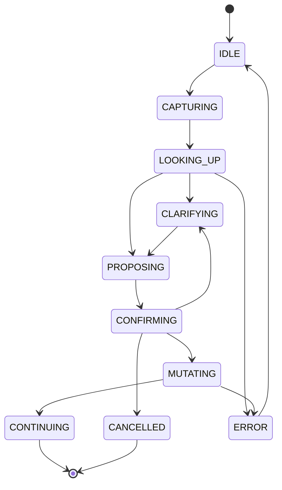
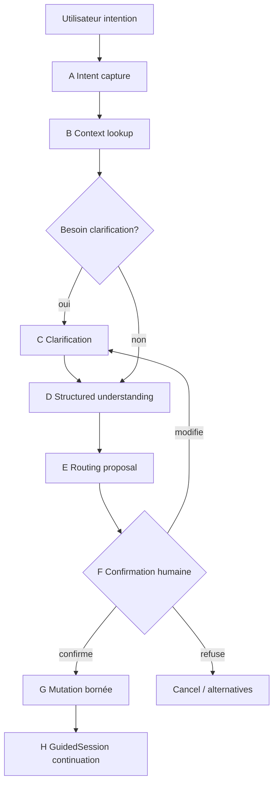
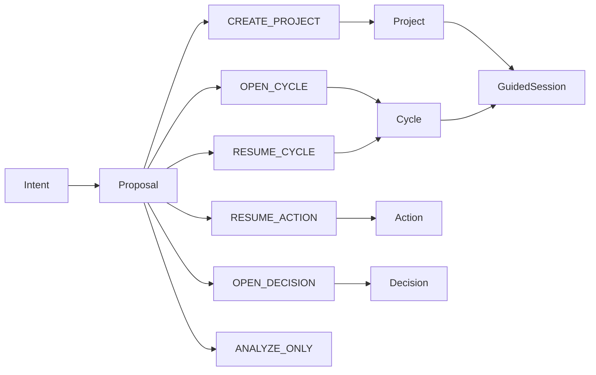
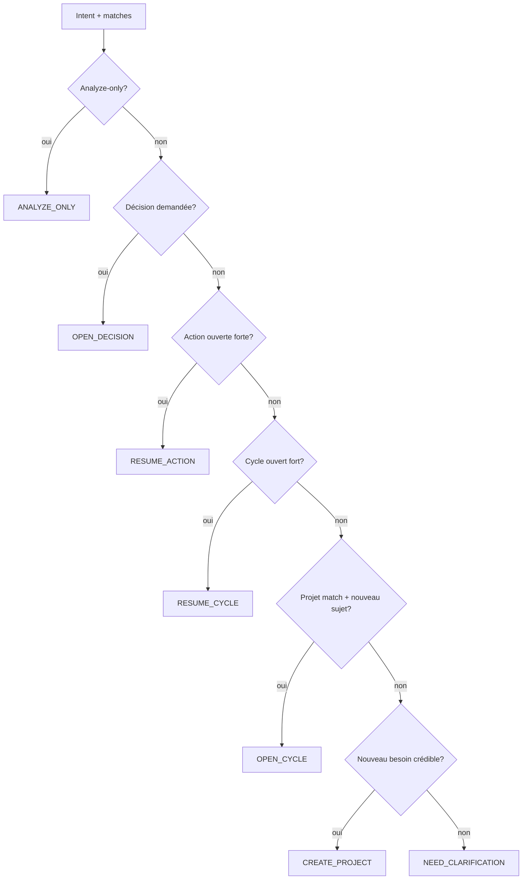

# Review Pack Full — SFIA v3.0 D1 AI-Guided Request Intake and Routing

## 1. Métadonnées

- **Date/heure/fuseau :** 2026-07-22 19:55:59 CEST
- **Cycle :** 2 — Conception fonctionnelle (CONCEPTION / UX / ARCHI-FONC / PRODUCT)
- **Profil :** Critical
- **Gate consommé :** GO CYCLE CORRECTIF D1 — AI-GUIDED REQUEST INTAKE AND ROUTING
- **Gate suivant :** GO VALIDATION CONCEPTION D1 — AI-GUIDED REQUEST INTAKE AND ROUTING
- **Décision Morris :** D1-I1 TECHNICAL FOUNDATION IMPLEMENTED — PRODUCT EXPERIENCE REWORK REQUIRED
- **Repo/branche :** mcleland147/sfia-workspace · `delivery/sfia-studio-control-tower-fast-track`
- **HEAD/base :** `32e5271842b9a344a7e292614675c27ea8ed941b`
- **Handoff précédent :** `32d1ee33deb15d8a9414a7079c9cee31031e74cf`
- **Baseline :** SFIA v2.6
- **Statut v3 :** V3-MODELED CANDIDATE
- **BCDI :** BCDI-D1-AI-GUIDED-INTAKE-ROUTING
- **Code modifié :** **aucun**

## 2. État Git initial

- Dirty attendu (CT + D1-I1 + framing/modeled/design)
- staged vide
- HEAD = origin/main = `32e5271842b9a344a7e292614675c27ea8ed941b`
- Aucun stash/reset/clean/commit projet

```
 M projects/sfia-studio/README.md
 M projects/sfia-studio/app/__tests__/ops1/Ops1SessionScreen.test.tsx
 M projects/sfia-studio/app/__tests__/ops1/conversation-repository.test.ts
 M projects/sfia-studio/app/__tests__/ops1/globalModeBadge.ui.test.tsx
 M projects/sfia-studio/app/components/shell/UtilityRail.tsx
 M projects/sfia-studio/app/features/ops1/Ops1SessionScreen.tsx
 M projects/sfia-studio/app/lib/ops1/actions.ts
 M projects/sfia-studio/app/lib/ops1/conversation/fakeProvider.ts
 M projects/sfia-studio/app/lib/ops1/conversation/openaiProvider.ts
 M projects/sfia-studio/app/lib/ops1/conversation/service.ts
 M projects/sfia-studio/app/lib/ops1/conversation/types.ts
 M projects/sfia-studio/app/lib/ops1/executionOrchestrator.ts
 M projects/sfia-studio/app/lib/ops1/types.ts
 M projects/sfia-studio/app/playwright.config.ts
?? .tmp-sfia-review/
?? projects/sfia-studio/66-control-tower-product-framing.md
?? projects/sfia-studio/67-control-tower-capabilities-and-user-journeys.md
?? projects/sfia-studio/68-control-tower-scope-success-criteria-and-risks.md
?? projects/sfia-studio/69-control-tower-options-and-decision-pack.md
?? projects/sfia-studio/70-control-tower-fast-track-architecture-and-contract.md
?? projects/sfia-studio/71-control-tower-fast-track-backlog-and-delivery.md
?? projects/sfia-studio/72-control-tower-fast-track-decision-pack.md
?? projects/sfia-studio/73-control-tower-fast-track-delivery-report.md
?? projects/sfia-studio/74-sfia-canonical-context-engine-report.md
?? projects/sfia-studio/app/__tests__/d1/
?? projects/sfia-studio/app/__tests__/ops1/controlTowerReinjection.test.ts
?? projects/sfia-studio/app/__tests__/ops1/controlTowerTools.test.ts
?? projects/sfia-studio/app/__tests__/ops1/sfia/
?? projects/sfia-studio/app/app/projects/
?? projects/sfia-studio/app/app/workspace/
?? projects/sfia-studio/app/e2e/control-tower-fast-track.spec.ts
?? projects/sfia-studio/app/e2e/d1-i1-project-foundation.spec.ts
?? projects/sfia-studio/app/e2e/sfia-canonical-context-engine.spec.ts
?? projects/sfia-studio/app/features/d1/
?? projects/sfia-studio/app/lib/d1/
?? projects/sfia-studio/app/lib/ops1/conversation/toolLoop.ts
?? projects/sfia-studio/app/lib/ops1/reportReinjection.ts
?? projects/sfia-studio/app/lib/ops1/sfia/
?? projects/sfia-studio/app/lib/ops1/tools/
?? projects/sfia-studio/sfia-v3-delivery/
?? projects/sfia-studio/sfia-v3-design/
?? projects/sfia-studio/sfia-v3-framing/
?? projects/sfia-studio/sfia-v3-modeled/

```

## 3. Sources

- framing/**, modeled/**, d1-project-framing/**, d1-ux-ui/**, d1-i1-project-foundation/**
- code D1-I1 lecture seule (`features/d1`, `lib/d1`)
- handoff `32d1ee3…`
- captures `.tmp-sfia-review/screenshots-d1-i1/`
- Figma fileKey `IS70XDnBMvZuJYmaI5eZT2`

## 4. Problème produit / valeur cible

Form-first New Project + MethodMode utilisateur ≠ vision SFIA Studio.
Cible : intent → GPT clarifie → lookup → routage → confirmation humaine → mutation → GuidedSession.
Entrée principale conversationnelle ; formulaire = manuel secondaire.

## 5. Scénarios S1–S8

CREATE_PROJECT · OPEN_CYCLE · RESUME_CYCLE · RESUME_ACTION · OPEN_DECISION · NEED_CLARIFICATION · ANALYZE_ONLY · manuel expert.

## 6. Contrat conversationnel A–H

Intent → Lookup → Clarification → Structured understanding → Routing proposal → Human confirmation → Mutation → Continuation.

## 7. RequestRoutingProposal

Candidat non figé — outcome types CREATE_PROJECT / OPEN_CYCLE / RESUME_* / OPEN_DECISION / ANALYZE_ONLY / NEED_CLARIFICATION.

## 8. GPT / MethodMode / Audit

- GPT propose, n’exécute pas.
- MethodMode hors UI standard → gouvernance + audit.
- Audit métier vs journal technique séparé.

## 9. Figma

- Page **D1 — AI-Guided Intake and Routing** (`11:2`)
- 13 écrans + strip composants
- Page D1 Project Framing UX (`1:2`) préservée (14 frames)
- Captures locales : `.tmp-sfia-review/screenshots-d1-intake/`

| Frame | node | dims |
|-------|------|------|
| empty | 12:2 | 1440×1024 |
| clarification | 12:36 | 1440×1024 |
| routing proposal | 12:60 | 1440×1024 |
| existing project match | 13:2 | 1440×1024 |
| resume cycle | 13:27 | 1440×1024 |
| analyze only | 13:51 | 1440×1024 |
| confirm create project | 13:74 | 1440×1024 |
| confirm open cycle | 13:100 | 1440×1024 |
| workspace resume | 14:2 | 1440×1024 |
| manual advanced | 14:31 | 1440×1024 |
| routing 1728 | 14:64 | 1728×1024 |
| routing 1280 | 14:90 | 1280×1024 |
| routing 1024 | 14:117 | 1024×1024 |
| components | 11:3 | strip |

## 10. Gap runtime I1 vs cible

Entrée form → conversation (P0) · MethodMode select → config (P0) · audit technique → métier (P1) · shell/persistence réutilisés.

## 11. Impact D1-I1 / backlog

Réutiliser D1AppShell + lib/d1 · adapter NewProjectForm en manuel · déprécier MethodMode UI · nouveau RequestRoutingProposal + intake · slices D1-C1…C6.

## 12. Réserves / dette / anti-claims

- Réserve route naming (`/` vs `/demande` vs legacy)
- Réserve bridge Resume Action ↔ OPS1
- Schema RequestRoutingProposal non final
- Anti-claims : pas V3-IMPLEMENTED/ADOPTED · pas GO VALIDATION I1 · pas code · pas commit projet

## 13. Décisions Morris requises

Voir doc 20 — validation conception + MethodMode UI off + backlog C1–C6 + naming route + bridge OPS1.

## 14. Fichiers créés (liste)

```
projects/sfia-studio/sfia-v3-design/d1-ai-guided-intake-routing/01-product-problem-and-rework-rationale.md
projects/sfia-studio/sfia-v3-design/d1-ai-guided-intake-routing/02-target-value-proposition.md
projects/sfia-studio/sfia-v3-design/d1-ai-guided-intake-routing/03-user-intents-and-routing-scenarios.md
projects/sfia-studio/sfia-v3-design/d1-ai-guided-intake-routing/04-ai-guided-intake-journey.md
projects/sfia-studio/sfia-v3-design/d1-ai-guided-intake-routing/05-routing-decision-model.md
projects/sfia-studio/sfia-v3-design/d1-ai-guided-intake-routing/06-request-routing-proposal-candidate.md
projects/sfia-studio/sfia-v3-design/d1-ai-guided-intake-routing/07-gpt-role-and-guardrails.md
projects/sfia-studio/sfia-v3-design/d1-ai-guided-intake-routing/08-project-cycle-resume-action-routing.md
projects/sfia-studio/sfia-v3-design/d1-ai-guided-intake-routing/09-method-mode-target-strategy.md
projects/sfia-studio/sfia-v3-design/d1-ai-guided-intake-routing/10-user-vs-technical-audit-contract.md
projects/sfia-studio/sfia-v3-design/d1-ai-guided-intake-routing/11-conversational-interaction-contract.md
projects/sfia-studio/sfia-v3-design/d1-ai-guided-intake-routing/12-information-architecture-update.md
projects/sfia-studio/sfia-v3-design/d1-ai-guided-intake-routing/13-ux-screen-contracts.md
projects/sfia-studio/sfia-v3-design/d1-ai-guided-intake-routing/14-visual-direction-and-design-principles.md
projects/sfia-studio/sfia-v3-design/d1-ai-guided-intake-routing/15-figma-frame-register.md
projects/sfia-studio/sfia-v3-design/d1-ai-guided-intake-routing/16-figma-runtime-gap-analysis.md
projects/sfia-studio/sfia-v3-design/d1-ai-guided-intake-routing/17-accessibility-and-responsive-contract.md
projects/sfia-studio/sfia-v3-design/d1-ai-guided-intake-routing/18-implementation-impact-map.md
projects/sfia-studio/sfia-v3-design/d1-ai-guided-intake-routing/19-corrective-backlog-and-slicing.md
projects/sfia-studio/sfia-v3-design/d1-ai-guided-intake-routing/20-validation-decision-pack.md
projects/sfia-studio/sfia-v3-design/d1-ai-guided-intake-routing/README.md
projects/sfia-studio/sfia-v3-design/d1-ai-guided-intake-routing/diagrams/d1-conversation-state-flow.mmd
projects/sfia-studio/sfia-v3-design/d1-ai-guided-intake-routing/diagrams/d1-intake-routing-flow.mmd
projects/sfia-studio/sfia-v3-design/d1-ai-guided-intake-routing/diagrams/d1-project-cycle-resume-model.mmd
projects/sfia-studio/sfia-v3-design/d1-ai-guided-intake-routing/diagrams/d1-routing-decision-tree.mmd
```

## 15. Contenu complet des fichiers créés

### `projects/sfia-studio/sfia-v3-design/d1-ai-guided-intake-routing/01-product-problem-and-rework-rationale.md`

```markdown
# 01 — Problème produit et rationale du rework

## Décision Morris consommée

**D1-I1 TECHNICAL FOUNDATION IMPLEMENTED — PRODUCT EXPERIENCE REWORK REQUIRED**

Les acquis techniques D1-I1 (Project SQLite, audit, shell fluide, routes, tests) sont **conservés**.
La cible produit « formulaire Nouveau projet + MethodMode utilisateur » est **remise en cause**.

## Symptômes observés (runtime I1 + captures)

1. Entrée principale = formulaire administratif (identité, objectif, contexte, MethodMode).
2. L’utilisateur doit connaître Project / MethodMode pour démarrer.
3. Cockpit expose IDs / événements techniques au centre de l’attention.
4. Placeholders I2–I5 visibles comme « zones futures » sans accompagnement.
5. Visibilité IA faible : pas de conversation de qualification avant mutation.
6. Pas de routage explicite nouveau projet / nouveau cycle / reprise / poursuite / analyse.
7. Continuité avec la vision framing (GuidedSession, intent-first, dual-channel) **rompue** par I1 form-first.

## Écart vs vision SFIA Studio

| Attendu (framing 05/11/16) | Livré I1 |
|----------------------------|----------|
| Intention → clarification → routage | Formulaire → create Project |
| GPT propose, humain confirme | Humain remplit et crée |
| MethodMode gouvernance | MethodMode choix UX |
| Audit métier lisible | Audit technique centré |
| « Nouvelle demande » conversationnelle | Legacy OPS1 + New Project CRUD |

## Pourquoi corriger avant code

- D1/D2/D3 dépendent de la qualification initiale.
- Rework UX + modèle + routes + orchestration si on poursuit form-first.
- Figma et contrats doivent être recalés **avant** GuidedSession / CycleInstance.

## Ce qui n’est PAS remis en cause

Persistance Project · SQLite · audit append-only · idempotence · D1AppShell · Cockpit technique · tests · legacy `/nouvelle-demande`.
```
### `projects/sfia-studio/sfia-v3-design/d1-ai-guided-intake-routing/02-target-value-proposition.md`

```markdown
# 02 — Proposition de valeur cible

## Phrase produit

**SFIA Studio comprend ce que vous voulez faire, retrouve le travail existant, propose la bonne suite, et n’agit qu’après votre confirmation.**

## Promesses

1. **AI-first** — conversation guidée comme porte d’entrée.
2. **Intent-first** — exprimer un besoin, pas choisir un objet métier.
3. **Routage intelligent** — Project / Cycle / Resume / Action / Decision / Analyze.
4. **Confirmation humaine** — aucune mutation silencieuse.
5. **Complexité progressive** — novice sans jargon ; expert avec manuel + journal technique.
6. **Méthode système** — v3 cible via gouvernance, pas préférence UI.

## Anti-promesses

- pas un CRUD SaaS de projets ;
- pas un chat générique type messagerie ;
- pas un questionnaire déguisé ;
- pas une adoption v3 implicite ;
- pas une autonomie GPT sur les effets.

## Valeur démontrable (conception)

Utilisateur : « Je veux reprendre Campus360 pour la gestion des comptes. »
Studio : détecte, clarifie, propose cycle, explique, attend « Valide », puis continue en GuidedSession.
```
### `projects/sfia-studio/sfia-v3-design/d1-ai-guided-intake-routing/03-user-intents-and-routing-scenarios.md`

```markdown
# 03 — Intentions utilisateur et scénarios de routage

## Cartographie des intentions

| Intent classe | Exemple | Outcome candidat |
|---------------|---------|------------------|
| Nouveau besoin | « lancer une app contrats » | CREATE_PROJECT (+ premier cycle) |
| Nouveau sujet projet connu | « Campus360 utilisateurs » | OPEN_CYCLE |
| Reprise cadrage | « on reprend le cadrage Campus360 » | RESUME_CYCLE |
| Poursuite action | « continuer shell responsive » | RESUME_ACTION |
| Décisions ouvertes | « qu’est-ce qui me reste à valider ? » | OPEN_DECISION |
| Ambigu | « j’ai un nouveau sujet » | NEED_CLARIFICATION |
| Analyse seule | « analyse, ne crée rien » | ANALYZE_ONLY |
| Expert manuel | CTA « Création manuelle » | CREATE_PROJECT / OPEN_CYCLE (manuel) |

## S1 — Nouveau besoin sans projet

**Entrée :** « Je veux lancer une application de suivi des contrats. »
**Studio :** questions minimales (périmètre, urgence) → synthèse → CREATE_PROJECT + premier cycle proposé → confirmation.

## S2 — Nouveau cycle projet existant

**Entrée :** « Reprendre Campus360 pour la gestion des utilisateurs. »
**Studio :** match Campus360 → OPEN_CYCLE recommandé → objectif synthétisé → confirmation.

## S3 — Reprise cycle en cours

**Entrée :** « On reprend le cadrage Campus360. »
**Studio :** cycle ouvert + état + réserves + prochaine action → RESUME_CYCLE → GuidedSession.

## S4 — Poursuite action

**Entrée :** « Continuer la correction du shell responsive. »
**Studio :** action/delivery ouverte → RESUME_ACTION · **pas** de nouveau Project/Cycle inutile.

## S5 — Décision en attente

**Entrée :** « Qu’est-ce qui me reste à valider ? »
**Studio :** liste priorisée gates/DecisionRequests → OPEN_DECISION.

## S6 — Ambigu

**Entrée :** « J’ai un nouveau sujet. »
**Studio :** 1–3 questions · hypothèses multiples · **aucune** création.

## S7 — Analyze-only

**Entrée :** « Analyse cette idée, mais ne crée rien. »
**Studio :** exploration + synthèse · ANALYZE_ONLY · option « transformer plus tard ».

## S8 — Création manuelle experte

**Entrée :** CTA explicite.
**Studio :** formulaire court Project/Cycle · paramètres avancés · confirmation · journal technique accessible.
```
### `projects/sfia-studio/sfia-v3-design/d1-ai-guided-intake-routing/04-ai-guided-intake-journey.md`

```markdown
# 04 — Journey intake AI-guided

## Parcours nominal (Campus360 comptes)

1. Utilisateur ouvre **Nouvelle demande**.
2. Saisit : « Je veux reprendre Campus360 pour revoir la gestion des comptes. »
3. Studio : Context lookup → match Campus360 + cycles récents.
4. Clarification : « Prolonge-t-on le cadrage ou ouvre-t-on un nouveau sujet ? »
5. Utilisateur : nouveau sujet + gestion des rôles.
6. Studio : RequestRoutingProposal (OPEN_CYCLE, profil Standard, blocs sécurité/RGPD/UX).
7. Affiche rationale + alternatives (rattacher / analyser seulement).
8. Utilisateur : « Valide ».
9. Mutation bornée : Cycle ouvert + GuidedSession · Cockpit mis à jour.
10. Conversation continue dans le contexte créé.

## États UI du journey

| État | Contenu central | Rail |
|------|-----------------|------|
| Empty | champ + exemples + reprises | historique / décisions |
| Clarification | questions + thread | contexte détecté partiel |
| Routing proposal | carte proposition + alternatives | confiance / matches |
| Confirmation | résumé effet | ce qui sera créé |
| Post-mutation | GuidedSession / Cockpit | activité métier |

## Alternatifs

- Refus proposition → retour clarification ou alternatives.
- Contexte indisponible → ANALYZE_ONLY ou manuel + banner.
- Conflit multi-match → choix utilisateur obligatoire.
- Erreur lookup → fail-soft, pas de mutation.
```
### `projects/sfia-studio/sfia-v3-design/d1-ai-guided-intake-routing/05-routing-decision-model.md`

```markdown
# 05 — Modèle de décision de routage

## Entrées

- rawIntent
- context matches (projects, cycles, actions, decisions)
- signaux utilisateur (analyze-only, manuel)
- confiance scoring
- politiques (anti-claims, mono-op I1, gates fermés)

## Sortie

`RequestRoutingProposal` (doc 06) avec `proposedOutcomeType` et `alternatives[]`.

## Règles de priorité (recommandation)

1. Analyze-only explicite → ANALYZE_ONLY.
2. Décision ouverte clairement demandée → OPEN_DECISION.
3. Action ouverte match forte → RESUME_ACTION.
4. Cycle ouvert match forte → RESUME_CYCLE.
5. Projet match + nouveau sujet → OPEN_CYCLE.
6. Aucun match + besoin créé → CREATE_PROJECT.
7. Ambigu / confiance basse → NEED_CLARIFICATION.
8. Expert manuel → bypass conversation (confirmation toujours requise).

## Seuils candidats (non figés)

| Confiance | Comportement |
|-----------|--------------|
| ≥ 0.8 | 1 proposition primaire + 1–2 alternatives |
| 0.5–0.8 | clarification ciblée puis proposition |
| < 0.5 | NEED_CLARIFICATION · pas de mutation |

## Arbres

Voir `diagrams/d1-routing-decision-tree.mmd`.
```
### `projects/sfia-studio/sfia-v3-design/d1-ai-guided-intake-routing/06-request-routing-proposal-candidate.md`

```markdown
# 06 — RequestRoutingProposal (candidat)

> Schéma **non validé définitivement**. Options + recommandation.

## Recommandation

Adopter un objet **candidat** `RequestRoutingProposal` comme sortie structurée du canal de contrôle intake (avant GuidedSession post-mutation).

## Champs candidats

| Champ | Type | Oblig. | Notes |
|-------|------|--------|-------|
| requestId | string | oui | corrélation intake |
| rawIntent | string | oui | texte utilisateur |
| normalizedIntent | string | non | reformulation |
| proposedOutcomeType | enum | oui | voir ci-dessous |
| candidateProjectId | string? | | |
| candidateProjectName | string? | | affichage |
| candidateCycleId | string? | | |
| proposedCycleType | string? | | ex. FRAMING |
| proposedObjective | string? | | synthèse |
| proposedProfile | string? | | Fast/Standard/… |
| proposedBlocks | string[]? | | UX, RGPD… |
| detectedOpenWork | object? | | actions/gates |
| missingInformation | string[] | | |
| alternatives | Alternative[] | | |
| confidence | number 0–1 | oui | |
| rationale | string | oui | humain-lisible |
| requiresHumanConfirmation | boolean | oui | toujours true pour mutation |
| createdAt | datetime | oui | |

### Outcome types

`CREATE_PROJECT` · `OPEN_CYCLE` · `RESUME_CYCLE` · `RESUME_ACTION` · `OPEN_DECISION` · `ANALYZE_ONLY` · `NEED_CLARIFICATION`

### Alternative

`{ outcomeType, label, rationale, candidateProjectId?, candidateCycleId? }`

## Options écartées (pour l’instant)

- A : réutiliser directement `GuidedProposal` sans objet intake — trop tôt (GuidedSession post-mutation).
- B : muter Project sans proposal — interdit.
- C : schema Draft-07 figé maintenant — hors scope ; modeled ultérieur.

## Lien dual-channel (framing 05)

Prose = explication · Proposal = contrôle machine · mutation = commande humaine.
```
### `projects/sfia-studio/sfia-v3-design/d1-ai-guided-intake-routing/07-gpt-role-and-guardrails.md`

```markdown
# 07 — Rôle GPT et garde-fous

## GPT peut

- comprendre l’intention ;
- appeler services de lookup autorisés ;
- poser questions minimales ;
- synthétiser ;
- proposer Project / Cycle / profil / blocs ;
- expliquer options ;
- produire `RequestRoutingProposal`.

## GPT ne peut pas

- créer seul un projet ou cycle ;
- reprendre une action sans confirmation ;
- valider une décision / contourner un gate ;
- modifier la doctrine / choisir une baseline ;
- transformer une proposition en décision Morris ;
- claim V3-ADOPTED / V3-IMPLEMENTED.

## Garde-fous produit

1. **Human-in-the-loop** obligatoire pour toute mutation.
2. **Fail-closed** sur ambiguïté → clarification.
3. **Pas de formulaire-chat** : max questions utiles.
4. **Transparence** : rationale visible.
5. **Séparation** audit métier / technique.
6. **Anti-claims** persistés dans le contexte système.

## Observabilité conception

Événements logiques : `intake_intent_received`, `intake_lookup_completed`, `intake_proposal_emitted`, `intake_confirmed`, `intake_cancelled` (implémentation future).
```
### `projects/sfia-studio/sfia-v3-design/d1-ai-guided-intake-routing/08-project-cycle-resume-action-routing.md`

```markdown
# 08 — Project / Cycle / Resume / Action routing

## Matrice

| Outcome | Crée | Reprend | UI post-confirm |
|---------|------|---------|-----------------|
| CREATE_PROJECT | Project (+ cycle 1 proposé) | — | Cockpit + GuidedSession framing |
| OPEN_CYCLE | CycleInstance | Project existant | Cycle actif + session |
| RESUME_CYCLE | — | Cycle ouvert | GuidedSession |
| RESUME_ACTION | — | Action/delivery | surface action / OPS1 bridge futur |
| OPEN_DECISION | — | DecisionRequest | Decision Center |
| ANALYZE_ONLY | — | — | synthèse ; CTA transform |
| NEED_CLARIFICATION | — | — | questions |

## Règle anti-prolifération

Ne pas créer Project/Cycle si une reprise suffit (S4).

## Compatibilité D1-I1

- Project persisté reste le socle CREATE_PROJECT.
- CycleInstance / GuidedSession = slices correctifs C4–C5 (pas I1).
- Resume Action peut temporairement pointer legacy OPS1 session si match — **à trancher** (décision Morris).
```
### `projects/sfia-studio/sfia-v3-design/d1-ai-guided-intake-routing/09-method-mode-target-strategy.md`

```markdown
# 09 — Stratégie MethodMode cible

## État transitoire (D1-I1)

- Champ UI sélectionnable.
- Valeur persistée `methodMode`.
- Utile anti-claims / transition / audit.

## Cible produit

| Aspect | Cible |
|--------|-------|
| UI parcours standard | **supprimé** (pas de choix utilisateur) |
| Indicateur | lecture seule optionnel (badge gouvernance) |
| Source de vérité | configuration / gouvernance workspace |
| Persistance | conservée en donnée système + audit |
| Admin/diagnostic | écran séparé si besoin |
| Claim | jamais V3-ADOPTED via UI |

## Compatibilité I1

1. Conserver colonne/valeur SQLite.
2. Déprécier UI MethodMode dans New Project / Cockpit principal.
3. Mapper création intake → mode système (ex. `V3_CANDIDATE` ou politique workspace) **sans** choix libre.
4. Mode avancé expert : lecture + override admin seulement (hors C1).

## Absence de dépendance fonctionnelle durable

Le parcours cible ne branche **pas** sur un select MethodMode. Le routage dépend de l’intention et du contexte, pas de la préférence méthodologique utilisateur.
```
### `projects/sfia-studio/sfia-v3-design/d1-ai-guided-intake-routing/10-user-vs-technical-audit-contract.md`

```markdown
# 10 — Audit utilisateur vs technique

## Niveau utilisateur (activité métier)

Libellés :
- Projet créé
- Cycle ouvert
- Travail repris
- Décision requise
- Contexte actualisé
- Prochaine action

Emplacement : rail / timeline métier · **pas** centre de l’écran principal intake.

## Niveau technique (journal avancé)

- `PROJECT_CREATED`, `PROJECT_MODE_SELECTED`, …
- correlationId, payloads, digests, versions, actor IDs, timestamps

Accès : « Voir le journal technique » · mode diagnostic · permission appropriée.

## Mapping candidat

| Métier | Technique |
|--------|-----------|
| Projet créé | PROJECT_CREATED |
| Mode système appliqué | PROJECT_MODE_SELECTED (si applicable) |
| Cycle ouvert | CYCLE_OPENED (futur) |
| Session reprise | SESSION_RESUMED (futur) |

## I1 impact

Masquer IDs / eventType bruts du Cockpit principal ; conserver données pour vue avancée.
```
### `projects/sfia-studio/sfia-v3-design/d1-ai-guided-intake-routing/11-conversational-interaction-contract.md`

```markdown
# 11 — Contrat d’interaction conversationnelle

## Étapes logiques A–H

| Étape | Nom | Effet |
|-------|-----|-------|
| A | Intent capture | rawIntent |
| B | Context lookup | matches |
| C | Clarification | questions minimales |
| D | Structured understanding | champs normalisés |
| E | Routing proposal | RequestRoutingProposal |
| F | Human confirmation | confirm / modify / refuse |
| G | Mutation bornée | commandes |
| H | Continuation | GuidedSession |

## Règles conversation

1. Une question à la fois quand possible ; max 3 en vol.
2. Toujours montrer ce que Studio a compris.
3. Toujours offrir une alternative « corriger le rattachement ».
4. Jamais muter à l’étape A–E.
5. Analyze-only respecte l’interdiction de création.
6. Erreurs lookup → message clair + manuel / retry.

## États conversationnels

`IDLE` → `CAPTURING` → `LOOKING_UP` → `CLARIFYING` → `PROPOSING` → `CONFIRMING` → `MUTATING` → `CONTINUING` | `CANCELLED` | `ERROR`

Voir `diagrams/d1-conversation-state-flow.mmd`.
```
### `projects/sfia-studio/sfia-v3-design/d1-ai-guided-intake-routing/12-information-architecture-update.md`

```markdown
# 12 — Mise à jour architecture d’information

## Avant (I1 form-first)

``\`
Workspace Home → New Project (form) → Cockpit
/nouvelle-demande (OPS1 legacy)
``\`

## Cible (AI-guided)

``\`
Nouvelle demande (intake conversationnel)  ← entrée principale
├── Reprendre (projets / cycles / actions / décisions)
├── Création manuelle avancée (secondaire)
Workspace (liste / reprise)
Project Cockpit (post-mutation, activité métier)
Cycle / GuidedSession (après confirm)
Decision Center (si OPEN_DECISION)
Journal technique (secondaire)
``\`

## Navigation

| Item | Rôle |
|------|------|
| Nouvelle demande | Hub intent |
| Workspace | Inventaire / reprise visuelle |
| Projet | Cockpit |
| Décisions | gates ouvertes |
| Manuel | expert escape hatch |

## Legacy

`/nouvelle-demande` OPS1 **conservé** jusqu’à bridge Resume Action explicite.
```
### `projects/sfia-studio/sfia-v3-design/d1-ai-guided-intake-routing/13-ux-screen-contracts.md`

```markdown
# 13 — Contrats d’écrans UX

## Nouvelle demande — empty

- Landmark main : champ conversationnel large + exemples d’intentions.
- Actions rapides (non rigides) : Décrire un besoin · Reprendre · Décisions · Manuel.
- Zone Reprendre : projets / cycles / actions / décisions / dernière session.
- Rail : activité métier récente · pas d’IDs.

## Clarification

- Thread : reformulation + 1–3 questions.
- Indicateur « Studio recherche / qualifie ».
- Pas de création.

## Routing proposal

- Carte proposition primaire (outcome, objet, objectif, confiance).
- Alternatives cliquables.
- Rationale humain-lisible.
- CTA Confirmer / Modifier / Annuler.

## Existing project match / Resume cycle / Analyze-only

Variants de proposal avec copy et CTA adaptés (doc 03).

## Confirmation create project / open cycle

- Résumé effet avant mutation.
- Ce qui sera créé / repris.
- Claims absents (pas V3-ADOPTED).

## Workspace — resume work

- Liste reprise one-click + entrée conversationnelle.

## Manual creation — advanced

- Formulaire court (héritage I1 réduit).
- MethodMode **absent** du parcours standard (éventuel admin).
- Confirmation obligatoire.

## Erreurs / aucun match / contexte indisponible

Banners explicites + chemins de secours (clarifier / manuel / analyze).
```
### `projects/sfia-studio/sfia-v3-design/d1-ai-guided-intake-routing/14-visual-direction-and-design-principles.md`

```markdown
# 14 — Direction artistique et principes visuels

## Identité

Conserver tokens Studio (Inter, bleus `#2E59B8`, fonds `#F6F7FA` / blanc). Renforcer profondeur et rythme.

## Principes

1. **Copilote actif** — feedback « recherche / qualification / proposition ».
2. **Hiérarchie** — proposition > thread > métadonnées.
3. **Progression visible** — étapes A–H condensées (puces, pas wizard lourd).
4. **Cartes intentionnelles** — une carte = un choix compréhensible.
5. **Mouvement léger** — états loading lookup (respect `prefers-reduced-motion`).
6. **Jargon traduit** — « Ouvrir un cycle de cadrage » plutôt que `CycleInstance`.

## Éviter

Formulaire vertical administratif · audit brut centre · chat messagerie générique · placeholders techniques · MethodMode comme hero.

## Non-baseline

Aucun design n’est baseline sans GO Morris.
```
### `projects/sfia-studio/sfia-v3-design/d1-ai-guided-intake-routing/15-figma-frame-register.md`

```markdown
# 15 — Figma frame register

| Champ | Valeur |
|-------|--------|
| File | SFIA Studio — D1 Doctrine-aligned UX |
| fileKey | `IS70XDnBMvZuJYmaI5eZT2` |
| URL | https://www.figma.com/design/IS70XDnBMvZuJYmaI5eZT2 |
| Page | D1 — AI-Guided Intake and Routing (`11:2`) |
| Statut | Frames éditables Auto Layout · dimensions confirmées |
| Préservation | Page `D1 — Project Framing UX` (`1:2`) **non écrasée** (14 frames I1 conservées) |

## Frames Intake

| Frame | node id | W×H | Layout |
|-------|---------|-----|--------|
| Intake / Components | `11:3` | 2591×149 | HORIZONTAL AL |
| 1440 / Nouvelle demande — empty | `12:2` | **1440×1024** | HORIZONTAL AL |
| 1440 / Nouvelle demande — clarification | `12:36` | **1440×1024** | HORIZONTAL AL |
| 1440 / Nouvelle demande — routing proposal | `12:60` | **1440×1024** | HORIZONTAL AL |
| 1440 / Nouvelle demande — existing project match | `13:2` | **1440×1024** | HORIZONTAL AL |
| 1440 / Nouvelle demande — resume cycle | `13:27` | **1440×1024** | HORIZONTAL AL |
| 1440 / Nouvelle demande — analyze only | `13:51` | **1440×1024** | HORIZONTAL AL |
| 1440 / Confirmation — create project | `13:74` | **1440×1024** | HORIZONTAL AL |
| 1440 / Confirmation — open cycle | `13:100` | **1440×1024** | HORIZONTAL AL |
| 1440 / Workspace — resume work | `14:2` | **1440×1024** | HORIZONTAL AL |
| 1440 / Manual creation — advanced | `14:31` | **1440×1024** | HORIZONTAL AL |
| 1728 / Nouvelle demande — routing proposal | `14:64` | **1728×1024** | HORIZONTAL AL |
| 1280 / Nouvelle demande — routing proposal | `14:90` | **1280×1024** | HORIZONTAL AL |
| 1024 / Nouvelle demande — routing proposal | `14:117` | **1024×1024** | HORIZONTAL AL |

## Composants conversationnels (strip)

IntentField · Clarification · RoutingProposal · ProjectMatch · CycleMatch · Alternative · Confiance · Confirm · ResumeChip · Error · NoMatch · ContextUnavailable

## Shell encodé

Nav 72 + Main FILL + ContextualRail (360@≥1440 / 320@1280 / empilé@1024)
```
### `projects/sfia-studio/sfia-v3-design/d1-ai-guided-intake-routing/16-figma-runtime-gap-analysis.md`

```markdown
# 16 — Gap analysis runtime I1 vs cible intake

| Aspect | Runtime D1-I1 | Cible intake | Écart | Priorité |
|--------|---------------|--------------|-------|----------|
| Entrée | `/projects/new` form | Conversation Nouvelle demande | fort | P0 |
| MethodMode | select utilisateur | config système | fort | P0 |
| IA visible | faible | clarification + proposal | fort | P0 |
| Routage | create Project only | S1–S8 | fort | P0 |
| Audit UI | events techniques | métier + journal avancé | moyen | P1 |
| Shell | fluide OK | conserver | faible | — |
| Persistence | Project OK | réutiliser | — | — |
| Figma I1 frames | Home/New/Cockpit | conserver ; page Intake nouvelle | — | — |

Captures runtime I1 : `.tmp-sfia-review/screenshots-d1-i1/`
```
### `projects/sfia-studio/sfia-v3-design/d1-ai-guided-intake-routing/17-accessibility-and-responsive-contract.md`

```markdown
# 17 — Accessibilité et responsive

## A11y (héritage UX 13 + intake)

- landmarks : nav / main / complementary ;
- ordre de tabulation : champ → questions → proposition → CTA ;
- focus visible ; labels ; erreurs `aria-live` ;
- confiance non portée par la seule couleur ;
- target size ≥ 24×24 (idéalement 44) ;
- zoom 200 % sans perte d’info critique ;
- reduced motion.

## Responsive (shell fluide I1 conservé)

| Largeur | Layout |
|---------|--------|
| 1728 / 1440 | nav + main conversation + rail |
| 1280 | rail réduit / collapsible |
| 1024 | rail empilé / drawer ; pas de scroll H |

Frames Figma responsive : 1728 / 1280 / 1024 routing proposal.
```
### `projects/sfia-studio/sfia-v3-design/d1-ai-guided-intake-routing/18-implementation-impact-map.md`

```markdown
# 18 — Impact map D1-I1 (sans modification code)

| Élément | Action |
|---------|--------|
| `/workspace` | **adapter** (reprises + lien Nouvelle demande) |
| `/projects/new` | **déprécier** comme entrée principale → manuel avancé |
| `/projects/[id]` | **adapter** (audit métier ; masquer technique) |
| `/nouvelle-demande` | **conserver** legacy OPS1 |
| Route intake cible `/` ou `/demande` | **nouveau** (décision naming) |
| `D1AppShell` | **réutiliser** |
| `NewProjectForm` | **adapter** → manuel avancé ; retirer MethodMode UI |
| `MethodModeBadge` select | **déprécier** UI ; badge lecture seule OK |
| `ProjectCockpitView` audit brut | **adapter** |
| `lib/d1` persistence | **réutiliser** |
| `RequestRoutingProposal` | **nouveau** |
| CycleInstance / GuidedSession | **nouveau** (C4–C5) |
| GPT intake | **nouveau** (C2) |
| Context lookup service | **nouveau** (C3) |
| Tests I1 | **conserver** ; étendre C6 |
| Figma page Project Framing | **conserver** ; page Intake **nouvelle** |
| D1-I2 GuidedSession ancien plan | **recaler** après C1–C5 |

## Interdit dans ce cycle

Modifier `app/**`, tests, package.json, framing/modeled/delivery existants.
```
### `projects/sfia-studio/sfia-v3-design/d1-ai-guided-intake-routing/19-corrective-backlog-and-slicing.md`

```markdown
# 19 — Backlog correctif et slicing

| Slice | Contenu | Dépendances | Gate candidaté |
|-------|---------|-------------|----------------|
| **D1-C1** | Intake shell + conversation entry + empty + reprises + manuel secondaire | I1 shell | GO IMPL C1 |
| **D1-C2** | Intent understanding + clarification + RequestRoutingProposal | C1 + GPT borné | GO IMPL C2 |
| **D1-C3** | Existing context matching (scores, conflits, no match) | C2 + lookup | GO IMPL C3 |
| **D1-C4** | Human confirmation + mutation Project/Cycle/Resume | C3 + commands | GO IMPL C4 |
| **D1-C5** | Guided continuation (session + cockpit) | C4 | GO IMPL C5 |
| **D1-C6** | UX hardening a11y/responsive/erreurs/audit avancé | C1–C5 | GO IMPL C6 |

## Ordre

C1 → C2 → C3 → C4 → C5 → C6 (C6 peut chevaucher partiellement).

## Hors backlog immédiat

D2 · D3 · PostgreSQL · IdP · Policy E0–E4 complet · adoption v3.

## Fermé tant que conception non validée

GO VALIDATION D1-I1 · implémentation corrective · D1-I2 ancien scope form-first.
```
### `projects/sfia-studio/sfia-v3-design/d1-ai-guided-intake-routing/20-validation-decision-pack.md`

```markdown
# 20 — Validation decision pack

## Verdict conception (cible)

**SFIA v3.0 D1 AI-GUIDED REQUEST INTAKE AND ROUTING READY — HUMAN DECISION REQUIRED**

## Décisions Morris requises

1. Valider l’entrée principale conversationnelle « Nouvelle demande ».
2. Valider le basculement formulaire → manuel secondaire.
3. Valider la suppression du MethodMode comme choix UX standard.
4. Valider l’objet candidat `RequestRoutingProposal` (non schema-final).
5. Valider le backlog C1–C6 et l’ordre.
6. Trancher le naming de route intake (`/` vs `/demande` vs réutiliser `/nouvelle-demande`).
7. Trancher le bridge Resume Action ↔ OPS1 legacy.
8. GO VALIDATION CONCEPTION D1 — AI-GUIDED REQUEST INTAKE AND ROUTING.

## Décisions non prises

Implémentation · D1-I2 · D2/D3 · baseline change · adoption · commit projet · schema Draft-07 figé.

## Anti-claims

Pas V3-IMPLEMENTED · pas V3-ADOPTED · pas validation I1 runtime · pas code modifié dans ce cycle.

## Prérequis READY conception

Docs 01–20 · Figma page + frames · routage S1–S8 · contrat A–H · impact map · backlog · handoff publié.
```
### `projects/sfia-studio/sfia-v3-design/d1-ai-guided-intake-routing/README.md`

```markdown
# D1 — AI-Guided Request Intake and Routing

| Champ | Valeur |
|-------|--------|
| BCDI | `BCDI-D1-AI-GUIDED-INTAKE-ROUTING` |
| Cycle | 2 — Conception fonctionnelle |
| Profil | Critical |
| Gate consommé | GO CYCLE CORRECTIF D1 — AI-GUIDED REQUEST INTAKE AND ROUTING |
| Gate suivant | GO VALIDATION CONCEPTION D1 — AI-GUIDED REQUEST INTAKE AND ROUTING |
| Décision Morris | D1-I1 TECHNICAL FOUNDATION IMPLEMENTED — PRODUCT EXPERIENCE REWORK REQUIRED |
| Baseline | SFIA v2.6 |
| Statut v3 | V3-MODELED CANDIDATE |
| Code | **aucune modification** |
| Figma fileKey | `IS70XDnBMvZuJYmaI5eZT2` |
| Figma page | D1 — AI-Guided Intake and Routing |

## Objectif

Recaler la porte d’entrée produit de D1 : conversation guidée + routage Project/Cycle/Resume/Action, avant toute nouvelle implémentation.

## Index

| Doc | Contenu |
|-----|---------|
| 01 | Problème produit et rationale rework |
| 02 | Proposition de valeur cible |
| 03 | Intentions et scénarios de routage |
| 04 | Journey intake AI-guided |
| 05 | Modèle de décision de routage |
| 06 | RequestRoutingProposal candidat |
| 07 | Rôle GPT et garde-fous |
| 08 | Project / Cycle / Resume / Action |
| 09 | Stratégie MethodMode cible |
| 10 | Audit utilisateur vs technique |
| 11 | Contrat d’interaction conversationnelle |
| 12 | Mise à jour architecture d’information |
| 13 | Contrats d’écrans UX |
| 14 | Direction artistique |
| 15 | Registre frames Figma |
| 16 | Gap analysis runtime/cible |
| 17 | Accessibilité et responsive |
| 18 | Impact map D1-I1 |
| 19 | Backlog correctif C1–C6 |
| 20 | Decision pack validation |

## Diagrammes

- `diagrams/d1-intake-routing-flow.mmd`
- `diagrams/d1-routing-decision-tree.mmd`
- `diagrams/d1-conversation-state-flow.mmd`
- `diagrams/d1-project-cycle-resume-model.mmd`

## Anti-claims

- pas V3-IMPLEMENTED / ADOPTED ;
- pas GO VALIDATION D1-I1 (fermé pendant ce cycle) ;
- pas implémentation corrective ;
- pas D1-I2 / D2 / D3 ;
- aucun commit projet.
```
### `projects/sfia-studio/sfia-v3-design/d1-ai-guided-intake-routing/diagrams/d1-conversation-state-flow.mmd`


### `projects/sfia-studio/sfia-v3-design/d1-ai-guided-intake-routing/diagrams/d1-intake-routing-flow.mmd`


### `projects/sfia-studio/sfia-v3-design/d1-ai-guided-intake-routing/diagrams/d1-project-cycle-resume-model.mmd`


### `projects/sfia-studio/sfia-v3-design/d1-ai-guided-intake-routing/diagrams/d1-routing-decision-tree.mmd`



## 16. État Git final

```
HEAD=32e5271842b9a344a7e292614675c27ea8ed941b
branch=delivery/sfia-studio-control-tower-fast-track
staged=0
code_app_modified_this_cycle=false
design_only=projects/sfia-studio/sfia-v3-design/d1-ai-guided-intake-routing/**
```

## 17. Verdict

**VERDICT :** SFIA v3.0 D1 AI-GUIDED REQUEST INTAKE AND ROUTING READY — HUMAN DECISION REQUIRED
