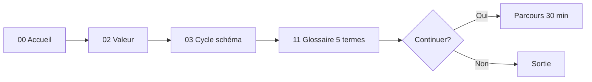
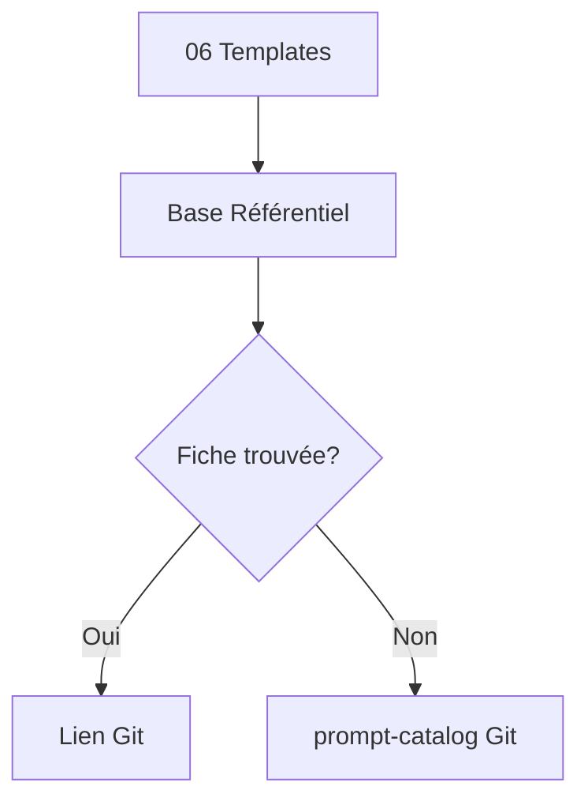

# SFIA Review Pack — Notion UX Conception UX-01

**Horodatage :** 2026-07-14 12:07 Europe/Paris (CEST)
**Repository :** mcleland147/sfia-workspace
**Workspace :** /Users/morris/Projects/sfia-workspace
**Cycle :** UX-01 — Conception UX documentaire SFIA Notion
**Type de cycle :** 4 — UX/UI
**Profil SFIA :** Standard
**Typologie v2.4 :** DOC
**Branche projet :** documentation/sfia-notion-ux-conception
**HEAD/base :** ee6c358750ecd18f7ba884ec51c8c7db3eaf3faa
**origin/main :** ee6c358750ecd18f7ba884ec51c8c7db3eaf3faa
**Merge PR #193 :** ee6c358750ecd18f7ba884ec51c8c7db3eaf3faa
**Statut livrables :** 8 fichiers ux/ — locaux non commités
**Verdict :** UX CONTRACT DOCUMENTED — READY FOR MORRIS REVIEW

---

## Local Git Truth Check

| Contrôle | Résultat |
|----------|----------|
| Branche initiale | main |
| Branche créée | documentation/sfia-notion-ux-conception |
| HEAD | ee6c358750ecd18f7ba884ec51c8c7db3eaf3faa |
| PR #193 ancêtre | ✓ |
| 8 fichiers ux/ | ✓ untracked |
| Fichiers existants modifiés | 0 |
| staged / commit projet | aucun |
| **Verdict** | **PASS** |

## Sources consultées

### Méthode
- prompts/templates/sfia-cycle-execution-template.md
- method/sfia-fast-track/core/sfia-cycle-routing-guide.md
- method/sfia-fast-track/core/sfia-chatgpt-cursor-operating-model.md
- method/sfia-fast-track/core/sfia-rules-and-guardrails.md
- method/sfia-fast-track/core/sfia-knowledge-layer.md

### Conception Notion
- sfia-notion-product-vision.md
- sfia-notion-information-architecture.md
- sfia-notion-publication-governance.md
- sfia-notion-mvp-backlog.md

### Editorial P0 (main)
- editorial/ — 12 fichiers PR #193

### Complémentaires
- docs/foundation/sfia-engineering-principles.md
- docs/architecture/sfia-repository-blueprint.md
- docs/architecture/sfia-platform-architecture.md
- method/sfia-fast-track/README.md

## Recherche actifs UX existants

- Dossier `notion/ux/` : **absent avant ce cycle**
- Termes notion ux / navigation model : hits hors périmètre (interv360, penpot) — **pas de overlap**

## Qualification

- Cycle 4 UX/UI documentaire
- Profil Standard
- Contrat UX Candidate — non capitalisé
- Aucune implémentation Notion dans ce cycle

## Décisions Morris appliquées

- GO formalisation contrat UX Git ✓
- Contrat Candidate ✓
- Morris propriétaire ✓
- Git source de vérité ✓
- Pas capitalisation méthode ✓
- Pas implémentation Notion ✓

## Fichiers créés (8)

| # | Fichier | Rôle | Lignes |
|---|---------|------|-------:|
| 1 | `README.md` | Index du corpus UX | 146 |
| 2 | `01-sfia-notion-ux-vision.md` | Vision UX | 227 |
| 3 | `02-sfia-notion-experience-architecture.md` | Architecture de l'expérience | 219 |
| 4 | `03-sfia-notion-navigation-model.md` | Modèle de navigation | 190 |
| 5 | `04-sfia-notion-design-system.md` | Design system Notion | 208 |
| 6 | `05-sfia-notion-page-templates.md` | Templates de pages | 222 |
| 7 | `06-sfia-notion-user-journeys.md` | User journeys | 193 |
| 8 | `07-sfia-notion-ux-roadmap.md` | Roadmap UX | 216 |

## Fichiers modifiés

**Aucun** fichier existant modifié.

## Contrôles structurels

- 8 fichiers exactement ✓
- README + 7 numérotés ✓
- 4 personas ✓
- 4 intentions expérience ✓
- 6 parcours utilisateur ✓
- 8 gabarits pages ✓
- Roadmap UX-02 à UX-06 ✓
- Statut Candidate chaque fichier ✓
- Sidebar hors sujet ✓

## Contrôles de garde-fous

- Aucune modification Notion ✓
- Aucune API/CMP/raw sync ✓
- Aucun commit projet ✓
- Aucune capitalisation method/core ✓
- Aucune promotion baseline ✓

## Réserves

- Commit/PR branche projet : GO Morris requis
- Implémentation UX-02–06 : cycles séparés
- Capitalisation méthode : critères §07 non remplis
- Visibilité publique espace : décision non prise

## Décisions Morris requises

- Validation contrat UX Candidate
- GO commit + PR documentation/sfia-notion-ux-conception
- GO implémentation UX-02 (séparé)

## Contenu complet — 8 fichiers

---

# FICHIER 1 — README.md

# SFIA Notion — Corpus de conception UX documentaire

| Métadonnée | Valeur |
|------------|--------|
| **Statut** | **Candidate** — expérimentation UX documentaire Notion |
| **Usage** | Contrat UX pour implémentation future — non capitalisé dans la méthode |
| **Baseline opérationnelle** | SFIA v2.4 |
| **Propriétaire** | Morris |
| **Source de vérité** | Git (`mcleland147/sfia-workspace`) |
| **Capitalisation méthode** | Non réalisée |
| **Implémentation Notion** | Cycle ultérieur (UX-02 à UX-06) |
| **Horodatage** | 2026-07-14 12:06 Europe/Paris (CEST) |
| **Branche** | `documentation/sfia-notion-ux-conception` |
| **HEAD source** | `ee6c358750ecd18f7ba884ec51c8c7db3eaf3faa` |

---

## Rôle du dossier

Ce répertoire formalise le **contrat UX documentaire** validé par Morris pour l'espace Notion SFIA existant (11 pages P0 publiées, bases Référentiel et Cycles peuplées, visibilité privée Morris).

Il ne modifie pas Notion. Il ne crée pas un nouveau type de cycle SFIA. Il prépare les futurs cycles d'implémentation UX.

| Couche | Rôle |
|--------|------|
| **Git** | Source de vérité — méthode, prompts, décisions |
| **Notion (actuel)** | Espace privé Morris — contenus P0 publiés manuellement |
| **Ce corpus UX** | Contrat Candidate — gabarits, navigation, design system, parcours |

---

## Contexte des cycles précédents

| Cycle | Livrable | Statut |
|-------|----------|--------|
| Cycle 1 | Conception produit (vision, IA, gouvernance, backlog) | Mergé PR #191 |
| Cycle 2 | Brouillons éditoriaux P0 (12 fichiers) | Mergé PR #193 |
| Cycle 3 | Publication Notion P0 + bases (25 + 15 entrées) | Réalisé — espace privé Morris |
| **UX-01 (présent)** | Contrat UX documentaire (8 fichiers) | Candidate — non commité |

---

## Inventaire des documents

| # | Fichier | Responsabilité |
|---|---------|----------------|
| 1 | [01-sfia-notion-ux-vision.md](01-sfia-notion-ux-vision.md) | Vision, principes, personas, critères de réussite |
| 2 | [02-sfia-notion-experience-architecture.md](02-sfia-notion-experience-architecture.md) | Architecture par intentions (Découvrir, Utiliser, Exécuter, Gouverner) |
| 3 | [03-sfia-notion-navigation-model.md](03-sfia-notion-navigation-model.md) | Navigation, parcours, transitions entre pages P0 |
| 4 | [04-sfia-notion-design-system.md](04-sfia-notion-design-system.md) | Design system Notion — typographie, callouts, icônes, QA |
| 5 | [05-sfia-notion-page-templates.md](05-sfia-notion-page-templates.md) | Gabarits de pages (8 types) |
| 6 | [06-sfia-notion-user-journeys.md](06-sfia-notion-user-journeys.md) | Parcours utilisateur détaillés (6 minimum) |
| 7 | [07-sfia-notion-ux-roadmap.md](07-sfia-notion-ux-roadmap.md) | Roadmap implémentation UX-02 à UX-06 |

**Total :** 8 fichiers (README + 7 documents numérotés).

---

## Ordre de lecture recommandé

1. **01 Vision** — comprendre le problème et les principes
2. **02 Architecture de l'expérience** — intentions et carte logique
3. **03 Modèle de navigation** — parcours et transitions
4. **05 Templates de pages** — gabarits concrets
5. **04 Design system** — règles visuelles et composants Notion
6. **06 User journeys** — scénarios par persona
7. **07 Roadmap** — séquence d'implémentation

---

## Règles de gouvernance

| Règle | Application |
|-------|-------------|
| **Candidate** | Ce corpus n'est pas baseline SFIA ni méthode validée |
| **Git prime** | En cas de divergence Notion ↔ Git → Git prime |
| **Pas de capitalisation** | Aucune promotion dans `method/core` avant expérimentation réelle |
| **Pas de nouveau cycle SFIA** | UX-01 est un cycle documentaire type 4 — pas une extension du catalogue cycles |
| **Espace privé** | Visibilité Morris maintenue jusqu'à décision distincte |
| **Sidebar hors sujet** | La sidebar Notion native n'est pas un levier UX de ce contrat |
| **L0 manuel assisté** | Implémentation Notion sans API, CMP ni raw sync |

---

## Distinction conception / implémentation / capitalisation

```text
1. Conception UX (UX-01 — présent)     → contrat Candidate dans Git
2. Validation Morris                   → GO commit/PR puis revue contrat
3. Implémentation Notion (UX-02–06)    → application manuelle L0
4. QA par l'usage                      → friction réelle, parcours testés
5. Capitalisation éventuelle           → GO Morris explicite + critères §07
```

---

## Sources Git principales

- `method/sfia-fast-track/documentation/notion/sfia-notion-product-vision.md`
- `method/sfia-fast-track/documentation/notion/sfia-notion-information-architecture.md`
- `method/sfia-fast-track/documentation/notion/sfia-notion-publication-governance.md`
- `method/sfia-fast-track/documentation/notion/sfia-notion-mvp-backlog.md`
- `method/sfia-fast-track/documentation/notion/editorial/` (pack P0 PR #193)
- `method/sfia-fast-track/core/sfia-knowledge-layer.md`

---

## Décisions Morris validées

- GO formalisation du contrat UX complet dans Git
- Contrat UX = base de conception **Candidate**
- Aucune implémentation Notion dans UX-01
- Aucune capitalisation méthode avant expérimentation réelle
- Morris reste propriétaire éditorial
- Git reste la source de vérité

## Décisions non prises

- Visibilité externe de l'espace Notion
- Promotion du contrat UX en baseline SFIA
- Capitalisation dans `method/core` ou templates génériques
- Automatisation L1+ (métadonnées, publication assistée)
- §09 Cas d'usage (P1)
- Stratégie legacy Notion (archive vs nouveau workspace)

---

## Critères pour envisager une future capitalisation

Capitalisation envisageable **uniquement si** (voir [07-sfia-notion-ux-roadmap.md](07-sfia-notion-ux-roadmap.md)) :

- Plusieurs itérations réelles UX-02 à UX-06 menées
- Navigation améliore effectivement l'usage constaté
- Gabarits réutilisables hors seul workspace Morris
- Règles non spécifiques à un cas unique
- Dette de maintenance synced blocks acceptable
- **GO Morris explicite** pour capitalisation

---

## Garde-fous

- Ne pas présenter ce corpus comme méthode validée ou standard SFIA officiel
- Ne pas modifier l'espace Notion depuis ce cycle
- Ne pas modifier les brouillons éditoriaux P0
- Ne pas utiliser API Notion, CMP ou raw sync

---

# FICHIER 2 — 01-sfia-notion-ux-vision.md

# 01 — Vision UX — SFIA Notion

| Métadonnée | Valeur |
|------------|--------|
| **Statut** | **Candidate** — expérimentation UX documentaire Notion |
| **Usage** | Contrat vision UX — non capitalisé |
| **Baseline opérationnelle** | SFIA v2.4 |
| **Propriétaire** | Morris |
| **Source de vérité** | Git |
| **Capitalisation méthode** | Non réalisée |
| **Implémentation Notion** | Cycle ultérieur |
| **Horodatage** | 2026-07-14 12:06 Europe/Paris (CEST) |
| **Branche** | `documentation/sfia-notion-ux-conception` |
| **HEAD source** | `ee6c358750ecd18f7ba884ec51c8c7db3eaf3faa` |

---

## 1. Problème traité

L'espace Notion SFIA contient 11 pages P0, deux bases (Référentiel 25 entrées, Cycles 15 entrées) et une visibilité privée Morris. Le contenu éditorial est présent mais l'**expérience** n'est pas encore structurée par un contrat UX explicite :

| Friction | Manifestation |
|----------|---------------|
| Orientation | Visiteur ne sait pas quel parcours choisir en < 30 s |
| Exhaustivité vs synthèse | Risque de reproduire la densité Git dans Notion |
| Navigation | Liens contextuels, précédent/suivant, retour accueil non standardisés |
| Statut documentaire | Candidate vs validated peu visible sans règles UX |
| Cohérence visuelle | Callouts, icônes, hero non unifiés |
| Mobile | Lecture longue non optimisée |

**Principe central :** l'espace Notion SFIA doit fonctionner comme un **portail de connaissance orienté parcours**, et non comme une copie du repository.

---

## 2. Vision cible

> **SFIA Notion UX** = une expérience de lecture guidée, sobre et traçable, qui oriente vers la bonne page ou la bonne base, expose le statut documentaire, et renvoie vers Git quand le détail technique est nécessaire.

| Dimension | Cible |
|-----------|-------|
| **Orientation** | Une intention principale par page ; parcours nommés |
| **Profondeur** | L0–L4 avec progressive disclosure |
| **Confiance** | Git source de vérité visible sans envahir |
| **Gouvernance** | Candidate explicite ; aucune décision structurante dans Notion |
| **Sobriété** | Aucun contenu décoratif sans fonction |

---

## 3. Proposition d'expérience

```text
Visiteur arrive → Accueil (hero + 3 parcours)
       │
       ├─ Découvrir (5 min)  → Valeur → Cycle (schéma) → Glossaire
       ├─ Comprendre (30 min) → Comprendre → Cycle → Profils → Gouvernance
       └─ Exécuter            → Mise en place → Routage → Templates
```

L'utilisateur ne parcourt pas une arborescence §01–11 : il suit une **intention** et des **liens contextuels** dans le corps des pages.

---

## 4. Principes UX obligatoires

| # | Principe | Règle |
|---|----------|-------|
| P1 | Orientation avant exhaustivité | Toujours proposer un prochain pas |
| P2 | Parcours avant arborescence | Navigation par intention, pas par numéro seul |
| P3 | Synthèse avant détail | Détail technique → lien Git |
| P4 | Une intention par page | Une question principale par page P0 |
| P5 | Navigation sans impasse | Accueil, précédent, suivant, ressources |
| P6 | Statut visible | Candidate, baseline v2.4, date sync |
| P7 | Git accessible, non envahissant | Callout source + lien ; pas de dump repo |
| P8 | Sobriété visuelle | Pas de décoration sans fonction |
| P9 | Aucune décision structurante dans Notion | Gates Morris restent hors Notion |
| P10 | Mobile pris en compte | Blocs courts, tables scannables, pas de dépendance couleur |

---

## 5. Objectifs mesurables

| ID | Objectif | Indicateur |
|----|----------|------------|
| O1 | Orientation < 30 s | Utilisateur identifie un parcours depuis l'accueil |
| O2 | Parcours 5 min complétable | 4 pages max sans impasse |
| O3 | Parcours 30 min complétable | 5 pages + sortie claire |
| O4 | Zéro impasse | Chaque page a retour accueil + lien suivant |
| O5 | Statut Candidate visible | Badge sur pages concernées |
| O6 | Lien Git présent | 100 % pages P0 avec source Git |
| O7 | Cohérence visuelle | Design system appliqué UX-05 |

---

## 6. Anti-objectifs

| Anti-objectif | Confirmation |
|---------------|--------------|
| Miroir du repository | **Non** |
| Remplacer Git pour exécution | **Non** |
| Sidebar comme navigation principale | **Non** — hors périmètre UX |
| Publication automatique | **Non** |
| API Notion / CMP / raw sync | **Non** |
| Nouveau cycle SFIA validé | **Non** |
| Baseline UX officielle | **Non** — Candidate uniquement |
| Décisions Morris dans Notion | **Non** |

---

## 7. Personas

### 7.1 Nouveau visiteur

| Dimension | Contenu |
|-----------|---------|
| **Besoin** | Comprendre SFIA en quelques minutes |
| **Frustration** | Jargon Git, trop de pages, pas de point d'entrée |
| **Expérience recherchée** | Parcours 5 min, hero clair, glossaire rapide |
| **Sortie Git** | Rare — reste dans Notion pour découverte |

### 7.2 Chef de projet / PO

| Dimension | Contenu |
|-----------|---------|
| **Besoin** | Savoir comment lancer un cycle, quel profil, quels livrables |
| **Frustration** | Confusion cycles v2.4 vs v2.5 Candidate |
| **Expérience recherchée** | Parcours 30 min + routage + mise en place |
| **Sortie Git** | Vers routing-guide, templates — après qualification Notion |

### 7.3 Contributeur technique

| Dimension | Contenu |
|-----------|---------|
| **Besoin** | Trouver template, prompt, garde-fou, checklist |
| **Frustration** | Duplication catalog dans Notion |
| **Expérience recherchée** | Base Référentiel + page Templates + lien Git direct |
| **Sortie Git** | Fréquente — exécution Cursor |

### 7.4 Morris

| Dimension | Contenu |
|-----------|---------|
| **Besoin** | Vérifier cohérence, statuts, gouvernance, QA espace |
| **Frustration** | Divergence Notion/Git non signalée |
| **Expérience recherchée** | Métadonnées, callouts Décision Morris, checklist QA |
| **Sortie Git** | Pour validation, merge, handoff |

---

## 8. Relation Git ↔ Notion

```text
GIT (vérité)                    NOTION (expérience)
─────────────                   ───────────────────
docs/ foundation                Synthèse L1 pages 01–02
method/ core                    Gouvernance résumée page 07
prompts/ catalog                Index + liens page 06
editorial/ drafts               Contenu publié P0 (manuel L0)
decisions validées              Mention — pas d'autorité Notion
```

**Règle :** Notion explique et oriente ; Git exécute et tranche.

---

## 9. Critères de réussite

- Un visiteur complète le parcours 5 min sans aide externe
- Un PO identifie le cycle adapté via page Routage
- Un contributeur trouve un template via Référentiel sans copie intégrale
- Morris valide la cohérence visuelle et documentaire en QA UX-06
- Aucune régression : Git reste source de vérité

---

## 10. Risques UX

| Risque | Mitigation |
|--------|------------|
| Surcharge informationnelle | Progressive disclosure L0–L4 |
| Confusion v2.5 Candidate | Badge Candidate systématique |
| Dette synced blocks | Usage limité (4 blocs max) — voir design system |
| Divergence contenu | Métadonnées commit + alerte Git prime |
| Mobile illisible | Tables courtes, toggles, pas de wide tables |
| Impasses navigation | Modèle navigation §03 |

---

## 11. Hypothèses à tester (implémentation)

| Hypothèse | Test |
|-----------|------|
| 3 parcours accueil suffisent | Observation usage Morris + 1 contributeur |
| Précédent/suivant améliore le flux | A/B manuel avant/après UX-03 |
| Base Référentiel remplace page §10 longue | Parcours « trouver un actif » |
| Callouts fonctionnels suffisent sans couleur seule | Test accessibilité lecture |

---

## 12. Décisions Morris

### Validées

- Contrat UX Candidate dans Git
- Portail parcours, pas miroir repo
- Morris propriétaire éditorial
- Espace privé maintenu
- Pas de capitalisation méthode dans UX-01

### Non prises

- Visibilité publique espace
- Promotion baseline UX
- Automatisation publication

---

## 13. Éléments Candidate

- Catalogue 15 cycles v2.5 (pages 03–04) — **Candidate — non baseline**
- Template cycle-execution v2.5 — mention explicite
- Ce document entier — **Candidate**

---

## Liens

→ [02 Architecture de l'expérience](02-sfia-notion-experience-architecture.md) · [03 Modèle de navigation](03-sfia-notion-navigation-model.md) · [README](README.md)

---

# FICHIER 3 — 02-sfia-notion-experience-architecture.md

# 02 — Architecture de l'expérience — SFIA Notion

| Métadonnée | Valeur |
|------------|--------|
| **Statut** | **Candidate** — expérimentation UX documentaire Notion |
| **Usage** | Architecture par intentions — non capitalisé |
| **Baseline opérationnelle** | SFIA v2.4 |
| **Propriétaire** | Morris |
| **Source de vérité** | Git |
| **Capitalisation méthode** | Non réalisée |
| **Implémentation Notion** | Cycle ultérieur |
| **Horodatage** | 2026-07-14 12:06 Europe/Paris (CEST) |
| **Branche** | `documentation/sfia-notion-ux-conception` |
| **HEAD source** | `ee6c358750ecd18f7ba884ec51c8c7db3eaf3faa` |

---

## 1. Objectif

Définir l'architecture de l'expérience **par intentions**, sans dupliquer l'Information Architecture cycle 1. L'IA décrit *quoi* publier ; ce document décrit *comment l'utilisateur vit l'espace*.

---

## 2. Quatre intentions d'expérience

### 2.1 Découvrir

| Champ | Valeur |
|-------|--------|
| **Objectif** | Comprendre SFIA en 5–30 minutes sans ouvrir Git |
| **Audience** | Nouveau visiteur, dirigeant, prospect |
| **Pages** | 00 Accueil, 02 Valeur, 03 Cycle (schéma), 11 Glossaire |
| **Point d'entrée** | Accueil — parcours « 5 minutes » |
| **Sortie attendue** | Décision « aller plus loin » ou sortie |
| **Liens transverses** | → Comprendre (30 min) |
| **Risque confusion** | Trop de détail cycle v2.5 — mitiger par badge Candidate |
| **Retour Git** | Optionnel — lien platform-architecture si curiosité |

### 2.2 Utiliser

| Champ | Valeur |
|-------|--------|
| **Objectif** | Comprendre comment appliquer SFIA au quotidien |
| **Audience** | Chef de projet, PO, PMO |
| **Pages** | 01 Comprendre, 03 Cycle, 04 Profils/gates, 05 Routage |
| **Point d'entrée** | Accueil — parcours « 30 minutes » |
| **Sortie attendue** | Identifier cycle + profil pour une demande |
| **Liens transverses** | → Mise en place, Base Cycles |
| **Risque confusion** | 15 cycles v2.5 présentés comme baseline |
| **Retour Git** | routing-guide, cycle-execution-template (extrait) |

### 2.3 Exécuter

| Champ | Valeur |
|-------|--------|
| **Objectif** | Préparer et lancer un cycle concret |
| **Audience** | PO, tech lead, contributeur |
| **Pages** | 08 Mise en place, 05 Routage, 06 Templates, Bases |
| **Point d'entrée** | Accueil — parcours « Mise en œuvre » |
| **Sortie attendue** | Workspace prêt + cycle identifié + assets trouvés |
| **Liens transverses** | → Référentiel, Glossaire |
| **Risque confusion** | Croire que Notion lance Cursor |
| **Retour Git** | **Obligatoire** — exécution hors Notion |

### 2.4 Gouverner

| Champ | Valeur |
|-------|--------|
| **Objectif** | Comprendre règles, garde-fous, statuts, divergence Git |
| **Audience** | Morris, responsable méthode, qualité |
| **Pages** | 07 Gouvernance, 10 Documents (vue base), 07 + governance doc Git |
| **Point d'entrée** | Footer global, lien depuis toute page |
| **Sortie attendue** | Règles claires ; pas d'action structurante dans Notion |
| **Liens transverses** | → Accueil, Comprendre |
| **Risque confusion** | Modifier méthode dans Notion |
| **Retour Git** | rules-and-guardrails, publication-governance |

---

## 3. Carte logique de l'expérience

```text
                    ┌─────────────┐
                    │ 00 ACCUEIL  │
                    └──────┬──────┘
           ┌───────────────┼───────────────┐
           ▼               ▼               ▼
    ┌────────────┐  ┌────────────┐  ┌────────────┐
    │ DÉCOUVRIR  │  │  UTILISER  │  │  EXÉCUTER  │
    │ 02,03,11   │  │ 01,03,04,05│  │ 08,05,06   │
    └────────────┘  └────────────┘  └─────┬──────┘
                                            │
                    ┌────────────┐          │
                    │ GOUVERNER  │◄─────────┘
                    │ 07, 10     │
                    └────────────┘
           Bases transverses : Référentiel · Cycles · Glossaire
```

---

## 4. Correspondance pages P0 actuelles

| Page P0 | Intention(s) | Niveau | Rôle UX |
|---------|--------------|--------|---------|
| 00 Accueil | Toutes (hub) | L0–L1 | Point d'entrée unique |
| 01 Comprendre | Utiliser | L1–L2 | Cadre méthode |
| 02 Valeur | Découvrir | L1 | Pitch et bénéfices |
| 03 Cycle | Découvrir, Utiliser | L2 | Séquence cycle |
| 04 Profils/gates | Utiliser | L2 | Qualification |
| 05 Routage | Utiliser, Exécuter | L2 | Matrice demandes |
| 06 Templates | Exécuter | L3 | Index assets |
| 07 Gouvernance | Gouverner | L2–L3 | Garde-fous |
| 08 Mise en place | Exécuter | L3 | Onboarding pratique |
| 10 Documents | Gouverner | L4 | Vue Base Référentiel |
| 11 Glossaire | Découvrir, transversal | L1–L4 | Vocabulaire |

**Hors P0 publié :** §09 Cas d'usage (P1) — non couvert UX-01.

---

## 5. Rôle des bases

### Base Référentiel SFIA (25 entrées)

| Dimension | Règle UX |
|-----------|----------|
| **Rôle** | Trouver prompts, templates, docs fondateurs |
| **Intention** | Exécuter, Gouverner |
| **Entrée** | Page 06, page 10 (vue filtrée), liens contextuels |
| **Sortie** | Lien Git ou page Notion liée |
| **Risque** | Devenir miroir catalog — **interdit** |

### Base Cycles SFIA (15 entrées)

| Dimension | Règle UX |
|-----------|----------|
| **Rôle** | Explorer cycles projet, profils, gates |
| **Intention** | Utiliser |
| **Entrée** | Page 04, 05, liens depuis Routage |
| **Sortie** | Page 03 ou Git routing-guide |
| **Risque** | Confusion v2.5 baseline — badge Candidate |

---

## 6. Page Documents de référence (§10)

- **Pas** une longue page statique
- **Vue filtrée** Base Référentiel (`visibilité=publique` ou équivalent)
- Intention **Gouverner** + support **Exécuter** (L4)
- Lien depuis page 07 et footer

---

## 7. Place du Glossaire

- Accessible depuis **toute page** (footer + liens inline)
- Intention **Découvrir** (5 termes clés) + support transversal
- Termes liés depuis corps des pages (progressive disclosure)

---

## 8. Profondeur L0 à L4

| Niveau | Contenu Notion | Détail technique |
|--------|----------------|------------------|
| L0 | Hero, 30 secondes, CTA | — |
| L1 | Synthèse métier | Lien Git optionnel |
| L2 | Cycle, routage, profils | routing-guide |
| L3 | Templates, setup, garde-fous | prompts/, method/ |
| L4 | Référentiel, glossaire complet | docs/ foundation |

**Règle :** ne jamais monter de niveau sans signal explicite (« détail technique → Git »).

---

## 9. Numérotation stable vs navigation par intention

| Mécanisme | Usage |
|-----------|-------|
| **Numérotation §00–11** | Stable pour traçabilité Git ↔ Notion, métadonnées |
| **Navigation par intention** | Primaire pour l'utilisateur — parcours nommés |
| **Sidebar Notion** | **Hors sujet UX** — ne pas optimiser ; parcours in-page prioritaire |

---

## 10. Architecture cible desktop

- Largeur lecture confortable (colonnes Notion standard)
- Hero pleine largeur sur accueil
- Tables ≤ 5 colonnes ; toggles pour détail
- Footer synced global en bas de chaque page

---

## 11. Comportement mobile attendu

- Blocs empilés — pas de colonnes multi-sur mobile
- Tables converties en listes ou toggles si > 3 colonnes
- Navigation footer : liens texte courts (Accueil · Suivant)
- Callouts lisibles sans zoom
- Pas de dépendance survol ou sidebar

---

## 12. Zones non couvertes P0

| Zone | Priorité | Cycle |
|------|----------|-------|
| §09 Cas d'usage | P1 | Post UX-06 |
| Parcours personas dédiés | P1 | UX-06+ |
| Visibilité publique | Décision Morris | Hors UX-01 |
| Automatisation L1+ | P2 | Post-MVP |

---

## Liens

→ [01 Vision UX](01-sfia-notion-ux-vision.md) · [03 Navigation](03-sfia-notion-navigation-model.md) · [05 Templates](05-sfia-notion-page-templates.md)

---

# FICHIER 4 — 03-sfia-notion-navigation-model.md

# 03 — Modèle de navigation — SFIA Notion

| Métadonnée | Valeur |
|------------|--------|
| **Statut** | **Candidate** — expérimentation UX documentaire Notion |
| **Usage** | Contrat navigation — non capitalisé |
| **Baseline opérationnelle** | SFIA v2.4 |
| **Propriétaire** | Morris |
| **Source de vérité** | Git |
| **Capitalisation méthode** | Non réalisée |
| **Implémentation Notion** | Cycle ultérieur (UX-03) |
| **Horodatage** | 2026-07-14 12:06 Europe/Paris (CEST) |
| **Branche** | `documentation/sfia-notion-ux-conception` |
| **HEAD source** | `ee6c358750ecd18f7ba884ec51c8c7db3eaf3faa` |

---

## 1. Principes de navigation

| Principe | Règle |
|----------|-------|
| Point d'entrée unique | **00 Accueil** — toute session commence ou y revient |
| Retour accueil | Lien visible en-tête et footer de chaque page |
| Précédent / suivant | Séquence logique par intention — pas numérotation seule |
| Liens contextuels | Dans le corps — vers pages, bases, Git |
| Navigation par parcours | 4 parcours nommés depuis accueil |
| Sorties Git | Lien explicite quand détail technique requis |
| Bases ↔ pages | Entrée base depuis page ; sortie page depuis fiche base |
| Impasses | **Interdites** — minimum 2 sorties par page |
| Sidebar Notion | **Hors sujet** — non optimisée par ce contrat |

---

## 2. En-tête de page (obligatoire)

Chaque page P0 affiche en tête :

| Élément | Exemple |
|---------|---------|
| Retour accueil | `← Accueil` |
| Catégorie parcours | `Parcours : Comprendre en 30 min` |
| Statut documentaire | `Draft éditorial · Candidate v2.5` |
| Niveau de lecture | `L2` |

---

## 3. Corps de page (obligatoire)

| Bloc | Règle |
|------|-------|
| À retenir en 30 secondes | Toujours en premier après en-tête |
| Contenu principal | Une intention principale |
| Liens contextuels | Inline vers pages liées |
| Renvoi Git | Callout « Source Git » si L3+ |

---

## 4. Pied de page (obligatoire)

| Élément | Règle |
|---------|-------|
| Précédent | Page logique dans parcours courant |
| Suivant | Page logique dans parcours courant |
| Retour accueil | Répété |
| Ressources complémentaires | Glossaire, Gouvernance, Référentiel |
| Footer synced | Git prime · baseline v2.4 · Candidate · date sync |

---

## 5. Parcours nommés

### 5.1 Découvrir SFIA en 5 minutes

`00 Accueil` → `02 Valeur` → `03 Cycle` (schéma) → `11 Glossaire` (5 termes)

### 5.2 Comprendre SFIA en 30 minutes

`00` → `01 Comprendre` → `03 Cycle` → `04 Profils` → `07 Gouvernance` (résumé)

### 5.3 Lancer un premier cycle

`00` → `08 Mise en place` → `05 Routage` → `06 Templates` → sortie Git

### 5.4 Contribuer à la méthode

`00` → `07 Gouvernance` → `06 Templates` → `10 Documents` → sortie Git PR

---

## 6. Règles de nommage

| Contexte | Règle |
|----------|-------|
| Titre page Notion | `§NN — Titre court` (ex. `§03 — Comment fonctionne un cycle`) |
| Liens internes | Texte descriptif — pas « cliquez ici » |
| Liens Git | Chemin relatif repo + commit SHA si page P0 |
| Parcours | Verbe + durée : « Découvrir en 5 minutes » |
| Menus contextuels | ≤ 7 liens par bloc |

---

## 7. Règles d'icônes

Voir [04 Design system](04-sfia-notion-design-system.md). En navigation : icône page dans en-tête uniquement — pas dans chaque lien.

| Page | Icône |
|------|-------|
| 00 Accueil | 🏠 |
| 01 Comprendre | 📖 |
| 02 Valeur | 💡 |
| 03 Cycle | 🔄 |
| 04 Profils | 📋 |
| 05 Routage | 🧭 |
| 06 Templates | 🧩 |
| 07 Gouvernance | 🛡️ |
| 08 Mise en place | 🚀 |
| 10 Référentiel | 📁 |
| 11 Glossaire | 📚 |

---

## 8. Navigation bases ↔ pages

| Depuis | Vers | Action |
|--------|------|--------|
| Page 04 | Base Cycles | Lien « Voir tous les cycles » |
| Fiche cycle (base) | Page 03 | Lien « Comment fonctionne un cycle » |
| Page 06 | Base Référentiel | Lien filtré type=template |
| Page 10 | Base Référentiel | Vue embedded ou lien |
| Base Référentiel | Git | Propriété URL Git sur fiche |

---

## 9. Traitement des impasses

| Situation | Récupération |
|-----------|--------------|
| Fin de parcours | CTA « Retour accueil » + « Autre parcours » |
| Page isolée | Footer précédent/suivant + accueil |
| Lien mort | QA UX-06 — correction manuelle |
| Besoin technique | Callout « Continuer dans Git » |

---

## 10. Comportement mobile

- En-tête : une ligne — `← Accueil · L2`
- Footer : liens empilés — `Précédent` / `Suivant` / `Accueil`
- Pas de menu hamburger custom — navigation in-page
- Tables navigation : liste verticale

---

## 11. Tableau des transitions — 11 pages P0

Légende : **P** = précédent suggéré · **S** = suivant suggéré · **A** = accueil toujours accessible

| Page | P (défaut) | S (défaut) | Parcours 5 min | Parcours 30 min | Parcours 1er cycle | Liens transverses |
|------|------------|------------|----------------|-----------------|-------------------|-------------------|
| **00 Accueil** | — | 02 ou 01 | → 02 | → 01 | → 08 | 11, 07 |
| **01 Comprendre** | 00 | 03 | — | 00→**01**→03 | — | 07, 11 |
| **02 Valeur** | 00 | 03 | 00→**02**→03 | — | — | 11 |
| **03 Cycle** | 02 ou 01 | 04 ou 11 | 02→**03**→11 | 01→**03**→04 | 08→05 | Base Cycles |
| **04 Profils** | 03 | 05 | — | 03→**04**→05 | 05 | Base Cycles |
| **05 Routage** | 04 | 06 ou 08 | — | 04→**05**→06 | 08→**05**→06 | Base Cycles |
| **06 Templates** | 05 | 08 ou 10 | — | 05→**06** | 05→**06**→Git | Référentiel |
| **07 Gouvernance** | 04 ou 06 | 10 ou 00 | — | 04→**07**→00 | — | Git governance |
| **08 Mise en place** | 00 ou 06 | 05 | — | — | 00→**08**→05 | 03, 11 |
| **10 Documents** | 07 | 06 ou 00 | — | — | 06→**10** | Référentiel |
| **11 Glossaire** | 03 ou 02 | 00 | 03→**11**→00 | — | — | Toutes pages |

**Note :** les transitions par défaut (P/S) suivent la séquence numérique **modulo parcours** — l'implémentation UX-03 matérialise les footers.

---

## 12. Navigation transversale (toujours disponible)

| Lien | Position |
|------|----------|
| Glossaire | Footer + inline termes |
| Gouvernance | Footer |
| Accueil | En-tête + footer |
| Base Référentiel | Footer contributeurs |
| Base Cycles | Footer PMO |

---

## Liens

→ [02 Architecture](02-sfia-notion-experience-architecture.md) · [04 Design system](04-sfia-notion-design-system.md) · [06 User journeys](06-sfia-notion-user-journeys.md)

---

# FICHIER 5 — 04-sfia-notion-design-system.md

# 04 — Design system Notion — SFIA

| Métadonnée | Valeur |
|------------|--------|
| **Statut** | **Candidate** — expérimentation UX documentaire Notion |
| **Usage** | Design system Notion — non capitalisé |
| **Baseline opérationnelle** | SFIA v2.4 |
| **Propriétaire** | Morris |
| **Source de vérité** | Git |
| **Capitalisation méthode** | Non réalisée |
| **Implémentation Notion** | Cycle ultérieur (UX-05) |
| **Horodatage** | 2026-07-14 12:06 Europe/Paris (CEST) |
| **Branche** | `documentation/sfia-notion-ux-conception` |
| **HEAD source** | `ee6c358750ecd18f7ba884ec51c8c7db3eaf3faa` |

---

## 1. Principes visuels

| Principe | Application |
|----------|-------------|
| Sobriété | Fond clair, peu de couleurs |
| Fonction avant décoration | Chaque callout a un rôle |
| Lisibilité | Interlignage confortable, paragraphes courts |
| Cohérence | Mêmes callouts sur toutes les pages P0 |
| Accessibilité | Sens compréhensible sans couleur seule |
| Git discret | Callout dédié — pas de blocs code massifs |

---

## 2. Hiérarchie typographique

| Niveau Notion | Usage | Règle |
|---------------|-------|-------|
| **Titre page** | Titre unique H1 | `§NN — Titre` — une seule fois |
| **Heading 1** | Sections principales (1–10) | Numérotation optionnelle |
| **Heading 2** | Sous-sections | Max 2 niveaux sous H1 |
| **Heading 3** | Détail ponctuel | Éviter H3 sous H3 |
| **Paragraphe** | Corps | ≤ 4 lignes avant liste/table |
| **Liste** | Énumération | Puces pour < 7 items ; table si plus |

---

## 3. Système d'icônes minimal

| Page / concept | Icône | Emoji fallback |
|----------------|-------|----------------|
| Accueil | maison | 🏠 |
| Comprendre | livre | 📖 |
| Valeur | ampoule | 💡 |
| Cycle | flèches circulaires | 🔄 |
| Routage | boussole | 🧭 |
| Templates | puzzle | 🧩 |
| Gouvernance | bouclier | 🛡️ |
| Mise en place | fusée | 🚀 |
| Référentiel | dossiers | 📁 |
| Glossaire | livres | 📚 |

**Règle :** une icône par page dans l'en-tête — pas d'emojis décoratifs dans le corps.

---

## 4. Callouts fonctionnels

| Type | Couleur Notion | Usage | Texte type |
|------|----------------|-------|------------|
| **Information** | Bleu | Contexte neutre | « Cette page résume… » |
| **À retenir** | Jaune | Synthèse 30 secondes | Bullet points clés |
| **Attention** | Orange | Vigilance, risque | « Ne pas confondre… » |
| **Candidate** | Gris | Contenu v2.5 non baseline | « Candidate — non baseline » |
| **Décision Morris** | Violet | Décision validée ou requise | « GO requis pour… » |
| **Source Git** | Vert | Lien vers vérité | `path/to/file.md` @ SHA |

**Règle :** les couleurs ne sont jamais purement décoratives. Chaque callout inclut un **libellé textuel** du type (ex. « Candidate »).

---

## 5. Couleurs fonctionnelles

| Sémantique | Usage | Interdit |
|------------|-------|----------|
| Bleu | Information | Branding décoratif |
| Jaune | Retenir | Surligner tout le paragraphe |
| Orange | Attention | Alarme sans texte |
| Gris | Candidate / neutre | Texte illisible |
| Vert | Git / validation source | « Succès » décoratif |
| Violet | Décision Morris | Promotion baseline |

**Accessibilité :** le sens doit rester compréhensible en niveaux de gris ou sans emoji.

---

## 6. Composants Notion

| Composant | Usage | Règle |
|-----------|-------|-------|
| **Séparateur** | Entre sections majeures | Max 1 par 3 sections |
| **Tableau** | Matrices, métadonnées | ≤ 5 colonnes desktop ; toggle mobile |
| **Colonnes** | Hero accueil uniquement | 2 colonnes max |
| **Toggle** | Détail optionnel L3+ | Titre explicite |
| **Citation** | Citation operating model | Source Git sous citation |
| **Code** | Schémas ASCII uniquement | Pas de code exécutable |
| **Bases / vues** | Référentiel, Cycles | Vues nommées par intention |
| **Synced blocks** | Footer + 3 rappels globaux | Voir §8 |
| **Lien** | Navigation, Git | Texte descriptif |

---

## 7. Hero (Accueil uniquement)

| Bloc | Contenu |
|------|---------|
| Titre | SFIA — Software Factory Intelligence Approach |
| Sous-titre | Guide de compréhension — Git source de vérité |
| Callout Git/Notion | Schéma dualité |
| 3 CTA parcours | Boutons ou liens callout |
| Statut méthode | v2.4 baseline · éléments Candidate |

---

## 8. Footer global (synced block)

**Usage limité synced blocks à :**

1. **Git source de vérité** — une ligne + lien repo
2. **Baseline actuelle** — SFIA v2.4
3. **Statut Candidate** — mention si page concernée
4. **Footer navigation** — Accueil · Glossaire · Gouvernance · date sync

### Risques maintenance synced blocks

| Risque | Mitigation |
|--------|------------|
| Mise à jour oubliée sur une page | Max 4 synced blocks ; QA UX-06 checklist |
| Divergence partielle | Audit mensuel Morris |
| Casse mobile | Footer texte court |
| Propagation erreur | Contenu minimal dans synced |

---

## 9. Métadonnées visuelles

Table en haut de page (page éditoriale standard) :

| Champ | Affichage |
|-------|-----------|
| Page P0 | §NN |
| Statut | Draft / Publié |
| Niveau | L0–L4 |
| Propriétaire | Morris |
| Commit source | SHA court |
| Date sync | Europe/Paris |

---

## 10. Navigation visuelle

| Élément | Style |
|---------|-------|
| Retour accueil | `← Accueil` — lien en tête |
| Précédent / suivant | Footer — `← Précédent · Suivant →` |
| Liens Git | Callout vert + monospace path |
| Bases | Bouton callout bleu |

---

## 11. Comportement mobile

- Colonnes hero → empilées
- Tables larges → toggle « Voir tableau »
- Callouts pleine largeur
- Footer liens verticaux
- Pas de hover-only

---

## 12. Accessibilité

| Critère | Règle |
|---------|-------|
| Contraste | Texte Notion par défaut — pas de texte gris clair custom |
| Couleur seule | Interdit pour statut — toujours libellé |
| Emojis | Complément icône — pas seul vecteur de sens |
| Structure | H1 unique ; hiérarchie H2 logique |
| Liens | Texte explicite |

---

## 13. Matrice QA — élément / usage / règle / interdit / test

| Élément | Usage | Règle | Interdit | Test QA |
|---------|-------|-------|----------|---------|
| Callout À retenir | Synthèse page | En tête corps | > 7 bullets | Lecture 30 s |
| Callout Candidate | v2.5 | Si mention v2.5 | Sans libellé | Badge visible |
| Callout Source Git | L3+ | Path + SHA | Dump fichier | Lien cliquable |
| Tableau | Matrice routage | ≤ 5 col. | Scroll horizontal mobile | Toggle mobile |
| Synced footer | Toutes pages | 4 blocs max | Contenu long | Cohérence 11 pages |
| Hero | Accueil | 2 colonnes max | Vidéo, image lourde | Mobile empilé |
| Icône page | En-tête | 1 par page | Emojis corps | Cohérence liste §03 |
| Toggle | Détail L3 | Titre clair | Contenu critique caché | Ouverture intuitive |
| Base embed | §10 | Vue filtrée | Liste complète repo | ≤ 25 entrées visibles |
| Lien Git externe | Exécution | github.com path | Token, secret | 404 check |

---

## Liens

→ [03 Navigation](03-sfia-notion-navigation-model.md) · [05 Templates](05-sfia-notion-page-templates.md) · [07 Roadmap](07-sfia-notion-ux-roadmap.md)

---

# FICHIER 6 — 05-sfia-notion-page-templates.md

# 05 — Templates de pages — SFIA Notion

| Métadonnée | Valeur |
|------------|--------|
| **Statut** | **Candidate** — expérimentation UX documentaire Notion |
| **Usage** | Gabarits pages Notion — non capitalisé |
| **Baseline opérationnelle** | SFIA v2.4 |
| **Propriétaire** | Morris |
| **Source de vérité** | Git |
| **Capitalisation méthode** | Non réalisée |
| **Implémentation Notion** | Cycle ultérieur (UX-02, UX-03) |
| **Horodatage** | 2026-07-14 12:06 Europe/Paris (CEST) |
| **Branche** | `documentation/sfia-notion-ux-conception` |
| **HEAD source** | `ee6c358750ecd18f7ba884ec51c8c7db3eaf3faa` |

---

## 1. Inventaire des gabarits (8)

| # | Gabarit | Pages P0 |
|---|---------|----------|
| 1 | Landing / Accueil | 00 |
| 2 | Page éditoriale standard | 01, 02, 03, 04, 05, 07 |
| 3 | Page de parcours | Accueil (section parcours) |
| 4 | Page Référentiel | 10 |
| 5 | Page Cycles | 04 (section base) |
| 6 | Page Glossaire | 11 |
| 7 | Page Gouvernance | 07 |
| 8 | Page pratique / onboarding | 08, 06 |

---

## 2. Gabarit 1 — Landing page / Accueil

| Champ | Valeur |
|-------|--------|
| **Objectif** | Orienter < 30 s ; proposer 3 parcours |
| **Audience** | Tous |
| **Structure** | Hero · Git/Notion · 3 parcours · accès rapides · choix par besoin · statut · sources · footer |
| **Blocs obligatoires** | Hero, callout Git, 3 CTA parcours, schéma dualité, footer synced |
| **Blocs optionnels** | Choix par besoin (table), accès rapides bases |
| **Navigation** | Sorties vers 01, 02, 08, 11 |
| **Métadonnées** | L0–L1, Morris, commit source |
| **Callouts** | Information, À retenir, Source Git |
| **Longueur** | ≤ 2 écrans desktop sans scroll excessif |
| **Liens Git** | README, method README, knowledge-layer |
| **Pièges** | Liste exhaustive pages ; miroir sidebar |
| **Critères acceptation** | 3 parcours cliquables ; retour N/A ; schéma visible mobile |

---

## 3. Gabarit 2 — Page éditoriale standard

| Champ | Valeur |
|-------|--------|
| **Objectif** | Une intention ; synthèse pédagogique |
| **Audience** | Selon page |
| **Structure** | En-tête nav · métadonnées · 30 secondes · corps 10 sections · exemple · vigilance · ressources · nav · sources Git · footer |
| **Blocs obligatoires** | À retenir, corps, points vigilance, précédent/suivant, Source Git |
| **Blocs optionnels** | Exemple pédagogique, toggle détail |
| **Navigation** | En-tête + footer §03 |
| **Métadonnées** | Table 8 champs minimum |
| **Callouts** | À retenir, Attention, Candidate, Source Git |
| **Longueur** | 1–3 écrans ; L2 max sans toggle |
| **Liens Git** | 2–5 paths par page |
| **Pièges** | Copie intégrale doc Git ; jargon sans glossaire |
| **Critères acceptation** | 30 s lisible ; 2 sorties min ; commit SHA présent |

**Pages :** 01, 02, 03, 04, 05, 07 (base) ; 06 hybride avec gabarit 8.

---

## 4. Gabarit 3 — Page de parcours

| Champ | Valeur |
|-------|--------|
| **Objectif** | Décrire une séquence nommée |
| **Audience** | Selon parcours |
| **Structure** | Titre parcours · durée · étapes numérotées · liens pages · résultat attendu |
| **Blocs obligatoires** | Liste étapes, durée cible, CTA départ |
| **Blocs optionnels** | Diagramme Mermaid/texte |
| **Navigation** | Liens vers chaque étape |
| **Métadonnées** | Parcours ID, durée |
| **Callouts** | Information |
| **Longueur** | ≤ 1 écran |
| **Liens Git** | Optionnel fin parcours |
| **Pièges** | Parcours sans fin |
| **Critères acceptation** | Chaque étape a lien page existante |

**Emplacement :** section dans 00 Accueil + référence dans 06 user journeys.

---

## 5. Gabarit 4 — Page Référentiel

| Champ | Valeur |
|-------|--------|
| **Objectif** | Index curé — pas liste repo |
| **Audience** | Contributeur, architecte |
| **Structure** | Intro · vue base embedded · filtres · lien Git par entrée |
| **Blocs obligatoires** | Vue Base Référentiel, callout liste fermée |
| **Blocs optionnels** | Filtres par type |
| **Navigation** | ← 06 Templates · → Accueil |
| **Métadonnées** | L4 |
| **Callouts** | Source Git, Information |
| **Longueur** | Court — détail dans base |
| **Liens Git** | Propriété URL sur chaque fiche base |
| **Pièges** | 720 docs listés |
| **Critères acceptation** | Vue filtrée ; ≤ 25 entrées P0 visibles |

**Page :** 10 Documents de référence.

---

## 6. Gabarit 5 — Page Cycles

| Champ | Valeur |
|-------|--------|
| **Objectif** | Synthèse + accès Base Cycles |
| **Audience** | PMO, PO |
| **Structure** | Résumé 15 cycles · badge Candidate · embed base · lien routing |
| **Blocs obligatoires** | Table synthèse, callout Candidate, lien base |
| **Blocs optionnels** | Exemples gates |
| **Navigation** | ↔ 03, 05, Base Cycles |
| **Métadonnées** | L2, v2.5 Candidate |
| **Callouts** | Candidate, Attention |
| **Longueur** | 2 écrans + base |
| **Liens Git** | routing-guide, cycle-execution-template |
| **Pièges** | Présenter v2.5 comme baseline |
| **Critères acceptation** | 15 entrées base ; badge visible |

**Page :** 04 (section dédiée + base).

---

## 7. Gabarit 6 — Page Glossaire

| Champ | Valeur |
|-------|--------|
| **Objectif** | Vocabulaire partagé ≥ 20 termes |
| **Audience** | Tous |
| **Structure** | Intro · table termes · liens croisés pages |
| **Blocs obligatoires** | ≥ 27 termes, liens internes |
| **Blocs optionnels** | Toggle par lettre |
| **Navigation** | Footer toutes pages → 11 |
| **Métadonnées** | L1–L4 |
| **Callouts** | Information |
| **Longueur** | Référence — scannable |
| **Liens Git** | operating-model, routing-guide |
| **Pièges** | Redéfinition contradictoire |
| **Critères acceptation** | Termes alignés editorial draft 11 |

**Page :** 11 Glossaire.

---

## 8. Gabarit 7 — Page Gouvernance

| Champ | Valeur |
|-------|--------|
| **Objectif** | Garde-fous, Git prime, workflow sync |
| **Audience** | Morris, qualité, méthode |
| **Structure** | Table interdictions · rôles · workflow · lien governance Git |
| **Blocs obligatoires** | Table garde-fous, callout Décision Morris |
| **Blocs optionnels** | Niveaux automation L0–L3 |
| **Navigation** | → 10, Git governance doc |
| **Métadonnées** | L2–L3 |
| **Callouts** | Attention, Décision Morris, Source Git |
| **Longueur** | 2 écrans |
| **Liens Git** | rules-and-guardrails, publication-governance |
| **Pièges** | Procédure CMP/API |
| **Critères acceptation** | Interdictions raw sync/API explicites |

**Page :** 07 Gouvernance.

---

## 9. Gabarit 8 — Page pratique / onboarding

| Champ | Valeur |
|-------|--------|
| **Objectif** | Actions concrètes — checklist |
| **Audience** | Tech lead, PO |
| **Structure** | Prérequis · checklist ≥ 12 étapes · liens outils · premier cycle |
| **Blocs obligatoires** | Checklist actionnable, CTA Git |
| **Blocs optionnels** | Captures (post UX-05) |
| **Navigation** | → 05, 06, sortie Git |
| **Métadonnées** | L3 |
| **Callouts** | À retenir, Source Git |
| **Longueur** | Checklist scannable |
| **Liens Git** | repository-blueprint, checklists |
| **Pièges** | Promettre exécution dans Notion |
| **Critères acceptation** | 12 étapes ; chaque étape actionnable |

**Pages :** 08 Mise en place, 06 Templates (index).

---

## 10. Structure commune page éditoriale (référence)

```text
[En-tête navigation]
[Métadonnées table]
[Callout À retenir en 30 secondes]
## 1. Objectif
## 2. Contenu principal
## 3. Fonctionnement / parcours
## 4. Exemple pédagogique
## 5. Points de vigilance
## 6. Liens
## 7. Sources Git
## 8. Métadonnées publication
## 9. Réserves / décisions Morris
[Navigation précédent · suivant · accueil]
[Footer synced]
```

---

## Liens

→ [04 Design system](04-sfia-notion-design-system.md) · [06 User journeys](06-sfia-notion-user-journeys.md) · [07 Roadmap](07-sfia-notion-ux-roadmap.md)

---

# FICHIER 7 — 06-sfia-notion-user-journeys.md

# 06 — User journeys — SFIA Notion

| Métadonnée | Valeur |
|------------|--------|
| **Statut** | **Candidate** — expérimentation UX documentaire Notion |
| **Usage** | Parcours utilisateur — non capitalisé |
| **Baseline opérationnelle** | SFIA v2.4 |
| **Propriétaire** | Morris |
| **Source de vérité** | Git |
| **Capitalisation méthode** | Non réalisée |
| **Implémentation Notion** | Cycle ultérieur |
| **Horodatage** | 2026-07-14 12:06 Europe/Paris (CEST) |
| **Branche** | `documentation/sfia-notion-ux-conception` |
| **HEAD source** | `ee6c358750ecd18f7ba884ec51c8c7db3eaf3faa` |

---

## A. Découvrir SFIA en 5 minutes

| Champ | Valeur |
|-------|--------|
| **Persona** | Nouveau visiteur / dirigeant |
| **Contexte** | Première visite espace Notion privé Morris |
| **Déclencheur** | Lien partagé ou exploration |
| **Objectif** | Savoir ce qu'est SFIA et si ça vaut la peine d'aller plus loin |
| **Durée cible** | 5 minutes |
| **Étapes** | Accueil → Valeur → Cycle (schéma) → Glossaire (5 termes) |
| **Décisions** | Continuer 30 min ou sortir |
| **Friction** | Jargon, trop de pages |
| **Résultat** | Vision claire : Git exécute, Notion explique |
| **Sortie Git** | Non requise |
| **Indicateur réussite** | Utilisateur cite 2 bénéfices SFIA |
| **Desktop** | Hero + 3 CTA visibles sans scroll |
| **Mobile** | Parcours empilé, callout 30 s lisible |
| **Échec / récupération** | Perdu → footer Accueil ; glossaire |



---

## B. Comprendre SFIA en 30 minutes

| Champ | Valeur |
|-------|--------|
| **Persona** | Chef de projet / PO |
| **Contexte** | Doit évaluer SFIA pour un futur projet |
| **Déclencheur** | Après parcours 5 min ou accès direct |
| **Objectif** | Comprendre acteurs, cycles, gates, gouvernance |
| **Durée cible** | 30 minutes |
| **Étapes** | Accueil → Comprendre → Cycle → Profils → Gouvernance |
| **Décisions** | Quel profil pour quel type de demande |
| **Friction** | v2.5 Candidate vs v2.4 baseline |
| **Résultat** | Carte mentale cycles + gates Morris |
| **Sortie Git** | Optionnelle — operating-model |
| **Indicateur réussite** | Identifie 3 gates et rôle Morris |
| **Desktop** | Tables profils lisibles |
| **Mobile** | Toggles pour tables longues |
| **Échec / récupération** | Confusion v2.5 → callout Candidate |


---

## C. Lancer un premier cycle

| Champ | Valeur |
|-------|--------|
| **Persona** | PO / tech lead |
| **Contexte** | Workspace SFIA disponible, demande métier formulée |
| **Déclencheur** | « Je veux lancer un cycle documentation » |
| **Objectif** | Identifier cycle, profil, template ; préparer exécution Git |
| **Durée cible** | 20–40 minutes |
| **Étapes** | Accueil → Mise en place → Routage → Templates → **Git** |
| **Décisions** | Cycle type, profil Light/Standard/Critical |
| **Friction** | Croire que Notion exécute Cursor |
| **Résultat** | Prompt prêt à copier dans Cursor depuis Git |
| **Sortie Git** | **Obligatoire** — routing-guide, prompt-catalog |
| **Indicateur réussite** | Branche créée dans Git |
| **Desktop** | Matrice routage + lien template |
| **Mobile** | Checklist mise en place scannable |
| **Échec / récupération** | Mauvais cycle → retour 05 Routage |

```text
Accueil → 08 Mise en place (checklist)
       → 05 Routage (matrice 8 demandes)
       → 06 Templates (index)
       → GIT : ouvrir Cursor, cycle-execution-template
```

---

## D. Contribuer à la méthode

| Champ | Valeur |
|-------|--------|
| **Persona** | Contributeur technique / responsable méthode |
| **Contexte** | Propose amélioration méthode SFIA |
| **Déclencheur** | « Je veux modifier un garde-fou » |
| **Objectif** | Comprendre chemins protégés, process PR, gates |
| **Durée cible** | 15–25 minutes |
| **Étapes** | Accueil → Gouvernance → Templates → Documents → Git PR |
| **Décisions** | Fichier cible, profil Critical ou non |
| **Friction** | Modifier Notion au lieu de Git |
| **Résultat** | PR sur branche dédiée — pas changement Notion seul |
| **Sortie Git** | **Obligatoire** — rules-and-guardrails, protected paths |
| **Indicateur réussite** | PR créée sur method/ ou docs/ |
| **Desktop** | Table garde-fous complète |
| **Mobile** | Callout « Git uniquement » visible |
| **Échec / récupération** | Tentative edit Notion → callout Attention |

---

## E. Vérifier une règle ou un statut documentaire

| Champ | Valeur |
|-------|--------|
| **Persona** | Morris / qualité |
| **Contexte** | Doute sur statut Candidate ou divergence |
| **Déclencheur** | « Ce contenu est-il baseline ? » |
| **Objectif** | Confirmer statut, source Git, règle divergence |
| **Durée cible** | 5–10 minutes |
| **Étapes** | Page concernée → Gouvernance → Git source → comparaison |
| **Décisions** | Resync éditorial nécessaire ou non |
| **Friction** | Métadonnées commit obsolètes |
| **Résultat** | Verdict Git prime documenté |
| **Sortie Git** | Commit SHA sur page vs main actuel |
| **Indicateur réussite** | Écart identifié ou confirmé aligné |
| **Desktop** | Métadonnées + callout Candidate |
| **Mobile** | Même flux |
| **Échec / récupération** | SHA absent → QA UX-06 backlog |

---

## F. Trouver un actif dans le Référentiel

| Champ | Valeur |
|-------|--------|
| **Persona** | Développeur / contributeur |
| **Contexte** | Besoin d'un template ou prompt précis |
| **Déclencheur** | « Où est le template cycle execution ? » |
| **Objectif** | Localiser asset sans parcourir repo |
| **Durée cible** | 2–5 minutes |
| **Étapes** | 06 Templates → Base Référentiel (filtre) → lien Git |
| **Décisions** | Ouvrir Git ou rester Notion |
| **Friction** | Catalog intégral dupliqué |
| **Résultat** | Chemin Git identifié |
| **Sortie Git** | prompts/templates/... |
| **Indicateur réussite** | Fichier ouvert en < 3 clics depuis accueil |
| **Desktop** | Vue base filtrée type=template |
| **Mobile** | Lien direct depuis 06 |
| **Échec / récupération** | Asset absent base → lien catalog Git |



---

## Synthèse parcours

| ID | Parcours | Durée | Sortie Git |
|----|----------|-------|------------|
| A | Découvrir 5 min | 5 min | Non |
| B | Comprendre 30 min | 30 min | Optionnel |
| C | Premier cycle | 20–40 min | **Oui** |
| D | Contribuer méthode | 15–25 min | **Oui** |
| E | Vérifier statut | 5–10 min | **Oui** |
| F | Trouver actif | 2–5 min | **Oui** |

---

## Liens

→ [03 Navigation](03-sfia-notion-navigation-model.md) · [05 Templates](05-sfia-notion-page-templates.md) · [07 Roadmap](07-sfia-notion-ux-roadmap.md)

---

# FICHIER 8 — 07-sfia-notion-ux-roadmap.md

# 07 — Roadmap UX — SFIA Notion

| Métadonnée | Valeur |
|------------|--------|
| **Statut** | **Candidate** — expérimentation UX documentaire Notion |
| **Usage** | Roadmap implémentation — non capitalisé |
| **Baseline opérationnelle** | SFIA v2.4 |
| **Propriétaire** | Morris |
| **Source de vérité** | Git |
| **Capitalisation méthode** | Non réalisée |
| **Implémentation Notion** | Cycles UX-02 à UX-06 |
| **Horodatage** | 2026-07-14 12:06 Europe/Paris (CEST) |
| **Branche** | `documentation/sfia-notion-ux-conception` |
| **HEAD source** | `ee6c358750ecd18f7ba884ec51c8c7db3eaf3faa` |

---

## 1. Positionnement

| Dimension | Valeur |
|-----------|--------|
| **Niveau automatisation** | **L0 — manuel assisté** |
| **Périmètre** | Espace Notion privé Morris — 11 pages P0 + 2 bases |
| **Hors périmètre** | API, CMP, raw sync, capitalisation method/core |
| **Prérequis** | UX-01 contrat validé + GO Morris commit/PR |

---

## 2. Incréments UX-02 à UX-06

### UX-02 — Landing page

| Champ | Valeur |
|-------|--------|
| **Objectif** | Appliquer gabarit landing sur 00 Accueil |
| **Pages** | 00 Accueil |
| **Dépendances** | UX-01 validé, design system §04 |
| **Actions Notion** | Hero, 3 parcours, callout Git, schéma, footer synced |
| **Hors périmètre** | §09, visibilité publique |
| **Critères acceptation** | 3 CTA ; mobile empilé ; QA checklist §04 |
| **Preuves** | Capture desktop + mobile ; lien pages parcours |
| **Gate Morris** | Revue visuelle accueil |
| **Rollback** | Restaurer version éditoriale cycle 3 |
| **Risque** | Surcharge hero — **moyen** |
| **Dette** | Synced block footer à maintenir |
| **Priorité** | **P0** — quick win |

### UX-03 — Navigation des pages

| Champ | Valeur |
|-------|--------|
| **Objectif** | En-têtes, précédent/suivant, liens transverses |
| **Pages** | 01–08, 11 (10 pages éditoriales) |
| **Dépendances** | UX-02 (footer synced) |
| **Actions Notion** | Blocs navigation en-tête/pied ; tableau transitions §03 |
| **Hors périmètre** | Sidebar optimisation |
| **Critères acceptation** | Zéro impasse ; P/S cohérents §03 |
| **Preuves** | Walkthrough 4 parcours |
| **Gate Morris** | Test parcours 5 min + 30 min |
| **Rollback** | Retirer blocs nav — contenu intact |
| **Risque** | Incohérence P/S — **faible** |
| **Dette** | Mise à jour manuelle si nouvelle page |
| **Priorité** | **P0** |

### UX-04 — Bases et vues

| Champ | Valeur |
|-------|--------|
| **Objectif** | Vues Référentiel et Cycles par intention |
| **Bases** | Référentiel (25), Cycles (15) |
| **Dépendances** | UX-03 (liens pages ↔ bases) |
| **Actions Notion** | Vues filtrées ; embed §10 ; fiches liées |
| **Hors périmètre** | Nouvelles entrées massives |
| **Critères acceptation** | Parcours F (trouver actif) < 3 clics |
| **Preuves** | Test parcours F + E |
| **Gate Morris** | Validation liste fermée Référentiel |
| **Rollback** | Revenir vues cycle 3 |
| **Risque** | Miroir catalog — **moyen** |
| **Dette** | Sync métadonnées Git manuel |
| **Priorité** | **P0** |

### UX-05 — Cohérence visuelle

| Champ | Valeur |
|-------|--------|
| **Objectif** | Design system §04 sur 11 pages |
| **Pages** | Toutes P0 |
| **Dépendances** | UX-02, UX-03 |
| **Actions Notion** | Callouts, icônes, métadonnées, toggles mobile |
| **Hors périmètre** | Rebrand complet |
| **Critères acceptation** | Matrice QA §04 — 100 % pages |
| **Preuves** | Checklist design system par page |
| **Gate Morris** | Revue sobriété + accessibilité |
| **Rollback** | Page par page |
| **Risque** | Synced blocks divergence — **moyen** |
| **Dette** | 4 synced blocks à auditer |
| **Priorité** | **P0** |

### UX-06 — QA de l'espace

| Champ | Valeur |
|-------|--------|
| **Objectif** | Validation globale parcours + cohérence |
| **Pages** | Espace complet |
| **Dépendances** | UX-02 à UX-05 |
| **Actions Notion** | Corrections liens, métadonnées, impasses |
| **Hors périmètre** | §09 P1, public launch |
| **Critères acceptation** | 6 parcours §06 passent ; 0 lien mort |
| **Preuves** | Rapport QA Morris ; captures |
| **Gate Morris** | GO clôture UX ou réserves |
| **Rollback** | Backlog corrections |
| **Risque** | Dette non résolue — **faible** |
| **Dette** | Process QA manuel récurrent |
| **Priorité** | **P0** |

---

## 3. Priorisation P0 / P1 / P2

| Priorité | Incréments | Éléments |
|----------|------------|----------|
| **P0** | UX-02 à UX-06 | Contrat UX appliqué espace existant |
| **P1** | Post UX-06 | §09 Cas d'usage ; parcours personas ; captures |
| **P2** | Post-MVP | L1 métadonnées ; visibilité publique ; capitalisation |

---

## 4. Quick wins

| Quick win | Incrément | Effort |
|-----------|-----------|--------|
| Callout « À retenir » standardisé | UX-05 | Faible |
| Footer synced Git prime | UX-02 | Faible |
| Icônes en-tête pages | UX-05 | Faible |
| Badge Candidate pages 03–04 | UX-05 | Faible |

---

## 5. Dépendances entre incréments

```text
UX-01 (contrat Git — présent)
  → UX-02 Landing
    → UX-03 Navigation
      → UX-04 Bases
        → UX-05 Visuel
          → UX-06 QA
            → [GO capitalisation ?] — décision Morris future
```

---

## 6. Ordre recommandé

1. UX-02 — impact immédiat orientation
2. UX-05 — callouts et icônes (parallèle partiel UX-03)
3. UX-03 — navigation
4. UX-04 — bases
5. UX-06 — QA finale

---

## 7. Gates Morris par incrément

| Incrément | Gate |
|-----------|------|
| UX-01 | GO commit/PR contrat (présent cycle) |
| UX-02 | Revue accueil |
| UX-03 | Test 4 parcours |
| UX-04 | Liste fermée Référentiel |
| UX-05 | Checklist design system |
| UX-06 | GO clôture UX ou réserves documentées |

---

## 8. Critères capitalisation future

Capitalisation dans `method/core` ou template générique **uniquement si** :

| # | Critère |
|---|---------|
| 1 | ≥ 2 itérations réelles UX-02–06 menées |
| 2 | Navigation améliore usage constaté (preuve QA) |
| 3 | Gabarits réutilisables hors workspace Morris |
| 4 | Règles non spécifiques à un seul espace |
| 5 | Dette synced blocks acceptable |
| 6 | **GO Morris explicite** capitalisation |

---

## 9. Critères de non-capitalisation

| Situation | Action |
|-----------|--------|
| Règles trop spécifiques Notion Morris | Rester dans `documentation/notion/ux/` |
| Dette synced blocks excessive | Simplifier avant capitalisation |
| Usage faible constaté | Ne pas promouvoir baseline |
| Conflit doctrine SFIA | **STOP** — revue Morris |
| Tentative promotion baseline UX | **Interdit** sans GO |

---

## 10. Synthèse risques roadmap

| Risque global | Niveau | Mitigation |
|---------------|--------|------------|
| Scope creep §09 | Moyen | P1 explicite |
| Automatisation prématurée | Faible | L0 only |
| Capitalisation hâtive | Moyen | Critères §8 stricts |
| Divergence Git/Notion | Moyen | Métadonnées + QA E |

---

## Liens

→ [README](README.md) · [01 Vision](01-sfia-notion-ux-vision.md) · [06 User journeys](06-sfia-notion-user-journeys.md)

---

## Review Handoff Git

- **Décision :** required
- **SHA avant :** e9da5ea72c068f0a1a3f2deac411c109332ba1e1
- **Branche :** sfia/review-handoff
- **Fichier :** sfia-review-handoff/latest-chatgpt-review.md
- **Overwrite :** obligatoire
- **SHA commit handoff :** _(post-push)_
- **Verdict handoff :** _(post-push)_

## Verdict

**UX CONTRACT DOCUMENTED — READY FOR MORRIS REVIEW**
