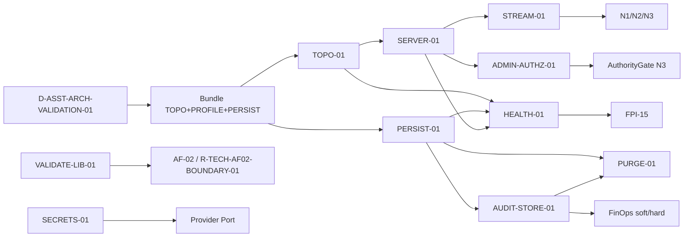

# ChatGPT Review Pack — SFIA Studio Native Assistant OpenAI Technical Architecture Decision Pack Corrections

## 1. Timestamp local et UTC

| Horodatage | Valeur |
|---|---|
| **Consommation Morris** | 2026-08-05 12:48 CEST (+0200) / 2026-08-05 10:48 UTC |
| **Truth Cursor initial** | 2026-08-05 12:55:37 CEST +0200 / 10:55:37 UTC |
| **Final project truth** | voir §46 (horodatage dans le bloc) |

---

## 2. GO Morris exact

```text
GO CORRECTIONS DECISION PACK ARCHITECTURE TECHNIQUE SFIA STUDIO — ASSISTANT SFIA NATIF OPENAI — COMPLETE APPLY GUARDS, SELF-CONTAINED VARIANTS AND REVIEW HANDOFF EVIDENCE
```

Autorité : Morris · autorise uniquement F-DP-01, F-DP-02, F-DP-03 et F-DP-04 · **ne consomme pas** le GO d’application des ADR.

---

## 3. Cycle / profil / typologie

Architecture technique — correction Decision Pack ADR · Standard · EVOL/DOC · Documentation-only

---

## 4. Main

`8dc54db0069eed78a8d8930cc2b035450ab56ad1`

---

## 5. Branche / worktree

`arbitration/sfia-studio-assistant-sfia-native-openai-technical-architecture-decisions` · locale · non poussée

---

## 6. Handoff entrant

| Champ | Valeur |
|---|---|
| Tip | `a21a51b0888bd8853364283334f1a6435d6b8f61` |
| Blob | `c78e1f81f4b4cc3077e73d78070d13c126ba0acc` |
| Message | `docs(review-handoff): publish Assistant SFIA technical architecture decision pack` |
| Parent | `447a75b9b27b9d3c174d024b69f7946a13d2d499` |

---

## 7. Template canonique

Lu depuis Git main : template + routing + operating model + rules + checklist + engineering principles + architect-method.

---

## 8. CKC

`pilots/03-architecture-technique.md` · candidate v0.1.0 · guidance only · aucune autorité.

---

## 9. Publisher consulté

`scripts/sfia/publish-review-handoff.sh` (lecture/exécution uniquement · non modifié) · dry-run obligatoire avant publication.

---

## 10. Sources consultées

Git main (template, méthode, CKC, publisher) · docs 99/100/101 locaux · handoff entrant · GO corrections.

---

## 11. Local Git Truth initial complet

```text
=== LOCAL GIT TRUTH INITIAL — DECISION PACK CORRECTIONS ===
2026-08-05 12:55:37 CEST +0200
2026-08-05 10:55:37 UTC
TOPLEVEL=/Users/morris/Projects/sfia-workspace-t-a7-lot1-post-merge/.tmp-sfia-review/delivery-d2-d1
BRANCH=arbitration/sfia-studio-assistant-sfia-native-openai-technical-architecture-decisions
HEAD=8dc54db0069eed78a8d8930cc2b035450ab56ad1
UPSTREAM=8dc54db0069eed78a8d8930cc2b035450ab56ad1
ORIGIN_MAIN=8dc54db0069eed78a8d8930cc2b035450ab56ad1
MERGE_BASE=8dc54db0069eed78a8d8930cc2b035450ab56ad1
AHEAD=0
BEHIND=0
ORIGIN_HANDOFF=a21a51b0888bd8853364283334f1a6435d6b8f61
--- status --short ---
?? .tmp-sfia-review/
?? projects/sfia-studio/100-assistant-sfia-native-openai-technical-architecture.md
?? projects/sfia-studio/101-assistant-sfia-native-openai-technical-architecture-decision-pack.md
?? projects/sfia-studio/90-assistant-sfia-native-openai-first-product-increment-framing.md
?? projects/sfia-studio/91-assistant-sfia-native-openai-first-product-increment-functional-architecture.md
?? projects/sfia-studio/92-assistant-sfia-native-openai-functional-architecture-decision-pack.md
?? projects/sfia-studio/93-assistant-sfia-native-openai-functional-architecture-decisions-applied.md
?? projects/sfia-studio/94-assistant-sfia-native-openai-ux-ui-contract.md
?? projects/sfia-studio/95-assistant-sfia-native-openai-ux-ui-flows-and-states.md
?? projects/sfia-studio/96-assistant-sfia-native-openai-ux-ui-decision-pack.md
?? projects/sfia-studio/97-assistant-sfia-native-openai-ux-ui-decisions-applied.md
?? projects/sfia-studio/98-assistant-sfia-native-openai-technical-prerequisites-decision-pack.md
?? projects/sfia-studio/99-assistant-sfia-native-openai-technical-prerequisites-decisions-applied.md
?? projects/sfia-studio/app/.tmp-sfia-review/
--- diff name-status ---
--- cached ---
--- diff-check ---
DIFF_CHECK_EXIT:0
--- worktree (scoped) ---
worktree /Users/morris/Projects/sfia-workspace
HEAD e1befcb80ed5e3c789a7de9036a8207d6b3e6771
branch refs/heads/delivery/eventops-poc-visible-slice-01

worktree /Users/morris/Projects/sfia-codex-pilot
HEAD ec7f397a87381a57b8b0c0efbff8c3e98e9dea03
branch refs/heads/method/codex-operating-model-pilot

worktree /Users/morris/Projects/sfia-task-tracker
HEAD b763a318fb84e23e482ed23a0bd561c1d9e719e6
branch refs/heads/cadrage/task-tracker-light

worktree /Users/morris/Projects/sfia-workspace-a5-2-framing
HEAD bd3608c6220e820cc3fa017422a7564a565a1296
branch refs/heads/framing/sfia-studio-v3-native-option-a-a5-2-reservations-authority-atomicity

worktree /Users/morris/Projects/sfia-workspace-cycle-knowledge-contracts
HEAD cae841519ed1d2dd825e6ecb998337cd47b4a1e1
branch refs/heads/method/sfia-cycle-knowledge-contracts

worktree /Users/morris/Projects/sfia-workspace-d1-conversational-convergence
HEAD 7dc6f9fc7e16f13de08a1003b492b0b6e243f05e
branch refs/heads/ux/sfia-studio-d1-conversational-convergence

worktree /Users/morris/Projects/sfia-workspace-d1-platform-integration
HEAD c2d39a7f6881c8d512e48c4b6e9e559ebdf938a9
branch refs/heads/delivery/sfia-studio-d1-shared-platform-integration

worktree /Users/morris/Projects/sfia-workspace-doc32-post-p3-m1
HEAD dd2a68c6a1e45fee1e1f397cb644c2c082a3d877
branch refs/heads/docs/sfia-studio-doc32-post-p3-m1-correction

worktree /Users/morris/Projects/sfia-workspace-docs-recover
HEAD 1a2fa31fab6343bdd0eab7211febb3bcc5326c33
branch refs/heads/docs/sfia-studio-recover-unmerged-project-docs

worktree /Users/morris/Projects/sfia-workspace-fa6-mitigated-clean
HEAD 67f140a19cf4a992dbc0d7b053abfde579a9a68c
branch refs/heads/docs/sfia-studio-fa6-mitigated-from-main

WORKTREE_COUNT=79
--- worktree list --porcelain FULL (same session branch state) ---
worktree /Users/morris/Projects/sfia-workspace
HEAD e1befcb80ed5e3c789a7de9036a8207d6b3e6771
branch refs/heads/delivery/eventops-poc-visible-slice-01

worktree /Users/morris/Projects/sfia-codex-pilot
HEAD ec7f397a87381a57b8b0c0efbff8c3e98e9dea03
branch refs/heads/method/codex-operating-model-pilot

worktree /Users/morris/Projects/sfia-task-tracker
HEAD b763a318fb84e23e482ed23a0bd561c1d9e719e6
branch refs/heads/cadrage/task-tracker-light

worktree /Users/morris/Projects/sfia-workspace-a5-2-framing
HEAD bd3608c6220e820cc3fa017422a7564a565a1296
branch refs/heads/framing/sfia-studio-v3-native-option-a-a5-2-reservations-authority-atomicity

worktree /Users/morris/Projects/sfia-workspace-cycle-knowledge-contracts
HEAD cae841519ed1d2dd825e6ecb998337cd47b4a1e1
branch refs/heads/method/sfia-cycle-knowledge-contracts

worktree /Users/morris/Projects/sfia-workspace-d1-conversational-convergence
HEAD 7dc6f9fc7e16f13de08a1003b492b0b6e243f05e
branch refs/heads/ux/sfia-studio-d1-conversational-convergence

worktree /Users/morris/Projects/sfia-workspace-d1-platform-integration
HEAD c2d39a7f6881c8d512e48c4b6e9e559ebdf938a9
branch refs/heads/delivery/sfia-studio-d1-shared-platform-integration

worktree /Users/morris/Projects/sfia-workspace-doc32-post-p3-m1
HEAD dd2a68c6a1e45fee1e1f397cb644c2c082a3d877
branch refs/heads/docs/sfia-studio-doc32-post-p3-m1-correction

worktree /Users/morris/Projects/sfia-workspace-docs-recover
HEAD 1a2fa31fab6343bdd0eab7211febb3bcc5326c33
branch refs/heads/docs/sfia-studio-recover-unmerged-project-docs

worktree /Users/morris/Projects/sfia-workspace-fa6-mitigated-clean
HEAD 67f140a19cf4a992dbc0d7b053abfde579a9a68c
branch refs/heads/docs/sfia-studio-fa6-mitigated-from-main

worktree /Users/morris/Projects/sfia-workspace-framing-next-increment
HEAD 88fa4658da07156614de270d8172f147535ddbf9
branch refs/heads/framing/sfia-studio-next-product-increment

worktree /Users/morris/Projects/sfia-workspace-m1-bypass-probe
HEAD f0f0e0f5efdd21dc0207736f9c0cce1c563f1a23
branch refs/heads/qa/sfia-studio-m1-bypass-probe

worktree /Users/morris/Projects/sfia-workspace-m1-bypass-probe-revert
HEAD b502c0069f836a729090bdc187dd98a0c26591ca
branch refs/heads/qa/sfia-studio-m1-bypass-probe-revert

worktree /Users/morris/Projects/sfia-workspace-m1-capitalization
HEAD fa0eebe00ce3b765a8a486aa660dddfab40123a0
branch refs/heads/docs/sfia-studio-m1-capitalization-rex

worktree /Users/morris/Projects/sfia-workspace-option-a-after-t-a6
HEAD aef7fd6d5a678857cf36e490f1550866d47c8887
branch refs/heads/framing/sfia-studio-v3-native-option-a-after-t-a6

worktree /Users/morris/Projects/sfia-workspace-option-a-ci-governance
HEAD 2f9560534e285c5b8105f81dca39c5252667860c
branch refs/heads/delivery/sfia-studio-v3-native-option-a-ci-merge-governance

worktree /Users/morris/Projects/sfia-workspace-option-a-ci-governance-docs
HEAD a42a85c0c0b3e146e59f82ea753329ed9253f278
branch refs/heads/docs/sfia-studio-option-a-ci-governance-post-merge

worktree /Users/morris/Projects/sfia-workspace-option-a-path-aware-required-check
HEAD 9f03916243c470587f6958e058fd58909e5bd75a
branch refs/heads/delivery/sfia-studio-v3-native-option-a-path-aware-required-check-preparation

worktree /Users/morris/Projects/sfia-workspace-review-handoff-publisher
HEAD 14d58fe95a8f29c3dc1f72c794a64fedbc795bbe
branch refs/heads/tooling/review-handoff-canonical-publisher

worktree /Users/morris/Projects/sfia-workspace-shared-platform-delivery
HEAD 08c282abafd97685bcc0b7e525ec96e6721ec589
branch refs/heads/delivery/sfia-studio-shared-technical-platform

worktree /Users/morris/Projects/sfia-workspace-t-a6-post-merge
HEAD 1f2585712e460b4ba6267d9e520cd0fd3cea6d3e
branch refs/heads/post-merge/sfia-studio-v3-native-option-a-t-a6

worktree /Users/morris/Projects/sfia-workspace-t-a7-f03-f11-f13-arbitration
HEAD 6849b6f7530310ae669a5bd2e4f4a3f3323ccda6
branch refs/heads/framing/sfia-studio-v3-native-option-a-t-a7-f03-f11-f13-arbitration

worktree /Users/morris/Projects/sfia-workspace-t-a7-f03-f11-f13-readme-post-merge
HEAD 960c90b32b2c1c5701a668b0ebc70fdd847c681b
branch refs/heads/docs/sfia-studio-t-a7-f03-f11-f13-readme-post-merge-status

worktree /Users/morris/Projects/sfia-workspace-t-a7-framing
HEAD b7a5e827fddb7e80f03a71b3b64ca89271ede0a6
branch refs/heads/framing/sfia-studio-v3-native-option-a-t-a7-cutover-preconditions

worktree /Users/morris/Projects/sfia-workspace-t-a7-lot1-post-merge
HEAD 08d6cd0dd1503a7f261bf1fe527dba782d8f27ed
detached

worktree /Users/morris/Projects/sfia-workspace-t-a7-lot1-post-merge/.tmp-sfia-review/delivery-d2-d1
HEAD 8dc54db0069eed78a8d8930cc2b035450ab56ad1
branch refs/heads/arbitration/sfia-studio-assistant-sfia-native-openai-technical-architecture-decisions

worktree /Users/morris/Projects/sfia-workspace-t-a7-lot1-post-merge/.tmp-sfia-review/main-post-merge
HEAD 52c1d753ee890daf04a80ba37b11c6bf077dc307
branch refs/heads/backlog/sfia-studio-v3-1-d2-d-integration-foundation

worktree /Users/morris/Projects/sfia-workspace-t-a7-next-decision
HEAD 33ea3e87facc8c99c9c5619d6d2424030d3918a2
branch refs/heads/framing/sfia-studio-v3-native-option-a-t-a7-next-decision-step

worktree /Users/morris/Projects/sfia-workspace-t-a7-technical-readiness
HEAD b6a19335f5116940175f5986492e3693722563bc
branch refs/heads/framing/sfia-studio-v3-native-option-a-t-a7-technical-readiness

worktree /Users/morris/Projects/sfia-workspace-t-a7-wave-1-decisions
HEAD f89ba5fb6cfca4e3de97667d944569a20266a8aa
branch refs/heads/record/sfia-studio-v3-native-option-a-t-a7-wave-1-decisions

worktree /Users/morris/Projects/sfia-workspace-t-a7-wave-1-legacy-scope
HEAD 4fad47f72a7d6cde655d98a64351bb4624ed9ad1
branch refs/heads/framing/sfia-studio-v3-native-option-a-t-a7-wave-1-legacy-scope

worktree /Users/morris/Projects/sfia-workspace-template-handoff-fix
HEAD 134be301792efbf6f9739d13f0572062ef976da7
detached

worktree /Users/morris/Projects/sfia-workspace-ux-reconciliation
HEAD 7bdabdcc0ea5f760383da190a661250dcd5d2598
branch refs/heads/project/sfia-studio-ux-ui-reconciliation

worktree /Users/morris/Projects/sfia-workspace-v3-doctrine-consolidation
HEAD daf6f7d02bbac09024f6275a793769e66b2b3878
branch refs/heads/method/sfia-studio-v3-doctrine-consolidation

worktree /Users/morris/Projects/sfia-workspace-v3-native-audit
HEAD 56ddf32e811f0f5f8b82f31400da18ceecf3bc30
branch refs/heads/audit/sfia-studio-v3-native-dependencies

worktree /Users/morris/Projects/sfia-workspace-v3-native-option-a-arch
HEAD 577ff0c22491288d2293fd9730ed26f0af4095b0
branch refs/heads/design/sfia-studio-v3-native-option-a-functional-architecture

worktree /Users/morris/Projects/sfia-workspace-v3-native-option-a-design
HEAD e22bc243c8854df4e9422fafe46e92135fe242e9
branch refs/heads/design/sfia-studio-v3-native-option-a-functional

worktree /Users/morris/Projects/sfia-workspace-v3-native-option-a-modeled
HEAD 52891e5c5a9b1254143e422111ea4955ca3a0940
branch refs/heads/modeled/sfia-studio-v3-native-option-a

worktree /Users/morris/Projects/sfia-workspace-v3-native-option-a-tech
HEAD 0b696ed970823aa75d013336e44e72de08f2ac57
branch refs/heads/framing/sfia-studio-v3-native-option-a-t-a6-evidence-review-claims-maturity

worktree /Users/morris/Projects/sfia-workspace-v3-native-option-a-ux
HEAD 608d3d4cb3bee46ef2a533aa9cf94ee427c4cf71
branch refs/heads/design/sfia-studio-v3-native-option-a-ux-ui

worktree /Users/morris/Projects/sfia-workspace/projects/sfia-studio/.sfia-exec/local-i1/worktrees/ops1-xatt-0446bc83-3035-4a0b-9e8d-4661ab748901
HEAD 32e5271842b9a344a7e292614675c27ea8ed941b
branch refs/heads/ops1/action/ops1-xatt-0446bc83-3035-4a0b-9e8d-4661ab748901

worktree /Users/morris/Projects/sfia-workspace/projects/sfia-studio/.sfia-exec/local-i1/worktrees/ops1-xatt-05525a6a-0adf-4462-b129-c5fa182cdb68
HEAD 32e5271842b9a344a7e292614675c27ea8ed941b
branch refs/heads/ops1/action/ops1-xatt-05525a6a-0adf-4462-b129-c5fa182cdb68

worktree /Users/morris/Projects/sfia-workspace/projects/sfia-studio/.sfia-exec/local-i1/worktrees/ops1-xatt-0d572b5f-d153-4240-b98d-d29e9c9b2a89
HEAD 27811e8f5f3747706bbbe417a5dc949a066c9187
branch refs/heads/ops1/action/ops1-xatt-0d572b5f-d153-4240-b98d-d29e9c9b2a89

worktree /Users/morris/Projects/sfia-workspace/projects/sfia-studio/.sfia-exec/local-i1/worktrees/ops1-xatt-2025ea48-d8af-436b-ae71-93923c5523b1
HEAD 32e5271842b9a344a7e292614675c27ea8ed941b
branch refs/heads/ops1/action/ops1-xatt-2025ea48-d8af-436b-ae71-93923c5523b1

worktree /Users/morris/Projects/sfia-workspace/projects/sfia-studio/.sfia-exec/local-i1/worktrees/ops1-xatt-228160ae-0c4b-43c4-8f6e-50eac967ac6f
HEAD 27811e8f5f3747706bbbe417a5dc949a066c9187
branch refs/heads/ops1/action/ops1-xatt-228160ae-0c4b-43c4-8f6e-50eac967ac6f

worktree /Users/morris/Projects/sfia-workspace/projects/sfia-studio/.sfia-exec/local-i1/worktrees/ops1-xatt-266f3e0b-3bc0-48f7-8007-ef9d5b846f10
HEAD 4b279b8af41559c4e6e9c41a481c9c3b76675026
branch refs/heads/ops1/action/ops1-xatt-266f3e0b-3bc0-48f7-8007-ef9d5b846f10

worktree /Users/morris/Projects/sfia-workspace/projects/sfia-studio/.sfia-exec/local-i1/worktrees/ops1-xatt-280d622f-4bf1-402b-a11f-ea56eb4cdc29
HEAD 32e5271842b9a344a7e292614675c27ea8ed941b
branch refs/heads/ops1/action/ops1-xatt-280d622f-4bf1-402b-a11f-ea56eb4cdc29

worktree /Users/morris/Projects/sfia-workspace/projects/sfia-studio/.sfia-exec/local-i1/worktrees/ops1-xatt-360cabed-4c08-4287-80a4-b3374d8bcb56
HEAD 27811e8f5f3747706bbbe417a5dc949a066c9187
branch refs/heads/ops1/action/ops1-xatt-360cabed-4c08-4287-80a4-b3374d8bcb56

worktree /Users/morris/Projects/sfia-workspace/projects/sfia-studio/.sfia-exec/local-i1/worktrees/ops1-xatt-4667d0cb-b88e-4d05-a347-500ee60a1f62
HEAD 4b279b8af41559c4e6e9c41a481c9c3b76675026
branch refs/heads/ops1/action/ops1-xatt-4667d0cb-b88e-4d05-a347-500ee60a1f62

worktree /Users/morris/Projects/sfia-workspace/projects/sfia-studio/.sfia-exec/local-i1/worktrees/ops1-xatt-4d15862f-ee7a-40a1-9122-5317fbda8928
HEAD 27811e8f5f3747706bbbe417a5dc949a066c9187
branch refs/heads/ops1/action/ops1-xatt-4d15862f-ee7a-40a1-9122-5317fbda8928

worktree /Users/morris/Projects/sfia-workspace/projects/sfia-studio/.sfia-exec/local-i1/worktrees/ops1-xatt-5209292d-9a66-44ed-9147-d643402bff14
HEAD 32e5271842b9a344a7e292614675c27ea8ed941b
branch refs/heads/ops1/action/ops1-xatt-5209292d-9a66-44ed-9147-d643402bff14

worktree /Users/morris/Projects/sfia-workspace/projects/sfia-studio/.sfia-exec/local-i1/worktrees/ops1-xatt-5fa98d2a-e3e0-4938-a7f2-56b51452e2fd
HEAD 27811e8f5f3747706bbbe417a5dc949a066c9187
branch refs/heads/ops1/action/ops1-xatt-5fa98d2a-e3e0-4938-a7f2-56b51452e2fd

worktree /Users/morris/Projects/sfia-workspace/projects/sfia-studio/.sfia-exec/local-i1/worktrees/ops1-xatt-6a973429-907f-496a-bcbf-bbeb98ef1539
HEAD 27811e8f5f3747706bbbe417a5dc949a066c9187
branch refs/heads/ops1/action/ops1-xatt-6a973429-907f-496a-bcbf-bbeb98ef1539

worktree /Users/morris/Projects/sfia-workspace/projects/sfia-studio/.sfia-exec/local-i1/worktrees/ops1-xatt-6c1b45e4-ae53-40eb-9bd3-4fbde6a5dc61
HEAD 4b279b8af41559c4e6e9c41a481c9c3b76675026
branch refs/heads/ops1/action/ops1-xatt-6c1b45e4-ae53-40eb-9bd3-4fbde6a5dc61

worktree /Users/morris/Projects/sfia-workspace/projects/sfia-studio/.sfia-exec/local-i1/worktrees/ops1-xatt-71baf16b-92d7-47ae-9094-386fd2e0e66a
HEAD 27811e8f5f3747706bbbe417a5dc949a066c9187
branch refs/heads/ops1/action/ops1-xatt-71baf16b-92d7-47ae-9094-386fd2e0e66a

worktree /Users/morris/Projects/sfia-workspace/projects/sfia-studio/.sfia-exec/local-i1/worktrees/ops1-xatt-725e8c1a-a1dd-4dde-9849-a70b94ab3608
HEAD 27811e8f5f3747706bbbe417a5dc949a066c9187
branch refs/heads/ops1/action/ops1-xatt-725e8c1a-a1dd-4dde-9849-a70b94ab3608

worktree /Users/morris/Projects/sfia-workspace/projects/sfia-studio/.sfia-exec/local-i1/worktrees/ops1-xatt-7758d3ee-2fea-44f4-8fd3-4d4b0adfc3ce
HEAD 27811e8f5f3747706bbbe417a5dc949a066c9187
branch refs/heads/ops1/action/ops1-xatt-7758d3ee-2fea-44f4-8fd3-4d4b0adfc3ce

worktree /Users/morris/Projects/sfia-workspace/projects/sfia-studio/.sfia-exec/local-i1/worktrees/ops1-xatt-7b99ce34-67b0-41ef-8f69-00bab598178d
HEAD 27811e8f5f3747706bbbe417a5dc949a066c9187
branch refs/heads/ops1/action/ops1-xatt-7b99ce34-67b0-41ef-8f69-00bab598178d

worktree /Users/morris/Projects/sfia-workspace/projects/sfia-studio/.sfia-exec/local-i1/worktrees/ops1-xatt-7fcd2560-1298-4275-b771-efe52dd5bdb6
HEAD 32e5271842b9a344a7e292614675c27ea8ed941b
branch refs/heads/ops1/action/ops1-xatt-7fcd2560-1298-4275-b771-efe52dd5bdb6

worktree /Users/morris/Projects/sfia-workspace/projects/sfia-studio/.sfia-exec/local-i1/worktrees/ops1-xatt-80872887-627f-4afa-8f12-a971136a8aa8
HEAD 27811e8f5f3747706bbbe417a5dc949a066c9187
branch refs/heads/ops1/action/ops1-xatt-80872887-627f-4afa-8f12-a971136a8aa8

worktree /Users/morris/Projects/sfia-workspace/projects/sfia-studio/.sfia-exec/local-i1/worktrees/ops1-xatt-8e1adf99-460d-4f61-be9c-fdb06ac287ca
HEAD 4b279b8af41559c4e6e9c41a481c9c3b76675026
branch refs/heads/ops1/action/ops1-xatt-8e1adf99-460d-4f61-be9c-fdb06ac287ca

worktree /Users/morris/Projects/sfia-workspace/projects/sfia-studio/.sfia-exec/local-i1/worktrees/ops1-xatt-91651fa1-4540-4108-adec-1a31768f89d4
HEAD 32e5271842b9a344a7e292614675c27ea8ed941b
branch refs/heads/ops1/action/ops1-xatt-91651fa1-4540-4108-adec-1a31768f89d4

worktree /Users/morris/Projects/sfia-workspace/projects/sfia-studio/.sfia-exec/local-i1/worktrees/ops1-xatt-99be8189-55a3-4a3f-a58f-7ec1ddb64cc0
HEAD 32e5271842b9a344a7e292614675c27ea8ed941b
branch refs/heads/ops1/action/ops1-xatt-99be8189-55a3-4a3f-a58f-7ec1ddb64cc0

worktree /Users/morris/Projects/sfia-workspace/projects/sfia-studio/.sfia-exec/local-i1/worktrees/ops1-xatt-9e7b9d80-d7b9-44dd-903c-aecbd1ae3187
HEAD 27811e8f5f3747706bbbe417a5dc949a066c9187
branch refs/heads/ops1/action/ops1-xatt-9e7b9d80-d7b9-44dd-903c-aecbd1ae3187

worktree /Users/morris/Projects/sfia-workspace/projects/sfia-studio/.sfia-exec/local-i1/worktrees/ops1-xatt-a0b14c48-f99e-4406-ab68-3eaeaef02de7
HEAD 27811e8f5f3747706bbbe417a5dc949a066c9187
branch refs/heads/ops1/action/ops1-xatt-a0b14c48-f99e-4406-ab68-3eaeaef02de7

worktree /Users/morris/Projects/sfia-workspace/projects/sfia-studio/.sfia-exec/local-i1/worktrees/ops1-xatt-bbe95b44-c568-4d95-974d-688efebe37b7
HEAD 27811e8f5f3747706bbbe417a5dc949a066c9187
branch refs/heads/ops1/action/ops1-xatt-bbe95b44-c568-4d95-974d-688efebe37b7

worktree /Users/morris/Projects/sfia-workspace/projects/sfia-studio/.sfia-exec/local-i1/worktrees/ops1-xatt-beed0515-1a82-452b-bdae-646d3c9e8846
HEAD 32e5271842b9a344a7e292614675c27ea8ed941b
branch refs/heads/ops1/action/ops1-xatt-beed0515-1a82-452b-bdae-646d3c9e8846

worktree /Users/morris/Projects/sfia-workspace/projects/sfia-studio/.sfia-exec/local-i1/worktrees/ops1-xatt-bffb454e-caf5-4fec-ac8f-514e313d475e
HEAD 32e5271842b9a344a7e292614675c27ea8ed941b
branch refs/heads/ops1/action/ops1-xatt-bffb454e-caf5-4fec-ac8f-514e313d475e

worktree /Users/morris/Projects/sfia-workspace/projects/sfia-studio/.sfia-exec/local-i1/worktrees/ops1-xatt-c9b1dda7-ad0d-4d41-bc16-e5f9c8a58700
HEAD 27811e8f5f3747706bbbe417a5dc949a066c9187
branch refs/heads/ops1/action/ops1-xatt-c9b1dda7-ad0d-4d41-bc16-e5f9c8a58700

worktree /Users/morris/Projects/sfia-workspace/projects/sfia-studio/.sfia-exec/local-i1/worktrees/ops1-xatt-ce0e117d-1c6d-4ac4-97a9-bb303bdead9c
HEAD 32e5271842b9a344a7e292614675c27ea8ed941b
branch refs/heads/ops1/action/ops1-xatt-ce0e117d-1c6d-4ac4-97a9-bb303bdead9c

worktree /Users/morris/Projects/sfia-workspace/projects/sfia-studio/.sfia-exec/local-i1/worktrees/ops1-xatt-cfacc578-e3ce-4628-9a18-0c1f29ce0fa4
HEAD 32e5271842b9a344a7e292614675c27ea8ed941b
branch refs/heads/ops1/action/ops1-xatt-cfacc578-e3ce-4628-9a18-0c1f29ce0fa4

worktree /Users/morris/Projects/sfia-workspace/projects/sfia-studio/.sfia-exec/local-i1/worktrees/ops1-xatt-d790f0e1-2a6b-40ab-8dc8-f3006efdbaca
HEAD 27811e8f5f3747706bbbe417a5dc949a066c9187
branch refs/heads/ops1/action/ops1-xatt-d790f0e1-2a6b-40ab-8dc8-f3006efdbaca

worktree /Users/morris/Projects/sfia-workspace/projects/sfia-studio/.sfia-exec/local-i1/worktrees/ops1-xatt-e8e66e7a-f871-40a2-b38d-3327a128a353
HEAD 27811e8f5f3747706bbbe417a5dc949a066c9187
branch refs/heads/ops1/action/ops1-xatt-e8e66e7a-f871-40a2-b38d-3327a128a353

worktree /Users/morris/Projects/sfia-workspace/projects/sfia-studio/.sfia-exec/local-i1/worktrees/ops1-xatt-ebfb42b9-b99d-4d49-9be3-e19fe1aef050
HEAD 27811e8f5f3747706bbbe417a5dc949a066c9187
branch refs/heads/ops1/action/ops1-xatt-ebfb42b9-b99d-4d49-9be3-e19fe1aef050

worktree /Users/morris/Projects/sfia-workspace/projects/sfia-studio/.sfia-exec/local-i1/worktrees/ops1-xatt-edde6803-63bb-440e-ab9d-1d5059e1379b
HEAD 4b279b8af41559c4e6e9c41a481c9c3b76675026
branch refs/heads/ops1/action/ops1-xatt-edde6803-63bb-440e-ab9d-1d5059e1379b

worktree /Users/morris/Projects/sfia-workspace/projects/sfia-studio/.sfia-exec/local-i1/worktrees/ops1-xatt-f3be6fd0-79ce-44fa-b5bc-0df452a468a2
HEAD 27811e8f5f3747706bbbe417a5dc949a066c9187
branch refs/heads/ops1/action/ops1-xatt-f3be6fd0-79ce-44fa-b5bc-0df452a468a2

worktree /Users/morris/Projects/sfia-workspace/projects/sfia-studio/.sfia-exec/local-i1/worktrees/ops1-xatt-f9349af8-03f1-4049-947d-b9ceb58d7230
HEAD 27811e8f5f3747706bbbe417a5dc949a066c9187
branch refs/heads/ops1/action/ops1-xatt-f9349af8-03f1-4049-947d-b9ceb58d7230

worktree /Users/morris/Projects/sfia-workspace/projects/sfia-studio/.sfia-exec/local-i1/worktrees/ops1-xatt-fc8ba3a6-097e-4d70-8d1f-f154c55080f0
HEAD 4b279b8af41559c4e6e9c41a481c9c3b76675026
branch refs/heads/ops1/action/ops1-xatt-fc8ba3a6-097e-4d70-8d1f-f154c55080f0

worktree /Users/morris/Projects/sfia-workspace/sfia-review-handoff
HEAD a21a51b0888bd8853364283334f1a6435d6b8f61
branch refs/heads/sfia/review-handoff
```

---

## 12. Hash/lignes document 100

| Item | Valeur |
|---|---|
| SHA-256 | `9244ec46bc7b0ea212c03f1e59f05f80521e87c6a8e27c07de801e10b8e2cc20` |
| Lignes | 1432 |
| Mutation ce cycle | **Aucune** |

---

## 13. Hash/lignes document 101 avant

| Item | Valeur |
|---|---|
| SHA-256 | `5600a5306dae36115386d8f21dde144aad36e52e94b6a42665289812d2c79dc7` |
| Lignes | 1083 |

---

## 14. EMBED_MATCH

**PASS** — contenu intégral du document 101 extrait du handoff entrant `a21a51b0…` / blob `c78e1f81…` identique au fichier local (rstrip).

---

## 15. Copie immuable avant

`.tmp-sfia-review/architecture-decisions/101-before-corrections.md` · SHA-256 `5600a5306dae36115386d8f21dde144aad36e52e94b6a42665289812d2c79dc7` · **non modifiée après création**.

---

## 16. F-DP-01

Appliqué — sections BACKLOG / DELIVERY ajoutées en fin du bloc Morris vide §47 · placeholders inchangés · aucune valeur candidate injectée.

---

## 17. Section §47 corrigée complète

`````markdown
## 47. Bloc Morris vide

```text
GO DECISIONS ARCHITECTURE TECHNIQUE SFIA STUDIO — ASSISTANT SFIA NATIF OPENAI — APPLY SELECTED ARCHITECTURE AND ADR OPTIONS

ARCHITECTURE
D-ASST-ARCH-VALIDATION-01=<A|B|C>

BUNDLE
ARCH-BUNDLE=<A1|A2|B1|C>
DEPLOYMENT-PROFILE=<VALUE>
CONSTRAINTS-ACCEPTED=<EXPLICIT_LIST>

ADR
ADR-ASST-TOPO-01=<A|B|C>
ADR-ASST-PERSIST-01=<A|B|C>
ADR-ASST-SERVER-01=<A|B|C>
ADR-ASST-PURGE-01=<A|B|C>
ADR-ASST-AUDIT-STORE-01=<A|B>
ADR-ASST-STREAM-01=<A|B|C>
ADR-ASST-VALIDATE-LIB-01=<A|B|C>
ADR-ASST-SECRETS-01=<A|B>
ADR-ASST-ADMIN-AUTHZ-01=<A|B|C>
ADR-ASST-HEALTH-01=<A|B|C>

NORMALIZED-SETS
ADMIN-AUTHZ-OPTION-SET=NORMALIZED-A-B-C
HEALTH-OPTION-SET=NORMALIZED-A-B-C

RESERVES
R-TECH-TTL-01=KEEP-OPEN
R-TECH-FINOPS-HARD-01=KEEP-OPEN
R-TECH-AF02-BOUNDARY-01=KEEP-OPEN
R-UX-FPI-02=KEEP-OPEN
R-UX-FPI-03=KEEP-OPEN
R-UX-FPI-04=KEEP-OPEN
R-UX-04=KEEP-OPEN

DEFERRED
FPI-14-HARD-CAP=DEFER-BEFORE-PILOT
FPI-08-TTL-DURATION=CONFIG-ADMIN-NO-VALUE

BACKLOG
BACKLOG-GATE=NOT-CONSUMED

DELIVERY
DELIVERY-GATE=NOT-CONSUMED
```

---
`````

---

## 18. F-DP-02

Appliqué — variantes V1 et V2 transformées en GO complets autonomes avec en-tête GO, ARCHITECTURE, BUNDLE, ADR, NORMALIZED-SETS, RESERVES, DEFERRED, BACKLOG, DELIVERY + marqueur CANDIDATE ONLY.

---

## 19. Section §48 corrigée complète

`````markdown
## 48. Variantes préremplies candidates

Les variantes ci-dessous sont des **GO complets autonomes**, directement copiables. Elles ne consomment aucune décision tant que Morris n’a pas fourni un GO apply explicite.

### Variante V1 — A1 (principale candidate)

```text
GO DECISIONS ARCHITECTURE TECHNIQUE SFIA STUDIO — ASSISTANT SFIA NATIF OPENAI — APPLY SELECTED ARCHITECTURE AND ADR OPTIONS

ARCHITECTURE
D-ASST-ARCH-VALIDATION-01=B

BUNDLE
ARCH-BUNDLE=A1
DEPLOYMENT-PROFILE=DURABLE_MONO_INSTANCE_SINGLE_WRITER
CONSTRAINTS-ACCEPTED=durable-volume;non-ephemeral-fs;single-writer;lock-or-serialize;backup-restore;purge-compatible-backups;migration-strategy-to-external

ADR
ADR-ASST-TOPO-01=A
ADR-ASST-PERSIST-01=A
ADR-ASST-SERVER-01=C
ADR-ASST-PURGE-01=C
ADR-ASST-AUDIT-STORE-01=B
ADR-ASST-STREAM-01=A
ADR-ASST-VALIDATE-LIB-01=A
ADR-ASST-SECRETS-01=A
ADR-ASST-ADMIN-AUTHZ-01=B
ADR-ASST-HEALTH-01=C

NORMALIZED-SETS
ADMIN-AUTHZ-OPTION-SET=NORMALIZED-A-B-C
HEALTH-OPTION-SET=NORMALIZED-A-B-C

RESERVES
R-TECH-TTL-01=KEEP-OPEN
R-TECH-FINOPS-HARD-01=KEEP-OPEN
R-TECH-AF02-BOUNDARY-01=KEEP-OPEN
R-UX-FPI-02=KEEP-OPEN
R-UX-FPI-03=KEEP-OPEN
R-UX-FPI-04=KEEP-OPEN
R-UX-04=KEEP-OPEN

DEFERRED
FPI-14-HARD-CAP=DEFER-BEFORE-PILOT
FPI-08-TTL-DURATION=CONFIG-ADMIN-NO-VALUE

BACKLOG
BACKLOG-GATE=NOT-CONSUMED

DELIVERY
DELIVERY-GATE=NOT-CONSUMED
```

CANDIDATE ONLY —
NOT EXECUTED —
MORRIS EXPLICIT GO REQUIRED

### Variante V2 — A2 (repli)

```text
GO DECISIONS ARCHITECTURE TECHNIQUE SFIA STUDIO — ASSISTANT SFIA NATIF OPENAI — APPLY SELECTED ARCHITECTURE AND ADR OPTIONS

ARCHITECTURE
D-ASST-ARCH-VALIDATION-01=B

BUNDLE
ARCH-BUNDLE=A2
DEPLOYMENT-PROFILE=EPHEMERAL_SERVERLESS_OR_MULTI_INSTANCE
CONSTRAINTS-ACCEPTED=external-durable-store;explicit-concurrency;no-embedded

ADR
ADR-ASST-TOPO-01=A
ADR-ASST-PERSIST-01=B
ADR-ASST-SERVER-01=C
ADR-ASST-PURGE-01=C
ADR-ASST-AUDIT-STORE-01=B
ADR-ASST-STREAM-01=A
ADR-ASST-VALIDATE-LIB-01=A
ADR-ASST-SECRETS-01=A
ADR-ASST-ADMIN-AUTHZ-01=B
ADR-ASST-HEALTH-01=C

NORMALIZED-SETS
ADMIN-AUTHZ-OPTION-SET=NORMALIZED-A-B-C
HEALTH-OPTION-SET=NORMALIZED-A-B-C

RESERVES
R-TECH-TTL-01=KEEP-OPEN
R-TECH-FINOPS-HARD-01=KEEP-OPEN
R-TECH-AF02-BOUNDARY-01=KEEP-OPEN
R-UX-FPI-02=KEEP-OPEN
R-UX-FPI-03=KEEP-OPEN
R-UX-FPI-04=KEEP-OPEN
R-UX-04=KEEP-OPEN

DEFERRED
FPI-14-HARD-CAP=DEFER-BEFORE-PILOT
FPI-08-TTL-DURATION=CONFIG-ADMIN-NO-VALUE

BACKLOG
BACKLOG-GATE=NOT-CONSUMED

DELIVERY
DELIVERY-GATE=NOT-CONSUMED
```

CANDIDATE ONLY —
NOT EXECUTED —
MORRIS EXPLICIT GO REQUIRED

---
`````

---

## 20. Preuve que V1 est autonome

V1 contient : en-tête GO apply · ARCHITECTURE · BUNDLE · ADR · NORMALIZED-SETS · RESERVES · DEFERRED · BACKLOG · DELIVERY · `BACKLOG-GATE=NOT-CONSUMED` · `DELIVERY-GATE=NOT-CONSUMED` · marqueur `CANDIDATE ONLY — NOT EXECUTED — MORRIS EXPLICIT GO REQUIRED`.

---

## 21. Preuve que V2 est autonome

V2 contient le même ensemble de sections que V1, avec `ARCH-BUNDLE=A2`, `DEPLOYMENT-PROFILE=EPHEMERAL_SERVERLESS_OR_MULTI_INSTANCE`, `ADR-ASST-PERSIST-01=B` et les mêmes garde-fous Backlog/Delivery.

---

## 22. Preuve BACKLOG-GATE=NOT-CONSUMED

Présent dans §47, V1 et V2.

---

## 23. Preuve DELIVERY-GATE=NOT-CONSUMED

Présent dans §47, V1 et V2.

---

## 24. Options ADR inchangées

Core §2–§46 **byte-identique** avant/après · options A/B/C (et A/B pour AUDIT/SECRETS) inchangées · normalisations ADMIN-AUTHZ et HEALTH inchangées.

---

## 25. Recommandations inchangées

VALIDATION=B · Bundle primaire A1 / repli A2 · TOPO=A · PERSIST=A|B · SERVER=C · PURGE=C · AUDIT=B · STREAM=A · VALIDATE-LIB=A · SECRETS=A · ADMIN-AUTHZ=B · HEALTH=C — toutes **NOT DECIDED**.

---

## 26. Réserves inchangées

R-TECH-TTL-01 · R-TECH-FINOPS-HARD-01 · R-TECH-AF02-BOUNDARY-01 · R-UX-FPI-02/03/04 · R-UX-04 = KEEP-OPEN.

---

## 27. Différés inchangés

FPI-14-HARD-CAP=DEFER-BEFORE-PILOT · FPI-08-TTL-DURATION=CONFIG-ADMIN-NO-VALUE.

---

## 28. Document 101 corrigé

`projects/sfia-studio/101-assistant-sfia-native-openai-technical-architecture-decision-pack.md`

---

## 29. Contenu intégral du document 101 corrigé

`````markdown
# SFIA Studio — Assistant SFIA natif OpenAI — Technical Architecture Decision Pack

## 1. Statut

**TECHNICAL ARCHITECTURE ADR DECISION PACK READY —**
**F-DP-01, F-DP-02, F-DP-03 AND F-DP-04 CORRECTIONS APPLIED —**
**NO ADR CONSUMED —**
**MORRIS SELECTION REQUIRED**

| Champ | Valeur |
|---|---|
| **Document** | `projects/sfia-studio/101-assistant-sfia-native-openai-technical-architecture-decision-pack.md` |
| **Rôle** | Pack d’arbitrage — prépare les décisions ; **ne les prend pas** |
| **Corrections** | F-DP-01 (§47 BACKLOG/DELIVERY) · F-DP-02 (§48 variantes autonomes) · F-DP-03/F-DP-04 (Review Pack / handoff evidence) |
| **Document 100** | Inchangé · candidat corrigé |
| **ADR** | Toutes **NOT DECIDED** |
| **Architecture baseline** | Non |
| **Bundle sélectionné** | Non |
| **Backlog / Delivery** | Explicitement `NOT-CONSUMED` dans tout bloc apply · non ouverts |
| **Code / modèle nommé / platforme** | Aucun |

---

## 2. GO Morris

```text
GO DECISIONS ARCHITECTURE TECHNIQUE SFIA STUDIO — ASSISTANT SFIA NATIF OPENAI — VALIDATE CORRECTED CANDIDATE ARCHITECTURE AND SELECT ADR OPTIONS
```

**Autorité :** Morris · **Consommation :** 2026-08-05 12:32 CEST (+0200) / 2026-08-05 10:32 UTC

**Interprétation obligatoire :** préparer le Decision Pack et les recommandations candidates · **aucune** sélection tant que Morris n’a pas fourni les valeurs explicites · le libellé « SELECT ADR OPTIONS » **ne consomme pas** les ADR.

---

## 3. Timestamp

| Horodatage | Valeur |
|---|---|
| **Consommation Morris (local)** | 2026-08-05 12:32 CEST (+0200) |
| **Consommation Morris (UTC)** | 2026-08-05 10:32 UTC |
| **Rédaction Cursor (local)** | 2026-08-05 12:38:22 CEST +0200 |
| **Rédaction Cursor (UTC)** | 2026-08-05 10:38:22 UTC |

---

## 4. Cycle / profil

| Champ | Valeur |
|---|---|
| **Cycle** | Architecture technique — arbitrage des décisions et ADR |
| **Profil** | Standard |
| **Typologie** | EVOL / DOC |
| **Nature** | Documentation-only |
| **Doctrine** | SFIA v2.6 · SFIA Studio v3 |

---

## 5. Sources et hiérarchie

1. Git main (état technique réel).
2. Décisions Morris 93 / 97 / 99.
3. Document 100 corrigé (Architecture + ADR candidates).
4. Contrats 90–96.
5. Decision Pack 98 (contexte).
6. CKC Architecture technique candidate v0.1.0 — guidance sans autorité.
7. Hypothèses marquées.

---

## 6. Git / handoff

| Item | Valeur |
|---|---|
| **origin/main** | `8dc54db0069eed78a8d8930cc2b035450ab56ad1` |
| **Branche locale** | `arbitration/sfia-studio-assistant-sfia-native-openai-technical-architecture-decisions` (non poussée) |
| **Handoff tip autoritatif** | `447a75b9b27b9d3c174d024b69f7946a13d2d499` |
| **Handoff blob** | `efa6e112ec7f9356ffd8c189dc29ac596b35e7df` |
| **Document 100 dans handoff** | Présent intégralement (EMBED_MATCH) |
| **AF-04** | B (déjà DECIDED) — mono-commit **requis** pour ce cycle |

---

## 7. Régularisation précédente limitée

Le tip `447a75b9…` a été accepté par Morris après régularisation du cycle correctif.

Waivers **du cycle précédent uniquement** (non hérités) :
- AF-04-MONO-COMMIT ;
- COMPLETE-RAW-DIFF-IN-HANDOFF ;
- LOCAL-GIT-TRUTH-FINAL-IN-HANDOFF.

**NO-PRECEDENT** · **NO-METHOD-CHANGE** · le présent cycle n’est **pas** dispensé du handoff mono-commit normal.

---

## 8. Documents 90–100 et hashes

| Doc | SHA-256 | Lignes | Mutation |
|---|---|---|---|
| 90 | `2d5a03f366e5291e54b6617ada972158763199bf918bea01f031d4212b1a78b2` | 694 | Aucune |
| 91 | `0517aa6c3091f63f0b5c69d40d123fa715dbfb4429d02681ea0398a9588e83e1` | 730 | Aucune |
| 92 | `0af5a9063705859abddceea0f1f5184b55c35a04e94b71648b139bb592c841d4` | 473 | Aucune |
| 93 | `6466f1620d1db65f065fcaf5de25d36cc6af5180f7be786649fbc57521bf4428` | 309 | Aucune |
| 94 | `14572223a00beb038014379a75a3fd2cdb1bb016ef7de436894c0886ac1887be` | 338 | Aucune |
| 95 | `35e829ccc75c31b3a190f6e3015e01f610350c2109f40d32988e6d11d0b2be0d` | 236 | Aucune |
| 96 | `24da72cfabc77c43fd6db7fdc470935a4f24898653d398c6328f81a5c920d46d` | 172 | Aucune |
| 97 | `c18a902159a41cf568e7cabdad0420b51da56a34db445fcb8e07e986df49e47f` | 518 | Aucune |
| 98 | `5794689f826a3abf24b9949e637c3d56fbe64189b23ab294aa682649225558c6` | 1136 | Aucune |
| 99 | `d2a72120b80768cb354a2fedb9b2fc5ec36033ad52e8e97bd449c2b6ce4ef23e` | 608 | Aucune |
| 100 | `9244ec46bc7b0ea212c03f1e59f05f80521e87c6a8e27c07de801e10b8e2cc20` | 1432 | **Inchangé** |
| **101** | voir rapport Cursor | — | **Créé** |

Document 100 statut : **CANDIDATE … CORRECTIONS F-ARCH-01/02/03 APPLIED … MORRIS VALIDATION REQUIRED** · 14 Mermaid · F-ARCH PASS · ADR NOT DECIDED.

---

## 9. Décisions déjà validées

**AF (93) :** FPI-04=D · FPI-05=C · FPI-06=D · FPI-11=ACCEPT · AF-03=C · AF-04=B

**UX (97) :** UX-01…10 DECIDED · R-DEC-AF-01 CLOSED BY MORRIS

**Prérequis (99) :** AF-01=C · AF-02=C · FPI-02/03/07/08/09/10/14/15 · normalisations AF-02-C et FPI-10-B

**Corrections :** F-ARCH-01 · F-ARCH-02 · F-ARCH-03 — **ne pas rouvrir**.

---

## 10. Réserves ouvertes

| ID | Statut | Proposition pack |
|---|---|---|
| R-TECH-TTL-01 | OPEN BY MORRIS | Maintenir · gate avant pilote/RGPD · liée PURGE |
| R-TECH-FINOPS-HARD-01 | OPEN BY MORRIS | Maintenir · MUST BEFORE PILOT · liée AUDIT/FinOps |
| R-TECH-AF02-BOUNDARY-01 | OPEN BY MORRIS | Maintenir · liée VALIDATE-LIB / classification |
| R-UX-FPI-02/03/04 | OPEN | Maintenir · hors ADR Tech |
| R-UX-04 | OPEN | Maintenir |

Aucune réserve fermée/ouverte/renommée. Toute nouvelle réserve éventuelle : **CANDIDATE — NOT OPENED — MORRIS DECISION REQUIRED**.

---

## 11. Objet du Decision Pack

Permettre à Morris de :
1. valider / valider avec réserves / refuser l’Architecture 100 ;
2. sélectionner les 10 ADR ;
3. choisir un bundle topologie/profil/persist **non ambigu** ;
4. accepter explicitement les contraintes du bundle ;
5. maintenir/préciser réserves et différés ;
6. voir impacts NFR / Backlog / pilote ;
7. disposer d’un bloc prêt à copier.

**Ce cycle ne consomme aucune ADR.**

---

## 12. Validation globale de l’Architecture

### D-ASST-ARCH-VALIDATION-01

| Champ | Valeur |
|---|---|
| **ID** | `D-ASST-ARCH-VALIDATION-01` (**candidat** — pas une décision préexistante) |
| **Question** | Statut du document 100 pour le FPI ? |
| **Statut** | **NOT DECIDED — MORRIS DECISION REQUIRED** |

| Opt | Signification |
|---|---|
| **A** | VALIDATE — Architecture acceptée comme cible sous ADR sélectionnées |
| **B** | VALIDATE WITH RESERVES — acceptée avec réserves et gates futures |
| **C** | REJECT / REWORK — motifs et sections à reprendre |

**Recommandation candidate :** **B**

**Statut :** RECOMMENDATION CANDIDATE — NOT DECIDED — MORRIS DECISION REQUIRED

**Justification :** TTL numérique ouvert · hard cap FinOps ouvert · frontière AF-02 ouverte · ADR d’implémentation encore à sélectionner · sécurité/RGPD/FinOps non validés pour le pilote · document 100 cohérent avec repo et F-ARCH-01/02/03.

**Vérifications favorables (observation) :** cohérence repo fixtures-only + libs · décisions 93/97/99 · N1/N2/N3 + AuthorityGate · audit provider transverse · topologie/persist bornés · pas de modèle nommé · pas de claim multi-instance · pas de Delivery implicite.

Distinct des options ADR individuelles.

---

## 13. Matrice des ADR

| ID | Options | Reco candidate | Bundle impact |
|---|---|---|---|
| ADR-ASST-TOPO-01 | A/B/C | **A** | A1/A2/B1/C |
| ADR-ASST-PERSIST-01 | A/B/C | **A si A1 sinon B** | A1/A2/B1 |
| ADR-ASST-SERVER-01 | A/B/C | **C** | tous |
| ADR-ASST-PURGE-01 | A/B/C | **C** | tous |
| ADR-ASST-AUDIT-STORE-01 | A/B | **B** | tous |
| ADR-ASST-STREAM-01 | A/B/C | **A** | tous |
| ADR-ASST-VALIDATE-LIB-01 | A/B/C | **A** | tous |
| ADR-ASST-SECRETS-01 | A/B | **A** (B trajectoire) | tous |
| ADR-ASST-ADMIN-AUTHZ-01 | A/B/C (norm.) | **B** | tous |
| ADR-ASST-HEALTH-01 | A/B/C (norm.) | **C** | tous |

Toutes : **ADR CANDIDATE — NOT DECIDED — MORRIS DECISION REQUIRED**

---

## 14. Matrice gates

| Décision | Gate de sélection | Gate d’implémentation | Gate pilote |
|---|---|---|---|
| D-ASST-ARCH-VALIDATION-01 | Present GO apply | — | — |
| Bundle TOPO+PROFILE+PERSIST | Present apply | Delivery setup | Env check |
| SERVER / ADMIN-AUTHZ / HEALTH | Present apply | Impl Prep | Authz live |
| AUDIT-STORE / PURGE | Present apply | Impl | RGPD/TTL |
| STREAM / VALIDATE-LIB / SECRETS | Present apply | Impl Prep | Provider live |
| R-TECH-TTL-01 | Future | — | Avant pilote/RGPD |
| R-TECH-FINOPS-HARD-01 | Future | — | **MUST BEFORE PILOT** |
| R-TECH-AF02-BOUNDARY-01 | Future / Tech detail | Impl | — |

---

## 15. Matrice dépendances


```mermaid
flowchart LR
  VAL[D-ASST-ARCH-VALIDATION-01] --> BND[Bundle TOPO+PROFILE+PERSIST]
  BND --> TOPO[TOPO-01]
  BND --> PERS[PERSIST-01]
  TOPO --> SERV[SERVER-01]
  TOPO --> HLTH[HEALTH-01]
  PERS --> PURGE[PURGE-01]
  PERS --> AUD[AUDIT-STORE-01]
  PERS --> HLTH
  SERV --> STR[STREAM-01]
  SERV --> ADM[ADMIN-AUTHZ-01]
  SERV --> HLTH
  AUD --> PURGE
  AUD --> FIN[FinOps soft/hard]
  VALIB[VALIDATE-LIB-01] --> AF02[AF-02 / R-TECH-AF02-BOUNDARY-01]
  ADM --> N3[AuthorityGate N3]
  HLTH --> FPI15[FPI-15]
  STR --> N123[N1/N2/N3]
  SEC[SECRETS-01] --> PP[Provider Port]
```

| Lien | Nature | Maître | Ordre | Compatible | Contradiction | Dette | Stop |
|---|---|---|---|---|---|---|---|
| TOPO ↔ PERSIST | Structurelle | Joint bundle | 2 | A1/A2/B1 | TOPO=A+PERSIST=A sans profil | Migration | Bloquer combo ambiguë |
| TOPO ↔ SERVER | Frontière | TOPO | 3 | A+hybrid | Service séparé sans SERVER clair | — | — |
| TOPO ↔ HEALTH | Ops | TOPO+profil | 10 | profil-aware | Health bloquante provider vs FPI-15 N1 | — | — |
| PERSIST ↔ PURGE | Données | PERSIST | 6 | hybride | Purge sans store durable | Orphans | — |
| PERSIST ↔ AUDIT | Données | PERSIST | 5 | lane logique B | Même lane = confusion F-ARCH-02 | — | — |
| PERSIST ↔ HEALTH | Ops | PERSIST | 10 | readiness store | — | — | — |
| SERVER ↔ STREAM | API | SERVER | 7 | N1 stream | Stream N2/N3 vs fail-closed | — | — |
| SERVER ↔ ADMIN-AUTHZ | Autorité | SERVER | 4 | AG serveur | Client-only authz | Spoof | — |
| SERVER ↔ HEALTH | Ops | SERVER | 10 | handlers health | — | — | — |
| AUDIT ↔ PURGE | Conformité | Joint | 5–6 | — | Purge effaçant audit requis | RGPD | — |
| AUDIT ↔ FINOPS | Metering | AUDIT lane | — | attempt lane | Metering conditionné métier | F-ARCH-02 | — |
| VALIDATE-LIB ↔ AF-02 | Contrat | AF-02 décidé | 8 | ajv study | Lib ≠ schéma métier | — | — |
| ADMIN-AUTHZ ↔ N3 AG | Autorité | ADMIN | 4 | B | Provider valide GO | F-ARCH-01 | — |
| HEALTH ↔ FPI-15 | Résilience | FPI-15 | 10 | probe non bloquante | Readiness provider bloque N1 dégradé | — | — |
| STREAM ↔ N1/N2/N3 | UX/contrat | AF-02/UX | 7 | N1 only | Stream structurant partiel | — | — |
| SECRETS ↔ Provider Port | Sécu | SECRETS | 9 | server-only | Secret browser | — | — |
| ADR ↔ bundles | Structure | Bundle | 2 | A1/A2/B1 | C sans NFR | — | — |

**Ordre candidat (challengé) :**
1. Validation Architecture
2. Bundle TOPO + profil + PERSIST
3. SERVER
4. ADMIN-AUTHZ
5. AUDIT-STORE
6. PURGE
7. STREAM
8. VALIDATE-LIB
9. SECRETS
10. HEALTH

**Challenge :** ADMIN-AUTHZ avant AUDIT est justifié par AuthorityGate N3 (F-ARCH-01). HEALTH en dernier évite de figer une readiness provider bloquante avant STREAM/SECRETS. **Ordre retenu comme candidat** — Morris peut le réordonner sans consommer d’ADR ici.

---

## 16. Bundles A1 / A2 / B1 / C

### Bundle A1
- TOPO-01=**A** · `DEPLOYMENT-PROFILE=DURABLE_MONO_INSTANCE_SINGLE_WRITER` · PERSIST-01=**A**
- Conditions : volume durable · FS non éphémère · verrouillage/sérialisation · backup/restore · purge↔backups · stratégie migration externe · **contraintes acceptées explicitement**

### Bundle A2
- TOPO-01=**A** · `DEPLOYMENT-PROFILE=EPHEMERAL_SERVERLESS_OR_MULTI_INSTANCE` · PERSIST-01=**B**
- Store externe durable · concurrence/coordination explicites

### Bundle B1
- TOPO-01=**B** · `DEPLOYMENT-PROFILE=SEPARATE_BACKEND_SERVICE` · PERSIST-01=**B**
- Store externe ou géré par le service

### Option C
- TOPO-01=**C** · store coordonné externe · forte complexité · **non recommandé FPI** sans NFR démontré

---

## 17. Comparaison des bundles

| Critère | A1 | A2 | B1 | C |
|---|---|---|---|---|
| Adéquation FPI | Haute si contraintes OK | Haute | Moyenne | Basse |
| Compatibilité repo | Haute | Haute + store | Faible (pas de service actuel) | Très faible |
| Complexité ops | Basse | Moyenne | Élevée | Très élevée |
| Sécurité secrets | Server-only OK | OK + store | OK | Variable |
| RGPD/purge | Faisable | Faisable | Faisable | Complexe |
| Multi-instance | **Non** | Oui via externe | Oui | Oui |
| Serverless | **Non** | Oui | Possible | — |
| Dette | Migration vers A2 | Ops store | Dual deploy | Astronaut |
| Réversibilité | Vers A2 | Vers B1 | Coûteuse | Faible |
| Reco | **Principale si contraintes acceptées** | **Repli** | Surdimensionné FPI | Écarter |

**Recommandation candidate principale :** A1 **si** Morris accepte **toutes** les contraintes.

**Recommandation candidate de repli :** A2 si contraintes A1 non garanties.

**Ne pas choisir automatiquement entre A1 et A2.** Statut : RECOMMENDATION CANDIDATE — NOT DECIDED — MORRIS DECISION REQUIRED

---

## 18. ADR-ASST-TOPO-01

### ADR-ASST-TOPO-01 — Topologie

| Champ | Valeur |
|---|---|
| **ID** | `ADR-ASST-TOPO-01` |
| **Question** | Quelle topologie doit porter le FPI ? |
| **Statut** | **ADR CANDIDATE — NOT DECIDED — MORRIS DECISION REQUIRED** |
| **Gate** | Décisions Architecture technique |
| **Source** | Document 100 §58 · GO courant |
| **Origine options** | Document 100 §18–19 / §58 |

**Options :**

| Opt | Définition |
|---|---|
| **A** | modular monolith Next.js |
| **B** | frontend Next.js + service backend séparé |
| **C** | architecture distribuée / event-driven |

**Recommandation candidate :** **A** — modular monolith sous profil de déploiement explicite

**Statut recommandation :** RECOMMENDATION CANDIDATE — NOT DECIDED — MORRIS DECISION REQUIRED

**Justification candidate :** Stack Next 15 déjà présente · ports AI/Git/security existants · B/C sans besoin FPI démontré · AF-01 refuse bus imposé · trajectoire vers B possible si ports propres.

**Avantages / limites / risques (synthèse) :** voir NFR et impacts transverses §29–40 ; détails bundle §16–17.

**Dépendances / incompatibilités :** matrice §15.

**Réserves liées :** voir §41.

**Formulation Morris :** `ADR-ASST-TOPO-01=<lettre>`

**Analyse :**
| Dimension | A | B | C |
|---|---|---|---|
| Adéquation FPI | Haute | Moyenne | Basse |
| Compatibilité repo | Haute | Faible | Très faible |
| Complexité / coût ops | Basse–moyenne | Élevée | Très élevée |
| Sécurité / obs / tests | Contrôlable | Isolation + | Variable |
| Dette / réversibilité | Vers B | Coûteuse | Astronaut |
| Anti-astronaut | Oui | Risque | Non |


---

## 19. ADR-ASST-PERSIST-01

### ADR-ASST-PERSIST-01 — Persistance physique

| Champ | Valeur |
|---|---|
| **ID** | `ADR-ASST-PERSIST-01` |
| **Question** | Quel support physique pour la persistance Project ? |
| **Statut** | **ADR CANDIDATE — NOT DECIDED — MORRIS DECISION REQUIRED** |
| **Gate** | Décisions Architecture technique |
| **Source** | Document 100 §58 · GO courant |
| **Origine options** | Document 100 §40 / F-ARCH-03 |

**Options :**

| Opt | Définition |
|---|---|
| **A** | store embarqué Project-local |
| **B** | store externe durable |
| **C** | fichiers structurés / append-only comme store opérationnel |

**Recommandation candidate :** **A uniquement dans bundle A1** ; sinon **B**

**Statut recommandation :** RECOMMENDATION CANDIDATE — NOT DECIDED — MORRIS DECISION REQUIRED

**Justification candidate :** A simple et Project-local seulement sous durable mono-instance single-writer · sinon corruption/perte · C utile pour audit lane mais faible comme opérationnel concurrent.

**Avantages / limites / risques (synthèse) :** voir NFR et impacts transverses §29–40 ; détails bundle §16–17.

**Dépendances / incompatibilités :** matrice §15.

**Réserves liées :** voir §41.

**Formulation Morris :** `ADR-ASST-PERSIST-01=<lettre>`

**Règle :** ne jamais recommander A sans profil de déploiement explicite.

| Dimension | A | B | C |
|---|---|---|---|
| Durabilité | Si volume durable | Haute | Moyenne |
| Concurrence / multi / serverless | Non validé / incompatible | OK | Faible |
| Backup / purge / isolation | Faisable A1 | Mature | Append-only audit |
| Migration / dette | Vers B | Ops | Query limité |


---

## 20. ADR-ASST-SERVER-01

### ADR-ASST-SERVER-01 — Frontière serveur Next.js

| Champ | Valeur |
|---|---|
| **ID** | `ADR-ASST-SERVER-01` |
| **Question** | Quelle frontière serveur pour actions, handlers, health, admin, AuthorityGate ? |
| **Statut** | **ADR CANDIDATE — NOT DECIDED — MORRIS DECISION REQUIRED** |
| **Gate** | Décisions Architecture technique |
| **Source** | Document 100 §58 · GO courant |
| **Origine options** | Document 100 §58 |

**Options :**

| Opt | Définition |
|---|---|
| **A** | Server Actions principalement |
| **B** | Route Handlers / API principalement |
| **C** | modèle hybride minimal |

**Recommandation candidate :** **C** — hybride minimal

**Statut recommandation :** RECOMMENDATION CANDIDATE — NOT DECIDED — MORRIS DECISION REQUIRED

**Justification candidate :** Actions pour mutations UI-bound · handlers pour streaming/health/admin/webhooks conceptuels · AuthorityGate toujours serveur · pas d’endpoints réels conçus ici.

**Avantages / limites / risques (synthèse) :** voir NFR et impacts transverses §29–40 ; détails bundle §16–17.

**Dépendances / incompatibilités :** matrice §15.

**Réserves liées :** voir §41.

**Formulation Morris :** `ADR-ASST-SERVER-01=<lettre>`

**Répartition conceptuelle candidate (non implémentée) :**
| Flux | Orientation candidate |
|---|---|
| N1/N2 chat request | Server Action ou handler POST |
| Streaming N1 | Handler (si STREAM=A) |
| AuthorityGate N3 | Handler/action **serveur only** |
| Admin model/TTL/softcap | Handler admin + authz |
| Health/live/ready | Route handlers |
| Cancellation | Support côté frontière choisie |

Aucun endpoint réel défini.


---

## 21. ADR-ASST-PURGE-01

### ADR-ASST-PURGE-01 — Mécanisme de purge TTL

| Champ | Valeur |
|---|---|
| **ID** | `ADR-ASST-PURGE-01` |
| **Question** | Comment exécuter suppression utilisateur et expiration TTL ? |
| **Statut** | **ADR CANDIDATE — NOT DECIDED — MORRIS DECISION REQUIRED** |
| **Gate** | Décisions Architecture technique |
| **Source** | Document 100 §58 · GO courant |
| **Origine options** | Document 100 §41 / §58 · R-TECH-TTL-01 |

**Options :**

| Opt | Définition |
|---|---|
| **A** | job planifié |
| **B** | purge lazy lors des accès |
| **C** | hybride job + lazy |

**Recommandation candidate :** **C** — hybride

**Statut recommandation :** RECOMMENDATION CANDIDATE — NOT DECIDED — MORRIS DECISION REQUIRED

**Justification candidate :** Lazy couvre accès hot path · job couvre orphelins/expiration · compatible backups · durée TTL **non inventée** (OPEN).

**Avantages / limites / risques (synthèse) :** voir NFR et impacts transverses §29–40 ; détails bundle §16–17.

**Dépendances / incompatibilités :** matrice §15.

**Réserves liées :** voir §41.

**Formulation Morris :** `ADR-ASST-PURGE-01=<lettre>`

Lier R-TECH-TTL-01 · mono vs multi-instance change la faisabilité du job · aucune durée numérique.


---

## 22. ADR-ASST-AUDIT-STORE-01

### ADR-ASST-AUDIT-STORE-01 — Audit et données opérationnelles

| Champ | Valeur |
|---|---|
| **ID** | `ADR-ASST-AUDIT-STORE-01` |
| **Question** | Comment séparer audit et opérationnel ? |
| **Statut** | **ADR CANDIDATE — NOT DECIDED — MORRIS DECISION REQUIRED** |
| **Gate** | Décisions Architecture technique |
| **Source** | Document 100 §58 · GO courant |
| **Origine options** | Document 100 §49 / F-ARCH-02 · jeu A/B source |

**Options :**

| Opt | Définition |
|---|---|
| **A** | même stockage et même lane |
| **B** | lane logique séparée |

**Recommandation candidate :** **B** — lane logique séparée ; provider ≠ métier

**Statut recommandation :** RECOMMENDATION CANDIDATE — NOT DECIDED — MORRIS DECISION REQUIRED

**Justification candidate :** F-ARCH-02 exige independence attempt/métier · B permet même techno physique · séparation physique = décision future non implicite.

**Avantages / limites / risques (synthèse) :** voir NFR et impacts transverses §29–40 ; détails bundle §16–17.

**Dépendances / incompatibilités :** matrice §15.

**Réserves liées :** voir §41.

**Formulation Morris :** `ADR-ASST-AUDIT-STORE-01=<lettre>`

**Explicite :**
- séparation **logique** obligatoire candidate ;
- même technologie physique possible ;
- séparation physique future si rétention/accès/immutabilité l’exigent ;
- redaction · immutabilité · purge coordonnée · coût.


---

## 23. ADR-ASST-STREAM-01

### ADR-ASST-STREAM-01 — Streaming

| Champ | Valeur |
|---|---|
| **ID** | `ADR-ASST-STREAM-01` |
| **Question** | Où autoriser le streaming provider ? |
| **Statut** | **ADR CANDIDATE — NOT DECIDED — MORRIS DECISION REQUIRED** |
| **Gate** | Décisions Architecture technique |
| **Source** | Document 100 §58 · GO courant |
| **Origine options** | Document 100 §58 |

**Options :**

| Opt | Définition |
|---|---|
| **A** | streaming N1 uniquement |
| **B** | streaming tous niveaux |
| **C** | aucun streaming |

**Recommandation candidate :** **A** — N1 uniquement

**Statut recommandation :** RECOMMENDATION CANDIDATE — NOT DECIDED — MORRIS DECISION REQUIRED

**Justification candidate :** Latence perçue N1 · N2/N3 strict fail-closed et schémas complets s’accommodent mal du partiel · cancellation/audit/usage plus simples.

**Avantages / limites / risques (synthèse) :** voir NFR et impacts transverses §29–40 ; détails bundle §16–17.

**Dépendances / incompatibilités :** matrice §15.

**Réserves liées :** voir §41.

**Formulation Morris :** `ADR-ASST-STREAM-01=<lettre>`

B risque contenu partiel structurant · C dégrade UX N1.


---

## 24. ADR-ASST-VALIDATE-LIB-01

### ADR-ASST-VALIDATE-LIB-01 — Bibliothèque de validation

| Champ | Valeur |
|---|---|
| **ID** | `ADR-ASST-VALIDATE-LIB-01` |
| **Question** | Quelle approche pour valider les sorties structurées AF-02 ? |
| **Statut** | **ADR CANDIDATE — NOT DECIDED — MORRIS DECISION REQUIRED** |
| **Gate** | Décisions Architecture technique |
| **Source** | Document 100 §58 · GO courant |
| **Origine options** | package.json ajv · oa/*/ajv* · présence ≠ décision |

**Options :**

| Opt | Définition |
|---|---|
| **A** | réutiliser AJV existant |
| **B** | autre bibliothèque |
| **C** | validation hand-written |

**Recommandation candidate :** **A** — réutiliser AJV **si** adéquation confirmée à l’implémentation

**Statut recommandation :** RECOMMENDATION CANDIDATE — NOT DECIDED — MORRIS DECISION REQUIRED

**Justification candidate :** Déjà présent · schémas OA · évite nouvelle dépendance · messages/TS à vérifier en Impl Prep · aucun changement package ce cycle.

**Avantages / limites / risques (synthèse) :** voir NFR et impacts transverses §29–40 ; détails bundle §16–17.

**Dépendances / incompatibilités :** matrice §15.

**Réserves liées :** voir §41.

**Formulation Morris :** `ADR-ASST-VALIDATE-LIB-01=<lettre>`

Lier R-TECH-AF02-BOUNDARY-01 · réversibilité schémas portables.


---

## 25. ADR-ASST-SECRETS-01

### ADR-ASST-SECRETS-01 — Gestion des secrets

| Champ | Valeur |
|---|---|
| **ID** | `ADR-ASST-SECRETS-01` |
| **Question** | Comment gérer le secret provider pour le FPI ? |
| **Statut** | **ADR CANDIDATE — NOT DECIDED — MORRIS DECISION REQUIRED** |
| **Gate** | Décisions Architecture technique |
| **Source** | Document 100 §58 · GO courant |
| **Origine options** | Document 100 §58 · platform AI server-only |

**Options :**

| Opt | Définition |
|---|---|
| **A** | variables d’environnement server-only pour le FPI |
| **B** | secret manager dès le FPI |

**Recommandation candidate :** **A** pour le FPI · **B** trajectoire selon environnement cible

**Statut recommandation :** RECOMMENDATION CANDIDATE — NOT DECIDED — MORRIS DECISION REQUIRED

**Justification candidate :** Aligné repo (env server) · pas de .env créé ici · rotation/CI/deploy à traiter · gate avant pilote possible pour B.

**Avantages / limites / risques (synthèse) :** voir NFR et impacts transverses §29–40 ; détails bundle §16–17.

**Dépendances / incompatibilités :** matrice §15.

**Réserves liées :** voir §41.

**Formulation Morris :** `ADR-ASST-SECRETS-01=<lettre>`

Interdit : secret navigateur · log de clé · création .env ce cycle.


---

## 26. ADR-ASST-ADMIN-AUTHZ-01

**Normalisation candidate des options :** CANDIDATE OPTION NORMALIZATION — NO DECISION CONSUMED

| Opt | Définition normalisée |
|---|---|
| **A** | mécanisme d’authentification existant sans rôle supplémentaire |
| **B** | mécanisme existant étendu avec rôles Admin et Morris, contrôles serveur et AuthorityGate |
| **C** | nouveau sous-système d’authentification et d’autorisation dédié |

### ADR-ASST-ADMIN-AUTHZ-01 — Administration et autorité N3

| Champ | Valeur |
|---|---|
| **ID** | `ADR-ASST-ADMIN-AUTHZ-01` |
| **Question** | Comment authentifier/autoriser Admin, Morris et AuthorityGate ? |
| **Statut** | **ADR CANDIDATE — NOT DECIDED — MORRIS DECISION REQUIRED** |
| **Gate** | Décisions Architecture technique |
| **Source** | Document 100 §58 · GO courant |
| **Origine options** | Document 100 · reformulation candidate (jeu source insuffisant) |

**Options :**

| Opt | Définition |
|---|---|
| **A** | auth existante sans rôle supplémentaire |
| **B** | auth existante + rôles Admin/Morris + contrôles serveur + AuthorityGate |
| **C** | nouveau sous-système IAM dédié |

**Recommandation candidate :** **B**

**Statut recommandation :** RECOMMENDATION CANDIDATE — NOT DECIDED — MORRIS DECISION REQUIRED

**Justification candidate :** F-ARCH-01 exige AG serveur · séparation Admin (model/TTL/softcap) vs Morris (N3) · C surdimensionné FPI · A insuffisant contre spoofing.

**Avantages / limites / risques (synthèse) :** voir NFR et impacts transverses §29–40 ; détails bundle §16–17.

**Dépendances / incompatibilités :** matrice §15.

**Réserves liées :** voir §41.

**Formulation Morris :** `ADR-ASST-ADMIN-AUTHZ-01=<lettre>`

Aucune techno IAM sélectionnée · idempotence/audit/N3 liés.


---

## 27. ADR-ASST-HEALTH-01

**Normalisation candidate des options :** CANDIDATE OPTION NORMALIZATION — NO DECISION CONSUMED

| Opt | Définition normalisée |
|---|---|
| **A** | liveness minimale uniquement |
| **B** | readiness bloquante sur toutes les dépendances, provider inclus |
| **C** | liveness minimale + readiness interne + probe provider optionnelle et **non bloquante** selon scénario |

### ADR-ASST-HEALTH-01 — Health et readiness

| Champ | Valeur |
|---|---|
| **ID** | `ADR-ASST-HEALTH-01` |
| **Question** | Quel modèle health/readiness pour le déployable candidat ? |
| **Statut** | **ADR CANDIDATE — NOT DECIDED — MORRIS DECISION REQUIRED** |
| **Gate** | Décisions Architecture technique |
| **Source** | Document 100 §58 · GO courant |
| **Origine options** | Document 100 · reformulation candidate |

**Options :**

| Opt | Définition |
|---|---|
| **A** | liveness minimale uniquement |
| **B** | readiness bloquante toutes dépendances dont provider |
| **C** | liveness + readiness interne + probe provider optionnelle non bloquante |

**Recommandation candidate :** **C**

**Statut recommandation :** RECOMMENDATION CANDIDATE — NOT DECIDED — MORRIS DECISION REQUIRED

**Justification candidate :** B contredit FPI-15 (N1 dégradé si provider down) · A trop faible pour persist · C aligne profil A1/A2/B1 et mode dégradé.

**Avantages / limites / risques (synthèse) :** voir NFR et impacts transverses §29–40 ; détails bundle §16–17.

**Dépendances / incompatibilités :** matrice §15.

**Réserves liées :** voir §41.

**Formulation Morris :** `ADR-ASST-HEALTH-01=<lettre>`

Informations exposées minimales · pas de secret dans health.


---

## 28. Normalisations candidates

| Set | Contenu | Statut |
|---|---|---|
| ADMIN-AUTHZ-OPTION-SET | NORMALIZED-A-B-C (§26) | CANDIDATE OPTION NORMALIZATION — NO DECISION CONSUMED |
| HEALTH-OPTION-SET | NORMALIZED-A-B-C (§27) | CANDIDATE OPTION NORMALIZATION — NO DECISION CONSUMED |

Aucune normalisation ne consomme de décision.

---

## 29. NFR (transverse)

| NFR | Implication pack |
|---|---|
| Sécurité | Server-only secrets · AG serveur · pas de provider authz |
| Isolation Project | Persist + authz |
| Validation | AF-02 + VALIDATE-LIB |
| Résilience | FPI-15 + HEALTH=C |
| Observabilité/Audit | AUDIT-STORE=B · attempt lane |
| RGPD | PURGE + R-TECH-TTL-01 |
| FinOps | Soft décidé · hard OPEN |
| Performance | STREAM N1 · SLO `TO_BE_DECIDED` |
| Simplicité | Préférer A1/A2 vs C |

Aucun SLO/tarif/TTL/hard cap inventé.

---

## 30. Sécurité

Threats couverts par ADR : spoof GO (ADMIN+AG) · key exposure (SECRETS) · browser SDK (SERVER) · audit leak (AUDIT-STORE) · path/git (déjà FPI-07).

**Sécurité non validée.**

---

## 31. RGPD

TTL OPEN · purge candidate · minimisation · provider sous-traitance hors cycle · **RGPD CONSIDERATIONS — VALIDATION PENDING**.

---

## 32. FinOps

Soft policy déjà décidée (FPI-14=B) · metering transverse (F-ARCH-02) · hard **DEFER-BEFORE-PILOT** · R-TECH-FINOPS-HARD-01 OPEN · aucun seuil inventé.

---

## 33. Performance

Mesures doc 100 · STREAM=A améliore latence perçue N1 · SLO `TO_BE_DECIDED`.

---

## 34. Résilience

FPI-15 · HEALTH=C · pas de rejeu silencieux · attempt audit toujours.

---

## 35. Observabilité

Taxonomie doc 100 · pas de plateforme choisie · lanes séparées.

---

## 36. Audit

AUDIT-STORE=B · provider ≠ métier · immutabilité · coordination purge.

---

## 37. Exploitabilité

Profil déploiement déclaré · secrets env · health · backup/purge · **aucun .env créé**.

---

## 38. Stratégie de tests

Familles doc 100 + tests AG · attempt audit · bundle constraints · **aucun test créé**.

---

## 39. Dette

| Dette | Suivi |
|---|---|
| Bridging chat | FPI-02 |
| A1→A2 migration | Si scale |
| Fixture doctrine registry | T-A0 |
| Soft sans hard | R-TECH-FINOPS-HARD-01 |
| TTL sans durée | R-TECH-TTL-01 |
| Frontière AF-02 | R-TECH-AF02-BOUNDARY-01 |
| Ops1 ≠ produit | Anti-merge |

---

## 40. Réversibilité

| Choix | Réversible | Coût |
|---|---|---|
| TOPO A | Vers B | Moyen si ports |
| A1 embedded | Vers A2 | Migration données |
| A2/B1 externe | — | Ops |
| AJV | Oui | Schemas |
| STREAM N1 | Oui | Flags |
| SECRETS A→B | Oui | Wiring |

---

## 41. Réserves et différés

Maintenir OPEN (voir §10).

Différés inchangés :
- `FPI-14-HARD-CAP=DEFER-BEFORE-PILOT`
- `FPI-08-TTL-DURATION=CONFIG-ADMIN-NO-VALUE`

---

## 42. Impacts Backlog

Après apply Morris :
- lots selon bundle (A1 infra légère vs A2 store vs B1 service) ;
- AuthorityGate · persist · purge · admin roles · validation schemas · provider port wiring ;
- **Backlog = cycle distinct + GO distinct** — non ouvert ici.

---

## 43. Impacts pilote

Avant pilote : fermer ou trancher R-TECH-FINOPS-HARD-01 · TTL/RGPD · authz live · health profil · pas de claim production-ready.

---

## 44. Décisions groupables

| Groupe | IDs | Motif | Risque |
|---|---|---|---|
| 1 Structurel | ARCH-VALIDATION · TOPO · DEPLOYMENT-PROFILE · PERSIST | Combo non ambiguë | Sous-spécifier profil |
| 2 Serveur/autorité | SERVER · ADMIN-AUTHZ · HEALTH | AG + readiness | HEALTH trop tôt |
| 3 Données | AUDIT-STORE · PURGE | Rétention | Purge vs audit |
| 4 Provider | STREAM · VALIDATE-LIB · SECRETS | Frontière provider | Fusionner IDs (**interdit**) |

**IDs restent distincts** même si groupés dans un GO apply.

---

## 45. Décisions à maintenir séparées

- R-TECH-* (réserves ≠ ADR)
- Choix de modèle OpenAI nommé (interdit / hors pack)
- Hard cap FinOps numérique
- TTL numérique
- Plateforme obs / IAM vendor
- Ouverture Backlog/Delivery

---

## 46. Recommandation candidate globale

| Item | Reco |
|---|---|
| D-ASST-ARCH-VALIDATION-01 | **B** VALIDATE WITH RESERVES |
| Bundle | **A1** si contraintes acceptées · sinon **A2** |
| TOPO | **A** |
| PERSIST | **A** (A1) / **B** (A2/B1) |
| SERVER | **C** |
| PURGE | **C** |
| AUDIT-STORE | **B** |
| STREAM | **A** |
| VALIDATE-LIB | **A** |
| SECRETS | **A** |
| ADMIN-AUTHZ | **B** (normalisé) |
| HEALTH | **C** (normalisé) |

**Statut global :** RECOMMENDATION CANDIDATE — NOT DECIDED — MORRIS DECISION REQUIRED

---

## 47. Bloc Morris vide

```text
GO DECISIONS ARCHITECTURE TECHNIQUE SFIA STUDIO — ASSISTANT SFIA NATIF OPENAI — APPLY SELECTED ARCHITECTURE AND ADR OPTIONS

ARCHITECTURE
D-ASST-ARCH-VALIDATION-01=<A|B|C>

BUNDLE
ARCH-BUNDLE=<A1|A2|B1|C>
DEPLOYMENT-PROFILE=<VALUE>
CONSTRAINTS-ACCEPTED=<EXPLICIT_LIST>

ADR
ADR-ASST-TOPO-01=<A|B|C>
ADR-ASST-PERSIST-01=<A|B|C>
ADR-ASST-SERVER-01=<A|B|C>
ADR-ASST-PURGE-01=<A|B|C>
ADR-ASST-AUDIT-STORE-01=<A|B>
ADR-ASST-STREAM-01=<A|B|C>
ADR-ASST-VALIDATE-LIB-01=<A|B|C>
ADR-ASST-SECRETS-01=<A|B>
ADR-ASST-ADMIN-AUTHZ-01=<A|B|C>
ADR-ASST-HEALTH-01=<A|B|C>

NORMALIZED-SETS
ADMIN-AUTHZ-OPTION-SET=NORMALIZED-A-B-C
HEALTH-OPTION-SET=NORMALIZED-A-B-C

RESERVES
R-TECH-TTL-01=KEEP-OPEN
R-TECH-FINOPS-HARD-01=KEEP-OPEN
R-TECH-AF02-BOUNDARY-01=KEEP-OPEN
R-UX-FPI-02=KEEP-OPEN
R-UX-FPI-03=KEEP-OPEN
R-UX-FPI-04=KEEP-OPEN
R-UX-04=KEEP-OPEN

DEFERRED
FPI-14-HARD-CAP=DEFER-BEFORE-PILOT
FPI-08-TTL-DURATION=CONFIG-ADMIN-NO-VALUE

BACKLOG
BACKLOG-GATE=NOT-CONSUMED

DELIVERY
DELIVERY-GATE=NOT-CONSUMED
```

---

## 48. Variantes préremplies candidates

Les variantes ci-dessous sont des **GO complets autonomes**, directement copiables. Elles ne consomment aucune décision tant que Morris n’a pas fourni un GO apply explicite.

### Variante V1 — A1 (principale candidate)

```text
GO DECISIONS ARCHITECTURE TECHNIQUE SFIA STUDIO — ASSISTANT SFIA NATIF OPENAI — APPLY SELECTED ARCHITECTURE AND ADR OPTIONS

ARCHITECTURE
D-ASST-ARCH-VALIDATION-01=B

BUNDLE
ARCH-BUNDLE=A1
DEPLOYMENT-PROFILE=DURABLE_MONO_INSTANCE_SINGLE_WRITER
CONSTRAINTS-ACCEPTED=durable-volume;non-ephemeral-fs;single-writer;lock-or-serialize;backup-restore;purge-compatible-backups;migration-strategy-to-external

ADR
ADR-ASST-TOPO-01=A
ADR-ASST-PERSIST-01=A
ADR-ASST-SERVER-01=C
ADR-ASST-PURGE-01=C
ADR-ASST-AUDIT-STORE-01=B
ADR-ASST-STREAM-01=A
ADR-ASST-VALIDATE-LIB-01=A
ADR-ASST-SECRETS-01=A
ADR-ASST-ADMIN-AUTHZ-01=B
ADR-ASST-HEALTH-01=C

NORMALIZED-SETS
ADMIN-AUTHZ-OPTION-SET=NORMALIZED-A-B-C
HEALTH-OPTION-SET=NORMALIZED-A-B-C

RESERVES
R-TECH-TTL-01=KEEP-OPEN
R-TECH-FINOPS-HARD-01=KEEP-OPEN
R-TECH-AF02-BOUNDARY-01=KEEP-OPEN
R-UX-FPI-02=KEEP-OPEN
R-UX-FPI-03=KEEP-OPEN
R-UX-FPI-04=KEEP-OPEN
R-UX-04=KEEP-OPEN

DEFERRED
FPI-14-HARD-CAP=DEFER-BEFORE-PILOT
FPI-08-TTL-DURATION=CONFIG-ADMIN-NO-VALUE

BACKLOG
BACKLOG-GATE=NOT-CONSUMED

DELIVERY
DELIVERY-GATE=NOT-CONSUMED
```

CANDIDATE ONLY —
NOT EXECUTED —
MORRIS EXPLICIT GO REQUIRED

### Variante V2 — A2 (repli)

```text
GO DECISIONS ARCHITECTURE TECHNIQUE SFIA STUDIO — ASSISTANT SFIA NATIF OPENAI — APPLY SELECTED ARCHITECTURE AND ADR OPTIONS

ARCHITECTURE
D-ASST-ARCH-VALIDATION-01=B

BUNDLE
ARCH-BUNDLE=A2
DEPLOYMENT-PROFILE=EPHEMERAL_SERVERLESS_OR_MULTI_INSTANCE
CONSTRAINTS-ACCEPTED=external-durable-store;explicit-concurrency;no-embedded

ADR
ADR-ASST-TOPO-01=A
ADR-ASST-PERSIST-01=B
ADR-ASST-SERVER-01=C
ADR-ASST-PURGE-01=C
ADR-ASST-AUDIT-STORE-01=B
ADR-ASST-STREAM-01=A
ADR-ASST-VALIDATE-LIB-01=A
ADR-ASST-SECRETS-01=A
ADR-ASST-ADMIN-AUTHZ-01=B
ADR-ASST-HEALTH-01=C

NORMALIZED-SETS
ADMIN-AUTHZ-OPTION-SET=NORMALIZED-A-B-C
HEALTH-OPTION-SET=NORMALIZED-A-B-C

RESERVES
R-TECH-TTL-01=KEEP-OPEN
R-TECH-FINOPS-HARD-01=KEEP-OPEN
R-TECH-AF02-BOUNDARY-01=KEEP-OPEN
R-UX-FPI-02=KEEP-OPEN
R-UX-FPI-03=KEEP-OPEN
R-UX-FPI-04=KEEP-OPEN
R-UX-04=KEEP-OPEN

DEFERRED
FPI-14-HARD-CAP=DEFER-BEFORE-PILOT
FPI-08-TTL-DURATION=CONFIG-ADMIN-NO-VALUE

BACKLOG
BACKLOG-GATE=NOT-CONSUMED

DELIVERY
DELIVERY-GATE=NOT-CONSUMED
```

CANDIDATE ONLY —
NOT EXECUTED —
MORRIS EXPLICIT GO REQUIRED

---

## 49. Actions autorisées après décision

Après GO apply Morris explicite + validation ChatGPT du record d’application :
- enregistrer les décisions sélectionnées (document 102 éventuel — **hors ce cycle** · **non créé ici**) ;
- proposer un cycle Backlog **distinct** uniquement si un GO Backlog ultérieur l’autorise ;
- proposer Delivery uniquement via un GO Delivery ultérieur distinct ;
- les lignes `BACKLOG-GATE=NOT-CONSUMED` et `DELIVERY-GATE=NOT-CONSUMED` du bloc apply **ne consomment pas** Backlog ni Delivery.

---

## 50. Actions restant interdites (maintenant)

Consommer ADR · sélectionner un bundle hors GO apply Morris · modifier doc 100 · code · packages · app/** · modèle nommé · OpenAI call · Figma · ouvrir Backlog · ouvrir Delivery · fermer réserves · créer document 102 · commit/push projet · PR/merge · doctrine/méthode · waiver.

---

## 51. Anti-claims

- Aucune ADR acceptée / Architecture non baseline / non production-ready.
- Bundle A1/A2/B1/C **non** sélectionnés — variantes §48 **candidates only**.
- Sécurité / RGPD / FinOps **non** validés.
- Multi-instance / serverless embedded **non** revendiqués.
- Présence ajv/openai **≠** décision.
- `BACKLOG-GATE=NOT-CONSUMED` et `DELIVERY-GATE=NOT-CONSUMED` = garde-fous explicites · **pas** ouverture.
- Document 102 **non** créé · code **non** autorisé.
- F-DP-01/F-DP-02 appliqués dans le document 101 · F-DP-03/F-DP-04 portés par le Review Pack / handoff.
- Waivers cycle correctif Architecture **non** hérités · aucune nouvelle waiver.

---

## 52. Verdict

**TECHNICAL ARCHITECTURE ADR DECISION PACK READY —**
**F-DP-01, F-DP-02, F-DP-03 AND F-DP-04 CORRECTIONS APPLIED —**
**DOCUMENT 101 UPDATED — DOCUMENT 100 UNCHANGED —**
**APPLY BLOCK §47 EXPLICITLY KEEPS BACKLOG AND DELIVERY GATES NOT CONSUMED —**
**V1 AND V2 ARE COMPLETE SELF-CONTAINED GO BLOCKS —**
**ALL ADR REMAIN NOT DECIDED — NO BUNDLE SELECTED —**
**NO ARCHITECTURE BASELINE — NO BACKLOG OR DELIVERY —**
**READY FOR CHATGPT VALIDATION AND MORRIS APPLY GO**

---

## 53. Prochaine gate candidate

```text
GO DECISIONS ARCHITECTURE TECHNIQUE SFIA STUDIO — ASSISTANT SFIA NATIF OPENAI — APPLY SELECTED ARCHITECTURE AND ADR OPTIONS
```

Statut : **candidate uniquement — non consommée**.

Proposabilité après : publication handoff correctif · validation ChatGPT du 101 corrigé · vérification §47/§48 · vérification du diff complet · Morris renseigne le bloc §47 (ou copie une variante §48 via GO apply explicite).

**TECHNICAL ARCHITECTURE DECISION PACK CORRECTED — MORRIS APPLY DECISION REQUIRED — NO DOWNSTREAM GATE CONSUMED**
`````

---

## 30. Hash/lignes document 101 après

| Item | Valeur |
|---|---|
| SHA-256 | `698d1e0388cbf2f93b7ae0c983ee66d84a50e4143fd79b4ec92f23ea9918d114` |
| Lignes | 1164 |

---

## 31. Diff brut hash/lignes

| Item | Valeur |
|---|---|
| SHA-256 avant | `5600a5306dae36115386d8f21dde144aad36e52e94b6a42665289812d2c79dc7` |
| SHA-256 après | `698d1e0388cbf2f93b7ae0c983ee66d84a50e4143fd79b4ec92f23ea9918d114` |
| Lignes avant/après | 1083 / 1164 |
| SHA-256 diff brut | `7e73c78c1abee7b4c021a697100993d2d90125341c6697f1e9f6fe751a43c2a0` |
| Lignes diff brut | 215 |
| Bytes diff brut | 8261 |

---

## 32. Diff complet (représentation JSONL lossless — transport du diff brut)

Le dry-run publisher a échoué avec `HANDOFF DIFF CHECK FAILED` sur la représentation RAW (trailing whitespace légitime des lignes de diff unifié). Conformément au GO, la représentation est remplacée **uniquement** par JSONL lossless — sans omission de ligne, sans synthèse, sans waiver.

SHA-256 du diff brut conservé : `7e73c78c1abee7b4c021a697100993d2d90125341c6697f1e9f6fe751a43c2a0`

`````jsonl
"diff --git a/.tmp-sfia-review/architecture-decisions/101-before-corrections.md b/projects/sfia-studio/101-assistant-sfia-native-openai-technical-architecture-decision-pack.md"
"index 6452478..9838708 100644"
"--- a/.tmp-sfia-review/architecture-decisions/101-before-corrections.md"
"+++ b/projects/sfia-studio/101-assistant-sfia-native-openai-technical-architecture-decision-pack.md"
"@@ -2,16 +2,21 @@"
" "
" ## 1. Statut"
" "
"-**TECHNICAL ARCHITECTURE ADR DECISION PACK READY — NO ADR CONSUMED — MORRIS SELECTION REQUIRED**"
"+**TECHNICAL ARCHITECTURE ADR DECISION PACK READY —**"
"+**F-DP-01, F-DP-02, F-DP-03 AND F-DP-04 CORRECTIONS APPLIED —**"
"+**NO ADR CONSUMED —**"
"+**MORRIS SELECTION REQUIRED**"
" "
" | Champ | Valeur |"
" |---|---|"
" | **Document** | `projects/sfia-studio/101-assistant-sfia-native-openai-technical-architecture-decision-pack.md` |"
" | **Rôle** | Pack d’arbitrage — prépare les décisions ; **ne les prend pas** |"
"+| **Corrections** | F-DP-01 (§47 BACKLOG/DELIVERY) · F-DP-02 (§48 variantes autonomes) · F-DP-03/F-DP-04 (Review Pack / handoff evidence) |"
" | **Document 100** | Inchangé · candidat corrigé |"
" | **ADR** | Toutes **NOT DECIDED** |"
" | **Architecture baseline** | Non |"
"-| **Backlog / Delivery** | Non ouverts |"
"+| **Bundle sélectionné** | Non |"
"+| **Backlog / Delivery** | Explicitement `NOT-CONSUMED` dans tout bloc apply · non ouverts |"
" | **Code / modèle nommé / platforme** | Aucun |"
" "
" ---"
"@@ -981,19 +986,34 @@ R-UX-04=KEEP-OPEN"
" DEFERRED"
" FPI-14-HARD-CAP=DEFER-BEFORE-PILOT"
" FPI-08-TTL-DURATION=CONFIG-ADMIN-NO-VALUE"
"+"
"+BACKLOG"
"+BACKLOG-GATE=NOT-CONSUMED"
"+"
"+DELIVERY"
"+DELIVERY-GATE=NOT-CONSUMED"
" ```"
" "
" ---"
" "
" ## 48. Variantes préremplies candidates"
" "
"+Les variantes ci-dessous sont des **GO complets autonomes**, directement copiables. Elles ne consomment aucune décision tant que Morris n’a pas fourni un GO apply explicite."
"+"
" ### Variante V1 — A1 (principale candidate)"
" "
" ```text"
"+GO DECISIONS ARCHITECTURE TECHNIQUE SFIA STUDIO — ASSISTANT SFIA NATIF OPENAI — APPLY SELECTED ARCHITECTURE AND ADR OPTIONS"
"+"
"+ARCHITECTURE"
" D-ASST-ARCH-VALIDATION-01=B"
"+"
"+BUNDLE"
" ARCH-BUNDLE=A1"
" DEPLOYMENT-PROFILE=DURABLE_MONO_INSTANCE_SINGLE_WRITER"
" CONSTRAINTS-ACCEPTED=durable-volume;non-ephemeral-fs;single-writer;lock-or-serialize;backup-restore;purge-compatible-backups;migration-strategy-to-external"
"+"
"+ADR"
" ADR-ASST-TOPO-01=A"
" ADR-ASST-PERSIST-01=A"
" ADR-ASST-SERVER-01=C"
"@@ -1004,17 +1024,49 @@ ADR-ASST-VALIDATE-LIB-01=A"
" ADR-ASST-SECRETS-01=A"
" ADR-ASST-ADMIN-AUTHZ-01=B"
" ADR-ASST-HEALTH-01=C"
"+"
"+NORMALIZED-SETS"
"+ADMIN-AUTHZ-OPTION-SET=NORMALIZED-A-B-C"
"+HEALTH-OPTION-SET=NORMALIZED-A-B-C"
"+"
"+RESERVES"
"+R-TECH-TTL-01=KEEP-OPEN"
"+R-TECH-FINOPS-HARD-01=KEEP-OPEN"
"+R-TECH-AF02-BOUNDARY-01=KEEP-OPEN"
"+R-UX-FPI-02=KEEP-OPEN"
"+R-UX-FPI-03=KEEP-OPEN"
"+R-UX-FPI-04=KEEP-OPEN"
"+R-UX-04=KEEP-OPEN"
"+"
"+DEFERRED"
"+FPI-14-HARD-CAP=DEFER-BEFORE-PILOT"
"+FPI-08-TTL-DURATION=CONFIG-ADMIN-NO-VALUE"
"+"
"+BACKLOG"
"+BACKLOG-GATE=NOT-CONSUMED"
"+"
"+DELIVERY"
"+DELIVERY-GATE=NOT-CONSUMED"
" ```"
" "
"-**Statut :** RECOMMENDATION CANDIDATE — NOT DECIDED — MORRIS DECISION REQUIRED — **non appliquée**."
"+CANDIDATE ONLY —"
"+NOT EXECUTED —"
"+MORRIS EXPLICIT GO REQUIRED"
" "
" ### Variante V2 — A2 (repli)"
" "
" ```text"
"+GO DECISIONS ARCHITECTURE TECHNIQUE SFIA STUDIO — ASSISTANT SFIA NATIF OPENAI — APPLY SELECTED ARCHITECTURE AND ADR OPTIONS"
"+"
"+ARCHITECTURE"
" D-ASST-ARCH-VALIDATION-01=B"
"+"
"+BUNDLE"
" ARCH-BUNDLE=A2"
" DEPLOYMENT-PROFILE=EPHEMERAL_SERVERLESS_OR_MULTI_INSTANCE"
" CONSTRAINTS-ACCEPTED=external-durable-store;explicit-concurrency;no-embedded"
"+"
"+ADR"
" ADR-ASST-TOPO-01=A"
" ADR-ASST-PERSIST-01=B"
" ADR-ASST-SERVER-01=C"
"@@ -1025,47 +1077,76 @@ ADR-ASST-VALIDATE-LIB-01=A"
" ADR-ASST-SECRETS-01=A"
" ADR-ASST-ADMIN-AUTHZ-01=B"
" ADR-ASST-HEALTH-01=C"
"+"
"+NORMALIZED-SETS"
"+ADMIN-AUTHZ-OPTION-SET=NORMALIZED-A-B-C"
"+HEALTH-OPTION-SET=NORMALIZED-A-B-C"
"+"
"+RESERVES"
"+R-TECH-TTL-01=KEEP-OPEN"
"+R-TECH-FINOPS-HARD-01=KEEP-OPEN"
"+R-TECH-AF02-BOUNDARY-01=KEEP-OPEN"
"+R-UX-FPI-02=KEEP-OPEN"
"+R-UX-FPI-03=KEEP-OPEN"
"+R-UX-FPI-04=KEEP-OPEN"
"+R-UX-04=KEEP-OPEN"
"+"
"+DEFERRED"
"+FPI-14-HARD-CAP=DEFER-BEFORE-PILOT"
"+FPI-08-TTL-DURATION=CONFIG-ADMIN-NO-VALUE"
"+"
"+BACKLOG"
"+BACKLOG-GATE=NOT-CONSUMED"
"+"
"+DELIVERY"
"+DELIVERY-GATE=NOT-CONSUMED"
" ```"
" "
"-**Statut :** RECOMMENDATION CANDIDATE — NOT DECIDED — MORRIS DECISION REQUIRED — **non appliquée**."
"+CANDIDATE ONLY —"
"+NOT EXECUTED —"
"+MORRIS EXPLICIT GO REQUIRED"
" "
" ---"
" "
" ## 49. Actions autorisées après décision"
" "
"-Après GO apply Morris + validation ChatGPT du record d’application :"
"-- enregistrer décisions (document 102 éventuel — hors ce cycle) ;"
"-- proposer cycle Backlog **distinct** ;"
"-- **pas** Delivery automatique."
"+Après GO apply Morris explicite + validation ChatGPT du record d’application :"
"+- enregistrer les décisions sélectionnées (document 102 éventuel — **hors ce cycle** · **non créé ici**) ;"
"+- proposer un cycle Backlog **distinct** uniquement si un GO Backlog ultérieur l’autorise ;"
"+- proposer Delivery uniquement via un GO Delivery ultérieur distinct ;"
"+- les lignes `BACKLOG-GATE=NOT-CONSUMED` et `DELIVERY-GATE=NOT-CONSUMED` du bloc apply **ne consomment pas** Backlog ni Delivery."
" "
" ---"
" "
" ## 50. Actions restant interdites (maintenant)"
" "
"-Consommer ADR · modifier doc 100 · code · packages · app/** · modèle nommé · OpenAI call · Figma · Backlog · Delivery · fermer réserves · commit/push projet · PR/merge · doctrine/méthode."
"+Consommer ADR · sélectionner un bundle hors GO apply Morris · modifier doc 100 · code · packages · app/** · modèle nommé · OpenAI call · Figma · ouvrir Backlog · ouvrir Delivery · fermer réserves · créer document 102 · commit/push projet · PR/merge · doctrine/méthode · waiver."
" "
" ---"
" "
" ## 51. Anti-claims"
" "
" - Aucune ADR acceptée / Architecture non baseline / non production-ready."
"-- Bundle A1/A2 **non** sélectionnés."
"+- Bundle A1/A2/B1/C **non** sélectionnés — variantes §48 **candidates only**."
" - Sécurité / RGPD / FinOps **non** validés."
" - Multi-instance / serverless embedded **non** revendiqués."
" - Présence ajv/openai **≠** décision."
"-- Backlog / Delivery / code **non** autorisés."
"-- Waivers cycle correctif **non** hérités."
"+- `BACKLOG-GATE=NOT-CONSUMED` et `DELIVERY-GATE=NOT-CONSUMED` = garde-fous explicites · **pas** ouverture."
"+- Document 102 **non** créé · code **non** autorisé."
"+- F-DP-01/F-DP-02 appliqués dans le document 101 · F-DP-03/F-DP-04 portés par le Review Pack / handoff."
"+- Waivers cycle correctif Architecture **non** hérités · aucune nouvelle waiver."
" "
" ---"
" "
" ## 52. Verdict"
" "
"-**TECHNICAL ARCHITECTURE ADR DECISION PACK COMPLETE —**"
"-**DOCUMENT 101 CREATED — DOCUMENT 100 UNCHANGED —**"
"-**D-ASST-ARCH-VALIDATION-01 AND TEN ADR CANDIDATES READY FOR MORRIS —**"
"-**BUNDLES A1/A2/B1/C AND DEPENDENCIES DOCUMENTED —**"
"-**ADMIN-AUTHZ AND HEALTH OPTION SETS NORMALIZED AS CANDIDATES —**"
"-**NO ADR CONSUMED — NO ARCHITECTURE BASELINE — NO BACKLOG OR DELIVERY —**"
"+**TECHNICAL ARCHITECTURE ADR DECISION PACK READY —**"
"+**F-DP-01, F-DP-02, F-DP-03 AND F-DP-04 CORRECTIONS APPLIED —**"
"+**DOCUMENT 101 UPDATED — DOCUMENT 100 UNCHANGED —**"
"+**APPLY BLOCK §47 EXPLICITLY KEEPS BACKLOG AND DELIVERY GATES NOT CONSUMED —**"
"+**V1 AND V2 ARE COMPLETE SELF-CONTAINED GO BLOCKS —**"
"+**ALL ADR REMAIN NOT DECIDED — NO BUNDLE SELECTED —**"
"+**NO ARCHITECTURE BASELINE — NO BACKLOG OR DELIVERY —**"
" **READY FOR CHATGPT VALIDATION AND MORRIS APPLY GO**"
" "
" ---"
"@@ -1078,6 +1159,6 @@ GO DECISIONS ARCHITECTURE TECHNIQUE SFIA STUDIO — ASSISTANT SFIA NATIF OPENAI"
" "
" Statut : **candidate uniquement — non consommée**."
" "
"-Proposabilité après : publication handoff · validation ChatGPT du 101 · Morris renseigne le bloc §47 (ou variante)."
"+Proposabilité après : publication handoff correctif · validation ChatGPT du 101 corrigé · vérification §47/§48 · vérification du diff complet · Morris renseigne le bloc §47 (ou copie une variante §48 via GO apply explicite)."
" "
"-**TECHNICAL ARCHITECTURE DECISION PACK READY — MORRIS SELECTION REQUIRED — NO DOWNSTREAM GATE CONSUMED**"
"+**TECHNICAL ARCHITECTURE DECISION PACK CORRECTED — MORRIS APPLY DECISION REQUIRED — NO DOWNSTREAM GATE CONSUMED**"
`````

---

## 33. Contrôle no-index et interprétation du code

| Item | Valeur |
|---|---|
| `git diff --no-index` exit | **1** (différences présentes — attendu) |
| `git diff --no-index --check` exit | **1** |
| Diagnostics whitespace | **aucun** (fichier check vide) |
| Interprétation | différences présentes · contrôle whitespace sans anomalie · **PASS** |

---

## 34. Représentation diff utilisée

**JSONL lossless** (mécanisme de transport autorisé après échec dry-run RAW) · une chaîne JSON par ligne du diff brut · lignes vides = `""` · ordre exact · SHA-256 brut conservé.

---

## 35. Preuve de reconstruction

```text
Reconstruction procedure:
1. Read each non-empty JSONL physical line as a JSON string value (empty physical lines must not occur — empty diff lines are encoded as `""`).
2. Join decoded strings with `\n`.
3. Append a final `\n` because the raw diff ends with a newline.
4. SHA-256 of reconstructed bytes must equal `7e73c78c1abee7b4c021a697100993d2d90125341c6697f1e9f6fe751a43c2a0`.

Proof (executed locally before publish):
- reconstructed SHA-256 = `7e73c78c1abee7b4c021a697100993d2d90125341c6697f1e9f6fe751a43c2a0`
- equals raw diff SHA-256 = `7e73c78c1abee7b4c021a697100993d2d90125341c6697f1e9f6fe751a43c2a0`
- byte-for-byte match = PASS
```

---

## 36. Documents 90–100 inchangés

PASS — document 100 hash `9244ec46bc7b0ea212c03f1e59f05f80521e87c6a8e27c07de801e10b8e2cc20` · docs 90–99 non modifiés ce cycle · core §2–46 du 101 inchangé.

---

## 37. Absence document 102

PASS — aucun `projects/sfia-studio/102-*.md`.

---

## 38. Absence app/**

PASS — `projects/sfia-studio/app/.tmp-sfia-review/**` listé, non touché · aucun fichier app/** modifié.

---

## 39. Absence package/lockfile

PASS.

---

## 40. Absence code

PASS.

---

## 41. Absence ADR consommée

PASS — toutes NOT DECIDED.

---

## 42. Absence bundle sélectionné

PASS — variantes candidates only · aucun ARCH-BUNDLE consommé.

---

## 43. Absence Backlog/Delivery

PASS — `BACKLOG-GATE=NOT-CONSUMED` · `DELIVERY-GATE=NOT-CONSUMED` · aucun cycle ouvert.

---

## 44. Absence commit/push projet

PASS.

---

## 45. git diff --check

```text
DIFF_CHECK_EXIT:0
```

---

## 46. FINAL PROJECT TRUTH BEFORE HANDOFF PUBLICATION

```text
FINAL PROJECT TRUTH BEFORE HANDOFF PUBLICATION
2026-08-05 12:57:32 CEST +0200
2026-08-05 10:57:32 UTC
BRANCH=arbitration/sfia-studio-assistant-sfia-native-openai-technical-architecture-decisions
HEAD=8dc54db0069eed78a8d8930cc2b035450ab56ad1
ORIGIN_MAIN=8dc54db0069eed78a8d8930cc2b035450ab56ad1
MERGE_BASE=8dc54db0069eed78a8d8930cc2b035450ab56ad1
AHEAD=0
BEHIND=0
--- status --short ---
?? .tmp-sfia-review/
?? projects/sfia-studio/100-assistant-sfia-native-openai-technical-architecture.md
?? projects/sfia-studio/101-assistant-sfia-native-openai-technical-architecture-decision-pack.md
?? projects/sfia-studio/90-assistant-sfia-native-openai-first-product-increment-framing.md
?? projects/sfia-studio/91-assistant-sfia-native-openai-first-product-increment-functional-architecture.md
?? projects/sfia-studio/92-assistant-sfia-native-openai-functional-architecture-decision-pack.md
?? projects/sfia-studio/93-assistant-sfia-native-openai-functional-architecture-decisions-applied.md
?? projects/sfia-studio/94-assistant-sfia-native-openai-ux-ui-contract.md
?? projects/sfia-studio/95-assistant-sfia-native-openai-ux-ui-flows-and-states.md
?? projects/sfia-studio/96-assistant-sfia-native-openai-ux-ui-decision-pack.md
?? projects/sfia-studio/97-assistant-sfia-native-openai-ux-ui-decisions-applied.md
?? projects/sfia-studio/98-assistant-sfia-native-openai-technical-prerequisites-decision-pack.md
?? projects/sfia-studio/99-assistant-sfia-native-openai-technical-prerequisites-decisions-applied.md
?? projects/sfia-studio/app/.tmp-sfia-review/
--- diff name-status ---
--- cached ---
--- diff-check ---
DIFF_CHECK_EXIT:0
--- worktree list --porcelain ---
worktree /Users/morris/Projects/sfia-workspace
HEAD e1befcb80ed5e3c789a7de9036a8207d6b3e6771
branch refs/heads/delivery/eventops-poc-visible-slice-01

worktree /Users/morris/Projects/sfia-codex-pilot
HEAD ec7f397a87381a57b8b0c0efbff8c3e98e9dea03
branch refs/heads/method/codex-operating-model-pilot

worktree /Users/morris/Projects/sfia-task-tracker
HEAD b763a318fb84e23e482ed23a0bd561c1d9e719e6
branch refs/heads/cadrage/task-tracker-light

worktree /Users/morris/Projects/sfia-workspace-a5-2-framing
HEAD bd3608c6220e820cc3fa017422a7564a565a1296
branch refs/heads/framing/sfia-studio-v3-native-option-a-a5-2-reservations-authority-atomicity

worktree /Users/morris/Projects/sfia-workspace-cycle-knowledge-contracts
HEAD cae841519ed1d2dd825e6ecb998337cd47b4a1e1
branch refs/heads/method/sfia-cycle-knowledge-contracts

worktree /Users/morris/Projects/sfia-workspace-d1-conversational-convergence
HEAD 7dc6f9fc7e16f13de08a1003b492b0b6e243f05e
branch refs/heads/ux/sfia-studio-d1-conversational-convergence

worktree /Users/morris/Projects/sfia-workspace-d1-platform-integration
HEAD c2d39a7f6881c8d512e48c4b6e9e559ebdf938a9
branch refs/heads/delivery/sfia-studio-d1-shared-platform-integration

worktree /Users/morris/Projects/sfia-workspace-doc32-post-p3-m1
HEAD dd2a68c6a1e45fee1e1f397cb644c2c082a3d877
branch refs/heads/docs/sfia-studio-doc32-post-p3-m1-correction

worktree /Users/morris/Projects/sfia-workspace-docs-recover
HEAD 1a2fa31fab6343bdd0eab7211febb3bcc5326c33
branch refs/heads/docs/sfia-studio-recover-unmerged-project-docs

worktree /Users/morris/Projects/sfia-workspace-fa6-mitigated-clean
HEAD 67f140a19cf4a992dbc0d7b053abfde579a9a68c
branch refs/heads/docs/sfia-studio-fa6-mitigated-from-main

worktree /Users/morris/Projects/sfia-workspace-framing-next-increment
HEAD 88fa4658da07156614de270d8172f147535ddbf9
branch refs/heads/framing/sfia-studio-next-product-increment

worktree /Users/morris/Projects/sfia-workspace-m1-bypass-probe
HEAD f0f0e0f5efdd21dc0207736f9c0cce1c563f1a23
branch refs/heads/qa/sfia-studio-m1-bypass-probe

worktree /Users/morris/Projects/sfia-workspace-m1-bypass-probe-revert
HEAD b502c0069f836a729090bdc187dd98a0c26591ca
branch refs/heads/qa/sfia-studio-m1-bypass-probe-revert

worktree /Users/morris/Projects/sfia-workspace-m1-capitalization
HEAD fa0eebe00ce3b765a8a486aa660dddfab40123a0
branch refs/heads/docs/sfia-studio-m1-capitalization-rex

worktree /Users/morris/Projects/sfia-workspace-option-a-after-t-a6
HEAD aef7fd6d5a678857cf36e490f1550866d47c8887
branch refs/heads/framing/sfia-studio-v3-native-option-a-after-t-a6

worktree /Users/morris/Projects/sfia-workspace-option-a-ci-governance
HEAD 2f9560534e285c5b8105f81dca39c5252667860c
branch refs/heads/delivery/sfia-studio-v3-native-option-a-ci-merge-governance

worktree /Users/morris/Projects/sfia-workspace-option-a-ci-governance-docs
HEAD a42a85c0c0b3e146e59f82ea753329ed9253f278
branch refs/heads/docs/sfia-studio-option-a-ci-governance-post-merge

worktree /Users/morris/Projects/sfia-workspace-option-a-path-aware-required-check
HEAD 9f03916243c470587f6958e058fd58909e5bd75a
branch refs/heads/delivery/sfia-studio-v3-native-option-a-path-aware-required-check-preparation

worktree /Users/morris/Projects/sfia-workspace-review-handoff-publisher
HEAD 14d58fe95a8f29c3dc1f72c794a64fedbc795bbe
branch refs/heads/tooling/review-handoff-canonical-publisher

worktree /Users/morris/Projects/sfia-workspace-shared-platform-delivery
HEAD 08c282abafd97685bcc0b7e525ec96e6721ec589
branch refs/heads/delivery/sfia-studio-shared-technical-platform

worktree /Users/morris/Projects/sfia-workspace-t-a6-post-merge
HEAD 1f2585712e460b4ba6267d9e520cd0fd3cea6d3e
branch refs/heads/post-merge/sfia-studio-v3-native-option-a-t-a6

worktree /Users/morris/Projects/sfia-workspace-t-a7-f03-f11-f13-arbitration
HEAD 6849b6f7530310ae669a5bd2e4f4a3f3323ccda6
branch refs/heads/framing/sfia-studio-v3-native-option-a-t-a7-f03-f11-f13-arbitration

worktree /Users/morris/Projects/sfia-workspace-t-a7-f03-f11-f13-readme-post-merge
HEAD 960c90b32b2c1c5701a668b0ebc70fdd847c681b
branch refs/heads/docs/sfia-studio-t-a7-f03-f11-f13-readme-post-merge-status

worktree /Users/morris/Projects/sfia-workspace-t-a7-framing
HEAD b7a5e827fddb7e80f03a71b3b64ca89271ede0a6
branch refs/heads/framing/sfia-studio-v3-native-option-a-t-a7-cutover-preconditions

worktree /Users/morris/Projects/sfia-workspace-t-a7-lot1-post-merge
HEAD 08d6cd0dd1503a7f261bf1fe527dba782d8f27ed
detached

worktree /Users/morris/Projects/sfia-workspace-t-a7-lot1-post-merge/.tmp-sfia-review/delivery-d2-d1
HEAD 8dc54db0069eed78a8d8930cc2b035450ab56ad1
branch refs/heads/arbitration/sfia-studio-assistant-sfia-native-openai-technical-architecture-decisions

worktree /Users/morris/Projects/sfia-workspace-t-a7-lot1-post-merge/.tmp-sfia-review/main-post-merge
HEAD 52c1d753ee890daf04a80ba37b11c6bf077dc307
branch refs/heads/backlog/sfia-studio-v3-1-d2-d-integration-foundation

worktree /Users/morris/Projects/sfia-workspace-t-a7-next-decision
HEAD 33ea3e87facc8c99c9c5619d6d2424030d3918a2
branch refs/heads/framing/sfia-studio-v3-native-option-a-t-a7-next-decision-step

worktree /Users/morris/Projects/sfia-workspace-t-a7-technical-readiness
HEAD b6a19335f5116940175f5986492e3693722563bc
branch refs/heads/framing/sfia-studio-v3-native-option-a-t-a7-technical-readiness

worktree /Users/morris/Projects/sfia-workspace-t-a7-wave-1-decisions
HEAD f89ba5fb6cfca4e3de97667d944569a20266a8aa
branch refs/heads/record/sfia-studio-v3-native-option-a-t-a7-wave-1-decisions

worktree /Users/morris/Projects/sfia-workspace-t-a7-wave-1-legacy-scope
HEAD 4fad47f72a7d6cde655d98a64351bb4624ed9ad1
branch refs/heads/framing/sfia-studio-v3-native-option-a-t-a7-wave-1-legacy-scope

worktree /Users/morris/Projects/sfia-workspace-template-handoff-fix
HEAD 134be301792efbf6f9739d13f0572062ef976da7
detached

worktree /Users/morris/Projects/sfia-workspace-ux-reconciliation
HEAD 7bdabdcc0ea5f760383da190a661250dcd5d2598
branch refs/heads/project/sfia-studio-ux-ui-reconciliation

worktree /Users/morris/Projects/sfia-workspace-v3-doctrine-consolidation
HEAD daf6f7d02bbac09024f6275a793769e66b2b3878
branch refs/heads/method/sfia-studio-v3-doctrine-consolidation

worktree /Users/morris/Projects/sfia-workspace-v3-native-audit
HEAD 56ddf32e811f0f5f8b82f31400da18ceecf3bc30
branch refs/heads/audit/sfia-studio-v3-native-dependencies

worktree /Users/morris/Projects/sfia-workspace-v3-native-option-a-arch
HEAD 577ff0c22491288d2293fd9730ed26f0af4095b0
branch refs/heads/design/sfia-studio-v3-native-option-a-functional-architecture

worktree /Users/morris/Projects/sfia-workspace-v3-native-option-a-design
HEAD e22bc243c8854df4e9422fafe46e92135fe242e9
branch refs/heads/design/sfia-studio-v3-native-option-a-functional

worktree /Users/morris/Projects/sfia-workspace-v3-native-option-a-modeled
HEAD 52891e5c5a9b1254143e422111ea4955ca3a0940
branch refs/heads/modeled/sfia-studio-v3-native-option-a

worktree /Users/morris/Projects/sfia-workspace-v3-native-option-a-tech
HEAD 0b696ed970823aa75d013336e44e72de08f2ac57
branch refs/heads/framing/sfia-studio-v3-native-option-a-t-a6-evidence-review-claims-maturity

worktree /Users/morris/Projects/sfia-workspace-v3-native-option-a-ux
HEAD 608d3d4cb3bee46ef2a533aa9cf94ee427c4cf71
branch refs/heads/design/sfia-studio-v3-native-option-a-ux-ui

worktree /Users/morris/Projects/sfia-workspace/projects/sfia-studio/.sfia-exec/local-i1/worktrees/ops1-xatt-0446bc83-3035-4a0b-9e8d-4661ab748901
HEAD 32e5271842b9a344a7e292614675c27ea8ed941b
branch refs/heads/ops1/action/ops1-xatt-0446bc83-3035-4a0b-9e8d-4661ab748901

worktree /Users/morris/Projects/sfia-workspace/projects/sfia-studio/.sfia-exec/local-i1/worktrees/ops1-xatt-05525a6a-0adf-4462-b129-c5fa182cdb68
HEAD 32e5271842b9a344a7e292614675c27ea8ed941b
branch refs/heads/ops1/action/ops1-xatt-05525a6a-0adf-4462-b129-c5fa182cdb68

worktree /Users/morris/Projects/sfia-workspace/projects/sfia-studio/.sfia-exec/local-i1/worktrees/ops1-xatt-0d572b5f-d153-4240-b98d-d29e9c9b2a89
HEAD 27811e8f5f3747706bbbe417a5dc949a066c9187
branch refs/heads/ops1/action/ops1-xatt-0d572b5f-d153-4240-b98d-d29e9c9b2a89

worktree /Users/morris/Projects/sfia-workspace/projects/sfia-studio/.sfia-exec/local-i1/worktrees/ops1-xatt-2025ea48-d8af-436b-ae71-93923c5523b1
HEAD 32e5271842b9a344a7e292614675c27ea8ed941b
branch refs/heads/ops1/action/ops1-xatt-2025ea48-d8af-436b-ae71-93923c5523b1

worktree /Users/morris/Projects/sfia-workspace/projects/sfia-studio/.sfia-exec/local-i1/worktrees/ops1-xatt-228160ae-0c4b-43c4-8f6e-50eac967ac6f
HEAD 27811e8f5f3747706bbbe417a5dc949a066c9187
branch refs/heads/ops1/action/ops1-xatt-228160ae-0c4b-43c4-8f6e-50eac967ac6f

worktree /Users/morris/Projects/sfia-workspace/projects/sfia-studio/.sfia-exec/local-i1/worktrees/ops1-xatt-266f3e0b-3bc0-48f7-8007-ef9d5b846f10
HEAD 4b279b8af41559c4e6e9c41a481c9c3b76675026
branch refs/heads/ops1/action/ops1-xatt-266f3e0b-3bc0-48f7-8007-ef9d5b846f10

worktree /Users/morris/Projects/sfia-workspace/projects/sfia-studio/.sfia-exec/local-i1/worktrees/ops1-xatt-280d622f-4bf1-402b-a11f-ea56eb4cdc29
HEAD 32e5271842b9a344a7e292614675c27ea8ed941b
branch refs/heads/ops1/action/ops1-xatt-280d622f-4bf1-402b-a11f-ea56eb4cdc29

worktree /Users/morris/Projects/sfia-workspace/projects/sfia-studio/.sfia-exec/local-i1/worktrees/ops1-xatt-360cabed-4c08-4287-80a4-b3374d8bcb56
HEAD 27811e8f5f3747706bbbe417a5dc949a066c9187
branch refs/heads/ops1/action/ops1-xatt-360cabed-4c08-4287-80a4-b3374d8bcb56

worktree /Users/morris/Projects/sfia-workspace/projects/sfia-studio/.sfia-exec/local-i1/worktrees/ops1-xatt-4667d0cb-b88e-4d05-a347-500ee60a1f62
HEAD 4b279b8af41559c4e6e9c41a481c9c3b76675026
branch refs/heads/ops1/action/ops1-xatt-4667d0cb-b88e-4d05-a347-500ee60a1f62

worktree /Users/morris/Projects/sfia-workspace/projects/sfia-studio/.sfia-exec/local-i1/worktrees/ops1-xatt-4d15862f-ee7a-40a1-9122-5317fbda8928
HEAD 27811e8f5f3747706bbbe417a5dc949a066c9187
branch refs/heads/ops1/action/ops1-xatt-4d15862f-ee7a-40a1-9122-5317fbda8928

worktree /Users/morris/Projects/sfia-workspace/projects/sfia-studio/.sfia-exec/local-i1/worktrees/ops1-xatt-5209292d-9a66-44ed-9147-d643402bff14
HEAD 32e5271842b9a344a7e292614675c27ea8ed941b
branch refs/heads/ops1/action/ops1-xatt-5209292d-9a66-44ed-9147-d643402bff14

worktree /Users/morris/Projects/sfia-workspace/projects/sfia-studio/.sfia-exec/local-i1/worktrees/ops1-xatt-5fa98d2a-e3e0-4938-a7f2-56b51452e2fd
HEAD 27811e8f5f3747706bbbe417a5dc949a066c9187
branch refs/heads/ops1/action/ops1-xatt-5fa98d2a-e3e0-4938-a7f2-56b51452e2fd

worktree /Users/morris/Projects/sfia-workspace/projects/sfia-studio/.sfia-exec/local-i1/worktrees/ops1-xatt-6a973429-907f-496a-bcbf-bbeb98ef1539
HEAD 27811e8f5f3747706bbbe417a5dc949a066c9187
branch refs/heads/ops1/action/ops1-xatt-6a973429-907f-496a-bcbf-bbeb98ef1539

worktree /Users/morris/Projects/sfia-workspace/projects/sfia-studio/.sfia-exec/local-i1/worktrees/ops1-xatt-6c1b45e4-ae53-40eb-9bd3-4fbde6a5dc61
HEAD 4b279b8af41559c4e6e9c41a481c9c3b76675026
branch refs/heads/ops1/action/ops1-xatt-6c1b45e4-ae53-40eb-9bd3-4fbde6a5dc61

worktree /Users/morris/Projects/sfia-workspace/projects/sfia-studio/.sfia-exec/local-i1/worktrees/ops1-xatt-71baf16b-92d7-47ae-9094-386fd2e0e66a
HEAD 27811e8f5f3747706bbbe417a5dc949a066c9187
branch refs/heads/ops1/action/ops1-xatt-71baf16b-92d7-47ae-9094-386fd2e0e66a

worktree /Users/morris/Projects/sfia-workspace/projects/sfia-studio/.sfia-exec/local-i1/worktrees/ops1-xatt-725e8c1a-a1dd-4dde-9849-a70b94ab3608
HEAD 27811e8f5f3747706bbbe417a5dc949a066c9187
branch refs/heads/ops1/action/ops1-xatt-725e8c1a-a1dd-4dde-9849-a70b94ab3608

worktree /Users/morris/Projects/sfia-workspace/projects/sfia-studio/.sfia-exec/local-i1/worktrees/ops1-xatt-7758d3ee-2fea-44f4-8fd3-4d4b0adfc3ce
HEAD 27811e8f5f3747706bbbe417a5dc949a066c9187
branch refs/heads/ops1/action/ops1-xatt-7758d3ee-2fea-44f4-8fd3-4d4b0adfc3ce

worktree /Users/morris/Projects/sfia-workspace/projects/sfia-studio/.sfia-exec/local-i1/worktrees/ops1-xatt-7b99ce34-67b0-41ef-8f69-00bab598178d
HEAD 27811e8f5f3747706bbbe417a5dc949a066c9187
branch refs/heads/ops1/action/ops1-xatt-7b99ce34-67b0-41ef-8f69-00bab598178d

worktree /Users/morris/Projects/sfia-workspace/projects/sfia-studio/.sfia-exec/local-i1/worktrees/ops1-xatt-7fcd2560-1298-4275-b771-efe52dd5bdb6
HEAD 32e5271842b9a344a7e292614675c27ea8ed941b
branch refs/heads/ops1/action/ops1-xatt-7fcd2560-1298-4275-b771-efe52dd5bdb6

worktree /Users/morris/Projects/sfia-workspace/projects/sfia-studio/.sfia-exec/local-i1/worktrees/ops1-xatt-80872887-627f-4afa-8f12-a971136a8aa8
HEAD 27811e8f5f3747706bbbe417a5dc949a066c9187
branch refs/heads/ops1/action/ops1-xatt-80872887-627f-4afa-8f12-a971136a8aa8

worktree /Users/morris/Projects/sfia-workspace/projects/sfia-studio/.sfia-exec/local-i1/worktrees/ops1-xatt-8e1adf99-460d-4f61-be9c-fdb06ac287ca
HEAD 4b279b8af41559c4e6e9c41a481c9c3b76675026
branch refs/heads/ops1/action/ops1-xatt-8e1adf99-460d-4f61-be9c-fdb06ac287ca

worktree /Users/morris/Projects/sfia-workspace/projects/sfia-studio/.sfia-exec/local-i1/worktrees/ops1-xatt-91651fa1-4540-4108-adec-1a31768f89d4
HEAD 32e5271842b9a344a7e292614675c27ea8ed941b
branch refs/heads/ops1/action/ops1-xatt-91651fa1-4540-4108-adec-1a31768f89d4

worktree /Users/morris/Projects/sfia-workspace/projects/sfia-studio/.sfia-exec/local-i1/worktrees/ops1-xatt-99be8189-55a3-4a3f-a58f-7ec1ddb64cc0
HEAD 32e5271842b9a344a7e292614675c27ea8ed941b
branch refs/heads/ops1/action/ops1-xatt-99be8189-55a3-4a3f-a58f-7ec1ddb64cc0

worktree /Users/morris/Projects/sfia-workspace/projects/sfia-studio/.sfia-exec/local-i1/worktrees/ops1-xatt-9e7b9d80-d7b9-44dd-903c-aecbd1ae3187
HEAD 27811e8f5f3747706bbbe417a5dc949a066c9187
branch refs/heads/ops1/action/ops1-xatt-9e7b9d80-d7b9-44dd-903c-aecbd1ae3187

worktree /Users/morris/Projects/sfia-workspace/projects/sfia-studio/.sfia-exec/local-i1/worktrees/ops1-xatt-a0b14c48-f99e-4406-ab68-3eaeaef02de7
HEAD 27811e8f5f3747706bbbe417a5dc949a066c9187
branch refs/heads/ops1/action/ops1-xatt-a0b14c48-f99e-4406-ab68-3eaeaef02de7

worktree /Users/morris/Projects/sfia-workspace/projects/sfia-studio/.sfia-exec/local-i1/worktrees/ops1-xatt-bbe95b44-c568-4d95-974d-688efebe37b7
HEAD 27811e8f5f3747706bbbe417a5dc949a066c9187
branch refs/heads/ops1/action/ops1-xatt-bbe95b44-c568-4d95-974d-688efebe37b7

worktree /Users/morris/Projects/sfia-workspace/projects/sfia-studio/.sfia-exec/local-i1/worktrees/ops1-xatt-beed0515-1a82-452b-bdae-646d3c9e8846
HEAD 32e5271842b9a344a7e292614675c27ea8ed941b
branch refs/heads/ops1/action/ops1-xatt-beed0515-1a82-452b-bdae-646d3c9e8846

worktree /Users/morris/Projects/sfia-workspace/projects/sfia-studio/.sfia-exec/local-i1/worktrees/ops1-xatt-bffb454e-caf5-4fec-ac8f-514e313d475e
HEAD 32e5271842b9a344a7e292614675c27ea8ed941b
branch refs/heads/ops1/action/ops1-xatt-bffb454e-caf5-4fec-ac8f-514e313d475e

worktree /Users/morris/Projects/sfia-workspace/projects/sfia-studio/.sfia-exec/local-i1/worktrees/ops1-xatt-c9b1dda7-ad0d-4d41-bc16-e5f9c8a58700
HEAD 27811e8f5f3747706bbbe417a5dc949a066c9187
branch refs/heads/ops1/action/ops1-xatt-c9b1dda7-ad0d-4d41-bc16-e5f9c8a58700

worktree /Users/morris/Projects/sfia-workspace/projects/sfia-studio/.sfia-exec/local-i1/worktrees/ops1-xatt-ce0e117d-1c6d-4ac4-97a9-bb303bdead9c
HEAD 32e5271842b9a344a7e292614675c27ea8ed941b
branch refs/heads/ops1/action/ops1-xatt-ce0e117d-1c6d-4ac4-97a9-bb303bdead9c

worktree /Users/morris/Projects/sfia-workspace/projects/sfia-studio/.sfia-exec/local-i1/worktrees/ops1-xatt-cfacc578-e3ce-4628-9a18-0c1f29ce0fa4
HEAD 32e5271842b9a344a7e292614675c27ea8ed941b
branch refs/heads/ops1/action/ops1-xatt-cfacc578-e3ce-4628-9a18-0c1f29ce0fa4

worktree /Users/morris/Projects/sfia-workspace/projects/sfia-studio/.sfia-exec/local-i1/worktrees/ops1-xatt-d790f0e1-2a6b-40ab-8dc8-f3006efdbaca
HEAD 27811e8f5f3747706bbbe417a5dc949a066c9187
branch refs/heads/ops1/action/ops1-xatt-d790f0e1-2a6b-40ab-8dc8-f3006efdbaca

worktree /Users/morris/Projects/sfia-workspace/projects/sfia-studio/.sfia-exec/local-i1/worktrees/ops1-xatt-e8e66e7a-f871-40a2-b38d-3327a128a353
HEAD 27811e8f5f3747706bbbe417a5dc949a066c9187
branch refs/heads/ops1/action/ops1-xatt-e8e66e7a-f871-40a2-b38d-3327a128a353

worktree /Users/morris/Projects/sfia-workspace/projects/sfia-studio/.sfia-exec/local-i1/worktrees/ops1-xatt-ebfb42b9-b99d-4d49-9be3-e19fe1aef050
HEAD 27811e8f5f3747706bbbe417a5dc949a066c9187
branch refs/heads/ops1/action/ops1-xatt-ebfb42b9-b99d-4d49-9be3-e19fe1aef050

worktree /Users/morris/Projects/sfia-workspace/projects/sfia-studio/.sfia-exec/local-i1/worktrees/ops1-xatt-edde6803-63bb-440e-ab9d-1d5059e1379b
HEAD 4b279b8af41559c4e6e9c41a481c9c3b76675026
branch refs/heads/ops1/action/ops1-xatt-edde6803-63bb-440e-ab9d-1d5059e1379b

worktree /Users/morris/Projects/sfia-workspace/projects/sfia-studio/.sfia-exec/local-i1/worktrees/ops1-xatt-f3be6fd0-79ce-44fa-b5bc-0df452a468a2
HEAD 27811e8f5f3747706bbbe417a5dc949a066c9187
branch refs/heads/ops1/action/ops1-xatt-f3be6fd0-79ce-44fa-b5bc-0df452a468a2

worktree /Users/morris/Projects/sfia-workspace/projects/sfia-studio/.sfia-exec/local-i1/worktrees/ops1-xatt-f9349af8-03f1-4049-947d-b9ceb58d7230
HEAD 27811e8f5f3747706bbbe417a5dc949a066c9187
branch refs/heads/ops1/action/ops1-xatt-f9349af8-03f1-4049-947d-b9ceb58d7230

worktree /Users/morris/Projects/sfia-workspace/projects/sfia-studio/.sfia-exec/local-i1/worktrees/ops1-xatt-fc8ba3a6-097e-4d70-8d1f-f154c55080f0
HEAD 4b279b8af41559c4e6e9c41a481c9c3b76675026
branch refs/heads/ops1/action/ops1-xatt-fc8ba3a6-097e-4d70-8d1f-f154c55080f0

worktree /Users/morris/Projects/sfia-workspace/sfia-review-handoff
HEAD a21a51b0888bd8853364283334f1a6435d6b8f61
branch refs/heads/sfia/review-handoff

ORIGIN_HANDOFF=a21a51b0888bd8853364283334f1a6435d6b8f61
9244ec46bc7b0ea212c03f1e59f05f80521e87c6a8e27c07de801e10b8e2cc20  projects/sfia-studio/100-assistant-sfia-native-openai-technical-architecture.md
698d1e0388cbf2f93b7ae0c983ee66d84a50e4143fd79b4ec92f23ea9918d114  projects/sfia-studio/101-assistant-sfia-native-openai-technical-architecture-decision-pack.md
    1432 projects/sfia-studio/100-assistant-sfia-native-openai-technical-architecture.md
    1164 projects/sfia-studio/101-assistant-sfia-native-openai-technical-architecture-decision-pack.md
```

---

## 47. Publisher dry-run commande et sortie complète

```text
COMMAND:
./scripts/sfia/publish-review-handoff.sh --source .tmp-sfia-review/chatgpt-review.md --commit-message "docs(review-handoff): publish Assistant SFIA technical architecture decision pack corrections" --handoff-worktree /Users/morris/Projects/sfia-workspace/sfia-review-handoff --dry-run
OUTPUT:
HANDOFF DRY-RUN OK — NO MUTATION
canonical_path=sfia-review-handoff/latest-chatgpt-review.md
blob=924f993c74da51277ecc2afa3a375bfb1f1bc147
DRY_EXIT:0
```

---

## 48. Worktree handoff propre après dry-run

```text
HEAD=a21a51b0888bd8853364283334f1a6435d6b8f61
ORIGIN=a21a51b0888bd8853364283334f1a6435d6b8f61

Interprétation : HEAD inchangé · origin/sfia/review-handoff = a21a51b0… · status propre · staged vide · **PASS**
```

---

## 49. Review Handoff

| Champ | Valeur |
|---|---|
| Parent attendu | `a21a51b0888bd8853364283334f1a6435d6b8f61` |
| Message | `docs(review-handoff): publish Assistant SFIA technical architecture decision pack corrections` |
| AF-04=B | mono-commit · mono-fichier · FF · tip/blob **externes** · **pas** d’auto-référence |
| Tip/blob finaux | **externes** — rapport Cursor uniquement |

---

## 50. Verdict

**TECHNICAL ARCHITECTURE DECISION PACK CORRECTIONS COMPLETE —**
**F-DP-01 APPLY BLOCK NOW EXPLICITLY KEEPS BACKLOG AND DELIVERY GATES NOT CONSUMED —**
**F-DP-02 A1 AND A2 VARIANTS ARE COMPLETE SELF-CONTAINED GO BLOCKS —**
**NORMALIZED SETS, RESERVES, DEFERRED ITEMS, BACKLOG AND DELIVERY GUARDS ARE PRESENT IN EVERY APPLY BLOCK —**
**F-DP-03 FINAL PROJECT GIT TRUTH IS EMBEDDED AND POST-PUBLICATION IDENTITIES ARE EXTERNALLY VERIFIED WITHOUT SELF-REFERENCE —**
**F-DP-04 COMPLETE LOSSLESS BEFORE/AFTER DIFF IS PUBLISHED IN THE REVIEW HANDOFF —**
**DOCUMENT 101 UPDATED WITH COMPLETE CORRECTIONS —**
**DOCUMENT 100 AND DOCUMENTS 90–99 UNCHANGED —**
**NO DOCUMENT 102 CREATED —**
**APPLICATION, PACKAGES, METHOD AND FIGMA UNCHANGED —**
**ALL ADR REMAIN NOT DECIDED —**
**NO BUNDLE SELECTED —**
**ALL RESERVES AND DEFERRED ITEMS UNCHANGED —**
**NO CODE, OPENAI CALL, MODEL SELECTION, BACKLOG OR DELIVERY AUTHORIZED —**
**REVIEW HANDOFF PUBLISHED IN EXACTLY ONE COMMIT AND ONE FILE —**
**READY FOR CHATGPT VALIDATION AND MORRIS ARCHITECTURE APPLY DECISION**

---

## 51. Prochaine gate candidate

```text
GO DECISIONS ARCHITECTURE TECHNIQUE SFIA STUDIO — ASSISTANT SFIA NATIF OPENAI — APPLY SELECTED ARCHITECTURE AND ADR OPTIONS
```

Statut : **candidate uniquement — non consommée**.

**TECHNICAL ARCHITECTURE DECISION PACK CORRECTED — MORRIS APPLY DECISION REQUIRED — NO DOWNSTREAM GATE CONSUMED**

---

## 52. Instruction ChatGPT finale

Consulter la branche `sfia/review-handoff` et le fichier `sfia-review-handoff/latest-chatgpt-review.md` au tip et blob **finaux externes** indiqués dans le rapport Cursor, puis vérifier :

1. le document 101 corrigé intégral ;
2. le bloc §47 (BACKLOG/DELIVERY NOT-CONSUMED) ;
3. les variantes V1 et V2 autonomes ;
4. les gates Backlog et Delivery ;
5. le diff complet avant/après (via reconstruction JSONL → SHA-256 `7e73c78c1abee7b4c021a697100993d2d90125341c6697f1e9f6fe751a43c2a0`) ;
6. la vérité Git embarquée (FINAL PROJECT TRUTH BEFORE HANDOFF PUBLICATION) ;
7. l’absence de décision ADR ;

avant toute consommation du GO d’application, ouverture Backlog, Delivery ou implémentation.
