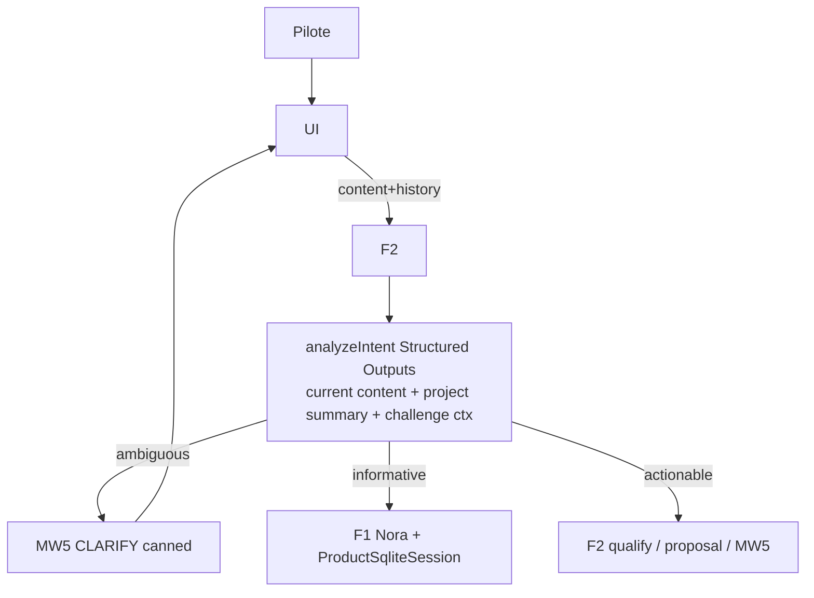
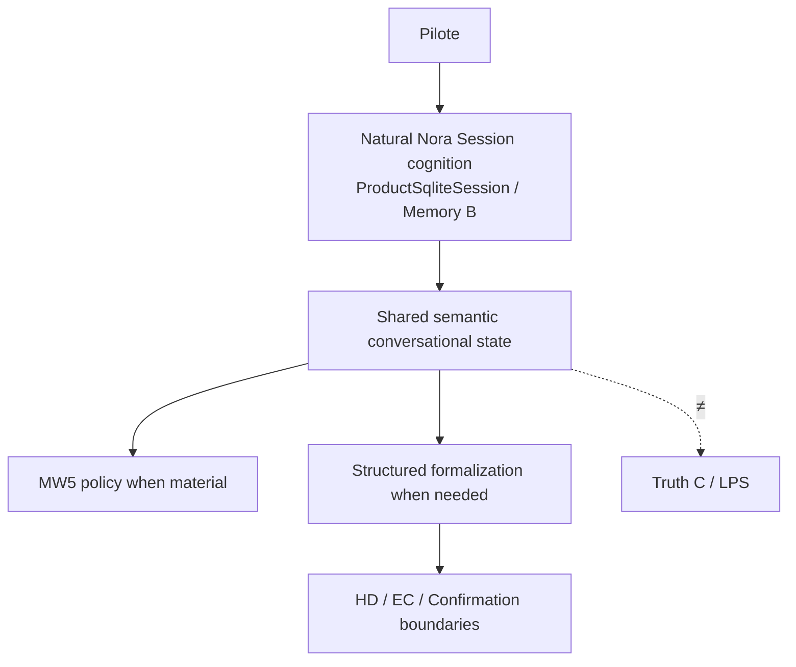

# ChatGPT Critical Design Review — CORR-PROOF-01 R22 Fit & Functional Design

## 1. UTC timestamp

2026-09-06T12:43:14Z

## 2. Parent Product Proof state

OPEN → BLOCKED AT CORR-PROOF-01 → correction → integration → revalidation of SAME Product Proof → resume at blocked user path.

Dogfood #1 FAIL does **not** close Product Proof.

## 3. Exact Morris iterative-Proof decision consumed

PRODUCT PROOF OPERATES AS AN ITERATIVE REAL VALIDATION CAMPAIGN — OBSERVED PRODUCT/UX/FUNCTIONAL GAPS ARE EVIDENCED, CORRECTED AND REVALIDATED BEFORE CONTINUING — PROOF REMAINS OPEN UNTIL MORRIS ACCEPTS END-TO-END EXIT PROOF.

## 4. Dogfood #1 blocker

- Dogfood: `morris-pilote-dogfood-01`
- Project: Suivi de contrat
- Turn 1: natural help request → generic `[MW5 CLARIFY]`
- Turn 2: natural B2B/MC Consulting clarification → same effective generic `[MW5 CLARIFY]`
- Classification: BLOCKING_PRODUCT_GAP (COGNITIVE_GAP + CONTINUITY_GAP)
- Framing: NATURAL CONVERSATIONAL CONTINUITY / SEMANTIC ORCHESTRATION
- Return-to-ChatGPT/Cursor pressure: BLOCKING
- No workaround accepted

## 5. Git truth

| Field | Value |
|---|---|
| Repository | `mcleland147/sfia-workspace` |
| Worktree | `/Users/morris/Projects/sfia-workspace-proof-corr-01-fit` |
| Branch | `analysis/sfia-studio-proof-corr-01-conversation-fit` |
| HEAD / origin/main | `586480af178df5dd2f7177cae8f6b1ac18fe4acc` |
| Tracked diff | EMPTY at analysis start; Review Pack written then restored if tracked |

## 6. Handoff input

Tip `c13400106f11284659b051eaebe9b589b6be804c` · blob `3073680be466742091197357e70f65e653d31602`

## 7. Source routing

Process: cycle template, routing guide, ChatGPT-Cursor operating model, rules/guardrails, CKC pilot 02 Conception fonctionnelle (candidate guidance only).

Studio: Build Doctrine (R22 ACTIVE), Roadmap, Product Completion cadrage, v3 framing 30/32/33/34/35/37, Nora trajectory 08, Dogfood Review Handoff.

Code: ProjectAssistantPanel, actions, orchestrateTurn, orchestrateF2, intentAnalysis, mw5ChallengeSessionStore, proposalStore, criticalChallengeClarification, runNoraCognitiveTurn, productSqliteSession, memoryBCompaction (+ seams).

Provider: Agents JS Sessions guide (2026-09-06); installed SDK types; Python Sessions cross-check. Conversation-state HTML fetch timed out; compact/previous_response_id/conversations claims anchored to installed `openai@6.48.0` types + Agents Sessions guide.

## 8. Convergence pre-check

R22 ACTIVE ON MAIN (PR #453). Roadmap shows F1/F2 wired; conversation/proposal process-local inherited debt; V3-F05 conversation→execution chain remaining product capability framing. No Roadmap mutation this package.

## 9. C1 trajectory link

Product Completion / conversational compose KEEP; C1 completion bar historical; this package is Product Proof corrective design under iterative campaign — not C1 reopen.

## 10. R22 rule

Do not propose internal generic conversation/memory/orchestration engine before OpenAI Capability Fit Check. Fit order: USE/KEEP native → ADAPT/WRAP → COMBINE OpenAI + SFIA delta → COMPLETE missing SFIA only → DEFER/REJECT.

## 11. Current OpenAI capability snapshot

See artifact `openai-capability-fit.md`.

Key dispositions:

- Agents Session interface: KEEP/USE
- ProductSqliteSession: KEEP
- OpenAIConversationsSession: DEFER as primary SoT (dual-SoT)
- previousResponseId / conversationId: DEFER as primary
- OpenAIResponsesCompactionSession / responses.compact: DEFER adoption (Memory B KEEP)
- Structured Outputs: KEEP for formalization; ADAPT early dialogue boundary
- Runner: KEEP single
- HITL ≠ HumanDecision; Tracing ≠ Evidence

Retrieval date: 2026-09-06. Primary official source: https://openai.github.io/openai-agents-js/guides/sessions/

## 12. Installed SDK truth

- `@openai/agents` **0.17.0** (matches npm latest same day)
- `openai` **6.48.0**
- Exports verified: MemorySession, OpenAIConversationsSession, OpenAIResponsesCompactionSession, Runner/run, startOpenAIConversationsSession
- No package upgrade performed or required for preferred option

## 13. Exact current orchestration reconstruction

See `current-orchestration-map.md`.

Default Pilote send → F2 `analyzeIntent` (no general history in model messages) → if ambiguous, MW5 CLARIFY canned return **before** F1/ProductSqliteSession cognition.

## 14. FACT / INFERENCE / HYPOTHESIS

**FACTS:** client history sent; analyzeIntent omits general turns; ambiguous short-circuits F1; CLARIFY not remembered like CHALLENGE; contextResolves via test marker; history unused in deriveMw5Facts body; Session path exists on F1.

**INFERENCES:** Dogfood Turn 2 re-hit ambiguous→CLARIFY.

**HYPOTHESES:** orchestration boundary primary; model upgrade not indicated; Session-first would consume natural clarifications (unproven until Delivery).

## 15. Generic cognition vs SFIA-specific delta

Generic: multi-turn awareness, references, progressive intent, clarification dialogue, session continuation, compaction → OpenAI Session / ProductSqliteSession.

SFIA-specific: Truth C, CKC, epistemic, cycle/profile, trajectory, Rec≠HD, authority, EC, Confirmation, Evidence, STOP, MW5 anti-synthesis → Studio governance delta.

## 16. Functional requirements FR-01…

FR-01…FR-12 as in `functional-requirements.md` (natural multi-turn, contextual clarify, material-only, progressive, invisible method, formalization boundary, authority, Truth C separation, Memory B, no duplicate SoT, restart honesty, free language).

## 17. Current-state diagram

```mermaid
flowchart TD
  Pilote --> UI
  UI -->|content+history| F2
  F2 --> Intent[analyzeIntent Structured Outputs<br/>current content + project summary + challenge ctx]
  Intent -->|ambiguous| MW5[MW5 CLARIFY canned]
  MW5 --> UI
  Intent -->|informative| F1[F1 Nora + ProductSqliteSession]
  Intent -->|actionable| Qual[F2 qualify / proposal / MW5]
```

## 18. Target conceptual diagram

```mermaid
flowchart TD
  Pilote --> Nora[Natural Nora Session cognition<br/>ProductSqliteSession / Memory B]
  Nora --> Sem[Shared semantic conversational state]
  Sem --> MW5g[MW5 policy when material]
  Sem --> Formal[Structured formalization when needed]
  Formal --> Gov[HD / EC / Confirmation boundaries]
  Sem -.->|≠| TruthC[Truth C / LPS]
```

Label: CONCEPTUAL until Morris decides.

## 19. Asset classification

See `asset-disposition.md` — Runner/Session/Memory B/Truth C/HD/EC KEEP; F2/analyzeIntent/MW5 placement ADAPT; CLARIFY episode COMPLETE; OpenAIConversationsSession DEFER.

## 20. Option matrix

A Minimal F2 enrichment — REJECT as preferred (partial).
B Conversation-first — viable; absorbed into D.
C Server-managed OpenAI conversation — DEFER/REJECT as primary (dual SoT).
D Hybrid — **RECOMMENDED**.

## 21. Parallel-architecture check

Recommended D: no second Runner, no second memory engine, no second durable conversation SoT, F2 must not remain alternate chat product, no duplicated compaction/provider abstraction. Dual SoT risk of C is why C is deferred.

## 22. Structured Outputs fit

KEEP for internal formalization (intent/qualification). Challenge exclusive early use at conversation boundary — forcing schema-gated dialogue for every Pilote sentence is implicated in the blocker. Prefer separate conversational cognition then structured operation when formalizing.

## 23. MW5 fit

KEEP hard invariants (no HD/GO/Confirmation synthesis; challenge caps; fail-closed authority). ADAPT role: deterministic governance/policy **after** semantic cognition — not front-door canned dialogue state machine for ordinary chat. Goal is correct boundary, not removal.

## 24. Truth C implications

Conversation/session = working context only. Must not become Truth C by model memory. FR-08.

## 25. Memory B / session implications

KEEP ProductSqliteSession + Memory B compaction. CORR-OPT-C-01 remains: do not auto-trust client history into durable Session. Delivery must define governed write of conversational items / CLARIFY episodes without creating dual authorities.

## 26. Restart implications

Session SQLite items can survive process restart; UI history and process-local proposal/challenge stores may not. Design must disclose; Proof validates restart later — not claimed proven here.

## 27. Authority implications

Natural conversation must not weaken Rec≠Decision, anti-synthesis, or EC/Confirmation gates. Session/model state never grants authority.

## 28. Recommendation

**OPTION D — Hybrid** (details in decision pack). Evidence sufficient to prefer D over A/C; B subsumed.

## 29. Rejected alternatives with reasons

- A preferred: keeps premature classifier-as-dialogue; weak T2–T3.
- C primary: dual durable conversation SoT vs ProductSqliteSession; R3/R6/R22 disfavor.
- Remove MW5: rejects valuable authority invariants without evidence.
- Stronger model / Stage B: Stage A CLOSED; Dogfood does not justify model comparison reopen.
- Magic wording: rejected by Proof objective.

## 30. Implementation impact candidate (NOT authorized)

Bounded ADAPT of F2 entry + analyzeIntent context/role + CLARIFY episode COMPLETE + tests T1–T9; no package upgrade; no Doctrine/Roadmap mutation unless Morris sync GO.

## 31. Migration / debt / exit

Possible temporary dual-path debt until F2 fully demoted from front-door. Exit = single conversational SoT + F2 formalization/governance only. Reversible via bounded Delivery/feature flag.

## 32. Deterministic acceptance contract

T1–T9 as specified in work package / decision pack.

## 33. Future REAL Product Proof retest contract

Resume Suivi de contrat; natural language; no magic prompt; continue past former two-turn blocker; if fixed, CORR-PROOF-01 revalidated at boundary and Proof continues; else record next Proof issue.

## 34. Stage A remains CLOSED

Outcome C accepted — not reopened.

## 35. Stage B NOT JUSTIFIED / NOT AUTHORIZED

Unchanged.

## 36. Runtime v3 NON ADOPTED

## 37. Production model routing NOT SELECTED

## 38. Accounting reserve retained

`R-GMR-AGGREGATE-COUNTER-SEMANTICS-01` UNCHANGED.

## 39. ZERO product mutation proof

Analysis artifacts untracked under `.tmp-sfia-proof/corr-proof-01-fit/`. No product code/test/doc/Roadmap/Doctrine mutation. No package upgrade. Handoff publication L3 only.

## 40. Anti-claims

- Not claiming OpenAI model is bad
- Not claiming MW5 must be deleted
- Not claiming Stage A/B reopened
- Not claiming corrective behavior proven
- Not claiming runtime v3 adopted / production-ready
- Not claiming restart proven
- Recommendation ≠ Morris architecture decision

## 41. Exact Morris decision required next

ChatGPT Critical Design Review → Morris architecture / corrective Delivery decision for CORR-PROOF-01 (accept Option D or alternate). **DO NOT IMPLEMENT until that decision.**

## 42. Review Handoff proof

Published via `scripts/sfia/publish-review-handoff.sh` only.

| Field | Value |
|---|---|
| Parent tip | `c13400106f11284659b051eaebe9b589b6be804c` |
| Suggested commit | `docs(review-handoff): qualify Product Proof CORR-01 conversation design` |
| Published content commit | _(publisher)_ |
| Actual remote branch tip | _(publisher)_ |
| Canonical blob | _(publisher)_ |
| Publisher verdict | _(publisher)_ |

Note: tip vs blob distinguished honestly; no self-referential tip-mutation republish loop.
