# ChatGPT Review Pack — SFIA Studio Native Assistant OpenAI Technical Architecture Corrections

## 1. Timestamp local et UTC

| Horodatage | Valeur |
|---|---|
| **GO Corrections (local)** | 2026-08-05 12:03 CEST (+0200) |
| **GO Corrections (UTC)** | 2026-08-05 10:03 UTC |
| **Pack Cursor (local)** | 2026-08-05 12:10:11 CEST +0200 (truth) / suite rédaction |
| **Pack Cursor (UTC)** | 2026-08-05 10:10:11 UTC |

---

## 2. GO Morris exact

```text
GO CORRECTIONS ARCHITECTURE TECHNIQUE SFIA STUDIO — ASSISTANT SFIA NATIF OPENAI — ALIGN N3 AUTHORITY FLOW, PROVIDER METERING/AUDIT AND TOPOLOGY-PERSISTENCE CONSTRAINTS
```

**Autorité :** Morris · **Ne valide pas** l’Architecture · **ne sélectionne aucune ADR**.

---

## 3. Cycle / profil / typologie

Architecture technique — correction de candidate · Standard · EVOL/DOC · Documentation-only

---

## 4. Main

`8dc54db0069eed78a8d8930cc2b035450ab56ad1`

---

## 5. Branche / worktree

`architecture/sfia-studio-assistant-sfia-native-openai` · locale non poussée · worktree delivery-d2-d1

---

## 6. Handoff entrant

| Item | Valeur |
|---|---|
| Tip | `ce8b725ee78df0c37ca00e9d7f54ee487a7ce558` |
| Blob | `f58265c08b56e6b64d31feb3c3d74e48694928e9` |
| Message | `docs(review-handoff): publish Assistant SFIA technical architecture candidate` |
| Parent | `80a08585ccb751d48c3ddbc99ecbb11084487909` |

---

## 7. Template canonique

Lu (cycle) : template + routing + operating model + rules + checklist + engineering principles + architect-method.

---

## 8. CKC

`pilots/03-architecture-technique.md` candidate v0.1.0 — guidance only.

---

## 9. Sources consultées

Handoff · docs 93, 97, 99, 100 · GO corrections · CKC · Git truth.

---

## 10. Local Git Truth initial complet

```text
=== LOCAL GIT TRUTH INITIAL ===
2026-08-05 12:10:11 CEST +0200
2026-08-05 10:10:11 UTC
/Users/morris/Projects/sfia-workspace-t-a7-lot1-post-merge/.tmp-sfia-review/delivery-d2-d1
architecture/sfia-studio-assistant-sfia-native-openai
8dc54db0069eed78a8d8930cc2b035450ab56ad1
8dc54db0069eed78a8d8930cc2b035450ab56ad1
8dc54db0069eed78a8d8930cc2b035450ab56ad1
8dc54db0069eed78a8d8930cc2b035450ab56ad1
ahead=0
behind=0
?? .tmp-sfia-review/
?? projects/sfia-studio/100-assistant-sfia-native-openai-technical-architecture.md
?? projects/sfia-studio/90-assistant-sfia-native-openai-first-product-increment-framing.md
?? projects/sfia-studio/91-assistant-sfia-native-openai-first-product-increment-functional-architecture.md
?? projects/sfia-studio/92-assistant-sfia-native-openai-functional-architecture-decision-pack.md
?? projects/sfia-studio/93-assistant-sfia-native-openai-functional-architecture-decisions-applied.md
?? projects/sfia-studio/94-assistant-sfia-native-openai-ux-ui-contract.md
?? projects/sfia-studio/95-assistant-sfia-native-openai-ux-ui-flows-and-states.md
?? projects/sfia-studio/96-assistant-sfia-native-openai-ux-ui-decision-pack.md
?? projects/sfia-studio/97-assistant-sfia-native-openai-ux-ui-decisions-applied.md
?? projects/sfia-studio/98-assistant-sfia-native-openai-technical-prerequisites-decision-pack.md
?? projects/sfia-studio/99-assistant-sfia-native-openai-technical-prerequisites-decisions-applied.md
?? projects/sfia-studio/app/.tmp-sfia-review/
DIFF_CHECK_EXIT:0
ce8b725ee78df0c37ca00e9d7f54ee487a7ce558
```

---

## 11. Hash et lignes entrants du document 100

| Item | Valeur |
|---|---|
| SHA-256 | `a6f98ffe79365ef3ee52986120cc5fc5ab7ee1a22ed76456c70050c2d2d45aca` |
| Lignes | 1184 |
| Match attendu | PASS |

---

## 12. Preuve EMBED_MATCH

EMBED_MATCH entre document 100 local et handoff tip `ce8b725e…` : **PASS** (avant modification).

---

## 13. Chemin et hash de la copie avant correction

| Item | Valeur |
|---|---|
| Chemin | `.tmp-sfia-review/architecture/100-before-corrections.md` |
| SHA-256 | `a6f98ffe79365ef3ee52986120cc5fc5ab7ee1a22ed76456c70050c2d2d45aca` |
| Immuable | Oui (non modifié après copie) |

---

## 14. Synthèse F-ARCH-01

Flux N3 réaligné : DecisionCandidate strict → surface N3 → MorrisDecisionInput+GO → AuthorityGate serveur → consommation atomique → autorisation bornée. Provider sans autorité.

---

## 15. Sections modifiées pour F-ARCH-01

§1, §20, §23–25, §27–28, §31, §39, §43 (spoof GO), §56–57, §63, §66–68 (+ domaines AuthorityGate).

---

## 16. Contenu complet des sections corrigées F-ARCH-01

````markdown
## 20. Vue d’ensemble cible

```text
[Browser Assistant UI] --HTTPS--> [Next.js App (server)]
                                      |
              +-----------------------+------------------------+
              |                       |                        |
     Conversation UI           Conversation Orchestrator    Admin Config
     Project / LPS / Expert           |                        |
                              Intent Classifier (N1/N2/N3)
                                      |
                    +-----------------+------------------+
                    |                 |                  |
              OA domains         Git Gateway        Provider Port
           (T-A0..T-A4,T-A6)   Allowlist/Redact    OpenAI Adapter
                    |                 |                  |
         Project Persistence    Audit/Obs/FinOps    (externe OpenAI)
                    |           (provider lane ≠ métier)
         Authority Gate N3 (serveur) — provider SANS autorité
```

Distinctions d’autorité (**F-ARCH-01**) : `DecisionCandidate` → surface N3 → `MorrisDecisionInput` + GO explicite → `AuthorityValidation` serveur → `GOConsumption` atomique → `ExecutionAuthorization` bornée → exécution réelle **hors cycle**.

Éléments : **Existant (libs)** · **Candidat (composition)** · **Externe (OpenAI)**. Rien n’est « livré » comme produit Assistant.

---

## 23. Diagramme composants

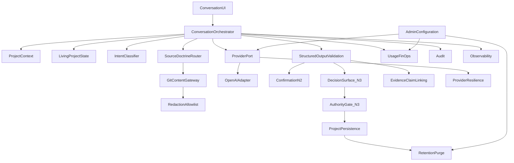
```mermaid
flowchart TB
  UI[ConversationUI]
  PC[ProjectContext]
  LPS[LivingProjectState]
  OR[ConversationOrchestrator]
  CL[IntentClassifier]
  SR[SourceDoctrineRouter]
  GG[GitContentGateway]
  RA[RedactionAllowlist]
  PP[ProviderPort]
  OA[OpenAIAdapter]
  SV[StructuredOutputValidation]
  N2[ConfirmationN2]
  N3[DecisionSurface_N3]
  AG[AuthorityGate_N3]
  EV[EvidenceClaimLinking]
  PS[ProjectPersistence]
  RP[RetentionPurge]
  UF[UsageFinOps]
  AU[Audit]
  OB[Observability]
  PR[ProviderResilience]
  AD[AdminConfiguration]
  UI --> OR
  OR --> CL
  OR --> PC
  OR --> LPS
  OR --> SR
  SR --> GG --> RA
  OR --> UF
  OR --> PP --> OA
  PP --> PR
  OR --> SV
  SV --> N2
  SV --> N3
  N3 --> AG
  AG --> PS
  SV --> EV
  OR --> AU
  OR --> OB
  PS --> RP
  AD --> PP
  AD --> RP
  AD --> UF
```

*F-ARCH-01 :* `AuthorityGate_N3` est serveur-side ; OpenAI Adapter **n’a aucun** rôle de décision/GO.
*F-ARCH-02 :* `UsageFinOps` / audit tentative provider sont branchés **autour** de `ProviderPort`, pas seulement après persist métier.


---

## 24. Domaines et responsabilités

| # | Domaine | Responsabilité | Entrées | Sorties | Déps OK | Déps interdites | Données | N | Erreur | Audit | Emplacement candidat | Statut |
|---|---|---|---|---|---|---|---|---|---|---|---|---|
| 1 | ConversationUI | Surface chat + panneaux | User events | Affichage états | OR, PC | Provider, secrets | UI state | N1–N3 | Messages UX | — | `app/` + `features/` + `components/` | Adaptation |
| 2 | ProjectContext | Résoudre Project isolé | projectId | Context | oa/project | Cross-project | Project | — | 404/deny | yes | `lib/oa/project` | Existant+adapt |
| 3 | LivingProjectState | LPS versionné | projectId | LPS snapshot/delta | T-A1 | Mutation silencieuse | LPS | N2 | Conflict | yes | `lib/oa/project` | Existant+persist |
| 4 | ConversationOrchestrator | Pipeline étapes | Request | Response + side-effects autorisés | tous domaines | SDK OpenAI direct | Correlation | N1–N3 | Localized | yes | **nouveau** `lib/assistant/orchestrator` *(candidat path)* | Nouveau |
| 5 | IntentClassifier | Hors-sujet + N1/N2/N3 | Message + context | Classification | UX rules | Provider-only decide | Class label | — | Ambigu→escalade | yes | nouveau + T-A3 | Nouveau |
| 6 | SourceDoctrineRouter | Doctrine/CKC/sources | Intent | Source set | T-A0/T-A2/sfia-context | v2.6 fallback | Pins | N2/N3 | Fail-closed | yes | `oa/doctrine`+platform | Existant |
| 7 | GitContentGateway | Lecture Git bornée | Paths | Snippets/meta | repository | Write Git | File meta | — | Deny | yes | `platform/repository` | Existant |
| 8 | RedactionAllowlist | Allowlist + redact | Content | Safe content | security | Bypass | RedactionRecord | — | Unknown fail-closed | yes | `platform/security` | Existant |
| 9 | ProviderPort | Contrat minimal | ProviderRequest | ProviderResponse | Resilience | Métier/Git/persist | Messages bornés | — | Normalized errors | yes | `platform/ai` | Existant aligné |
| 10 | OpenAIAdapter | Mapping SDK | Port request | Port response | openai pkg | Métier | Usage meta | — | Map errors | meta only | `openaiProvider.ts` | Existant candidat |
| 11 | StructuredOutputValidation | AF-02 ; pour N3 valide le **DecisionCandidate** (pas un GO Morris inexistant) | Raw / dossier candidat | Validated / reject | ajv? candidate | Partial apply ; valider GO avant surface | Schemas | N1 prog / N2–N3 strict | Fail-closed struct | yes | nouveau + oa ajv patterns | Adaptation |
| 12 | ConfirmationN2 | Drawer confirm | Delta | Confirm/Cancel | T-A3 | Silent apply | Confirmation | N2 | Cancel (provider audit déjà écrit) | yes | oa/decision + UI | Existant+UX |
| 13 | DecisionSurface_N3 | Surface forte N3 ; **aucune option pré-cochée** ; saisie Morris | DecisionCandidate validé | MorrisDecisionInput + GO explicite | UI + T-A3 | Provider décide/GO ; pré-cocher | DecisionCandidate | N3 | — | display | oa/decision + UI | Existant+UX |
| 13b | AuthorityGate_N3 | Vérifie autorité, rôle, décision/option, GO, portée, version dossier, non-consommation préalable, idempotence | MorrisDecisionInput | AuthorityValidation · GOConsumption · ExecutionAuthorization | Serveur only | Provider ; client-only trust | DecisionRecord · GOConsumptionRecord | N3 | Reject → aucune mutation | yes | **nouveau** serveur | Nouveau |
| 14 | EvidenceClaimLinking | Claim↔preuve | Claims | Linked evidence | T-A6 | Orphan claims | EvidenceReference | N2/N3 | Block incomplete | yes | oa/evidence-review | Existant |
| 15 | ProjectPersistence | Store Project-local sous contraintes F-ARCH-03 | Entities | Persisted | Store port | Cross-tenant ; embedded sans profil | See §39–40 | — | Conflict ; fail persist → pas d’autorisation N3 | yes | ADR persist | Candidat |
| 16 | RetentionPurge | TTL + delete | Policy | Purge result | Persist | Invent TTL value | RetentionPolicy | — | Partial purge flag | yes | nouveau | Candidat |
| 17 | UsageFinOps | Soft **pre-check** + metering **immédiat** post-tentative (indépendant métier) | Usage / soft cfg | Soft signals · UsageRecord · usageStatus | Port usage | Hard invent ; fake estimate ; conditionner à persist | UsageRecord · ProviderAttempt | N2 override | Soft warn ; no fake $ | yes | nouveau | Candidat |
| 18 | Audit | Lanes séparées : provider attempt · validation · N2 · N3 · mutation | Events | AuditEvent (typed) | Persist audit | Secrets ; confondre lanes | AuditEvent | — | N2/N3 FC si audit durable échoue | self | nouveau | Candidat |
| 19 | Observability | Logs/metrics/traces + ProviderAttemptStarted/Completed | Spans | Telemetry | Sink | PII/secrets | pipelineStage · providerCallId | — | — | limited | platform/observability | Adaptation |
| 20 | ProviderResilience | Timeout/retry/fallback ; émet outcomes pour toute tentative | Port errors | Degraded/fail-closed + ProviderAttemptOutcome | Port · UF · AU | Silent replay struct | Status · Outcome | N1 deg / N2–N3 FC | Visible | yes | nouveau wrapping port | Candidat |
| 21 | AdminConfiguration | Model/TTL/softcap | Admin | Config audited | Audit | User free model | ModelConfiguration | — | Deny unauthorized | yes | nouveau | Candidat |

*Aucun dossier créé ce cycle.*

---

## 25. Règles de dépendance

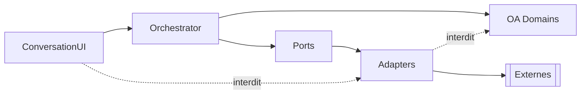
```mermaid
flowchart LR
  UI[ConversationUI] --> OR[Orchestrator]
  OR --> Dom[OA Domains]
  OR --> Ports[Ports]
  Ports --> Adapters[Adapters]
  Adapters --> Ext[[Externes]]
  UI -.->|interdit| Adapters
  Adapters -.->|interdit| Dom
```

**Autorisé :** UI → Orchestrator → Domains/Ports → Adapters → Externes.

**Interdit :**
- UI → OpenAI SDK / secrets ;
- Adapter OpenAI → Git / Persist / Decision métier / **AuthorityGate / GO** ;
- Domains → SDK OpenAI ;
- N2 apply sans Confirmation ; N3 apply sans **AuthorityGate + GOConsumption persistée** ;
- Valider/consommer un GO **avant** surface N3 ou **par** le provider ;
- Lecture Git sans Allowlist/Redaction ;
- Cross-Project reads ;
- T-A5 real execution dans FPI ;
- Conditionner l’audit/metering provider à une mutation métier réussie (**F-ARCH-02**).

---

## 27. Classification N1/N2/N3

| Niveau | Exemples | Validation | Mutation | UI |
|---|---|---|---|---|
| N1 free-talk Project | Question LPS, explication | Progressive | Aucune | Chat |
| N1 hors-sujet | Off-topic | Progressive | Non mémorisé Project | Message |
| N2 | Delta LPS, export structurant | Stricte | Après confirm drawer | Drawer |
| N3 | Décision Morris + GO explicite | Stricte sur **DecisionCandidate** puis **AuthorityGate** sur input Morris | Après consommation GO atomique | Surface N3 (aucune option pré-cochée) |

**Flux N3 d’autorité (F-ARCH-01) — ordre obligatoire :**
1. Classifier → N3 ;
2. Préparer `DecisionCandidate` (question, options, reco candidate séparée, preuves, réserves, portée, autorité attendue, formulation **attendue** du GO) ;
3. `StructuredOutputValidation` stricte du **dossier candidat** (pas d’un GO encore inexistant) ;
4. Afficher surface forte N3 ;
5. Morris sélectionne explicitement + fournit GO explicite (`MorrisDecisionInput`) ;
6. `AuthorityGate` serveur vérifie identité/autorité, rôle, décision/option, GO, portée, version dossier, non-consommation préalable, idempotence ;
7. Provider **ne** vérifie / décide / consomme **jamais** le GO ;
8. Échec AG → aucune décision consommée, aucune autorisation, aucune mutation, raisons + audit rejet ;
9. Succès AG → `DecisionRecord` + `GOConsumptionRecord` atomiques ; échec persist → **aucune** autorisation ;
10. `ExecutionAuthorization` bornée éventuelle **après** consommation persistée ; exécution réelle **distincte** et hors présent cycle.

**Ambiguïté (R-TECH-AF02-BOUNDARY-01 OPEN) :** escalade ou traitement strict ; jamais apply depuis partiel.

Formalisation candidate (réserve reste OPEN) :
- Propriétaire classification : Orchestrator + IntentClassifier (pas l’adapter).
- Priorité : si doute structurant → N2/N3 path strict.
- Preuve d’escalade : AuditEvent `classification_escalated`.

---

## 28. Validation structurée (AF-02=C)

### N1 non structurant
Tolérance texte partiel · aucune mutation/décision · progressive · fallback borné FPI-15.

### N2 structurant — schéma obligatoire (conceptuel)
Champs candidats : `actionType`, `target`, `scope`, `before`, `after`, `evidenceRefs`, `reversibility`, `authority`, `classification`, `result`.

### N3 — validation du DecisionCandidate (pas du GO Morris)
Champs candidats du dossier : `question`, `options[]`, `recommendationCandidate` (séparée), `evidenceRefs`, `reserves`, `scope`, `expectedAuthority`, `expectedGOFormulation`, `dossierVersion`.

Le GO Morris réel n’est validé que par **AuthorityGate** après saisie humaine.

Rejet **fail-closed** si invalide. Aucune consommation partielle.

**AJV :** présent (`oa/*/ajv*`) — **recommandation d’étude candidate**, pas choix validé.

---

## 31. Séquence N3

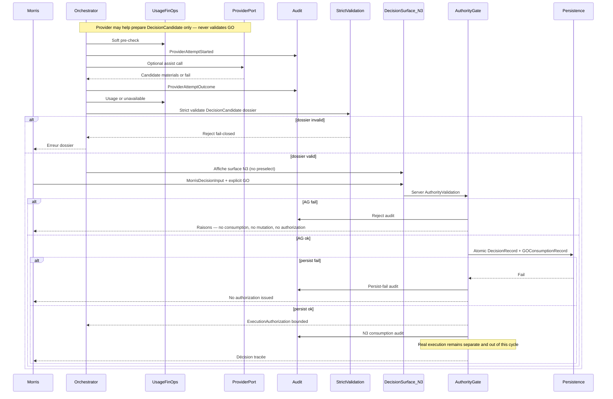
```mermaid
sequenceDiagram
  participant M as Morris
  participant OR as Orchestrator
  participant UF as UsageFinOps
  participant PP as ProviderPort
  participant AU as Audit
  participant SV as StrictValidation
  participant N3 as DecisionSurface_N3
  participant AG as AuthorityGate
  participant PS as Persistence
  Note over OR,PP: Provider may help prepare DecisionCandidate only — never validates GO
  OR->>UF: Soft pre-check
  OR->>AU: ProviderAttemptStarted
  OR->>PP: Optional assist call
  PP-->>OR: Candidate materials or fail
  OR->>AU: ProviderAttemptOutcome
  OR->>UF: Usage or unavailable
  OR->>SV: Strict validate DecisionCandidate dossier
  alt dossier invalid
    SV-->>OR: Reject fail-closed
    OR-->>M: Erreur dossier
  else dossier valid
    OR->>N3: Affiche surface N3 (no preselect)
    M->>N3: MorrisDecisionInput + explicit GO
    N3->>AG: Server AuthorityValidation
    alt AG fail
      AG->>AU: Reject audit
      AG-->>M: Raisons — no consumption, no mutation, no authorization
    else AG ok
      AG->>PS: Atomic DecisionRecord + GOConsumptionRecord
      alt persist fail
        PS-->>AG: Fail
        AG->>AU: Persist-fail audit
        AG-->>M: No authorization issued
      else persist ok
        AG-->>OR: ExecutionAuthorization bounded
        AG->>AU: N3 consumption audit
        Note over AG: Real execution remains separate and out of this cycle
        AG-->>M: Décision tracée
      end
    end
  end
```

---
````

---

## 17. Synthèse F-ARCH-02

Soft pre-check + ProviderAttemptStarted avant appel ; Outcome+Usage/unavailable immédiatement après toute tentative ; indépendant validation/persist/N2 cancel/N3 reject ; lanes audit séparées.

---

## 18. Sections modifiées pour F-ARCH-02

§16 NFR, §23–24, §26, §29–30, §32, §39, §45, §47–49, §54, §56, §57.

---

## 19. Contenu complet des sections corrigées F-ARCH-02

````markdown
## 26. Pipeline conversationnel

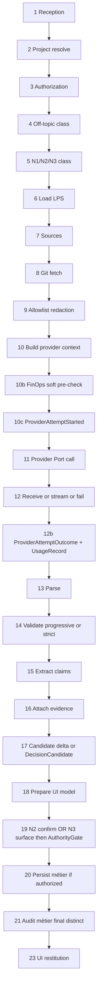
```mermaid
flowchart TD
  S1[1 Reception] --> S2[2 Project resolve]
  S2 --> S3[3 Authorization]
  S3 --> S4[4 Off-topic class]
  S4 --> S5[5 N1/N2/N3 class]
  S5 --> S6[6 Load LPS]
  S6 --> S7[7 Sources]
  S7 --> S8[8 Git fetch]
  S8 --> S9[9 Allowlist redaction]
  S9 --> S10[10 Build provider context]
  S10 --> S10b[10b FinOps soft pre-check]
  S10b --> S10c[10c ProviderAttemptStarted]
  S10c --> S11[11 Provider Port call]
  S11 --> S12[12 Receive or stream or fail]
  S12 --> S12b[12b ProviderAttemptOutcome + UsageRecord]
  S12b --> S13[13 Parse]
  S13 --> S14[14 Validate progressive or strict]
  S14 --> S15[15 Extract claims]
  S15 --> S16[16 Attach evidence]
  S16 --> S17[17 Candidate delta or DecisionCandidate]
  S17 --> S18[18 Prepare UI model]
  S18 --> S19[19 N2 confirm OR N3 surface then AuthorityGate]
  S19 --> S20[20 Persist métier if authorized]
  S20 --> S21[21 Audit métier final distinct]
  S21 --> S23[23 UI restitution]
```

| # | Étape | Composant | Entrée | Sortie | Validation | Erreur | Persist? | Métriques | Structurant? |
|---|---|---|---|---|---|---|---|---|---|
| 1 | Réception | UI→OR | UserMessage | Request | Authz base | Reject | non | recv | non |
| 2 | Project resolve | PC | projectId | Project | Exists+isol | Deny | non | | non |
| 3 | Autorisation | PC/AD | Actor | Allow | Role | Deny | audit | | non |
| 4 | Hors-sujet | CL | Text | In/Out scope | Rules | Mark off-topic | non (UX-07) | | non |
| 5 | Classif N1/N2/N3 | CL | Text+ctx | Level | Ambigu→escalade | Strict/escalade | audit | | gate |
| 6 | Load LPS | LPS | projectId | Snapshot | Version | Fail-closed N2/N3 | non | | si N2/N3 |
| 7 | Sources | SR | Intent | Sources | Doctrine pin | Fail-closed | non | | si struct |
| 8 | Git fetch | GG | Paths | Meta/snippets | Size TBD | Deny | non | | opt |
| 9 | Allowlist/redact | RA | Content | Safe | Unknown FC | Deny | RedactionRecord | | opt |
| 10 | Build context | OR | Safe ctx | ProviderRequest | Bounds | Truncate/deny | non | | |
| 10b | FinOps soft pre-check | UF | Soft cfg | Allow/warn | Soft only | Soft exceed signal | softcap audit | soft | non |
| 10c | ProviderAttemptStarted | AU/OB/UF | corr IDs | Attempt open | No secrets | — | attempt audit | start | non |
| 11 | Provider call | PP/PR | Request | Response/error/timeout/cancel | Timeout cfg | FPI-15 | non | latency | |
| 12 | Receive/fail | PP | Stream/full/err | Raw/outcome | — | Cancel/timeout/down | non | first_token | |
| 12b | Attempt outcome + usage | UF/AU | Outcome | ProviderAttemptOutcome · UsageRecord ou usageStatus=unavailable | **No invented usage** | Write fail → FC N2/N3 | **oui attempt** (avant métier) | usage | non |
| 13 | Parse | SV | Raw | AST/text | Progressive/strict | Reject | non | | |
| 14 | Validate | SV | AST/dossier | OK/Reject | AF-02 ; N3=DecisionCandidate | FC struct | validation audit | validation | |
| 15 | Claims | EV | Output | Claims | Link required struct | Block | non | | struct |
| 16 | Evidence attach | EV | Claims | Linked | T-A6 | Block | non | | struct |
| 17 | Delta / DecisionCandidate | LPS / N3 prep | Valid | Candidate | Schema dossier | Reject | non until gate | | N2/N3 |
| 18 | Prepare UI | OR | Result | ViewModel | — | Error VM | non | | |
| 19 | N2 confirm **ou** N3 surface → Morris input → AuthorityGate | N2 / N3 / AG | Candidate | Confirm / GOConsumption / reject | Explicit ; AG serveur | Cancel/reject ; **no auth if persist fail** | on accept atomique | | oui |
| 20 | Persist métier si autorisé | PS | Approved | Stored | Isol | Rollback | oui | | |
| 21 | Audit métier final | AU | Mutation/decision | AuditEvent métier | Distinct provider lane | — | oui | | |
| 23 | Restitution | UI | VM | Render | — | Error UX | — | | |

**F-ARCH-02 :** metering/audit provider (10b–12b) **avant** et **indépendants** de validation/persistance métier. Annulation N2 / rejet N3 / échec persist **ne suppriment pas** la trace de tentative.

**F-ARCH-01 :** pour N3, l’étape 14 valide le **DecisionCandidate** ; le GO Morris n’existe qu’**après** surface N3 ; AuthorityGate consomme ensuite.

**Étapes sans dépendance directe provider :** 1–10, 13–21, 23. Classification, validation dossier et AuthorityGate ne sont **pas** déléguées à l’adapter.

---

## 29. Séquence N1

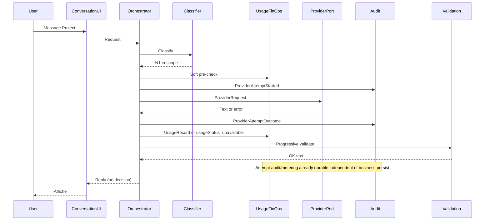
```mermaid
sequenceDiagram
  participant U as User
  participant UI as ConversationUI
  participant OR as Orchestrator
  participant CL as Classifier
  participant UF as UsageFinOps
  participant PP as ProviderPort
  participant AU as Audit
  participant SV as Validation
  U->>UI: Message Project
  UI->>OR: Request
  OR->>CL: Classify
  CL-->>OR: N1 in-scope
  OR->>UF: Soft pre-check
  OR->>AU: ProviderAttemptStarted
  OR->>PP: ProviderRequest
  PP-->>OR: Text or error
  OR->>AU: ProviderAttemptOutcome
  OR->>UF: UsageRecord or usageStatus=unavailable
  OR->>SV: Progressive validate
  SV-->>OR: OK text
  Note over AU,UF: Attempt audit/metering already durable independent of business persist
  OR-->>UI: Reply (no decision)
  UI-->>U: Affiche
```

---

## 30. Séquence N2

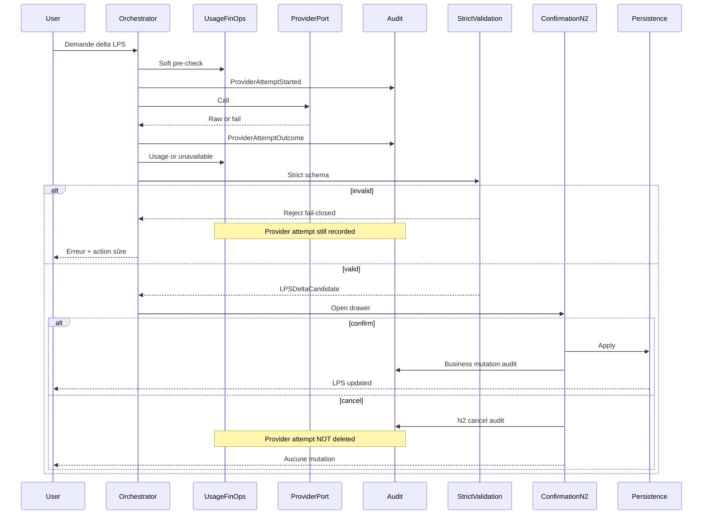
```mermaid
sequenceDiagram
  participant U as User
  participant OR as Orchestrator
  participant UF as UsageFinOps
  participant PP as ProviderPort
  participant AU as Audit
  participant SV as StrictValidation
  participant N2 as ConfirmationN2
  participant PS as Persistence
  U->>OR: Demande delta LPS
  OR->>UF: Soft pre-check
  OR->>AU: ProviderAttemptStarted
  OR->>PP: Call
  PP-->>OR: Raw or fail
  OR->>AU: ProviderAttemptOutcome
  OR->>UF: Usage or unavailable
  OR->>SV: Strict schema
  alt invalid
    SV-->>OR: Reject fail-closed
    Note over AU,UF: Provider attempt still recorded
    OR-->>U: Erreur + action sûre
  else valid
    SV-->>OR: LPSDeltaCandidate
    OR->>N2: Open drawer
    alt confirm
      N2->>PS: Apply
      N2->>AU: Business mutation audit
      PS-->>U: LPS updated
    else cancel
      N2->>AU: N2 cancel audit
      Note over AU,UF: Provider attempt NOT deleted
      N2-->>U: Aucune mutation
    end
  end
```

---

## 32. Séquence provider indisponible

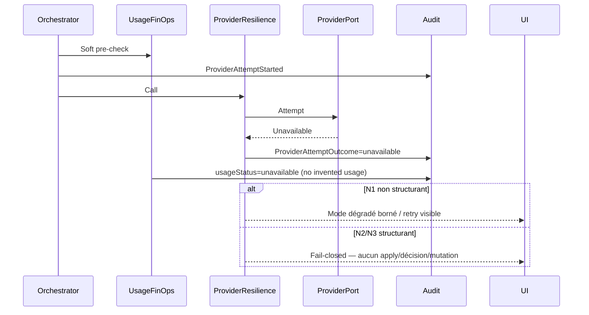
```mermaid
sequenceDiagram
  participant OR as Orchestrator
  participant UF as UsageFinOps
  participant PR as ProviderResilience
  participant PP as ProviderPort
  participant AU as Audit
  participant UI as UI
  OR->>UF: Soft pre-check
  OR->>AU: ProviderAttemptStarted
  OR->>PR: Call
  PR->>PP: Attempt
  PP-->>PR: Unavailable
  PR->>AU: ProviderAttemptOutcome=unavailable
  UF->>AU: usageStatus=unavailable (no invented usage)
  alt N1 non structurant
    PR-->>UI: Mode dégradé borné / retry visible
  else N2/N3 structurant
    PR-->>UI: Fail-closed — aucun apply/décision/mutation
  end
```

---

## 45. FinOps

**Cycle de vie metering (F-ARCH-02) :**
1. Soft pre-check **avant** appel provider ;
2. `ProviderAttemptStarted` ;
3. Appel provider ;
4. Immédiatement après tentative (succès, invalide, timeout, cancel, erreur, indisponible, partiel) : `ProviderAttemptOutcome` + `UsageRecord` **ou** `usageStatus=unavailable` ;
5. **Interdit** d’inventer usage/estimation ;
6. **Interdit** de conditionner l’enregistrement à validation/persistance métier, annulation N2 ou rejet N3 ;
7. Soft cap configurable **sans valeur inventée** · alerte · override soft aligné N2 · admin · corrélation Project ;
8. Échec d’écriture durable audit/metering : **fail-closed** pour N2/N3 selon niveau de preuve exigé ; pour N1 comportement candidat documenté **sans** le déclarer décidé ; **aucune** fausse réussite FinOps affichée.

Hard cap : **DEFER-BEFORE-PILOT** · R-TECH-FINOPS-HARD-01 OPEN.

Aucun tarif/quota/tokens/seuil/devise inventés. Pas de plateforme obs/stockage audit choisie.

---

## 48. Observabilité

Taxonomie candidate : correlationId · projectId · conversationId · requestId · decisionId · confirmationId · providerCallId · evidenceId · pipelineStage · classification · validationResult · providerStatus · ProviderAttemptStarted/Completed/Failed/Cancelled/TimedOut · usage · usageStatus · latency · retry · errorCode · redactionResult · allowlistResult · softCapResult · authorityValidationResult · goConsumptionId.

Séparer :
1. telemetry / audit de **tentative provider** ;
2. audit de **validation structurée** ;
3. audit **N2** confirm/cancel ;
4. audit **N3** décision/rejet/consommation ;
5. audit de **mutation métier** ;
6. UsageRecord / FinOps ;
7. EvidenceReference / preuves UX.

**Jamais logger :** prompt système · secrets · clé · scores internes · raisonnement interne · Git non autorisé · PII inutile.

Pas de plateforme obs choisie.

---

## 49. Audit

AuditEvent immutable Project-scoped, **typé par lane** :
- provider attempt start/outcome ;
- softcap pre-check ;
- allow/deny Git · redaction ;
- validation accept/reject ;
- N2 confirm/cancel ;
- N3 surface shown · AG reject · GOConsumption · persist-fail ;
- mutation métier ;
- purge · admin config.

**F-ARCH-02 :** lane provider ≠ lane métier. Une annulation N2 ou un rejet N3 **ne purge pas** la lane provider.

---
````

---

## 20. Synthèse F-ARCH-03

Matrice topologie/déploiement/persist ; embedded seulement A1 durable mono-instance single-writer ; A2/B1 externes ; dépendances ADR TOPO↔PERSIST↔SERVER↔PURGE↔AUDIT↔HEALTH ; bundles A1/A2/B1 ; interdiction combo ambiguë.

---

## 21. Sections modifiées pour F-ARCH-03

§18–19, §22, §40, §51–53, §58–61, §63–64, §66–68.

---

## 22. Contenu complet des sections corrigées F-ARCH-03

````markdown
## 18. Alternatives de topologie

### Option A — Modular monolith (Next.js existant)
UI + Server Actions / route handlers serveur dans le même déployable ; domaines/ports/adapters internes ; **aucun** appel provider navigateur ; secrets serveur.

| Critère | Évaluation |
|---|---|
| Adéquation FPI | Haute |
| Compatibilité repo | Haute (Next 15 déjà là) |
| Sécurité | Contrôlable (server-only) |
| RGPD | Project-local faisable |
| Testabilité | Haute via ports |
| Observabilité | Spans locaux |
| Coût ops | Bas |
| Complexité | Basse–moyenne |
| Dette | Bridging chat / persist |
| Réversibilité | Haute vers B |
| Impact Delivery | Incrémental |
| Limites | **Profil de déploiement obligatoire** (F-ARCH-03) ; multi-instance non validé avec embedded |

### Option B — Frontend Next + service backend séparé
Meilleure isolation déploiement ; API autonome ; ops plus lourde ; double pipeline CI ; latence réseau interne.

| Critère | Évaluation |
|---|---|
| Adéquation FPI | Moyenne (surdimensionné) |
| Compatibilité repo | Faible (pas de service séparé actuel) |
| Sécurité | Bonne isolation possible |
| Coût/complexité | Élevés |
| Réversibilité | Coûteuse si trop tôt |
| Limites | Architecture astronaut pour FPI ; store durable côté service requis |

### Option C — Distribué / event-driven
Bus/services ; scalabilité potentielle **sans preuve FPI** ; forte complexité ; contredit AF-01 « pas de bus imposé ».

| Critère | Évaluation |
|---|---|
| Adéquation FPI | Basse |
| Complexité/dette | Très élevées |
| Limites | Astronaut · embedded local non approprié par défaut |

### Matrice topologie / déploiement / persistance (**F-ARCH-03**)

| Topologie / déploiement candidat | Persistance embarquée | Condition |
|---|---|---|
| Next.js durable mono-instance | Compatible **candidate** | volume durable + single-writer + verrouillage/sérialisation |
| Next.js serverless ou filesystem éphémère | **Incompatible** | store durable externe **requis** |
| Next.js multi-instance | **Non validé** avec embedded | coordination forte ou base externe **requise** |
| Frontend Next.js + service séparé | Dépend du service et du store | persistance durable et concurrence explicites |
| Architecture distribuée | Embedded local **non approprié** par défaut | store coordonné externe **requis** |

**Règle :** `TOPO=A` + `PERSIST=EMBEDDED` n’est acceptable **candidate** que si **toutes** les contraintes suivantes sont acceptées explicitement :
déploiement durable · mono-instance · single-writer · filesystem/volume non éphémère · verrouillage/sérialisation · sauvegarde/restauration · purge TTL compatible sauvegardes · absence de concurrence multi-instance non maîtrisée · stratégie de migration vers store externe.

Si une contrainte n’est **pas** garantie → embedded **ne peut pas** être retenu → store externe durable **requis** → décision Morris.

---

## 19. Recommandation candidate

**Recommandation candidate (NON DÉCIDÉE PAR MORRIS) :** modular monolith Next.js (Option A) **sous profil de déploiement explicite**, avec Provider Port minimal et composition `lib/oa/*` + `lib/platform/*`.

**Bundles candidats (CANDIDATE — NOT DECIDED — MORRIS DECISION REQUIRED) :**

| Bundle | Contenu | Statut |
|---|---|---|
| **A1** | Modular monolith · déploiement **durable mono-instance** · embedded Project-local · single-writer · contraintes F-ARCH-03 acceptées | Candidate |
| **A2** | Modular monolith · déploiement **éphémère / serverless / multi-instance** · **store externe durable** | Candidate |
| **B1** | Frontend Next + service séparé · store externe durable (ou store géré par le service) | Candidate |

Justification inventaire : stack Next 15 ; ports existants ; P0 fixtures ; B/C sans besoin FPI démontré ; AF-01 refuse bus imposé.

**Interdit dans une future gate :** sélection ambiguë `TOPO=A` + `PERSIST=EMBEDDED` **sans** déclaration du profil de déploiement et des contraintes acceptées.

Statut : **RECOMMANDATION CANDIDATE — ADR-ASST-TOPO-01 + ADR-ASST-PERSIST-01 COUPLES — NOT DECIDED**.

---

## 40. Persistance

### Options
| Option | Pros | Cons | Fit FPI |
|---|---|---|---|
| Store local embarqué (fichier/SQLite-like) | Simple, Project-local, purge | **Seulement** sous profil durable mono-instance single-writer | Candidate **A1** seulement |
| Base relationnelle externe / store durable externe | Mature, concurrence | Ops | **Requis** pour A2 / B1 / serverless / multi-instance |
| Fichiers structurés / append-only | Audit-friendly | Concurrence, query | Audit lane candidate |

### Compatibilité (rappel F-ARCH-03)
Voir matrice §18. Embedded **interdit** sur serverless/éphémère ; **non validé** multi-instance.

**Recommandations candidates (NON DÉCIDÉES) :**
- Bundle **A1** : embedded Project-local + lane audit append-only logique **si** contraintes §18 acceptées.
- Bundle **A2/B1** : store externe durable.

**ADR-ASST-PERSIST-01** couplé à **ADR-ASST-TOPO-01** / **SERVER-01** / **PURGE-01** / **AUDIT-STORE-01** / **HEALTH-01**.

Séparation : opérationnel · audit provider · audit métier · preuves · config · métriques · docs Git.

### Cycle de vie des données conversationnelles

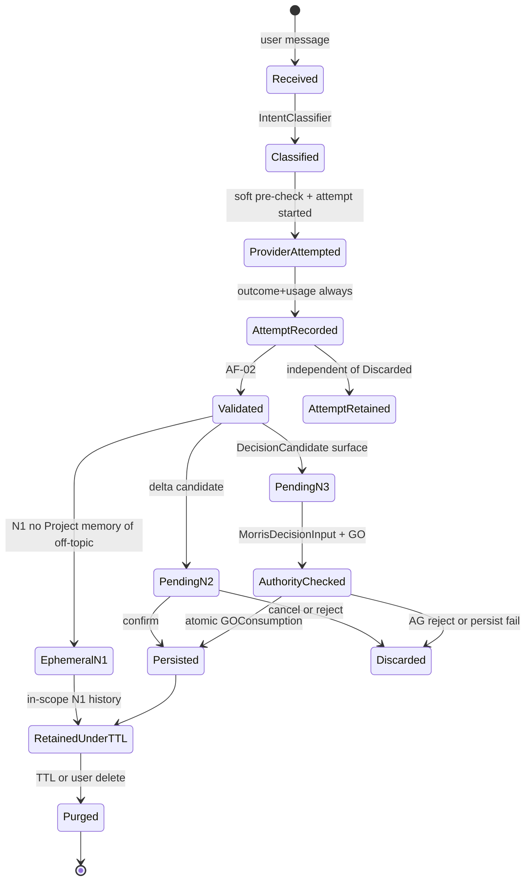
```mermaid
stateDiagram-v2
  [*] --> Received: user message
  Received --> Classified: IntentClassifier
  Classified --> ProviderAttempted: soft pre-check + attempt started
  ProviderAttempted --> AttemptRecorded: outcome+usage always
  AttemptRecorded --> Validated: AF-02
  Validated --> EphemeralN1: N1 no Project memory of off-topic
  Validated --> PendingN2: delta candidate
  Validated --> PendingN3: DecisionCandidate surface
  PendingN2 --> Persisted: confirm
  PendingN2 --> Discarded: cancel or reject
  PendingN3 --> AuthorityChecked: MorrisDecisionInput + GO
  AuthorityChecked --> Persisted: atomic GOConsumption
  AuthorityChecked --> Discarded: AG reject or persist fail
  EphemeralN1 --> RetainedUnderTTL: in-scope N1 history
  Persisted --> RetainedUnderTTL
  RetainedUnderTTL --> Purged: TTL or user delete
  AttemptRecorded --> AttemptRetained: independent of Discarded
  Purged --> [*]
```

---

## 52. Déploiement candidat

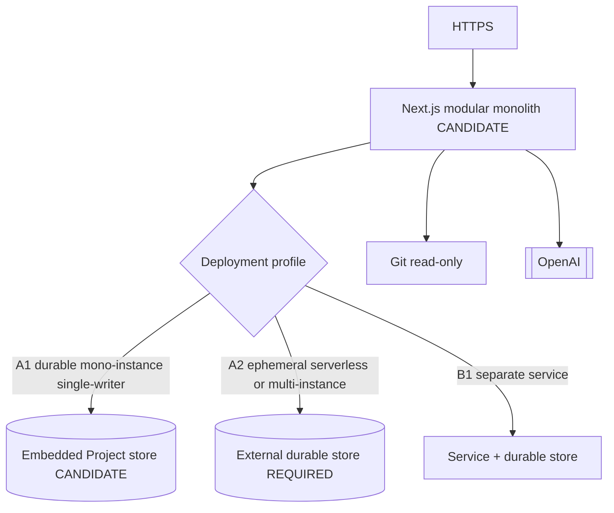
```mermaid
flowchart TB
  Edge[HTTPS] --> Next[Next.js modular monolith CANDIDATE]
  Next --> Profile{Deployment profile}
  Profile -->|A1 durable mono-instance single-writer| Emb[(Embedded Project store CANDIDATE)]
  Profile -->|A2 ephemeral serverless or multi-instance| Ext[(External durable store REQUIRED)]
  Profile -->|B1 separate service| Svc[Service + durable store]
  Next --> GitRO[Git read-only]
  Next --> OpenAI[[OpenAI]]
```

| Profil | Store | Statut |
|---|---|---|
| Durable mono-instance | Embedded candidate sous contraintes | A1 |
| Éphémère / serverless | Embedded **incompatible** | A2 externe |
| Multi-instance | Embedded **non validé** | Externe ou nouvelle décision Morris |
| Service séparé | Store service/externe | B1 |

Aucune plateforme de déploiement réelle sélectionnée.

---

## 58. ADR candidates

Statut commun : **ADR CANDIDATE — NOT DECIDED — MORRIS DECISION REQUIRED**

| ID | Question | Options | Reco candidate | Gate |
|---|---|---|---|---|
| ADR-ASST-TOPO-01 | Topologie ? | A monolith · B split · C distributed | **A** sous profil déploiement explicite | Décisions Archi |
| ADR-ASST-PERSIST-01 | Persistance physique ? | Embedded · externe durable · files | **Embedded seulement si A1** ; sinon externe | Décisions Archi |
| ADR-ASST-SERVER-01 | Frontière serveur Next ? | Server Actions · Route handlers · Hybrid | Hybrid minimal | Décisions Archi |
| ADR-ASST-PURGE-01 | Mécanisme purge TTL ? | Job · lazy · hybrid | Hybrid candidate ; compatible backups | Avant pilote / RGPD |
| ADR-ASST-AUDIT-STORE-01 | Audit vs opérationnel ? | Same store · separate lane | Separate logical lane ; provider≠métier | Décisions Archi |
| ADR-ASST-STREAM-01 | Streaming ? | N1 only · all · none | N1 only candidate | Décisions Archi |
| ADR-ASST-VALIDATE-LIB-01 | Lib validation ? | ajv reuse · other · hand | Study ajv reuse | Décisions Archi |
| ADR-ASST-SECRETS-01 | Gestion secrets ? | Env server · secret manager | Env server FPI · manager later | Impl prep |
| ADR-ASST-ADMIN-AUTHZ-01 | Authz admin + AuthorityGate acteurs ? | Existing auth · new role | Role admin + Morris authz N3 | Avant admin/N3 UI |
| ADR-ASST-HEALTH-01 | Health/readiness ? | Minimal /live · deep deps | Minimal + provider optional probe ; profil-aware | Impl |

### Matrice de dépendances ADR (**F-ARCH-03**)

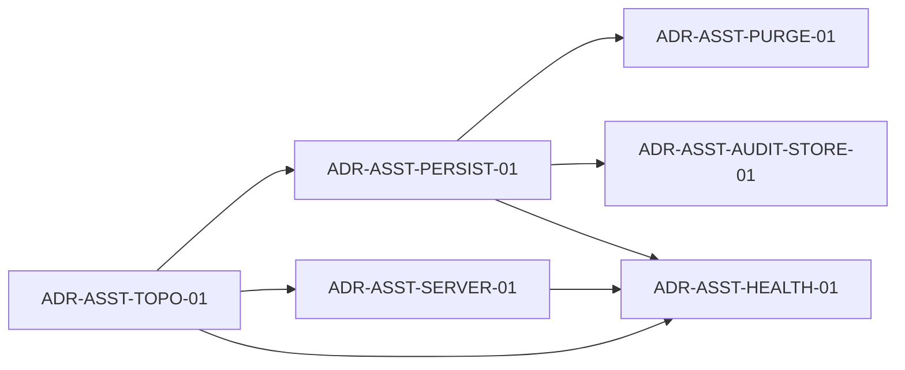
```mermaid
flowchart LR
  TOPO[ADR-ASST-TOPO-01] --> PERSIST[ADR-ASST-PERSIST-01]
  TOPO --> SERVER[ADR-ASST-SERVER-01]
  PERSIST --> PURGE[ADR-ASST-PURGE-01]
  PERSIST --> AUDIT[ADR-ASST-AUDIT-STORE-01]
  TOPO --> HEALTH[ADR-ASST-HEALTH-01]
  SERVER --> HEALTH
  PERSIST --> HEALTH
```

| Lien | Nature |
|---|---|
| Décision maîtresse | **TOPO-01** (incl. profil déploiement) avant ou **jointement** avec **PERSIST-01** |
| Ordre | 1) TOPO+profil · 2) PERSIST compatible · 3) SERVER · 4) AUDIT-STORE · 5) PURGE · 6) HEALTH |
| Compatible | A1 = TOPO A + durable mono + PERSIST embedded + single-writer |
| Compatible | A2 = TOPO A + ephemeral/serverless/multi + PERSIST externe |
| Compatible | B1 = TOPO B + PERSIST externe/service |
| **Interdit** | TOPO A + PERSIST embedded **sans** profil durable mono-instance single-writer |
| **Interdit** | Embedded + serverless/éphémère |
| Dette | Migration embedded→externe si A1 puis scale |
| Réversibilité | Ports persist ; coût migration données |
| Impact Backlog | Bundles A1/A2/B1 déterminent lots infra/persist |

TOPO-01 et PERSIST-01 **ne sont plus** présentées comme entièrement indépendantes.

Aucune ADR acceptée/rejetée ; IDs inchangés ; pas d’ADR supplémentaire créée.

---
````

---

## 23. Diagrammes Mermaid corrigés

Mis à jour : composants · pipeline · N1 · N2 · N3 · provider down · ER data · lifecycle · déploiement · dépendances ADR · containers/context labels. Revue syntaxique manuelle PASS · **14** blocs.

---

## 24. Matrice topologie/persistance

Voir document §18 (table complète) et §52.

---

## 25. Matrice de dépendances ADR

Voir document §58 (flowchart + table ordre/compatible/interdit).

---

## 26. ADR candidates mises à jour

Toutes **ADR CANDIDATE — NOT DECIDED — MORRIS DECISION REQUIRED**. IDs inchangés. TOPO/PERSIST/SERVER/PURGE/AUDIT/HEALTH enrichies. Aucune acceptée.

---

## 27. Réserves inchangées

R-TECH-TTL-01 · R-TECH-FINOPS-HARD-01 · R-TECH-AF02-BOUNDARY-01 · R-UX-FPI-02/03/04 · R-UX-04 — **OPEN**, non converties depuis F-ARCH-*.

---

## 28. Décisions Morris inchangées

AF/UX/prérequis 93/97/99 préservées ; aucune rouverture.

---

## 29. Document 100 corrigé

`projects/sfia-studio/100-assistant-sfia-native-openai-technical-architecture.md`

Statut : **CANDIDATE TECHNICAL ARCHITECTURE — CORRECTIONS F-ARCH-01, F-ARCH-02 AND F-ARCH-03 APPLIED — MORRIS VALIDATION REQUIRED — NO IMPLEMENTATION AUTHORIZED**

---

## 30. Contenu intégral du document 100 corrigé

````markdown
# SFIA Studio — Assistant SFIA natif OpenAI — Technical Architecture

## 1. Statut

**CANDIDATE TECHNICAL ARCHITECTURE — CORRECTIONS F-ARCH-01, F-ARCH-02 AND F-ARCH-03 APPLIED — MORRIS VALIDATION REQUIRED — NO IMPLEMENTATION AUTHORIZED**

| Champ | Valeur |
|---|---|
| **Document** | `projects/sfia-studio/100-assistant-sfia-native-openai-technical-architecture.md` |
| **Nature** | Architecture technique **candidate** réversible |
| **Corrections appliquées** | F-ARCH-01 · F-ARCH-02 · F-ARCH-03 (documentaires) |
| **Décision Morris consommée** | Aucune nouvelle (prérequis 99 en entrée seulement) |
| **ADR** | Toutes **CANDIDATE — NOT DECIDED** |
| **Code / app / package / Figma** | Non modifiés |
| **Modèle OpenAI nommé** | Aucun |
| **Backlog / Delivery** | Non ouverts |

Légende épistémique utilisée partout : **Observation repo** · **Décision Morris** · **Contrainte** · **Hypothèse** · **Option** · **Recommandation candidate** · **ADR candidate** · **Réserve** · **Différé** · **Correction F-ARCH-***.

GO de correction consommé : `GO CORRECTIONS ARCHITECTURE TECHNIQUE … ALIGN N3 AUTHORITY FLOW, PROVIDER METERING/AUDIT AND TOPOLOGY-PERSISTENCE CONSTRAINTS` — 2026-08-05 12:03 CEST / 10:03 UTC — **n’accepte aucune ADR**.

---

## 2. GO Morris

```text
GO ARCHITECTURE TECHNIQUE SFIA STUDIO — ASSISTANT SFIA NATIF OPENAI — DESIGN TECHNICAL ARCHITECTURE FROM VALIDATED PREREQUISITES
```

**Autorité :** Morris · **Consommation initiale :** 2026-08-05 11:39 CEST (+0200) / 2026-08-05 09:39 UTC

**GO correction (ne valide pas l’Architecture et ne sélectionne aucune ADR) :**

```text
GO CORRECTIONS ARCHITECTURE TECHNIQUE SFIA STUDIO — ASSISTANT SFIA NATIF OPENAI — ALIGN N3 AUTHORITY FLOW, PROVIDER METERING/AUDIT AND TOPOLOGY-PERSISTENCE CONSTRAINTS
```

**Consommation correction :** 2026-08-05 12:03 CEST (+0200) / 2026-08-05 10:03 UTC

---

## 3. Timestamp

| Horodatage | Valeur |
|---|---|
| **Consommation GO Archi (local)** | 2026-08-05 11:39 CEST (+0200) |
| **Consommation GO Archi (UTC)** | 2026-08-05 09:39 UTC |
| **Consommation GO Corrections (local)** | 2026-08-05 12:03 CEST (+0200) |
| **Consommation GO Corrections (UTC)** | 2026-08-05 10:03 UTC |
| **Correction documentaire Cursor (local)** | 2026-08-05 12:10:11 CEST +0200 |
| **Correction documentaire Cursor (UTC)** | 2026-08-05 10:10:11 UTC |

---

## 4. Cycle / profil

| Champ | Valeur |
|---|---|
| **Cycle** | Architecture technique |
| **Profil** | Standard |
| **Typologie** | EVOL / DOC |
| **Nature** | Documentation-only |
| **Doctrine conduite** | SFIA v2.6 |
| **Doctrine produit** | SFIA Studio v3 (périmètre documentaire + applicatif existant) |

---

## 5. Hiérarchie des sources

1. **Git main** — état technique réel (`8dc54db…`).
2. **GO Morris courant**.
3. **Décisions Morris** — documents `93`, `97`, `99`.
4. **Contrats** — documents `90`–`96`.
5. **Decision Pack `98`** — alternatives (historique).
6. **CKC** candidate Architecture technique — guidance cognitive sans autorité.
7. **Hypothèses** explicitement marquées.

---

## 6. Références Git et handoff

| Item | Valeur |
|---|---|
| **Repository** | `mcleland147/sfia-workspace` |
| **origin/main** | `8dc54db0069eed78a8d8930cc2b035450ab56ad1` |
| **Branche locale** | `architecture/sfia-studio-assistant-sfia-native-openai` (non poussée) |
| **Handoff tip entrant** | `80a08585ccb751d48c3ddbc99ecbb11084487909` |
| **Handoff blob entrant** | `55ca878a85989c573b8525f00aef256e2972dcf9` |
| **Message** | `docs(review-handoff): publish Assistant SFIA technical prerequisites decisions applied` |
| **Document 99 dans handoff** | Reproduit intégralement (EMBED_MATCH) |
| **AF-04** | B (déjà DECIDED) |

---

## 7. Documents 90–99 et hashes

| Doc | SHA-256 | Lignes | Mutation |
|---|---|---|---|
| 90 | `2d5a03f366e5291e54b6617ada972158763199bf918bea01f031d4212b1a78b2` | 694 | Aucune |
| 91 | `0517aa6c3091f63f0b5c69d40d123fa715dbfb4429d02681ea0398a9588e83e1` | 730 | Aucune |
| 92 | `0af5a9063705859abddceea0f1f5184b55c35a04e94b71648b139bb592c841d4` | 473 | Aucune |
| 93 | `6466f1620d1db65f065fcaf5de25d36cc6af5180f7be786649fbc57521bf4428` | 309 | Aucune |
| 94 | `14572223a00beb038014379a75a3fd2cdb1bb016ef7de436894c0886ac1887be` | 338 | Aucune |
| 95 | `35e829ccc75c31b3a190f6e3015e01f610350c2109f40d32988e6d11d0b2be0d` | 236 | Aucune |
| 96 | `24da72cfabc77c43fd6db7fdc470935a4f24898653d398c6328f81a5c920d46d` | 172 | Aucune |
| 97 | `c18a902159a41cf568e7cabdad0420b51da56a34db445fcb8e07e986df49e47f` | 518 | Aucune |
| 98 | `5794689f826a3abf24b9949e637c3d56fbe64189b23ab294aa682649225558c6` | 1136 | Aucune |
| 99 | `d2a72120b80768cb354a2fedb9b2fc5ec36033ad52e8e97bd449c2b6ce4ef23e` | 608 | Aucune |
| **100** | voir rapport Cursor | — | **Créé** |

---

## 8. CKC

| Champ | Valeur |
|---|---|
| **Chemin** | `method/sfia-fast-track/documentation/capitalization/cycle-knowledge-contracts/pilots/03-architecture-technique.md` |
| **Statut** | candidate v0.1.0 |
| **Autorité** | aucune |
| **Usage** | dimensions NFR / composants / alternatives / anti-patterns |

Anti-patterns évités : architecture astronaut · stack par habitude · sécu/obs reportées · mono-option · benchmarks inventés · scalable sans preuve · implémentation sous architecture.

---

## 9. Décisions validées (entrées — non rouvertes)

### Prérequis Tech (doc 99)
AF-01=C · AF-02=C (normalisé) · FPI-02=B · FPI-03=B · FPI-07=B · FPI-08=B · FPI-09=B · FPI-10=B (normalisé) · FPI-14=B soft · FPI-15=B

### AF (doc 93)
FPI-04=D · FPI-05=C · FPI-06=D · FPI-11=ACCEPT · AF-03=C · AF-04=B

### UX (doc 97)
UX-01…10 DECIDED · R-DEC-AF-01 CLOSED BY MORRIS

---

## 10. Réserves maintenues

| ID | Statut |
|---|---|
| R-TECH-TTL-01 | **OPEN BY MORRIS** |
| R-TECH-FINOPS-HARD-01 | **OPEN BY MORRIS** |
| R-TECH-AF02-BOUNDARY-01 | **OPEN BY MORRIS** |
| R-UX-FPI-02 | OPEN |
| R-UX-FPI-03 | OPEN |
| R-UX-FPI-04 | OPEN |
| R-UX-04 | OPEN |

Aucune réserve fermée ni ouverte par Cursor. Aucune nouvelle réserve OPEN.

---

## 11. Portée

Concevoir et documenter une Architecture technique **candidate** : composants, frontières, pipeline, ports, données conceptuelles, sécurité/RGPD/FinOps/résilience/obs, ADR candidates, diagrammes Mermaid — à partir du socle Git et des décisions 93/97/99.

---

## 12. Hors périmètre

Code · migrations · API réelles · packages · modèle OpenAI nommé · endpoint OpenAI définitif · clé API · appel provider · Figma write · fermeture réserves · consommation ADR · Backlog · Delivery · commit/push projet · PR/merge · doctrine/méthode.

---

## 13. Inventaire du socle existant

### Observation repo — baseline P0 UI
- **Next.js 15** App Router · **React 19** · **TypeScript** · CSS Modules · Vitest · Playwright.
- README : « Fixtures locales uniquement — **aucun backend** » ; pas de `app/api` ; pas de middleware auth ; pas de `.env` P0.
- Routes P0 : `/synthese`, `/nouvelle-demande`, `/cycle-actif`, `/decision` (+ extensions projects/studio/ops1/workspace présentes).
- `lib/adapters/*` = fixtures-only ; `fixtures/*` = données déterministes.

### Observation repo — dépendances
- `package.json` : `next^15.3.3`, `react^19.1.0`, `openai^6.48.0`, `ajv^6.15.0`.
- **Présence package ≠ décision validée** (FPI-09/10/AF-02).

### Observation repo — plateforme et OA (bibliothèques sur main)
| Zone | Fichiers (ordre) | Rôle |
|---|---|---|
| `lib/platform/ai` | provider/fake/openai/types/config | Port conversation + adapters |
| `lib/platform/security` | pathPolicy deny-by-default · redaction | Allowlist/redaction |
| `lib/platform/repository` | gitLocalRead / githubRead | Lecture Git |
| `lib/platform/observability` | eventSink | Events |
| `lib/platform/sfia-context` | resolver/loader | Sources doctrine |
| `lib/platform/tools` | toolRouter/toolLoop | Outils bornés |
| `lib/platform/t-a7` | foundations INTERNAL_ONLY | Statuts/bloquers |
| `lib/oa/doctrine`…`evidence-review` | T-A0…T-A6 memory | Domaines Option A |
| `lib/oa/execution-attempt` | T-A5 fake | **Hors exécution réelle FPI** |
| `lib/oa/execution-run` | T-A7/D2 coordination | Mémoire/fixture |
| `lib/ops1/conversation` | service journal/tools | Conversation Ops1 (≠ produit FPI) |

### Observation repo — absences
- Aucun `app/api/**/route.ts`.
- Backend runtime P0 = **non actif** (UI fixtures).
- Persistance conversation Assistant FPI = **non livrée** comme produit (memory OA + patterns Ops1 existent en lib).

### Divergence documentée
Le README P0 décrit un frontend fixtures-only ; le même package contient des libs serveur/platform/OA avancées. **Les deux coexistent** : P0 UI n’active pas ces libs comme backend produit. L’architecture candidate compose les libs **sans** prétendre qu’un backend Assistant est déjà livré.

---

## 14. Matrice existant / cible

Voir aussi artifact `.tmp-sfia-review/architecture/existing-target-matrix.md`.

| Domaine cible | Existant | Statut cible | Action |
|---|---|---|---|
| Conversation UI | Shell + copilot P0 / features | **Adaptation** | Surface Assistant (docs 94–97) sans Figma write ce cycle |
| Project Context | `oa/project` + pages projects | **Réutilisation + adaptation** | Isolation Project FPI-03 |
| LPS | `oa/project` memory | **Réutilisation + persist** | FPI-03 |
| Orchestrator | Absent produit ; patterns Ops1/platform tools | **Nouveau (composition)** | Pipeline AF-01=C |
| Classification N1/N2/N3 | UX + domain decision | **Nouveau + T-A3** | AF-02 + UX |
| Doctrine/Source routing | `oa/doctrine` + `sfia-context` | **Réutilisation** | Bridging chat |
| Git Gateway | `platform/repository` + pathPolicy | **Réutilisation + durcir** | FPI-07 |
| Redaction/Allowlist | `platform/security` | **Réutilisation** | FPI-07 |
| Provider Port | `platform/ai` ConversationProvider | **Réutilisation alignée** | FPI-10=B |
| OpenAI Adapter | `openaiProvider.ts` | **Candidat adaptation** | Pas de modèle nommé ; TO BE VERIFIED |
| Validation | ajv dans OA schemas | **Candidat** | AF-02=C ; présence ≠ choix |
| N2/N3 | `oa/decision` + UI decision | **Réutilisation + UX** | Docs 93/97 |
| Evidence/Claims | `oa/evidence-review` | **Réutilisation** | T-A6 |
| Persistence | memory OA ; Ops1 db patterns | **ADR candidate** | FPI-03/08 |
| FinOps/Audit/Obs | usage dans provider ; eventSink | **Nouveau composition** | FPI-14/15 |
| Admin model/TTL/softcap | partiel config AI | **Nouveau** | FPI-08/09/14 |
| T-A5 real agents | fake only | **Hors FPI** | FPI-02=B |

---

## 15. Objectifs d’architecture

1. Servir le FPI Assistant sans réécrire le socle (FPI-02=B).
2. Appliquer pipeline + validation hybride (AF-01/02).
3. Isoler OpenAI derrière port minimal (FPI-10=B).
4. Persistance Project minimale + TTL configurable sans valeur (FPI-03/08).
5. Fail-closed structurant + soft FinOps (FPI-14/15).
6. Préparer Backlog futur **sans** l’ouvrir.
7. Rester réversible et simple.

---

## 16. Exigences non fonctionnelles

| NFR | Exigence | Source | Mesure |
|---|---|---|---|
| Sécurité | Secrets serveur only ; pas d’appel provider navigateur | FPI-07/10 · Contrainte | Threat model §43 |
| Isolation | Strict Project | FPI-03 | Tests isolation |
| Validation | Strict N2/N3 · progressive N1 | AF-02=C | Schema rejects |
| Résilience | Dégradé N1 · fail-closed structurant | FPI-15 | Scénarios §56 |
| Observabilité | Spans pipeline · usage · audit | AF-01 · FPI-14 | Taxonomie §48 |
| RGPD | Minimisation · purge · TTL admin | FPI-08 · R-TECH-TTL-01 | §44 |
| FinOps | Soft pre-check + metering transverse à toute tentative provider · hard différé | FPI-14 · R-TECH-FINOPS-HARD-01 · **F-ARCH-02** | §45 |
| Audit | Tentative provider ≠ audit métier ; traces indépendantes du résultat métier | **F-ARCH-02** | §48–49 |
| Autorité N3 | GO Morris saisi après surface N3 ; Authority Gate serveur ; provider sans autorité | UX · **F-ARCH-01** | §27–31 |
| Déploiement/persist | Embedded seulement si durable mono-instance single-writer | **F-ARCH-03** | §18–19 · §40 · §52 |
| Performance | Mesurable · SLO `TO_BE_DECIDED` | Contrainte | §46 |
| Testabilité | Ports simulables · audits provider même sur reject/cancel | AF-01 · FPI-10 · F-ARCH-02 | §54 |
| Simplicité | Moindre complexité opérationnelle FPI sous contraintes déploiement explicites | CKC / Engineering Principles | Bundles A1/A2/B1 |

---

## 17. Contraintes

- Décisions 93/97/99 non rouvertes.
- T-A5 hors FPI.
- Pas de multi-provider complet.
- Pas de TTL/seuil/tarif/SLO inventés.
- Pas de modèle nommé.
- UI P0 fixtures préservée ; Assistant = composition future.
- Git = source documentaire, pas store conversationnel runtime.

---

## 18. Alternatives de topologie

### Option A — Modular monolith (Next.js existant)
UI + Server Actions / route handlers serveur dans le même déployable ; domaines/ports/adapters internes ; **aucun** appel provider navigateur ; secrets serveur.

| Critère | Évaluation |
|---|---|
| Adéquation FPI | Haute |
| Compatibilité repo | Haute (Next 15 déjà là) |
| Sécurité | Contrôlable (server-only) |
| RGPD | Project-local faisable |
| Testabilité | Haute via ports |
| Observabilité | Spans locaux |
| Coût ops | Bas |
| Complexité | Basse–moyenne |
| Dette | Bridging chat / persist |
| Réversibilité | Haute vers B |
| Impact Delivery | Incrémental |
| Limites | **Profil de déploiement obligatoire** (F-ARCH-03) ; multi-instance non validé avec embedded |

### Option B — Frontend Next + service backend séparé
Meilleure isolation déploiement ; API autonome ; ops plus lourde ; double pipeline CI ; latence réseau interne.

| Critère | Évaluation |
|---|---|
| Adéquation FPI | Moyenne (surdimensionné) |
| Compatibilité repo | Faible (pas de service séparé actuel) |
| Sécurité | Bonne isolation possible |
| Coût/complexité | Élevés |
| Réversibilité | Coûteuse si trop tôt |
| Limites | Architecture astronaut pour FPI ; store durable côté service requis |

### Option C — Distribué / event-driven
Bus/services ; scalabilité potentielle **sans preuve FPI** ; forte complexité ; contredit AF-01 « pas de bus imposé ».

| Critère | Évaluation |
|---|---|
| Adéquation FPI | Basse |
| Complexité/dette | Très élevées |
| Limites | Astronaut · embedded local non approprié par défaut |

### Matrice topologie / déploiement / persistance (**F-ARCH-03**)

| Topologie / déploiement candidat | Persistance embarquée | Condition |
|---|---|---|
| Next.js durable mono-instance | Compatible **candidate** | volume durable + single-writer + verrouillage/sérialisation |
| Next.js serverless ou filesystem éphémère | **Incompatible** | store durable externe **requis** |
| Next.js multi-instance | **Non validé** avec embedded | coordination forte ou base externe **requise** |
| Frontend Next.js + service séparé | Dépend du service et du store | persistance durable et concurrence explicites |
| Architecture distribuée | Embedded local **non approprié** par défaut | store coordonné externe **requis** |

**Règle :** `TOPO=A` + `PERSIST=EMBEDDED` n’est acceptable **candidate** que si **toutes** les contraintes suivantes sont acceptées explicitement :
déploiement durable · mono-instance · single-writer · filesystem/volume non éphémère · verrouillage/sérialisation · sauvegarde/restauration · purge TTL compatible sauvegardes · absence de concurrence multi-instance non maîtrisée · stratégie de migration vers store externe.

Si une contrainte n’est **pas** garantie → embedded **ne peut pas** être retenu → store externe durable **requis** → décision Morris.

---

## 19. Recommandation candidate

**Recommandation candidate (NON DÉCIDÉE PAR MORRIS) :** modular monolith Next.js (Option A) **sous profil de déploiement explicite**, avec Provider Port minimal et composition `lib/oa/*` + `lib/platform/*`.

**Bundles candidats (CANDIDATE — NOT DECIDED — MORRIS DECISION REQUIRED) :**

| Bundle | Contenu | Statut |
|---|---|---|
| **A1** | Modular monolith · déploiement **durable mono-instance** · embedded Project-local · single-writer · contraintes F-ARCH-03 acceptées | Candidate |
| **A2** | Modular monolith · déploiement **éphémère / serverless / multi-instance** · **store externe durable** | Candidate |
| **B1** | Frontend Next + service séparé · store externe durable (ou store géré par le service) | Candidate |

Justification inventaire : stack Next 15 ; ports existants ; P0 fixtures ; B/C sans besoin FPI démontré ; AF-01 refuse bus imposé.

**Interdit dans une future gate :** sélection ambiguë `TOPO=A` + `PERSIST=EMBEDDED` **sans** déclaration du profil de déploiement et des contraintes acceptées.

Statut : **RECOMMANDATION CANDIDATE — ADR-ASST-TOPO-01 + ADR-ASST-PERSIST-01 COUPLES — NOT DECIDED**.

---

## 20. Vue d’ensemble cible

```text
[Browser Assistant UI] --HTTPS--> [Next.js App (server)]
                                      |
              +-----------------------+------------------------+
              |                       |                        |
     Conversation UI           Conversation Orchestrator    Admin Config
     Project / LPS / Expert           |                        |
                              Intent Classifier (N1/N2/N3)
                                      |
                    +-----------------+------------------+
                    |                 |                  |
              OA domains         Git Gateway        Provider Port
           (T-A0..T-A4,T-A6)   Allowlist/Redact    OpenAI Adapter
                    |                 |                  |
         Project Persistence    Audit/Obs/FinOps    (externe OpenAI)
                    |           (provider lane ≠ métier)
         Authority Gate N3 (serveur) — provider SANS autorité
```

Distinctions d’autorité (**F-ARCH-01**) : `DecisionCandidate` → surface N3 → `MorrisDecisionInput` + GO explicite → `AuthorityValidation` serveur → `GOConsumption` atomique → `ExecutionAuthorization` bornée → exécution réelle **hors cycle**.

Éléments : **Existant (libs)** · **Candidat (composition)** · **Externe (OpenAI)**. Rien n’est « livré » comme produit Assistant.

---

## 21. Diagramme contexte

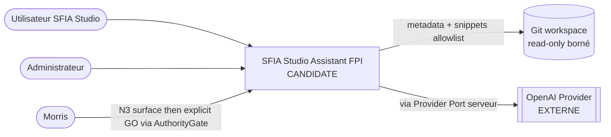
```mermaid
flowchart LR
  User([Utilisateur SFIA Studio])
  Admin([Administrateur])
  Morris([Morris])
  Studio[SFIA Studio Assistant FPI<br/>CANDIDATE]
  Git[(Git workspace<br/>read-only borné)]
  OpenAI[[OpenAI Provider<br/>EXTERNE]]
  User --> Studio
  Admin --> Studio
  Morris -->|N3 surface then explicit GO via AuthorityGate| Studio
  Studio -->|metadata + snippets allowlist| Git
  Studio -->|via Provider Port serveur| OpenAI
```

---

## 22. Diagramme containers

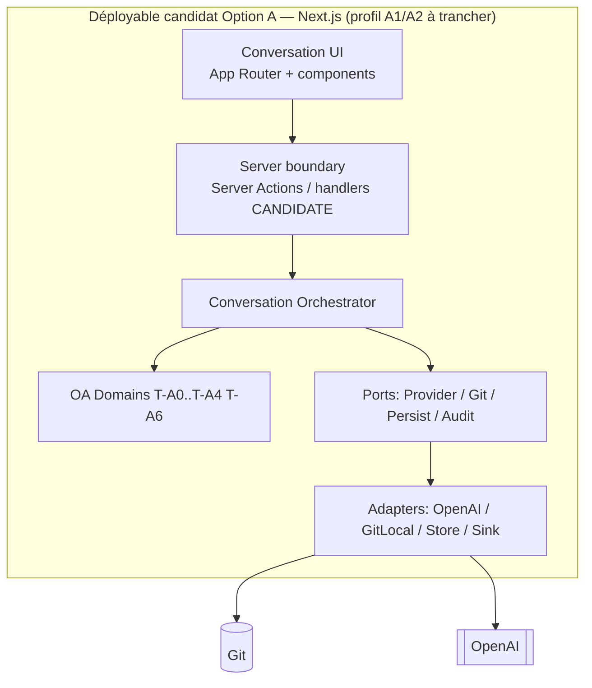
```mermaid
flowchart TB
  subgraph Deploy["Déployable candidat Option A — Next.js (profil A1/A2 à trancher)"]
    UI[Conversation UI<br/>App Router + components]
    SA[Server boundary<br/>Server Actions / handlers CANDIDATE]
    Orch[Conversation Orchestrator]
    Dom[OA Domains T-A0..T-A4 T-A6]
    Ports[Ports: Provider / Git / Persist / Audit]
    Adapters[Adapters: OpenAI / GitLocal / Store / Sink]
    UI --> SA --> Orch --> Dom
    Orch --> Ports --> Adapters
  end
  ExtGit[(Git)]
  ExtAI[[OpenAI]]
  Adapters --> ExtGit
  Adapters --> ExtAI
```

---

## 23. Diagramme composants


```mermaid
flowchart TB
  UI[ConversationUI]
  PC[ProjectContext]
  LPS[LivingProjectState]
  OR[ConversationOrchestrator]
  CL[IntentClassifier]
  SR[SourceDoctrineRouter]
  GG[GitContentGateway]
  RA[RedactionAllowlist]
  PP[ProviderPort]
  OA[OpenAIAdapter]
  SV[StructuredOutputValidation]
  N2[ConfirmationN2]
  N3[DecisionSurface_N3]
  AG[AuthorityGate_N3]
  EV[EvidenceClaimLinking]
  PS[ProjectPersistence]
  RP[RetentionPurge]
  UF[UsageFinOps]
  AU[Audit]
  OB[Observability]
  PR[ProviderResilience]
  AD[AdminConfiguration]
  UI --> OR
  OR --> CL
  OR --> PC
  OR --> LPS
  OR --> SR
  SR --> GG --> RA
  OR --> UF
  OR --> PP --> OA
  PP --> PR
  OR --> SV
  SV --> N2
  SV --> N3
  N3 --> AG
  AG --> PS
  SV --> EV
  OR --> AU
  OR --> OB
  PS --> RP
  AD --> PP
  AD --> RP
  AD --> UF
```

*F-ARCH-01 :* `AuthorityGate_N3` est serveur-side ; OpenAI Adapter **n’a aucun** rôle de décision/GO.
*F-ARCH-02 :* `UsageFinOps` / audit tentative provider sont branchés **autour** de `ProviderPort`, pas seulement après persist métier.


---

## 24. Domaines et responsabilités

| # | Domaine | Responsabilité | Entrées | Sorties | Déps OK | Déps interdites | Données | N | Erreur | Audit | Emplacement candidat | Statut |
|---|---|---|---|---|---|---|---|---|---|---|---|---|
| 1 | ConversationUI | Surface chat + panneaux | User events | Affichage états | OR, PC | Provider, secrets | UI state | N1–N3 | Messages UX | — | `app/` + `features/` + `components/` | Adaptation |
| 2 | ProjectContext | Résoudre Project isolé | projectId | Context | oa/project | Cross-project | Project | — | 404/deny | yes | `lib/oa/project` | Existant+adapt |
| 3 | LivingProjectState | LPS versionné | projectId | LPS snapshot/delta | T-A1 | Mutation silencieuse | LPS | N2 | Conflict | yes | `lib/oa/project` | Existant+persist |
| 4 | ConversationOrchestrator | Pipeline étapes | Request | Response + side-effects autorisés | tous domaines | SDK OpenAI direct | Correlation | N1–N3 | Localized | yes | **nouveau** `lib/assistant/orchestrator` *(candidat path)* | Nouveau |
| 5 | IntentClassifier | Hors-sujet + N1/N2/N3 | Message + context | Classification | UX rules | Provider-only decide | Class label | — | Ambigu→escalade | yes | nouveau + T-A3 | Nouveau |
| 6 | SourceDoctrineRouter | Doctrine/CKC/sources | Intent | Source set | T-A0/T-A2/sfia-context | v2.6 fallback | Pins | N2/N3 | Fail-closed | yes | `oa/doctrine`+platform | Existant |
| 7 | GitContentGateway | Lecture Git bornée | Paths | Snippets/meta | repository | Write Git | File meta | — | Deny | yes | `platform/repository` | Existant |
| 8 | RedactionAllowlist | Allowlist + redact | Content | Safe content | security | Bypass | RedactionRecord | — | Unknown fail-closed | yes | `platform/security` | Existant |
| 9 | ProviderPort | Contrat minimal | ProviderRequest | ProviderResponse | Resilience | Métier/Git/persist | Messages bornés | — | Normalized errors | yes | `platform/ai` | Existant aligné |
| 10 | OpenAIAdapter | Mapping SDK | Port request | Port response | openai pkg | Métier | Usage meta | — | Map errors | meta only | `openaiProvider.ts` | Existant candidat |
| 11 | StructuredOutputValidation | AF-02 ; pour N3 valide le **DecisionCandidate** (pas un GO Morris inexistant) | Raw / dossier candidat | Validated / reject | ajv? candidate | Partial apply ; valider GO avant surface | Schemas | N1 prog / N2–N3 strict | Fail-closed struct | yes | nouveau + oa ajv patterns | Adaptation |
| 12 | ConfirmationN2 | Drawer confirm | Delta | Confirm/Cancel | T-A3 | Silent apply | Confirmation | N2 | Cancel (provider audit déjà écrit) | yes | oa/decision + UI | Existant+UX |
| 13 | DecisionSurface_N3 | Surface forte N3 ; **aucune option pré-cochée** ; saisie Morris | DecisionCandidate validé | MorrisDecisionInput + GO explicite | UI + T-A3 | Provider décide/GO ; pré-cocher | DecisionCandidate | N3 | — | display | oa/decision + UI | Existant+UX |
| 13b | AuthorityGate_N3 | Vérifie autorité, rôle, décision/option, GO, portée, version dossier, non-consommation préalable, idempotence | MorrisDecisionInput | AuthorityValidation · GOConsumption · ExecutionAuthorization | Serveur only | Provider ; client-only trust | DecisionRecord · GOConsumptionRecord | N3 | Reject → aucune mutation | yes | **nouveau** serveur | Nouveau |
| 14 | EvidenceClaimLinking | Claim↔preuve | Claims | Linked evidence | T-A6 | Orphan claims | EvidenceReference | N2/N3 | Block incomplete | yes | oa/evidence-review | Existant |
| 15 | ProjectPersistence | Store Project-local sous contraintes F-ARCH-03 | Entities | Persisted | Store port | Cross-tenant ; embedded sans profil | See §39–40 | — | Conflict ; fail persist → pas d’autorisation N3 | yes | ADR persist | Candidat |
| 16 | RetentionPurge | TTL + delete | Policy | Purge result | Persist | Invent TTL value | RetentionPolicy | — | Partial purge flag | yes | nouveau | Candidat |
| 17 | UsageFinOps | Soft **pre-check** + metering **immédiat** post-tentative (indépendant métier) | Usage / soft cfg | Soft signals · UsageRecord · usageStatus | Port usage | Hard invent ; fake estimate ; conditionner à persist | UsageRecord · ProviderAttempt | N2 override | Soft warn ; no fake $ | yes | nouveau | Candidat |
| 18 | Audit | Lanes séparées : provider attempt · validation · N2 · N3 · mutation | Events | AuditEvent (typed) | Persist audit | Secrets ; confondre lanes | AuditEvent | — | N2/N3 FC si audit durable échoue | self | nouveau | Candidat |
| 19 | Observability | Logs/metrics/traces + ProviderAttemptStarted/Completed | Spans | Telemetry | Sink | PII/secrets | pipelineStage · providerCallId | — | — | limited | platform/observability | Adaptation |
| 20 | ProviderResilience | Timeout/retry/fallback ; émet outcomes pour toute tentative | Port errors | Degraded/fail-closed + ProviderAttemptOutcome | Port · UF · AU | Silent replay struct | Status · Outcome | N1 deg / N2–N3 FC | Visible | yes | nouveau wrapping port | Candidat |
| 21 | AdminConfiguration | Model/TTL/softcap | Admin | Config audited | Audit | User free model | ModelConfiguration | — | Deny unauthorized | yes | nouveau | Candidat |

*Aucun dossier créé ce cycle.*

---

## 25. Règles de dépendance


```mermaid
flowchart LR
  UI[ConversationUI] --> OR[Orchestrator]
  OR --> Dom[OA Domains]
  OR --> Ports[Ports]
  Ports --> Adapters[Adapters]
  Adapters --> Ext[[Externes]]
  UI -.->|interdit| Adapters
  Adapters -.->|interdit| Dom
```

**Autorisé :** UI → Orchestrator → Domains/Ports → Adapters → Externes.

**Interdit :**
- UI → OpenAI SDK / secrets ;
- Adapter OpenAI → Git / Persist / Decision métier / **AuthorityGate / GO** ;
- Domains → SDK OpenAI ;
- N2 apply sans Confirmation ; N3 apply sans **AuthorityGate + GOConsumption persistée** ;
- Valider/consommer un GO **avant** surface N3 ou **par** le provider ;
- Lecture Git sans Allowlist/Redaction ;
- Cross-Project reads ;
- T-A5 real execution dans FPI ;
- Conditionner l’audit/metering provider à une mutation métier réussie (**F-ARCH-02**).

---

## 26. Pipeline conversationnel


```mermaid
flowchart TD
  S1[1 Reception] --> S2[2 Project resolve]
  S2 --> S3[3 Authorization]
  S3 --> S4[4 Off-topic class]
  S4 --> S5[5 N1/N2/N3 class]
  S5 --> S6[6 Load LPS]
  S6 --> S7[7 Sources]
  S7 --> S8[8 Git fetch]
  S8 --> S9[9 Allowlist redaction]
  S9 --> S10[10 Build provider context]
  S10 --> S10b[10b FinOps soft pre-check]
  S10b --> S10c[10c ProviderAttemptStarted]
  S10c --> S11[11 Provider Port call]
  S11 --> S12[12 Receive or stream or fail]
  S12 --> S12b[12b ProviderAttemptOutcome + UsageRecord]
  S12b --> S13[13 Parse]
  S13 --> S14[14 Validate progressive or strict]
  S14 --> S15[15 Extract claims]
  S15 --> S16[16 Attach evidence]
  S16 --> S17[17 Candidate delta or DecisionCandidate]
  S17 --> S18[18 Prepare UI model]
  S18 --> S19[19 N2 confirm OR N3 surface then AuthorityGate]
  S19 --> S20[20 Persist métier if authorized]
  S20 --> S21[21 Audit métier final distinct]
  S21 --> S23[23 UI restitution]
```

| # | Étape | Composant | Entrée | Sortie | Validation | Erreur | Persist? | Métriques | Structurant? |
|---|---|---|---|---|---|---|---|---|---|
| 1 | Réception | UI→OR | UserMessage | Request | Authz base | Reject | non | recv | non |
| 2 | Project resolve | PC | projectId | Project | Exists+isol | Deny | non | | non |
| 3 | Autorisation | PC/AD | Actor | Allow | Role | Deny | audit | | non |
| 4 | Hors-sujet | CL | Text | In/Out scope | Rules | Mark off-topic | non (UX-07) | | non |
| 5 | Classif N1/N2/N3 | CL | Text+ctx | Level | Ambigu→escalade | Strict/escalade | audit | | gate |
| 6 | Load LPS | LPS | projectId | Snapshot | Version | Fail-closed N2/N3 | non | | si N2/N3 |
| 7 | Sources | SR | Intent | Sources | Doctrine pin | Fail-closed | non | | si struct |
| 8 | Git fetch | GG | Paths | Meta/snippets | Size TBD | Deny | non | | opt |
| 9 | Allowlist/redact | RA | Content | Safe | Unknown FC | Deny | RedactionRecord | | opt |
| 10 | Build context | OR | Safe ctx | ProviderRequest | Bounds | Truncate/deny | non | | |
| 10b | FinOps soft pre-check | UF | Soft cfg | Allow/warn | Soft only | Soft exceed signal | softcap audit | soft | non |
| 10c | ProviderAttemptStarted | AU/OB/UF | corr IDs | Attempt open | No secrets | — | attempt audit | start | non |
| 11 | Provider call | PP/PR | Request | Response/error/timeout/cancel | Timeout cfg | FPI-15 | non | latency | |
| 12 | Receive/fail | PP | Stream/full/err | Raw/outcome | — | Cancel/timeout/down | non | first_token | |
| 12b | Attempt outcome + usage | UF/AU | Outcome | ProviderAttemptOutcome · UsageRecord ou usageStatus=unavailable | **No invented usage** | Write fail → FC N2/N3 | **oui attempt** (avant métier) | usage | non |
| 13 | Parse | SV | Raw | AST/text | Progressive/strict | Reject | non | | |
| 14 | Validate | SV | AST/dossier | OK/Reject | AF-02 ; N3=DecisionCandidate | FC struct | validation audit | validation | |
| 15 | Claims | EV | Output | Claims | Link required struct | Block | non | | struct |
| 16 | Evidence attach | EV | Claims | Linked | T-A6 | Block | non | | struct |
| 17 | Delta / DecisionCandidate | LPS / N3 prep | Valid | Candidate | Schema dossier | Reject | non until gate | | N2/N3 |
| 18 | Prepare UI | OR | Result | ViewModel | — | Error VM | non | | |
| 19 | N2 confirm **ou** N3 surface → Morris input → AuthorityGate | N2 / N3 / AG | Candidate | Confirm / GOConsumption / reject | Explicit ; AG serveur | Cancel/reject ; **no auth if persist fail** | on accept atomique | | oui |
| 20 | Persist métier si autorisé | PS | Approved | Stored | Isol | Rollback | oui | | |
| 21 | Audit métier final | AU | Mutation/decision | AuditEvent métier | Distinct provider lane | — | oui | | |
| 23 | Restitution | UI | VM | Render | — | Error UX | — | | |

**F-ARCH-02 :** metering/audit provider (10b–12b) **avant** et **indépendants** de validation/persistance métier. Annulation N2 / rejet N3 / échec persist **ne suppriment pas** la trace de tentative.

**F-ARCH-01 :** pour N3, l’étape 14 valide le **DecisionCandidate** ; le GO Morris n’existe qu’**après** surface N3 ; AuthorityGate consomme ensuite.

**Étapes sans dépendance directe provider :** 1–10, 13–21, 23. Classification, validation dossier et AuthorityGate ne sont **pas** déléguées à l’adapter.

---

## 27. Classification N1/N2/N3

| Niveau | Exemples | Validation | Mutation | UI |
|---|---|---|---|---|
| N1 free-talk Project | Question LPS, explication | Progressive | Aucune | Chat |
| N1 hors-sujet | Off-topic | Progressive | Non mémorisé Project | Message |
| N2 | Delta LPS, export structurant | Stricte | Après confirm drawer | Drawer |
| N3 | Décision Morris + GO explicite | Stricte sur **DecisionCandidate** puis **AuthorityGate** sur input Morris | Après consommation GO atomique | Surface N3 (aucune option pré-cochée) |

**Flux N3 d’autorité (F-ARCH-01) — ordre obligatoire :**
1. Classifier → N3 ;
2. Préparer `DecisionCandidate` (question, options, reco candidate séparée, preuves, réserves, portée, autorité attendue, formulation **attendue** du GO) ;
3. `StructuredOutputValidation` stricte du **dossier candidat** (pas d’un GO encore inexistant) ;
4. Afficher surface forte N3 ;
5. Morris sélectionne explicitement + fournit GO explicite (`MorrisDecisionInput`) ;
6. `AuthorityGate` serveur vérifie identité/autorité, rôle, décision/option, GO, portée, version dossier, non-consommation préalable, idempotence ;
7. Provider **ne** vérifie / décide / consomme **jamais** le GO ;
8. Échec AG → aucune décision consommée, aucune autorisation, aucune mutation, raisons + audit rejet ;
9. Succès AG → `DecisionRecord` + `GOConsumptionRecord` atomiques ; échec persist → **aucune** autorisation ;
10. `ExecutionAuthorization` bornée éventuelle **après** consommation persistée ; exécution réelle **distincte** et hors présent cycle.

**Ambiguïté (R-TECH-AF02-BOUNDARY-01 OPEN) :** escalade ou traitement strict ; jamais apply depuis partiel.

Formalisation candidate (réserve reste OPEN) :
- Propriétaire classification : Orchestrator + IntentClassifier (pas l’adapter).
- Priorité : si doute structurant → N2/N3 path strict.
- Preuve d’escalade : AuditEvent `classification_escalated`.

---

## 28. Validation structurée (AF-02=C)

### N1 non structurant
Tolérance texte partiel · aucune mutation/décision · progressive · fallback borné FPI-15.

### N2 structurant — schéma obligatoire (conceptuel)
Champs candidats : `actionType`, `target`, `scope`, `before`, `after`, `evidenceRefs`, `reversibility`, `authority`, `classification`, `result`.

### N3 — validation du DecisionCandidate (pas du GO Morris)
Champs candidats du dossier : `question`, `options[]`, `recommendationCandidate` (séparée), `evidenceRefs`, `reserves`, `scope`, `expectedAuthority`, `expectedGOFormulation`, `dossierVersion`.

Le GO Morris réel n’est validé que par **AuthorityGate** après saisie humaine.

Rejet **fail-closed** si invalide. Aucune consommation partielle.

**AJV :** présent (`oa/*/ajv*`) — **recommandation d’étude candidate**, pas choix validé.

---

## 29. Séquence N1


```mermaid
sequenceDiagram
  participant U as User
  participant UI as ConversationUI
  participant OR as Orchestrator
  participant CL as Classifier
  participant UF as UsageFinOps
  participant PP as ProviderPort
  participant AU as Audit
  participant SV as Validation
  U->>UI: Message Project
  UI->>OR: Request
  OR->>CL: Classify
  CL-->>OR: N1 in-scope
  OR->>UF: Soft pre-check
  OR->>AU: ProviderAttemptStarted
  OR->>PP: ProviderRequest
  PP-->>OR: Text or error
  OR->>AU: ProviderAttemptOutcome
  OR->>UF: UsageRecord or usageStatus=unavailable
  OR->>SV: Progressive validate
  SV-->>OR: OK text
  Note over AU,UF: Attempt audit/metering already durable independent of business persist
  OR-->>UI: Reply (no decision)
  UI-->>U: Affiche
```

---

## 30. Séquence N2


```mermaid
sequenceDiagram
  participant U as User
  participant OR as Orchestrator
  participant UF as UsageFinOps
  participant PP as ProviderPort
  participant AU as Audit
  participant SV as StrictValidation
  participant N2 as ConfirmationN2
  participant PS as Persistence
  U->>OR: Demande delta LPS
  OR->>UF: Soft pre-check
  OR->>AU: ProviderAttemptStarted
  OR->>PP: Call
  PP-->>OR: Raw or fail
  OR->>AU: ProviderAttemptOutcome
  OR->>UF: Usage or unavailable
  OR->>SV: Strict schema
  alt invalid
    SV-->>OR: Reject fail-closed
    Note over AU,UF: Provider attempt still recorded
    OR-->>U: Erreur + action sûre
  else valid
    SV-->>OR: LPSDeltaCandidate
    OR->>N2: Open drawer
    alt confirm
      N2->>PS: Apply
      N2->>AU: Business mutation audit
      PS-->>U: LPS updated
    else cancel
      N2->>AU: N2 cancel audit
      Note over AU,UF: Provider attempt NOT deleted
      N2-->>U: Aucune mutation
    end
  end
```

---

## 31. Séquence N3


```mermaid
sequenceDiagram
  participant M as Morris
  participant OR as Orchestrator
  participant UF as UsageFinOps
  participant PP as ProviderPort
  participant AU as Audit
  participant SV as StrictValidation
  participant N3 as DecisionSurface_N3
  participant AG as AuthorityGate
  participant PS as Persistence
  Note over OR,PP: Provider may help prepare DecisionCandidate only — never validates GO
  OR->>UF: Soft pre-check
  OR->>AU: ProviderAttemptStarted
  OR->>PP: Optional assist call
  PP-->>OR: Candidate materials or fail
  OR->>AU: ProviderAttemptOutcome
  OR->>UF: Usage or unavailable
  OR->>SV: Strict validate DecisionCandidate dossier
  alt dossier invalid
    SV-->>OR: Reject fail-closed
    OR-->>M: Erreur dossier
  else dossier valid
    OR->>N3: Affiche surface N3 (no preselect)
    M->>N3: MorrisDecisionInput + explicit GO
    N3->>AG: Server AuthorityValidation
    alt AG fail
      AG->>AU: Reject audit
      AG-->>M: Raisons — no consumption, no mutation, no authorization
    else AG ok
      AG->>PS: Atomic DecisionRecord + GOConsumptionRecord
      alt persist fail
        PS-->>AG: Fail
        AG->>AU: Persist-fail audit
        AG-->>M: No authorization issued
      else persist ok
        AG-->>OR: ExecutionAuthorization bounded
        AG->>AU: N3 consumption audit
        Note over AG: Real execution remains separate and out of this cycle
        AG-->>M: Décision tracée
      end
    end
  end
```

---

## 32. Séquence provider indisponible


```mermaid
sequenceDiagram
  participant OR as Orchestrator
  participant UF as UsageFinOps
  participant PR as ProviderResilience
  participant PP as ProviderPort
  participant AU as Audit
  participant UI as UI
  OR->>UF: Soft pre-check
  OR->>AU: ProviderAttemptStarted
  OR->>PR: Call
  PR->>PP: Attempt
  PP-->>PR: Unavailable
  PR->>AU: ProviderAttemptOutcome=unavailable
  UF->>AU: usageStatus=unavailable (no invented usage)
  alt N1 non structurant
    PR-->>UI: Mode dégradé borné / retry visible
  else N2/N3 structurant
    PR-->>UI: Fail-closed — aucun apply/décision/mutation
  end
```

---

## 33. Git allowlist / redaction

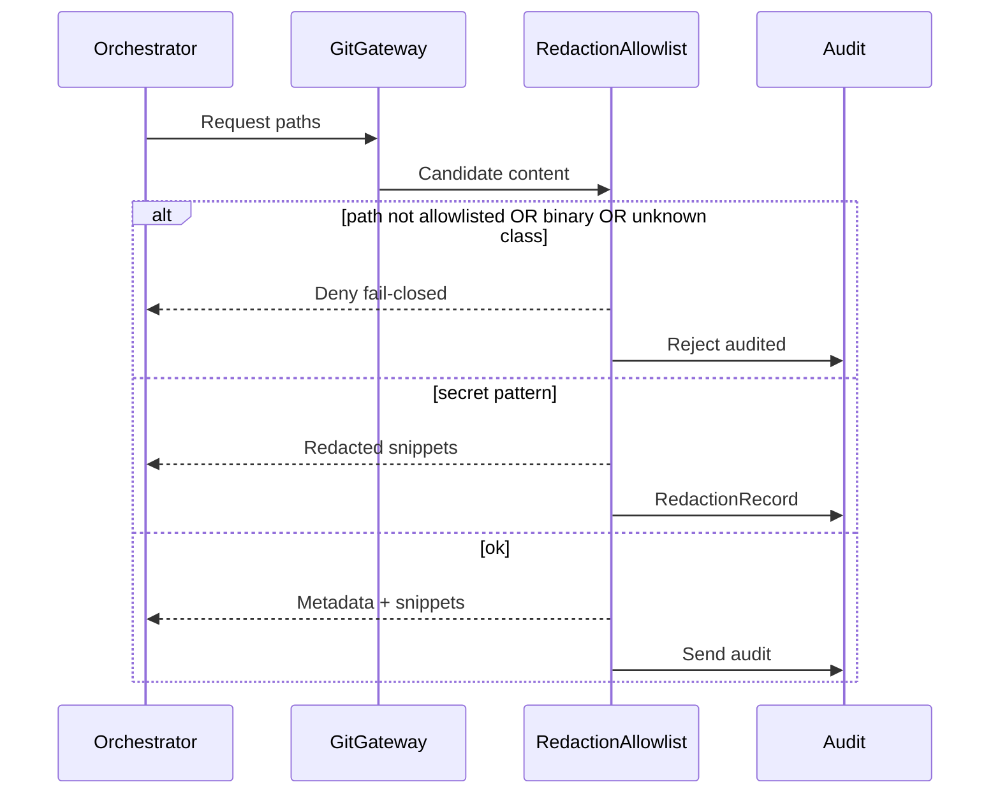
```mermaid
sequenceDiagram
  participant OR as Orchestrator
  participant GG as GitGateway
  participant RA as RedactionAllowlist
  participant AU as Audit
  OR->>GG: Request paths
  GG->>RA: Candidate content
  alt path not allowlisted OR binary OR unknown class
    RA-->>OR: Deny fail-closed
    RA->>AU: Reject audited
  else secret pattern
    RA-->>OR: Redacted snippets
    RA->>AU: RedactionRecord
  else ok
    RA-->>OR: Metadata + snippets
    RA->>AU: Send audit
  end
```

Bornes de taille : **à définir en implémentation / ADR** — aucune valeur inventée ici.

---

## 34. Provider Port (contrat conceptuel)

| Champ | Description |
|---|---|
| requestId / correlationId / projectId | Corrélation |
| mode | N1 \| N2 \| N3 |
| messages | Bornés, déjà redactés |
| structuredInstruction | Optionnel selon mode |
| modelRef | Identifiant **abstrait** admin (pas nom marketing imposé ici) |
| streaming | Autorisé N1 candidat ; structurant selon ADR-ASST-STREAM-01 |
| timeout | Configurable — valeur `TO_BE_DECIDED` |
| response | Text / structured payload candidate |
| usage | tokens nullable |
| providerStatus | ok \| degraded \| unavailable |
| errors | Codes normalisés |
| cancellation | Supporté |

**TO BE VERIFIED AGAINST OFFICIAL OPENAI DOCUMENTATION DURING IMPLEMENTATION PREPARATION** pour tout détail API/SDK/endpoint.

---

## 35. OpenAI Adapter

Responsabilités : mapping SDK · isolation secrets · mapping erreurs · extraction usage.

**Interdit :** choix métier · contourner validation · accès Git · persistance · décider Morris · exposer clé.

Aucun modèle/endpoint/région/tarif sélectionné par ce document.

---

## 36. Project Context

Isolation stricte par `projectId`. Chargement doctrine pin (T-A0). Refus cross-project. Aligné pages `app/projects/*` existantes (UI) + `oa/project` (domaine).

---

## 37. Living Project State

LPS versionné (T-A1). Lecture libre N1. Mutation uniquement via N2 confirmée. Delta candidat jamais appliqué silencieusement (UX + FPI).

---

## 38. Preuves et claims

Toute sortie structurante expose claims liés à EvidenceReference (T-A6). Claim orphelin → block. Expert panel consomme les mêmes liens (contrat UX).

---

## 39. Modèle conceptuel de données

```mermaid
erDiagram
  Project ||--o{ Conversation : has
  Conversation ||--o{ Message : contains
  Project ||--o| ProjectContext : has
  Project ||--o{ LPSSnapshot : versions
  LPSSnapshot ||--o{ LPSDeltaCandidate : proposes
  Project ||--o{ DecisionCandidate : prepares
  DecisionCandidate ||--o| DecisionRecord : may_become
  DecisionRecord ||--o| GOConsumptionRecord : consumes_with
  DecisionRecord ||--o| Confirmation : may_require
  Project ||--o{ Reserve : tracks
  Message ||--o{ Claim : extracts
  Claim }o--o{ EvidenceReference : links
  Claim }o--o{ SourceReference : cites
  Message ||--o{ ProviderAttempt : triggers
  ProviderAttempt ||--o| ProviderRequest : may_have
  ProviderAttempt ||--o| ProviderAttemptOutcome : yields
  ProviderAttempt ||--o| UsageRecord : meters
  ProviderAttempt ||--o{ RedactionRecord : redacts
  Project ||--o{ AuditEvent : audits
  Project ||--o| RetentionPolicy : retains
  Project ||--o| ModelConfiguration : configures
  GOConsumptionRecord ||--o| ExecutionAuthorization : may_emit
```

| Objet | ID | Scope | Champs conceptuels | Sensible? | Conservation | Mutabilité | Owner | Audit | Suppression | Exclusions |
|---|---|---|---|---|---|---|---|---|---|---|
| Project | projectId | self | name, pins | faible | durable produit | admin | Product | yes | soft/hard TBD | — |
| Conversation | conversationId | Project | createdAt | contenu | TTL policy | append | Assistant | yes | purge | secrets |
| Message | messageId | Conv | role, text, level | possible PII | TTL | immutable | Assistant | yes | purge | system prompt |
| ProjectContext | projectId | Project | doctrinePin, meta | — | durable | controlled | Product | yes | with project | — |
| LPSSnapshot | lpsId+ver | Project | state | métier | durable | versioned | Product | yes | governed | scores internes |
| LPSDeltaCandidate | deltaId | Project | before/after | métier | until confirm/reject | temp | Assistant | yes | drop on cancel | — |
| DecisionCandidate | dossierId+ver | Project | question, options, recoCandidate, evidences, reserves, scope, expectedAuthority, expectedGOFormulation | métier | until consume/reject | versioned | Assistant | yes | drop on reject | **not a Morris GO** |
| MorrisDecisionInput | inputId | Project | selectedOption, explicitGO, actor | métier | with consumption | immutable | Morris | yes | — | provider-authored GO |
| DecisionRecord | decisionId | Project | decision, authority, scope | métier | durable | immutable | Morris/Product | yes | governed | — |
| GOConsumptionRecord | consumptionId | Project | goText, dossierVersion, idempotencyKey | métier | durable | consume-once | AuthorityGate | yes | — | — |
| ExecutionAuthorization | authzId | Project | bounded scope | métier | short/governed | consume-once | AuthorityGate | yes | — | silent exec |
| Confirmation | confirmationId | Project | N2 payload | métier | with decision | consume-once | Product | yes | — | — |
| Reserve | reserveId | Project | status | — | durable | update | Product | yes | — | — |
| EvidenceReference | evidenceId | Project | uri/digest | — | durable | immutable | Product | yes | — | raw secrets |
| Claim | claimId | Message | text, status | — | with message/decision | update status | Product | yes | — | — |
| SourceReference | sourceId | Project | path/pin | path | durable | immutable | Product | yes | — | full files |
| ProviderAttempt | providerCallId | Project | startedAt, classification, corr IDs | meta | durable attempt lane | immutable | Tech | yes | — | secrets/content interdit |
| ProviderRequest | requestId | Attempt | meta only | **no raw secrets** | with attempt | immutable | Tech | meta | redact | full prompt system |
| ProviderAttemptOutcome | outcomeId | Attempt | status, errorCategory, latencies, cancellation/timeout | faible | with attempt | immutable | Tech | yes | — | raw CoT |
| UsageRecord | usageId | Attempt/Project | tokens nullable · usageStatus=available\|unavailable | — | FinOps retain TBD | immutable | Admin | yes | — | invented tariffs/estimates |
| AuditEvent | auditId | Project | type/lane, corr | controlled | durable audit | immutable | Compliance | self | legal TBD | secrets |
| RetentionPolicy | policyId | Project | TTL config ref | — | durable | admin | Admin | yes | — | **no numeric default invented** |
| ModelConfiguration | configId | Project/Global | abstract modelRef | — | durable | admin audited | Admin | yes | — | user free choice |
| RedactionRecord | redactionId | Attempt | rules hit | meta | audit | immutable | Sec | yes | — | original secret |

**F-ARCH-02 :** `ProviderAttempt` existe même sans réponse réussie (timeout, cancel, unavailable, invalid output).

---

## 40. Persistance

### Options
| Option | Pros | Cons | Fit FPI |
|---|---|---|---|
| Store local embarqué (fichier/SQLite-like) | Simple, Project-local, purge | **Seulement** sous profil durable mono-instance single-writer | Candidate **A1** seulement |
| Base relationnelle externe / store durable externe | Mature, concurrence | Ops | **Requis** pour A2 / B1 / serverless / multi-instance |
| Fichiers structurés / append-only | Audit-friendly | Concurrence, query | Audit lane candidate |

### Compatibilité (rappel F-ARCH-03)
Voir matrice §18. Embedded **interdit** sur serverless/éphémère ; **non validé** multi-instance.

**Recommandations candidates (NON DÉCIDÉES) :**
- Bundle **A1** : embedded Project-local + lane audit append-only logique **si** contraintes §18 acceptées.
- Bundle **A2/B1** : store externe durable.

**ADR-ASST-PERSIST-01** couplé à **ADR-ASST-TOPO-01** / **SERVER-01** / **PURGE-01** / **AUDIT-STORE-01** / **HEALTH-01**.

Séparation : opérationnel · audit provider · audit métier · preuves · config · métriques · docs Git.

### Cycle de vie des données conversationnelles

```mermaid
stateDiagram-v2
  [*] --> Received: user message
  Received --> Classified: IntentClassifier
  Classified --> ProviderAttempted: soft pre-check + attempt started
  ProviderAttempted --> AttemptRecorded: outcome+usage always
  AttemptRecorded --> Validated: AF-02
  Validated --> EphemeralN1: N1 no Project memory of off-topic
  Validated --> PendingN2: delta candidate
  Validated --> PendingN3: DecisionCandidate surface
  PendingN2 --> Persisted: confirm
  PendingN2 --> Discarded: cancel or reject
  PendingN3 --> AuthorityChecked: MorrisDecisionInput + GO
  AuthorityChecked --> Persisted: atomic GOConsumption
  AuthorityChecked --> Discarded: AG reject or persist fail
  EphemeralN1 --> RetainedUnderTTL: in-scope N1 history
  Persisted --> RetainedUnderTTL
  RetainedUnderTTL --> Purged: TTL or user delete
  AttemptRecorded --> AttemptRetained: independent of Discarded
  Purged --> [*]
```

---

## 41. TTL et purge

- Politique TTL **Project** décidée (FPI-08=B).
- Durée : **CONFIG-ADMIN-NO-VALUE** · R-TECH-TTL-01 OPEN.
- Droits suppression utilisateur + purge admin.
- Hors-sujet non mémorisé.
- Sauvegardes futures doivent respecter purge (hypothèse ops).
- Mécanisme purge = **ADR-ASST-PURGE-01**.

---

## 42. Sécurité

Principes : deny-by-default paths · redact · server-only secrets · fail-closed structurant · isolation Project · pas de spoof GO · validation non contournable · pas d’appel provider browser.

**Sécurité non validée.**

---

## 43. Threat model (documentaire)

| Menace | Actif | Source | Vecteur | Impact | Préventif | Détectif | Fail-closed | Preuve | Résiduel | Gate |
|---|---|---|---|---|---|---|---|---|---|---|
| Prompt injection fichier Git | Intégrité décision | Fichier repo | Contenu hostile | Mauvaise action | Allowlist+human N2/N3 | Audit content hash | Struct | Audit | Moyen | Impl |
| Exfiltration secret | Secrets | Git/logs | Snippet | Fuite | Redaction+deny .env | RedactionRecord | Deny | Audit | Faible-moyen | Impl |
| Chemin non allowlist | Confid. | Attacker/tool | Path traversal | Fuite | pathPolicy | Deny log | Deny | Audit | Faible | — |
| Binaire | Disponibilité | Git | Binary upload | Token waste | Refuse binary | — | Deny | Audit | Faible | — |
| PII inutile | PII | User/Git | Over-share | RGPD | Minimisation | Review | — | — | Moyen | RGPD |
| Contamin. Projects | Isolation | Bug | Wrong id | Fuite cross | Scope checks | Tests | Deny | Audit | Faible | — |
| Spoof GO | Autorité | UI/API/provider | Fake GO / provider « valide » GO | Fausse décision | Surface N3 + **AuthorityGate serveur** + idempotence ; provider sans autorité (**F-ARCH-01**) | Audit rejet AG | Reject | Decision/AG | Moyen | Authz ADR |
| Contournement schema | Intégrité | Adapter | Partial apply | Mutation illégale | OR enforces SV | Reject metrics | FC | Audit | Faible | — |
| Provider from browser | Secrets | Client | SDK client | Key leak | Server-only import | Bundle scan | — | — | Faible si respect | CI future |
| Key exposure | Key | Env/logs | Log leak | Account abuse | No log key | Secret scan | — | — | Moyen | Ops |
| Model change unauthorized | Coût/qualité | Attacker | Admin API | Drift | Authz admin+audit | Audit config | Deny | Audit | Moyen | Authz |
| Replay N2/N3 | Intégrité | Network | Replay token | Double apply | Idempotency keys | Dedupe | Reject | Audit | Moyen | Impl |
| Double consommation | Intégrité | Race | Double confirm | Double mutation | Consume-once | Conflict | Reject | Audit | Moyen | Persist ADR |
| Sensitive logs | Confid. | Obs | Log body | Fuite | Redact logs | Review | — | — | Moyen | Obs ADR |
| Coût abusif | FinOps | User/loop | Flood | $ | Soft **pre-check** + metering transverse toute tentative (**F-ARCH-02**) | UsageRecord même si reject/cancel | Soft warn | Usage/Attempt | **Hard OPEN** | Pilot |
| Provider compromise | Intégrité | Provider | Bad output | Bad decision | Strict validate+human | Anomaly | FC struct | Audit | Moyen | — |
| Provider down | Dispo | Provider | Outage | Blocage | Degraded N1 | Status | FC struct | — | Moyen | — |
| Preuve falsifiée | Confiance | Attacker | Fake evidence | Fausse maturité | Digests T-A6 | Verify | Block | Evidence | Moyen | — |
| Purge incomplète TTL | RGPD | Bug | Orphan copies | Retention excess | Purge checklist | Audit purge | Flag | Audit | **TTL OPEN** | RGPD |

---

## 44. RGPD

**RGPD CONSIDERATIONS DOCUMENTED — VALIDATION PENDING**

Catégories : messages user · LPS métier · audit · usage meta · Git snippets · config admin.

Minimisation · finalité Assistant Project · isolation · durée configurable (pas de durée inventée) · suppression/purge · export candidat futur · logs redactés · provider = sous-traitance **à contractualiser hors ce cycle** · hors-sujet non stocké · pas d’avis juridique · pas de DPA/base légale inventée.

R-TECH-TTL-01 reste OPEN.

---

## 45. FinOps

**Cycle de vie metering (F-ARCH-02) :**
1. Soft pre-check **avant** appel provider ;
2. `ProviderAttemptStarted` ;
3. Appel provider ;
4. Immédiatement après tentative (succès, invalide, timeout, cancel, erreur, indisponible, partiel) : `ProviderAttemptOutcome` + `UsageRecord` **ou** `usageStatus=unavailable` ;
5. **Interdit** d’inventer usage/estimation ;
6. **Interdit** de conditionner l’enregistrement à validation/persistance métier, annulation N2 ou rejet N3 ;
7. Soft cap configurable **sans valeur inventée** · alerte · override soft aligné N2 · admin · corrélation Project ;
8. Échec d’écriture durable audit/metering : **fail-closed** pour N2/N3 selon niveau de preuve exigé ; pour N1 comportement candidat documenté **sans** le déclarer décidé ; **aucune** fausse réussite FinOps affichée.

Hard cap : **DEFER-BEFORE-PILOT** · R-TECH-FINOPS-HARD-01 OPEN.

Aucun tarif/quota/tokens/seuil/devise inventés. Pas de plateforme obs/stockage audit choisie.

---

## 46. Performance

Points de mesure : réception · resolve Project · Git · redaction · prep provider · first token · complete · validation · persist · UI.

Objectifs : **TO_BE_DECIDED** (pas de SLO inventé).

Distinctions : latence perçue / provider / locale · taille contexte · coût validation · streaming · timeout · annulation.

---

## 47. Résilience

Erreurs normalisées · timeout configurable (`TO_BE_DECIDED`) · retry borné (**nombre non inventé**) · circuit breaker **candidat** · cancellation · idempotence N2/N3 + **GOConsumption** · déduplication · corrélation · reprise · provider status visible · dégradé N1 · fail-closed structurant · **pas de rejeu silencieux**.

Toute tentative provider produit un outcome audit/metering (**F-ARCH-02**), y compris timeout/cancel/unavailable.

Pas de file/bus décidé (AF-01).

---

## 48. Observabilité

Taxonomie candidate : correlationId · projectId · conversationId · requestId · decisionId · confirmationId · providerCallId · evidenceId · pipelineStage · classification · validationResult · providerStatus · ProviderAttemptStarted/Completed/Failed/Cancelled/TimedOut · usage · usageStatus · latency · retry · errorCode · redactionResult · allowlistResult · softCapResult · authorityValidationResult · goConsumptionId.

Séparer :
1. telemetry / audit de **tentative provider** ;
2. audit de **validation structurée** ;
3. audit **N2** confirm/cancel ;
4. audit **N3** décision/rejet/consommation ;
5. audit de **mutation métier** ;
6. UsageRecord / FinOps ;
7. EvidenceReference / preuves UX.

**Jamais logger :** prompt système · secrets · clé · scores internes · raisonnement interne · Git non autorisé · PII inutile.

Pas de plateforme obs choisie.

---

## 49. Audit

AuditEvent immutable Project-scoped, **typé par lane** :
- provider attempt start/outcome ;
- softcap pre-check ;
- allow/deny Git · redaction ;
- validation accept/reject ;
- N2 confirm/cancel ;
- N3 surface shown · AG reject · GOConsumption · persist-fail ;
- mutation métier ;
- purge · admin config.

**F-ARCH-02 :** lane provider ≠ lane métier. Une annulation N2 ou un rejet N3 **ne purge pas** la lane provider.

---

## 50. Administration

Admin (pas user libre) : modelRef abstrait · TTL duration config · soft cap thresholds · allowlist adjustments (gouvernance future).

Tous changements audités (FPI-09).

---

## 51. Exploitabilité

Env candidats (non créés) : secret provider serveur · modelRef · TTL · softcap · feature flags · profil déploiement (durable|ephemeral|multi).

Health/readiness candidats · purge jobs · backup/restore respectant purge · rollback · **aucun .env créé** · **aucune CI créée**.

Si profil ≠ durable mono-instance → **ne pas** déployer embedded (**F-ARCH-03**).

---

## 52. Déploiement candidat

```mermaid
flowchart TB
  Edge[HTTPS] --> Next[Next.js modular monolith CANDIDATE]
  Next --> Profile{Deployment profile}
  Profile -->|A1 durable mono-instance single-writer| Emb[(Embedded Project store CANDIDATE)]
  Profile -->|A2 ephemeral serverless or multi-instance| Ext[(External durable store REQUIRED)]
  Profile -->|B1 separate service| Svc[Service + durable store]
  Next --> GitRO[Git read-only]
  Next --> OpenAI[[OpenAI]]
```

| Profil | Store | Statut |
|---|---|---|
| Durable mono-instance | Embedded candidate sous contraintes | A1 |
| Éphémère / serverless | Embedded **incompatible** | A2 externe |
| Multi-instance | Embedded **non validé** | Externe ou nouvelle décision Morris |
| Service séparé | Store service/externe | B1 |

Aucune plateforme de déploiement réelle sélectionnée.

---

## 53. DevOps fit

Fit avec scripts existants `lint/typecheck/test/e2e/build`. Extension future tests Assistant (y compris assert attempt audit sur reject/cancel).

Le profil de déploiement doit être déclaré avant choix persist (**dépendance ADR TOPO↔PERSIST**). Pas de workflow GitHub modifié ce cycle.

---

## 54. Stratégie de tests candidate

| Famille | Objectif | Composant | Simulé | Preuve | Risques |
|---|---|---|---|---|---|
| Unit pipeline steps | Local correctness | OR stages | ports | pass/fail | regressions |
| Classification | N1/N2/N3/hors-sujet | CL | — | cases | ambiguïté |
| Validation progressive | N1 | SV | — | partial ok | false strict |
| Validation stricte | N2/N3 | SV | — | reject | bypass |
| Ports | Contract | PP/GG | fake | conformance | lock-in |
| Adapter simulé | Mapping | OA fake | fake | usage/errors | live dependency |
| Allowlist/redaction | FPI-07 | RA | fixtures | deny/redact | leak |
| Project isolation | FPI-03 | PC/PS | two projects | deny cross | leak |
| TTL/purge | FPI-08 | RP | clock | deleted | orphans |
| FinOps soft pre+post | FPI-14 · F-ARCH-02 | UF | usage/unavailable | warn ; attempt always | fake $ ; missing attempt |
| Attempt audit transverse | F-ARCH-02 | AU/UF | success/fail/timeout/cancel | outcome present after reject/cancel | lost metering |
| Fallback | FPI-15 | PR | down | FC/degraded + outcome | silent replay |
| N3 AuthorityGate | F-ARCH-01 | AG | fake Morris input | consume-once ; no auth on persist fail | provider GO ; preselect |
| N1/N2/N3 E2E futurs | UX contracts | UI | fake provider | screens | drift Figma |
| Idempotence | Double confirm/GO | N2/N3/AG | replay | single apply/consume | double mut |
| Audit lanes | Events | AU | — | provider≠métier | missing trail |
| Adversarial | Injection/secret | GG/RA/SV | hostile fixtures | deny | injection |
| Integration | Composition OA | Domains | memory | bridge | rewrite creep |

**Aucun test créé ce cycle.**

---

## 55. Compatibilité T-A0…T-A7

| Lot | Preuve repo | Réutilisation FPI | Adaptation | Hors FPI | Dette | Risque |
|---|---|---|---|---|---|---|
| T-A0 | `lib/oa/doctrine` + tests | AS-IS resolve | Bridging chat | — | Fixture registry | Pin stale |
| T-A1 | `lib/oa/project` | LPS/Project | Persist Project | — | Memory | Data loss |
| T-A2 | `lib/oa/cycle` | CKC/epistemic/trajectory | Bridging | — | UI gap | Wrong cycle |
| T-A3 | `lib/oa/decision` | N2/N3 | UX surfaces | — | — | Silent decide |
| T-A4 | `lib/oa/execution-contract` | Prep only | — | Cursor réel | — | Scope creep |
| T-A5 | `lib/oa/execution-attempt` fake | **Fake only** | — | **Real agents** | — | Accidental live |
| T-A6 | `lib/oa/evidence-review` | Claims/maturity | Chat proofs | — | — | Orphan claims |
| T-A7 | `lib/oa/execution-run` + `platform/t-a7` | Lecture bornée / statut | Pas completion claim | Live providers as « done » | INTERNAL_ONLY | Overclaim |

**FPI-02=B :** compose T-A0…T-A4 + T-A6 ; T-A5 hors ; anti-rewrite ; dette bridging chat explicite (Ops1 ≠ produit FPI).

---

## 56. Scénarios techniques

| # | Scénario | Acteur | Précond | Flux | Erreurs | Données | Audit | UI | Stop/FC | Réserve |
|---|---|---|---|---|---|---|---|---|---|---|
| 1 | N1 free-talk Project | User | Project | Pipeline N1 | Provider soft fail | Msg TTL | request | Reply | — | — |
| 2 | N1 hors sujet | User | — | Classify off | — | Non mémorisé Project | classif | Notice | — | — |
| 3 | N1 Git allowlist | User | Paths OK | GG+RA+PP | Deny path | Snippets | send | Reply+sources | — | — |
| 4 | N2 delta LPS | User | LPS | Strict+drawer | Invalid schema | Delta temp | confirm | Drawer | FC invalid | — |
| 5 | N2 annulé | User | Drawer open | Cancel | — | No mutate ; **ProviderAttempt retained** | cancel + attempt | Closed | — | — |
| 6 | N2 invalid provider out | User | N2 | Strict reject after attempt metered | Schema fail | Attempt+usage/unavailable | reject + attempt | Error+safe | FC | AF02 |
| 7 | N3 décision Morris | Morris | DecisionCandidate valid | Surface → Morris input+GO → AG → atomic consume | AG/persist fail | DecisionRecord+GOConsumption | AG/consumption | Strong UI | FC if AG/persist fail ; **no auth** | — |
| 8 | N3 GO incorrect / incomplete | Morris | Surface shown | AG rejects | Missing/invalid GO/fields/version/idempotency | None consumed | AG reject | Reasons | FC | — |
| 9 | Provider down N1 | User | N1 | Soft pre + attempt + unavailable outcome + degraded | Unavailable | Attempt ; usageStatus=unavailable | attempt | Visible degraded | No silent | — |
| 10 | Provider down N2/N3 | User | Struct | Soft pre + attempt + FC métier | Unavailable | Attempt recorded ; no apply | attempt + FC | Block+safe | FC | — |
| 11 | Git secret | System | File | Redact/deny | Secret hit | RedactionRecord | redact | Safe/deny | Deny raw | — |
| 12 | Path non autorisé | System | Bad path | Deny | PATH_NOT_ALLOWED | — | deny | Error | FC | — |
| 13 | Classif ambiguë | System | Borderline | Escalade/strict | Ambiguity | — | escalated | Ask/strict | Prefer strict | R-TECH-AF02-BOUNDARY-01 |
| 14 | Soft cap dépassé | User | Soft cfg | Warn+N2 override path | Soft exceed | UsageRecord | softcap | Warning | Soft only | R-TECH-FINOPS-HARD-01 |
| 15 | Delete conversation | User | Conv exists | Delete | — | Removed | delete | Updated list | — | — |
| 16 | Expiration TTL | System | Policy set | Purge job | Partial | Purged | purge | Gone | Flag partial | R-TECH-TTL-01 |
| 17 | Admin model change | Admin | Authz | Update modelRef | Deny user | ModelConfiguration | config | — | — | — |
| 18 | Audit décision/preuve | Auditor | Decision | Read audit | — | Audit+evidence | — | Expert | — | — |

---

## 57. Matrice de traçabilité décisions → composants

| Décision | Composants |
|---|---|
| AF-01=C | ConversationOrchestrator · Observability |
| AF-02=C | IntentClassifier · StructuredOutputValidation · R-TECH-AF02-BOUNDARY-01 |
| FPI-02=B | OA T-A0…T-A4,T-A6 · anti T-A5 real · bridging debt |
| FPI-03=B | ProjectPersistence · ProjectContext · LPS |
| FPI-07=B | GitContentGateway · RedactionAllowlist · Audit |
| FPI-08=B | RetentionPurge · AdminConfiguration · R-TECH-TTL-01 |
| FPI-09=B | AdminConfiguration · ProviderPort modelRef |
| FPI-10=B | ProviderPort · OpenAIAdapter |
| FPI-14=B | UsageFinOps · R-TECH-FINOPS-HARD-01 |
| FPI-15=B | ProviderResilience · UI status |
| UX N2/N3/GO | ConfirmationN2 · DecisionSurface_N3 · AuthorityGate_N3 · ConversationUI |
| F-ARCH-01 | DecisionCandidate · AuthorityGate · GOConsumption · no provider authority |
| F-ARCH-02 | UsageFinOps · ProviderAttempt · Audit lanes |
| F-ARCH-03 | TOPO↔PERSIST↔SERVER↔PURGE↔AUDIT↔HEALTH |
| AF-04=B | Review Handoff process (hors runtime app) |

---

## 58. ADR candidates

Statut commun : **ADR CANDIDATE — NOT DECIDED — MORRIS DECISION REQUIRED**

| ID | Question | Options | Reco candidate | Gate |
|---|---|---|---|---|
| ADR-ASST-TOPO-01 | Topologie ? | A monolith · B split · C distributed | **A** sous profil déploiement explicite | Décisions Archi |
| ADR-ASST-PERSIST-01 | Persistance physique ? | Embedded · externe durable · files | **Embedded seulement si A1** ; sinon externe | Décisions Archi |
| ADR-ASST-SERVER-01 | Frontière serveur Next ? | Server Actions · Route handlers · Hybrid | Hybrid minimal | Décisions Archi |
| ADR-ASST-PURGE-01 | Mécanisme purge TTL ? | Job · lazy · hybrid | Hybrid candidate ; compatible backups | Avant pilote / RGPD |
| ADR-ASST-AUDIT-STORE-01 | Audit vs opérationnel ? | Same store · separate lane | Separate logical lane ; provider≠métier | Décisions Archi |
| ADR-ASST-STREAM-01 | Streaming ? | N1 only · all · none | N1 only candidate | Décisions Archi |
| ADR-ASST-VALIDATE-LIB-01 | Lib validation ? | ajv reuse · other · hand | Study ajv reuse | Décisions Archi |
| ADR-ASST-SECRETS-01 | Gestion secrets ? | Env server · secret manager | Env server FPI · manager later | Impl prep |
| ADR-ASST-ADMIN-AUTHZ-01 | Authz admin + AuthorityGate acteurs ? | Existing auth · new role | Role admin + Morris authz N3 | Avant admin/N3 UI |
| ADR-ASST-HEALTH-01 | Health/readiness ? | Minimal /live · deep deps | Minimal + provider optional probe ; profil-aware | Impl |

### Matrice de dépendances ADR (**F-ARCH-03**)

```mermaid
flowchart LR
  TOPO[ADR-ASST-TOPO-01] --> PERSIST[ADR-ASST-PERSIST-01]
  TOPO --> SERVER[ADR-ASST-SERVER-01]
  PERSIST --> PURGE[ADR-ASST-PURGE-01]
  PERSIST --> AUDIT[ADR-ASST-AUDIT-STORE-01]
  TOPO --> HEALTH[ADR-ASST-HEALTH-01]
  SERVER --> HEALTH
  PERSIST --> HEALTH
```

| Lien | Nature |
|---|---|
| Décision maîtresse | **TOPO-01** (incl. profil déploiement) avant ou **jointement** avec **PERSIST-01** |
| Ordre | 1) TOPO+profil · 2) PERSIST compatible · 3) SERVER · 4) AUDIT-STORE · 5) PURGE · 6) HEALTH |
| Compatible | A1 = TOPO A + durable mono + PERSIST embedded + single-writer |
| Compatible | A2 = TOPO A + ephemeral/serverless/multi + PERSIST externe |
| Compatible | B1 = TOPO B + PERSIST externe/service |
| **Interdit** | TOPO A + PERSIST embedded **sans** profil durable mono-instance single-writer |
| **Interdit** | Embedded + serverless/éphémère |
| Dette | Migration embedded→externe si A1 puis scale |
| Réversibilité | Ports persist ; coût migration données |
| Impact Backlog | Bundles A1/A2/B1 déterminent lots infra/persist |

TOPO-01 et PERSIST-01 **ne sont plus** présentées comme entièrement indépendantes.

Aucune ADR acceptée/rejetée ; IDs inchangés ; pas d’ADR supplémentaire créée.

---

## 59. Risques

| Risque | Impact | Mitigation candidate |
|---|---|---|
| Rewrite déguisé via « composition » | Dette massive | FPI-02 anti-rewrite + revue |
| Confusion Ops1 = produit FPI | Scope creep | Bridging explicite |
| openai/ajv pris pour décision | Lock-in silencieux | ADR + anti-claims |
| TTL/hard cap oubliés avant pilote | RGPD/FinOps | Réserves OPEN gates |
| Ambiguïté N1/N2 | Mutation illégale | R-TECH-AF02-BOUNDARY-01 |
| Multi-instance / serverless + embedded | Corruption / perte données | Matrice F-ARCH-03 ; interdire combo ambiguë |
| GO validé avant surface / par provider | Usurpation autorité | F-ARCH-01 AuthorityGate |
| Metering perdu sur reject/cancel | Trou FinOps | F-ARCH-02 attempt lane |

---

## 60. Dette

| Dette | Origine | Suivi |
|---|---|---|
| Bridging chat → OA | FPI-02 | Backlog futur |
| P0 fixtures vs libs avancées | Repo reality | Composition progressive |
| Fixture doctrine registry | T-A0 | Admin registry futur |
| Soft sans hard | FPI-14 | R-TECH-FINOPS-HARD-01 |
| TTL sans durée | FPI-08 | R-TECH-TTL-01 |
| Frontière AF-02 | AF-02=C | R-TECH-AF02-BOUNDARY-01 |
| Ops1 patterns parallèles | Inventaire | Ne pas merger silencieux |
| TOPO/PERSIST couplés | F-ARCH-03 | Gate Morris jointive |
| Audit provider vs métier | F-ARCH-02 | Lanes séparées |

---

## 61. Réversibilité

| Choix candidat | Réversible ? | Coût d’inversion |
|---|---|---|
| Topologie A | Oui vers B | Moyen si API interne propre |
| Bundle A1 embedded | Oui vers A2 externe | Migration données + profil |
| Bundle A2/B1 externe | Oui | Ops cost |
| OpenAI-only port | Oui (port) | Adapter swap — multi-provider **hors FPI** |
| ajv | Oui | Schemas portables |
| Streaming N1 | Oui | UI + port flags |

---

## 62. Réserves

Maintenues OPEN (voir §10). Aucune nouvelle réserve **ouverte**. Aucune candidate OPEN inventée hors besoin ; si besoin futur → `CANDIDATE — NOT OPENED` sous GO Morris.

---

## 63. Conditions d’acceptation (architecture candidate)

- Inventaire repo reflété.
- Topologies A/B/C + **matrice déploiement/persist** + bundles A1/A2/B1.
- Pipeline avec soft pre-check + attempt audit/metering **avant** métier.
- Flux N3 : DecisionCandidate → surface → Morris GO → AuthorityGate → consommation atomique → autorisation bornée.
- Provider **sans** rôle d’autorité.
- Provider Port borné sans modèle nommé.
- Données incluant ProviderAttempt / GOConsumption.
- T-A0…T-A7 mappés ; T-A5 hors.
- ADR candidates NOT DECIDED ; dépendances TOPO↔PERSIST documentées.
- Réserves inchangées.
- Corrections F-ARCH-01/02/03 appliquées.
- Aucune implémentation.

---

## 64. Actions futures préparables

Après validation ChatGPT + GO décisions Architecture :
- sélection **conjointes** topologie + profil déploiement + persist (interdire combo ambiguë) ;
- ADR SERVER/AUDIT/PURGE/HEALTH/etc. ;
- puis **cycle Backlog distinct** (GO Morris distinct) ;
- **pas** Delivery automatique.

---

## 65. Actions interdites (maintenant)

Code · packages · app/** · modèle nommé · appel OpenAI · Figma · Backlog · Delivery · fermer réserves · consommer ADR · commit/push projet · PR/merge.

---

## 66. Anti-claims

- Architecture **non** validée / **non** baseline / **non** production-ready.
- Backend Assistant **non** livré (P0 fixtures ; libs ≠ produit).
- OpenAI **non** intégré produit FPI · modèle **non** sélectionné · API **non** sélectionnée.
- Provider **ne** décide **pas** et **ne** valide **pas** l’autorité Morris.
- Sécurité / RGPD / FinOps **non** validés.
- **Non** scalable / multi-instance revendiqué.
- Embedded **≠** compatible serverless/éphémère ; multi-instance **non** validé avec embedded.
- TOPO=A + PERSIST=EMBEDDED **sans** profil **≠** décision acceptable.
- Backlog / Delivery / code / tests runtime / MVP / PR / merge **non** autorisés.
- openai/ajv **≠** décisions.
- F-ARCH-01/02/03 **≠** nouvelles réserves ni ADR acceptées.

---

## 67. Verdict

**TECHNICAL ARCHITECTURE CORRECTIONS COMPLETE —**
**F-ARCH-01 N3 AUTHORITY FLOW ALIGNED WITH MORRIS DECISION AND EXPLICIT GO —**
**PROVIDER HAS NO DECISION OR AUTHORITY ROLE —**
**DECISION AND GO CONSUMPTION ARE SERVER-SIDE, IDEMPOTENT AND ATOMIC BEFORE BOUNDED AUTHORIZATION —**
**F-ARCH-02 PROVIDER ATTEMPT AUDIT AND FINOPS METERING ARE TRANSVERSE AND INDEPENDENT FROM BUSINESS VALIDATION OR PERSISTENCE —**
**SUCCESS, ERROR, TIMEOUT, CANCELLATION, INVALID OUTPUT AND UNAVAILABLE USAGE STATES ARE RECORDED WITHOUT INVENTED VALUES —**
**F-ARCH-03 TOPOLOGY, DEPLOYMENT PROFILE AND PERSISTENCE COMPATIBILITY ARE EXPLICIT —**
**EMBEDDED PERSISTENCE IS CANDIDATE ONLY FOR DURABLE MONO-INSTANCE SINGLE-WRITER DEPLOYMENT —**
**EPHEMERAL, SERVERLESS OR MULTI-INSTANCE DEPLOYMENT REQUIRES AN EXTERNAL DURABLE STORE OR A NEW MORRIS DECISION —**
**ADR-ASST-TOPO-01, PERSIST-01, SERVER-01, PURGE-01, AUDIT-STORE-01 AND HEALTH-01 DEPENDENCIES DOCUMENTED —**
**DOCUMENT 100 UPDATED WITH COMPLETE CORRECTED ARCHITECTURE —**
**DOCUMENTS 14–16 AND 90–99 UNCHANGED —**
**NO DOCUMENT 101 CREATED —**
**APPLICATION, PACKAGES AND FIGMA UNCHANGED —**
**ALL ADR REMAIN CANDIDATE AND NOT DECIDED —**
**ALL EXISTING RESERVES REMAIN OPEN AND UNCHANGED —**
**NO CODE, OPENAI CALL, MODEL SELECTION, BACKLOG OR DELIVERY AUTHORIZED —**
**READY FOR CHATGPT VALIDATION AND MORRIS TECHNICAL ARCHITECTURE DECISIONS**

---

## 68. Prochaine gate candidate

```text
GO DECISIONS ARCHITECTURE TECHNIQUE SFIA STUDIO — ASSISTANT SFIA NATIF OPENAI — VALIDATE CORRECTED CANDIDATE ARCHITECTURE AND SELECT ADR OPTIONS
```

Statut : **candidate uniquement — non consommée**.

Devra nommer explicitement : topologie · **profil de déploiement** · persistance · **contraintes acceptées** · frontière serveur · audit store · streaming · validation library · secrets · admin authz · health/readiness · purge · réserves · différés · conséquences Backlog.

**Interdit :** combinaison topologie/persistance ambiguë (`TOPO=A` + `PERSIST=EMBEDDED` sans profil).

N’ouvre pas automatiquement Backlog ou Delivery.

**TECHNICAL ARCHITECTURE CORRECTED CANDIDATE READY — MORRIS ARCHITECTURE DECISION REQUIRED — NO DOWNSTREAM GATE CONSUMED**
````

---

## 31. Diff complet avant/après

````diff
diff --git a/.tmp-sfia-review/architecture/100-before-corrections.md b/projects/sfia-studio/100-assistant-sfia-native-openai-technical-architecture.md
index eeed877..8e0130f 100644
--- a/.tmp-sfia-review/architecture/100-before-corrections.md
+++ b/projects/sfia-studio/100-assistant-sfia-native-openai-technical-architecture.md
@@ -2,18 +2,22 @@

 ## 1. Statut

-**CANDIDATE TECHNICAL ARCHITECTURE — MORRIS VALIDATION REQUIRED — NO IMPLEMENTATION AUTHORIZED**
+**CANDIDATE TECHNICAL ARCHITECTURE — CORRECTIONS F-ARCH-01, F-ARCH-02 AND F-ARCH-03 APPLIED — MORRIS VALIDATION REQUIRED — NO IMPLEMENTATION AUTHORIZED**

 | Champ | Valeur |
 |---|---|
 | **Document** | `projects/sfia-studio/100-assistant-sfia-native-openai-technical-architecture.md` |
 | **Nature** | Architecture technique **candidate** réversible |
+| **Corrections appliquées** | F-ARCH-01 · F-ARCH-02 · F-ARCH-03 (documentaires) |
 | **Décision Morris consommée** | Aucune nouvelle (prérequis 99 en entrée seulement) |
+| **ADR** | Toutes **CANDIDATE — NOT DECIDED** |
 | **Code / app / package / Figma** | Non modifiés |
 | **Modèle OpenAI nommé** | Aucun |
 | **Backlog / Delivery** | Non ouverts |

-Légende épistémique utilisée partout : **Observation repo** · **Décision Morris** · **Contrainte** · **Hypothèse** · **Option** · **Recommandation candidate** · **ADR candidate** · **Réserve** · **Différé**.
+Légende épistémique utilisée partout : **Observation repo** · **Décision Morris** · **Contrainte** · **Hypothèse** · **Option** · **Recommandation candidate** · **ADR candidate** · **Réserve** · **Différé** · **Correction F-ARCH-***.
+
+GO de correction consommé : `GO CORRECTIONS ARCHITECTURE TECHNIQUE … ALIGN N3 AUTHORITY FLOW, PROVIDER METERING/AUDIT AND TOPOLOGY-PERSISTENCE CONSTRAINTS` — 2026-08-05 12:03 CEST / 10:03 UTC — **n’accepte aucune ADR**.

 ---

@@ -23,7 +27,15 @@ Légende épistémique utilisée partout : **Observation repo** · **Décision M
 GO ARCHITECTURE TECHNIQUE SFIA STUDIO — ASSISTANT SFIA NATIF OPENAI — DESIGN TECHNICAL ARCHITECTURE FROM VALIDATED PREREQUISITES
 ```

-**Autorité :** Morris · **Consommation :** 2026-08-05 11:39 CEST (+0200) / 2026-08-05 09:39 UTC
+**Autorité :** Morris · **Consommation initiale :** 2026-08-05 11:39 CEST (+0200) / 2026-08-05 09:39 UTC
+
+**GO correction (ne valide pas l’Architecture et ne sélectionne aucune ADR) :**
+
+```text
+GO CORRECTIONS ARCHITECTURE TECHNIQUE SFIA STUDIO — ASSISTANT SFIA NATIF OPENAI — ALIGN N3 AUTHORITY FLOW, PROVIDER METERING/AUDIT AND TOPOLOGY-PERSISTENCE CONSTRAINTS
+```
+
+**Consommation correction :** 2026-08-05 12:03 CEST (+0200) / 2026-08-05 10:03 UTC

 ---

@@ -31,10 +43,12 @@ GO ARCHITECTURE TECHNIQUE SFIA STUDIO — ASSISTANT SFIA NATIF OPENAI — DESIGN

 | Horodatage | Valeur |
 |---|---|
-| **Consommation Morris (local)** | 2026-08-05 11:39 CEST (+0200) |
-| **Consommation Morris (UTC)** | 2026-08-05 09:39 UTC |
-| **Rédaction Cursor (local)** | 2026-08-05 11:49:55 CEST +0200 |
-| **Rédaction Cursor (UTC)** | 2026-08-05 09:49:55 UTC |
+| **Consommation GO Archi (local)** | 2026-08-05 11:39 CEST (+0200) |
+| **Consommation GO Archi (UTC)** | 2026-08-05 09:39 UTC |
+| **Consommation GO Corrections (local)** | 2026-08-05 12:03 CEST (+0200) |
+| **Consommation GO Corrections (UTC)** | 2026-08-05 10:03 UTC |
+| **Correction documentaire Cursor (local)** | 2026-08-05 12:10:11 CEST +0200 |
+| **Correction documentaire Cursor (UTC)** | 2026-08-05 10:10:11 UTC |

 ---

@@ -235,10 +249,13 @@ Voir aussi artifact `.tmp-sfia-review/architecture/existing-target-matrix.md`.
 | Résilience | Dégradé N1 · fail-closed structurant | FPI-15 | Scénarios §56 |
 | Observabilité | Spans pipeline · usage · audit | AF-01 · FPI-14 | Taxonomie §48 |
 | RGPD | Minimisation · purge · TTL admin | FPI-08 · R-TECH-TTL-01 | §44 |
-| FinOps | Soft cap · hard différé | FPI-14 · R-TECH-FINOPS-HARD-01 | §45 |
+| FinOps | Soft pre-check + metering transverse à toute tentative provider · hard différé | FPI-14 · R-TECH-FINOPS-HARD-01 · **F-ARCH-02** | §45 |
+| Audit | Tentative provider ≠ audit métier ; traces indépendantes du résultat métier | **F-ARCH-02** | §48–49 |
+| Autorité N3 | GO Morris saisi après surface N3 ; Authority Gate serveur ; provider sans autorité | UX · **F-ARCH-01** | §27–31 |
+| Déploiement/persist | Embedded seulement si durable mono-instance single-writer | **F-ARCH-03** | §18–19 · §40 · §52 |
 | Performance | Mesurable · SLO `TO_BE_DECIDED` | Contrainte | §46 |
-| Testabilité | Ports simulables | AF-01 · FPI-10 | §54 |
-| Simplicité | Moindre complexité opérationnelle FPI | CKC / Engineering Principles | Topologie A |
+| Testabilité | Ports simulables · audits provider même sur reject/cancel | AF-01 · FPI-10 · F-ARCH-02 | §54 |
+| Simplicité | Moindre complexité opérationnelle FPI sous contraintes déploiement explicites | CKC / Engineering Principles | Bundles A1/A2/B1 |

 ---

@@ -272,7 +289,7 @@ UI + Server Actions / route handlers serveur dans le même déployable ; domaine
 | Dette | Bridging chat / persist |
 | Réversibilité | Haute vers B |
 | Impact Delivery | Incrémental |
-| Limites | Multi-instance non validé ; couplage déploiement |
+| Limites | **Profil de déploiement obligatoire** (F-ARCH-03) ; multi-instance non validé avec embedded |

 ### Option B — Frontend Next + service backend séparé
 Meilleure isolation déploiement ; API autonome ; ops plus lourde ; double pipeline CI ; latence réseau interne.
@@ -284,7 +301,7 @@ Meilleure isolation déploiement ; API autonome ; ops plus lourde ; double pipel
 | Sécurité | Bonne isolation possible |
 | Coût/complexité | Élevés |
 | Réversibilité | Coûteuse si trop tôt |
-| Limites | Architecture astronaut pour FPI |
+| Limites | Architecture astronaut pour FPI ; store durable côté service requis |

 ### Option C — Distribué / event-driven
 Bus/services ; scalabilité potentielle **sans preuve FPI** ; forte complexité ; contredit AF-01 « pas de bus imposé ».
@@ -293,17 +310,42 @@ Bus/services ; scalabilité potentielle **sans preuve FPI** ; forte complexité
 |---|---|
 | Adéquation FPI | Basse |
 | Complexité/dette | Très élevées |
-| Limites | Astronaut · non justifié |
+| Limites | Astronaut · embedded local non approprié par défaut |
+
+### Matrice topologie / déploiement / persistance (**F-ARCH-03**)
+
+| Topologie / déploiement candidat | Persistance embarquée | Condition |
+|---|---|---|
+| Next.js durable mono-instance | Compatible **candidate** | volume durable + single-writer + verrouillage/sérialisation |
+| Next.js serverless ou filesystem éphémère | **Incompatible** | store durable externe **requis** |
+| Next.js multi-instance | **Non validé** avec embedded | coordination forte ou base externe **requise** |
+| Frontend Next.js + service séparé | Dépend du service et du store | persistance durable et concurrence explicites |
+| Architecture distribuée | Embedded local **non approprié** par défaut | store coordonné externe **requis** |
+
+**Règle :** `TOPO=A` + `PERSIST=EMBEDDED` n’est acceptable **candidate** que si **toutes** les contraintes suivantes sont acceptées explicitement :
+déploiement durable · mono-instance · single-writer · filesystem/volume non éphémère · verrouillage/sérialisation · sauvegarde/restauration · purge TTL compatible sauvegardes · absence de concurrence multi-instance non maîtrisée · stratégie de migration vers store externe.
+
+Si une contrainte n’est **pas** garantie → embedded **ne peut pas** être retenu → store externe durable **requis** → décision Morris.

 ---

 ## 19. Recommandation candidate

-**Recommandation candidate (NON DÉCIDÉE PAR MORRIS) : Option A — modular monolith** autour du socle Next.js, composant les libs `lib/oa/*` + `lib/platform/*`, avec pipeline serveur, Provider Port minimal, persist Project-local.
+**Recommandation candidate (NON DÉCIDÉE PAR MORRIS) :** modular monolith Next.js (Option A) **sous profil de déploiement explicite**, avec Provider Port minimal et composition `lib/oa/*` + `lib/platform/*`.
+
+**Bundles candidats (CANDIDATE — NOT DECIDED — MORRIS DECISION REQUIRED) :**

-Justification inventaire : stack déjà Next 15 ; ports AI/Git/security existants ; P0 UI fixtures à composer sans rewrite ; Option B/C sans besoin démontré FPI ; AF-01 refuse bus imposé.
+| Bundle | Contenu | Statut |
+|---|---|---|
+| **A1** | Modular monolith · déploiement **durable mono-instance** · embedded Project-local · single-writer · contraintes F-ARCH-03 acceptées | Candidate |
+| **A2** | Modular monolith · déploiement **éphémère / serverless / multi-instance** · **store externe durable** | Candidate |
+| **B1** | Frontend Next + service séparé · store externe durable (ou store géré par le service) | Candidate |
+
+Justification inventaire : stack Next 15 ; ports existants ; P0 fixtures ; B/C sans besoin FPI démontré ; AF-01 refuse bus imposé.

-Statut : **RECOMMANDATION CANDIDATE — ADR-ASST-TOPO-01 REQUIRED**.
+**Interdit dans une future gate :** sélection ambiguë `TOPO=A` + `PERSIST=EMBEDDED` **sans** déclaration du profil de déploiement et des contraintes acceptées.
+
+Statut : **RECOMMANDATION CANDIDATE — ADR-ASST-TOPO-01 + ADR-ASST-PERSIST-01 COUPLES — NOT DECIDED**.

 ---

@@ -323,9 +365,13 @@ Statut : **RECOMMANDATION CANDIDATE — ADR-ASST-TOPO-01 REQUIRED**.
               OA domains         Git Gateway        Provider Port
            (T-A0..T-A4,T-A6)   Allowlist/Redact    OpenAI Adapter
                     |                 |                  |
-              Project Persistence   Audit/Obs/FinOps   (externe OpenAI)
+         Project Persistence    Audit/Obs/FinOps    (externe OpenAI)
+                    |           (provider lane ≠ métier)
+         Authority Gate N3 (serveur) — provider SANS autorité
 ```

+Distinctions d’autorité (**F-ARCH-01**) : `DecisionCandidate` → surface N3 → `MorrisDecisionInput` + GO explicite → `AuthorityValidation` serveur → `GOConsumption` atomique → `ExecutionAuthorization` bornée → exécution réelle **hors cycle**.
+
 Éléments : **Existant (libs)** · **Candidat (composition)** · **Externe (OpenAI)**. Rien n’est « livré » comme produit Assistant.

 ---
@@ -342,7 +388,7 @@ flowchart LR
   OpenAI[[OpenAI Provider<br/>EXTERNE]]
   User --> Studio
   Admin --> Studio
-  Morris -->|N3 GO / décisions| Studio
+  Morris -->|N3 surface then explicit GO via AuthorityGate| Studio
   Studio -->|metadata + snippets allowlist| Git
   Studio -->|via Provider Port serveur| OpenAI
 ```
@@ -353,7 +399,7 @@ flowchart LR

 ```mermaid
 flowchart TB
-  subgraph Deploy["Déployable candidat Option A — Next.js"]
+  subgraph Deploy["Déployable candidat Option A — Next.js (profil A1/A2 à trancher)"]
     UI[Conversation UI<br/>App Router + components]
     SA[Server boundary<br/>Server Actions / handlers CANDIDATE]
     Orch[Conversation Orchestrator]
@@ -387,7 +433,8 @@ flowchart TB
   OA[OpenAIAdapter]
   SV[StructuredOutputValidation]
   N2[ConfirmationN2]
-  N3[DecisionGO_N3]
+  N3[DecisionSurface_N3]
+  AG[AuthorityGate_N3]
   EV[EvidenceClaimLinking]
   PS[ProjectPersistence]
   RP[RetentionPurge]
@@ -402,22 +449,27 @@ flowchart TB
   OR --> LPS
   OR --> SR
   SR --> GG --> RA
+  OR --> UF
   OR --> PP --> OA
+  PP --> PR
   OR --> SV
   SV --> N2
   SV --> N3
+  N3 --> AG
+  AG --> PS
   SV --> EV
-  OR --> PS
-  PS --> RP
-  OR --> UF
   OR --> AU
   OR --> OB
-  PP --> PR
+  PS --> RP
   AD --> PP
   AD --> RP
   AD --> UF
 ```

+*F-ARCH-01 :* `AuthorityGate_N3` est serveur-side ; OpenAI Adapter **n’a aucun** rôle de décision/GO.
+*F-ARCH-02 :* `UsageFinOps` / audit tentative provider sont branchés **autour** de `ProviderPort`, pas seulement après persist métier.
+
+
 ---

 ## 24. Domaines et responsabilités
@@ -434,16 +486,17 @@ flowchart TB
 | 8 | RedactionAllowlist | Allowlist + redact | Content | Safe content | security | Bypass | RedactionRecord | — | Unknown fail-closed | yes | `platform/security` | Existant |
 | 9 | ProviderPort | Contrat minimal | ProviderRequest | ProviderResponse | Resilience | Métier/Git/persist | Messages bornés | — | Normalized errors | yes | `platform/ai` | Existant aligné |
 | 10 | OpenAIAdapter | Mapping SDK | Port request | Port response | openai pkg | Métier | Usage meta | — | Map errors | meta only | `openaiProvider.ts` | Existant candidat |
-| 11 | StructuredOutputValidation | AF-02 | Raw output | Validated / reject | ajv? candidate | Partial apply | Schemas | N1 prog / N2–N3 strict | Fail-closed struct | yes | nouveau + oa ajv patterns | Adaptation |
-| 12 | ConfirmationN2 | Drawer confirm | Delta | Confirm/Cancel | T-A3 | Silent apply | Confirmation | N2 | Cancel | yes | oa/decision + UI | Existant+UX |
-| 13 | DecisionGO_N3 | Surface forte + GO | Proposal | Decision record | T-A3 | Free-text as GO | Decision | N3 | Reject incomplete | yes | oa/decision + UI | Existant+UX |
+| 11 | StructuredOutputValidation | AF-02 ; pour N3 valide le **DecisionCandidate** (pas un GO Morris inexistant) | Raw / dossier candidat | Validated / reject | ajv? candidate | Partial apply ; valider GO avant surface | Schemas | N1 prog / N2–N3 strict | Fail-closed struct | yes | nouveau + oa ajv patterns | Adaptation |
+| 12 | ConfirmationN2 | Drawer confirm | Delta | Confirm/Cancel | T-A3 | Silent apply | Confirmation | N2 | Cancel (provider audit déjà écrit) | yes | oa/decision + UI | Existant+UX |
+| 13 | DecisionSurface_N3 | Surface forte N3 ; **aucune option pré-cochée** ; saisie Morris | DecisionCandidate validé | MorrisDecisionInput + GO explicite | UI + T-A3 | Provider décide/GO ; pré-cocher | DecisionCandidate | N3 | — | display | oa/decision + UI | Existant+UX |
+| 13b | AuthorityGate_N3 | Vérifie autorité, rôle, décision/option, GO, portée, version dossier, non-consommation préalable, idempotence | MorrisDecisionInput | AuthorityValidation · GOConsumption · ExecutionAuthorization | Serveur only | Provider ; client-only trust | DecisionRecord · GOConsumptionRecord | N3 | Reject → aucune mutation | yes | **nouveau** serveur | Nouveau |
 | 14 | EvidenceClaimLinking | Claim↔preuve | Claims | Linked evidence | T-A6 | Orphan claims | EvidenceReference | N2/N3 | Block incomplete | yes | oa/evidence-review | Existant |
-| 15 | ProjectPersistence | Store Project-local | Entities | Persisted | Store port | Cross-tenant | See §39 | — | Conflict | yes | ADR persist | Candidat |
+| 15 | ProjectPersistence | Store Project-local sous contraintes F-ARCH-03 | Entities | Persisted | Store port | Cross-tenant ; embedded sans profil | See §39–40 | — | Conflict ; fail persist → pas d’autorisation N3 | yes | ADR persist | Candidat |
 | 16 | RetentionPurge | TTL + delete | Policy | Purge result | Persist | Invent TTL value | RetentionPolicy | — | Partial purge flag | yes | nouveau | Candidat |
-| 17 | UsageFinOps | Metering soft | Usage | Soft signals | Port usage | Hard invent | UsageRecord | N2 override | No fake estimate | yes | nouveau | Candidat |
-| 18 | Audit | Preuves métier | Events | AuditEvent | Persist audit | Secrets in audit | AuditEvent | — | — | self | nouveau | Candidat |
-| 19 | Observability | Logs/metrics/traces | Spans | Telemetry | Sink | PII/secrets | pipelineStage | — | — | limited | platform/observability | Adaptation |
-| 20 | ProviderResilience | Timeout/retry/fallback | Port errors | Degraded/fail-closed | Port | Silent replay struct | Status | N1 deg / N2–N3 FC | Visible | yes | nouveau wrapping port | Candidat |
+| 17 | UsageFinOps | Soft **pre-check** + metering **immédiat** post-tentative (indépendant métier) | Usage / soft cfg | Soft signals · UsageRecord · usageStatus | Port usage | Hard invent ; fake estimate ; conditionner à persist | UsageRecord · ProviderAttempt | N2 override | Soft warn ; no fake $ | yes | nouveau | Candidat |
+| 18 | Audit | Lanes séparées : provider attempt · validation · N2 · N3 · mutation | Events | AuditEvent (typed) | Persist audit | Secrets ; confondre lanes | AuditEvent | — | N2/N3 FC si audit durable échoue | self | nouveau | Candidat |
+| 19 | Observability | Logs/metrics/traces + ProviderAttemptStarted/Completed | Spans | Telemetry | Sink | PII/secrets | pipelineStage · providerCallId | — | — | limited | platform/observability | Adaptation |
+| 20 | ProviderResilience | Timeout/retry/fallback ; émet outcomes pour toute tentative | Port errors | Degraded/fail-closed + ProviderAttemptOutcome | Port · UF · AU | Silent replay struct | Status · Outcome | N1 deg / N2–N3 FC | Visible | yes | nouveau wrapping port | Candidat |
 | 21 | AdminConfiguration | Model/TTL/softcap | Admin | Config audited | Audit | User free model | ModelConfiguration | — | Deny unauthorized | yes | nouveau | Candidat |

 *Aucun dossier créé ce cycle.*
@@ -467,12 +520,14 @@ flowchart LR

 **Interdit :**
 - UI → OpenAI SDK / secrets ;
-- Adapter OpenAI → Git / Persist / Decision métier ;
+- Adapter OpenAI → Git / Persist / Decision métier / **AuthorityGate / GO** ;
 - Domains → SDK OpenAI ;
-- N2/N3 apply sans Confirmation/Decision ;
+- N2 apply sans Confirmation ; N3 apply sans **AuthorityGate + GOConsumption persistée** ;
+- Valider/consommer un GO **avant** surface N3 ou **par** le provider ;
 - Lecture Git sans Allowlist/Redaction ;
 - Cross-Project reads ;
-- T-A5 real execution dans FPI.
+- T-A5 real execution dans FPI ;
+- Conditionner l’audit/metering provider à une mutation métier réussie (**F-ARCH-02**).

 ---

@@ -489,19 +544,21 @@ flowchart TD
   S7 --> S8[8 Git fetch]
   S8 --> S9[9 Allowlist redaction]
   S9 --> S10[10 Build provider context]
-  S10 --> S11[11 Provider Port call]
-  S11 --> S12[12 Receive or stream]
-  S12 --> S13[13 Parse]
+  S10 --> S10b[10b FinOps soft pre-check]
+  S10b --> S10c[10c ProviderAttemptStarted]
+  S10c --> S11[11 Provider Port call]
+  S11 --> S12[12 Receive or stream or fail]
+  S12 --> S12b[12b ProviderAttemptOutcome + UsageRecord]
+  S12b --> S13[13 Parse]
   S13 --> S14[14 Validate progressive or strict]
   S14 --> S15[15 Extract claims]
   S15 --> S16[16 Attach evidence]
-  S16 --> S17[17 Candidate delta]
+  S16 --> S17[17 Candidate delta or DecisionCandidate]
   S17 --> S18[18 Prepare UI model]
-  S18 --> S19[19 N2 confirm or N3 decision]
-  S19 --> S20[20 Persist if authorized]
-  S20 --> S21[21 Audit]
-  S21 --> S22[22 FinOps meter]
-  S22 --> S23[23 UI restitution]
+  S18 --> S19[19 N2 confirm OR N3 surface then AuthorityGate]
+  S19 --> S20[20 Persist métier if authorized]
+  S20 --> S21[21 Audit métier final distinct]
+  S21 --> S23[23 UI restitution]
 ```

 | # | Étape | Composant | Entrée | Sortie | Validation | Erreur | Persist? | Métriques | Structurant? |
@@ -513,24 +570,30 @@ flowchart TD
 | 5 | Classif N1/N2/N3 | CL | Text+ctx | Level | Ambigu→escalade | Strict/escalade | audit | | gate |
 | 6 | Load LPS | LPS | projectId | Snapshot | Version | Fail-closed N2/N3 | non | | si N2/N3 |
 | 7 | Sources | SR | Intent | Sources | Doctrine pin | Fail-closed | non | | si struct |
-| 8 | Git fetch | GG | Paths | Meta/snippets | Size TBD Tech | Deny | non | | opt |
+| 8 | Git fetch | GG | Paths | Meta/snippets | Size TBD | Deny | non | | opt |
 | 9 | Allowlist/redact | RA | Content | Safe | Unknown FC | Deny | RedactionRecord | | opt |
 | 10 | Build context | OR | Safe ctx | ProviderRequest | Bounds | Truncate/deny | non | | |
-| 11 | Provider call | PP/PR | Request | Response/stream | Timeout cfg | See FPI-15 | non | latency/usage | |
-| 12 | Receive | PP | Stream/full | Raw | — | Cancel | non | first_token | |
+| 10b | FinOps soft pre-check | UF | Soft cfg | Allow/warn | Soft only | Soft exceed signal | softcap audit | soft | non |
+| 10c | ProviderAttemptStarted | AU/OB/UF | corr IDs | Attempt open | No secrets | — | attempt audit | start | non |
+| 11 | Provider call | PP/PR | Request | Response/error/timeout/cancel | Timeout cfg | FPI-15 | non | latency | |
+| 12 | Receive/fail | PP | Stream/full/err | Raw/outcome | — | Cancel/timeout/down | non | first_token | |
+| 12b | Attempt outcome + usage | UF/AU | Outcome | ProviderAttemptOutcome · UsageRecord ou usageStatus=unavailable | **No invented usage** | Write fail → FC N2/N3 | **oui attempt** (avant métier) | usage | non |
 | 13 | Parse | SV | Raw | AST/text | Progressive/strict | Reject | non | | |
-| 14 | Validate | SV | AST | OK/Reject | AF-02 | FC struct | non | validation | |
+| 14 | Validate | SV | AST/dossier | OK/Reject | AF-02 ; N3=DecisionCandidate | FC struct | validation audit | validation | |
 | 15 | Claims | EV | Output | Claims | Link required struct | Block | non | | struct |
 | 16 | Evidence attach | EV | Claims | Linked | T-A6 | Block | non | | struct |
-| 17 | Delta candidat | LPS | Valid N2 | LPSDeltaCandidate | Schema | Reject | non until confirm | | N2 |
+| 17 | Delta / DecisionCandidate | LPS / N3 prep | Valid | Candidate | Schema dossier | Reject | non until gate | | N2/N3 |
 | 18 | Prepare UI | OR | Result | ViewModel | — | Error VM | non | | |
-| 19 | N2/N3 gate | N2/N3 | Candidate | Confirm/Decision | Explicit | Cancel/reject | on accept | | oui |
-| 20 | Persist autorisée | PS | Approved | Stored | Isol | Rollback | oui | | |
-| 21 | Audit | AU | Event | AuditEvent | No secrets | — | oui | | |
-| 22 | FinOps meter | UF | Usage | Soft result | No fake $ | Signal missing | oui meta | | |
+| 19 | N2 confirm **ou** N3 surface → Morris input → AuthorityGate | N2 / N3 / AG | Candidate | Confirm / GOConsumption / reject | Explicit ; AG serveur | Cancel/reject ; **no auth if persist fail** | on accept atomique | | oui |
+| 20 | Persist métier si autorisé | PS | Approved | Stored | Isol | Rollback | oui | | |
+| 21 | Audit métier final | AU | Mutation/decision | AuditEvent métier | Distinct provider lane | — | oui | | |
 | 23 | Restitution | UI | VM | Render | — | Error UX | — | | |

-**Étapes sans dépendance directe provider :** 1–10, 13–23 (sauf metering issu de la réponse). Classification et validation ne doivent pas être court-circuitées par l’adapter.
+**F-ARCH-02 :** metering/audit provider (10b–12b) **avant** et **indépendants** de validation/persistance métier. Annulation N2 / rejet N3 / échec persist **ne suppriment pas** la trace de tentative.
+
+**F-ARCH-01 :** pour N3, l’étape 14 valide le **DecisionCandidate** ; le GO Morris n’existe qu’**après** surface N3 ; AuthorityGate consomme ensuite.
+
+**Étapes sans dépendance directe provider :** 1–10, 13–21, 23. Classification, validation dossier et AuthorityGate ne sont **pas** déléguées à l’adapter.

 ---

@@ -541,7 +604,19 @@ flowchart TD
 | N1 free-talk Project | Question LPS, explication | Progressive | Aucune | Chat |
 | N1 hors-sujet | Off-topic | Progressive | Non mémorisé Project | Message |
 | N2 | Delta LPS, export structurant | Stricte | Après confirm drawer | Drawer |
-| N3 | Décision Morris, GO | Stricte | Après surface forte + GO explicite | Surface N3 |
+| N3 | Décision Morris + GO explicite | Stricte sur **DecisionCandidate** puis **AuthorityGate** sur input Morris | Après consommation GO atomique | Surface N3 (aucune option pré-cochée) |
+
+**Flux N3 d’autorité (F-ARCH-01) — ordre obligatoire :**
+1. Classifier → N3 ;
+2. Préparer `DecisionCandidate` (question, options, reco candidate séparée, preuves, réserves, portée, autorité attendue, formulation **attendue** du GO) ;
+3. `StructuredOutputValidation` stricte du **dossier candidat** (pas d’un GO encore inexistant) ;
+4. Afficher surface forte N3 ;
+5. Morris sélectionne explicitement + fournit GO explicite (`MorrisDecisionInput`) ;
+6. `AuthorityGate` serveur vérifie identité/autorité, rôle, décision/option, GO, portée, version dossier, non-consommation préalable, idempotence ;
+7. Provider **ne** vérifie / décide / consomme **jamais** le GO ;
+8. Échec AG → aucune décision consommée, aucune autorisation, aucune mutation, raisons + audit rejet ;
+9. Succès AG → `DecisionRecord` + `GOConsumptionRecord` atomiques ; échec persist → **aucune** autorisation ;
+10. `ExecutionAuthorization` bornée éventuelle **après** consommation persistée ; exécution réelle **distincte** et hors présent cycle.

 **Ambiguïté (R-TECH-AF02-BOUNDARY-01 OPEN) :** escalade ou traitement strict ; jamais apply depuis partiel.

@@ -557,9 +632,14 @@ Formalisation candidate (réserve reste OPEN) :
 ### N1 non structurant
 Tolérance texte partiel · aucune mutation/décision · progressive · fallback borné FPI-15.

-### N2/N3 structurant — schéma obligatoire (conceptuel)
+### N2 structurant — schéma obligatoire (conceptuel)
 Champs candidats : `actionType`, `target`, `scope`, `before`, `after`, `evidenceRefs`, `reversibility`, `authority`, `classification`, `result`.

+### N3 — validation du DecisionCandidate (pas du GO Morris)
+Champs candidats du dossier : `question`, `options[]`, `recommendationCandidate` (séparée), `evidenceRefs`, `reserves`, `scope`, `expectedAuthority`, `expectedGOFormulation`, `dossierVersion`.
+
+Le GO Morris réel n’est validé que par **AuthorityGate** après saisie humaine.
+
 Rejet **fail-closed** si invalide. Aucune consommation partielle.

 **AJV :** présent (`oa/*/ajv*`) — **recommandation d’étude candidate**, pas choix validé.
@@ -574,17 +654,24 @@ sequenceDiagram
   participant UI as ConversationUI
   participant OR as Orchestrator
   participant CL as Classifier
+  participant UF as UsageFinOps
   participant PP as ProviderPort
+  participant AU as Audit
   participant SV as Validation
   U->>UI: Message Project
   UI->>OR: Request
   OR->>CL: Classify
   CL-->>OR: N1 in-scope
+  OR->>UF: Soft pre-check
+  OR->>AU: ProviderAttemptStarted
   OR->>PP: ProviderRequest
-  PP-->>OR: Text
+  PP-->>OR: Text or error
+  OR->>AU: ProviderAttemptOutcome
+  OR->>UF: UsageRecord or usageStatus=unavailable
   OR->>SV: Progressive validate
   SV-->>OR: OK text
-  OR-->>UI: Reply (no persist decision)
+  Note over AU,UF: Attempt audit/metering already durable independent of business persist
+  OR-->>UI: Reply (no decision)
   UI-->>U: Affiche
 ```

@@ -596,21 +683,34 @@ sequenceDiagram
 sequenceDiagram
   participant U as User
   participant OR as Orchestrator
+  participant UF as UsageFinOps
+  participant PP as ProviderPort
+  participant AU as Audit
   participant SV as StrictValidation
   participant N2 as ConfirmationN2
   participant PS as Persistence
   U->>OR: Demande delta LPS
+  OR->>UF: Soft pre-check
+  OR->>AU: ProviderAttemptStarted
+  OR->>PP: Call
+  PP-->>OR: Raw or fail
+  OR->>AU: ProviderAttemptOutcome
+  OR->>UF: Usage or unavailable
   OR->>SV: Strict schema
   alt invalid
     SV-->>OR: Reject fail-closed
+    Note over AU,UF: Provider attempt still recorded
     OR-->>U: Erreur + action sûre
   else valid
     SV-->>OR: LPSDeltaCandidate
     OR->>N2: Open drawer
     alt confirm
-      N2->>PS: Apply + audit
+      N2->>PS: Apply
+      N2->>AU: Business mutation audit
       PS-->>U: LPS updated
     else cancel
+      N2->>AU: N2 cancel audit
+      Note over AU,UF: Provider attempt NOT deleted
       N2-->>U: Aucune mutation
     end
   end
@@ -624,17 +724,44 @@ sequenceDiagram
 sequenceDiagram
   participant M as Morris
   participant OR as Orchestrator
-  participant SV as StrictValidation
-  participant N3 as DecisionGO_N3
+  participant UF as UsageFinOps
+  participant PP as ProviderPort
   participant AU as Audit
-  M->>OR: Proposition décision / GO
-  OR->>SV: Strict + GO completeness
-  alt GO incorrect/incomplet
-    SV-->>M: Reject + raisons
-  else valid
-    OR->>N3: Surface forte
-    N3->>AU: Decision recorded
-    N3-->>M: Décision tracée (pas silencieuse)
+  participant SV as StrictValidation
+  participant N3 as DecisionSurface_N3
+  participant AG as AuthorityGate
+  participant PS as Persistence
+  Note over OR,PP: Provider may help prepare DecisionCandidate only — never validates GO
+  OR->>UF: Soft pre-check
+  OR->>AU: ProviderAttemptStarted
+  OR->>PP: Optional assist call
+  PP-->>OR: Candidate materials or fail
+  OR->>AU: ProviderAttemptOutcome
+  OR->>UF: Usage or unavailable
+  OR->>SV: Strict validate DecisionCandidate dossier
+  alt dossier invalid
+    SV-->>OR: Reject fail-closed
+    OR-->>M: Erreur dossier
+  else dossier valid
+    OR->>N3: Affiche surface N3 (no preselect)
+    M->>N3: MorrisDecisionInput + explicit GO
+    N3->>AG: Server AuthorityValidation
+    alt AG fail
+      AG->>AU: Reject audit
+      AG-->>M: Raisons — no consumption, no mutation, no authorization
+    else AG ok
+      AG->>PS: Atomic DecisionRecord + GOConsumptionRecord
+      alt persist fail
+        PS-->>AG: Fail
+        AG->>AU: Persist-fail audit
+        AG-->>M: No authorization issued
+      else persist ok
+        AG-->>OR: ExecutionAuthorization bounded
+        AG->>AU: N3 consumption audit
+        Note over AG: Real execution remains separate and out of this cycle
+        AG-->>M: Décision tracée
+      end
+    end
   end
 ```

@@ -645,12 +772,18 @@ sequenceDiagram
 ```mermaid
 sequenceDiagram
   participant OR as Orchestrator
+  participant UF as UsageFinOps
   participant PR as ProviderResilience
   participant PP as ProviderPort
+  participant AU as Audit
   participant UI as UI
+  OR->>UF: Soft pre-check
+  OR->>AU: ProviderAttemptStarted
   OR->>PR: Call
   PR->>PP: Attempt
   PP-->>PR: Unavailable
+  PR->>AU: ProviderAttemptOutcome=unavailable
+  UF->>AU: usageStatus=unavailable (no invented usage)
   alt N1 non structurant
     PR-->>UI: Mode dégradé borné / retry visible
   else N2/N3 structurant
@@ -744,19 +877,23 @@ erDiagram
   Project ||--o| ProjectContext : has
   Project ||--o{ LPSSnapshot : versions
   LPSSnapshot ||--o{ LPSDeltaCandidate : proposes
-  Project ||--o{ Decision : records
-  Decision ||--o| Confirmation : may_require
+  Project ||--o{ DecisionCandidate : prepares
+  DecisionCandidate ||--o| DecisionRecord : may_become
+  DecisionRecord ||--o| GOConsumptionRecord : consumes_with
+  DecisionRecord ||--o| Confirmation : may_require
   Project ||--o{ Reserve : tracks
   Message ||--o{ Claim : extracts
   Claim }o--o{ EvidenceReference : links
   Claim }o--o{ SourceReference : cites
-  Message ||--o| ProviderRequest : triggers
-  ProviderRequest ||--o| ProviderResponseMetadata : returns
-  ProviderResponseMetadata ||--o| UsageRecord : meters
+  Message ||--o{ ProviderAttempt : triggers
+  ProviderAttempt ||--o| ProviderRequest : may_have
+  ProviderAttempt ||--o| ProviderAttemptOutcome : yields
+  ProviderAttempt ||--o| UsageRecord : meters
+  ProviderAttempt ||--o{ RedactionRecord : redacts
   Project ||--o{ AuditEvent : audits
   Project ||--o| RetentionPolicy : retains
   Project ||--o| ModelConfiguration : configures
-  ProviderRequest ||--o{ RedactionRecord : redacts
+  GOConsumptionRecord ||--o| ExecutionAuthorization : may_emit
 ```

 | Objet | ID | Scope | Champs conceptuels | Sensible? | Conservation | Mutabilité | Owner | Audit | Suppression | Exclusions |
@@ -767,19 +904,26 @@ erDiagram
 | ProjectContext | projectId | Project | doctrinePin, meta | — | durable | controlled | Product | yes | with project | — |
 | LPSSnapshot | lpsId+ver | Project | state | métier | durable | versioned | Product | yes | governed | scores internes |
 | LPSDeltaCandidate | deltaId | Project | before/after | métier | until confirm/reject | temp | Assistant | yes | drop on cancel | — |
-| Decision | decisionId | Project | GO, authority | métier | durable | immutable | Morris/Product | yes | governed | — |
+| DecisionCandidate | dossierId+ver | Project | question, options, recoCandidate, evidences, reserves, scope, expectedAuthority, expectedGOFormulation | métier | until consume/reject | versioned | Assistant | yes | drop on reject | **not a Morris GO** |
+| MorrisDecisionInput | inputId | Project | selectedOption, explicitGO, actor | métier | with consumption | immutable | Morris | yes | — | provider-authored GO |
+| DecisionRecord | decisionId | Project | decision, authority, scope | métier | durable | immutable | Morris/Product | yes | governed | — |
+| GOConsumptionRecord | consumptionId | Project | goText, dossierVersion, idempotencyKey | métier | durable | consume-once | AuthorityGate | yes | — | — |
+| ExecutionAuthorization | authzId | Project | bounded scope | métier | short/governed | consume-once | AuthorityGate | yes | — | silent exec |
 | Confirmation | confirmationId | Project | N2 payload | métier | with decision | consume-once | Product | yes | — | — |
 | Reserve | reserveId | Project | status | — | durable | update | Product | yes | — | — |
 | EvidenceReference | evidenceId | Project | uri/digest | — | durable | immutable | Product | yes | — | raw secrets |
 | Claim | claimId | Message | text, status | — | with message/decision | update status | Product | yes | — | — |
 | SourceReference | sourceId | Project | path/pin | path | durable | immutable | Product | yes | — | full files |
-| ProviderRequest | requestId | Project | meta only | **no raw secrets** | short/audit | immutable | Tech | meta | redact | full prompt system |
-| ProviderResponseMetadata | responseId | Request | usage, status | faible | audit | immutable | Tech | yes | — | raw chain-of-thought |
-| UsageRecord | usageId | Project | tokens nullable | — | FinOps retain TBD | immutable | Admin | yes | — | tariffs inventés |
-| AuditEvent | auditId | Project | type, corr | controlled | durable audit | immutable | Compliance | self | legal TBD | secrets |
+| ProviderAttempt | providerCallId | Project | startedAt, classification, corr IDs | meta | durable attempt lane | immutable | Tech | yes | — | secrets/content interdit |
+| ProviderRequest | requestId | Attempt | meta only | **no raw secrets** | with attempt | immutable | Tech | meta | redact | full prompt system |
+| ProviderAttemptOutcome | outcomeId | Attempt | status, errorCategory, latencies, cancellation/timeout | faible | with attempt | immutable | Tech | yes | — | raw CoT |
+| UsageRecord | usageId | Attempt/Project | tokens nullable · usageStatus=available\|unavailable | — | FinOps retain TBD | immutable | Admin | yes | — | invented tariffs/estimates |
+| AuditEvent | auditId | Project | type/lane, corr | controlled | durable audit | immutable | Compliance | self | legal TBD | secrets |
 | RetentionPolicy | policyId | Project | TTL config ref | — | durable | admin | Admin | yes | — | **no numeric default invented** |
 | ModelConfiguration | configId | Project/Global | abstract modelRef | — | durable | admin audited | Admin | yes | — | user free choice |
-| RedactionRecord | redactionId | Request | rules hit | meta | audit | immutable | Sec | yes | — | original secret |
+| RedactionRecord | redactionId | Attempt | rules hit | meta | audit | immutable | Sec | yes | — | original secret |
+
+**F-ARCH-02 :** `ProviderAttempt` existe même sans réponse réussie (timeout, cancel, unavailable, invalid output).

 ---

@@ -788,17 +932,20 @@ erDiagram
 ### Options
 | Option | Pros | Cons | Fit FPI |
 |---|---|---|---|
-| Store local embarqué (fichier/SQLite-like) | Simple, Project-local, purge | Multi-instance non validé | **Bon candidat** |
-| Base relationnelle externe | Mature, audit | Ops + service | Option B-ish |
+| Store local embarqué (fichier/SQLite-like) | Simple, Project-local, purge | **Seulement** sous profil durable mono-instance single-writer | Candidate **A1** seulement |
+| Base relationnelle externe / store durable externe | Mature, concurrence | Ops | **Requis** pour A2 / B1 / serverless / multi-instance |
 | Fichiers structurés / append-only | Audit-friendly | Concurrence, query | Audit lane candidate |

-**Recommandation candidate (NON DÉCIDÉE) :** store local embarqué Project-scoped pour opérationnel + lane audit append-only logique ; Git reste documentaire hors runtime chat.
+### Compatibilité (rappel F-ARCH-03)
+Voir matrice §18. Embedded **interdit** sur serverless/éphémère ; **non validé** multi-instance.

-**ADR-ASST-PERSIST-01** requis.
+**Recommandations candidates (NON DÉCIDÉES) :**
+- Bundle **A1** : embedded Project-local + lane audit append-only logique **si** contraintes §18 acceptées.
+- Bundle **A2/B1** : store externe durable.

-Séparation : opérationnel · audit · preuves · config · métriques · docs Git.
+**ADR-ASST-PERSIST-01** couplé à **ADR-ASST-TOPO-01** / **SERVER-01** / **PURGE-01** / **AUDIT-STORE-01** / **HEALTH-01**.

----
+Séparation : opérationnel · audit provider · audit métier · preuves · config · métriques · docs Git.

 ### Cycle de vie des données conversationnelles

@@ -806,21 +953,26 @@ Séparation : opérationnel · audit · preuves · config · métriques · docs
 stateDiagram-v2
   [*] --> Received: user message
   Received --> Classified: IntentClassifier
-  Classified --> ProviderBound: allowlist+redact+context
-  ProviderBound --> Validated: AF-02
+  Classified --> ProviderAttempted: soft pre-check + attempt started
+  ProviderAttempted --> AttemptRecorded: outcome+usage always
+  AttemptRecorded --> Validated: AF-02
   Validated --> EphemeralN1: N1 no Project memory of off-topic
   Validated --> PendingN2: delta candidate
-  Validated --> PendingN3: decision candidate
+  Validated --> PendingN3: DecisionCandidate surface
   PendingN2 --> Persisted: confirm
   PendingN2 --> Discarded: cancel or reject
-  PendingN3 --> Persisted: GO accepted
-  PendingN3 --> Discarded: GO reject
+  PendingN3 --> AuthorityChecked: MorrisDecisionInput + GO
+  AuthorityChecked --> Persisted: atomic GOConsumption
+  AuthorityChecked --> Discarded: AG reject or persist fail
   EphemeralN1 --> RetainedUnderTTL: in-scope N1 history
   Persisted --> RetainedUnderTTL
   RetainedUnderTTL --> Purged: TTL or user delete
+  AttemptRecorded --> AttemptRetained: independent of Discarded
   Purged --> [*]
 ```

+---
+
 ## 41. TTL et purge

 - Politique TTL **Project** décidée (FPI-08=B).
@@ -850,7 +1002,7 @@ Principes : deny-by-default paths · redact · server-only secrets · fail-close
 | Binaire | Disponibilité | Git | Binary upload | Token waste | Refuse binary | — | Deny | Audit | Faible | — |
 | PII inutile | PII | User/Git | Over-share | RGPD | Minimisation | Review | — | — | Moyen | RGPD |
 | Contamin. Projects | Isolation | Bug | Wrong id | Fuite cross | Scope checks | Tests | Deny | Audit | Faible | — |
-| Spoof GO | Autorité | UI/API | Fake confirm | Fausse décision | N3 surface+authz | Audit | Reject | Decision | Moyen | Authz ADR |
+| Spoof GO | Autorité | UI/API/provider | Fake GO / provider « valide » GO | Fausse décision | Surface N3 + **AuthorityGate serveur** + idempotence ; provider sans autorité (**F-ARCH-01**) | Audit rejet AG | Reject | Decision/AG | Moyen | Authz ADR |
 | Contournement schema | Intégrité | Adapter | Partial apply | Mutation illégale | OR enforces SV | Reject metrics | FC | Audit | Faible | — |
 | Provider from browser | Secrets | Client | SDK client | Key leak | Server-only import | Bundle scan | — | — | Faible si respect | CI future |
 | Key exposure | Key | Env/logs | Log leak | Account abuse | No log key | Secret scan | — | — | Moyen | Ops |
@@ -858,7 +1010,7 @@ Principes : deny-by-default paths · redact · server-only secrets · fail-close
 | Replay N2/N3 | Intégrité | Network | Replay token | Double apply | Idempotency keys | Dedupe | Reject | Audit | Moyen | Impl |
 | Double consommation | Intégrité | Race | Double confirm | Double mutation | Consume-once | Conflict | Reject | Audit | Moyen | Persist ADR |
 | Sensitive logs | Confid. | Obs | Log body | Fuite | Redact logs | Review | — | — | Moyen | Obs ADR |
-| Coût abusif | FinOps | User/loop | Flood | $ | Soft cap | Usage metrics | Soft warn | Usage | **Hard OPEN** | Pilot |
+| Coût abusif | FinOps | User/loop | Flood | $ | Soft **pre-check** + metering transverse toute tentative (**F-ARCH-02**) | UsageRecord même si reject/cancel | Soft warn | Usage/Attempt | **Hard OPEN** | Pilot |
 | Provider compromise | Intégrité | Provider | Bad output | Bad decision | Strict validate+human | Anomaly | FC struct | Audit | Moyen | — |
 | Provider down | Dispo | Provider | Outage | Blocage | Degraded N1 | Status | FC struct | — | Moyen | — |
 | Preuve falsifiée | Confiance | Attacker | Fake evidence | Fausse maturité | Digests T-A6 | Verify | Block | Evidence | Moyen | — |
@@ -880,11 +1032,19 @@ R-TECH-TTL-01 reste OPEN.

 ## 45. FinOps

-Metering par requête (usage provider nullable) · estimation candidate seulement si fiable sinon signal « estimation indisponible » · soft cap configurable **sans valeur** · alerte · override soft aligné N2 · admin · audit · corrélation Project · interaction changement modèle audité.
+**Cycle de vie metering (F-ARCH-02) :**
+1. Soft pre-check **avant** appel provider ;
+2. `ProviderAttemptStarted` ;
+3. Appel provider ;
+4. Immédiatement après tentative (succès, invalide, timeout, cancel, erreur, indisponible, partiel) : `ProviderAttemptOutcome` + `UsageRecord` **ou** `usageStatus=unavailable` ;
+5. **Interdit** d’inventer usage/estimation ;
+6. **Interdit** de conditionner l’enregistrement à validation/persistance métier, annulation N2 ou rejet N3 ;
+7. Soft cap configurable **sans valeur inventée** · alerte · override soft aligné N2 · admin · corrélation Project ;
+8. Échec d’écriture durable audit/metering : **fail-closed** pour N2/N3 selon niveau de preuve exigé ; pour N1 comportement candidat documenté **sans** le déclarer décidé ; **aucune** fausse réussite FinOps affichée.

 Hard cap : **DEFER-BEFORE-PILOT** · R-TECH-FINOPS-HARD-01 OPEN.

-Aucun tarif/quota/tokens/seuil/devise inventés.
+Aucun tarif/quota/tokens/seuil/devise inventés. Pas de plateforme obs/stockage audit choisie.

 ---

@@ -900,7 +1060,9 @@ Distinctions : latence perçue / provider / locale · taille contexte · coût v

 ## 47. Résilience

-Erreurs normalisées · timeout configurable (`TO_BE_DECIDED`) · retry borné (**nombre non inventé**) · circuit breaker **candidat** · cancellation · idempotence N2/N3 · déduplication · corrélation · reprise · provider status visible · dégradé N1 · fail-closed structurant · **pas de rejeu silencieux**.
+Erreurs normalisées · timeout configurable (`TO_BE_DECIDED`) · retry borné (**nombre non inventé**) · circuit breaker **candidat** · cancellation · idempotence N2/N3 + **GOConsumption** · déduplication · corrélation · reprise · provider status visible · dégradé N1 · fail-closed structurant · **pas de rejeu silencieux**.
+
+Toute tentative provider produit un outcome audit/metering (**F-ARCH-02**), y compris timeout/cancel/unavailable.

 Pas de file/bus décidé (AF-01).

@@ -908,9 +1070,16 @@ Pas de file/bus décidé (AF-01).

 ## 48. Observabilité

-Taxonomie candidate : correlationId · projectId · conversationId · requestId · decisionId · confirmationId · providerCallId · evidenceId · pipelineStage · classification · validationResult · providerStatus · usage · latency · retry · errorCode · redactionResult · allowlistResult · softCapResult.
+Taxonomie candidate : correlationId · projectId · conversationId · requestId · decisionId · confirmationId · providerCallId · evidenceId · pipelineStage · classification · validationResult · providerStatus · ProviderAttemptStarted/Completed/Failed/Cancelled/TimedOut · usage · usageStatus · latency · retry · errorCode · redactionResult · allowlistResult · softCapResult · authorityValidationResult · goConsumptionId.

-Séparer : logs tech · métriques · traces · audit métier · preuves · UX Expert.
+Séparer :
+1. telemetry / audit de **tentative provider** ;
+2. audit de **validation structurée** ;
+3. audit **N2** confirm/cancel ;
+4. audit **N3** décision/rejet/consommation ;
+5. audit de **mutation métier** ;
+6. UsageRecord / FinOps ;
+7. EvidenceReference / preuves UX.

 **Jamais logger :** prompt système · secrets · clé · scores internes · raisonnement interne · Git non autorisé · PII inutile.

@@ -920,7 +1089,17 @@ Pas de plateforme obs choisie.

 ## 49. Audit

-AuditEvent immutable Project-scoped pour : classif · allows/denies Git · provider meta · validation reject · confirm/cancel · decision/GO · purge · admin config · soft cap override.
+AuditEvent immutable Project-scoped, **typé par lane** :
+- provider attempt start/outcome ;
+- softcap pre-check ;
+- allow/deny Git · redaction ;
+- validation accept/reject ;
+- N2 confirm/cancel ;
+- N3 surface shown · AG reject · GOConsumption · persist-fail ;
+- mutation métier ;
+- purge · admin config.
+
+**F-ARCH-02 :** lane provider ≠ lane métier. Une annulation N2 ou un rejet N3 **ne purge pas** la lane provider.

 ---

@@ -934,29 +1113,43 @@ Tous changements audités (FPI-09).

 ## 51. Exploitabilité

-Env candidats (non créés) : secret provider serveur · modelRef · TTL · softcap · feature flags.
+Env candidats (non créés) : secret provider serveur · modelRef · TTL · softcap · feature flags · profil déploiement (durable|ephemeral|multi).
+
+Health/readiness candidats · purge jobs · backup/restore respectant purge · rollback · **aucun .env créé** · **aucune CI créée**.

-Health/readiness candidats · purge jobs · backup/restore respectant purge · rollback déploiement monolith · **aucun .env créé** · **aucune CI créée**.
+Si profil ≠ durable mono-instance → **ne pas** déployer embedded (**F-ARCH-03**).

 ---

 ## 52. Déploiement candidat

 ```mermaid
-flowchart LR
-  Edge[HTTPS] --> Next[Next.js deployable Option A]
-  Next --> LocalStore[(Project store CANDIDATE)]
+flowchart TB
+  Edge[HTTPS] --> Next[Next.js modular monolith CANDIDATE]
+  Next --> Profile{Deployment profile}
+  Profile -->|A1 durable mono-instance single-writer| Emb[(Embedded Project store CANDIDATE)]
+  Profile -->|A2 ephemeral serverless or multi-instance| Ext[(External durable store REQUIRED)]
+  Profile -->|B1 separate service| Svc[Service + durable store]
   Next --> GitRO[Git read-only]
   Next --> OpenAI[[OpenAI]]
 ```

-Single deployable. Multi-instance : **non validé**.
+| Profil | Store | Statut |
+|---|---|---|
+| Durable mono-instance | Embedded candidate sous contraintes | A1 |
+| Éphémère / serverless | Embedded **incompatible** | A2 externe |
+| Multi-instance | Embedded **non validé** | Externe ou nouvelle décision Morris |
+| Service séparé | Store service/externe | B1 |
+
+Aucune plateforme de déploiement réelle sélectionnée.

 ---

 ## 53. DevOps fit

-Fit avec scripts existants `lint/typecheck/test/e2e/build`. Extension future tests Assistant. Pas de workflow GitHub modifié ce cycle.
+Fit avec scripts existants `lint/typecheck/test/e2e/build`. Extension future tests Assistant (y compris assert attempt audit sur reject/cancel).
+
+Le profil de déploiement doit être déclaré avant choix persist (**dépendance ADR TOPO↔PERSIST**). Pas de workflow GitHub modifié ce cycle.

 ---

@@ -973,11 +1166,13 @@ Fit avec scripts existants `lint/typecheck/test/e2e/build`. Extension future tes
 | Allowlist/redaction | FPI-07 | RA | fixtures | deny/redact | leak |
 | Project isolation | FPI-03 | PC/PS | two projects | deny cross | leak |
 | TTL/purge | FPI-08 | RP | clock | deleted | orphans |
-| FinOps soft | FPI-14 | UF | usage | warn | fake $ |
-| Fallback | FPI-15 | PR | down | FC/degraded | silent replay |
+| FinOps soft pre+post | FPI-14 · F-ARCH-02 | UF | usage/unavailable | warn ; attempt always | fake $ ; missing attempt |
+| Attempt audit transverse | F-ARCH-02 | AU/UF | success/fail/timeout/cancel | outcome present after reject/cancel | lost metering |
+| Fallback | FPI-15 | PR | down | FC/degraded + outcome | silent replay |
+| N3 AuthorityGate | F-ARCH-01 | AG | fake Morris input | consume-once ; no auth on persist fail | provider GO ; preselect |
 | N1/N2/N3 E2E futurs | UX contracts | UI | fake provider | screens | drift Figma |
-| Idempotence | Double confirm | N2/N3 | replay | single apply | double mut |
-| Audit | Events | AU | — | presence | missing trail |
+| Idempotence | Double confirm/GO | N2/N3/AG | replay | single apply/consume | double mut |
+| Audit lanes | Events | AU | — | provider≠métier | missing trail |
 | Adversarial | Injection/secret | GG/RA/SV | hostile fixtures | deny | injection |
 | Integration | Composition OA | Domains | memory | bridge | rewrite creep |

@@ -1010,12 +1205,12 @@ Fit avec scripts existants `lint/typecheck/test/e2e/build`. Extension future tes
 | 2 | N1 hors sujet | User | — | Classify off | — | Non mémorisé Project | classif | Notice | — | — |
 | 3 | N1 Git allowlist | User | Paths OK | GG+RA+PP | Deny path | Snippets | send | Reply+sources | — | — |
 | 4 | N2 delta LPS | User | LPS | Strict+drawer | Invalid schema | Delta temp | confirm | Drawer | FC invalid | — |
-| 5 | N2 annulé | User | Drawer open | Cancel | — | No mutate | cancel | Closed | — | — |
-| 6 | N2 invalid provider | User | N2 | Strict reject | Schema fail | None | reject | Error+safe | FC | AF02 |
-| 7 | N3 décision Morris | Morris | Authz | Surface+GO | Incomplete GO | Decision | decision | Strong UI | FC incomplete | — |
-| 8 | N3 GO incorrect | Morris | — | Validate GO | Missing fields | None | reject | Reasons | FC | — |
-| 9 | Provider down N1 | User | N1 | Degraded/retry | Unavailable | None struct | status | Visible degraded | No silent | — |
-| 10 | Provider down N2/N3 | User | Struct | FC | Unavailable | No apply | status | Block+safe | FC | — |
+| 5 | N2 annulé | User | Drawer open | Cancel | — | No mutate ; **ProviderAttempt retained** | cancel + attempt | Closed | — | — |
+| 6 | N2 invalid provider out | User | N2 | Strict reject after attempt metered | Schema fail | Attempt+usage/unavailable | reject + attempt | Error+safe | FC | AF02 |
+| 7 | N3 décision Morris | Morris | DecisionCandidate valid | Surface → Morris input+GO → AG → atomic consume | AG/persist fail | DecisionRecord+GOConsumption | AG/consumption | Strong UI | FC if AG/persist fail ; **no auth** | — |
+| 8 | N3 GO incorrect / incomplete | Morris | Surface shown | AG rejects | Missing/invalid GO/fields/version/idempotency | None consumed | AG reject | Reasons | FC | — |
+| 9 | Provider down N1 | User | N1 | Soft pre + attempt + unavailable outcome + degraded | Unavailable | Attempt ; usageStatus=unavailable | attempt | Visible degraded | No silent | — |
+| 10 | Provider down N2/N3 | User | Struct | Soft pre + attempt + FC métier | Unavailable | Attempt recorded ; no apply | attempt + FC | Block+safe | FC | — |
 | 11 | Git secret | System | File | Redact/deny | Secret hit | RedactionRecord | redact | Safe/deny | Deny raw | — |
 | 12 | Path non autorisé | System | Bad path | Deny | PATH_NOT_ALLOWED | — | deny | Error | FC | — |
 | 13 | Classif ambiguë | System | Borderline | Escalade/strict | Ambiguity | — | escalated | Ask/strict | Prefer strict | R-TECH-AF02-BOUNDARY-01 |
@@ -1041,7 +1236,10 @@ Fit avec scripts existants `lint/typecheck/test/e2e/build`. Extension future tes
 | FPI-10=B | ProviderPort · OpenAIAdapter |
 | FPI-14=B | UsageFinOps · R-TECH-FINOPS-HARD-01 |
 | FPI-15=B | ProviderResilience · UI status |
-| UX N2/N3/GO | ConfirmationN2 · DecisionGO_N3 · ConversationUI |
+| UX N2/N3/GO | ConfirmationN2 · DecisionSurface_N3 · AuthorityGate_N3 · ConversationUI |
+| F-ARCH-01 | DecisionCandidate · AuthorityGate · GOConsumption · no provider authority |
+| F-ARCH-02 | UsageFinOps · ProviderAttempt · Audit lanes |
+| F-ARCH-03 | TOPO↔PERSIST↔SERVER↔PURGE↔AUDIT↔HEALTH |
 | AF-04=B | Review Handoff process (hors runtime app) |

 ---
@@ -1052,18 +1250,46 @@ Statut commun : **ADR CANDIDATE — NOT DECIDED — MORRIS DECISION REQUIRED**

 | ID | Question | Options | Reco candidate | Gate |
 |---|---|---|---|---|
-| ADR-ASST-TOPO-01 | Topologie déploiement ? | A monolith · B split · C distributed | **A** | Décisions Archi |
-| ADR-ASST-PERSIST-01 | Persistance physique ? | Embedded · RDBMS · files | **Embedded Project-local** | Décisions Archi |
-| ADR-ASST-SERVER-01 | Frontière serveur Next (actions vs routes) ? | Server Actions · Route handlers · Hybrid | Hybrid minimal | Décisions Archi |
-| ADR-ASST-PURGE-01 | Mécanisme purge TTL ? | Job · lazy · hybrid | Hybrid candidate | Avant pilote / RGPD |
-| ADR-ASST-AUDIT-STORE-01 | Audit vs opérationnel ? | Same store · separate lane | Separate logical lane | Décisions Archi |
+| ADR-ASST-TOPO-01 | Topologie ? | A monolith · B split · C distributed | **A** sous profil déploiement explicite | Décisions Archi |
+| ADR-ASST-PERSIST-01 | Persistance physique ? | Embedded · externe durable · files | **Embedded seulement si A1** ; sinon externe | Décisions Archi |
+| ADR-ASST-SERVER-01 | Frontière serveur Next ? | Server Actions · Route handlers · Hybrid | Hybrid minimal | Décisions Archi |
+| ADR-ASST-PURGE-01 | Mécanisme purge TTL ? | Job · lazy · hybrid | Hybrid candidate ; compatible backups | Avant pilote / RGPD |
+| ADR-ASST-AUDIT-STORE-01 | Audit vs opérationnel ? | Same store · separate lane | Separate logical lane ; provider≠métier | Décisions Archi |
 | ADR-ASST-STREAM-01 | Streaming ? | N1 only · all · none | N1 only candidate | Décisions Archi |
 | ADR-ASST-VALIDATE-LIB-01 | Lib validation ? | ajv reuse · other · hand | Study ajv reuse | Décisions Archi |
 | ADR-ASST-SECRETS-01 | Gestion secrets ? | Env server · secret manager | Env server FPI · manager later | Impl prep |
-| ADR-ASST-ADMIN-AUTHZ-01 | Authz admin model/TTL/softcap ? | Existing auth · new role | Role admin audité | Avant admin UI |
-| ADR-ASST-HEALTH-01 | Health/readiness ? | Minimal /live · deep deps | Minimal + provider optional probe | Impl |
+| ADR-ASST-ADMIN-AUTHZ-01 | Authz admin + AuthorityGate acteurs ? | Existing auth · new role | Role admin + Morris authz N3 | Avant admin/N3 UI |
+| ADR-ASST-HEALTH-01 | Health/readiness ? | Minimal /live · deep deps | Minimal + provider optional probe ; profil-aware | Impl |

-Pas d’ADR artificielle hors besoin.
+### Matrice de dépendances ADR (**F-ARCH-03**)
+
+```mermaid
+flowchart LR
+  TOPO[ADR-ASST-TOPO-01] --> PERSIST[ADR-ASST-PERSIST-01]
+  TOPO --> SERVER[ADR-ASST-SERVER-01]
+  PERSIST --> PURGE[ADR-ASST-PURGE-01]
+  PERSIST --> AUDIT[ADR-ASST-AUDIT-STORE-01]
+  TOPO --> HEALTH[ADR-ASST-HEALTH-01]
+  SERVER --> HEALTH
+  PERSIST --> HEALTH
+```
+
+| Lien | Nature |
+|---|---|
+| Décision maîtresse | **TOPO-01** (incl. profil déploiement) avant ou **jointement** avec **PERSIST-01** |
+| Ordre | 1) TOPO+profil · 2) PERSIST compatible · 3) SERVER · 4) AUDIT-STORE · 5) PURGE · 6) HEALTH |
+| Compatible | A1 = TOPO A + durable mono + PERSIST embedded + single-writer |
+| Compatible | A2 = TOPO A + ephemeral/serverless/multi + PERSIST externe |
+| Compatible | B1 = TOPO B + PERSIST externe/service |
+| **Interdit** | TOPO A + PERSIST embedded **sans** profil durable mono-instance single-writer |
+| **Interdit** | Embedded + serverless/éphémère |
+| Dette | Migration embedded→externe si A1 puis scale |
+| Réversibilité | Ports persist ; coût migration données |
+| Impact Backlog | Bundles A1/A2/B1 déterminent lots infra/persist |
+
+TOPO-01 et PERSIST-01 **ne sont plus** présentées comme entièrement indépendantes.
+
+Aucune ADR acceptée/rejetée ; IDs inchangés ; pas d’ADR supplémentaire créée.

 ---

@@ -1076,7 +1302,9 @@ Pas d’ADR artificielle hors besoin.
 | openai/ajv pris pour décision | Lock-in silencieux | ADR + anti-claims |
 | TTL/hard cap oubliés avant pilote | RGPD/FinOps | Réserves OPEN gates |
 | Ambiguïté N1/N2 | Mutation illégale | R-TECH-AF02-BOUNDARY-01 |
-| Multi-instance accidentel | Corruption store | ADR persist + non-claim |
+| Multi-instance / serverless + embedded | Corruption / perte données | Matrice F-ARCH-03 ; interdire combo ambiguë |
+| GO validé avant surface / par provider | Usurpation autorité | F-ARCH-01 AuthorityGate |
+| Metering perdu sur reject/cancel | Trou FinOps | F-ARCH-02 attempt lane |

 ---

@@ -1091,6 +1319,8 @@ Pas d’ADR artificielle hors besoin.
 | TTL sans durée | FPI-08 | R-TECH-TTL-01 |
 | Frontière AF-02 | AF-02=C | R-TECH-AF02-BOUNDARY-01 |
 | Ops1 patterns parallèles | Inventaire | Ne pas merger silencieux |
+| TOPO/PERSIST couplés | F-ARCH-03 | Gate Morris jointive |
+| Audit provider vs métier | F-ARCH-02 | Lanes séparées |

 ---

@@ -1099,7 +1329,8 @@ Pas d’ADR artificielle hors besoin.
 | Choix candidat | Réversible ? | Coût d’inversion |
 |---|---|---|
 | Topologie A | Oui vers B | Moyen si API interne propre |
-| Embedded persist | Oui | Migration données |
+| Bundle A1 embedded | Oui vers A2 externe | Migration données + profil |
+| Bundle A2/B1 externe | Oui | Ops cost |
 | OpenAI-only port | Oui (port) | Adapter swap — multi-provider **hors FPI** |
 | ajv | Oui | Schemas portables |
 | Streaming N1 | Oui | UI + port flags |
@@ -1115,13 +1346,16 @@ Maintenues OPEN (voir §10). Aucune nouvelle réserve **ouverte**. Aucune candid
 ## 63. Conditions d’acceptation (architecture candidate)

 - Inventaire repo reflété.
-- Topologies A/B/C comparées + reco candidate.
-- Pipeline et N1/N2/N3 complets.
+- Topologies A/B/C + **matrice déploiement/persist** + bundles A1/A2/B1.
+- Pipeline avec soft pre-check + attempt audit/metering **avant** métier.
+- Flux N3 : DecisionCandidate → surface → Morris GO → AuthorityGate → consommation atomique → autorisation bornée.
+- Provider **sans** rôle d’autorité.
 - Provider Port borné sans modèle nommé.
-- Données/persist/TTL/sécurité/RGPD/FinOps/obs/tests documentés.
+- Données incluant ProviderAttempt / GOConsumption.
 - T-A0…T-A7 mappés ; T-A5 hors.
-- ADR candidates listées NOT DECIDED.
+- ADR candidates NOT DECIDED ; dépendances TOPO↔PERSIST documentées.
 - Réserves inchangées.
+- Corrections F-ARCH-01/02/03 appliquées.
 - Aucune implémentation.

 ---
@@ -1129,7 +1363,8 @@ Maintenues OPEN (voir §10). Aucune nouvelle réserve **ouverte**. Aucune candid
 ## 64. Actions futures préparables

 Après validation ChatGPT + GO décisions Architecture :
-- sélection topologie/persist/ADR ;
+- sélection **conjointes** topologie + profil déploiement + persist (interdire combo ambiguë) ;
+- ADR SERVER/AUDIT/PURGE/HEALTH/etc. ;
 - puis **cycle Backlog distinct** (GO Morris distinct) ;
 - **pas** Delivery automatique.

@@ -1146,27 +1381,36 @@ Code · packages · app/** · modèle nommé · appel OpenAI · Figma · Backlog
 - Architecture **non** validée / **non** baseline / **non** production-ready.
 - Backend Assistant **non** livré (P0 fixtures ; libs ≠ produit).
 - OpenAI **non** intégré produit FPI · modèle **non** sélectionné · API **non** sélectionnée.
+- Provider **ne** décide **pas** et **ne** valide **pas** l’autorité Morris.
 - Sécurité / RGPD / FinOps **non** validés.
 - **Non** scalable / multi-instance revendiqué.
-- Backlog / Delivery / code / tests exécutés / MVP / PR / merge **non** autorisés.
+- Embedded **≠** compatible serverless/éphémère ; multi-instance **non** validé avec embedded.
+- TOPO=A + PERSIST=EMBEDDED **sans** profil **≠** décision acceptable.
+- Backlog / Delivery / code / tests runtime / MVP / PR / merge **non** autorisés.
 - openai/ajv **≠** décisions.
+- F-ARCH-01/02/03 **≠** nouvelles réserves ni ADR acceptées.

 ---

 ## 67. Verdict

-**TECHNICAL ARCHITECTURE CANDIDATE COMPLETE —**
-**REPOSITORY REALITY AND VALIDATED PREREQUISITES MAPPED —**
-**CURRENT NEXT.JS FIXTURE-ONLY BASELINE PRESERVED —**
-**TOPOLOGY ALTERNATIVES AND CANDIDATE RECOMMENDATION DOCUMENTED —**
-**CONVERSATION PIPELINE, N1/N2/N3, PROVIDER PORT, DATA, PERSISTENCE, SECURITY, RGPD, FINOPS, RESILIENCE, OBSERVABILITY AND TEST STRATEGY DESIGNED —**
-**T-A0…T-A7 COMPATIBILITY ANALYZED —**
-**ADR CANDIDATES AND OPEN RESERVES DOCUMENTED —**
-**DOCUMENT 100 CREATED WITH COMPLETE TECHNICAL ARCHITECTURE —**
+**TECHNICAL ARCHITECTURE CORRECTIONS COMPLETE —**
+**F-ARCH-01 N3 AUTHORITY FLOW ALIGNED WITH MORRIS DECISION AND EXPLICIT GO —**
+**PROVIDER HAS NO DECISION OR AUTHORITY ROLE —**
+**DECISION AND GO CONSUMPTION ARE SERVER-SIDE, IDEMPOTENT AND ATOMIC BEFORE BOUNDED AUTHORIZATION —**
+**F-ARCH-02 PROVIDER ATTEMPT AUDIT AND FINOPS METERING ARE TRANSVERSE AND INDEPENDENT FROM BUSINESS VALIDATION OR PERSISTENCE —**
+**SUCCESS, ERROR, TIMEOUT, CANCELLATION, INVALID OUTPUT AND UNAVAILABLE USAGE STATES ARE RECORDED WITHOUT INVENTED VALUES —**
+**F-ARCH-03 TOPOLOGY, DEPLOYMENT PROFILE AND PERSISTENCE COMPATIBILITY ARE EXPLICIT —**
+**EMBEDDED PERSISTENCE IS CANDIDATE ONLY FOR DURABLE MONO-INSTANCE SINGLE-WRITER DEPLOYMENT —**
+**EPHEMERAL, SERVERLESS OR MULTI-INSTANCE DEPLOYMENT REQUIRES AN EXTERNAL DURABLE STORE OR A NEW MORRIS DECISION —**
+**ADR-ASST-TOPO-01, PERSIST-01, SERVER-01, PURGE-01, AUDIT-STORE-01 AND HEALTH-01 DEPENDENCIES DOCUMENTED —**
+**DOCUMENT 100 UPDATED WITH COMPLETE CORRECTED ARCHITECTURE —**
 **DOCUMENTS 14–16 AND 90–99 UNCHANGED —**
-**APPLICATION, PACKAGE FILES AND FIGMA UNCHANGED —**
+**NO DOCUMENT 101 CREATED —**
+**APPLICATION, PACKAGES AND FIGMA UNCHANGED —**
+**ALL ADR REMAIN CANDIDATE AND NOT DECIDED —**
+**ALL EXISTING RESERVES REMAIN OPEN AND UNCHANGED —**
 **NO CODE, OPENAI CALL, MODEL SELECTION, BACKLOG OR DELIVERY AUTHORIZED —**
-**NO ARCHITECTURE DECISION CONSUMED —**
 **READY FOR CHATGPT VALIDATION AND MORRIS TECHNICAL ARCHITECTURE DECISIONS**

 ---
@@ -1174,11 +1418,15 @@ Code · packages · app/** · modèle nommé · appel OpenAI · Figma · Backlog
 ## 68. Prochaine gate candidate

 ```text
-GO DECISIONS ARCHITECTURE TECHNIQUE SFIA STUDIO — ASSISTANT SFIA NATIF OPENAI — VALIDATE CANDIDATE ARCHITECTURE AND SELECT ADR OPTIONS
+GO DECISIONS ARCHITECTURE TECHNIQUE SFIA STUDIO — ASSISTANT SFIA NATIF OPENAI — VALIDATE CORRECTED CANDIDATE ARCHITECTURE AND SELECT ADR OPTIONS
 ```

 Statut : **candidate uniquement — non consommée**.

-Devra nommer : topologie · persistance · ADR retenues · réserves · différés · conséquences Backlog — **sans** ouvrir Delivery automatiquement.
+Devra nommer explicitement : topologie · **profil de déploiement** · persistance · **contraintes acceptées** · frontière serveur · audit store · streaming · validation library · secrets · admin authz · health/readiness · purge · réserves · différés · conséquences Backlog.
+
+**Interdit :** combinaison topologie/persistance ambiguë (`TOPO=A` + `PERSIST=EMBEDDED` sans profil).
+
+N’ouvre pas automatiquement Backlog ou Delivery.

-**TECHNICAL ARCHITECTURE CANDIDATE READY — MORRIS ARCHITECTURE DECISION REQUIRED — NO DOWNSTREAM GATE CONSUMED**
+**TECHNICAL ARCHITECTURE CORRECTED CANDIDATE READY — MORRIS ARCHITECTURE DECISION REQUIRED — NO DOWNSTREAM GATE CONSUMED**
````

---

## 32. Hash et lignes après correction

| Item | Valeur |
|---|---|
| SHA-256 | `9244ec46bc7b0ea212c03f1e59f05f80521e87c6a8e27c07de801e10b8e2cc20` |
| Lignes | 1432 |
| Avant | `a6f98ffe79365ef3ee52986120cc5fc5ab7ee1a22ed76456c70050c2d2d45aca` / 1184 |

---

## 33. Contrôle Mermaid

14 blocs · fences fermées · identifiants cohérents AuthorityGate / ProviderAttempt / bundles · pas de secret · PASS manuel.

---

## 34. Contrôle whitespace no-index

Commande : `git diff --no-index --check before after`

| Item | Valeur |
|---|---|
| Exit code | 1 |
| Interprétation | Attendue pour fichiers différents sous `--no-index` |
| Sortie whitespace | ```(vide — aucune erreur whitespace signalée)``` |
| Erreurs whitespace réelles | **Aucune** |
| Différences de contenu | Attendues (corrections F-ARCH-*) |

---

## 35. git diff --check tracké

```text
(exit 0 — PASS)
TRACKED_DIFF_CHECK:0
```

---

## 36. Absence modification 14–16

Oui.

---

## 37. Absence modification 90–99

Hashes inchangés (99 vérifié PASS).

---

## 38. Absence création document 101

Aucun `101-*`.

---

## 39. Absence modification app/**

`app/.tmp-sfia-review/**` listé non touché.

---

## 40. Absence package/lockfile

Oui.

---

## 41. Absence code/migration/test

Oui.

---

## 42. Absence ADR consommée

Toutes NOT DECIDED.

---

## 43. Absence réserve modifiée

Oui.

---

## 44. Absence commit/push projet

Oui.

---

## 45. Local Git Truth final complet post-handoff

*(rempli après publish — truth final réel aussi dans rapport Cursor)*

Pré-publish : HEAD=main=`8dc54db…` · branche architecture · parent handoff `ce8b725e…`.

---

## 46. Review Handoff

| Champ | Valeur |
|---|---|
| Parent attendu | `ce8b725ee78df0c37ca00e9d7f54ee487a7ce558` |
| Message | `docs(review-handoff): publish Assistant SFIA technical architecture corrections` |
| AF-04=B | mono-commit · mono-fichier · FF · tip/blob externes |

---

## 47. Verdict

**TECHNICAL ARCHITECTURE CORRECTIONS COMPLETE —**
**F-ARCH-01 N3 AUTHORITY FLOW ALIGNED WITH MORRIS DECISION AND EXPLICIT GO —**
**PROVIDER HAS NO DECISION OR AUTHORITY ROLE —**
**DECISION AND GO CONSUMPTION ARE SERVER-SIDE, IDEMPOTENT AND ATOMIC BEFORE BOUNDED AUTHORIZATION —**
**F-ARCH-02 PROVIDER ATTEMPT AUDIT AND FINOPS METERING ARE TRANSVERSE AND INDEPENDENT FROM BUSINESS VALIDATION OR PERSISTENCE —**
**SUCCESS, ERROR, TIMEOUT, CANCELLATION, INVALID OUTPUT AND UNAVAILABLE USAGE STATES ARE RECORDED WITHOUT INVENTED VALUES —**
**F-ARCH-03 TOPOLOGY, DEPLOYMENT PROFILE AND PERSISTENCE COMPATIBILITY ARE EXPLICIT —**
**EMBEDDED PERSISTENCE IS CANDIDATE ONLY FOR DURABLE MONO-INSTANCE SINGLE-WRITER DEPLOYMENT —**
**EPHEMERAL, SERVERLESS OR MULTI-INSTANCE DEPLOYMENT REQUIRES AN EXTERNAL DURABLE STORE OR A NEW MORRIS DECISION —**
**ADR-ASST-TOPO-01, PERSIST-01, SERVER-01, PURGE-01, AUDIT-STORE-01 AND HEALTH-01 DEPENDENCIES DOCUMENTED —**
**DOCUMENT 100 UPDATED WITH COMPLETE CORRECTED ARCHITECTURE —**
**DOCUMENTS 14–16 AND 90–99 UNCHANGED —**
**NO DOCUMENT 101 CREATED —**
**APPLICATION, PACKAGES AND FIGMA UNCHANGED —**
**ALL ADR REMAIN CANDIDATE AND NOT DECIDED —**
**ALL EXISTING RESERVES REMAIN OPEN AND UNCHANGED —**
**NO CODE, OPENAI CALL, MODEL SELECTION, BACKLOG OR DELIVERY AUTHORIZED —**
**READY FOR CHATGPT VALIDATION AND MORRIS TECHNICAL ARCHITECTURE DECISIONS**

---

## 48. Prochaine gate candidate

```text
GO DECISIONS ARCHITECTURE TECHNIQUE SFIA STUDIO — ASSISTANT SFIA NATIF OPENAI — VALIDATE CORRECTED CANDIDATE ARCHITECTURE AND SELECT ADR OPTIONS
```

**TECHNICAL ARCHITECTURE CORRECTED CANDIDATE READY — MORRIS ARCHITECTURE DECISION REQUIRED — NO DOWNSTREAM GATE CONSUMED**

---

## Instruction ChatGPT

ChatGPT doit consulter `sfia/review-handoff` → `sfia-review-handoff/latest-chatgpt-review.md` au tip/blob **externes** du rapport Cursor, puis vérifier : document 100 corrigé intégral · diff avant/après · flux N3 · metering/audit provider · matrice topologie/persist · ADR · réserves — avant validation Architecture, consommation ADR, Backlog, Delivery, modèle OpenAI ou implémentation.
