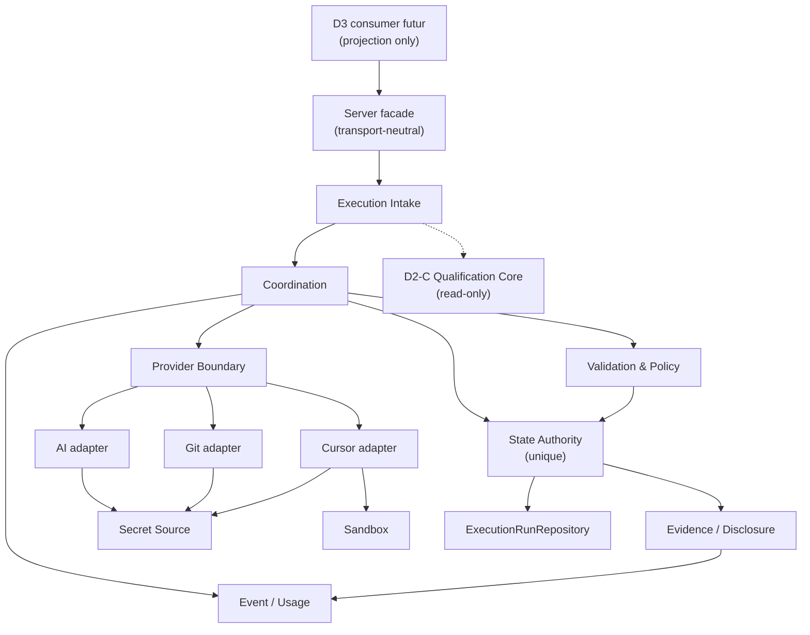
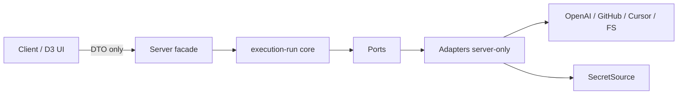

# Full Review Pack — SFIA Studio V3.1-D2-D Technical Architecture Publication

## Métadonnées

| Champ | Valeur |
|-------|--------|
| **Date/heure début** | 2026-08-03 19:31:37 CEST (+0200) |
| **Date/heure fin** | 2026-08-03 19:37:15 CEST +0200 |
| **Rôle** | Cursor (Cycle 8 — Delivery / publication documentaire) |
| **Cycle** | Cycle 8 — Delivery / publication documentaire |
| **Profil** | Standard |
| **Typologie** | DOC |
| **Verdict** | READY FOR CHATGPT VALIDATION |

## GO Morris (arbitrage + publication)

Le GO d'arbitrage adopte TA-01…14 et autorise ensuite la publication documentaire du document 23.
**Ce cycle exécute uniquement la publication.**

Date/heure décision Morris : **2026-08-03 19:24 CEST (+0200)**

### Autorisations Git exactes

Branche locale · modification bornée doc 23 · staging doc 23 · commit unique · push branche · draft PR · edit body · CI PR · handoff L3.

### Interdictions

Deuxième fichier · docs 20–22 · code/config/deps · backlog · Delivery · UI · D3 · CreateCycle · capability verification · mark ready · merge · auto-merge · delete branch · rebase · amend après push · force push · méthode.

## CKC fallback

Cycle 8 — Delivery / implémentation documentaire : contrat détaillé absent ; fallback synthetic map + v2.5 §4.8 ; experimental ; aucune autorité d'exécution. Risque évité : réécriture historique candidat / décision non adoptée.

## Git Truth initial

Branche architecture @ \`e273b2af…\` · origin/main identique · staged vide · doc 23 untracked · branche/PR publication absentes · handoff tip \`b88c79d…\` / blob \`839e3ef…\`.

## Provenance document 23

| Check | Résultat |
|-------|----------|
| Extraction handoff BEGIN/END | unique, non ambiguë |
| Écart initial local vs handoff | **1 octet** \`\\n\` final (emballage pack) |
| Alignement | local ← extraction handoff |
| MATCH_EXACT après alignement | **oui** |
| SOURCE_DOCUMENT_23_SHA256 | \`a722822251533049e65c68de497151d2fed2c283559529a81dd9a85906fa1a41\` |

## Document 23 complet AVANT (source handoff)

---BEGIN DOCUMENT 23 BEFORE---
# 23 — SFIA Studio V3.1-D2-D Integration Foundation — Architecture technique

## A. Métadonnées

| Champ | Valeur |
|-------|--------|
| **Document** | `23-v3-1-d2-d-integration-foundation-technical-architecture.md` |
| **Date/heure** | 2026-08-03 19:07 CEST (+0200) |
| **Cycle** | Cycle 6 — Architecture technique |
| **Profil** | Critical |
| **Typologie** | DOC — architecture-only |
| **Branche locale** | `architecture/sfia-studio-v3-1-d2-d-integration-foundation-technical-architecture` |
| **Base Git** | `main@e273b2afc33445154f63226fdfe8357c75df67f8` |
| **GO Morris** | `GO ARCHITECTURE TECHNIQUE SFIA STUDIO V3.1-D2-D` (2026-08-03 18:54 CEST) |
| **Documents amont (immutables)** | [20](./20-v3-1-d2-d-integration-foundation-cadrage.md) · [21](./21-v3-1-d2-d-integration-foundation-functional-design.md) · [22](./22-v3-1-d2-d-integration-foundation-functional-architecture.md) |
| **Précédent structure (non copié)** | [18](./18-v3-1-d2-ckc-resolver-qualify-cycle-bridge-technical-architecture.md) — structure only ; décisions D2-A/B/C non applicables à D2-D |
| **CKC** | `method/.../pilots/03-architecture-technique.md` — candidate v0.1.0 — experimental cognitive guidance — **aucune autorité d'exécution** |
| **Code / tests / config / UI** | **non** |
| **Statut** | `D2-D TECHNICAL ARCHITECTURE COMPLETE LOCALLY — READY FOR MORRIS ARBITRATION — NO BACKLOG OR DELIVERY AUTHORIZED` |

### Légende des marqueurs

| Marqueur | Signification |
|----------|---------------|
| **ADOPTED** | Décision Morris déjà adoptée (CAD/FD/FA) |
| **OBSERVATION** | Fait Git vérifié |
| **CONTRAINTE** | Borne non négociable dans ce cycle |
| **HYPOTHÈSE** | À vérifier ; non prouvée |
| **OPTION** | Alternative comparable |
| **RECOMMANDATION CANDIDATE** | Proposition Cursor — **NOT ADOPTED** |
| **ADR CANDIDATE** | ADR PROPOSED — NOT ADOPTED |
| **DÉCISION TECHNIQUE CANDIDATE** | TA-xx — NOT DECIDED |
| **INCONNUE** | Ouvert |
| **RÉSERVE** | Ouverte, non levée |
| **DETTE** | Coût différé explicite |
| **GATE FUTURE** | Nécessite GO Morris distinct |

---

## B. Décisions héritées (ADOPTED)

### B.1 D-CAD-01…12 — ADOPTED BY MORRIS (2026-08-03 16:56 CEST)

| ID | Résumé |
|----|--------|
| CAD-01 | Strict Minimal Foundation ; walking skeleton réel reporté à D2-D3 |
| CAD-02 | Contrats D2-D avant Delivery UI D3 ; exploration UX possible après D2-D1 stable |
| CAD-03 | Ports provider avant couplage SDK ; réutilisation platform/harness = hypothèse jusqu'à validation TA |
| CAD-04 | Read-only first ; pas de Git write en D2-D1/D2/D3 ; D2-D4 hors trajectoire |
| CAD-05 | STATE-A extensible (`timed_out`, `blocked`) ; pas de STATE-B complet |
| CAD-06 | INT-C hybrid contract-first : fixtures puis walking skeleton read-only sandboxed |
| CAD-07 | Sandbox validée avant Cursor réel ; capacités Cursor produit **UNVERIFIED** |
| CAD-08 | Secret Provider server-only ; GitHub read-only ; aucune techno secret store sélectionnée |
| CAD-09 | Events structurés + redaction stricte ; pas de claim RUN-READY/SLO |
| CAD-10 | R-C défense en profondeur : correction D2-C et frontière D2-D = cycles/gates séparés |
| CAD-11 | Séquence D2-D1 → D2-D2 → D2-D3 ; D2-D4 hors trajectoire |
| CAD-12 | Exploration UX D3 après stabilité D2-D1 ; Delivery UI + strong runtime après D2-D2/D3 |

### B.2 D-FD-01…12 — ADOPTED BY MORRIS (2026-08-03 17:19 CEST)

Douze objets fonctionnels ; huit états persistants exacts ; transitions documentées ; partial ≠ succeeded ; gates humains ; cancellation terminale + late result evidence-only ; sources `fixture`/`sandbox-real`/`real` ; familles d'échec normalisées ; catalogue d'événements ; projection D3 provider-independent ; trois niveaux de readiness.

### B.3 D-FA-01…12 — ADOPTED BY MORRIS (2026-08-03 17:42 CEST)

| Décision clé | Valeur ADOPTED |
|--------------|----------------|
| **MOD-B** | Décomposition fonctionnelle capability-centric minimale (pas packages/déploiement) |
| **Huit capacités** | Intake · Coordination · Validation/Policy · Provider Boundary · State/Human Gate · Evidence/Disclosure · Events/Usage · Fixture Catalogue |
| **Autorités uniques** | State Authority ; Evidence Authority ; Policy pre-engagement |
| **Provider Boundary** | Une frontière, trois lanes AI/Git/Cursor |
| **RUNTIME-C (fonctionnel)** | Une autorité fonctionnelle D2-D ; `vertical-slice-runtime` = option façade future uniquement ; **aucun runtime technique sélectionné** |
| **REUSE-B** | Principe d'évaluation : évaluer platform/harness derrière frontières ; **aucune compatibilité supposée** |
| **Slicing** | D2-D1 → D2-D2 → D2-D3 ; **D2-D4 write hors trajectoire** |

### B.4 Réserves transportées — OPEN NOT LIFTED

| ID | Statut |
|----|--------|
| R-QA-REV-01 MINOR | OPEN NOT LIFTED |
| R-QA-REV-02 MINOR | OPEN NOT LIFTED |
| R-QA-D2C-01 MINOR | OPEN — NOT LIFTED (R-C : deux travaux futurs séparés) |

---

## C. Finalité technique

Construire une architecture technique **minimale**, **provider-independent**, **server-only** et **read-only** permettant de valider les contrats D2-D, puis d'intégrer progressivement AI, GitHub et Cursor **sans** exposer les fournisseurs à D3 et **sans** créer un second runtime concurrent.

Cette finalité est une **contrainte de conception** pour les options ; elle n'adopte aucune stack, aucun package, aucun adapter.

---

## D. Périmètre et hors périmètre

### Périmètre

Architecture · modules candidats · ports · adapters · contrats · validation · état · persistance · async · erreurs · events · secrets · sandbox · tests · slicing · impacts DevOps (analyse seule).

### Hors périmètre

Code · migration · SDK install · endpoints · UI · backlog · Delivery · déploiement · RUN readiness · Git write · CreateCycle · promotion méthode · adoption de décision technique.

---

## E. Baseline Git-authoritative (OBSERVATION)

**Base :** `main@e273b2afc33445154f63226fdfe8357c75df67f8`
**Preuves :** lecture de `projects/sfia-studio/app/lib/**` et `projects/sfia-studio/harness/src/**` ; `package.json` ; workflows CI.

### E.1 Inventaire synthétique

| Élément | Path | Rôle | Server/client | Persistance | Réutilisation candidate | Écart D2-D | Preuve |
|---------|------|------|---------------|-------------|-------------------------|------------|--------|
| OA cycle | `app/lib/oa/cycle/**` | Domaine cycle + D2-A/B/C qualification | Server/composition (`node:crypto`) | Memory | Compatible (qualify read-only) ; extract si durable | Pas d'exécution AI/Git/Cursor | `createCkcQualificationServices` read-only |
| OA execution-contract | `app/lib/oa/execution-contract/**` | Gouvernance contrat jusqu'à confirmed | Server | Memory | Compatible comme gate amont | Refuse explicitement états T-A5 | `assertNotTa5Injection` / `TA5_STATUS_REFUSED` |
| OA decision | `app/lib/oa/decision/**` | HumanDecision / Confirmation | Server | Memory | Compatible pour gates humains futurs | Pas d'exécution | T-A3 |
| OA project | `app/lib/oa/project/**` | Project + LPS | Server | Memory | Compatible | Pas d'exécution | T-A1 |
| OA execution-attempt | `app/lib/oa/execution-attempt/**` | Tentative T-A5 | Server | Memory | Wrapper candidat | Adapters NoOp/Test only ; **pas** exécuteur réel | Commentaire : foundation does not execute |
| vertical-slice-runtime | `app/lib/vertical-slice-runtime/**` | Facade Next Create/Get project | Server (`serverGuard`, `"use server"`) | Business = OA memory ; audit noop/memory/sqlite | Wrapper/facade seulement | `agentExecution: "DISABLED"` ; process-local singleton | `disclosures.ts`, `singleton.ts` |
| vertical-slice-core | `app/lib/vertical-slice-core/**` | Composition locale Project | Server | OA memory + audit | Compatible create/get | `realAgentExecution: "NOT_AVAILABLE"` | `localProjectComposition.ts` |
| platform AI | `app/lib/platform/ai/**` | ConversationProvider OpenAI + Fake | Server-only (comment) | Aucune | Compatible transport derrière wrapper | Contrat conversation ≠ contrat D2-D ; pas d'evidence OA | `openaiProvider.ts` |
| platform tools | `app/lib/platform/tools/**` | Tool router deny-by-default | Server | Aucune | Compatible reads | `cursor_*` refusés ; pas runtime D2-D | `toolRouter.ts` |
| platform repository | `app/lib/platform/repository/**` | Git local + GitHub read | Server (`child_process`/`fs`) | Aucune | Compatible read ports | Read-only ; pas Cursor | `GithubReadPort`, `GhCli` / `Rest` |
| platform observability | `app/lib/platform/observability/**` | EventSink injectable | Server | Noop défaut | Compatible | Catalogue ≠ events fonctionnels D2-D | `eventSink.ts` |
| platform security | `app/lib/platform/security/**` | Path/repo policy + redaction | Server | N/A | Compatible | Policy seule | `pathPolicy.ts`, `redaction.ts` |
| harness ports | `harness/src/ports/**` | Cursor/GPT/Git POC | Node harness | Process/FS | Extract/wrapper | Schémas ≠ OA ; flags live | `CursorExecutorPort` |
| harness increment-d | `harness/src/increment-d/**` | Sandbox Cursor + GO + proof | Node | FS sandbox/proof | Extract pattern | Non intégré Studio runtime | `runIncrementDSandbox` |
| harness gate/proof/journal | `harness/src/gate|proof|journal/**` | Gate fail-closed · proof pack · events.jsonl | Node | FS | Extract | Distinct EventSink platform | comments S1 |

### E.2 Dépendances (OBSERVATION)

| Dep | Version déclarée | Note |
|-----|------------------|------|
| Next | `^15.3.3` | App Studio |
| React | `^19.1.0` | UI — hors D2-D TA |
| TypeScript | `^5.8.3` | Strict |
| AJV | `^6.15.0` | Déjà via doctrine `AjvSchemaValidationAdapter` Draft-07 |
| OpenAI SDK | `^6.48.0` | Platform AI |

**CONTRAINTE :** aucune nouvelle dépendance justifiée par défaut. Zod = CONTRACT-C = décision Morris.

### E.3 Observations confirmées (liste GO)

1. **vertical-slice-runtime** — server-only (guard custom) ; compose vertical-slice-core ; CreateProject/GetProject ; audit noop/memory/sqlite ; **pas** autorité D2-D ; process-local.
2. **oa/cycle** — domaine/application/ports/infra ; `createCkcQualificationServices` read-only ; services mutationnels distincts ; composition in-memory.
3. **oa/execution-contract** — préparation/confirmation ; in-memory ; refuse T-A5 ; **ne doit pas** devenir runtime D2-D implicite.
4. **Platform AI** — OpenAI Responses + fake ; config server ; usage dispo ; contrat conversation ≠ D2-D.
5. **Platform GitHub** — port read-only ; `gh` CLI ou REST ; allowlist ; redaction ; pas de mutation ; transport env-dépendant.
6. **Platform tools** — deny-by-default ; `cursor_*` refusés ; timeout borné ; events techniques.
7. **Platform observability** — EventSink injectable ; Noop défaut ; catalogue technique ≠ D2-D fonctionnel.
8. **Harness Cursor** — fixture/live ; gate avant spawn ; branch/HEAD ancrés ; sandbox/allowlist ; FS + child_process ; capacité produit exacte **UNVERIFIED** ; intégration Next **non prouvée**.
9. **Deps** — Next 15 / TS strict / Vitest / AJV / OpenAI déjà présents.

### E.4 Signaux double-runtime (OBSERVATION)

| Signal | Emplacements | Implication |
|--------|--------------|-------------|
| Cursor | harness Increment D · OPS1 `cursorExecutionAdapter` · OA T-A5 NoOp | Trois histoires d'exécution |
| AI | platform/ai · harness GPT spikes · OPS1 toolLoop | Pas de spine D2-D unique |
| Contract | OA ExecutionContract vs harness S1 ExecutionContract | Schémas incompatibles |

### E.5 Multi-instance / client-bundle (OBSERVATION)

- Singleton process-local `vertical-slice-runtime` ; disclosures `LOCAL_PROCESS` / restart may lose state.
- Imports client-unsafe : `node:crypto`, `child_process`, `fs`, `sqlite`, OpenAI SDK, server actions.

---

## F. Exigences non fonctionnelles

| NFR | Exigence | Raison | Preuve attendue | Slice | Dette si report |
|-----|----------|--------|-----------------|-------|-----------------|
| Déterminisme fixtures | Même input → même ValidationOutcome / état | Reproductibilité CI | Tests fixtures | D1 | Flaky CI |
| Fail-closed | Rejet avant engagement provider | Sécurité / R-QA-D2C-01 | Tests adversariaux | D1–D2 | Fuite partielle |
| Provider independence | Aucun type SDK vers D3 | FD-11 / FA-08 | Import-boundary tests | D1–D3 | Lock-in |
| Server-only | Adapters hors client bundle | Secrets / spawn | Boundary tests | D2 | Leak |
| Minimisation | Prompt/contexte minimisés | RGPD / FinOps | Review + redaction tests | D2–D3 | Coût / fuite |
| Read-only | Aucune méthode write Git/produit | CAD-04 | Port surface tests | D1–D3 | Mutation |
| Réversibilité | Choix packagés derrière ports | CKC | Wrappers | Tous | Refactor coûteux |
| Testabilité | Domaine pur + ports injectés | Delivery future | Vitest unit/contract | D1 | Couplage |
| Résilience | Timeout/cancel/late result | FD-07 | Tests async | D2 | Races |
| Cancellation | Best-effort provider + autorité locale | FD-07 | Tests | D2 | État incohérent |
| Timeout | Opérationnel + global candidats | FD | Tests | D2 | Hang |
| Late result | Evidence-only post-terminal | FD-07 | Tests | D2–D3 | Spoof success |
| Multi-instance | Claim interdit sans store durable | OBS | Disclosures | D3 | Claims faux |
| Persistance | Staged ; durable non sélectionné | STORE-B candidat | ADR | D1–D3 | Perte état |
| Observabilité | Events redacted + correlation | CAD-09 | Event schema tests | D2 | Blind ops |
| FinOps | Usage validé ; pas de prix hardcodé | CAD | Usage fields | D2–D3 | Coût opaque |
| Next/TS/Vitest | Compatibilité stack existante | DevOps fit | CI existante | Tous | Divergence |
| Pas de métrique inventée | Aucun SLO/latency inventé | Anti-claim CKC | Revue | Tous | — |

---

## G. Principes techniques (CONTRAINTES de conception)

1. Un seul core d'exécution D2-D (autorité d'état unique).
2. Domaine sans SDK fournisseur.
3. Ports avant adapters.
4. Validation avant lecture de métadonnées (R-QA-D2C-01 / R-C).
5. Résultats discriminés (complete / partial / failure).
6. État géré par fonctions pures.
7. Side effects derrière ports.
8. Secrets hors domaine.
9. No provider object vers D3.
10. No Git write.
11. No shell arbitraire.
12. Fixtures conformes aux mêmes contrats que adapters réels.
13. Aucun succès sans preuve complète.
14. Aucune technologie durable sans besoin prouvé.
15. Pas de nouvelle dépendance sans gain démontré + arbitrage Morris.

---

## H. Inventaire et classification de réutilisation (REUSE-B)

| Brique | Classification | Note |
|--------|----------------|------|
| `oa/cycle` | Compatible (qualify) / Extract si durable | Read-only D2-C composition |
| `oa/execution-contract` | Compatible (gate amont) | **Incompatible** comme runtime ; refuse T-A5 |
| `vertical-slice-runtime` | Compatible derrière wrapper/facade | **Incompatible** comme state authority D2-D |
| platform AI | Compatible derrière wrapper | Contract-fit **UNVERIFIED** |
| platform GitHub | Compatible derrière wrapper | Transports env-dépendants |
| platform tools | Compatible (reads) | Pas Cursor exec |
| platform observability | Compatible derrière port D2-D | Catalogue différent |
| harness Cursor | Extract / wrapper | Capacité produit **UNVERIFIED** ; intégration Next **UNVERIFIED** |

**REUSE-B respecté :** aucune compatibilité supposée ; décisions de réutilisation = TA candidates.

---

## I. Options runtime et packaging

### TECH-RUN-A — `vertical-slice-runtime` = autorité technique D2-D

| Critère | Analyse |
|---------|---------|
| Alignement RUNTIME-C | Faible — VS runtime = Create/Get project, agentExecution DISABLED |
| Double runtime | Risque élevé d'étendre un host incompatible |
| Next coupling | Fort |
| Testabilité | Faible (Server Actions / singleton) |
| Persistance | Process-local |
| Réversibilité | Faible après Delivery |

### TECH-RUN-B — Nouveau core OA sémantique frère (`oa/execution-run`) + VS runtime = facade/composition server-only

| Critère | Analyse |
|---------|---------|
| Alignement RUNTIME-C | Fort — une autorité core ; facade optionnelle |
| Double runtime | Mitigé si state authority **uniquement** dans core |
| Imports | Domaine pur testable |
| Next | Composition root server seule |
| Migration | Progressive |
| Dette | Nouveau module OA |
| Réversibilité | Haute avant Delivery |

### TECH-RUN-C — Service/package autonome séparé de l'app

| Critère | Analyse |
|---------|---------|
| Cohésion | Séparation nette |
| Ops | Complexité déploiement prématurée |
| Double runtime | Possible si Studio garde un second path |
| GreenOps | Worker/service permanent sans besoin prouvé |

**RECOMMANDATION CANDIDATE :** TECH-RUN-B.
**Statut :** CANDIDATE — NOT ADOPTED.

---

## J. Architecture technique cible candidate (NOT ADOPTED)


```mermaid
flowchart TB
  D3["D3 consumer futur
(projection only)"]
  SF["Server facade
(transport-neutral)"]
  IN["Execution Intake"]
  CO["Coordination"]
  VP["Validation & Policy"]
  SA["State Authority
(unique)"]
  EV["Evidence / Disclosure"]
  EU["Event / Usage"]
  PB["Provider Boundary"]
  AI["AI adapter"]
  GIT["Git adapter"]
  CUR["Cursor adapter"]
  SEC["Secret Source"]
  SBX["Sandbox"]
  REPO["ExecutionRunRepository"]
  D2C["D2-C Qualification Core
(read-only)"]

  D3 --> SF
  SF --> IN
  IN --> CO
  CO --> VP
  CO --> SA
  CO --> PB
  VP --> SA
  PB --> AI
  PB --> GIT
  PB --> CUR
  AI --> SEC
  GIT --> SEC
  CUR --> SEC
  CUR --> SBX
  SA --> REPO
  SA --> EV
  CO --> EU
  EV --> EU
  IN -.-> D2C

  classDef forbid fill:#fee,stroke:#c00
```

### Dépendances autorisées (candidates)

- D3 → Server facade → Intake/Coordination uniquement (read projection).
- Coordination → Policy → State Authority.
- Providers → ports uniquement ; résultats vers State/Evidence, jamais vers D3.

### Dépendances interdites

- D3 → SDK / Secret / Cursor spawn / Git write.
- Provider → State Authority mutateur direct.
- `vertical-slice-runtime` et `execution-run` comme **deux** state authorities.
- `execution-contract` muté en runtime d'exécution.

---

## K. Découpage en couches (RECOMMANDATION CANDIDATE)

| Couche | Contenu | Interdits |
|--------|---------|-----------|
| **1. Domain** | objets, états, transitions, erreurs, disclosures, evidence, invariants | Next/Node/SDK |
| **2. Application** | coordination, state authority, policy, cancellation, human gates | SDK types |
| **3. Ports** | repositories, AI, Git, Cursor, secret, event sink, clock, id | Implémentations |
| **4. Adapters** | memory, AI wrapper, GitHub wrapper, Cursor process, env secrets, event sink | Domaine pollué |
| **5. Server composition** | composition root | Domaine dans client bundle ; transport D3 figé |

**Statut :** CANDIDATE — NOT ADOPTED.

---

## L. Contrats et validation runtime

### CONTRACT-A — Types TS + guards manuels

Simple ; risque de drift ; pas de JSON Schema partageable fixtures/adapters.

### CONTRACT-B — Types TS + JSON Schema validé via AJV existant

Réutilise AJV déjà présent (doctrine) ; duplication type/schema à gouverner par tests de conformité ; pas de nouvelle dépendance.

### CONTRACT-C — Zod (nouvelle dépendance)

Gain DX ; **nouvelle dépendance** ; bundle/compat ; nécessite arbitrage Morris.

**RECOMMANDATION CANDIDATE :** CONTRACT-B + tests conformité types/schemas/fixtures.
**Statut :** CANDIDATE — NOT ADOPTED.

### Contrats candidats pour les 12 objets fonctionnels (noms techniques candidats — NOT ADOPTED)

| Objet fonctionnel | Contrat technique candidat |
|-------------------|----------------------------|
| Execution Intent | `ExecutionIntent` |
| Execution Context | `ExecutionContext` |
| Provider Capability | `ProviderCapabilityDescriptor` |
| Validation Outcome | `ValidationOutcome` |
| Execution Run | `ExecutionRun` |
| Execution State | `ExecutionState` (union 8) |
| External Result | `ExternalResult` |
| Execution Evidence | `ExecutionEvidence` |
| Source Disclosure | `SourceDisclosure` |
| Human Decision Gate | `HumanDecisionGate` |
| Usage Summary | `UsageSummary` |
| Normalized Failure | `NormalizedFailure` |

Aucune implémentation dans ce cycle.

---

## M. États et transitions

### Huit états persistants exacts (ADOPTED FD-02)

`idle` · `running` · `awaiting_human` · `succeeded` · `failed` · `cancelled` · `timed_out` · `blocked`

**Aucun** état STATE-B supplémentaire (`created`, `queued`, `validating`, …).

### Transition authority (candidate)

- Reducer / fonctions de transition **pures**.
- Table de transitions explicite (héritée FD/FA).
- Événements transitoires non persistants.
- Nouveau run + nouvelle identité après terminal.
- `blocked` vs `failed` ; `timed_out` vs blocked human gate ; `cancelled` terminal ; late result evidence-only.

### Représentation

| Option | Analyse |
|--------|---------|
| Enum simple | Fragile pour payloads |
| Discriminated union | Alignée TypeScript strict |
| Machine externe | Nouvelle dépendance / astronaut |

**RECOMMANDATION CANDIDATE :** discriminated union + transition functions pures, sans state-machine dependency.
**Statut :** CANDIDATE — NOT ADOPTED.

---

## N. Identité, repository et persistance

### Identités candidates

- `ExecutionRunId`
- `correlationId`
- `providerOperationId`
- Nouvelle identité après terminal
- Champ version/optimistic concurrency **candidat**

### Port

`ExecutionRunRepository` (save/get/list by correlation — surface candidate).

### STORE-A — Memory uniquement

OK D2-D1 ; interdit claim multi-instance / strong durability.

### STORE-B — Staged : memory D2-D1 ; durable adapter requis avant strong runtime verdict

Aligné CAD/FA ; durable **non sélectionné** maintenant.

### STORE-C — Durable immédiat

Prématuré sans cible déploiement / NFR.

Technologies candidates si repo permet : memory · SQLite borné · store externe.
**Aucune** sélection durable dans ce cycle.

**RECOMMANDATION CANDIDATE :** STORE-B.
**Déclarations :** D2-D1 process-local acceptable ; D2-D3 ne peut revendiquer multi-instance/durabilité sans décision durable distincte.
**Statut :** CANDIDATE — NOT ADOPTED.

---

## O. Coordination et modèle async

| Option | Analyse |
|--------|---------|
| **ASYNC-A** sync request/response | Insuffisant Cursor / longs appels |
| **ASYNC-B** in-process Promise + AbortSignal + repository/state | Aligné Next server ; cancel/timeout ; restart limite process |
| **ASYNC-C** queue + worker | Ops/DevOps ; GreenOps ; besoin non prouvé |

**RECOMMANDATION CANDIDATE :** ASYNC-B pour D2-D1/D2-D2 ; queue différée.
**Statut :** CANDIDATE — NOT ADOPTED.

---

## P. Provider Capability Boundary — ports techniques candidats

| Port | Responsabilité | Entrée | Sortie | Cancel/Timeout | Evidence | Server-only | Fixture/real |
|------|----------------|--------|--------|----------------|----------|-------------|--------------|
| `AiExecutionPort` | Lane AI | intent minimisé, limits | result/failure/usage | AbortSignal | redacted | oui | fake+real |
| `GitReadPort` | Lane Git read-only | ref/path allowlisted | read result | timeout | redacted | oui | fixture+real |
| `CursorExecutionPort` | Lane Cursor | sandbox contract, GO | result/proof | AbortSignal | proof pack | oui | fixture ; live UNVERIFIED |
| `SecretSourcePort` | Secrets | secret id | handle opaque | n/a | never value | oui | env/future |
| `ExecutionEventSink` | Events D2-D | technical+functional events | void | n/a | redacted | oui | noop/adapter |
| `ExecutionRunRepository` | Persistance run | run aggregate | run | n/a | n/a | oui | memory→durable |
| `ClockPort` | Temps | — | Instant | n/a | n/a | oui | system/fake |
| `IdSource` | Identités | — | ids | n/a | n/a | oui | uuid/fake |

**Aucun type SDK** dans les ports.
**Statut ports :** CANDIDATES — NOT ADOPTED.

---

## Q. AI Provider

| Option | Analyse |
|--------|---------|
| **AI-A** réutiliser directement `ConversationProvider` | Couplage contrat conversation |
| **AI-B** wrapper D2-D autour platform AI | Réutilise OpenAI/fake/usage ; contract-fit tests requis |
| **AI-C** nouvel adapter indépendant | Duplication ; lock-in risk différent |

**RECOMMANDATION CANDIDATE :** AI-B sous réserve contract-fit tests.
**Déclarations :** aucun modèle hardcodé ; aucune clé dans domaine/D3 ; aucune réponse brute dans events ; aucun appel live CI par défaut.
**Statut :** CANDIDATE — NOT ADOPTED.

---

## R. GitHub Provider

| Option | Analyse |
|--------|---------|
| **GIT-A** `gh` CLI only | Indispo en hosted |
| **GIT-B** REST only | Token/App ; testabilité |
| **GIT-C** port transport-neutral existant (`gh` local ; REST/App hosted) | Aligné baseline `resolveGithubReadTransport` |

**RECOMMANDATION CANDIDATE :** GIT-C derrière wrapper D2-D.
**Contraintes :** read-only strict ; aucune méthode write dans port D2-D ; pas de fallback silencieux ; transport = disclosure technique ; PAT ≠ production par défaut.
**Statut :** CANDIDATE — NOT ADOPTED.

---

## S. Cursor Worker et sandbox

| Option | Analyse |
|--------|---------|
| **CURSOR-A** import direct harness dans Next | Risque FS/child_process/ESM ; client-unsafe |
| **CURSOR-B** process boundary / extract adapter partagé derrière `CursorExecutionPort` | Isolation ; capability gate |
| **CURSOR-C** réécriture indépendante | Coût ; perte preuves harness |

**RECOMMANDATION CANDIDATE :** CURSOR-B **uniquement après** capability verification dédiée.
**Déclaration :** `CURSOR PRODUCT CAPABILITIES — UNVERIFIED`
**Interdits :** import harness dans client bundle ; commande arbitraire browser ; mutation Git distante ; live sans gate Morris ; claim sandbox sécurisée sans preuve.
**Statut :** CANDIDATE — NOT ADOPTED.

---

## T. Secret Source

| Option | Analyse |
|--------|---------|
| **SECRET-A** `process.env` direct partout | Fuite / rotation difficile |
| **SECRET-B** `SecretSourcePort` + env local + manager futur | Réversible |
| **SECRET-C** secret manager immédiat | Techno sans contexte déploiement |

**RECOMMANDATION CANDIDATE :** SECRET-B.
Définir : identité secret · disponibilité · expiration · révocation · rotation · aucune valeur sérialisable · redaction · server-only.
**Statut :** CANDIDATE — NOT ADOPTED.

---

## U. Frontières sécurité

### Trust-boundary (candidate)


```mermaid
flowchart LR
  Client["Client / D3 UI"] -->|DTO only| Facade["Server facade"]
  Facade --> Core["execution-run core"]
  Core --> Ports["Ports"]
  Ports --> Adapters["Adapters server-only"]
  Adapters --> Ext["OpenAI / GitHub / Cursor / FS"]
  Adapters --> Secrets["SecretSource"]
```

| Menace | Acteur | Surface | Mitigation candidate | Preuve | Réserve |
|--------|--------|---------|----------------------|--------|---------|
| Secret leakage | insider/log | events/evidence/D3 | SecretSource + redaction | tests redaction | — |
| Prompt injection | provider/user | AI lane | minimisation + validation sortie | contract-fit | — |
| Malicious provider result | provider | adapters | INVALID_PROVIDER_RESULT ; Evidence authority | tests | — |
| Arbitrary command | attacker | Cursor/tools | deny-by-default ; no browser spawn | policy tests | UNVERIFIED Cursor |
| Sandbox escape | Cursor | FS | allowlist paths ; gate | sandbox tests | UNVERIFIED |
| Protected path | tool | repo FS | pathPolicy | tests | — |
| Git mutation | adapter | GitHub/git | read-only ports | surface tests | — |
| Branch/HEAD drift | Cursor | spawn | gate revalidation | harness pattern | — |
| Result spoofing | late result | state | terminal authority ; evidence-only | tests | — |
| Event leakage | sink | observability | redaction catalogue | tests | R-QA-REV-01/02 |
| Late result | provider | async | ignore state mutate | tests | — |
| Cancellation race | concurrent | AbortSignal | local terminal authoritative | tests | — |
| Unauthorized human gate | system | awaiting_human | Morris-only structural | FA-07 | — |
| Client import adapter | bundler | Next | import-boundary tests | Vitest | — |

---

## V. Erreurs techniques (candidates — NOT ADOPTED)

| Code candidat | Producteur | Normalisateur | Retryable | État | Evidence | D3 message | Redaction |
|---------------|------------|---------------|-----------|------|----------|------------|-----------|
| `VALIDATION_ERROR` | Policy | Evidence | after fix | blocked | yes | normalized | no raw |
| `AUTHENTICATION_ERROR` | Policy/Provider | Evidence | after creds | blocked/failed | yes | normalized | no secret |
| `AUTHORIZATION_ERROR` | Policy/Provider | Evidence | after rights | blocked/failed | yes | normalized | — |
| `PROVIDER_UNAVAILABLE` | Provider | Evidence | new run | failed/blocked | yes | normalized | — |
| `RATE_LIMITED` | Provider | Evidence | deferred bounded | failed/blocked | yes | normalized | — |
| `TIMED_OUT` | State/Provider | Evidence | new run | timed_out | yes | normalized | — |
| `CANCELLED` | State | Evidence | new run | cancelled | yes | normalized | — |
| `SANDBOX_BLOCKED` | Policy | Evidence | after conform | blocked | yes | normalized | — |
| `PROTECTED_PATH` | Policy | Evidence | no if forbid | blocked/failed | yes | normalized | path only |
| `MUTATION_FORBIDDEN` | Policy | Evidence | change intent | blocked | yes | normalized | — |
| `HUMAN_GATE_REQUIRED` | Human Gate | Evidence | after decision | awaiting_human/blocked | yes | gate info | — |
| `INVALID_PROVIDER_RESULT` | Provider | Evidence | new run | failed | yes | normalized | no raw |
| `INTERNAL_NORMALIZED_FAILURE` | Coord | Evidence | limited | failed | yes | normalized | no stack to D3 |

Codes restent **candidats** jusqu'à arbitrage.

---

## W. Evidence, completeness et disclosures

| Concept | Définition candidate |
|---------|----------------------|
| Evidence officielle | Produite uniquement par Evidence Authority |
| Evidence brute redacted | Candidat provider après redaction ; non autoritaire pour success |
| Completeness | complete \| partial — explicite |
| Partiality | Partial **jamais** `succeeded` |
| Source | `fixture` \| `sandbox-real` \| `real` |
| Provider abstraction | Lane + type abstrait ; pas SDK |
| Late evidence | Post-terminal ; n'altère pas l'état |
| Evidence id / digest | Identité + hash contenu redacted |
| Timestamps | ISO validés (lien R-QA-REV-01) |

Frontières : provider result → normalized result → official evidence → D3 projection.

---

## X. Events, observabilité, usage et FinOps

| Option | Analyse |
|--------|---------|
| **EVENT-A** réutiliser catalogue EventSink actuel | Catalogue ≠ D2-D fonctionnel |
| **EVENT-B** port D2-D → adapter EventSink | Aligné REUSE-B |
| **EVENT-C** nouveau service observabilité | Prématuré |

**RECOMMANDATION CANDIDATE :** EVENT-B.

Événements techniques nécessaires pour couvrir le catalogue fonctionnel adopté (intent_validated, execution_started/blocked/cancelled/timed_out/failed/succeeded, external_operation_*, awaiting_human, human_decision_recorded, …).

Champs : correlationId · runId · provider lane · state transition · validation · gate · cancellation · timeout · late result · completeness · source disclosure · usage validé.

**Interdits :** secret · prompt complet · réponse complète · stack brute vers D3 · prix inventé.

---

## Y. Cancellation, timeout, retries et idempotency

- `AbortSignal` pour opérations provider.
- Timeout opérationnel + timeout global **candidats** (durées non inventées en production).
- Cancellation best-effort provider ; **état terminal local autoritatif**.
- Late result → evidence-only.
- Retry seulement erreurs classées retryable ; aucun retry infini.
- Aucun retry structurel après décision Morris sans nouvelle gate.
- Idempotency de commande ; nouveau run après terminal.

---

## Z. R-QA-D2C-01 — défense en profondeur (R-C ADOPTED)

### 1. Frontière D2-D (ce cycle documente ; n'implémente pas)

- Valider **avant** toute lecture de métadonnées.
- Fail-closed.
- Aucun résultat partiel exploitable comme succès.
- Tests adversariaux `null`/`undefined` → NormalizedFailure.

### 2. Correction D2-C (GATE FUTURE séparée)

- Cycle séparé · périmètre borné · avant exposition réelle frontière externe non validée.

| Élément | Statut |
|---------|--------|
| Dépendance D2-D1 | Validation avant metadata |
| Gate correction D2-C | Distincte |
| Preuve | Tests adversariaux + QA |
| **R-QA-D2C-01** | **OPEN NOT LIFTED** |

---

## AA. Frontière D3

| Option | Analyse |
|--------|---------|
| **D3-TECH-A** Server Action couplée runtime | Couplage transport |
| **D3-TECH-B** Route/API maintenant | Figé trop tôt |
| **D3-TECH-C** Facade application transport-neutral | Transport UI ultérieur |

**RECOMMANDATION CANDIDATE :** D3-TECH-C.

### DTO technique provider-independent (candidat)

run id · état · source · progression · completeness · result redacted · failure redacted · blocked reason · human gate · evidence summary · usage validé · réserves · readiness.

**Interdits DTO :** SDK object · secret · raw provider error · command · Git write · provider-specific type.

---

## AB. Double runtime et composition

| Composant | Rôle candidat |
|-----------|---------------|
| `oa/execution-run` | **Core** — state authority unique |
| `vertical-slice-runtime` | Facade/composition server-only optionnelle |
| `execution-contract` | Amont contractuel (confirmed) — **pas** runtime |
| D2-C | Capacité read-only qualification |
| platform/harness | Adapters derrière ports |

### Imports autorisés (candidats)

composition → application → domain ; adapters → ports ; facade → composition.

### Interdits

- State authority dans VS runtime **et** core.
- Duplication du reducer.
- Provider direct vers D3.
- `execution-contract` muté en runtime.
- Deux repositories d'état concurrents.

---

## AC. Déploiement et multi-instance (sans sélection de cible)

| Dimension | Observation / contrainte |
|-----------|--------------------------|
| Processus unique | Baseline actuelle |
| Restart | Memory loss |
| Serverless | Multi-instance hazard |
| Long-running server | Cancel/timeout plus naturels |
| Worker | ASYNC-C — besoin non prouvé |
| Persistence | STORE-B ; durable undecided |
| Locking | Requis si multi-instance |
| Sandbox locality | Cursor FS local |

### Claims autorisés par slice

| Slice | Claims autorisés | Claims interdits |
|-------|------------------|------------------|
| D2-D1 | local/process-only ; fixtures déterministes | multi-instance ; production-ready |
| D2-D2 | adapters réels read-only sous env borné | sandbox secure sans preuve ; Cursor compatible |
| D2-D3 | strong runtime **seulement** avec preuves explicites persistance/worker/sandbox/env | scalable ; RUN READY |

---

## AD. Stratégie de tests (documentaire — aucun test exécuté)

- Unitaires domaine (transitions, invariants).
- Matrice complète transitions.
- Contract schema tests (AJV candidat).
- Fixtures vs adapters conformance.
- Policy deny · redaction · error normalization.
- Timeout · cancellation · late results.
- Partial never succeeded · human gate · source disclosure.
- D3 projection · adversarial R-QA-D2C-01.
- Import-boundary · provider fake · sandbox-real opt-in · live hors CI défaut.

---

## AE. Catalogue de fixtures obligatoires

1. nominal fixture
2. nominal sandbox-real candidat
3. validation failure
4. auth failure
5. provider unavailable
6. rate limit
7. timeout
8. cancellation
9. blocked gate
10. protected path
11. mutation forbidden
12. partial result
13. invalid provider result
14. late result
15. secret redaction
16. source mismatch

Mêmes schemas pour fixtures et adapters réels.

---

## AF. Slicing technique

### D2-D1

**Objectif :** core `execution-run` candidat · contrats · AJV schemas · reducer · policy · errors · evidence/disclosure · memory repo · fixtures.
**Pas** d'intégration fournisseur réelle.
**Sortie :** contrats validables + matrice états.
**Gate :** GO Delivery D2-D1 (futur, non ouvert).
**Claims interdits :** provider integrated · production-ready.

### D2-D2

**Objectif :** AI/Git wrappers · Cursor capability verification · sandbox · SecretSource · EventSink adapter · timeout/cancel · R-QA-D2C-01 defence · read-only.
**Gate :** GO Delivery D2-D2.
**Claims interdits :** Cursor compatible sans preuve · reserve lifted.

### D2-D3

**Objectif :** coordination E2E · sandbox-real · D3 projection · evidence · strong runtime proofs · décision persistance/déploiement **si** nécessaire.
**Gate :** GO Delivery D2-D3.
**Claims interdits :** multi-instance sans décision durable.

### D2-D4

Writes — **hors trajectoire**.

Aucune user story rédigée.

---

## AG. Cartographie de fichiers candidate (NOT ADOPTED)

```text
projects/sfia-studio/app/lib/oa/execution-run/
  domain/
    executionRun.ts
    executionState.ts
    executionTransitions.ts
    executionErrors.ts
    executionEvidence.ts
    executionDisclosure.ts
    executionPolicy.ts
  application/
    executionCoordinator.ts
    executionProjection.ts
  ports/
    executionRunRepository.ts
    aiExecutionPort.ts
    gitReadPort.ts
    cursorExecutionPort.ts
    secretSourcePort.ts
    executionEventSink.ts
    clockPort.ts
    idSource.ts
  infrastructure/
    memoryExecutionRunRepository.ts
    # wrappers platform/harness
  index.ts
```

Noms métier préférés aux préfixes `d2d-*`. Wrappers sous `infrastructure/` ou `platform/*` selon arbitrage.

---

## AH. Compatibilité et migration

| Brique | Contrat actuel | Cible candidate | Wrapper | Rupture | Tests | Rollback | Dette |
|--------|----------------|-----------------|---------|---------|-------|----------|-------|
| ConversationProvider | conversation tools | AiExecutionPort | AI-B | contract-fit | conformance | garder platform | drift |
| GithubReadPort | read tools | GitReadPort D2-D | GIT-C | surface write absente | allowlist | inchangé | transport env |
| EventSink | TechnicalEvent | ExecutionEventSink | EVENT-B | catalogue | schema | noop | dual catalogues |
| Cursor harness | S1 contract | CursorExecutionPort | CURSOR-B | schema dual | capability gate | harness alone | UNVERIFIED |
| execution-contract | T-A4 | amont only | none mutate | — | refuse T-A5 | — | confusion runtime |
| D2-C | qualify read-only | Intake optional | compose | — | unit | — | — |
| vertical-slice-runtime | Create/Get | facade | TECH-RUN-B | no state dual | disclosure | keep VS | double runtime |

---

## AI. FinOps et GreenOps

### Signaux

nombre d'appels · tokens · durée · retries · timeouts · provider · model · bytes · sandbox duration.

**Aucun prix codé en dur.**

### Leviers

budgets configurables · no duplicate call · bounded retries · fixture first · no permanent worker before need · bounded evidence retention · no provider call after cancellation terminale.

---

## AJ. Risques et dette

| Risque | P | I | Mitigation | Preuve | Dette | Slice | Gate |
|--------|---|---|------------|--------|-------|-------|------|
| Architecture astronaut | M | H | Minimal foundation | revue options | overdesign | TA | arbitration |
| Nouveau domaine parallèle | M | H | TECH-RUN-B + mapping FA | imports | dual models | D1 | Delivery |
| Double runtime | H | H | state authority unique | AB | OPS1/harness | D1–D3 | Delivery |
| State authority dupliquée | M | H | Interdit AB | tests | — | D1 | — |
| Provider lock-in | M | H | ports + wrappers | contract-fit | — | D2 | — |
| AJV/types drift | M | M | conformance tests | CI | dual source | D1 | — |
| Memory state loss | H | M | disclosures ; STORE-B | docs | durable later | D1–D3 | durable GO |
| Queue prématurée | M | M | ASYNC-B | ADR | ops | D2 | — |
| CLI unavailable | M | H | GIT-C REST path | probe | auth | D2 | — |
| REST auth leakage | M | H | SecretSource + redaction | tests | — | D2 | — |
| Cursor incompatibility | H | H | capability verification | UNVERIFIED | rewrite | D2 | capability GO |
| Sandbox escape | M | H | allowlist + gate | tests | — | D2–D3 | — |
| Direct harness import | M | H | CURSOR-B boundary | import tests | — | D2 | — |
| Secret leakage | M | H | SECRET-B | redaction | — | D2 | — |
| D3 provider leakage | M | H | D3-TECH-C DTO | projection tests | — | D3 | — |
| Partial-as-success | M | H | Evidence authority | tests | — | D1 | — |
| Late result race | M | H | terminal authority | tests | — | D2 | — |
| Cancellation race | M | H | AbortSignal + local state | tests | — | D2 | — |
| Event inconsistency | M | M | EVENT-B catalogue | schema | — | D2 | — |
| No multi-instance | H | M | claims bornés | disclosures | durable | D3 | — |
| Live tests flaky | M | M | live hors CI | policy | — | D2–D3 | — |
| R-QA-D2C-01 | H | H | R-C two lines | adversarial | OPEN | D1 + D2-C | D2-C GO |
| R-QA-REV-01 | M | M | ISO timestamps | tests | OPEN | D1–D2 | — |
| R-QA-REV-02 | M | M | conserve | docs | OPEN | — | — |

---

## AK. Critères d'acceptation (ce cycle documentaire)

- [x] Plusieurs options par décision structurante
- [x] Runtime owner options comparées (TECH-RUN-A/B/C)
- [x] Package boundary / couches documentées
- [x] Domain sans SDK exigé
- [x] Contrats validables options (CONTRACT-A/B/C)
- [x] Huit états exacts
- [x] Transition authority documentée
- [x] Repository port + STORE-A/B/C
- [x] Async A/B/C
- [x] Provider ports
- [x] AI / Git / Cursor options
- [x] Secrets / sandbox / sécurité
- [x] Errors / evidence / disclosures / events
- [x] Cancellation / timeout / late result
- [x] D2-C defence R-C
- [x] D3 independence
- [x] Test + fixture strategy
- [x] Slicing D2-D1/D2/D3 ; D2-D4 hors
- [x] Aucune implémentation
- [x] Aucune architecture implicitement adoptée
- [x] TA-01…14 NOT DECIDED

---

## AL. Questions ouvertes (INCONNUES)

- Cible de déploiement
- Durabilité / multi-instance
- Choix du durable store
- Technologie de worker
- Auth GitHub hosted (App vs token)
- Secret manager
- Capacités Cursor exactes (**UNVERIFIED**)
- Disponibilité Cursor dans l'environnement cible
- Streaming AI
- Structured output exact
- Provider cancellation guarantees
- Rétention des preuves
- Transport événement / sink observabilité
- SLO (non inventés)
- Budgets FinOps numériques
- Transport D3 (Server Action vs Route vs autre)

---

## AM. ADR candidates (PROPOSED — NOT ADOPTED)

### ADR-TA-01 — Runtime owner / packaging

- **Contexte :** RUNTIME-C fonctionnel ; VS runtime ≠ autorité D2-D aujourd'hui.
- **Problème :** où placer le core d'exécution sans double runtime.
- **Options :** TECH-RUN-A / B / C.
- **Recommandation candidate :** TECH-RUN-B.
- **+ :** alignement RUNTIME-C ; testabilité ; facade optionnelle.
- **− :** nouveau module OA ; discipline imports.
- **Risques :** confusion avec execution-contract / OPS1.
- **Réversibilité :** haute avant Delivery.
- **Dette :** migration composition.
- **Préconditions :** arbitrage Morris TA-01.
- **Gate :** GO ARBITRATION TA.
- **Statut :** PROPOSED — NOT ADOPTED.

### ADR-TA-02 — Contrats / AJV

Options CONTRACT-A/B/C ; reco CONTRACT-B ; PROPOSED — NOT ADOPTED.

### ADR-TA-03 — Persistance staged

Options STORE-A/B/C ; reco STORE-B ; durable undecided ; PROPOSED — NOT ADOPTED.

### ADR-TA-04 — Async in-process

Options ASYNC-A/B/C ; reco ASYNC-B ; queue différée ; PROPOSED — NOT ADOPTED.

### ADR-TA-05 — Provider wrappers

Ports + AI-B / GIT-C / CURSOR-B ; capability Cursor UNVERIFIED ; PROPOSED — NOT ADOPTED.

### ADR-TA-06 — Secrets

SECRET-A/B/C ; reco SECRET-B ; PROPOSED — NOT ADOPTED.

### ADR-TA-07 — Events

EVENT-A/B/C ; reco EVENT-B ; PROPOSED — NOT ADOPTED.

### ADR-TA-08 — D3 transport-neutral facade

D3-TECH-A/B/C ; reco D3-TECH-C ; PROPOSED — NOT ADOPTED.

*(Chaque ADR structurante ci-dessus reste PROPOSED — NOT ADOPTED ; détails opérationnels dans §I–AA et decision pack §AN.)*

---

## AN. Decision pack Morris — D-V3.1-D2D-TA-01…14

> **Statut commun de chaque décision :** `NOT DECIDED — MORRIS ARBITRATION REQUIRED`

### D-V3.1-D2D-TA-01 — Runtime owner et packaging

- **Question :** Qui est l'autorité technique d'exécution D2-D et comment packager ?
- **Options :** TECH-RUN-A / TECH-RUN-B / TECH-RUN-C
- **Recommandation candidate :** TECH-RUN-B
- **Justification :** RUNTIME-C ; VS runtime disclosures agentExecution DISABLED ; évite double state authority
- **Impacts :** nouveau module OA ; facade optionnelle
- **Sécurité :** server composition only
- **Performance :** in-process ; pas de claim SLO
- **FinOps :** pas de service permanent
- **Dette :** migration composition
- **Réversibilité :** haute pré-Delivery
- **Dépendances :** aucune nouvelle npm
- **Réserves :** —
- **Gate suivante :** TA arbitration → backlog D2-D1
- **Statut :** NOT DECIDED — MORRIS ARBITRATION REQUIRED

### D-V3.1-D2D-TA-02 — Découpage domain/application/ports/adapters/server composition

- **Question :** Quelle structure de couches ?
- **Options :** (1) couches §K (2) tout dans vertical-slice-runtime (3) package npm séparé immédiat
- **Recommandation candidate :** couches §K
- **Justification :** domain pur ; ports injectés ; Next hors domaine
- **Impacts / sécu / perf / FinOps / dette / réversibilité :** testabilité ↑ ; bundling risk ↓
- **Dépendances :** —
- **Réserves :** —
- **Gate :** TA arbitration
- **Statut :** NOT DECIDED — MORRIS ARBITRATION REQUIRED

### D-V3.1-D2D-TA-03 — Représentation contrats et validation

- **Options :** CONTRACT-A / B / C
- **Recommandation candidate :** CONTRACT-B (TS + JSON Schema/AJV existant)
- **Justification :** AJV déjà présent ; fixtures/adapters share schemas ; évite Zod sans GO
- **Dette :** dual type/schema gouvernée par tests
- **Statut :** NOT DECIDED — MORRIS ARBITRATION REQUIRED

### D-V3.1-D2D-TA-04 — État, repository et persistance

- **Options :** STORE-A / B / C
- **Recommandation candidate :** STORE-B
- **Justification :** D2-D1 process-local OK ; strong runtime exige durable gate séparée
- **Réserves :** multi-instance claims interdits sans durable
- **Statut :** NOT DECIDED — MORRIS ARBITRATION REQUIRED

### D-V3.1-D2D-TA-05 — Coordination async, cancellation et timeout

- **Options :** ASYNC-A / B / C
- **Recommandation candidate :** ASYNC-B
- **Justification :** AbortSignal ; Cursor longs ; queue non prouvée
- **Statut :** NOT DECIDED — MORRIS ARBITRATION REQUIRED

### D-V3.1-D2D-TA-06 — Provider Capability Boundary et wrappers

- **Question :** Ports + stratégie wrappers vs rewrite
- **Options :** reuse direct / wrappers D2-D / rewrite ciblé
- **Recommandation candidate :** wrappers D2-D (REUSE-B)
- **Statut :** NOT DECIDED — MORRIS ARBITRATION REQUIRED

### D-V3.1-D2D-TA-07 — AI adapter, model/config et contract-fit

- **Options :** AI-A / B / C
- **Recommandation candidate :** AI-B
- **Sécurité :** secrets hors domaine ; no raw in events
- **FinOps :** usage validé ; model configurable
- **Statut :** NOT DECIDED — MORRIS ARBITRATION REQUIRED

### D-V3.1-D2D-TA-08 — GitHub transport, auth et read-only policy

- **Options :** GIT-A / B / C
- **Recommandation candidate :** GIT-C
- **Sécurité :** read-only ; allowlist ; redaction ; PAT ≠ prod défaut
- **Statut :** NOT DECIDED — MORRIS ARBITRATION REQUIRED

### D-V3.1-D2D-TA-09 — Cursor process boundary, sandbox et capability gate

- **Options :** CURSOR-A / B / C
- **Recommandation candidate :** CURSOR-B after capability verification
- **Réserves :** CURSOR PRODUCT CAPABILITIES — UNVERIFIED
- **Gate :** capability verification GO distinct
- **Statut :** NOT DECIDED — MORRIS ARBITRATION REQUIRED

### D-V3.1-D2D-TA-10 — SecretSource et frontières sécurité/redaction

- **Options :** SECRET-A / B / C
- **Recommandation candidate :** SECRET-B
- **Statut :** NOT DECIDED — MORRIS ARBITRATION REQUIRED

### D-V3.1-D2D-TA-11 — Events, evidence, usage et observability adapter

- **Options :** EVENT-A / B / C
- **Recommandation candidate :** EVENT-B
- **Réserves :** R-QA-REV-01/02 timestamps/events
- **Statut :** NOT DECIDED — MORRIS ARBITRATION REQUIRED

### D-V3.1-D2D-TA-12 — D3 projection et transport-neutral server boundary

- **Options :** D3-TECH-A / B / C
- **Recommandation candidate :** D3-TECH-C
- **Statut :** NOT DECIDED — MORRIS ARBITRATION REQUIRED

### D-V3.1-D2D-TA-13 — Test strategy, fixtures et traitement R-QA-D2C-01

- **Question :** Stratégie tests + défense R-C
- **Options :** (1) fixtures-first + adversarial D2-D boundary (2) live-first (3) report correction D2-C only
- **Recommandation candidate :** (1) + gate D2-C séparée
- **Réserves :** R-QA-D2C-01 OPEN NOT LIFTED
- **Statut :** NOT DECIDED — MORRIS ARBITRATION REQUIRED

### D-V3.1-D2D-TA-14 — Slicing D2-D1/D2-D2/D2-D3 et critères de sortie vers backlog

- **Question :** Critères de sortie techniques vers backlog futur
- **Options :** slicing FA-11 tel quel / fusion D2-D1+D2 / walking skeleton dès D2-D1
- **Recommandation candidate :** D2-D1 → D2-D2 → D2-D3 ; D2-D4 hors trajectoire
- **Gate suivante après arbitrage :** GO BACKLOG D2-D1/D2/D3 (distinct)
- **Statut :** NOT DECIDED — MORRIS ARBITRATION REQUIRED

---

## AO. Recommandations candidates (CANDIDATE — NOT ADOPTED)

1. **TECH-RUN-B** — core OA `execution-run` ; vertical-slice-runtime facade/composition uniquement.
2. **Domain/application/ports/adapters** — aucun SDK dans domain/application contracts.
3. **CONTRACT-B** — TypeScript + JSON Schema/AJV existant.
4. **Reducer pur + discriminated unions** — aucune state-machine dependency.
5. **STORE-B** — repository port ; memory D2-D1 ; durable gate avant strong runtime.
6. **ASYNC-B** — Promise/AbortSignal in-process ; aucune queue sans besoin prouvé.
7. **Wrappers D2-D** sur capacités platform existantes.
8. **AI-B** — wrapper platform AI + contract-fit tests.
9. **GIT-C** — transport-neutral read-only.
10. **CURSOR-B** — process boundary/extract après capability verification.
11. **SECRET-B** — SecretSourcePort ; env local ; manager futur.
12. **EVENT-B** — port D2-D → EventSink existant.
13. **D3-TECH-C** — facade transport-neutral ; aucun endpoint décidé.
14. **Slicing** D2-D1 → D2-D2 → D2-D3 ; D2-D4 hors trajectoire.

Chaque item : **CANDIDATE — NOT ADOPTED.**

---

## AP. Trajectoire candidate

Après arbitrage TA uniquement :

1. Backlog D2-D1 / D2-D2 / D2-D3 (GO distinct).
2. Cycles Delivery séparés.
3. Correction D2-C séparée si autorisée.
4. Capability verification Cursor.
5. **Aucune** ouverture automatique de D3.

Aucune transition automatique.

---

## AQ. Anti-claims

Ce document **n'autorise pas** et **ne revendique pas** :

- technical architecture adopted
- runtime selected
- AJV strategy adopted
- persistence selected
- multi-instance ready
- Cursor compatible
- sandbox secure
- secret store selected
- provider integrated
- production-ready / RUN READY / scalable / secure
- backlog ready / Delivery ready / D3 ready
- reserve lifted
- Git write enabled / CreateCycle enabled / method promoted

---

## AR. Verdict documentaire

```text
D2-D TECHNICAL ARCHITECTURE COMPLETE LOCALLY —
READY FOR MORRIS ARBITRATION —
ADOPTED CADRAGE / FUNCTIONAL DESIGN / FUNCTIONAL ARCHITECTURE APPLIED —
TECHNICAL BASELINE VERIFIED —
RUNTIME AND PACKAGING OPTIONS COMPARED —
CONTRACT AND VALIDATION OPTIONS COMPARED —
STATE / PERSISTENCE / ASYNC OPTIONS COMPARED —
AI / GIT / CURSOR OPTIONS COMPARED —
SECURITY / SECRET / SANDBOX BOUNDARIES DOCUMENTED —
EVENT / EVIDENCE / USAGE ARCHITECTURE DOCUMENTED —
D3 SERVER BOUNDARY DOCUMENTED —
DOUBLE-RUNTIME RISK TREATED —
TEST STRATEGY DOCUMENTED —
D2-D SLICING DOCUMENTED —
D-V3.1-D2D-TA-01…14 READY FOR MORRIS ARBITRATION —
NO TECHNICAL DECISION ADOPTED —
NO BACKLOG CREATED —
NO DELIVERY AUTHORIZED —
NO UI —
NO CREATECYCLE —
NO D3 —
NO PROJECT GIT WRITE —
NO METHOD PROMOTION
```


---END DOCUMENT 23 BEFORE---

## Modifications exactes autorisées

1. Métadonnées statut + publication branch candidate
2. Section **AN2** (GO complet + table TA-01…14 DECIDED)
3. Trajectoire **AP** bornée
4. Verdict **AR** + prochaine gate **AS**

Historique préservé : AN (NOT DECIDED) · ADR · AO · toutes options A/B/C · réserves · Cursor UNVERIFIED.

## Document 23 complet APRÈS

---BEGIN DOCUMENT 23 AFTER---
# 23 — SFIA Studio V3.1-D2-D Integration Foundation — Architecture technique

## A. Métadonnées

| Champ | Valeur |
|-------|--------|
| **Document** | `23-v3-1-d2-d-integration-foundation-technical-architecture.md` |
| **Date/heure** | 2026-08-03 19:07 CEST (+0200) |
| **Cycle** | Cycle 6 — Architecture technique |
| **Profil** | Critical |
| **Typologie** | DOC — architecture-only |
| **Branche locale** | `architecture/sfia-studio-v3-1-d2-d-integration-foundation-technical-architecture` |
| **Base Git** | `main@e273b2afc33445154f63226fdfe8357c75df67f8` |
| **GO Morris** | `GO ARCHITECTURE TECHNIQUE SFIA STUDIO V3.1-D2-D` (2026-08-03 18:54 CEST) |
| **Documents amont (immutables)** | [20](./20-v3-1-d2-d-integration-foundation-cadrage.md) · [21](./21-v3-1-d2-d-integration-foundation-functional-design.md) · [22](./22-v3-1-d2-d-integration-foundation-functional-architecture.md) |
| **Précédent structure (non copié)** | [18](./18-v3-1-d2-ckc-resolver-qualify-cycle-bridge-technical-architecture.md) — structure only ; décisions D2-A/B/C non applicables à D2-D |
| **CKC** | `method/.../pilots/03-architecture-technique.md` — candidate v0.1.0 — experimental cognitive guidance — **aucune autorité d'exécution** |
| **Code / tests / config / UI** | **non** |
| **Statut** | `D2-D TECHNICAL ARCHITECTURE — ARBITRATED BY MORRIS — DOCUMENTARY RECORD VERSIONED VIA GIT — AUTHORITATIVE PUBLICATION STATE FOLLOWS PR/MAIN — NO BACKLOG OR DELIVERY AUTHORIZED` |
| **Publication branch candidate** | `docs/sfia-studio-v3-1-d2-d-technical-architecture-publication` |

### Légende des marqueurs

| Marqueur | Signification |
|----------|---------------|
| **ADOPTED** | Décision Morris déjà adoptée (CAD/FD/FA) |
| **OBSERVATION** | Fait Git vérifié |
| **CONTRAINTE** | Borne non négociable dans ce cycle |
| **HYPOTHÈSE** | À vérifier ; non prouvée |
| **OPTION** | Alternative comparable |
| **RECOMMANDATION CANDIDATE** | Proposition Cursor — **NOT ADOPTED** |
| **ADR CANDIDATE** | ADR PROPOSED — NOT ADOPTED |
| **DÉCISION TECHNIQUE CANDIDATE** | TA-xx — NOT DECIDED |
| **INCONNUE** | Ouvert |
| **RÉSERVE** | Ouverte, non levée |
| **DETTE** | Coût différé explicite |
| **GATE FUTURE** | Nécessite GO Morris distinct |

---

## B. Décisions héritées (ADOPTED)

### B.1 D-CAD-01…12 — ADOPTED BY MORRIS (2026-08-03 16:56 CEST)

| ID | Résumé |
|----|--------|
| CAD-01 | Strict Minimal Foundation ; walking skeleton réel reporté à D2-D3 |
| CAD-02 | Contrats D2-D avant Delivery UI D3 ; exploration UX possible après D2-D1 stable |
| CAD-03 | Ports provider avant couplage SDK ; réutilisation platform/harness = hypothèse jusqu'à validation TA |
| CAD-04 | Read-only first ; pas de Git write en D2-D1/D2/D3 ; D2-D4 hors trajectoire |
| CAD-05 | STATE-A extensible (`timed_out`, `blocked`) ; pas de STATE-B complet |
| CAD-06 | INT-C hybrid contract-first : fixtures puis walking skeleton read-only sandboxed |
| CAD-07 | Sandbox validée avant Cursor réel ; capacités Cursor produit **UNVERIFIED** |
| CAD-08 | Secret Provider server-only ; GitHub read-only ; aucune techno secret store sélectionnée |
| CAD-09 | Events structurés + redaction stricte ; pas de claim RUN-READY/SLO |
| CAD-10 | R-C défense en profondeur : correction D2-C et frontière D2-D = cycles/gates séparés |
| CAD-11 | Séquence D2-D1 → D2-D2 → D2-D3 ; D2-D4 hors trajectoire |
| CAD-12 | Exploration UX D3 après stabilité D2-D1 ; Delivery UI + strong runtime après D2-D2/D3 |

### B.2 D-FD-01…12 — ADOPTED BY MORRIS (2026-08-03 17:19 CEST)

Douze objets fonctionnels ; huit états persistants exacts ; transitions documentées ; partial ≠ succeeded ; gates humains ; cancellation terminale + late result evidence-only ; sources `fixture`/`sandbox-real`/`real` ; familles d'échec normalisées ; catalogue d'événements ; projection D3 provider-independent ; trois niveaux de readiness.

### B.3 D-FA-01…12 — ADOPTED BY MORRIS (2026-08-03 17:42 CEST)

| Décision clé | Valeur ADOPTED |
|--------------|----------------|
| **MOD-B** | Décomposition fonctionnelle capability-centric minimale (pas packages/déploiement) |
| **Huit capacités** | Intake · Coordination · Validation/Policy · Provider Boundary · State/Human Gate · Evidence/Disclosure · Events/Usage · Fixture Catalogue |
| **Autorités uniques** | State Authority ; Evidence Authority ; Policy pre-engagement |
| **Provider Boundary** | Une frontière, trois lanes AI/Git/Cursor |
| **RUNTIME-C (fonctionnel)** | Une autorité fonctionnelle D2-D ; `vertical-slice-runtime` = option façade future uniquement ; **aucun runtime technique sélectionné** |
| **REUSE-B** | Principe d'évaluation : évaluer platform/harness derrière frontières ; **aucune compatibilité supposée** |
| **Slicing** | D2-D1 → D2-D2 → D2-D3 ; **D2-D4 write hors trajectoire** |

### B.4 Réserves transportées — OPEN NOT LIFTED

| ID | Statut |
|----|--------|
| R-QA-REV-01 MINOR | OPEN NOT LIFTED |
| R-QA-REV-02 MINOR | OPEN NOT LIFTED |
| R-QA-D2C-01 MINOR | OPEN — NOT LIFTED (R-C : deux travaux futurs séparés) |

---

## C. Finalité technique

Construire une architecture technique **minimale**, **provider-independent**, **server-only** et **read-only** permettant de valider les contrats D2-D, puis d'intégrer progressivement AI, GitHub et Cursor **sans** exposer les fournisseurs à D3 et **sans** créer un second runtime concurrent.

Cette finalité est une **contrainte de conception** pour les options ; elle n'adopte aucune stack, aucun package, aucun adapter.

---

## D. Périmètre et hors périmètre

### Périmètre

Architecture · modules candidats · ports · adapters · contrats · validation · état · persistance · async · erreurs · events · secrets · sandbox · tests · slicing · impacts DevOps (analyse seule).

### Hors périmètre

Code · migration · SDK install · endpoints · UI · backlog · Delivery · déploiement · RUN readiness · Git write · CreateCycle · promotion méthode · adoption de décision technique.

---

## E. Baseline Git-authoritative (OBSERVATION)

**Base :** `main@e273b2afc33445154f63226fdfe8357c75df67f8`
**Preuves :** lecture de `projects/sfia-studio/app/lib/**` et `projects/sfia-studio/harness/src/**` ; `package.json` ; workflows CI.

### E.1 Inventaire synthétique

| Élément | Path | Rôle | Server/client | Persistance | Réutilisation candidate | Écart D2-D | Preuve |
|---------|------|------|---------------|-------------|-------------------------|------------|--------|
| OA cycle | `app/lib/oa/cycle/**` | Domaine cycle + D2-A/B/C qualification | Server/composition (`node:crypto`) | Memory | Compatible (qualify read-only) ; extract si durable | Pas d'exécution AI/Git/Cursor | `createCkcQualificationServices` read-only |
| OA execution-contract | `app/lib/oa/execution-contract/**` | Gouvernance contrat jusqu'à confirmed | Server | Memory | Compatible comme gate amont | Refuse explicitement états T-A5 | `assertNotTa5Injection` / `TA5_STATUS_REFUSED` |
| OA decision | `app/lib/oa/decision/**` | HumanDecision / Confirmation | Server | Memory | Compatible pour gates humains futurs | Pas d'exécution | T-A3 |
| OA project | `app/lib/oa/project/**` | Project + LPS | Server | Memory | Compatible | Pas d'exécution | T-A1 |
| OA execution-attempt | `app/lib/oa/execution-attempt/**` | Tentative T-A5 | Server | Memory | Wrapper candidat | Adapters NoOp/Test only ; **pas** exécuteur réel | Commentaire : foundation does not execute |
| vertical-slice-runtime | `app/lib/vertical-slice-runtime/**` | Facade Next Create/Get project | Server (`serverGuard`, `"use server"`) | Business = OA memory ; audit noop/memory/sqlite | Wrapper/facade seulement | `agentExecution: "DISABLED"` ; process-local singleton | `disclosures.ts`, `singleton.ts` |
| vertical-slice-core | `app/lib/vertical-slice-core/**` | Composition locale Project | Server | OA memory + audit | Compatible create/get | `realAgentExecution: "NOT_AVAILABLE"` | `localProjectComposition.ts` |
| platform AI | `app/lib/platform/ai/**` | ConversationProvider OpenAI + Fake | Server-only (comment) | Aucune | Compatible transport derrière wrapper | Contrat conversation ≠ contrat D2-D ; pas d'evidence OA | `openaiProvider.ts` |
| platform tools | `app/lib/platform/tools/**` | Tool router deny-by-default | Server | Aucune | Compatible reads | `cursor_*` refusés ; pas runtime D2-D | `toolRouter.ts` |
| platform repository | `app/lib/platform/repository/**` | Git local + GitHub read | Server (`child_process`/`fs`) | Aucune | Compatible read ports | Read-only ; pas Cursor | `GithubReadPort`, `GhCli` / `Rest` |
| platform observability | `app/lib/platform/observability/**` | EventSink injectable | Server | Noop défaut | Compatible | Catalogue ≠ events fonctionnels D2-D | `eventSink.ts` |
| platform security | `app/lib/platform/security/**` | Path/repo policy + redaction | Server | N/A | Compatible | Policy seule | `pathPolicy.ts`, `redaction.ts` |
| harness ports | `harness/src/ports/**` | Cursor/GPT/Git POC | Node harness | Process/FS | Extract/wrapper | Schémas ≠ OA ; flags live | `CursorExecutorPort` |
| harness increment-d | `harness/src/increment-d/**` | Sandbox Cursor + GO + proof | Node | FS sandbox/proof | Extract pattern | Non intégré Studio runtime | `runIncrementDSandbox` |
| harness gate/proof/journal | `harness/src/gate|proof|journal/**` | Gate fail-closed · proof pack · events.jsonl | Node | FS | Extract | Distinct EventSink platform | comments S1 |

### E.2 Dépendances (OBSERVATION)

| Dep | Version déclarée | Note |
|-----|------------------|------|
| Next | `^15.3.3` | App Studio |
| React | `^19.1.0` | UI — hors D2-D TA |
| TypeScript | `^5.8.3` | Strict |
| AJV | `^6.15.0` | Déjà via doctrine `AjvSchemaValidationAdapter` Draft-07 |
| OpenAI SDK | `^6.48.0` | Platform AI |

**CONTRAINTE :** aucune nouvelle dépendance justifiée par défaut. Zod = CONTRACT-C = décision Morris.

### E.3 Observations confirmées (liste GO)

1. **vertical-slice-runtime** — server-only (guard custom) ; compose vertical-slice-core ; CreateProject/GetProject ; audit noop/memory/sqlite ; **pas** autorité D2-D ; process-local.
2. **oa/cycle** — domaine/application/ports/infra ; `createCkcQualificationServices` read-only ; services mutationnels distincts ; composition in-memory.
3. **oa/execution-contract** — préparation/confirmation ; in-memory ; refuse T-A5 ; **ne doit pas** devenir runtime D2-D implicite.
4. **Platform AI** — OpenAI Responses + fake ; config server ; usage dispo ; contrat conversation ≠ D2-D.
5. **Platform GitHub** — port read-only ; `gh` CLI ou REST ; allowlist ; redaction ; pas de mutation ; transport env-dépendant.
6. **Platform tools** — deny-by-default ; `cursor_*` refusés ; timeout borné ; events techniques.
7. **Platform observability** — EventSink injectable ; Noop défaut ; catalogue technique ≠ D2-D fonctionnel.
8. **Harness Cursor** — fixture/live ; gate avant spawn ; branch/HEAD ancrés ; sandbox/allowlist ; FS + child_process ; capacité produit exacte **UNVERIFIED** ; intégration Next **non prouvée**.
9. **Deps** — Next 15 / TS strict / Vitest / AJV / OpenAI déjà présents.

### E.4 Signaux double-runtime (OBSERVATION)

| Signal | Emplacements | Implication |
|--------|--------------|-------------|
| Cursor | harness Increment D · OPS1 `cursorExecutionAdapter` · OA T-A5 NoOp | Trois histoires d'exécution |
| AI | platform/ai · harness GPT spikes · OPS1 toolLoop | Pas de spine D2-D unique |
| Contract | OA ExecutionContract vs harness S1 ExecutionContract | Schémas incompatibles |

### E.5 Multi-instance / client-bundle (OBSERVATION)

- Singleton process-local `vertical-slice-runtime` ; disclosures `LOCAL_PROCESS` / restart may lose state.
- Imports client-unsafe : `node:crypto`, `child_process`, `fs`, `sqlite`, OpenAI SDK, server actions.

---

## F. Exigences non fonctionnelles

| NFR | Exigence | Raison | Preuve attendue | Slice | Dette si report |
|-----|----------|--------|-----------------|-------|-----------------|
| Déterminisme fixtures | Même input → même ValidationOutcome / état | Reproductibilité CI | Tests fixtures | D1 | Flaky CI |
| Fail-closed | Rejet avant engagement provider | Sécurité / R-QA-D2C-01 | Tests adversariaux | D1–D2 | Fuite partielle |
| Provider independence | Aucun type SDK vers D3 | FD-11 / FA-08 | Import-boundary tests | D1–D3 | Lock-in |
| Server-only | Adapters hors client bundle | Secrets / spawn | Boundary tests | D2 | Leak |
| Minimisation | Prompt/contexte minimisés | RGPD / FinOps | Review + redaction tests | D2–D3 | Coût / fuite |
| Read-only | Aucune méthode write Git/produit | CAD-04 | Port surface tests | D1–D3 | Mutation |
| Réversibilité | Choix packagés derrière ports | CKC | Wrappers | Tous | Refactor coûteux |
| Testabilité | Domaine pur + ports injectés | Delivery future | Vitest unit/contract | D1 | Couplage |
| Résilience | Timeout/cancel/late result | FD-07 | Tests async | D2 | Races |
| Cancellation | Best-effort provider + autorité locale | FD-07 | Tests | D2 | État incohérent |
| Timeout | Opérationnel + global candidats | FD | Tests | D2 | Hang |
| Late result | Evidence-only post-terminal | FD-07 | Tests | D2–D3 | Spoof success |
| Multi-instance | Claim interdit sans store durable | OBS | Disclosures | D3 | Claims faux |
| Persistance | Staged ; durable non sélectionné | STORE-B candidat | ADR | D1–D3 | Perte état |
| Observabilité | Events redacted + correlation | CAD-09 | Event schema tests | D2 | Blind ops |
| FinOps | Usage validé ; pas de prix hardcodé | CAD | Usage fields | D2–D3 | Coût opaque |
| Next/TS/Vitest | Compatibilité stack existante | DevOps fit | CI existante | Tous | Divergence |
| Pas de métrique inventée | Aucun SLO/latency inventé | Anti-claim CKC | Revue | Tous | — |

---

## G. Principes techniques (CONTRAINTES de conception)

1. Un seul core d'exécution D2-D (autorité d'état unique).
2. Domaine sans SDK fournisseur.
3. Ports avant adapters.
4. Validation avant lecture de métadonnées (R-QA-D2C-01 / R-C).
5. Résultats discriminés (complete / partial / failure).
6. État géré par fonctions pures.
7. Side effects derrière ports.
8. Secrets hors domaine.
9. No provider object vers D3.
10. No Git write.
11. No shell arbitraire.
12. Fixtures conformes aux mêmes contrats que adapters réels.
13. Aucun succès sans preuve complète.
14. Aucune technologie durable sans besoin prouvé.
15. Pas de nouvelle dépendance sans gain démontré + arbitrage Morris.

---

## H. Inventaire et classification de réutilisation (REUSE-B)

| Brique | Classification | Note |
|--------|----------------|------|
| `oa/cycle` | Compatible (qualify) / Extract si durable | Read-only D2-C composition |
| `oa/execution-contract` | Compatible (gate amont) | **Incompatible** comme runtime ; refuse T-A5 |
| `vertical-slice-runtime` | Compatible derrière wrapper/facade | **Incompatible** comme state authority D2-D |
| platform AI | Compatible derrière wrapper | Contract-fit **UNVERIFIED** |
| platform GitHub | Compatible derrière wrapper | Transports env-dépendants |
| platform tools | Compatible (reads) | Pas Cursor exec |
| platform observability | Compatible derrière port D2-D | Catalogue différent |
| harness Cursor | Extract / wrapper | Capacité produit **UNVERIFIED** ; intégration Next **UNVERIFIED** |

**REUSE-B respecté :** aucune compatibilité supposée ; décisions de réutilisation = TA candidates.

---

## I. Options runtime et packaging

### TECH-RUN-A — `vertical-slice-runtime` = autorité technique D2-D

| Critère | Analyse |
|---------|---------|
| Alignement RUNTIME-C | Faible — VS runtime = Create/Get project, agentExecution DISABLED |
| Double runtime | Risque élevé d'étendre un host incompatible |
| Next coupling | Fort |
| Testabilité | Faible (Server Actions / singleton) |
| Persistance | Process-local |
| Réversibilité | Faible après Delivery |

### TECH-RUN-B — Nouveau core OA sémantique frère (`oa/execution-run`) + VS runtime = facade/composition server-only

| Critère | Analyse |
|---------|---------|
| Alignement RUNTIME-C | Fort — une autorité core ; facade optionnelle |
| Double runtime | Mitigé si state authority **uniquement** dans core |
| Imports | Domaine pur testable |
| Next | Composition root server seule |
| Migration | Progressive |
| Dette | Nouveau module OA |
| Réversibilité | Haute avant Delivery |

### TECH-RUN-C — Service/package autonome séparé de l'app

| Critère | Analyse |
|---------|---------|
| Cohésion | Séparation nette |
| Ops | Complexité déploiement prématurée |
| Double runtime | Possible si Studio garde un second path |
| GreenOps | Worker/service permanent sans besoin prouvé |

**RECOMMANDATION CANDIDATE :** TECH-RUN-B.
**Statut :** CANDIDATE — NOT ADOPTED.

---

## J. Architecture technique cible candidate (NOT ADOPTED)


```mermaid
flowchart TB
  D3["D3 consumer futur
(projection only)"]
  SF["Server facade
(transport-neutral)"]
  IN["Execution Intake"]
  CO["Coordination"]
  VP["Validation & Policy"]
  SA["State Authority
(unique)"]
  EV["Evidence / Disclosure"]
  EU["Event / Usage"]
  PB["Provider Boundary"]
  AI["AI adapter"]
  GIT["Git adapter"]
  CUR["Cursor adapter"]
  SEC["Secret Source"]
  SBX["Sandbox"]
  REPO["ExecutionRunRepository"]
  D2C["D2-C Qualification Core
(read-only)"]

  D3 --> SF
  SF --> IN
  IN --> CO
  CO --> VP
  CO --> SA
  CO --> PB
  VP --> SA
  PB --> AI
  PB --> GIT
  PB --> CUR
  AI --> SEC
  GIT --> SEC
  CUR --> SEC
  CUR --> SBX
  SA --> REPO
  SA --> EV
  CO --> EU
  EV --> EU
  IN -.-> D2C

  classDef forbid fill:#fee,stroke:#c00
```

### Dépendances autorisées (candidates)

- D3 → Server facade → Intake/Coordination uniquement (read projection).
- Coordination → Policy → State Authority.
- Providers → ports uniquement ; résultats vers State/Evidence, jamais vers D3.

### Dépendances interdites

- D3 → SDK / Secret / Cursor spawn / Git write.
- Provider → State Authority mutateur direct.
- `vertical-slice-runtime` et `execution-run` comme **deux** state authorities.
- `execution-contract` muté en runtime d'exécution.

---

## K. Découpage en couches (RECOMMANDATION CANDIDATE)

| Couche | Contenu | Interdits |
|--------|---------|-----------|
| **1. Domain** | objets, états, transitions, erreurs, disclosures, evidence, invariants | Next/Node/SDK |
| **2. Application** | coordination, state authority, policy, cancellation, human gates | SDK types |
| **3. Ports** | repositories, AI, Git, Cursor, secret, event sink, clock, id | Implémentations |
| **4. Adapters** | memory, AI wrapper, GitHub wrapper, Cursor process, env secrets, event sink | Domaine pollué |
| **5. Server composition** | composition root | Domaine dans client bundle ; transport D3 figé |

**Statut :** CANDIDATE — NOT ADOPTED.

---

## L. Contrats et validation runtime

### CONTRACT-A — Types TS + guards manuels

Simple ; risque de drift ; pas de JSON Schema partageable fixtures/adapters.

### CONTRACT-B — Types TS + JSON Schema validé via AJV existant

Réutilise AJV déjà présent (doctrine) ; duplication type/schema à gouverner par tests de conformité ; pas de nouvelle dépendance.

### CONTRACT-C — Zod (nouvelle dépendance)

Gain DX ; **nouvelle dépendance** ; bundle/compat ; nécessite arbitrage Morris.

**RECOMMANDATION CANDIDATE :** CONTRACT-B + tests conformité types/schemas/fixtures.
**Statut :** CANDIDATE — NOT ADOPTED.

### Contrats candidats pour les 12 objets fonctionnels (noms techniques candidats — NOT ADOPTED)

| Objet fonctionnel | Contrat technique candidat |
|-------------------|----------------------------|
| Execution Intent | `ExecutionIntent` |
| Execution Context | `ExecutionContext` |
| Provider Capability | `ProviderCapabilityDescriptor` |
| Validation Outcome | `ValidationOutcome` |
| Execution Run | `ExecutionRun` |
| Execution State | `ExecutionState` (union 8) |
| External Result | `ExternalResult` |
| Execution Evidence | `ExecutionEvidence` |
| Source Disclosure | `SourceDisclosure` |
| Human Decision Gate | `HumanDecisionGate` |
| Usage Summary | `UsageSummary` |
| Normalized Failure | `NormalizedFailure` |

Aucune implémentation dans ce cycle.

---

## M. États et transitions

### Huit états persistants exacts (ADOPTED FD-02)

`idle` · `running` · `awaiting_human` · `succeeded` · `failed` · `cancelled` · `timed_out` · `blocked`

**Aucun** état STATE-B supplémentaire (`created`, `queued`, `validating`, …).

### Transition authority (candidate)

- Reducer / fonctions de transition **pures**.
- Table de transitions explicite (héritée FD/FA).
- Événements transitoires non persistants.
- Nouveau run + nouvelle identité après terminal.
- `blocked` vs `failed` ; `timed_out` vs blocked human gate ; `cancelled` terminal ; late result evidence-only.

### Représentation

| Option | Analyse |
|--------|---------|
| Enum simple | Fragile pour payloads |
| Discriminated union | Alignée TypeScript strict |
| Machine externe | Nouvelle dépendance / astronaut |

**RECOMMANDATION CANDIDATE :** discriminated union + transition functions pures, sans state-machine dependency.
**Statut :** CANDIDATE — NOT ADOPTED.

---

## N. Identité, repository et persistance

### Identités candidates

- `ExecutionRunId`
- `correlationId`
- `providerOperationId`
- Nouvelle identité après terminal
- Champ version/optimistic concurrency **candidat**

### Port

`ExecutionRunRepository` (save/get/list by correlation — surface candidate).

### STORE-A — Memory uniquement

OK D2-D1 ; interdit claim multi-instance / strong durability.

### STORE-B — Staged : memory D2-D1 ; durable adapter requis avant strong runtime verdict

Aligné CAD/FA ; durable **non sélectionné** maintenant.

### STORE-C — Durable immédiat

Prématuré sans cible déploiement / NFR.

Technologies candidates si repo permet : memory · SQLite borné · store externe.
**Aucune** sélection durable dans ce cycle.

**RECOMMANDATION CANDIDATE :** STORE-B.
**Déclarations :** D2-D1 process-local acceptable ; D2-D3 ne peut revendiquer multi-instance/durabilité sans décision durable distincte.
**Statut :** CANDIDATE — NOT ADOPTED.

---

## O. Coordination et modèle async

| Option | Analyse |
|--------|---------|
| **ASYNC-A** sync request/response | Insuffisant Cursor / longs appels |
| **ASYNC-B** in-process Promise + AbortSignal + repository/state | Aligné Next server ; cancel/timeout ; restart limite process |
| **ASYNC-C** queue + worker | Ops/DevOps ; GreenOps ; besoin non prouvé |

**RECOMMANDATION CANDIDATE :** ASYNC-B pour D2-D1/D2-D2 ; queue différée.
**Statut :** CANDIDATE — NOT ADOPTED.

---

## P. Provider Capability Boundary — ports techniques candidats

| Port | Responsabilité | Entrée | Sortie | Cancel/Timeout | Evidence | Server-only | Fixture/real |
|------|----------------|--------|--------|----------------|----------|-------------|--------------|
| `AiExecutionPort` | Lane AI | intent minimisé, limits | result/failure/usage | AbortSignal | redacted | oui | fake+real |
| `GitReadPort` | Lane Git read-only | ref/path allowlisted | read result | timeout | redacted | oui | fixture+real |
| `CursorExecutionPort` | Lane Cursor | sandbox contract, GO | result/proof | AbortSignal | proof pack | oui | fixture ; live UNVERIFIED |
| `SecretSourcePort` | Secrets | secret id | handle opaque | n/a | never value | oui | env/future |
| `ExecutionEventSink` | Events D2-D | technical+functional events | void | n/a | redacted | oui | noop/adapter |
| `ExecutionRunRepository` | Persistance run | run aggregate | run | n/a | n/a | oui | memory→durable |
| `ClockPort` | Temps | — | Instant | n/a | n/a | oui | system/fake |
| `IdSource` | Identités | — | ids | n/a | n/a | oui | uuid/fake |

**Aucun type SDK** dans les ports.
**Statut ports :** CANDIDATES — NOT ADOPTED.

---

## Q. AI Provider

| Option | Analyse |
|--------|---------|
| **AI-A** réutiliser directement `ConversationProvider` | Couplage contrat conversation |
| **AI-B** wrapper D2-D autour platform AI | Réutilise OpenAI/fake/usage ; contract-fit tests requis |
| **AI-C** nouvel adapter indépendant | Duplication ; lock-in risk différent |

**RECOMMANDATION CANDIDATE :** AI-B sous réserve contract-fit tests.
**Déclarations :** aucun modèle hardcodé ; aucune clé dans domaine/D3 ; aucune réponse brute dans events ; aucun appel live CI par défaut.
**Statut :** CANDIDATE — NOT ADOPTED.

---

## R. GitHub Provider

| Option | Analyse |
|--------|---------|
| **GIT-A** `gh` CLI only | Indispo en hosted |
| **GIT-B** REST only | Token/App ; testabilité |
| **GIT-C** port transport-neutral existant (`gh` local ; REST/App hosted) | Aligné baseline `resolveGithubReadTransport` |

**RECOMMANDATION CANDIDATE :** GIT-C derrière wrapper D2-D.
**Contraintes :** read-only strict ; aucune méthode write dans port D2-D ; pas de fallback silencieux ; transport = disclosure technique ; PAT ≠ production par défaut.
**Statut :** CANDIDATE — NOT ADOPTED.

---

## S. Cursor Worker et sandbox

| Option | Analyse |
|--------|---------|
| **CURSOR-A** import direct harness dans Next | Risque FS/child_process/ESM ; client-unsafe |
| **CURSOR-B** process boundary / extract adapter partagé derrière `CursorExecutionPort` | Isolation ; capability gate |
| **CURSOR-C** réécriture indépendante | Coût ; perte preuves harness |

**RECOMMANDATION CANDIDATE :** CURSOR-B **uniquement après** capability verification dédiée.
**Déclaration :** `CURSOR PRODUCT CAPABILITIES — UNVERIFIED`
**Interdits :** import harness dans client bundle ; commande arbitraire browser ; mutation Git distante ; live sans gate Morris ; claim sandbox sécurisée sans preuve.
**Statut :** CANDIDATE — NOT ADOPTED.

---

## T. Secret Source

| Option | Analyse |
|--------|---------|
| **SECRET-A** `process.env` direct partout | Fuite / rotation difficile |
| **SECRET-B** `SecretSourcePort` + env local + manager futur | Réversible |
| **SECRET-C** secret manager immédiat | Techno sans contexte déploiement |

**RECOMMANDATION CANDIDATE :** SECRET-B.
Définir : identité secret · disponibilité · expiration · révocation · rotation · aucune valeur sérialisable · redaction · server-only.
**Statut :** CANDIDATE — NOT ADOPTED.

---

## U. Frontières sécurité

### Trust-boundary (candidate)


```mermaid
flowchart LR
  Client["Client / D3 UI"] -->|DTO only| Facade["Server facade"]
  Facade --> Core["execution-run core"]
  Core --> Ports["Ports"]
  Ports --> Adapters["Adapters server-only"]
  Adapters --> Ext["OpenAI / GitHub / Cursor / FS"]
  Adapters --> Secrets["SecretSource"]
```

| Menace | Acteur | Surface | Mitigation candidate | Preuve | Réserve |
|--------|--------|---------|----------------------|--------|---------|
| Secret leakage | insider/log | events/evidence/D3 | SecretSource + redaction | tests redaction | — |
| Prompt injection | provider/user | AI lane | minimisation + validation sortie | contract-fit | — |
| Malicious provider result | provider | adapters | INVALID_PROVIDER_RESULT ; Evidence authority | tests | — |
| Arbitrary command | attacker | Cursor/tools | deny-by-default ; no browser spawn | policy tests | UNVERIFIED Cursor |
| Sandbox escape | Cursor | FS | allowlist paths ; gate | sandbox tests | UNVERIFIED |
| Protected path | tool | repo FS | pathPolicy | tests | — |
| Git mutation | adapter | GitHub/git | read-only ports | surface tests | — |
| Branch/HEAD drift | Cursor | spawn | gate revalidation | harness pattern | — |
| Result spoofing | late result | state | terminal authority ; evidence-only | tests | — |
| Event leakage | sink | observability | redaction catalogue | tests | R-QA-REV-01/02 |
| Late result | provider | async | ignore state mutate | tests | — |
| Cancellation race | concurrent | AbortSignal | local terminal authoritative | tests | — |
| Unauthorized human gate | system | awaiting_human | Morris-only structural | FA-07 | — |
| Client import adapter | bundler | Next | import-boundary tests | Vitest | — |

---

## V. Erreurs techniques (candidates — NOT ADOPTED)

| Code candidat | Producteur | Normalisateur | Retryable | État | Evidence | D3 message | Redaction |
|---------------|------------|---------------|-----------|------|----------|------------|-----------|
| `VALIDATION_ERROR` | Policy | Evidence | after fix | blocked | yes | normalized | no raw |
| `AUTHENTICATION_ERROR` | Policy/Provider | Evidence | after creds | blocked/failed | yes | normalized | no secret |
| `AUTHORIZATION_ERROR` | Policy/Provider | Evidence | after rights | blocked/failed | yes | normalized | — |
| `PROVIDER_UNAVAILABLE` | Provider | Evidence | new run | failed/blocked | yes | normalized | — |
| `RATE_LIMITED` | Provider | Evidence | deferred bounded | failed/blocked | yes | normalized | — |
| `TIMED_OUT` | State/Provider | Evidence | new run | timed_out | yes | normalized | — |
| `CANCELLED` | State | Evidence | new run | cancelled | yes | normalized | — |
| `SANDBOX_BLOCKED` | Policy | Evidence | after conform | blocked | yes | normalized | — |
| `PROTECTED_PATH` | Policy | Evidence | no if forbid | blocked/failed | yes | normalized | path only |
| `MUTATION_FORBIDDEN` | Policy | Evidence | change intent | blocked | yes | normalized | — |
| `HUMAN_GATE_REQUIRED` | Human Gate | Evidence | after decision | awaiting_human/blocked | yes | gate info | — |
| `INVALID_PROVIDER_RESULT` | Provider | Evidence | new run | failed | yes | normalized | no raw |
| `INTERNAL_NORMALIZED_FAILURE` | Coord | Evidence | limited | failed | yes | normalized | no stack to D3 |

Codes restent **candidats** jusqu'à arbitrage.

---

## W. Evidence, completeness et disclosures

| Concept | Définition candidate |
|---------|----------------------|
| Evidence officielle | Produite uniquement par Evidence Authority |
| Evidence brute redacted | Candidat provider après redaction ; non autoritaire pour success |
| Completeness | complete \| partial — explicite |
| Partiality | Partial **jamais** `succeeded` |
| Source | `fixture` \| `sandbox-real` \| `real` |
| Provider abstraction | Lane + type abstrait ; pas SDK |
| Late evidence | Post-terminal ; n'altère pas l'état |
| Evidence id / digest | Identité + hash contenu redacted |
| Timestamps | ISO validés (lien R-QA-REV-01) |

Frontières : provider result → normalized result → official evidence → D3 projection.

---

## X. Events, observabilité, usage et FinOps

| Option | Analyse |
|--------|---------|
| **EVENT-A** réutiliser catalogue EventSink actuel | Catalogue ≠ D2-D fonctionnel |
| **EVENT-B** port D2-D → adapter EventSink | Aligné REUSE-B |
| **EVENT-C** nouveau service observabilité | Prématuré |

**RECOMMANDATION CANDIDATE :** EVENT-B.

Événements techniques nécessaires pour couvrir le catalogue fonctionnel adopté (intent_validated, execution_started/blocked/cancelled/timed_out/failed/succeeded, external_operation_*, awaiting_human, human_decision_recorded, …).

Champs : correlationId · runId · provider lane · state transition · validation · gate · cancellation · timeout · late result · completeness · source disclosure · usage validé.

**Interdits :** secret · prompt complet · réponse complète · stack brute vers D3 · prix inventé.

---

## Y. Cancellation, timeout, retries et idempotency

- `AbortSignal` pour opérations provider.
- Timeout opérationnel + timeout global **candidats** (durées non inventées en production).
- Cancellation best-effort provider ; **état terminal local autoritatif**.
- Late result → evidence-only.
- Retry seulement erreurs classées retryable ; aucun retry infini.
- Aucun retry structurel après décision Morris sans nouvelle gate.
- Idempotency de commande ; nouveau run après terminal.

---

## Z. R-QA-D2C-01 — défense en profondeur (R-C ADOPTED)

### 1. Frontière D2-D (ce cycle documente ; n'implémente pas)

- Valider **avant** toute lecture de métadonnées.
- Fail-closed.
- Aucun résultat partiel exploitable comme succès.
- Tests adversariaux `null`/`undefined` → NormalizedFailure.

### 2. Correction D2-C (GATE FUTURE séparée)

- Cycle séparé · périmètre borné · avant exposition réelle frontière externe non validée.

| Élément | Statut |
|---------|--------|
| Dépendance D2-D1 | Validation avant metadata |
| Gate correction D2-C | Distincte |
| Preuve | Tests adversariaux + QA |
| **R-QA-D2C-01** | **OPEN NOT LIFTED** |

---

## AA. Frontière D3

| Option | Analyse |
|--------|---------|
| **D3-TECH-A** Server Action couplée runtime | Couplage transport |
| **D3-TECH-B** Route/API maintenant | Figé trop tôt |
| **D3-TECH-C** Facade application transport-neutral | Transport UI ultérieur |

**RECOMMANDATION CANDIDATE :** D3-TECH-C.

### DTO technique provider-independent (candidat)

run id · état · source · progression · completeness · result redacted · failure redacted · blocked reason · human gate · evidence summary · usage validé · réserves · readiness.

**Interdits DTO :** SDK object · secret · raw provider error · command · Git write · provider-specific type.

---

## AB. Double runtime et composition

| Composant | Rôle candidat |
|-----------|---------------|
| `oa/execution-run` | **Core** — state authority unique |
| `vertical-slice-runtime` | Facade/composition server-only optionnelle |
| `execution-contract` | Amont contractuel (confirmed) — **pas** runtime |
| D2-C | Capacité read-only qualification |
| platform/harness | Adapters derrière ports |

### Imports autorisés (candidats)

composition → application → domain ; adapters → ports ; facade → composition.

### Interdits

- State authority dans VS runtime **et** core.
- Duplication du reducer.
- Provider direct vers D3.
- `execution-contract` muté en runtime.
- Deux repositories d'état concurrents.

---

## AC. Déploiement et multi-instance (sans sélection de cible)

| Dimension | Observation / contrainte |
|-----------|--------------------------|
| Processus unique | Baseline actuelle |
| Restart | Memory loss |
| Serverless | Multi-instance hazard |
| Long-running server | Cancel/timeout plus naturels |
| Worker | ASYNC-C — besoin non prouvé |
| Persistence | STORE-B ; durable undecided |
| Locking | Requis si multi-instance |
| Sandbox locality | Cursor FS local |

### Claims autorisés par slice

| Slice | Claims autorisés | Claims interdits |
|-------|------------------|------------------|
| D2-D1 | local/process-only ; fixtures déterministes | multi-instance ; production-ready |
| D2-D2 | adapters réels read-only sous env borné | sandbox secure sans preuve ; Cursor compatible |
| D2-D3 | strong runtime **seulement** avec preuves explicites persistance/worker/sandbox/env | scalable ; RUN READY |

---

## AD. Stratégie de tests (documentaire — aucun test exécuté)

- Unitaires domaine (transitions, invariants).
- Matrice complète transitions.
- Contract schema tests (AJV candidat).
- Fixtures vs adapters conformance.
- Policy deny · redaction · error normalization.
- Timeout · cancellation · late results.
- Partial never succeeded · human gate · source disclosure.
- D3 projection · adversarial R-QA-D2C-01.
- Import-boundary · provider fake · sandbox-real opt-in · live hors CI défaut.

---

## AE. Catalogue de fixtures obligatoires

1. nominal fixture
2. nominal sandbox-real candidat
3. validation failure
4. auth failure
5. provider unavailable
6. rate limit
7. timeout
8. cancellation
9. blocked gate
10. protected path
11. mutation forbidden
12. partial result
13. invalid provider result
14. late result
15. secret redaction
16. source mismatch

Mêmes schemas pour fixtures et adapters réels.

---

## AF. Slicing technique

### D2-D1

**Objectif :** core `execution-run` candidat · contrats · AJV schemas · reducer · policy · errors · evidence/disclosure · memory repo · fixtures.
**Pas** d'intégration fournisseur réelle.
**Sortie :** contrats validables + matrice états.
**Gate :** GO Delivery D2-D1 (futur, non ouvert).
**Claims interdits :** provider integrated · production-ready.

### D2-D2

**Objectif :** AI/Git wrappers · Cursor capability verification · sandbox · SecretSource · EventSink adapter · timeout/cancel · R-QA-D2C-01 defence · read-only.
**Gate :** GO Delivery D2-D2.
**Claims interdits :** Cursor compatible sans preuve · reserve lifted.

### D2-D3

**Objectif :** coordination E2E · sandbox-real · D3 projection · evidence · strong runtime proofs · décision persistance/déploiement **si** nécessaire.
**Gate :** GO Delivery D2-D3.
**Claims interdits :** multi-instance sans décision durable.

### D2-D4

Writes — **hors trajectoire**.

Aucune user story rédigée.

---

## AG. Cartographie de fichiers candidate (NOT ADOPTED)

```text
projects/sfia-studio/app/lib/oa/execution-run/
  domain/
    executionRun.ts
    executionState.ts
    executionTransitions.ts
    executionErrors.ts
    executionEvidence.ts
    executionDisclosure.ts
    executionPolicy.ts
  application/
    executionCoordinator.ts
    executionProjection.ts
  ports/
    executionRunRepository.ts
    aiExecutionPort.ts
    gitReadPort.ts
    cursorExecutionPort.ts
    secretSourcePort.ts
    executionEventSink.ts
    clockPort.ts
    idSource.ts
  infrastructure/
    memoryExecutionRunRepository.ts
    # wrappers platform/harness
  index.ts
```

Noms métier préférés aux préfixes `d2d-*`. Wrappers sous `infrastructure/` ou `platform/*` selon arbitrage.

---

## AH. Compatibilité et migration

| Brique | Contrat actuel | Cible candidate | Wrapper | Rupture | Tests | Rollback | Dette |
|--------|----------------|-----------------|---------|---------|-------|----------|-------|
| ConversationProvider | conversation tools | AiExecutionPort | AI-B | contract-fit | conformance | garder platform | drift |
| GithubReadPort | read tools | GitReadPort D2-D | GIT-C | surface write absente | allowlist | inchangé | transport env |
| EventSink | TechnicalEvent | ExecutionEventSink | EVENT-B | catalogue | schema | noop | dual catalogues |
| Cursor harness | S1 contract | CursorExecutionPort | CURSOR-B | schema dual | capability gate | harness alone | UNVERIFIED |
| execution-contract | T-A4 | amont only | none mutate | — | refuse T-A5 | — | confusion runtime |
| D2-C | qualify read-only | Intake optional | compose | — | unit | — | — |
| vertical-slice-runtime | Create/Get | facade | TECH-RUN-B | no state dual | disclosure | keep VS | double runtime |

---

## AI. FinOps et GreenOps

### Signaux

nombre d'appels · tokens · durée · retries · timeouts · provider · model · bytes · sandbox duration.

**Aucun prix codé en dur.**

### Leviers

budgets configurables · no duplicate call · bounded retries · fixture first · no permanent worker before need · bounded evidence retention · no provider call after cancellation terminale.

---

## AJ. Risques et dette

| Risque | P | I | Mitigation | Preuve | Dette | Slice | Gate |
|--------|---|---|------------|--------|-------|-------|------|
| Architecture astronaut | M | H | Minimal foundation | revue options | overdesign | TA | arbitration |
| Nouveau domaine parallèle | M | H | TECH-RUN-B + mapping FA | imports | dual models | D1 | Delivery |
| Double runtime | H | H | state authority unique | AB | OPS1/harness | D1–D3 | Delivery |
| State authority dupliquée | M | H | Interdit AB | tests | — | D1 | — |
| Provider lock-in | M | H | ports + wrappers | contract-fit | — | D2 | — |
| AJV/types drift | M | M | conformance tests | CI | dual source | D1 | — |
| Memory state loss | H | M | disclosures ; STORE-B | docs | durable later | D1–D3 | durable GO |
| Queue prématurée | M | M | ASYNC-B | ADR | ops | D2 | — |
| CLI unavailable | M | H | GIT-C REST path | probe | auth | D2 | — |
| REST auth leakage | M | H | SecretSource + redaction | tests | — | D2 | — |
| Cursor incompatibility | H | H | capability verification | UNVERIFIED | rewrite | D2 | capability GO |
| Sandbox escape | M | H | allowlist + gate | tests | — | D2–D3 | — |
| Direct harness import | M | H | CURSOR-B boundary | import tests | — | D2 | — |
| Secret leakage | M | H | SECRET-B | redaction | — | D2 | — |
| D3 provider leakage | M | H | D3-TECH-C DTO | projection tests | — | D3 | — |
| Partial-as-success | M | H | Evidence authority | tests | — | D1 | — |
| Late result race | M | H | terminal authority | tests | — | D2 | — |
| Cancellation race | M | H | AbortSignal + local state | tests | — | D2 | — |
| Event inconsistency | M | M | EVENT-B catalogue | schema | — | D2 | — |
| No multi-instance | H | M | claims bornés | disclosures | durable | D3 | — |
| Live tests flaky | M | M | live hors CI | policy | — | D2–D3 | — |
| R-QA-D2C-01 | H | H | R-C two lines | adversarial | OPEN | D1 + D2-C | D2-C GO |
| R-QA-REV-01 | M | M | ISO timestamps | tests | OPEN | D1–D2 | — |
| R-QA-REV-02 | M | M | conserve | docs | OPEN | — | — |

---

## AK. Critères d'acceptation (ce cycle documentaire)

- [x] Plusieurs options par décision structurante
- [x] Runtime owner options comparées (TECH-RUN-A/B/C)
- [x] Package boundary / couches documentées
- [x] Domain sans SDK exigé
- [x] Contrats validables options (CONTRACT-A/B/C)
- [x] Huit états exacts
- [x] Transition authority documentée
- [x] Repository port + STORE-A/B/C
- [x] Async A/B/C
- [x] Provider ports
- [x] AI / Git / Cursor options
- [x] Secrets / sandbox / sécurité
- [x] Errors / evidence / disclosures / events
- [x] Cancellation / timeout / late result
- [x] D2-C defence R-C
- [x] D3 independence
- [x] Test + fixture strategy
- [x] Slicing D2-D1/D2/D3 ; D2-D4 hors
- [x] Aucune implémentation
- [x] Aucune architecture implicitement adoptée
- [x] TA-01…14 NOT DECIDED

---

## AL. Questions ouvertes (INCONNUES)

- Cible de déploiement
- Durabilité / multi-instance
- Choix du durable store
- Technologie de worker
- Auth GitHub hosted (App vs token)
- Secret manager
- Capacités Cursor exactes (**UNVERIFIED**)
- Disponibilité Cursor dans l'environnement cible
- Streaming AI
- Structured output exact
- Provider cancellation guarantees
- Rétention des preuves
- Transport événement / sink observabilité
- SLO (non inventés)
- Budgets FinOps numériques
- Transport D3 (Server Action vs Route vs autre)

---

## AM. ADR candidates (PROPOSED — NOT ADOPTED)

### ADR-TA-01 — Runtime owner / packaging

- **Contexte :** RUNTIME-C fonctionnel ; VS runtime ≠ autorité D2-D aujourd'hui.
- **Problème :** où placer le core d'exécution sans double runtime.
- **Options :** TECH-RUN-A / B / C.
- **Recommandation candidate :** TECH-RUN-B.
- **+ :** alignement RUNTIME-C ; testabilité ; facade optionnelle.
- **− :** nouveau module OA ; discipline imports.
- **Risques :** confusion avec execution-contract / OPS1.
- **Réversibilité :** haute avant Delivery.
- **Dette :** migration composition.
- **Préconditions :** arbitrage Morris TA-01.
- **Gate :** GO ARBITRATION TA.
- **Statut :** PROPOSED — NOT ADOPTED.

### ADR-TA-02 — Contrats / AJV

Options CONTRACT-A/B/C ; reco CONTRACT-B ; PROPOSED — NOT ADOPTED.

### ADR-TA-03 — Persistance staged

Options STORE-A/B/C ; reco STORE-B ; durable undecided ; PROPOSED — NOT ADOPTED.

### ADR-TA-04 — Async in-process

Options ASYNC-A/B/C ; reco ASYNC-B ; queue différée ; PROPOSED — NOT ADOPTED.

### ADR-TA-05 — Provider wrappers

Ports + AI-B / GIT-C / CURSOR-B ; capability Cursor UNVERIFIED ; PROPOSED — NOT ADOPTED.

### ADR-TA-06 — Secrets

SECRET-A/B/C ; reco SECRET-B ; PROPOSED — NOT ADOPTED.

### ADR-TA-07 — Events

EVENT-A/B/C ; reco EVENT-B ; PROPOSED — NOT ADOPTED.

### ADR-TA-08 — D3 transport-neutral facade

D3-TECH-A/B/C ; reco D3-TECH-C ; PROPOSED — NOT ADOPTED.

*(Chaque ADR structurante ci-dessus reste PROPOSED — NOT ADOPTED ; détails opérationnels dans §I–AA et decision pack §AN.)*

---

## AN. Decision pack Morris — D-V3.1-D2D-TA-01…14

> **Statut commun de chaque décision :** `NOT DECIDED — MORRIS ARBITRATION REQUIRED`

### D-V3.1-D2D-TA-01 — Runtime owner et packaging

- **Question :** Qui est l'autorité technique d'exécution D2-D et comment packager ?
- **Options :** TECH-RUN-A / TECH-RUN-B / TECH-RUN-C
- **Recommandation candidate :** TECH-RUN-B
- **Justification :** RUNTIME-C ; VS runtime disclosures agentExecution DISABLED ; évite double state authority
- **Impacts :** nouveau module OA ; facade optionnelle
- **Sécurité :** server composition only
- **Performance :** in-process ; pas de claim SLO
- **FinOps :** pas de service permanent
- **Dette :** migration composition
- **Réversibilité :** haute pré-Delivery
- **Dépendances :** aucune nouvelle npm
- **Réserves :** —
- **Gate suivante :** TA arbitration → backlog D2-D1
- **Statut :** NOT DECIDED — MORRIS ARBITRATION REQUIRED

### D-V3.1-D2D-TA-02 — Découpage domain/application/ports/adapters/server composition

- **Question :** Quelle structure de couches ?
- **Options :** (1) couches §K (2) tout dans vertical-slice-runtime (3) package npm séparé immédiat
- **Recommandation candidate :** couches §K
- **Justification :** domain pur ; ports injectés ; Next hors domaine
- **Impacts / sécu / perf / FinOps / dette / réversibilité :** testabilité ↑ ; bundling risk ↓
- **Dépendances :** —
- **Réserves :** —
- **Gate :** TA arbitration
- **Statut :** NOT DECIDED — MORRIS ARBITRATION REQUIRED

### D-V3.1-D2D-TA-03 — Représentation contrats et validation

- **Options :** CONTRACT-A / B / C
- **Recommandation candidate :** CONTRACT-B (TS + JSON Schema/AJV existant)
- **Justification :** AJV déjà présent ; fixtures/adapters share schemas ; évite Zod sans GO
- **Dette :** dual type/schema gouvernée par tests
- **Statut :** NOT DECIDED — MORRIS ARBITRATION REQUIRED

### D-V3.1-D2D-TA-04 — État, repository et persistance

- **Options :** STORE-A / B / C
- **Recommandation candidate :** STORE-B
- **Justification :** D2-D1 process-local OK ; strong runtime exige durable gate séparée
- **Réserves :** multi-instance claims interdits sans durable
- **Statut :** NOT DECIDED — MORRIS ARBITRATION REQUIRED

### D-V3.1-D2D-TA-05 — Coordination async, cancellation et timeout

- **Options :** ASYNC-A / B / C
- **Recommandation candidate :** ASYNC-B
- **Justification :** AbortSignal ; Cursor longs ; queue non prouvée
- **Statut :** NOT DECIDED — MORRIS ARBITRATION REQUIRED

### D-V3.1-D2D-TA-06 — Provider Capability Boundary et wrappers

- **Question :** Ports + stratégie wrappers vs rewrite
- **Options :** reuse direct / wrappers D2-D / rewrite ciblé
- **Recommandation candidate :** wrappers D2-D (REUSE-B)
- **Statut :** NOT DECIDED — MORRIS ARBITRATION REQUIRED

### D-V3.1-D2D-TA-07 — AI adapter, model/config et contract-fit

- **Options :** AI-A / B / C
- **Recommandation candidate :** AI-B
- **Sécurité :** secrets hors domaine ; no raw in events
- **FinOps :** usage validé ; model configurable
- **Statut :** NOT DECIDED — MORRIS ARBITRATION REQUIRED

### D-V3.1-D2D-TA-08 — GitHub transport, auth et read-only policy

- **Options :** GIT-A / B / C
- **Recommandation candidate :** GIT-C
- **Sécurité :** read-only ; allowlist ; redaction ; PAT ≠ prod défaut
- **Statut :** NOT DECIDED — MORRIS ARBITRATION REQUIRED

### D-V3.1-D2D-TA-09 — Cursor process boundary, sandbox et capability gate

- **Options :** CURSOR-A / B / C
- **Recommandation candidate :** CURSOR-B after capability verification
- **Réserves :** CURSOR PRODUCT CAPABILITIES — UNVERIFIED
- **Gate :** capability verification GO distinct
- **Statut :** NOT DECIDED — MORRIS ARBITRATION REQUIRED

### D-V3.1-D2D-TA-10 — SecretSource et frontières sécurité/redaction

- **Options :** SECRET-A / B / C
- **Recommandation candidate :** SECRET-B
- **Statut :** NOT DECIDED — MORRIS ARBITRATION REQUIRED

### D-V3.1-D2D-TA-11 — Events, evidence, usage et observability adapter

- **Options :** EVENT-A / B / C
- **Recommandation candidate :** EVENT-B
- **Réserves :** R-QA-REV-01/02 timestamps/events
- **Statut :** NOT DECIDED — MORRIS ARBITRATION REQUIRED

### D-V3.1-D2D-TA-12 — D3 projection et transport-neutral server boundary

- **Options :** D3-TECH-A / B / C
- **Recommandation candidate :** D3-TECH-C
- **Statut :** NOT DECIDED — MORRIS ARBITRATION REQUIRED

### D-V3.1-D2D-TA-13 — Test strategy, fixtures et traitement R-QA-D2C-01

- **Question :** Stratégie tests + défense R-C
- **Options :** (1) fixtures-first + adversarial D2-D boundary (2) live-first (3) report correction D2-C only
- **Recommandation candidate :** (1) + gate D2-C séparée
- **Réserves :** R-QA-D2C-01 OPEN NOT LIFTED
- **Statut :** NOT DECIDED — MORRIS ARBITRATION REQUIRED

### D-V3.1-D2D-TA-14 — Slicing D2-D1/D2-D2/D2-D3 et critères de sortie vers backlog

- **Question :** Critères de sortie techniques vers backlog futur
- **Options :** slicing FA-11 tel quel / fusion D2-D1+D2 / walking skeleton dès D2-D1
- **Recommandation candidate :** D2-D1 → D2-D2 → D2-D3 ; D2-D4 hors trajectoire
- **Gate suivante après arbitrage :** GO BACKLOG D2-D1/D2/D3 (distinct)
- **Statut :** NOT DECIDED — MORRIS ARBITRATION REQUIRED

---

## AN2. Decision record Morris — 2026-08-03 19:24 CEST (+0200)

### GO Morris consommé (arbitrage + autorisation de publication documentaire)

```text
GO ARBITRATION SFIA STUDIO V3.1-D2-D TECHNICAL ARCHITECTURE

ADOPT:

D-V3.1-D2D-TA-01:
ADOPT TECH-RUN-B.

CREATE ONE SEMANTIC OA EXECUTION-RUN CORE
AS THE SOLE TECHNICAL AUTHORITY FOR D2-D EXECUTION STATE.

VERTICAL-SLICE-RUNTIME REMAINS A SERVER-ONLY FACADE
AND COMPOSITION ROOT.

EXECUTION-CONTRACT REMAINS A PRE-EXECUTION GOVERNANCE COMPONENT.

NO SECOND STATE AUTHORITY.
NO TECHNICAL MICROSERVICE OR DEPLOYMENT UNIT IS IMPLIED.

D-V3.1-D2D-TA-02:
ADOPT THE DOMAIN / APPLICATION / PORTS / ADAPTERS /
SERVER-COMPOSITION LAYERING.

DOMAIN MUST REMAIN FREE OF NEXT, NODE, PROVIDER SDK,
FILESYSTEM, PROCESS AND NETWORK DEPENDENCIES.

APPLICATION COORDINATES THROUGH INJECTED PORTS.
SIDE EFFECTS REMAIN BEHIND ADAPTERS.

D-V3.1-D2D-TA-03:
ADOPT CONTRACT-B.

USE TYPESCRIPT TYPES PLUS JSON SCHEMA VALIDATION
WITH THE EXISTING AJV CAPABILITY.

JSON SCHEMAS ARE THE RUNTIME VALIDATION AUTHORITY
AT EXTERNAL AND UNTRUSTED BOUNDARIES.

TYPESCRIPT TYPES PROVIDE COMPILE-TIME REPRESENTATION.

CONFORMANCE TESTS MUST PREVENT TYPE / SCHEMA / FIXTURE DRIFT.

NO NEW VALIDATION DEPENDENCY IS ADOPTED.

D-V3.1-D2D-TA-04:
ADOPT STORE-B.

USE A SINGLE EXECUTION-RUN REPOSITORY PORT.

D2-D1 MAY USE A PROCESS-LOCAL MEMORY ADAPTER.

A DISTINCT DURABLE-PERSISTENCE DECISION AND PROOF
ARE REQUIRED BEFORE ANY STRONG RUNTIME,
RESTART-SAFETY OR MULTI-INSTANCE CLAIM.

USE THE EIGHT ADOPTED STATES ONLY,
WITH DISCRIMINATED UNIONS AND PURE TRANSITION FUNCTIONS.

NO EXTERNAL STATE-MACHINE DEPENDENCY.

D-V3.1-D2D-TA-05:
ADOPT ASYNC-B FOR D2-D1 AND D2-D2.

USE IN-PROCESS ASYNCHRONOUS COORDINATION,
PROMISES, ABORTSIGNAL, BOUNDED TIMEOUTS
AND THE EXECUTION-RUN REPOSITORY.

NO QUEUE OR PERMANENT WORKER WITHOUT A PROVEN NEED.

REOPEN THIS DECISION BEFORE D2-D3
IF THE TARGET ENVIRONMENT CANNOT GUARANTEE
THE REQUIRED PROCESS LIFETIME OR CANCELLATION SEMANTICS.

D-V3.1-D2D-TA-06:
ADOPT D2-D PROVIDER PORTS AND WRAPPERS
AS THE REUSE-B IMPLEMENTATION PRINCIPLE.

EXISTING PLATFORM AND HARNESS CAPABILITIES
MUST BE EVALUATED BEHIND D2-D CONTRACTS.

NO DIRECT PROVIDER SDK TYPE IN DOMAIN,
APPLICATION CONTRACTS OR D3 PROJECTIONS.

NO COMPATIBILITY IS ASSUMED.

TARGETED REWRITE REMAINS PERMITTED
WHEN CONTRACT-FIT TESTS FAIL.

D-V3.1-D2D-TA-07:
ADOPT AI-B.

USE A D2-D AI ADAPTER AROUND THE EXISTING
PLATFORM AI CAPABILITY, SUBJECT TO CONTRACT-FIT TESTS.

MODEL AND PROVIDER CONFIGURATION MUST REMAIN CONFIGURABLE.

SECRETS REMAIN SERVER-ONLY.

NO COMPLETE PROMPT OR PROVIDER RESPONSE
IN EVENTS OR D3 BY DEFAULT.

USAGE MAY BE EXPOSED ONLY AFTER VALIDATION.

NO LIVE PROVIDER CALL IN DEFAULT CI.

D-V3.1-D2D-TA-08:
ADOPT GIT-C.

USE A TRANSPORT-NEUTRAL, STRICTLY READ-ONLY GIT PROVIDER PORT.

GH CLI MAY BE USED IN CONTROLLED LOCAL OR SANDBOX CONTEXTS.

REST OR GITHUB APP AUTHENTICATION MAY BE USED
IN A FUTURE HOSTED CONTEXT AFTER A DISTINCT DECISION.

NO SILENT TRANSPORT FALLBACK.

REPOSITORY ALLOWLIST, TIMEOUT AND REDACTION ARE MANDATORY.

PAT IS NOT ADOPTED AS THE DEFAULT PRODUCTION AUTHENTICATION MODEL.

D-V3.1-D2D-TA-09:
ADOPT CURSOR-B CONDITIONALLY.

CURSOR MUST BE ISOLATED BEHIND A SERVER-ONLY
CURSOR EXECUTION PORT AND A PROCESS OR EXTRACTED ADAPTER BOUNDARY.

NO DIRECT HARNESS IMPORT INTO CLIENT OR DOMAIN CODE.

NO ARBITRARY COMMAND FROM D3.

NO REMOTE GIT WRITE.

NO LIVE EXECUTION WITHOUT MORRIS GATE REVALIDATION.

CURSOR PRODUCT CAPABILITIES REMAIN UNVERIFIED.

A DISTINCT CURSOR CAPABILITY-VERIFICATION GO
IS REQUIRED BEFORE LIVE ADAPTER DELIVERY.

D-V3.1-D2D-TA-10:
ADOPT SECRET-B.

USE A SECRETSOURCE PORT.

A LOCAL ENVIRONMENT ADAPTER MAY BE USED
FOR CONTROLLED DEVELOPMENT AND TESTING.

A FUTURE SECRET-MANAGER ADAPTER REQUIRES
DEPLOYMENT CONTEXT AND A DISTINCT DECISION.

SECRET VALUES MUST NEVER ENTER DOMAIN OBJECTS,
EVENTS, EVIDENCE, FIXTURES OR D3 PROJECTIONS.

D-V3.1-D2D-TA-11:
ADOPT EVENT-B.

USE A D2-D EXECUTION-EVENT PORT
ADAPTED TO THE EXISTING PLATFORM EVENT SINK.

THE D2-D PORT OWNS THE EXECUTION SEMANTICS;
THE PLATFORM SINK OWNS TECHNICAL TRANSPORT ONLY.

EVENTS MUST BE CORRELATED, REDACTED
AND PROVIDER-INDEPENDENT.

R-QA-REV-01 AND R-QA-REV-02 REMAIN OPEN NOT LIFTED
UNTIL THEIR TIMESTAMP AND EVENT REQUIREMENTS ARE PROVEN.

NO RUN-READY OR SLO CLAIM.

D-V3.1-D2D-TA-12:
ADOPT D3-TECH-C.

EXPOSE A PROVIDER-INDEPENDENT,
TRANSPORT-NEUTRAL SERVER APPLICATION FACADE.

NO SERVER ACTION, HTTP ROUTE OR API TRANSPORT
IS SELECTED BY THIS DECISION.

D3 REMAINS A READ-ONLY PRESENTATION CONSUMER.

D3 MUST NOT RECEIVE SDK OBJECTS, SECRETS,
RAW PROVIDER ERRORS, COMMANDS OR GIT-WRITE CAPABILITIES.

D-V3.1-D2D-TA-13:
ADOPT FIXTURES-FIRST CONTRACT TESTING
AND ADVERSARIAL D2-D BOUNDARY TESTING.

FIXTURES AND REAL ADAPTERS MUST USE
THE SAME CONTRACTS AND SCHEMAS.

R-QA-D2C-01 REMAINS OPEN NOT LIFTED.

D2-D MUST VALIDATE BEFORE READING METADATA.

THE BOUNDED D2-C CORRECTION REQUIRES
A SEPARATE CYCLE AND MORRIS GO
BEFORE EXPOSURE TO AN UNVALIDATED EXTERNAL RUNTIME BOUNDARY.

LIVE PROVIDER TESTS REMAIN OPT-IN
AND OUTSIDE DEFAULT CI.

D-V3.1-D2D-TA-14:
ADOPT THE TECHNICAL SLICING:

D2-D1:
EXECUTION-RUN CORE,
CONTRACTS,
RUNTIME VALIDATION,
STATE TRANSITIONS,
POLICY,
NORMALIZED ERRORS,
EVIDENCE / DISCLOSURE,
MEMORY REPOSITORY
AND CONTRACT FIXTURES.

D2-D2:
PROVIDER WRAPPERS,
AI AND GIT READ-ONLY ADAPTERS,
CURSOR CAPABILITY VERIFICATION,
SANDBOX,
SECRETSOURCE,
EVENT ADAPTER,
TIMEOUT / CANCELLATION
AND R-QA-D2C-01 DEFENCE.

D2-D3:
END-TO-END READ-ONLY COORDINATION,
SANDBOX-REAL PROOF,
D3 PROJECTION
AND STRONG RUNTIME EVIDENCE.

D2-D4 WRITE CAPABILITIES REMAIN OUT OF TRAJECTORY.

NEXT:
GO DOCUMENTARY PUBLICATION SFIA STUDIO V3.1-D2-D
TECHNICAL ARCHITECTURE

PUBLISH DOCUMENT 23 AS THE AUTHORITATIVE
TECHNICAL ARCHITECTURE RECORD BEFORE BACKLOG.

AFTER PUBLICATION AND POST-MERGE VALIDATION ONLY:
GO BACKLOG SFIA STUDIO V3.1-D2-D1 / D2-D2 / D2-D3

NO BACKLOG IN THIS ARBITRATION CYCLE
NO DELIVERY
NO CODE
NO UI
NO CREATECYCLE
NO D3
NO GIT WRITE CAPABILITY
NO METHOD PROMOTION
```

Date/heure décision Morris : **2026-08-03 19:24 CEST (+0200)**

### Déclaration d'autorité du record

- Le decision pack **AN**, les **ADR** (§AM) et les recommandations **AO** sont conservés comme **historique candidat**.
- Ils **ne sont pas** réécrits rétrospectivement.
- **AN2** est le record **autoritatif** de l'arbitrage Morris.
- Les lignes TA-01…14 dans AN initial restent des propositions historiques (`NOT DECIDED` à l'époque de rédaction).

### Table des décisions adoptées

| ID | Choix adopté | Statut | Conséquences obligatoires | Décision ou gate future restante |
|----|--------------|--------|---------------------------|----------------------------------|
| D-V3.1-D2D-TA-01 | TECH-RUN-B — core OA sémantique `execution-run` = seule autorité technique d'état D2-D ; `vertical-slice-runtime` = façade/composition server-only ; `execution-contract` = gouvernance pré-exécution ; aucun second state authority ; aucun microservice/deployment unit impliqué | DECIDED — ADOPTED BY MORRIS | Core unique ; facade optionnelle ; pas de dual authority | Delivery D2-D1 (après backlog) |
| D-V3.1-D2D-TA-02 | Couches domain / application / ports / adapters / server composition ; domaine sans Next, Node, SDK, FS, process, réseau ; side effects derrière adapters | DECIDED — ADOPTED BY MORRIS | Import-boundary ; ports injectés | — |
| D-V3.1-D2D-TA-03 | CONTRACT-B — TypeScript compile-time + JSON Schema/AJV runtime aux frontières non fiables ; tests de conformité ; aucune nouvelle dépendance | DECIDED — ADOPTED BY MORRIS | Schemas = autorité runtime externe ; conformance tests | — |
| D-V3.1-D2D-TA-04 | STORE-B — repository port unique ; memory D2-D1 ok ; huit états exacts ; discriminated unions + transitions pures ; pas de state-machine externe ; durable distinct avant claims restart/multi-instance | DECIDED — ADOPTED BY MORRIS | Claims multi-instance interdits sans décision durable | Décision durable distincte |
| D-V3.1-D2D-TA-05 | ASYNC-B pour D2-D1 et D2-D2 — Promise, AbortSignal, timeouts bornés, repository ; pas de queue/worker permanent sans besoin prouvé ; réouverture avant D2-D3 si environnement incompatible | DECIDED — ADOPTED BY MORRIS | In-process async ; queue différée | Réouverture avant D2-D3 si besoin |
| D-V3.1-D2D-TA-06 | Provider ports + wrappers D2-D (REUSE-B) ; aucune compatibilité supposée ; targeted rewrite si contract-fit échoue ; aucun type SDK dans domain/application/D3 | DECIDED — ADOPTED BY MORRIS | Wrappers derrière contrats D2-D | Contract-fit par provider |
| D-V3.1-D2D-TA-07 | AI-B — wrapper D2-D autour platform AI ; contract-fit obligatoire ; modèle configurable ; secrets server-only ; usage validé seulement ; pas de live CI défaut | DECIDED — ADOPTED BY MORRIS | Fake/fixtures en CI | — |
| D-V3.1-D2D-TA-08 | GIT-C — port transport-neutral strictement read-only ; `gh` en local/sandbox contrôlé ; REST/GitHub App futur après décision distincte ; pas de fallback silencieux ; allowlist/timeout/redaction ; PAT ≠ défaut production | DECIDED — ADOPTED BY MORRIS | Read-only only | Auth hosted distincte |
| D-V3.1-D2D-TA-09 | CURSOR-B **conditionnel** — port Cursor server-only ; process/extracted adapter ; pas d'import harness client/domain ; pas de commande arbitraire D3 ; pas de remote Git write ; gate Morris avant live ; **CURSOR PRODUCT CAPABILITIES UNVERIFIED** | DECIDED — ADOPTED BY MORRIS | Capability verification avant live adapter | **GO Cursor capability verification** distinct |
| D-V3.1-D2D-TA-10 | SECRET-B — SecretSourcePort ; env local contrôlé ; secret-manager futur après décision distincte ; aucune valeur secrète dans domaine/events/evidence/fixtures/D3 | DECIDED — ADOPTED BY MORRIS | Opaque handles only | Secret manager GO futur |
| D-V3.1-D2D-TA-11 | EVENT-B — port événements D2-D → EventSink ; sémantique D2-D au port ; transport technique platform ; correlation/redaction/provider-independence ; R-QA-REV-01/02 OPEN ; pas de RUN-ready/SLO | DECIDED — ADOPTED BY MORRIS | Dual catalogue gouverné | Preuve timestamps (réserves) |
| D-V3.1-D2D-TA-12 | D3-TECH-C — facade application provider-independent transport-neutral ; aucun Server Action/HTTP/API sélectionné ; D3 read-only ; pas de SDK/secret/raw error/command/Git write vers D3 | DECIDED — ADOPTED BY MORRIS | Transport UI ultérieur | GO D3 distinct |
| D-V3.1-D2D-TA-13 | Fixtures-first + adversarial D2-D boundary testing ; mêmes contrats/schemas fixtures/adapters ; validation avant metadata ; R-QA-D2C-01 OPEN ; correction D2-C distincte ; live opt-in hors CI | DECIDED — ADOPTED BY MORRIS | Défense R-C ligne D2-D | **GO correction D2-C** distinct |
| D-V3.1-D2D-TA-14 | Slicing D2-D1 → D2-D2 → D2-D3 ; D2-D4 write hors trajectoire ; contenu exact des slices du GO ; backlog seulement après publication + post-merge | DECIDED — ADOPTED BY MORRIS | Pas de backlog dans ce cycle | Après merge+post-merge : **GO BACKLOG** |

## AO. Recommandations candidates (CANDIDATE — NOT ADOPTED)

1. **TECH-RUN-B** — core OA `execution-run` ; vertical-slice-runtime facade/composition uniquement.
2. **Domain/application/ports/adapters** — aucun SDK dans domain/application contracts.
3. **CONTRACT-B** — TypeScript + JSON Schema/AJV existant.
4. **Reducer pur + discriminated unions** — aucune state-machine dependency.
5. **STORE-B** — repository port ; memory D2-D1 ; durable gate avant strong runtime.
6. **ASYNC-B** — Promise/AbortSignal in-process ; aucune queue sans besoin prouvé.
7. **Wrappers D2-D** sur capacités platform existantes.
8. **AI-B** — wrapper platform AI + contract-fit tests.
9. **GIT-C** — transport-neutral read-only.
10. **CURSOR-B** — process boundary/extract après capability verification.
11. **SECRET-B** — SecretSourcePort ; env local ; manager futur.
12. **EVENT-B** — port D2-D → EventSink existant.
13. **D3-TECH-C** — facade transport-neutral ; aucun endpoint décidé.
14. **Slicing** D2-D1 → D2-D2 → D2-D3 ; D2-D4 hors trajectoire.

Chaque item : **CANDIDATE — NOT ADOPTED.**

---

## AP. Trajectoire candidate

### État après arbitrage Morris (2026-08-03 19:24 CEST)

- Arbitrage TA-01…14 **reçu et consommé** (record autoritatif : §AN2).
- Publication documentaire du document 23 **autorisée** (ce cycle).
- La branche `docs/sfia-studio-v3-1-d2-d-technical-architecture-publication` et la draft PR deviennent la **Git Truth de publication** tant que le document n'est pas mergé.
- **main** devient l'autorité après merge.
- **Backlog interdit** avant merge et validation post-merge.
- Gate **Cursor capability verification** distincte avant tout live adapter (TA-09).
- **Correction D2-C** distincte avant exposition à une frontière externe non validée (TA-13 / R-C).
- Aucun GO Delivery, D3, UI ou CreateCycle implicite.

### Après publication et post-merge uniquement

1. Backlog D2-D1 / D2-D2 / D2-D3 (GO distinct).
2. Cycles Delivery séparés.
3. Correction D2-C séparée si autorisée.
4. Capability verification Cursor.
5. **Aucune** ouverture automatique de D3.

Aucune transition automatique. Aucun backlog ni user story créé dans ce document.

## AQ. Anti-claims

Ce document **n'autorise pas** et **ne revendique pas** :

- technical architecture adopted
- runtime selected
- AJV strategy adopted
- persistence selected
- multi-instance ready
- Cursor compatible
- sandbox secure
- secret store selected
- provider integrated
- production-ready / RUN READY / scalable / secure
- backlog ready / Delivery ready / D3 ready
- reserve lifted
- Git write enabled / CreateCycle enabled / method promoted

---

## AR. Verdict documentaire

```text
D2-D TECHNICAL ARCHITECTURE —
ARBITRATED BY MORRIS —

D-CAD-01…12 ADOPTED —
D-FD-01…12 ADOPTED —
D-FA-01…12 ADOPTED —
D-TA-01…14 ADOPTED —

DOCUMENT 23 VERSIONED VIA GIT —
AUTHORITATIVE PUBLICATION STATE FOLLOWS PR/MAIN —

TECH-RUN-B ADOPTED —
CONTRACT-B ADOPTED —
STORE-B ADOPTED —
ASYNC-B ADOPTED FOR D2-D1 AND D2-D2 —
PROVIDER WRAPPERS ADOPTED —
AI-B ADOPTED —
GIT-C ADOPTED —
CURSOR-B CONDITIONALLY ADOPTED —
SECRET-B ADOPTED —
EVENT-B ADOPTED —
D3-TECH-C ADOPTED —
D2-D1 / D2-D2 / D2-D3 SLICING ADOPTED —
D2-D4 WRITE OUT OF TRAJECTORY —

R-QA-REV-01 OPEN NOT LIFTED —
R-QA-REV-02 OPEN NOT LIFTED —
R-QA-D2C-01 OPEN NOT LIFTED —
CURSOR PRODUCT CAPABILITIES UNVERIFIED —

NO BACKLOG CREATED —
NO DELIVERY AUTHORIZED —
NO CODE —
NO CONFIG —
NO NEW DEPENDENCY —
NO UI —
NO CREATECYCLE —
NO D3 DELIVERY —
NO PRODUCT GIT WRITE CAPABILITY —
NO METHOD PROMOTION
```

## AS. Prochaine gate

```text
GO PR READINESS SFIA STUDIO V3.1-D2-D
TECHNICAL ARCHITECTURE PUBLICATION
```

Précisions :

- aucun GO merge implicite ;
- aucun GO backlog implicite ;
- aucun GO Delivery implicite ;
- après merge et validation post-merge uniquement :
  `GO BACKLOG SFIA STUDIO V3.1-D2-D1 / D2-D2 / D2-D3` ;
- Cursor capability verification et correction D2-C restent des gates distinctes.

---END DOCUMENT 23 AFTER---

## Diff complet (source → publié)

```diff
diff --git a/.tmp-sfia-review/document23-source.md b/projects/sfia-studio/sfia-v3-delivery/v3-native-option-a/first-user-visible-vertical-slice-framing/23-v3-1-d2-d-integration-foundation-technical-architecture.md
index d426596..e2bb683 100644
--- a/.tmp-sfia-review/document23-source.md
+++ b/projects/sfia-studio/sfia-v3-delivery/v3-native-option-a/first-user-visible-vertical-slice-framing/23-v3-1-d2-d-integration-foundation-technical-architecture.md
@@ -16,7 +16,8 @@
 | **Précédent structure (non copié)** | [18](./18-v3-1-d2-ckc-resolver-qualify-cycle-bridge-technical-architecture.md) — structure only ; décisions D2-A/B/C non applicables à D2-D |
 | **CKC** | `method/.../pilots/03-architecture-technique.md` — candidate v0.1.0 — experimental cognitive guidance — **aucune autorité d'exécution** |
 | **Code / tests / config / UI** | **non** |
-| **Statut** | `D2-D TECHNICAL ARCHITECTURE COMPLETE LOCALLY — READY FOR MORRIS ARBITRATION — NO BACKLOG OR DELIVERY AUTHORIZED` |
+| **Statut** | `D2-D TECHNICAL ARCHITECTURE — ARBITRATED BY MORRIS — DOCUMENTARY RECORD VERSIONED VIA GIT — AUTHORITATIVE PUBLICATION STATE FOLLOWS PR/MAIN — NO BACKLOG OR DELIVERY AUTHORIZED` |
+| **Publication branch candidate** | `docs/sfia-studio-v3-1-d2-d-technical-architecture-publication` |

 ### Légende des marqueurs

@@ -1103,6 +1104,293 @@ D3-TECH-A/B/C ; reco D3-TECH-C ; PROPOSED — NOT ADOPTED.

 ---

+## AN2. Decision record Morris — 2026-08-03 19:24 CEST (+0200)
+
+### GO Morris consommé (arbitrage + autorisation de publication documentaire)
+
+```text
+GO ARBITRATION SFIA STUDIO V3.1-D2-D TECHNICAL ARCHITECTURE
+
+ADOPT:
+
+D-V3.1-D2D-TA-01:
+ADOPT TECH-RUN-B.
+
+CREATE ONE SEMANTIC OA EXECUTION-RUN CORE
+AS THE SOLE TECHNICAL AUTHORITY FOR D2-D EXECUTION STATE.
+
+VERTICAL-SLICE-RUNTIME REMAINS A SERVER-ONLY FACADE
+AND COMPOSITION ROOT.
+
+EXECUTION-CONTRACT REMAINS A PRE-EXECUTION GOVERNANCE COMPONENT.
+
+NO SECOND STATE AUTHORITY.
+NO TECHNICAL MICROSERVICE OR DEPLOYMENT UNIT IS IMPLIED.
+
+D-V3.1-D2D-TA-02:
+ADOPT THE DOMAIN / APPLICATION / PORTS / ADAPTERS /
+SERVER-COMPOSITION LAYERING.
+
+DOMAIN MUST REMAIN FREE OF NEXT, NODE, PROVIDER SDK,
+FILESYSTEM, PROCESS AND NETWORK DEPENDENCIES.
+
+APPLICATION COORDINATES THROUGH INJECTED PORTS.
+SIDE EFFECTS REMAIN BEHIND ADAPTERS.
+
+D-V3.1-D2D-TA-03:
+ADOPT CONTRACT-B.
+
+USE TYPESCRIPT TYPES PLUS JSON SCHEMA VALIDATION
+WITH THE EXISTING AJV CAPABILITY.
+
+JSON SCHEMAS ARE THE RUNTIME VALIDATION AUTHORITY
+AT EXTERNAL AND UNTRUSTED BOUNDARIES.
+
+TYPESCRIPT TYPES PROVIDE COMPILE-TIME REPRESENTATION.
+
+CONFORMANCE TESTS MUST PREVENT TYPE / SCHEMA / FIXTURE DRIFT.
+
+NO NEW VALIDATION DEPENDENCY IS ADOPTED.
+
+D-V3.1-D2D-TA-04:
+ADOPT STORE-B.
+
+USE A SINGLE EXECUTION-RUN REPOSITORY PORT.
+
+D2-D1 MAY USE A PROCESS-LOCAL MEMORY ADAPTER.
+
+A DISTINCT DURABLE-PERSISTENCE DECISION AND PROOF
+ARE REQUIRED BEFORE ANY STRONG RUNTIME,
+RESTART-SAFETY OR MULTI-INSTANCE CLAIM.
+
+USE THE EIGHT ADOPTED STATES ONLY,
+WITH DISCRIMINATED UNIONS AND PURE TRANSITION FUNCTIONS.
+
+NO EXTERNAL STATE-MACHINE DEPENDENCY.
+
+D-V3.1-D2D-TA-05:
+ADOPT ASYNC-B FOR D2-D1 AND D2-D2.
+
+USE IN-PROCESS ASYNCHRONOUS COORDINATION,
+PROMISES, ABORTSIGNAL, BOUNDED TIMEOUTS
+AND THE EXECUTION-RUN REPOSITORY.
+
+NO QUEUE OR PERMANENT WORKER WITHOUT A PROVEN NEED.
+
+REOPEN THIS DECISION BEFORE D2-D3
+IF THE TARGET ENVIRONMENT CANNOT GUARANTEE
+THE REQUIRED PROCESS LIFETIME OR CANCELLATION SEMANTICS.
+
+D-V3.1-D2D-TA-06:
+ADOPT D2-D PROVIDER PORTS AND WRAPPERS
+AS THE REUSE-B IMPLEMENTATION PRINCIPLE.
+
+EXISTING PLATFORM AND HARNESS CAPABILITIES
+MUST BE EVALUATED BEHIND D2-D CONTRACTS.
+
+NO DIRECT PROVIDER SDK TYPE IN DOMAIN,
+APPLICATION CONTRACTS OR D3 PROJECTIONS.
+
+NO COMPATIBILITY IS ASSUMED.
+
+TARGETED REWRITE REMAINS PERMITTED
+WHEN CONTRACT-FIT TESTS FAIL.
+
+D-V3.1-D2D-TA-07:
+ADOPT AI-B.
+
+USE A D2-D AI ADAPTER AROUND THE EXISTING
+PLATFORM AI CAPABILITY, SUBJECT TO CONTRACT-FIT TESTS.
+
+MODEL AND PROVIDER CONFIGURATION MUST REMAIN CONFIGURABLE.
+
+SECRETS REMAIN SERVER-ONLY.
+
+NO COMPLETE PROMPT OR PROVIDER RESPONSE
+IN EVENTS OR D3 BY DEFAULT.
+
+USAGE MAY BE EXPOSED ONLY AFTER VALIDATION.
+
+NO LIVE PROVIDER CALL IN DEFAULT CI.
+
+D-V3.1-D2D-TA-08:
+ADOPT GIT-C.
+
+USE A TRANSPORT-NEUTRAL, STRICTLY READ-ONLY GIT PROVIDER PORT.
+
+GH CLI MAY BE USED IN CONTROLLED LOCAL OR SANDBOX CONTEXTS.
+
+REST OR GITHUB APP AUTHENTICATION MAY BE USED
+IN A FUTURE HOSTED CONTEXT AFTER A DISTINCT DECISION.
+
+NO SILENT TRANSPORT FALLBACK.
+
+REPOSITORY ALLOWLIST, TIMEOUT AND REDACTION ARE MANDATORY.
+
+PAT IS NOT ADOPTED AS THE DEFAULT PRODUCTION AUTHENTICATION MODEL.
+
+D-V3.1-D2D-TA-09:
+ADOPT CURSOR-B CONDITIONALLY.
+
+CURSOR MUST BE ISOLATED BEHIND A SERVER-ONLY
+CURSOR EXECUTION PORT AND A PROCESS OR EXTRACTED ADAPTER BOUNDARY.
+
+NO DIRECT HARNESS IMPORT INTO CLIENT OR DOMAIN CODE.
+
+NO ARBITRARY COMMAND FROM D3.
+
+NO REMOTE GIT WRITE.
+
+NO LIVE EXECUTION WITHOUT MORRIS GATE REVALIDATION.
+
+CURSOR PRODUCT CAPABILITIES REMAIN UNVERIFIED.
+
+A DISTINCT CURSOR CAPABILITY-VERIFICATION GO
+IS REQUIRED BEFORE LIVE ADAPTER DELIVERY.
+
+D-V3.1-D2D-TA-10:
+ADOPT SECRET-B.
+
+USE A SECRETSOURCE PORT.
+
+A LOCAL ENVIRONMENT ADAPTER MAY BE USED
+FOR CONTROLLED DEVELOPMENT AND TESTING.
+
+A FUTURE SECRET-MANAGER ADAPTER REQUIRES
+DEPLOYMENT CONTEXT AND A DISTINCT DECISION.
+
+SECRET VALUES MUST NEVER ENTER DOMAIN OBJECTS,
+EVENTS, EVIDENCE, FIXTURES OR D3 PROJECTIONS.
+
+D-V3.1-D2D-TA-11:
+ADOPT EVENT-B.
+
+USE A D2-D EXECUTION-EVENT PORT
+ADAPTED TO THE EXISTING PLATFORM EVENT SINK.
+
+THE D2-D PORT OWNS THE EXECUTION SEMANTICS;
+THE PLATFORM SINK OWNS TECHNICAL TRANSPORT ONLY.
+
+EVENTS MUST BE CORRELATED, REDACTED
+AND PROVIDER-INDEPENDENT.
+
+R-QA-REV-01 AND R-QA-REV-02 REMAIN OPEN NOT LIFTED
+UNTIL THEIR TIMESTAMP AND EVENT REQUIREMENTS ARE PROVEN.
+
+NO RUN-READY OR SLO CLAIM.
+
+D-V3.1-D2D-TA-12:
+ADOPT D3-TECH-C.
+
+EXPOSE A PROVIDER-INDEPENDENT,
+TRANSPORT-NEUTRAL SERVER APPLICATION FACADE.
+
+NO SERVER ACTION, HTTP ROUTE OR API TRANSPORT
+IS SELECTED BY THIS DECISION.
+
+D3 REMAINS A READ-ONLY PRESENTATION CONSUMER.
+
+D3 MUST NOT RECEIVE SDK OBJECTS, SECRETS,
+RAW PROVIDER ERRORS, COMMANDS OR GIT-WRITE CAPABILITIES.
+
+D-V3.1-D2D-TA-13:
+ADOPT FIXTURES-FIRST CONTRACT TESTING
+AND ADVERSARIAL D2-D BOUNDARY TESTING.
+
+FIXTURES AND REAL ADAPTERS MUST USE
+THE SAME CONTRACTS AND SCHEMAS.
+
+R-QA-D2C-01 REMAINS OPEN NOT LIFTED.
+
+D2-D MUST VALIDATE BEFORE READING METADATA.
+
+THE BOUNDED D2-C CORRECTION REQUIRES
+A SEPARATE CYCLE AND MORRIS GO
+BEFORE EXPOSURE TO AN UNVALIDATED EXTERNAL RUNTIME BOUNDARY.
+
+LIVE PROVIDER TESTS REMAIN OPT-IN
+AND OUTSIDE DEFAULT CI.
+
+D-V3.1-D2D-TA-14:
+ADOPT THE TECHNICAL SLICING:
+
+D2-D1:
+EXECUTION-RUN CORE,
+CONTRACTS,
+RUNTIME VALIDATION,
+STATE TRANSITIONS,
+POLICY,
+NORMALIZED ERRORS,
+EVIDENCE / DISCLOSURE,
+MEMORY REPOSITORY
+AND CONTRACT FIXTURES.
+
+D2-D2:
+PROVIDER WRAPPERS,
+AI AND GIT READ-ONLY ADAPTERS,
+CURSOR CAPABILITY VERIFICATION,
+SANDBOX,
+SECRETSOURCE,
+EVENT ADAPTER,
+TIMEOUT / CANCELLATION
+AND R-QA-D2C-01 DEFENCE.
+
+D2-D3:
+END-TO-END READ-ONLY COORDINATION,
+SANDBOX-REAL PROOF,
+D3 PROJECTION
+AND STRONG RUNTIME EVIDENCE.
+
+D2-D4 WRITE CAPABILITIES REMAIN OUT OF TRAJECTORY.
+
+NEXT:
+GO DOCUMENTARY PUBLICATION SFIA STUDIO V3.1-D2-D
+TECHNICAL ARCHITECTURE
+
+PUBLISH DOCUMENT 23 AS THE AUTHORITATIVE
+TECHNICAL ARCHITECTURE RECORD BEFORE BACKLOG.
+
+AFTER PUBLICATION AND POST-MERGE VALIDATION ONLY:
+GO BACKLOG SFIA STUDIO V3.1-D2-D1 / D2-D2 / D2-D3
+
+NO BACKLOG IN THIS ARBITRATION CYCLE
+NO DELIVERY
+NO CODE
+NO UI
+NO CREATECYCLE
+NO D3
+NO GIT WRITE CAPABILITY
+NO METHOD PROMOTION
+```
+
+Date/heure décision Morris : **2026-08-03 19:24 CEST (+0200)**
+
+### Déclaration d'autorité du record
+
+- Le decision pack **AN**, les **ADR** (§AM) et les recommandations **AO** sont conservés comme **historique candidat**.
+- Ils **ne sont pas** réécrits rétrospectivement.
+- **AN2** est le record **autoritatif** de l'arbitrage Morris.
+- Les lignes TA-01…14 dans AN initial restent des propositions historiques (`NOT DECIDED` à l'époque de rédaction).
+
+### Table des décisions adoptées
+
+| ID | Choix adopté | Statut | Conséquences obligatoires | Décision ou gate future restante |
+|----|--------------|--------|---------------------------|----------------------------------|
+| D-V3.1-D2D-TA-01 | TECH-RUN-B — core OA sémantique `execution-run` = seule autorité technique d'état D2-D ; `vertical-slice-runtime` = façade/composition server-only ; `execution-contract` = gouvernance pré-exécution ; aucun second state authority ; aucun microservice/deployment unit impliqué | DECIDED — ADOPTED BY MORRIS | Core unique ; facade optionnelle ; pas de dual authority | Delivery D2-D1 (après backlog) |
+| D-V3.1-D2D-TA-02 | Couches domain / application / ports / adapters / server composition ; domaine sans Next, Node, SDK, FS, process, réseau ; side effects derrière adapters | DECIDED — ADOPTED BY MORRIS | Import-boundary ; ports injectés | — |
+| D-V3.1-D2D-TA-03 | CONTRACT-B — TypeScript compile-time + JSON Schema/AJV runtime aux frontières non fiables ; tests de conformité ; aucune nouvelle dépendance | DECIDED — ADOPTED BY MORRIS | Schemas = autorité runtime externe ; conformance tests | — |
+| D-V3.1-D2D-TA-04 | STORE-B — repository port unique ; memory D2-D1 ok ; huit états exacts ; discriminated unions + transitions pures ; pas de state-machine externe ; durable distinct avant claims restart/multi-instance | DECIDED — ADOPTED BY MORRIS | Claims multi-instance interdits sans décision durable | Décision durable distincte |
+| D-V3.1-D2D-TA-05 | ASYNC-B pour D2-D1 et D2-D2 — Promise, AbortSignal, timeouts bornés, repository ; pas de queue/worker permanent sans besoin prouvé ; réouverture avant D2-D3 si environnement incompatible | DECIDED — ADOPTED BY MORRIS | In-process async ; queue différée | Réouverture avant D2-D3 si besoin |
+| D-V3.1-D2D-TA-06 | Provider ports + wrappers D2-D (REUSE-B) ; aucune compatibilité supposée ; targeted rewrite si contract-fit échoue ; aucun type SDK dans domain/application/D3 | DECIDED — ADOPTED BY MORRIS | Wrappers derrière contrats D2-D | Contract-fit par provider |
+| D-V3.1-D2D-TA-07 | AI-B — wrapper D2-D autour platform AI ; contract-fit obligatoire ; modèle configurable ; secrets server-only ; usage validé seulement ; pas de live CI défaut | DECIDED — ADOPTED BY MORRIS | Fake/fixtures en CI | — |
+| D-V3.1-D2D-TA-08 | GIT-C — port transport-neutral strictement read-only ; `gh` en local/sandbox contrôlé ; REST/GitHub App futur après décision distincte ; pas de fallback silencieux ; allowlist/timeout/redaction ; PAT ≠ défaut production | DECIDED — ADOPTED BY MORRIS | Read-only only | Auth hosted distincte |
+| D-V3.1-D2D-TA-09 | CURSOR-B **conditionnel** — port Cursor server-only ; process/extracted adapter ; pas d'import harness client/domain ; pas de commande arbitraire D3 ; pas de remote Git write ; gate Morris avant live ; **CURSOR PRODUCT CAPABILITIES UNVERIFIED** | DECIDED — ADOPTED BY MORRIS | Capability verification avant live adapter | **GO Cursor capability verification** distinct |
+| D-V3.1-D2D-TA-10 | SECRET-B — SecretSourcePort ; env local contrôlé ; secret-manager futur après décision distincte ; aucune valeur secrète dans domaine/events/evidence/fixtures/D3 | DECIDED — ADOPTED BY MORRIS | Opaque handles only | Secret manager GO futur |
+| D-V3.1-D2D-TA-11 | EVENT-B — port événements D2-D → EventSink ; sémantique D2-D au port ; transport technique platform ; correlation/redaction/provider-independence ; R-QA-REV-01/02 OPEN ; pas de RUN-ready/SLO | DECIDED — ADOPTED BY MORRIS | Dual catalogue gouverné | Preuve timestamps (réserves) |
+| D-V3.1-D2D-TA-12 | D3-TECH-C — facade application provider-independent transport-neutral ; aucun Server Action/HTTP/API sélectionné ; D3 read-only ; pas de SDK/secret/raw error/command/Git write vers D3 | DECIDED — ADOPTED BY MORRIS | Transport UI ultérieur | GO D3 distinct |
+| D-V3.1-D2D-TA-13 | Fixtures-first + adversarial D2-D boundary testing ; mêmes contrats/schemas fixtures/adapters ; validation avant metadata ; R-QA-D2C-01 OPEN ; correction D2-C distincte ; live opt-in hors CI | DECIDED — ADOPTED BY MORRIS | Défense R-C ligne D2-D | **GO correction D2-C** distinct |
+| D-V3.1-D2D-TA-14 | Slicing D2-D1 → D2-D2 → D2-D3 ; D2-D4 write hors trajectoire ; contenu exact des slices du GO ; backlog seulement après publication + post-merge | DECIDED — ADOPTED BY MORRIS | Pas de backlog dans ce cycle | Après merge+post-merge : **GO BACKLOG** |
+
 ## AO. Recommandations candidates (CANDIDATE — NOT ADOPTED)

 1. **TECH-RUN-B** — core OA `execution-run` ; vertical-slice-runtime facade/composition uniquement.
@@ -1126,7 +1414,18 @@ Chaque item : **CANDIDATE — NOT ADOPTED.**

 ## AP. Trajectoire candidate

-Après arbitrage TA uniquement :
+### État après arbitrage Morris (2026-08-03 19:24 CEST)
+
+- Arbitrage TA-01…14 **reçu et consommé** (record autoritatif : §AN2).
+- Publication documentaire du document 23 **autorisée** (ce cycle).
+- La branche `docs/sfia-studio-v3-1-d2-d-technical-architecture-publication` et la draft PR deviennent la **Git Truth de publication** tant que le document n'est pas mergé.
+- **main** devient l'autorité après merge.
+- **Backlog interdit** avant merge et validation post-merge.
+- Gate **Cursor capability verification** distincte avant tout live adapter (TA-09).
+- **Correction D2-C** distincte avant exposition à une frontière externe non validée (TA-13 / R-C).
+- Aucun GO Delivery, D3, UI ou CreateCycle implicite.
+
+### Après publication et post-merge uniquement

 1. Backlog D2-D1 / D2-D2 / D2-D3 (GO distinct).
 2. Cycles Delivery séparés.
@@ -1134,9 +1433,7 @@ Après arbitrage TA uniquement :
 4. Capability verification Cursor.
 5. **Aucune** ouverture automatique de D3.

-Aucune transition automatique.
-
----
+Aucune transition automatique. Aucun backlog ni user story créé dans ce document.

 ## AQ. Anti-claims

@@ -1161,29 +1458,60 @@ Ce document **n'autorise pas** et **ne revendique pas** :
 ## AR. Verdict documentaire

 ```text
-D2-D TECHNICAL ARCHITECTURE COMPLETE LOCALLY —
-READY FOR MORRIS ARBITRATION —
-ADOPTED CADRAGE / FUNCTIONAL DESIGN / FUNCTIONAL ARCHITECTURE APPLIED —
-TECHNICAL BASELINE VERIFIED —
-RUNTIME AND PACKAGING OPTIONS COMPARED —
-CONTRACT AND VALIDATION OPTIONS COMPARED —
-STATE / PERSISTENCE / ASYNC OPTIONS COMPARED —
-AI / GIT / CURSOR OPTIONS COMPARED —
-SECURITY / SECRET / SANDBOX BOUNDARIES DOCUMENTED —
-EVENT / EVIDENCE / USAGE ARCHITECTURE DOCUMENTED —
-D3 SERVER BOUNDARY DOCUMENTED —
-DOUBLE-RUNTIME RISK TREATED —
-TEST STRATEGY DOCUMENTED —
-D2-D SLICING DOCUMENTED —
-D-V3.1-D2D-TA-01…14 READY FOR MORRIS ARBITRATION —
-NO TECHNICAL DECISION ADOPTED —
+D2-D TECHNICAL ARCHITECTURE —
+ARBITRATED BY MORRIS —
+
+D-CAD-01…12 ADOPTED —
+D-FD-01…12 ADOPTED —
+D-FA-01…12 ADOPTED —
+D-TA-01…14 ADOPTED —
+
+DOCUMENT 23 VERSIONED VIA GIT —
+AUTHORITATIVE PUBLICATION STATE FOLLOWS PR/MAIN —
+
+TECH-RUN-B ADOPTED —
+CONTRACT-B ADOPTED —
+STORE-B ADOPTED —
+ASYNC-B ADOPTED FOR D2-D1 AND D2-D2 —
+PROVIDER WRAPPERS ADOPTED —
+AI-B ADOPTED —
+GIT-C ADOPTED —
+CURSOR-B CONDITIONALLY ADOPTED —
+SECRET-B ADOPTED —
+EVENT-B ADOPTED —
+D3-TECH-C ADOPTED —
+D2-D1 / D2-D2 / D2-D3 SLICING ADOPTED —
+D2-D4 WRITE OUT OF TRAJECTORY —
+
+R-QA-REV-01 OPEN NOT LIFTED —
+R-QA-REV-02 OPEN NOT LIFTED —
+R-QA-D2C-01 OPEN NOT LIFTED —
+CURSOR PRODUCT CAPABILITIES UNVERIFIED —
+
 NO BACKLOG CREATED —
 NO DELIVERY AUTHORIZED —
+NO CODE —
+NO CONFIG —
+NO NEW DEPENDENCY —
 NO UI —
 NO CREATECYCLE —
-NO D3 —
-NO PROJECT GIT WRITE —
+NO D3 DELIVERY —
+NO PRODUCT GIT WRITE CAPABILITY —
 NO METHOD PROMOTION
 ```

+## AS. Prochaine gate
+
+```text
+GO PR READINESS SFIA STUDIO V3.1-D2-D
+TECHNICAL ARCHITECTURE PUBLICATION
+```
+
+Précisions :

+- aucun GO merge implicite ;
+- aucun GO backlog implicite ;
+- aucun GO Delivery implicite ;
+- après merge et validation post-merge uniquement :
+  `GO BACKLOG SFIA STUDIO V3.1-D2-D1 / D2-D2 / D2-D3` ;
+- Cursor capability verification et correction D2-C restent des gates distinctes.

```

## AN2 (extrait)

## AN2. Decision record Morris — 2026-08-03 19:24 CEST (+0200)

### GO Morris consommé (arbitrage + autorisation de publication documentaire)

```text
GO ARBITRATION SFIA STUDIO V3.1-D2-D TECHNICAL ARCHITECTURE

ADOPT:

D-V3.1-D2D-TA-01:
ADOPT TECH-RUN-B.

CREATE ONE SEMANTIC OA EXECUTION-RUN CORE
AS THE SOLE TECHNICAL AUTHORITY FOR D2-D EXECUTION STATE.

VERTICAL-SLICE-RUNTIME REMAINS A SERVER-ONLY FACADE
AND COMPOSITION ROOT.

EXECUTION-CONTRACT REMAINS A PRE-EXECUTION GOVERNANCE COMPONENT.

NO SECOND STATE AUTHORITY.
NO TECHNICAL MICROSERVICE OR DEPLOYMENT UNIT IS IMPLIED.

D-V3.1-D2D-TA-02:
ADOPT THE DOMAIN / APPLICATION / PORTS / ADAPTERS /
SERVER-COMPOSITION LAYERING.

DOMAIN MUST REMAIN FREE OF NEXT, NODE, PROVIDER SDK,
FILESYSTEM, PROCESS AND NETWORK DEPENDENCIES.

APPLICATION COORDINATES THROUGH INJECTED PORTS.
SIDE EFFECTS REMAIN BEHIND ADAPTERS.

D-V3.1-D2D-TA-03:
ADOPT CONTRACT-B.

USE TYPESCRIPT TYPES PLUS JSON SCHEMA VALIDATION
WITH THE EXISTING AJV CAPABILITY.

JSON SCHEMAS ARE THE RUNTIME VALIDATION AUTHORITY
AT EXTERNAL AND UNTRUSTED BOUNDARIES.

TYPESCRIPT TYPES PROVIDE COMPILE-TIME REPRESENTATION.

CONFORMANCE TESTS MUST PREVENT TYPE / SCHEMA / FIXTURE DRIFT.

NO NEW VALIDATION DEPENDENCY IS ADOPTED.

D-V3.1-D2D-TA-04:
ADOPT STORE-B.

USE A SINGLE EXECUTION-RUN REPOSITORY PORT.

D2-D1 MAY USE A PROCESS-LOCAL MEMORY ADAPTER.

A DISTINCT DURABLE-PERSISTENCE DECISION AND PROOF
ARE REQUIRED BEFORE ANY STRONG RUNTIME,
RESTART-SAFETY OR MULTI-INSTANCE CLAIM.

USE THE EIGHT ADOPTED STATES ONLY,
WITH DISCRIMINATED UNIONS AND PURE TRANSITION FUNCTIONS.

NO EXTERNAL STATE-MACHINE DEPENDENCY.

D-V3.1-D2D-TA-05:
ADOPT ASYNC-B FOR D2-D1 AND D2-D2.

USE IN-PROCESS ASYNCHRONOUS COORDINATION,
PROMISES, ABORTSIGNAL, BOUNDED TIMEOUTS
AND THE EXECUTION-RUN REPOSITORY.

NO QUEUE OR PERMANENT WORKER WITHOUT A PROVEN NEED.

REOPEN THIS DECISION BEFORE D2-D3
IF THE TARGET ENVIRONMENT CANNOT GUARANTEE
THE REQUIRED PROCESS LIFETIME OR CANCELLATION SEMANTICS.

D-V3.1-D2D-TA-06:
ADOPT D2-D PROVIDER PORTS AND WRAPPERS
AS THE REUSE-B IMPLEMENTATION PRINCIPLE.

EXISTING PLATFORM AND HARNESS CAPABILITIES
MUST BE EVALUATED BEHIND D2-D CONTRACTS.

NO DIRECT PROVIDER SDK TYPE IN DOMAIN,
APPLICATION CONTRACTS OR D3 PROJECTIONS.

NO COMPATIBILITY IS ASSUMED.

TARGETED REWRITE REMAINS PERMITTED
WHEN CONTRACT-FIT TESTS FAIL.

D-V3.1-D2D-TA-07:
ADOPT AI-B.

USE A D2-D AI ADAPTER AROUND THE EXISTING
PLATFORM AI CAPABILITY, SUBJECT TO CONTRACT-FIT TESTS.

MODEL AND PROVIDER CONFIGURATION MUST REMAIN CONFIGURABLE.

SECRETS REMAIN SERVER-ONLY.

NO COMPLETE PROMPT OR PROVIDER RESPONSE
IN EVENTS OR D3 BY DEFAULT.

USAGE MAY BE EXPOSED ONLY AFTER VALIDATION.

NO LIVE PROVIDER CALL IN DEFAULT CI.

D-V3.1-D2D-TA-08:
ADOPT GIT-C.

USE A TRANSPORT-NEUTRAL, STRICTLY READ-ONLY GIT PROVIDER PORT.

GH CLI MAY BE USED IN CONTROLLED LOCAL OR SANDBOX CONTEXTS.

REST OR GITHUB APP AUTHENTICATION MAY BE USED
IN A FUTURE HOSTED CONTEXT AFTER A DISTINCT DECISION.

NO SILENT TRANSPORT FALLBACK.

REPOSITORY ALLOWLIST, TIMEOUT AND REDACTION ARE MANDATORY.

PAT IS NOT ADOPTED AS THE DEFAULT PRODUCTION AUTHENTICATION MODEL.

D-V3.1-D2D-TA-09:
ADOPT CURSOR-B CONDITIONALLY.

CURSOR MUST BE ISOLATED BEHIND A SERVER-ONLY
CURSOR EXECUTION PORT AND A PROCESS OR EXTRACTED ADAPTER BOUNDARY.

NO DIRECT HARNESS IMPORT INTO CLIENT OR DOMAIN CODE.

NO ARBITRARY COMMAND FROM D3.

NO REMOTE GIT WRITE.

NO LIVE EXECUTION WITHOUT MORRIS GATE REVALIDATION.

CURSOR PRODUCT CAPABILITIES REMAIN UNVERIFIED.

A DISTINCT CURSOR CAPABILITY-VERIFICATION GO
IS REQUIRED BEFORE LIVE ADAPTER DELIVERY.

D-V3.1-D2D-TA-10:
ADOPT SECRET-B.

USE A SECRETSOURCE PORT.

A LOCAL ENVIRONMENT ADAPTER MAY BE USED
FOR CONTROLLED DEVELOPMENT AND TESTING.

A FUTURE SECRET-MANAGER ADAPTER REQUIRES
DEPLOYMENT CONTEXT AND A DISTINCT DECISION.

SECRET VALUES MUST NEVER ENTER DOMAIN OBJECTS,
EVENTS, EVIDENCE, FIXTURES OR D3 PROJECTIONS.

D-V3.1-D2D-TA-11:
ADOPT EVENT-B.

USE A D2-D EXECUTION-EVENT PORT
ADAPTED TO THE EXISTING PLATFORM EVENT SINK.

THE D2-D PORT OWNS THE EXECUTION SEMANTICS;
THE PLATFORM SINK OWNS TECHNICAL TRANSPORT ONLY.

EVENTS MUST BE CORRELATED, REDACTED
AND PROVIDER-INDEPENDENT.

R-QA-REV-01 AND R-QA-REV-02 REMAIN OPEN NOT LIFTED
UNTIL THEIR TIMESTAMP AND EVENT REQUIREMENTS ARE PROVEN.

NO RUN-READY OR SLO CLAIM.

D-V3.1-D2D-TA-12:
ADOPT D3-TECH-C.

EXPOSE A PROVIDER-INDEPENDENT,
TRANSPORT-NEUTRAL SERVER APPLICATION FACADE.

NO SERVER ACTION, HTTP ROUTE OR API TRANSPORT
IS SELECTED BY THIS DECISION.

D3 REMAINS A READ-ONLY PRESENTATION CONSUMER.

D3 MUST NOT RECEIVE SDK OBJECTS, SECRETS,
RAW PROVIDER ERRORS, COMMANDS OR GIT-WRITE CAPABILITIES.

D-V3.1-D2D-TA-13:
ADOPT FIXTURES-FIRST CONTRACT TESTING
AND ADVERSARIAL D2-D BOUNDARY TESTING.

FIXTURES AND REAL ADAPTERS MUST USE
THE SAME CONTRACTS AND SCHEMAS.

R-QA-D2C-01 REMAINS OPEN NOT LIFTED.

D2-D MUST VALIDATE BEFORE READING METADATA.

THE BOUNDED D2-C CORRECTION REQUIRES
A SEPARATE CYCLE AND MORRIS GO
BEFORE EXPOSURE TO AN UNVALIDATED EXTERNAL RUNTIME BOUNDARY.

LIVE PROVIDER TESTS REMAIN OPT-IN
AND OUTSIDE DEFAULT CI.

D-V3.1-D2D-TA-14:
ADOPT THE TECHNICAL SLICING:

D2-D1:
EXECUTION-RUN CORE,
CONTRACTS,
RUNTIME VALIDATION,
STATE TRANSITIONS,
POLICY,
NORMALIZED ERRORS,
EVIDENCE / DISCLOSURE,
MEMORY REPOSITORY
AND CONTRACT FIXTURES.

D2-D2:
PROVIDER WRAPPERS,
AI AND GIT READ-ONLY ADAPTERS,
CURSOR CAPABILITY VERIFICATION,
SANDBOX,
SECRETSOURCE,
EVENT ADAPTER,
TIMEOUT / CANCELLATION
AND R-QA-D2C-01 DEFENCE.

D2-D3:
END-TO-END READ-ONLY COORDINATION,
SANDBOX-REAL PROOF,
D3 PROJECTION
AND STRONG RUNTIME EVIDENCE.

D2-D4 WRITE CAPABILITIES REMAIN OUT OF TRAJECTORY.

NEXT:
GO DOCUMENTARY PUBLICATION SFIA STUDIO V3.1-D2-D
TECHNICAL ARCHITECTURE

PUBLISH DOCUMENT 23 AS THE AUTHORITATIVE
TECHNICAL ARCHITECTURE RECORD BEFORE BACKLOG.

AFTER PUBLICATION AND POST-MERGE VALIDATION ONLY:
GO BACKLOG SFIA STUDIO V3.1-D2-D1 / D2-D2 / D2-D3

NO BACKLOG IN THIS ARBITRATION CYCLE
NO DELIVERY
NO CODE
NO UI
NO CREATECYCLE
NO D3
NO GIT WRITE CAPABILITY
NO METHOD PROMOTION
```

Date/heure décision Morris : **2026-08-03 19:24 CEST (+0200)**

### Déclaration d'autorité du record

- Le decision pack **AN**, les **ADR** (§AM) et les recommandations **AO** sont conservés comme **historique candidat**.
- Ils **ne sont pas** réécrits rétrospectivement.
- **AN2** est le record **autoritatif** de l'arbitrage Morris.
- Les lignes TA-01…14 dans AN initial restent des propositions historiques (`NOT DECIDED` à l'époque de rédaction).

### Table des décisions adoptées

| ID | Choix adopté | Statut | Conséquences obligatoires | Décision ou gate future restante |
|----|--------------|--------|---------------------------|----------------------------------|
| D-V3.1-D2D-TA-01 | TECH-RUN-B — core OA sémantique `execution-run` = seule autorité technique d'état D2-D ; `vertical-slice-runtime` = façade/composition server-only ; `execution-contract` = gouvernance pré-exécution ; aucun second state authority ; aucun microservice/deployment unit impliqué | DECIDED — ADOPTED BY MORRIS | Core unique ; facade optionnelle ; pas de dual authority | Delivery D2-D1 (après backlog) |
| D-V3.1-D2D-TA-02 | Couches domain / application / ports / adapters / server composition ; domaine sans Next, Node, SDK, FS, process, réseau ; side effects derrière adapters | DECIDED — ADOPTED BY MORRIS | Import-boundary ; ports injectés | — |
| D-V3.1-D2D-TA-03 | CONTRACT-B — TypeScript compile-time + JSON Schema/AJV runtime aux frontières non fiables ; tests de conformité ; aucune nouvelle dépendance | DECIDED — ADOPTED BY MORRIS | Schemas = autorité runtime externe ; conformance tests | — |
| D-V3.1-D2D-TA-04 | STORE-B — repository port unique ; memory D2-D1 ok ; huit états exacts ; discriminated unions + transitions pures ; pas de state-machine externe ; durable distinct avant claims restart/multi-instance | DECIDED — ADOPTED BY MORRIS | Claims multi-instance interdits sans décision durable | Décision durable distincte |
| D-V3.1-D2D-TA-05 | ASYNC-B pour D2-D1 et D2-D2 — Promise, AbortSignal, timeouts bornés, repository ; pas de queue/worker permanent sans besoin prouvé ; réouverture avant D2-D3 si environnement incompatible | DECIDED — ADOPTED BY MORRIS | In-process async ; queue différée | Réouverture avant D2-D3 si besoin |
| D-V3.1-D2D-TA-06 | Provider ports + wrappers D2-D (REUSE-B) ; aucune compatibilité supposée ; targeted rewrite si contract-fit échoue ; aucun type SDK dans domain/application/D3 | DECIDED — ADOPTED BY MORRIS | Wrappers derrière contrats D2-D | Contract-fit par provider |
| D-V3.1-D2D-TA-07 | AI-B — wrapper D2-D autour platform AI ; contract-fit obligatoire ; modèle configurable ; secrets server-only ; usage validé seulement ; pas de live CI défaut | DECIDED — ADOPTED BY MORRIS | Fake/fixtures en CI | — |
| D-V3.1-D2D-TA-08 | GIT-C — port transport-neutral strictement read-only ; `gh` en local/sandbox contrôlé ; REST/GitHub App futur après décision distincte ; pas de fallback silencieux ; allowlist/timeout/redaction ; PAT ≠ défaut production | DECIDED — ADOPTED BY MORRIS | Read-only only | Auth hosted distincte |
| D-V3.1-D2D-TA-09 | CURSOR-B **conditionnel** — port Cursor server-only ; process/extracted adapter ; pas d'import harness client/domain ; pas de commande arbitraire D3 ; pas de remote Git write ; gate Morris avant live ; **CURSOR PRODUCT CAPABILITIES UNVERIFIED** | DECIDED — ADOPTED BY MORRIS | Capability verification avant live adapter | **GO Cursor capability verification** distinct |
| D-V3.1-D2D-TA-10 | SECRET-B — SecretSourcePort ; env local contrôlé ; secret-manager futur après décision distincte ; aucune valeur secrète dans domaine/events/evidence/fixtures/D3 | DECIDED — ADOPTED BY MORRIS | Opaque handles only | Secret manager GO futur |
| D-V3.1-D2D-TA-11 | EVENT-B — port événements D2-D → EventSink ; sémantique D2-D au port ; transport technique platform ; correlation/redaction/provider-independence ; R-QA-REV-01/02 OPEN ; pas de RUN-ready/SLO | DECIDED — ADOPTED BY MORRIS | Dual catalogue gouverné | Preuve timestamps (réserves) |
| D-V3.1-D2D-TA-12 | D3-TECH-C — facade application provider-independent transport-neutral ; aucun Server Action/HTTP/API sélectionné ; D3 read-only ; pas de SDK/secret/raw error/command/Git write vers D3 | DECIDED — ADOPTED BY MORRIS | Transport UI ultérieur | GO D3 distinct |
| D-V3.1-D2D-TA-13 | Fixtures-first + adversarial D2-D boundary testing ; mêmes contrats/schemas fixtures/adapters ; validation avant metadata ; R-QA-D2C-01 OPEN ; correction D2-C distincte ; live opt-in hors CI | DECIDED — ADOPTED BY MORRIS | Défense R-C ligne D2-D | **GO correction D2-C** distinct |
| D-V3.1-D2D-TA-14 | Slicing D2-D1 → D2-D2 → D2-D3 ; D2-D4 write hors trajectoire ; contenu exact des slices du GO ; backlog seulement après publication + post-merge | DECIDED — ADOPTED BY MORRIS | Pas de backlog dans ce cycle | Après merge+post-merge : **GO BACKLOG** |


## Hashes publiés

| Hash | Valeur |
|------|--------|
| DOCUMENT_23_SHA256 | \`4525acf987c20054aefc1f1e79267f5f592a1a0afb6e25d5803b731e970e6548\` |
| TECH_ARCH_PACKAGE_HASH | \`0a22c4a33fbdbd3b7e1a01aa3f64dcad328b011edfb8cf1f6f8665471e9125e8\` |

Méthode package : path UTF-8 + \`\\0\` + len + \`\\0\` + bytes ; chemin unique document 23.

## Staging / commit / push

| Champ | Valeur |
|-------|--------|
| Staged | A document 23 uniquement |
| Commit | \`7df15936fc843b08ce2a59e39455d78bb92c2464\` — \`docs(sfia-studio): publish V3.1-D2-D technical architecture\` |
| Ahead of main | 1 |
| Push | \`origin/docs/sfia-studio-v3-1-d2-d-technical-architecture-publication\` (no force) |

## PR

| Champ | Valeur |
|-------|--------|
| Number / URL | #306 / https://github.com/mcleland147/sfia-workspace/pull/306 |
| State | OPEN · **isDraft=true** · mergedAt=null |
| Base | main @ \`e273b2afc33445154f63226fdfe8357c75df67f8\` |
| Head | \`7df15936fc843b08ce2a59e39455d78bb92c2464\` |
| Files | 1 · +1517 / −0 |

### Body PR complet

---BEGIN PR BODY---
## Objectif

Publier le document 23 — architecture technique V3.1-D2-D Integration Foundation — comme record Git autoritatif après arbitrage Morris D-V3.1-D2D-TA-01…14.

## GO Morris

```text
GO ARBITRATION SFIA STUDIO V3.1-D2-D TECHNICAL ARCHITECTURE
(+ autorisation de publication documentaire du document 23)

ADOPT D-V3.1-D2D-TA-01…14
(TECH-RUN-B, layering, CONTRACT-B, STORE-B, ASYNC-B D2-D1/D2,
 wrappers REUSE-B, AI-B, GIT-C, CURSOR-B conditional, SECRET-B,
 EVENT-B, D3-TECH-C, fixtures-first + R-QA-D2C-01 defence,
 slicing D2-D1→D2-D2→D2-D3, D2-D4 out)

NEXT: GO DOCUMENTARY PUBLICATION … TECHNICAL ARCHITECTURE
```

Date/heure décision Morris : **2026-08-03 19:24 CEST (+0200)**

## Git

| Champ | Valeur |
|-------|--------|
| PR | #306 — https://github.com/mcleland147/sfia-workspace/pull/306 |
| Base | `main@e273b2afc33445154f63226fdfe8357c75df67f8` |
| Head / PUBLICATION_COMMIT | `7df15936fc843b08ce2a59e39455d78bb92c2464` |
| Branche | `docs/sfia-studio-v3-1-d2-d-technical-architecture-publication` |
| Commits | 1 |
| Scope | document 23 uniquement (A) |
| Stats |  ...ntegration-foundation-technical-architecture.md | 1517 ++++++++++++++++++++  1 file changed, 1517 insertions(+)  |
| État | **OPEN Draft** — `mergedAt=null` — **no mark ready** — **no merge** — branche préservée |

## Provenance document 23

| Champ | Valeur |
|-------|--------|
| Handoff tip | `b88c79d84a2384fa323c17544f1d5d4344ca4b02` |
| Handoff blob | `839e3efcb06b0aa4dcefc0715514099ffafd2dca` |
| SOURCE_DOCUMENT_23_SHA256 | `a722822251533049e65c68de497151d2fed2c283559529a81dd9a85906fa1a41` |
| DOCUMENT_23_SHA256 (publié) | `4525acf987c20054aefc1f1e79267f5f592a1a0afb6e25d5803b731e970e6548` |
| TECH_ARCH_PACKAGE_HASH | `0a22c4a33fbdbd3b7e1a01aa3f64dcad328b011edfb8cf1f6f8665471e9125e8` |

Méthode package hash : SHA-256 sur chemin relatif UTF-8 + `\0` + longueur décimale bytes + `\0` + contenu brut (mono-fichier ordonné).

Note provenance : alignement local sur extraction handoff avant édition (écart initial = 1 octet `\n` final d'emballage) ; puis MATCH_EXACT ; édition bornée AN2/métadonnées/AP/AR/gate.

## CI PR

| Champ | Valeur |
|-------|--------|
| PR_CI_RUN_ID | `30837359308` |
| URL | https://github.com/mcleland147/sfia-workspace/actions/runs/30837359308 |
| Workflow | SFIA Studio CI |
| Event | pull_request |
| headSha | `7df15936fc843b08ce2a59e39455d78bb92c2464` |
| Conclusion | **success** |
| Detect SFIA Studio changes | success |
| Build and validate SFIA Studio | success |
| SFIA Studio Required Gate | success |

Steps Build : Checkout · Setup Node · Install · Typecheck · Lint · Build · Unit tests · Modeled governance · Secret pattern scan · Trailing whitespace — **success**.

## Décisions enregistrées

- D-CAD-01…12 ADOPTED
- D-FD-01…12 ADOPTED
- D-FA-01…12 ADOPTED
- D-TA-01…14 ADOPTED (record AN2)

### Résumé TA-01…14

1. TECH-RUN-B — core `execution-run` seule autorité état ; VS runtime facade
2. Domain/application/ports/adapters/server composition
3. CONTRACT-B — TS + AJV/JSON Schema ; pas de nouvelle dépendance
4. STORE-B — memory D2-D1 ; durable distinct avant strong claims
5. ASYNC-B D2-D1/D2 — Promise/AbortSignal ; réouverture avant D2-D3 si besoin
6. Wrappers provider (REUSE-B) ; pas de compatibilité supposée
7. AI-B — wrapper platform AI + contract-fit
8. GIT-C — transport-neutral read-only
9. CURSOR-B conditionnel — UNVERIFIED ; GO capability distinct
10. SECRET-B — SecretSourcePort
11. EVENT-B — port D2-D → EventSink
12. D3-TECH-C — facade transport-neutral ; pas de transport UI choisi
13. Fixtures-first + adversarial ; R-QA-D2C-01 OPEN ; D2-C GO distinct
14. Slicing D2-D1→D2-D2→D2-D3 ; D2-D4 hors trajectoire

## Historique préservé

- §AN decision pack historique (NOT DECIDED à la rédaction)
- ADR candidates §AM
- Recommandations AO (CANDIDATE — NOT ADOPTED)
- Options A/B/C pour toutes les décisions structurantes
- §AN2 = record autoritatif Morris

## Réserves

- R-QA-REV-01 OPEN NOT LIFTED
- R-QA-REV-02 OPEN NOT LIFTED
- R-QA-D2C-01 OPEN NOT LIFTED
- CURSOR PRODUCT CAPABILITIES UNVERIFIED

## Absences

- aucun code / config / dépendance / test applicatif
- aucun backlog / Delivery / UI / D3 / CreateCycle
- aucune product Git write capability (D2-D4)
- aucune promotion méthode
- **Draft PR** — pas de mark ready — pas de merge — branche préservée

## Gates

- Merge : GO Morris distinct (après PR readiness)
- Backlog : seulement après merge + CI main + post-merge + validation ChatGPT

---END PR BODY---

## CI PR

| Champ | Valeur |
|-------|--------|
| Run ID | \`30837359308\` |
| URL | https://github.com/mcleland147/sfia-workspace/actions/runs/30837359308 |
| headSha | \`7df15936fc843b08ce2a59e39455d78bb92c2464\` |
| conclusion | **success** |
| Jobs | {'Detect SFIA Studio changes': 'success', 'Build and validate SFIA Studio': 'success', 'SFIA Studio Required Gate': 'success'} |

Steps Build :
```text
Set up job: success
Checkout: success
Setup Node.js: success
Install dependencies: success
Typecheck: success
Lint: success
Build: success
Unit tests (Vitest): success
Modeled governance tests: success
Secret pattern scan (targeted): success
Trailing whitespace check: success
Post Setup Node.js: success
Post Checkout: success
Complete job: success
```

## Absences

No code · config · dependency · backlog · Delivery · UI · D3 · CreateCycle · mark ready · merge · branch deletion · method promotion · product Git write.

## Réserves

R-QA-REV-01 · R-QA-REV-02 · R-QA-D2C-01 — OPEN NOT LIFTED
CURSOR PRODUCT CAPABILITIES — UNVERIFIED

## Handoff predecessor

| Tip | Blob |
|-----|------|
| \`b88c79d84a2384fa323c17544f1d5d4344ca4b02\` | \`839e3efcb06b0aa4dcefc0715514099ffafd2dca\` |

### Note anti-autoréférence

Le tip et le blob du présent rapport sont calculés après publication. Ils sont remontés dans le rapport terminal Cursor et vérifiés indépendamment par ChatGPT afin d'éviter une boucle autoréférentielle.

## Git Truth final

```text
branch: docs/sfia-studio-v3-1-d2-d-technical-architecture-publication
HEAD: 7df15936fc843b08ce2a59e39455d78bb92c2464
origin/main: e273b2afc33445154f63226fdfe8357c75df67f8
origin/publication: 7df15936fc843b08ce2a59e39455d78bb92c2464
divergence origin/main...HEAD: 0	1
status:
?? .tmp-sfia-review/
```

## Verdict

```text
V3.1-D2-D TECHNICAL ARCHITECTURE PUBLICATION COMPLETE WITH RESERVES —

D-CAD-01…12 RECORDED AS ADOPTED —
D-FD-01…12 RECORDED AS ADOPTED —
D-FA-01…12 RECORDED AS ADOPTED —
D-TA-01…14 RECORDED AS ADOPTED —

DOCUMENT 23 PUBLISHED —
SOURCE DOCUMENT PROVENANCE VERIFIED —
HISTORICAL OPTIONS / ADR / RECOMMENDATIONS PRESERVED —
AN2 MORRIS DECISION RECORD ADDED —
DOCUMENT SHA-256 RECORDED —
TECHNICAL ARCHITECTURE PACKAGE HASH RECORDED —

EXACT SINGLE-FILE COMMIT CREATED —
PROJECT BRANCH PUSHED —
DRAFT PR CREATED —
PR BASE / HEAD / SCOPE VERIFIED —
PR CI SUCCESSFUL —
REQUIRED GATE SUCCESSFUL —

R-QA-REV-01 OPEN NOT LIFTED —
R-QA-REV-02 OPEN NOT LIFTED —
R-QA-D2C-01 OPEN NOT LIFTED —
CURSOR PRODUCT CAPABILITIES UNVERIFIED —

NO CODE —
NO CONFIG —
NO DEPENDENCY CHANGE —
NO BACKLOG —
NO DELIVERY —
NO UI —
NO CREATECYCLE —
NO D3 DELIVERY —
NO PRODUCT GIT WRITE CAPABILITY —
NO METHOD PROMOTION —

NO MARK READY —
NO MERGE —
NO BRANCH DELETION —

REVIEW HANDOFF UPDATED AND REMOTE VERIFIED —

READY FOR CHATGPT VALIDATION
```

## Prochaine gate

```text
GO PR READINESS SFIA STUDIO V3.1-D2-D
TECHNICAL ARCHITECTURE PUBLICATION
```

Merge = GO distinct. Backlog seulement après merge + CI main + post-merge + ChatGPT.

## Instruction ChatGPT

Lire handoff au nouveau TECH_ARCH_PUBLICATION_HANDOFF_TIP / BLOB. Vérifier Cycle 8, provenance, before/after, AN/AN2, hashes, commit mono-fichier, draft PR #306, CI \`30837359308\`, réserves, absences, verdict.
