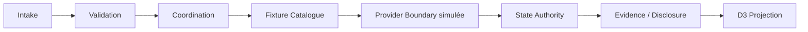

# Full Review Pack — SFIA Studio V3.1-D2-D Integration Foundation Functional Architecture

## Métadonnées du cycle

| Champ | Valeur |
|-------|--------|
| **Date/heure/fuseau** | 2026-08-03 17:30:00 CEST (+0200) |
| **Rôle** | Cursor (Cycle 3 — Architecture fonctionnelle Critical) |
| **Cycle** | Cycle 3 — Architecture fonctionnelle |
| **Profil** | Critical |
| **Typologie** | EVOL — documentation-only |
| **Branche** | `architecture/sfia-studio-v3-1-d2-d-integration-foundation-functional-architecture` |
| **HEAD / origin/main** | `004296ac9355ef9906584f5d86be6182a96dd2fd` |
| **Verdict** | READY FOR MORRIS ARBITRATION |

## GO Morris consommé

```text
GO ARBITRATION SFIA STUDIO V3.1-D2-D FUNCTIONAL DESIGN

ADOPT:

D-V3.1-D2D-FD-01:
ADOPT THE TWELVE FUNCTIONAL OBJECTS AS THE CANONICAL D2-D
FUNCTIONAL VOCABULARY.
TECHNICAL NAMES AND REPRESENTATIONS REMAIN UNDECIDED.

D-V3.1-D2D-FD-02:
ADOPT THE EIGHT-STATE EXTENSIBLE STATE-A MODEL:
IDLE, RUNNING, AWAITING_HUMAN, SUCCEEDED, FAILED,
CANCELLED, TIMED_OUT, BLOCKED.
NO ADDITIONAL PERSISTENT STATE-B STATES.

D-V3.1-D2D-FD-03:
ADOPT THE DOCUMENTED TRANSITION RULES.
ANY EXECUTION AFTER A TERMINAL STATE REQUIRES A NEW RUN
WITH A NEW EXECUTION IDENTITY.

D-V3.1-D2D-FD-04:
BLOCKED APPLIES WHEN EXECUTION CANNOT LEGITIMATELY START OR CONTINUE
WITHOUT A FATAL EXTERNAL OPERATION FAILURE.
FAILED APPLIES WHEN AN ENGAGED OPERATION FAILS.

D-V3.1-D2D-FD-05:
PARTIAL RESULTS MUST NEVER PRODUCE SUCCEEDED.
COMPLETENESS AND PARTIALITY MUST BE EXPLICITLY DISCLOSED.

D-V3.1-D2D-FD-06:
STRUCTURAL HUMAN GATES USE AWAITING_HUMAN.
NO AUTOMATIC STRUCTURAL DECISION.
EXPLICIT HUMAN-DECISION DEADLINE EXPIRY → TIMED_OUT.
MISSING, REFUSED OR UNSATISFIED GATE → BLOCKED.

D-V3.1-D2D-FD-07:
CANCELLATION IS TERMINAL FOR THE LOCAL RUN.
LATE PROVIDER RESULTS MUST NOT ALTER THE TERMINAL STATE
OR BECOME A SUCCESS RESULT.
THEY MAY ONLY BE RECORDED AS REDACTED EVIDENCE.

D-V3.1-D2D-FD-08:
FIXTURE, SANDBOX-REAL AND REAL ARE THE THREE MANDATORY
SOURCE DISCLOSURES.
A FIXTURE MUST NEVER BE PRESENTED AS REAL.

D-V3.1-D2D-FD-09:
ADOPT THE NORMALIZED FUNCTIONAL FAILURE FAMILIES DOCUMENTED IN §S.
TECHNICAL ERROR CODES REMAIN AN ARCHITECTURE DECISION.

D-V3.1-D2D-FD-10:
ADOPT THE FUNCTIONAL EVENT CATALOGUE AND STRICT REDACTION RULES.
NO SECRET, COMPLETE PROMPT OR COMPLETE PROVIDER RESPONSE
IN EVENTS BY DEFAULT.

D-V3.1-D2D-FD-11:
ADOPT THE PROVIDER-INDEPENDENT D3 FUNCTIONAL PROJECTION.
D3 MUST NOT DEPEND DIRECTLY ON OPENAI, GITHUB OR CURSOR.

D-V3.1-D2D-FD-12:
ADOPT THREE DISTINCT READINESS LEVELS:
UX EXPLORATION READINESS,
UI DELIVERY READINESS,
STRONG RUNTIME VERDICT READINESS.

NEXT:
GO ARCHITECTURE FONCTIONNELLE SFIA STUDIO V3.1-D2-D

NO ARCHITECTURE TECHNIQUE
NO BACKLOG
NO DELIVERY
NO UI CODE
NO CREATECYCLE
NO GIT WRITE
NO METHOD PROMOTION
```

Date/heure : 2026-08-03 17:19 CEST (+0200)

### D-FD-01…12

Toutes : **DECIDED — ADOPTED BY MORRIS** (document 21 §AF2).

### Interprétation NO GIT WRITE

Aucun index/commit/push/PR/merge projet ; branche locale + docs 21/22 (20 inchangé) non trackés ; push L3 `sfia/review-handoff` distinct obligatoire.

## Git Truth initial

| Check | Résultat |
|-------|----------|
| Branche départ | `design/sfia-studio-v3-1-d2-d-integration-foundation-functional-design` |
| HEAD / origin/main | `004296ac…` MATCH |
| Staged / tracked | vides |
| Untracked projet | docs 20 + 21 |
| Remote arch / PR | absents |

Branche créée : `architecture/sfia-studio-v3-1-d2-d-integration-foundation-functional-architecture` — HEAD inchangé — aucun push.

## Handoff source (avant publication)

| Tip | Blob |
|-----|------|
| `d84a64fb7e65bf0d74b22c791ce75f9fce6f8cd4` | `6c37f2ecdcdf9bcf62b10c471202e2593a88f435` |

Titre : Full Review Pack — … Functional Design · Verdict : READY FOR MORRIS ARBITRATION
Vérif tip/blob : `d84a64fb7e65bf0d74b22c791ce75f9fce6f8cd4` / `6c37f2ecdcdf9bcf62b10c471202e2593a88f435` — **MATCH**

## CKC fallback

`02-fifteen-cycles-synthetic-map.md` + `sfia-v2.5-project-cycles-method-candidate.md` §4.3 — method-candidate — aucune autorité — aucun CKC détaillé inventé.

## Sources

Méthode 1–9 ; handoff ; docs 20/21 ; framing README/08/15–19 ; `oa/cycle/**` ; `execution-contract/**` ; `vertical-slice-runtime/**` ; `platform/ai/**` ; `platform/tools/**` ; `ops1/tools/githubReadAdapter.ts` ; `harness/src/ports/**` ; `cursorSandboxRunner.ts`.

## Preuve byte-for-byte avant modification

- Document 20 local vs handoff : **MATCH_EXACT** (inchangé ce cycle)
- Document 21 local vs handoff : **MATCH_EXACT** (avant update)

## Document 21 avant

---BEGIN DOCUMENT 21 BEFORE---
# 21 — V3.1-D2-D Integration Foundation — Conception fonctionnelle

## A. Métadonnées

| Champ | Valeur |
|-------|--------|
| **Date** | 2026-08-03 17:11:11 CEST (+0200) |
| **Cycle** | Cycle 2 — Conception fonctionnelle |
| **Profil SFIA** | **Critical** |
| **Typologie** | EVOL — documentation-only |
| **Projet** | SFIA Studio V3.1-D2-D Integration Foundation |
| **Branche** | `design/sfia-studio-v3-1-d2-d-integration-foundation-functional-design` |
| **Base** | `main@004296ac9355ef9906584f5d86be6182a96dd2fd` |
| **Document amont** | `20-v3-1-d2-d-integration-foundation-cadrage.md` (arbitrated) |
| **CKC** | `method/.../pilots/02-conception-fonctionnelle.md` — candidate — aucune autorité d'exécution |
| **Statut** | `D2-D FUNCTIONAL DESIGN COMPLETE LOCALLY — READY FOR MORRIS ARBITRATION — NO ARCHITECTURE OR DELIVERY AUTHORIZED` |
| **Code / API / UI / architecture / backlog** | **non** |

### GO Morris consommé

```text
GO ARBITRATION SFIA STUDIO V3.1-D2-D INTEGRATION FOUNDATION

ADOPT:

D-V3.1-D2D-CAD-01:
STRICT MINIMAL FOUNDATION —
PORTS + RUNTIME VALIDATION + EXECUTION STATES + CONTRACT FIXTURES,
WITH REAL WALKING SKELETON DEFERRED TO D2-D3.

D-V3.1-D2D-CAD-02:
D2-D CONTRACTS BEFORE D3 UI DELIVERY.
D3 UX EXPLORATION MAY START AFTER STABLE D2-D1 CONTRACTS.

D-V3.1-D2D-CAD-03:
PROVIDER PORTS BEFORE DIRECT SDK COUPLING.
REUSE OF EXISTING PLATFORM/HARNESS COMPONENTS REMAINS AN
IMPLEMENTATION HYPOTHESIS UNTIL ARCHITECTURE VALIDATION.

D-V3.1-D2D-CAD-04:
READ-ONLY FIRST.
NO GIT WRITE CAPABILITY IN D2-D1, D2-D2 OR D2-D3.
D2-D4 REMAINS OUT OF TRAJECTORY.

D-V3.1-D2D-CAD-05:
EXTENSIBLE STATE-A —
MINIMAL CORE STATES WITH TIMED_OUT AND BLOCKED CONTRACTUALLY
SUPPORTED WITHOUT ADOPTING THE FULL STATE-B MODEL.

D-V3.1-D2D-CAD-06:
INT-C — CONTRACT-FIRST HYBRID.
FIXTURES FIRST, THEN ONE REAL READ-ONLY SANDBOXED WALKING SKELETON.

D-V3.1-D2D-CAD-07:
SANDBOX REQUIREMENTS MUST BE VALIDATED BEFORE ANY REAL CURSOR EXECUTION.
CURSOR PRODUCT CAPABILITIES REMAIN UNVERIFIED UNTIL A DEDICATED CHECK.

D-V3.1-D2D-CAD-08:
SERVER-ONLY SECRET PROVIDER BOUNDARY.
GITHUB READ-ONLY PERMISSIONS FIRST.
NO SECRET STORAGE TECHNOLOGY SELECTED AT THIS STAGE.

D-V3.1-D2D-CAD-09:
STRUCTURED EXECUTION EVENTS + STRICT REDACTION.
NO RUN-READY OR SLO CLAIM.

D-V3.1-D2D-CAD-10:
R-C DEFENCE IN DEPTH ADOPTED AS STRATEGY —
BOUNDED D2-C CORRECTION AND D2-D BOUNDARY VALIDATION REQUIRE
SEPARATE CYCLES AND SEPARATE GATES.

D-V3.1-D2D-CAD-11:
D2-D1 → D2-D2 → D2-D3.
D2-D4 REMAINS OUT OF TRAJECTORY.

D-V3.1-D2D-CAD-12:
D3 UX EXPLORATION MAY START AFTER D2-D1 CONTRACT STABILITY.
D3 UI DELIVERY AND STRONG RUNTIME VERDICT REQUIRE D2-D2/D2-D3 EVIDENCE.

NEXT:
GO CONCEPTION FONCTIONNELLE SFIA STUDIO V3.1-D2-D

NO DELIVERY
NO UI CODE
NO CREATECYCLE
NO GIT WRITE
NO METHOD PROMOTION
```

Date/heure décision Morris cadrage : 2026-08-03 16:56 CEST (+0200).
Le présent cycle consomme la suite **GO CONCEPTION FONCTIONNELLE**.

**NO GIT WRITE :** aucun index/commit/push/PR/merge projet ; documents 20/21 non trackés ; push L3 handoff distinct.

### Marqueurs épistémiques

| Marqueur | Usage |
|----------|-------|
| **Décision Morris adoptée** | D-CAD-01…12 |
| **Observation repo** | Fait Git vérifiable |
| **Règle fonctionnelle candidate** | Comportement proposé, non adopté |
| **Hypothèse** | Inférence non prouvée |
| **Inconnue** | Lacune ouverte |
| **Réserve** | OPEN transportée |
| **Décision fonctionnelle candidate** | FD-01…12 — NOT DECIDED |

---

## B. Décisions Morris héritées

Toutes : **DECIDED — ADOPTED BY MORRIS** (2026-08-03 16:56 CEST). Conséquences fonctionnelles — **pas** techniques.

| ID | Conséquence fonctionnelle |
|----|---------------------------|
| CAD-01 | Socle minimal : ports + validation + états + fixtures ; walking skeleton réel en D2-D3 |
| CAD-02 | Contrats avant UI Delivery D3 ; UX exploratoire possible après D2-D1 stable |
| CAD-03 | Ports fournisseurs avant couplage SDK ; réutilisation platform/harness = hypothèse jusqu'à architecture |
| CAD-04 | Read-only first ; aucune Git write en D2-D1/2/3 ; D2-D4 hors trajectoire |
| CAD-05 | Extensible STATE-A ; `timed_out` et `blocked` supportés ; pas de STATE-B complet |
| CAD-06 | INT-C : fixtures d'abord, puis un walking skeleton read-only sandboxé |
| CAD-07 | Sandbox validée avant Cursor réel ; capacités Cursor **UNVERIFIED** jusqu'à check dédié |
| CAD-08 | Secrets server-only ; GitHub read-only first ; aucun secret store choisi |
| CAD-09 | Événements structurés + redaction stricte ; aucun RUN READY / SLO |
| CAD-10 | R-C : correctif D2-C et validation frontière D2-D = deux cycles / deux gates |
| CAD-11 | Séquence D2-D1 → D2-D2 → D2-D3 ; D2-D4 hors trajectoire |
| CAD-12 | UX exploratoire après D2-D1 ; UI Delivery + verdict runtime fort après D2-D2/D2-D3 |

**Observation repo :** briques OpenAI (`platform/ai`), GitHub read (`ops1/tools/githubReadAdapter`, `platform/tools`), Cursor/sandbox harness existent en silos — **pas** de package D2-D OA unifié (**Observation** cadrage 20).

---

## C. Finalité fonctionnelle

**Problème fonctionnel :** permettre à SFIA Studio de **préparer, suivre et restituer** une exécution externe contrôlée, **read-only** et **observable**, sans exposer les détails fournisseurs à D3 et sans permettre de mutation Git.

**Valeur attendue :**

- vérité sur la source (`fixture` / `sandbox-real` / `real`) ;
- comportement testable via fixtures contractuelles ;
- erreurs compréhensibles et normalisées ;
- contrôle Morris pour décisions structurantes ;
- fixtures et réel compatibles (même forme) ;
- progression vers un walking skeleton read-only (D2-D3).

Ce n'est **pas** : brancher tous les SDK, ouvrir CreateCycle, ou livrer une UI.

---

## D. Périmètre fonctionnel

Comportements inclus (cible fonctionnelle) :

1. Préparation d'une **intention d'exécution**
2. Validation fonctionnelle des entrées
3. Détermination de la **capacité fournisseur** disponible
4. Sélection explicite `fixture` / `sandbox-real` / `real`
5. Lecture Git distante **read-only**
6. Exécution AI **bornée**
7. Préparation d'un **contrat d'exécution Cursor**
8. Exécution Cursor **read-only sandboxée** (cible ; capacité produit UNVERIFIED)
9. Suivi des états
10. Attente humaine
11. Cancellation
12. Timeout
13. Blocked
14. Normalisation des résultats
15. Collecte des preuves
16. Disclosures
17. Usage/coût **si** fourni et validé
18. Restitution pour D3 futur

---

## E. Hors périmètre fonctionnel

- CreateCycle
- Mutations Git / écriture GitHub
- Édition de fichiers / commande arbitraire
- Auto-validation Morris
- Production deploy / persistance complète / IAM complet / dashboard
- UI détaillée / Figma
- Architecture (fonctionnelle ou technique)
- SDK / backlog / user stories
- Levée automatique des réserves

---

## F. Acteurs et rôles

### 1. Morris / décideur humain

| Aspect | Contenu |
|--------|---------|
| Intention | Arbitrer gates structurantes ; autoriser progression |
| Responsabilité | Décisions GO ; acceptation risques |
| Visible | Preuves, états, disclosures, erreurs redacted |
| Autorisé | Décider, annuler gate, refuser progression |
| Interdit | Contournement par validation technique automatique |
| Confiance | Haute (autorité) |

### 2. Utilisateur opérateur futur

| Aspect | Contenu |
|--------|---------|
| Intention | Lancer / observer une exécution bornée |
| Visible | États, disclosures, erreurs utilisateur, usage si fourni |
| Autorisé | Intention, cancel si permis, lecture résultats |
| Interdit | Secrets, mutations, commandes arbitraires, forcer réel sans gate |
| Confiance | Non fiable (navigateur) |

### 3. SFIA Studio

| Aspect | Contenu |
|--------|---------|
| Intention | Orchestrer validation, ports, états, événements, restitution |
| Autorisé | Valider, appeler ports serveur, publier événements redacted |
| Interdit | Exposer secrets client ; muter Git ; inventer succès |
| Confiance | Semi-confiant (serveur) |

### 4. D2-C Qualification Core

| Aspect | Contenu |
|--------|---------|
| Intention | Qualifier cycle via CKC en read-only |
| Observation | Package `oa/cycle` intégré ; Result Success/Failure |
| Interdit | Mutation CreateCycle |
| Réserve | R-QA-D2C-01 OPEN |

### 5. Provider AI fonctionnel

Besoin : réponse bornée + usage éventuel. Secrets server-only. Pas de détail SDK.

### 6. Provider Git fonctionnel

Besoin : Git Truth distant read-only (repo/ref/commit/branche/PR/CI). Write **interdit**.

### 7. Worker Cursor fonctionnel

Besoin : exécution contrôlée sandbox read-only. Capacités produit **UNVERIFIED** (CAD-07).

### 8. Secret Source fonctionnelle

Fournit credentials **serveur only** ; identité sans valeur ; jamais client.

### 9. Event Sink fonctionnel

Reçoit événements structurés redacted ; pas de modèle technique d'event bus décidé.

### 10. Sandbox fonctionnelle

Isole workspace ; enforce read-only ; timeout/quota ; chemins protégés ; preuve de conformité avant Cursor réel.

---

## G. Objets fonctionnels

Noms **candidats** jusqu'à arbitrage FD-01. Pas de signatures TypeScript.

### Execution Intent

- Finalité : déclarer ce que l'opérateur veut exécuter
- Attributs min. : objectif borné, providers demandés, source déclarée, limites
- Propriétaire : opérateur / Studio
- Visibilité D3 : résumé non sensible
- Intégrité : source obligatoire ; mutation demandée → rejet

### Execution Context

- Finalité : lier projet, refs, correlationId, permissions
- Sensible : refs repo ; pas de secrets
- Visibilité D3 : partiel

### Provider Capability

- Finalité : dire si un provider est `available` / `unavailable` / `unverified`
- Cursor peut être `unverified` → blocked ou gate

### Validation Outcome

- Finalité : accept / reject avant exploitation
- Pas un état persistant STATE-B

### Execution Run

- Finalité : instance engagée d'une intention
- Nouveau run requis après failed/timed_out/cancelled/succeeded pour rejouer
- Visibilité D3 : oui (état, source, preuves)

### Execution State

- Un des huit états §H

### External Result

- Sortie provider normalisée ; complète ou partielle

### Execution Evidence

- Preuves non sensibles ; timestamps validés ; chemins sandbox

### Source Disclosure

- `fixture` \| `sandbox-real` \| `real` + provider + limites

### Human Decision Gate

- Décision Morris structurante ; pas substituable par validation technique

### Usage Summary

- Tokens/usage/coût **si** fournis et sourcés ; sinon `unavailable`

### Normalized Failure

- Famille d'erreur + message utilisateur + preuve minimale + données masquées

---

## H. Modèle d'états hérité

**Décision Morris adoptée CAD-05 — Extensible STATE-A.**

États fonctionnels **uniquement** :

1. `idle`
2. `running`
3. `awaiting_human`
4. `succeeded`
5. `failed`
6. `cancelled`
7. `timed_out`
8. `blocked`

**Interdit d'ajouter** comme états persistants : `created`, `queued`, `validating`, ou autres STATE-B.

Une validation est une **phase/résultat** (`Validation Outcome`), pas un état supplémentaire.

---

## I. Sémantique des états

**Règles fonctionnelles candidates** (soumises FD-02) :

| État | Définition |
|------|------------|
| `idle` | Aucune exécution active ; intention modifiable tant qu'aucun run n'est engagé |
| `running` | Au moins une opération externe contrôlée est active |
| `awaiting_human` | Suspendu sur décision humaine explicite ; aucune progression automatique structurante |
| `succeeded` | Toutes les sorties **obligatoires** reçues, validées et normalisées |
| `failed` | Opération engagée a échoué ; aucun résultat exploitable **complet** |
| `cancelled` | Arrêt explicite accepté avant terminaison |
| `timed_out` | Expiration d'une limite temporelle bornée |
| `blocked` | Pas le droit/capacité de démarrer ou continuer (validation, permission, provider, sandbox, gate Morris) |

---

## J. Règles de transition

**Transitions candidates autorisées :**

| De | Vers | Condition |
|----|------|-----------|
| idle | running | Intent validé ; source déclarée ; permissions OK ; pas de gate bloquante |
| idle | blocked | Validation/permission/capability/sandbox/gate échoue avant engagement |
| running | awaiting_human | Gate humaine structurante requise |
| running | succeeded | Sorties obligatoires validées |
| running | failed | Échec opération engagée |
| running | timed_out | Limite temporelle atteinte |
| running | cancelled | Cancel accepté |
| awaiting_human | running | Décision humaine positive enregistrée |
| awaiting_human | cancelled | Annulation humaine / cancel accepté |
| awaiting_human | blocked | Décision négative ou précondition devenue invalide |

**Transitions interdites :**

- `failed` → `succeeded` sans **nouveau run**
- `timed_out` → `succeeded` sans nouveau run
- `blocked` → `running` sans **nouvelle validation**
- `succeeded` → `running` sur le **même** run
- progression automatique depuis `awaiting_human` pour décision structurante

**Nouveau run (règle candidate) :** nouvel `Execution Run` avec nouvel identifiant fonctionnel / correlationId de run ; ne réécrit pas l'historique du run précédent.

---

## K. Parcours nominal fixture

1. Contexte projet existant
2. Intention d'exécution
3. Validation → accept
4. Source **`fixture`** déclarée et visible
5. Qualification D2-C (core read-only)
6. Résultats Git/AI/Cursor **simulés** via **mêmes contrats** que réel
7. Événements structurés
8. `succeeded`
9. Restitution future D3 avec disclosure fixture

Exigences : aucune règle métier parallèle ; aucun secret ; déterminisme ; source toujours visible.

---

## L. Parcours nominal sandbox-real read-only

**FUNCTIONAL TARGET — IMPLEMENTATION CAPABILITY UNVERIFIED**

1. Contexte projet
2. Validation
3. Vérification permissions read-only
4. Sandbox conforme (CAD-07)
5. Lecture GitHub bornée
6. Appel AI borné candidat
7. Préparation contrat Cursor
8. Exécution Cursor read-only
9. Collecte états
10. Validation sorties
11. Résultat normalisé
12. Preuves
13. Restitution + disclosure `sandbox-real` ou `real`

Ne pas affirmer la disponibilité technique aujourd'hui. Cursor produit **UNVERIFIED**.

---

## M. Parcours d'attente humaine

| Élément | Règle candidate |
|---------|-----------------|
| Déclencheurs | Gate Morris structurante ; permission sensible ; passage fixture→real ; Cursor réel ; risque données |
| Présenté | État, source, provider, preuves redacted, question de décision |
| Décision | Approve / Reject / Cancel (libellés candidats) |
| Autorisé | Enregistrer décision ; reprendre ou bloquer |
| Expiration | Optionnelle → `timed_out` ou `blocked` selon règle adoptée (FD-06) |
| Auto | **Interdit** pour décision structurante |
| Trace | `human_decision_recorded` |

---

## N. Parcours cancellation

- Qui : opérateur (si permis) ou Morris
- Quand : depuis `running` ou `awaiting_human`
- Résultat : état terminal `cancelled` ; **jamais** succès
- Provider non interruptible immédiatement : état `cancelled` dès acceptation locale ; résultats tardifs **non** interprétés comme succès ; événement d'arrivée tardive redacted possible
- Preuve : qui / quand / run id

---

## O. Parcours timeout

- Limites **bornées** (valeurs numériques = architecture future)
- Timeout **global** vs **opération fournisseur** : concepts fonctionnels distincts
- État : `timed_out`
- Retry : uniquement via **nouveau run** ; **aucun** retry infini
- Preuve : horodatage début/fin validés

---

## P. Parcours blocked

Déclencheurs : entrée invalide ; provider indisponible ; auth absente ; permission insuffisante ; sandbox non conforme ; chemin protégé ; mutation demandée ; gate Morris manquante ; Cursor UNVERIFIED sans gate ; secret indisponible ; règle RGPD non satisfaite.

| Élément | Contenu candidat |
|---------|------------------|
| Message utilisateur | Cause compréhensible sans secret |
| Code fonctionnel | Famille §S |
| Preuve minimale | Motif + correlationId + source |
| Déblocage | Correction + **nouvelle validation** ; éventuellement nouvelle gate |
| État | `blocked` (avant/sans engagement) ; si déjà running, préférer `failed` selon FD-04 |

---

## Q. Intégrations fonctionnelles

Sans endpoint, SDK, HTTP, classe, route, Server Action, package, protocole.

### AI

| Dimension | Contenu |
|-----------|---------|
| Besoin | Analyse / sortie structurée bornée |
| Demande | Intent + contexte minimisé |
| Réponse | Texte/structure + usage optionnel |
| Partiel | Marqué partiel ; ≠ succès |
| Indispo | `provider_unavailable` / blocked ou failed |
| Permission | Secret server-only |
| Timeout / cancel | Supportés fonctionnellement |
| Disclosure | provider + source |

### GitHub

| Dimension | Contenu |
|-----------|---------|
| Besoin | Git Truth read-only |
| Demande | repo/ref/PR/CI allowlistés |
| Réponse | Métadonnées |
| Write | **Interdit** |
| Permission insuffisante | blocked/failed + `authorization` |
| Disclosure | read-only + absence mutation |

### Cursor

| Dimension | Contenu |
|-----------|---------|
| Besoin | Exécution sandbox read-only |
| Contrat | Borné ; pas de commande arbitraire navigateur |
| Capability | Peut être UNVERIFIED → blocked/gate |
| Write | Interdit |
| Sandbox | Obligatoire avant réel |

---

## R. Validation runtime fonctionnelle

**Règles observables candidates :**

1. Toute entrée externe validée **avant** exploitation
2. Toute sortie provider validée **avant** succès
3. Champ obligatoire absent → `blocked` (avant) ou `failed` (pendant) selon phase
4. Valeur inattendue → résultat normalisé (pas d'exception brute D3)
5. Aucun accès métadonnées avant validation (lien R-QA-D2C-01 / R-QA-REV-01)
6. Aucun `consumed=true` après erreur
7. `correlationId` obligatoire
8. Timestamp invalide → non publié comme événement valide
9. Payload size bornée
10. Résultat partiel ≠ succès
11. Redaction erreurs
12. Aucune correction silencieuse d'entrée invalide

Distinguer : **rejet avant** · **échec pendant** · **sortie invalide après**.

---

## S. Catalogue fonctionnel des erreurs

Familles **candidates** (non codes techniques définitifs) :

| Famille | Moment | État candidat | Retry | Humain | Masquer |
|---------|--------|---------------|-------|--------|---------|
| validation | avant | blocked | oui après correction | non | détails internes |
| authentication | avant/pendant | blocked/failed | après credential | parfois | secrets |
| authorization | avant/pendant | blocked/failed | après droits | parfois | tokens |
| provider_unavailable | pendant | failed/blocked | nouveau run | non | — |
| rate_limited | pendant | failed/blocked | différé borné | non | — |
| timed_out | pendant | timed_out | nouveau run | non | — |
| cancelled | pendant | cancelled | nouveau run | non | — |
| sandbox_blocked | avant/pendant | blocked | après conformité | parfois | chemins sensibles |
| protected_path | pendant | blocked/failed | non si interdit | oui | chemins |
| mutation_forbidden | avant | blocked | non (changer intent) | non | — |
| human_gate_required | avant/pendant | awaiting_human/blocked | après décision | **oui** | — |
| invalid_provider_result | après | failed | nouveau run | non | payload brut |
| internal_normalized_failure | pendant | failed | limité | parfois | stack |

Message utilisateur : compréhensible, sans secret, sans prompt complet.

---

## T. Permissions et visibilité

- Navigateur : **sans secret**
- Serveur : seule frontière credentials
- GitHub / Cursor : **read-only**
- Aucune mutation
- Allowlist repo ; chemins protégés
- Morris vs opérateur : Morris seul pour gates structurantes
- D3 : états, disclosures, erreurs redacted, preuves non sensibles
- Secrets : **jamais** visibles
- Erreurs : redacted

---

## U. Disclosures fonctionnels

Toute restitution indique :

- source : `fixture` \| `sandbox-real` \| `real`
- provider
- résultat complet / partiel
- timestamp de preuve (ISO validé)
- correlationId / identifiant fonctionnel
- permission read-only
- absence de mutation
- limites connues
- capacité UNVERIFIED le cas échéant

**Jamais** présenter une fixture comme résultat réel.

---

## V. Événements fonctionnels

Noms **candidats** (FD-10). Pas d'event bus technique.

| Événement | Déclencheur | Avant → Après | Données min. | Interdit |
|-----------|-------------|---------------|--------------|----------|
| intent_validated | validation OK | idle→idle ou vers running/blocked | correlationId, source | secrets |
| execution_started | run engagé | idle→running | run id, providers | prompts complets |
| execution_blocked | blocage | →blocked | famille, motif | secrets |
| external_operation_started | op provider | running | provider, op | payloads bruts |
| external_operation_completed | fin op | running | statut, usage? | réponses complètes |
| awaiting_human | gate | running→awaiting_human | question | secrets |
| human_decision_recorded | décision | awaiting_human→… | décision | — |
| execution_cancelled | cancel | →cancelled | qui/quand | — |
| execution_timed_out | timeout | →timed_out | bornes | — |
| execution_failed | échec | →failed | famille | stack/secrets |
| execution_succeeded | succès | →succeeded | preuve ids | données brutes |

Tous : redaction ; correlationId ; source fixture/sandbox-real/real.

---

## W. Usage et FinOps fonctionnels

- Usage présenté **uniquement** s'il est fourni et validé
- Coût uniquement si calculable **et** sourcé
- Sinon : clairement `unavailable`
- **Aucun** prix inventé
- Quotas / rate limit comme comportements
- Distinction estimation / mesure
- Aucune décision de facturation

---

## X. Fixtures contractuelles

Règles : parité forme/comportement ; version ; déterminisme ; provenance ; invalidation si contrat change ; données synthétiques ; scénarios +/- ; aucune règle métier parallèle ; compatibles transitions ; rejouables.

Scénarios minimaux : succès ; validation rejetée ; auth refusée ; permission insuffisante ; rate limit ; timeout ; cancellation ; provider indisponible ; résultat partiel ; sortie invalide ; sandbox bloqué ; mutation interdite ; gate Morris requise.

---

## Y. Défense en profondeur R-QA-D2C-01

**Décision Morris adoptée CAD-10 — R-C.**

### Travail futur 1 — Correctif D2-C borné

- Cycle séparé ; gate séparée ; QA séparée
- **Aucune** levée de réserve anticipée

### Travail futur 2 — Validation frontière D2-D

- Exigence fonctionnelle du présent design
- Future Delivery D2-D1
- **Ne remplace pas** le correctif D2-C

### Critères fonctionnels communs

- `null`/`undefined` rejetés **avant** lecture métadonnées
- Échec normalisé ; aucun succès ; aucun `consumed=true`
- Événement valide **ou** absence d'événement explicitement justifiée
- Aucune exception brute exposée

**R-QA-D2C-01 :** `OPEN — NOT LIFTED`

**Réserves conservées :** R-QA-REV-01 OPEN NOT LIFTED ; R-QA-REV-02 OPEN NOT LIFTED.

---

## Z. Projection fonctionnelle pour D3

D3 pourra consommer fonctionnellement (sans UI) :

- état courant ; progression ; source ; provider
- résultat ; erreur normalisée ; preuve
- attente humaine ; cancel possible ; timeout ; blocked reason
- Git Truth read-only ; qualification D2-C ; preuve CKC
- usage éventuel ; disclosures ; réserves ouvertes

Ne pas dessiner UI / composants / écrans.

---

## AA. Critères d'entrée D3

Applique **CAD-12**.

### UX exploration readiness (candidat)

- Vocabulaire fonctionnel stable
- États / erreurs / disclosures définis
- DTO fonctionnels suffisamment bornés
- Fixtures contractuelles définies
- **Après** stabilité D2-D1

### UI Delivery readiness

Interdite tant que : D2-D1 non validé ; frontières non testées ; règles d'états non adoptées ; R-QA-D2C-01 non traitée selon gates ; preuves D2-D2/D2-D3 insuffisantes.

### Strong runtime verdict readiness

Exige preuves D2-D2/D2-D3 (sandbox + walking skeleton read-only) + disclosures honnêtes.

---

## AB. Critères d'acceptation fonctionnels

| ID | Given | When | Then |
|----|-------|------|------|
| CA-01 | Intent valide + source fixture | Exécution lancée | `running` puis `succeeded` ; disclosure fixture |
| CA-02 | Intent invalide | Soumission | `blocked` ; pas d'op externe ; erreur validation |
| CA-03 | Source fixture déclarée | Restitution | Disclosure ≠ real |
| CA-04 | Source real déclarée sans preuves | Tentative | Gate ou blocked ; pas de faux réel |
| CA-05 | Source inconnue | Soumission | `blocked` |
| CA-06 | Run read-only | Toute op | Aucune mutation Git |
| CA-07 | Mutation demandée | Validation | `blocked` + `mutation_forbidden` |
| CA-08 | Permission GitHub insuffisante | Lecture | blocked/failed + `authorization` |
| CA-09 | Cursor UNVERIFIED | Cursor réel demandé | blocked ou awaiting_human ; disclosure UNVERIFIED |
| CA-10 | Sandbox non conforme | Cursor réel | `blocked` + `sandbox_blocked` |
| CA-11 | AI timeout | Op AI | `timed_out` ; pas succès |
| CA-12 | Provider down | Op | `provider_unavailable` normalisé |
| CA-13 | Résultat partiel | Fin op | ≠ succeeded ; marquage partiel |
| CA-14 | Sortie invalide | Validation sortie | `failed` + `invalid_provider_result` |
| CA-15 | Cancel accepté | Pendant running | `cancelled` ; pas succès |
| CA-16 | Gate Morris | Besoin décision | `awaiting_human` ; pas d'auto-progress |
| CA-17 | Gate absente alors requise | Progression | `blocked` + `human_gate_required` |
| CA-18 | Sorties obligatoires OK | Fin | `succeeded` + preuves |
| CA-19 | Request null/undefined | Frontière | Rejet avant métadonnées ; pas consumed ; R-QA-D2C-01 non levée |
| CA-20 | Erreur | Restitution | Redaction ; pas de clé/prompt complet |
| CA-21 | Usage absent | Restitution | `unavailable` ; pas de prix inventé |
| CA-22 | D3 consomme run | Affichage futur | Disclosure source + read-only + état |

Tous indépendants d'un SDK particulier.

---

## AC. Invariants fonctionnels

1. Aucun succès sans validation des sorties
2. Aucune mutation Git
3. Aucun secret côté client
4. Aucune progression structurante sans Morris
5. Aucune fixture présentée comme réelle
6. Aucun résultat partiel présenté comme complet
7. Aucun retry infini
8. Aucun événement contenant clé ou prompt complet par défaut
9. Aucune dépendance D3 directe vers un fournisseur
10. Aucun CreateCycle
11. Aucun `consumed=true` après échec
12. Aucune levée de réserve implicite

---

## AD. Questions ouvertes

- Capacités produit Cursor réelles
- Mécanisme auth GitHub
- Secret store
- Capacités OpenAI exactes nécessaires
- Rétention des événements
- Persistance des runs
- Traitement multi-instance
- Données personnelles/confidentielles admissibles
- Granularité des résultats partiels
- Capacité réelle de cancellation fournisseur

Ne pas résoudre techniquement ici.

---

## AE. Risques fonctionnels

| ID | Risque | P | I | Mitigation fonctionnelle | Décision | Cycle |
|----|--------|---|---|--------------------------|----------|-------|
| RF-01 | Double runtime VS / oa | H | H | Frontière explicite ; pas de domaine parallèle | Archi | Archi fct |
| RF-02 | Fuite provider vers D3 | M | H | Ports + disclosures ; pas de SDK dans D3 | FD-11 | FD/Archi |
| RF-03 | État trop pauvre | M | M | Extensible STATE-A | FD-02 | FD |
| RF-04 | État trop riche | M | M | Interdire STATE-B | CAD-05 | — |
| RF-05 | Fixtures divergentes | M | H | Parité contractuelle | FD-08/X | D2-D1 |
| RF-06 | Erreurs non comparables | M | M | Familles §S | FD-09 | FD |
| RF-07 | Disclosure mensonger | M | H | Invariant fixture≠real | FD-08 | D2-D1 |
| RF-08 | Décision humaine contournée | M | H | awaiting_human obligatoire | FD-06 | D3 |
| RF-09 | Mutation accidentelle | M | H | mutation_forbidden + read-only | CAD-04 | Toujours |
| RF-10 | Logs sensibles | M | H | Redaction événements | FD-10 | D2-D2 |
| RF-11 | Coût invisible | M | M | Usage unavailable explicite | W | D2-D2 |
| RF-12 | Cancel impossible provider | M | M | Cancel local + late result rules | FD-07 | D2-D2 |
| RF-13 | Résultats tardifs | M | M | Jamais succès après cancel/timeout | FD-07 | D2-D2 |
| RF-14 | Persistance non durable | H | M | Disclosures honesty | Z | D3 |
| RF-15 | Réserve D2-C | H | H | R-C deux gates | CAD-10 | Correctif+D2-D1 |

---

## AF. Decision pack fonctionnel Morris

Toutes : **NOT DECIDED — MORRIS ARBITRATION REQUIRED**

### D-V3.1-D2D-FD-01 — Vocabulaire fonctionnel canonique

- **Question :** Adopter les objets §G comme vocabulaire canonique ?
- **Options :** adopter tel quel · renommer · réduire
- **Reco candidate :** adopter les 12 objets comme candidats canoniques
- **Gate :** arbitrage puis architecture fonctionnelle

### D-V3.1-D2D-FD-02 — Définition et sémantique des huit états

- **Options :** sémantique §I · ajustements mineurs · ajouter états (interdit CAD-05)
- **Reco candidate :** adopter sémantique §I

### D-V3.1-D2D-FD-03 — Règles de transition et nouveau run

- **Reco candidate :** transitions §J + nouveau run après terminaux

### D-V3.1-D2D-FD-04 — blocked vs failed

- **Options :** blocked seulement avant engagement · blocked aussi pendant · mapping §P
- **Reco candidate :** `blocked` avant/sans engagement ou incapacité continue sans op fatale ; `failed` si op engagée a échoué

### D-V3.1-D2D-FD-05 — Résultat complet vs partiel

- **Reco candidate :** partiel jamais `succeeded` ; marquage obligatoire

### D-V3.1-D2D-FD-06 — Waiting human et décisions Morris

- **Reco candidate :** gates structurantes → `awaiting_human` ; pas d'auto ; expiration candidate → timed_out/blocked à trancher

### D-V3.1-D2D-FD-07 — Cancellation et résultats tardifs

- **Reco candidate :** cancel local immédiat ; late results non-succès ; événement optionnel redacted

### D-V3.1-D2D-FD-08 — Disclosures fixture / sandbox-real / real

- **Reco candidate :** trois valeurs obligatoires ; fixture ≠ real invariant

### D-V3.1-D2D-FD-09 — Familles d'erreurs normalisées

- **Reco candidate :** catalogue §S comme familles canoniques candidates

### D-V3.1-D2D-FD-10 — Événements fonctionnels et redaction

- **Reco candidate :** événements §V + interdits secrets/prompts/réponses complets

### D-V3.1-D2D-FD-11 — Projection fonctionnelle D3

- **Reco candidate :** projection §Z sans UI ; D3 ne dépend pas d'un provider direct

### D-V3.1-D2D-FD-12 — Critères d'entrée UX / UI Delivery / runtime verdict

- **Reco candidate :** trois readiness §AA alignés CAD-12

Pour chaque décision : impacts sur D3 et Delivery ; dette si reportée ; haute réversibilité tant qu'architecture non figée ; dépendances CAD adoptées ; gate suivante = GO Architecture fonctionnelle **après** arbitrage.

---

## AG. Trajectoire candidate

Après arbitrage fonctionnel **seulement** :

1. Architecture fonctionnelle D2-D
2. Architecture technique D2-D
3. Backlog D2-D1 / D2-D2 / D2-D3
4. Cycles Delivery distincts
5. UX D3 exploratoire possible selon critères adoptés

**Aucune** transition automatique. Aucun GO Architecture technique / Backlog / Delivery / D3 immédiatement consommable.

---

## AH. Anti-claims

Interdit :

- functional design adopted
- architecture adopted
- backlog ready
- ready for Delivery
- providers integrated
- Cursor verified
- secrets secure / sandbox secure
- RUN READY
- UI ready / D3 opened
- CreateCycle enabled / Git write enabled
- reserve lifted
- method promoted

---

## AI. Verdict

```text
D2-D FUNCTIONAL DESIGN COMPLETE LOCALLY —
READY FOR MORRIS ARBITRATION —
ADOPTED CADRAGE DECISIONS APPLIED —
FUNCTIONAL ROLES / FLOWS / OBJECTS / STATES / RULES DOCUMENTED —
EXCEPTIONS AND ACCEPTANCE CRITERIA DOCUMENTED —
D3 FUNCTIONAL PROJECTION AND ENTRY CRITERIA DOCUMENTED —
R-QA-D2C-01 DEFENCE-IN-DEPTH FUNCTIONALLY SPECIFIED —
NO ARCHITECTURE ADOPTED —
NO BACKLOG CREATED —
NO DELIVERY AUTHORIZED —
NO UI CODE —
NO FIGMA —
NO CREATECYCLE —
NO PROJECT GIT WRITE —
NO METHOD PROMOTION
```

### Prochaine gate candidate

```text
GO ARBITRATION SFIA STUDIO V3.1-D2-D FUNCTIONAL DESIGN
APPLY D-V3.1-D2D-FD-01…12
```

Après arbitrage seulement : `GO ARCHITECTURE FONCTIONNELLE SFIA STUDIO V3.1-D2-D`.

---END DOCUMENT 21 BEFORE---

## Modifications exactes du document 21

1. Statut métadonnées → ARBITRATED BY MORRIS — FUNCTIONAL ARCHITECTURE AUTHORIZED — NO TECHNICAL ARCHITECTURE OR DELIVERY AUTHORIZED
2. Ajout **AF2. Decision record Morris — 2026-08-03 17:19 CEST** (GO + table FD-01…12 DECIDED)
3. Verdict AI mis à jour
4. Prochaine gate → trace GO Architecture fonctionnelle consommé ; prochaine = FA pack doc 22
5. Historique AF / recommandations candidates **préservés**

Diff sémantique :

```diff
--- .tmp-sfia-review/document21-from-handoff.md	2026-08-03 17:27:43
+++ projects/sfia-studio/sfia-v3-delivery/v3-native-option-a/first-user-visible-vertical-slice-framing/21-v3-1-d2-d-integration-foundation-functional-design.md	2026-08-03 17:28:19
@@ -13,7 +13,7 @@
 | **Base** | `main@004296ac9355ef9906584f5d86be6182a96dd2fd` |
 | **Document amont** | `20-v3-1-d2-d-integration-foundation-cadrage.md` (arbitrated) |
 | **CKC** | `method/.../pilots/02-conception-fonctionnelle.md` — candidate — aucune autorité d'exécution |
-| **Statut** | `D2-D FUNCTIONAL DESIGN COMPLETE LOCALLY — READY FOR MORRIS ARBITRATION — NO ARCHITECTURE OR DELIVERY AUTHORIZED` |
+| **Statut** | `D2-D FUNCTIONAL DESIGN — ARBITRATED BY MORRIS — FUNCTIONAL ARCHITECTURE AUTHORIZED — NO TECHNICAL ARCHITECTURE OR DELIVERY AUTHORIZED` |
 | **Code / API / UI / architecture / backlog** | **non** |

 ### GO Morris consommé
@@ -837,7 +837,113 @@
 - **Reco candidate :** trois readiness §AA alignés CAD-12

 Pour chaque décision : impacts sur D3 et Delivery ; dette si reportée ; haute réversibilité tant qu'architecture non figée ; dépendances CAD adoptées ; gate suivante = GO Architecture fonctionnelle **après** arbitrage.
+
+---
+
+
+## AF2. Decision record Morris — 2026-08-03 17:19 CEST (+0200)
+
+Le decision pack **AF** initial reste conservé comme **historique candidat**. Les recommandations FD ne sont pas réécrites rétrospectivement. Le présent enregistrement documente l'arbitrage Morris consommé.
+
+### GO Morris d'arbitrage consommé
+
+```text
+GO ARBITRATION SFIA STUDIO V3.1-D2-D FUNCTIONAL DESIGN
+
+ADOPT:
+
+D-V3.1-D2D-FD-01:
+ADOPT THE TWELVE FUNCTIONAL OBJECTS AS THE CANONICAL D2-D
+FUNCTIONAL VOCABULARY.
+TECHNICAL NAMES AND REPRESENTATIONS REMAIN UNDECIDED.
+
+D-V3.1-D2D-FD-02:
+ADOPT THE EIGHT-STATE EXTENSIBLE STATE-A MODEL:
+IDLE, RUNNING, AWAITING_HUMAN, SUCCEEDED, FAILED,
+CANCELLED, TIMED_OUT, BLOCKED.
+NO ADDITIONAL PERSISTENT STATE-B STATES.
+
+D-V3.1-D2D-FD-03:
+ADOPT THE DOCUMENTED TRANSITION RULES.
+ANY EXECUTION AFTER A TERMINAL STATE REQUIRES A NEW RUN
+WITH A NEW EXECUTION IDENTITY.
+
+D-V3.1-D2D-FD-04:
+BLOCKED APPLIES WHEN EXECUTION CANNOT LEGITIMATELY START OR CONTINUE
+WITHOUT A FATAL EXTERNAL OPERATION FAILURE.
+FAILED APPLIES WHEN AN ENGAGED OPERATION FAILS.
+
+D-V3.1-D2D-FD-05:
+PARTIAL RESULTS MUST NEVER PRODUCE SUCCEEDED.
+COMPLETENESS AND PARTIALITY MUST BE EXPLICITLY DISCLOSED.
+
+D-V3.1-D2D-FD-06:
+STRUCTURAL HUMAN GATES USE AWAITING_HUMAN.
+NO AUTOMATIC STRUCTURAL DECISION.
+EXPLICIT HUMAN-DECISION DEADLINE EXPIRY → TIMED_OUT.
+MISSING, REFUSED OR UNSATISFIED GATE → BLOCKED.
+
+D-V3.1-D2D-FD-07:
+CANCELLATION IS TERMINAL FOR THE LOCAL RUN.
+LATE PROVIDER RESULTS MUST NOT ALTER THE TERMINAL STATE
+OR BECOME A SUCCESS RESULT.
+THEY MAY ONLY BE RECORDED AS REDACTED EVIDENCE.
+
+D-V3.1-D2D-FD-08:
+FIXTURE, SANDBOX-REAL AND REAL ARE THE THREE MANDATORY
+SOURCE DISCLOSURES.
+A FIXTURE MUST NEVER BE PRESENTED AS REAL.
+
+D-V3.1-D2D-FD-09:
+ADOPT THE NORMALIZED FUNCTIONAL FAILURE FAMILIES DOCUMENTED IN §S.
+TECHNICAL ERROR CODES REMAIN AN ARCHITECTURE DECISION.
+
+D-V3.1-D2D-FD-10:
+ADOPT THE FUNCTIONAL EVENT CATALOGUE AND STRICT REDACTION RULES.
+NO SECRET, COMPLETE PROMPT OR COMPLETE PROVIDER RESPONSE
+IN EVENTS BY DEFAULT.

+D-V3.1-D2D-FD-11:
+ADOPT THE PROVIDER-INDEPENDENT D3 FUNCTIONAL PROJECTION.
+D3 MUST NOT DEPEND DIRECTLY ON OPENAI, GITHUB OR CURSOR.
+
+D-V3.1-D2D-FD-12:
+ADOPT THREE DISTINCT READINESS LEVELS:
+UX EXPLORATION READINESS,
+UI DELIVERY READINESS,
+STRONG RUNTIME VERDICT READINESS.
+
+NEXT:
+GO ARCHITECTURE FONCTIONNELLE SFIA STUDIO V3.1-D2-D
+
+NO ARCHITECTURE TECHNIQUE
+NO BACKLOG
+NO DELIVERY
+NO UI CODE
+NO CREATECYCLE
+NO GIT WRITE
+NO METHOD PROMOTION
+```
+
+Date/heure de la décision Morris : **2026-08-03 17:19 CEST (+0200)**
+
+### Table des décisions FD adoptées
+
+| ID | Choix adopté | Statut | Conséquence architecturale fonctionnelle | Gates restantes |
+|----|--------------|--------|------------------------------------------|-----------------|
+| D-V3.1-D2D-FD-01 | Twelve canonical functional objects. Technical names and representations undecided. | DECIDED — ADOPTED BY MORRIS | Vocabulaire fonctionnel canonique pour modules/ownership ; noms techniques non décidés | Architecture fonctionnelle → technique |
+| D-V3.1-D2D-FD-02 | Eight persistent states only: idle, running, awaiting_human, succeeded, failed, cancelled, timed_out, blocked. | DECIDED — ADOPTED BY MORRIS | State Authority bornée à huit états ; pas de STATE-B | FA-03 |
+| D-V3.1-D2D-FD-03 | Documented transition rules. Any execution after terminal state requires a new run identity. | DECIDED — ADOPTED BY MORRIS | Nouveau run après terminal ; transitions non négociables hors nouvel arbitrage | FA-03 |
+| D-V3.1-D2D-FD-04 | blocked before or without fatal engaged-operation failure ; failed after engaged-operation failure. | DECIDED — ADOPTED BY MORRIS | Séparation blocked/failed pour Validation vs Provider Boundary | FA-04/06 |
+| D-V3.1-D2D-FD-05 | partial never succeeded ; completeness and partiality explicitly disclosed. | DECIDED — ADOPTED BY MORRIS | Evidence/Disclosure Authority unique sur complétude | FA-04 |
+| D-V3.1-D2D-FD-06 | structural gates use awaiting_human ; deadline expiry timed_out ; missing/refused/unsatisfied gate blocked ; no automatic structural decision. | DECIDED — ADOPTED BY MORRIS | Human Gate Authority ; pas d'auto-décision | FA-07 |
+| D-V3.1-D2D-FD-07 | cancellation terminal locally ; late results evidence-only and cannot change terminal state. | DECIDED — ADOPTED BY MORRIS | État terminal immuable ; late results → Evidence only | FA-03/04 |
+| D-V3.1-D2D-FD-08 | fixture / sandbox-real / real mandatory disclosures. | DECIDED — ADOPTED BY MORRIS | Provenance obligatoire ; fixture ≠ real | FA-04/08 |
+| D-V3.1-D2D-FD-09 | normalized functional failure families adopted ; technical codes undecided. | DECIDED — ADOPTED BY MORRIS | Familles §S canoniques ; codes techniques = archi technique | Archi technique |
+| D-V3.1-D2D-FD-10 | functional event catalogue + strict redaction adopted. | DECIDED — ADOPTED BY MORRIS | Events/Usage sans secrets/prompts/réponses complets | FA-02 |
+| D-V3.1-D2D-FD-11 | provider-independent D3 projection adopted. | DECIDED — ADOPTED BY MORRIS | D3 sans dépendance directe OpenAI/GitHub/Cursor | FA-08 |
+| D-V3.1-D2D-FD-12 | three distinct readiness levels adopted. | DECIDED — ADOPTED BY MORRIS | UX exploration / UI Delivery / strong runtime verdict séparés | Slicing + gates D3 |
+
 ---

 ## AG. Trajectoire candidate
@@ -876,18 +982,12 @@
 ## AI. Verdict

 ```text
-D2-D FUNCTIONAL DESIGN COMPLETE LOCALLY —
-READY FOR MORRIS ARBITRATION —
-ADOPTED CADRAGE DECISIONS APPLIED —
-FUNCTIONAL ROLES / FLOWS / OBJECTS / STATES / RULES DOCUMENTED —
-EXCEPTIONS AND ACCEPTANCE CRITERIA DOCUMENTED —
-D3 FUNCTIONAL PROJECTION AND ENTRY CRITERIA DOCUMENTED —
-R-QA-D2C-01 DEFENCE-IN-DEPTH FUNCTIONALLY SPECIFIED —
-NO ARCHITECTURE ADOPTED —
+D2-D FUNCTIONAL DESIGN — ARBITRATED BY MORRIS —
+FUNCTIONAL ARCHITECTURE AUTHORIZED —
+NO TECHNICAL ARCHITECTURE ADOPTED —
 NO BACKLOG CREATED —
 NO DELIVERY AUTHORIZED —
 NO UI CODE —
-NO FIGMA —
 NO CREATECYCLE —
 NO PROJECT GIT WRITE —
 NO METHOD PROMOTION
@@ -895,9 +995,9 @@

 ### Prochaine gate candidate

-```text
-GO ARBITRATION SFIA STUDIO V3.1-D2-D FUNCTIONAL DESIGN
-APPLY D-V3.1-D2D-FD-01…12
-```
+**Trace de consommation :**

-Après arbitrage seulement : `GO ARCHITECTURE FONCTIONNELLE SFIA STUDIO V3.1-D2-D`.
+- GO Architecture fonctionnelle SFIA Studio V3.1-D2-D **reçu et consommé** (Cycle 3) ;
+- **aucune** architecture technique autorisée ;
+- **aucun** backlog ou Delivery autorisé ;
+- la prochaine décision dépend du decision pack du document 22 (`D-V3.1-D2D-FA-01…12`).

```

## Document 21 complet après

---BEGIN DOCUMENT 21---
# 21 — V3.1-D2-D Integration Foundation — Conception fonctionnelle

## A. Métadonnées

| Champ | Valeur |
|-------|--------|
| **Date** | 2026-08-03 17:11:11 CEST (+0200) |
| **Cycle** | Cycle 2 — Conception fonctionnelle |
| **Profil SFIA** | **Critical** |
| **Typologie** | EVOL — documentation-only |
| **Projet** | SFIA Studio V3.1-D2-D Integration Foundation |
| **Branche** | `design/sfia-studio-v3-1-d2-d-integration-foundation-functional-design` |
| **Base** | `main@004296ac9355ef9906584f5d86be6182a96dd2fd` |
| **Document amont** | `20-v3-1-d2-d-integration-foundation-cadrage.md` (arbitrated) |
| **CKC** | `method/.../pilots/02-conception-fonctionnelle.md` — candidate — aucune autorité d'exécution |
| **Statut** | `D2-D FUNCTIONAL DESIGN — ARBITRATED BY MORRIS — FUNCTIONAL ARCHITECTURE AUTHORIZED — NO TECHNICAL ARCHITECTURE OR DELIVERY AUTHORIZED` |
| **Code / API / UI / architecture / backlog** | **non** |

### GO Morris consommé

```text
GO ARBITRATION SFIA STUDIO V3.1-D2-D INTEGRATION FOUNDATION

ADOPT:

D-V3.1-D2D-CAD-01:
STRICT MINIMAL FOUNDATION —
PORTS + RUNTIME VALIDATION + EXECUTION STATES + CONTRACT FIXTURES,
WITH REAL WALKING SKELETON DEFERRED TO D2-D3.

D-V3.1-D2D-CAD-02:
D2-D CONTRACTS BEFORE D3 UI DELIVERY.
D3 UX EXPLORATION MAY START AFTER STABLE D2-D1 CONTRACTS.

D-V3.1-D2D-CAD-03:
PROVIDER PORTS BEFORE DIRECT SDK COUPLING.
REUSE OF EXISTING PLATFORM/HARNESS COMPONENTS REMAINS AN
IMPLEMENTATION HYPOTHESIS UNTIL ARCHITECTURE VALIDATION.

D-V3.1-D2D-CAD-04:
READ-ONLY FIRST.
NO GIT WRITE CAPABILITY IN D2-D1, D2-D2 OR D2-D3.
D2-D4 REMAINS OUT OF TRAJECTORY.

D-V3.1-D2D-CAD-05:
EXTENSIBLE STATE-A —
MINIMAL CORE STATES WITH TIMED_OUT AND BLOCKED CONTRACTUALLY
SUPPORTED WITHOUT ADOPTING THE FULL STATE-B MODEL.

D-V3.1-D2D-CAD-06:
INT-C — CONTRACT-FIRST HYBRID.
FIXTURES FIRST, THEN ONE REAL READ-ONLY SANDBOXED WALKING SKELETON.

D-V3.1-D2D-CAD-07:
SANDBOX REQUIREMENTS MUST BE VALIDATED BEFORE ANY REAL CURSOR EXECUTION.
CURSOR PRODUCT CAPABILITIES REMAIN UNVERIFIED UNTIL A DEDICATED CHECK.

D-V3.1-D2D-CAD-08:
SERVER-ONLY SECRET PROVIDER BOUNDARY.
GITHUB READ-ONLY PERMISSIONS FIRST.
NO SECRET STORAGE TECHNOLOGY SELECTED AT THIS STAGE.

D-V3.1-D2D-CAD-09:
STRUCTURED EXECUTION EVENTS + STRICT REDACTION.
NO RUN-READY OR SLO CLAIM.

D-V3.1-D2D-CAD-10:
R-C DEFENCE IN DEPTH ADOPTED AS STRATEGY —
BOUNDED D2-C CORRECTION AND D2-D BOUNDARY VALIDATION REQUIRE
SEPARATE CYCLES AND SEPARATE GATES.

D-V3.1-D2D-CAD-11:
D2-D1 → D2-D2 → D2-D3.
D2-D4 REMAINS OUT OF TRAJECTORY.

D-V3.1-D2D-CAD-12:
D3 UX EXPLORATION MAY START AFTER D2-D1 CONTRACT STABILITY.
D3 UI DELIVERY AND STRONG RUNTIME VERDICT REQUIRE D2-D2/D2-D3 EVIDENCE.

NEXT:
GO CONCEPTION FONCTIONNELLE SFIA STUDIO V3.1-D2-D

NO DELIVERY
NO UI CODE
NO CREATECYCLE
NO GIT WRITE
NO METHOD PROMOTION
```

Date/heure décision Morris cadrage : 2026-08-03 16:56 CEST (+0200).
Le présent cycle consomme la suite **GO CONCEPTION FONCTIONNELLE**.

**NO GIT WRITE :** aucun index/commit/push/PR/merge projet ; documents 20/21 non trackés ; push L3 handoff distinct.

### Marqueurs épistémiques

| Marqueur | Usage |
|----------|-------|
| **Décision Morris adoptée** | D-CAD-01…12 |
| **Observation repo** | Fait Git vérifiable |
| **Règle fonctionnelle candidate** | Comportement proposé, non adopté |
| **Hypothèse** | Inférence non prouvée |
| **Inconnue** | Lacune ouverte |
| **Réserve** | OPEN transportée |
| **Décision fonctionnelle candidate** | FD-01…12 — NOT DECIDED |

---

## B. Décisions Morris héritées

Toutes : **DECIDED — ADOPTED BY MORRIS** (2026-08-03 16:56 CEST). Conséquences fonctionnelles — **pas** techniques.

| ID | Conséquence fonctionnelle |
|----|---------------------------|
| CAD-01 | Socle minimal : ports + validation + états + fixtures ; walking skeleton réel en D2-D3 |
| CAD-02 | Contrats avant UI Delivery D3 ; UX exploratoire possible après D2-D1 stable |
| CAD-03 | Ports fournisseurs avant couplage SDK ; réutilisation platform/harness = hypothèse jusqu'à architecture |
| CAD-04 | Read-only first ; aucune Git write en D2-D1/2/3 ; D2-D4 hors trajectoire |
| CAD-05 | Extensible STATE-A ; `timed_out` et `blocked` supportés ; pas de STATE-B complet |
| CAD-06 | INT-C : fixtures d'abord, puis un walking skeleton read-only sandboxé |
| CAD-07 | Sandbox validée avant Cursor réel ; capacités Cursor **UNVERIFIED** jusqu'à check dédié |
| CAD-08 | Secrets server-only ; GitHub read-only first ; aucun secret store choisi |
| CAD-09 | Événements structurés + redaction stricte ; aucun RUN READY / SLO |
| CAD-10 | R-C : correctif D2-C et validation frontière D2-D = deux cycles / deux gates |
| CAD-11 | Séquence D2-D1 → D2-D2 → D2-D3 ; D2-D4 hors trajectoire |
| CAD-12 | UX exploratoire après D2-D1 ; UI Delivery + verdict runtime fort après D2-D2/D2-D3 |

**Observation repo :** briques OpenAI (`platform/ai`), GitHub read (`ops1/tools/githubReadAdapter`, `platform/tools`), Cursor/sandbox harness existent en silos — **pas** de package D2-D OA unifié (**Observation** cadrage 20).

---

## C. Finalité fonctionnelle

**Problème fonctionnel :** permettre à SFIA Studio de **préparer, suivre et restituer** une exécution externe contrôlée, **read-only** et **observable**, sans exposer les détails fournisseurs à D3 et sans permettre de mutation Git.

**Valeur attendue :**

- vérité sur la source (`fixture` / `sandbox-real` / `real`) ;
- comportement testable via fixtures contractuelles ;
- erreurs compréhensibles et normalisées ;
- contrôle Morris pour décisions structurantes ;
- fixtures et réel compatibles (même forme) ;
- progression vers un walking skeleton read-only (D2-D3).

Ce n'est **pas** : brancher tous les SDK, ouvrir CreateCycle, ou livrer une UI.

---

## D. Périmètre fonctionnel

Comportements inclus (cible fonctionnelle) :

1. Préparation d'une **intention d'exécution**
2. Validation fonctionnelle des entrées
3. Détermination de la **capacité fournisseur** disponible
4. Sélection explicite `fixture` / `sandbox-real` / `real`
5. Lecture Git distante **read-only**
6. Exécution AI **bornée**
7. Préparation d'un **contrat d'exécution Cursor**
8. Exécution Cursor **read-only sandboxée** (cible ; capacité produit UNVERIFIED)
9. Suivi des états
10. Attente humaine
11. Cancellation
12. Timeout
13. Blocked
14. Normalisation des résultats
15. Collecte des preuves
16. Disclosures
17. Usage/coût **si** fourni et validé
18. Restitution pour D3 futur

---

## E. Hors périmètre fonctionnel

- CreateCycle
- Mutations Git / écriture GitHub
- Édition de fichiers / commande arbitraire
- Auto-validation Morris
- Production deploy / persistance complète / IAM complet / dashboard
- UI détaillée / Figma
- Architecture (fonctionnelle ou technique)
- SDK / backlog / user stories
- Levée automatique des réserves

---

## F. Acteurs et rôles

### 1. Morris / décideur humain

| Aspect | Contenu |
|--------|---------|
| Intention | Arbitrer gates structurantes ; autoriser progression |
| Responsabilité | Décisions GO ; acceptation risques |
| Visible | Preuves, états, disclosures, erreurs redacted |
| Autorisé | Décider, annuler gate, refuser progression |
| Interdit | Contournement par validation technique automatique |
| Confiance | Haute (autorité) |

### 2. Utilisateur opérateur futur

| Aspect | Contenu |
|--------|---------|
| Intention | Lancer / observer une exécution bornée |
| Visible | États, disclosures, erreurs utilisateur, usage si fourni |
| Autorisé | Intention, cancel si permis, lecture résultats |
| Interdit | Secrets, mutations, commandes arbitraires, forcer réel sans gate |
| Confiance | Non fiable (navigateur) |

### 3. SFIA Studio

| Aspect | Contenu |
|--------|---------|
| Intention | Orchestrer validation, ports, états, événements, restitution |
| Autorisé | Valider, appeler ports serveur, publier événements redacted |
| Interdit | Exposer secrets client ; muter Git ; inventer succès |
| Confiance | Semi-confiant (serveur) |

### 4. D2-C Qualification Core

| Aspect | Contenu |
|--------|---------|
| Intention | Qualifier cycle via CKC en read-only |
| Observation | Package `oa/cycle` intégré ; Result Success/Failure |
| Interdit | Mutation CreateCycle |
| Réserve | R-QA-D2C-01 OPEN |

### 5. Provider AI fonctionnel

Besoin : réponse bornée + usage éventuel. Secrets server-only. Pas de détail SDK.

### 6. Provider Git fonctionnel

Besoin : Git Truth distant read-only (repo/ref/commit/branche/PR/CI). Write **interdit**.

### 7. Worker Cursor fonctionnel

Besoin : exécution contrôlée sandbox read-only. Capacités produit **UNVERIFIED** (CAD-07).

### 8. Secret Source fonctionnelle

Fournit credentials **serveur only** ; identité sans valeur ; jamais client.

### 9. Event Sink fonctionnel

Reçoit événements structurés redacted ; pas de modèle technique d'event bus décidé.

### 10. Sandbox fonctionnelle

Isole workspace ; enforce read-only ; timeout/quota ; chemins protégés ; preuve de conformité avant Cursor réel.

---

## G. Objets fonctionnels

Noms **candidats** jusqu'à arbitrage FD-01. Pas de signatures TypeScript.

### Execution Intent

- Finalité : déclarer ce que l'opérateur veut exécuter
- Attributs min. : objectif borné, providers demandés, source déclarée, limites
- Propriétaire : opérateur / Studio
- Visibilité D3 : résumé non sensible
- Intégrité : source obligatoire ; mutation demandée → rejet

### Execution Context

- Finalité : lier projet, refs, correlationId, permissions
- Sensible : refs repo ; pas de secrets
- Visibilité D3 : partiel

### Provider Capability

- Finalité : dire si un provider est `available` / `unavailable` / `unverified`
- Cursor peut être `unverified` → blocked ou gate

### Validation Outcome

- Finalité : accept / reject avant exploitation
- Pas un état persistant STATE-B

### Execution Run

- Finalité : instance engagée d'une intention
- Nouveau run requis après failed/timed_out/cancelled/succeeded pour rejouer
- Visibilité D3 : oui (état, source, preuves)

### Execution State

- Un des huit états §H

### External Result

- Sortie provider normalisée ; complète ou partielle

### Execution Evidence

- Preuves non sensibles ; timestamps validés ; chemins sandbox

### Source Disclosure

- `fixture` \| `sandbox-real` \| `real` + provider + limites

### Human Decision Gate

- Décision Morris structurante ; pas substituable par validation technique

### Usage Summary

- Tokens/usage/coût **si** fournis et sourcés ; sinon `unavailable`

### Normalized Failure

- Famille d'erreur + message utilisateur + preuve minimale + données masquées

---

## H. Modèle d'états hérité

**Décision Morris adoptée CAD-05 — Extensible STATE-A.**

États fonctionnels **uniquement** :

1. `idle`
2. `running`
3. `awaiting_human`
4. `succeeded`
5. `failed`
6. `cancelled`
7. `timed_out`
8. `blocked`

**Interdit d'ajouter** comme états persistants : `created`, `queued`, `validating`, ou autres STATE-B.

Une validation est une **phase/résultat** (`Validation Outcome`), pas un état supplémentaire.

---

## I. Sémantique des états

**Règles fonctionnelles candidates** (soumises FD-02) :

| État | Définition |
|------|------------|
| `idle` | Aucune exécution active ; intention modifiable tant qu'aucun run n'est engagé |
| `running` | Au moins une opération externe contrôlée est active |
| `awaiting_human` | Suspendu sur décision humaine explicite ; aucune progression automatique structurante |
| `succeeded` | Toutes les sorties **obligatoires** reçues, validées et normalisées |
| `failed` | Opération engagée a échoué ; aucun résultat exploitable **complet** |
| `cancelled` | Arrêt explicite accepté avant terminaison |
| `timed_out` | Expiration d'une limite temporelle bornée |
| `blocked` | Pas le droit/capacité de démarrer ou continuer (validation, permission, provider, sandbox, gate Morris) |

---

## J. Règles de transition

**Transitions candidates autorisées :**

| De | Vers | Condition |
|----|------|-----------|
| idle | running | Intent validé ; source déclarée ; permissions OK ; pas de gate bloquante |
| idle | blocked | Validation/permission/capability/sandbox/gate échoue avant engagement |
| running | awaiting_human | Gate humaine structurante requise |
| running | succeeded | Sorties obligatoires validées |
| running | failed | Échec opération engagée |
| running | timed_out | Limite temporelle atteinte |
| running | cancelled | Cancel accepté |
| awaiting_human | running | Décision humaine positive enregistrée |
| awaiting_human | cancelled | Annulation humaine / cancel accepté |
| awaiting_human | blocked | Décision négative ou précondition devenue invalide |

**Transitions interdites :**

- `failed` → `succeeded` sans **nouveau run**
- `timed_out` → `succeeded` sans nouveau run
- `blocked` → `running` sans **nouvelle validation**
- `succeeded` → `running` sur le **même** run
- progression automatique depuis `awaiting_human` pour décision structurante

**Nouveau run (règle candidate) :** nouvel `Execution Run` avec nouvel identifiant fonctionnel / correlationId de run ; ne réécrit pas l'historique du run précédent.

---

## K. Parcours nominal fixture

1. Contexte projet existant
2. Intention d'exécution
3. Validation → accept
4. Source **`fixture`** déclarée et visible
5. Qualification D2-C (core read-only)
6. Résultats Git/AI/Cursor **simulés** via **mêmes contrats** que réel
7. Événements structurés
8. `succeeded`
9. Restitution future D3 avec disclosure fixture

Exigences : aucune règle métier parallèle ; aucun secret ; déterminisme ; source toujours visible.

---

## L. Parcours nominal sandbox-real read-only

**FUNCTIONAL TARGET — IMPLEMENTATION CAPABILITY UNVERIFIED**

1. Contexte projet
2. Validation
3. Vérification permissions read-only
4. Sandbox conforme (CAD-07)
5. Lecture GitHub bornée
6. Appel AI borné candidat
7. Préparation contrat Cursor
8. Exécution Cursor read-only
9. Collecte états
10. Validation sorties
11. Résultat normalisé
12. Preuves
13. Restitution + disclosure `sandbox-real` ou `real`

Ne pas affirmer la disponibilité technique aujourd'hui. Cursor produit **UNVERIFIED**.

---

## M. Parcours d'attente humaine

| Élément | Règle candidate |
|---------|-----------------|
| Déclencheurs | Gate Morris structurante ; permission sensible ; passage fixture→real ; Cursor réel ; risque données |
| Présenté | État, source, provider, preuves redacted, question de décision |
| Décision | Approve / Reject / Cancel (libellés candidats) |
| Autorisé | Enregistrer décision ; reprendre ou bloquer |
| Expiration | Optionnelle → `timed_out` ou `blocked` selon règle adoptée (FD-06) |
| Auto | **Interdit** pour décision structurante |
| Trace | `human_decision_recorded` |

---

## N. Parcours cancellation

- Qui : opérateur (si permis) ou Morris
- Quand : depuis `running` ou `awaiting_human`
- Résultat : état terminal `cancelled` ; **jamais** succès
- Provider non interruptible immédiatement : état `cancelled` dès acceptation locale ; résultats tardifs **non** interprétés comme succès ; événement d'arrivée tardive redacted possible
- Preuve : qui / quand / run id

---

## O. Parcours timeout

- Limites **bornées** (valeurs numériques = architecture future)
- Timeout **global** vs **opération fournisseur** : concepts fonctionnels distincts
- État : `timed_out`
- Retry : uniquement via **nouveau run** ; **aucun** retry infini
- Preuve : horodatage début/fin validés

---

## P. Parcours blocked

Déclencheurs : entrée invalide ; provider indisponible ; auth absente ; permission insuffisante ; sandbox non conforme ; chemin protégé ; mutation demandée ; gate Morris manquante ; Cursor UNVERIFIED sans gate ; secret indisponible ; règle RGPD non satisfaite.

| Élément | Contenu candidat |
|---------|------------------|
| Message utilisateur | Cause compréhensible sans secret |
| Code fonctionnel | Famille §S |
| Preuve minimale | Motif + correlationId + source |
| Déblocage | Correction + **nouvelle validation** ; éventuellement nouvelle gate |
| État | `blocked` (avant/sans engagement) ; si déjà running, préférer `failed` selon FD-04 |

---

## Q. Intégrations fonctionnelles

Sans endpoint, SDK, HTTP, classe, route, Server Action, package, protocole.

### AI

| Dimension | Contenu |
|-----------|---------|
| Besoin | Analyse / sortie structurée bornée |
| Demande | Intent + contexte minimisé |
| Réponse | Texte/structure + usage optionnel |
| Partiel | Marqué partiel ; ≠ succès |
| Indispo | `provider_unavailable` / blocked ou failed |
| Permission | Secret server-only |
| Timeout / cancel | Supportés fonctionnellement |
| Disclosure | provider + source |

### GitHub

| Dimension | Contenu |
|-----------|---------|
| Besoin | Git Truth read-only |
| Demande | repo/ref/PR/CI allowlistés |
| Réponse | Métadonnées |
| Write | **Interdit** |
| Permission insuffisante | blocked/failed + `authorization` |
| Disclosure | read-only + absence mutation |

### Cursor

| Dimension | Contenu |
|-----------|---------|
| Besoin | Exécution sandbox read-only |
| Contrat | Borné ; pas de commande arbitraire navigateur |
| Capability | Peut être UNVERIFIED → blocked/gate |
| Write | Interdit |
| Sandbox | Obligatoire avant réel |

---

## R. Validation runtime fonctionnelle

**Règles observables candidates :**

1. Toute entrée externe validée **avant** exploitation
2. Toute sortie provider validée **avant** succès
3. Champ obligatoire absent → `blocked` (avant) ou `failed` (pendant) selon phase
4. Valeur inattendue → résultat normalisé (pas d'exception brute D3)
5. Aucun accès métadonnées avant validation (lien R-QA-D2C-01 / R-QA-REV-01)
6. Aucun `consumed=true` après erreur
7. `correlationId` obligatoire
8. Timestamp invalide → non publié comme événement valide
9. Payload size bornée
10. Résultat partiel ≠ succès
11. Redaction erreurs
12. Aucune correction silencieuse d'entrée invalide

Distinguer : **rejet avant** · **échec pendant** · **sortie invalide après**.

---

## S. Catalogue fonctionnel des erreurs

Familles **candidates** (non codes techniques définitifs) :

| Famille | Moment | État candidat | Retry | Humain | Masquer |
|---------|--------|---------------|-------|--------|---------|
| validation | avant | blocked | oui après correction | non | détails internes |
| authentication | avant/pendant | blocked/failed | après credential | parfois | secrets |
| authorization | avant/pendant | blocked/failed | après droits | parfois | tokens |
| provider_unavailable | pendant | failed/blocked | nouveau run | non | — |
| rate_limited | pendant | failed/blocked | différé borné | non | — |
| timed_out | pendant | timed_out | nouveau run | non | — |
| cancelled | pendant | cancelled | nouveau run | non | — |
| sandbox_blocked | avant/pendant | blocked | après conformité | parfois | chemins sensibles |
| protected_path | pendant | blocked/failed | non si interdit | oui | chemins |
| mutation_forbidden | avant | blocked | non (changer intent) | non | — |
| human_gate_required | avant/pendant | awaiting_human/blocked | après décision | **oui** | — |
| invalid_provider_result | après | failed | nouveau run | non | payload brut |
| internal_normalized_failure | pendant | failed | limité | parfois | stack |

Message utilisateur : compréhensible, sans secret, sans prompt complet.

---

## T. Permissions et visibilité

- Navigateur : **sans secret**
- Serveur : seule frontière credentials
- GitHub / Cursor : **read-only**
- Aucune mutation
- Allowlist repo ; chemins protégés
- Morris vs opérateur : Morris seul pour gates structurantes
- D3 : états, disclosures, erreurs redacted, preuves non sensibles
- Secrets : **jamais** visibles
- Erreurs : redacted

---

## U. Disclosures fonctionnels

Toute restitution indique :

- source : `fixture` \| `sandbox-real` \| `real`
- provider
- résultat complet / partiel
- timestamp de preuve (ISO validé)
- correlationId / identifiant fonctionnel
- permission read-only
- absence de mutation
- limites connues
- capacité UNVERIFIED le cas échéant

**Jamais** présenter une fixture comme résultat réel.

---

## V. Événements fonctionnels

Noms **candidats** (FD-10). Pas d'event bus technique.

| Événement | Déclencheur | Avant → Après | Données min. | Interdit |
|-----------|-------------|---------------|--------------|----------|
| intent_validated | validation OK | idle→idle ou vers running/blocked | correlationId, source | secrets |
| execution_started | run engagé | idle→running | run id, providers | prompts complets |
| execution_blocked | blocage | →blocked | famille, motif | secrets |
| external_operation_started | op provider | running | provider, op | payloads bruts |
| external_operation_completed | fin op | running | statut, usage? | réponses complètes |
| awaiting_human | gate | running→awaiting_human | question | secrets |
| human_decision_recorded | décision | awaiting_human→… | décision | — |
| execution_cancelled | cancel | →cancelled | qui/quand | — |
| execution_timed_out | timeout | →timed_out | bornes | — |
| execution_failed | échec | →failed | famille | stack/secrets |
| execution_succeeded | succès | →succeeded | preuve ids | données brutes |

Tous : redaction ; correlationId ; source fixture/sandbox-real/real.

---

## W. Usage et FinOps fonctionnels

- Usage présenté **uniquement** s'il est fourni et validé
- Coût uniquement si calculable **et** sourcé
- Sinon : clairement `unavailable`
- **Aucun** prix inventé
- Quotas / rate limit comme comportements
- Distinction estimation / mesure
- Aucune décision de facturation

---

## X. Fixtures contractuelles

Règles : parité forme/comportement ; version ; déterminisme ; provenance ; invalidation si contrat change ; données synthétiques ; scénarios +/- ; aucune règle métier parallèle ; compatibles transitions ; rejouables.

Scénarios minimaux : succès ; validation rejetée ; auth refusée ; permission insuffisante ; rate limit ; timeout ; cancellation ; provider indisponible ; résultat partiel ; sortie invalide ; sandbox bloqué ; mutation interdite ; gate Morris requise.

---

## Y. Défense en profondeur R-QA-D2C-01

**Décision Morris adoptée CAD-10 — R-C.**

### Travail futur 1 — Correctif D2-C borné

- Cycle séparé ; gate séparée ; QA séparée
- **Aucune** levée de réserve anticipée

### Travail futur 2 — Validation frontière D2-D

- Exigence fonctionnelle du présent design
- Future Delivery D2-D1
- **Ne remplace pas** le correctif D2-C

### Critères fonctionnels communs

- `null`/`undefined` rejetés **avant** lecture métadonnées
- Échec normalisé ; aucun succès ; aucun `consumed=true`
- Événement valide **ou** absence d'événement explicitement justifiée
- Aucune exception brute exposée

**R-QA-D2C-01 :** `OPEN — NOT LIFTED`

**Réserves conservées :** R-QA-REV-01 OPEN NOT LIFTED ; R-QA-REV-02 OPEN NOT LIFTED.

---

## Z. Projection fonctionnelle pour D3

D3 pourra consommer fonctionnellement (sans UI) :

- état courant ; progression ; source ; provider
- résultat ; erreur normalisée ; preuve
- attente humaine ; cancel possible ; timeout ; blocked reason
- Git Truth read-only ; qualification D2-C ; preuve CKC
- usage éventuel ; disclosures ; réserves ouvertes

Ne pas dessiner UI / composants / écrans.

---

## AA. Critères d'entrée D3

Applique **CAD-12**.

### UX exploration readiness (candidat)

- Vocabulaire fonctionnel stable
- États / erreurs / disclosures définis
- DTO fonctionnels suffisamment bornés
- Fixtures contractuelles définies
- **Après** stabilité D2-D1

### UI Delivery readiness

Interdite tant que : D2-D1 non validé ; frontières non testées ; règles d'états non adoptées ; R-QA-D2C-01 non traitée selon gates ; preuves D2-D2/D2-D3 insuffisantes.

### Strong runtime verdict readiness

Exige preuves D2-D2/D2-D3 (sandbox + walking skeleton read-only) + disclosures honnêtes.

---

## AB. Critères d'acceptation fonctionnels

| ID | Given | When | Then |
|----|-------|------|------|
| CA-01 | Intent valide + source fixture | Exécution lancée | `running` puis `succeeded` ; disclosure fixture |
| CA-02 | Intent invalide | Soumission | `blocked` ; pas d'op externe ; erreur validation |
| CA-03 | Source fixture déclarée | Restitution | Disclosure ≠ real |
| CA-04 | Source real déclarée sans preuves | Tentative | Gate ou blocked ; pas de faux réel |
| CA-05 | Source inconnue | Soumission | `blocked` |
| CA-06 | Run read-only | Toute op | Aucune mutation Git |
| CA-07 | Mutation demandée | Validation | `blocked` + `mutation_forbidden` |
| CA-08 | Permission GitHub insuffisante | Lecture | blocked/failed + `authorization` |
| CA-09 | Cursor UNVERIFIED | Cursor réel demandé | blocked ou awaiting_human ; disclosure UNVERIFIED |
| CA-10 | Sandbox non conforme | Cursor réel | `blocked` + `sandbox_blocked` |
| CA-11 | AI timeout | Op AI | `timed_out` ; pas succès |
| CA-12 | Provider down | Op | `provider_unavailable` normalisé |
| CA-13 | Résultat partiel | Fin op | ≠ succeeded ; marquage partiel |
| CA-14 | Sortie invalide | Validation sortie | `failed` + `invalid_provider_result` |
| CA-15 | Cancel accepté | Pendant running | `cancelled` ; pas succès |
| CA-16 | Gate Morris | Besoin décision | `awaiting_human` ; pas d'auto-progress |
| CA-17 | Gate absente alors requise | Progression | `blocked` + `human_gate_required` |
| CA-18 | Sorties obligatoires OK | Fin | `succeeded` + preuves |
| CA-19 | Request null/undefined | Frontière | Rejet avant métadonnées ; pas consumed ; R-QA-D2C-01 non levée |
| CA-20 | Erreur | Restitution | Redaction ; pas de clé/prompt complet |
| CA-21 | Usage absent | Restitution | `unavailable` ; pas de prix inventé |
| CA-22 | D3 consomme run | Affichage futur | Disclosure source + read-only + état |

Tous indépendants d'un SDK particulier.

---

## AC. Invariants fonctionnels

1. Aucun succès sans validation des sorties
2. Aucune mutation Git
3. Aucun secret côté client
4. Aucune progression structurante sans Morris
5. Aucune fixture présentée comme réelle
6. Aucun résultat partiel présenté comme complet
7. Aucun retry infini
8. Aucun événement contenant clé ou prompt complet par défaut
9. Aucune dépendance D3 directe vers un fournisseur
10. Aucun CreateCycle
11. Aucun `consumed=true` après échec
12. Aucune levée de réserve implicite

---

## AD. Questions ouvertes

- Capacités produit Cursor réelles
- Mécanisme auth GitHub
- Secret store
- Capacités OpenAI exactes nécessaires
- Rétention des événements
- Persistance des runs
- Traitement multi-instance
- Données personnelles/confidentielles admissibles
- Granularité des résultats partiels
- Capacité réelle de cancellation fournisseur

Ne pas résoudre techniquement ici.

---

## AE. Risques fonctionnels

| ID | Risque | P | I | Mitigation fonctionnelle | Décision | Cycle |
|----|--------|---|---|--------------------------|----------|-------|
| RF-01 | Double runtime VS / oa | H | H | Frontière explicite ; pas de domaine parallèle | Archi | Archi fct |
| RF-02 | Fuite provider vers D3 | M | H | Ports + disclosures ; pas de SDK dans D3 | FD-11 | FD/Archi |
| RF-03 | État trop pauvre | M | M | Extensible STATE-A | FD-02 | FD |
| RF-04 | État trop riche | M | M | Interdire STATE-B | CAD-05 | — |
| RF-05 | Fixtures divergentes | M | H | Parité contractuelle | FD-08/X | D2-D1 |
| RF-06 | Erreurs non comparables | M | M | Familles §S | FD-09 | FD |
| RF-07 | Disclosure mensonger | M | H | Invariant fixture≠real | FD-08 | D2-D1 |
| RF-08 | Décision humaine contournée | M | H | awaiting_human obligatoire | FD-06 | D3 |
| RF-09 | Mutation accidentelle | M | H | mutation_forbidden + read-only | CAD-04 | Toujours |
| RF-10 | Logs sensibles | M | H | Redaction événements | FD-10 | D2-D2 |
| RF-11 | Coût invisible | M | M | Usage unavailable explicite | W | D2-D2 |
| RF-12 | Cancel impossible provider | M | M | Cancel local + late result rules | FD-07 | D2-D2 |
| RF-13 | Résultats tardifs | M | M | Jamais succès après cancel/timeout | FD-07 | D2-D2 |
| RF-14 | Persistance non durable | H | M | Disclosures honesty | Z | D3 |
| RF-15 | Réserve D2-C | H | H | R-C deux gates | CAD-10 | Correctif+D2-D1 |

---

## AF. Decision pack fonctionnel Morris

Toutes : **NOT DECIDED — MORRIS ARBITRATION REQUIRED**

### D-V3.1-D2D-FD-01 — Vocabulaire fonctionnel canonique

- **Question :** Adopter les objets §G comme vocabulaire canonique ?
- **Options :** adopter tel quel · renommer · réduire
- **Reco candidate :** adopter les 12 objets comme candidats canoniques
- **Gate :** arbitrage puis architecture fonctionnelle

### D-V3.1-D2D-FD-02 — Définition et sémantique des huit états

- **Options :** sémantique §I · ajustements mineurs · ajouter états (interdit CAD-05)
- **Reco candidate :** adopter sémantique §I

### D-V3.1-D2D-FD-03 — Règles de transition et nouveau run

- **Reco candidate :** transitions §J + nouveau run après terminaux

### D-V3.1-D2D-FD-04 — blocked vs failed

- **Options :** blocked seulement avant engagement · blocked aussi pendant · mapping §P
- **Reco candidate :** `blocked` avant/sans engagement ou incapacité continue sans op fatale ; `failed` si op engagée a échoué

### D-V3.1-D2D-FD-05 — Résultat complet vs partiel

- **Reco candidate :** partiel jamais `succeeded` ; marquage obligatoire

### D-V3.1-D2D-FD-06 — Waiting human et décisions Morris

- **Reco candidate :** gates structurantes → `awaiting_human` ; pas d'auto ; expiration candidate → timed_out/blocked à trancher

### D-V3.1-D2D-FD-07 — Cancellation et résultats tardifs

- **Reco candidate :** cancel local immédiat ; late results non-succès ; événement optionnel redacted

### D-V3.1-D2D-FD-08 — Disclosures fixture / sandbox-real / real

- **Reco candidate :** trois valeurs obligatoires ; fixture ≠ real invariant

### D-V3.1-D2D-FD-09 — Familles d'erreurs normalisées

- **Reco candidate :** catalogue §S comme familles canoniques candidates

### D-V3.1-D2D-FD-10 — Événements fonctionnels et redaction

- **Reco candidate :** événements §V + interdits secrets/prompts/réponses complets

### D-V3.1-D2D-FD-11 — Projection fonctionnelle D3

- **Reco candidate :** projection §Z sans UI ; D3 ne dépend pas d'un provider direct

### D-V3.1-D2D-FD-12 — Critères d'entrée UX / UI Delivery / runtime verdict

- **Reco candidate :** trois readiness §AA alignés CAD-12

Pour chaque décision : impacts sur D3 et Delivery ; dette si reportée ; haute réversibilité tant qu'architecture non figée ; dépendances CAD adoptées ; gate suivante = GO Architecture fonctionnelle **après** arbitrage.

---


## AF2. Decision record Morris — 2026-08-03 17:19 CEST (+0200)

Le decision pack **AF** initial reste conservé comme **historique candidat**. Les recommandations FD ne sont pas réécrites rétrospectivement. Le présent enregistrement documente l'arbitrage Morris consommé.

### GO Morris d'arbitrage consommé

```text
GO ARBITRATION SFIA STUDIO V3.1-D2-D FUNCTIONAL DESIGN

ADOPT:

D-V3.1-D2D-FD-01:
ADOPT THE TWELVE FUNCTIONAL OBJECTS AS THE CANONICAL D2-D
FUNCTIONAL VOCABULARY.
TECHNICAL NAMES AND REPRESENTATIONS REMAIN UNDECIDED.

D-V3.1-D2D-FD-02:
ADOPT THE EIGHT-STATE EXTENSIBLE STATE-A MODEL:
IDLE, RUNNING, AWAITING_HUMAN, SUCCEEDED, FAILED,
CANCELLED, TIMED_OUT, BLOCKED.
NO ADDITIONAL PERSISTENT STATE-B STATES.

D-V3.1-D2D-FD-03:
ADOPT THE DOCUMENTED TRANSITION RULES.
ANY EXECUTION AFTER A TERMINAL STATE REQUIRES A NEW RUN
WITH A NEW EXECUTION IDENTITY.

D-V3.1-D2D-FD-04:
BLOCKED APPLIES WHEN EXECUTION CANNOT LEGITIMATELY START OR CONTINUE
WITHOUT A FATAL EXTERNAL OPERATION FAILURE.
FAILED APPLIES WHEN AN ENGAGED OPERATION FAILS.

D-V3.1-D2D-FD-05:
PARTIAL RESULTS MUST NEVER PRODUCE SUCCEEDED.
COMPLETENESS AND PARTIALITY MUST BE EXPLICITLY DISCLOSED.

D-V3.1-D2D-FD-06:
STRUCTURAL HUMAN GATES USE AWAITING_HUMAN.
NO AUTOMATIC STRUCTURAL DECISION.
EXPLICIT HUMAN-DECISION DEADLINE EXPIRY → TIMED_OUT.
MISSING, REFUSED OR UNSATISFIED GATE → BLOCKED.

D-V3.1-D2D-FD-07:
CANCELLATION IS TERMINAL FOR THE LOCAL RUN.
LATE PROVIDER RESULTS MUST NOT ALTER THE TERMINAL STATE
OR BECOME A SUCCESS RESULT.
THEY MAY ONLY BE RECORDED AS REDACTED EVIDENCE.

D-V3.1-D2D-FD-08:
FIXTURE, SANDBOX-REAL AND REAL ARE THE THREE MANDATORY
SOURCE DISCLOSURES.
A FIXTURE MUST NEVER BE PRESENTED AS REAL.

D-V3.1-D2D-FD-09:
ADOPT THE NORMALIZED FUNCTIONAL FAILURE FAMILIES DOCUMENTED IN §S.
TECHNICAL ERROR CODES REMAIN AN ARCHITECTURE DECISION.

D-V3.1-D2D-FD-10:
ADOPT THE FUNCTIONAL EVENT CATALOGUE AND STRICT REDACTION RULES.
NO SECRET, COMPLETE PROMPT OR COMPLETE PROVIDER RESPONSE
IN EVENTS BY DEFAULT.

D-V3.1-D2D-FD-11:
ADOPT THE PROVIDER-INDEPENDENT D3 FUNCTIONAL PROJECTION.
D3 MUST NOT DEPEND DIRECTLY ON OPENAI, GITHUB OR CURSOR.

D-V3.1-D2D-FD-12:
ADOPT THREE DISTINCT READINESS LEVELS:
UX EXPLORATION READINESS,
UI DELIVERY READINESS,
STRONG RUNTIME VERDICT READINESS.

NEXT:
GO ARCHITECTURE FONCTIONNELLE SFIA STUDIO V3.1-D2-D

NO ARCHITECTURE TECHNIQUE
NO BACKLOG
NO DELIVERY
NO UI CODE
NO CREATECYCLE
NO GIT WRITE
NO METHOD PROMOTION
```

Date/heure de la décision Morris : **2026-08-03 17:19 CEST (+0200)**

### Table des décisions FD adoptées

| ID | Choix adopté | Statut | Conséquence architecturale fonctionnelle | Gates restantes |
|----|--------------|--------|------------------------------------------|-----------------|
| D-V3.1-D2D-FD-01 | Twelve canonical functional objects. Technical names and representations undecided. | DECIDED — ADOPTED BY MORRIS | Vocabulaire fonctionnel canonique pour modules/ownership ; noms techniques non décidés | Architecture fonctionnelle → technique |
| D-V3.1-D2D-FD-02 | Eight persistent states only: idle, running, awaiting_human, succeeded, failed, cancelled, timed_out, blocked. | DECIDED — ADOPTED BY MORRIS | State Authority bornée à huit états ; pas de STATE-B | FA-03 |
| D-V3.1-D2D-FD-03 | Documented transition rules. Any execution after terminal state requires a new run identity. | DECIDED — ADOPTED BY MORRIS | Nouveau run après terminal ; transitions non négociables hors nouvel arbitrage | FA-03 |
| D-V3.1-D2D-FD-04 | blocked before or without fatal engaged-operation failure ; failed after engaged-operation failure. | DECIDED — ADOPTED BY MORRIS | Séparation blocked/failed pour Validation vs Provider Boundary | FA-04/06 |
| D-V3.1-D2D-FD-05 | partial never succeeded ; completeness and partiality explicitly disclosed. | DECIDED — ADOPTED BY MORRIS | Evidence/Disclosure Authority unique sur complétude | FA-04 |
| D-V3.1-D2D-FD-06 | structural gates use awaiting_human ; deadline expiry timed_out ; missing/refused/unsatisfied gate blocked ; no automatic structural decision. | DECIDED — ADOPTED BY MORRIS | Human Gate Authority ; pas d'auto-décision | FA-07 |
| D-V3.1-D2D-FD-07 | cancellation terminal locally ; late results evidence-only and cannot change terminal state. | DECIDED — ADOPTED BY MORRIS | État terminal immuable ; late results → Evidence only | FA-03/04 |
| D-V3.1-D2D-FD-08 | fixture / sandbox-real / real mandatory disclosures. | DECIDED — ADOPTED BY MORRIS | Provenance obligatoire ; fixture ≠ real | FA-04/08 |
| D-V3.1-D2D-FD-09 | normalized functional failure families adopted ; technical codes undecided. | DECIDED — ADOPTED BY MORRIS | Familles §S canoniques ; codes techniques = archi technique | Archi technique |
| D-V3.1-D2D-FD-10 | functional event catalogue + strict redaction adopted. | DECIDED — ADOPTED BY MORRIS | Events/Usage sans secrets/prompts/réponses complets | FA-02 |
| D-V3.1-D2D-FD-11 | provider-independent D3 projection adopted. | DECIDED — ADOPTED BY MORRIS | D3 sans dépendance directe OpenAI/GitHub/Cursor | FA-08 |
| D-V3.1-D2D-FD-12 | three distinct readiness levels adopted. | DECIDED — ADOPTED BY MORRIS | UX exploration / UI Delivery / strong runtime verdict séparés | Slicing + gates D3 |

---

## AG. Trajectoire candidate

Après arbitrage fonctionnel **seulement** :

1. Architecture fonctionnelle D2-D
2. Architecture technique D2-D
3. Backlog D2-D1 / D2-D2 / D2-D3
4. Cycles Delivery distincts
5. UX D3 exploratoire possible selon critères adoptés

**Aucune** transition automatique. Aucun GO Architecture technique / Backlog / Delivery / D3 immédiatement consommable.

---

## AH. Anti-claims

Interdit :

- functional design adopted
- architecture adopted
- backlog ready
- ready for Delivery
- providers integrated
- Cursor verified
- secrets secure / sandbox secure
- RUN READY
- UI ready / D3 opened
- CreateCycle enabled / Git write enabled
- reserve lifted
- method promoted

---

## AI. Verdict

```text
D2-D FUNCTIONAL DESIGN — ARBITRATED BY MORRIS —
FUNCTIONAL ARCHITECTURE AUTHORIZED —
NO TECHNICAL ARCHITECTURE ADOPTED —
NO BACKLOG CREATED —
NO DELIVERY AUTHORIZED —
NO UI CODE —
NO CREATECYCLE —
NO PROJECT GIT WRITE —
NO METHOD PROMOTION
```

### Prochaine gate candidate

**Trace de consommation :**

- GO Architecture fonctionnelle SFIA Studio V3.1-D2-D **reçu et consommé** (Cycle 3) ;
- **aucune** architecture technique autorisée ;
- **aucun** backlog ou Delivery autorisé ;
- la prochaine décision dépend du decision pack du document 22 (`D-V3.1-D2D-FA-01…12`).

---END DOCUMENT 21---

## Document 22 complet

---BEGIN DOCUMENT 22---
# 22 — V3.1-D2-D Integration Foundation — Architecture fonctionnelle

## A. Métadonnées

| Champ | Valeur |
|-------|--------|
| **Date** | 2026-08-03 17:28:30 CEST (+0200) |
| **Cycle** | Cycle 3 — Architecture fonctionnelle |
| **Profil SFIA** | **Critical** |
| **Typologie** | EVOL — documentation-only |
| **Projet** | SFIA Studio V3.1-D2-D Integration Foundation |
| **Branche** | `architecture/sfia-studio-v3-1-d2-d-integration-foundation-functional-architecture` |
| **Base** | `main@004296ac9355ef9906584f5d86be6182a96dd2fd` |
| **Documents amont** | `20-…-cadrage.md` (arbitrated) · `21-…-functional-design.md` (arbitrated) |
| **CKC** | fallback method-candidate : `02-fifteen-cycles-synthetic-map.md` + `sfia-v2.5-project-cycles-method-candidate.md` §4.3 — aucune autorité d'exécution ; aucun CKC détaillé inventé |
| **Statut** | `D2-D FUNCTIONAL ARCHITECTURE COMPLETE LOCALLY — READY FOR MORRIS ARBITRATION — NO TECHNICAL ARCHITECTURE OR DELIVERY AUTHORIZED` |
| **Code / API / SDK / UI / backlog** | **non** |

### GO Morris consommé

```text
GO ARBITRATION SFIA STUDIO V3.1-D2-D FUNCTIONAL DESIGN

ADOPT:

D-V3.1-D2D-FD-01:
ADOPT THE TWELVE FUNCTIONAL OBJECTS AS THE CANONICAL D2-D
FUNCTIONAL VOCABULARY.
TECHNICAL NAMES AND REPRESENTATIONS REMAIN UNDECIDED.

D-V3.1-D2D-FD-02:
ADOPT THE EIGHT-STATE EXTENSIBLE STATE-A MODEL:
IDLE, RUNNING, AWAITING_HUMAN, SUCCEEDED, FAILED,
CANCELLED, TIMED_OUT, BLOCKED.
NO ADDITIONAL PERSISTENT STATE-B STATES.

D-V3.1-D2D-FD-03:
ADOPT THE DOCUMENTED TRANSITION RULES.
ANY EXECUTION AFTER A TERMINAL STATE REQUIRES A NEW RUN
WITH A NEW EXECUTION IDENTITY.

D-V3.1-D2D-FD-04:
BLOCKED APPLIES WHEN EXECUTION CANNOT LEGITIMATELY START OR CONTINUE
WITHOUT A FATAL EXTERNAL OPERATION FAILURE.
FAILED APPLIES WHEN AN ENGAGED OPERATION FAILS.

D-V3.1-D2D-FD-05:
PARTIAL RESULTS MUST NEVER PRODUCE SUCCEEDED.
COMPLETENESS AND PARTIALITY MUST BE EXPLICITLY DISCLOSED.

D-V3.1-D2D-FD-06:
STRUCTURAL HUMAN GATES USE AWAITING_HUMAN.
NO AUTOMATIC STRUCTURAL DECISION.
EXPLICIT HUMAN-DECISION DEADLINE EXPIRY → TIMED_OUT.
MISSING, REFUSED OR UNSATISFIED GATE → BLOCKED.

D-V3.1-D2D-FD-07:
CANCELLATION IS TERMINAL FOR THE LOCAL RUN.
LATE PROVIDER RESULTS MUST NOT ALTER THE TERMINAL STATE
OR BECOME A SUCCESS RESULT.
THEY MAY ONLY BE RECORDED AS REDACTED EVIDENCE.

D-V3.1-D2D-FD-08:
FIXTURE, SANDBOX-REAL AND REAL ARE THE THREE MANDATORY
SOURCE DISCLOSURES.
A FIXTURE MUST NEVER BE PRESENTED AS REAL.

D-V3.1-D2D-FD-09:
ADOPT THE NORMALIZED FUNCTIONAL FAILURE FAMILIES DOCUMENTED IN §S.
TECHNICAL ERROR CODES REMAIN AN ARCHITECTURE DECISION.

D-V3.1-D2D-FD-10:
ADOPT THE FUNCTIONAL EVENT CATALOGUE AND STRICT REDACTION RULES.
NO SECRET, COMPLETE PROMPT OR COMPLETE PROVIDER RESPONSE
IN EVENTS BY DEFAULT.

D-V3.1-D2D-FD-11:
ADOPT THE PROVIDER-INDEPENDENT D3 FUNCTIONAL PROJECTION.
D3 MUST NOT DEPEND DIRECTLY ON OPENAI, GITHUB OR CURSOR.

D-V3.1-D2D-FD-12:
ADOPT THREE DISTINCT READINESS LEVELS:
UX EXPLORATION READINESS,
UI DELIVERY READINESS,
STRONG RUNTIME VERDICT READINESS.

NEXT:
GO ARCHITECTURE FONCTIONNELLE SFIA STUDIO V3.1-D2-D

NO ARCHITECTURE TECHNIQUE
NO BACKLOG
NO DELIVERY
NO UI CODE
NO CREATECYCLE
NO GIT WRITE
NO METHOD PROMOTION
```

Date/heure décision Morris FD : 2026-08-03 17:19 CEST (+0200).

**NO GIT WRITE :** aucun index/commit/push/PR/merge projet ; docs locaux non trackés ; push L3 handoff distinct.

### Marqueurs épistémiques

| Marqueur | Usage |
|----------|-------|
| **Décision Morris adoptée** | D-CAD-01…12 · D-FD-01…12 |
| **Observation repo** | Fait Git vérifiable |
| **Hypothèse de réutilisation** | platform/harness — non validée |
| **Option d'architecture fonctionnelle** | MOD / RUNTIME / REUSE |
| **Recommandation candidate** | Non adoptée |
| **Décision FA candidate** | FA-01…12 — NOT DECIDED |
| **Inconnue** | Lacune ouverte |
| **Réserve** | OPEN transportée |

---

## B. Décisions héritées

### Décisions CAD (cadrage) — DECIDED — ADOPTED BY MORRIS

Strict minimal foundation · contracts before D3 UI Delivery · ports before SDK · read-only first · Extensible STATE-A · INT-C · sandbox before Cursor réel · secrets server-only · structured events + redaction · R-C défense en profondeur · D2-D1→D2-D2→D2-D3 · trois readiness D3.

### Décisions FD (conception) — DECIDED — ADOPTED BY MORRIS

Douze objets · huit états · transitions + nouveau run · blocked vs failed · partial never succeeded · human gates · cancel terminal + late evidence-only · trois disclosures · familles d'erreurs · catalogue événements · projection D3 provider-independent · trois readiness.

### Toujours non décidés (technique)

Noms/représentations techniques · codes d'erreur techniques · SDK · protocoles · runtime owner · secret store · auth GitHub · capacité Cursor produit · transport événements · persistance · async.

---

## C. Finalité architecturale fonctionnelle

Structurer les **responsabilités**, **autorités** et **flux** nécessaires pour préparer, contrôler, suivre et restituer une exécution externe **read-only**, sans exposer les fournisseurs à D3 et sans autoriser une mutation Git.

---

## D. Principes structurants hérités

1. Strict minimal foundation
2. Contract-first
3. Read-only first
4. Provider independence
5. Single functional authority per responsibility
6. Fail-closed
7. Human decision first
8. fixture / sandbox-real / real truthfulness
9. Evidence before success
10. No partial-as-success
11. No provider coupling in D3
12. No Git write
13. No CreateCycle

---

## E. Périmètre et hors périmètre

**Périmètre :** modules fonctionnels · responsabilités · autorités · interfaces · flux · dépendances · ownership objets · projection D3 · slicing D2-D.

**Hors périmètre :** technologies · déploiement · persistance technique · protocoles · SDK · code · UI · backlog · writes · CreateCycle · RUN readiness.

---

## F. Baseline fonctionnelle et observations repo

| Observation | Contenu |
|-------------|---------|
| D2-C | Core qualification read-only intégré (`oa/cycle`) |
| vertical-slice-runtime | Runtime applicatif local existant |
| platform AI / GitHub tools / harness Cursor | Capacités en **silos** |
| Package D2-D unifié | **Absent** |
| Réutilisation | **Hypothèse** jusqu'à architecture technique |
| Double runtime | Risque **ouvert** |

Ne pas conclure que les modules observés doivent être réutilisés.

---

## G. Options de découpage fonctionnel

### Option MOD-A — provider-centric

Modules principaux par fournisseur (AI, GitHub, Cursor) + coordination commune.

| Critère | Évaluation |
|---------|------------|
| Strict minimal | Faible (triple surface) |
| Couplage fournisseur | Élevé |
| Ownership | Flou sur états/disclosures |
| Double runtime | Moyen |
| Testabilité | Par provider, contrats transverses fragiles |
| Impact D3 | Risque de fuite provider |
| Évolutivité | Ajout provider = nouveau module |
| Dette / réversibilité | Dette haute · réversibilité moyenne |
| Sur-architecture | Moyenne |

### Option MOD-B — capability-centric minimal

Modules transverses : Intake/Context · Coordination · Validation/Policy · Provider Boundary · State/Human Gate · Evidence/Disclosure · Events/Usage · Fixtures.

| Critère | Évaluation |
|---------|------------|
| Strict minimal | Bonne |
| Couplage fournisseur | Faible (lanes isolées) |
| Ownership | Clair si autorités uniques |
| Double runtime | Adressable via RUNTIME options |
| Testabilité | Haute (contrats + fixtures) |
| Impact D3 | Projection indépendante naturelle |
| Évolutivité | Bonne |
| Dette / réversibilité | Dette maîtrisée · haute réversibilité |
| Sur-architecture | Faible si 8 capacités tenues |

### Option MOD-C — orchestration-centric consolidated

Une responsabilité centrale large + frontières externes fines.

| Critère | Évaluation |
|---------|------------|
| Strict minimal | Trompeuse (monolithe) |
| Couplage | Interne élevé |
| Ownership | Ambigu |
| Double runtime | Aggravé |
| Testabilité | Difficile |
| Sur-architecture | Haute (god-module) |

**Recommandation candidate : MOD-B** — **NOT DECIDED** (FA-01).

---

## H. Décomposition fonctionnelle candidate recommandée

Noms de **travail** · découpage **non adopté** · aucune correspondance package/code.

### 1. Execution Intake & Context

Recevoir intention · assembler contexte · préserver source/disclosures · ne pas exploiter payload non validé.

### 2. Execution Coordination

Coordonner un run · appeler capacités dans l'ordre · **ne pas** arbitrer Morris · **ne pas** posséder validation/transitions · empêcher flux provider→D3 directs.

### 3. Validation & Read-only Policy

Validation entrées/sorties · fail-closed · interdiction mutation · permissions read-only · chemins protégés · préconditions sandbox/gates.

### 4. Provider Capability Boundary

Représenter AI/Git/Cursor · isoler différences · disponibilité/limites · normaliser résultats/erreurs · **aucune** implémentation exposée à D3.

### 5. State & Human Gate Authority

Autorité des huit états · transitions · nouveau run après terminal · `awaiting_human` · `timed_out` vs `blocked` selon FD-06.

### 6. Evidence, Failure & Disclosure

Normaliser succès/partiel/failure · preuves · fixture/sandbox-real/real · empêcher partial→succeeded · late results = preuves seulement.

### 7. Execution Events & Usage

Événements FD-10 · redaction · usage/coût seulement si fournis et validés · **pas** de transport/stockage décidé.

### 8. Contract Fixture Catalogue

Scénarios déterministes · mêmes contrats · nominal+erreurs · signaler divergence · **jamais** présenté comme réel.

---

## I. Capacités externes et dépendances

| Capacité | Rôle | Reçoit | Produit | Autorité | Limites | Confiance | R/W | Preuve | Disclosure |
|----------|------|--------|---------|----------|---------|-----------|-----|--------|------------|
| D2-C Qualification Core | Qualifier cycle CKC | Signaux/projection | Success/Failure | D2-C | Read-only ; pas CreateCycle | Interne | R | Audit cycle | Core intégré |
| Git Provider | Git Truth distant | Refs allowlist | Métadonnées | Provider Boundary | **Read-only** | Externe | R | Refs/CI | sandbox-real/real |
| AI Provider | Opération AI bornée | Contexte minimisé | Résultat+usage? | Provider Boundary | Server secret | Externe | — | Usage validé | provider abstrait |
| Cursor Worker | Exécution sandbox | Contrat borné | Événements+résultat | Provider Boundary | Read-only ; **UNVERIFIED** | Externe | R | Sandbox | UNVERIFIED si besoin |
| Secret Source | Credentials serveur | Identité secret | Valeur mémoire serveur | Secret boundary | Jamais dans objets D2-D exposables | Critique | — | Identité seule | jamais valeur |
| Sandbox | Isolation workspace | Périmètre | Conformité/preuves | Policy + Provider | Write hors trajectoire | Isolé | R | Conformité | mode |
| D3 Projection Consumer | Présenter | Projection | Affichage futur | **Aucune** sur état/provider | Lecture seule | Non fiable | R | — | obligatoire |
| Morris / Human Decision | Gates structurantes | Question+preuves | Décision | Morris | Pas auto | Haute | — | Décision tracée | — |

Indisponibilité / incapacité : mappée vers `blocked` / `failed` / `provider_unavailable` / gate selon FD-04/06/09.

---

## J. Matrice responsabilités / autorités

| Objet | Producteur | Propriétaire | Lecteurs | Autorité modif. | Visibilité D3 | Sensibilité | Preuve |
|-------|------------|--------------|----------|-----------------|---------------|-------------|--------|
| Execution Intent | Intake | Intake | Coord, Policy, D3 | Intake (pré-run) | Résumé | Faible | Intent id |
| Execution Context | Intake | Intake | Coord, Policy, Providers | Intake | Partiel | Refs | Context id |
| Provider Capability | Provider Boundary | Provider Boundary | Coord, Policy, State | Provider Boundary | Disponibilité | Faible | Capability |
| Validation Outcome | Validation & Policy | Validation & Policy | Coord, State | Validation & Policy | Motif | Faible | Outcome |
| Execution Run | Coordination / State | State Authority | Tous | State (identité) | Oui | Faible | Run id |
| Execution State | State Authority | **State Authority** | Tous, D3 | **State Authority seule** | Oui | Faible | Transitions |
| External Result | Provider Boundary | Evidence/Disclosure | State, D3 | Evidence (complétude) | Oui redacted | Moyen | Result |
| Execution Evidence | Evidence/Disclosure | Evidence/Disclosure | D3, Events | Evidence | Oui redacted | Moyen | Evidence |
| Source Disclosure | Intake + Evidence | Evidence/Disclosure | D3 | Evidence | **Obligatoire** | Faible | Source |
| Human Decision Gate | State / Human Gate | Human Gate Authority | D3, Morris | Morris (décision) | Question+statut | Faible | Decision |
| Usage Summary | Events & Usage | Events & Usage | D3 | Events (si validé) | Si disponible | Faible | Usage |
| Normalized Failure | Provider/Policy → Evidence | Evidence/Disclosure | State, D3 | Evidence | Message redacted | Moyen | Failure |

Pas de schéma technique.

---

## K. Autorités fonctionnelles

| Autorité | Responsabilité unique |
|----------|----------------------|
| Morris | Décisions structurantes |
| D2-C | Résultat qualification D2-C |
| Validation & Policy | Conformité avant engagement |
| State & Human Gate | État et transitions |
| Provider Boundary | Capacité + résultat fournisseur normalisé |
| Evidence/Disclosure | Provenance et complétude |
| Events/Usage | Événement redacted + usage validé |
| D3 | Présentation **uniquement** — jamais autorité provider ou état |

**Conflits potentiels :** Coordination usurpant State · D3 invoquant provider · Provider publiant état · Evidence contournée par succès direct · D2-C dupliquant Policy.

---

## L. Interface fonctionnelle — Intake → Coordination

Échange fonctionnel (sans signature technique) :

- intention validée
- contexte
- source demandée (`fixture` \| `sandbox-real` \| `real`)
- opération souhaitée
- contraintes
- correlation identity
- gate éventuelle
- résultat de validation

---

## M. Interface fonctionnelle — Coordination → Validation & Policy

**Entrée :** contexte · permissions · source · provider demandé · paths · payload · gate · sandbox.

**Résultats candidats :** `permitted` · `blocked` · normalized validation failure.

---

## N. Interface fonctionnelle — Coordination → Provider Boundary

**Entrée :** capacité demandée · contexte minimisé · opération read-only · limites · cancellation · timeout · disclosure de source.

**Résultats candidats :** capacité disponible · résultat complet · résultat partiel · failure normalisée · timeout · cancellation · preuve brute redacted candidate.

---

## O. Interface fonctionnelle — Provider Boundary → State Authority

Événements de début/fin · résultat · failure · cancellation · timeout · indisponibilité · résultat tardif.

**State Authority seule** responsable de l'état final.

---

## P. Interface fonctionnelle — Human Gate

Question de décision · preuves redacted · options autorisées · deadline éventuelle · décision · refus · absence · expiration.

Aucune décision structurante automatique (FD-06).

---

## Q. Interface fonctionnelle — Evidence/Disclosure → D3 Projection

Contrat fournisseur-indépendant :

run identity · état · progression · source · provider **abstrait** · résultat · completeness · failure · blocked reason · preuve · qualification D2-C · human gate · cancellation possible · usage · réserves · limites.

**D3 ne reçoit jamais :** secret · objet SDK · erreur brute · prompt/réponse complets par défaut · commande arbitraire · capacité write.

---

## R. Flux fonctionnel nominal fixture


```mermaid
flowchart LR
  I[Intake] --> V[Validation]
  V --> C[Coordination]
  C --> F[Fixture Catalogue]
  F --> P[Provider Boundary simulée]
  P --> S[State Authority]
  S --> E[Evidence / Disclosure]
  E --> D3[D3 Projection]
```

Séquence : source `fixture` · mêmes contrats · déterminisme · succès **seulement** après validation des sorties · disclosure fixture obligatoire.

---

## S. Flux fonctionnel nominal sandbox-real

**FUNCTIONAL TARGET — TECHNICAL CAPABILITY UNVERIFIED**


```mermaid
flowchart LR
  I[Intake] --> VP[Validation and Policy]
  VP --> SB[Sandbox validation]
  SB --> G[Git read]
  G --> QC[D2-C qualification]
  QC --> AI[AI bounded]
  AI --> CU[Cursor read-only]
  CU --> VR[Validate results]
  VR --> ST[State Authority]
  ST --> ED[Evidence / Disclosure]
  ED --> D3[D3 Projection]
```

Cursor produit **UNVERIFIED** jusqu'à check dédié (CAD-07).

---

## T. Flux awaiting_human

1. Déclenchement gate structurante
2. Suspension → `awaiting_human`
3. Publication question + preuves redacted
4. Décision Morris
5. Reprise (`running`) ou `blocked` (refus/non satisfait/absent)
6. Deadline expiry explicite → `timed_out`
7. **Aucune** progression automatique

---

## U. Flux cancellation

1. Requête cancel
2. Validation autorité (opérateur/Morris)
3. Transition locale → `cancelled` (terminal)
4. Propagation fonctionnelle au provider (best-effort)
5. Résultat tardif → preuve redacted **seulement**
6. État terminal **immuable** (FD-07)

---

## V. Flux timeout

- Timeout opérationnel vs global (concepts fonctionnels)
- État terminal `timed_out`
- Preuve horodatée
- Nouvelle exécution = **nouveau run**
- Aucun retry infini
- **Aucune** durée numérique décidée ici

---

## W. Flux blocked / failed

| | blocked | failed |
|--|---------|--------|
| Sens | Impossibilité légitime avant/sans failure fatale d'op engagée | Opération engagée a échoué |
| Causes | validation, permission, sandbox, gate, capability | provider/op failure |
| Producteur cause | Validation & Policy / Provider Capability | Provider Boundary |
| Décideur état | **State Authority** | **State Authority** |

---

## X. Flux résultat partiel

Détection complétude (Evidence) · marquage partiel · preuve · état non-`succeeded` · exposition D3 · **aucune** promotion silencieuse (FD-05).

---

## Y. Flux résultat tardif

État terminal déjà atteint · résultat provider tardif · **aucune** modification état/résultat officiel · preuve redacted distincte · événement candidat (FD-07).

---

## Z. Flux R-QA-D2C-01

### Ligne 1 — Validation & Policy D2-D

Rejet `null`/`undefined` **avant** lecture métadonnées.

### Ligne 2 — Correctif D2-C séparé

Normalisation interne bornée · cycle et gate **séparés** (CAD-10).

**R-QA-D2C-01 :** `OPEN — NOT LIFTED`
**R-QA-REV-01 / R-QA-REV-02 :** `OPEN NOT LIFTED`
Aucune levée anticipée · aucune fusion des responsabilités.

---

## AA. Matrice failure → responsabilité → état

| Famille | Producteur | Normalisateur | État candidat | Retry | Humain | Disclosure | Preuve | Interdit |
|---------|------------|---------------|---------------|-------|--------|------------|--------|----------|
| validation | Policy | Evidence | blocked | après correction | non | motif | outcome | secrets |
| authentication | Policy/Provider | Evidence | blocked/failed | après credential | parfois | famille | — | secrets |
| authorization | Policy/Provider | Evidence | blocked/failed | après droits | parfois | famille | — | tokens |
| provider_unavailable | Provider | Evidence | failed/blocked | nouveau run | non | provider abstrait | — | détails bruts |
| rate_limited | Provider | Evidence | failed/blocked | différé borné | non | famille | — | — |
| timed_out | State/Provider | Evidence | timed_out | nouveau run | non | bornes | timestamps | — |
| cancelled | State | Evidence | cancelled | nouveau run | non | qui/quand | — | — |
| sandbox_blocked | Policy | Evidence | blocked | conformité | parfois | famille | conformité | chemins sensibles |
| protected_path | Policy | Evidence | blocked/failed | non si interdit | oui | famille | path class | chemins bruts |
| mutation_forbidden | Policy | Evidence | blocked | changer intent | non | famille | — | — |
| human_gate_required | Human Gate | Evidence | awaiting_human/blocked | après décision | **oui** | question | gate | — |
| invalid_provider_result | Provider | Evidence | failed | nouveau run | non | famille | — | payload brut |
| internal_normalized_failure | Coord/interne | Evidence | failed | limité | parfois | famille | — | stack |

---

## AB. Matrice source et disclosures

| Source | Capacités | Preuves | Secrets | Risques | D3 disclosure | Valeur probante | Succès |
|--------|-----------|---------|---------|---------|---------------|-----------------|--------|
| fixture | Simulation contrats | Déterministes | Aucun | Drift | `fixture` obligatoire | Contrat | Après validation |
| sandbox-real | Providers sandbox read-only | Sandbox+ops | Server-only | UNVERIFIED Cursor | `sandbox-real` | Moyenne→haute | Après validation |
| real | Providers réels bornés | Ops réelles | Server-only | Coût/fuite | `real` | Haute | Après validation |

Fixture **jamais** présentée comme real (FD-08).

---

## AC. Frontière secrets

- Secret Source externe
- Server-only
- Identité du secret (pas la valeur) dans le domaine
- Disponibilité / expiration / révocation / usage auditables sans valeur
- **Aucune** valeur dans objets D2-D exposables, D3, événements, preuves, fixtures
- **Aucun** choix de stockage

---

## AD. Frontière sandbox

- Conformité attendue avant Cursor réel
- Mode fixture · mode sandbox-real read-only
- Write futur **hors trajectoire** (D2-D4)
- Paths autorisés / protégés
- Commande bornée = capacité fonctionnelle **future**
- **Aucune** technologie d'isolation décidée

---

## AE. Frontière D2-C

- D2-C reste Core read-only
- D2-D l'invoque comme capacité de qualification
- D2-D **ne duplique pas** ses règles
- D2-C **ne coordonne pas** les fournisseurs
- D2-C **ne gère pas** D3
- R-QA-D2C-01 : responsabilités séparées (Policy D2-D vs correctif D2-C)

---

## AF. Frontière D3

- Projection fournisseur-indépendante (FD-11)
- Lecture uniquement
- Aucune décision d'état / Morris / invocation provider
- Aucune connaissance de secret
- Aucune capacité Git write
- Disclosures obligatoires

---

## AG. Double runtime — options

### RUNTIME-A — étendre vertical-slice-runtime

| Critère | Éval |
|---------|------|
| Cohérence | Risque de confondre UI slice et D2-D |
| Dette | Couplage historique |
| Duplication | Faible à court terme, floue ensuite |
| Migration | Difficile si découplage tardif |
| Impact D3 | Fuite possible |
| Réversibilité | Basse |

### RUNTIME-B — autorité D2-D distincte + adapter UI

| Critère | Éval |
|---------|------|
| Cohérence | Bonne séparation |
| Dette | Deux surfaces à maintenir |
| Duplication | Risque si VS non retiré |
| Impact D3 | Clair |
| Réversibilité | Moyenne |

### RUNTIME-C — autorité D2-D unique fonctionnelle ; runtime existant = façade/infra à arbitrer techniquement

| Critère | Éval |
|---------|------|
| Cohérence | Maximale au niveau fonctionnel |
| Dette | Report décision technique |
| Duplication | Contrôlée si façade honnête |
| Impact technique futur | Explicitement ouvert |
| Réversibilité | Haute |

**Recommandation candidate : RUNTIME-C** — **NOT DECIDED** (FA-09).

---

## AH. Réutilisation platform/harness — options

| Option | Idée | Claim |
|--------|------|-------|
| REUSE-A | Réutilisation directe | Compatibilité **non** claimable |
| REUSE-B | Enveloppement derrière frontières D2-D | Hypothèse préférée |
| REUSE-C | Réécriture ciblée | Coût élevé |

Conserver : réutilisation = **hypothèse** · décision technique future · **aucun** claim de compatibilité.

**Recommandation candidate : REUSE-B** — **NOT DECIDED** (FA-10).

---

## AI. Slicing fonctionnel D2-D

| Slice | Capacités | Sortie fonctionnelle | Dépendances |
|-------|-----------|----------------------|-------------|
| **D2-D1** | objets/contrats · validation · état · transitions · failure · disclosures · fixtures | Contrats testables + fixtures | FD adoptées |
| **D2-D2** | provider boundaries · sandbox · secret boundary · events/usage · adapters read-only futurs | Frontières read-only + redaction | D2-D1 |
| **D2-D3** | coordination bout-en-bout · walking skeleton sandbox-real · preuve D3 · **aucun write** | Preuve end-to-end | D2-D2 + sandbox + R-QA gates |
| **D2-D4** | write capabilities | **Hors trajectoire** | GO distinct |

Aucune story écrite.

---

## AJ. Dépendances vers architecture technique

Sans résoudre : représentation contrats · validation library · runtime owner · async · persistance · provider adapters · authentification · secret store · sandbox technology · cancellation · timeout · event transport · observability sink · rate-limit · deployment · multi-instance · test strategy.

---

## AK. Dépendances vers backlog

Besoins futurs (pas de stories) : modules adoptés · interfaces adoptées · ownership · flux · invariants · critères de sortie par slice · dépendances · réserves.

---

## AL. Risques d'architecture fonctionnelle

| ID | Risque | P | I | Mitigation | Décision | Cycle |
|----|--------|---|---|------------|----------|-------|
| RA-01 | Sur-architecture | M | M | MOD-B minimal | FA-01 | FA |
| RA-02 | Coordination monolithique | M | H | Coord sans ownership règles | FA-02 | FA |
| RA-03 | Provider leakage | M | H | Boundary + D3 projection | FA-05/08 | FA |
| RA-04 | Double runtime | H | H | RUNTIME-C | FA-09 | FA/Tech |
| RA-05 | Ownership ambigu | M | H | Matrices J/K | FA-02..07 | FA |
| RA-06 | State Authority contournée | M | H | Invariant unique owner | FA-03 | D2-D1 |
| RA-07 | D3 orchestrateur | M | H | AF frontière | FA-08 | D3 |
| RA-08 | Duplication D2-C | M | H | AE | — | Correctif |
| RA-09 | Fixture divergence | M | H | Catalogue + parité | FA-02 | D2-D1 |
| RA-10 | Evidence non fiable | M | H | Authority unique | FA-04 | D2-D1 |
| RA-11 | Human gate contournée | M | H | FA-07 | FA-07 | D3 |
| RA-12 | Secret leakage | M | H | AC | FA-06 | D2-D2 |
| RA-13 | Mutation Git | M | H | Policy read-only | CAD-04 | Toujours |
| RA-14 | Partiel mal classé | M | H | FD-05 | FA-04 | D2-D1 |
| RA-15 | Résultats tardifs | M | M | FD-07 | FA-03/04 | D2-D2 |
| RA-16 | Erreurs non normalisées | M | M | AA | FA-05 | D2-D1 |
| RA-17 | Slicing incohérent | M | M | AI mapping | FA-11 | Backlog |

---

## AM. Invariants architecturaux fonctionnels

1. Un seul propriétaire de l'état
2. Un seul propriétaire de la provenance et complétude
3. D3 provider-independent
4. D2-C non dupliqué
5. Providers sans accès direct à D3
6. Aucune mutation Git
7. Aucun secret dans le domaine D2-D exposable
8. Aucune progression structurante sans Morris
9. Aucun succès partiel
10. Aucun résultat tardif modifiant un terminal
11. Fixtures conformes aux mêmes contrats
12. Validation avant exploitation
13. Aucune architecture technique implicite
14. Aucun CreateCycle

---

## AN. Critères d'acceptation de l'architecture fonctionnelle

| ID | Critère observable |
|----|-------------------|
| AA-01 | Chaque responsabilité a une autorité unique documentée |
| AA-02 | Flux fixture : Intake→…→D3 avec disclosure fixture |
| AA-03 | Flux sandbox-real marqué UNVERIFIED / FUNCTIONAL TARGET |
| AA-04 | blocked vs failed séparés selon FD-04 |
| AA-05 | awaiting_human sans auto-progress ; expiry→timed_out ; missing→blocked |
| AA-06 | timeout et cancellation terminaux ; late≠success |
| AA-07 | partial jamais succeeded |
| AA-08 | D3 projection sans dépendance provider directe |
| AA-09 | D2-C invoqué, non dupliqué |
| AA-10 | secret absent des objets exposables |
| AA-11 | write Git interdit dans trajectoire |
| AA-12 | R-QA-D2C-01 deux lignes ; réserve OPEN |
| AA-13 | slicing D2-D1/2/3 mappé ; D2-D4 hors trajectoire |
| AA-14 | aucune décision technique (SDK/runtime/store) adoptée |

---

## AO. Questions ouvertes

Runtime technique · réutilisation exacte · capacités Cursor · auth GitHub · Secret Store · persistance · async · cancellation provider · source de vérité des événements · multi-instance · rétention · granularité des preuves.

---

## AP. Decision pack Morris — Architecture fonctionnelle

Toutes : **NOT DECIDED — MORRIS ARBITRATION REQUIRED**

### D-V3.1-D2D-FA-01 — Découpage MOD-A/B/C

- **Question :** Quel découpage fonctionnel ?
- **Options :** MOD-A · MOD-B · MOD-C
- **Reco candidate :** MOD-B
- **Gate :** arbitrage puis technique

### D-V3.1-D2D-FA-02 — Liste et responsabilité des modules

- **Reco candidate :** huit capacités §H

### D-V3.1-D2D-FA-03 — Autorité unique Execution State

- **Reco candidate :** State & Human Gate Authority seule

### D-V3.1-D2D-FA-04 — Autorité Evidence/Disclosure/Completeness

- **Reco candidate :** Evidence, Failure & Disclosure unique

### D-V3.1-D2D-FA-05 — Provider Capability Boundary

- **Reco candidate :** boundary unique avec lanes AI/Git/Cursor

### D-V3.1-D2D-FA-06 — Validation & Read-only Policy Boundary

- **Reco candidate :** Policy unique fail-closed + read-only

### D-V3.1-D2D-FA-07 — Human Gate Authority

- **Reco candidate :** au sein de State & Human Gate ; Morris décide

### D-V3.1-D2D-FA-08 — Projection D3 provider-independent

- **Reco candidate :** contrat §Q

### D-V3.1-D2D-FA-09 — Double runtime RUNTIME-A/B/C

- **Reco candidate :** RUNTIME-C

### D-V3.1-D2D-FA-10 — Réutilisation REUSE-A/B/C

- **Reco candidate :** REUSE-B (hypothèse)

### D-V3.1-D2D-FA-11 — Mapping D2-D1/D2-D2/D2-D3

- **Reco candidate :** mapping §AI ; D2-D4 hors trajectoire

### D-V3.1-D2D-FA-12 — Critères de sortie vers architecture technique

- **Reco candidate :** FA adoptées + matrices J/K + interfaces L–Q + invariants AM + AA-14 satisfaits avant GO technique

Pour chaque : impacts Delivery/D3 ; dette si report ; réversibilité haute tant que technique non figée ; dépendances CAD+FD ; gate suivante = GO Architecture technique **après** arbitrage.

---

## AQ. Recommandations candidates

Sans adoption :

- **MOD-B** capability-centric minimal
- Huit capacités fonctionnelles §H
- Execution Coordination **sans** ownership des règles
- State & Human Gate Authority unique
- Evidence/Disclosure Authority unique
- Provider Boundary unique avec lanes AI/Git/Cursor
- D3 projection read-only provider-independent
- **RUNTIME-C**
- **REUSE-B**
- Slicing D2-D1 → D2-D2 → D2-D3

---

## AR. Trajectoire candidate

Après arbitrage FA **seulement** :

1. Architecture technique D2-D
2. Backlog D2-D
3. Cycles Delivery séparés
4. UX D3 exploratoire selon readiness

Aucune transition automatique. Aucun GO Backlog/Delivery/D3 immédiatement consommable.

---

## AS. Anti-claims

Interdit : functional architecture adopted · technical architecture decided · runtime selected · providers integrated · reuse validated · sandbox/secrets secure · backlog ready · ready for Delivery · D3 opened · UI ready · Git write / CreateCycle enabled · reserve lifted · RUN READY · method promoted.

---

## AT. Verdict documentaire

```text
D2-D FUNCTIONAL ARCHITECTURE COMPLETE LOCALLY —
READY FOR MORRIS ARBITRATION —
ADOPTED CADRAGE AND FUNCTIONAL DESIGN DECISIONS APPLIED —
FUNCTIONAL MODULE OPTIONS COMPARED —
RESPONSIBILITIES AND AUTHORITIES DOCUMENTED —
FUNCTIONAL INTERFACES AND FLOWS DOCUMENTED —
D2-C / D2-D / D3 BOUNDARIES DOCUMENTED —
PROVIDER / SECRET / SANDBOX BOUNDARIES DOCUMENTED —
STATE / HUMAN GATE / EVIDENCE AUTHORITIES DOCUMENTED —
DOUBLE-RUNTIME AND REUSE OPTIONS DOCUMENTED —
D2-D SLICING MAPPED —
D-V3.1-D2D-FA-01…12 READY FOR MORRIS ARBITRATION —
NO TECHNICAL ARCHITECTURE ADOPTED —
NO BACKLOG CREATED —
NO DELIVERY AUTHORIZED —
NO UI CODE —
NO FIGMA —
NO CREATECYCLE —
NO PROJECT GIT WRITE —
NO METHOD PROMOTION
```

### Prochaine gate candidate

```text
GO ARBITRATION SFIA STUDIO V3.1-D2-D FUNCTIONAL ARCHITECTURE
APPLY D-V3.1-D2D-FA-01…12
```

Après arbitrage uniquement : `GO ARCHITECTURE TECHNIQUE SFIA STUDIO V3.1-D2-D`.

---END DOCUMENT 22---

## Diff complet document 21

```diff
diff --git a/projects/sfia-studio/sfia-v3-delivery/v3-native-option-a/first-user-visible-vertical-slice-framing/21-v3-1-d2-d-integration-foundation-functional-design.md b/projects/sfia-studio/sfia-v3-delivery/v3-native-option-a/first-user-visible-vertical-slice-framing/21-v3-1-d2-d-integration-foundation-functional-design.md
new file mode 100644
index 0000000..36cc57e
--- /dev/null
+++ b/projects/sfia-studio/sfia-v3-delivery/v3-native-option-a/first-user-visible-vertical-slice-framing/21-v3-1-d2-d-integration-foundation-functional-design.md
@@ -0,0 +1,1003 @@
+# 21 — V3.1-D2-D Integration Foundation — Conception fonctionnelle
+
+## A. Métadonnées
+
+| Champ | Valeur |
+|-------|--------|
+| **Date** | 2026-08-03 17:11:11 CEST (+0200) |
+| **Cycle** | Cycle 2 — Conception fonctionnelle |
+| **Profil SFIA** | **Critical** |
+| **Typologie** | EVOL — documentation-only |
+| **Projet** | SFIA Studio V3.1-D2-D Integration Foundation |
+| **Branche** | `design/sfia-studio-v3-1-d2-d-integration-foundation-functional-design` |
+| **Base** | `main@004296ac9355ef9906584f5d86be6182a96dd2fd` |
+| **Document amont** | `20-v3-1-d2-d-integration-foundation-cadrage.md` (arbitrated) |
+| **CKC** | `method/.../pilots/02-conception-fonctionnelle.md` — candidate — aucune autorité d'exécution |
+| **Statut** | `D2-D FUNCTIONAL DESIGN — ARBITRATED BY MORRIS — FUNCTIONAL ARCHITECTURE AUTHORIZED — NO TECHNICAL ARCHITECTURE OR DELIVERY AUTHORIZED` |
+| **Code / API / UI / architecture / backlog** | **non** |
+
+### GO Morris consommé
+
+```text
+GO ARBITRATION SFIA STUDIO V3.1-D2-D INTEGRATION FOUNDATION
+
+ADOPT:
+
+D-V3.1-D2D-CAD-01:
+STRICT MINIMAL FOUNDATION —
+PORTS + RUNTIME VALIDATION + EXECUTION STATES + CONTRACT FIXTURES,
+WITH REAL WALKING SKELETON DEFERRED TO D2-D3.
+
+D-V3.1-D2D-CAD-02:
+D2-D CONTRACTS BEFORE D3 UI DELIVERY.
+D3 UX EXPLORATION MAY START AFTER STABLE D2-D1 CONTRACTS.
+
+D-V3.1-D2D-CAD-03:
+PROVIDER PORTS BEFORE DIRECT SDK COUPLING.
+REUSE OF EXISTING PLATFORM/HARNESS COMPONENTS REMAINS AN
+IMPLEMENTATION HYPOTHESIS UNTIL ARCHITECTURE VALIDATION.
+
+D-V3.1-D2D-CAD-04:
+READ-ONLY FIRST.
+NO GIT WRITE CAPABILITY IN D2-D1, D2-D2 OR D2-D3.
+D2-D4 REMAINS OUT OF TRAJECTORY.
+
+D-V3.1-D2D-CAD-05:
+EXTENSIBLE STATE-A —
+MINIMAL CORE STATES WITH TIMED_OUT AND BLOCKED CONTRACTUALLY
+SUPPORTED WITHOUT ADOPTING THE FULL STATE-B MODEL.
+
+D-V3.1-D2D-CAD-06:
+INT-C — CONTRACT-FIRST HYBRID.
+FIXTURES FIRST, THEN ONE REAL READ-ONLY SANDBOXED WALKING SKELETON.
+
+D-V3.1-D2D-CAD-07:
+SANDBOX REQUIREMENTS MUST BE VALIDATED BEFORE ANY REAL CURSOR EXECUTION.
+CURSOR PRODUCT CAPABILITIES REMAIN UNVERIFIED UNTIL A DEDICATED CHECK.
+
+D-V3.1-D2D-CAD-08:
+SERVER-ONLY SECRET PROVIDER BOUNDARY.
+GITHUB READ-ONLY PERMISSIONS FIRST.
+NO SECRET STORAGE TECHNOLOGY SELECTED AT THIS STAGE.
+
+D-V3.1-D2D-CAD-09:
+STRUCTURED EXECUTION EVENTS + STRICT REDACTION.
+NO RUN-READY OR SLO CLAIM.
+
+D-V3.1-D2D-CAD-10:
+R-C DEFENCE IN DEPTH ADOPTED AS STRATEGY —
+BOUNDED D2-C CORRECTION AND D2-D BOUNDARY VALIDATION REQUIRE
+SEPARATE CYCLES AND SEPARATE GATES.
+
+D-V3.1-D2D-CAD-11:
+D2-D1 → D2-D2 → D2-D3.
+D2-D4 REMAINS OUT OF TRAJECTORY.
+
+D-V3.1-D2D-CAD-12:
+D3 UX EXPLORATION MAY START AFTER D2-D1 CONTRACT STABILITY.
+D3 UI DELIVERY AND STRONG RUNTIME VERDICT REQUIRE D2-D2/D2-D3 EVIDENCE.
+
+NEXT:
+GO CONCEPTION FONCTIONNELLE SFIA STUDIO V3.1-D2-D
+
+NO DELIVERY
+NO UI CODE
+NO CREATECYCLE
+NO GIT WRITE
+NO METHOD PROMOTION
+```
+
+Date/heure décision Morris cadrage : 2026-08-03 16:56 CEST (+0200).
+Le présent cycle consomme la suite **GO CONCEPTION FONCTIONNELLE**.
+
+**NO GIT WRITE :** aucun index/commit/push/PR/merge projet ; documents 20/21 non trackés ; push L3 handoff distinct.
+
+### Marqueurs épistémiques
+
+| Marqueur | Usage |
+|----------|-------|
+| **Décision Morris adoptée** | D-CAD-01…12 |
+| **Observation repo** | Fait Git vérifiable |
+| **Règle fonctionnelle candidate** | Comportement proposé, non adopté |
+| **Hypothèse** | Inférence non prouvée |
+| **Inconnue** | Lacune ouverte |
+| **Réserve** | OPEN transportée |
+| **Décision fonctionnelle candidate** | FD-01…12 — NOT DECIDED |
+
+---
+
+## B. Décisions Morris héritées
+
+Toutes : **DECIDED — ADOPTED BY MORRIS** (2026-08-03 16:56 CEST). Conséquences fonctionnelles — **pas** techniques.
+
+| ID | Conséquence fonctionnelle |
+|----|---------------------------|
+| CAD-01 | Socle minimal : ports + validation + états + fixtures ; walking skeleton réel en D2-D3 |
+| CAD-02 | Contrats avant UI Delivery D3 ; UX exploratoire possible après D2-D1 stable |
+| CAD-03 | Ports fournisseurs avant couplage SDK ; réutilisation platform/harness = hypothèse jusqu'à architecture |
+| CAD-04 | Read-only first ; aucune Git write en D2-D1/2/3 ; D2-D4 hors trajectoire |
+| CAD-05 | Extensible STATE-A ; `timed_out` et `blocked` supportés ; pas de STATE-B complet |
+| CAD-06 | INT-C : fixtures d'abord, puis un walking skeleton read-only sandboxé |
+| CAD-07 | Sandbox validée avant Cursor réel ; capacités Cursor **UNVERIFIED** jusqu'à check dédié |
+| CAD-08 | Secrets server-only ; GitHub read-only first ; aucun secret store choisi |
+| CAD-09 | Événements structurés + redaction stricte ; aucun RUN READY / SLO |
+| CAD-10 | R-C : correctif D2-C et validation frontière D2-D = deux cycles / deux gates |
+| CAD-11 | Séquence D2-D1 → D2-D2 → D2-D3 ; D2-D4 hors trajectoire |
+| CAD-12 | UX exploratoire après D2-D1 ; UI Delivery + verdict runtime fort après D2-D2/D2-D3 |
+
+**Observation repo :** briques OpenAI (`platform/ai`), GitHub read (`ops1/tools/githubReadAdapter`, `platform/tools`), Cursor/sandbox harness existent en silos — **pas** de package D2-D OA unifié (**Observation** cadrage 20).
+
+---
+
+## C. Finalité fonctionnelle
+
+**Problème fonctionnel :** permettre à SFIA Studio de **préparer, suivre et restituer** une exécution externe contrôlée, **read-only** et **observable**, sans exposer les détails fournisseurs à D3 et sans permettre de mutation Git.
+
+**Valeur attendue :**
+
+- vérité sur la source (`fixture` / `sandbox-real` / `real`) ;
+- comportement testable via fixtures contractuelles ;
+- erreurs compréhensibles et normalisées ;
+- contrôle Morris pour décisions structurantes ;
+- fixtures et réel compatibles (même forme) ;
+- progression vers un walking skeleton read-only (D2-D3).
+
+Ce n'est **pas** : brancher tous les SDK, ouvrir CreateCycle, ou livrer une UI.
+
+---
+
+## D. Périmètre fonctionnel
+
+Comportements inclus (cible fonctionnelle) :
+
+1. Préparation d'une **intention d'exécution**
+2. Validation fonctionnelle des entrées
+3. Détermination de la **capacité fournisseur** disponible
+4. Sélection explicite `fixture` / `sandbox-real` / `real`
+5. Lecture Git distante **read-only**
+6. Exécution AI **bornée**
+7. Préparation d'un **contrat d'exécution Cursor**
+8. Exécution Cursor **read-only sandboxée** (cible ; capacité produit UNVERIFIED)
+9. Suivi des états
+10. Attente humaine
+11. Cancellation
+12. Timeout
+13. Blocked
+14. Normalisation des résultats
+15. Collecte des preuves
+16. Disclosures
+17. Usage/coût **si** fourni et validé
+18. Restitution pour D3 futur
+
+---
+
+## E. Hors périmètre fonctionnel
+
+- CreateCycle
+- Mutations Git / écriture GitHub
+- Édition de fichiers / commande arbitraire
+- Auto-validation Morris
+- Production deploy / persistance complète / IAM complet / dashboard
+- UI détaillée / Figma
+- Architecture (fonctionnelle ou technique)
+- SDK / backlog / user stories
+- Levée automatique des réserves
+
+---
+
+## F. Acteurs et rôles
+
+### 1. Morris / décideur humain
+
+| Aspect | Contenu |
+|--------|---------|
+| Intention | Arbitrer gates structurantes ; autoriser progression |
+| Responsabilité | Décisions GO ; acceptation risques |
+| Visible | Preuves, états, disclosures, erreurs redacted |
+| Autorisé | Décider, annuler gate, refuser progression |
+| Interdit | Contournement par validation technique automatique |
+| Confiance | Haute (autorité) |
+
+### 2. Utilisateur opérateur futur
+
+| Aspect | Contenu |
+|--------|---------|
+| Intention | Lancer / observer une exécution bornée |
+| Visible | États, disclosures, erreurs utilisateur, usage si fourni |
+| Autorisé | Intention, cancel si permis, lecture résultats |
+| Interdit | Secrets, mutations, commandes arbitraires, forcer réel sans gate |
+| Confiance | Non fiable (navigateur) |
+
+### 3. SFIA Studio
+
+| Aspect | Contenu |
+|--------|---------|
+| Intention | Orchestrer validation, ports, états, événements, restitution |
+| Autorisé | Valider, appeler ports serveur, publier événements redacted |
+| Interdit | Exposer secrets client ; muter Git ; inventer succès |
+| Confiance | Semi-confiant (serveur) |
+
+### 4. D2-C Qualification Core
+
+| Aspect | Contenu |
+|--------|---------|
+| Intention | Qualifier cycle via CKC en read-only |
+| Observation | Package `oa/cycle` intégré ; Result Success/Failure |
+| Interdit | Mutation CreateCycle |
+| Réserve | R-QA-D2C-01 OPEN |
+
+### 5. Provider AI fonctionnel
+
+Besoin : réponse bornée + usage éventuel. Secrets server-only. Pas de détail SDK.
+
+### 6. Provider Git fonctionnel
+
+Besoin : Git Truth distant read-only (repo/ref/commit/branche/PR/CI). Write **interdit**.
+
+### 7. Worker Cursor fonctionnel
+
+Besoin : exécution contrôlée sandbox read-only. Capacités produit **UNVERIFIED** (CAD-07).
+
+### 8. Secret Source fonctionnelle
+
+Fournit credentials **serveur only** ; identité sans valeur ; jamais client.
+
+### 9. Event Sink fonctionnel
+
+Reçoit événements structurés redacted ; pas de modèle technique d'event bus décidé.
+
+### 10. Sandbox fonctionnelle
+
+Isole workspace ; enforce read-only ; timeout/quota ; chemins protégés ; preuve de conformité avant Cursor réel.
+
+---
+
+## G. Objets fonctionnels
+
+Noms **candidats** jusqu'à arbitrage FD-01. Pas de signatures TypeScript.
+
+### Execution Intent
+
+- Finalité : déclarer ce que l'opérateur veut exécuter
+- Attributs min. : objectif borné, providers demandés, source déclarée, limites
+- Propriétaire : opérateur / Studio
+- Visibilité D3 : résumé non sensible
+- Intégrité : source obligatoire ; mutation demandée → rejet
+
+### Execution Context
+
+- Finalité : lier projet, refs, correlationId, permissions
+- Sensible : refs repo ; pas de secrets
+- Visibilité D3 : partiel
+
+### Provider Capability
+
+- Finalité : dire si un provider est `available` / `unavailable` / `unverified`
+- Cursor peut être `unverified` → blocked ou gate
+
+### Validation Outcome
+
+- Finalité : accept / reject avant exploitation
+- Pas un état persistant STATE-B
+
+### Execution Run
+
+- Finalité : instance engagée d'une intention
+- Nouveau run requis après failed/timed_out/cancelled/succeeded pour rejouer
+- Visibilité D3 : oui (état, source, preuves)
+
+### Execution State
+
+- Un des huit états §H
+
+### External Result
+
+- Sortie provider normalisée ; complète ou partielle
+
+### Execution Evidence
+
+- Preuves non sensibles ; timestamps validés ; chemins sandbox
+
+### Source Disclosure
+
+- `fixture` \| `sandbox-real` \| `real` + provider + limites
+
+### Human Decision Gate
+
+- Décision Morris structurante ; pas substituable par validation technique
+
+### Usage Summary
+
+- Tokens/usage/coût **si** fournis et sourcés ; sinon `unavailable`
+
+### Normalized Failure
+
+- Famille d'erreur + message utilisateur + preuve minimale + données masquées
+
+---
+
+## H. Modèle d'états hérité
+
+**Décision Morris adoptée CAD-05 — Extensible STATE-A.**
+
+États fonctionnels **uniquement** :
+
+1. `idle`
+2. `running`
+3. `awaiting_human`
+4. `succeeded`
+5. `failed`
+6. `cancelled`
+7. `timed_out`
+8. `blocked`
+
+**Interdit d'ajouter** comme états persistants : `created`, `queued`, `validating`, ou autres STATE-B.
+
+Une validation est une **phase/résultat** (`Validation Outcome`), pas un état supplémentaire.
+
+---
+
+## I. Sémantique des états
+
+**Règles fonctionnelles candidates** (soumises FD-02) :
+
+| État | Définition |
+|------|------------|
+| `idle` | Aucune exécution active ; intention modifiable tant qu'aucun run n'est engagé |
+| `running` | Au moins une opération externe contrôlée est active |
+| `awaiting_human` | Suspendu sur décision humaine explicite ; aucune progression automatique structurante |
+| `succeeded` | Toutes les sorties **obligatoires** reçues, validées et normalisées |
+| `failed` | Opération engagée a échoué ; aucun résultat exploitable **complet** |
+| `cancelled` | Arrêt explicite accepté avant terminaison |
+| `timed_out` | Expiration d'une limite temporelle bornée |
+| `blocked` | Pas le droit/capacité de démarrer ou continuer (validation, permission, provider, sandbox, gate Morris) |
+
+---
+
+## J. Règles de transition
+
+**Transitions candidates autorisées :**
+
+| De | Vers | Condition |
+|----|------|-----------|
+| idle | running | Intent validé ; source déclarée ; permissions OK ; pas de gate bloquante |
+| idle | blocked | Validation/permission/capability/sandbox/gate échoue avant engagement |
+| running | awaiting_human | Gate humaine structurante requise |
+| running | succeeded | Sorties obligatoires validées |
+| running | failed | Échec opération engagée |
+| running | timed_out | Limite temporelle atteinte |
+| running | cancelled | Cancel accepté |
+| awaiting_human | running | Décision humaine positive enregistrée |
+| awaiting_human | cancelled | Annulation humaine / cancel accepté |
+| awaiting_human | blocked | Décision négative ou précondition devenue invalide |
+
+**Transitions interdites :**
+
+- `failed` → `succeeded` sans **nouveau run**
+- `timed_out` → `succeeded` sans nouveau run
+- `blocked` → `running` sans **nouvelle validation**
+- `succeeded` → `running` sur le **même** run
+- progression automatique depuis `awaiting_human` pour décision structurante
+
+**Nouveau run (règle candidate) :** nouvel `Execution Run` avec nouvel identifiant fonctionnel / correlationId de run ; ne réécrit pas l'historique du run précédent.
+
+---
+
+## K. Parcours nominal fixture
+
+1. Contexte projet existant
+2. Intention d'exécution
+3. Validation → accept
+4. Source **`fixture`** déclarée et visible
+5. Qualification D2-C (core read-only)
+6. Résultats Git/AI/Cursor **simulés** via **mêmes contrats** que réel
+7. Événements structurés
+8. `succeeded`
+9. Restitution future D3 avec disclosure fixture
+
+Exigences : aucune règle métier parallèle ; aucun secret ; déterminisme ; source toujours visible.
+
+---
+
+## L. Parcours nominal sandbox-real read-only
+
+**FUNCTIONAL TARGET — IMPLEMENTATION CAPABILITY UNVERIFIED**
+
+1. Contexte projet
+2. Validation
+3. Vérification permissions read-only
+4. Sandbox conforme (CAD-07)
+5. Lecture GitHub bornée
+6. Appel AI borné candidat
+7. Préparation contrat Cursor
+8. Exécution Cursor read-only
+9. Collecte états
+10. Validation sorties
+11. Résultat normalisé
+12. Preuves
+13. Restitution + disclosure `sandbox-real` ou `real`
+
+Ne pas affirmer la disponibilité technique aujourd'hui. Cursor produit **UNVERIFIED**.
+
+---
+
+## M. Parcours d'attente humaine
+
+| Élément | Règle candidate |
+|---------|-----------------|
+| Déclencheurs | Gate Morris structurante ; permission sensible ; passage fixture→real ; Cursor réel ; risque données |
+| Présenté | État, source, provider, preuves redacted, question de décision |
+| Décision | Approve / Reject / Cancel (libellés candidats) |
+| Autorisé | Enregistrer décision ; reprendre ou bloquer |
+| Expiration | Optionnelle → `timed_out` ou `blocked` selon règle adoptée (FD-06) |
+| Auto | **Interdit** pour décision structurante |
+| Trace | `human_decision_recorded` |
+
+---
+
+## N. Parcours cancellation
+
+- Qui : opérateur (si permis) ou Morris
+- Quand : depuis `running` ou `awaiting_human`
+- Résultat : état terminal `cancelled` ; **jamais** succès
+- Provider non interruptible immédiatement : état `cancelled` dès acceptation locale ; résultats tardifs **non** interprétés comme succès ; événement d'arrivée tardive redacted possible
+- Preuve : qui / quand / run id
+
+---
+
+## O. Parcours timeout
+
+- Limites **bornées** (valeurs numériques = architecture future)
+- Timeout **global** vs **opération fournisseur** : concepts fonctionnels distincts
+- État : `timed_out`
+- Retry : uniquement via **nouveau run** ; **aucun** retry infini
+- Preuve : horodatage début/fin validés
+
+---
+
+## P. Parcours blocked
+
+Déclencheurs : entrée invalide ; provider indisponible ; auth absente ; permission insuffisante ; sandbox non conforme ; chemin protégé ; mutation demandée ; gate Morris manquante ; Cursor UNVERIFIED sans gate ; secret indisponible ; règle RGPD non satisfaite.
+
+| Élément | Contenu candidat |
+|---------|------------------|
+| Message utilisateur | Cause compréhensible sans secret |
+| Code fonctionnel | Famille §S |
+| Preuve minimale | Motif + correlationId + source |
+| Déblocage | Correction + **nouvelle validation** ; éventuellement nouvelle gate |
+| État | `blocked` (avant/sans engagement) ; si déjà running, préférer `failed` selon FD-04 |
+
+---
+
+## Q. Intégrations fonctionnelles
+
+Sans endpoint, SDK, HTTP, classe, route, Server Action, package, protocole.
+
+### AI
+
+| Dimension | Contenu |
+|-----------|---------|
+| Besoin | Analyse / sortie structurée bornée |
+| Demande | Intent + contexte minimisé |
+| Réponse | Texte/structure + usage optionnel |
+| Partiel | Marqué partiel ; ≠ succès |
+| Indispo | `provider_unavailable` / blocked ou failed |
+| Permission | Secret server-only |
+| Timeout / cancel | Supportés fonctionnellement |
+| Disclosure | provider + source |
+
+### GitHub
+
+| Dimension | Contenu |
+|-----------|---------|
+| Besoin | Git Truth read-only |
+| Demande | repo/ref/PR/CI allowlistés |
+| Réponse | Métadonnées |
+| Write | **Interdit** |
+| Permission insuffisante | blocked/failed + `authorization` |
+| Disclosure | read-only + absence mutation |
+
+### Cursor
+
+| Dimension | Contenu |
+|-----------|---------|
+| Besoin | Exécution sandbox read-only |
+| Contrat | Borné ; pas de commande arbitraire navigateur |
+| Capability | Peut être UNVERIFIED → blocked/gate |
+| Write | Interdit |
+| Sandbox | Obligatoire avant réel |
+
+---
+
+## R. Validation runtime fonctionnelle
+
+**Règles observables candidates :**
+
+1. Toute entrée externe validée **avant** exploitation
+2. Toute sortie provider validée **avant** succès
+3. Champ obligatoire absent → `blocked` (avant) ou `failed` (pendant) selon phase
+4. Valeur inattendue → résultat normalisé (pas d'exception brute D3)
+5. Aucun accès métadonnées avant validation (lien R-QA-D2C-01 / R-QA-REV-01)
+6. Aucun `consumed=true` après erreur
+7. `correlationId` obligatoire
+8. Timestamp invalide → non publié comme événement valide
+9. Payload size bornée
+10. Résultat partiel ≠ succès
+11. Redaction erreurs
+12. Aucune correction silencieuse d'entrée invalide
+
+Distinguer : **rejet avant** · **échec pendant** · **sortie invalide après**.
+
+---
+
+## S. Catalogue fonctionnel des erreurs
+
+Familles **candidates** (non codes techniques définitifs) :
+
+| Famille | Moment | État candidat | Retry | Humain | Masquer |
+|---------|--------|---------------|-------|--------|---------|
+| validation | avant | blocked | oui après correction | non | détails internes |
+| authentication | avant/pendant | blocked/failed | après credential | parfois | secrets |
+| authorization | avant/pendant | blocked/failed | après droits | parfois | tokens |
+| provider_unavailable | pendant | failed/blocked | nouveau run | non | — |
+| rate_limited | pendant | failed/blocked | différé borné | non | — |
+| timed_out | pendant | timed_out | nouveau run | non | — |
+| cancelled | pendant | cancelled | nouveau run | non | — |
+| sandbox_blocked | avant/pendant | blocked | après conformité | parfois | chemins sensibles |
+| protected_path | pendant | blocked/failed | non si interdit | oui | chemins |
+| mutation_forbidden | avant | blocked | non (changer intent) | non | — |
+| human_gate_required | avant/pendant | awaiting_human/blocked | après décision | **oui** | — |
+| invalid_provider_result | après | failed | nouveau run | non | payload brut |
+| internal_normalized_failure | pendant | failed | limité | parfois | stack |
+
+Message utilisateur : compréhensible, sans secret, sans prompt complet.
+
+---
+
+## T. Permissions et visibilité
+
+- Navigateur : **sans secret**
+- Serveur : seule frontière credentials
+- GitHub / Cursor : **read-only**
+- Aucune mutation
+- Allowlist repo ; chemins protégés
+- Morris vs opérateur : Morris seul pour gates structurantes
+- D3 : états, disclosures, erreurs redacted, preuves non sensibles
+- Secrets : **jamais** visibles
+- Erreurs : redacted
+
+---
+
+## U. Disclosures fonctionnels
+
+Toute restitution indique :
+
+- source : `fixture` \| `sandbox-real` \| `real`
+- provider
+- résultat complet / partiel
+- timestamp de preuve (ISO validé)
+- correlationId / identifiant fonctionnel
+- permission read-only
+- absence de mutation
+- limites connues
+- capacité UNVERIFIED le cas échéant
+
+**Jamais** présenter une fixture comme résultat réel.
+
+---
+
+## V. Événements fonctionnels
+
+Noms **candidats** (FD-10). Pas d'event bus technique.
+
+| Événement | Déclencheur | Avant → Après | Données min. | Interdit |
+|-----------|-------------|---------------|--------------|----------|
+| intent_validated | validation OK | idle→idle ou vers running/blocked | correlationId, source | secrets |
+| execution_started | run engagé | idle→running | run id, providers | prompts complets |
+| execution_blocked | blocage | →blocked | famille, motif | secrets |
+| external_operation_started | op provider | running | provider, op | payloads bruts |
+| external_operation_completed | fin op | running | statut, usage? | réponses complètes |
+| awaiting_human | gate | running→awaiting_human | question | secrets |
+| human_decision_recorded | décision | awaiting_human→… | décision | — |
+| execution_cancelled | cancel | →cancelled | qui/quand | — |
+| execution_timed_out | timeout | →timed_out | bornes | — |
+| execution_failed | échec | →failed | famille | stack/secrets |
+| execution_succeeded | succès | →succeeded | preuve ids | données brutes |
+
+Tous : redaction ; correlationId ; source fixture/sandbox-real/real.
+
+---
+
+## W. Usage et FinOps fonctionnels
+
+- Usage présenté **uniquement** s'il est fourni et validé
+- Coût uniquement si calculable **et** sourcé
+- Sinon : clairement `unavailable`
+- **Aucun** prix inventé
+- Quotas / rate limit comme comportements
+- Distinction estimation / mesure
+- Aucune décision de facturation
+
+---
+
+## X. Fixtures contractuelles
+
+Règles : parité forme/comportement ; version ; déterminisme ; provenance ; invalidation si contrat change ; données synthétiques ; scénarios +/- ; aucune règle métier parallèle ; compatibles transitions ; rejouables.
+
+Scénarios minimaux : succès ; validation rejetée ; auth refusée ; permission insuffisante ; rate limit ; timeout ; cancellation ; provider indisponible ; résultat partiel ; sortie invalide ; sandbox bloqué ; mutation interdite ; gate Morris requise.
+
+---
+
+## Y. Défense en profondeur R-QA-D2C-01
+
+**Décision Morris adoptée CAD-10 — R-C.**
+
+### Travail futur 1 — Correctif D2-C borné
+
+- Cycle séparé ; gate séparée ; QA séparée
+- **Aucune** levée de réserve anticipée
+
+### Travail futur 2 — Validation frontière D2-D
+
+- Exigence fonctionnelle du présent design
+- Future Delivery D2-D1
+- **Ne remplace pas** le correctif D2-C
+
+### Critères fonctionnels communs
+
+- `null`/`undefined` rejetés **avant** lecture métadonnées
+- Échec normalisé ; aucun succès ; aucun `consumed=true`
+- Événement valide **ou** absence d'événement explicitement justifiée
+- Aucune exception brute exposée
+
+**R-QA-D2C-01 :** `OPEN — NOT LIFTED`
+
+**Réserves conservées :** R-QA-REV-01 OPEN NOT LIFTED ; R-QA-REV-02 OPEN NOT LIFTED.
+
+---
+
+## Z. Projection fonctionnelle pour D3
+
+D3 pourra consommer fonctionnellement (sans UI) :
+
+- état courant ; progression ; source ; provider
+- résultat ; erreur normalisée ; preuve
+- attente humaine ; cancel possible ; timeout ; blocked reason
+- Git Truth read-only ; qualification D2-C ; preuve CKC
+- usage éventuel ; disclosures ; réserves ouvertes
+
+Ne pas dessiner UI / composants / écrans.
+
+---
+
+## AA. Critères d'entrée D3
+
+Applique **CAD-12**.
+
+### UX exploration readiness (candidat)
+
+- Vocabulaire fonctionnel stable
+- États / erreurs / disclosures définis
+- DTO fonctionnels suffisamment bornés
+- Fixtures contractuelles définies
+- **Après** stabilité D2-D1
+
+### UI Delivery readiness
+
+Interdite tant que : D2-D1 non validé ; frontières non testées ; règles d'états non adoptées ; R-QA-D2C-01 non traitée selon gates ; preuves D2-D2/D2-D3 insuffisantes.
+
+### Strong runtime verdict readiness
+
+Exige preuves D2-D2/D2-D3 (sandbox + walking skeleton read-only) + disclosures honnêtes.
+
+---
+
+## AB. Critères d'acceptation fonctionnels
+
+| ID | Given | When | Then |
+|----|-------|------|------|
+| CA-01 | Intent valide + source fixture | Exécution lancée | `running` puis `succeeded` ; disclosure fixture |
+| CA-02 | Intent invalide | Soumission | `blocked` ; pas d'op externe ; erreur validation |
+| CA-03 | Source fixture déclarée | Restitution | Disclosure ≠ real |
+| CA-04 | Source real déclarée sans preuves | Tentative | Gate ou blocked ; pas de faux réel |
+| CA-05 | Source inconnue | Soumission | `blocked` |
+| CA-06 | Run read-only | Toute op | Aucune mutation Git |
+| CA-07 | Mutation demandée | Validation | `blocked` + `mutation_forbidden` |
+| CA-08 | Permission GitHub insuffisante | Lecture | blocked/failed + `authorization` |
+| CA-09 | Cursor UNVERIFIED | Cursor réel demandé | blocked ou awaiting_human ; disclosure UNVERIFIED |
+| CA-10 | Sandbox non conforme | Cursor réel | `blocked` + `sandbox_blocked` |
+| CA-11 | AI timeout | Op AI | `timed_out` ; pas succès |
+| CA-12 | Provider down | Op | `provider_unavailable` normalisé |
+| CA-13 | Résultat partiel | Fin op | ≠ succeeded ; marquage partiel |
+| CA-14 | Sortie invalide | Validation sortie | `failed` + `invalid_provider_result` |
+| CA-15 | Cancel accepté | Pendant running | `cancelled` ; pas succès |
+| CA-16 | Gate Morris | Besoin décision | `awaiting_human` ; pas d'auto-progress |
+| CA-17 | Gate absente alors requise | Progression | `blocked` + `human_gate_required` |
+| CA-18 | Sorties obligatoires OK | Fin | `succeeded` + preuves |
+| CA-19 | Request null/undefined | Frontière | Rejet avant métadonnées ; pas consumed ; R-QA-D2C-01 non levée |
+| CA-20 | Erreur | Restitution | Redaction ; pas de clé/prompt complet |
+| CA-21 | Usage absent | Restitution | `unavailable` ; pas de prix inventé |
+| CA-22 | D3 consomme run | Affichage futur | Disclosure source + read-only + état |
+
+Tous indépendants d'un SDK particulier.
+
+---
+
+## AC. Invariants fonctionnels
+
+1. Aucun succès sans validation des sorties
+2. Aucune mutation Git
+3. Aucun secret côté client
+4. Aucune progression structurante sans Morris
+5. Aucune fixture présentée comme réelle
+6. Aucun résultat partiel présenté comme complet
+7. Aucun retry infini
+8. Aucun événement contenant clé ou prompt complet par défaut
+9. Aucune dépendance D3 directe vers un fournisseur
+10. Aucun CreateCycle
+11. Aucun `consumed=true` après échec
+12. Aucune levée de réserve implicite
+
+---
+
+## AD. Questions ouvertes
+
+- Capacités produit Cursor réelles
+- Mécanisme auth GitHub
+- Secret store
+- Capacités OpenAI exactes nécessaires
+- Rétention des événements
+- Persistance des runs
+- Traitement multi-instance
+- Données personnelles/confidentielles admissibles
+- Granularité des résultats partiels
+- Capacité réelle de cancellation fournisseur
+
+Ne pas résoudre techniquement ici.
+
+---
+
+## AE. Risques fonctionnels
+
+| ID | Risque | P | I | Mitigation fonctionnelle | Décision | Cycle |
+|----|--------|---|---|--------------------------|----------|-------|
+| RF-01 | Double runtime VS / oa | H | H | Frontière explicite ; pas de domaine parallèle | Archi | Archi fct |
+| RF-02 | Fuite provider vers D3 | M | H | Ports + disclosures ; pas de SDK dans D3 | FD-11 | FD/Archi |
+| RF-03 | État trop pauvre | M | M | Extensible STATE-A | FD-02 | FD |
+| RF-04 | État trop riche | M | M | Interdire STATE-B | CAD-05 | — |
+| RF-05 | Fixtures divergentes | M | H | Parité contractuelle | FD-08/X | D2-D1 |
+| RF-06 | Erreurs non comparables | M | M | Familles §S | FD-09 | FD |
+| RF-07 | Disclosure mensonger | M | H | Invariant fixture≠real | FD-08 | D2-D1 |
+| RF-08 | Décision humaine contournée | M | H | awaiting_human obligatoire | FD-06 | D3 |
+| RF-09 | Mutation accidentelle | M | H | mutation_forbidden + read-only | CAD-04 | Toujours |
+| RF-10 | Logs sensibles | M | H | Redaction événements | FD-10 | D2-D2 |
+| RF-11 | Coût invisible | M | M | Usage unavailable explicite | W | D2-D2 |
+| RF-12 | Cancel impossible provider | M | M | Cancel local + late result rules | FD-07 | D2-D2 |
+| RF-13 | Résultats tardifs | M | M | Jamais succès après cancel/timeout | FD-07 | D2-D2 |
+| RF-14 | Persistance non durable | H | M | Disclosures honesty | Z | D3 |
+| RF-15 | Réserve D2-C | H | H | R-C deux gates | CAD-10 | Correctif+D2-D1 |
+
+---
+
+## AF. Decision pack fonctionnel Morris
+
+Toutes : **NOT DECIDED — MORRIS ARBITRATION REQUIRED**
+
+### D-V3.1-D2D-FD-01 — Vocabulaire fonctionnel canonique
+
+- **Question :** Adopter les objets §G comme vocabulaire canonique ?
+- **Options :** adopter tel quel · renommer · réduire
+- **Reco candidate :** adopter les 12 objets comme candidats canoniques
+- **Gate :** arbitrage puis architecture fonctionnelle
+
+### D-V3.1-D2D-FD-02 — Définition et sémantique des huit états
+
+- **Options :** sémantique §I · ajustements mineurs · ajouter états (interdit CAD-05)
+- **Reco candidate :** adopter sémantique §I
+
+### D-V3.1-D2D-FD-03 — Règles de transition et nouveau run
+
+- **Reco candidate :** transitions §J + nouveau run après terminaux
+
+### D-V3.1-D2D-FD-04 — blocked vs failed
+
+- **Options :** blocked seulement avant engagement · blocked aussi pendant · mapping §P
+- **Reco candidate :** `blocked` avant/sans engagement ou incapacité continue sans op fatale ; `failed` si op engagée a échoué
+
+### D-V3.1-D2D-FD-05 — Résultat complet vs partiel
+
+- **Reco candidate :** partiel jamais `succeeded` ; marquage obligatoire
+
+### D-V3.1-D2D-FD-06 — Waiting human et décisions Morris
+
+- **Reco candidate :** gates structurantes → `awaiting_human` ; pas d'auto ; expiration candidate → timed_out/blocked à trancher
+
+### D-V3.1-D2D-FD-07 — Cancellation et résultats tardifs
+
+- **Reco candidate :** cancel local immédiat ; late results non-succès ; événement optionnel redacted
+
+### D-V3.1-D2D-FD-08 — Disclosures fixture / sandbox-real / real
+
+- **Reco candidate :** trois valeurs obligatoires ; fixture ≠ real invariant
+
+### D-V3.1-D2D-FD-09 — Familles d'erreurs normalisées
+
+- **Reco candidate :** catalogue §S comme familles canoniques candidates
+
+### D-V3.1-D2D-FD-10 — Événements fonctionnels et redaction
+
+- **Reco candidate :** événements §V + interdits secrets/prompts/réponses complets
+
+### D-V3.1-D2D-FD-11 — Projection fonctionnelle D3
+
+- **Reco candidate :** projection §Z sans UI ; D3 ne dépend pas d'un provider direct
+
+### D-V3.1-D2D-FD-12 — Critères d'entrée UX / UI Delivery / runtime verdict
+
+- **Reco candidate :** trois readiness §AA alignés CAD-12
+
+Pour chaque décision : impacts sur D3 et Delivery ; dette si reportée ; haute réversibilité tant qu'architecture non figée ; dépendances CAD adoptées ; gate suivante = GO Architecture fonctionnelle **après** arbitrage.
+
+---
+
+
+## AF2. Decision record Morris — 2026-08-03 17:19 CEST (+0200)
+
+Le decision pack **AF** initial reste conservé comme **historique candidat**. Les recommandations FD ne sont pas réécrites rétrospectivement. Le présent enregistrement documente l'arbitrage Morris consommé.
+
+### GO Morris d'arbitrage consommé
+
+```text
+GO ARBITRATION SFIA STUDIO V3.1-D2-D FUNCTIONAL DESIGN
+
+ADOPT:
+
+D-V3.1-D2D-FD-01:
+ADOPT THE TWELVE FUNCTIONAL OBJECTS AS THE CANONICAL D2-D
+FUNCTIONAL VOCABULARY.
+TECHNICAL NAMES AND REPRESENTATIONS REMAIN UNDECIDED.
+
+D-V3.1-D2D-FD-02:
+ADOPT THE EIGHT-STATE EXTENSIBLE STATE-A MODEL:
+IDLE, RUNNING, AWAITING_HUMAN, SUCCEEDED, FAILED,
+CANCELLED, TIMED_OUT, BLOCKED.
+NO ADDITIONAL PERSISTENT STATE-B STATES.
+
+D-V3.1-D2D-FD-03:
+ADOPT THE DOCUMENTED TRANSITION RULES.
+ANY EXECUTION AFTER A TERMINAL STATE REQUIRES A NEW RUN
+WITH A NEW EXECUTION IDENTITY.
+
+D-V3.1-D2D-FD-04:
+BLOCKED APPLIES WHEN EXECUTION CANNOT LEGITIMATELY START OR CONTINUE
+WITHOUT A FATAL EXTERNAL OPERATION FAILURE.
+FAILED APPLIES WHEN AN ENGAGED OPERATION FAILS.
+
+D-V3.1-D2D-FD-05:
+PARTIAL RESULTS MUST NEVER PRODUCE SUCCEEDED.
+COMPLETENESS AND PARTIALITY MUST BE EXPLICITLY DISCLOSED.
+
+D-V3.1-D2D-FD-06:
+STRUCTURAL HUMAN GATES USE AWAITING_HUMAN.
+NO AUTOMATIC STRUCTURAL DECISION.
+EXPLICIT HUMAN-DECISION DEADLINE EXPIRY → TIMED_OUT.
+MISSING, REFUSED OR UNSATISFIED GATE → BLOCKED.
+
+D-V3.1-D2D-FD-07:
+CANCELLATION IS TERMINAL FOR THE LOCAL RUN.
+LATE PROVIDER RESULTS MUST NOT ALTER THE TERMINAL STATE
+OR BECOME A SUCCESS RESULT.
+THEY MAY ONLY BE RECORDED AS REDACTED EVIDENCE.
+
+D-V3.1-D2D-FD-08:
+FIXTURE, SANDBOX-REAL AND REAL ARE THE THREE MANDATORY
+SOURCE DISCLOSURES.
+A FIXTURE MUST NEVER BE PRESENTED AS REAL.
+
+D-V3.1-D2D-FD-09:
+ADOPT THE NORMALIZED FUNCTIONAL FAILURE FAMILIES DOCUMENTED IN §S.
+TECHNICAL ERROR CODES REMAIN AN ARCHITECTURE DECISION.
+
+D-V3.1-D2D-FD-10:
+ADOPT THE FUNCTIONAL EVENT CATALOGUE AND STRICT REDACTION RULES.
+NO SECRET, COMPLETE PROMPT OR COMPLETE PROVIDER RESPONSE
+IN EVENTS BY DEFAULT.
+
+D-V3.1-D2D-FD-11:
+ADOPT THE PROVIDER-INDEPENDENT D3 FUNCTIONAL PROJECTION.
+D3 MUST NOT DEPEND DIRECTLY ON OPENAI, GITHUB OR CURSOR.
+
+D-V3.1-D2D-FD-12:
+ADOPT THREE DISTINCT READINESS LEVELS:
+UX EXPLORATION READINESS,
+UI DELIVERY READINESS,
+STRONG RUNTIME VERDICT READINESS.
+
+NEXT:
+GO ARCHITECTURE FONCTIONNELLE SFIA STUDIO V3.1-D2-D
+
+NO ARCHITECTURE TECHNIQUE
+NO BACKLOG
+NO DELIVERY
+NO UI CODE
+NO CREATECYCLE
+NO GIT WRITE
+NO METHOD PROMOTION
+```
+
+Date/heure de la décision Morris : **2026-08-03 17:19 CEST (+0200)**
+
+### Table des décisions FD adoptées
+
+| ID | Choix adopté | Statut | Conséquence architecturale fonctionnelle | Gates restantes |
+|----|--------------|--------|------------------------------------------|-----------------|
+| D-V3.1-D2D-FD-01 | Twelve canonical functional objects. Technical names and representations undecided. | DECIDED — ADOPTED BY MORRIS | Vocabulaire fonctionnel canonique pour modules/ownership ; noms techniques non décidés | Architecture fonctionnelle → technique |
+| D-V3.1-D2D-FD-02 | Eight persistent states only: idle, running, awaiting_human, succeeded, failed, cancelled, timed_out, blocked. | DECIDED — ADOPTED BY MORRIS | State Authority bornée à huit états ; pas de STATE-B | FA-03 |
+| D-V3.1-D2D-FD-03 | Documented transition rules. Any execution after terminal state requires a new run identity. | DECIDED — ADOPTED BY MORRIS | Nouveau run après terminal ; transitions non négociables hors nouvel arbitrage | FA-03 |
+| D-V3.1-D2D-FD-04 | blocked before or without fatal engaged-operation failure ; failed after engaged-operation failure. | DECIDED — ADOPTED BY MORRIS | Séparation blocked/failed pour Validation vs Provider Boundary | FA-04/06 |
+| D-V3.1-D2D-FD-05 | partial never succeeded ; completeness and partiality explicitly disclosed. | DECIDED — ADOPTED BY MORRIS | Evidence/Disclosure Authority unique sur complétude | FA-04 |
+| D-V3.1-D2D-FD-06 | structural gates use awaiting_human ; deadline expiry timed_out ; missing/refused/unsatisfied gate blocked ; no automatic structural decision. | DECIDED — ADOPTED BY MORRIS | Human Gate Authority ; pas d'auto-décision | FA-07 |
+| D-V3.1-D2D-FD-07 | cancellation terminal locally ; late results evidence-only and cannot change terminal state. | DECIDED — ADOPTED BY MORRIS | État terminal immuable ; late results → Evidence only | FA-03/04 |
+| D-V3.1-D2D-FD-08 | fixture / sandbox-real / real mandatory disclosures. | DECIDED — ADOPTED BY MORRIS | Provenance obligatoire ; fixture ≠ real | FA-04/08 |
+| D-V3.1-D2D-FD-09 | normalized functional failure families adopted ; technical codes undecided. | DECIDED — ADOPTED BY MORRIS | Familles §S canoniques ; codes techniques = archi technique | Archi technique |
+| D-V3.1-D2D-FD-10 | functional event catalogue + strict redaction adopted. | DECIDED — ADOPTED BY MORRIS | Events/Usage sans secrets/prompts/réponses complets | FA-02 |
+| D-V3.1-D2D-FD-11 | provider-independent D3 projection adopted. | DECIDED — ADOPTED BY MORRIS | D3 sans dépendance directe OpenAI/GitHub/Cursor | FA-08 |
+| D-V3.1-D2D-FD-12 | three distinct readiness levels adopted. | DECIDED — ADOPTED BY MORRIS | UX exploration / UI Delivery / strong runtime verdict séparés | Slicing + gates D3 |
+
+---
+
+## AG. Trajectoire candidate
+
+Après arbitrage fonctionnel **seulement** :
+
+1. Architecture fonctionnelle D2-D
+2. Architecture technique D2-D
+3. Backlog D2-D1 / D2-D2 / D2-D3
+4. Cycles Delivery distincts
+5. UX D3 exploratoire possible selon critères adoptés
+
+**Aucune** transition automatique. Aucun GO Architecture technique / Backlog / Delivery / D3 immédiatement consommable.
+
+---
+
+## AH. Anti-claims
+
+Interdit :
+
+- functional design adopted
+- architecture adopted
+- backlog ready
+- ready for Delivery
+- providers integrated
+- Cursor verified
+- secrets secure / sandbox secure
+- RUN READY
+- UI ready / D3 opened
+- CreateCycle enabled / Git write enabled
+- reserve lifted
+- method promoted
+
+---
+
+## AI. Verdict
+
+```text
+D2-D FUNCTIONAL DESIGN — ARBITRATED BY MORRIS —
+FUNCTIONAL ARCHITECTURE AUTHORIZED —
+NO TECHNICAL ARCHITECTURE ADOPTED —
+NO BACKLOG CREATED —
+NO DELIVERY AUTHORIZED —
+NO UI CODE —
+NO CREATECYCLE —
+NO PROJECT GIT WRITE —
+NO METHOD PROMOTION
+```
+
+### Prochaine gate candidate
+
+**Trace de consommation :**
+
+- GO Architecture fonctionnelle SFIA Studio V3.1-D2-D **reçu et consommé** (Cycle 3) ;
+- **aucune** architecture technique autorisée ;
+- **aucun** backlog ou Delivery autorisé ;
+- la prochaine décision dépend du decision pack du document 22 (`D-V3.1-D2D-FA-01…12`).

```

## Diff complet document 22

```diff
diff --git a/projects/sfia-studio/sfia-v3-delivery/v3-native-option-a/first-user-visible-vertical-slice-framing/22-v3-1-d2-d-integration-foundation-functional-architecture.md b/projects/sfia-studio/sfia-v3-delivery/v3-native-option-a/first-user-visible-vertical-slice-framing/22-v3-1-d2-d-integration-foundation-functional-architecture.md
new file mode 100644
index 0000000..05273a4
--- /dev/null
+++ b/projects/sfia-studio/sfia-v3-delivery/v3-native-option-a/first-user-visible-vertical-slice-framing/22-v3-1-d2-d-integration-foundation-functional-architecture.md
@@ -0,0 +1,843 @@
+# 22 — V3.1-D2-D Integration Foundation — Architecture fonctionnelle
+
+## A. Métadonnées
+
+| Champ | Valeur |
+|-------|--------|
+| **Date** | 2026-08-03 17:28:30 CEST (+0200) |
+| **Cycle** | Cycle 3 — Architecture fonctionnelle |
+| **Profil SFIA** | **Critical** |
+| **Typologie** | EVOL — documentation-only |
+| **Projet** | SFIA Studio V3.1-D2-D Integration Foundation |
+| **Branche** | `architecture/sfia-studio-v3-1-d2-d-integration-foundation-functional-architecture` |
+| **Base** | `main@004296ac9355ef9906584f5d86be6182a96dd2fd` |
+| **Documents amont** | `20-…-cadrage.md` (arbitrated) · `21-…-functional-design.md` (arbitrated) |
+| **CKC** | fallback method-candidate : `02-fifteen-cycles-synthetic-map.md` + `sfia-v2.5-project-cycles-method-candidate.md` §4.3 — aucune autorité d'exécution ; aucun CKC détaillé inventé |
+| **Statut** | `D2-D FUNCTIONAL ARCHITECTURE COMPLETE LOCALLY — READY FOR MORRIS ARBITRATION — NO TECHNICAL ARCHITECTURE OR DELIVERY AUTHORIZED` |
+| **Code / API / SDK / UI / backlog** | **non** |
+
+### GO Morris consommé
+
+```text
+GO ARBITRATION SFIA STUDIO V3.1-D2-D FUNCTIONAL DESIGN
+
+ADOPT:
+
+D-V3.1-D2D-FD-01:
+ADOPT THE TWELVE FUNCTIONAL OBJECTS AS THE CANONICAL D2-D
+FUNCTIONAL VOCABULARY.
+TECHNICAL NAMES AND REPRESENTATIONS REMAIN UNDECIDED.
+
+D-V3.1-D2D-FD-02:
+ADOPT THE EIGHT-STATE EXTENSIBLE STATE-A MODEL:
+IDLE, RUNNING, AWAITING_HUMAN, SUCCEEDED, FAILED,
+CANCELLED, TIMED_OUT, BLOCKED.
+NO ADDITIONAL PERSISTENT STATE-B STATES.
+
+D-V3.1-D2D-FD-03:
+ADOPT THE DOCUMENTED TRANSITION RULES.
+ANY EXECUTION AFTER A TERMINAL STATE REQUIRES A NEW RUN
+WITH A NEW EXECUTION IDENTITY.
+
+D-V3.1-D2D-FD-04:
+BLOCKED APPLIES WHEN EXECUTION CANNOT LEGITIMATELY START OR CONTINUE
+WITHOUT A FATAL EXTERNAL OPERATION FAILURE.
+FAILED APPLIES WHEN AN ENGAGED OPERATION FAILS.
+
+D-V3.1-D2D-FD-05:
+PARTIAL RESULTS MUST NEVER PRODUCE SUCCEEDED.
+COMPLETENESS AND PARTIALITY MUST BE EXPLICITLY DISCLOSED.
+
+D-V3.1-D2D-FD-06:
+STRUCTURAL HUMAN GATES USE AWAITING_HUMAN.
+NO AUTOMATIC STRUCTURAL DECISION.
+EXPLICIT HUMAN-DECISION DEADLINE EXPIRY → TIMED_OUT.
+MISSING, REFUSED OR UNSATISFIED GATE → BLOCKED.
+
+D-V3.1-D2D-FD-07:
+CANCELLATION IS TERMINAL FOR THE LOCAL RUN.
+LATE PROVIDER RESULTS MUST NOT ALTER THE TERMINAL STATE
+OR BECOME A SUCCESS RESULT.
+THEY MAY ONLY BE RECORDED AS REDACTED EVIDENCE.
+
+D-V3.1-D2D-FD-08:
+FIXTURE, SANDBOX-REAL AND REAL ARE THE THREE MANDATORY
+SOURCE DISCLOSURES.
+A FIXTURE MUST NEVER BE PRESENTED AS REAL.
+
+D-V3.1-D2D-FD-09:
+ADOPT THE NORMALIZED FUNCTIONAL FAILURE FAMILIES DOCUMENTED IN §S.
+TECHNICAL ERROR CODES REMAIN AN ARCHITECTURE DECISION.
+
+D-V3.1-D2D-FD-10:
+ADOPT THE FUNCTIONAL EVENT CATALOGUE AND STRICT REDACTION RULES.
+NO SECRET, COMPLETE PROMPT OR COMPLETE PROVIDER RESPONSE
+IN EVENTS BY DEFAULT.
+
+D-V3.1-D2D-FD-11:
+ADOPT THE PROVIDER-INDEPENDENT D3 FUNCTIONAL PROJECTION.
+D3 MUST NOT DEPEND DIRECTLY ON OPENAI, GITHUB OR CURSOR.
+
+D-V3.1-D2D-FD-12:
+ADOPT THREE DISTINCT READINESS LEVELS:
+UX EXPLORATION READINESS,
+UI DELIVERY READINESS,
+STRONG RUNTIME VERDICT READINESS.
+
+NEXT:
+GO ARCHITECTURE FONCTIONNELLE SFIA STUDIO V3.1-D2-D
+
+NO ARCHITECTURE TECHNIQUE
+NO BACKLOG
+NO DELIVERY
+NO UI CODE
+NO CREATECYCLE
+NO GIT WRITE
+NO METHOD PROMOTION
+```
+
+Date/heure décision Morris FD : 2026-08-03 17:19 CEST (+0200).
+
+**NO GIT WRITE :** aucun index/commit/push/PR/merge projet ; docs locaux non trackés ; push L3 handoff distinct.
+
+### Marqueurs épistémiques
+
+| Marqueur | Usage |
+|----------|-------|
+| **Décision Morris adoptée** | D-CAD-01…12 · D-FD-01…12 |
+| **Observation repo** | Fait Git vérifiable |
+| **Hypothèse de réutilisation** | platform/harness — non validée |
+| **Option d'architecture fonctionnelle** | MOD / RUNTIME / REUSE |
+| **Recommandation candidate** | Non adoptée |
+| **Décision FA candidate** | FA-01…12 — NOT DECIDED |
+| **Inconnue** | Lacune ouverte |
+| **Réserve** | OPEN transportée |
+
+---
+
+## B. Décisions héritées
+
+### Décisions CAD (cadrage) — DECIDED — ADOPTED BY MORRIS
+
+Strict minimal foundation · contracts before D3 UI Delivery · ports before SDK · read-only first · Extensible STATE-A · INT-C · sandbox before Cursor réel · secrets server-only · structured events + redaction · R-C défense en profondeur · D2-D1→D2-D2→D2-D3 · trois readiness D3.
+
+### Décisions FD (conception) — DECIDED — ADOPTED BY MORRIS
+
+Douze objets · huit états · transitions + nouveau run · blocked vs failed · partial never succeeded · human gates · cancel terminal + late evidence-only · trois disclosures · familles d'erreurs · catalogue événements · projection D3 provider-independent · trois readiness.
+
+### Toujours non décidés (technique)
+
+Noms/représentations techniques · codes d'erreur techniques · SDK · protocoles · runtime owner · secret store · auth GitHub · capacité Cursor produit · transport événements · persistance · async.
+
+---
+
+## C. Finalité architecturale fonctionnelle
+
+Structurer les **responsabilités**, **autorités** et **flux** nécessaires pour préparer, contrôler, suivre et restituer une exécution externe **read-only**, sans exposer les fournisseurs à D3 et sans autoriser une mutation Git.
+
+---
+
+## D. Principes structurants hérités
+
+1. Strict minimal foundation
+2. Contract-first
+3. Read-only first
+4. Provider independence
+5. Single functional authority per responsibility
+6. Fail-closed
+7. Human decision first
+8. fixture / sandbox-real / real truthfulness
+9. Evidence before success
+10. No partial-as-success
+11. No provider coupling in D3
+12. No Git write
+13. No CreateCycle
+
+---
+
+## E. Périmètre et hors périmètre
+
+**Périmètre :** modules fonctionnels · responsabilités · autorités · interfaces · flux · dépendances · ownership objets · projection D3 · slicing D2-D.
+
+**Hors périmètre :** technologies · déploiement · persistance technique · protocoles · SDK · code · UI · backlog · writes · CreateCycle · RUN readiness.
+
+---
+
+## F. Baseline fonctionnelle et observations repo
+
+| Observation | Contenu |
+|-------------|---------|
+| D2-C | Core qualification read-only intégré (`oa/cycle`) |
+| vertical-slice-runtime | Runtime applicatif local existant |
+| platform AI / GitHub tools / harness Cursor | Capacités en **silos** |
+| Package D2-D unifié | **Absent** |
+| Réutilisation | **Hypothèse** jusqu'à architecture technique |
+| Double runtime | Risque **ouvert** |
+
+Ne pas conclure que les modules observés doivent être réutilisés.
+
+---
+
+## G. Options de découpage fonctionnel
+
+### Option MOD-A — provider-centric
+
+Modules principaux par fournisseur (AI, GitHub, Cursor) + coordination commune.
+
+| Critère | Évaluation |
+|---------|------------|
+| Strict minimal | Faible (triple surface) |
+| Couplage fournisseur | Élevé |
+| Ownership | Flou sur états/disclosures |
+| Double runtime | Moyen |
+| Testabilité | Par provider, contrats transverses fragiles |
+| Impact D3 | Risque de fuite provider |
+| Évolutivité | Ajout provider = nouveau module |
+| Dette / réversibilité | Dette haute · réversibilité moyenne |
+| Sur-architecture | Moyenne |
+
+### Option MOD-B — capability-centric minimal
+
+Modules transverses : Intake/Context · Coordination · Validation/Policy · Provider Boundary · State/Human Gate · Evidence/Disclosure · Events/Usage · Fixtures.
+
+| Critère | Évaluation |
+|---------|------------|
+| Strict minimal | Bonne |
+| Couplage fournisseur | Faible (lanes isolées) |
+| Ownership | Clair si autorités uniques |
+| Double runtime | Adressable via RUNTIME options |
+| Testabilité | Haute (contrats + fixtures) |
+| Impact D3 | Projection indépendante naturelle |
+| Évolutivité | Bonne |
+| Dette / réversibilité | Dette maîtrisée · haute réversibilité |
+| Sur-architecture | Faible si 8 capacités tenues |
+
+### Option MOD-C — orchestration-centric consolidated
+
+Une responsabilité centrale large + frontières externes fines.
+
+| Critère | Évaluation |
+|---------|------------|
+| Strict minimal | Trompeuse (monolithe) |
+| Couplage | Interne élevé |
+| Ownership | Ambigu |
+| Double runtime | Aggravé |
+| Testabilité | Difficile |
+| Sur-architecture | Haute (god-module) |
+
+**Recommandation candidate : MOD-B** — **NOT DECIDED** (FA-01).
+
+---
+
+## H. Décomposition fonctionnelle candidate recommandée
+
+Noms de **travail** · découpage **non adopté** · aucune correspondance package/code.
+
+### 1. Execution Intake & Context
+
+Recevoir intention · assembler contexte · préserver source/disclosures · ne pas exploiter payload non validé.
+
+### 2. Execution Coordination
+
+Coordonner un run · appeler capacités dans l'ordre · **ne pas** arbitrer Morris · **ne pas** posséder validation/transitions · empêcher flux provider→D3 directs.
+
+### 3. Validation & Read-only Policy
+
+Validation entrées/sorties · fail-closed · interdiction mutation · permissions read-only · chemins protégés · préconditions sandbox/gates.
+
+### 4. Provider Capability Boundary
+
+Représenter AI/Git/Cursor · isoler différences · disponibilité/limites · normaliser résultats/erreurs · **aucune** implémentation exposée à D3.
+
+### 5. State & Human Gate Authority
+
+Autorité des huit états · transitions · nouveau run après terminal · `awaiting_human` · `timed_out` vs `blocked` selon FD-06.
+
+### 6. Evidence, Failure & Disclosure
+
+Normaliser succès/partiel/failure · preuves · fixture/sandbox-real/real · empêcher partial→succeeded · late results = preuves seulement.
+
+### 7. Execution Events & Usage
+
+Événements FD-10 · redaction · usage/coût seulement si fournis et validés · **pas** de transport/stockage décidé.
+
+### 8. Contract Fixture Catalogue
+
+Scénarios déterministes · mêmes contrats · nominal+erreurs · signaler divergence · **jamais** présenté comme réel.
+
+---
+
+## I. Capacités externes et dépendances
+
+| Capacité | Rôle | Reçoit | Produit | Autorité | Limites | Confiance | R/W | Preuve | Disclosure |
+|----------|------|--------|---------|----------|---------|-----------|-----|--------|------------|
+| D2-C Qualification Core | Qualifier cycle CKC | Signaux/projection | Success/Failure | D2-C | Read-only ; pas CreateCycle | Interne | R | Audit cycle | Core intégré |
+| Git Provider | Git Truth distant | Refs allowlist | Métadonnées | Provider Boundary | **Read-only** | Externe | R | Refs/CI | sandbox-real/real |
+| AI Provider | Opération AI bornée | Contexte minimisé | Résultat+usage? | Provider Boundary | Server secret | Externe | — | Usage validé | provider abstrait |
+| Cursor Worker | Exécution sandbox | Contrat borné | Événements+résultat | Provider Boundary | Read-only ; **UNVERIFIED** | Externe | R | Sandbox | UNVERIFIED si besoin |
+| Secret Source | Credentials serveur | Identité secret | Valeur mémoire serveur | Secret boundary | Jamais dans objets D2-D exposables | Critique | — | Identité seule | jamais valeur |
+| Sandbox | Isolation workspace | Périmètre | Conformité/preuves | Policy + Provider | Write hors trajectoire | Isolé | R | Conformité | mode |
+| D3 Projection Consumer | Présenter | Projection | Affichage futur | **Aucune** sur état/provider | Lecture seule | Non fiable | R | — | obligatoire |
+| Morris / Human Decision | Gates structurantes | Question+preuves | Décision | Morris | Pas auto | Haute | — | Décision tracée | — |
+
+Indisponibilité / incapacité : mappée vers `blocked` / `failed` / `provider_unavailable` / gate selon FD-04/06/09.
+
+---
+
+## J. Matrice responsabilités / autorités
+
+| Objet | Producteur | Propriétaire | Lecteurs | Autorité modif. | Visibilité D3 | Sensibilité | Preuve |
+|-------|------------|--------------|----------|-----------------|---------------|-------------|--------|
+| Execution Intent | Intake | Intake | Coord, Policy, D3 | Intake (pré-run) | Résumé | Faible | Intent id |
+| Execution Context | Intake | Intake | Coord, Policy, Providers | Intake | Partiel | Refs | Context id |
+| Provider Capability | Provider Boundary | Provider Boundary | Coord, Policy, State | Provider Boundary | Disponibilité | Faible | Capability |
+| Validation Outcome | Validation & Policy | Validation & Policy | Coord, State | Validation & Policy | Motif | Faible | Outcome |
+| Execution Run | Coordination / State | State Authority | Tous | State (identité) | Oui | Faible | Run id |
+| Execution State | State Authority | **State Authority** | Tous, D3 | **State Authority seule** | Oui | Faible | Transitions |
+| External Result | Provider Boundary | Evidence/Disclosure | State, D3 | Evidence (complétude) | Oui redacted | Moyen | Result |
+| Execution Evidence | Evidence/Disclosure | Evidence/Disclosure | D3, Events | Evidence | Oui redacted | Moyen | Evidence |
+| Source Disclosure | Intake + Evidence | Evidence/Disclosure | D3 | Evidence | **Obligatoire** | Faible | Source |
+| Human Decision Gate | State / Human Gate | Human Gate Authority | D3, Morris | Morris (décision) | Question+statut | Faible | Decision |
+| Usage Summary | Events & Usage | Events & Usage | D3 | Events (si validé) | Si disponible | Faible | Usage |
+| Normalized Failure | Provider/Policy → Evidence | Evidence/Disclosure | State, D3 | Evidence | Message redacted | Moyen | Failure |
+
+Pas de schéma technique.
+
+---
+
+## K. Autorités fonctionnelles
+
+| Autorité | Responsabilité unique |
+|----------|----------------------|
+| Morris | Décisions structurantes |
+| D2-C | Résultat qualification D2-C |
+| Validation & Policy | Conformité avant engagement |
+| State & Human Gate | État et transitions |
+| Provider Boundary | Capacité + résultat fournisseur normalisé |
+| Evidence/Disclosure | Provenance et complétude |
+| Events/Usage | Événement redacted + usage validé |
+| D3 | Présentation **uniquement** — jamais autorité provider ou état |
+
+**Conflits potentiels :** Coordination usurpant State · D3 invoquant provider · Provider publiant état · Evidence contournée par succès direct · D2-C dupliquant Policy.
+
+---
+
+## L. Interface fonctionnelle — Intake → Coordination
+
+Échange fonctionnel (sans signature technique) :
+
+- intention validée
+- contexte
+- source demandée (`fixture` \| `sandbox-real` \| `real`)
+- opération souhaitée
+- contraintes
+- correlation identity
+- gate éventuelle
+- résultat de validation
+
+---
+
+## M. Interface fonctionnelle — Coordination → Validation & Policy
+
+**Entrée :** contexte · permissions · source · provider demandé · paths · payload · gate · sandbox.
+
+**Résultats candidats :** `permitted` · `blocked` · normalized validation failure.
+
+---
+
+## N. Interface fonctionnelle — Coordination → Provider Boundary
+
+**Entrée :** capacité demandée · contexte minimisé · opération read-only · limites · cancellation · timeout · disclosure de source.
+
+**Résultats candidats :** capacité disponible · résultat complet · résultat partiel · failure normalisée · timeout · cancellation · preuve brute redacted candidate.
+
+---
+
+## O. Interface fonctionnelle — Provider Boundary → State Authority
+
+Événements de début/fin · résultat · failure · cancellation · timeout · indisponibilité · résultat tardif.
+
+**State Authority seule** responsable de l'état final.
+
+---
+
+## P. Interface fonctionnelle — Human Gate
+
+Question de décision · preuves redacted · options autorisées · deadline éventuelle · décision · refus · absence · expiration.
+
+Aucune décision structurante automatique (FD-06).
+
+---
+
+## Q. Interface fonctionnelle — Evidence/Disclosure → D3 Projection
+
+Contrat fournisseur-indépendant :
+
+run identity · état · progression · source · provider **abstrait** · résultat · completeness · failure · blocked reason · preuve · qualification D2-C · human gate · cancellation possible · usage · réserves · limites.
+
+**D3 ne reçoit jamais :** secret · objet SDK · erreur brute · prompt/réponse complets par défaut · commande arbitraire · capacité write.
+
+---
+
+## R. Flux fonctionnel nominal fixture
+
+```mermaid
+flowchart LR
+  I[Intake] --> V[Validation]
+  V --> C[Coordination]
+  C --> F[Fixture Catalogue]
+  F --> P[Provider Boundary simulée]
+  P --> S[State Authority]
+  S --> E[Evidence / Disclosure]
+  E --> D3[D3 Projection]
+```
+
+Séquence : source `fixture` · mêmes contrats · déterminisme · succès **seulement** après validation des sorties · disclosure fixture obligatoire.
+
+---
+
+## S. Flux fonctionnel nominal sandbox-real
+
+**FUNCTIONAL TARGET — TECHNICAL CAPABILITY UNVERIFIED**
+
+```mermaid
+flowchart LR
+  I[Intake] --> VP[Validation and Policy]
+  VP --> SB[Sandbox validation]
+  SB --> G[Git read]
+  G --> QC[D2-C qualification]
+  QC --> AI[AI bounded]
+  AI --> CU[Cursor read-only]
+  CU --> VR[Validate results]
+  VR --> ST[State Authority]
+  ST --> ED[Evidence / Disclosure]
+  ED --> D3[D3 Projection]
+```
+
+Cursor produit **UNVERIFIED** jusqu'à check dédié (CAD-07).
+
+---
+
+## T. Flux awaiting_human
+
+1. Déclenchement gate structurante
+2. Suspension → `awaiting_human`
+3. Publication question + preuves redacted
+4. Décision Morris
+5. Reprise (`running`) ou `blocked` (refus/non satisfait/absent)
+6. Deadline expiry explicite → `timed_out`
+7. **Aucune** progression automatique
+
+---
+
+## U. Flux cancellation
+
+1. Requête cancel
+2. Validation autorité (opérateur/Morris)
+3. Transition locale → `cancelled` (terminal)
+4. Propagation fonctionnelle au provider (best-effort)
+5. Résultat tardif → preuve redacted **seulement**
+6. État terminal **immuable** (FD-07)
+
+---
+
+## V. Flux timeout
+
+- Timeout opérationnel vs global (concepts fonctionnels)
+- État terminal `timed_out`
+- Preuve horodatée
+- Nouvelle exécution = **nouveau run**
+- Aucun retry infini
+- **Aucune** durée numérique décidée ici
+
+---
+
+## W. Flux blocked / failed
+
+| | blocked | failed |
+|--|---------|--------|
+| Sens | Impossibilité légitime avant/sans failure fatale d'op engagée | Opération engagée a échoué |
+| Causes | validation, permission, sandbox, gate, capability | provider/op failure |
+| Producteur cause | Validation & Policy / Provider Capability | Provider Boundary |
+| Décideur état | **State Authority** | **State Authority** |
+
+---
+
+## X. Flux résultat partiel
+
+Détection complétude (Evidence) · marquage partiel · preuve · état non-`succeeded` · exposition D3 · **aucune** promotion silencieuse (FD-05).
+
+---
+
+## Y. Flux résultat tardif
+
+État terminal déjà atteint · résultat provider tardif · **aucune** modification état/résultat officiel · preuve redacted distincte · événement candidat (FD-07).
+
+---
+
+## Z. Flux R-QA-D2C-01
+
+### Ligne 1 — Validation & Policy D2-D
+
+Rejet `null`/`undefined` **avant** lecture métadonnées.
+
+### Ligne 2 — Correctif D2-C séparé
+
+Normalisation interne bornée · cycle et gate **séparés** (CAD-10).
+
+**R-QA-D2C-01 :** `OPEN — NOT LIFTED`
+**R-QA-REV-01 / R-QA-REV-02 :** `OPEN NOT LIFTED`
+Aucune levée anticipée · aucune fusion des responsabilités.
+
+---
+
+## AA. Matrice failure → responsabilité → état
+
+| Famille | Producteur | Normalisateur | État candidat | Retry | Humain | Disclosure | Preuve | Interdit |
+|---------|------------|---------------|---------------|-------|--------|------------|--------|----------|
+| validation | Policy | Evidence | blocked | après correction | non | motif | outcome | secrets |
+| authentication | Policy/Provider | Evidence | blocked/failed | après credential | parfois | famille | — | secrets |
+| authorization | Policy/Provider | Evidence | blocked/failed | après droits | parfois | famille | — | tokens |
+| provider_unavailable | Provider | Evidence | failed/blocked | nouveau run | non | provider abstrait | — | détails bruts |
+| rate_limited | Provider | Evidence | failed/blocked | différé borné | non | famille | — | — |
+| timed_out | State/Provider | Evidence | timed_out | nouveau run | non | bornes | timestamps | — |
+| cancelled | State | Evidence | cancelled | nouveau run | non | qui/quand | — | — |
+| sandbox_blocked | Policy | Evidence | blocked | conformité | parfois | famille | conformité | chemins sensibles |
+| protected_path | Policy | Evidence | blocked/failed | non si interdit | oui | famille | path class | chemins bruts |
+| mutation_forbidden | Policy | Evidence | blocked | changer intent | non | famille | — | — |
+| human_gate_required | Human Gate | Evidence | awaiting_human/blocked | après décision | **oui** | question | gate | — |
+| invalid_provider_result | Provider | Evidence | failed | nouveau run | non | famille | — | payload brut |
+| internal_normalized_failure | Coord/interne | Evidence | failed | limité | parfois | famille | — | stack |
+
+---
+
+## AB. Matrice source et disclosures
+
+| Source | Capacités | Preuves | Secrets | Risques | D3 disclosure | Valeur probante | Succès |
+|--------|-----------|---------|---------|---------|---------------|-----------------|--------|
+| fixture | Simulation contrats | Déterministes | Aucun | Drift | `fixture` obligatoire | Contrat | Après validation |
+| sandbox-real | Providers sandbox read-only | Sandbox+ops | Server-only | UNVERIFIED Cursor | `sandbox-real` | Moyenne→haute | Après validation |
+| real | Providers réels bornés | Ops réelles | Server-only | Coût/fuite | `real` | Haute | Après validation |
+
+Fixture **jamais** présentée comme real (FD-08).
+
+---
+
+## AC. Frontière secrets
+
+- Secret Source externe
+- Server-only
+- Identité du secret (pas la valeur) dans le domaine
+- Disponibilité / expiration / révocation / usage auditables sans valeur
+- **Aucune** valeur dans objets D2-D exposables, D3, événements, preuves, fixtures
+- **Aucun** choix de stockage
+
+---
+
+## AD. Frontière sandbox
+
+- Conformité attendue avant Cursor réel
+- Mode fixture · mode sandbox-real read-only
+- Write futur **hors trajectoire** (D2-D4)
+- Paths autorisés / protégés
+- Commande bornée = capacité fonctionnelle **future**
+- **Aucune** technologie d'isolation décidée
+
+---
+
+## AE. Frontière D2-C
+
+- D2-C reste Core read-only
+- D2-D l'invoque comme capacité de qualification
+- D2-D **ne duplique pas** ses règles
+- D2-C **ne coordonne pas** les fournisseurs
+- D2-C **ne gère pas** D3
+- R-QA-D2C-01 : responsabilités séparées (Policy D2-D vs correctif D2-C)
+
+---
+
+## AF. Frontière D3
+
+- Projection fournisseur-indépendante (FD-11)
+- Lecture uniquement
+- Aucune décision d'état / Morris / invocation provider
+- Aucune connaissance de secret
+- Aucune capacité Git write
+- Disclosures obligatoires
+
+---
+
+## AG. Double runtime — options
+
+### RUNTIME-A — étendre vertical-slice-runtime
+
+| Critère | Éval |
+|---------|------|
+| Cohérence | Risque de confondre UI slice et D2-D |
+| Dette | Couplage historique |
+| Duplication | Faible à court terme, floue ensuite |
+| Migration | Difficile si découplage tardif |
+| Impact D3 | Fuite possible |
+| Réversibilité | Basse |
+
+### RUNTIME-B — autorité D2-D distincte + adapter UI
+
+| Critère | Éval |
+|---------|------|
+| Cohérence | Bonne séparation |
+| Dette | Deux surfaces à maintenir |
+| Duplication | Risque si VS non retiré |
+| Impact D3 | Clair |
+| Réversibilité | Moyenne |
+
+### RUNTIME-C — autorité D2-D unique fonctionnelle ; runtime existant = façade/infra à arbitrer techniquement
+
+| Critère | Éval |
+|---------|------|
+| Cohérence | Maximale au niveau fonctionnel |
+| Dette | Report décision technique |
+| Duplication | Contrôlée si façade honnête |
+| Impact technique futur | Explicitement ouvert |
+| Réversibilité | Haute |
+
+**Recommandation candidate : RUNTIME-C** — **NOT DECIDED** (FA-09).
+
+---
+
+## AH. Réutilisation platform/harness — options
+
+| Option | Idée | Claim |
+|--------|------|-------|
+| REUSE-A | Réutilisation directe | Compatibilité **non** claimable |
+| REUSE-B | Enveloppement derrière frontières D2-D | Hypothèse préférée |
+| REUSE-C | Réécriture ciblée | Coût élevé |
+
+Conserver : réutilisation = **hypothèse** · décision technique future · **aucun** claim de compatibilité.
+
+**Recommandation candidate : REUSE-B** — **NOT DECIDED** (FA-10).
+
+---
+
+## AI. Slicing fonctionnel D2-D
+
+| Slice | Capacités | Sortie fonctionnelle | Dépendances |
+|-------|-----------|----------------------|-------------|
+| **D2-D1** | objets/contrats · validation · état · transitions · failure · disclosures · fixtures | Contrats testables + fixtures | FD adoptées |
+| **D2-D2** | provider boundaries · sandbox · secret boundary · events/usage · adapters read-only futurs | Frontières read-only + redaction | D2-D1 |
+| **D2-D3** | coordination bout-en-bout · walking skeleton sandbox-real · preuve D3 · **aucun write** | Preuve end-to-end | D2-D2 + sandbox + R-QA gates |
+| **D2-D4** | write capabilities | **Hors trajectoire** | GO distinct |
+
+Aucune story écrite.
+
+---
+
+## AJ. Dépendances vers architecture technique
+
+Sans résoudre : représentation contrats · validation library · runtime owner · async · persistance · provider adapters · authentification · secret store · sandbox technology · cancellation · timeout · event transport · observability sink · rate-limit · deployment · multi-instance · test strategy.
+
+---
+
+## AK. Dépendances vers backlog
+
+Besoins futurs (pas de stories) : modules adoptés · interfaces adoptées · ownership · flux · invariants · critères de sortie par slice · dépendances · réserves.
+
+---
+
+## AL. Risques d'architecture fonctionnelle
+
+| ID | Risque | P | I | Mitigation | Décision | Cycle |
+|----|--------|---|---|------------|----------|-------|
+| RA-01 | Sur-architecture | M | M | MOD-B minimal | FA-01 | FA |
+| RA-02 | Coordination monolithique | M | H | Coord sans ownership règles | FA-02 | FA |
+| RA-03 | Provider leakage | M | H | Boundary + D3 projection | FA-05/08 | FA |
+| RA-04 | Double runtime | H | H | RUNTIME-C | FA-09 | FA/Tech |
+| RA-05 | Ownership ambigu | M | H | Matrices J/K | FA-02..07 | FA |
+| RA-06 | State Authority contournée | M | H | Invariant unique owner | FA-03 | D2-D1 |
+| RA-07 | D3 orchestrateur | M | H | AF frontière | FA-08 | D3 |
+| RA-08 | Duplication D2-C | M | H | AE | — | Correctif |
+| RA-09 | Fixture divergence | M | H | Catalogue + parité | FA-02 | D2-D1 |
+| RA-10 | Evidence non fiable | M | H | Authority unique | FA-04 | D2-D1 |
+| RA-11 | Human gate contournée | M | H | FA-07 | FA-07 | D3 |
+| RA-12 | Secret leakage | M | H | AC | FA-06 | D2-D2 |
+| RA-13 | Mutation Git | M | H | Policy read-only | CAD-04 | Toujours |
+| RA-14 | Partiel mal classé | M | H | FD-05 | FA-04 | D2-D1 |
+| RA-15 | Résultats tardifs | M | M | FD-07 | FA-03/04 | D2-D2 |
+| RA-16 | Erreurs non normalisées | M | M | AA | FA-05 | D2-D1 |
+| RA-17 | Slicing incohérent | M | M | AI mapping | FA-11 | Backlog |
+
+---
+
+## AM. Invariants architecturaux fonctionnels
+
+1. Un seul propriétaire de l'état
+2. Un seul propriétaire de la provenance et complétude
+3. D3 provider-independent
+4. D2-C non dupliqué
+5. Providers sans accès direct à D3
+6. Aucune mutation Git
+7. Aucun secret dans le domaine D2-D exposable
+8. Aucune progression structurante sans Morris
+9. Aucun succès partiel
+10. Aucun résultat tardif modifiant un terminal
+11. Fixtures conformes aux mêmes contrats
+12. Validation avant exploitation
+13. Aucune architecture technique implicite
+14. Aucun CreateCycle
+
+---
+
+## AN. Critères d'acceptation de l'architecture fonctionnelle
+
+| ID | Critère observable |
+|----|-------------------|
+| AA-01 | Chaque responsabilité a une autorité unique documentée |
+| AA-02 | Flux fixture : Intake→…→D3 avec disclosure fixture |
+| AA-03 | Flux sandbox-real marqué UNVERIFIED / FUNCTIONAL TARGET |
+| AA-04 | blocked vs failed séparés selon FD-04 |
+| AA-05 | awaiting_human sans auto-progress ; expiry→timed_out ; missing→blocked |
+| AA-06 | timeout et cancellation terminaux ; late≠success |
+| AA-07 | partial jamais succeeded |
+| AA-08 | D3 projection sans dépendance provider directe |
+| AA-09 | D2-C invoqué, non dupliqué |
+| AA-10 | secret absent des objets exposables |
+| AA-11 | write Git interdit dans trajectoire |
+| AA-12 | R-QA-D2C-01 deux lignes ; réserve OPEN |
+| AA-13 | slicing D2-D1/2/3 mappé ; D2-D4 hors trajectoire |
+| AA-14 | aucune décision technique (SDK/runtime/store) adoptée |
+
+---
+
+## AO. Questions ouvertes
+
+Runtime technique · réutilisation exacte · capacités Cursor · auth GitHub · Secret Store · persistance · async · cancellation provider · source de vérité des événements · multi-instance · rétention · granularité des preuves.
+
+---
+
+## AP. Decision pack Morris — Architecture fonctionnelle
+
+Toutes : **NOT DECIDED — MORRIS ARBITRATION REQUIRED**
+
+### D-V3.1-D2D-FA-01 — Découpage MOD-A/B/C
+
+- **Question :** Quel découpage fonctionnel ?
+- **Options :** MOD-A · MOD-B · MOD-C
+- **Reco candidate :** MOD-B
+- **Gate :** arbitrage puis technique
+
+### D-V3.1-D2D-FA-02 — Liste et responsabilité des modules
+
+- **Reco candidate :** huit capacités §H
+
+### D-V3.1-D2D-FA-03 — Autorité unique Execution State
+
+- **Reco candidate :** State & Human Gate Authority seule
+
+### D-V3.1-D2D-FA-04 — Autorité Evidence/Disclosure/Completeness
+
+- **Reco candidate :** Evidence, Failure & Disclosure unique
+
+### D-V3.1-D2D-FA-05 — Provider Capability Boundary
+
+- **Reco candidate :** boundary unique avec lanes AI/Git/Cursor
+
+### D-V3.1-D2D-FA-06 — Validation & Read-only Policy Boundary
+
+- **Reco candidate :** Policy unique fail-closed + read-only
+
+### D-V3.1-D2D-FA-07 — Human Gate Authority
+
+- **Reco candidate :** au sein de State & Human Gate ; Morris décide
+
+### D-V3.1-D2D-FA-08 — Projection D3 provider-independent
+
+- **Reco candidate :** contrat §Q
+
+### D-V3.1-D2D-FA-09 — Double runtime RUNTIME-A/B/C
+
+- **Reco candidate :** RUNTIME-C
+
+### D-V3.1-D2D-FA-10 — Réutilisation REUSE-A/B/C
+
+- **Reco candidate :** REUSE-B (hypothèse)
+
+### D-V3.1-D2D-FA-11 — Mapping D2-D1/D2-D2/D2-D3
+
+- **Reco candidate :** mapping §AI ; D2-D4 hors trajectoire
+
+### D-V3.1-D2D-FA-12 — Critères de sortie vers architecture technique
+
+- **Reco candidate :** FA adoptées + matrices J/K + interfaces L–Q + invariants AM + AA-14 satisfaits avant GO technique
+
+Pour chaque : impacts Delivery/D3 ; dette si report ; réversibilité haute tant que technique non figée ; dépendances CAD+FD ; gate suivante = GO Architecture technique **après** arbitrage.
+
+---
+
+## AQ. Recommandations candidates
+
+Sans adoption :
+
+- **MOD-B** capability-centric minimal
+- Huit capacités fonctionnelles §H
+- Execution Coordination **sans** ownership des règles
+- State & Human Gate Authority unique
+- Evidence/Disclosure Authority unique
+- Provider Boundary unique avec lanes AI/Git/Cursor
+- D3 projection read-only provider-independent
+- **RUNTIME-C**
+- **REUSE-B**
+- Slicing D2-D1 → D2-D2 → D2-D3
+
+---
+
+## AR. Trajectoire candidate
+
+Après arbitrage FA **seulement** :
+
+1. Architecture technique D2-D
+2. Backlog D2-D
+3. Cycles Delivery séparés
+4. UX D3 exploratoire selon readiness
+
+Aucune transition automatique. Aucun GO Backlog/Delivery/D3 immédiatement consommable.
+
+---
+
+## AS. Anti-claims
+
+Interdit : functional architecture adopted · technical architecture decided · runtime selected · providers integrated · reuse validated · sandbox/secrets secure · backlog ready · ready for Delivery · D3 opened · UI ready · Git write / CreateCycle enabled · reserve lifted · RUN READY · method promoted.
+
+---
+
+## AT. Verdict documentaire
+
+```text
+D2-D FUNCTIONAL ARCHITECTURE COMPLETE LOCALLY —
+READY FOR MORRIS ARBITRATION —
+ADOPTED CADRAGE AND FUNCTIONAL DESIGN DECISIONS APPLIED —
+FUNCTIONAL MODULE OPTIONS COMPARED —
+RESPONSIBILITIES AND AUTHORITIES DOCUMENTED —
+FUNCTIONAL INTERFACES AND FLOWS DOCUMENTED —
+D2-C / D2-D / D3 BOUNDARIES DOCUMENTED —
+PROVIDER / SECRET / SANDBOX BOUNDARIES DOCUMENTED —
+STATE / HUMAN GATE / EVIDENCE AUTHORITIES DOCUMENTED —
+DOUBLE-RUNTIME AND REUSE OPTIONS DOCUMENTED —
+D2-D SLICING MAPPED —
+D-V3.1-D2D-FA-01…12 READY FOR MORRIS ARBITRATION —
+NO TECHNICAL ARCHITECTURE ADOPTED —
+NO BACKLOG CREATED —
+NO DELIVERY AUTHORIZED —
+NO UI CODE —
+NO FIGMA —
+NO CREATECYCLE —
+NO PROJECT GIT WRITE —
+NO METHOD PROMOTION
+```
+
+### Prochaine gate candidate
+
+```text
+GO ARBITRATION SFIA STUDIO V3.1-D2-D FUNCTIONAL ARCHITECTURE
+APPLY D-V3.1-D2D-FA-01…12
+```
+
+Après arbitrage uniquement : `GO ARCHITECTURE TECHNIQUE SFIA STUDIO V3.1-D2-D`.

```

## Synthèse architecture fonctionnelle (non substitut au doc 22)

### Options MOD-A/B/C
Reco candidate **MOD-B** (capability-centric minimal) — NOT DECIDED.

### Modules candidats (8)
Intake & Context · Coordination · Validation & Policy · Provider Boundary · State & Human Gate · Evidence/Failure/Disclosure · Events & Usage · Fixture Catalogue.

### Autorités
Morris · D2-C · Policy · State/Human Gate · Provider Boundary · Evidence/Disclosure · Events/Usage · D3 présentation seule.

### Interfaces / flux
L–Q ; R fixture ; S sandbox-real UNVERIFIED ; T–Y exceptions ; Z R-QA-D2C-01 deux lignes.

### Matrices
Ownership J · failure AA · source AB.

### Double runtime / reuse
RUNTIME-C · REUSE-B — candidats.

### Slicing
D2-D1→D2-D2→D2-D3 ; D2-D4 hors trajectoire.

### Décisions FA-01…12
Toutes **NOT DECIDED — MORRIS ARBITRATION REQUIRED**.

### Réserves
R-QA-D2C-01 OPEN — NOT LIFTED · R-QA-REV-01/02 OPEN NOT LIFTED.

## Git Truth final (pré-publish)

```text
branch: architecture/sfia-studio-v3-1-d2-d-integration-foundation-functional-architecture
HEAD: 004296ac9355ef9906584f5d86be6182a96dd2fd
origin/main: 004296ac9355ef9906584f5d86be6182a96dd2fd
status:
?? .tmp-sfia-review/
?? projects/sfia-studio/sfia-v3-delivery/v3-native-option-a/first-user-visible-vertical-slice-framing/20-v3-1-d2-d-integration-foundation-cadrage.md
?? projects/sfia-studio/sfia-v3-delivery/v3-native-option-a/first-user-visible-vertical-slice-framing/21-v3-1-d2-d-integration-foundation-functional-design.md
?? projects/sfia-studio/sfia-v3-delivery/v3-native-option-a/first-user-visible-vertical-slice-framing/22-v3-1-d2-d-integration-foundation-functional-architecture.md
cached: (empty)
tracked: (empty)
untracked project:
projects/sfia-studio/sfia-v3-delivery/v3-native-option-a/first-user-visible-vertical-slice-framing/20-v3-1-d2-d-integration-foundation-cadrage.md
projects/sfia-studio/sfia-v3-delivery/v3-native-option-a/first-user-visible-vertical-slice-framing/21-v3-1-d2-d-integration-foundation-functional-design.md
projects/sfia-studio/sfia-v3-delivery/v3-native-option-a/first-user-visible-vertical-slice-framing/22-v3-1-d2-d-integration-foundation-functional-architecture.md
remote: (absent)
PR: (none)
```

Preuves : staged vide · aucun tracked modifié · docs 20/21/22 non trackés · aucun autre fichier projet · aucun commit/push/PR/merge projet · pas de tech/code/UI/backlog.

## Handoff before/after

| | Tip | Blob |
|--|-----|------|
| **Before** | `d84a64fb7e65bf0d74b22c791ce75f9fce6f8cd4` | `6c37f2ecdcdf9bcf62b10c471202e2593a88f435` |
| **After** | *(vérifier via git après publish)* | *(vérifier via git après publish)* |

## Verdict

```text
V3.1-D2-D FUNCTIONAL ARCHITECTURE COMPLETE —
READY FOR MORRIS ARBITRATION —

D-CAD-01…12 AND D-FD-01…12 RECORDED AS ADOPTED —
DOCUMENT 21 DECISION RECORD UPDATED —
DOCUMENT 22 COMPLETE —
FUNCTIONAL DECOMPOSITION OPTIONS COMPARED —
FUNCTIONAL MODULES AND RESPONSIBILITIES DOCUMENTED —
FUNCTIONAL AUTHORITIES DOCUMENTED —
FUNCTIONAL INTERFACES DOCUMENTED —
NOMINAL AND EXCEPTION FLOWS DOCUMENTED —
D2-C / D2-D / D3 BOUNDARIES DOCUMENTED —
PROVIDER / SECRET / SANDBOX BOUNDARIES DOCUMENTED —
STATE AND HUMAN-GATE AUTHORITY DOCUMENTED —
EVIDENCE / DISCLOSURE AUTHORITY DOCUMENTED —
DOUBLE-RUNTIME OPTIONS DOCUMENTED —
REUSE OPTIONS DOCUMENTED —
D2-D SLICING MAPPED —
D-V3.1-D2D-FA-01…12 READY FOR MORRIS ARBITRATION —

NO TECHNICAL ARCHITECTURE ADOPTED —
NO BACKLOG CREATED —
NO DELIVERY AUTHORIZED —
NO UI CODE —
NO FIGMA —
NO CREATECYCLE —
NO PROJECT GIT WRITE —
NO METHOD PROMOTION —

REVIEW HANDOFF UPDATED AND REMOTE VERIFIED
```

Décision finale : **READY FOR MORRIS ARBITRATION**
Ne pas conclure : READY FOR TECHNICAL ARCHITECTURE / BACKLOG / DELIVERY

## Prochaine gate candidate

```text
GO ARBITRATION SFIA STUDIO V3.1-D2-D FUNCTIONAL ARCHITECTURE
APPLY D-V3.1-D2D-FA-01…12
```

Après arbitrage uniquement : `GO ARCHITECTURE TECHNIQUE SFIA STUDIO V3.1-D2-D`.

## Instruction ChatGPT

Lire `sfia/review-handoff:sfia-review-handoff/latest-chatgpt-review.md` au nouveau tip/blob. Vérifier Cycle 3, Critical, GO, D-CAD+D-FD adoptées, docs 21/22, MOD options, modules, autorités, interfaces, flux, frontières, double runtime, reuse, slicing, FA non adoptées, aucune tech/code/UI/backlog, staged vide, aucun commit/push/PR/merge projet, branche distante absente, handoff mono-fichier, verdict.
