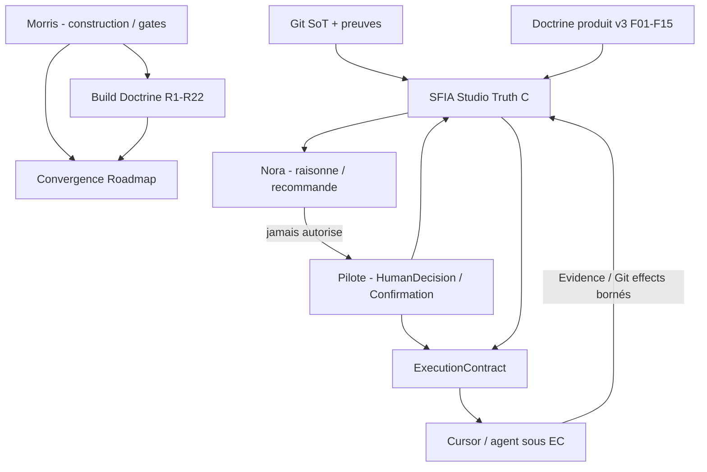
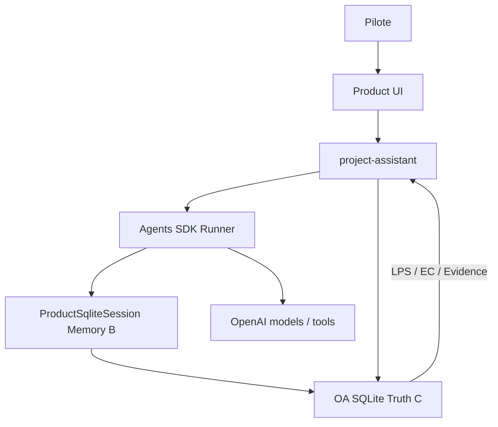
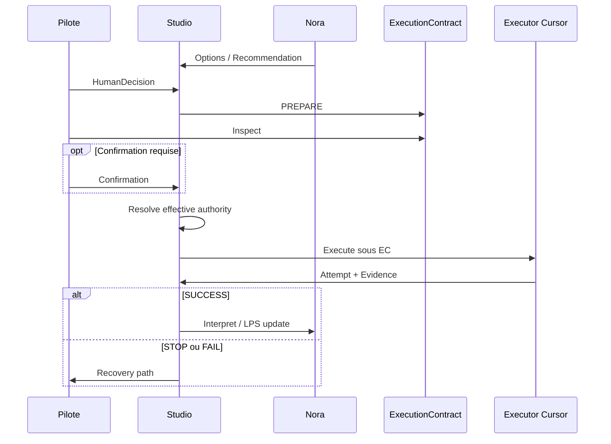

# ChatGPT Review Pack — SFIA Studio Transmission Guide

| Métadonnée | Valeur |
| --- | --- |
| **Timestamp (Europe/Paris)** | 2026-09-16 21:22:50 CEST |
| **Cycle** | Documentation / Capitalization — SFIA Studio Global History, Architecture & Transmission Guide |
| **Profile** | STANDARD |
| **Mode** | REPO-FIRST / DOCUMENTATION-ONLY / ZERO REAL / ZERO PRODUCT MUTATION |
| **Repository** | mcleland147/sfia-workspace (`https://github.com/mcleland147/sfia-workspace.git`) |
| **Branch (local checkout)** | `delivery/sfia-studio-gcec-ad-semantic-immutability-alignment` |
| **HEAD (local)** | `0b7463fa892dcad431fe7aabd2b57ecf5747afd9` |
| **origin/main** | `a8a5dffaa84fe25f792074b93696a74722de8fdf` |
| **merge-base HEAD/origin/main** | `0b7463fa892dcad431fe7aabd2b57ecf5747afd9` |
| **Local Git state** | Clean before write · **28 commits behind** origin/main (ancestor) · worktrees present untouched · only transmission doc + Review Pack |
| **Product truth snapshot for document** | `origin/main` @ `a8a5dffaa84fe25f792074b93696a74722de8fdf` |
| **Target document** | `projects/sfia-studio/sfia-studio-transmission-guide.md` (**CREATED**, ~1062 lines) |
| **Target choice reason** | No prior canonical Studio history+architecture+transmission file · preferred path per cycle · no doctrine conflict |
| **Source hierarchy used** | Git/runtime origin/main > Morris decisions > validated sources > Roadmap living > historical provenance > labeled assumptions only |
| **Gate R** | PASS |
| **Morris decisions preserved** | PC COMPLETE/CLOSED · C6 DO NOT REOPEN · runtime v3 NON ADOPTED · L5 NOT ADOPTED · NORA-FIRST · OD-04 · MW0–MW6 scope closures · Stage A Outcome C retained · GCEC A–D tested-scope · E NOT AUTHORIZED · H17 FAIL retained |
| **Unresolved contradictions** | Roadmap tip « Stage A REAL NOT AUTHORIZED » vs PR #470 first Stage A REAL Outcome C retained — both reported · Nora tip headers 05/07 lag vs 08/10/11 · DOC14 INCOMPLETE header vs Roadmap COMPLETE (pre-closure freeze) |
| **Reserves / anti-claims** | Document ≠ doctrine/baseline · ≠ runtime v3 ADOPTED · ≠ Cognitive Completion PROVEN · ≠ Stage A PASS · ≠ GCEC E · Memory B ≠ Truth C · Nora ≠ Pilote · ProjectTrajectory ≠ Roadmap |
| **Historical Guide corpus** | PROCESS: routing-guide v1.4 · operating-model v1.1 · rules-update · CANDIDATE: v2.5 source-routing-map · v2.5 project-cycles-method · Template = **SFIA v2.6** (prompt « v1.2 Generic » corrected) |
| **PR corpus** | #259…#492 material spine · #479–#490 included · GCEC/#480 · dogfood · Nora MW · Stage A · PC |
| **Runtime paths inspected** | `lib/oa` · `nora-cognitive-runtime` · `project-assistant` · `pre-m6-product-ui` · inspectionDisclosure · readCurrentGovernedExecutionContinuity · nora-eval (origin/main) |
| **Validation** | sections 0–30 · claim grep · git status · git diff --check · no product mutation |
| **Full-content requirement** | **YES** — complete document below |
| **Verdict** | **READY FOR CHATGPT DOCUMENTARY REVIEW** · ≠ CONTENT VALIDATED BY MORRIS · ≠ GOVERNANCE SOURCE · ≠ RUNTIME V3 ADOPTED |

---

## Complete created document

```markdown
# SFIA Studio — Histoire, architecture et guide de transmission

| Métadonnée | Valeur |
| --- | --- |
| **Nature** | **DOCUMENT DE TRANSMISSION / CAPITALISATION** |
| **≠** | doctrine · Build Doctrine · Roadmap · C1 · runtime v3 ADOPTED |
| **Snapshot truth** | `origin/main` `a8a5dffaa84fe25f792074b93696a74722de8fdf` (2026-09-16) |
| **Checkout d’enquête local** | `delivery/sfia-studio-gcec-ad-semantic-immutability-alignment` @ `0b7463fa` (ancêtre, **28 commits derrière**) — la vérité produit décrite ici est **`origin/main`** |
| **Langue** | Français · pédagogique · précis · sans marketing |
| **Rôle** | Transmettre *pourquoi* les couches existent, *où* elles vivent, *ce qui est prouvé*, *ce qui ne l’est pas* |

> Ce fichier **n’autorise rien**. Il ne remplace ni Git, ni une décision Morris, ni la Build Doctrine, ni la Convergence Roadmap, ni le framing v3.

---

## 0. Comment lire ce document

### 0.1 Ordre utile

1. **§1–§3** — vue, pourquoi Studio, sources / gouvernance.
2. **§4–§5** — doctrine produit v3 + architecture conceptuelle.
3. **§6–§7** — histoire des phases + Product Completion (PC).
4. **§8–§11** — runtime, autorité, exécution Cursor, recovery.
5. **§12–§20** — Nora (extension de PC), mémoire, contexte, Stage A.
6. **§21–§24** — dogfood Product Proof, GCEC, UX, taxonomie de preuve.
7. **§25–§26** — **matrice d’état actuel** + ouvert / non prouvé.
8. **§27–§30** — chronologie PR, glossaire, anti-confusions, ledger des sources.

### 0.2 Grille de lecture d’une couche

Pour chaque couche importante, ce guide répond dans cet ordre :

| Question | Sens |
| --- | --- |
| **Problème** | Quel défaut produit / gouvernance a forcé la couche ? |
| **Avant** | Que faisait-on (ou ne pouvait-on pas faire) ? |
| **Décision** | Quelle décision Morris / doctrine a tranché ? |
| **Ownership** | Qui possède la vérité / l’autorité / l’exécution ? |
| **Interactions** | Avec quelles autres couches ? |
| **Chemins d’impl.** | Où dans `projects/sfia-studio/app/` ? |
| **Preuve** | Quel niveau atteint (voir §24) ? |
| **Non prouvé** | Quoi reste ouvert sans euphémisme ? |
| **Durcissement ultérieur** | Que *pourrait* venir ensuite, sans le traiter comme plan actif ? |
| **Statut** | CLOSED / OPEN / RETAINED FAIL / NOT ADOPTED / etc. |

### 0.3 Séparations de domaine à préserver absolument

| Domaine | Rôle | Ne pas confondre avec |
| --- | --- | --- |
| **Doctrine produit v3** (`sfia-v3-framing/30`–`37`) | Destination *CE QUE* Studio doit être | Runtime ADOPTED |
| **Build Doctrine** R1–R22 | Lois de *construction* | Doctrine runtime |
| **Convergence Roadmap** | État factuel vivante + prochaine capacité | Backlog tickets |
| **Product Completion (PC)** | Boucle produit complète, **COMPLETE/CLOSED** | Nora Cognitive Completion |
| **Nora Cognitive Completion** | Extension cognitive **de** PC | Réouverture de C6 / PC |
| **Processus SFIA v2.6** (template, routing, operating model) | Méthode ChatGPT↔Cursor **externe** | Doctrine Studio |
| **GCEC** | Exécution Git gouvernée sous EC | Autonomie Git / merge libre |
| **Preuve déterministe** | Harness / tests produit | REAL / READY / ADOPTED |

### 0.4 Tip Roadmap (vérité vivante au snapshot)

Sur `origin/main` (tip documentaire) :

- Tip : **GCEC-D-CAPABLE-POST-MERGE-DOCUMENTARY-TRUTH-SYNC-01**
- **ACTIVE CONSTRUCTION PRIORITY = NORA-FIRST** (Nora Cognitive Completion)
- **PC = COMPLETE / CLOSED**
- **runtime v3 = NON ADOPTED**
- **L5 = NOT ADOPTED**
- **NEXT-CAPABILITY REQUALIFICATION** = structurelle (pas un ticket unique figé)
- **GCEC E / merge = NOT PROVEN / NOT AUTHORIZED**
- GCEC est une *lane* ; elle **ne déplace pas** la priorité globale Nora

La Roadmap *vivante* peut encore porter des formulations historiques (« Stage A REAL NOT AUTHORIZED ») alors qu’une **première campagne REAL Stage A** a déjà produit un **Outcome C — INSUFFICIENT EVIDENCE** retenu (§20). Les deux coexistent : readiness ≠ exécution ≠ evidence ≠ acceptance.

---

## 1. Vue d’ensemble

SFIA Studio est un produit de **pilotage de projets par cycles gouvernés** : qualification, connaissance (CKC), raisonnement Nora, options / recommandations, trajectoire, décision humaine (Pilote), contrat d’exécution (EC), inspection, confirmations conditionnelles, autorité effective, exécution bornée (souvent Cursor), artifacts / evidence / ReviewBundle, interprétation, mise à jour du Living Project State (LPS), recovery.

**Pilote** = rôle runtime d’autorisation humaine. **Morris** = autorité de construction / promotion / gates structurants du dépôt. Un même humain peut jouer les deux rôles sans les fusionner conceptuellement.

Studio vise une boucle métier **unique** (pas une collection d’outils). Les couches (OA Truth C, Memory B, Nora Option C, GCEC, UX Pre-M6, dogfood) existent pour empêcher :

- la confusion recommandation ↔ décision ;
- l’élargissement silencieux d’autorité ;
- le second chemin produit « fixture » ;
- la promotion d’un SUCCESS technique en READY / ADOPTED.

---

## 2. Pourquoi SFIA Studio existe

### Problème

Sans Studio, la méthode SFIA (ChatGPT ↔ Cursor) produisait des cycles utiles mais **hors produit** : prompts, handoffs, Git manuel, peu de continuité sémantique inter-session, pas de contrat d’exécution natif inspectable, pas de séparation claire Observation / Hypothèse / Option / Recommandation / Décision.

### Avant

- Processus v2.4 → v2.5 → **v2.6** (baseline opérationnelle externe).
- Vertical slice / Pre-M6 : MVP fonctionnel après #361 / #362 — **≠ produit terminé**.
- Accumulations historiques (OPS1, vertical-slice, docs `01`–`14` anciens) = harvest / provenance, pas destination.

### Décision structurante

Construire **SFIA Studio v3 exclusive** (doctrine VALIDATED) + gouverner la construction par Build Doctrine + Roadmap, puis **fermer Product Completion** comme boucle produit, puis étendre **Nora** sans rouvrir PC/C6.

### Ownership

| Couche | Owner |
| --- | --- |
| Destination produit | Framing v3 + décisions Morris |
| Lois de construction | Build Doctrine |
| État de construction | Convergence Roadmap + Git |
| Vérité produit runtime | Product SQLite (Truth C) sous Studio |
| Cognition | Nora (raisonne) — n’autorise pas |
| Exécution technique | Cursor/agent sous EC |

### Statut

Produit **utilisable** sur une boucle déterministe intégrée ; **runtime v3 NON ADOPTED** ; Cognitive Completion **NOT PROVEN** ; GCEC A–D **REAL-BACKED AT TESTED SCOPE** ; E **NOT PROVEN**.

---

## 3. Sources de vérité et gouvernance

### 3.1 Hiérarchie d’autorité (lecture opérationnelle)

```text
Git courant / preuves runtime
  > décisions Morris explicites
  > Build Doctrine / Roadmap / PC CLOSED
  > doctrine v3 framing 30–37
  > REAL evidence (bornée)
  > docs OpenAI (candidates de capacité)
  > processus SFIA v2.6 (externe)
  > hypothèses (marquées)
```

### 3.2 Trois documents de gouvernance Studio (ne pas fusionner)

| Document | Question | Path |
| --- | --- | --- |
| **Doctrine produit v3** | *Quoi* ? | `projects/sfia-studio/sfia-v3-framing/30`–`37` |
| **Build Doctrine** | *Comment construire* ? | `projects/sfia-studio/convergence/sfia-studio-convergence-build-doctrine.md` |
| **Convergence Roadmap** | *Où en est-on* ? | `projects/sfia-studio/convergence/sfia-studio-convergence-roadmap.md` |

### 3.3 Build Doctrine — R1–R22 (synthèse)

Règles fondatrices (extrait sémantique, pas copie exhaustive) :

- **R1–R2** : lien capacité v3 + boucle métier complète > profondeur locale.
- **R3–R8** : KEEP/ADAPT/HARVEST… ; pas d’architecture parallèle ; capacités e2e.
- **R9–R12** : roadmap de convergence ; chemin critique visible ; Git = SoT technique.
- **R13–R16** : décision humaine structurante ; Nora recommande ; Cursor exécute sous contrat ; automatiser le répétable.
- **R19–R21** : pas de READY/ADOPTED sans preuve ; briques temporaires avec exit ; **fidélité Fake/Real** (fixture = frontière externe, pas second produit).
- **R22** : **Nora OpenAI-native-first** (VALIDATED — ACTIVE ON MAIN via #453) — qualifier d’abord les primitives OpenAI ; elles n’acquièrent jamais l’autorité métier SFIA.

### 3.4 Processus externe v2.6 (HISTORICAL / PROCESS-ONLY pour Studio)

| Actif | Statut | Note |
| --- | --- | --- |
| `prompts/templates/sfia-cycle-execution-template.md` | **SFIA v2.6** baseline | **≠** « v1.2 Generic » |
| `method/.../sfia-cycle-routing-guide.md` | v1.4 VALIDATED process | méthode, pas doctrine Studio |
| `method/.../sfia-chatgpt-cursor-operating-model.md` | v1.1 foundation process | idem |
| `sfia-rules-update.md` | process | idem |
| v2.5 source-routing-map + project-cycles-method | **CANDIDATE historical** | idées harvestées via matrice `36` |

Les idées utiles ont été absorbées dans le **processus v2.6** et dans Studio via **`36-sfia-v2.6-inheritance-and-adaptation-matrix.md`**. **Ne jamais** les faire revivre comme doctrine runtime Studio.

### 3.5 Diagramme d’autorité (conceptuel)


```mermaid
flowchart TD
  Morris[Morris - construction / gates]
  Git[Git SoT + preuves]
  BD[Build Doctrine R1-R22]
  RM[Convergence Roadmap]
  V3[Doctrine produit v3 F01-F15]
  Pilote[Pilote - HumanDecision / Confirmation]
  Studio[SFIA Studio Truth C]
  Nora[Nora - raisonne / recommande]
  EC[ExecutionContract]
  Cursor[Cursor / agent sous EC]

  Morris --> BD
  Morris --> RM
  Git --> Studio
  V3 --> Studio
  BD --> RM
  Pilote --> Studio
  Studio --> Nora
  Nora -->|jamais autorise| Pilote
  Pilote --> EC
  Studio --> EC
  EC --> Cursor
  Cursor -->|Evidence / Git effects bornés| Studio
```

---

## 4. Doctrine v3 et fondations V3-F01…F15

### Problème

Sans fondations explicites : connaissance floue, trajectoire implicite, exécution sans réversibilité, contradictions non traitées, maturité « ressentie ».

### Décision

Pack `37` : **V3-F01…F15 VALIDATED** (doctrine) · Studio **v3 exclusive** · runtime coverage **progressive** · **runtime v3 NON ADOPTED**.

| ID | Titre | Source principale |
| --- | --- | --- |
| V3-F01 | CKC couche cognitive | `30` |
| V3-F02 | Living Project State | `32` |
| V3-F03 | DoctrinePackage | `31` |
| V3-F04 | Épistémologie | `33` |
| V3-F05 | Chaîne conversation→exécution | `30` |
| V3-F06 | ProjectTrajectory | `32` |
| V3-F07 | Provenance / hiérarchie sources | `31` |
| V3-F08 | Contradictions | `33` |
| V3-F09 | Replanification gouvernée | `32` |
| V3-F10 | DebtItem | `35` |
| V3-F11 | AgentCapability | `34` |
| V3-F12 | Réversibilité actions | `34` |
| V3-F13 | Apprentissage contrôlé | `35` |
| V3-F14 | Artifact Completeness | `35` |
| V3-F15 | Maturité distribuée | `35` |

### Ownership / interactions

- Framing = destination ; PC = réalisation boucle ; Nora = extension cognitive ; Roadmap = couverture runtime factuelle.
- **Doctrine VALIDATED ≠ runtime ADOPTED.**

### Preuve / non prouvé

- Doctrine : VALIDATED / DOCUMENTED→VALIDATED.
- Couverture runtime : partielle, progressive, prouvée par lots (PC, MW*, GCEC, dogfood).
- **NOT PROVEN** : adoption runtime v3 globale ; L5 ; Cognitive Completion globale.

---

## 5. Architecture conceptuelle

### 5.1 Couches logiques

| Couche | Responsabilité |
| --- | --- |
| **UX Pre-M6 / Product UI** | Surface Pilote (inspection, confirmation, parcours) |
| **Project Assistant** | Orchestration de tour produit |
| **Nora Cognitive Runtime** | Cognition Option C (Runner + Session) |
| **OA / Product Store** | Truth C — état produit SQLite |
| **Execution / Evidence** | EC, attempts, artifacts, ReviewBundle |
| **GCEC adapters** | Effets Git gouvernés A→D (E stop) |
| **Harness / nora-eval** | Preuves déterministes + campagnes |

### 5.2 Chemins d’implémentation (sous `projects/sfia-studio/app/`)

| Path | Rôle |
| --- | --- |
| `lib/oa/*` | Product SQLite **Truth C** (project, cycle, decision, EC, evidence…) |
| `lib/nora-cognitive-runtime/*` | Nora + `productSqliteSession` (**Memory B**) |
| `features/project-assistant/*` | Orchestration tours / lifecycle / MW bridges |
| `features/pre-m6-product-ui/*` | UX produit |
| `.../inspectionDisclosure.ts` | Divulgation d’inspection EC (#491) |
| `.../readCurrentGovernedExecutionContinuity.ts` | Continuité EC restart-safe (#492) |

### 5.3 Boucle produit (vue synthétique)


```mermaid
flowchart LR
  P[Project] --> Q[Qualify]
  Q --> CKC[CKC]
  CKC --> N[Nora]
  N --> O[Options]
  O --> R[Recommendation]
  R --> T[Trajectory]
  T --> HD[HumanDecision]
  HD --> DB[DecisionBasis]
  DB --> ECp[EC PREPARE]
  ECp --> I[Inspect]
  I --> C[Confirmation si requise]
  C --> A[Autorité effective]
  A --> X[Execute]
  X --> Att[Attempt]
  Att -->|SUCCESS / STOP / FAIL| Art[Artifact]
  Art --> Ev[Evidence]
  Ev --> RB[ReviewBundle]
  RB --> Ni[Nora interpret]
  Ni --> LPS[LPS / Trajectory]
  LPS --> Rec[Recovery / cycle suivant]
```

### 5.4 Pourquoi ces couches (et pas un monolithe)

| Risque sans séparation | Couche qui le contient |
| --- | --- |
| Transcript = vérité | Truth C durable |
| Modèle « se souvient » hors produit | Memory B bornée + Truth C |
| Agent décide | Pilote + EC + autorité |
| Exécuteur élargit le scope | AgentCapability ∩ EC ∩ Confirmations |
| Fixture devient produit | R21 Fake/Real + un seul chemin orchestration |
| Merge Git silencieux | GCEC E non autorisé ; capability ≠ authority |

---

## 6. Histoire des phases (compacte)

| Ère | Contenu | Ancre typique |
| --- | --- | --- |
| **Méthode SFIA** | v2.4→v2.6 process ChatGPT↔Cursor | template v2.6, routing, operating model |
| **Framing Studio** | Vision → architecture fonctionnelle → UX | docs `01`–`14` historiques + `30`–`37` |
| **Doctrine v3** | F01–F15 VALIDATED | #259 |
| **Build Doctrine + Roadmap** | Lois + état de convergence | #334 |
| **Pre-M6 / MVP** | Vertical slice utilisable | #361 / #362 |
| **Product Completion** | C1–C6 · 5 Epics · 4 Waves · UX PE | #364…#427 |
| **REAL-A** | Frontière REAL consommée (PC post-closure) | #428 |
| **Nora Cognitive Completion** | C1–C5 + MW0→MW6 + Stage A | #430…#471 |
| **Product Proof / dogfood** | Continuité parcours réel Pilote | #472…#492 |
| **GCEC** | A→D gouverné ; E ouvert | #478…#482 (+ #480 FAIL harness) |

Les FAIL et INCONCLUSIVE sont **conservés** comme capitalisation (H17, Stage A Outcome C, GCEC A→D harness FAIL).

---

## 7. Product Completion

### Problème

Le MVP Pre-M6 prouvait une tranche, pas une **boucle produit complète** gouvernée (qualification → décision → EC → evidence → recovery). Un utilisateur pouvait « démarrer un cycle » sans ProjectTrajectory MUST, sans EC inspectable natif, sans continuité sémantique inter-session, sans séparation nette Pilote runtime vs Morris construction.

### Avant

- Vertical slice / OPS1 / Control Tower / Pre-M6 : preuves locales utiles.
- Consolidation MVP **#361** puis rebaseline **#362** : *main = Product Completion MVP candidate* avec dette gouvernée (UAT-UX-06, recovery, V3-F10 journal, durabilité partielle).
- Runtime v3 **NON ADOPTED** ; M6/M7 **SUPERSEDED / ABSORBED** dans PC (pas de relance M1–M5).

### Décision / structure (C1→clôture)

| Étape | Contenu | Ancre |
| --- | --- | --- |
| **C1** cadrage | Target, Pilote, ProjectTrajectory MUST, continuité MUST, barre PC-BAR | #364 (+ sync #365) |
| **C2** conception | Comportement A→W testable | docs `02-…` |
| **C3** archi fonctionnelle | FC-01…15, flux F1–F7, OPTION A | docs `03-…` |
| **C5** backlog | **5 Epics** · **4 Waves** · P0/P1 | #393 · `05-…` |
| **C6** delta technique | Truth & Authority Durability TD-C6-01…06 | **CLOSED / DO NOT REOPEN** |
| UX PE | Experience architecture, wireframes, visual state | #372/#374/#376 |
| **W1** | Vérité / DoctrinePackage / continuité sélective Confirmation | #395 |
| **W2** | Cognition → Options/Rec/HD/Trajectory · EC inspect/confirm · **STOP BEFORE EXECUTE** · CKC Phase B | #400/#403/#405 |
| **W3** | Execute → Evidence/Review → Recovery/Replan · catalogue CKC 15 | #408/#413/#415/#418 |
| **W4** | Product Experience cohérente `/studio` | #420/#422 |
| Preuve intégrée | DOC14 QA E2E PC-BAR-01…10 · restart A+B | #426 |
| **Clôture** | Morris : COMPLETE / CLOSED | **#427** |

**5 Epics :** A Entrée/qualification · B Raison/trajectoire/décision · C Préparer/autoriser · D Exécuter/prouver/replan · E Product Experience (+ FC-15 transverse).

**4 Waves :** W1 vérité/contexte · W2 cognition/HD · W3 execute/evidence · W4 clôture expérience.

### Boucle (rappel normatif) — chronologie d’apparition

```text
Project → qualify → CKC → Nora → Options → Rec → Trajectory
  → HD → DecisionBasis → EC PREPARE → inspect → Confirmation
  → authority → execute → Attempt → SUCCESS/STOP/FAIL
  → Artifact → Evidence → ReviewBundle → Nora interpret
  → LPS / traj → Recovery / Replan → restart/resume
```

Tous les maillons **n’ont pas** été livrés d’un coup : W1 porte vérité/continuité ; W2 s’arrête avant execute ; W3 ajoute Attempt/Evidence/Recovery ; W4 unifie l’expérience ; #426 prouve l’intégration ; #427 clôt ; REAL-A (#428) et plus tard dogfood (#472–#492) / GCEC durcissent des bords **sans rouvrir PC**.

### Ownership

- **Morris** : clôture PC, C6, gates construction.
- **Pilote** : HumanDecision / Confirmation runtime.
- **Nora** : propose / challenge / interprète — **sans** autorité.
- **Studio** : persiste Truth C, enforce policies.
- **Cursor** : exécute sous EC uniquement.

### Preuve / anti-claims

- **DETERMINISTICALLY PROVEN** integrated product completion (#426 consumé).
- **PASS WITH NON-BLOCKING RESERVES** (PREQA-R*, W3A-D03, W2-CL-R04, PB-RES-REAL-01, Penpot, etc.).
- **≠ REAL** global · **≠ runtime ADOPTED** · **≠ READY FOR V3 ADOPTION** · **≠ L5** · **≠** autorisation GCEC E.
- Headers figés DOC13/DOC14 « INCOMPLETE » = **pré-décision** ; SoT de clôture = Roadmap + DOC11 + #427.

### Statut

**COMPLETE / CLOSED BY MORRIS** — baseline fonctionnelle pour Nora et GCEC. **Ne pas rouvrir** pour « améliorer Nora ».

---

## 8. Runtime et persistence

### 8.1 Truth C — Product SQLite (`lib/oa/*`)

| | |
| --- | --- |
| **Problème** | État produit volatil / transcript-centré |
| **Décision** | G0-B : `node:sqlite` Product Store OA **ADOPTED** (construction) |
| **Ownership** | Studio possède la vérité produit |
| **Contient** | Project, LPS, Trajectory, DecisionBasis, EC, Attempts, Evidence, etc. |
| **≠** | Mémoire conversationnelle modèle ; Session OpenAI serveur comme Truth C (**interdit**) |

### 8.2 Memory B — ProductSqliteSession (`lib/nora-cognitive-runtime/*`)

| | |
| --- | --- |
| **Problème** | Continuité cognitive sans polluer Truth C ni inventer une 2ᵉ vérité |
| **Décision** | OD-04 Option C : Session **custom Product SQLite** |
| **Rôle** | Vue / compaction / model-input **bornée** pour Nora |
| **≠** | Autorité ; Evidence ; HD |

### 8.3 Diagramme Nora × Memory B × Truth C


```mermaid
flowchart TB
  Pilote[Pilote]
  UI[Product UI]
  Orch[project-assistant]
  Runner[Agents SDK Runner]
  MemB[ProductSqliteSession Memory B]
  TruthC[OA SQLite Truth C]
  OpenAI[OpenAI models / tools]

  Pilote --> UI --> Orch
  Orch --> Runner
  Runner --> MemB
  MemB --> TruthC
  Runner --> OpenAI
  Orch --> TruthC
  TruthC -->|LPS / EC / Evidence| Orch
```

### 8.4 Statut

Implémenté et prouvé à des portées MW1+ / dogfood / GCEC déterministes ; **pas** adoption runtime v3 globale.

---

## 9. Décision, autorité, ExecutionContract

### Formule d’autorité effective

```text
valid human authorization
∩ ExecutionContract scope
∩ AgentCapability / policy
∩ runtime guardrails
∩ valid required Confirmations
= effective authority
```

### Chaîne EC (conceptuelle)


```mermaid
sequenceDiagram
  participant P as Pilote
  participant S as Studio
  participant N as Nora
  participant EC as ExecutionContract
  participant X as Executor Cursor

  N->>S: Options / Recommendation
  P->>S: HumanDecision
  S->>EC: PREPARE
  P->>EC: Inspect
  opt Confirmation requise
    P->>S: Confirmation
  end
  S->>S: Resolve effective authority
  S->>X: Execute sous EC
  X->>S: Attempt + Evidence
  alt SUCCESS
    S->>N: Interpret / LPS update
  else STOP ou FAIL
    S->>P: Recovery path
  end
```

### Règles dures

- Confirmation **après** inspection ; **conditionnelle**.
- Aucune couche n’élargit seule l’autorité.
- **Capability ≠ authority** (surtout GCEC / Cursor).
- #491 : le Pilote doit *voir* ce qu’il autorise (inspection disclosure).
- #492 : ces faits doivent **survivre au restart** (rehydratation).

---

## 10. Exécution Cursor et Git Evidence

### Problème

Cursor est puissant : sans contrat, il devient décideur + exécuteur + mergeur.

### Décision

- R15 : exécute **uniquement** dans un périmètre/contrat gouverné.
- D-GCEC-EXEC-01 : Cursor = **trusted-but-governed technical executor**.
- Pilote = gouverneur d’intention / frontières protégées — **pas** opérateur Git libre.

### Interactions

EC → Attempt → Evidence (`execution_attempt:*`) → ReviewBundle → interprétation Nora → LPS.

### Preuve

Déterministe large ; REAL borné sur GCEC A–D (voir §22) ; **pas** autonomie Git généralisée.

---

## 11. Recovery et restart

### Problème

Crash, perte de tour, restart process : le Pilote ne doit pas « re-décider à l’aveugle » ni rejouer un EC déjà engagé sans continuité.

### Avant

Preuves PC restart A+B déterministes ; gaps dogfood sur continuité EC / projection / journey.

### Décisions / lots

- Continuité parcours (#472, #486–#488).
- Materialization / intent (#483–#485, #489).
- Inspection disclosure (#491) puis **rehydration EC** (#492).

### Pourquoi #492 après #491

#491 oblige à **divulguer** les faits d’inspection. Sans persistence rehydratable, un restart affichait une inspection incomplète ou incohérente → le Pilote ne pouvait plus exercer la même autorité éclairée. #492 restaure une **continuité d’exécution gouvernée restart-safe** (lecture `readCurrentGovernedExecutionContinuity`).

### Statut

REAL-BACKED / DETERMINISTIC selon lots ; durcissement ultérieur possible (E2E REAL restart multi-process étendu) **sans** claim ADOPTED.

---

## 12. Nora dans Product Completion

### Position

Nora est une **extension cognitive OF PC**, pas un produit parallèle.

| Invariant | Sens |
| --- | --- |
| PC CLOSED | baseline figée pour construction Nora |
| C6 DO NOT REOPEN | pas de réouverture « pour Nora » |
| Nora recommande | Pilote décide |
| Studio owns truth/authority | Option C |

### Backlog source-lock (C5)

- **NR-01…26** · **CE-01…08**
- **NCC-BAR** : critères de barre Cognitive Completion — **non satisfaits globalement** (programme ≠ barre atteinte)

### Statut

Programme actif (NORA-FIRST) ; Cognitive Completion **NOT PROVEN**.

---

## 13. Nora Cognitive Completion (programme)

### Cycles documentaires

| Cycle | Rôle | Ancre |
| --- | --- | --- |
| C1 | Cadrage | #430 |
| C2–C4 | Conception / PE / gaps | #432–#437 |
| C5 | Backlog source-locked MW0→MW6 | #439 |
| OD-04 | Architecture Option C | #445 / #447 |
| MW0–MW6 | Delivery + closures bornées | #442–#465 |
| Stage A | Global Model × Reasoning | #466–#471 |

### OD-04 Option C (cible architecture)

- **Agents SDK Runner**
- **ProductSqliteSession** (Memory B)
- **Un seul chemin** produit
- Studio possède vérité / autorité
- HITL OpenAI ≠ HD/Confirmation
- Trace ≠ Evidence
- Responses compaction = **CANDIDATE / NOT ADOPTED**

### Anti-claims programme

≠ Agents SDK « magique » · ≠ ChatGPT parity prouvée · ≠ production routing · ≠ runtime v3 ADOPTED · ≠ PC réouvert.

---

## 14. MW0 → MW6

Chaque MW est **CLOSED AT PROVEN SCOPE** — pas une validation globale du programme Cognitive Completion (NCC-BAR global **non** satisfait).

| MW | Problème avant | Décision | PRs | Preuve / anti-claims |
| --- | --- | --- | --- | --- |
| **MW0** | Qualitatif insuffisant pour CE-07 | Harness versionné `nora-eval` + binding BAR | #442 | EXIT PROVEN + NB reserves · ≠ Cognitive Completion |
| **MW1** | Chat process-local / stitching | ProductSqliteSession + compaction gouvernée · jamais B→C silencieux | #450/#451/#452 | REAL BOUNDARY MW1 scope · Responses compaction **CANDIDATE** |
| **MW2** | Model/effort env-only | CWP (Routine/Focused/Deep/High-Assurance) · OD-02 Option B · `modelSettings.reasoning` | #456/#457 | COMPLETE at proven scope · ≠ production routing |
| **MW3** | Contradiction lissée narrativement | Candidate vs evidence-backed · Cognitive STOP | #459/#460 | COMPLETE · ≠ MW4 cross-turn |
| **MW4** | Narrative ≠ Evidence · partialité multi-doc | Grounding cross-turn · honesty post-Evidence · **pas** 2ᵉ Evidence store | #461/#462 | COMPLETE + NB reserves |
| **MW5** | Challenge cosmétique / trop large | Challenge structurel ≤3 · clarification · High-Assurance | #463/#464 | CLOSED + **governance deviation retained** |
| **MW6** | « Search libre » vs intelligence gouvernée | Hosted web_search sous autorité + eligibility | #465 | COMPLETE at proven scope · 1 hosted REAL observé (`gpt-5.6-luna`) · ≠ browse libre |

### Lecture pédagogique MW par MW

- **MW0** crée la *mesure* avant d’approfondir.
- **MW1** sépare Memory B (continuité) de Truth C (autorité).
- **MW2** adapte la profondeur cognitive **sans** conférer d’autorité SFIA.
- **MW3** oblige Nora à *stopper* plutôt qu’à lisser une contradiction.
- **MW4** force l’honnêteté grounding / multi-doc.
- **MW5** force le challenge structurel (NR-02/06) sous enveloppe.
- **MW6** ajoute des sources externes **sous** le même modèle d’autorité — pas à côté.

### Honnêteté MW5 (FAIL / INCONCLUSIVE retenus)

La campagne business intégrée a été **acceptée pour clôture MW5** *malgré* une non-conformité de gouvernance **H17 FAIL** : **141** appels REAL / **100** autorisés (**+41**). **H18 INCONCLUSIVE** (mesure coût partielle ≈ 0.147 USD · upper-bound hard-cap **NOT PROVEN**). **ZERO NEW REAL** au moment de la clôture documentaire. Ce n’est **pas** un PASS de conformité de campagne globale — et **ne doit pas** être réécrit comme tel parce que la capacité testée a été acceptée.

---

## 15. Memory B et Truth C

| | **Memory B** | **Truth C** |
| --- | --- | --- |
| Support | `ProductSqliteSession` | `lib/oa/*` SQLite produit |
| Contenu typique | items de session, compaction, filtres model-input | LPS, décisions, EC, evidence |
| Autorité | Aucune | Vérité produit |
| Peut être perdu / recomposé ? | selon politiques MW1 | non — SoT produit |
| Preuve | MW1 REAL boundary + dogfood | PC + dogfood + GCEC |

**Règle** : le modèle ne « devient » pas la base ; la Session n’est pas un DoctrinePackage.

CORRECTIF #471 : les tours MW6 doivent continuer à exposer la vue Memory B (`truthCRevision`) — défaut découvert en continuation Stage A.

---

## 16. Context et CKC

### CKC (Cycle Knowledge Contract)

- Guidance cognitive pour un type de cycle / phase.
- **Candidate** typique (ex. cadrage `0.1.0`) — **aucune autorité d’exécution**.
- V3-F01 : CKC = couche cognitive, pas contrat Git.

### Hybrid Context Envelope (#475)

Problème : Nora raisonnait « générique » hors méthode Studio.
Décision : envelopper le contexte produit + méthode pour ancrer l’advisory (#473 default advisory, #474 method-grounded).

### Ownership

Studio compose le contexte ; Nora consomme ; Pilote tranche.

---

## 17. Adaptive reasoning

### Problème

Un seul profil cognitif (toujours « soft » ou toujours « hard ») casse soit la sécurité, soit l’utilité.

### Réponse Studio

- Workload profiles (MW2).
- Critical challenge / clarification (MW5).
- Selective-repeat gouverné (Stage A correctives).
- STOP cognitif / contradiction disposition (runtime + doctrine F08).

### Non prouvé

Routing de production modèle×effort **NOT SELECTED** ; Stage A acceptance **not closed**.

---

## 18. Contradiction et STOP

### Doctrine (V3-F08 / `33`)

Séparer Observation / Hypothèse / Option / Recommandation / Décision. Une contradiction **n’est pas** une décision.

### Runtime

Mécanismes `contradictionDisposition`, `cognitiveStop`, fail-closed sur integrity hosted (#470 CORR-02A), hard-stop config (#470 CORR-03A).

### Règle de transmission

Un STOP / FAIL **retenu** est une preuve de gouvernance, pas un échec à effacer de l’histoire.

---

## 19. External sources

### Problème

Le web / sources externes enrichissent mais corrompent l’autorité si elles deviennent « vérité ».

### Réponse

- Normalisation + authority tagging (runtime Nora).
- MW6 hosted web_search sous autorité gouvernée.
- Evidence integrity fail-closed si mismatch hosted.

### Non prouvé

Hosted REAL large-scale ; Astra entitlement ; production grounding policy ADOPTED.

---

## 20. Global Model × Reasoning (Stage A)

### Objectif

Comparer modèles × efforts sous contrat de campagne (envelope, FinOps, sélectivité) — **sans** sélectionner le routing de production.

### Readiness (≠ exécution)

| Lot | Contenu |
| --- | --- |
| #466 / #467 | Harness déterministe Stage A |
| #468 | Option C + C6 challenger Astra / contract v3-candidate |
| Docs readiness | Qualification financière / drift provider |

Souvent la Roadmap tip dit encore **Stage A REAL NOT AUTHORIZED** (formulation de readiness / gate structurelle).

### Première campagne REAL — Outcome C **RETAINED**

- Première campagne Stage A REAL → **Outcome C — INSUFFICIENT EVIDENCE** (retenu).
- **#470 / #471** : correctifs déterministes — **ZERO REAL rerun**.
- #470 affirme explicitement : Outcome C retenu · Stage A **NOT complete**.
- Ne **jamais** convertir C en PASS.

### Distinguer quatre couches

| Couche | Sens |
| --- | --- |
| **Readiness** | Harness/docs prêts ? |
| **Execution** | Campagne REAL lancée ? |
| **Evidence** | Outcome A/B/C… ? |
| **Acceptance** | Morris clôture Stage A ? |

Au snapshot : readiness avancée · exécution historique Outcome C · evidence insuffisante · **acceptance non close**.

---

## 21. Product Proof (dogfood) #472–#492

### Problème

Les preuves MW isolées ne garantissent pas qu’un Pilote traverse **le produit réel** sans ruptures de continuité, d’autorité ou d’inspection. Le dogfood expose les écarts d’intégration.

### Chaîne corrective (synthèse)

| PR | Comportement produit qui a révélé le gap | Correction | Ce qui est préservé / hors preuve |
| --- | --- | --- | --- |
| **#472** | Conversation « naturelle » cassée | Continuité session hybride · Memory B → analyzeIntent | ≠ Stage A PASS |
| **#473** | Pression return-to-ChatGPT bloquante | Advisory-by-default · formalisation non mutante | Pilote garde HD |
| **#474** | Advisory hors méthode | Lens CKC/DoctrinePackage same-run | CKC ≠ autorité |
| **#475** | Contexte Studio trop mince | Hybrid Context Envelope / Composer-first | LPS/HD/Evidence dans enveloppe |
| **#477** | Recs hors lifecycle | Recommendations gouvernées Nora→EpistemicItems | Rec ≠ HD |
| **#483** | Artifact implicite | Obligation artifact sélectionnable Pilote | capability ≠ auto-write |
| **#484** | Materialization hors cycle actif | Continue dans cycle actif · `docs_write` bound | |
| **#485** | Intent materialization flou | Contrat `artifactMaterializationOperation` | |
| **#486** | Decision subject perdu au restart | Continuité Proposal decision | |
| **#487** | Reinstruction / langage Pilote | Continuité reinstruction | |
| **#488** | Journey non canonique | Project→Nora→Proposal→Options/HD→DB→docs_write PREPARE→EC→Inspect | |
| **#489** | Materialization trop large | Scope déterministe Nora → F2 | |
| **#490** | Projection repo/DS incohérente | RepositoryBinding + Decision Subject coherence | |
| **#491** | Inspection sans path exact visible | Disclosure allowlistée avant Confirmation · fail-closed legacy incomplete | ZERO REAL dans le PR · Det D0 |
| **#492** | Restart casse la continuité EC pré-exécution | Rehydration Truth C · lignée HD/DB · docs_write path · fail-closed stale Proposal DS | **Hors scope** : attempt running / post-exécution |

Lots intermédiaires lifecycle / GCEC (#476–#482) s’intercalent : ne pas les lire comme « Nora MW » ni comme « Stage A PASS ».

### Lien #491 → #492

#491 exige que l’inspection **divulgue** (path `docs_write`, repo, faits) avant Confirmation. Sans #492, un restart laissait ces faits non rehydratables / attestation incomplète → fail-closed ou décision à l’aveugle. #492 rend la disclosure **restart-safe** en lisant l’EC pré-exécution depuis Truth C (**sans** écrire EC/Confirmation/Attempt).

### Statut

Chaîne dogfood **intégrée sur main** jusqu’à #492 au snapshot ; preuve surtout **DETERMINISTIC / product-path** ; reproof authentifié manuel / Cursor REAL Product Proof **≠** clos par ces PRs ; **≠** runtime ADOPTED.

---

## 22. GCEC (Governed Cycle Execution / Git lifecycle)

### Problème

Besoin d’effets Git **réels** sous EC sans conférer l’autorité de merge / production.

### Décisions

- Cursor = exécuteur technique préféré sous EC.
- **A** docs_write · **B** commit · **C** push · **D** PR create = **REAL-BACKED AT TESTED SCOPE**.
- **E** merge = **NOT PROVEN / NOT AUTHORIZED**.
- Tip documentaire : **GCEC-D-CAPABLE-POST-MERGE-DOCUMENTARY-TRUTH-SYNC-01** (#482).

### FAIL historique A→D (à conserver)

1. Campagne REAL A→D autorisée et démarrée.
2. Attempt A (docs_write) techniquement OK + evidence.
3. Harness a traité `ExecutionContract.version` comme **sémantiquement immutable** (invariant invalide).
4. Runtime OK ; campagne acceptance non atteinte.
5. **#480** corrige l’oracle / alignement sémantique+lifecycle.
6. Le **FAIL de campagne est RETAINED** ; correction ≠ preuve A→D E2E REAL.

### Règle

**Capability ≠ authority.** A–D capables ≠ E autorisé ≠ autonomie PR/Git.

---

## 23. UX

### Problème

Sans UX Product Experience, l’autorité reste dans les logs / handoffs.

### Réponse

- `features/pre-m6-product-ui/*` + Project Assistant panel.
- Décisions UX historiques CC-D* (panneau vivant, confirmations N1–N3, Project ≠ Cycle).
- Wave 4 PC : clôture d’expérience produit (déterministe).
- Dogfood : disclosure (#491), journey (#488), obligations artifact (#483).

### Non prouvé

Parité ChatGPT↔Cursor workflow ; polish L5 ; ADOPTED runtime UX v3 globale.

---

## 24. Preuve et maturité (taxonomie)

Ordre strict (ne pas sauter) :

```text
DOCUMENTED
→ MODELED
→ IMPLEMENTED
→ DETERMINISTICALLY PROVEN
→ LIVE
→ REAL
→ REAL-BACKED AT TESTED SCOPE
→ COMPLETE/CLOSED AT PROVEN SCOPE
→ READY
→ ADOPTED
```

Identités **interdites** :

- `SUCCESS ≠ READY ≠ ADOPTED`
- `DETERMINISTIC PROVEN ≠ REAL`
- `REAL-BACKED AT TESTED SCOPE ≠ autonomie généralisée`
- `COMPLETE/CLOSED AT PROVEN SCOPE ≠ Cognitive Completion PROVEN`
- `Outcome C ≠ PASS`

---

## 25. État actuel des capacités — CURRENT-STATE MATRIX

Snapshot : `origin/main` `a8a5dffa…` (2026-09-16). Légende courte : **D**=doctrine · **I**=impl · **Det**=déterministe · **R**=REAL/REAL-BACKED · **Cl**=closure · **Ad**=adoption · **Res**=réserves · **Next**=prochain gate honnête.

| Capacité | D | I | Det | R | Cl | Ad | Réserves / notes | Prochain gate |
| --- | --- | --- | --- | --- | --- | --- | --- | --- |
| Doctrine v3 F01–F15 | VALIDATED | partielle | n/a | n/a | doctrine CLOSED | **NON** runtime | couverture runtime progressive | preuves runtime ciblées |
| Build Doctrine R1–R22 | ACTIVE | n/a | n/a | n/a | VALIDATED | ACTIVE ON MAIN | R22 Nora-first | challenge avant chantier |
| Roadmap convergence | LIVING | n/a | n/a | n/a | tip GCEC-D-CAPABLE… | n/a | tip ≠ Git HEAD embed | truth-sync post-lot |
| Process SFIA v2.6 | process | n/a | n/a | n/a | baseline externe | n/a | ≠ doctrine Studio | ne pas revivre v2.5 |
| Product Completion boucle | VALIDATED | OUI | OUI #426 | REAL-A consumed | **COMPLETE/CLOSED** #427 | **NON** v3 | C6 DO NOT REOPEN | ne pas rouvrir PC |
| Truth C OA SQLite | G0-B | OUI `lib/oa` | OUI | borné | KEEP | construction ADOPTED | ≠ DoctrinePackage | hardening ops |
| Memory B Session | OD-04 | OUI | OUI MW1 | REAL boundary MW1 | MW1 CLOSED scope | target ADOPTED | compaction Responses CANDIDATE | #471 compat MW6 |
| Nora Option C Runner | OD-04 | OUI #447 | OUI | partiel | impl INTEGRATED | target ADOPTED | HITL≠HD | production routing NOT SELECTED |
| NR/CE backlog | C5 | source-lock | n/a | n/a | C5 CLOSED docs | n/a | NCC-BAR global NON | CC global NOT PROVEN |
| MW0 Eval harness | OUI | OUI #442 | OUI | borné $ | CLOSED+reserves | n/a | R01/R02 NB | ne pas rouvrir MW0 |
| MW1 Memory B | OUI | OUI #450/451 | OUI | REAL boundary | CLOSED scope | n/a | | |
| MW2 Workload | OUI | OUI #456/457 | OUI | borné | CLOSED scope | n/a | | |
| MW3 Assessment | OUI | OUI #459/460 | OUI | borné | CLOSED scope | n/a | | |
| MW4 Grounding | OUI | OUI #461/462 | OUI | borné | CLOSED+NB reserves | n/a | | |
| MW5 Challenge | OUI | OUI #463/464 | OUI | campaign | CLOSED+**H17 FAIL retained** | n/a | H18 INCONCLUSIVE | ne pas PASS-wash |
| MW6 External auth | OUI | OUI #465 | OUI | borné hosted | CLOSED scope | n/a | ≠ E2E global | |
| Stage A harness/readiness | OUI | OUI #466–468 | OUI | n/a readiness | readiness INTEGRATED | n/a | Astra entitlement NOT PROVEN | décision distincte |
| Stage A REAL campaign | contract | OUI | n/a | **Outcome C retained** | **NOT complete** | n/a | #470/#471 ZERO rerun | acceptance / rerun GO |
| Cognitive Completion | program | partiel | partiel | partiel | **NOT PROVEN** | **NON** | NCC-BAR | preuves globales |
| Context / CKC / HCE | F01+#475 | OUI | OUI | limité | KEEP | n/a | CKC sans autorité | |
| Contradiction STOP | F08 | OUI | OUI | limité | KEEP | n/a | | |
| Adaptive reasoning | MW2/5/A | OUI | OUI | partiel | partiel | **NON** routing | | Stage A acceptance |
| External sources MW6 | F07/F04 | OUI | OUI | borné | MW6 scope | n/a | | |
| Product Proof dogfood | PC ext | OUI #472–492 | OUI | limité | chaîne on main | n/a | | REAL dogfood élargi |
| EC inspection #491 | gov | OUI | OUI | | INTEGRATED | n/a | | |
| EC rehydration #492 | gov | OUI | OUI | | INTEGRATED | n/a | nécessaire post-#491 | |
| GCEC A docs_write | D-GCEC | OUI | OUI | **REAL-BACKED** | tested scope | n/a | | |
| GCEC B commit | D-GCEC | OUI | OUI | **REAL-BACKED** | tested scope | n/a | | |
| GCEC C push | D-GCEC | OUI | OUI | **REAL-BACKED** | tested scope | n/a | secrets bornés | |
| GCEC D PR create | D-GCEC | OUI | OUI | **REAL-BACKED** | D-capable tip | n/a | | |
| GCEC E merge | — | paths? | — | **NOT PROVEN** | **NOT AUTHORIZED** | **NON** | capability≠authority | Morris GO distinct |
| GCEC A→D E2E REAL | — | harness #480 | Det OK | **FAIL retained** | FAIL historique | n/a | oracle corrigé ≠ PASS | fresh GO + campaign |
| UX PE / Pre-M6 UI | CC-D* | OUI | OUI PC W4 | limité | PC CLOSED | n/a | | |
| runtime v3 | VALIDATED dest. | partiel | partiel | partiel | — | **NON ADOPTED** | | preuves + gates |
| L5 | — | — | — | — | — | **NOT ADOPTED** | | |
| FinOps/T7 | policy | freeze | — | — | FREEZE | n/a | | |
| Production model routing | — | — | — | — | — | **NOT SELECTED** | | après Stage A acceptance |

---

## 26. Ouvert / non prouvé (liste honnête)

1. **runtime v3 ADOPTED** — non.
2. **L5 ADOPTED** — non.
3. **Cognitive Completion / NCC-BAR global** — non.
4. **Stage A acceptance** — non (Outcome C retenu ; pas de rerun dans #470/#471).
5. **GCEC E / merge** — NOT PROVEN / NOT AUTHORIZED.
6. **GCEC A→D E2E REAL acceptance** — FAIL harness retenu ; pas converti en PASS.
7. **Production model × reasoning routing** — NOT SELECTED.
8. **Astra account/API entitlement** — NOT PROVEN.
9. **Responses compaction** — CANDIDATE / NOT ADOPTED.
10. **ChatGPT ↔ Cursor parity** — NOT_PROVEN (réserves MW0 etc.).
11. **H17 conformité campagne MW5** — FAIL retained (clôture scope ≠ conformité).
12. **Réouverture PC/C6** — interdite ; tout chantier doit respecter cette frontière.

---

## 27. Chronologie PR (spine + ledger)

### 27.1 Spine compacte

| Ère | PRs | Sens |
| --- | --- | --- |
| Doctrine v3 | **#259** | F01–F15 pack |
| Gouvernance construction | **#334** | Build Doctrine + Roadmap |
| MVP Pre-M6 | **#361 #362** | MVP ≠ finished |
| PC C1…closure | **#364…#427** | COMPLETE/CLOSED |
| REAL-A | **#428** | frontière REAL PC |
| Nora C1–C5 | **#430…#439** | programme + backlog |
| MW0 / Option C | **#442 #445 #447** | harness + Runner/Session |
| MW1–MW6 | **#450–#465** | closures bornées |
| R22 trajectoire | **#453** | OpenAI-native-first |
| Stage A | **#466–#471** | harness + Outcome C + CORR ZERO REAL |
| Dogfood / lifecycle | **#472–#479** | proof + GCEC prep |
| GCEC FAIL/corr/D-capable | **#480 #481 #482** | oracle + D-capable docs |
| Dogfood EC fin | **#483–#492** | artifacts → inspection → rehydration |

### 27.2 Ledger matériel (sélection)

| PR | Une ligne |
| --- | --- |
| #259 | Doctrine fondations v3 |
| #334 | Build Doctrine + Roadmap |
| #361/#362 | Pre-M6 MVP / rebaseline |
| #364 | PC C1 cadrage |
| #426/#427 | Preuve intégrée + COMPLETE/CLOSED |
| #428 | REAL-A |
| #430–#439 | Nora C1–C5 |
| #442 | MW0 |
| #447 | Option C implementation |
| #450/#451 | MW1 delivery + closure docs |
| #453 | R22 |
| #456/#457 | MW2 |
| #459/#460 | MW3 |
| #461/#462 | MW4 |
| #463/#464 | MW5 (+ H17 retained) |
| #465 | MW6 |
| #466–#468 | Stage A harness / Option C+C6 |
| #470/#471 | Stage A CORR · Outcome C retained · ZERO REAL rerun |
| #472–#475 | Continuity / advisory / HCE |
| #477 | Lifecycle Recs |
| #478/#479 | GCEC lifecycle consolidation / truth |
| #480 | GCEC A→D semantic immutability alignment (FAIL retained) |
| #481/#482 | Push binding / D-capable documentary tip |
| #483–#490 | Artifact → journey → projection |
| #491 | Inspection disclosure |
| #492 | Restart-safe EC continuity |

---

## 28. Glossaire

| Terme | Définition courte |
| --- | --- |
| **Pilote** | Rôle runtime d’autorisation humaine |
| **Morris** | Autorité construction / gates dépôt |
| **PC** | Product Completion (CLOSED) |
| **LPS** | Living Project State |
| **CKC** | Cycle Knowledge Contract (guidance) |
| **HD** | HumanDecision |
| **EC** | ExecutionContract |
| **Truth C** | État produit SQLite OA |
| **Memory B** | Session cognitive ProductSqliteSession |
| **Option C** | Runner Agents SDK + Session produit |
| **NCC-BAR** | Barre Cognitive Completion |
| **MW*** | Milestone Work Nora 0–6 |
| **GCEC** | Governed Cycle Execution (Git sous EC) |
| **REAL-BACKED AT TESTED SCOPE** | REAL vrai mais borné |
| **Outcome C** | INSUFFICIENT EVIDENCE (Stage A) |
| **NORA-FIRST** | Priorité active de construction |
| **R21** | Fidélité Fake/Real |
| **R22** | OpenAI-native-first |

---

## 29. Anti-confusions

1. **Ce document ≠ Build Doctrine ≠ Roadmap ≠ C1.**
2. **MVP Pre-M6 ≠ Product Completion ≠ Cognitive Completion.**
3. **PC CLOSED ≠ runtime v3 ADOPTED.**
4. **Nora ≠ réouverture C6.**
5. **Recommandation Nora ≠ HumanDecision.**
6. **Capability Cursor/GCEC ≠ authority / merge.**
7. **Deterministic SUCCESS ≠ REAL ≠ READY ≠ ADOPTED.**
8. **MW CLOSED AT PROVEN SCOPE ≠ programme Nora terminé.**
9. **H17 FAIL retained ≠ MW5 « PASS global ».**
10. **Stage A Outcome C ≠ PASS** ; #470/#471 ≠ rerun REAL.
11. **Roadmap « Stage A REAL NOT AUTHORIZED »** peut coexister avec une campagne historique Outcome C — distinguer readiness / execution / evidence / acceptance.
12. **Template = SFIA v2.6**, pas « v1.2 Generic ».
13. **Guides method/ = process**, pas doctrine Studio ; v2.5 maps = CANDIDATE historical.
14. **#491 sans #492** = disclosure fragile au restart.
15. **GCEC D-capable ≠ E/merge.**
16. **Checkout local derrière ≠ vérité produit** — ici : `origin/main` `a8a5dffa…`.

---

## 30. Source ledger

Classification au snapshot. Paths relatifs au repo `sfia-workspace`.

| Source | Classe |
| --- | --- |
| `projects/sfia-studio/convergence/sfia-studio-convergence-build-doctrine.md` | **CURRENT VALIDATED** · ACTIVE construction law |
| `projects/sfia-studio/convergence/sfia-studio-convergence-roadmap.md` | **ACTIVE LIVING** |
| Tip Roadmap GCEC-D-CAPABLE-POST-MERGE-DOCUMENTARY-TRUTH-SYNC-01 | **ACTIVE LIVING** tip |
| `sfia-v3-framing/30`–`37` | **CURRENT VALIDATED** doctrine produit |
| `sfia-v3-framing/36` inheritance matrix | **CURRENT VALIDATED** bridge process→Studio |
| `product-completion/01`…`14` | **CURRENT VALIDATED** PC corpus · **CLOSED** programme |
| `nora-cognitive-completion/01`…`11` | **ACTIVE LIVING** / VALIDATED par cycle |
| `nora-cognitive-completion/07` OD-04 | **CURRENT VALIDATED** architecture target |
| `nora-cognitive-completion/08` trajectoire R22 | **CURRENT VALIDATED** |
| `nora-cognitive-completion/10`–`11` Stage A contract/readiness | **ACTIVE LIVING** + evidence Outcome C |
| `app/lib/oa/*` | **IMPLEMENTATION** Truth C |
| `app/lib/nora-cognitive-runtime/*` | **IMPLEMENTATION** Nora/Memory B |
| `app/features/project-assistant/*` | **IMPLEMENTATION** orchestration |
| `app/features/pre-m6-product-ui/*` | **IMPLEMENTATION** UX |
| `inspectionDisclosure.ts` / `readCurrentGovernedExecutionContinuity.ts` | **IMPLEMENTATION** #491/#492 |
| Evidence / Review Handoffs / CI runs cités dans Roadmap | **EVIDENCE** |
| H17 / Stage A Outcome C / GCEC A→D FAIL | **EVIDENCE** · FAIL/INCONCLUSIVE **RETAINED** |
| `prompts/templates/sfia-cycle-execution-template.md` v2.6 | **PROCESS-ONLY** |
| `method/.../sfia-cycle-routing-guide.md` v1.4 | **PROCESS-ONLY** / HISTORICAL process |
| `method/.../sfia-chatgpt-cursor-operating-model.md` v1.1 | **PROCESS-ONLY** |
| `sfia-rules-update.md` | **PROCESS-ONLY** |
| v2.5 source-routing-map + project-cycles-method | **CANDIDATE** · **HISTORICAL** |
| Anciens framing `01`–`14` pré-v3 | **HISTORICAL** / harvest |
| Tips Roadmap marqués « historique » | **SUPERSEDED** as tip · **HISTORICAL** |
| Vertical-slice / OPS1 non chemin critique | **ARCHIVE** / HARVEST selon R4 |
| FinOps/T7 FREEZE notes | **ACTIVE LIVING** constraint |
| Ce fichier `sfia-studio-transmission-guide.md` | **DOCUMENT DE TRANSMISSION** · **≠** doctrine |

---

## Postface — comment transmettre sans trahir

1. Toujours partir de **Git `origin/main`**, pas d’un checkout en retard.
2. Séparer **destination** (v3), **lois** (Build Doctrine), **état** (Roadmap), **boucle fermée** (PC), **extension** (Nora), **effets Git** (GCEC).
3. Conserver les **FAIL** : ils empêchent la réécriture confortable de l’histoire.
4. Ne promouvoir aucun claim au-delà de la taxonomie §24.
5. Toute suite de construction doit répondre au challenge A5 de la Build Doctrine — surtout le point R22/OpenAI si Nora est touché.

*Fin du document de transmission — snapshot `a8a5dffa…` · 2026-09-16.*
```

---
## End of Review Pack
