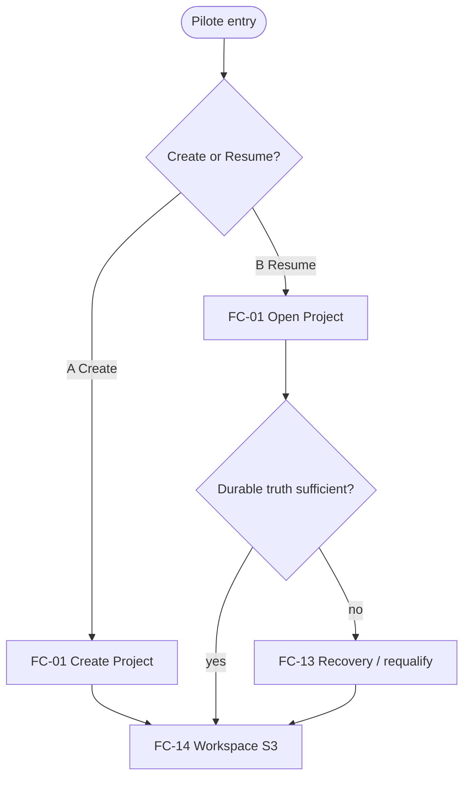
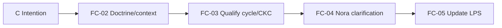
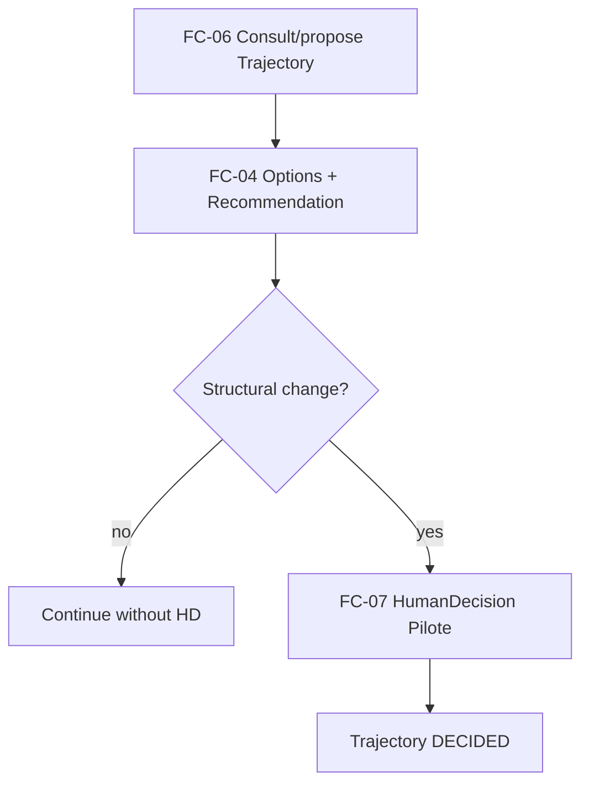
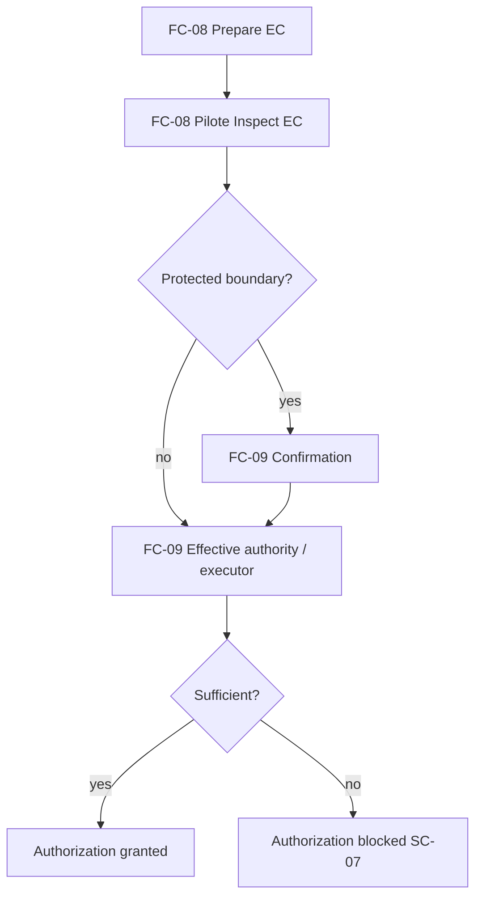
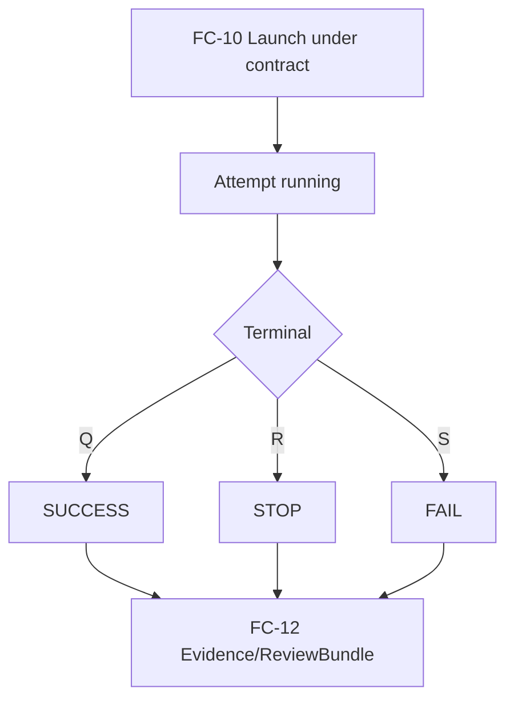
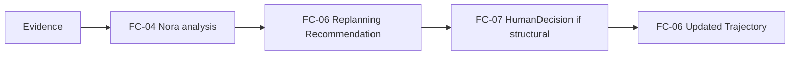
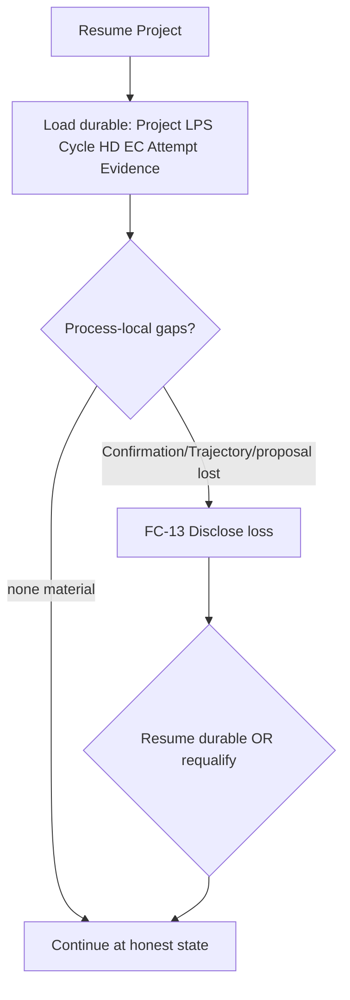

# Review Pack FULL — Product Completion Cycle 3 — Functional Architecture

## 1. Timestamp

2026-08-21 00:02:05 CEST (Europe/Paris)

## 2. Morris GO wording

« ok go pour l'architecture fonctionnelle dans ce cas »

## 3. Interprétation gouvernée

GO MORRIS — START PRODUCT COMPLETION CYCLE 3 — ARCHITECTURE FONCTIONNELLE — CRITICAL DOC CYCLE — PRODUCE LOCAL FUNCTIONAL ARCHITECTURE CANDIDATE — REUSE CURRENT BACKBONE — NO PARALLEL ARCHITECTURE — NO TECHNICAL ARCHITECTURE DECISION — NO BACKLOG — NO CODE — NO DELIVERY — ZERO REAL — NO PENPOT MUTATION — NO PROJECT COMMIT — NO PROJECT PUSH — NO PR — NO MERGE — RUNTIME V3 NON ADOPTED.

## 4. Cycle / profil / typologie

- Cycle : **3 — Architecture fonctionnelle**
- Profil : **CRITICAL**
- Typologie : **DOC**
- QA : CRITICAL DOCUMENT REVIEW
- Statut candidat : **CANDIDATE — NOT VALIDATED BY MORRIS — NOT INTEGRATED ON MAIN**

## 5. CKC fallback et limites

- CKC détaillé : **ABSENT** (ne pas utiliser pilote 03-architecture-technique = Cycle 6)
- Fallback : `02-fifteen-cycles-synthetic-map.md` + méthode v2.6
- Guidance Cycle 3 : modules/flux · frontiers/interfaces/responsabilités · risque sur-architecture · P1 Moyen
- Status : method-candidate · experimental · **aucune autorité d'exécution** · couverture **INCOMPLETE**

## 6. Fake / Real

- Applicable : **N/A** (cycle documentaire)
- Fake/mock/fixture : NONE
- REAL : **ZERO**
- Evidence level : DOCUMENTARY / REPOSITORY → FUNCTIONAL ARCHITECTURE DOCUMENTARY CANDIDATE REVIEWABLE
- Claims interdits : READY FOR REAL · REAL BOUNDARY PROVEN · END-TO-END REAL PROVEN

## 7. Local Git Truth

- Workspace : `/Users/morris/Projects/sfia-workspace`
- Branch : `docs/sfia-studio-product-completion-functional-architecture`
- HEAD : `f850259768e2a4736dc8cce19cd062244a52d727` (tracks origin/main)
- Tracked/staged : CLEAN before create · after create only new untracked candidate
- Untracked historiques : `.tmp-sfia-review/` · `projects/eventops-poc/` · `projects/flex-office-demo/`
- Drift from expected main : **NONE**

## 8. Base origin/main

`f850259768e2a4736dc8cce19cd062244a52d727` — Merge PR #377

## 9. Convergence Pre-check

- Build Doctrine VALIDATED ACTIVE · Roadmap ACTIVE · both READ ONLY
- C1/C2/EA/Wireframes/Screens VALIDATED INTEGRATED READ ONLY
- Capability : V3-F05 structured by V3-F01…F15 applicable
- Next capability execution beyond this Cycle 3 : **NOT auto-selected**
- Runtime backbone exists · no parallel architecture introduced

## 10. Sources réellement lues

PROCESSUS : template · routing · chatgpt-cursor operating model · rules-and-guardrails · method candidate · CKC README · fifteen-cycles synthetic map

CONVERGENCE : build-doctrine · roadmap (RO)

PRODUCT COMPLETION : 01 cadrage · 02 conception · 01 EA · 02 wireframes · 03 screens (RO)

DOCTRINE V3 : framings 30–37 · historical harvest 09

RUNTIME AUDIT (RO) : OA domains project/cycle/decision/doctrine/execution-contract/execution-attempt/evidence-review/execution-run/finops · vertical-slice-core/runtime/slice · adapters · /studio surfaces

## 11. Audit runtime ciblé (summary)

- Product SQLite durable : Project, LPS, CycleInstance, HumanDecision, EC, Attempt, Evidence, ReviewBundle
- Process-local / Memory : Trajectory, Epistemic, Confirmation, Claims/Maturity, conversation/proposal, execution-run D2
- Composition : vertical-slice-runtime wires OA for Product path
- Product UI : `/studio` · legacy shells FREEZE/HARVEST
- G0-A OA backbone · G0-B Product SQLite — already decided

## 12–15. Capability map / boundaries / ownership / flows

See full candidate document sections 5–8 (included in full below).

## 16–18. A→W / S1→S12 / framing 09

- A→W : fully mapped §9 — no orphans · auth order K→L→M→N→O preserved
- S1→S12 : fully mapped §10 · H-01…H-04 CARRY
- Framing 09 : KEEP/ADAPT orchestration concepts · **REJECT Mode Controller / v2.6 coexistence**

## 19–25. Options / ADR / tech delta / backlog handoff / debts / anti-claims / exit / next gates

See candidate §16–23.

**Technical delta verdict :** TARGETED DELTA REQUIRED (Trajectory + Confirmation consumed durability) · **NOT** full Cycle 6 · **NOT** stack re-choice.

**Backlog :** inputs only · **no stories**.

## 26. git status final

```
?? .tmp-sfia-review/
?? projects/eventops-poc/
?? projects/flex-office-demo/
?? projects/sfia-studio/product-completion/03-product-completion-architecture-fonctionnelle.md

```

Exact project create :

`?? projects/sfia-studio/product-completion/03-product-completion-architecture-fonctionnelle.md`

## 27. Actions NOT performed

- no project commit
- no project push
- no PR
- no merge
- no branch delete
- no Roadmap / Build Doctrine / C1 / C2 / UX / framing modification
- no code / tests / schema / API / DB / persistence change
- no technical architecture execution
- no backlog / user stories
- no Components
- no Penpot mutation
- no Figma
- no Delivery
- no REAL
- no runtime v3 adoption

## 28. Final verdict

READY FOR CHATGPT PRODUCT COMPLETION FUNCTIONAL ARCHITECTURE REVIEW — CYCLE 3 CRITICAL — C1 TARGET PRESERVED — C2 A→W FULLY MAPPED — S1→S12 PRODUCT EXPERIENCE PRESERVED — FUNCTIONAL CAPABILITY MAP COMPLETE — RESPONSIBILITY BOUNDARIES EXPLICIT — STATE OWNERSHIP EXPLICIT — EXISTING RUNTIME CLASSIFIED KEEP/ADAPT/COMPLETE/HARVEST/REPLACE/FREEZE/RETIRE LATER — NO PARALLEL ARCHITECTURE INTRODUCED — HISTORICAL FRAMING 09 HARVESTED WITHOUT V2.6 COEXISTENCE — TECHNICAL ARCHITECTURE DELTA QUALIFIED BUT NOT EXECUTED — BACKLOG HANDOFF INPUTS PREPARED BUT NO BACKLOG CREATED — OPEN DEBTS PRESERVED — FULL REVIEW PACK COMPLETE — REVIEW HANDOFF REMOTE VERIFIED — NO PROJECT COMMIT — NO PROJECT PUSH — NO PR — NO MERGE — NO PENPOT MUTATION — NO CODE — NO DELIVERY — ZERO REAL — RUNTIME V3 NON ADOPTED

## 29. Instruction ChatGPT

Review latest sfia/review-handoff.

Verify cycle/branch/HEAD/base ; **full created document content** ; C1 preserved ; C2 A→W ; S1→S12 ; boundaries ; no duplicate/orphan responsibility ; state ownership ; runtime classification ; no parallel architecture ; framing 09 harvest/reject ; no v2.6 runtime coexistence ; tech delta qualification ; backlog handoff only ; options≠decisions ; reserves ; no project commit/push/PR/merge ; no code/Delivery/REAL ; handoff remote verified.

If PASS: CHATGPT PRODUCT COMPLETION FUNCTIONAL ARCHITECTURE REVIEW — PASS → READY FOR MORRIS FUNCTIONAL ARCHITECTURE VALIDATION DECISION.

Do NOT validate on Morris behalf. Do NOT initiate Architecture technique. Do NOT initiate Backlog. Do NOT authorize Delivery.

---

## 30. FULL CREATED DOCUMENT (Artifact Completeness)

```markdown
# SFIA Studio — Product Completion — Cycle 3 — Architecture fonctionnelle

| Métadonnée | Valeur |
| --- | --- |
| **Projet** | SFIA Studio — Product Completion |
| **Cycle** | **3 — Architecture fonctionnelle** |
| **Profil** | **CRITICAL** |
| **Typologie** | **DOC** |
| **Niveau QA** | CRITICAL DOCUMENT REVIEW |
| **Milestone** | PRODUCT COMPLETION — CYCLE 3 — FUNCTIONAL ARCHITECTURE |
| **Base Git** | `origin/main` @ `f850259768e2a4736dc8cce19cd062244a52d727` (PR #377 merge · Product Screens post-merge sync) |
| **Branche locale** | `docs/sfia-studio-product-completion-functional-architecture` |
| **Morris GO** | **CONSUMED** — wording « ok go pour l'architecture fonctionnelle dans ce cas » |
| **Statut** | **CANDIDATE — NOT VALIDATED BY MORRIS — NOT INTEGRATED ON MAIN** |
| **C1** | VALIDATED BY MORRIS — INTEGRATED ON MAIN — **READ ONLY** |
| **C2** | VALIDATED BY MORRIS — INTEGRATED ON MAIN — **READ ONLY** |
| **Experience Architecture** | VALIDATED BY MORRIS — INTEGRATED ON MAIN — **READ ONLY** |
| **E2E Wireframes** | VALIDATED BY MORRIS — INTEGRATED ON MAIN — **READ ONLY** |
| **Product Screens** | VALIDATED BY MORRIS — INTEGRATED ON MAIN — **READ ONLY** |
| **Build Doctrine / Roadmap** | VALIDATED / ACTIVE — **READ ONLY** this cycle |
| **CKC** | détaillé **ABSENT** · fallback `02-fifteen-cycles-synthetic-map.md` + méthode v2.6 · method-candidate · **aucune autorité d'exécution** · couverture **INCOMPLETE** |
| **Runtime v3** | **NON ADOPTED** |
| **Delivery** | **NOT AUTHORIZED** |
| **REAL** | **ZERO** |
| **Code / Components / Penpot** | NONE / NOT AUTHORIZED / READ ONLY |
| **Project commit / push / PR** | **NOT AUTHORIZED** this cycle |
| **Timestamp candidat** | 2026-08-21 00:00 CEST (+0200) |

---

## 1. Purpose / Non-goals

### Purpose

Produire une **architecture fonctionnelle cible** de Product Completion qui transforme :

- C1 (target / scope / trajectory) ;
- C2 (comportement A→W + contrats) ;
- Product Experience validée (S1→S12 / Wireframes / Screens) ;
- runtime / backbone OA existant ;

en une **structure de capabilities, responsabilités, frontières, flux et dépendances** exploitable avant :

1. qualification du besoin d'**Architecture technique delta** ;
2. **Cycle 5 Backlog / User Stories** ;
3. **Delivery** capability-driven.

### Ce que ce document est

- arbitrage de **structure métier / fonctionnelle** ;
- carte de responsabilités et ownership d'état ;
- classification KEEP/ADAPT/COMPLETE/HARVEST/REPLACE/FREEZE/RETIRE LATER du runtime ;
- qualification du delta technique **sans l'exécuter** ;
- inputs de handoff Backlog **sans créer le backlog**.

### Ce que ce document n'est pas

| Distinction | Non-goal |
| --- | --- |
| vs **C2** | Ne re-spécifie pas les comportements A→W ; les **consomme** |
| vs **UX** | Ne redesign pas S1→S12 / Screens ; les **sert** |
| vs **Architecture technique** | Ne choisit pas stack / DB / API / schema / deployment |
| vs **Backlog** | Ne produit pas stories / points / sprints |
| vs **code / Components** | N'implémente rien ; n'autorise pas Components |
| vs **Build Doctrine A3 historique** | Ne réécrit pas Build Doctrine (voir RESERVE-GOV-EC-ORDER) |

---

## 2. Source hierarchy

```text
Git current (authoritative)
  > Morris decisions (construction gates)
  > C1 Product Completion cadrage
  > C2 Conception fonctionnelle
  > framings 30–37 (doctrine v3 VALIDATED)
  > Product Experience validated (EA → Wireframes → Screens)
  > Build Doctrine / Convergence Roadmap (construction laws / living state)
  > runtime evidence (OA / vertical-slice — READ ONLY)
  > historical harvest (framing 09)
  > recommendation / hypothesis (this candidate)
```

**Ordre d'autorité UX :** C1 → C2 → EA → Wireframes → Screens.
Ne pas réouvrir les décisions validées sans contradiction structurante démontrée.

---

## 3. Convergence qualification

| Champ | Contenu |
| --- | --- |
| **Capability v3 servie** | **V3-F05** (chaîne conversation → décision → exécution) structurée par V3-F01…F15 applicables (CKC, LPS, DoctrinePackage, Epistemology, Trajectory, Provenance, Contradictions, Replanning, DebtItem, AgentCapability, Action/reversibility, Artifact completeness, Maturity) |
| **Milestone** | PRODUCT COMPLETION — CYCLE 3 — FUNCTIONAL ARCHITECTURE |
| **Current state** | C1/C2/EA/Wireframes/Screens **INTEGRATED** · Product Screens design trajectory segment closed for current design scope · runtime backbone OA **exists** · Product Completion **not complete** · runtime v3 **NON ADOPTED** |
| **Gaps (entrée)** | frontières fonctionnelles formalisées absentes · ProjectTrajectory durability OPEN · Confirmation process-local OPEN · UAT OPEN · H-01…H-04 CARRY |
| **Dependencies** | C1+C2+PE validated · OA Native Backbone (G0-A) · Product SQLite (G0-B) · no parallel engine |
| **Critical path** | Product Completion target → **functional architecture** → technical-delta qualification → backlog → capability-driven Delivery |
| **Exit proof (candidat)** | voir §23 |
| **Debt/exit** | voir §21 |
| **Next gate** | ChatGPT Functional Architecture Review → Morris Validation Decision · **≠** auto Architecture technique · **≠** auto Backlog |

### Build Doctrine challenges (R1–R21 appliqués)

1. Capability utilisateur : boucle Pilote-facing Product Completion (Create/Resume → Evidence → Recovery).
2. Pourquoi maintenant : PE validée ; découpage Backlog/Delivery nécessite frontières ; risque parallèle élevé sans Cycle 3.
3. Actifs : OA KEEP/ADAPT/COMPLETE (voir §12).
4. Risque parallèle : **mitigé** par recommandation reuse OA + composition runtime (pas de second moteur).
5. Frontières nécessaires : ownership Project/LPS/Decision/EC/Attempt/Evidence/Trajectory/Confirmation.
6. Responsabilités uniques : HumanDecision=Pilote ; Recommendation=Nora ; persistence LPS=Studio ; HOW=Cursor sous envelope.
7. Flux A→W : §9–§10.
8. Couvert runtime : Project/LPS/CycleInstance/HD/EC/Attempt/Evidence durable partiel ; Trajectory+Confirmation process-local.
9. Vrais gaps : Trajectory durable · Confirmation durable (consumed) · PE↔OA surface completeness · UAT.
10. Architecture technique : **TARGETED DELTA REQUIRED** (pas rewrite).
11. Backlog : capabilities + slices + acceptance boundaries (§19) — pas stories.
12. Exit proof Cycle 3 : §23.

---

## 4. Architecture principles

Dérivés de C1/C2/framings 30–37 / Build Doctrine :

1. **Project ≠ Cycle** — Project durable porte LPS ; CycleInstance porte qualification/session épistémique.
2. **Recommendation ≠ HumanDecision** — Nora propose ; Pilote décide ; jamais auto-promotion.
3. **ProjectTrajectory ≠ Roadmap** — Trajectory = état projet vivant ; Roadmap = construction convergence.
4. **CKC ≠ authority** — guidance method-candidate ; aucune autorité d'exécution runtime.
5. **ExecutionContract = contrat fonctionnel natif** — Markdown Cursor = adapter/projection seulement.
6. **AgentCapability = governance envelope** ≠ catalogue features Cursor ≠ effective authority.
7. **Confirmation after EC inspection when required** — ordre C2 : K→L→M(if)→N→O (voir RESERVE-GOV-EC-ORDER).
8. **Evidence before claim** — tout terminal Q/R/S produit Evidence avant claim.
9. **Recovery fail-closed** — jamais inventer GO / mémoire / Confirmation / authority.
10. **Doctrine v3 exclusive** — pas de coexistence opérationnelle v2.6/runtime.
11. **Business-first** — Evidence/UX métier avant profondeur technique.
12. **No parallel engine** — un mécanisme générique EC→agent→Evidence ; pas N moteurs par type de cycle.
13. **effective authority = intersection** human ∩ EC ∩ AgentCapability ∩ guardrails ∩ Confirmation(if required).
14. **Facts ≠ Recommendation ≠ Decision** — epistemology preservée.

---

## 5. Functional capability map

Regroupement par **responsabilité cohérente** (≠ 1 concept C2 = 1 module).

| ID | Capability | Responsabilité | Couvre |
| --- | --- | --- | --- |
| **FC-01 Project Continuity** | Create / open / resume Project | Identité projet + entrée A/B | A, B, W (entry) |
| **FC-02 Knowledge & Doctrine** | Résoudre contexte / DoctrinePackage / sources | Pins doctrine + fraîcheur | D |
| **FC-03 Cycle Qualification** | Qualifier cycle / profil / CKC / lenses | CycleInstance + CKC resolution | E |
| **FC-04 Nora Reasoning** | Clarification / options / recommendation / analysis | Propose only | C, F, I, U |
| **FC-05 Living Project State** | Maintenir LPS business-first | Versioned project state | G |
| **FC-06 Trajectory & Replanning** | Options trajectoire / proposed vs decided / replan | ProjectTrajectory lifecycle | H, V |
| **FC-07 Human Decision** | Enregistrer décisions structurantes Pilote | HumanDecision + DecisionBasis | J |
| **FC-08 Execution Contracting** | Préparer / inspecter EC | Native EC progressive disclosure | K, L |
| **FC-09 Authorization Gate** | Confirmation if required + effective authority / executor sufficiency | Confirmation · authority check · blocked states | M, N |
| **FC-10 Governed Execution** | Attempt under contract | Attempt lifecycle + runtime guards | O, P |
| **FC-11 Terminal Outcomes** | SUCCESS / STOP / FAIL honesty | Terminal branches | Q, R, S |
| **FC-12 Evidence & Review** | Evidence / ReviewBundle business-first | Artifact completeness loop | T |
| **FC-13 Recovery Continuity** | Reprise inter-session fail-closed | Resume / requalify | W |
| **FC-14 Product Experience Shell** | Surfaces S1→S12 / Screens | Présentation Pilote-facing | all UX |
| **FC-15 Cross-cutting Governance** | Audit / policy / debt / maturity claims | Transverse stops & provenance | all |

**Composition runtime (non-capability métier séparée) :** `vertical-slice-runtime` = **orchestration KEEP/ADAPT** qui compose FC-01…FC-12 sur OA — **≠** nouveau domaine métier.

---

## 6. Domain / responsibility boundaries

### FC-01 Project Continuity
| | |
| --- | --- |
| **Owns** | Project identity, list/create/open, resume entry |
| **Does not own** | Trajectory decisions, EC, Attempt |
| **In** | Pilote intention / project id |
| **Out** | Project handle + entry mode A|B |
| **Durable** | Project MUST |
| **Authority** | Pilote create/open |

### FC-02 Knowledge & Doctrine
| | |
| --- | --- |
| **Owns** | DoctrinePackage resolve/validate, digest/provenance pin |
| **Does not own** | HumanDecision, EC content |
| **Durable** | DoctrinePackage identity/digest MUST (filesystem pins today) |
| **Authority** | Studio resolve ; Pilote does not invent doctrine |

### FC-03 Cycle Qualification
| | |
| --- | --- |
| **Owns** | CycleInstance, CKC resolution, qualification profile |
| **Does not own** | Recommendation authority, Confirmation |
| **Durable** | CycleInstance MUST ; CKC resolution reconstructible |
| **Authority** | Studio qualify ; Nora may assist ; Pilote does not bypass CKC as fake authority |

### FC-04 Nora Reasoning
| | |
| --- | --- |
| **Owns** | Clarification dialogue, Options, Recommendation, post-Evidence analysis |
| **Does not own** | HumanDecision, Execution, Confirmation grant |
| **Process-local allowed** | Conversation / proposal drafts |
| **Authority** | **Propose only** |

### FC-05 Living Project State
| | |
| --- | --- |
| **Owns** | LPS versions, factual appends (evidenceIds, etc.) |
| **Does not own** | Deciding trajectory, inventing HD |
| **Durable** | LPS MUST |
| **Write authority** | Studio system factual writer + governed use-cases |

### FC-06 Trajectory & Replanning
| | |
| --- | --- |
| **Owns** | proposed vs decided trajectory versions, replanning after Evidence |
| **Does not own** | Roadmap construction state |
| **Durable** | **MUST (target)** — currently Memory → OPEN debt |
| **Authority** | Nora proposes ; Pilote adopts via HD ; Studio persists |

### FC-07 Human Decision
| | |
| --- | --- |
| **Owns** | HumanDecision, DecisionBasis, decision history |
| **Does not own** | Confirmation semantics (FC-09), Attempt |
| **Durable** | HD MUST |
| **Authority** | **Pilote only** |

### FC-08 Execution Contracting
| | |
| --- | --- |
| **Owns** | ExecutionContract prepared→inspected lifecycle, disclosure fields |
| **Does not own** | Authorization result, Attempt running |
| **Durable** | EC MUST |
| **Authority** | Studio prepare ; Pilote inspect |

### FC-09 Authorization Gate
| | |
| --- | --- |
| **Owns** | Confirmation (if required), effective authority evaluation, executor sufficiency, authorization_blocked presentation |
| **Does not own** | EC content, Attempt execution HOW |
| **Durable** | **Consumed Confirmation carrying authority = MUST** (currently process-local → OPEN debt) |
| **Authority** | Pilote grants Confirmation ; Studio evaluates intersection fail-closed |

### FC-10 Governed Execution
| | |
| --- | --- |
| **Owns** | ExecutionAttempt accepted→running→terminal ; runtime guardrails after auth |
| **Does not own** | Closing CycleInstance / archiving Project |
| **Durable** | Attempt MUST when exists |
| **Authority** | Cursor/agent HOW inside envelope only |

### FC-11 Terminal Outcomes
| | |
| --- | --- |
| **Owns** | Distinct SUCCESS / STOP / FAIL semantics |
| **Does not own** | Evidence payload storage (FC-12) |
| **Evidence obligation** | Always hand off to FC-12 |

### FC-12 Evidence & Review
| | |
| --- | --- |
| **Owns** | Evidence, ReviewBundle, business-first hierarchy, reinjection to Nora/LPS |
| **Does not own** | Maturity/claim promotion without evidence |
| **Durable** | Evidence + ReviewBundle MUST |
| **Process-local** | ClaimEvaluation / MaturityAssessment may remain until gated |

### FC-13 Recovery Continuity
| | |
| --- | --- |
| **Owns** | Resume from durable truth ; disclose process-local loss ; requalify path |
| **Does not own** | Inventing missing Confirmation/HD |
| **Fail-closed** | Mandatory |

### FC-14 Product Experience Shell
| | |
| --- | --- |
| **Owns** | Surfaces S1→S12 / Screens presentation & interaction affordances |
| **Does not own** | Domain persistence rules |
| **Authority** | Presentation only — never creates authority |

### FC-15 Cross-cutting Governance
| | |
| --- | --- |
| **Owns** | Audit journals, stop taxonomy placement, DebtItem tracking, anti-claims |
| **Does not own** | A parallel “Stop Engine” product |

### Ambiguities explicites (non résolues en silence)

| Ambiguïté | Traitement |
| --- | --- |
| Build Doctrine A3 lists Confirmation before EC | **RESERVE-GOV-EC-ORDER** — C1/C2 order wins for Product Completion behavior ; Build Doctrine **not rewritten** this cycle |
| `execution-run` D2 vs Attempt product | D2 = **FREEZE / parallel historical lane** — not Product Completion critical path |
| FinOps Postgres | **Orthogonal** — KEEP as transverse ; not PE capability owner |

---

## 7. State ownership matrix

| Object | Functional owner | Lifecycle | Durability | Write authority | SoT | Recovery |
| --- | --- | --- | --- | --- | --- | --- |
| Project | FC-01 | create→active | MUST durable | Pilote/Studio | Product SQLite | resume by id |
| LPS | FC-05 | append-only versions | MUST durable | Studio factual | Product SQLite | latest version |
| DoctrinePackageRef | FC-02 | pin/validate | MUST pin/digest | Studio | Filesystem package + pin in LPS | re-resolve pin |
| CycleInstance | FC-03 | create→active | MUST durable | Studio | Product SQLite | by project link |
| CKC resolution | FC-03 | per qualification | reconstructible | Studio/CKC resolver | resolver + cycle link | re-resolve |
| Observation/Hypothesis/Option | FC-04 | ephemeral→recorded option | process-local allowed until HD | Nora propose | conversation/proposal | disclose loss |
| Recommendation | FC-04 | proposed | reconstructible MUST (target) | Nora | prefer durable link | never treat as HD |
| HumanDecision | FC-07 | record/supersede | MUST durable | Pilote | Product SQLite | history |
| ProjectTrajectory | FC-06 | proposed/decided versions | **MUST durable (target)** · **OPEN runtime Memory** | Studio after HD | Memory today → COMPLETE | never invent decided |
| Confirmation | FC-09 | pending→consumed/expired/invalidated | **consumed MUST durable (target)** · **OPEN process-local** | Pilote grant / Studio enforce | Memory today → COMPLETE | never reuse stale |
| ExecutionContract | FC-08 | prepared→inspected→authorized* | MUST durable | Studio + Pilote inspect | Product SQLite | re-inspect if amend |
| AgentCapability / effective authority result | FC-09 / FC-15 | evaluated per authorize | audit envelope MUST | Studio evaluate | audit + EC fields | re-evaluate |
| ExecutionAttempt | FC-10 | accepted→running→terminal | MUST durable | Studio + adapter | Product SQLite | terminal honesty |
| Evidence | FC-12 | register/ingest | MUST durable | Studio | Product SQLite | required post-terminal |
| ReviewBundle | FC-12 | open→freeze/complete | MUST durable | Studio / Pilote review acts | Product SQLite | remount |
| DebtItem | FC-15 | open→exit | tracked | Morris/construction + product debt | docs/Roadmap | carry |
| Recovery state | FC-13 | resume/requalify | derived from durable | Studio disclose | durable ∩ disclosed gaps | fail-closed |

\* “authorized” = gate result consuming inspected EC + Confirmation(if) + authority — not a substitute for EC content.

---

## 8. Functional flows (Mermaid)

### F1 — Create / Resume Project


```mermaid
flowchart TD
  Start([Pilote entry]) --> Choice{Create or Resume?}
  Choice -->|A Create| Create[FC-01 Create Project]
  Choice -->|B Resume| Resume[FC-01 Open Project]
  Create --> WS[FC-14 Workspace S3]
  Resume --> RecoverCheck{Durable truth sufficient?}
  RecoverCheck -->|yes| WS
  RecoverCheck -->|no| Recov[FC-13 Recovery / requalify]
  Recov --> WS
```

### F2 — Intention → context → qualification → clarification → LPS


```mermaid
flowchart LR
  C[C Intention] --> D[FC-02 Doctrine/context]
  D --> E[FC-03 Qualify cycle/CKC]
  E --> F[FC-04 Nora clarification]
  F --> G[FC-05 Update LPS]
```

### F3 — Trajectory → Options → Recommendation → HumanDecision


```mermaid
flowchart TD
  H[FC-06 Consult/propose Trajectory] --> I[FC-04 Options + Recommendation]
  I --> NeedHD{Structural change?}
  NeedHD -->|no| Cont[Continue without HD]
  NeedHD -->|yes| J[FC-07 HumanDecision Pilote]
  J --> Decided[Trajectory DECIDED]
```

### F4 — Prepare EC → Inspect → Confirmation if required → authority


```mermaid
flowchart TD
  K[FC-08 Prepare EC] --> L[FC-08 Pilote Inspect EC]
  L --> NeedConf{Protected boundary?}
  NeedConf -->|yes| M[FC-09 Confirmation]
  NeedConf -->|no| N[FC-09 Effective authority / executor]
  M --> N
  N --> Ok{Sufficient?}
  Ok -->|yes| AuthZ[Authorization granted]
  Ok -->|no| Blocked[Authorization blocked SC-07]
```

### F5 — Execute → Attempt → terminals → Evidence


```mermaid
flowchart TD
  O[FC-10 Launch under contract] --> P[Attempt running]
  P --> Term{Terminal}
  Term -->|Q| Succ[SUCCESS]
  Term -->|R| Stop[STOP]
  Term -->|S| Fail[FAIL]
  Succ --> T[FC-12 Evidence/ReviewBundle]
  Stop --> T
  Fail --> T
```

### F6 — Nora analysis → replanning → HD → updated trajectory


```mermaid
flowchart LR
  T[Evidence] --> U[FC-04 Nora analysis]
  U --> V[FC-06 Replanning Recommendation]
  V --> J2[FC-07 HumanDecision if structural]
  J2 --> H2[FC-06 Updated Trajectory]
```

### F7 — Inter-session Recovery


```mermaid
flowchart TD
  Open[Resume Project] --> Load[Load durable: Project LPS Cycle HD EC Attempt Evidence]
  Load --> Gaps{Process-local gaps?}
  Gaps -->|none material| Cont[Continue at honest state]
  Gaps -->|Confirmation/Trajectory/proposal lost| Disclose[FC-13 Disclose loss]
  Disclose --> Path{Resume durable OR requalify}
  Path --> Cont
```

---

## 9. A→W traceability

| Step | Capability | State read | State written | Human gate | Evidence/output |
| --- | --- | --- | --- | --- | --- |
| A | FC-01 | — | Project | Pilote create | Project id |
| B | FC-01/13 | Project durable | resume context | Pilote open | workspace |
| C | FC-04/14 | Project | intention utterance | — | conversation |
| D | FC-02 | sources/doctrine | DoctrinePackageRef | — | pin/digest |
| E | FC-03 | doctrine/project | CycleInstance + CKC | — | qualification |
| F | FC-04 | cycle/LPS | clarification | — | Options prep |
| G | FC-05 | cycle/rec | LPS version | — | LPS snapshot |
| H | FC-06 | LPS/cycle | Trajectory proposed | — | trajectory view |
| I | FC-04 | trajectory | Recommendation | — | Rec (no authority) |
| J | FC-07 | Rec/basis | HumanDecision | **Pilote HD** | decided basis |
| K | FC-08 | HD/LPS | EC prepared | — | EC |
| L | FC-08 | EC | EC inspected | **Pilote inspect** | inspected EC |
| M | FC-09 | EC inspected | Confirmation pending→consumed | **Pilote confirm if req** | Confirmation |
| N | FC-09 | EC+Conf+AgentCapability | authority result | blocked if fail | authz/blocked |
| O | FC-10 | authorized EC | Attempt accepted | — | launch |
| P | FC-10 | Attempt | running updates | — | progress |
| Q | FC-11 | Attempt | terminal_success | — | terminal |
| R | FC-11 | Attempt | terminal_stop | — | terminal |
| S | FC-11 | Attempt | terminal_fail | — | terminal |
| T | FC-12 | Attempt terminal | Evidence/RB | — | Evidence |
| U | FC-04 | Evidence | analysis Rec | — | analysis |
| V | FC-06 | analysis | Trajectory update Rec | HD if structural | replan |
| W | FC-13 | durable set | recovery disclosure | Pilote choose path | resume/requalify |

**Aucune étape orpheline.** Ordre d'autorisation **K→L→M(if)→N→O→P** préservé.

---

## 10. S1→S12 / Product Experience traceability

| Surface | Capability | Notes |
| --- | --- | --- |
| S1 Entry/Projects | FC-01 / FC-14 | SC-01 |
| S2 Create intention | FC-01 / FC-14 | SC-02 · A only |
| S3 Workspace shell | FC-14 (+01/05) | SC-03 |
| S4 Conversation | FC-04 / FC-14 | dominant |
| S5 LPS panel | FC-05 / FC-14 | business-first |
| S6 Trajectory region | FC-06 / FC-14 | H-01 CARRY · SC-04 |
| S7 History | FC-13 / FC-15 | minimal MUST |
| S8 Recovery | FC-13 / FC-14 | SC-13 |
| S9 Evidence reader | FC-12 / FC-14 | SC-09…11 · H-03 CARRY |
| S10 EC disclosure | FC-08 / FC-14 | SC-05/06 |
| S11 Confirmation | FC-09 / FC-14 | SC-06/07 · process-local debt |
| S12 Attempt lifecycle | FC-10/11 / FC-14 | SC-08…11 |

Screens SC-01…SC-14 + SC-R01…R03 = **validated PE evidence** · Components **0** · H-01…H-04 **CARRY** · UX-BLK-01/02/03 **CLOSED BY EVIDENCE**.

Architecture fonctionnelle **sert** PE validée — **n'invente pas** de seconde UX.

---

## 11. Existing asset classification

| Asset | Current purpose | Evidence | Class | Target role | Gap | Exit if temporary |
| --- | --- | --- | --- | --- | --- | --- |
| OA Project (+ LPS SQLite) | Project/LPS durable | M1 on main | **KEEP** | FC-01/05 SoT | — | — |
| OA Cycle (CycleInstance SQLite) | Qualification durable | M2 | **KEEP** | FC-03 | Trajectory/Epistemic Memory | COMPLETE Trajectory |
| OA Doctrine (filesystem) | Package resolve | T-A0 | **KEEP** | FC-02 | — | — |
| OA Decision (HD SQLite) | HumanDecision durable | M3 | **KEEP** | FC-07 | Confirmation Memory | COMPLETE Confirmation |
| OA ExecutionContract SQLite | Native EC | M3 | **KEEP** | FC-08 | — | — |
| OA ExecutionAttempt SQLite | Attempt + REAL boundary off | M4/M5 | **KEEP** | FC-10 | REAL gated separately | — |
| OA Evidence/Review SQLite | Evidence/RB | M5 | **KEEP** | FC-12 | Claims/Maturity Memory | later COMPLETE if required |
| Cycle Trajectory Memory | Trajectory versions | runtime | **COMPLETE** | FC-06 durable | durability OPEN | COMPLETE → Product SQLite under existing ports |
| Confirmation Memory | Confirmation lifecycle | runtime | **COMPLETE** | FC-09 consumed durable | process-local OPEN | COMPLETE consumed semantics |
| Epistemic Memory | epistemic state | runtime | **ADAPT** | support FC-04/06 | may stay process-local until proven MUST | exit if blocks recovery |
| vertical-slice-core | Local Project+Doctrine composition | code | **KEEP** | composition | — | — |
| vertical-slice-runtime | Full OA stack wiring + PE UI bridge | code | **ADAPT** | PE↔OA orchestration | surface completeness vs Screens | — |
| vertical-slice (demo VS states) | Historical demo mapping | code | **HARVEST / FREEZE** | learning only | ≠ PE SoT | RETIRE LATER when unused |
| lib/adapters fixtures | Fixture→domain for legacy shells | code | **FREEZE** | non-critical | not PE path | RETIRE LATER |
| Legacy UI `/workspace` `/decision` `/cycle-actif`… | Parallel shells | routes | **HARVEST / FREEZE** | selective patterns only | ≠ Product Screens SoT | RETIRE LATER with Morris |
| Product UI `/studio` | Product entry/workspace | routes | **KEEP / ADAPT** | FC-14 | align Screens contracts | — |
| execution-run D2 Memory | Separate run lane | OA | **FREEZE** | non-PC critical path | parallel risk if promoted | keep isolated |
| FinOps Postgres | Transverse cost | OA | **KEEP** orthogonal | not PE owner | — | — |
| Historical framing 09 | Early functional arch | docs | **HARVEST** | concepts only | Mode Controller REJECT | — |
| OPS1 Cursor harvest | REAL HOW patterns | historical | **HARVEST** | adapter patterns under EC | no parallel product path | — |

**Règle :** REPLACE / RETIRE / parallel architecture = **MORRIS DECISION REQUIRED** — non décidé ici.

---

## 12. Historical framing 09 harvest

| Concept 09 | Disposition |
| --- | --- |
| Separation cockpit / engines / executor | **KEEP** → FC-14 / OA / Cursor |
| Project State Engine | **ADAPT** → FC-05 LPS |
| Cycle Router | **ADAPT** → FC-03 (evolvable catalog, not N engines) |
| Canonical Context / Doctrine | **KEEP** → FC-02 |
| Guided Reasoning | **ADAPT** → FC-04 Nora propose-only |
| Decision Engine | **ADAPT** → FC-07 Pilote HD |
| Execution Orchestrator + EC pivot | **KEEP** → FC-08/10 |
| Validation / Evidence | **KEEP** → FC-12 |
| Replanning | **KEEP** → FC-06 |
| Policy / Audit | **KEEP** → FC-15 |
| **Mode Controller v2.6 / transition / v3 / fallback** | **REJECT** — v3 exclusive · no operational coexistence |
| Multi human runtime personas | **REJECT/ADAPT** → single **Pilote** |
| v2.6 as active runtime baseline | **SUPERSEDED** — v2.6 = process ChatGPT↔Cursor only |
| SQL store prescription | **REJECT as prescription** — G0-B already decided Product SQLite ; no new schema here |
| Action Compiler parallel path | **HARVEST carefully** — EC+Confirmation center |

---

## 13. Functional interfaces (not APIs)

| Interface | Producer | Consumer | Meaning | Preconditions | Failure | Authority / Evidence |
| --- | --- | --- | --- | --- | --- | --- |
| FI-01 Current project state | FC-01/05 | FC-04 Nora | Valid Project+LPS snapshot | Project exists | fail-closed empty | Studio |
| FI-02 Trajectory proposal | FC-04/06 | Pilote / FC-07 | Recommendation only | Context qualified | stay proposed | Nora · no HD |
| FI-03 HumanDecision recorded | FC-07 | FC-06/08 | Structural adopt/amend | Qualified basis | reject incomplete | Pilote · DecisionBasis |
| FI-04 EC prepared | FC-08 | Pilote | Inspectable contract | HD when required | cannot authorize | Studio |
| FI-05 EC inspected | Pilote via FC-08 | FC-09 | Ready for authz path | Full disclosure available | re-inspect | Pilote |
| FI-06 Confirmation consumed | FC-09 | FC-09/10 | Scoped consent | After inspect · still valid | expire/invalidate | Pilote · durable target |
| FI-07 Authority result | FC-09 | FC-10 | Intersection evaluation | EC+envelope+Conf | authorization_blocked | Studio audit |
| FI-08 Attempt under contract | FC-10 | FC-11/12 | Governed HOW | Authz granted | STOP/FAIL + Evidence | Cursor inside envelope |
| FI-09 Evidence registered | FC-12 | FC-04/05/06 | Terminal truth | Attempt terminal | block claims | Studio |
| FI-10 Recovery disclosure | FC-13 | Pilote | Honest gaps | Resume | requalify path | Studio never invents |

---

## 14. Contradiction / stop model

Stops are **ported by contracts/policies**, not a parallel Stop Engine :

| Stop class | Ported by |
| --- | --- |
| Source missing / freshness | FC-02 + EC fields |
| Contradiction | FC-04/15 epistemology + fail-closed |
| Decision missing | FC-07 gate before structural EC |
| Scope | EC scope ∩ AgentCapability |
| Evidence missing | FC-12 before claims |
| Irreversible / protected action | FC-09 Confirmation + protections |
| Executor insufficient | FC-09 SC-CAP / blocked |
| Maturity claim | FC-12/15 evidence-before-claim |
| Artifact incomplete | FC-12 |
| Git incoherence | Git SoT + recovery |
| Trajectory dependency | FC-06 proposed≠decided |
| Doctrine fallback violation | FC-02 v3-only · REJECT Mode Controller |

---

## 15. Continuity / recovery architecture

**Minimum durable to resume :** Project, LPS, CycleInstance, HD, EC, Attempt(if), Evidence(if), Doctrine pin, decided Trajectory (**target**), consumed Confirmation (**target**).

**Never infer :** missing HD, missing Confirmation, invented authority, invented GO, invented decided Trajectory.

**Stale behaviors :**
- stale Confirmation → invalidate · re-confirm after re-inspect ;
- missing Recommendation → disclose · Nora may repropose ;
- Trajectory Memory loss → disclose · requalify / reconstruct from HD+LPS — **central OPEN gap**.

**Fail-closed :** prefer blocked honest state over false continuity.

---

## 16. Architecture options / arbitrages

### OPTION A — OA-domain-aligned capabilities (reuse-first)
Map FC-* tightly onto existing OA folders + PE shell.
**Benefits :** minimal parallel risk · backlog maps to existing ports.
**Costs :** UX journeys span multiple OA calls (already true).
**Parallel risk :** low.
**Reversibility :** high.

### OPTION B — Journey modules as primary cut (UF-01…07 as domains)
**Benefits :** narrative clarity for Backlog.
**Costs :** duplicates OA ownership · high parallel risk.
**Parallel risk :** **high** — rejected as default.

### OPTION C — Hybrid orchestration + OA ownership
PE shell + `vertical-slice-runtime` as orchestration ; OA remains SoT domains.
**Benefits :** matches current code · preserves PE.
**Costs :** must keep orchestration thin (no second business engine).
**Parallel risk :** low if orchestration stays composition-only.

### RECOMMENDATION (candidate — ≠ Morris Decision)

**RECOMMEND OPTION A + thin orchestration from OPTION C** :

- Functional capabilities §5 as the **product cut** ;
- OA domains remain **implementation ownership anchors** ;
- `vertical-slice-runtime` = KEEP/ADAPT composition — **not** a new business domain ;
- REJECT OPTION B as default (parallel architecture risk).

Status : **RECOMMENDATION** · Gate : Morris Functional Architecture Validation.

---

## 17. Technical architecture delta qualification

| Item | Status | Verdict |
| --- | --- | --- |
| OA Native Backbone (G0-A) | Decided + implemented | **KEEP** — no re-decision |
| Product SQLite (G0-B) | Decided + implemented | **KEEP** — no new DB choice |
| Project/LPS/HD/EC/Attempt/Evidence durable | Implemented | **KEEP** |
| ProjectTrajectory Memory | Gap vs C2 MUST | **TARGETED DELTA REQUIRED** — COMPLETE under existing ports |
| Confirmation process-local | Gap vs consumed MUST | **TARGETED DELTA REQUIRED** — COMPLETE consumed durability |
| PE Surfaces vs Screens | Partial runtime UI | **ADAPT** Delivery later — not Cycle 6 stack choice |
| New stack / API gateway / schema redesign | Not required to state FC | **NOT REQUIRED BEFORE BACKLOG** |
| Full Cycle 6 greenfield architecture | Unnecessary | **NOT REQUIRED** |
| REAL / Gate D expansion | Separate Morris gates | **OUT OF SCOPE** |

**Overall technical-delta verdict :**
**TARGETED DELTA REQUIRED** (Trajectory durability + Confirmation consumed durability + PE↔OA completeness)
**≠** full Architecture technique rewrite
**≠** stack/persistence re-selection.

Cycle 6 may be opened later as **targeted delta** only after Morris validation of this Cycle 3 — **not auto-authorized**.

---

## 18. Backlog handoff readiness (no backlog)

### Capabilities for future stories (inputs only)
FC-01…FC-15 as epic-level capability boundaries.

### Candidate vertical slices (logical — not scheduled)
1. Resume honesty (FC-01/13) with durable set disclosure
2. Trajectory durable proposed/decided (FC-06 COMPLETE)
3. Confirmation consumed durable + order K→L→M→N (FC-09 COMPLETE)
4. EC inspect progressive disclosure fidelity (FC-08/14)
5. Attempt terminals + Evidence reinjection (FC-10…12)
6. Nora analysis → replan → HD (FC-04/06/07)

### Order constraints
- No Attempt without inspected EC + authority path
- No Confirmation before EC inspect
- Evidence after every terminal
- Trajectory decided only via HD
- Recovery never invents authority

### Acceptance boundaries (architecture-level)
- A→W coverage preserved
- S1→S12 served without second UX
- effective authority = intersection
- fail-closed recovery

### Already validated (do not re-open in stories)
D-PC-01/07 · MD-C2-01…04 · PE EA/Wireframes/Screens · G0-A/B

### Unresolved (block naive stories)
- Trajectory durability design detail (tech delta)
- Confirmation durability design detail (tech delta)
- H-01…H-04 still CARRY (UX representation — not blockers)
- UAT OPEN

### Technical delta dependencies
Slices 2–3 depend on targeted durability COMPLETE — may need Cycle 6 **targeted** or Delivery design notes under existing ports — **Morris gate later**.

**INTERDIT ici :** user stories · story points · sprint plan · Delivery order decided.

---

## 19. Architecture decision register

| ID | Observation | Options | Recommendation | Impact | Reversibility | Gate | Status |
| --- | --- | --- | --- | --- | --- | --- | --- |
| ADR-FA-01 | Need functional cut for PC | A OA-aligned / B journey modules / C hybrid | A + thin C orchestration | Backlog shape | High | Morris validation | **RECOMMENDATION** |
| ADR-FA-02 | Avoid parallel engine | Keep OA vs new domains | Keep OA | R6 compliance | High | — | **DECISION ALREADY VALIDATED** (G0-A / C1) |
| ADR-FA-03 | Auth order Confirmation vs EC | Build Doctrine A3 vs C2 | Follow C2 K→L→M→N ; reserve Build Doctrine rewrite | PE + runtime | Med | Future doctrine sync | **OBSERVATION** + **RESERVE-GOV-EC-ORDER** |
| ADR-FA-04 | Trajectory durability | Keep Memory / COMPLETE SQLite | COMPLETE under ports | Recovery | Med | Tech delta / Delivery | **RECOMMENDATION** |
| ADR-FA-05 | Confirmation durability | Keep process-local / COMPLETE consumed | COMPLETE consumed semantics | Authority continuity | Med | Tech delta / Delivery | **RECOMMENDATION** |
| ADR-FA-06 | Mode Controller / v2.6 coexistence | Harvest / Reject | **Reject** | Doctrine purity | High | — | **DECISION ALREADY VALIDATED** (D-V3 exclusive) |
| ADR-FA-07 | execution-run D2 | Promote / Freeze | Freeze off PC path | Parallel risk | High | Morris if change | **RECOMMENDATION** |
| ADR-FA-08 | Cycle 6 need | Full / Targeted / None | Targeted delta | Sequencing | High | After Cycle 3 validated | **RECOMMENDATION** |
| ADR-FA-09 | Next after FA integrated | Tech delta vs Backlog | Requalification — not selected | Trajectory | High | Morris | **MORRIS DECISION REQUIRED** (future) |

---

## 20. Debt / reserves

| Item | Status | Owner | Exit |
| --- | --- | --- | --- |
| H-01…H-04 | **CARRY** | PE / Morris | Representation decision later ≠ doctrine now |
| Confirmation process-local | **OPEN** | FC-09 / runtime | COMPLETE consumed durability |
| ProjectTrajectory runtime durability | **OPEN** | FC-06 / runtime | COMPLETE durable trajectory |
| UAT | **OPEN** | Product Completion | UAT gate |
| SC-02 evidence-framing | **NON-BLOCKING** | PE evidence | optional reframe · design not reopened |
| RESERVE-GOV-EC-ORDER | **OPEN** | Build Doctrine vs C2 | dedicated doctrine sync gate |
| Inherited Pre-M6 governed debt (UAT-UX-06, UAT-RECOVERY-03, V3-F10, N7, process-local) | **CARRY** | Roadmap | Product Completion path |
| Runtime v3 | **NON ADOPTED** | Morris | adoption proofs/gates |

---

## 21. Anti-claims

**FUNCTIONAL ARCHITECTURE CANDIDATE**

- ≠ MORRIS VALIDATED
- ≠ INTEGRATED ON MAIN
- ≠ TECHNICAL ARCHITECTURE DECIDED
- ≠ BACKLOG READY
- ≠ DELIVERY AUTHORIZED
- ≠ COMPONENTS AUTHORIZED
- ≠ REAL
- ≠ PRODUCT COMPLETION COMPLETE
- ≠ RUNTIME V3 ADOPTED
- ≠ H-01…H-04 closed
- ≠ Confirmation durability solved
- ≠ ProjectTrajectory durability solved
- ≠ Mode Controller / v2.6 coexistence revived
- ≠ parallel architecture authorized

---

## 22. Exit proof (candidat reviewable)

| Criterion | Status |
| --- | --- |
| C1 target preserved | **YES** |
| C2 A→W fully mapped | **YES** (§9) |
| S1→S12 fully mapped | **YES** (§10) |
| Responsibilities non-duplicated or ambiguity explicit | **YES** (§6 ambiguities) |
| Existing runtime classified | **YES** (§11) |
| No parallel architecture introduced | **YES** (reject Option B default) |
| State ownership explicit | **YES** (§7) |
| Functional flows complete F1–F7 | **YES** (§8) |
| Structural options/gates explicit | **YES** (§16–19) |
| Technical delta qualified | **YES** — TARGETED DELTA REQUIRED |
| Backlog handoff inputs present | **YES** — no backlog created |
| Debts/reserves preserved | **YES** |
| No technical implementation claim | **YES** |
| No Delivery / REAL claim | **YES** |

---

## 23. Next gates

1. **CHATGPT FUNCTIONAL ARCHITECTURE REVIEW** (immediate)
2. If PASS → **MORRIS FUNCTIONAL ARCHITECTURE VALIDATION DECISION**
3. If validated → **Git integration gate** (separate GO)
4. After integrated → **NEXT-CYCLE REQUALIFICATION** : Architecture technique delta **VS** Backlog

**Ni Architecture technique ni Backlog ne sont autorisés automatiquement.**

---

## 24. Critical path statement

Product Completion target → **functional architecture (this candidate)** → technical-delta qualification → backlog → capability-driven Delivery

est plus cohérent que :

- component-first ;
- waterfall automatique de tous les cycles ;
- Delivery direct sans architecture ;
- réécriture complète du backbone.

Conserve : **capability-driven trajectory** + **cycle-driven maturation**.

---

*CANDIDATE — NOT VALIDATED BY MORRIS — NOT INTEGRATED ON MAIN — NO CODE — NO DELIVERY — ZERO REAL — RUNTIME V3 NON ADOPTED — NEXT CAPABILITY NOT SELECTED*

```
