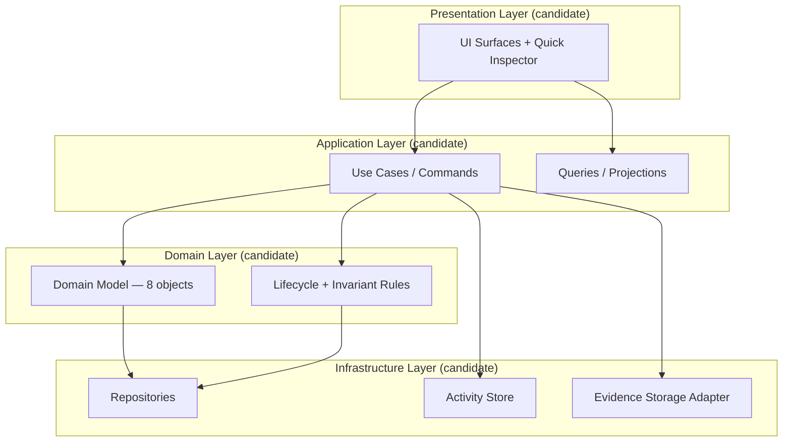
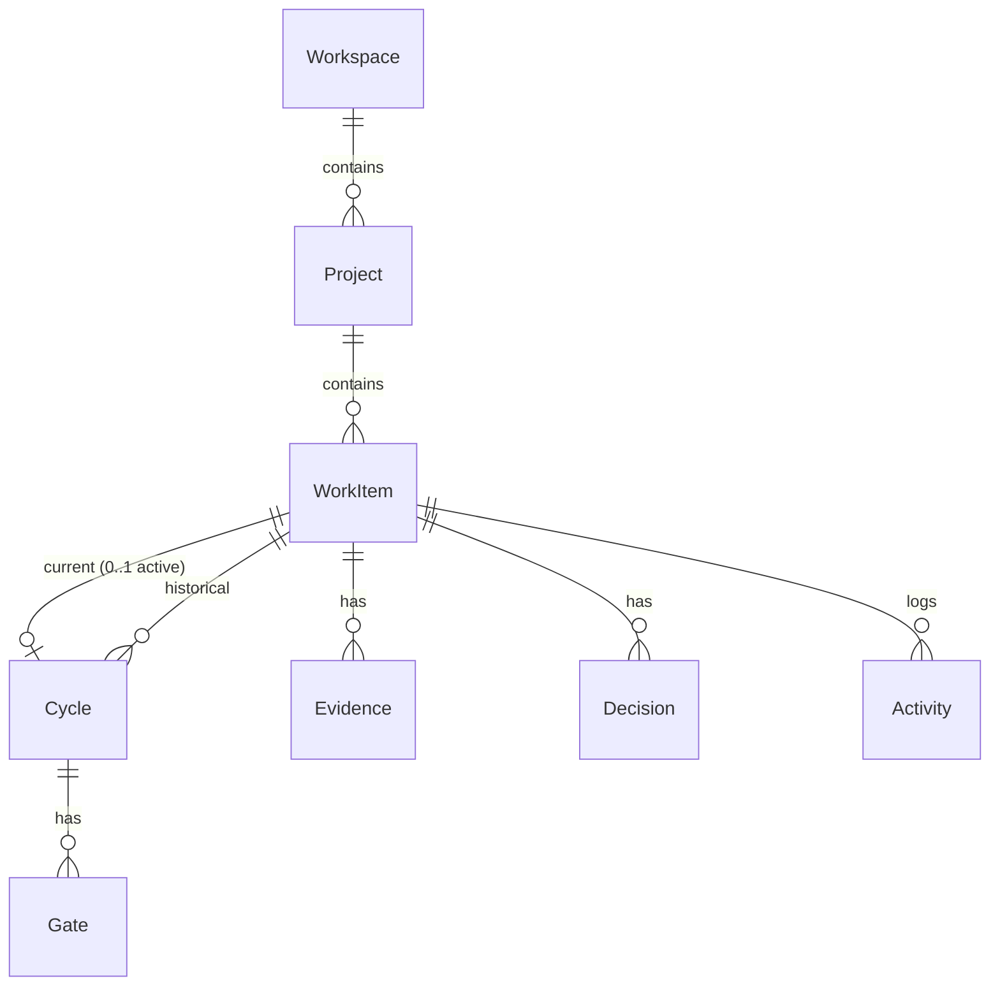

# SFIA Review Pack — FULL — Cycle 13 PR Readiness — SFIA Task Manager

**Timestamp (Europe/Paris):** 2026-08-23 23:36:58 CEST

**Cycle:** 13 — PR readiness

**Profile:** Standard

**Typologie:** DOC / VALIDATION / PR READINESS

**Nouveau cycle produit:** NO

**SFIA Studio Convergence:** N/A

**CKC:** cycle 13 — PR readiness — statut candidate — usage experimental cognitive guidance — autorité d'exécution NONE — fallback = carte synthétique + méthode cycles

## Exact Morris GO

GO MORRIS — OPEN TASK MANAGER PR READINESS — STANDARD — REVIEW COMPLETE LOCAL BRANCH AGAINST CURRENT ORIGIN/MAIN — NO PROJECT PUSH / PR / MERGE YET

## Local Git Truth Check

| Item | Value |
|------|-------|
| Repository | mcleland147/sfia-workspace |
| Branch | `project/sfia-task-manager-cycle-4-ux-ui` |
| HEAD | `c1a859e4e1d14e7dc03cbb8e1d8a811db3ce66c8` |
| origin/main | `3a3b1cf87ac5f6cfa17a1330bc6558559a9628ed` (unchanged vs known) |
| merge-base | `f850259768e2a4736dc8cce19cd062244a52d727` |
| Remote project branch | **ABSENT** |
| Project staged | **NONE** |
| Project working tree | **CLEAN** (temporaries only: `.cursor/mcp.json`, `.tmp-sfia-review/`) |
| Project files modified this cycle | **ZERO** |
| Project commits this cycle | **ZERO** |

Prior immutable handoffs:
- Regularization: `50cbb44c71115fa0ebe31a46b3b33806bf55030b`
- R-DOC-03: `b3330bfb43f9a491bf89d286a22d0bbfef8d5cd5`

## Branch history (origin/main..HEAD)

Exactement **3** commits:

```
92922648c92474e27b461dda0d93346644f9c928 docs(sfia-task-manager): record validated Cycle 4 UX/UI reference
eb78241e84306e28dc99c318ce0e55465b9b4775 docs(sfia-task-manager): record validated Cycle 5 technical architecture reference
c1a859e4e1d14e7dc03cbb8e1d8a811db3ce66c8 docs(sfia-task-manager): clarify Cycle 4 maturity snapshot
```

History scope: **PASS** (matches qualified scope; no extra/missing commits)

## Full PR diff — name-status

```
A	projects/sfia-task-manager/03-design/2026-08-20-figma-design-brief.md
A	projects/sfia-task-manager/03-design/2026-08-20-figma-review-checklist.md
A	projects/sfia-task-manager/03-design/2026-08-20-m1-ux-ui-contract.md
A	projects/sfia-task-manager/04-technical-architecture/2026-08-22-m1-technical-architecture.md
M	projects/sfia-task-manager/README.md
```

## Full PR diff — stat

```
 .../03-design/2026-08-20-figma-design-brief.md     | 320 ++++++++++++
 .../03-design/2026-08-20-figma-review-checklist.md | 138 +++++
 .../03-design/2026-08-20-m1-ux-ui-contract.md      | 344 +++++++++++++
 .../2026-08-22-m1-technical-architecture.md        | 558 +++++++++++++++++++++
 projects/sfia-task-manager/README.md               |  53 +-
 5 files changed, 1404 insertions(+), 9 deletions(-)
```

Candidate file count: **5** — exact expected set.

Unexpected files: **NONE**

Hidden cross-project scope: **NONE**

## Diff check

`git diff --check origin/main...HEAD` → **PASS** (exit 0)

## Main-side Task Manager drift

`git diff --name-status $BASE..origin/main -- projects/sfia-task-manager/` → **EMPTY**

Classification: **NONE**

## Mergeability (read-only)

Command: `git merge-tree --write-tree origin/main HEAD`

- Exit status: **0**
- Result tree object: `223ddbd42f70f41b7787605b2535c2cbad50ecbc`
- Conflicts: **NONE**
- Post-check HEAD unchanged: `c1a859e4e1d14e7dc03cbb8e1d8a811db3ce66c8`
- Post-check index empty / working tree project unchanged: **YES**

Mergeability: **PASS**

## Guardrails / hygiene

| Check | Result |
|-------|--------|
| No `.tmp-sfia-review` in PR diff | PASS |
| No `.cursor/mcp.json` in PR diff | PASS |
| No secrets/credentials | PASS (documentary Figma/GitHub URLs only) |
| No app code / CI / scripts / Studio | PASS |
| Documentation-only | PASS |
| Project push | **NO** |
| PR creation | **NO** |
| Merge | **NO** |

Guardrails: **PASS**

## Content / governance audit

### A. Cycle 4

| Check | Result |
|-------|--------|
| UX/UI VALIDATED BY MORRIS AS DESIGN REFERENCE | PASS |
| UX contract frozen as reference | PASS |
| Figma fileKey `2U8pJCYBMtGxaK0F0Ef1nO` | PASS |
| tokens final OPEN | PASS |
| accessibility target OPEN | PASS |
| FQ02–FQ05 OPEN | PASS |
| No delivery implied | PASS |

### B. R-DOC-03

| Check | Result |
|-------|--------|
| Heading `M1 maturity — snapshot at Cycle 4 freeze` | PASS |
| Architecture technique = `NOT EXECUTED AT CYCLE 4 FREEZE` | PASS |
| Not readable as current tech-arch state | PASS |
| R-DOC-03 | **CLOSED** |

### C. Cycle 5

| Check | Result |
|-------|--------|
| CANDIDATE REFERENCE VALIDATED BY MORRIS | PASS |
| NOT ADOPTED FOR IMPLEMENTATION | PASS |
| TD-01→TD-12 OPEN | PASS |
| No stack/persistence/auth adopted | PASS |
| Implementation NOT EXECUTED | PASS |

### D. Current project truth (README + docs)

| Item | Status |
|------|--------|
| Cycle 5 latest candidate reference | PASS |
| Cycle 4 prior design reference | PASS |
| M1 NOT READY | PASS |
| AC 0/16 | PASS |
| TD-01→TD-12 OPEN | PASS |
| No backlog / delivery / implementation | PASS |

### E. Historical vs current — stale wording analysis

| Occurrence | Classification | Notes |
|------------|----------------|-------|
| UX contract HISTORICAL STATE … Design validation Morris: NO | Historical explicit | Acceptable |
| Figma brief HISTORICAL STATE AT TIME OF REFINEMENT … NOT VALIDATED | Historical explicit | Acceptable |
| Tokens CANDIDATE — NOT VALIDATED DESIGN TOKEN | Current-state still exact | Acceptable |
| Cycle 4 validation « Not authorized … push / PR / merge » | Scoped to Cycle 4 validation GO | Acceptable |
| Architecture technique NOT EXECUTED AT CYCLE 4 FREEZE | Historical snapshot (R-DOC-03) | Acceptable |
| **README § Next step L80:** « Project integration requires a **distinct Morris GO for PR readiness / push**. » | **BLOCKING DOCUMENTARY STALENESS** | Presented as current Next step. This PR-readiness GO has already opened/executed Cycle 13. After Morris push+PR+merge, the sentence would remain on main as false current-truth. Must be updated in a targeted correction BEFORE project push. |
| **README R-DOC-02 L90:** « … pending PR readiness GO » | **BLOCKING DOCUMENTARY STALENESS** | Present-tense tracking claims PR readiness still pending; false after this cycle and misleading once merged. |

## Single-PR coherence

The 3 commits / 5 files form one coherent documentary integration of validated M1 Cycle 4 UX/UI design reference + Cycle 5 technical architecture candidate reference + R-DOC-03 historical clarification.

Granularity: proportional (Cycle 4 record → Cycle 5 record → R-DOC-03 clarification).

No parasite/out-of-scope commits.

Distinction design reference vs technical candidate reference: preserved.

No implementation content.

Single-PR coherence (content/history): **PASS**

However readiness is blocked by README current-truth staleness (not by PR split need).

## Réserves

### BLOCKING

1. **BLOCKING DOCUMENTARY STALENESS — README Next step (L80)**
   - Current: requires distinct Morris GO for PR readiness / push
   - Why blocking: current Next step becomes false/misleading once this readiness GO is complete and especially once merged
   - Recommended next micro-cycle: targeted README next-step rewrite (e.g. Morris PROJECT PUSH + PR AUTHORIZATION / post-integration next) — documentation-only — no history rewrite

2. **BLOCKING DOCUMENTARY STALENESS — README R-DOC-02 tracking note (L90)**
   - Current: pending PR readiness GO
   - Why blocking: PR readiness GO is no longer pending after this cycle
   - Recommended: close/update R-DOC-02 tracking wording in same targeted README correction

### NON-BLOCKING

NONE material beyond explicitly historical qualifications already marked HISTORICAL.

## Validation checklist (proportioned)

- [x] Cycle correctly routed (13 — PR readiness)
- [x] Type/profile explicit (DOC/VALIDATION/PR READINESS · Standard)
- [x] CKC candidate correctly qualified (experimental; authority NONE; fallback synthetic map + method)
- [x] Scope borné (5 Task Manager files only)
- [x] No forbidden files
- [x] Full diff reviewed
- [x] Git history reviewed (3 commits)
- [x] Mergeability controlled (PASS)
- [x] Documentation-only respected
- [x] No project remote actions
- [x] Réserves classified (2 BLOCKING)
- [x] Single readiness verdict

## Project mutation this cycle

| Item | Value |
|------|-------|
| Project files modified | **ZERO** |
| Project commits created | **ZERO** |
| Project branch push | **NO** |
| PR | **NO** |
| Merge | **NO** |
| Rebase/reset/amend/squash | **NO** |

## PR title draft (CANDIDATE ONLY — NOT CREATED)

```
docs(sfia-task-manager): integrate validated M1 design and technical architecture references
```

## PR body draft (CANDIDATE ONLY — NOT CREATED)

```markdown
## Summary

- Cycle 4 UX/UI design reference validated by Morris (contract + Figma brief + review checklist; fileKey `2U8pJCYBMtGxaK0F0Ef1nO`)
- Cycle 5 technical architecture candidate reference validated by Morris (not adopted for implementation; TD-01→TD-12 remain OPEN)
- R-DOC-03 historical maturity clarification (Cycle 4 freeze snapshot wording)

## Scope

- `projects/sfia-task-manager/README.md` (modified)
- `projects/sfia-task-manager/03-design/2026-08-20-m1-ux-ui-contract.md` (added)
- `projects/sfia-task-manager/03-design/2026-08-20-figma-design-brief.md` (added)
- `projects/sfia-task-manager/03-design/2026-08-20-figma-review-checklist.md` (added)
- `projects/sfia-task-manager/04-technical-architecture/2026-08-22-m1-technical-architecture.md` (added)

## Governance

- TD-01→TD-12 OPEN
- Technical architecture NOT adopted for implementation
- M1 NOT READY
- AC demonstrated 0/16
- No backlog execution
- No delivery
- No implementation

## Evidence

- Cycle 4 + Cycle 5 regularization handoff: `50cbb44c71115fa0ebe31a46b3b33806bf55030b`
- R-DOC-03 handoff: `b3330bfb43f9a491bf89d286a22d0bbfef8d5cd5`
- PR readiness handoff: <immutable SHA after publish>

## Validation

- Diff check: PASS
- Mergeability vs current origin/main: PASS
- Main-side Task Manager drift: NONE
- Documentary truth: BLOCKING README staleness identified in PR readiness (must be corrected before push)

## Explicit non-claims

- Not M1 READY
- Not implementation ready
- No technical stack adopted
- No backlog/delivery authorization
```

NOTE: Body draft retained for Morris decision context. **Do not create PR** while blocking README staleness remains.

## Readiness verdict

**NOT READY FOR PR**

Reason: two BLOCKING DOCUMENTARY STALENESS items in README current-truth sections that would be misleading once merged; correction required before project push. No project mutation performed in this cycle.

## Final verdict

**TASK MANAGER PR READINESS — NOT READY FOR PR — CORRECTION REQUIRED BEFORE PROJECT PUSH**

Not concluded: PR CREATED · INTEGRATED ON MAIN · MERGED · M1 READY · IMPLEMENTATION READY · BACKLOG AUTHORIZED · DELIVERY AUTHORIZED

## Next gate

**MORRIS TARGETED CORRECTION DECISION** — recommended micro-cycle: README-only update of § Next step + R-DOC-02 tracking note; then re-run Cycle 13 PR readiness (or delta readiness) before any project push/PR.

---

# APPENDIX A — FULL DIFF origin/main...HEAD

```diff
diff --git a/projects/sfia-task-manager/03-design/2026-08-20-figma-design-brief.md b/projects/sfia-task-manager/03-design/2026-08-20-figma-design-brief.md
new file mode 100644
index 00000000..8ddbe89b
--- /dev/null
+++ b/projects/sfia-task-manager/03-design/2026-08-20-figma-design-brief.md
@@ -0,0 +1,320 @@
+# SFIA Task Manager — Figma Design Brief
+
+**Chemin :** `projects/sfia-task-manager/03-design/2026-08-20-figma-design-brief.md`
+**Cycle :** Cycle 4 — UX/UI
+**Statut :** FIGMA DESIGN — VALIDATED BY MORRIS AS CYCLE 4 DESIGN REFERENCE
+**Validation Morris :** VALIDATED BY MORRIS AS CYCLE 4 DESIGN REFERENCE
+
+---
+
+## Morris GOs
+
+Cycle 4 :
+GO MORRIS — OPEN CYCLE 4 UX/UI — STANDARD — FIGMA DESIGN-FIRST — INCLUDE R-DOC-02 TRACKING CORRECTION — NO TECH ARCH / BACKLOG / DELIVERY
+
+Figma source :
+GO MORRIS — CREATE NEW FIGMA DESIGN FILE "SFIA Task Manager" IN CURRENT PRO TEAM — USE IT AS CYCLE 4 FIGMA SOURCE CANDIDATE — NO DESIGN VALIDATION IMPLIED
+
+Targeted refinement (2026-08-22) :
+GO MORRIS — CYCLE 4 TARGETED FIGMA REFINEMENT — PRESERVE CURRENT UX/UI CONTRACT AND FUNCTIONAL RULES — RAISE CORE AND CRITICAL FRAMES TO REPRESENTATIVE MEDIUM FIDELITY WITH REALISTIC CONTENT AND INTERACTION AFFORDANCES — NO NEW PRODUCT DECISION — NO TECH ARCH / BACKLOG / DELIVERY — NO PROJECT COMMIT / PUSH / PR
+
+Luminous visual refinement (2026-08-22) :
+GO MORRIS — « Je trouve l'interface un peu terne, rajoute un peu de couleur à tout ça. Que ce soit lumineux mais très lisible et fluide pour l'utilisateur. » — CYCLE 4 LUMINOUS VISUAL REFINEMENT — PRESERVE UX CONTRACT, CONTENT, LAYOUT AND FUNCTIONAL RULES — APPLY CONTROLLED COLOR AND READABILITY DIRECTION ONLY — NO NEW PRODUCT DECISION — NO TECH ARCH / BACKLOG / DELIVERY — NO PROJECT COMMIT / PUSH / PR
+
+Final visual polish (2026-08-22) :
+GO MORRIS — « ok go la dessus alors » — CYCLE 4 FINAL VISUAL POLISH — RHYTHM / DEPTH / ICONOGRAPHY / CRITICAL-STATE COMPOSITION — PRESERVE LUMINOUS DIRECTION, UX CONTRACT, CONTENT AND FUNCTIONAL RULES — NO NEW PRODUCT DECISION — NO TECH ARCH / BACKLOG / DELIVERY — NO PROJECT COMMIT / PUSH / PR
+
+Cycle 4 validation (current) :
+GO MORRIS — VALIDATE CYCLE 4 UX/UI DESIGN AS REFERENCE — FREEZE UX CONTRACT FOR NEXT AUTHORIZED STEPS — NO DELIVERY / NO TECH ARCH / NO BACKLOG IMPLIED
+
+## Source contract
+
+| Champ | Valeur |
+|-------|--------|
+| Name | SFIA Task Manager |
+| URL | https://www.figma.com/design/2U8pJCYBMtGxaK0F0Ef1nO |
+| fileKey | `2U8pJCYBMtGxaK0F0Ef1nO` |
+| Editor type | Figma Design |
+| Account (revalidated) | ludo_zaya / ludo_zaya@hotmail.fr |
+| Plan / seat (revalidated) | Pro / Full |
+| WRITE | YES (seat Full + file accessible) |
+| Source-of-truth status | **VALIDATED BY MORRIS AS CYCLE 4 DESIGN REFERENCE** |
+| Framing note | Historical OPEN fileKey superseded for Cycle 4 candidate source by explicit Morris GO |
+
+## Objectif visuel
+
+Matérialiser le contrat M1 en moyenne fidélité structurante : structure, hiérarchie, densité, états, actions, lisibilité.
+
+## Viewport / fidelity
+
+1440 × 1024 · desktop-first · **representative medium fidelity** (structural wireframes elevated with realistic content, states, and visual affordances — not pixel polish)
+
+## Pages
+
+| Page | Contenu |
+|------|---------|
+| M1 — Core Screens | Frames 01–05 |
+| M1 — Critical States | Frames 06–10 |
+
+## Frames 01–10
+
+| # | Name | Hierarchy focus | Mandatory content |
+|---|------|-----------------|-------------------|
+| 01 | Workboard | State + next action | 7 columns, cards, Quick Inspector |
+| 02 | Work Item | Next Action priority | Intent→History sections |
+| 03 | Cycle Workspace | Allowed vs control | Contract + Gates/Evidence/Exit |
+| 04 | Review & Decision | Evidence vs expected | Expected/Actual + verdicts |
+| 05 | Project | Aggregate state | Project intent + WI list |
+| 06 | Work Item / Blocked | Risk/blocker | reason/unblock/next_action |
+| 07 | Work Item / Cannot Ready | Missing fields | missing list + corrective |
+| 08 | Review / GO WITH RESERVE | Reserve path | reserve + follow-up |
+| 09 | Review / REPLAN | History preserved | reason + historical cycle + Q/R |
+| 10 | Empty Workspace | First action | empty + CTA |
+
+## Visual direction
+
+**Before luminous refinement:** professional but gray / subdued / visually flat — charcoal sidebar, uniform gray surfaces, limited chromatic hierarchy.
+
+**After luminous refinement (Morris direction):** luminous · fresh · controlled semantic color · high readability · visually fluid · professional control/decision tool — no rainbow UI · no gaming UI · no marketing dashboard · no glassmorphism excess.
+
+Principles retained: dense · control/decision · no Jira clone · no AI-first · semantic color · no critical info color-only · badges always include text.
+
+## Candidate tokens (NOT VALIDATED)
+
+All values below are **CANDIDATE — NOT VALIDATED DESIGN TOKEN**. Design tokens final = **OPEN**.
+
+| Token | Candidate value | Role |
+|-------|-----------------|------|
+| bg/app | #F6F9FD | Very light blue-tinted app background |
+| bg/surface | #FFFFFF | Primary cards / panels |
+| bg/surface-secondary | #F8FBFF | Secondary panels / column headers |
+| bg/surface-blue-tint | #EFF6FF | NEXT ACTION, QI, active accents |
+| bg/surface-cyan-tint | #ECFEFF | Exit Control, Actual Evidence |
+| bg/sidebar | #172554 | Deep navy sidebar (replaces charcoal #1F2933) |
+| text/primary | #0F172A | Headings / primary body |
+| text/secondary | #475569 | Labels / secondary body |
+| text/on-dark | #F8FAFC | Sidebar active / primary buttons |
+| text/nav-inactive | #CBD5E1 | Sidebar inactive nav |
+| border/neutral | #D7E1EC | Structural borders |
+| border/subtle | #E5EDF5 | Card / row separators |
+| accent/primary | #2563EB | Primary blue — CTA, NEXT ACTION label |
+| accent/primary-strong | #1D4ED8 | Hover / emphasis |
+| accent/azure | #0EA5E9 | QI border, Exit Control accent |
+| accent/cyan | #0891B2 | Ready / teal accents |
+| status/success | #059669 | Attached / Present / Done / GO |
+| status/success-soft | #ECFDF5 | Success tinted backgrounds |
+| status/warning | #D97706 | Pending / reserve / attention |
+| status/warning-soft | #FFFBEB | Warning tinted backgrounds |
+| status/danger | #DC2626 | Missing / Blocked / NO-GO |
+| status/danger-soft | #FEF2F2 | Danger tinted backgrounds |
+| status/info-violet | #7C3AED | Review / Decision / REPLAN (limited) |
+| status/info-violet-soft | #F5F3FF | Human Decision panel |
+| status/indigo | #4F46E5 | Qualified badge |
+| font/ui | Inter / system sans | Unchanged |
+| space/base | 8 / 12 / 16 / 24 | Unchanged |
+| radius/card | 8 / 10 | Unchanged |
+| shadow/structural | 0 1px 4px rgba(15,30,50,0.08) | Subtle only — no marketing SaaS shadow |
+
+## Semantic status mapping (candidate)
+
+| Status / state | Color family | Application |
+|----------------|--------------|-------------|
+| In Progress | blue / blue-tint | Badge + column rhythm |
+| Ready | cyan / blue-light | Badge |
+| Qualified | indigo / neutral-blue | Badge |
+| Review | violet / blue-purple (moderate) | Badge + review cards |
+| Done | green | Badge + Done column accent |
+| Pending | amber | Gate / pending badges |
+| Blocked / Missing | red or amber by severity | Banner, badge, row tint |
+| Decision | blue/violet controlled | Human Decision panel |
+| GO | green outline/tint when available | Verdict button |
+| GO WITH RESERVE | amber soft | Verdict + frame 08 |
+| REPLAN | blue/violet controlled | Verdict + frame 09 |
+| NO-GO | red soft | Verdict button |
+| Attached / Present | green soft + text | Evidence rows |
+| Missing | red soft + text | Evidence / checklist rows |
+
+## Accessibility candidate guardrails
+
+Target contractuel OPEN. Apply: non color-only critical info, readable contrast, explicit labels, explained disabled, keyboard/focus as candidates.
+
+## Forbidden interpretations
+
+No tech arch · no stack · no backlog · no delivery · no 6th business surface · no Blocked lifecycle column · no silent disabled · no AI-central UI · no design validation claim
+
+## Open Morris decisions
+
+Accessibility target · design tokens final · branding · FQ02–FQ05 · visual validation of this candidate
+
+## Production registry (post targeted refinement — 2026-08-22)
+
+Pages:
+- M1 — Core Screens — pageId `0:1`
+- M1 — Critical States — pageId `3:2`
+
+Quick Inspector (Workboard transversal): nodeId `13:91` (child of `01 — Workboard` / `13:2`)
+
+| Frame | Node ID | W×H | Screenshot MCP |
+|-------|---------|-----|----------------|
+| 01 Workboard | `13:2` | 1440×1024 | YES |
+| 02 Work Item | `13:114` | 1440×1024 | YES |
+| 03 Cycle Workspace | `14:2` | 1440×1024 | YES |
+| 04 Review & Decision | `14:106` | 1440×1024 | YES |
+| 05 Project | `14:184` | 1440×1024 | YES |
+| 06 Blocked | `16:2` | 1440×1024 | YES |
+| 07 Cannot Ready | `16:27` | 1440×1024 | YES |
+| 08 GO WITH RESERVE | `16:74` | 1440×1024 | YES |
+| 09 REPLAN | `16:96` | 1440×1024 | YES |
+| 10 Empty Workspace | `16:119` | 1440×1024 | YES |
+
+Frames present: **10/10**
+
+Prior registry (pre-refinement handoff `03bbac31`): node IDs `4:2`…`5:222` — superseded by rebuild preserving same frame names and contract scope.
+
+## Representative scenario (cross-screen)
+
+| Entity | Value |
+|--------|-------|
+| Project | Alpha |
+| Primary WI | WI-104 — Prepare authentication evidence |
+| Profile | Standard |
+| Lifecycle (WI-104) | In Progress |
+| Cycle (WI-104) | C-12 |
+| Gate | Review pack — Pending |
+| Evidence | E-1 validation note (attached), E-2 screenshot (attached), Git reference (missing) |
+| Next action (WI-104) | Attach missing Git reference |
+| Blocked WI | WI-099 — Qualified + Blocked (D-17 vendor API) |
+| Cannot Ready WI | WI-077 — missing Profile/Out of scope/Guardrails/Exit proof |
+
+## Targeted refinement — before vs after (content/fidelity)
+
+| Frame | Prior issue (ChatGPT review) | After refinement |
+|-------|------------------------------|------------------|
+| 01 Workboard | Sparse cards, thin QI | Multiple realistic cards across columns; QI panel with identity, badges, Open actions |
+| 02 Work Item | Placeholder section text | Real Intent→History content; evidence sidebar; Edit/Attach/Open affordances |
+| 03 Cycle Workspace | Abstract bullet lists | Label/value/status blocks; gate pending reason; evidence rows with Attach |
+| 04 Review & Decision | Already strong | Structured evidence rows; validation results; GO disabled reason adjacent |
+| 05 Project | Simple list | Intent + operational table (state/blocked/cycle/gate/next); summary badges |
+| 06 Blocked | Rule shown, thin UX | BLOCKED banner; dependency; unblock condition; Resolve action |
+| 07 Cannot Ready | Missing fields listed | Checklist with Present/Missing badges; Mark Ready disabled + reason |
+| 08 GO WITH RESERVE | Reserve path thin | Decision panel with reserve, follow-up WI-095, author/date note |
+| 09 REPLAN | History rule stated | Historical cycle, preserved evidence, NOT CREATED YET for new cycle |
+| 10 Empty Workspace | Adequate | Light polish — dual CTA Create Project / Capture Work Item |
+
+## Luminous visual refinement — before vs after (2026-08-22)
+
+| Frame | Before (gray/subdued) | After (luminous/controlled color) |
+|-------|----------------------|-----------------------------------|
+| 01 Workboard | Charcoal sidebar, flat gray canvas, low-contrast cards | Navy sidebar `#172554`; blue-tint app bg; column headers tinted; active/blocked card accents; QI `#EFF6FF` + azure border |
+| 02 Work Item | Uniform gray sections | White section cards + subtle blue borders; NEXT ACTION blue tint + primary border; semantic Exit Proof rows (green/red/amber) |
+| 03 Cycle Workspace | Flat two-column split | Execution Contract neutral cool `#F8FBFF`; Exit Control cyan tint + azure 2px border; gate/evidence semantic colors |
+| 04 Review & Decision | Muted panels | Expected Exit Proof blue-neutral; Actual Evidence cyan tint; Human Decision violet soft; 4 verdicts outline/tint (not saturated permanent buttons) |
+| 05 Project | Gray table | Status chips semantic; WI-104 row blue highlight; primary Next Action CTA |
+| 06 Blocked | Thin warning | Amber soft BLOCKED banner + visible border; corrective CTA primary blue |
+| 07 Cannot Ready | Flat checklist | Missing=red soft / Present=green soft rows; disabled Mark Ready readable |
+| 08 GO WITH RESERVE | Thin reserve panel | Amber/gold soft dominant; reserve + follow-up legible |
+| 09 REPLAN | Neutral history | Violet soft REPLAN panel; historical info neutral; NOT CREATED amber |
+| 10 Empty Workspace | Adequate but flat | Brightest screen — white card on blue tint; primary Create Project blue |
+
+Placeholders remaining: **NONE** (no “Functional fields from validated contract” generic text)
+
+## Visual affordances introduced (VISUAL CANDIDATES — not new M1 behaviors)
+
+Open Work Item · Open Cycle · Attach evidence · Edit qualification/scope · View history · Resolve dependency · Mark Ready (disabled + reason) · Complete missing fields · Record/view Decision · Update scope · Create Project · Capture Work Item
+
+All affordances map to existing contract surfaces/actions or explanatory UI only. No new product rule introduced.
+
+## Visual contract extracted (from produced Figma)
+
+Common shell (all frames):
+- Layout: HORIZONTAL Auto Layout
+- Sidebar 220 × 1024 (deep navy `#172554` candidate) + Main 1220 × 1024
+- App background: `#F6F9FD` · Main padding: 28 / 28 / 24 / 24 · gap 16
+- Typography: Inter Regular / Semi Bold / Bold (candidate) — improved title/body contrast; secondary text `#475569` (not too pale)
+- NEXT ACTION banner: `#EFF6FF` fill + `#2563EB` border + blue label + primary CTA (not color-only)
+- Sidebar active nav: primary blue fill + white text + optional azure stroke
+- Structural shadow: subtle 1px drop only on cards/panels (not decorative float)
+
+Per-frame notes:
+| Frame | Layout principal | Zones / actions | Disabled / empty |
+|-------|------------------|-----------------|------------------|
+| 01 | 7 lifecycle columns + QI panel | Cards: title/project/profile/gate/next; QI transversal | N/A |
+| 02 | Vertical sections stack | Next Action stroke-emphasis | N/A |
+| 03 | Two-zone split 560+560 | Execution Contract vs Exit control | N/A |
+| 04 | Expected vs Actual + verdict row | GO / GO WITH RESERVE / REPLAN / NO-GO | GO reason text when incomplete |
+| 05 | Aggregated WI rows | Blocked indicator text on WI-099 | N/A |
+| 06 | Work Item variant | Lifecycle + Blocked=true + reason + unblock | Orthogonal blocked |
+| 07 | Work Item variant | Missing fields list + corrective | Ready unavailable explained |
+| 08 | Review variant | Reserve + follow-up + author/date | N/A |
+| 09 | Review variant | Historical cycle + conserved evidence | Not a reset |
+| 10 | Empty state center | Minimal copy + Create Project CTA | Empty explained |
+
+Uncertainty: denser production content vs pixel polish intentionally deferred (medium fidelity). No functional rule invented beyond validated M1 contract.
+
+## Final visual polish — before vs after (2026-08-22)
+
+| Aspect | BEFORE (post-luminous) | AFTER (final polish) |
+|--------|------------------------|----------------------|
+| Composition | luminous/readable but visually static in parts | more rhythmic, less top-left isolated content |
+| Depth | limited surface hierarchy | 3-level depth: app bg / white surfaces / elevated tinted panels |
+| Iconography | minimal | light line-style icons (14px) — always icon + text |
+| Headers (02–05) | functional but flat | elevated headers with shadow, padding, section identity |
+| Critical states 06–09 | small isolated cards in large canvas | composed panels ~780px, structured sections |
+| REPLAN (09) | text list only | trajectory line C-12 → Historical → Ready → Next Action |
+| GO WITH RESERVE (08) | single amber card | structured Reserve / Follow-up / Human Decision blocks |
+| Quick Inspector | layout-fixed, flat | subtle L2 shadow elevation preserved layout |
+
+## Iconography candidate (NOT VALIDATED)
+
+| Category | Symbol candidate | Usage |
+|----------|------------------|-------|
+| NEXT ACTION | → | banners, CTAs |
+| STATE | ◉ | headers, state markers |
+| EVIDENCE | ◧ | Expected/Actual panels, rows |
+| DECISION | ◉ | Human Decision, verdict context |
+| HISTORY | ◷ | history sections |
+| SCOPE | ⊞ | Scope sections |
+| GUARDRAIL | ⛨ | Guardrails sections |
+| BLOCKED | ⚠ | blocked banner |
+| SUCCESS | ✓ | attached/present/GO |
+| MISSING | ✕ | missing evidence/fields |
+| REPLAN | ↻ | REPLAN trajectory |
+| CYCLE | ↻ | cycle context |
+
+All icons paired with text labels — no icon-only critical information.
+
+## Depth hierarchy candidate (NOT VALIDATED)
+
+| Level | Surface | Treatment |
+|-------|---------|-----------|
+| L0 | App background `#F6F9FD` | flat |
+| L1 | Cards/panels white `#FFFFFF` | subtle border `#E5EDF5` |
+| L2 | Focused/actionable panels | tinted bg + accent border + shadow `0 2px 8px rgba(15,23,42,0.05–0.08)` |
+
+## Information signatures (5 categories)
+
+| Category | Visual signature |
+|----------|------------------|
+| STATE | badge + status marker icon |
+| NEXT ACTION | blue/azure tint panel + → icon + primary CTA |
+| EVIDENCE | ◧ icon + tinted panel + semantic row colors |
+| DECISION | violet tint elevated panel + ◉ icon |
+| HISTORY | ◷ icon + secondary neutral panel |
+
+## Critical-state composition refinements
+
+| Frame | Composition applied |
+|-------|---------------------|
+| 06 Blocked | State banner (⚠) + blocking context panel + Next Action — ~780px composed width |
+| 07 Cannot Ready | State header + readiness checklist with ✓/✕ per field + recovery CTA |
+| 08 GO WITH RESERVE | Decision header + Reserve / Follow-up / Human Decision structured blocks |
+| 09 REPLAN | Trajectory line + preserved evidence note + NOT CREATED YET amber signal |
+
+## MCP limitations
+
+- `use_figma`: one `setCurrentPageAsync` per call — Core and Critical built in separate invocations.
+- Screenshot URLs from `get_screenshot` are short-lived MCP asset URLs (not durable repo artifacts).
+- File display name via API may show as Document; URL/fileKey remain authoritative.
+- No design-system library import used (from-scratch candidate patterns).
+- **HISTORICAL STATE AT TIME OF REFINEMENT :** Validation status was NOT VALIDATED BY MORRIS during candidate production.
+- **Current status :** VALIDATED BY MORRIS AS CYCLE 4 DESIGN REFERENCE — tokens/branding/WCAG/runtime remain NOT VALIDATED.
diff --git a/projects/sfia-task-manager/03-design/2026-08-20-figma-review-checklist.md b/projects/sfia-task-manager/03-design/2026-08-20-figma-review-checklist.md
new file mode 100644
index 00000000..6ba2e4cd
--- /dev/null
+++ b/projects/sfia-task-manager/03-design/2026-08-20-figma-review-checklist.md
@@ -0,0 +1,138 @@
+# SFIA Task Manager — Figma Review Checklist (Morris)
+
+**Chemin :** `projects/sfia-task-manager/03-design/2026-08-20-figma-review-checklist.md`
+**Cycle :** Cycle 4 — UX/UI
+**Source Figma :** https://www.figma.com/design/2U8pJCYBMtGxaK0F0Ef1nO (`2U8pJCYBMtGxaK0F0Ef1nO`)
+**Statut :** CHECKLIST FOR MORRIS REVIEW — CYCLE 4 DESIGN REFERENCE VALIDATED
+
+Columns for Morris use: Criterion | Status | Evidence / node | Morris comment | Decision
+
+---
+
+## A. Global
+
+| Criterion | Status | Evidence / node | Morris comment | Decision |
+|-----------|--------|-----------------|----------------|----------|
+| 1440×1024 respected | | 01–10 all 1440×1024 (`13:2`…`16:119`) | | |
+| 5 surfaces present | | 01–05 on page `0:1` | | |
+| Quick Inspector transversal (not 6th domain) | | `13:91` inside `13:2` | | |
+| 5 critical states present | | 06–10 on page `3:2` | | |
+| Sobre / professionnel / dense | | screenshots MCP YES 01–10 | | |
+| Luminous / readable (Morris direction) | | blue-tint bg `#F6F9FD`, improved contrast, not gray-flat | | |
+| Controlled semantic color palette | | blue/azure dominant + cyan/teal + green/amber/red/violet limited | | |
+| No excessive saturation / no rainbow UI | | outline/tint verdicts; no full-sat column backgrounds | | |
+| No color-only critical information | | badges with text; borders + labels alongside color | | |
+| Consistent palette across 01–10 | | same candidate tokens applied globally | | |
+| Control / decision oriented | | frames 03–04, 08–09 | | |
+| No Jira clone | | no subtasks/comments/metadata chrome | | |
+| No AI-first | | no AI assistant surface | | |
+| Hierarchy State → Next Action → Risk → Evidence → Decision → History | | NEXT ACTION banners + sections | | |
+
+## B. Hierarchy / information
+
+| Criterion | Status | Evidence / node | Morris comment | Decision |
+|-----------|--------|-----------------|----------------|----------|
+| State visible first | | column headers / lifecycle labels | | |
+| Next Action prominent | | accent NEXT ACTION banners | | |
+| Risk/blocker explicit when present | | `5:113`, WI-099 blocked labels | | |
+| Evidence visible where required | | `5:39`, `5:2` control zone | | |
+| Decision human-only | | verdict row + disabled reason text | | |
+| History reconstructible | | History section / REPLAN conserved | | |
+
+## C. Per-frame (01–10)
+
+For each frame: structure correct · mandatory content · primary actions · disabled reasons · no invented business rule · no critical info color-only
+
+| Frame | Structure | Mandatory content | Primary actions | Disabled reasons | No invented rules | No color-only critical | Evidence / node | Morris comment | Decision |
+|-------|-----------|-------------------|-----------------|------------------|-------------------|------------------------|-----------------|----------------|----------|
+| 01 Workboard | | | | | | | `13:2` (+ QI `13:91`) | | |
+| 02 Work Item | | | | | | | `13:114` | | |
+| 03 Cycle Workspace | | | | | | | `14:2` | | |
+| 04 Review & Decision | | | | | | | `14:106` | | |
+| 05 Project | | | | | | | `14:184` | | |
+| 06 Blocked | | | | | | | `16:2` | | |
+| 07 Cannot Ready | | | | | | | `16:27` | | |
+| 08 GO WITH RESERVE | | | | | | | `16:74` | | |
+| 09 REPLAN | | | | | | | `16:96` | | |
+| 10 Empty Workspace | | | | | | | `16:119` | | |
+
+## D. Critical variants
+
+| Criterion | Status | Evidence / node | Morris comment | Decision |
+|-----------|--------|-----------------|----------------|----------|
+| Blocked orthogonal (not lifecycle column) | | `16:2` | | |
+| Cannot Ready explanatory (not silent grey) | | `16:27` | | |
+| GO WITH RESERVE shows reserve + follow-up | | `16:74` | | |
+| REPLAN preserves history / Cycle historical | | `16:96` | | |
+| Empty Workspace clear first action | | `16:119` | | |
+
+## E. Governance
+
+| Criterion | Status | Evidence / node | Morris comment | Decision |
+|-----------|--------|-----------------|----------------|----------|
+| Figma candidate only (not validated) | | | | |
+| Tokens candidate only | | | | |
+| Accessibility target OPEN | | | | |
+| FQ02–FQ05 OPEN | | | | |
+| No tech arch | | | | |
+| No backlog | | | | |
+| No delivery | | | | |
+| M1 NOT READY | | | | |
+| AC demonstrated 0/16 | | | | |
+| No project commit implied | | | | |
+
+## F. Luminous visual refinement (Morris 2026-08-22)
+
+| Criterion | Status | Evidence / node | Morris comment | Decision |
+|-----------|--------|-----------------|----------------|----------|
+| Perceptibly more luminous than prior gray candidate | | app bg `#F6F9FD`, white cards, navy sidebar | | |
+| NEXT ACTION visually primary | | blue tint banners all frames | | |
+| Human Decision explicit on 04 | | violet soft panel `14:106` | | |
+| 4 verdicts visible on 04 (not 4 saturated permanent buttons) | | GO / GO WITH RESERVE / REPLAN / NO-GO outline+tint | | |
+| Sidebar brighter (navy not charcoal) | | `#172554` all frames | | |
+| Status badges semantic + text | | In Progress/Ready/Done/etc. | | |
+| Layout non-regression (02/03/04) | | overflow 0 on `13:114`, `14:2`, `14:106` | | |
+
+## G. Final visual polish (Morris 2026-08-22)
+
+| Criterion | Status | Evidence / node | Morris comment | Decision |
+|-----------|--------|-----------------|----------------|----------|
+| Visual rhythm improved vs luminous-only | | composed panels, headers, card rails | | |
+| Light iconography coherent (icon + text) | | → ◧ ◉ ✓ ✕ ⚠ ↻ across frames | | |
+| Depth hierarchy consistent (L0/L1/L2) | | shadows on headers, QI, critical panels | | |
+| Information signatures distinguishable | | STATE/NEXT ACTION/EVIDENCE/DECISION/HISTORY | | |
+| Critical states 06–09 more composed | | ~780px panels, not isolated top-left cards | | |
+| REPLAN trajectory readable | | `16:96` trajectory line | | |
+| GO WITH RESERVE composition readable | | `16:74` structured blocks | | |
+| Quick Inspector layout non-regression | | `13:92` width 1132, no clipping | | |
+| No clipping / no overflow | | 0 violations all 10 frames | | |
+| No icon-only critical information | | all icons paired with text | | |
+
+## H. Morris decision record
+
+| Decision | Result | Date | Notes |
+|----------|--------|------|-------|
+| Visual accept / revise / reject | **ACCEPT AS DESIGN REFERENCE** | 2026-08-23 | GO MORRIS — VALIDATE CYCLE 4 UX/UI DESIGN AS REFERENCE — FREEZE UX CONTRACT FOR NEXT AUTHORIZED STEPS — NO DELIVERY / NO TECH ARCH / NO BACKLOG IMPLIED |
+| Token promotion | OPEN | | Remains OPEN unless Morris decides |
+| Accessibility target | OPEN | | Remains OPEN unless Morris decides |
+| Project commit authorization | Separate GO | | Local regularization authorized separately; push/PR/merge NOT authorized by Cycle 4 validation |
+
+## I. Final Cycle 4 review outcome
+
+**MORRIS VISUAL / UX REVIEW — COMPLETED**
+
+**CYCLE 4 DESIGN REFERENCE — VALIDATED**
+
+Exact GO:
+
+GO MORRIS — VALIDATE CYCLE 4 UX/UI DESIGN AS REFERENCE — FREEZE UX CONTRACT FOR NEXT AUTHORIZED STEPS — NO DELIVERY / NO TECH ARCH / NO BACKLOG IMPLIED
+
+| Item | Status |
+|------|--------|
+| Runtime comparison | **NOT EXECUTED / N/A** |
+| Delivery | **NOT EXECUTED** |
+| Design tokens final | **OPEN** |
+| Branding final | **OPEN** |
+| Accessibility / WCAG declared | **OPEN** |
+| M1 | **NOT READY** |
+| AC demonstrated | **0/16** |
diff --git a/projects/sfia-task-manager/03-design/2026-08-20-m1-ux-ui-contract.md b/projects/sfia-task-manager/03-design/2026-08-20-m1-ux-ui-contract.md
new file mode 100644
index 00000000..a343e32d
--- /dev/null
+++ b/projects/sfia-task-manager/03-design/2026-08-20-m1-ux-ui-contract.md
@@ -0,0 +1,344 @@
+# SFIA Task Manager — M1 UX/UI Contract
+
+**Projet :** SFIA Task Manager
+**Chemin :** `projects/sfia-task-manager/03-design/2026-08-20-m1-ux-ui-contract.md`
+**Cycle :** Cycle 4 — UX/UI
+**Profil :** Standard
+**Typologie :** DOC / DESIGN
+**Baseline process :** SFIA v2.6
+**Viewport cible :** desktop-first 1440 × 1024
+**Fidélité :** representative medium fidelity (targeted refinement applied 2026-08-22)
+**Statut :** UX/UI CONTRACT — VALIDATED BY MORRIS AS CYCLE 4 DESIGN REFERENCE
+
+---
+
+## 1. Purpose / authority
+
+Transformer le contrat fonctionnel M1 validé et l'architecture fonctionnelle validée en expérience visuelle et interactionnelle explicite — sans modifier le modèle métier, le lifecycle ou les décisions humaines.
+
+## 2. Exact Morris Cycle 4 GO
+
+GO MORRIS — OPEN CYCLE 4 UX/UI — STANDARD — FIGMA DESIGN-FIRST — INCLUDE R-DOC-02 TRACKING CORRECTION — NO TECH ARCH / BACKLOG / DELIVERY
+
+## 3. Exact Morris Figma source GO
+
+GO MORRIS — CREATE NEW FIGMA DESIGN FILE "SFIA Task Manager" IN CURRENT PRO TEAM — USE IT AS CYCLE 4 FIGMA SOURCE CANDIDATE — NO DESIGN VALIDATION IMPLIED
+
+## 3b. Morris luminous visual direction (2026-08-22)
+
+GO MORRIS — « Je trouve l'interface un peu terne, rajoute un peu de couleur à tout ça. Que ce soit lumineux mais très lisible et fluide pour l'utilisateur. »
+
+Scope: visual direction only — luminosity, controlled semantic color, readability, visual fluidity. No functional redesign, no new navigation, no new product rules, no lifecycle/content changes.
+
+Applied in Figma candidate (all 10 frames). Palette and tokens remain **CANDIDATE — NOT VALIDATED DESIGN TOKEN**.
+
+**HISTORICAL STATE AT TIME OF REFINEMENT :** Design validation Morris: **NO** (refinement pass — validation deferred).
+
+## 3c. Morris final visual polish (2026-08-22)
+
+GO MORRIS — « ok go la dessus alors » — validates ChatGPT-proposed refinement direction: rhythm, depth, iconography, information signatures, header enrichment, critical-state composition (06–09), dynamism without product rule changes.
+
+Scope: visual polish only. Luminous palette preserved. No functional redesign. No new interactions.
+
+**HISTORICAL STATE AT TIME OF REFINEMENT :** Design validation Morris: **NO** (polish pass — validation deferred).
+
+| Élément | Valeur |
+|---------|--------|
+| Figma file | SFIA Task Manager |
+| URL | https://www.figma.com/design/2U8pJCYBMtGxaK0F0Ef1nO |
+| fileKey | `2U8pJCYBMtGxaK0F0Ef1nO` |
+| Source status (current) | **VALIDATED BY MORRIS AS CYCLE 4 DESIGN REFERENCE** |
+| Design validation Morris (current) | **YES — AS REFERENCE** |
+
+Historical framing decision « Référence/fileKey Figma = OPEN » is **HISTORICAL OPEN DECISION SUPERSEDED FOR CYCLE 4 CANDIDATE SOURCE BY EXPLICIT MORRIS GO**. Framing file itself is not modified.
+
+## 3d. Morris Cycle 4 Validation Decision
+
+GO MORRIS — VALIDATE CYCLE 4 UX/UI DESIGN AS REFERENCE — FREEZE UX CONTRACT FOR NEXT AUTHORIZED STEPS — NO DELIVERY / NO TECH ARCH / NO BACKLOG IMPLIED
+
+| Élément | Valeur |
+|---------|--------|
+| UX contract | **FROZEN AS REFERENCE** for next authorized steps |
+| Figma fileKey (Cycle 4 design reference) | `2U8pJCYBMtGxaK0F0Ef1nO` |
+| Delivery authorized by this validation | **NO** |
+| Tech arch implied | **NO** (Cycle 5 separate) |
+| Backlog implied | **NO** |
+| M1 | **NOT READY** |
+| AC demonstrated | **0/16** |
+| Design tokens final | **OPEN** |
+| Accessibility target | **OPEN** |
+| FQ02–FQ05 | **OPEN** |
+
+## 4. Sources / precedence
+
+1. Git main courant
+2. Décisions Morris explicites (Cycle 4 GO + Figma source GO + FQ01 / architecture)
+3. Spec fonctionnelle Cycle 2 validée
+4. Architecture fonctionnelle Cycle 3 validée
+5. Framing historique (baseline ; formulations obsolètes n'écrasent pas les décisions Morris postérieures)
+6. Guidance CKC candidate (sans autorité d'exécution)
+
+## 5. M1 maturity — snapshot at Cycle 4 freeze
+
+| Élément | Valeur |
+|---------|--------|
+| M1 | **NOT READY** |
+| AC demonstrated | **0/16** |
+| Architecture technique | NOT EXECUTED AT CYCLE 4 FREEZE |
+| Backlog | NOT EXECUTED |
+| Delivery/code | NOT EXECUTED |
+| Design Morris validation | **YES — AS CYCLE 4 DESIGN REFERENCE** |
+
+## 6. UX principles
+
+| ID | Principe |
+|----|----------|
+| UX-P1 | Répondre immédiatement : où / pourquoi / bloque / next action / preuve / décision |
+| UX-P2 | Hiérarchie State → Next action → Risk/blocker → Evidence → Decision → History |
+| UX-P3 | Sobre, professionnelle, dense, orientée contrôle |
+| UX-P4 | Pas clone Jira ; pas interface AI futuriste ; IA non centrale |
+| UX-P5 | Couleur sémantique ; information critique jamais couleur-only |
+| UX-P6 | Surfaces = projections ; pas sources de vérité métier distinctes |
+| UX-P7 | Action indisponible = reason visible (pas silent disable) |
+| UX-P8 | Blocked orthogonal au lifecycle |
+| UX-P9 | Human Decision jamais automatisée |
+| UX-P10 | Desktop-first 1440×1024 ; moyenne fidélité structurante |
+
+## 7. Information hierarchy
+
+State → Next action → Risk / blocker → Evidence → Decision → History
+
+## 8. Navigation model
+
+| Zone | Rôle |
+|------|------|
+| Primary nav | Workboard / Work Item / Cycle Workspace / Review & Decision / Project |
+| Contextual | Quick Inspector (Workboard transversal) |
+| No | secondary analytics nav, AI chat dock, configurable Jira-like workflow |
+
+## 9. Screen map
+
+| # | Frame | Page Figma |
+|---|-------|------------|
+| 01 | Workboard | M1 — Core Screens |
+| 02 | Work Item | M1 — Core Screens |
+| 03 | Cycle Workspace | M1 — Core Screens |
+| 04 | Review & Decision | M1 — Core Screens |
+| 05 | Project | M1 — Core Screens |
+| 06 | Work Item / Blocked | M1 — Critical States |
+| 07 | Work Item / Cannot Ready | M1 — Critical States |
+| 08 | Review / GO WITH RESERVE | M1 — Critical States |
+| 09 | Review / REPLAN | M1 — Critical States |
+| 10 | Empty Workspace | M1 — Critical States |
+
+## 10. Surface responsibility matrix
+
+| Surface | Objectif | Affiche | Actions | Ne possède PAS |
+|---------|----------|---------|---------|----------------|
+| Workboard | Lecture kanban + next action | WI cards, columns, Blocked flag | create WI, open WI, inspect | Decision verdict, Cycle contract |
+| Work Item | Qualification / détail | Intent→History | qualify, ready prep, block/unblock | Auto-decision |
+| Cycle Workspace | Exécution bornée | Contract vs control | progress, attach evidence, gates | Done verdict |
+| Review & Decision | Preuve vs expected + verdict | Expected vs Actual | GO / GO WITH RESERVE / REPLAN / NO-GO | Create Project |
+| Project | Agrégation | Project intent + WI list | open WI, create WI | Cycle internals |
+| Quick Inspector | Aperçu transversal Workboard | title, objective, status, next_action, blocked, cycle, gate | navigation only | Source de vérité ; 6e domaine |
+
+## 11. Workboard specification
+
+Colonnes : Inbox · Qualified · Ready · In Progress · Review · Decision · Done
+
+Carte minimale : title, project, SFIA profile, blocked indicator si applicable, next_action, current gate si applicable.
+
+Pas de badge status redondant si la colonne suffit.
+
+Quick Inspector : panneau transversal ; projection uniquement.
+
+## 12. Work Item specification
+
+Sections : Intent, Qualification, Scope, Dependencies, Guardrails, Exit Proof, Current Cycle, Next Action, History.
+
+Next Action prioritaire.
+
+Interdit : comments/subtasks Jira-like, AI assistant central.
+
+## 13. Cycle Workspace specification
+
+Zone principale — Execution Contract : objective, cycle_type, profile, scope, out_of_scope, guardrails, allowed/forbidden files.
+
+Zone contrôle — Gates, Stop Conditions, Exit Proof, Evidence, review pack status, git refs informationnels.
+
+Lecture : autorisé vs contrôle de sortie.
+
+## 14. Review & Decision specification
+
+Comparaison explicite Expected exit proof vs Actual evidence.
+
+Aussi : validation results, reservations, guardrail violations, review pack status, Git refs, human decision.
+
+Verdicts : GO · GO WITH RESERVE · REPLAN · NO-GO.
+
+Action indisponible = reason visible.
+
+## 15. Project specification
+
+Intention Project, Work Items, états, blocked indicators, next actions, current Cycles utiles.
+
+Interdit : advanced analytics, reporting complexe, workflow configurable.
+
+## 16. Quick Inspector specification
+
+Transversal Workboard. Affiche : title, objective court, status, next_action, blocked/reason, current Cycle, current Gate.
+
+Ne possède aucun état métier.
+
+## 17. Critical states matrix
+
+| Frame | Base | Différenciateur |
+|-------|------|-----------------|
+| 06 Blocked | Work Item | flag Blocked + reason + unblock + next_action ; lifecycle inchangé |
+| 07 Cannot Ready | Work Item Qualified | Ready indisponible + champs manquants + corrective |
+| 08 GO WITH RESERVE | Review | reserve + follow-up + Decision |
+| 09 REPLAN | Review | reason + Cycle historical + retour Q/R + history preserved |
+| 10 Empty | Workspace | empty state + first action |
+
+## 18. Blocked UX
+
+Lifecycle state courant visible.
+Blocked = true + reason + unblock condition + next_action.
+Pas de colonne/status Blocked.
+
+## 19. Cannot Ready UX
+
+Ready indisponible avec liste des préconditions manquantes (profile, in_scope, out_of_scope, dependencies, guardrails, exit_proof) + action corrective.
+Pas de bouton grisé silencieux.
+
+## 20. GO WITH RESERVE UX
+
+Expected vs Actual + reserve obligatoire + follow-up/next_action + author/date.
+Trajectoire de réserve visible.
+
+## 21. REPLAN UX
+
+Reason + Cycle → Historical + Evidence/Decision conservées + retour Qualified OU Ready + next_action.
+Pas de reset / suppression / effacement historique.
+
+## 22. Empty Workspace UX
+
+État vide clair + explication minimale + première action.
+Pas de wizard/onboarding long/IA centrale.
+
+## 23. Interaction rules
+
+| Règle | Comportement |
+|-------|--------------|
+| Primary CTA | Une action primaire claire par surface |
+| Secondary | Visible mais subordonnée |
+| Destructive / structurant | Confirmation humaine explicite |
+| Disabled | Toujours avec reason |
+| Navigation | Conserve contexte WI/Cycle |
+
+## 24. Disabled / error explanation rules
+
+Toute action structurante indisponible expose la cause et la next_action corrective.
+Errors : message + champ concerné + remediation.
+
+## 25. Desktop 1440×1024 assumptions
+
+Toutes frames candidates : 1440 × 1024.
+Desktop-first ; pas de responsive mobile complet dans ce cycle.
+
+## 26. Accessibility candidate guardrails
+
+Accessibility target contractuel : **OPEN**.
+
+Guardrails candidats (non contractuels) :
+- info critique non couleur-only ;
+- contraste lisible ;
+- labels textuels ;
+- disabled expliqué ;
+- focus/clavier = exigences candidates.
+
+## 27. Design-token candidate status
+
+Design tokens définitifs : **OPEN**.
+Valeurs utilisées en Figma = **CANDIDATE — NOT VALIDATED DESIGN TOKEN**.
+
+## 28. Figma source
+
+| Champ | Valeur |
+|-------|--------|
+| URL | https://www.figma.com/design/2U8pJCYBMtGxaK0F0Ef1nO |
+| fileKey | `2U8pJCYBMtGxaK0F0Ef1nO` |
+| Editor type | Figma Design |
+| Status | **VALIDATED BY MORRIS AS CYCLE 4 DESIGN REFERENCE** |
+| Pages | M1 — Core Screens (`0:1`) ; M1 — Critical States (`3:2`) |
+| Design validation | **YES — AS REFERENCE** (not tokens/branding/WCAG/runtime) |
+
+| Frame | Node ID | W×H |
+|-------|---------|-----|
+| 01 — Workboard | `13:2` | 1440×1024 |
+| Quick Inspector (transversal) | `13:91` | (panel inside 01) |
+| 02 — Work Item | `13:114` | 1440×1024 |
+| 03 — Cycle Workspace | `14:2` | 1440×1024 |
+| 04 — Review & Decision | `14:106` | 1440×1024 |
+| 05 — Project | `14:184` | 1440×1024 |
+| 06 — Work Item / Blocked | `16:2` | 1440×1024 |
+| 07 — Work Item / Cannot Ready | `16:27` | 1440×1024 |
+| 08 — Review / GO WITH RESERVE | `16:74` | 1440×1024 |
+| 09 — Review / REPLAN | `16:96` | 1440×1024 |
+| 10 — Empty Workspace | `16:119` | 1440×1024 |
+
+Targeted refinement (2026-08-22): frames rebuilt with representative content and visual affordances. Buttons/CTAs shown are **VISUAL CANDIDATES** for comprehension — not new validated M1 behaviors unless already in functional contract.
+
+Screenshots MCP: YES for frames 01–10 (ephemeral asset URLs; not design validation).
+
+## 29. AC01–AC16 design traceability
+
+| AC | Surface / état UX | Coverage |
+|----|-------------------|----------|
+| AC01 | Project | MAPPED / NOT DEMONSTRATED |
+| AC02 | Workboard Inbox | MAPPED / NOT DEMONSTRATED |
+| AC03 | Work Item Qualify | MAPPED / NOT DEMONSTRATED |
+| AC04 | Cannot Ready | MAPPED / NOT DEMONSTRATED |
+| AC05–AC07 | Cycle Workspace | MAPPED / NOT DEMONSTRATED |
+| AC08 | Blocked | MAPPED / NOT DEMONSTRATED |
+| AC09–AC10 | Cycle / Review evidence | MAPPED / NOT DEMONSTRATED |
+| AC11–AC12 | Review Decision / Done | MAPPED / NOT DEMONSTRATED |
+| AC13 | REPLAN | MAPPED / NOT DEMONSTRATED |
+| AC14 | Workboard / Project | MAPPED / NOT DEMONSTRATED |
+| AC15 | History sections | MAPPED / NOT DEMONSTRATED |
+| AC16 | No auto decision UI | MAPPED / NOT DEMONSTRATED |
+
+**AC demonstrated : 0/16**
+
+## 30. Explicit non-decisions
+
+Frontend stack · backend · APIs · database · auth · hosting · Figma Make · design tokens définitifs · accessibility target contractuel · branding définitif · backlog · delivery · Git native · agent UI central.
+
+## 31. Open questions
+
+| # | Question | Statut |
+|---|----------|--------|
+| FQ02–FQ05 | Type / priority / Evidence delete / archive | **OPEN** |
+| UX-Q1 | Densité exacte carte Workboard | OPEN — NON BLOCKING |
+| UX-Q2 | Placement Quick Inspector gauche/droite | OPEN — NON BLOCKING |
+| Accessibility target | WCAG level | **OPEN** |
+| Design tokens final | Palette/type/spacing | **OPEN** |
+
+## 32. Exit proof Cycle 4
+
+- 5 surfaces + Quick Inspector
+- 10 frames mappées
+- variants critiques explicites
+- aucune règle métier nouvelle
+- Figma source Cycle 4 design reference tracée (`2U8pJCYBMtGxaK0F0Ef1nO`)
+- M1 NOT READY / AC 0/16
+- tokens candidate only (NOT VALIDATED DESIGN TOKEN)
+- design validated by Morris **as reference only**
+
+## 33. Morris Cycle 4 validation gate (current)
+
+**MORRIS VISUAL / UX REVIEW — COMPLETED**
+
+GO MORRIS — VALIDATE CYCLE 4 UX/UI DESIGN AS REFERENCE — FREEZE UX CONTRACT FOR NEXT AUTHORIZED STEPS — NO DELIVERY / NO TECH ARCH / NO BACKLOG IMPLIED
+
+Not authorized by this validation : project push / PR / merge / delivery / backlog / M1 READY / tokens final / branding final / WCAG declared / runtime alignment.
diff --git a/projects/sfia-task-manager/04-technical-architecture/2026-08-22-m1-technical-architecture.md b/projects/sfia-task-manager/04-technical-architecture/2026-08-22-m1-technical-architecture.md
new file mode 100644
index 00000000..f6b32efe
--- /dev/null
+++ b/projects/sfia-task-manager/04-technical-architecture/2026-08-22-m1-technical-architecture.md
@@ -0,0 +1,558 @@
+# SFIA Task Manager — M1 Technical Architecture Candidate
+
+**Projet :** SFIA Task Manager
+**Chemin :** `projects/sfia-task-manager/04-technical-architecture/2026-08-22-m1-technical-architecture.md`
+**Cycle :** Cycle 5 — Technical Architecture
+**Profil :** Standard
+**Typologie :** DOC / TECHNICAL ARCHITECTURE CANDIDATE
+**Baseline process :** SFIA v2.6
+**Statut :** TECHNICAL ARCHITECTURE — CANDIDATE REFERENCE VALIDATED BY MORRIS — NOT ADOPTED FOR IMPLEMENTATION
+
+---
+
+## A. Purpose
+
+### Objectif
+
+Proposer une **architecture technique candidate** permettant de transformer, sans les remettre en cause :
+
+- l'architecture fonctionnelle validée Cycle 3 ;
+- la référence UX/UI Cycle 4 (contrat + design Figma candidate) ;
+- les invariants fonctionnels M1 (I1–I12, AC01–AC16) ;
+
+en un **contrat technique exploitable** pour une future implémentation.
+
+### Relation avec l'architecture fonctionnelle
+
+| Entrée Cycle 3 | Traduction technique candidate |
+|----------------|--------------------------------|
+| Zones A–G (responsabilités fonctionnelles) | Boundaries logiques candidates pour modules/composants — **sans choix définitif** |
+| 8 objets M1 + ownership matrix | Modèle de domaine et persistence candidate |
+| Interaction contracts sémantiques | Use cases / commandes / API candidates |
+| Surfaces G = projections | Couche présentation candidate — non source de vérité |
+| Activity append-only fonctionnelle | Journal d'événements / audit trail candidate |
+
+Ce document **ne remplace pas** l'architecture fonctionnelle. Toute tension non résolue : l'architecture fonctionnelle et les décisions Morris prévalent.
+
+### Relation avec la référence UX/UI
+
+| Entrée Cycle 4 | Traduction technique candidate |
+|----------------|--------------------------------|
+| 5 surfaces métier + Quick Inspector | Routes/vues candidates mappées 1:1 aux frames Figma |
+| Hiérarchie State → Next Action → Evidence → Decision | Ordre de chargement / priorité UI candidate |
+| États critiques 06–10 | Variantes de vue / routes dérivées — pas nouveaux objets |
+| Design Figma candidate | Référence visuelle pour implémentation future — **non binding stack** |
+| Tokens / palette | **OPEN** — candidats documentés en design brief, non promus |
+
+L'UX/UI reference informe **comment** présenter ; l'architecture fonctionnelle informe **quoi** autoriser techniquement.
+
+### Autorité et qualification
+
+**GO Morris (Cycle 5 open) :**
+
+OPEN CYCLE 5 TECHNICAL ARCHITECTURE — STANDARD — USE VALIDATED FUNCTIONAL ARCHITECTURE AND UX/UI REFERENCE AS INPUT — NO DELIVERY / NO BACKLOG EXECUTION / NO IMPLEMENTATION
+
+### Morris Cycle 5 Validation Decision
+
+GO MORRIS — VALIDATE CYCLE 5 TECHNICAL ARCHITECTURE CANDIDATE AS REFERENCE — KEEP TD-01 TO TD-12 OPEN FOR IMPLEMENTATION DECISION — NO DELIVERY / NO BACKLOG EXECUTION IMPLIED
+
+| Qualification | Valeur |
+|---------------|--------|
+| Nature | Documentaire / candidate reference uniquement |
+| Architecture validated as candidate reference | **YES** |
+| Architecture adopted for implementation | **NO** |
+| Stack choisie | **NO** — TD-01→TD-12 remain OPEN |
+| Implementation | **NOT EXECUTED** |
+| Backlog execution | **NOT EXECUTED** |
+| Delivery | **NOT EXECUTED** |
+| M1 | **NOT READY** |
+| AC demonstrated | **0/16** |
+
+---
+
+## B. System Boundary
+
+### Inside the system (M1 candidate scope)
+
+| Boundary | Contenu |
+|----------|---------|
+| **Core domain** | Lifecycle Work Item, Cycle execution, Gates, Evidence, Human Decision, Activity |
+| **Organisation** | Workspace, Project, regroupement WI |
+| **Presentation** | Workboard, Work Item, Cycle Workspace, Review & Decision, Project, Quick Inspector |
+| **Rules engine (candidate)** | Enforcement I1–I12, transitions lifecycle, guards Cannot Ready / Done / NO-GO / REPLAN |
+| **Audit** | Activity journal reconstructible (AF-P8, AC15) |
+
+### Outside the system (explicit exclusions M1)
+
+| External | Relation |
+|----------|----------|
+| **Git provider (native)** | Hors M1 — refs manuelles/informationnelles uniquement (I11) |
+| **CI/CD pipelines** | Hors M1 |
+| **Identity provider / SSO** | Hors M1 — auth candidate OPEN |
+| **AI agent / Cursor product** | Hors M1 — recommendation-only si un jour intégré |
+| **Email / notifications** | Hors M1 |
+| **File storage cloud natif** | Hors M1 — Evidence = records + références candidate |
+| **Analytics / reporting avancé** | Hors M1 |
+
+### Dependencies potentielles (non choisies)
+
+| Dependency type | Candidate need | Decision |
+|-----------------|----------------|----------|
+| Runtime (browser / desktop / server) | Exécuter UI + logique métier | **OPEN** |
+| Persistence store | Objets M1 + Activity | **OPEN** |
+| File/blob store (optional) | Attachments Evidence | **OPEN** |
+| Auth provider (optional) | Single-user M1 → multi-user future | **OPEN** |
+
+---
+
+## C. Runtime Architecture Candidate
+
+### Type d'application candidate (options — non exclusives)
+
+| Option | Description | Fit M1 | Trade-off candidate |
+|--------|-------------|--------|---------------------|
+| **A1 — SPA + API** | Frontend riche + backend REST/GraphQL | Fort — surfaces denses, états complexes | 2 runtimes à opérer |
+| **A2 — Full-stack monolith** | UI + domaine + persistence même déploiement | Fort — M1 scope borné | Scaling horizontal plus tard |
+| **A3 — Local-first desktop** | App locale avec persistence embarquée | Moyen — operator unique M1 | Distribution / updates |
+| **A4 — SSR hybrid** | Server-rendered + hydration client | Moyen | Complexité routing/état |
+
+**Qualification :** Option candidate **A1 ou A2** à évaluer — alignement fort avec desktop-first 1440×1024 et densité UX. **Décision Morris requise.**
+
+### Responsabilités principales (layers candidates)
+
+```mermaid
+flowchart TB
+  subgraph presentation["Presentation Layer (candidate)"]
+    UI[UI Surfaces + Quick Inspector]
+  end
+  subgraph application["Application Layer (candidate)"]
+    UC[Use Cases / Commands]
+    QRY[Queries / Projections]
+  end
+  subgraph domain["Domain Layer (candidate)"]
+    DOM[Domain Model — 8 objects]
+    RULE[Lifecycle + Invariant Rules]
+  end
+  subgraph infrastructure["Infrastructure Layer (candidate)"]
+    REPO[Repositories]
+    ACT[Activity Store]
+    FILE[Evidence Storage Adapter]
+  end
+  UI --> UC
+  UI --> QRY
+  UC --> DOM
+  UC --> RULE
+  DOM --> REPO
+  RULE --> REPO
+  UC --> ACT
+  UC --> FILE
+```
+
+### Séparation composants candidate
+
+| Composant candidate | Responsabilité | Zone fonctionnelle |
+|--------------------|----------------|---------------------|
+| **Presentation** | Rendu surfaces, états UI, disabled+reason | G |
+| **Application / Use Cases** | Orchestration interactions (Qualify, StartCycle, ApplyGo, …) | B–E |
+| **Domain** | Entités, invariants, transitions autorisées | B–E |
+| **Infrastructure** | Persistence, Activity append, file refs | F, D |
+| **Integration adapters** | Git refs manuels, imports futurs | C (informational) |
+
+**Règle :** Decision verdict logic reste dans Domain/Application — jamais dans Presentation seule (AC16, I1).
+
+---
+
+## D. Frontend Candidate
+
+### Responsabilités UI
+
+| Responsabilité | Détail |
+|----------------|--------|
+| **Projection** | Afficher état courant des objets — ne pas posséder lifecycle/verdict |
+| **Interaction dispatch** | Émettre intentions utilisateur vers use cases |
+| **State presentation** | Lifecycle column, badges, Blocked flag, gate status |
+| **Disabled + reason** | Toute action indisponible expose cause (UX-P7, spec E01–E16) |
+| **Navigation contextuelle** | Conserver WI/Cycle/Project context entre surfaces |
+
+### Mapping Figma → routes/vues candidates
+
+| Frame Figma | Node ID | Route/view candidate | Surface métier |
+|-------------|---------|---------------------|----------------|
+| 01 Workboard | `13:2` | `/workboard` | Workboard |
+| Quick Inspector | `13:91` | panel transversal on `/workboard` | Quick Inspector |
+| 02 Work Item | `13:114` | `/work-items/:id` | Work Item |
+| 03 Cycle Workspace | `14:2` | `/work-items/:id/cycle` | Cycle Workspace |
+| 04 Review & Decision | `14:106` | `/work-items/:id/review` | Review & Decision |
+| 05 Project | `14:184` | `/projects/:id` | Project |
+| 06 Blocked | `16:2` | variant `/work-items/:id` (blocked) | Critical state |
+| 07 Cannot Ready | `16:27` | variant `/work-items/:id` (cannot-ready) | Critical state |
+| 08 GO WITH RESERVE | `16:74` | variant `/work-items/:id/review` | Critical state |
+| 09 REPLAN | `16:96` | variant `/work-items/:id/review` | Critical state |
+| 10 Empty Workspace | `16:119` | `/` or `/empty` | Empty state |
+
+**Note :** Critical states = **variants de vue** sur surfaces existantes — pas nouvelles routes métier.
+
+### Gestion états UI candidate
+
+| Pattern candidate | Usage |
+|-------------------|-------|
+| **Server/state sync** | Source de vérité = backend/domain — UI recharge après commande |
+| **Optimistic UI (optional)** | Candidate future — risque AC16 si mal borné |
+| **Form state local** | Qualification, reserve text, decision author/date — ephemeral until submit |
+| **Selection state** | Workboard card selection → Quick Inspector payload |
+
+### Gestion interactions candidate
+
+| Interaction class | Frontend behavior candidate |
+|-------------------|----------------------------|
+| **Structural commands** | Qualify, StartCycle, Block, ApplyGo — confirm + disabled guards |
+| **Evidence attach** | Form + file/reference metadata — manual M1 |
+| **Decision record** | Explicit human fields (author, date, verdict) — no auto-fill verdict |
+| **Navigation-only** | Open Work Item, Open Cycle — read context |
+
+### Framework candidate (OPEN)
+
+Options à évaluer : React, Vue, Svelte, Solid — avec state management candidate (TanStack Query, Redux, Zustand, etc.). **Aucune option adoptée.**
+
+---
+
+## E. Backend / Services Candidate
+
+### Logique métier (domain services candidates)
+
+| Service candidate | Zone | Responsabilités |
+|-----------------|------|-----------------|
+| **WorkItemLifecycleService** | B | Transitions lifecycle, Blocked flag, next_action, Cannot Ready guards |
+| **CycleExecutionService** | C | StartCycle, one-active-Cycle (I3), contract enforcement, gate updates |
+| **EvidenceService** | D | AttachEvidence, expected vs actual comparison inputs |
+| **DecisionService** | E | RecordDecision, ApplyGo/GoWithReserve/NoGo/Replan — **human-only** |
+| **ActivityService** | F | Append events on every structural interaction |
+| **ProjectWorkspaceService** | A | CreateProject, aggregate queries |
+
+### Lifecycle enforcement candidate
+
+| Rule | Technical enforcement candidate |
+|------|--------------------------------|
+| I3 one active Cycle | Unique constraint / domain guard on `current_cycle_id` |
+| I1 human verdict for Done | DecisionService gate — no Done without Decision record |
+| I2 exit proof satisfied | EvidenceService + DecisionService joint validation |
+| I8 Blocked orthogonal | Separate `blocked` flag — not lifecycle column enum |
+| NO-GO (FQ01) | DecisionService returns WI to In Progress, Cycle stays Active |
+| REPLAN | CycleService closes historical, WI → Qualified/Ready |
+
+### Decision handling candidate
+
+```
+DecisionService.applyVerdict(verdict, author, date, reason?, reserve?)
+  → validate Decision Pending
+  → validate exit_proof if GO*
+  → persist Decision (immutable record candidate)
+  → apply lifecycle + Cycle effects per verdict
+  → append Activity events
+  → return updated projections
+```
+
+**Interdit techniquement :** auto-verdict, scheduled Done, AI-triggered ApplyGo without human confirmation.
+
+### Evidence handling candidate
+
+| Aspect | Candidate approach |
+|--------|-------------------|
+| Storage | Evidence record + optional blob reference |
+| Types | validation note, screenshot, git ref manual, review summary |
+| Attachment | Operator-initiated only (AC09) |
+| Comparison | Review surface loads expected (WI exit_proof) vs actual (Evidence records) |
+| Delete policy | **OPEN** (FQ04) — default candidate: no delete post-Decision |
+
+---
+
+## F. Data Architecture Candidate
+
+### Objets persistés (candidate entity model)
+
+| Entity | Key fields candidate | Authority |
+|--------|---------------------|-----------|
+| **Workspace** | id, name, created_at | A |
+| **Project** | id, workspace_id, intent, created_at | A |
+| **WorkItem** | id, project_id, status, blocked, blocked_reason, unblock_condition, next_action, qualification fields, exit_proof_spec, current_cycle_id | B |
+| **Cycle** | id, work_item_id, status (active/historical), profile, scope, guardrails, git_refs_manual, started_at, closed_at | C |
+| **Gate** | id, cycle_id, name, status, reason | C |
+| **Evidence** | id, work_item_id, cycle_id?, type, reference, content_ref, attached_at | D |
+| **Decision** | id, work_item_id, cycle_id, verdict, author, date, reason, reserve, recorded_at | E |
+| **Activity** | id, entity_type, entity_id, event_type, payload, timestamp | F |
+
+### Relations candidate
+
+```mermaid
+erDiagram
+  Workspace ||--o{ Project : contains
+  Project ||--o{ WorkItem : contains
+  WorkItem ||--o| Cycle : "current (0..1 active)"
+  WorkItem ||--o{ Cycle : "historical"
+  Cycle ||--o{ Gate : has
+  WorkItem ||--o{ Evidence : has
+  WorkItem ||--o{ Decision : has
+  WorkItem ||--o{ Activity : logs
+```
+
+### Historique et audit trail candidate
+
+| Mechanism | Candidate |
+|-----------|-----------|
+| **Activity table/event log** | Append-only — every structural interaction |
+| **Cycle historical** | Status=historical — never overwrite (I4) |
+| **Decision records** | Immutable after record — corrections = new Activity note, not silent edit |
+| **Evidence preservation** | Retained on REPLAN/NO-GO — FQ04 OPEN for delete policy |
+
+### Ownership / consistency candidate
+
+| Pattern candidate | Usage |
+|-------------------|-------|
+| **Single writer per aggregate** | WorkItem aggregate root for lifecycle |
+| **Transactional commands** | StartCycle, ApplyGo — atomic state + Activity |
+| **Optimistic concurrency (optional)** | Version field on WorkItem — **OPEN** |
+
+### Persistence technology (OPEN)
+
+Options candidates : PostgreSQL, SQLite, embedded DB, document store. **Aucune base choisie.** Schema detail deferred to implementation cycle after Morris adoption.
+
+---
+
+## G. Identity / Security Candidate
+
+### M1 assumption candidate
+
+| Aspect | M1 candidate | Future |
+|--------|--------------|--------|
+| **Users** | Single operator implicit (local/dev) | Multi-user |
+| **Decision authority** | Same operator en M1 | Role-based separation candidate |
+| **Auth** | None or minimal local | SSO/OAuth candidate |
+| **Authorization** | All commands allowed to operator | RBAC by role candidate |
+
+### Authentication candidate (OPEN)
+
+| Option | Fit M1 | Notes |
+|--------|--------|-------|
+| No auth (local tool) | High for dev/demo | Not production |
+| Simple session auth | Medium | Enables future multi-user |
+| SSO (OIDC) | Low for M1 | Enterprise future |
+
+### Authorization candidate (OPEN)
+
+| Role candidate (future) | Permissions candidate |
+|-------------------------|----------------------|
+| **Operator** | CRUD WI, attach evidence, prepare review |
+| **Decision authority** | Record/apply Decision only |
+| **Viewer** | Read-only projections |
+
+M1 : distinction Operator vs Decision authority may be **same user, different UI affordances** — not enforced by RBAC until Morris decides.
+
+### Security constraints candidate
+
+| Constraint | Candidate enforcement |
+|------------|----------------------|
+| No auto structural decision | Server-side guards (AC16) |
+| Human Decision fields required | Validation on RecordDecision |
+| No silent disabled | API returns reason codes → UI displays |
+| Audit trail | Activity immutable append |
+
+---
+
+## H. Integration Boundaries
+
+### Git (manual / informational — I11)
+
+| Aspect | M1 candidate |
+|--------|--------------|
+| Native Git sync | **OUT OF SCOPE** |
+| Git refs on Cycle | Manual text fields — display in Cycle Workspace |
+| Future native Git | Separate integration adapter — future cycle + Morris GO |
+
+### Files externes
+
+| Type | Candidate |
+|------|-----------|
+| Evidence screenshots | File upload → blob store reference on Evidence record |
+| Validation notes | Text or file attachment |
+| Export/import | **OPEN** — not required M1 |
+
+### APIs externes
+
+| API | M1 |
+|-----|-----|
+| External REST/GraphQL consumption | **NONE** |
+| Webhooks | **NONE** |
+| Future SFIA Studio convergence | **N/A** — distinct project unless Morris decides |
+
+### Imports/exports candidate (OPEN)
+
+Future candidates : JSON export of Project/WI history for backup — not M1 scope.
+
+---
+
+## I. Evidence Strategy (AC01–AC16)
+
+### Principle
+
+AC demonstration requires **observable, reproducible proofs** — not architecture adoption alone. This section defines how the **candidate architecture enables** future demonstration.
+
+| Proof type | Candidate mechanism |
+|------------|---------------------|
+| **E2E scenario tests** | Script Playwright/Cypress against deployed candidate |
+| **Domain integration tests** | Test use cases with in-memory or test DB |
+| **Activity audit assertions** | Verify event sequence for AC15 |
+| **API contract tests** | Verify guards return expected errors (E01, E05, …) |
+
+### AC mapping — preuves attendues
+
+| AC | Observable proof candidate | Events / states vérifiables |
+|----|---------------------------|----------------------------|
+| AC01 | Project entity exists, visible on Project surface | `project.created` Activity |
+| AC02 | WI created with status=Inbox | `work_item.created`, status=Inbox |
+| AC03 | Qualification fields populated, status=Qualified | `lifecycle.changed` → Qualified |
+| AC04 | Ready transition rejected, reason lists missing fields | Guard error E01, status stays Qualified |
+| AC05 | Cycle created, WI In Progress | `cycle.started`, current_cycle set |
+| AC06 | Second StartCycle rejected while active | Guard E02, one active Cycle |
+| AC07 | Gate blocks transition when pending | Gate status pending, transition refused |
+| AC08 | Blocked=true, lifecycle unchanged, reason+unblock present | `work_item.blocked`, status unchanged |
+| AC09 | Evidence record attached manually | `evidence.attached` |
+| AC10 | Review shows scope/guardrails/exit_proof | Query projection completeness |
+| AC11 | Decision record with author/date/verdict | `decision.recorded` |
+| AC12 | Done rejected without decision or exit_proof | Guards E05/E06 |
+| AC13 | REPLAN closes Cycle historical, WI reset trajectory | `replan.executed`, new Cycle NOT auto-created |
+| AC14 | Workboard/Project show current states | Projection query test |
+| AC15 | Activity timeline reconstructs full path | Activity sequence assertion |
+| AC16 | No API/command applies verdict without human Decision | Negative test — auto paths blocked |
+
+**AC demonstrated : 0/16** — architecture candidate maps all AC ; demonstration deferred to implementation cycle.
+
+---
+
+## J. Technical Decisions Open
+
+Toutes les décisions structurantes restent **OPEN — Morris decision required**.
+
+| # | Decision | Options candidates (non exhaustif) | Impact | Status |
+|---|----------|-----------------------------------|--------|--------|
+| TD-01 | **Stack frontend** | React, Vue, Svelte, Solid | Surfaces, hiring, ecosystem | **OPEN** |
+| TD-02 | **Stack backend** | Node, Python, Go, Rust, .NET | Domain implementation | **OPEN** |
+| TD-03 | **Runtime topology** | SPA+API, monolith, local-first | Ops complexity | **OPEN** |
+| TD-04 | **Persistence** | PostgreSQL, SQLite, embedded | Deployment, scaling | **OPEN** |
+| TD-05 | **Evidence blob storage** | DB blob, filesystem, S3-compatible | Attachments | **OPEN** |
+| TD-06 | **Hosting** | Local, VPS, cloud PaaS, container | Availability | **OPEN** |
+| TD-07 | **Authentication** | None, session, OIDC | Multi-user path | **OPEN** |
+| TD-08 | **Authorization model** | Single-user, RBAC | Decision separation | **OPEN** |
+| TD-09 | **API style** | REST, GraphQL, RPC, in-process | Frontend coupling | **OPEN** |
+| TD-10 | **Observability** | Logs, metrics, tracing | RUN readiness | **OPEN** |
+| TD-11 | **CI/CD** | GitHub Actions, other | Delivery pipeline | **OPEN** |
+| TD-12 | **Design tokens binding** | CSS vars, Tailwind, design system lib | UI fidelity vs Figma | **OPEN** |
+
+**Aucune option ci-dessus n'est adoptée par ce document.**
+
+---
+
+## K. Risks / Constraints
+
+### Risks
+
+| ID | Risk | Mitigation candidate |
+|----|------|---------------------|
+| TR-01 | UI becomes source of truth (surfaces own state) | Strict projection pattern ; server-authoritative |
+| TR-02 | Decision automation creep (AC16 violation) | DecisionService isolated ; no background jobs on verdict |
+| TR-03 | Lifecycle/Cycle desync (I3 violation) | Aggregate root + DB constraint candidate |
+| TR-04 | Evidence loss on REPLAN (I5) | Immutable Evidence + explicit FQ04 policy before delete |
+| TR-05 | Over-engineering before M1 demo | Defer microservices, event sourcing, CQRS |
+| TR-06 | Figma drift from implementation | Design coverage checklist per surface |
+| TR-07 | Stack decision premature | This cycle = candidate only ; Morris gate before code |
+
+### Constraints
+
+| Constraint | Source |
+|------------|--------|
+| 8 objects only — no 9th | Functional architecture |
+| Human Decision never automated | I1, AC16 |
+| Git manual only M1 | I11 |
+| Blocked orthogonal | I8 |
+| One active Cycle | I3 |
+| Desktop-first 1440×1024 | UX contract |
+| M1 NOT READY / 0/16 AC | All cycles |
+| FQ02–FQ05 OPEN | Functional spec |
+
+### Potential debt candidates
+
+| Debt | Trigger |
+|------|---------|
+| Single-user auth shortcut | Choosing no auth for M1 demo |
+| In-memory Activity for prototype | Before persistence decision |
+| Hardcoded Workspace | M1 single-tenant assumption |
+
+---
+
+## L. Next Architecture Gate
+
+### Morris Cycle 5 validation (current)
+
+**MORRIS TECHNICAL ARCHITECTURE REVIEW — COMPLETED AS CANDIDATE REFERENCE**
+
+GO MORRIS — VALIDATE CYCLE 5 TECHNICAL ARCHITECTURE CANDIDATE AS REFERENCE — KEEP TD-01 TO TD-12 OPEN FOR IMPLEMENTATION DECISION — NO DELIVERY / NO BACKLOG EXECUTION IMPLIED
+
+| Outcome realized | Effect |
+|------------------|--------|
+| **Validate as candidate reference** | Document frozen as technical architecture *reference* ; TD-01→TD-12 remain OPEN ; no implementation adoption |
+
+### Conditions de passage vers implémentation
+
+| # | Condition | Status |
+|---|-----------|--------|
+| G1 | Morris validates technical architecture candidate as reference | **DONE — AS REFERENCE** |
+| G2 | Stack decisions TD-01–12 resolved by Morris for implementation | **OPEN** |
+| G3 | UX/UI reference validated by Morris (Cycle 4) | **DONE — AS DESIGN REFERENCE** |
+| G4 | Backlog cycle authorized (separate Morris GO) | **NOT AUTHORIZED** |
+| G5 | Delivery cycle authorized (separate Morris GO) | **NOT AUTHORIZED** |
+| G6 | M1 AC demonstration plan accepted | **OPEN** |
+
+### Downstream candidates (NOT AUTHORIZED)
+
+| Cycle candidate | Input from this document |
+|-----------------|-------------------------|
+| Backlog / user stories | Interaction contracts → stories |
+| Delivery / implementation | Domain model + surfaces |
+| QA / validation | AC proof strategy §I |
+| DevOps | TD-11, hosting |
+
+**No backlog or delivery authorized by Cycle 5 validation.** Implementation decision requires separate Morris GO resolving TD-01→TD-12.
+
+---
+
+## Explicit non-decisions
+
+- Frontend framework adopted
+- Backend language adopted
+- Database chosen
+- Cloud/hosting chosen
+- Auth provider chosen
+- API protocol chosen
+- Microservices split
+- Event sourcing / CQRS
+- Git native integration
+- Design tokens finalized
+- M1 READY
+- Implementation started
+
+---
+
+## Traceability
+
+| Source | Path | Status consumed |
+|--------|------|-----------------|
+| Functional spec | `01-functional/2026-08-19-m1-functional-spec.md` | VALIDATED BY MORRIS |
+| Functional architecture | `02-architecture/2026-08-20-m1-functional-architecture.md` | VALIDATED BY MORRIS |
+| UX/UI contract | `03-design/2026-08-20-m1-ux-ui-contract.md` | VALIDATED BY MORRIS AS CYCLE 4 DESIGN REFERENCE |
+| Figma design brief | `03-design/2026-08-20-figma-design-brief.md` | VALIDATED BY MORRIS AS CYCLE 4 DESIGN REFERENCE |
+| Figma source | fileKey `2U8pJCYBMtGxaK0F0Ef1nO` | VALIDATED BY MORRIS AS CYCLE 4 DESIGN REFERENCE |
+
+---
+
+## Explicit separation
+
+Ce projet n'est **pas** SFIA Studio v3. SFIA v2.6 = baseline process. Architecture **technique candidate reference** — **VALIDATED BY MORRIS AS REFERENCE** — **NOT ADOPTED FOR IMPLEMENTATION**.
diff --git a/projects/sfia-task-manager/README.md b/projects/sfia-task-manager/README.md
index 2866c47c..e0501206 100644
--- a/projects/sfia-task-manager/README.md
+++ b/projects/sfia-task-manager/README.md
@@ -2,7 +2,7 @@

 **Project path:** `projects/sfia-task-manager/`

-**Status:** M1 / FUNCTIONAL ARCHITECTURE VALIDATED
+**Status:** M1 / TECHNICAL ARCHITECTURE CANDIDATE VALIDATED AS REFERENCE

 **Operational process baseline:** SFIA v2.6

@@ -14,13 +14,15 @@ Transformer une intention de travail en travail qualifié, exécuté dans un cyc

 M1 fonctionnel + UX d'une boucle de gestion de travail gouvernée par SFIA.

-## Current cycle
+## Latest milestone

-Cycle 3 — Architecture fonctionnelle — Standard — VALIDATED BY MORRIS
+Cycle 5 — Technical Architecture — **VALIDATED BY MORRIS AS CANDIDATE REFERENCE**

-## Prior milestone
+## Prior milestones

-Cycle 2 — Conception fonctionnelle — VALIDATED BY MORRIS — INTEGRATED ON MAIN via PR #368
+Cycle 4 — UX/UI — **VALIDATED BY MORRIS AS DESIGN REFERENCE**
+
+Cycle 3 — Functional Architecture — VALIDATED BY MORRIS — INTEGRATED ON MAIN via PR #371

 ## Functional specification

@@ -30,6 +32,23 @@ Cycle 2 — Conception fonctionnelle — VALIDATED BY MORRIS — INTEGRATED ON M

 - `02-architecture/2026-08-20-m1-functional-architecture.md` — M1 functional architecture (validated by Morris)

+## UX/UI / Design
+
+- `03-design/2026-08-20-m1-ux-ui-contract.md` — M1 UX/UI contract (**validated by Morris as Cycle 4 design reference**)
+- `03-design/2026-08-20-figma-design-brief.md` — Figma design brief (**validated by Morris as Cycle 4 design reference**)
+- `03-design/2026-08-20-figma-review-checklist.md` — Morris Figma review checklist (**Cycle 4 design reference validated**)
+
+## Technical architecture
+
+- `04-technical-architecture/2026-08-22-m1-technical-architecture.md` — M1 technical architecture (**candidate reference validated by Morris — not adopted for implementation**)
+
+## Design source (Cycle 4 reference)
+
+Figma — SFIA Task Manager
+URL: https://www.figma.com/design/2U8pJCYBMtGxaK0F0Ef1nO
+fileKey: `2U8pJCYBMtGxaK0F0Ef1nO`
+Status: **VALIDATED BY MORRIS AS CYCLE 4 DESIGN REFERENCE**
+
 ## Key validated decisions

 - GO M1 functional contract — Morris
@@ -40,19 +59,35 @@ Cycle 2 — Conception fonctionnelle — VALIDATED BY MORRIS — INTEGRATED ON M
 - workflow M1 défini
 - cinq surfaces métier M1
 - Git/evidence manuels en M1
-- aucune architecture technique choisie
+- Cycle 4 UX/UI design validated as reference — Morris
+- Cycle 5 technical architecture candidate validated as reference — Morris
+- TD-01→TD-12 remain **OPEN — IMPLEMENTATION DECISION REQUIRED**
+- aucune architecture technique **adoptée** pour implémentation
 - aucune persistence choisie
 - aucun GO delivery
+- aucun GO backlog execution

 ## Maturity

 M1 NOT READY — AC demonstrated 0/16

+## Technical decisions (OPEN)
+
+TD-01 stack frontend · TD-02 stack backend · TD-03 runtime topology · TD-04 persistence · TD-05 evidence blob storage · TD-06 hosting · TD-07 authentication · TD-08 authorization · TD-09 API style · TD-10 observability · TD-11 CI/CD · TD-12 design tokens binding — **ALL OPEN**
+
 ## Next step

-Cycle 3 functional architecture validated and committed locally.
-Next project integration step requires a distinct Morris GO for PR readiness / project push.
-No Figma, technical architecture, backlog or delivery is authorized.
+Project integration requires a **distinct Morris GO for PR readiness / push**.
+
+**NO BACKLOG EXECUTION AUTHORIZED**
+**NO DELIVERY AUTHORIZED**
+**NO IMPLEMENTATION AUTHORIZED**
+
+Cycle 6 is **not** opened by Cycle 4/5 validation.
+
+## Tracking note (R-DOC-02)
+
+R-DOC-02: CORRECTED IN CYCLE 4 CANDIDATE — local regularization of validated Cycle 4/5 artifacts pending PR readiness GO.

 ## SFIA references

```

---

# APPENDIX B — FINAL COMPLETE CONTENT OF CANDIDATE FILES

## B1. projects/sfia-task-manager/README.md

```markdown
# SFIA Task Manager

**Project path:** `projects/sfia-task-manager/`

**Status:** M1 / TECHNICAL ARCHITECTURE CANDIDATE VALIDATED AS REFERENCE

**Operational process baseline:** SFIA v2.6

## Purpose

Transformer une intention de travail en travail qualifié, exécuté dans un cycle SFIA borné, vérifié par des preuves et clôturé par une décision humaine, avec historique et prochaine action explicites.

## Initial scope

M1 fonctionnel + UX d'une boucle de gestion de travail gouvernée par SFIA.

## Latest milestone

Cycle 5 — Technical Architecture — **VALIDATED BY MORRIS AS CANDIDATE REFERENCE**

## Prior milestones

Cycle 4 — UX/UI — **VALIDATED BY MORRIS AS DESIGN REFERENCE**

Cycle 3 — Functional Architecture — VALIDATED BY MORRIS — INTEGRATED ON MAIN via PR #371

## Functional specification

- `01-functional/2026-08-19-m1-functional-spec.md` — M1 functional specification (validated by Morris)

## Functional architecture

- `02-architecture/2026-08-20-m1-functional-architecture.md` — M1 functional architecture (validated by Morris)

## UX/UI / Design

- `03-design/2026-08-20-m1-ux-ui-contract.md` — M1 UX/UI contract (**validated by Morris as Cycle 4 design reference**)
- `03-design/2026-08-20-figma-design-brief.md` — Figma design brief (**validated by Morris as Cycle 4 design reference**)
- `03-design/2026-08-20-figma-review-checklist.md` — Morris Figma review checklist (**Cycle 4 design reference validated**)

## Technical architecture

- `04-technical-architecture/2026-08-22-m1-technical-architecture.md` — M1 technical architecture (**candidate reference validated by Morris — not adopted for implementation**)

## Design source (Cycle 4 reference)

Figma — SFIA Task Manager
URL: https://www.figma.com/design/2U8pJCYBMtGxaK0F0Ef1nO
fileKey: `2U8pJCYBMtGxaK0F0Ef1nO`
Status: **VALIDATED BY MORRIS AS CYCLE 4 DESIGN REFERENCE**

## Key validated decisions

- GO M1 functional contract — Morris
- GO UX contract — Morris
- modèle central Work Item + Cycle
- décision humaine obligatoire pour clôture
- one active Cycle maximum par Work Item en M1
- workflow M1 défini
- cinq surfaces métier M1
- Git/evidence manuels en M1
- Cycle 4 UX/UI design validated as reference — Morris
- Cycle 5 technical architecture candidate validated as reference — Morris
- TD-01→TD-12 remain **OPEN — IMPLEMENTATION DECISION REQUIRED**
- aucune architecture technique **adoptée** pour implémentation
- aucune persistence choisie
- aucun GO delivery
- aucun GO backlog execution

## Maturity

M1 NOT READY — AC demonstrated 0/16

## Technical decisions (OPEN)

TD-01 stack frontend · TD-02 stack backend · TD-03 runtime topology · TD-04 persistence · TD-05 evidence blob storage · TD-06 hosting · TD-07 authentication · TD-08 authorization · TD-09 API style · TD-10 observability · TD-11 CI/CD · TD-12 design tokens binding — **ALL OPEN**

## Next step

Project integration requires a **distinct Morris GO for PR readiness / push**.

**NO BACKLOG EXECUTION AUTHORIZED**
**NO DELIVERY AUTHORIZED**
**NO IMPLEMENTATION AUTHORIZED**

Cycle 6 is **not** opened by Cycle 4/5 validation.

## Tracking note (R-DOC-02)

R-DOC-02: CORRECTED IN CYCLE 4 CANDIDATE — local regularization of validated Cycle 4/5 artifacts pending PR readiness GO.

## SFIA references

- `docs/foundation/sfia-engineering-principles.md`
- `method/sfia-fast-track/core/sfia-cycle-routing-guide.md`
- `method/sfia-fast-track/core/sfia-chatgpt-cursor-operating-model.md`
- `method/sfia-fast-track/core/sfia-rules-and-guardrails.md`
- `method/sfia-fast-track/documentation/capitalization/sfia-v2/sfia-v2-project-bootstrap-standard.md`
- `method/sfia-fast-track/documentation/capitalization/sfia-v2/sfia-v2-design-figma-cycle-standard.md`
- `method/sfia-fast-track/ui/figma-design-first-ui-method.md`

## Explicit separation

Ce projet n'est pas SFIA Studio v3 et ne doit pas être assimilé à SFIA Studio sans décision Morris dédiée.
```

## B2. projects/sfia-task-manager/03-design/2026-08-20-m1-ux-ui-contract.md

```markdown
# SFIA Task Manager — M1 UX/UI Contract

**Projet :** SFIA Task Manager
**Chemin :** `projects/sfia-task-manager/03-design/2026-08-20-m1-ux-ui-contract.md`
**Cycle :** Cycle 4 — UX/UI
**Profil :** Standard
**Typologie :** DOC / DESIGN
**Baseline process :** SFIA v2.6
**Viewport cible :** desktop-first 1440 × 1024
**Fidélité :** representative medium fidelity (targeted refinement applied 2026-08-22)
**Statut :** UX/UI CONTRACT — VALIDATED BY MORRIS AS CYCLE 4 DESIGN REFERENCE

---

## 1. Purpose / authority

Transformer le contrat fonctionnel M1 validé et l'architecture fonctionnelle validée en expérience visuelle et interactionnelle explicite — sans modifier le modèle métier, le lifecycle ou les décisions humaines.

## 2. Exact Morris Cycle 4 GO

GO MORRIS — OPEN CYCLE 4 UX/UI — STANDARD — FIGMA DESIGN-FIRST — INCLUDE R-DOC-02 TRACKING CORRECTION — NO TECH ARCH / BACKLOG / DELIVERY

## 3. Exact Morris Figma source GO

GO MORRIS — CREATE NEW FIGMA DESIGN FILE "SFIA Task Manager" IN CURRENT PRO TEAM — USE IT AS CYCLE 4 FIGMA SOURCE CANDIDATE — NO DESIGN VALIDATION IMPLIED

## 3b. Morris luminous visual direction (2026-08-22)

GO MORRIS — « Je trouve l'interface un peu terne, rajoute un peu de couleur à tout ça. Que ce soit lumineux mais très lisible et fluide pour l'utilisateur. »

Scope: visual direction only — luminosity, controlled semantic color, readability, visual fluidity. No functional redesign, no new navigation, no new product rules, no lifecycle/content changes.

Applied in Figma candidate (all 10 frames). Palette and tokens remain **CANDIDATE — NOT VALIDATED DESIGN TOKEN**.

**HISTORICAL STATE AT TIME OF REFINEMENT :** Design validation Morris: **NO** (refinement pass — validation deferred).

## 3c. Morris final visual polish (2026-08-22)

GO MORRIS — « ok go la dessus alors » — validates ChatGPT-proposed refinement direction: rhythm, depth, iconography, information signatures, header enrichment, critical-state composition (06–09), dynamism without product rule changes.

Scope: visual polish only. Luminous palette preserved. No functional redesign. No new interactions.

**HISTORICAL STATE AT TIME OF REFINEMENT :** Design validation Morris: **NO** (polish pass — validation deferred).

| Élément | Valeur |
|---------|--------|
| Figma file | SFIA Task Manager |
| URL | https://www.figma.com/design/2U8pJCYBMtGxaK0F0Ef1nO |
| fileKey | `2U8pJCYBMtGxaK0F0Ef1nO` |
| Source status (current) | **VALIDATED BY MORRIS AS CYCLE 4 DESIGN REFERENCE** |
| Design validation Morris (current) | **YES — AS REFERENCE** |

Historical framing decision « Référence/fileKey Figma = OPEN » is **HISTORICAL OPEN DECISION SUPERSEDED FOR CYCLE 4 CANDIDATE SOURCE BY EXPLICIT MORRIS GO**. Framing file itself is not modified.

## 3d. Morris Cycle 4 Validation Decision

GO MORRIS — VALIDATE CYCLE 4 UX/UI DESIGN AS REFERENCE — FREEZE UX CONTRACT FOR NEXT AUTHORIZED STEPS — NO DELIVERY / NO TECH ARCH / NO BACKLOG IMPLIED

| Élément | Valeur |
|---------|--------|
| UX contract | **FROZEN AS REFERENCE** for next authorized steps |
| Figma fileKey (Cycle 4 design reference) | `2U8pJCYBMtGxaK0F0Ef1nO` |
| Delivery authorized by this validation | **NO** |
| Tech arch implied | **NO** (Cycle 5 separate) |
| Backlog implied | **NO** |
| M1 | **NOT READY** |
| AC demonstrated | **0/16** |
| Design tokens final | **OPEN** |
| Accessibility target | **OPEN** |
| FQ02–FQ05 | **OPEN** |

## 4. Sources / precedence

1. Git main courant
2. Décisions Morris explicites (Cycle 4 GO + Figma source GO + FQ01 / architecture)
3. Spec fonctionnelle Cycle 2 validée
4. Architecture fonctionnelle Cycle 3 validée
5. Framing historique (baseline ; formulations obsolètes n'écrasent pas les décisions Morris postérieures)
6. Guidance CKC candidate (sans autorité d'exécution)

## 5. M1 maturity — snapshot at Cycle 4 freeze

| Élément | Valeur |
|---------|--------|
| M1 | **NOT READY** |
| AC demonstrated | **0/16** |
| Architecture technique | NOT EXECUTED AT CYCLE 4 FREEZE |
| Backlog | NOT EXECUTED |
| Delivery/code | NOT EXECUTED |
| Design Morris validation | **YES — AS CYCLE 4 DESIGN REFERENCE** |

## 6. UX principles

| ID | Principe |
|----|----------|
| UX-P1 | Répondre immédiatement : où / pourquoi / bloque / next action / preuve / décision |
| UX-P2 | Hiérarchie State → Next action → Risk/blocker → Evidence → Decision → History |
| UX-P3 | Sobre, professionnelle, dense, orientée contrôle |
| UX-P4 | Pas clone Jira ; pas interface AI futuriste ; IA non centrale |
| UX-P5 | Couleur sémantique ; information critique jamais couleur-only |
| UX-P6 | Surfaces = projections ; pas sources de vérité métier distinctes |
| UX-P7 | Action indisponible = reason visible (pas silent disable) |
| UX-P8 | Blocked orthogonal au lifecycle |
| UX-P9 | Human Decision jamais automatisée |
| UX-P10 | Desktop-first 1440×1024 ; moyenne fidélité structurante |

## 7. Information hierarchy

State → Next action → Risk / blocker → Evidence → Decision → History

## 8. Navigation model

| Zone | Rôle |
|------|------|
| Primary nav | Workboard / Work Item / Cycle Workspace / Review & Decision / Project |
| Contextual | Quick Inspector (Workboard transversal) |
| No | secondary analytics nav, AI chat dock, configurable Jira-like workflow |

## 9. Screen map

| # | Frame | Page Figma |
|---|-------|------------|
| 01 | Workboard | M1 — Core Screens |
| 02 | Work Item | M1 — Core Screens |
| 03 | Cycle Workspace | M1 — Core Screens |
| 04 | Review & Decision | M1 — Core Screens |
| 05 | Project | M1 — Core Screens |
| 06 | Work Item / Blocked | M1 — Critical States |
| 07 | Work Item / Cannot Ready | M1 — Critical States |
| 08 | Review / GO WITH RESERVE | M1 — Critical States |
| 09 | Review / REPLAN | M1 — Critical States |
| 10 | Empty Workspace | M1 — Critical States |

## 10. Surface responsibility matrix

| Surface | Objectif | Affiche | Actions | Ne possède PAS |
|---------|----------|---------|---------|----------------|
| Workboard | Lecture kanban + next action | WI cards, columns, Blocked flag | create WI, open WI, inspect | Decision verdict, Cycle contract |
| Work Item | Qualification / détail | Intent→History | qualify, ready prep, block/unblock | Auto-decision |
| Cycle Workspace | Exécution bornée | Contract vs control | progress, attach evidence, gates | Done verdict |
| Review & Decision | Preuve vs expected + verdict | Expected vs Actual | GO / GO WITH RESERVE / REPLAN / NO-GO | Create Project |
| Project | Agrégation | Project intent + WI list | open WI, create WI | Cycle internals |
| Quick Inspector | Aperçu transversal Workboard | title, objective, status, next_action, blocked, cycle, gate | navigation only | Source de vérité ; 6e domaine |

## 11. Workboard specification

Colonnes : Inbox · Qualified · Ready · In Progress · Review · Decision · Done

Carte minimale : title, project, SFIA profile, blocked indicator si applicable, next_action, current gate si applicable.

Pas de badge status redondant si la colonne suffit.

Quick Inspector : panneau transversal ; projection uniquement.

## 12. Work Item specification

Sections : Intent, Qualification, Scope, Dependencies, Guardrails, Exit Proof, Current Cycle, Next Action, History.

Next Action prioritaire.

Interdit : comments/subtasks Jira-like, AI assistant central.

## 13. Cycle Workspace specification

Zone principale — Execution Contract : objective, cycle_type, profile, scope, out_of_scope, guardrails, allowed/forbidden files.

Zone contrôle — Gates, Stop Conditions, Exit Proof, Evidence, review pack status, git refs informationnels.

Lecture : autorisé vs contrôle de sortie.

## 14. Review & Decision specification

Comparaison explicite Expected exit proof vs Actual evidence.

Aussi : validation results, reservations, guardrail violations, review pack status, Git refs, human decision.

Verdicts : GO · GO WITH RESERVE · REPLAN · NO-GO.

Action indisponible = reason visible.

## 15. Project specification

Intention Project, Work Items, états, blocked indicators, next actions, current Cycles utiles.

Interdit : advanced analytics, reporting complexe, workflow configurable.

## 16. Quick Inspector specification

Transversal Workboard. Affiche : title, objective court, status, next_action, blocked/reason, current Cycle, current Gate.

Ne possède aucun état métier.

## 17. Critical states matrix

| Frame | Base | Différenciateur |
|-------|------|-----------------|
| 06 Blocked | Work Item | flag Blocked + reason + unblock + next_action ; lifecycle inchangé |
| 07 Cannot Ready | Work Item Qualified | Ready indisponible + champs manquants + corrective |
| 08 GO WITH RESERVE | Review | reserve + follow-up + Decision |
| 09 REPLAN | Review | reason + Cycle historical + retour Q/R + history preserved |
| 10 Empty | Workspace | empty state + first action |

## 18. Blocked UX

Lifecycle state courant visible.
Blocked = true + reason + unblock condition + next_action.
Pas de colonne/status Blocked.

## 19. Cannot Ready UX

Ready indisponible avec liste des préconditions manquantes (profile, in_scope, out_of_scope, dependencies, guardrails, exit_proof) + action corrective.
Pas de bouton grisé silencieux.

## 20. GO WITH RESERVE UX

Expected vs Actual + reserve obligatoire + follow-up/next_action + author/date.
Trajectoire de réserve visible.

## 21. REPLAN UX

Reason + Cycle → Historical + Evidence/Decision conservées + retour Qualified OU Ready + next_action.
Pas de reset / suppression / effacement historique.

## 22. Empty Workspace UX

État vide clair + explication minimale + première action.
Pas de wizard/onboarding long/IA centrale.

## 23. Interaction rules

| Règle | Comportement |
|-------|--------------|
| Primary CTA | Une action primaire claire par surface |
| Secondary | Visible mais subordonnée |
| Destructive / structurant | Confirmation humaine explicite |
| Disabled | Toujours avec reason |
| Navigation | Conserve contexte WI/Cycle |

## 24. Disabled / error explanation rules

Toute action structurante indisponible expose la cause et la next_action corrective.
Errors : message + champ concerné + remediation.

## 25. Desktop 1440×1024 assumptions

Toutes frames candidates : 1440 × 1024.
Desktop-first ; pas de responsive mobile complet dans ce cycle.

## 26. Accessibility candidate guardrails

Accessibility target contractuel : **OPEN**.

Guardrails candidats (non contractuels) :
- info critique non couleur-only ;
- contraste lisible ;
- labels textuels ;
- disabled expliqué ;
- focus/clavier = exigences candidates.

## 27. Design-token candidate status

Design tokens définitifs : **OPEN**.
Valeurs utilisées en Figma = **CANDIDATE — NOT VALIDATED DESIGN TOKEN**.

## 28. Figma source

| Champ | Valeur |
|-------|--------|
| URL | https://www.figma.com/design/2U8pJCYBMtGxaK0F0Ef1nO |
| fileKey | `2U8pJCYBMtGxaK0F0Ef1nO` |
| Editor type | Figma Design |
| Status | **VALIDATED BY MORRIS AS CYCLE 4 DESIGN REFERENCE** |
| Pages | M1 — Core Screens (`0:1`) ; M1 — Critical States (`3:2`) |
| Design validation | **YES — AS REFERENCE** (not tokens/branding/WCAG/runtime) |

| Frame | Node ID | W×H |
|-------|---------|-----|
| 01 — Workboard | `13:2` | 1440×1024 |
| Quick Inspector (transversal) | `13:91` | (panel inside 01) |
| 02 — Work Item | `13:114` | 1440×1024 |
| 03 — Cycle Workspace | `14:2` | 1440×1024 |
| 04 — Review & Decision | `14:106` | 1440×1024 |
| 05 — Project | `14:184` | 1440×1024 |
| 06 — Work Item / Blocked | `16:2` | 1440×1024 |
| 07 — Work Item / Cannot Ready | `16:27` | 1440×1024 |
| 08 — Review / GO WITH RESERVE | `16:74` | 1440×1024 |
| 09 — Review / REPLAN | `16:96` | 1440×1024 |
| 10 — Empty Workspace | `16:119` | 1440×1024 |

Targeted refinement (2026-08-22): frames rebuilt with representative content and visual affordances. Buttons/CTAs shown are **VISUAL CANDIDATES** for comprehension — not new validated M1 behaviors unless already in functional contract.

Screenshots MCP: YES for frames 01–10 (ephemeral asset URLs; not design validation).

## 29. AC01–AC16 design traceability

| AC | Surface / état UX | Coverage |
|----|-------------------|----------|
| AC01 | Project | MAPPED / NOT DEMONSTRATED |
| AC02 | Workboard Inbox | MAPPED / NOT DEMONSTRATED |
| AC03 | Work Item Qualify | MAPPED / NOT DEMONSTRATED |
| AC04 | Cannot Ready | MAPPED / NOT DEMONSTRATED |
| AC05–AC07 | Cycle Workspace | MAPPED / NOT DEMONSTRATED |
| AC08 | Blocked | MAPPED / NOT DEMONSTRATED |
| AC09–AC10 | Cycle / Review evidence | MAPPED / NOT DEMONSTRATED |
| AC11–AC12 | Review Decision / Done | MAPPED / NOT DEMONSTRATED |
| AC13 | REPLAN | MAPPED / NOT DEMONSTRATED |
| AC14 | Workboard / Project | MAPPED / NOT DEMONSTRATED |
| AC15 | History sections | MAPPED / NOT DEMONSTRATED |
| AC16 | No auto decision UI | MAPPED / NOT DEMONSTRATED |

**AC demonstrated : 0/16**

## 30. Explicit non-decisions

Frontend stack · backend · APIs · database · auth · hosting · Figma Make · design tokens définitifs · accessibility target contractuel · branding définitif · backlog · delivery · Git native · agent UI central.

## 31. Open questions

| # | Question | Statut |
|---|----------|--------|
| FQ02–FQ05 | Type / priority / Evidence delete / archive | **OPEN** |
| UX-Q1 | Densité exacte carte Workboard | OPEN — NON BLOCKING |
| UX-Q2 | Placement Quick Inspector gauche/droite | OPEN — NON BLOCKING |
| Accessibility target | WCAG level | **OPEN** |
| Design tokens final | Palette/type/spacing | **OPEN** |

## 32. Exit proof Cycle 4

- 5 surfaces + Quick Inspector
- 10 frames mappées
- variants critiques explicites
- aucune règle métier nouvelle
- Figma source Cycle 4 design reference tracée (`2U8pJCYBMtGxaK0F0Ef1nO`)
- M1 NOT READY / AC 0/16
- tokens candidate only (NOT VALIDATED DESIGN TOKEN)
- design validated by Morris **as reference only**

## 33. Morris Cycle 4 validation gate (current)

**MORRIS VISUAL / UX REVIEW — COMPLETED**

GO MORRIS — VALIDATE CYCLE 4 UX/UI DESIGN AS REFERENCE — FREEZE UX CONTRACT FOR NEXT AUTHORIZED STEPS — NO DELIVERY / NO TECH ARCH / NO BACKLOG IMPLIED

Not authorized by this validation : project push / PR / merge / delivery / backlog / M1 READY / tokens final / branding final / WCAG declared / runtime alignment.
```

## B3. projects/sfia-task-manager/03-design/2026-08-20-figma-design-brief.md

```markdown
# SFIA Task Manager — Figma Design Brief

**Chemin :** `projects/sfia-task-manager/03-design/2026-08-20-figma-design-brief.md`
**Cycle :** Cycle 4 — UX/UI
**Statut :** FIGMA DESIGN — VALIDATED BY MORRIS AS CYCLE 4 DESIGN REFERENCE
**Validation Morris :** VALIDATED BY MORRIS AS CYCLE 4 DESIGN REFERENCE

---

## Morris GOs

Cycle 4 :
GO MORRIS — OPEN CYCLE 4 UX/UI — STANDARD — FIGMA DESIGN-FIRST — INCLUDE R-DOC-02 TRACKING CORRECTION — NO TECH ARCH / BACKLOG / DELIVERY

Figma source :
GO MORRIS — CREATE NEW FIGMA DESIGN FILE "SFIA Task Manager" IN CURRENT PRO TEAM — USE IT AS CYCLE 4 FIGMA SOURCE CANDIDATE — NO DESIGN VALIDATION IMPLIED

Targeted refinement (2026-08-22) :
GO MORRIS — CYCLE 4 TARGETED FIGMA REFINEMENT — PRESERVE CURRENT UX/UI CONTRACT AND FUNCTIONAL RULES — RAISE CORE AND CRITICAL FRAMES TO REPRESENTATIVE MEDIUM FIDELITY WITH REALISTIC CONTENT AND INTERACTION AFFORDANCES — NO NEW PRODUCT DECISION — NO TECH ARCH / BACKLOG / DELIVERY — NO PROJECT COMMIT / PUSH / PR

Luminous visual refinement (2026-08-22) :
GO MORRIS — « Je trouve l'interface un peu terne, rajoute un peu de couleur à tout ça. Que ce soit lumineux mais très lisible et fluide pour l'utilisateur. » — CYCLE 4 LUMINOUS VISUAL REFINEMENT — PRESERVE UX CONTRACT, CONTENT, LAYOUT AND FUNCTIONAL RULES — APPLY CONTROLLED COLOR AND READABILITY DIRECTION ONLY — NO NEW PRODUCT DECISION — NO TECH ARCH / BACKLOG / DELIVERY — NO PROJECT COMMIT / PUSH / PR

Final visual polish (2026-08-22) :
GO MORRIS — « ok go la dessus alors » — CYCLE 4 FINAL VISUAL POLISH — RHYTHM / DEPTH / ICONOGRAPHY / CRITICAL-STATE COMPOSITION — PRESERVE LUMINOUS DIRECTION, UX CONTRACT, CONTENT AND FUNCTIONAL RULES — NO NEW PRODUCT DECISION — NO TECH ARCH / BACKLOG / DELIVERY — NO PROJECT COMMIT / PUSH / PR

Cycle 4 validation (current) :
GO MORRIS — VALIDATE CYCLE 4 UX/UI DESIGN AS REFERENCE — FREEZE UX CONTRACT FOR NEXT AUTHORIZED STEPS — NO DELIVERY / NO TECH ARCH / NO BACKLOG IMPLIED

## Source contract

| Champ | Valeur |
|-------|--------|
| Name | SFIA Task Manager |
| URL | https://www.figma.com/design/2U8pJCYBMtGxaK0F0Ef1nO |
| fileKey | `2U8pJCYBMtGxaK0F0Ef1nO` |
| Editor type | Figma Design |
| Account (revalidated) | ludo_zaya / ludo_zaya@hotmail.fr |
| Plan / seat (revalidated) | Pro / Full |
| WRITE | YES (seat Full + file accessible) |
| Source-of-truth status | **VALIDATED BY MORRIS AS CYCLE 4 DESIGN REFERENCE** |
| Framing note | Historical OPEN fileKey superseded for Cycle 4 candidate source by explicit Morris GO |

## Objectif visuel

Matérialiser le contrat M1 en moyenne fidélité structurante : structure, hiérarchie, densité, états, actions, lisibilité.

## Viewport / fidelity

1440 × 1024 · desktop-first · **representative medium fidelity** (structural wireframes elevated with realistic content, states, and visual affordances — not pixel polish)

## Pages

| Page | Contenu |
|------|---------|
| M1 — Core Screens | Frames 01–05 |
| M1 — Critical States | Frames 06–10 |

## Frames 01–10

| # | Name | Hierarchy focus | Mandatory content |
|---|------|-----------------|-------------------|
| 01 | Workboard | State + next action | 7 columns, cards, Quick Inspector |
| 02 | Work Item | Next Action priority | Intent→History sections |
| 03 | Cycle Workspace | Allowed vs control | Contract + Gates/Evidence/Exit |
| 04 | Review & Decision | Evidence vs expected | Expected/Actual + verdicts |
| 05 | Project | Aggregate state | Project intent + WI list |
| 06 | Work Item / Blocked | Risk/blocker | reason/unblock/next_action |
| 07 | Work Item / Cannot Ready | Missing fields | missing list + corrective |
| 08 | Review / GO WITH RESERVE | Reserve path | reserve + follow-up |
| 09 | Review / REPLAN | History preserved | reason + historical cycle + Q/R |
| 10 | Empty Workspace | First action | empty + CTA |

## Visual direction

**Before luminous refinement:** professional but gray / subdued / visually flat — charcoal sidebar, uniform gray surfaces, limited chromatic hierarchy.

**After luminous refinement (Morris direction):** luminous · fresh · controlled semantic color · high readability · visually fluid · professional control/decision tool — no rainbow UI · no gaming UI · no marketing dashboard · no glassmorphism excess.

Principles retained: dense · control/decision · no Jira clone · no AI-first · semantic color · no critical info color-only · badges always include text.

## Candidate tokens (NOT VALIDATED)

All values below are **CANDIDATE — NOT VALIDATED DESIGN TOKEN**. Design tokens final = **OPEN**.

| Token | Candidate value | Role |
|-------|-----------------|------|
| bg/app | #F6F9FD | Very light blue-tinted app background |
| bg/surface | #FFFFFF | Primary cards / panels |
| bg/surface-secondary | #F8FBFF | Secondary panels / column headers |
| bg/surface-blue-tint | #EFF6FF | NEXT ACTION, QI, active accents |
| bg/surface-cyan-tint | #ECFEFF | Exit Control, Actual Evidence |
| bg/sidebar | #172554 | Deep navy sidebar (replaces charcoal #1F2933) |
| text/primary | #0F172A | Headings / primary body |
| text/secondary | #475569 | Labels / secondary body |
| text/on-dark | #F8FAFC | Sidebar active / primary buttons |
| text/nav-inactive | #CBD5E1 | Sidebar inactive nav |
| border/neutral | #D7E1EC | Structural borders |
| border/subtle | #E5EDF5 | Card / row separators |
| accent/primary | #2563EB | Primary blue — CTA, NEXT ACTION label |
| accent/primary-strong | #1D4ED8 | Hover / emphasis |
| accent/azure | #0EA5E9 | QI border, Exit Control accent |
| accent/cyan | #0891B2 | Ready / teal accents |
| status/success | #059669 | Attached / Present / Done / GO |
| status/success-soft | #ECFDF5 | Success tinted backgrounds |
| status/warning | #D97706 | Pending / reserve / attention |
| status/warning-soft | #FFFBEB | Warning tinted backgrounds |
| status/danger | #DC2626 | Missing / Blocked / NO-GO |
| status/danger-soft | #FEF2F2 | Danger tinted backgrounds |
| status/info-violet | #7C3AED | Review / Decision / REPLAN (limited) |
| status/info-violet-soft | #F5F3FF | Human Decision panel |
| status/indigo | #4F46E5 | Qualified badge |
| font/ui | Inter / system sans | Unchanged |
| space/base | 8 / 12 / 16 / 24 | Unchanged |
| radius/card | 8 / 10 | Unchanged |
| shadow/structural | 0 1px 4px rgba(15,30,50,0.08) | Subtle only — no marketing SaaS shadow |

## Semantic status mapping (candidate)

| Status / state | Color family | Application |
|----------------|--------------|-------------|
| In Progress | blue / blue-tint | Badge + column rhythm |
| Ready | cyan / blue-light | Badge |
| Qualified | indigo / neutral-blue | Badge |
| Review | violet / blue-purple (moderate) | Badge + review cards |
| Done | green | Badge + Done column accent |
| Pending | amber | Gate / pending badges |
| Blocked / Missing | red or amber by severity | Banner, badge, row tint |
| Decision | blue/violet controlled | Human Decision panel |
| GO | green outline/tint when available | Verdict button |
| GO WITH RESERVE | amber soft | Verdict + frame 08 |
| REPLAN | blue/violet controlled | Verdict + frame 09 |
| NO-GO | red soft | Verdict button |
| Attached / Present | green soft + text | Evidence rows |
| Missing | red soft + text | Evidence / checklist rows |

## Accessibility candidate guardrails

Target contractuel OPEN. Apply: non color-only critical info, readable contrast, explicit labels, explained disabled, keyboard/focus as candidates.

## Forbidden interpretations

No tech arch · no stack · no backlog · no delivery · no 6th business surface · no Blocked lifecycle column · no silent disabled · no AI-central UI · no design validation claim

## Open Morris decisions

Accessibility target · design tokens final · branding · FQ02–FQ05 · visual validation of this candidate

## Production registry (post targeted refinement — 2026-08-22)

Pages:
- M1 — Core Screens — pageId `0:1`
- M1 — Critical States — pageId `3:2`

Quick Inspector (Workboard transversal): nodeId `13:91` (child of `01 — Workboard` / `13:2`)

| Frame | Node ID | W×H | Screenshot MCP |
|-------|---------|-----|----------------|
| 01 Workboard | `13:2` | 1440×1024 | YES |
| 02 Work Item | `13:114` | 1440×1024 | YES |
| 03 Cycle Workspace | `14:2` | 1440×1024 | YES |
| 04 Review & Decision | `14:106` | 1440×1024 | YES |
| 05 Project | `14:184` | 1440×1024 | YES |
| 06 Blocked | `16:2` | 1440×1024 | YES |
| 07 Cannot Ready | `16:27` | 1440×1024 | YES |
| 08 GO WITH RESERVE | `16:74` | 1440×1024 | YES |
| 09 REPLAN | `16:96` | 1440×1024 | YES |
| 10 Empty Workspace | `16:119` | 1440×1024 | YES |

Frames present: **10/10**

Prior registry (pre-refinement handoff `03bbac31`): node IDs `4:2`…`5:222` — superseded by rebuild preserving same frame names and contract scope.

## Representative scenario (cross-screen)

| Entity | Value |
|--------|-------|
| Project | Alpha |
| Primary WI | WI-104 — Prepare authentication evidence |
| Profile | Standard |
| Lifecycle (WI-104) | In Progress |
| Cycle (WI-104) | C-12 |
| Gate | Review pack — Pending |
| Evidence | E-1 validation note (attached), E-2 screenshot (attached), Git reference (missing) |
| Next action (WI-104) | Attach missing Git reference |
| Blocked WI | WI-099 — Qualified + Blocked (D-17 vendor API) |
| Cannot Ready WI | WI-077 — missing Profile/Out of scope/Guardrails/Exit proof |

## Targeted refinement — before vs after (content/fidelity)

| Frame | Prior issue (ChatGPT review) | After refinement |
|-------|------------------------------|------------------|
| 01 Workboard | Sparse cards, thin QI | Multiple realistic cards across columns; QI panel with identity, badges, Open actions |
| 02 Work Item | Placeholder section text | Real Intent→History content; evidence sidebar; Edit/Attach/Open affordances |
| 03 Cycle Workspace | Abstract bullet lists | Label/value/status blocks; gate pending reason; evidence rows with Attach |
| 04 Review & Decision | Already strong | Structured evidence rows; validation results; GO disabled reason adjacent |
| 05 Project | Simple list | Intent + operational table (state/blocked/cycle/gate/next); summary badges |
| 06 Blocked | Rule shown, thin UX | BLOCKED banner; dependency; unblock condition; Resolve action |
| 07 Cannot Ready | Missing fields listed | Checklist with Present/Missing badges; Mark Ready disabled + reason |
| 08 GO WITH RESERVE | Reserve path thin | Decision panel with reserve, follow-up WI-095, author/date note |
| 09 REPLAN | History rule stated | Historical cycle, preserved evidence, NOT CREATED YET for new cycle |
| 10 Empty Workspace | Adequate | Light polish — dual CTA Create Project / Capture Work Item |

## Luminous visual refinement — before vs after (2026-08-22)

| Frame | Before (gray/subdued) | After (luminous/controlled color) |
|-------|----------------------|-----------------------------------|
| 01 Workboard | Charcoal sidebar, flat gray canvas, low-contrast cards | Navy sidebar `#172554`; blue-tint app bg; column headers tinted; active/blocked card accents; QI `#EFF6FF` + azure border |
| 02 Work Item | Uniform gray sections | White section cards + subtle blue borders; NEXT ACTION blue tint + primary border; semantic Exit Proof rows (green/red/amber) |
| 03 Cycle Workspace | Flat two-column split | Execution Contract neutral cool `#F8FBFF`; Exit Control cyan tint + azure 2px border; gate/evidence semantic colors |
| 04 Review & Decision | Muted panels | Expected Exit Proof blue-neutral; Actual Evidence cyan tint; Human Decision violet soft; 4 verdicts outline/tint (not saturated permanent buttons) |
| 05 Project | Gray table | Status chips semantic; WI-104 row blue highlight; primary Next Action CTA |
| 06 Blocked | Thin warning | Amber soft BLOCKED banner + visible border; corrective CTA primary blue |
| 07 Cannot Ready | Flat checklist | Missing=red soft / Present=green soft rows; disabled Mark Ready readable |
| 08 GO WITH RESERVE | Thin reserve panel | Amber/gold soft dominant; reserve + follow-up legible |
| 09 REPLAN | Neutral history | Violet soft REPLAN panel; historical info neutral; NOT CREATED amber |
| 10 Empty Workspace | Adequate but flat | Brightest screen — white card on blue tint; primary Create Project blue |

Placeholders remaining: **NONE** (no “Functional fields from validated contract” generic text)

## Visual affordances introduced (VISUAL CANDIDATES — not new M1 behaviors)

Open Work Item · Open Cycle · Attach evidence · Edit qualification/scope · View history · Resolve dependency · Mark Ready (disabled + reason) · Complete missing fields · Record/view Decision · Update scope · Create Project · Capture Work Item

All affordances map to existing contract surfaces/actions or explanatory UI only. No new product rule introduced.

## Visual contract extracted (from produced Figma)

Common shell (all frames):
- Layout: HORIZONTAL Auto Layout
- Sidebar 220 × 1024 (deep navy `#172554` candidate) + Main 1220 × 1024
- App background: `#F6F9FD` · Main padding: 28 / 28 / 24 / 24 · gap 16
- Typography: Inter Regular / Semi Bold / Bold (candidate) — improved title/body contrast; secondary text `#475569` (not too pale)
- NEXT ACTION banner: `#EFF6FF` fill + `#2563EB` border + blue label + primary CTA (not color-only)
- Sidebar active nav: primary blue fill + white text + optional azure stroke
- Structural shadow: subtle 1px drop only on cards/panels (not decorative float)

Per-frame notes:
| Frame | Layout principal | Zones / actions | Disabled / empty |
|-------|------------------|-----------------|------------------|
| 01 | 7 lifecycle columns + QI panel | Cards: title/project/profile/gate/next; QI transversal | N/A |
| 02 | Vertical sections stack | Next Action stroke-emphasis | N/A |
| 03 | Two-zone split 560+560 | Execution Contract vs Exit control | N/A |
| 04 | Expected vs Actual + verdict row | GO / GO WITH RESERVE / REPLAN / NO-GO | GO reason text when incomplete |
| 05 | Aggregated WI rows | Blocked indicator text on WI-099 | N/A |
| 06 | Work Item variant | Lifecycle + Blocked=true + reason + unblock | Orthogonal blocked |
| 07 | Work Item variant | Missing fields list + corrective | Ready unavailable explained |
| 08 | Review variant | Reserve + follow-up + author/date | N/A |
| 09 | Review variant | Historical cycle + conserved evidence | Not a reset |
| 10 | Empty state center | Minimal copy + Create Project CTA | Empty explained |

Uncertainty: denser production content vs pixel polish intentionally deferred (medium fidelity). No functional rule invented beyond validated M1 contract.

## Final visual polish — before vs after (2026-08-22)

| Aspect | BEFORE (post-luminous) | AFTER (final polish) |
|--------|------------------------|----------------------|
| Composition | luminous/readable but visually static in parts | more rhythmic, less top-left isolated content |
| Depth | limited surface hierarchy | 3-level depth: app bg / white surfaces / elevated tinted panels |
| Iconography | minimal | light line-style icons (14px) — always icon + text |
| Headers (02–05) | functional but flat | elevated headers with shadow, padding, section identity |
| Critical states 06–09 | small isolated cards in large canvas | composed panels ~780px, structured sections |
| REPLAN (09) | text list only | trajectory line C-12 → Historical → Ready → Next Action |
| GO WITH RESERVE (08) | single amber card | structured Reserve / Follow-up / Human Decision blocks |
| Quick Inspector | layout-fixed, flat | subtle L2 shadow elevation preserved layout |

## Iconography candidate (NOT VALIDATED)

| Category | Symbol candidate | Usage |
|----------|------------------|-------|
| NEXT ACTION | → | banners, CTAs |
| STATE | ◉ | headers, state markers |
| EVIDENCE | ◧ | Expected/Actual panels, rows |
| DECISION | ◉ | Human Decision, verdict context |
| HISTORY | ◷ | history sections |
| SCOPE | ⊞ | Scope sections |
| GUARDRAIL | ⛨ | Guardrails sections |
| BLOCKED | ⚠ | blocked banner |
| SUCCESS | ✓ | attached/present/GO |
| MISSING | ✕ | missing evidence/fields |
| REPLAN | ↻ | REPLAN trajectory |
| CYCLE | ↻ | cycle context |

All icons paired with text labels — no icon-only critical information.

## Depth hierarchy candidate (NOT VALIDATED)

| Level | Surface | Treatment |
|-------|---------|-----------|
| L0 | App background `#F6F9FD` | flat |
| L1 | Cards/panels white `#FFFFFF` | subtle border `#E5EDF5` |
| L2 | Focused/actionable panels | tinted bg + accent border + shadow `0 2px 8px rgba(15,23,42,0.05–0.08)` |

## Information signatures (5 categories)

| Category | Visual signature |
|----------|------------------|
| STATE | badge + status marker icon |
| NEXT ACTION | blue/azure tint panel + → icon + primary CTA |
| EVIDENCE | ◧ icon + tinted panel + semantic row colors |
| DECISION | violet tint elevated panel + ◉ icon |
| HISTORY | ◷ icon + secondary neutral panel |

## Critical-state composition refinements

| Frame | Composition applied |
|-------|---------------------|
| 06 Blocked | State banner (⚠) + blocking context panel + Next Action — ~780px composed width |
| 07 Cannot Ready | State header + readiness checklist with ✓/✕ per field + recovery CTA |
| 08 GO WITH RESERVE | Decision header + Reserve / Follow-up / Human Decision structured blocks |
| 09 REPLAN | Trajectory line + preserved evidence note + NOT CREATED YET amber signal |

## MCP limitations

- `use_figma`: one `setCurrentPageAsync` per call — Core and Critical built in separate invocations.
- Screenshot URLs from `get_screenshot` are short-lived MCP asset URLs (not durable repo artifacts).
- File display name via API may show as Document; URL/fileKey remain authoritative.
- No design-system library import used (from-scratch candidate patterns).
- **HISTORICAL STATE AT TIME OF REFINEMENT :** Validation status was NOT VALIDATED BY MORRIS during candidate production.
- **Current status :** VALIDATED BY MORRIS AS CYCLE 4 DESIGN REFERENCE — tokens/branding/WCAG/runtime remain NOT VALIDATED.
```

## B4. projects/sfia-task-manager/03-design/2026-08-20-figma-review-checklist.md

```markdown
# SFIA Task Manager — Figma Review Checklist (Morris)

**Chemin :** `projects/sfia-task-manager/03-design/2026-08-20-figma-review-checklist.md`
**Cycle :** Cycle 4 — UX/UI
**Source Figma :** https://www.figma.com/design/2U8pJCYBMtGxaK0F0Ef1nO (`2U8pJCYBMtGxaK0F0Ef1nO`)
**Statut :** CHECKLIST FOR MORRIS REVIEW — CYCLE 4 DESIGN REFERENCE VALIDATED

Columns for Morris use: Criterion | Status | Evidence / node | Morris comment | Decision

---

## A. Global

| Criterion | Status | Evidence / node | Morris comment | Decision |
|-----------|--------|-----------------|----------------|----------|
| 1440×1024 respected | | 01–10 all 1440×1024 (`13:2`…`16:119`) | | |
| 5 surfaces present | | 01–05 on page `0:1` | | |
| Quick Inspector transversal (not 6th domain) | | `13:91` inside `13:2` | | |
| 5 critical states present | | 06–10 on page `3:2` | | |
| Sobre / professionnel / dense | | screenshots MCP YES 01–10 | | |
| Luminous / readable (Morris direction) | | blue-tint bg `#F6F9FD`, improved contrast, not gray-flat | | |
| Controlled semantic color palette | | blue/azure dominant + cyan/teal + green/amber/red/violet limited | | |
| No excessive saturation / no rainbow UI | | outline/tint verdicts; no full-sat column backgrounds | | |
| No color-only critical information | | badges with text; borders + labels alongside color | | |
| Consistent palette across 01–10 | | same candidate tokens applied globally | | |
| Control / decision oriented | | frames 03–04, 08–09 | | |
| No Jira clone | | no subtasks/comments/metadata chrome | | |
| No AI-first | | no AI assistant surface | | |
| Hierarchy State → Next Action → Risk → Evidence → Decision → History | | NEXT ACTION banners + sections | | |

## B. Hierarchy / information

| Criterion | Status | Evidence / node | Morris comment | Decision |
|-----------|--------|-----------------|----------------|----------|
| State visible first | | column headers / lifecycle labels | | |
| Next Action prominent | | accent NEXT ACTION banners | | |
| Risk/blocker explicit when present | | `5:113`, WI-099 blocked labels | | |
| Evidence visible where required | | `5:39`, `5:2` control zone | | |
| Decision human-only | | verdict row + disabled reason text | | |
| History reconstructible | | History section / REPLAN conserved | | |

## C. Per-frame (01–10)

For each frame: structure correct · mandatory content · primary actions · disabled reasons · no invented business rule · no critical info color-only

| Frame | Structure | Mandatory content | Primary actions | Disabled reasons | No invented rules | No color-only critical | Evidence / node | Morris comment | Decision |
|-------|-----------|-------------------|-----------------|------------------|-------------------|------------------------|-----------------|----------------|----------|
| 01 Workboard | | | | | | | `13:2` (+ QI `13:91`) | | |
| 02 Work Item | | | | | | | `13:114` | | |
| 03 Cycle Workspace | | | | | | | `14:2` | | |
| 04 Review & Decision | | | | | | | `14:106` | | |
| 05 Project | | | | | | | `14:184` | | |
| 06 Blocked | | | | | | | `16:2` | | |
| 07 Cannot Ready | | | | | | | `16:27` | | |
| 08 GO WITH RESERVE | | | | | | | `16:74` | | |
| 09 REPLAN | | | | | | | `16:96` | | |
| 10 Empty Workspace | | | | | | | `16:119` | | |

## D. Critical variants

| Criterion | Status | Evidence / node | Morris comment | Decision |
|-----------|--------|-----------------|----------------|----------|
| Blocked orthogonal (not lifecycle column) | | `16:2` | | |
| Cannot Ready explanatory (not silent grey) | | `16:27` | | |
| GO WITH RESERVE shows reserve + follow-up | | `16:74` | | |
| REPLAN preserves history / Cycle historical | | `16:96` | | |
| Empty Workspace clear first action | | `16:119` | | |

## E. Governance

| Criterion | Status | Evidence / node | Morris comment | Decision |
|-----------|--------|-----------------|----------------|----------|
| Figma candidate only (not validated) | | | | |
| Tokens candidate only | | | | |
| Accessibility target OPEN | | | | |
| FQ02–FQ05 OPEN | | | | |
| No tech arch | | | | |
| No backlog | | | | |
| No delivery | | | | |
| M1 NOT READY | | | | |
| AC demonstrated 0/16 | | | | |
| No project commit implied | | | | |

## F. Luminous visual refinement (Morris 2026-08-22)

| Criterion | Status | Evidence / node | Morris comment | Decision |
|-----------|--------|-----------------|----------------|----------|
| Perceptibly more luminous than prior gray candidate | | app bg `#F6F9FD`, white cards, navy sidebar | | |
| NEXT ACTION visually primary | | blue tint banners all frames | | |
| Human Decision explicit on 04 | | violet soft panel `14:106` | | |
| 4 verdicts visible on 04 (not 4 saturated permanent buttons) | | GO / GO WITH RESERVE / REPLAN / NO-GO outline+tint | | |
| Sidebar brighter (navy not charcoal) | | `#172554` all frames | | |
| Status badges semantic + text | | In Progress/Ready/Done/etc. | | |
| Layout non-regression (02/03/04) | | overflow 0 on `13:114`, `14:2`, `14:106` | | |

## G. Final visual polish (Morris 2026-08-22)

| Criterion | Status | Evidence / node | Morris comment | Decision |
|-----------|--------|-----------------|----------------|----------|
| Visual rhythm improved vs luminous-only | | composed panels, headers, card rails | | |
| Light iconography coherent (icon + text) | | → ◧ ◉ ✓ ✕ ⚠ ↻ across frames | | |
| Depth hierarchy consistent (L0/L1/L2) | | shadows on headers, QI, critical panels | | |
| Information signatures distinguishable | | STATE/NEXT ACTION/EVIDENCE/DECISION/HISTORY | | |
| Critical states 06–09 more composed | | ~780px panels, not isolated top-left cards | | |
| REPLAN trajectory readable | | `16:96` trajectory line | | |
| GO WITH RESERVE composition readable | | `16:74` structured blocks | | |
| Quick Inspector layout non-regression | | `13:92` width 1132, no clipping | | |
| No clipping / no overflow | | 0 violations all 10 frames | | |
| No icon-only critical information | | all icons paired with text | | |

## H. Morris decision record

| Decision | Result | Date | Notes |
|----------|--------|------|-------|
| Visual accept / revise / reject | **ACCEPT AS DESIGN REFERENCE** | 2026-08-23 | GO MORRIS — VALIDATE CYCLE 4 UX/UI DESIGN AS REFERENCE — FREEZE UX CONTRACT FOR NEXT AUTHORIZED STEPS — NO DELIVERY / NO TECH ARCH / NO BACKLOG IMPLIED |
| Token promotion | OPEN | | Remains OPEN unless Morris decides |
| Accessibility target | OPEN | | Remains OPEN unless Morris decides |
| Project commit authorization | Separate GO | | Local regularization authorized separately; push/PR/merge NOT authorized by Cycle 4 validation |

## I. Final Cycle 4 review outcome

**MORRIS VISUAL / UX REVIEW — COMPLETED**

**CYCLE 4 DESIGN REFERENCE — VALIDATED**

Exact GO:

GO MORRIS — VALIDATE CYCLE 4 UX/UI DESIGN AS REFERENCE — FREEZE UX CONTRACT FOR NEXT AUTHORIZED STEPS — NO DELIVERY / NO TECH ARCH / NO BACKLOG IMPLIED

| Item | Status |
|------|--------|
| Runtime comparison | **NOT EXECUTED / N/A** |
| Delivery | **NOT EXECUTED** |
| Design tokens final | **OPEN** |
| Branding final | **OPEN** |
| Accessibility / WCAG declared | **OPEN** |
| M1 | **NOT READY** |
| AC demonstrated | **0/16** |
```

## B5. projects/sfia-task-manager/04-technical-architecture/2026-08-22-m1-technical-architecture.md

```markdown
# SFIA Task Manager — M1 Technical Architecture Candidate

**Projet :** SFIA Task Manager
**Chemin :** `projects/sfia-task-manager/04-technical-architecture/2026-08-22-m1-technical-architecture.md`
**Cycle :** Cycle 5 — Technical Architecture
**Profil :** Standard
**Typologie :** DOC / TECHNICAL ARCHITECTURE CANDIDATE
**Baseline process :** SFIA v2.6
**Statut :** TECHNICAL ARCHITECTURE — CANDIDATE REFERENCE VALIDATED BY MORRIS — NOT ADOPTED FOR IMPLEMENTATION

---

## A. Purpose

### Objectif

Proposer une **architecture technique candidate** permettant de transformer, sans les remettre en cause :

- l'architecture fonctionnelle validée Cycle 3 ;
- la référence UX/UI Cycle 4 (contrat + design Figma candidate) ;
- les invariants fonctionnels M1 (I1–I12, AC01–AC16) ;

en un **contrat technique exploitable** pour une future implémentation.

### Relation avec l'architecture fonctionnelle

| Entrée Cycle 3 | Traduction technique candidate |
|----------------|--------------------------------|
| Zones A–G (responsabilités fonctionnelles) | Boundaries logiques candidates pour modules/composants — **sans choix définitif** |
| 8 objets M1 + ownership matrix | Modèle de domaine et persistence candidate |
| Interaction contracts sémantiques | Use cases / commandes / API candidates |
| Surfaces G = projections | Couche présentation candidate — non source de vérité |
| Activity append-only fonctionnelle | Journal d'événements / audit trail candidate |

Ce document **ne remplace pas** l'architecture fonctionnelle. Toute tension non résolue : l'architecture fonctionnelle et les décisions Morris prévalent.

### Relation avec la référence UX/UI

| Entrée Cycle 4 | Traduction technique candidate |
|----------------|--------------------------------|
| 5 surfaces métier + Quick Inspector | Routes/vues candidates mappées 1:1 aux frames Figma |
| Hiérarchie State → Next Action → Evidence → Decision | Ordre de chargement / priorité UI candidate |
| États critiques 06–10 | Variantes de vue / routes dérivées — pas nouveaux objets |
| Design Figma candidate | Référence visuelle pour implémentation future — **non binding stack** |
| Tokens / palette | **OPEN** — candidats documentés en design brief, non promus |

L'UX/UI reference informe **comment** présenter ; l'architecture fonctionnelle informe **quoi** autoriser techniquement.

### Autorité et qualification

**GO Morris (Cycle 5 open) :**

OPEN CYCLE 5 TECHNICAL ARCHITECTURE — STANDARD — USE VALIDATED FUNCTIONAL ARCHITECTURE AND UX/UI REFERENCE AS INPUT — NO DELIVERY / NO BACKLOG EXECUTION / NO IMPLEMENTATION

### Morris Cycle 5 Validation Decision

GO MORRIS — VALIDATE CYCLE 5 TECHNICAL ARCHITECTURE CANDIDATE AS REFERENCE — KEEP TD-01 TO TD-12 OPEN FOR IMPLEMENTATION DECISION — NO DELIVERY / NO BACKLOG EXECUTION IMPLIED

| Qualification | Valeur |
|---------------|--------|
| Nature | Documentaire / candidate reference uniquement |
| Architecture validated as candidate reference | **YES** |
| Architecture adopted for implementation | **NO** |
| Stack choisie | **NO** — TD-01→TD-12 remain OPEN |
| Implementation | **NOT EXECUTED** |
| Backlog execution | **NOT EXECUTED** |
| Delivery | **NOT EXECUTED** |
| M1 | **NOT READY** |
| AC demonstrated | **0/16** |

---

## B. System Boundary

### Inside the system (M1 candidate scope)

| Boundary | Contenu |
|----------|---------|
| **Core domain** | Lifecycle Work Item, Cycle execution, Gates, Evidence, Human Decision, Activity |
| **Organisation** | Workspace, Project, regroupement WI |
| **Presentation** | Workboard, Work Item, Cycle Workspace, Review & Decision, Project, Quick Inspector |
| **Rules engine (candidate)** | Enforcement I1–I12, transitions lifecycle, guards Cannot Ready / Done / NO-GO / REPLAN |
| **Audit** | Activity journal reconstructible (AF-P8, AC15) |

### Outside the system (explicit exclusions M1)

| External | Relation |
|----------|----------|
| **Git provider (native)** | Hors M1 — refs manuelles/informationnelles uniquement (I11) |
| **CI/CD pipelines** | Hors M1 |
| **Identity provider / SSO** | Hors M1 — auth candidate OPEN |
| **AI agent / Cursor product** | Hors M1 — recommendation-only si un jour intégré |
| **Email / notifications** | Hors M1 |
| **File storage cloud natif** | Hors M1 — Evidence = records + références candidate |
| **Analytics / reporting avancé** | Hors M1 |

### Dependencies potentielles (non choisies)

| Dependency type | Candidate need | Decision |
|-----------------|----------------|----------|
| Runtime (browser / desktop / server) | Exécuter UI + logique métier | **OPEN** |
| Persistence store | Objets M1 + Activity | **OPEN** |
| File/blob store (optional) | Attachments Evidence | **OPEN** |
| Auth provider (optional) | Single-user M1 → multi-user future | **OPEN** |

---

## C. Runtime Architecture Candidate

### Type d'application candidate (options — non exclusives)

| Option | Description | Fit M1 | Trade-off candidate |
|--------|-------------|--------|---------------------|
| **A1 — SPA + API** | Frontend riche + backend REST/GraphQL | Fort — surfaces denses, états complexes | 2 runtimes à opérer |
| **A2 — Full-stack monolith** | UI + domaine + persistence même déploiement | Fort — M1 scope borné | Scaling horizontal plus tard |
| **A3 — Local-first desktop** | App locale avec persistence embarquée | Moyen — operator unique M1 | Distribution / updates |
| **A4 — SSR hybrid** | Server-rendered + hydration client | Moyen | Complexité routing/état |

**Qualification :** Option candidate **A1 ou A2** à évaluer — alignement fort avec desktop-first 1440×1024 et densité UX. **Décision Morris requise.**

### Responsabilités principales (layers candidates)


```mermaid
flowchart TB
  subgraph presentation["Presentation Layer (candidate)"]
    UI[UI Surfaces + Quick Inspector]
  end
  subgraph application["Application Layer (candidate)"]
    UC[Use Cases / Commands]
    QRY[Queries / Projections]
  end
  subgraph domain["Domain Layer (candidate)"]
    DOM[Domain Model — 8 objects]
    RULE[Lifecycle + Invariant Rules]
  end
  subgraph infrastructure["Infrastructure Layer (candidate)"]
    REPO[Repositories]
    ACT[Activity Store]
    FILE[Evidence Storage Adapter]
  end
  UI --> UC
  UI --> QRY
  UC --> DOM
  UC --> RULE
  DOM --> REPO
  RULE --> REPO
  UC --> ACT
  UC --> FILE
```

### Séparation composants candidate

| Composant candidate | Responsabilité | Zone fonctionnelle |
|--------------------|----------------|---------------------|
| **Presentation** | Rendu surfaces, états UI, disabled+reason | G |
| **Application / Use Cases** | Orchestration interactions (Qualify, StartCycle, ApplyGo, …) | B–E |
| **Domain** | Entités, invariants, transitions autorisées | B–E |
| **Infrastructure** | Persistence, Activity append, file refs | F, D |
| **Integration adapters** | Git refs manuels, imports futurs | C (informational) |

**Règle :** Decision verdict logic reste dans Domain/Application — jamais dans Presentation seule (AC16, I1).

---

## D. Frontend Candidate

### Responsabilités UI

| Responsabilité | Détail |
|----------------|--------|
| **Projection** | Afficher état courant des objets — ne pas posséder lifecycle/verdict |
| **Interaction dispatch** | Émettre intentions utilisateur vers use cases |
| **State presentation** | Lifecycle column, badges, Blocked flag, gate status |
| **Disabled + reason** | Toute action indisponible expose cause (UX-P7, spec E01–E16) |
| **Navigation contextuelle** | Conserver WI/Cycle/Project context entre surfaces |

### Mapping Figma → routes/vues candidates

| Frame Figma | Node ID | Route/view candidate | Surface métier |
|-------------|---------|---------------------|----------------|
| 01 Workboard | `13:2` | `/workboard` | Workboard |
| Quick Inspector | `13:91` | panel transversal on `/workboard` | Quick Inspector |
| 02 Work Item | `13:114` | `/work-items/:id` | Work Item |
| 03 Cycle Workspace | `14:2` | `/work-items/:id/cycle` | Cycle Workspace |
| 04 Review & Decision | `14:106` | `/work-items/:id/review` | Review & Decision |
| 05 Project | `14:184` | `/projects/:id` | Project |
| 06 Blocked | `16:2` | variant `/work-items/:id` (blocked) | Critical state |
| 07 Cannot Ready | `16:27` | variant `/work-items/:id` (cannot-ready) | Critical state |
| 08 GO WITH RESERVE | `16:74` | variant `/work-items/:id/review` | Critical state |
| 09 REPLAN | `16:96` | variant `/work-items/:id/review` | Critical state |
| 10 Empty Workspace | `16:119` | `/` or `/empty` | Empty state |

**Note :** Critical states = **variants de vue** sur surfaces existantes — pas nouvelles routes métier.

### Gestion états UI candidate

| Pattern candidate | Usage |
|-------------------|-------|
| **Server/state sync** | Source de vérité = backend/domain — UI recharge après commande |
| **Optimistic UI (optional)** | Candidate future — risque AC16 si mal borné |
| **Form state local** | Qualification, reserve text, decision author/date — ephemeral until submit |
| **Selection state** | Workboard card selection → Quick Inspector payload |

### Gestion interactions candidate

| Interaction class | Frontend behavior candidate |
|-------------------|----------------------------|
| **Structural commands** | Qualify, StartCycle, Block, ApplyGo — confirm + disabled guards |
| **Evidence attach** | Form + file/reference metadata — manual M1 |
| **Decision record** | Explicit human fields (author, date, verdict) — no auto-fill verdict |
| **Navigation-only** | Open Work Item, Open Cycle — read context |

### Framework candidate (OPEN)

Options à évaluer : React, Vue, Svelte, Solid — avec state management candidate (TanStack Query, Redux, Zustand, etc.). **Aucune option adoptée.**

---

## E. Backend / Services Candidate

### Logique métier (domain services candidates)

| Service candidate | Zone | Responsabilités |
|-----------------|------|-----------------|
| **WorkItemLifecycleService** | B | Transitions lifecycle, Blocked flag, next_action, Cannot Ready guards |
| **CycleExecutionService** | C | StartCycle, one-active-Cycle (I3), contract enforcement, gate updates |
| **EvidenceService** | D | AttachEvidence, expected vs actual comparison inputs |
| **DecisionService** | E | RecordDecision, ApplyGo/GoWithReserve/NoGo/Replan — **human-only** |
| **ActivityService** | F | Append events on every structural interaction |
| **ProjectWorkspaceService** | A | CreateProject, aggregate queries |

### Lifecycle enforcement candidate

| Rule | Technical enforcement candidate |
|------|--------------------------------|
| I3 one active Cycle | Unique constraint / domain guard on `current_cycle_id` |
| I1 human verdict for Done | DecisionService gate — no Done without Decision record |
| I2 exit proof satisfied | EvidenceService + DecisionService joint validation |
| I8 Blocked orthogonal | Separate `blocked` flag — not lifecycle column enum |
| NO-GO (FQ01) | DecisionService returns WI to In Progress, Cycle stays Active |
| REPLAN | CycleService closes historical, WI → Qualified/Ready |

### Decision handling candidate

```
DecisionService.applyVerdict(verdict, author, date, reason?, reserve?)
  → validate Decision Pending
  → validate exit_proof if GO*
  → persist Decision (immutable record candidate)
  → apply lifecycle + Cycle effects per verdict
  → append Activity events
  → return updated projections
```

**Interdit techniquement :** auto-verdict, scheduled Done, AI-triggered ApplyGo without human confirmation.

### Evidence handling candidate

| Aspect | Candidate approach |
|--------|-------------------|
| Storage | Evidence record + optional blob reference |
| Types | validation note, screenshot, git ref manual, review summary |
| Attachment | Operator-initiated only (AC09) |
| Comparison | Review surface loads expected (WI exit_proof) vs actual (Evidence records) |
| Delete policy | **OPEN** (FQ04) — default candidate: no delete post-Decision |

---

## F. Data Architecture Candidate

### Objets persistés (candidate entity model)

| Entity | Key fields candidate | Authority |
|--------|---------------------|-----------|
| **Workspace** | id, name, created_at | A |
| **Project** | id, workspace_id, intent, created_at | A |
| **WorkItem** | id, project_id, status, blocked, blocked_reason, unblock_condition, next_action, qualification fields, exit_proof_spec, current_cycle_id | B |
| **Cycle** | id, work_item_id, status (active/historical), profile, scope, guardrails, git_refs_manual, started_at, closed_at | C |
| **Gate** | id, cycle_id, name, status, reason | C |
| **Evidence** | id, work_item_id, cycle_id?, type, reference, content_ref, attached_at | D |
| **Decision** | id, work_item_id, cycle_id, verdict, author, date, reason, reserve, recorded_at | E |
| **Activity** | id, entity_type, entity_id, event_type, payload, timestamp | F |

### Relations candidate


```mermaid
erDiagram
  Workspace ||--o{ Project : contains
  Project ||--o{ WorkItem : contains
  WorkItem ||--o| Cycle : "current (0..1 active)"
  WorkItem ||--o{ Cycle : "historical"
  Cycle ||--o{ Gate : has
  WorkItem ||--o{ Evidence : has
  WorkItem ||--o{ Decision : has
  WorkItem ||--o{ Activity : logs
```

### Historique et audit trail candidate

| Mechanism | Candidate |
|-----------|-----------|
| **Activity table/event log** | Append-only — every structural interaction |
| **Cycle historical** | Status=historical — never overwrite (I4) |
| **Decision records** | Immutable after record — corrections = new Activity note, not silent edit |
| **Evidence preservation** | Retained on REPLAN/NO-GO — FQ04 OPEN for delete policy |

### Ownership / consistency candidate

| Pattern candidate | Usage |
|-------------------|-------|
| **Single writer per aggregate** | WorkItem aggregate root for lifecycle |
| **Transactional commands** | StartCycle, ApplyGo — atomic state + Activity |
| **Optimistic concurrency (optional)** | Version field on WorkItem — **OPEN** |

### Persistence technology (OPEN)

Options candidates : PostgreSQL, SQLite, embedded DB, document store. **Aucune base choisie.** Schema detail deferred to implementation cycle after Morris adoption.

---

## G. Identity / Security Candidate

### M1 assumption candidate

| Aspect | M1 candidate | Future |
|--------|--------------|--------|
| **Users** | Single operator implicit (local/dev) | Multi-user |
| **Decision authority** | Same operator en M1 | Role-based separation candidate |
| **Auth** | None or minimal local | SSO/OAuth candidate |
| **Authorization** | All commands allowed to operator | RBAC by role candidate |

### Authentication candidate (OPEN)

| Option | Fit M1 | Notes |
|--------|--------|-------|
| No auth (local tool) | High for dev/demo | Not production |
| Simple session auth | Medium | Enables future multi-user |
| SSO (OIDC) | Low for M1 | Enterprise future |

### Authorization candidate (OPEN)

| Role candidate (future) | Permissions candidate |
|-------------------------|----------------------|
| **Operator** | CRUD WI, attach evidence, prepare review |
| **Decision authority** | Record/apply Decision only |
| **Viewer** | Read-only projections |

M1 : distinction Operator vs Decision authority may be **same user, different UI affordances** — not enforced by RBAC until Morris decides.

### Security constraints candidate

| Constraint | Candidate enforcement |
|------------|----------------------|
| No auto structural decision | Server-side guards (AC16) |
| Human Decision fields required | Validation on RecordDecision |
| No silent disabled | API returns reason codes → UI displays |
| Audit trail | Activity immutable append |

---

## H. Integration Boundaries

### Git (manual / informational — I11)

| Aspect | M1 candidate |
|--------|--------------|
| Native Git sync | **OUT OF SCOPE** |
| Git refs on Cycle | Manual text fields — display in Cycle Workspace |
| Future native Git | Separate integration adapter — future cycle + Morris GO |

### Files externes

| Type | Candidate |
|------|-----------|
| Evidence screenshots | File upload → blob store reference on Evidence record |
| Validation notes | Text or file attachment |
| Export/import | **OPEN** — not required M1 |

### APIs externes

| API | M1 |
|-----|-----|
| External REST/GraphQL consumption | **NONE** |
| Webhooks | **NONE** |
| Future SFIA Studio convergence | **N/A** — distinct project unless Morris decides |

### Imports/exports candidate (OPEN)

Future candidates : JSON export of Project/WI history for backup — not M1 scope.

---

## I. Evidence Strategy (AC01–AC16)

### Principle

AC demonstration requires **observable, reproducible proofs** — not architecture adoption alone. This section defines how the **candidate architecture enables** future demonstration.

| Proof type | Candidate mechanism |
|------------|---------------------|
| **E2E scenario tests** | Script Playwright/Cypress against deployed candidate |
| **Domain integration tests** | Test use cases with in-memory or test DB |
| **Activity audit assertions** | Verify event sequence for AC15 |
| **API contract tests** | Verify guards return expected errors (E01, E05, …) |

### AC mapping — preuves attendues

| AC | Observable proof candidate | Events / states vérifiables |
|----|---------------------------|----------------------------|
| AC01 | Project entity exists, visible on Project surface | `project.created` Activity |
| AC02 | WI created with status=Inbox | `work_item.created`, status=Inbox |
| AC03 | Qualification fields populated, status=Qualified | `lifecycle.changed` → Qualified |
| AC04 | Ready transition rejected, reason lists missing fields | Guard error E01, status stays Qualified |
| AC05 | Cycle created, WI In Progress | `cycle.started`, current_cycle set |
| AC06 | Second StartCycle rejected while active | Guard E02, one active Cycle |
| AC07 | Gate blocks transition when pending | Gate status pending, transition refused |
| AC08 | Blocked=true, lifecycle unchanged, reason+unblock present | `work_item.blocked`, status unchanged |
| AC09 | Evidence record attached manually | `evidence.attached` |
| AC10 | Review shows scope/guardrails/exit_proof | Query projection completeness |
| AC11 | Decision record with author/date/verdict | `decision.recorded` |
| AC12 | Done rejected without decision or exit_proof | Guards E05/E06 |
| AC13 | REPLAN closes Cycle historical, WI reset trajectory | `replan.executed`, new Cycle NOT auto-created |
| AC14 | Workboard/Project show current states | Projection query test |
| AC15 | Activity timeline reconstructs full path | Activity sequence assertion |
| AC16 | No API/command applies verdict without human Decision | Negative test — auto paths blocked |

**AC demonstrated : 0/16** — architecture candidate maps all AC ; demonstration deferred to implementation cycle.

---

## J. Technical Decisions Open

Toutes les décisions structurantes restent **OPEN — Morris decision required**.

| # | Decision | Options candidates (non exhaustif) | Impact | Status |
|---|----------|-----------------------------------|--------|--------|
| TD-01 | **Stack frontend** | React, Vue, Svelte, Solid | Surfaces, hiring, ecosystem | **OPEN** |
| TD-02 | **Stack backend** | Node, Python, Go, Rust, .NET | Domain implementation | **OPEN** |
| TD-03 | **Runtime topology** | SPA+API, monolith, local-first | Ops complexity | **OPEN** |
| TD-04 | **Persistence** | PostgreSQL, SQLite, embedded | Deployment, scaling | **OPEN** |
| TD-05 | **Evidence blob storage** | DB blob, filesystem, S3-compatible | Attachments | **OPEN** |
| TD-06 | **Hosting** | Local, VPS, cloud PaaS, container | Availability | **OPEN** |
| TD-07 | **Authentication** | None, session, OIDC | Multi-user path | **OPEN** |
| TD-08 | **Authorization model** | Single-user, RBAC | Decision separation | **OPEN** |
| TD-09 | **API style** | REST, GraphQL, RPC, in-process | Frontend coupling | **OPEN** |
| TD-10 | **Observability** | Logs, metrics, tracing | RUN readiness | **OPEN** |
| TD-11 | **CI/CD** | GitHub Actions, other | Delivery pipeline | **OPEN** |
| TD-12 | **Design tokens binding** | CSS vars, Tailwind, design system lib | UI fidelity vs Figma | **OPEN** |

**Aucune option ci-dessus n'est adoptée par ce document.**

---

## K. Risks / Constraints

### Risks

| ID | Risk | Mitigation candidate |
|----|------|---------------------|
| TR-01 | UI becomes source of truth (surfaces own state) | Strict projection pattern ; server-authoritative |
| TR-02 | Decision automation creep (AC16 violation) | DecisionService isolated ; no background jobs on verdict |
| TR-03 | Lifecycle/Cycle desync (I3 violation) | Aggregate root + DB constraint candidate |
| TR-04 | Evidence loss on REPLAN (I5) | Immutable Evidence + explicit FQ04 policy before delete |
| TR-05 | Over-engineering before M1 demo | Defer microservices, event sourcing, CQRS |
| TR-06 | Figma drift from implementation | Design coverage checklist per surface |
| TR-07 | Stack decision premature | This cycle = candidate only ; Morris gate before code |

### Constraints

| Constraint | Source |
|------------|--------|
| 8 objects only — no 9th | Functional architecture |
| Human Decision never automated | I1, AC16 |
| Git manual only M1 | I11 |
| Blocked orthogonal | I8 |
| One active Cycle | I3 |
| Desktop-first 1440×1024 | UX contract |
| M1 NOT READY / 0/16 AC | All cycles |
| FQ02–FQ05 OPEN | Functional spec |

### Potential debt candidates

| Debt | Trigger |
|------|---------|
| Single-user auth shortcut | Choosing no auth for M1 demo |
| In-memory Activity for prototype | Before persistence decision |
| Hardcoded Workspace | M1 single-tenant assumption |

---

## L. Next Architecture Gate

### Morris Cycle 5 validation (current)

**MORRIS TECHNICAL ARCHITECTURE REVIEW — COMPLETED AS CANDIDATE REFERENCE**

GO MORRIS — VALIDATE CYCLE 5 TECHNICAL ARCHITECTURE CANDIDATE AS REFERENCE — KEEP TD-01 TO TD-12 OPEN FOR IMPLEMENTATION DECISION — NO DELIVERY / NO BACKLOG EXECUTION IMPLIED

| Outcome realized | Effect |
|------------------|--------|
| **Validate as candidate reference** | Document frozen as technical architecture *reference* ; TD-01→TD-12 remain OPEN ; no implementation adoption |

### Conditions de passage vers implémentation

| # | Condition | Status |
|---|-----------|--------|
| G1 | Morris validates technical architecture candidate as reference | **DONE — AS REFERENCE** |
| G2 | Stack decisions TD-01–12 resolved by Morris for implementation | **OPEN** |
| G3 | UX/UI reference validated by Morris (Cycle 4) | **DONE — AS DESIGN REFERENCE** |
| G4 | Backlog cycle authorized (separate Morris GO) | **NOT AUTHORIZED** |
| G5 | Delivery cycle authorized (separate Morris GO) | **NOT AUTHORIZED** |
| G6 | M1 AC demonstration plan accepted | **OPEN** |

### Downstream candidates (NOT AUTHORIZED)

| Cycle candidate | Input from this document |
|-----------------|-------------------------|
| Backlog / user stories | Interaction contracts → stories |
| Delivery / implementation | Domain model + surfaces |
| QA / validation | AC proof strategy §I |
| DevOps | TD-11, hosting |

**No backlog or delivery authorized by Cycle 5 validation.** Implementation decision requires separate Morris GO resolving TD-01→TD-12.

---

## Explicit non-decisions

- Frontend framework adopted
- Backend language adopted
- Database chosen
- Cloud/hosting chosen
- Auth provider chosen
- API protocol chosen
- Microservices split
- Event sourcing / CQRS
- Git native integration
- Design tokens finalized
- M1 READY
- Implementation started

---

## Traceability

| Source | Path | Status consumed |
|--------|------|-----------------|
| Functional spec | `01-functional/2026-08-19-m1-functional-spec.md` | VALIDATED BY MORRIS |
| Functional architecture | `02-architecture/2026-08-20-m1-functional-architecture.md` | VALIDATED BY MORRIS |
| UX/UI contract | `03-design/2026-08-20-m1-ux-ui-contract.md` | VALIDATED BY MORRIS AS CYCLE 4 DESIGN REFERENCE |
| Figma design brief | `03-design/2026-08-20-figma-design-brief.md` | VALIDATED BY MORRIS AS CYCLE 4 DESIGN REFERENCE |
| Figma source | fileKey `2U8pJCYBMtGxaK0F0Ef1nO` | VALIDATED BY MORRIS AS CYCLE 4 DESIGN REFERENCE |

---

## Explicit separation

Ce projet n'est **pas** SFIA Studio v3. SFIA v2.6 = baseline process. Architecture **technique candidate reference** — **VALIDATED BY MORRIS AS REFERENCE** — **NOT ADOPTED FOR IMPLEMENTATION**.
```

---

END OF FULL REVIEW PACK — Cycle 13 PR Readiness — SFIA Task Manager
