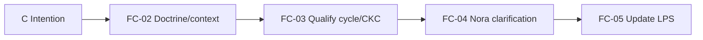
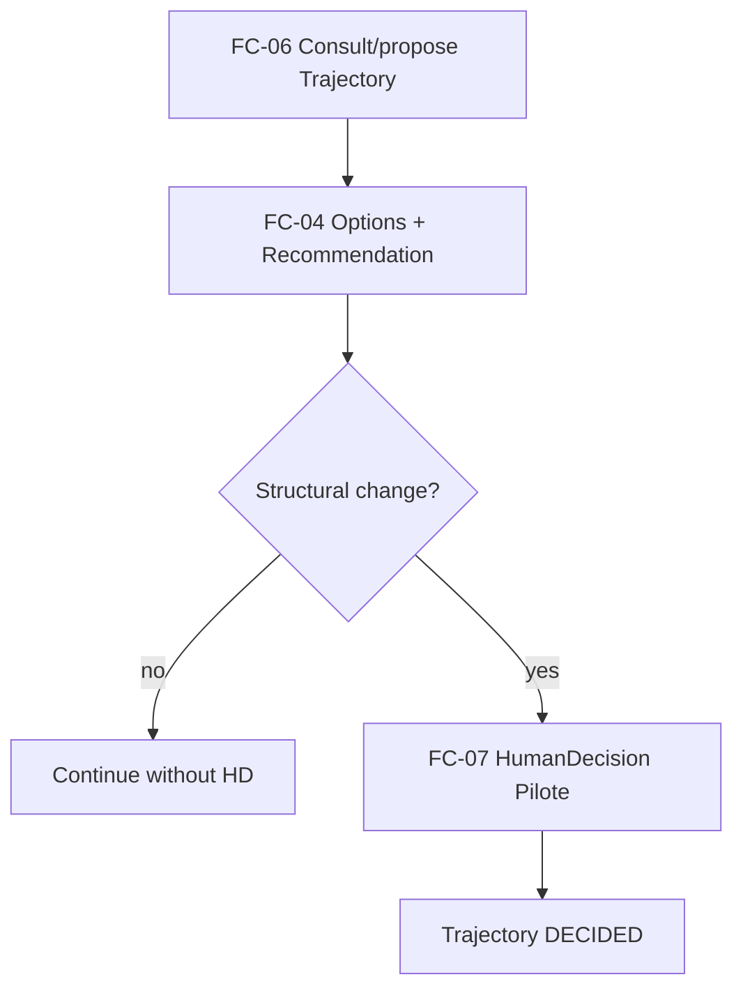
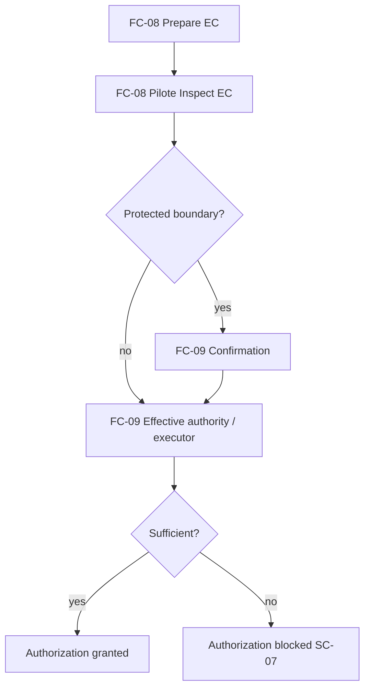
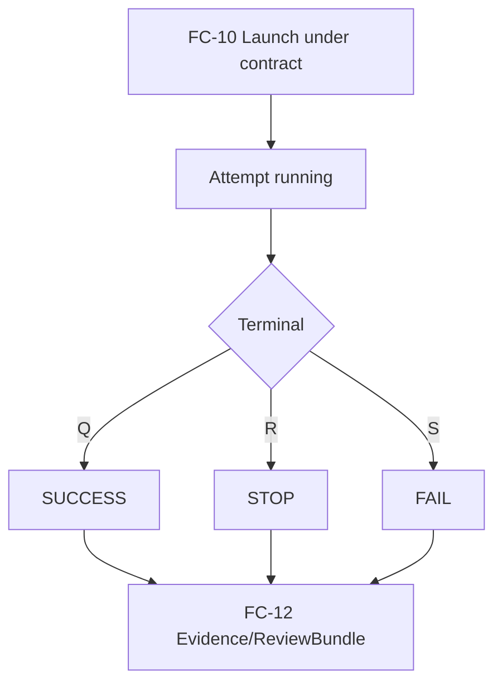
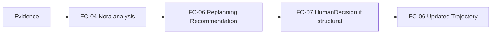
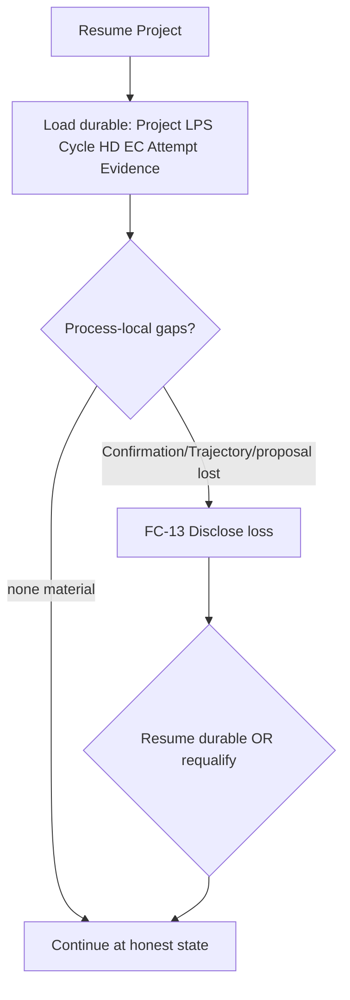

# Review Pack FULL — Product Completion Cycle 3 — LOCAL GIT INTEGRATION

## 1. Timestamp

2026-08-21 01:03:50 CEST (Europe/Paris)

## 2. Morris validation wording brut

« okok validay »

## 3. Morris validation normalized decision

MORRIS VALIDATION — SFIA STUDIO PRODUCT COMPLETION CYCLE 3 — FUNCTIONAL ARCHITECTURE — VALIDATED — C1 TARGET / COMPLETION BAR PRESERVED — C2 FUNCTIONAL CONTRACT A→W PRESERVED — FC-01…FC-15 APPROVED — OA-ALIGNED OPTION A + THIN ORCHESTRATION C APPROVED — NO PARALLEL ARCHITECTURE — TARGETED TECHNICAL DELTA QUALIFICATION APPROVED — OPEN DEBTS / RESERVES CARRIED — NO BACKLOG — NO DELIVERY — ZERO REAL — RUNTIME V3 NON ADOPTED.

## 4. Morris integration GO

Wording : « ok go »

GO MORRIS — PRODUCT COMPLETION CYCLE 3 FUNCTIONAL ARCHITECTURE LOCAL GIT INTEGRATION — RECORD MORRIS VALIDATION — SYNC CONVERGENCE ROADMAP TO VALIDATED PRE-MAIN STATE — CREATE EXACTLY ONE LOCAL PROJECT COMMIT — PUBLISH FULL REVIEW HANDOFF — NO PROJECT PUSH — NO PR — NO MERGE — NO BRANCH DELETE — NO TECHNICAL ARCHITECTURE — NO BACKLOG — NO DELIVERY — ZERO REAL — RUNTIME V3 NON ADOPTED.

## 5. Cycle 3 Critical DOC

LOCAL GIT INTEGRATION PASS of validated Cycle 3 · **≠** Cycle 13 PR Readiness.

## 6. Local Git Truth avant modifications

- Branch: `docs/sfia-studio-product-completion-functional-architecture`
- HEAD was `f850259768e2a4736dc8cce19cd062244a52d727`
- Candidate untracked present
- Historical untracked: `.tmp-sfia-review/` · `eventops-poc/` · `flex-office-demo/`
- Remote project branch: ABSENT · open PRs for head: none

## 7. origin/main

`f850259768e2a4736dc8cce19cd062244a52d727` — no drift

## 8. Build Doctrine / Roadmap pre-check

Build Doctrine VALIDATED ACTIVE — READ ONLY.
Roadmap ACTIVE LIVING — current-state sync authorized only.

## 9. Sources read

Process templates · synthetic map · C1/C2/PE READ ONLY · Build Doctrine · Roadmap · incoming handoff `8e8768dc…` / blob `12d6bffb…`

## 10–11. Incoming handoff + ChatGPT PASS

Final handoff tip before integration: `8e8768dcacdd996c082ee8ecca74fc955ea53b2d` / `12d6bffbdfbd5928ddd711cbf7e3e22c2109dc9f`
ChatGPT FINAL C1+C2 ALIGNMENT REVIEW — **PASS** → Morris validation → this local integration.

## 12. Exact metadata changes in architecture doc

- Statut → VALIDATED BY MORRIS — LOCAL GIT INTEGRATION — NOT YET INTEGRATED ON MAIN
- Morris validation wording/decision/date recorded
- Final ChatGPT PASS + Integration GO recorded
- Git status: LOCAL COMMIT CREATED — NOT PUSHED — NOT INTEGRATED ON MAIN
- Next gates updated to consumed validation + LOCAL GIT INTEGRATION CURRENT
- Anti-claims updated (VALIDATED BY MORRIS ≠ INTEGRATED ON MAIN ≠ tech decided…)
- **No FC-01…15 / A→W / ownership / classification functional redesign**

## 13. ADR-FA-01 status change

RECOMMENDATION → **DECIDED / VALIDATED BY MORRIS** (Option A + thin C)

## 14. Recommendations NOT promoted

- ADR-FA-04/05 → FUNCTIONAL TARGET VALIDATED — TECHNICAL REALIZATION OPEN / DOWNSTREAM (≠ schema/SQLite decided)
- ADR-FA-07 execution-run D2 → remains RECOMMENDATION
- ADR-FA-08 Cycle 6 → remains RECOMMENDATION / REQUALIFY
- ADR-FA-09 next cycle → remains MORRIS DECISION REQUIRED (future)
- REPLACE/RETIRE/REAL/Delivery → not decided

## 15. Targeted technical delta wording

VALIDATED FUNCTIONAL GAP / TARGET QUALIFICATION only · ≠ architecture technique decided · ≠ Cycle 6 authorized · ≠ Delivery

## 16. Roadmap before/after (usable diff)

```diff
diff --git a/projects/sfia-studio/convergence/sfia-studio-convergence-roadmap.md b/projects/sfia-studio/convergence/sfia-studio-convergence-roadmap.md
index 4497156b..e57d8692 100644
--- a/projects/sfia-studio/convergence/sfia-studio-convergence-roadmap.md
+++ b/projects/sfia-studio/convergence/sfia-studio-convergence-roadmap.md
@@ -6,11 +6,12 @@
 | **Statut** | **VALIDATED — ACTIVE LIVING ROADMAP** |
 | **Doctrine cible** | SFIA Studio v3 framing `30`–`37` (destination produit) |
 | **Build Doctrine** | [`sfia-studio-convergence-build-doctrine.md`](./sfia-studio-convergence-build-doctrine.md) |
-| **Snapshot Git courant** | Git current state = **resolve from repository; Git is authoritative** · PRODUCT SCREENS MAIN INTEGRATION PROOF · **PR #376 MERGED** · head `6e2cd066199bf5dc735448a334d70d506ee17b4e` · merge `7d2f9a6132dfedc40c50340ec51c3d613f228c59` *(proof · **≠** future invariant)* · PR CI **#236 SUCCESS** · post-merge CI **#237 SUCCESS** · C1+C2+UX Experience Architecture+E2E Wireframes **VALIDATED BY MORRIS — INTEGRATED ON MAIN** · Product Screens & Visual State Contract **VALIDATED BY MORRIS — INTEGRATED ON MAIN** |
+| **Snapshot Git courant** | Git current state = **resolve from repository; Git is authoritative** · maintenance base `origin/main` @ `f850259768e2a4736dc8cce19cd062244a52d727` *(≠ future invariant)* · C1+C2+UX EA+E2E Wireframes+Product Screens **VALIDATED BY MORRIS — INTEGRATED ON MAIN** · Product Completion Functional Architecture **VALIDATED BY MORRIS — LOCAL GIT INTEGRATION — NOT YET INTEGRATED ON MAIN** |
 | **Snapshot Git historique post-C1** | origin/main @ `dbd5ff995974e605146e8347f0f27867f04e93f7` · PR #365 **MERGED** · C1 Product Completion intégré + governance/doctrine sync · 2026-08-19T10:08:16Z *(historique)* |
 | **Snapshot Git historique pre-C1** | origin/main @ `a53c323e47e5fae1d35671f3ae232609a59b0f3f` *(PR #361 merge — Pre-M6 product vertical slice / functional MVP baseline on main · head `3c4c478…` · post-merge CI run `32122892559` SUCCESS · source branch `delivery/sfia-studio-pre-m6-ui-option-a` **PRESERVED** · historical prior main `a3ac418…` via PR #360)* |
 | **Timestamp création** | 2026-08-12 21:53:10 CEST (+0200) *(historique)* |
-| **Timestamp maintenance courant** | 2026-08-20 22:01 CEST (+0200) — PRODUCT COMPLETION — PRODUCT SCREENS & VISUAL STATE CONTRACT — **POST-MERGE COHERENCE** — PR **#376 MERGED** — **VALIDATED BY MORRIS — INTEGRATED ON MAIN** — head `6e2cd066…` · merge `7d2f9a61…` — C1 ALIGNMENT **PASS** — DIRECT VISUAL PASS 3 — UX-BLK-01/02/03 **CLOSED BY EVIDENCE** — PR CI **#236 SUCCESS** — POST-MERGE CI **#237 SUCCESS** — H-01…H-04 **CARRY** — SC-02 EVIDENCE-FRAMING **NON-BLOCKING RESERVE** — NEXT CAPABILITY **NOT SELECTED** — COMPONENTS **NOT AUTHORIZED** — **NO DELIVERY** — **ZERO REAL** — RUNTIME V3 **NON ADOPTED** |
+| **Timestamp maintenance courant** | 2026-08-21 01:01 CEST (+0200) — PRODUCT COMPLETION — CYCLE 3 FUNCTIONAL ARCHITECTURE — **VALIDATED BY MORRIS — LOCAL GIT INTEGRATION — NOT YET INTEGRATED ON MAIN** — FC-01…FC-15 APPROVED — OA-ALIGNED OPTION A + THIN C APPROVED — NO PARALLEL ARCHITECTURE — TARGETED TECHNICAL DELTA QUALIFICATION APPROVED — FA-R01…FA-R12 CLOSED — H-01…H-04 **CARRY** — Confirmation/Trajectory durability **OPEN** — UAT **OPEN** — NEXT CYCLE **NOT SELECTED** — Architecture technique **NOT AUTHORIZED** — Backlog **NOT AUTHORIZED** — **NO DELIVERY** — **ZERO REAL** — RUNTIME V3 **NON ADOPTED** |
+| **Timestamp maintenance historique Product Screens post-merge coherence** | 2026-08-20 22:01 CEST (+0200) — PRODUCT COMPLETION — PRODUCT SCREENS & VISUAL STATE CONTRACT — **POST-MERGE COHERENCE** — PR **#376 MERGED** — **VALIDATED BY MORRIS — INTEGRATED ON MAIN** — head `6e2cd066…` · merge `7d2f9a61…` — *(historique)* · H-01…H-04 **CARRY** · runtime v3 **NON ADOPTED** · ZERO REAL · **NO DELIVERY** |
 | **Timestamp maintenance historique Product Screens local integration** | 2026-08-20 21:15 CEST (+0200) — PRODUCT COMPLETION PRODUCT SCREENS & VISUAL STATE CONTRACT — **VALIDATED BY MORRIS** — **GIT INTEGRATION AUTHORIZED — NOT YET INTEGRATED ON MAIN** *(historique · superseded by PR #376 merge `7d2f9a61…`)* — Penpot file `63bdc57a…` page **03** · **17** screens · page **04 = 0** · Components **0** · C1 alignment **PASS** · UX-BLK-01/02/03 **CLOSED BY EVIDENCE** · H-01…H-04 **CARRY** · next capability **NOT SELECTED** · Components **NOT AUTHORIZED** · **NO DELIVERY** · **ZERO REAL** · runtime v3 **NON ADOPTED** |
 | **Timestamp maintenance historique E2E Wireframes post-merge coherence** | 2026-08-20 17:37 CEST (+0200) — PRODUCT COMPLETION E2E WIREFRAMES & INTERACTION MODEL — **POST-MERGE COHERENCE** — PR **#374 MERGED** — **VALIDATED BY MORRIS — INTEGRATED ON MAIN** — head `17544120…` · merge `404d2d3e…` — PR CI **#232 SUCCESS** · post-merge CI **#233 SUCCESS** — *(historique)* · H-01…H-04 **CARRY** · runtime v3 **NON ADOPTED** · ZERO REAL · **NO DELIVERY** |
 | **Timestamp maintenance historique E2E Wireframes local integration** | 2026-08-20 16:50 CEST (+0200) — PRODUCT COMPLETION E2E WIREFRAMES & INTERACTION MODEL — **VALIDATED BY MORRIS** — **GIT INTEGRATION AUTHORIZED — NOT YET INTEGRATED ON MAIN** *(historique · superseded by PR #374 merge `404d2d3e…`)* · H-01…H-04 **CARRY** · runtime v3 **NON ADOPTED** · ZERO REAL · **NO DELIVERY** |
@@ -25,8 +26,9 @@
 | **Product Completion UX Experience Architecture** | **VALIDATED BY MORRIS — INTEGRATED ON MAIN** · path : `projects/sfia-studio/product-completion/ux-product-experience/01-experience-architecture.md` · PR **#372 MERGED** · head `ce9bdd0952322c8666751fa948b529657ec3036c` · merge `fb311f2fa57ba8acb37b1878b739669623ac5565` · post-merge documentary sync PR **#373** / merge `6b67ada7…` · PR CI **#228 SUCCESS** · post-merge CI **#229 SUCCESS** · R-INT-UX-01 **CLOSED** (factual editorial) · **≠** Delivery · **≠** REAL · **≠** runtime v3 ADOPTED · **≠** next UX subcycle authorized |
 | **Product Completion E2E Wireframes & Interaction Model** | **VALIDATED BY MORRIS — INTEGRATED ON MAIN** · path : `projects/sfia-studio/product-completion/ux-product-experience/02-end-to-end-wireframes-interaction-model.md` · PR **#374 MERGED** · head `1754412066a4d3230942236316e35b44b4f2c30c` · merge `404d2d3eb43dfa37ac2de6be02d604cfc215e03b` · PR CI **#232 SUCCESS** · post-merge CI **#233 SUCCESS** · Penpot file `63bdc57a-636a-81ba-8008-82d2a50d5233` · page **02 — Wireframes** · **12 boards** · visual review **PASS WITH NON-BLOCKING RESERVES** · A→W **COVERED** · S1→S12 **COVERED** · H-01…H-04 **CARRY** · 0 demonstrated functional architecture blocker · source branch cleanup **COMPLETED** · **≠** Components · **≠** Delivery · **≠** REAL · **≠** next capability selected |
 | **Product Completion Product Screens & Visual State Contract** | **VALIDATED BY MORRIS — INTEGRATED ON MAIN** · path : `projects/sfia-studio/product-completion/ux-product-experience/03-product-screens-visual-state-contract.md` · PR **#376 MERGED** · head `6e2cd066199bf5dc735448a334d70d506ee17b4e` · merge `7d2f9a6132dfedc40c50340ec51c3d613f228c59` · PR CI **#236 SUCCESS** · post-merge CI **#237 SUCCESS** · Penpot file `63bdc57a-636a-81ba-8008-82d2a50d5233` · page **03 — Screens** · **17** screens · page **04 = 0** · Components **0** · C1 target alignment **PASS** · direct visual PASS 3 **PASS WITH ONE NON-BLOCKING EVIDENCE-FRAMING RESERVE** · UX-BLK-01/02/03 **CLOSED BY EVIDENCE** · A→W **PRESERVED** · S1→S12 **PRESERVED** · H-01…H-04 **CARRY** · 0 functional architecture blocker requiring delta · SC-02 crop evidence-framing **NON-BLOCKING RESERVE** · source branch cleanup **COMPLETED** · **≠** Components · **≠** Delivery · **≠** REAL · **≠** next capability selected |
+| **Product Completion Functional Architecture (Cycle 3)** | **VALIDATED BY MORRIS — LOCAL GIT INTEGRATION — NOT YET INTEGRATED ON MAIN** · path : `projects/sfia-studio/product-completion/03-product-completion-architecture-fonctionnelle.md` · FC-01…FC-15 **APPROVED** · OA-aligned Option A + thin orchestration C **APPROVED** · no parallel architecture · targeted durability technical delta **QUALIFIED** (functional target · technical realization OPEN) · FA-R01…FA-R12 **CLOSED** · C1 §H/J.1 + C2 A→W preserved · H-01…H-04 **CARRY** · Confirmation/Trajectory durability **OPEN** · UAT **OPEN** · **≠** Architecture technique · **≠** Backlog · **≠** Delivery · **≠** REAL · **≠** integrated on main · **≠** next cycle selected |
 | **SFIA Studio product design tooling** | **MORRIS DECISION — PENPOT IS THE REFERENCE DESIGN WORKSPACE FOR SFIA STUDIO PRODUCT DESIGN** · Studio product design only · Git remains SoT for governance/contracts/decisions · R-04 EA historical recommendation **SUPERSEDED FOR FUTURE SFIA STUDIO PRODUCT DESIGN** · **≠** global SFIA methodological baseline · **≠** v3 doctrine change · **≠** runtime v3 adoption · EA document **not** retroactively rewritten |
-| **Gates courants** | C1 **INTEGRATED** → C2 **INTEGRATED** → UX EXPERIENCE ARCHITECTURE **INTEGRATED** → E2E WIREFRAMES & INTERACTION MODEL **INTEGRATED** → PRODUCT SCREENS & VISUAL STATE CONTRACT **INTEGRATED** → **NEXT-CAPABILITY REQUALIFICATION REQUIRED** → NEXT CAPABILITY **NOT SELECTED** → **NO EXECUTION WITHOUT MORRIS GO** |
+| **Gates courants** | C1 **INTEGRATED** → C2 **INTEGRATED** → UX EXPERIENCE ARCHITECTURE **INTEGRATED** → E2E WIREFRAMES & INTERACTION MODEL **INTEGRATED** → PRODUCT SCREENS & VISUAL STATE CONTRACT **INTEGRATED** → FUNCTIONAL ARCHITECTURE **VALIDATED BY MORRIS** → **LOCAL GIT INTEGRATION CURRENT** → ChatGPT Local Integration Review → Cycle 13 PR Readiness → MAIN INTEGRATION PROOF → **NEXT-CYCLE REQUALIFICATION** → Technical Architecture Delta **VS** Backlog **NOT SELECTED** → **NO EXECUTION WITHOUT MORRIS GO** |
 | **Intégration Git** | **C2 :** PR #369 / head `3c78c6763d0d090bdc38f3866ecd71ed6be219d0` / merge `2406ccda211842fc7f8da3699bb186a30f7dc105` · **Post-merge sync :** PR #370 (integration vehicle · Git evidence authoritative) · CI SFIA Studio **#222** SUCCESS (PR head) · post-merge CI **#223** SUCCESS · source branch `docs/sfia-studio-product-completion-c2-integration-clean` **PRESERVED** · historical unauthorized branch `docs/sfia-studio-product-completion-c2-functional-design` @ `780ab4c5` **PRESERVED FOR AUDIT** · Gouvernance : PR #334 / merge `1d09e4159932b3885817911e10a2d29a82ae9ea7` · **M1 :** PR #337 / head `5cbda862885b36658fc7f2b33a20311611da969e` / merge `c6925954a7aa86f34c9fcd6f7babf0336014eba3` · CI SFIA Studio **#158** SUCCESS · **M2 :** PR #339 / head `8a920a4726f3ef41a8660ef6fb0b5be88a7d8e51` / merge `a9a4765c242948f2287392a2910fb1cd30061a7a` · CI SFIA Studio **#162** SUCCESS · **M2 post-merge Roadmap :** PR #340 / merge `4a8a6121f8c46b60a3e4bd760e04c6dd4a64fd0a` · **M3 :** PR #341 / head `5ec6aaa5fe9b75a1a6cec0520a4e32ecf3226b19` / merge `8eea4cbf211d9e159626394477353f19126fe900` · CI SFIA Studio **#166** SUCCESS · **M3 post-merge Roadmap :** PR #342 / merge `607763d9a1349d6b48633d8763f75ae3c07c84fc` · **M4 Architecture docs :** PR #343 / merge `e974b7306f7400249c31399fd2890d5817833dbf` · **M4 Delivery :** PR #344 / head `f7270b21ccdbcf1cd543879e7c4120d87b874479` / merge `ec65fb47c04b451d892297c806b9b041995339a5` · CI SFIA Studio **#172** SUCCESS (same head `f7270b21` after Morris-authorized rerun ; initial T7-C08 Class C / M4 causality not established — diagnostic handoff `bf4928389fd1ec50ecf2cf2d485bfbd2d7d3ba63` ; no code change between failure and success) · **M4 post-Delivery Roadmap :** PR #345 / merge `3575c8863d8a13b610dbfde96a33426a620b2c56` · **M4 pre-reproof bounding :** PR #346 / head `8900cd06be195b2dd9fa154a7153608fdde6f9a3` / merge `fc7e20aaeb5153b4d73c1809f865e361f00e1b34` · CI SFIA Studio **#176** SUCCESS · ZERO REAL in bounding integration · **M4 post-pre-reproof Roadmap :** PR #347 / merge `2d1361ee71bec7a21f6f76efc7c33eaf3146802a` · CI SFIA Studio **#178** SUCCESS · **M4 GOVERNED REAL COMPLETION PROOF** handoff `1123a30f2261756a2ec744ee002ec023b7fea0af` · GO Morris **ACCEPT M4 EXIT PROOF + CLOSE M4 — NO M5 EXECUTION** · **M4 closure Roadmap :** PR #348 / merge `5132f1bc2c147b2c7ebf6d331c04b1c6b1bd047e` · **M5 Entry Qualification** handoff `63f41e3f328868286c14312a58a7b79f850383c0` · GO Morris **ADOPT M5 ARCHITECTURE TRAJECTORY — M5-A OPTION B — M5-B W1 — M5-C KEEP TEMPORARY WITH EXIT — NO REAL — NO DELIVERY** · GO Morris **SYNC M5 ARCHITECTURE DECISION INTO CONVERGENCE ROADMAP — NO REAL — NO DELIVERY** · **M5 Delivery (Option B + W1) :** PR #350 / head `17461dad78f92a3d5e5e1d9bd36aa20d1e86ac11` / merge `8f753218e4fff7d68d78c1d57e9c3e8fb7e60943` · CI SFIA Studio **#184** SUCCESS · post-merge CI **#185** SUCCESS · **M5 UI/Nora durable rehydrate :** PR #351 / head `ced7b172969c27b5e2d6fda06e9caa8c84e1e0d7` / merge `d8961f1d85a98b5d4185f007f16ddac209e2e557` · CI SFIA Studio **#186** SUCCESS · post-merge CI **#187** SUCCESS · M5 exit re-evaluation handoff `54b0f5b43a50861c26226aa3ffc06460f8ffbafe` · blob `131c85172bbd6370a3edcd71347a64932c9303ab` · M5 EXIT PROOF **SATISFIED ON MAIN** · **M5 capitalization / Roadmap sync :** PR #352 / head `c26824c602ec041cb1d40e9078191c0f1cde4e95` / merge `3467ecdf74ac2010c45f34545fb8684563dea547` · CI SFIA Studio PR run **#31875337665** SUCCESS · post-merge CI run **#31875621317** SUCCESS · post-merge handoff `0121e184c936f8dc73ffe80e20d43027fec495d7` · blob `4c293ae07a0d516b16d6dd2d4087d3e25858e275` · GO Morris **ACCEPT M5 EXIT PROOF + CLOSE M5 — KEEP M5-C TECHNICAL JOURNAL — ZERO REAL — NO M6 EXECUTION — RUNTIME V3 NON ADOPTED — NO BRANCH DELETE** · M5 EXIT PROOF **ACCEPTED BY MORRIS** · M5 **CLOSED** · User wording **« ok go pour la modification »** · governed interpretation **ALIGN M5 CLOSURE ROADMAP WITH PRE-M6 USER JOURNEY / UX BASELINE TRAJECTORY — KEEP M5 CLOSED — KEEP M5-C — NO UX DESIGN EXECUTION YET — NO FIGMA ACTION YET — NO UI DELIVERY — NO M6 — ZERO REAL — NO PROJECT GIT WRITE** · **M5 closure / Pre-M6 sequencing Roadmap :** PR #353 / title `docs(sfia-studio): close M5 and sequence Pre-M6 UX baseline` / base `3467ecdf74ac2010c45f34545fb8684563dea547` / head `7a744c8cec889be547eebe231279620189819dd0` / merge `2f0d7236e4e1b7c7ca8e987b9d4e6e3ece3c37a7` — records M5 closure + inserts Pre-M6 before M6 · **≠** Slice A candidate (Slice A is later local work) · PRE-M6 USER JOURNEY / UX BASELINE = **FUNCTIONAL BASELINE + GAP READINESS COMPLETE · G-UX-15 EXIT PROOF ACCEPTED / TECHNICAL BLOCKER CLOSED · LOCAL CANDIDATE NOT YET ON MAIN · FIGMA/UI DELIVERY NOT AUTHORIZED** · **G-UX-15 Slice A controlled integration :** PR #354 / title `feat(sfia-studio): close Pre-M6 G-UX-15 execution wiring gap` / base `2f0d7236e4e1b7c7ca8e987b9d4e6e3ece3c37a7` / head `22ae8e5e4bddb0f997384a5e8ba87c9b35245693` / merge `a6df83a640afeb0911cb572d118d27a03c9923a7` · CI SFIA Studio **#192** SUCCESS · post-merge main CI **#193** SUCCESS · post-merge truth **PASS** (exact 5-file SHAs on main) · feature branch **PRESERVED** (no delete) · **Cycle 14 docs sync :** PR #355 / title `docs(sfia-studio): sync Pre-M6 G-UX-15 post-merge current state` / merge `dd284e9f20de89b2c8fc7782e4177d0d125c24d2` — **MERGED ON MAIN** · **historique :** OPEN / DRAFT avant merge · **Cycle 15 visual adoption docs integration :** PR #356 / title `docs(sfia-studio): record Pre-M6 visual contract adoption` / head `3a93d0e5cfd86e46bb795ce22c0f7dd79078ef2a` / merge `50f31994b0d9b5a3a3514e2fa9a063d688071c50` — **MERGED ON MAIN** · CI SFIA Studio **#198** SUCCESS on final PR head · post-merge main CI **#199** SUCCESS · post-merge truth **PASS** · source branch **PRESERVED** (NO BRANCH DELETE) · **historique :** OPEN / DRAFT avant merge · **D-PRE-M6-UX-05 :** ADOPTED AS PRE-M6 VISUAL REFERENCE ON MAIN (Freeze `uUdLBElF2B4dOefaAYt4QY`) — UI Delivery still **NOT AUTHORIZED** · **Cycle 14 PR #356 post-merge current-state sync :** PR #357 / title `docs(sfia-studio): sync PR 356 post-merge current state` / head `70643624c494f16fb91e3bede772a80f4eece783` / merge `b834fdd40d3e7028e80cf7b388b93df2f31e18e4` — **MERGED ON MAIN** · CI SFIA Studio **#200** SUCCESS on PR head · post-merge CI **#201** SUCCESS · source branch **PRESERVED** · **historique :** OPEN / DRAFT avant merge · **PRE-M6 UI DELIVERY GATE / SCOPE QUALIFICATION :** **COMPLETE** — Review Handoff `2577776360c8a5a3492806b447d4bf88f0239898` / blob `9084a97b368472aaaa7ab61f85baf2efcb819e51` — verdict READY FOR MORRIS DELIVERY DECISION (**≠** UI Delivery authorized) — OPTION A = RECOMMENDATION AWAITING MORRIS DECISION *(historique qualification)* · **Cycle 15 Pre-M6 UI gap + CKC trajectory Roadmap :** PR #358 / title `docs(sfia-studio): record Pre-M6 UI gap and CKC trajectory` / head `c91ce1afd498ef9a5275e3b90509e7a045f240a0` / merge `0a80b92cb2c05f5b3f001438988b52c07c3bf0b6` — **MERGED ON MAIN** · CI SFIA Studio **#202** SUCCESS on PR head · post-merge CI **#203** SUCCESS · source branch **PRESERVED** · **historique :** OPEN / DRAFT avant merge · GO Morris **ADOPT PRE-M6 UI DELIVERY SCOPE OPTION A** (user « bon ok go option A ») — OPTION A = **ADOPTED BY MORRIS AS PRE-M6 UI DELIVERY SCOPE** · OPTION A SCOPE ADOPTED **≠** UI DELIVERY EXECUTION AUTHORIZED · NEXT PRODUCT GATE *(historique jusqu’à PR #361)* = **MORRIS PRE-M6 UI DELIVERY EXECUTION AUTHORIZATION — OPTION A** · **PR #359** Option A adoption sync **MERGED** (`0d33478…`) · **PR #360** fake-real progressive proof **MERGED** (`a3ac418…`) · **PRE-M6 PRODUCT VERTICAL SLICE :** PR #361 / title `feat(sfia-studio): consolidate Pre-M6 product vertical slice` / head `3c4c478d7664c6111f38e6c4f49e98042e3a8473` / merge `a53c323e47e5fae1d35671f3ae232609a59b0f3f` — **MERGED ON MAIN** · post-merge CI run **`32122892559` SUCCESS** · source branch `delivery/sfia-studio-pre-m6-ui-option-a` **PRESERVED** · GO Morris **PR #361 READY + MERGE — PRESERVE SOURCE BRANCH — THEN POST-MERGE VALIDATION** · **MORRIS DECISION — CURRENT SFIA STUDIO VERTICAL SLICE ON MAIN IS THE FUNCTIONAL MVP BASELINE FOR THE PRODUCT COMPLETION TRAJECTORY — REUSE EXISTING BACKBONE — DO NOT RESTART FROM ZERO — RUNTIME V3 REMAINS NON ADOPTED** · **MORRIS DECISION — ACCEPT PRE-M6 EXIT FOR PRODUCT-TRAJECTORY PURPOSES WITH GOVERNED DEBT — CURRENT MAIN VERTICAL SLICE IS THE SFIA STUDIO FUNCTIONAL MVP BASELINE FOR PRODUCT COMPLETION — CARRY UAT-UX-06 / UAT-RECOVERY-03 / V3-F10 / PROCESS-LOCAL DURABILITY / N7 AS GOVERNED DEBT — RUNTIME V3 REMAINS NON ADOPTED** · PRE-M6 EXIT = **ACCEPTED FOR PRODUCT-TRAJECTORY PURPOSES WITH GOVERNED DEBT** · PRE-M6 **≠ COMPLETE WITHOUT RESERVES** · NEXT PRODUCT GATE = **GO MORRIS — CYCLE 1 CADRAGE — SFIA STUDIO PRODUCT COMPLETION FROM MVP** (consumable only after this documentation is integrated on main · **NOT AUTHORIZED now**) · NEXT REPOSITORY GATE = **MORRIS REVIEW — PRODUCT COMPLETION REBASELINE DRAFT PR — NO MERGE UNTIL EXPLICIT GO** |
 | **Sources** | Git `main` @ `a53c323e47e5fae1d35671f3ae232609a59b0f3f` · PR #337/#339/#340/#341/#342/#343/#344/#345/#346/#347/#348/#349/#350/#351/#352/#353/#354/#355/#356/#357/#358/#359/#360/#361 · CI #158/#162/#166/#172/#176/#178/#184/#185/#186/#187/#192/#193/#197/#198/#199/#200/#201/#202/#203 · Pre-M6 UI Delivery qualification handoff `2577776360c8a5a3492806b447d4bf88f0239898` / blob `9084a97b368472aaaa7ab61f85baf2efcb819e51` · GO Morris **ADOPT PRE-M6 UI DELIVERY SCOPE OPTION A** · PR #352 CI run #31875337665 / post-merge #31875621317 · decision pack G0 · framing `30`–`37` (dont `34`) · M4 Architecture Handoff `sfia/review-handoff` @ `366726945f8f533d958c82b7251edb1a5a4b45f0` · M4 CI diagnostic handoff `bf4928389fd1ec50ecf2cf2d485bfbd2d7d3ba63` · FIRST REAL handoff `2234931e682bfede4b8515fd1ede7c2e1e2d2d01` · timeout diagnosis handoff `797daeccfa2ec445a1ecaf10f042de635cb1fe21` · pre-reproof bounding handoffs `3c56cb29367268231c1db26b4de7af5cfe0ef499` / `9ffce8cc4a78f15af322d4fb4aab8bf63896ff6c` · final M4 governed REAL completion handoff `1123a30f2261756a2ec744ee002ec023b7fea0af` · D-PRE-M6-UX-05 visual review handoff `69106c82024158889f77e9d31508a222ea5f3a0f` / blob `3593ddbdc286cd244790f0ca1d2c421128202c5c` · GO Morris **ADOPT M4 ARCHITECTURE TRAJECTORY** (D-M4-01→05) · GO Morris **M4 Delivery** / **MERGE PR #344** · GO Morris **FIRST M4 CURSOR REAL** · GO Morris **DIAGNOSE TIMEOUT** · GO Morris **PRE-REPROOF BOUNDING** / **MERGE PR #346** · GO Morris **ACCEPT M4 EXIT PROOF + CLOSE M4 — NO M5 EXECUTION** · PR #348 / merge `5132f1bc2c147b2c7ebf6d331c04b1c6b1bd047e` · M5 Entry Qualification handoff `63f41e3f328868286c14312a58a7b79f850383c0` · GO Morris **ADOPT M5 ARCHITECTURE TRAJECTORY — M5-A OPTION B — M5-B W1 — M5-C KEEP TEMPORARY WITH EXIT — NO REAL — NO DELIVERY** · GO Morris **SYNC M5 ARCHITECTURE DECISION INTO CONVERGENCE ROADMAP — NO REAL — NO DELIVERY** · GO Morris **VALIDATE D-PRE-M6-UX-05 FIGMA VISUAL CONTRACT — ADOPT AS PRE-M6 VISUAL REFERENCE** · M4 Product path on main `projects/sfia-studio/app/**` |
 | **Anti-claims** | G0-A/G0-B **consommés** · M1–M3 **mergés** · M3 exit proof **SATISFIED** · M4 exit proof **ACCEPTED BY MORRIS** · M4 **CLOSED** · M5 Entry Qualification **COMPLETE** · M5 architecture trajectory **ADOPTED BY MORRIS** · M5 Delivery **IMPLEMENTED ON MAIN** (PR #350) · M5 UI rehydrate **IMPLEMENTED ON MAIN** (PR #351) · M5 technical/functional exit proof **SATISFIED ON MAIN** · M5 EXIT PROOF **ACCEPTED BY MORRIS** · M5 **CLOSED** · M5 CLOSED **≠** M6 AUTHORIZED · M5 CLOSED **≠** M6 STARTED · M5 CLOSED **≠** runtime v3 ADOPTED · M5 CLOSED **≠** global v3 baseline promoted · M5 CLOSED **≠** M5-C retired · M5 exit accepted **≠** global Cursor REAL authorization · M5 CLOSED future **≠** M6 automatically authorized · Pre-M6 trajectory decided **≠** Pre-M6 UX qualification executed · **D-PRE-M6-UX-05 ADOPTED AS PRE-M6 VISUAL REFERENCE ≠ UI Delivery authorized ≠ runtime implemented ≠ browser/product E2E proven ≠ Figma/runtime aligned ≠ WCAG compliant ≠ Pre-M6 complete ≠ historical UI retired** · Accepted M-03/M-04/provenance reserves ≠ reserves closed · new UX baseline **≠** runtime rewrite · existing UI not canonical **≠** existing UI automatically deleted · UI asset audit **COMPLETE/CLASSIFIED** **≠** individual dispositions ADOPTED · existing UI audit **≠** REPLACE/retirement authorized · M1→M5 runtime KEEP **≠** all runtime complete · Pre-M6 user proof **≠** runtime v3 ADOPTED · M6 after Pre-M6 **≠** M6 automatically authorized · Validated UX decisions in framing **30/37** (CC-D01) prevail over older candidate wording in framing **11** · M5-A OPTION B **IMPLEMENTED ON MAIN** · M5-B W1 **IMPLEMENTED ON MAIN** · M5-B W1 factual write-back **≠** Recommendation becomes Decision · Recommendation **≠** HumanDecision · Recommendation **≠** gate consumed · Recommendation **≠** ExecutionAuthority · LPS factual evidence link **≠** structural trajectory validation · readback **≠** execution · remount UI visibility **≠** automatic next-cycle launch · M5-C KEEP TEMPORARY WITH EXIT **≠** technical journal retired · durable Product Attempt **≠** technical M4 journal automatically obsolete · M5 implementation **≠** runtime v3 ADOPTED · M5 implementation **≠** global v3 baseline promoted · M5 ZERO REAL **≠** global Cursor REAL authorization · M5 architecture ADOPTED **≠** M6 started · M4 CLOSED **≠** runtime v3 ADOPTED · one bounded successful REAL completion **≠** global Cursor REAL safety for arbitrary capabilities/tasks · strict runtime read-only proof applies to the **demonstrated M4 bounded path**, not arbitrary future Cursor tasks · timeout 60000 **proven sufficient for demonstrated M4 bounded RO path** **≠** universal Cursor REAL timeout policy · FIRST REAL historical timeout **≠** timeout proven defective · `CURSOR_REAL_TIMEOUT_POLICY` OPEN / NON-BLOCKING **unchanged by M5 architecture decision** **≠** M4/M5 reopened · technical launch journal **≠** Product Store · Critical Ack/Auth.js future IAM **≠** required retroactively for M4 first low-risk RO path · v3 global baseline **NOT PROMOTED** · runtime v3 **NON ADOPTED** · ≠ full OA durable · G-UX-15 technical blocker **CLOSED BY MORRIS** ≠ Pre-M6 complete · G-UX-15 exit proof accepted ≠ browser/product E2E proven · fixture-safe proof accepted ≠ REAL proof · G-UX-15 Slice A **MERGED ON MAIN** (PR #354) ≠ Pre-M6 complete · merged on main ≠ product/browser E2E proven · merged on main ≠ UI Delivery/M6 authorized · Pre-M6 progress ≠ M6 authorized · Confirmation process-local = KEEP RESERVE ≠ restart-safe Confirmation · **PR #356 MERGED ≠ UI Delivery authorized** · CI #197/#198/#199 SUCCESS ≠ Pre-M6 complete ≠ UI Delivery authorized · post-merge truth PASS ≠ UI Delivery gate consumed · UI Delivery qualification COMPLETE ≠ UI Delivery authorized · **Option A SCOPE ADOPTED BY MORRIS ≠ UI Delivery execution authorized** · gap treatment adopted as scope ≠ gap closed · G-UX-08 deferred ≠ G-UX-08 closed · G-UX-09 accepted ≠ Conversation durable · Confirmation KEEP ≠ restart-safe · G-UX-11 planned ≠ browser E2E proven · M7 CKC 15/15 future ≠ CKC complete now ≠ CKC Delivery authorized · 4 pilots + 11 fallback ≠ CKC system complete · CKC→v2.6 capitalization option ≠ v2.6 modification decided · CKC validation future ≠ runtime v3 ADOPTED · PR #357 MERGED ≠ UI Delivery authorized · CI #201 SUCCESS ≠ Pre-M6 complete · PR #358 MERGED ≠ UI Delivery authorized · CI #202/#203 SUCCESS ≠ Pre-M6 complete ≠ Delivery authorized · Option A scope adopted ≠ Delivery GO consumed · Execution Authorization IS the Delivery GO ≠ second Delivery GO required · G-UX-11 E2E exit proof ≠ Delivery entry prerequisite · global v3 baseline **NOT PROMOTED** · **PR #361 MERGED ≠ PRE-M6 COMPLETE ≠ PRE-M6 EXIT ACCEPTED ≠ runtime v3 ADOPTED ≠ M6 AUTHORIZED ≠ M7 AUTHORIZED ≠ CKC 15/15 COMPLETE ≠ generic Cursor write/dev/commit/push/PR proven** · **MVP FUNCTIONAL BASELINE ≠ produit final ≠ UX finale ≠ production-ready ≠ generic ExecutionContract complete** · Product Completion trajectory recorded **≠** Cycle 1 Cadrage authorized **≠** Delivery authorized · PRE-M6 requalification **≠** PRE-M6 CLOSED · **PRE-M6 EXIT ACCEPTED FOR PRODUCT-TRAJECTORY PURPOSES WITH GOVERNED DEBT ≠ PRE-M6 COMPLETE ≠ PRE-M6 all gaps closed ≠ runtime v3 ADOPTED ≠ M6 STARTED ≠ M6 AUTHORIZED ≠ Product Completion Delivery authorized ≠ Cycle 1 Cadrage authorized** |
@@ -85,9 +87,10 @@ Fondations V3-F01…F15 = couverture doctrine progressive (B9).
 | Product Completion UX Experience Architecture | **VALIDATED BY MORRIS — INTEGRATED ON MAIN** · `projects/sfia-studio/product-completion/ux-product-experience/01-experience-architecture.md` · PR #372 / head `ce9bdd095…` / merge `fb311f2f…` · PASS WITH NON-BLOCKING RESERVES · **≠** Delivery · **≠** next UX subcycle |
 | Product Completion E2E Wireframes & Interaction Model | **VALIDATED BY MORRIS — INTEGRATED ON MAIN** · `projects/sfia-studio/product-completion/ux-product-experience/02-end-to-end-wireframes-interaction-model.md` · PR #374 / head `17544120…` / merge `404d2d3e…` · PR CI **#232 SUCCESS** · post-merge CI **#233 SUCCESS** · Penpot `63bdc57a…` page 02 · 12 boards · visual PASS WITH NON-BLOCKING RESERVES · H-01…H-04 **CARRY** · **≠** Components · **≠** Delivery |
 | Product Completion Product Screens & Visual State Contract | **VALIDATED BY MORRIS — INTEGRATED ON MAIN** · `projects/sfia-studio/product-completion/ux-product-experience/03-product-screens-visual-state-contract.md` · PR #376 / head `6e2cd066…` / merge `7d2f9a61…` · PR CI **#236 SUCCESS** · post-merge CI **#237 SUCCESS** · Penpot `63bdc57a…` page 03 · 17 screens · page 04 = 0 · Components 0 · C1 alignment PASS · PASS 3 PASS WITH ONE NON-BLOCKING EVIDENCE-FRAMING RESERVE · UX-BLK-01/02/03 CLOSED · H-01…H-04 **CARRY** · source branch cleanup **COMPLETED** · **≠** Components · **≠** Delivery |
+| Product Completion Functional Architecture (Cycle 3) | **VALIDATED BY MORRIS — LOCAL GIT INTEGRATION — NOT YET INTEGRATED ON MAIN** · `projects/sfia-studio/product-completion/03-product-completion-architecture-fonctionnelle.md` · FC-01…FC-15 APPROVED · OA Option A + thin C APPROVED · targeted durability delta QUALIFIED · FA-R01…FA-R12 CLOSED · **≠** Architecture technique · **≠** Backlog · **≠** Delivery |
 | COMPLETED / INTEGRATED | **C1 CADRAGE** · **C2 FUNCTIONAL DESIGN** · **UX EXPERIENCE ARCHITECTURE** · **E2E WIREFRAMES & INTERACTION MODEL** · **PRODUCT SCREENS & VISUAL STATE CONTRACT** · PR #369 / `2406ccda…` · PR #370 post-merge sync **HISTORICAL / MERGED** · PR #372 / `fb311f2f…` · PR #373 / `6b67ada7…` · PR #374 / `404d2d3e…` · PR #375 post-merge sync · PR #376 / `7d2f9a61…` |
-| CURRENT REPOSITORY GATE | Product Screens **VALIDATED BY MORRIS — INTEGRATED ON MAIN** · current = **POST-MERGE COHERENCE SYNC (local)** → ChatGPT review → Morris GO sync integration if PASS · **≠** Components · **≠** Delivery · next capability **NOT SELECTED** |
-| NEXT PRODUCT CAPABILITY | **NOT SELECTED** · **NEXT-CAPABILITY REQUALIFICATION REQUIRED** · **NO EXECUTION WITHOUT MORRIS GO** |
+| CURRENT REPOSITORY GATE | Functional Architecture **VALIDATED BY MORRIS** · current = **LOCAL GIT INTEGRATION** → ChatGPT Local Integration Review → Cycle 13 PR Readiness · **≠** integrated on main · **≠** Architecture technique · **≠** Backlog · next cycle **NOT SELECTED** |
+| NEXT PRODUCT CAPABILITY | **NOT SELECTED** · after main proof → **NEXT-CYCLE REQUALIFICATION** (Technical Architecture Delta **VS** Backlog) · **NO EXECUTION WITHOUT MORRIS GO** |
 | M6 / M7 | **HISTORICAL MILESTONES — SUPERSEDED / ABSORBED BY PRODUCT COMPLETION** · traces conservées · hors forward critical path |

 ### Candidat local non-main (dirty `delivery/sfia-studio-f3-real-prerequisites`) — historique / harvest
@@ -441,9 +444,9 @@ GO : **ADOPT M4 ARCHITECTURE TRAJECTORY** · source pack handoff `366726945f8f53
 | **Intégration** | PR #350 merge `8f753218…` · PR #351 merge `d8961f1d…` · capitalization PR #352 merge `3467ecd…` · exit handoff `54b0f5b4…` · post-merge handoff `0121e184…` |
 | **Dépendances** | M4 — **SATISFIED / CLOSED** · Architecture — **CONSUMED** · Delivery — **CONSUMED / MERGED** · UI rehydrate — **CONSUMED / MERGED** · Capitalization Roadmap — **CONSUMED / MERGED** · Closure gate — **CONSUMED** |
 | **Statut** | **M5 EXIT PROOF ACCEPTED BY MORRIS — CLOSED** |
-| **Next convergence capability (current)** | C1+C2+UX Experience Architecture+E2E Wireframes+Product Screens **INTEGRATED ON MAIN** · Product Screens **VALIDATED BY MORRIS — INTEGRATED ON MAIN** (PR #376) · M5 remains **CLOSED** · PRE-M6 EXIT remains accepted with governed debt · next capability **NOT SELECTED** |
-| **Next immediate gate (repo)** | Product Screens **INTEGRATED ON MAIN** · current = **POST-MERGE COHERENCE** (local sync) → ChatGPT review → Morris GO sync integration if PASS · **≠** Components · **≠** Delivery |
-| **Next product gate** | Product Screens **INTEGRATED** · **NEXT-CAPABILITY REQUALIFICATION REQUIRED** · NEXT CAPABILITY **NOT SELECTED** · **NO EXECUTION WITHOUT MORRIS GO** |
+| **Next convergence capability (current)** | C1+C2+UX EA+E2E Wireframes+Product Screens **INTEGRATED ON MAIN** · Functional Architecture **VALIDATED BY MORRIS — LOCAL GIT INTEGRATION — NOT YET INTEGRATED ON MAIN** · M5 remains **CLOSED** · PRE-M6 EXIT remains accepted with governed debt · next cycle **NOT SELECTED** |
+| **Next immediate gate (repo)** | Functional Architecture **VALIDATED** · current = **LOCAL GIT INTEGRATION** → ChatGPT Local Integration Review → Cycle 13 PR Readiness · **≠** Architecture technique · **≠** Backlog · **≠** Delivery |
+| **Next product gate** | Functional Architecture **VALIDATED** · after main proof → **NEXT-CYCLE REQUALIFICATION** (Technical Architecture Delta **VS** Backlog) · NEXT CYCLE **NOT SELECTED** · **NO EXECUTION WITHOUT MORRIS GO** |
 | **M6 / M7 disposition** | Historical milestones **SUPERSEDED / ABSORBED BY PRODUCT COMPLETION** |


@@ -710,7 +713,9 @@ CRITICAL PATH:
   → UX EXPERIENCE ARCHITECTURE — **VALIDATED BY MORRIS / INTEGRATED ON MAIN** (PR #372 / `fb311f2f…` · post-merge sync PR #373 / `6b67ada7…`)
   → E2E WIREFRAMES & INTERACTION MODEL — **VALIDATED BY MORRIS — INTEGRATED ON MAIN** (PR #374 / head `17544120…` / merge `404d2d3e…` · PR CI #232 SUCCESS · post-merge CI #233 SUCCESS)
   → PRODUCT SCREENS & VISUAL STATE CONTRACT — **VALIDATED BY MORRIS — INTEGRATED ON MAIN** (PR #376 / head `6e2cd066…` / merge `7d2f9a61…` · PR CI #236 SUCCESS · post-merge CI #237 SUCCESS · source branch cleanup COMPLETED)
-  → NEXT-CAPABILITY REQUALIFICATION REQUIRED — **NOT SELECTED** — **NO EXECUTION WITHOUT MORRIS GO**
+  → PRODUCT COMPLETION FUNCTIONAL ARCHITECTURE (Cycle 3) — **VALIDATED BY MORRIS — LOCAL GIT INTEGRATION — NOT YET INTEGRATED ON MAIN**
+  → LOCAL GIT INTEGRATION → ChatGPT Local Integration Review → Cycle 13 PR Readiness → MAIN INTEGRATION PROOF
+  → NEXT-CYCLE REQUALIFICATION (Technical Architecture Delta VS Backlog) — **NOT SELECTED** — **NO EXECUTION WITHOUT MORRIS GO**
   → DYNAMIC PRODUCT TRAJECTORY — requalify after each capability
   → OPTIONAL CKC lessons → v2.6 capitalization — DISTINCT METHOD GATE — NOT DECIDED

```

## 17. Reserves carried

H-01…H-04 CARRY · Confirmation process-local OPEN · Trajectory durability OPEN · Epistemic durability targeted if applicable · UAT OPEN · SC-02 NON-BLOCKING · RESERVE-GOV-EC-ORDER OPEN · Pre-M6 debt CARRY · runtime v3 NON ADOPTED

## 18–19. Staged files / cached validation

Exact 2 files staged and committed:
- A `projects/sfia-studio/product-completion/03-product-completion-architecture-fonctionnelle.md`
- M `projects/sfia-studio/convergence/sfia-studio-convergence-roadmap.md`

`git diff --cached --check` was clean at commit time.

## 20–22. Local project commit

- SHA: `1018aa79d1d8ebb8783d11ce25ff08036764e87e`
- Parent: `f850259768e2a4736dc8cce19cd062244a52d727` (= origin/main)
- Message: `docs(sfia-studio): integrate validated Product Completion functional architecture`
- Ahead/behind: 0 behind / 1 ahead

```
commit 1018aa79d1d8ebb8783d11ce25ff08036764e87e
Author:     Morris Cleland <morris@macbook-air1.home>
AuthorDate: Fri Aug 21 01:03:26 2026 +0200
Commit:     Morris Cleland <morris@macbook-air1.home>
CommitDate: Fri Aug 21 01:03:26 2026 +0200

    docs(sfia-studio): integrate validated Product Completion functional architecture

    Co-authored-by: Cursor <cursoragent@cursor.com>

M	projects/sfia-studio/convergence/sfia-studio-convergence-roadmap.md
A	projects/sfia-studio/product-completion/03-product-completion-architecture-fonctionnelle.md

```

## 23. Final git status

```
?? .tmp-sfia-review/
?? projects/eventops-poc/
?? projects/flex-office-demo/

```

## 24. Remote project actions NOT performed

no project push · no PR · no Ready for Review · no merge · no branch delete

## 25. Anti-claims

Functional Architecture VALIDATED BY MORRIS ≠ INTEGRATED ON MAIN ≠ TECHNICAL ARCHITECTURE DECIDED ≠ BACKLOG READY ≠ DELIVERY ≠ COMPONENTS ≠ REAL ≠ Product Completion complete ≠ runtime v3 ADOPTED

## 26. Next gate

CHATGPT LOCAL GIT INTEGRATION REVIEW → if PASS → MORRIS GO CYCLE 13 PR READINESS

## 27. Final verdict

READY FOR CHATGPT PRODUCT COMPLETION FUNCTIONAL ARCHITECTURE LOCAL GIT INTEGRATION REVIEW — CYCLE 3 CRITICAL — MORRIS FUNCTIONAL ARCHITECTURE VALIDATION RECORDED — FC-01…FC-15 UNCHANGED — OA-ALIGNED OPTION A + THIN C RECORDED AS VALIDATED ARCHITECTURE DECISION — TARGETED TECHNICAL DELTA RECORDED AS VALIDATED FUNCTIONAL QUALIFICATION ONLY — DOWNSTREAM TECHNICAL REALIZATION REMAINS OPEN — CONVERGENCE ROADMAP SYNCHRONIZED TO VALIDATED PRE-MAIN STATE — EXACTLY TWO PROJECT FILES — EXACTLY ONE LOCAL PROJECT COMMIT — COMMIT PARENT VERIFIED AGAINST CURRENT MAIN — OPEN DEBTS PRESERVED — FULL REVIEW PACK COMPLETE — REVIEW HANDOFF REMOTE VERIFIED — NO PROJECT PUSH — NO PR — NO MERGE — NO ARCHITECTURE TECHNIQUE — NO BACKLOG — NO CODE — NO DELIVERY — ZERO REAL — RUNTIME V3 NON ADOPTED

## 28. Instruction ChatGPT

Review latest sfia/review-handoff.

Verify branch/HEAD/parent/origin/main · Morris validation recorded · no functional drift · ADR-FA-01 only promoted where authorized · tech delta remains qualification · Roadmap says VALIDATED BY MORRIS / LOCAL GIT INTEGRATION / NOT YET INTEGRATED ON MAIN · next cycle NOT SELECTED · reserves · exact 2 files / 1 commit · no project push/PR/merge · no Architecture technique / Backlog / Delivery / REAL · handoff remote verified.

If PASS: CHATGPT PRODUCT COMPLETION FUNCTIONAL ARCHITECTURE LOCAL GIT INTEGRATION REVIEW — PASS → READY FOR MORRIS CYCLE 13 PR READINESS GO.

Do NOT push the project branch. Do NOT create a PR. Do NOT merge. Do NOT launch Architecture technique / Backlog.

---

## 29. FULL INTEGRATED ARCHITECTURE DOCUMENT (Artifact Completeness)

```markdown
# SFIA Studio — Product Completion — Cycle 3 — Architecture fonctionnelle

| Métadonnée | Valeur |
| --- | --- |
| **Projet** | SFIA Studio — Product Completion |
| **Cycle** | **3 — Architecture fonctionnelle** |
| **Profil** | **CRITICAL** |
| **Typologie** | **DOC** |
| **Niveau QA** | CRITICAL DOCUMENT REVIEW |
| **Milestone** | PRODUCT COMPLETION — CYCLE 3 — FUNCTIONAL ARCHITECTURE |
| **Base Git** | `origin/main` @ `f850259768e2a4736dc8cce19cd062244a52d727` (PR #377 merge · Product Screens post-merge sync) |
| **Branche locale** | `docs/sfia-studio-product-completion-functional-architecture` |
| **Morris GO** | **CONSUMED** — wording « ok go pour l'architecture fonctionnelle dans ce cas » |
| **Correction GO** | **CONSUMED** — wording « ok go » · ChatGPT C1+C2 alignment review = CHANGES REQUIRED · correction pass FA-R01…FA-R09 |
| **Statut contenu** | **VALIDATED BY MORRIS** |
| **Etat Git** | **LOCAL GIT INTEGRATION — NOT YET INTEGRATED ON MAIN** |
| **Statut synthetique** | **VALIDATED BY MORRIS — LOCAL GIT INTEGRATION — NOT YET INTEGRATED ON MAIN** |
| **C1** | VALIDATED BY MORRIS — INTEGRATED ON MAIN — **READ ONLY** |
| **C2** | VALIDATED BY MORRIS — INTEGRATED ON MAIN — **READ ONLY** |
| **Experience Architecture** | VALIDATED BY MORRIS — INTEGRATED ON MAIN — **READ ONLY** |
| **E2E Wireframes** | VALIDATED BY MORRIS — INTEGRATED ON MAIN — **READ ONLY** |
| **Product Screens** | VALIDATED BY MORRIS — INTEGRATED ON MAIN — **READ ONLY** |
| **Build Doctrine / Roadmap** | VALIDATED / ACTIVE — **READ ONLY** this cycle |
| **CKC** | **V3-F01 CKC = VALIDATED doctrine** · detailed CKC Cycle 3 **ABSENT** · current method assets = candidate/incomplete process guidance · fallback synthetic map + v2.6 process · **aucune autorité d'exécution** |
| **Runtime v3** | **NON ADOPTED** |
| **Delivery** | **NOT AUTHORIZED** |
| **REAL** | **ZERO** |
| **Code / Components / Penpot** | NONE / NOT AUTHORIZED / READ ONLY |
| **Project commit** | **ONE LOCAL COMMIT AUTHORIZED** |
| **Project push / PR / merge** | **NOT AUTHORIZED** |
| **Timestamp candidat** | 2026-08-21 00:00 CEST (+0200) |
| **Timestamp correction** | 2026-08-21 00:31 CEST (+0200) — FA-R01…FA-R09 |
| **Timestamp final micro-correction** | 2026-08-21 00:44 CEST (+0200) — FA-R10…FA-R12 · CA-PC-32/33/34/35 |
| **Correction GO final** | **CONSUMED** — wording « ok go » · ChatGPT C1+C2 re-review = CHANGES REQUIRED · FA-R10…FA-R12 only |
| **Morris validation wording** | « okok validay » |
| **Morris validation decision** | **MORRIS VALIDATION — SFIA STUDIO PRODUCT COMPLETION CYCLE 3 — FUNCTIONAL ARCHITECTURE — VALIDATED — C1 TARGET / COMPLETION BAR PRESERVED — C2 FUNCTIONAL CONTRACT A→W PRESERVED — FC-01…FC-15 APPROVED — OA-ALIGNED OPTION A + THIN ORCHESTRATION C APPROVED — NO PARALLEL ARCHITECTURE — TARGETED TECHNICAL DELTA QUALIFICATION APPROVED — OPEN DEBTS / RESERVES CARRIED — NO BACKLOG — NO DELIVERY — ZERO REAL — RUNTIME V3 NON ADOPTED.** |
| **Morris validation date** | 2026-08-21 Europe/Paris |
| **Final ChatGPT C1+C2 review** | **PASS** |
| **Integration GO** | **CONSUMED** — wording « ok go » · LOCAL GIT INTEGRATION ONLY · no project push / PR / merge |
| **Git integration status** | **LOCAL COMMIT CREATED — NOT PUSHED — NOT INTEGRATED ON MAIN** |

---

## 1. Purpose / Non-goals

### Purpose

Produire une **architecture fonctionnelle cible** de Product Completion qui transforme :

- C1 (target / scope / trajectory) ;
- C2 (comportement A→W + contrats) ;
- Product Experience validée (S1→S12 / Wireframes / Screens) ;
- runtime / backbone OA existant ;

en une **structure de capabilities, responsabilités, frontières, flux et dépendances** exploitable avant :

1. qualification du besoin d'**Architecture technique delta** ;
2. **Cycle 5 Backlog / User Stories** ;
3. **Delivery** capability-driven.

### Ce que ce document est

- arbitrage de **structure métier / fonctionnelle** ;
- carte de responsabilités et ownership d'état ;
- classification KEEP/ADAPT/COMPLETE/HARVEST/REPLACE/FREEZE/RETIRE LATER du runtime ;
- qualification du delta technique **sans l'exécuter** ;
- inputs de handoff Backlog **sans créer le backlog**.

### Ce que ce document n'est pas

| Distinction | Non-goal |
| --- | --- |
| vs **C2** | Ne re-spécifie pas les comportements A→W ; les **consomme** |
| vs **UX** | Ne redesign pas S1→S12 / Screens ; les **sert** |
| vs **Architecture technique** | Ne choisit pas stack / DB / API / schema / deployment |
| vs **Backlog** | Ne produit pas stories / points / sprints |
| vs **code / Components** | N'implémente rien ; n'autorise pas Components |
| vs **Build Doctrine A3 historique** | Ne réécrit pas Build Doctrine (voir RESERVE-GOV-EC-ORDER) |

---

## 2. Source authority model (by role / layer) — FA-R01

**Pas de pyramide universelle unique.** Autorité **par couche et par rôle**, alignée C2 §2.1 / framing 31.

| Couche / source | Rôle d'autorité | Ce qu'elle n'est pas |
| --- | --- | --- |
| **Git / runtime Evidence** | Vérité factuelle · ancre de preuve · intégration | Ne redéfinit pas C1/C2 |
| **Décisions Morris enregistrées** | Construction · doctrine · gates repo SFIA Studio | ≠ HumanDecision runtime Pilote |
| **HumanDecision Pilote** | Décision runtime produit dans son scope | ≠ gate construction Morris |
| **C1** | Target / scope / completion bar / Product Completion trajectory | ≠ comportement détaillé |
| **Framings 30–37** | Doctrine produit v3 VALIDATED | ≠ runtime v3 ADOPTED |
| **Build Doctrine** | Lois de construction Studio | ≠ comportement runtime C2 (voir RESERVE-GOV-EC-ORDER) |
| **Roadmap** | État de convergence vivant | ≠ ProjectTrajectory produit |
| **C2** | Comportement fonctionnel validé A→W / objets / règles / authority | ≠ architecture technique |
| **Product Experience** (EA → Wireframes → Screens) | Contrat d'expérience validé | ≠ second produit / Components |
| **Runtime assets** (OA / vertical-slice) | Preuve de couverture / implémentation actuelle | **≠** autorité pour redéfinir C1/C2 |
| **Historical harvest** (framing 09) | Concepts réutilisables après requalification | ≠ SoT |
| **CKC assets method/** | Cognition / guidance process candidate | **≠** authority (voir §4 / FA-R02) |
| **Recommendation / Hypothesis** (ce candidat) | Proposition reviewable | **≠** Decision |

**En conflit :** appliquer la source du **domaine concerné**.
**Même niveau / non résoluble :** gate humain applicable (Morris construction **ou** Pilote runtime selon domaine).

**Ordre d'autorité UX (expérience) :** C1 → C2 → EA → Wireframes → Screens.
Ne pas réouvrir les décisions validées sans contradiction structurante démontrée.

---

## 3. Convergence qualification

| Champ | Contenu |
| --- | --- |
| **Capability v3 servie** | **V3-F05** (chaîne conversation → décision → exécution) structurée par V3-F01…F15 applicables (CKC, LPS, DoctrinePackage, Epistemology, Trajectory, Provenance, Contradictions, Replanning, DebtItem, AgentCapability, Action/reversibility, Artifact completeness, Maturity) |
| **Milestone** | PRODUCT COMPLETION — CYCLE 3 — FUNCTIONAL ARCHITECTURE |
| **Current state** | C1/C2/EA/Wireframes/Screens **INTEGRATED** · Product Screens design trajectory segment closed for current design scope · runtime backbone OA **exists** · Product Completion **not complete** · runtime v3 **NON ADOPTED** |
| **Gaps (entrée)** | frontières fonctionnelles formalisées absentes · ProjectTrajectory durability OPEN · Confirmation process-local OPEN · UAT OPEN · H-01…H-04 CARRY |
| **Dependencies** | C1+C2+PE validated · OA Native Backbone (G0-A) · Product SQLite (G0-B) · no parallel engine |
| **Critical path** | Product Completion target → **functional architecture** → technical-delta qualification → backlog → capability-driven Delivery |
| **Exit proof (candidat)** | voir §23 |
| **Debt/exit** | voir §21 |
| **Next gate** | ChatGPT Functional Architecture Review → Morris Validation Decision · **≠** auto Architecture technique · **≠** auto Backlog |

### Build Doctrine challenges (R1–R21 appliqués)

1. Capability utilisateur : boucle Pilote-facing Product Completion (Create/Resume → Evidence → Recovery).
2. Pourquoi maintenant : PE validée ; découpage Backlog/Delivery nécessite frontières ; risque parallèle élevé sans Cycle 3.
3. Actifs : OA KEEP/ADAPT/COMPLETE (voir §12).
4. Risque parallèle : **mitigé** par recommandation reuse OA + composition runtime (pas de second moteur).
5. Frontières nécessaires : ownership Project/LPS/Decision/EC/Attempt/Evidence/Trajectory/Confirmation.
6. Responsabilités uniques : HumanDecision=Pilote ; Recommendation=Nora ; persistence LPS=Studio ; HOW=Cursor sous envelope.
7. Flux A→W : §9–§10.
8. Couvert runtime : Project/LPS/CycleInstance/HD/EC/Attempt/Evidence durable partiel ; Trajectory+Confirmation process-local.
9. Vrais gaps : Trajectory durable · Confirmation durable (consumed) · UAT · PE↔OA surface completeness (= Delivery/UI adaptation, pas Cycle 6 par défaut).
10. Architecture technique : **TARGETED DELTA REQUIRED** pour gaps de durabilité uniquement (pas rewrite · PE completeness ≠ tech delta automatique).
11. Backlog : capabilities + slices + acceptance boundaries (§19) — pas stories.
12. Exit proof Cycle 3 : §23.

---

## 4. Architecture principles

Dérivés de C1/C2/framings 30–37 / Build Doctrine :

1. **Project ≠ Cycle** — Project durable porte LPS ; CycleInstance porte qualification/session épistémique.
2. **Recommendation ≠ HumanDecision** — Nora propose ; Pilote décide ; jamais auto-promotion.
3. **ProjectTrajectory ≠ Roadmap** — Trajectory = état projet vivant ; Roadmap = construction convergence.
4. **CKC doctrine ≠ CKC method assets ≠ authority** (FA-R02) :
   - **V3-F01 CKC** = doctrine Studio v3 **VALIDATED** (couche cognitive canonique d'un type de cycle) ;
   - **current method/sfia-fast-track CKC assets** = candidate / incomplete coverage / process guidance externe ;
   - CKC **≠** HumanDecision **≠** ExecutionContract **≠** permission **≠** autorité d'exécution **≠** élargissement de scope ;
   - fallback produit cible = **intra-DoctrinePackage v3** · jamais bascule runtime vers v2.6 ;
   - assets method candidate **≠** maturité de V3-F01 elle-même.
5. **ExecutionContract = contrat fonctionnel natif** — native ≠ simplifié · structured ≠ opaque · Markdown Cursor = adapter/projection seulement (CA-PC-14/15/16).
6. **AgentCapability = governance envelope** ≠ catalogue features Cursor ≠ effective authority.
7. **Confirmation after EC inspection when required** — ordre C2 strict : Prepare EC → Inspect EC → Confirmation if required → effective authority / executor sufficiency → Execute · **≠** Build Doctrine A3 historique (RESERVE-GOV-EC-ORDER OPEN · Build Doctrine READ ONLY).
8. **Evidence before claim** — tout terminal Q/R/S produit Evidence avant claim.
9. **Recovery fail-closed** — jamais inventer GO / mémoire / Confirmation / authority.
10. **Doctrine v3 exclusive** — pas de coexistence opérationnelle v2.6/runtime.
11. **Business-first** — Evidence/UX métier avant profondeur technique.
12. **No parallel engine** — un mécanisme générique EC→agent→Evidence ; nouveau type de cycle ≠ nouveau moteur ; pas N moteurs.
13. **Effective authority** (FA-R04 / C1+C2) = intersection de :
    - valid human authorization ;
    - ExecutionContract scope ;
    - AgentCapability / policy ;
    - runtime guardrails ;
    - Confirmation **valide lorsque la frontière applicable l'exige**.
    Confirmation = **consentement borné** (scope + contexte + validité) · **≠** autorité autonome infinie.
14. **Facts ≠ Recommendation ≠ Decision** — epistemology preservée · EpistemicItems matérialisés durables (FA-R03).
15. **Accessibility = MUST** (FA-R07 / C1 · A11Y-PC-01…06) — portée surtout par FC-14 + owners métier concernés · ≠ WCAG claim runtime.
16. **Cycle Catalog Evolvability = MUST** (FA-R06 / C1 J.1·N · CA-PC-26 · CA-PC-31) — 15 types courants ≠ invariant produit.
17. **Git / reuse = MUST** (C1 J.1 · FA-R10) — Git = SoT technique/documentaire · KEEP/ADAPT/COMPLETE/HARVEST avant CREATE · no restart from zero · no parallel architecture · runtime evidence ≠ redéfinition C1/C2 · porté par FC-15 + principles + asset classification.

---

## 5. Functional capability map

Regroupement par **responsabilité cohérente** (≠ 1 concept C2 = 1 module).

| ID | Capability | Responsabilité | Couvre |
| --- | --- | --- | --- |
| **FC-01 Project Continuity** | Create / open / resume Project | Identité projet + entrée A/B | A, B, W (entry) |
| **FC-02 Knowledge & Doctrine** | Résoudre contexte / DoctrinePackage / sources | Pins doctrine + fraîcheur | D |
| **FC-03 Cycle Qualification** | Qualifier cycle / profil / CKC / lenses + **catalog evolvability** | CycleInstance + cognitive resolution + evolutive catalog | E |
| **FC-04 Nora Reasoning** | Clarification / options / recommendation / analysis | Propose only | C, F, I, U |
| **FC-05 Living Project State** | Maintenir LPS business-first | Versioned project state | G |
| **FC-06 Trajectory & Replanning** | Options trajectoire / proposed vs decided / replan | ProjectTrajectory lifecycle | H, V |
| **FC-07 Human Decision** | Enregistrer décisions structurantes Pilote | HumanDecision + DecisionBasis | J |
| **FC-08 Execution Contracting** | Préparer / inspecter EC · **parity native minimale C1** | Native EC progressive disclosure (CA-PC-14/15/16) | K, L |
| **FC-09 Authorization Gate** | Confirmation + effective authority / executor + blocked reason/next action + **AgentCapability envelope eval (CA-PC-32)** | Authz result domain · **≠ UX presentation** | M, N |
| **FC-10 Governed Execution** | Attempt under contract | Attempt lifecycle accepted→running→**terminal state writes** + runtime guards | O, P, Q/R/S state |
| **FC-11 Terminal Outcome Semantics** | Signification métier SUCCESS / STOP / FAIL · anti-claims · Evidence obligations | Semantics only · **≠ second Attempt lifecycle** | Q, R, S meaning |
| **FC-12 Evidence & Review** | Evidence / ReviewBundle business-first | Artifact completeness loop | T |
| **FC-13 Recovery Continuity** | Reprise inter-session fail-closed + **minimal Project/Cycle History projection** | Resume / requalify / History utile (CA-PC-34) | W · S7 |
| **FC-14 Product Experience Shell** | Surfaces S1→S12 / Screens + **Accessibility MUST** | Présentation / affordances / A11Y-PC · **≠ domain authz** | all UX |
| **FC-15 Cross-cutting Governance** | Audit / policy / DebtItem / provenance / anti-claims / maturity discipline · **Git/reuse governance** | Transverse · **≠ user History projection** | all |

**Composition runtime (non-capability métier séparée) :** `vertical-slice-runtime` = **orchestration KEEP/ADAPT** qui compose FC-01…FC-12 sur OA — **≠** nouveau domaine métier.

---

## 6. Domain / responsibility boundaries

### FC-01 Project Continuity
| | |
| --- | --- |
| **Owns** | Project identity, list/create/open, resume entry |
| **Does not own** | Trajectory decisions, EC, Attempt |
| **In** | Pilote intention / project id |
| **Out** | Project handle + entry mode A|B |
| **Durable** | Project MUST |
| **Authority** | Pilote create/open |

### FC-02 Knowledge & Doctrine
| | |
| --- | --- |
| **Owns** | DoctrinePackage resolve/validate, digest/provenance pin |
| **Does not own** | HumanDecision, EC content |
| **Durable** | DoctrinePackage identity/digest MUST (filesystem pins today) |
| **Authority** | Studio resolve ; Pilote does not invent doctrine |

### FC-03 Cycle Qualification
| | |
| --- | --- |
| **Owns** | CycleInstance ; qualification profile ; **Cycle Catalog Evolvability** ; résolution cognitive pour tout type applicable (detailed CKC **ou** fallback autorisé) |
| **Does not own** | Recommendation authority ; Confirmation ; nouveau moteur d'exécution par type |
| **Durable** | CycleInstance MUST ; CKC resolution reconstructible |
| **Authority** | Studio qualify ; Nora may assist ; Pilote does not bypass CKC as fake authority |
| **Catalog evolvability (C1 J.1 / N · CA-PC-26 · CA-PC-31)** | Nombre courant **15 ≠ invariant produit** · aucun type applicable **silently uncovered** · ajout d'un type enrichit qualification / cognition / risques / gates / stops / Evidence semantics · **nouveau type ≠ nouveau moteur d'exécution par défaut** |
| **CKC note** | Doctrine V3-F01 VALIDATED · current method assets remain candidate/incomplete · fallback intra-DoctrinePackage v3 |

### FC-04 Nora Reasoning
| | |
| --- | --- |
| **Owns** | Clarification dialogue, Options, Recommendation, post-Evidence analysis |
| **Does not own** | HumanDecision, Execution, Confirmation grant |
| **Process-local allowed** | Reasoning / conversation drafts **non matérialisés** |
| **Materialized EpistemicItems** | Observation / Fact / Hypothesis / Option / Recommendation → durable/reconstructible with provenance (FA-R03) · **≠** conditioned on HD |
| **Authority** | **Propose only** |

### FC-05 Living Project State
| | |
| --- | --- |
| **Owns** | LPS versions, factual appends (evidenceIds, etc.) |
| **Does not own** | Deciding trajectory, inventing HD |
| **Durable** | LPS MUST |
| **Write authority** | Studio system factual writer + governed use-cases |

### FC-06 Trajectory & Replanning
| | |
| --- | --- |
| **Owns** | proposed vs decided trajectory versions, replanning after Evidence |
| **Does not own** | Roadmap construction state |
| **Durable** | **MUST (target)** — currently Memory → OPEN debt |
| **Authority** | Nora proposes ; Pilote adopts via HD ; Studio persists |

### FC-07 Human Decision
| | |
| --- | --- |
| **Owns** | HumanDecision, DecisionBasis, decision history |
| **Does not own** | Confirmation semantics (FC-09), Attempt |
| **Durable** | HD MUST |
| **Authority** | **Pilote only** |

### FC-08 Execution Contracting
| | |
| --- | --- |
| **Owns** | ExecutionContract prepared→inspected lifecycle ; progressive disclosure ; **native functional parity** fields |
| **Does not own** | Authorization result ; Attempt running |
| **Durable** | EC MUST |
| **Authority** | Studio prepare ; Pilote inspect |
| **Native parity minimale (C1 · CA-PC-14/15/16)** | objectif ; contexte ; sources + provenance/fraîcheur ; scope IN/OUT ; linkage Project/Cycle/HD lorsque pertinent ; autorité requise vs satisfaction ; AgentCapability summary ; protections ; gates/Confirmations ; contraintes ; stop conditions ; validations ; Evidence attendue ; reversibility/rollback si pertinent ; résultat/limites lisibles |
| **Anti-claims** | native ≠ simplifié · structured ≠ opaque · Markdown Cursor = **adapter/projection** ≠ SoT runtime · amendement matériel post-inspect → re-inspect + re-éval gates/Confirmations (CA-PC-16) |

### FC-09 Authorization Gate
| | |
| --- | --- |
| **Owns** | Confirmation semantics (if required) ; effective authority evaluation ; executor sufficiency ; authorization result ; blocked reason ; required next action |
| **Does not own** | EC content ; Attempt HOW ; **UX presentation** (FC-14) |
| **Durable** | **Consumed Confirmation carrying authority = MUST** (currently process-local → OPEN debt) |
| **Authority** | Pilote grants Confirmation (consentement borné scope+contexte+validité) ; Studio evaluates intersection fail-closed |
| **AgentCapability applicable / evaluated envelope (CA-PC-32)** | scope · autonomy level · protected boundaries · applicable gates/Confirmations · stop/escalation · Evidence obligations · reversibility/rollback expectations · limits · executor sufficiency |
| **AgentCapability anti-claims** | ≠ Cursor feature catalog · ≠ L0–L5 as authority hierarchy · FC-09 **consomme/évalue** l'envelope · FC-15 porte policy/audit transverse sans second owner contradictoire |

### FC-10 Governed Execution
| | |
| --- | --- |
| **Owns** | ExecutionAttempt lifecycle : accepted → running → **terminal_success / terminal_stop / terminal_fail state writes** ; runtime guardrails after auth |
| **Does not own** | Closing CycleInstance / archiving Project ; SUCCESS/STOP/FAIL **métier semantics** (FC-11) |
| **Durable** | Attempt MUST when exists |
| **Authority** | Cursor/agent HOW inside envelope only |

### FC-11 Terminal Outcome Semantics
| | |
| --- | --- |
| **Owns** | Signification métier SUCCESS / STOP / FAIL ; distinctions textuelles ; anti-claims (SUCCESS ≠ READY ≠ ADOPTED ; Attempt terminal ≠ Cycle closed) ; Evidence obligations ; message attendu |
| **Does not own** | Attempt lifecycle / terminal **state transitions** (FC-10) ; Evidence payload storage (FC-12) |
| **Evidence obligation** | Always require FC-12 after every terminal |

### FC-12 Evidence & Review
| | |
| --- | --- |
| **Owns** | Evidence, ReviewBundle, business-first hierarchy, reinjection to Nora/LPS |
| **Does not own** | Maturity/claim promotion without evidence |
| **Durable** | Evidence + ReviewBundle MUST |
| **Process-local** | ClaimEvaluation / MaturityAssessment may remain until gated |

### FC-13 Recovery Continuity
| | |
| --- | --- |
| **Owns** | Resume from durable truth ; disclose process-local loss ; requalify path ; **MINIMAL PROJECT / CYCLE HISTORY PROJECTION** nécessaire à la continuité / reprise (CA-PC-34) |
| **History projection includes** | CycleInstances passés · principales HumanDecisions · Attempts · terminal outcomes · Evidence anchors · continuity capsule utile au resume |
| **Does not own** | Inventing missing Confirmation/HD ; audit technique complet ; logs exhaustifs ; Git provenance brute ; policy |
| **Fail-closed** | Mandatory |
| **Transcript** | Complet **NON** requis |

### FC-14 Product Experience Shell
| | |
| --- | --- |
| **Owns** | Surfaces S1→S12 / Screens presentation & interaction affordances ; progressive disclosure UX ; présentation du résultat authz/blocked (SC-07) ; **Accessibility MUST** (A11Y-PC-01…06) |
| **Does not own** | Domain persistence rules ; Confirmation/authority **semantics** (FC-09) ; Attempt state machine (FC-10) |
| **Authority** | Presentation only — never creates authority |
| **A11Y-PC (C2)** | A11Y-PC-01 statuses/gates/SUCCESS/STOP/FAIL textuels · A11Y-PC-02 protected action identifiable before execute · A11Y-PC-03 STOP/FAIL compréhensible hors contexte visuel · A11Y-PC-04 ordre informationnel accessible · A11Y-PC-05 Confirmation = consentement explicite accessible (≠ composant UI imposé) · A11Y-PC-06 Evidence primaire lisible sans interaction complexe obligatoire |

### FC-15 Cross-cutting Governance
| | |
| --- | --- |
| **Owns** | Audit journals ; stop taxonomy placement ; DebtItem tracking ; anti-claims ; provenance ; policy ; maturity/evidence discipline ; **Git/reuse governance anchors** (SoT Git · KEEP/ADAPT/COMPLETE/HARVEST before CREATE · no restart from zero · no parallel architecture) |
| **Supports History** | Provenance / audit traces consumed by FC-13 History projection |
| **Does not own** | A parallel “Stop Engine” product ; **user-facing History projection** (FC-13) |

### Ambiguities explicites (non résolues en silence)

| Ambiguïté | Traitement |
| --- | --- |
| Build Doctrine A3 lists Confirmation before EC | **RESERVE-GOV-EC-ORDER** — C1/C2 order wins for Product Completion behavior ; Build Doctrine **not rewritten** this cycle |
| `execution-run` D2 vs Attempt product | D2 = **FREEZE / parallel historical lane** — not Product Completion critical path |
| FinOps Postgres | **Orthogonal** — KEEP as transverse ; not PE capability owner |

---

## 7. State ownership matrix

| Object | Functional owner | Lifecycle | Durability | Write authority | SoT | Recovery |
| --- | --- | --- | --- | --- | --- | --- |
| Project | FC-01 | create→active | MUST durable | Pilote/Studio | Product SQLite | resume by id |
| LPS | FC-05 | append-only versions | MUST durable | Studio factual | Product SQLite | latest version |
| DoctrinePackageRef | FC-02 | pin/validate | MUST pin/digest | Studio | Filesystem package + pin in LPS | re-resolve pin |
| CycleInstance | FC-03 | create→active | MUST durable | Studio | Product SQLite | by project link |
| CKC resolution | FC-03 | per qualification | reconstructible | Studio/CKC resolver | resolver + cycle link | re-resolve |
| Reasoning / conversation draft (non matérialisé) | FC-04 | ephemeral | process-local allowed | Nora/Pilote utterance | session | disclose loss |
| Observation (matérialisée) | FC-04 / FC-05 | recorded in project state | **MUST durable** + provenance | Nora propose / Studio persist | LPS/epistemic durable target | reconstruct |
| Fact (matérialisé) | FC-04 / FC-05 | recorded | **MUST durable** + provenance | Studio factual | LPS/epistemic | reconstruct |
| Hypothesis (matérialisée) | FC-04 | recorded with status | **MUST durable** with status · **≠** requires HD | Nora propose / Studio persist | epistemic durable target | reconstruct |
| Option (matérialisée) | FC-04 | recorded | **MUST durable** · **≠** requires HD | Nora propose / Studio persist | epistemic durable target | reconstruct |
| Recommendation (matérialisée) | FC-04 | proposed | **MUST durable / reconstructible** · never silent→HD | Nora | durable link target | never treat as HD |
| Reserve / Risk (project state) | FC-04 / FC-15 | open→managed | durable when in project state | Nora/Studio | LPS/debt | carry |
| HumanDecision | FC-07 | record/supersede | MUST durable | Pilote | Product SQLite | history |
| ProjectTrajectory | FC-06 | proposed/decided versions | **MUST durable (target)** · **OPEN runtime Memory** | Studio after HD | Memory today → COMPLETE | never invent decided |
| Confirmation | FC-09 | pending→consumed/expired/invalidated | **consumed MUST durable (target)** · **OPEN process-local** | Pilote grant / Studio enforce | Memory today → COMPLETE | never reuse stale |
| ExecutionContract | FC-08 | prepared→inspected→authorized* | MUST durable | Studio + Pilote inspect | Product SQLite | re-inspect if amend |
| AgentCapability / effective authority result | FC-09 / FC-15 | evaluated per authorize | audit envelope MUST | Studio evaluate | audit + EC fields | re-evaluate |
| ExecutionAttempt | FC-10 | accepted→running→terminal | MUST durable | Studio + adapter | Product SQLite | terminal honesty |
| Evidence | FC-12 | register/ingest | MUST durable | Studio | Product SQLite | required post-terminal |
| ReviewBundle | FC-12 | open→freeze/complete | MUST durable | Studio / Pilote review acts | Product SQLite | remount |
| DebtItem | FC-15 | open→exit | tracked | Morris/construction + product debt | docs/Roadmap | carry |
| Recovery state | FC-13 | resume/requalify | derived from durable | Studio disclose | durable ∩ disclosed gaps | fail-closed |

\* “authorized” = gate result consuming inspected EC + Confirmation(if) + authority — not a substitute for EC content.

---

## 8. Functional flows (Mermaid)

### F1 — Create / Resume Project


```mermaid
flowchart TD
  Start([Pilote entry]) --> Choice{Create or Resume?}
  Choice -->|A Create| Create[FC-01 Create Project]
  Choice -->|B Resume| Resume[FC-01 Open Project]
  Create --> WS[FC-14 Workspace S3]
  Resume --> RecoverCheck{Durable truth sufficient?}
  RecoverCheck -->|yes| WS
  RecoverCheck -->|no| Recov[FC-13 Recovery / requalify]
  Recov --> WS
```

### F2 — Intention → context → qualification → clarification → LPS


```mermaid
flowchart LR
  C[C Intention] --> D[FC-02 Doctrine/context]
  D --> E[FC-03 Qualify cycle/CKC]
  E --> F[FC-04 Nora clarification]
  F --> G[FC-05 Update LPS]
```

### F3 — Trajectory → Options → Recommendation → HumanDecision


```mermaid
flowchart TD
  H[FC-06 Consult/propose Trajectory] --> I[FC-04 Options + Recommendation]
  I --> NeedHD{Structural change?}
  NeedHD -->|no| Cont[Continue without HD]
  NeedHD -->|yes| J[FC-07 HumanDecision Pilote]
  J --> Decided[Trajectory DECIDED]
```

### F4 — Prepare EC → Inspect → Confirmation if required → authority


```mermaid
flowchart TD
  K[FC-08 Prepare EC] --> L[FC-08 Pilote Inspect EC]
  L --> NeedConf{Protected boundary?}
  NeedConf -->|yes| M[FC-09 Confirmation]
  NeedConf -->|no| N[FC-09 Effective authority / executor]
  M --> N
  N --> Ok{Sufficient?}
  Ok -->|yes| AuthZ[Authorization granted]
  Ok -->|no| Blocked[Authorization blocked SC-07]
```

### F5 — Execute → Attempt → terminals → Evidence


```mermaid
flowchart TD
  O[FC-10 Launch under contract] --> P[Attempt running]
  P --> Term{Terminal}
  Term -->|Q| Succ[SUCCESS]
  Term -->|R| Stop[STOP]
  Term -->|S| Fail[FAIL]
  Succ --> T[FC-12 Evidence/ReviewBundle]
  Stop --> T
  Fail --> T
```

### F6 — Nora analysis → replanning → HD → updated trajectory


```mermaid
flowchart LR
  T[Evidence] --> U[FC-04 Nora analysis]
  U --> V[FC-06 Replanning Recommendation]
  V --> J2[FC-07 HumanDecision if structural]
  J2 --> H2[FC-06 Updated Trajectory]
```

### F7 — Inter-session Recovery


```mermaid
flowchart TD
  Open[Resume Project] --> Load[Load durable: Project LPS Cycle HD EC Attempt Evidence]
  Load --> Gaps{Process-local gaps?}
  Gaps -->|none material| Cont[Continue at honest state]
  Gaps -->|Confirmation/Trajectory/proposal lost| Disclose[FC-13 Disclose loss]
  Disclose --> Path{Resume durable OR requalify}
  Path --> Cont
```

---

## 9. A→W traceability

| Step | Capability | State read | State written | Human gate | Evidence/output |
| --- | --- | --- | --- | --- | --- |
| A | FC-01 | — | Project | Pilote create | Project id |
| B | FC-01/13 | Project durable | resume context | Pilote open | workspace |
| C | FC-04/14 | Project | intention utterance | — | conversation |
| D | FC-02 | sources/doctrine | DoctrinePackageRef | — | pin/digest |
| E | FC-03 | doctrine/project | CycleInstance + CKC | — | qualification |
| F | FC-04 | cycle/LPS | clarification | — | Options prep |
| G | FC-05 | cycle/rec | LPS version | — | LPS snapshot |
| H | FC-06 | LPS/cycle | Trajectory proposed | — | trajectory view |
| I | FC-04 | trajectory | Recommendation | — | Rec (no authority) |
| J | FC-07 | Rec/basis | HumanDecision | **Pilote HD** | decided basis |
| K | FC-08 | HD/LPS | EC prepared | — | EC |
| L | FC-08 | EC | EC inspected | **Pilote inspect** | inspected EC |
| M | FC-09 | EC inspected | Confirmation pending→consumed | **Pilote confirm if req** | Confirmation |
| N | FC-09 | EC+Conf+AgentCapability | authority result | blocked if fail | authz/blocked |
| O | FC-10 | authorized EC | Attempt accepted | — | launch |
| P | FC-10 | Attempt | running updates | — | progress |
| Q | FC-10 (+FC-11 semantics) | Attempt running | terminal_success **state** | — | terminal + SUCCESS meaning |
| R | FC-10 (+FC-11 semantics) | Attempt running | terminal_stop **state** | — | terminal + STOP meaning |
| S | FC-10 (+FC-11 semantics) | Attempt running | terminal_fail **state** | — | terminal + FAIL meaning |
| T | FC-12 | Attempt terminal | Evidence/RB | — | Evidence |
| U | FC-04 | Evidence | analysis Rec | — | analysis |
| V | FC-06 | analysis | Trajectory update Rec | HD if structural | replan |
| W | FC-13 | durable set | recovery disclosure | Pilote choose path | resume/requalify |

**Aucune étape orpheline.** Ordre d'autorisation **K→L→M(if)→N→O→P** préservé.

---

## 10. S1→S12 / Product Experience traceability

| Surface | Capability | Notes |
| --- | --- | --- |
| S1 Entry/Projects | FC-01 / FC-14 | SC-01 |
| S2 Create intention | FC-01 / FC-14 | SC-02 · A only |
| S3 Workspace shell | FC-14 (+01/05) | SC-03 |
| S4 Conversation | FC-04 / FC-14 | dominant |
| S5 LPS panel | FC-05 / FC-14 | business-first |
| S6 Trajectory region | FC-06 / FC-14 | H-01 CARRY · SC-04 |
| S7 History | **FC-13 primary** · FC-15 provenance/audit support | CA-PC-34 minimal MUST · transcript non requis |
| S8 Recovery | FC-13 / FC-14 | SC-13 |
| S9 Evidence reader | FC-12 / FC-14 | SC-09…11 · H-03 CARRY |
| S10 EC disclosure | FC-08 / FC-14 | SC-05/06 |
| S11 Confirmation | FC-09 / FC-14 | SC-06/07 · process-local debt |
| S12 Attempt lifecycle | FC-10/11 / FC-14 | SC-08…11 |

Screens SC-01…SC-14 + SC-R01…R03 = **validated PE evidence** · Components **0** · H-01…H-04 **CARRY** · UX-BLK-01/02/03 **CLOSED BY EVIDENCE**.

**Accessibility MUST** porté par FC-14 sur toutes surfaces S1→S12 (A11Y-PC-01…06) · owners métier fournissent sémantique textuelle (FC-09/11/12).

Architecture fonctionnelle **sert** PE validée — **n'invente pas** de seconde UX.

---

## 11. Existing asset classification

| Asset | Current purpose | Evidence | Class | Target role | Gap | Exit if temporary |
| --- | --- | --- | --- | --- | --- | --- |
| OA Project (+ LPS SQLite) | Project/LPS durable | M1 on main | **KEEP** | FC-01/05 SoT | — | — |
| OA Cycle (CycleInstance SQLite) | Qualification durable | M2 | **KEEP** | FC-03 | Trajectory/Epistemic Memory | COMPLETE Trajectory |
| OA Doctrine (filesystem) | Package resolve | T-A0 | **KEEP** | FC-02 | — | — |
| OA Decision (HD SQLite) | HumanDecision durable | M3 | **KEEP** | FC-07 | Confirmation Memory | COMPLETE Confirmation |
| OA ExecutionContract SQLite | Native EC | M3 | **KEEP** | FC-08 | — | — |
| OA ExecutionAttempt SQLite | Attempt + REAL boundary off | M4/M5 | **KEEP** | FC-10 | REAL gated separately | — |
| OA Evidence/Review SQLite | Evidence/RB | M5 | **KEEP** | FC-12 | Claims/Maturity Memory | later COMPLETE if required |
| Cycle Trajectory Memory | Trajectory versions | runtime | **COMPLETE** | FC-06 durable | durability OPEN | COMPLETE → Product SQLite under existing ports |
| Confirmation Memory | Confirmation lifecycle | runtime | **COMPLETE** | FC-09 consumed durable | process-local OPEN | COMPLETE consumed semantics |
| Epistemic Memory | epistemic state | runtime | **COMPLETE** (for materialized items) / process-local for drafts only | support FC-04/05 | materialized Observation/Hypothesis/Option/Rec durability gap | COMPLETE under ports if not already |
| vertical-slice-core | Local Project+Doctrine composition | code | **KEEP** | composition | — | — |
| vertical-slice-runtime | Full OA stack wiring + PE UI bridge | code | **ADAPT** | PE↔OA orchestration | surface completeness vs Screens | — |
| vertical-slice (demo VS states) | Historical demo mapping | code | **HARVEST / FREEZE** | learning only | ≠ PE SoT | RETIRE LATER when unused |
| lib/adapters fixtures | Fixture→domain for legacy shells | code | **FREEZE** | non-critical | not PE path | RETIRE LATER |
| Legacy UI `/workspace` `/decision` `/cycle-actif`… | Parallel shells | routes | **HARVEST / FREEZE** | selective patterns only | ≠ Product Screens SoT | RETIRE LATER with Morris |
| Product UI `/studio` | Product entry/workspace | routes | **KEEP / ADAPT** | FC-14 | align Screens contracts | — |
| execution-run D2 Memory | Separate run lane | OA | **FREEZE** | non-PC critical path | parallel risk if promoted | keep isolated |
| FinOps Postgres | Transverse cost | OA | **KEEP** orthogonal | not PE owner | — | — |
| Historical framing 09 | Early functional arch | docs | **HARVEST** | concepts only | Mode Controller REJECT | — |
| OPS1 Cursor harvest | REAL HOW patterns | historical | **HARVEST** | adapter patterns under EC | no parallel product path | — |

**Règle :** REPLACE / RETIRE / parallel architecture = **MORRIS DECISION REQUIRED** — non décidé ici.

---

## 12. Historical framing 09 harvest

| Concept 09 | Disposition |
| --- | --- |
| Separation cockpit / engines / executor | **KEEP** → FC-14 / OA / Cursor |
| Project State Engine | **ADAPT** → FC-05 LPS |
| Cycle Router | **ADAPT** → FC-03 (evolvable catalog, not N engines) |
| Canonical Context / Doctrine | **KEEP** → FC-02 |
| Guided Reasoning | **ADAPT** → FC-04 Nora propose-only |
| Decision Engine | **ADAPT** → FC-07 Pilote HD |
| Execution Orchestrator + EC pivot | **KEEP** → FC-08/10 |
| Validation / Evidence | **KEEP** → FC-12 |
| Replanning | **KEEP** → FC-06 |
| Policy / Audit | **KEEP** → FC-15 |
| **Mode Controller v2.6 / transition / v3 / fallback** | **REJECT** — v3 exclusive · no operational coexistence |
| Multi human runtime personas | **REJECT/ADAPT** → single **Pilote** |
| v2.6 as active runtime baseline | **SUPERSEDED** — v2.6 = process ChatGPT↔Cursor only |
| SQL store prescription | **REJECT as prescription** — G0-B already decided Product SQLite ; no new schema here |
| Action Compiler parallel path | **HARVEST carefully** — EC+Confirmation center |

---

## 13. Functional interfaces (not APIs)

| Interface | Producer | Consumer | Meaning | Preconditions | Failure | Authority / Evidence |
| --- | --- | --- | --- | --- | --- | --- |
| FI-01 Current project state | FC-01/05 | FC-04 Nora | Valid Project+LPS snapshot | Project exists | fail-closed empty | Studio |
| FI-02 Trajectory proposal | FC-04/06 | Pilote / FC-07 | Recommendation only | Context qualified | stay proposed | Nora · no HD |
| FI-03 HumanDecision recorded | FC-07 | FC-06/08 | Structural adopt/amend | Qualified basis | reject incomplete | Pilote · DecisionBasis |
| FI-04 EC prepared | FC-08 | Pilote | Inspectable contract | HD when required | cannot authorize | Studio |
| FI-05 EC inspected | Pilote via FC-08 | FC-09 | Ready for authz path | Full disclosure available | re-inspect | Pilote |
| FI-06 Confirmation consumed | FC-09 | FC-09/10 | Scoped consent | After inspect · still valid | expire/invalidate | Pilote · durable target |
| FI-07 Authority result | FC-09 | FC-10 · FC-14(present) | Intersection evaluation · blocked reason · next action | EC+envelope+Conf(if required) | authorization_blocked (domain) · UX via FC-14 | Studio audit |
| FI-08 Attempt under contract | FC-10 | FC-11(semantics) / FC-12 | Governed HOW · terminal **state** by FC-10 | Authz granted | STOP/FAIL + Evidence | Cursor inside envelope |
| FI-09 Evidence registered | FC-12 | FC-04/05/06 | Terminal truth | Attempt terminal | block claims | Studio |
| FI-10 Recovery disclosure | FC-13 | Pilote | Honest gaps | Resume | requalify path | Studio never invents |
| FI-11 Minimal History projection | FC-13 | Pilote / FC-14 | Continuity capsule : past CycleInstances · key HDs · Attempts · terminals · Evidence anchors | Durable set available | disclose gaps · fail-closed | FC-15 audit/provenance support · ≠ exhaustive logs |

---

## 14. Contradiction / stop model

Stops are **ported by contracts/policies**, not a parallel Stop Engine :

| Stop class | Ported by |
| --- | --- |
| Source missing / freshness | FC-02 + EC fields |
| Contradiction | FC-04/15 epistemology + fail-closed |
| Decision missing | FC-07 gate before structural EC |
| Scope | EC scope ∩ AgentCapability |
| Evidence missing | FC-12 before claims |
| Irreversible / protected action | FC-09 Confirmation + protections |
| Executor insufficient | FC-09 SC-CAP / blocked |
| Maturity claim | FC-12/15 evidence-before-claim |
| Artifact incomplete | FC-12 |
| Git incoherence | Git SoT + recovery |
| Trajectory dependency | FC-06 proposed≠decided |
| Doctrine fallback violation | FC-02 v3-only · REJECT Mode Controller |

---

## 15. Continuity / recovery architecture

**Minimum durable to resume :** Project, LPS, CycleInstance, HD, EC, Attempt(if), Evidence(if), Doctrine pin, decided Trajectory (**target**), consumed Confirmation (**target**), **materialized** EpistemicItems (Observation/Fact/Hypothesis/Option/Recommendation) when part of project state.

**Never infer :** missing HD, missing Confirmation, invented authority, invented GO, invented decided Trajectory, invented materialized epistemic status.

**Transcript complet :** NON requis (continuité sémantique ≠ exhaustive conversation log).

**Minimal History (CA-PC-34) :** FC-13 owns user-facing projection ; FC-15 supports with audit/provenance only.

**Stale behaviors :**
- stale Confirmation → invalidate · re-confirm after re-inspect ;
- missing Recommendation → disclose · Nora may repropose ;
- Trajectory Memory loss → disclose · requalify / reconstruct from HD+LPS — **central OPEN gap**.

**Fail-closed :** prefer blocked honest state over false continuity.

---

## 16. Architecture options / arbitrages

### OPTION A — OA-domain-aligned capabilities (reuse-first)
Map FC-* tightly onto existing OA folders + PE shell.
**Benefits :** minimal parallel risk · backlog maps to existing ports.
**Costs :** UX journeys span multiple OA calls (already true).
**Parallel risk :** low.
**Reversibility :** high.

### OPTION B — Journey modules as primary cut (UF-01…07 as domains)
**Benefits :** narrative clarity for Backlog.
**Costs :** duplicates OA ownership · high parallel risk.
**Parallel risk :** **high** — rejected as default.

### OPTION C — Hybrid orchestration + OA ownership
PE shell + `vertical-slice-runtime` as orchestration ; OA remains SoT domains.
**Benefits :** matches current code · preserves PE.
**Costs :** must keep orchestration thin (no second business engine).
**Parallel risk :** low if orchestration stays composition-only.

### DECISION — VALIDATED BY MORRIS

**OPTION A + thin orchestration from OPTION C** — **DECIDED / VALIDATED BY MORRIS** (Cycle 3 Functional Architecture validation · wording « okok validay ») :

- Functional capabilities §5 as the **product cut** ;
- OA domains remain **implementation ownership anchors** ;
- `vertical-slice-runtime` = KEEP/ADAPT composition — **not** a new business domain ;
- REJECT OPTION B as default (parallel architecture risk).

Status : **DECIDED / VALIDATED BY MORRIS** · ≠ Integrated on main · ≠ Architecture technique decided · ≠ Backlog/Delivery authorized.

---

## 17. Technical architecture delta qualification (FA-R09)

### A. Architecture technique delta — TARGETED

| Item | Status | Verdict |
| --- | --- | --- |
| OA Native Backbone (G0-A) | Decided + implemented | **KEEP** — no re-decision |
| Product SQLite (G0-B) | Decided + implemented | **KEEP** — no new DB choice |
| Project/LPS/HD/EC/Attempt/Evidence durable | Implemented | **KEEP** |
| ProjectTrajectory Memory | Gap vs C2 MUST | **TARGETED TECHNICAL DELTA** — COMPLETE under existing ports |
| Confirmation process-local | Gap vs consumed MUST | **TARGETED TECHNICAL DELTA** — COMPLETE consumed durability |
| Materialized EpistemicItems durability | Gap vs framing 33 / FA-R03 | **TARGETED TECHNICAL DELTA if needed** under existing ports — not new stack |
| New stack / API gateway / schema redesign | Not required to state FC | **NOT REQUIRED BEFORE BACKLOG** |
| Full Cycle 6 greenfield architecture | Unnecessary | **NOT JUSTIFIED** |
| REAL / Gate D expansion | Separate Morris gates | **OUT OF SCOPE** |

### B. Delivery / Product UI adaptation — NOT automatic Cycle 6

| Item | Status | Verdict |
| --- | --- | --- |
| PE ↔ OA runtime surface completeness | Partial vs Screens | **DELIVERY / PRODUCT UI ADAPTATION** |
| Screens implementation fidelity | Design validated · runtime partial | **DELIVERY** after gates |
| UI state fidelity / progressive disclosure | PE contracts | **DELIVERY / ADAPT** |

**Conclusion :**
- **TARGETED TECHNICAL DELTA EXISTS FOR DURABILITY GAPS** — **VALIDATED FUNCTIONAL GAP / TARGET QUALIFICATION** by Morris (Trajectory · Confirmation consumed · possibly materialized epistemic persistence).
- **≠** architecture technique décidée · **≠** schema/SQLite detail décidé · **≠** Cycle 6 autorisé · **≠** Delivery autorisé.
- Full greenfield Cycle 6 = **NOT JUSTIFIED**.
- PE↔OA surface completeness = **Delivery/UI adaptation** · **≠** Architecture technique delta automatique.
- Need for a dedicated Cycle 6 remains to **requalify after** Cycle 3 Morris validation / integration — **not auto-authorized**.

---

## 18. Backlog handoff readiness (no backlog)

### Capabilities for future stories (inputs only)
FC-01…FC-15 as epic-level capability boundaries.

### Candidate vertical slices (logical — not scheduled)
1. Resume honesty (FC-01/13) with durable set disclosure
2. Trajectory durable proposed/decided (FC-06 COMPLETE)
3. Confirmation consumed durable + order K→L→M→N (FC-09 COMPLETE)
4. EC inspect progressive disclosure fidelity (FC-08/14)
5. Attempt terminals + Evidence reinjection (FC-10…12)
6. Nora analysis → replan → HD (FC-04/06/07)

### Order constraints
- No Attempt without inspected EC + authority path
- No Confirmation before EC inspect
- Evidence after every terminal
- Trajectory decided only via HD
- Recovery never invents authority

### Acceptance boundaries (architecture-level)
- A→W coverage preserved
- S1→S12 served without second UX
- effective authority = intersection
- fail-closed recovery

### Already validated (do not re-open in stories)
D-PC-01/07 · MD-C2-01…04 · PE EA/Wireframes/Screens · G0-A/B

### Unresolved (block naive stories)
- Trajectory durability design detail (tech delta)
- Confirmation durability design detail (tech delta)
- H-01…H-04 still CARRY (UX representation — not blockers)
- UAT OPEN

### Technical delta dependencies
Slices 2–3 depend on **targeted durability COMPLETE** (technical delta).
Slice 4 / PE surface fidelity = **Delivery/UI adaptation** (not automatic Cycle 6).
Dedicated Cycle 6 = requalify later — **Morris gate**.

**INTERDIT ici :** user stories · story points · sprint plan · Delivery order decided.

---

## 19. Architecture decision register

| ID | Observation | Options | Recommendation | Impact | Reversibility | Gate | Status |
| --- | --- | --- | --- | --- | --- | --- | --- |
| ADR-FA-01 | Need functional cut for PC | A OA-aligned / B journey modules / C hybrid | A + thin C orchestration | Backlog shape | High | Morris validation consumed | **DECIDED / VALIDATED BY MORRIS** |
| ADR-FA-02 | Avoid parallel engine | Keep OA vs new domains | Keep OA | R6 compliance | High | — | **DECISION ALREADY VALIDATED** (G0-A / C1) |
| ADR-FA-03 | Auth order Confirmation vs EC | Build Doctrine A3 vs C2 | Follow C2 K→L→M→N ; reserve Build Doctrine rewrite | PE + runtime | Med | Future doctrine sync | **OBSERVATION** + **RESERVE-GOV-EC-ORDER** |
| ADR-FA-04 | Trajectory durability | Keep Memory / COMPLETE SQLite | COMPLETE under ports | Recovery | Med | Tech delta / Delivery | **FUNCTIONAL TARGET VALIDATED — TECHNICAL REALIZATION OPEN / DOWNSTREAM** |
| ADR-FA-05 | Confirmation durability | Keep process-local / COMPLETE consumed | COMPLETE consumed semantics | Authority continuity | Med | Tech delta / Delivery | **FUNCTIONAL TARGET VALIDATED — TECHNICAL REALIZATION OPEN / DOWNSTREAM** |
| ADR-FA-06 | Mode Controller / v2.6 coexistence | Harvest / Reject | **Reject** | Doctrine purity | High | — | **DECISION ALREADY VALIDATED** (D-V3 exclusive) |
| ADR-FA-07 | execution-run D2 | Promote / Freeze | Freeze off PC path | Parallel risk | High | Morris if change | **RECOMMENDATION** |
| ADR-FA-08 | Cycle 6 need | Full / Targeted / None | Targeted durability delta may exist · full Cycle 6 not justified · requalify after FA validation | Sequencing | High | After Cycle 3 validated | **RECOMMENDATION** |
| ADR-FA-09 | Next after FA integrated | Tech delta vs Backlog | Requalification — not selected | Trajectory | High | Morris | **MORRIS DECISION REQUIRED** (future) |

---

## 20. Debt / reserves

| Item | Status | Owner | Exit |
| --- | --- | --- | --- |
| H-01…H-04 | **CARRY** | PE / Morris | Representation decision later ≠ doctrine now |
| Confirmation process-local | **OPEN** | FC-09 / runtime | COMPLETE consumed durability |
| ProjectTrajectory runtime durability | **OPEN** | FC-06 / runtime | COMPLETE durable trajectory |
| UAT | **OPEN** | Product Completion | UAT gate |
| SC-02 evidence-framing | **NON-BLOCKING** | PE evidence | optional reframe · design not reopened |
| RESERVE-GOV-EC-ORDER | **OPEN** | Build Doctrine vs C2 | dedicated doctrine sync gate |
| Inherited Pre-M6 governed debt (UAT-UX-06, UAT-RECOVERY-03, V3-F10, N7, process-local) | **CARRY** | Roadmap | Product Completion path |
| Runtime v3 | **NON ADOPTED** | Morris | adoption proofs/gates |

---

## 21. Anti-claims

**FUNCTIONAL ARCHITECTURE = VALIDATED BY MORRIS**

- ≠ INTEGRATED ON MAIN
- ≠ TECHNICAL ARCHITECTURE DECIDED
- ≠ schema / SQLite implementation detail decided
- ≠ Cycle 6 authorized
- ≠ BACKLOG READY
- ≠ DELIVERY AUTHORIZED
- ≠ COMPONENTS AUTHORIZED
- ≠ REAL
- ≠ PRODUCT COMPLETION COMPLETE
- ≠ RUNTIME V3 ADOPTED
- ≠ H-01…H-04 closed
- ≠ Confirmation durability solved (functional target validated · technical realization OPEN)
- ≠ ProjectTrajectory durability solved (functional target validated · technical realization OPEN)
- ≠ Mode Controller / v2.6 coexistence revived
- ≠ parallel architecture authorized

---


## 21bis. C1 Completion Bar traceability (MUST) — FA-R10

Couverture **C1 §H + §J.1** (traçabilité seule · ≠ backlog · ≠ FC-16+).

| C1 MUST (§H / §J.1) | Owner FC-* | Invariant / flow | Status | Gap |
| --- | --- | --- | --- | --- |
| Project | FC-01 | A/B create/open | **COVERED** | — |
| LPS | FC-05 | G append versions | **COVERED** | — |
| Nora | FC-04 | C/F/I/U propose-only | **COVERED** | — |
| Qualification / CKC | FC-03 | E cycle/profile/CKC/catalog resolution | **COVERED** | method CKC assets incomplete ≠ doctrine gap |
| Cycle Catalog Evolvability | FC-03 | C1 J.1/N · CA-PC-26 · 15 ≠ invariant | **COVERED** | — |
| ProjectTrajectory | FC-06 | H/V proposed≠decided | **COVERED WITH OPEN RUNTIME GAP** | Memory → COMPLETE |
| HumanDecision | FC-07 | J Pilote-only | **COVERED** | — |
| Confirmation | FC-09 | M if required · scope+context+validity | **COVERED WITH OPEN RUNTIME GAP** | consumed durability OPEN |
| Native EC | FC-08 | K/L parity CA-PC-14/15/16 | **COVERED** | — |
| AgentCapability | FC-09 (+ FC-15 policy/audit) | CA-PC-32 envelope dimensions | **COVERED** | — |
| Cursor/agent execution | FC-10 | O/P under envelope | **COVERED** | REAL gated separately |
| Execution lifecycle | FC-10 | accepted→running→terminal state | **COVERED** | — |
| SUCCESS/STOP/FAIL | FC-10 state + FC-11 semantics | Q/R/S distinct | **COVERED** | — |
| Evidence / ReviewBundle | FC-12 | T after every terminal | **COVERED** | — |
| Continuity / recovery | FC-13 | W fail-closed | **COVERED** | — |
| Semantic continuity | FC-05/06/13 + FA-R03 | durable truth · transcript non requis | **COVERED WITH OPEN RUNTIME GAP** | Trajectory/Conf/epistemic durable gaps |
| DoctrinePackage traceability | FC-02 | identity/version/digest/provenance (CA-PC-33) | **COVERED** | — |
| Cycle / Project history minimal | **FC-13** (+ FC-15 provenance/audit) | CA-PC-34 anchors · S7 | **COVERED** | — |
| Product Experience | FC-14 (+ FC-03/04 method absorption CA-PC-35) | S1→S12 · Pilote n'orchestre pas cycle/profile/CKC/lenses | **COVERED** | Delivery surface completeness |
| Governance / audit | FC-15 | authority trace · DebtItem · provenance · anti-claims · maturity/evidence discipline | **COVERED** | — |
| Git / reuse | FC-15 + Architecture Principles + Existing Asset Classification | Git SoT · KEEP/ADAPT/COMPLETE/HARVEST before CREATE · no restart from zero · no parallel architecture · runtime evidence ≠ redefine C1/C2 | **COVERED** | — |
| Cognitive catalog coverage | FC-03 | CA-PC-31 | **COVERED** | method assets incomplete ≠ doctrine gap |
| Generic EC→agent→Evidence | FC-08/10/12 | one mechanism | **COVERED** | — |
| HOW delegation | FC-10 | Cursor inside envelope | **COVERED** | — |
| EC parity | FC-08 | native ≠ simplified | **COVERED** | — |
| EC inspectability | FC-08 / FC-14 | L progressive disclosure | **COVERED** | Delivery UI fidelity |
| Evidence business-first | FC-12 / FC-14 | hierarchy | **COVERED** | — |
| Evidence→Nora→LPS/Trajectory loop | FC-12→04→05/06 | F6 | **COVERED** | — |
| Accessibility | FC-14 (+09/11/12) | A11Y-PC-01…06 | **COVERED** | Delivery implementation |

**Aucun MUST C1 §H / §J.1 absent** (après FA-R10). Cette matrice ≠ backlog.

## 21ter. C2 alignment checklist

| Check | Status |
| --- | --- |
| A→W 100% mapped | **PASS** (§9) |
| A/B alternate entries | **PASS** |
| Q/R/S distinct Attempt terminals | **PASS** (FC-10 state · FC-11 meaning) |
| T Evidence after every terminal | **PASS** |
| W transversal | **PASS** |
| Project ≠ Cycle | **PASS** |
| CycleInstance ≠ ExecutionAttempt | **PASS** |
| Recommendation ≠ HumanDecision | **PASS** |
| Trajectory proposed ≠ decided | **PASS** |
| Prepare→Inspect→Confirmation if req→authority→Execute | **PASS** |
| Attempt terminal ≠ Cycle closed | **PASS** (FC-11 anti-claim) |
| SUCCESS ≠ READY ≠ ADOPTED | **PASS** (FC-11) |
| Catalog evolvability | **PASS** (FC-03 · CA-PC-26) |
| CA-PC-14/15/16 | **PASS** (FC-08) |
| CA-PC-31 | **PASS** (FC-03) |
| CA-PC-32 AgentCapability completeness | **PASS** (FC-09 + FC-15 transverse policy/audit) |
| CA-PC-33 DoctrinePackage traceability | **PASS** (FC-02 · identity/version/digest/provenance) |
| CA-PC-34 Minimal Project/Cycle history | **PASS** (FC-13 primary · FC-15 provenance/audit support) |
| CA-PC-35 Product Experience absorbs method | **PASS** (FC-03 + FC-04 + FC-14 · Pilote n'orchestre pas cycle/profile/CKC/lenses) |
| A11Y-PC-01…06 | **PASS** (FC-14) |

## 22. Exit proof (candidat reviewable)

| Criterion | Status |
| --- | --- |
| C1 target preserved | **YES** |
| C1 Completion Bar MUST fully traceable | **YES** (§21bis) |
| C2 A→W fully mapped | **YES** (§9) |
| C2 critical invariants preserved | **YES** (§21ter) |
| FA-R01…FA-R12 addressed | **YES** |
| Morris Functional Architecture Validation | **CONSUMED / VALIDATED** |
| C1 §H + §J.1 fully traceable (incl. Git/reuse · History · Confirmation · Execution lifecycle · Governance) | **YES** (§21bis) |
| CA-PC-32/33/34/35 explicit | **YES** (§21ter) |
| S1→S12 fully mapped | **YES** (§10) |
| Responsibilities non-duplicated or ambiguity explicit | **YES** (§6 · FC-09≠14 · FC-10≠11 · FC-13 History ≠ FC-15 audit) |
| Existing runtime classified | **YES** (§11) |
| No parallel architecture introduced | **YES** (reject Option B default) |
| State ownership explicit · epistemic FA-R03 | **YES** (§7) |
| Functional flows complete F1–F7 | **YES** (§8) |
| Structural options/gates explicit | **YES** (§16–19) |
| Technical delta qualified · separated from Delivery UI | **YES** (§17 FA-R09) |
| Backlog handoff inputs present | **YES** — no backlog created |
| Debts/reserves preserved | **YES** |
| No technical implementation claim | **YES** |
| No Delivery / REAL claim | **YES** |

---

## 23. Next gates

1. ChatGPT final C1+C2 review — **PASS** (consumed)
2. Morris Functional Architecture Validation — **CONSUMED** (« okok validay »)
3. **LOCAL GIT INTEGRATION — CURRENT**
4. ChatGPT Local Integration Review
5. Morris GO Cycle 13 PR Readiness
6. Cycle 13 → push branch + DRAFT PR only if later authorized
7. Morris PR merge decision
8. post-merge proof / coherence
9. **NEXT-CYCLE REQUALIFICATION** : Technical Architecture Delta **VS** Backlog — **NOT SELECTED / NOT AUTHORIZED**

**Ni Architecture technique ni Backlog ne sont autorisés automatiquement.**

---

## 24. Critical path statement

Product Completion target → **functional architecture (this candidate)** → technical-delta qualification → backlog → capability-driven Delivery

est plus cohérent que :

- component-first ;
- waterfall automatique de tous les cycles ;
- Delivery direct sans architecture ;
- réécriture complète du backbone.

Conserve : **capability-driven trajectory** + **cycle-driven maturation**.

---

*VALIDATED BY MORRIS — LOCAL GIT INTEGRATION — NOT YET INTEGRATED ON MAIN — FA-R01…FA-R12 CLOSED — NO CODE — NO DELIVERY — ZERO REAL — RUNTIME V3 NON ADOPTED — NEXT CYCLE NOT SELECTED*

```
