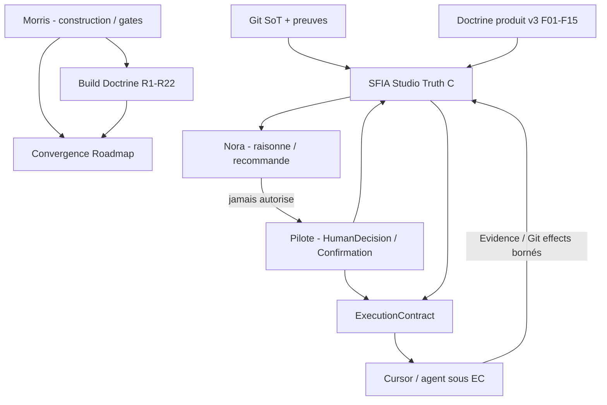
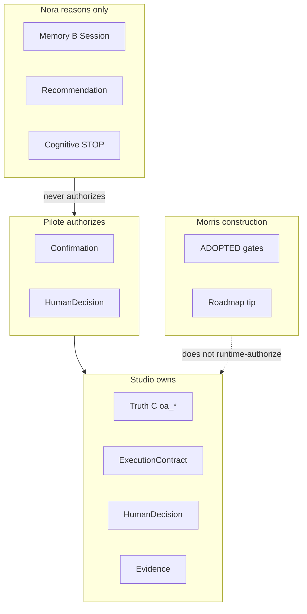
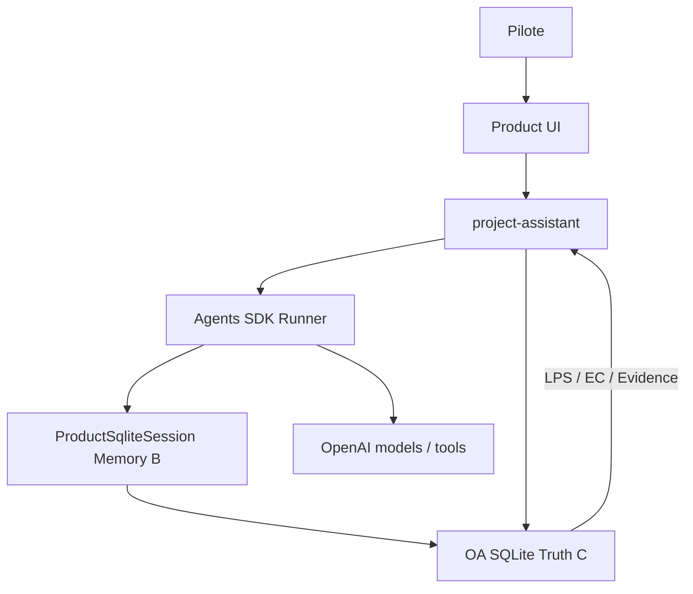
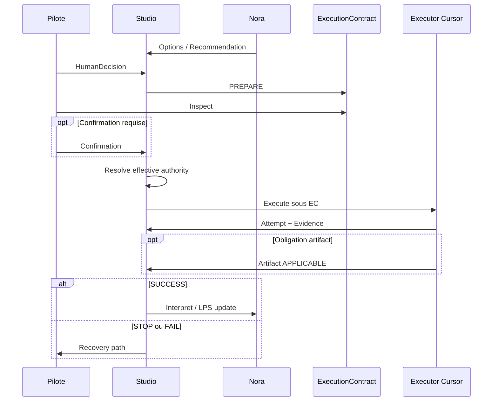

# ChatGPT Review Pack — SFIA Studio Transmission Guide (enrichment)

| Métadonnée | Valeur |
| --- | --- |
| **Timestamp (Europe/Paris)** | 2026-09-16 22:01:47 CEST |
| **Cycle** | Capitalisation / transmission — correction et enrichissement (continuation documentaire) |
| **Prior cycle** | SFIA Studio — Histoire, architecture et guide de transmission (handoff antérieur `9a3544c1` — depuis remplacé sur branche handoff par un autre cycle) |
| **Profile** | STANDARD |
| **Typologie** | DOC |
| **Mode** | REPO-FIRST / DOCUMENTATION-ONLY / ZERO REAL / ZERO PRODUCT MUTATION |
| **Repository** | mcleland147/sfia-workspace |
| **Branch (local checkout)** | `delivery/sfia-studio-gcec-ad-semantic-immutability-alignment` |
| **HEAD (local)** | `0b7463fa892dcad431fe7aabd2b57ecf5747afd9` |
| **origin/main** | `a8a5dffaa84fe25f792074b93696a74722de8fdf` |
| **merge-base** | `0b7463fa892dcad431fe7aabd2b57ecf5747afd9` |
| **Snapshot documentaire** | `origin/main` @ `a8a5dffaa84fe25f792074b93696a74722de8fdf` (inchangé vs review ChatGPT) |
| **Local Git state** | Guide untracked · Review Pack rewritten this continuation · project branch uncommitted · no project commit |
| **Target document** | `projects/sfia-studio/sfia-studio-transmission-guide.md` (**MODIFIED in place**, ~2199 lines / 123511 bytes) |
| **ChatGPT prior verdict consumed** | CHATGPT DOCUMENTARY REVIEW — CHANGES REQUIRED |
| **R-01→R-12 closure** | ALL CLOSED in this lot (see matrix below) |
| **Anti-claims** | Document ≠ doctrine · ≠ Build Doctrine mutation · ≠ Roadmap mutation · ≠ C1 mutation · runtime v3 NON ADOPTED · PC CLOSED · C6 DO NOT REOPEN · Cognitive Completion NOT PROVEN · Stage A Outcome C retained · H17 FAIL retained · GCEC A→D FAIL retained · E NOT PROVEN/NOT AUTHORIZED |
| **Full-content requirement** | **YES** — complete modified guide embedded below |
| **Verdict** | **READY FOR CHATGPT FINAL DOCUMENTARY REVIEW** · ≠ CONTENT VALIDATED BY MORRIS · ≠ GOVERNANCE SOURCE · ≠ RUNTIME V3 ADOPTED |

---

## R-01 → R-12 closure matrix

| ID | Requirement | Closure in guide |
| --- | --- | --- |
| R-01 | Maturity ≠ linearized proof chain | §24.1 V3-F15 · §24.2 proof quals · §24.3 governance states · §24.4 examples · §24.5 anti-chain |
| R-02 | Domain-authoritative sources | §3.1 Git/faits > décisions > SOURCE DU DOMAINE + domain table |
| R-03 | Artifact conditional | Attempt→Evidence default · Artifact APPLICABLE (#483) · Mermaid + anti-confusion #17 |
| R-04 | PC vs REAL-A | §7 table + §25 separate rows · REAL-A #428 post-closure scope exact |
| R-05 | ADOPTED qualified | G0-B / OD-04 phrasing · no bare Memory B ADOPTED · runtime v3 NON ADOPTED |
| R-06 | PC corpus classification nuanced | §30.1 per-role PC/Nora docs |
| R-07 | Architecture object catalog | §5.5 fiches + §8 entrails + OD-04 tour §13 |
| R-08 | MW0–MW6 depth | §14 table + per-MW subsections · H17/H18 · MW6 hosted=1 luna |
| R-09 | Stage A depth | §20 envelope 78/438/26/464 · FinOps 15/18/20 · Outcome C · ZERO REAL rerun · 4 layers |
| R-10 | GCEC depth | §22 A–E · A→D FAIL 3→5 · #480/#481/#482 · phase-scoped · E NOT |
| R-11 | PR chronology detailed | §27.2 ledger material PRs #259…#492 |
| R-12 | Source ledger traceable | §30.2 Section\|Claim\|Path\|Classification\|PR\|SHA\|Evidence |

---

## Source coverage (re-read / used)

- Build Doctrine + Convergence Roadmap (`origin/main`)
- Product Completion 01–06, 14 + W1–W4 / closure docs as needed
- v3 framing 30–37
- Nora Cognitive Completion 01–11
- Process: cycle template v2.6 · routing guide · operating model (process-only)
- Implementation on `origin/main` a8a5dff: `lib/oa/*`, `nora-cognitive-runtime/*`, `project-assistant/*`, `pre-m6-product-ui/*`
- PR archaeology #259…#492 (material)

---

## Validations performed

- Sections 0–30 coherent
- Forbidden linear maturity chain absent (except as anti-example in §24.5)
- Artifact conditional throughout
- REAL-A bounded / separate from PC
- ADOPTED qualified
- Critical fails retained (H17, Outcome C, GCEC A→D FAIL)
- `git diff --check` PASS on guide
- Scope: guide + Review Pack only

---

## Complete modified transmission document

```markdown
# SFIA Studio — Histoire, architecture et guide de transmission

| Métadonnée | Valeur |
| --- | --- |
| **Nature** | **DOCUMENT DE TRANSMISSION / CAPITALISATION** |
| **≠** | doctrine · Build Doctrine · Roadmap · C1 · runtime v3 ADOPTED |
| **Snapshot truth** | `origin/main` `a8a5dffaa84fe25f792074b93696a74722de8fdf` (2026-09-16) |
| **Checkout d’enquête local** | `delivery/sfia-studio-gcec-ad-semantic-immutability-alignment` @ `0b7463fa` (ancêtre, **28 commits derrière**) — la vérité produit décrite ici est **`origin/main`** |
| **Langue** | Français · pédagogique · précis · sans marketing |
| **Rôle** | Transmettre *pourquoi* les couches existent, *où* elles vivent, *ce qui est prouvé*, *ce qui ne l’est pas* |

> Ce fichier **n’autorise rien**. Il ne remplace ni Git, ni une décision Morris, ni la Build Doctrine, ni la Convergence Roadmap, ni le framing v3.

---

## 0. Comment lire ce document

### 0.1 Ordre utile

1. **§1–§3** — vue, pourquoi Studio, sources / gouvernance (domaines **non** hiérarchisés artificiellement).
2. **§4–§5** — doctrine produit v3 + architecture conceptuelle + **catalogue d’objets**.
3. **§6–§7** — histoire des phases + Product Completion (PC).
4. **§8–§11** — runtime (entrailles), autorité, exécution Cursor, recovery / restart.
5. **§12–§20** — Nora (extension de PC), MW0→MW6, mémoire, contexte, Stage A.
6. **§21–§24** — dogfood Product Proof, GCEC, UX, taxonomie de preuve (**axes distincts**).
7. **§25–§26** — **matrice d’état actuel** + ouvert / non prouvé.
8. **§27–§30** — chronologie PR détaillée, glossaire, anti-confusions, ledger des sources.

### 0.2 Grille de lecture d’une couche

Pour chaque couche importante, ce guide répond dans cet ordre :

| Question | Sens |
| --- | --- |
| **Problème** | Quel défaut produit / gouvernance a forcé la couche ? |
| **Avant** | Que faisait-on (ou ne pouvait-on pas faire) ? |
| **Décision** | Quelle décision Morris / doctrine a tranché ? |
| **Ownership** | Qui possède la vérité / l’autorité / l’exécution ? |
| **Interactions** | Avec quelles autres couches ? |
| **Chemins d’impl.** | Où dans `projects/sfia-studio/app/` ? |
| **Preuve** | Quel *axe* atteint (voir §24 — maturité ≠ preuve ≠ cycle) ? |
| **Non prouvé** | Quoi reste ouvert sans euphémisme ? |
| **Durcissement ultérieur** | Que *pourrait* venir ensuite, sans le traiter comme plan actif ? |
| **Statut** | CLOSED / OPEN / RETAINED FAIL / NOT ADOPTED / etc. — **qualifié** |

### 0.3 Séparations de domaine à préserver absolument

| Domaine | Rôle | Ne pas confondre avec |
| --- | --- | --- |
| **Doctrine produit v3** (`sfia-v3-framing/30`–`37`) | Destination *CE QUE* Studio doit être | Runtime ADOPTED |
| **Build Doctrine** R1–R22 | Lois de *construction* | Doctrine runtime |
| **Convergence Roadmap** | État factuel vivante + prochaine capacité | Backlog tickets |
| **Product Completion (PC)** | Boucle produit complète, **COMPLETE/CLOSED** | Nora Cognitive Completion |
| **Nora Cognitive Completion** | Extension cognitive **de** PC | Réouverture de C6 / PC |
| **Processus SFIA v2.6** (template, routing, operating model) | Méthode ChatGPT↔Cursor **externe** | Doctrine Studio |
| **GCEC** | Exécution Git gouvernée sous EC | Autonomie Git / merge libre |
| **Preuve déterministe** | Harness / tests produit | REAL / READY / ADOPTED |

### 0.4 Tip Roadmap (vérité vivante au snapshot)

Sur `origin/main` (tip documentaire) :

- Tip : **GCEC-D-CAPABLE-POST-MERGE-DOCUMENTARY-TRUTH-SYNC-01**
- **ACTIVE CONSTRUCTION PRIORITY = NORA-FIRST** (Nora Cognitive Completion)
- **PC = COMPLETE / CLOSED**
- **runtime v3 = NON ADOPTED**
- **L5 = NOT ADOPTED**
- **NEXT-CAPABILITY REQUALIFICATION** = structurelle (pas un ticket unique figé)
- **GCEC E / merge = NOT PROVEN / NOT AUTHORIZED**
- GCEC est une *lane* ; elle **ne déplace pas** la priorité globale Nora

La Roadmap *vivante* peut encore porter des formulations historiques (« Stage A REAL NOT AUTHORIZED ») alors qu’une **première campagne REAL Stage A** a déjà produit un **Outcome C — INSUFFICIENT EVIDENCE** retenu (§20). Les deux coexistent : readiness ≠ exécution ≠ evidence ≠ acceptance.

---


### 0.5 Comment ne pas lire ce document

- Comme une autorisation d’exécution.
- Comme un plan de livraison actif.
- Comme une preuve que runtime v3 est ADOPTED.
- Comme un substitut à Git `origin/main`.
- Comme une doctrine qui bat Build Doctrine ou Roadmap dans « leur » domaine.

## 1. Vue d’ensemble

SFIA Studio est un produit de **pilotage de projets par cycles gouvernés** : qualification, connaissance (CKC), raisonnement Nora, options / recommandations, trajectoire, décision humaine (Pilote), contrat d’exécution (EC), inspection, confirmations conditionnelles, autorité effective, exécution bornée (souvent Cursor), **Attempt → Evidence** (Artifact **conditionnel** selon obligation/policy), ReviewBundle, interprétation, mise à jour du Living Project State (LPS), recovery.

**Pilote** = rôle runtime d’autorisation humaine. **Morris** = autorité de construction / promotion / gates structurants du dépôt. Un même humain peut jouer les deux rôles sans les fusionner conceptuellement.

Studio vise une boucle métier **unique** (pas une collection d’outils). Les couches (OA Truth C, Memory B, Nora Option C, GCEC, UX Pre-M6, dogfood) existent pour empêcher :

- la confusion recommandation ↔ décision ;
- l’élargissement silencieux d’autorité ;
- le second chemin produit « fixture » ;
- la promotion d’un SUCCESS technique en READY / ADOPTED ;
- la promotion d’une implémentation locale en **ADOPTED** runtime v3 (Morris seul).

---

### 1.1 Ce que Studio n’est pas

- Pas un wrapper ChatGPT.
- Pas un client Git autonome.
- Pas une doctrine runtime « déjà adoptée ».
- Pas une réouverture de PC pour « finir Nora ».
- Pas un second Truth store dans Memory B.
- Pas un harness monolithique A→D comme produit.

## 2. Pourquoi SFIA Studio existe

### Problème

Sans Studio, la méthode SFIA (ChatGPT ↔ Cursor) produisait des cycles utiles mais **hors produit** : prompts, handoffs, Git manuel, peu de continuité sémantique inter-session, pas de contrat d’exécution natif inspectable, pas de séparation claire Observation / Hypothèse / Option / Recommandation / Décision.

### Avant

- Processus v2.4 → v2.5 → **v2.6** (baseline opérationnelle externe).
- Vertical slice / Pre-M6 : MVP fonctionnel après #361 / #362 — **≠ produit terminé**.
- Accumulations historiques (OPS1, vertical-slice, docs `01`–`14` anciens) = harvest / provenance, pas destination.

### Décision structurante

Construire **SFIA Studio v3 exclusive** (doctrine VALIDATED) + gouverner la construction par Build Doctrine + Roadmap, puis **fermer Product Completion** comme boucle produit, puis étendre **Nora** sans rouvrir PC/C6.

### Ownership

| Couche | Owner |
| --- | --- |
| Destination produit | Framing v3 + décisions Morris |
| Lois de construction | Build Doctrine |
| État de construction | Convergence Roadmap + Git |
| Vérité produit runtime | Product SQLite (Truth C) sous Studio |
| Cognition | Nora (raisonne) — n’autorise pas |
| Exécution technique | Cursor/agent sous EC |

### Statut

Produit **utilisable** sur une boucle déterministe intégrée ; **runtime v3 NON ADOPTED** ; Cognitive Completion **NOT PROVEN** ; GCEC A–D **REAL-BACKED AT TESTED SCOPE** ; E **NOT PROVEN**.

---

### 2.1 Formule de valeur (pédagogique)

```text
Cycles gouvernés utiles
= cognition Nora bornée
+ vérité Studio durable
+ décision Pilote explicite
+ exécution sous EC
+ evidence inspectable
+ recovery honnête
− autonomie d’autorité silencieuse
```

## 3. Sources de vérité et gouvernance

### 3.1 Lecture opérationnelle d’autorité (pas une hiérarchie universelle de domaines)

**Règle de lecture** (opérationnelle, pour trancher un conflit factuel) :

```text
Git / faits runtime observables
  > décisions humaines applicables (Morris construction · Pilote runtime)
  > SOURCE AUTORITATIVE DU DOMAINE concerné
```

Les domaines ci-dessous sont **distincts**. On ne les empile **pas** en une hiérarchie universelle du type « Build Doctrine / Roadmap / PC > doctrine v3 ». Chaque domaine porte sa propre source autoritative ; un conflit se résout d’abord par Git/faits, puis par la décision humaine applicable, puis par la source du **domaine** en cause.

| Domaine | Question | Source autoritative (snapshot) |
| --- | --- | --- |
| **Destination produit** | *Quoi* Studio doit être | `sfia-v3-framing/30`–`37` (F01–F15 VALIDATED) |
| **Lois de construction** | *Comment* construire / promouvoir | Build Doctrine R1–R22 |
| **État de construction** | *Où en est-on* / tip / next capability | Convergence Roadmap (vivante) |
| **Cible PC** | Boucle produit fermée | Corpus `product-completion/` + #427 (voir §30 nuance) |
| **Implémentation + preuve** | Ce qui tourne / ce qui est prouvé | Runtime `app/` + tests / harness / evidence |
| **Processus externe** | Méthode ChatGPT↔Cursor hors Studio | SFIA v2.6 (template, routing, operating model) |

**Conséquences pédagogiques :**

- Une phrase de Roadmap **ne bat pas** Git si Git montre un FAIL retenu.
- Une doctrine v3 VALIDATED **ne bat pas** une décision Morris de non-adoption runtime.
- Un PASS déterministe **n’autorise pas** un claim READY / ADOPTED.
- v2.6 **n’est pas** sous-classé « en dessous » de v3 dans une pile unique : c’est un **autre domaine** (process externe).

### 3.2 Trois documents de gouvernance Studio (ne pas fusionner)

| Document | Question | Path |
| --- | --- | --- |
| **Doctrine produit v3** | *Quoi* ? | `projects/sfia-studio/sfia-v3-framing/30`–`37` |
| **Build Doctrine** | *Comment construire* ? | `projects/sfia-studio/convergence/sfia-studio-convergence-build-doctrine.md` |
| **Convergence Roadmap** | *Où en est-on* ? | `projects/sfia-studio/convergence/sfia-studio-convergence-roadmap.md` |

### 3.3 Build Doctrine — R1–R22 (synthèse)

Règles fondatrices (extrait sémantique, pas copie exhaustive) :

- **R1–R2** : lien capacité v3 + boucle métier complète > profondeur locale.
- **R3–R8** : KEEP/ADAPT/HARVEST… ; pas d’architecture parallèle ; capacités e2e.
- **R9–R12** : roadmap de convergence ; chemin critique visible ; Git = SoT technique.
- **R13–R16** : décision humaine structurante ; Nora recommande ; Cursor exécute sous contrat ; automatiser le répétable.
- **R19–R21** : pas de READY/ADOPTED sans preuve ; briques temporaires avec exit ; **fidélité Fake/Real** (fixture = frontière externe, pas second produit).
- **R22** : **Nora OpenAI-native-first** (VALIDATED — ACTIVE ON MAIN via #453) — qualifier d’abord les primitives OpenAI ; elles n’acquièrent jamais l’autorité métier SFIA.

### 3.4 Processus externe v2.6 (HISTORICAL / PROCESS-ONLY pour Studio)

| Actif | Statut | Note |
| --- | --- | --- |
| `prompts/templates/sfia-cycle-execution-template.md` | **SFIA v2.6** baseline | **≠** « v1.2 Generic » |
| `method/.../sfia-cycle-routing-guide.md` | v1.4 VALIDATED process | méthode, pas doctrine Studio |
| `method/.../sfia-chatgpt-cursor-operating-model.md` | v1.1 foundation process | idem |
| `sfia-rules-update.md` | process | idem |
| v2.5 source-routing-map + project-cycles-method | **CANDIDATE historical** | idées harvestées via matrice `36` |

Les idées utiles ont été absorbées dans le **processus v2.6** et dans Studio via **`36-sfia-v2.6-inheritance-and-adaptation-matrix.md`**. **Ne jamais** les faire revivre comme doctrine runtime Studio.

### 3.5 Diagramme d’autorité (conceptuel)


```mermaid
flowchart TD
  Morris[Morris - construction / gates]
  Git[Git SoT + preuves]
  BD[Build Doctrine R1-R22]
  RM[Convergence Roadmap]
  V3[Doctrine produit v3 F01-F15]
  Pilote[Pilote - HumanDecision / Confirmation]
  Studio[SFIA Studio Truth C]
  Nora[Nora - raisonne / recommande]
  EC[ExecutionContract]
  Cursor[Cursor / agent sous EC]

  Morris --> BD
  Morris --> RM
  Git --> Studio
  V3 --> Studio
  BD --> RM
  Pilote --> Studio
  Studio --> Nora
  Nora -->|jamais autorise| Pilote
  Pilote --> EC
  Studio --> EC
  EC --> Cursor
  Cursor -->|Evidence / Git effects bornés| Studio
```

Lecture : le diagramme montre des **dépendances de rôle**, pas un classement « BD > v3 » ou « PC > doctrine ».

---

### 3.6 Domaines — exemples de résolution de conflit

| Conflit | Résolution |
| --- | --- |
| Roadmap dit « NOT AUTHORIZED » mais evidence Git montre campagne Outcome C | Git/faits : campagne a eu lieu ; Roadmap tip = gate **structurelle** readiness/acceptance — coexistent (§20) |
| DOC14 header « INCOMPLETE » vs #427 CLOSED | SoT clôture = #427 + Roadmap + DOC11 ; DOC14 header = pré-décision SUPERSEDED as status |
| Doctrine F15 VALIDATED vs runtime partiel | Destination VALIDATED · runtime NON ADOPTED · couverture progressive |
| Checkout local `0b7463fa` vs description D-capable | Vérité = `origin/main` `a8a5dff` |

## 4. Doctrine v3 et fondations V3-F01…F15

### Problème

Sans fondations explicites : connaissance floue, trajectoire implicite, exécution sans réversibilité, contradictions non traitées, maturité « ressentie ».

### Décision

Pack `37` : **V3-F01…F15 VALIDATED** (doctrine) · Studio **v3 exclusive** · runtime coverage **progressive** · **runtime v3 NON ADOPTED**.

| ID | Titre | Source principale |
| --- | --- | --- |
| V3-F01 | CKC couche cognitive | `30` |
| V3-F02 | Living Project State | `32` |
| V3-F03 | DoctrinePackage | `31` |
| V3-F04 | Épistémologie | `33` |
| V3-F05 | Chaîne conversation→exécution | `30` |
| V3-F06 | ProjectTrajectory | `32` |
| V3-F07 | Provenance / hiérarchie sources | `31` |
| V3-F08 | Contradictions | `33` |
| V3-F09 | Replanification gouvernée | `32` |
| V3-F10 | DebtItem | `35` |
| V3-F11 | AgentCapability | `34` |
| V3-F12 | Réversibilité actions | `34` |
| V3-F13 | Apprentissage contrôlé | `35` |
| V3-F14 | Artifact Completeness | `35` |
| V3-F15 | Maturité distribuée | `35` |

### Ownership / interactions

- Framing = destination ; PC = réalisation boucle ; Nora = extension cognitive ; Roadmap = couverture runtime factuelle.
- **Doctrine VALIDATED ≠ runtime ADOPTED.**
- **ADOPTED** (si présent) est toujours **qualifié par objet** et **Morris-only** (voir §24.1).

### Preuve / non prouvé

- Doctrine : **VALIDATED** (F01–F15) — maturité canonique, **pas** un niveau de preuve.
- Couverture runtime : partielle, progressive, prouvée par lots (PC, MW*, GCEC, dogfood).
- **NOT PROVEN** : adoption runtime v3 globale ; L5 ; Cognitive Completion globale.

---

## 5. Architecture conceptuelle

### 5.1 Couches logiques

| Couche | Responsabilité |
| --- | --- |
| **UX Pre-M6 / Product UI** | Surface Pilote (inspection, confirmation, parcours) |
| **Project Assistant** | Orchestration de tour produit |
| **Nora Cognitive Runtime** | Cognition Option C (Runner + Session) |
| **OA / Product Store** | Truth C — état produit SQLite |
| **Execution / Evidence** | EC, attempts, artifacts **si obligation**, ReviewBundle |
| **GCEC adapters** | Effets Git gouvernés A→D (E stop) |
| **Harness / nora-eval** | Preuves déterministes + campagnes |

### 5.2 Chemins d’implémentation (sous `projects/sfia-studio/app/`)

| Path | Rôle |
| --- | --- |
| `lib/oa/*` | Product SQLite **Truth C** (project, cycle, decision, EC, evidence…) |
| `lib/nora-cognitive-runtime/*` | Nora + `productSqliteSession` (**Memory B**) |
| `features/project-assistant/*` | Orchestration tours / lifecycle / MW bridges |
| `features/pre-m6-product-ui/*` | UX produit |
| `lib/oa/execution-contract/projection/inspectionDisclosure.ts` | Divulgation d’inspection EC (#491) |
| `features/project-assistant/w2/readCurrentGovernedExecutionContinuity.ts` | Continuité EC restart-safe (#492) |
| `lib/oa/execution-contract/domain/semanticFingerprint.ts` | Fingerprint sémantique ≠ version lifecycle |
| `lib/vertical-slice-runtime/*` | Composition stack + boundary REAL |

### 5.3 Boucle produit (vue synthétique) — Artifact **conditionnel**

Chaîne **toujours** gouvernée quand il y a effet :

```text
… → execute → Attempt → Evidence → ReviewBundle → …
```

**Artifact** n’est **pas** un maillon universel. Il est **APPLICABLE** quand une obligation / policy l’exige (ex. `REQUIRE_ARTIFACT` vs `NO_GOVERNED_EFFECTS`, #483). Sinon : Attempt → Evidence **sans** forcer un Artifact dédié (et **pas** de table `oa_artifacts` — voir catalogue).


```mermaid
flowchart LR
  P[Project] --> Q[Qualify]
  Q --> CKC[CKC]
  CKC --> N[Nora]
  N --> O[Options]
  O --> R[Recommendation]
  R --> T[Trajectory]
  T --> HD[HumanDecision]
  HD --> DB[DecisionBasis]
  DB --> ECp[EC PREPARE]
  ECp --> I[Inspect]
  I --> C[Confirmation si requise]
  C --> A[Autorité effective]
  A --> X[Execute]
  X --> Att[Attempt]
  Att -->|toujours si gouverné| Ev[Evidence]
  Att -.->|si obligation/policy| Art[Artifact APPLICABLE]
  Art -.-> Ev
  Ev --> RB[ReviewBundle]
  RB --> Ni[Nora interpret]
  Ni --> LPS[LPS / Trajectory]
  LPS --> Rec[Recovery / cycle suivant]
```

**Interdit de transmettre** : Attempt → Artifact → Evidence comme chaîne **universelle**.

### 5.4 Pourquoi ces couches (et pas un monolithe)

| Risque sans séparation | Couche qui le contient |
| --- | --- |
| Transcript = vérité | Truth C durable |
| Modèle « se souvient » hors produit | Memory B bornée + Truth C |
| Agent décide | Pilote + EC + autorité |
| Exécuteur élargit le scope | AgentCapability ∩ EC ∩ Confirmations |
| Fixture devient produit | R21 Fake/Real + un seul chemin orchestration |
| Merge Git silencieux | GCEC E non autorisé ; capability ≠ authority |
| Artifact « toujours » | Obligation policy #483 — conditionnelle |

### 5.5 Catalogue d’objets architecturaux

Fiches ancrées sur `origin/main` `a8a5dff` (chemins relatifs à `projects/sfia-studio/app/`). **PARTIAL / ABSENT** marqués explicitement. Aucune table inventée.

#### Entrailles transverses (rappel — détail §8)

| Concern | Fait |
| --- | --- |
| Product DB | `SFIA_STUDIO_PRODUCT_DB_PATH` sinon `../.sfia-exec/product/oa-product.sqlite` (`lib/oa/project/infrastructure/sqlite/paths.ts`) |
| Schema | `PRODUCT_SCHEMA_VERSION = m8-0.1.0` ; fail-closed version inconnue (`db.ts`) |
| Tables `oa_*` | `oa_projects`, `oa_lps`, `oa_lps_current`, `oa_cycle_instances`, `oa_human_decisions`, `oa_execution_contracts`, `oa_execution_attempts*`, `oa_evidence*`, `oa_review_bundles*`, `oa_project_trajectories*`, `oa_confirmations`, `oa_epistemic_items`, `oa_ec_inspection_attestations`, `oa_authority_verification_receipts`, `oa_claim_evaluations*`, + audit/idempotency |
| Nora Session DB | `SFIA_STUDIO_NORA_SESSION_DB_PATH` sinon `../.sfia-exec/product/nora-session.sqlite` — tables `session_items`, `logical_product_turns*` (**interdit** d’écrire `oa_*`) |
| `semanticFingerprint` | SHA-256 du matériau d’exécution ; **exclut** status/version/provenance volatiles |
| EC `version` | Lifecycle / OCC — **≠** identité sémantique |
| Inspection | `inspectionDisclosure.ts` (projection allowlist) + `oa_ec_inspection_attestations` (`grantsAuthority: false`) |
| Restart EC | `readCurrentGovernedExecutionContinuity.ts` — lecture seule (#492) |
| Proposal | process-local (`proposalStore.ts`) vs reconstruction Epistemic (`w2_pending_decision_subject`) |

#### Fiches objets

##### Project
- **Pourquoi** : agrégat racine Product (identité, doctrine, cycle actif, binding repo).
- **Nature** : domaine OA M1 ; payload JSON versionné.
- **Owner** : OA Project (`lib/oa/project/`) ; UI `features/studio-projects/`.
- **Persistence** : `oa_projects` (binding **dans** `payload_json`, pas de table dédiée).
- **Paths** : `domain/types.ts` ; `sqliteProjectRepository.ts` ; `createProject.ts`, `setProjectRepositoryBinding.ts`.
- **Relations** : porte LPS courant, CycleInstance actif, RepositoryBinding optionnel.
- **Fail-closed** : path Product qui collisionne D1/OPS1 ; doctrine unresolved.
- **Tests** : `projectLpsFoundation.test.ts`, `m1ProductSqliteDurability.test.ts`, `m1RestartProcessProof.test.ts`.
- **Anti-claims** : ambient `repoRoot` Studio ≠ target projet ; pas de binding implicite.
- **PR / évolution** : fondation `#337` ; lignée continuité `#492`.

##### RepositoryBinding (`ProjectRepositoryBinding`)
- **Pourquoi** : GCEC — cible GitHub explicite pour effets gouvernés.
- **Nature** : champ optionnel de `Project` (pas d’agrégat séparé).
- **Owner** : Project application + projection vertical-slice.
- **Persistence** : dans `oa_projects.payload_json` uniquement.
- **Paths** : `SetProjectRepositoryBinding` ; UI `RepositoryBindingForm.tsx` ; `localProjectComposition.ts`.
- **Relations** : Project → effets GCEC A–D ; Decision Subject projection (#490).
- **Fail-closed / anti-claims** : jamais le workspace ambient comme target.
- **Tests** : `repositoryBindingProjection.d0.test.ts`, `repositoryBindingForm.ui.test.tsx`.
- **PR** : lignée GCEC / dogfood `#490`–`#492`.

##### LivingProjectState (LPS)
- **Pourquoi** : snapshot versionné de l’état vivant (objective, liens cycle/trajectory/epistemic/decisions/evidence…).
- **Nature** : append-only versionné ; pointeur courant.
- **Owner** : OA Project.
- **Persistence** : `oa_lps` + `oa_lps_current`.
- **Paths** : `appendLivingProjectStateVersion.ts` ; `sqliteLivingProjectStateRepository.ts` ; UI `LpsSurface.tsx`.
- **Relations** : Truth C SoT ; Memory B peut référencer `truthCRevision` ; ≠ conversation.
- **Fail-closed** : `LPS_VERSION_CONFLICT`.
- **Anti-claims** : LPS ≠ transcript ; `uiOwnership?: false`.
- **Tests** : `m1Restart*`, `m5W1LpsAppend.test.ts`.
- **PR** : `#337` / continuité `#492`.

##### ProjectTrajectory
- **Pourquoi** : plan d’étapes candidat → validé → actif ; arbitrage Pilote.
- **Nature** : agrégat versionné OCC (`occ_token` courant).
- **Owner** : OA Cycle.
- **Persistence** : `oa_project_trajectories` + `oa_project_trajectory_current`.
- **Paths** : `proposeTrajectoryVersion.ts`, `promoteDecidedTrajectory.ts` ; UI `TrajectorySurface.tsx`.
- **Relations** : OptionSet / Recommendation → HD → Trajectory active ; replan **explicite** seulement.
- **Anti-claims** : Recommendation ≠ décision.
- **Tests** : `cycleTrajectoryEpistemicCkc.test.ts`, `w2EabcDelivery.test.ts`.
- **PR** : W2 lignée `#400`/`#492`.

##### CycleInstance
- **Pourquoi** : instance de cycle gouverné (profil, statut, pause reconciliation, liens trajectory/CKC).
- **Nature** : agrégat durable M2.
- **Owner** : OA Cycle + pilot transitions.
- **Persistence** : `oa_cycle_instances` (`payload_json` pause/qualification).
- **Paths** : `createCycle.ts`, `pilotLifecycleTransitions.ts` ; `sqliteCycleRepository.ts`.
- **Anti-claims** : Capitalization = `cycleTypeId`, pas un profile enum libre.
- **Tests** : `corrProof05.pilotLifecycle.d0.test.ts`, `m2ProductCycleDurability.test.ts`.
- **PR** : `#339`, `#476`, `#492`.

##### CKC / CkcResolution
- **Pourquoi** : résolution de connaissance de cycle (qualification / binding).
- **Nature** : type domaine + resolver ; **ref** durable sur Cycle/LPS.
- **Owner** : OA Cycle CKC + doctrine product index.
- **Persistence** : **pas de table `oa_ckc_*`** ; `ckcResolutionRef` dans payloads ; index `productCkcIndex.ts`.
- **Paths** : `ckcQualificationResolver.ts` ; `lifecycleRecommendation/ckcResolutionRef.ts`.
- **Anti-claims** : `executionAuthority?: false` ; CKC ≠ autorité d’exécution.
- **Tests** : `ckcQualificationResolver.test.ts`, `w3dFullCkcCatalog.test.ts`.
- **PR** : Phase B `#403` ; W3-D `#418`.

##### Proposal
- **Pourquoi** : proposition F2 d’intention/qualification avant décision structurante.
- **Nature** : DTO **process-local** (+ reconstruction Epistemic).
- **Owner** : `features/project-assistant/f2/`.
- **Persistence** : **pas de table Proposal** ; `proposalStore.ts` (`globalThis` Map) ; snapshot optionnel Epistemic.
- **Paths** : `f2/orchestrateF2.ts` ; `w2/activeProposalDecisionSubject.ts` ; `proposalSubjectIntegrity.ts`.
- **Relations** : PresentedOptionSet / pending subject ; survit restart **seulement** via Epistemic marker.
- **Fail-closed** : reinstruction si OptionSet/sujet stale (`CORR-PROOF-10/11`).
- **Anti-claims** : Proposal ≠ HD ≠ EC.
- **Tests** : `f2.orchestrate.test.ts`, `proposalSubjectIntegrity.d0.test.ts`.
- **PR** : `#486`/`#487`/`#492`.

##### Pending Decision Subject / PresentedOptionSet
- **Pourquoi** : sceller le sujet exact et l’OptionSet montré au Pilote.
- **Nature** : Epistemic Observation (`w2_pending_decision_subject` / `w2_presented_option_set`).
- **Owner** : W2 project-assistant.
- **Persistence** : `oa_epistemic_items` (statement JSON).
- **Paths** : `pendingDecisionSubjectMarker.ts`, `presentedOptionSet.ts`.
- **Anti-claims** : decide ne re-dérive jamais les options depuis qualification live.
- **Fail-closed** : digest mismatch → refuse + reinstruction.
- **Tests** : `corrProof10.decisionContextContinuity.d0.test.ts`.
- **PR** : `#486`, `#492`.

##### OptionSet
- **Pourquoi** : ensemble d’options présenté (digest, refs, recommendation Nora).
- **Nature** : binding `PresentedOptionSetBinding` ; DTO trajectoire.
- **Owner** : W2 (`proposeTrajectoryOptions` / `decideTrajectory`).
- **Persistence** : via Epistemic ; digest aussi dans `DecisionBasis.trajectoryContext.optionSetDigest`.
- **Anti-claims** : OptionSet ≠ HumanDecision.
- **Tests / PR** : D0 W2 EABC ; lignée `#400`/`#492`.

##### Recommendation
- **Pourquoi** : conseil Nora (option recommandée / lifecycle) — **jamais** décision.
- **Nature** : `EpistemicItemType = "Recommendation"` ; payload optionnel `lifecycleRecommendation`.
- **Owner** : Cycle epistemic + W2 propose ; materialization `#477`.
- **Persistence** : `oa_epistemic_items` ; CURRENT/STALE **dérivés** (`currentness.ts` : « never stored »).
- **Anti-claims** : `authority: "none"` ; recommendedOptionRef ≠ selectedOptionRef.
- **Tests** : `lifecycleRecommendation.delivery.d0.test.ts`.
- **PR** : `#477`, `#492`.

##### HumanDecision
- **Pourquoi** : arbitrage Pilote durable (GO / refuse / supersede).
- **Nature** : agrégat M3 avec `DecisionBasis`.
- **Owner** : OA Decision.
- **Persistence** : `oa_human_decisions`.
- **Paths** : `recordHumanDecision` ; `sqliteDecisionRepository.ts` ; W2 `decideTrajectory.ts`.
- **Anti-claims** : Nora / Cognitive STOP / Confirmation ≠ HD.
- **Fail-closed** : décision non courante bloque authorize.
- **Tests** : `m3HumanDecisionDurability.test.ts`, `decisionConfirmationAuthority.test.ts`.
- **PR** : `#341`, `#400`, `#492`.

##### DecisionBasis
- **Pourquoi** : preuve de ce qui a été arbitrée (proposal / trajectory_option / candidate_trajectory).
- **Nature** : structure embarquée dans HD (`sourceDigest`, contexts).
- **Owner** : OA Decision + W2 seal.
- **Persistence** : dans `oa_human_decisions.payload_json`.
- **Paths** : `decisionBasisDigest.ts` ; `candidateTrajectoryDecisionBasis.ts`.
- **Anti-claims** : executionBasis intent GCEC non-autoritaire.
- **Tests** : `gcecCr01F2DecisionBasis.d0.test.ts`.

##### Confirmation
- **Pourquoi** : confirmation N1/N2/N3 consommable pour autoriser.
- **Nature** : agrégat **distinct** de HD ; **après** inspection ; **conditionnelle**.
- **Owner** : OA Decision.
- **Persistence** : `oa_confirmations`.
- **Paths** : `confirmForAuthorization.ts` ; `sqliteConfirmationRepository.ts`.
- **Anti-claims** : attestation d’inspection ≠ confirmation.
- **Tests** : `w1ConfirmationDurability.test.ts`.
- **PR** : W1 `#395` ; gouvernance EC `#400`/`#491`.

##### ExecutionContract
- **Pourquoi** : contrat d’exécution gouverné (intent scellé avant attempt).
- **Nature** : agrégat avec fingerprint + version lifecycle.
- **Owner** : OA execution-contract + W2 prepare/inspect/authorize/amend.
- **Persistence** : `oa_execution_contracts`.
- **Paths** : `prepareExecutionContractFromW2Decision.ts`, `inspect*`, `authorize*`, `amend*`.
- **Relations** : HD → PREPARE → Inspect (#491) → Confirm → Authorize → Attempt ; rehydration (#492).
- **Fail-closed** : disclosure incomplete ; continuité EC ambiguë.
- **Anti-claims** : status `validated` ≠ inspected ; receipt ≠ permission.
- **Tests** : `ecInspectionDisclosure.d0.test.ts`, `ecRehydrationContinuity.d0.test.ts`.
- **PR** : `#341`, `#491`, `#492`.

##### AgentCapability / effective authority / AVR
- **Pourquoi** : évaluer suffisance d’exécuteur ∩ HD ∩ EC ∩ confirmations ∩ guardrails.
- **Nature** : `AgentCapabilitySufficiency` dans receipt ; `evaluateAgentCapability` (envelope, pas catalogue Cursor).
- **Owner** : W2 authorize + EC domain.
- **Persistence** : `oa_authority_verification_receipts` (append-only audit).
- **Formule** : `valid human authorization ∩ EC scope ∩ AgentCapability/policy ∩ runtime guardrails ∩ valid required Confirmations = effective authority`.
- **Anti-claims** : `grantsAuthority: false`, `executionTriggered: false`, non rejouable ; **capability ≠ authority**.
- **Tests** : `w2EabcDelivery.test.ts`, `adversarialAuthority.test.ts`.
- **PR** : `#400`, `#491`.

##### ExecutionAttempt
- **Pourquoi** : tentative réelle d’exécution sous EC autorisé.
- **Nature** : agrégat M5 (+ journals safety `m4_*`).
- **Owner** : OA execution-attempt ; `governedExecuteAuthorizedContract.ts`.
- **Persistence** : `oa_execution_attempts`, `oa_execution_attempt_active`, `oa_execution_attempt_result_budget`.
- **Anti-claims** : attempt ≠ evidence verified / PASS.
- **Tests** : `w3aGovernedExecute.test.ts` ; e2e `studio-w3a-governed-execute-runtime.spec.ts`.
- **PR** : `#408`, `#492`.

##### Artifact — **PARTIAL**
- **Pourquoi** : sortie attendue / preuve de matérialisation (docs_write, obligations).
- **Nature** : **pas d’agrégat `Artifact` dédié** ; `expectedOutputs`, completeness, materialization F2/W3a, Evidence typée.
- **Owner** : evidence-review + F2 continuation + W3a effects.
- **Persistence** : via EC inputs/outputs + Evidence/ReviewBundle — **pas de table `oa_artifacts`**.
- **Paths** : `artifactCompleteness.ts` ; `activeCycleGovernedContinuation.ts` ; `ingestDocsWriteArtifactEvidence.ts` ; `corrProof06.artifactObligation.d0.test.ts`.
- **Applicabilité** : `OBLIGATION_POLICY_REQUIRE_ARTIFACT` vs `OBLIGATION_POLICY_NO_GOVERNED_EFFECTS` (#483).
- **Anti-claims** : artifact obligation ≠ auto-HD ; **jamais** maillon universel Attempt→Artifact→Evidence.

##### Evidence
- **Pourquoi** : preuve enregistrée (digest, bindings, disponibilité) — jamais raw payload secret.
- **Nature** : agrégat M5.
- **Owner** : OA evidence-review.
- **Persistence** : `oa_evidence` (+ idempotency).
- **Paths** : `registerEvidence.ts`, `ingestExecutionAttemptEvidence.ts`.
- **Anti-claims** : model assertion ≠ Evidence ; `containsSecrets: false`.
- **Tests** : `m5RestartProcessProof.test.ts`, `w3bProductTerminal.test.ts`.
- **PR** : `#350`, `#413`.

##### ReviewBundle
- **Pourquoi** : assemblage d’evidence pour revue / complétude / freeze.
- **Nature** : agrégat M5.
- **Owner** : OA evidence-review.
- **Persistence** : `oa_review_bundles` (+ idempotency).
- **Paths** : `createReviewBundle.ts`, `freezeReviewBundle.ts`.
- **Tests** : parcours W3b/W3c.
- **PR** : `#413`, `#492`.

##### Contradiction
- **Pourquoi** : conflit epistemic / disposition Nora (candidate vs evidence-backed).
- **Nature** : (1) Epistemic `Contradiction` durable ; (2) runtime `contradictionDisposition.ts`.
- **Owner** : Cycle epistemic + nora-cognitive-runtime.
- **Persistence** : items → `oa_epistemic_items` ; disposition runtime non SoT.
- **Anti-claims** : contradiction ≠ HD ; OpenAI reasoning ≠ SFIA Evidence.
- **Tests / PR** : MW3 `#459` ; `mw3.cognitiveStop.surface.d0.test.ts`.

##### Cognitive STOP
- **Pourquoi** : arrêter la progression cognitive quand prémisse gouvernante invalidée.
- **Nature** : `decideCognitiveStop` — ≠ Execute STOP, ≠ HD, ≠ erreur transport.
- **Owner** : `cognitiveStop.ts` (branché dans `runNoraCognitiveTurn`).
- **Persistence** : **aucune table dédiée** ; signal de tour / UX.
- **Anti-claims** : `notHumanDecision`, `notTechnicalError`, jamais silent SUCCESS.
- **PR** : `#459`.

##### DebtItem — **PARTIAL**
- **Pourquoi** : (modélisé V3-F10) dette liée au LPS.
- **Nature** : **seul** `LivingProjectState.debtItemIds?: string[]` — **pas de type `DebtItem`, pas de table, pas de repo**.
- **Verdict** : placeholder de linkage uniquement — **PARTIAL / ids only**.

##### Provenance / EvidenceLink
- **ProvenanceRecord** : `lib/oa/doctrine/domain/types.ts` — embarqué ; `evidenceRefs?: string[]`.
- **EvidenceLink** : **ABSENT** (aucun symbole dans `app/`).
- **Anti-claims** : provenance ≠ autorité d’exécution.

##### Memory B / ProductSqliteSession
- **Pourquoi** : continuité conversationnelle Agents SDK.
- **Nature** : Session SQLite projet-scopée.
- **Owner** : nora-cognitive-runtime ; wiring F2 `canonicalConversationSession.ts`.
- **Persistence** : `nora-session.sqlite`.
- **Paths** : `productSqliteSession.ts`, `memoryBAvailability.ts`, `memoryBCompaction.ts`.
- **Adoption qualifiée** : **OD-04 OPTION C = ADOPTED AS NORA TARGET ARCHITECTURE** (cible) — **≠** « Memory B = ADOPTED » nu ; **≠** runtime v3 ADOPTED.
- **Anti-claims** : Memory B ≠ Truth C ; compaction non autoritaire ; invalidation si Truth C revision change (#471 `truthCRevision`).
- **Tests / PR** : MW1 `#450`/`#451` ; `#471` ; `#492`.

##### Truth C / Product Store
- **Pourquoi** : SoT durable Project/LPS/Cycle/HD/EC/Attempt/Evidence/…
- **Nature** : `SqliteProductStore` + repos sqlite OA.
- **Owner** : `lib/oa/project/infrastructure/sqlite/*` + vertical-slice.
- **Persistence** : `oa-product.sqlite` tables `oa_*`.
- **Adoption qualifiée** : **G0-B PRODUCT PERSISTENCE ARCHITECTURE DECISION = ADOPTED** (construction) — **≠** runtime v3 ADOPTED.
- **Fail-closed** : `product_sqlite_unsupported_schema`, integrity_check.
- **PR** : `#337` + schéma évolutif.

##### Nora Session
- Voir Memory B (`resolveNoraSessionSqlitePath`, `ProductSqliteSession`). Pas de type nommé `NoraSession` ; c’est la Session product-owned.

##### Lifecycle Recommendation
- **Pourquoi** : recommander FINALIZE_CURRENT_CYCLE / NEXT_CYCLE avec basis fingerprint.
- **Nature** : Epistemic Recommendation + envelope CURRENT/STALE/SUPERSEDED (read-side).
- **Owner** : `lib/oa/cycle/application/lifecycleRecommendation/`.
- **Anti-claims** : recommendation ≠ start cycle ; CTA ≠ auto HD.
- **PR** : `#477`.

##### Obligation Policy
- **Pourquoi** : HD de politique de finalisation (`no-governed-effects` / `require-artifact`).
- **Nature** : sujet HD dérivé `obligationPolicySubjectFor(cycleInstanceId)`.
- **Owner** : `deriveFinalizationApplicability.ts` + `pilotLifecycleActions.ts`.
- **Persistence** : via `oa_human_decisions` (pas de table policy).
- **PR / preuve** : `#483` ; `corrProof06.artifactObligation.d0.test.ts`.

##### Recovery / Replan
- **Pourquoi** : post-evidence / continuité — recover durable facts ; replan trajectoire **uniquement** explicite.
- **Nature** : UI `RecoverySurface.tsx` ; W3-C `w3cPostEvidenceLoop.ts` (`continue|recover|replan|fail_closed`) avec **`replanInvoked: false`** toujours (pas d’auto-replan).
- **Anti-claims** : fail_closed ≠ auto HD.
- **PR** : `#415`, `#492`.

#### Carte de persistence (résumé)

| Objet | Table / store |
| --- | --- |
| Project / LPS | `oa_projects`, `oa_lps`, `oa_lps_current` |
| CycleInstance | `oa_cycle_instances` |
| ProjectTrajectory | `oa_project_trajectories`, `oa_project_trajectory_current` |
| HumanDecision / Confirmation | `oa_human_decisions`, `oa_confirmations` |
| ExecutionContract | `oa_execution_contracts` |
| Inspection / AVR | `oa_ec_inspection_attestations`, `oa_authority_verification_receipts` |
| Attempt / Evidence / ReviewBundle | `oa_execution_attempts*`, `oa_evidence*`, `oa_review_bundles*` |
| Epistemic (OptionSet, Rec, Contradiction, pending subject, LR) | `oa_epistemic_items` |
| Proposal | process-local only (+ snapshot Epistemic) |
| Nora Session / Memory B | `nora-session.sqlite` |
| CkcResolution full object | no dedicated table (ref only) |
| DebtItem / Artifact / EvidenceLink | **no dedicated tables** |

---
### 5.6 Diagramme ownership (objets → owner)


```mermaid
flowchart TB
  subgraph StudioOwn[Studio owns]
    TC[Truth C oa_*]
    EC[ExecutionContract]
    HD[HumanDecision]
    Ev[Evidence]
  end
  subgraph NoraOwn[Nora reasons only]
    MB[Memory B Session]
    Rec[Recommendation]
    Stop[Cognitive STOP]
  end
  subgraph PiloteOwn[Pilote authorizes]
    Confirm[Confirmation]
    HD2[HumanDecision]
  end
  subgraph MorrisOwn[Morris construction]
    Adopt[ADOPTED gates]
    Tip[Roadmap tip]
  end
  NoraOwn -->|never authorizes| PiloteOwn
  PiloteOwn --> StudioOwn
  MorrisOwn -.->|does not runtime-authorize| StudioOwn
```

## 6. Histoire des phases (compacte)

| Ère | Contenu | Ancre typique |
| --- | --- | --- |
| **Méthode SFIA** | v2.4→v2.6 process ChatGPT↔Cursor | template v2.6, routing, operating model |
| **Framing Studio** | Vision → architecture fonctionnelle → UX | docs `01`–`14` historiques + `30`–`37` |
| **Doctrine v3** | F01–F15 VALIDATED | #259 |
| **Build Doctrine + Roadmap** | Lois + état de convergence | #334 |
| **Pre-M6 / MVP** | Vertical slice utilisable | #361 / #362 |
| **Product Completion** | C1–C6 · 5 Epics · 4 Waves · UX PE | #364…#427 |
| **REAL-A** | Frontière REAL **après** clôture PC | #428 |
| **Nora Cognitive Completion** | C1–C5 + MW0→MW6 + Stage A | #430…#471 |
| **Product Proof / dogfood** | Continuité parcours réel Pilote | #472…#492 |
| **GCEC** | A→D gouverné ; E ouvert | #478…#482 (+ #480 FAIL harness) |

Les FAIL et INCONCLUSIVE sont **conservés** comme capitalisation (H17, Stage A Outcome C, GCEC A→D harness FAIL).

---

### 6.1 Pourquoi conserver les FAIL dans l’histoire des phases

Sans H17, Stage A Outcome C et GCEC A→D FAIL, un lecteur futur croirait que chaque MW/campagne est un PASS lisse. La capitalisation Studio **exige** de transmettre les écarts de gouvernance comme faits — pas comme honte à effacer.

## 7. Product Completion

### Problème

Le MVP Pre-M6 prouvait une tranche, pas une **boucle produit complète** gouvernée (qualification → décision → EC → evidence → recovery). Un utilisateur pouvait « démarrer un cycle » sans ProjectTrajectory MUST, sans EC inspectable natif, sans continuité sémantique inter-session, sans séparation nette Pilote runtime vs Morris construction.

### Avant

- Vertical slice / OPS1 / Control Tower / Pre-M6 : preuves locales utiles.
- Consolidation MVP **#361** puis rebaseline **#362** : *main = Product Completion MVP candidate* avec dette gouvernée (UAT-UX-06, recovery, V3-F10 journal, durabilité partielle).
- Runtime v3 **NON ADOPTED** ; M6/M7 **SUPERSEDED / ABSORBED** dans PC (pas de relance M1–M5).

### Décision / structure (C1→clôture)

| Étape | Contenu | Ancre |
| --- | --- | --- |
| **C1** cadrage | Target, Pilote, ProjectTrajectory MUST, continuité MUST, barre PC-BAR | #364 (+ sync #365) |
| **C2** conception | Comportement A→W testable | docs `02-…` |
| **C3** archi fonctionnelle | FC-01…15, flux F1–F7, OPTION A | docs `03-…` |
| **C5** backlog | **5 Epics** · **4 Waves** · P0/P1 | #393 · `05-…` |
| **C6** delta technique | Truth & Authority Durability TD-C6-01…06 | **CLOSED / DO NOT REOPEN** |
| UX PE | Experience architecture, wireframes, visual state | #372/#374/#376 |
| **W1** | Vérité / DoctrinePackage / continuité sélective Confirmation | #395 |
| **W2** | Cognition → Options/Rec/HD/Trajectory · EC inspect/confirm · **STOP BEFORE EXECUTE** · CKC Phase B | #400/#403/#405 |
| **W3** | Execute → Evidence/Review → Recovery/Replan · catalogue CKC 15 | #408/#413/#415/#418 |
| **W4** | Product Experience cohérente `/studio` | #420/#422 |
| Preuve intégrée | DOC14 QA E2E PC-BAR-01…10 · restart A+B | #426 |
| **Clôture** | Morris : COMPLETE / CLOSED | **#427** |

**5 Epics :** A Entrée/qualification · B Raison/trajectoire/décision · C Préparer/autoriser · D Exécuter/prouver/replan · E Product Experience (+ FC-15 transverse).

**4 Waves :** W1 vérité/contexte · W2 cognition/HD · W3 execute/evidence · W4 clôture expérience.

### Boucle (rappel normatif) — chronologie d’apparition

```text
Project → qualify → CKC → Nora → Options → Rec → Trajectory
  → HD → DecisionBasis → EC PREPARE → inspect → Confirmation
  → authority → execute → Attempt → SUCCESS/STOP/FAIL
  → [Artifact SI obligation/policy] → Evidence → ReviewBundle
  → Nora interpret → LPS / traj → Recovery / Replan → restart/resume
```

Tous les maillons **n’ont pas** été livrés d’un coup : W1 porte vérité/continuité ; W2 s’arrête avant execute ; W3 ajoute Attempt/Evidence/Recovery ; W4 unifie l’expérience ; #426 prouve l’intégration ; #427 clôt.

### Preuve PC vs REAL-A (ne pas fusionner)

| Lot | Contenu exact | Statut |
| --- | --- | --- |
| **#426 / #427** | Boucle PC **DETERMINISTIC INTEGRATED PROVEN** ; Morris **COMPLETE / CLOSED** | Preuve **déterministe** intégrée · clôture programme |
| **#428 REAL-A** | **APRÈS** clôture PC — OpenAI **LIVE** `gpt-5.6-sol` reasoning **high** ; Git local READ **REAL** ; GitHub READ **REAL** ; content search **REAL** ; ranged reads **REAL** ; verdict **PASS WITH PARITY GAPS** | Frontière REAL **consommée** · **≠** PC E2E REAL · **≠** runtime v3 |

**Formulation interdite :** « R = REAL-A consumed » comme colonne ambiguë de la matrice PC. Écrire plutôt : PC = DETERMINISTIC INTEGRATED PROVEN (#426/#427) ; REAL-A (#428) = lot **post-closure** distinct.

### Ownership

- **Morris** : clôture PC, C6, gates construction.
- **Pilote** : HumanDecision / Confirmation runtime.
- **Nora** : propose / challenge / interprète — **sans** autorité.
- **Studio** : persiste Truth C, enforce policies.
- **Cursor** : exécute sous EC uniquement.

### Preuve / anti-claims

- **DETERMINISTICALLY PROVEN** integrated product completion (#426 consumé).
- **PASS WITH NON-BLOCKING RESERVES** (PREQA-R*, W3A-D03, W2-CL-R04, PB-RES-REAL-01, Penpot, etc.).
- **≠ REAL** global · **≠ runtime ADOPTED** · **≠ READY FOR V3 ADOPTION** · **≠ L5** · **≠** autorisation GCEC E.
- Headers figés DOC13/DOC14 « INCOMPLETE » = **pré-décision** ; SoT de clôture = Roadmap + DOC11 + #427 (voir §30).

### Statut

**COMPLETE / CLOSED BY MORRIS** — baseline fonctionnelle pour Nora et GCEC. **Ne pas rouvrir** pour « améliorer Nora ».

---

### 7.1 PC corpus — carte rapide des fichiers

| Fichier | Rôle transmission |
| --- | --- |
| `01-…cadrage.md` | C1 **CURRENT VALIDATED TARGET** |
| `02-…conception…` | Comportements testables |
| `03-…architecture-fonctionnelle…` | FC / flux |
| `05-…backlog…` | Epics/Waves source-lock |
| `06-…architecture-technique-delta…` | C6 **DO NOT REOPEN** |
| `07`–`12` wave readiness | Historique waves — KEEP as delivery truth |
| `13` pre-QA | Pré-décision |
| `14` integrated proof | **QA PRE-CLOSURE** #426 |
| `ux-product-experience/` | PE architecture / wireframes |

## 8. Runtime et persistence (entrailles)

### 8.1 Truth C — Product SQLite (`lib/oa/*`)

| | |
| --- | --- |
| **Problème** | État produit volatil / transcript-centré |
| **Décision** | **G0-B PRODUCT PERSISTENCE ARCHITECTURE DECISION = ADOPTED** (construction) |
| **Path DB** | `SFIA_STUDIO_PRODUCT_DB_PATH` sinon `../.sfia-exec/product/oa-product.sqlite` |
| **Open / schema** | `openProductSqlite` · `PRODUCT_SCHEMA_VERSION = m8-0.1.0` · fail-closed version inconnue |
| **Store** | `SqliteProductStore` · factory `createSqliteProductProjectServices` |
| **Ownership** | Studio possède la vérité produit |
| **Contient** | Project, LPS, Trajectory, DecisionBasis, EC, Attempts, Evidence, ReviewBundle, Epistemic… |
| **≠** | Mémoire conversationnelle modèle ; Session OpenAI serveur comme Truth C (**interdit**) |
| **≠ adoption** | **≠ runtime v3 ADOPTED** |

### 8.2 Memory B — ProductSqliteSession

| | |
| --- | --- |
| **Problème** | Continuité cognitive sans polluer Truth C ni inventer une 2ᵉ vérité |
| **Décision** | **OD-04 OPTION C = ADOPTED AS NORA TARGET ARCHITECTURE** (Session custom Product SQLite) |
| **Path DB** | `SFIA_STUDIO_NORA_SESSION_DB_PATH` sinon `../.sfia-exec/product/nora-session.sqlite` |
| **Classe** | `productSqliteSession.ts` |
| **Tables** | `session_items`, `logical_product_turns`, `logical_product_turn_retry_bindings` |
| **Rôle** | Vue / compaction / model-input **bornée** pour Nora |
| **≠** | Autorité ; Evidence ; HD ; Truth C |
| **≠ adoption** | Ne jamais écrire « Memory B = ADOPTED » nu |

### 8.3 `semanticFingerprint` vs `version`

| Dimension | Rôle | Fichier |
| --- | --- | --- |
| **semanticFingerprint** | Identité du *matériau* d’exécution (action/target/scope/inputs…) | `semanticFingerprint.ts` |
| **EC.version** | Lifecycle / OCC (avance sous confirmed→executing→confirmed) | colonne `version` + OCC |
| **Inspection fingerprint** | Matériau sémantique **moins** `confirmationRef` / `immutableAfterConfirm` | `inspectionAttestation.ts` |

**Leçon GCEC (#480) :** fingerprint inchangé + version 3→5 peut être **cohérent**. Traiter `version` comme immutabilité sémantique est un **oracle invalide**.

### 8.4 Inspection disclosure / attestation / rehydration

| Mécanisme | Rôle | Path |
| --- | --- | --- |
| **Disclosure** | Projection allowlist depuis EC durable (path `docs_write`, repo…) — **jamais** rebuild depuis Proposal | `inspectionDisclosure.ts` (#491) |
| **Attestation** | Preuve d’inspection ; `grantsAuthority: false` | `oa_ec_inspection_attestations` |
| **AVR** | Receipt audit-only ; `reusableForFutureExecution: false` | `oa_authority_verification_receipts` |
| **Rehydration** | Lecture Truth C pré-exécution restart-safe ; **aucune écriture** EC/Confirm/Attempt | `readCurrentGovernedExecutionContinuity.ts` (#492) |

**Ce qui survit au restart (Truth C) :** Project, LPS, Cycle, Trajectory, HD/DB, EC pré-exécution + attestation, Evidence/ReviewBundle, Epistemic markers.

**Ce qui ne survit pas seul :** Proposal process-local (sauf marker Epistemic) ; Memory B si DB session absente/invalidée ; attempt *running* post-crash (**hors scope** #492).

### 8.5 Proposal process-local vs Epistemic reconstruction

| Mode | Où | Conséquence |
| --- | --- | --- |
| Process-local | `f2/proposalStore.ts` (`globalThis` Map) | Perdu au restart process |
| Reconstruction | Epistemic `w2_pending_decision_subject` (+ snapshot) | Continuum décisionnel (#486/#492) |
| OptionSet présenté | Epistemic `w2_presented_option_set` | Decide ne re-dérive pas live |

### 8.6 RepositoryBinding

Champ de `Project` (pas de table). Obligatoire pour effets GCEC ciblés. Projection UI + cohérence Decision Subject (#490). **Ambient Studio repo ≠ target.**

### 8.7 Diagramme Nora × Memory B × Truth C


```mermaid
flowchart TB
  Pilote[Pilote]
  UI[Product UI]
  Orch[project-assistant]
  Runner[Agents SDK Runner]
  MemB[ProductSqliteSession Memory B]
  TruthC[OA SQLite Truth C]
  OpenAI[OpenAI models / tools]

  Pilote --> UI --> Orch
  Orch --> Runner
  Runner --> MemB
  MemB --> TruthC
  Runner --> OpenAI
  Orch --> TruthC
  TruthC -->|LPS / EC / Evidence| Orch
```

### 8.8 Catalogue runtime (renvoi)

Le catalogue détaillé des objets est en **§5.5**. Ici : ownership runtime = Studio Truth C + Nora cognition sans autorité.

### 8.9 Statut

Implémenté et prouvé à des portées MW1+ / dogfood / GCEC déterministes ; **runtime v3 NON ADOPTED**.

### 8.10 Ce qui survit / ne survit pas (fiche restart)

| Survit au restart process (Truth C) | Ne survit pas seul |
| --- | --- |
| `oa_projects` + RepositoryBinding payload | Proposal process-local (`globalThis`) |
| `oa_lps` / current | Memory B si `nora-session.sqlite` absente ou invalidée |
| `oa_cycle_instances` + pause payload | Attestation legacy incomplete (fail-closed → reinspect) |
| `oa_project_trajectories` / current | Attempt *running* mid-flight (**hors scope #492**) |
| `oa_human_decisions` + DecisionBasis | Client-only Decision Subject stale |
| `oa_execution_contracts` pré-exécution | Rebuild disclosure depuis Proposal (interdit) |
| `oa_ec_inspection_attestations` | |
| `oa_confirmations` | |
| `oa_authority_verification_receipts` (audit) | |
| `oa_execution_attempts*` terminaux | |
| `oa_evidence*` / `oa_review_bundles*` | |
| `oa_epistemic_items` (pending subject, OptionSet, Rec, Contradiction, LR) | |

**Lecture pédagogique :** #491 sans #492 = le Pilote *voit* une fois, puis le restart **efface la scène**. #492 restaure la scène **depuis Truth C**, pas depuis le client.

### 8.11 Composition runtime (vertical-slice)

| Pièce | Path | Rôle |
| --- | --- | --- |
| Stack OA | `lib/vertical-slice-runtime/service.ts` | Compose repos/services Product |
| Boundary REAL | `composeStudioProductRealBoundary.ts` | REAL OFF-by-default · gateways Cursor/Git |
| Boundary déterministe | `deterministicExternalLaunchBoundary.ts` | Harness / fixtures |
| Git ports | `lib/oa/git-ports/*` | READ bridges · post-merge verify |
| Secrets adapters | `lib/oa/execution-run/infrastructure/secrets/*` | Fake vs env — capability, pas autorité |

---

### 8.12 Attestation vs Confirmation vs AVR (trois objets)

| Objet | Table | Accorde autorité ? | Réutilisable ? |
| --- | --- | --- | --- |
| Inspection attestation | `oa_ec_inspection_attestations` | **Non** (`grantsAuthority: false`) | Selon règles fingerprint |
| Confirmation | `oa_confirmations` | Contribue à effective authority | Consommable / annulable |
| Authority Verification Receipt | `oa_authority_verification_receipts` | **Non** (audit) | `reusableForFutureExecution: false` |

Confusion fréquente : « j’ai inspecté » ≠ « j’ai confirmé » ≠ « j’ai un receipt qui autorise ».

## 9. Décision, autorité, ExecutionContract

### Formule d’autorité effective

```text
valid human authorization
∩ ExecutionContract scope
∩ AgentCapability / policy
∩ runtime guardrails
∩ valid required Confirmations
= effective authority
```

### Chaîne EC (conceptuelle)


```mermaid
sequenceDiagram
  participant P as Pilote
  participant S as Studio
  participant N as Nora
  participant EC as ExecutionContract
  participant X as Executor Cursor

  N->>S: Options / Recommendation
  P->>S: HumanDecision
  S->>EC: PREPARE
  P->>EC: Inspect
  opt Confirmation requise
    P->>S: Confirmation
  end
  S->>S: Resolve effective authority
  S->>X: Execute sous EC
  X->>S: Attempt + Evidence
  opt Obligation artifact
    X->>S: Artifact APPLICABLE
  end
  alt SUCCESS
    S->>N: Interpret / LPS update
  else STOP ou FAIL
    S->>P: Recovery path
  end
```

### Règles dures

- Confirmation **après** inspection ; **conditionnelle**.
- Aucune couche n’élargit seule l’autorité.
- **Capability ≠ authority** (surtout GCEC / Cursor).
- #491 : le Pilote doit *voir* ce qu’il autorise (inspection disclosure).
- #492 : ces faits doivent **survivre au restart** (rehydratation).
- Artifact : **seulement** si obligation/policy (#483).

### 9.1 Confirmation conditionnelle (rappel normatif)

| Situation | Confirmation requise ? |
| --- | --- |
| EC inspecté, policy N1/N2/N3 applicable | **Oui** — après disclosure |
| Obligation `NO_GOVERNED_EFFECTS` | Peut court-circuiter effets ; **≠** auto-HD |
| Obligation `REQUIRE_ARTIFACT` | Effets + artifact attendu ; Confirmation reste sur autorité |
| Attestation `grantsAuthority: false` | **Toujours** — voir ≠ autoriser |

### 9.2 Amend / reinspect

Amend EC → nouvelle identité / supersession selon règles OCC · **reinspect** obligatoire avant Confirmation (#405/#491). Fingerprint sémantique recalculé ; version lifecycle avance.


---

## 10. Exécution Cursor et Git Evidence

### Problème

Cursor est puissant : sans contrat, il devient décideur + exécuteur + mergeur.

### Décision

- R15 : exécute **uniquement** dans un périmètre/contrat gouverné.
- D-GCEC-EXEC-01 : Cursor = **trusted-but-governed technical executor**.
- Pilote = gouverneur d’intention / frontières protégées — **pas** opérateur Git libre.

### Interactions

```text
EC → Attempt → Evidence (execution_attempt:*) → [Artifact si obligation] → ReviewBundle → interprétation Nora → LPS
```

### Preuve

Déterministe large ; REAL borné sur GCEC A–D (voir §22) ; **pas** autonomie Git généralisée ; **GCEC E NOT PROVEN / NOT AUTHORIZED**.

### 10.1 Evidence kinds typiques (GCEC / docs_write)


| Kind (conceptuel) | Sens | Phase |
| --- | --- | --- |
| `execution_attempt:docs_write` | Preuve write docs sous EC | A |
| commit evidence | Preuve commit local | B |
| push evidence | Preuve push remote | C |
| PR-create evidence | Preuve PR GitHub | D |
| merge evidence | **NOT PROVEN** | E |

Evidence **ne contient pas** de secrets (`containsSecrets: false`).


---

## 11. Recovery et restart

### Problème

Crash, perte de tour, restart process : le Pilote ne doit pas « re-décider à l’aveugle » ni rejouer un EC déjà engagé sans continuité.

### Avant

Preuves PC restart A+B déterministes ; gaps dogfood sur continuité EC / projection / journey.

### Décisions / lots

- Continuité parcours (#472, #486–#488).
- Materialization / intent (#483–#485, #489).
- Inspection disclosure (#491) puis **rehydration EC** (#492).

### Pourquoi #492 après #491

#491 oblige à **divulguer** les faits d’inspection. Sans persistence rehydratable, un restart affichait une inspection incomplète ou incohérente → le Pilote ne pouvait plus exercer la même autorité éclairée. #492 restaure une **continuité d’exécution gouvernée restart-safe** (lecture `readCurrentGovernedExecutionContinuity`) **sans** écrire EC/Confirmation/Attempt.

### 11.1 Recovery kinds (W3-C)

| Kind | Sens | Auto ? |
| --- | --- | --- |
| `continue` | Poursuivre post-evidence | Non (Pilote) |
| `recover` | Récupérer faits durables / Exact Rec depuis LPS | Non auto-HD |
| `replan` | Replan trajectoire **explicite** | `replanInvoked: false` toujours côté loop auto |
| `fail_closed` | Stop gouverné | ≠ silent SUCCESS |


### Statut

REAL-BACKED / DETERMINISTIC selon lots ; durcissement ultérieur possible (E2E REAL restart multi-process étendu) **sans** claim ADOPTED runtime v3.

---

## 12. Nora dans Product Completion

### Position

Nora est une **extension cognitive OF PC**, pas un produit parallèle.

| Invariant | Sens |
| --- | --- |
| PC CLOSED | baseline figée pour construction Nora |
| C6 DO NOT REOPEN | pas de réouverture « pour Nora » |
| Nora recommande | Pilote décide |
| Studio owns truth/authority | Option C |

### Backlog source-lock (C5)

- **NR-01…26** · **CE-01…08**
- **NCC-BAR** : critères de barre Cognitive Completion — **non satisfaits globalement** (programme ≠ barre atteinte)

### Statut

Programme actif (NORA-FIRST) ; Cognitive Completion **NOT PROVEN**.

---

## 13. Nora Cognitive Completion (programme)

### Cycles documentaires

| Cycle | Rôle | Ancre |
| --- | --- | --- |
| C1 | Cadrage | #430 |
| C2–C4 | Conception / PE / gaps | #432–#437 |
| C5 | Backlog source-locked MW0→MW6 | #439 |
| OD-04 | Architecture Option C | #445 / #447 |
| MW0–MW6 | Delivery + closures bornées | #442–#465 |
| Stage A | Global Model × Reasoning | #466–#471 |

### OD-04 Option C — tour de bout en bout (profondeur)

**Décision qualifiée :** **OD-04 OPTION C = ADOPTED AS NORA TARGET ARCHITECTURE** (cible architecture Nora). **≠** runtime v3 ADOPTED · **≠** Cognitive Completion PROVEN · **≠** « Memory B = ADOPTED » nu.

#### Chemins

| Étape | Path |
| --- | --- |
| Entrée cognitive | `lib/nora-cognitive-runtime/runNoraCognitiveTurn.ts` |
| Agents runner | `runNoraAgentsTurn.ts` |
| Filtre input modèle | `callModelInputFilter.ts` (intégrité de rôles, **≠** autorité métier) |
| Tool authz | `lib/platform/tools/toolRouter.ts` → `routeToolCall` (deny-by-default) |
| Contexte Studio | `features/project-assistant/f2/studioCognitiveContext.ts` → `composeStudioCognitiveContext` |
| Orchestration produit | `orchestrateTurn.ts`, `mw6GovernedNoraTurn.ts`, `f2/orchestrateF2.ts` |
| Session | `ProductSqliteSession` (Memory B) |

#### Tour typique (pédagogique)

1. **Project Assistant** reçoit l’acte Pilote / message.
2. Compose le **Hybrid Context Envelope** (`composeStudioCognitiveContext`) : LPS / HD / Evidence / ReviewBundle / CKC lens — ancrage méthode (#475).
3. **`runNoraCognitiveTurn`** : dispositions contradiction / STOP / workload / budgets.
4. **`ProductSqliteSession`** charge / compacte la vue Memory B ; invalide si `truthCRevision` diverge (#471).
5. **`runNoraAgentsTurn`** : Agents SDK **Runner** appelle le modèle via settings CWP.
6. **`callModelInputFilter`** : protège l’intégrité des rôles / inputs — **n’accorde aucune autorité SFIA**.
7. Outils : **`routeToolCall`** deny-by-default ; hosted web_search seulement si eligibility + authority (MW6).
8. Sortie Nora = Options / Recommendation / clarification / STOP — **jamais** HD / Confirmation / Execute.
9. Studio matérialise Epistemic / surfaces ; **Pilote** tranche.

**Invariant :** cognition ≠ authority. HITL OpenAI ≠ HD/Confirmation. Trace ≠ Evidence. Responses compaction = **CANDIDATE / NOT ADOPTED**.

 « magique » · ≠ ChatGPT parity prouvée · ≠ production routing · ≠ runtime v3 ADOPTED · ≠ PC réouvert.

---
## 14. MW0 → MW6

Chaque MW est **CLOSED AT PROVEN SCOPE** — pas une validation globale du programme Cognitive Completion (NCC-BAR global **non** satisfait).

### 14.1 Table synthèse

| MW | Problème avant | Décision | PRs | Preuve / anti-claims |
| --- | --- | --- | --- | --- |
| **MW0** | Qualitatif insuffisant pour CE-07 | Harness versionné `nora-eval` + binding BAR | #442 | EXIT PROVEN + NB reserves · ≠ Cognitive Completion |
| **MW1** | Chat process-local / stitching | ProductSqliteSession + compaction gouvernée · jamais B→C silencieux | #450/#451/#452 | REAL BOUNDARY MW1 scope · Responses compaction **CANDIDATE** |
| **MW2** | Model/effort env-only | CWP (Routine/Focused/Deep/High-Assurance) · OD-02 Option B · `modelSettings.reasoning` | #456/#457 | COMPLETE at proven scope · ≠ production routing |
| **MW3** | Contradiction lissée narrativement | Candidate vs evidence-backed · Cognitive STOP | #459/#460 | COMPLETE · ≠ MW4 cross-turn |
| **MW4** | Narrative ≠ Evidence · partialité multi-doc | Grounding cross-turn · honesty post-Evidence · **pas** 2ᵉ Evidence store | #461/#462 | COMPLETE + NB reserves |
| **MW5** | Challenge cosmétique / trop large | Challenge structurel ≤3 · clarification · High-Assurance | #463/#464 | CLOSED + **H17 FAIL retained** · H18 INCONCLUSIVE |
| **MW6** | « Search libre » vs intelligence gouvernée | Hosted web_search sous autorité + eligibility | #465 | COMPLETE · hosted REAL observé **= 1** (`gpt-5.6-luna`) · ≠ browse libre |

### 14.2 MW0 — Eval harness

- **Avant :** preuves cognitives qualitatives insuffisantes pour **CE-07**.
- **NR/CE :** CE-07 · NCC-BAR suite · MW0-S01→S07.
- **Design :** catalog versionné `nora-eval` + BAR binding + campaign budget + product-path F1/F2.
- **Delivery :** **#442** (`99ae9fe3…`, 2026-08-30).
- **Closure :** EXIT **PROVEN WITH NB reserves**.
- **Det :** D0/R1/R2/R3.
- **REAL :** borné historique (usage ≈ $0.049 ≠ invoice) · pas de nouveau REAL dans l’intégration.
- **Réserves :** MW0-R01 BAR-09 NOT_PROVEN/NB · MW0-R02 ChatGPT↔Cursor parity NOT_PROVEN/NB.
- **Anti-claims :** ≠ Cognitive Completion · ≠ final NCC-BAR PASS.
- **Enables :** mesure avant MW1+.

### 14.3 MW1 — Memory B

- **Avant :** chat process-local / stitching.
- **NR/CE :** CE-03/04 · NR-17/20 · S01/S02/S03.
- **Design :** `ProductSqliteSession` + compaction gouvernée · **jamais B→C silencieux** · Option C.
- **Delivery :** **#450** ; corr/closure docs **#451/#452**.
- **Det :** e2e S01→S03 PASS.
- **REAL :** **REAL BOUNDARY PROVEN** (campaign `mw1-real-boundary-corr01-…`).
- **Réserves :** Responses compaction **CANDIDATE/NOT ADOPTED**.
- **Anti-claims :** ≠ E2E REAL global · ≠ Truth C · ≠ « Memory B = ADOPTED » nu (cible = OD-04 Option C).
- **Enables :** MW2 readiness.

### 14.4 MW2 — CWP / Strategy

- **Avant :** model/effort env-only.
- **NR/CE :** CE-05 · NR-03/06/11 · OD-02 **Option B**.
- **Design :** Routine/Focused/Deep/High-Assurance · `modelSettings.reasoning` · Strategy ≠ SFIA Profile ≠ effort ≠ model · CKC Recommendation-only (S02).
- **Delivery :** **#456** ; CORR REAL-exit **#457** (CORR-01..04).
- **Det :** D0 + suites.
- **REAL :** S01 bounded REAL product path.
- **Réserves :** MW2-R01/R02/R03 **CARRIED**.
- **Anti-claims :** ≠ production routing.
- **Enables :** MW3.

### 14.5 MW3 — Contradiction + STOP

- **Avant :** contradiction lissée narrativement.
- **NR/CE :** CE-02 · NR-04/13 · S01/S02.
- **Design :** candidate vs evidence-backed · Cognitive STOP visible (`cognitiveStop.ts`, `contradictionDisposition.ts`).
- **Delivery :** **#459** ; closure **#460**.
- **Det :** MW0→MW3 serial.
- **REAL :** chaîne business `nora-mw0-mw3-business-integrated-real-…` SHA `f6674ddb…`.
- **Réserves :** MW2-R* carry · over-scoped prior FAIL **PRESERVED**.
- **Anti-claims :** ≠ MW4 cross-turn · STOP ≠ HD.
- **Enables :** MW4.

### 14.6 MW4 — Grounding / narrative

- **Avant :** narrative ≠ Evidence · partialité multi-doc.
- **NR/CE :** CE-06/08 · NR-14/25 · S01–S03.
- **Design :** grounding cross-turn · honesty post-Evidence · **pas** 2ᵉ Evidence store.
- **Delivery :** **#461** ; closure **#462**.
- **Det :** CORR-MW4 + serial.
- **REAL :** integrated MW0–MW4 (14/14 invocations, campaign `…mw4-integrated-real…`) ; same-turn blob `a23f57e1…`.
- **Réserves :** RA-06/07 · MW2-R* · R-MW4-REAL-02 · NB.
- **Anti-claims :** ≠ Cognitive Completion.
- **Enables :** MW5.

### 14.7 MW5 — Challenge ≤3 (H17/H18)

- **Avant :** challenge cosmétique / trop large.
- **NR/CE :** NR-02/06/26.
- **Design :** challenge structurel ≤3 · clarification · High-Assurance · fail-closed satisfaction.
- **Delivery :** **#463** ; closure **#464**.
- **Det :** DLV/CORR suites.
- **REAL :** MW5-R2-REAL-03 PASS · cumulative MW0–MW5 **acceptée pour clôture MW5 malgré H17**.
- **H17 FAIL RETAINED :** **141** appels REAL / **100** autorisés (**+41**).
- **H18 INCONCLUSIVE :** mesure coût partielle ≈ **0.1474548 USD** · 68 F1 unmetered · hard-cap upper-bound **NOT PROVEN**.
- **ZERO NEW REAL** au moment de la clôture documentaire.
- **Anti-claims :** ≠ campaign governance PASS · ≠ H17/H18 PASS · **ne pas PASS-wash**.
- **Enables :** MW6 readiness.

### 14.8 MW6 — External source intelligence

- **Avant :** « search libre » vs autorité.
- **NR/CE :** CE-01 · MW6-S01/S02 · NR-03/25.
- **Design :** hosted `web_search` sous eligibility + authority + campaignBudget · OpenAI sources ≠ HD/Evidence.
- **Delivery + closure :** **#465** (`d3fee38b…`) — COMPLETE / CLOSED BY MORRIS AT PROVEN SCOPE — INTEGRATED ON MAIN.
- **Det :** suites ciblées (dont 171 PASS cités en capitalisation).
- **REAL observé :** hosted web_search REAL = **1** · modèle **`gpt-5.6-luna`** · `deterministicBoundaryUsed=false` · `authorityBound=true` · `realAuthorized=true` · `eligible=true` · N2+HD+Confirmation+S1 · handoff `e73ccf0c…`.
- **Anti-claims :** ≠ browse libre · ≠ E2E REAL global · ≠ Stage A PASS · ≠ runtime v3 ADOPTED.
- **Enables :** Stage A W-Sources path.

### 14.9 Lecture pédagogique MW par MW

- **MW0** crée la *mesure* avant d’approfondir.
- **MW1** sépare Memory B (continuité) de Truth C (autorité).
- **MW2** adapte la profondeur cognitive **sans** conférer d’autorité SFIA.
- **MW3** oblige Nora à *stopper* plutôt qu’à lisser une contradiction.
- **MW4** force l’honnêteté grounding / multi-doc.
- **MW5** force le challenge structurel (NR-02/06) sous enveloppe — avec H17/H18 retenus.
- **MW6** ajoute des sources externes **sous** le même modèle d’autorité — pas à côté.

### 14.10 Enchaînement MW → Stage A (une phrase chacun)

MW0 mesure → MW1 continue honnêtement → MW2 adapte la profondeur → MW3 refuse de lisser → MW4 ancre narrative/evidence → MW5 force le challenge (avec H17 retenu) → MW6 ajoute le web sous autorité → Stage A compare modèles×efforts sous contrat **sans** clôturer Cognitive Completion.

---

---

## 15. Memory B et Truth C

| | **Memory B** | **Truth C** |
| --- | --- | --- |
| Support | `ProductSqliteSession` | `lib/oa/*` SQLite produit |
| Contenu typique | items de session, compaction, filtres model-input | LPS, décisions, EC, evidence |
| Autorité | Aucune | Vérité produit |
| Adoption qualifiée | OD-04 Option C = **ADOPTED AS NORA TARGET ARCHITECTURE** | G0-B = **ADOPTED** (construction persistence) |
| Peut être perdu / recomposé ? | selon politiques MW1 | non — SoT produit |
| Preuve | MW1 REAL boundary + dogfood | PC + dogfood + GCEC |

**Règle** : le modèle ne « devient » pas la base ; la Session n’est pas un DoctrinePackage.

CORRECTIF #471 : les tours MW6 doivent continuer à exposer la vue Memory B (`truthCRevision: {lpsId,lpsVersion}`) — défaut découvert en continuation Stage A.

**runtime v3 = NON ADOPTED** dans les deux colonnes.

---

## 16. Context et CKC

### CKC (Cycle Knowledge Contract)

- Guidance cognitive pour un type de cycle / phase.
- **Candidate** typique (ex. cadrage `0.1.0`) — **aucune autorité d’exécution**.
- V3-F01 : CKC = couche cognitive, pas contrat Git.
- Persistence : ref seulement (pas de table `oa_ckc_*`).

### Hybrid Context Envelope (#475)

Problème : Nora raisonnait « générique » hors méthode Studio.
Décision : envelopper le contexte produit + méthode pour ancrer l’advisory (#473 default advisory, #474 method-grounded).
Path : `composeStudioCognitiveContext` / `studioCognitiveContext.ts`.

### Ownership

Studio compose le contexte ; Nora consomme ; Pilote tranche.

---

### 16.1 composeStudioCognitiveContext — contenus typiques de l’enveloppe

L’enveloppe hybride (#475) ancre Nora sur des faits Studio, typiquement :

- identité projet / cycle / trajectory refs ;
- LPS snapshot / revision ;
- HumanDecision courante si présente ;
- Evidence / ReviewBundle summaries ;
- CKC / DoctrinePackage lens (#474) ;
- contraintes d’autorité (Nora n’autorise pas).

Ce n’est **pas** un second LPS. Ce n’est **pas** Memory B. Ce n’est **pas** Evidence.

## 17. Adaptive reasoning

### Problème

Un seul profil cognitif (toujours « soft » ou toujours « hard ») casse soit la sécurité, soit l’utilité.

### Réponse Studio

- Workload profiles (MW2).
- Critical challenge / clarification (MW5).
- Selective-repeat gouverné (Stage A correctifs #470 CORR-03B).
- STOP cognitif / contradiction disposition (runtime + doctrine F08).

### Non prouvé

Routing de production modèle×effort **NOT SELECTED** ; Stage A acceptance **not closed**.

---

## 18. Contradiction et STOP

### Doctrine (V3-F08 / `33`)

Séparer Observation / Hypothèse / Option / Recommandation / Décision. Une contradiction **n’est pas** une décision.

### Runtime

Mécanismes `contradictionDisposition`, `cognitiveStop`, fail-closed sur integrity hosted (#470 CORR-02A), hard-stop config (#470 CORR-03A).

### Règle de transmission

Un STOP / FAIL **retenu** est une preuve de gouvernance, pas un échec à effacer de l’histoire.

---

## 19. External sources

### Problème

Le web / sources externes enrichissent mais corrompent l’autorité si elles deviennent « vérité ».

### Réponse

- Normalisation + authority tagging (runtime Nora).
- MW6 hosted web_search sous autorité gouvernée (observé **1×** `gpt-5.6-luna`).
- Evidence integrity fail-closed si mismatch hosted (#470 CORR-02A).

### Non prouvé

Hosted REAL large-scale ; Astra entitlement ; production grounding policy ADOPTED.

---

## 20. Global Model × Reasoning (Stage A)

### Objectif

Comparer modèles × efforts sous contrat de campagne (envelope, FinOps, sélectivité) — **sans** sélectionner le routing de production.

### Modèles et cellules

| Élément | Fait |
| --- | --- |
| **Primary** | `gpt-5.6-luna` · `gpt-5.6-terra` · `gpt-5.6-sol` × efforts **none/medium/high** × **6** workloads = **54** cellules |
| **Astra challenger** | `gpt-6-astra` × **medium only** × 6 = **6** ONE-SHOT (`isChallenger`, **pas** de selective repeats) |
| **Envelope** | Base 60 · `maxCellExecutions` **78** · `maxModelInvocations` **438** · `maxHostedWebOperations` **26** · `maxAggregateRealCalls` **464** · `maxSelectiveRepeats` **18** (primary only) |
| **Cell ≠ model** | 78 = cellules ; 438 = invocations modèle ; 464 = 438+26 hosted |
| **FinOps** | **15 / 18 / 20** (target/soft/hard) DECIDED · known subtotal ≈ 13.32896 COMPATIBLE · invoice **NOT_OBSERVED** · ≠ autorisation de spend |
| **Pilote-only HD scorer** | G3 `human_decision_pilote_only` · **NO MORRIS RUNTIME PERSONA** · W-Clarification : no synth HD/GO/Confirm (#466) |

### Readiness (≠ exécution)

| Lot | Contenu |
| --- | --- |
| #466 | G1/G2/G3 · Pilote-only scorer |
| #467 | Harness déterministe Stage A (hist. 72/405/429 puis contract v3) |
| #468 | Option C + C6 challenger Astra / contract `global-mr-campaign-contract-v3-candidate` |
| #469 | Docs readiness · ZERO REAL |
| Docs readiness | Qualification financière / drift provider |

Souvent la Roadmap tip dit encore **Stage A REAL NOT AUTHORIZED** (formulation de readiness / gate structurelle).

### Première campagne REAL — Outcome C **RETAINED**

- Première campagne Stage A REAL → **Outcome C — INSUFFICIENT EVIDENCE** (retenu).
- **#470 / #471** : correctifs déterministes — **ZERO REAL rerun**.
- #470 CORR : **01** F2 eval provider binding · **02A** hosted Evidence integrity fail-close · **02B** `hostedSearchObserve` pass-through · **03A** hard-stop `REQUIRED_CONFIG_UNAVAILABLE` · **03B** selective-repeat gouverné.
- #471 : Memory B `truthCRevision` sur tours MW6.
- #470 affirme : Outcome C retenu · Stage A **NOT complete**.
- Ne **jamais** convertir C en PASS.
- Astra entitlement account/API **NOT PROVEN**.

### Distinguer quatre couches

| Couche | Sens | État snapshot |
| --- | --- | --- |
| **Readiness** | Harness/docs prêts ? | avancée (#466–#469) |
| **Execution** | Campagne REAL lancée ? | historique Outcome C |
| **Evidence** | Outcome A/B/C… ? | **INSUFFICIENT EVIDENCE** retenu |
| **Acceptance** | Morris clôture Stage A ? | **non close** |

Au snapshot : readiness avancée · exécution historique Outcome C · evidence insuffisante · **acceptance non close**.

**Anti-claims Stage A :** ≠ production routing · ≠ Cognitive Completion PROVEN · ≠ runtime v3 ADOPTED · Outcome C ≠ PASS · correctifs ≠ rerun REAL.

### 20.1 Contrat de campagne — lecture des plafonds

```text
maxCellExecutions        = 78     # cellules (primary 54 + challenger 6 + marge selective)
maxModelInvocations      = 438    # dérivé cellules × invocations
maxHostedWebOperations   = 26
maxAggregateRealCalls    = 464    # 438 + 26
maxSelectiveRepeats      = 18     # primary only — Astra = ONE-SHOT
FinOps target/soft/hard  = 15 / 18 / 20 USD
```

**Cell ≠ model invocation ≠ hosted op ≠ aggregate call.** Confondre ces compteurs est une erreur de transmission fréquente (et a contribué à des lectures H17/H18 incorrectes si on réécrit l’histoire).

### 20.2 Selective-repeat et hard-stop (#470)

| CORR | Problème | Correction |
| --- | --- | --- |
| 01 | F2 eval provider binding | Binding provider correct |
| 02A | Hosted Evidence integrity | Fail-closed mismatch |
| 02B | Observe hosted search | Pass-through `hostedSearchObserve` |
| 03A | Config manquante | Hard-stop `REQUIRED_CONFIG_UNAVAILABLE` |
| 03B | Selective-repeat non gouverné | Selective-repeat **gouverné** |

Tous : **ZERO REAL rerun** — Outcome C **reste** INSUFFICIENT EVIDENCE.


---

## 21. Product Proof (dogfood) #472–#492

### Problème

Les preuves MW isolées ne garantissent pas qu’un Pilote traverse **le produit réel** sans ruptures de continuité, d’autorité ou d’inspection. Le dogfood expose les écarts d’intégration.

### Chaîne corrective — causalités (symptôme → cause → correction → invariants → preuve → anti-claim)

#### #472 — Continuité conversation hybride
- **Symptôme :** conversation « naturelle » cassée entre tours.
- **Cause :** session non partagée / Memory B non rejouée vers analyzeIntent.
- **Correction :** continuité session hybride · Memory B → analyzeIntent.
- **Invariants :** Pilote garde HD ; Studio owns truth.
- **Preuve :** D0 product-path.
- **Anti-claim :** ≠ Stage A PASS · ≠ runtime v3 ADOPTED.

#### #473 — Advisory-by-default
- **Symptôme :** pression return-to-ChatGPT bloquante.
- **Cause :** formalisation mutante / path trop coercitif.
- **Correction :** advisory-by-default · formalisation non mutante.
- **Invariants :** Rec ≠ HD.
- **Preuve :** D0.
- **Anti-claim :** ≠ obligation ChatGPT.

#### #474 — Method-grounded advisory
- **Symptôme :** advisory hors méthode Studio.
- **Cause :** absence de lens CKC/DoctrinePackage same-run.
- **Correction :** lens CKC/DoctrinePackage.
- **Invariants :** CKC ≠ autorité.
- **Preuve :** D0.
- **Anti-claim :** ≠ CKC exécute.

#### #475 — Hybrid Context Envelope
- **Symptôme :** contexte Studio trop mince.
- **Cause :** LPS/HD/Evidence absents de l’enveloppe cognitive.
- **Correction :** HCE / Composer-first (`composeStudioCognitiveContext`).
- **Invariants :** cognition ≠ authority.
- **Preuve :** `corrProof04.d.hybridContextEnvelope.d0.test.ts`.
- **Anti-claim :** ≠ Truth C dans Session.

#### #477 — Lifecycle Recommendations
- **Symptôme :** recs hors lifecycle.
- **Cause :** recommandations non gouvernées Epistemic.
- **Correction :** Nora → EpistemicItems lifecycle.
- **Invariants :** Rec ≠ HD · CTA ≠ auto-start.
- **Preuve :** lifecycleRecommendation D0.
- **Anti-claim :** ≠ auto cycle.

#### #483 — Obligation Artifact sélectionnable
- **Symptôme :** Artifact implicite / toujours attendu.
- **Cause :** pas de policy Pilote `REQUIRE_ARTIFACT` vs `NO_GOVERNED_EFFECTS`.
- **Correction :** obligation sélectionnable (#483 CORR-PROOF-06).
- **Invariants :** Artifact **APPLICABLE** seulement ; capability ≠ auto-write.
- **Preuve :** `corrProof06.artifactObligation.d0.test.ts`.
- **Anti-claim :** ≠ Attempt→Artifact→Evidence universel.

#### #484 — Materialization dans cycle actif
- **Symptôme :** materialization hors cycle actif.
- **Cause :** continuation non bornée au cycle courant.
- **Correction :** continue dans cycle actif · `docs_write` bound.
- **Invariants :** cycle ownership.
- **Preuve :** D0.
- **Anti-claim :** ≠ GCEC E.

#### #485 — Intent materialization canonique
- **Symptôme :** intent materialization flou.
- **Cause :** absence de contrat `artifactMaterializationOperation`.
- **Correction :** contrat d’intent.
- **Invariants :** intent scellé avant effets.
- **Preuve :** D0.
- **Anti-claim :** ≠ HD.

#### #486 — Decision subject au restart
- **Symptôme :** Decision subject perdu au restart.
- **Cause :** Proposal process-local sans marker Epistemic.
- **Correction :** continuité Proposal decision (Epistemic).
- **Invariants :** decide ne re-dérive pas live.
- **Preuve :** CORR-PROOF-10 D0.
- **Anti-claim :** ≠ Proposal = HD.

#### #487 — Reinstruction / langage Pilote
- **Symptôme :** reinstruction / langage Pilote cassé.
- **Cause :** continuité de reformulation absente.
- **Correction :** continuité reinstruction.
- **Invariants :** fail-closed stale OptionSet.
- **Preuve :** CORR-PROOF-11 D0.
- **Anti-claim :** ≠ auto-GO.

#### #488 — Journey canonique
- **Symptôme :** journey non canonique.
- **Cause :** chemins parallèles Project/Nora/EC.
- **Correction :** Project→Nora→Proposal→Options/HD→DB→docs_write PREPARE→EC→Inspect.
- **Invariants :** un seul chemin produit.
- **Preuve :** journey integrity D0.
- **Anti-claim :** ≠ REAL Cursor blanket.

#### #489 — Scope materialization Nora→F2
- **Symptôme :** materialization trop large.
- **Cause :** Nora écrivait hors F2.
- **Correction :** scope déterministe Nora → F2.
- **Invariants :** Studio owns materialization authority path.
- **Preuve :** D0.
- **Anti-claim :** ≠ Memory B → Truth C silencieux.

#### #490 — RepositoryBinding + DS coherence
- **Symptôme :** projection repo/DS incohérente.
- **Cause :** ambient repo / subject mismatch.
- **Correction :** RepositoryBinding + Decision Subject coherence.
- **Invariants :** ambient ≠ target.
- **Preuve :** D0.
- **Anti-claim :** ≠ GCEC E.

#### #491 — Inspection disclosure
- **Symptôme :** inspection sans path exact visible.
- **Cause :** attestation fingerprint-only / faits incomplets.
- **Correction :** disclosure allowlistée avant Confirmation · fail-closed legacy incomplete.
- **Invariants :** voir ≠ autoriser ; `grantsAuthority: false`.
- **Preuve :** Det D0 · **ZERO REAL** dans le PR.
- **Anti-claim :** ≠ Confirmation auto · ≠ runtime v3 ADOPTED.

#### #492 — Rehydration EC restart-safe
- **Symptôme :** restart casse la continuité EC pré-exécution.
- **Cause :** disclosure non rehydratable / DS client stale.
- **Correction :** rehydration Truth C · lignée HD/DB · docs_write path · fail-closed stale Proposal DS · **aucune écriture** EC/Confirm/Attempt.
- **Invariants :** restart-safe pré-exécution seulement.
- **Preuve :** `ecRehydrationContinuity.d0.test.ts` · DETERMINISTIC PROVEN at tested scope · merge `a8a5dffa…`.
- **Anti-claim / hors scope :** attempt running / post-exécution · Cursor REAL blanket · authenticated restart reproof clos · **≠ runtime v3 ADOPTED**.

### Lots intercalaires lifecycle / GCEC

#476 (pilot lifecycle) · #478–#482 (greenfield + GCEC) s’intercalent : ne pas les lire comme « Nora MW » ni comme « Stage A PASS ».

### Lien #491 → #492

#491 exige que l’inspection **divulgue** avant Confirmation. Sans #492, un restart laissait ces faits non rehydratables → fail-closed ou décision à l’aveugle. #492 rend la disclosure **restart-safe**.

### Statut

Chaîne dogfood **intégrée sur main** jusqu’à #492 au snapshot ; preuve surtout **DETERMINISTIC / product-path** ; reproof authentifié manuel / Cursor REAL Product Proof **≠** clos par ces PRs ; **runtime v3 NON ADOPTED**.

---

## 22. GCEC (Governed Cycle Execution / Git lifecycle) — profondeur A–E

### Problème

Besoin d’effets Git **réels** sous EC sans conférer l’autorité de merge / production.

### Décisions structurantes

- Cursor = exécuteur technique préféré sous EC (D-GCEC-EXEC-01) — **trusted-but-governed**.
- **Capability ≠ authority.**
- EC **phase-scoped** (pas de replay monolithique A→D comme orchestration normative).
- Tip documentaire : **GCEC-D-CAPABLE-POST-MERGE-DOCUMENTARY-TRUTH-SYNC-01** (#482).
- Capitalisation : `convergence/sfia-studio-gcec-d-capable-post-merge-capitalisation.md`.

### Matrice de phases A–E

| Phase | Effet | Capability | Statut CURRENT (tested scope) |
| --- | --- | --- | --- |
| **A** | `docs_write` | Oui | **HISTORICAL REAL PROVEN / REAL-BACKED AT TESTED SCOPE** |
| **B** | local `git.commit` | Oui | **HISTORICAL REAL PROVEN AT TESTED SCOPE** |
| **C** | remote `git.push` | Oui | **HISTORICAL REAL PROVEN / REAL-BACKED AT TESTED SCOPE** |
| **C→D** | cross-EC → PR-create | Continuity rule | **DETERMINISTICALLY PROVEN + REAL-BACKED BY D CAMPAIGN AT TESTED SCOPE** |
| **D** | `github.pr.create` | Oui (#481) | **REAL PROVEN AT TESTED SCOPE** (proof PR `sfia-gcec-proof-task-manager#1` OPEN/untouched à l’intégration) |
| **E** | `github.pr.merge` | Paths ? | **NOT PROVEN / NOT AUTHORIZED** |

### A→B (même EC / tested scope)

A→B REAL at tested scope documenté (D-GCEC-REAL-02-CLOSURE / GCEC-REAL-A2B-02 · proof commit historique `acc4a8c2…`). **≠** full EC completion (historique : EC pouvait rester `confirmed` après B) · **≠** push/PR/merge.

### FAIL historique A→D (à conserver) — #480

1. Campagne REAL A→D **autorisée et démarrée**.
2. Attempt A (`docs_write`) techniquement OK + Evidence `execution_attempt:docs_write` **OBSERVÉ**.
3. Acceptance A **NOT CLOSED** ; B/C/D/E **NOT STARTED** ; effets remote produit pendant campagne : **NONE**.
4. Harness a traité `ExecutionContract.version` comme **sémantiquement immutable** (invariant invalide).
5. Observation acceptée : **semantic fingerprint inchangé** ; version **3→5** cohérente avec T-A5 `confirmed → executing → confirmed`.
6. Runtime Product **OK** ; campagne acceptance non atteinte → verdict **FAIL REAL**.
7. **#480** corrige l’oracle / alignement sémantique+lifecycle (séparer fingerprint du version OCC ; freeze binding après Confirmation ; recompute aux checkpoints). **Runtime Product inchangé.** ZERO REAL dans l’intégration #480.
8. Le **FAIL de campagne est RETAINED** (tip historique `GCEC-A2D-REAL-FAIL-HARNESS-ALIGNMENT-01`) ; correction ≠ preuve A→D E2E REAL PASS.

### D-capable (#481 / #482)

- **#481** : chaîne Product D-capable intégrée — B binding, HTTPS push capability, Cursor full-capability, C→D VERIFIED Evidence + RepositoryRead. **D REAL AT TESTED SCOPE.** E NOT PROVEN. Roadmap inchangée dans #481.
- **#482** : truth-sync documentaire tip GCEC-D-CAPABLE… + capitalisation ; Nora reste priorité globale ; E OPEN.

### Secrets / network comme gaps de **capability** (pas d’autorité)

Capitalisation GCEC retient :

- Gap auth HTTPS pour push = **capability technique**, distincte de l’autorité d’exécution.
- Investigation D : secret/credential valides mais sandbox bloquant DNS/network = échec de **capability**, pas preuve d’absence d’autorité.
- Internet/credential capability **≠** permission to mutate.

### EC phase-scoped vs harness monolithique

- Preuve D alignée sur EC **phase-scoped**.
- Harness monolithique A→D = **proof harness** ≠ orchestration normative runtime.
- Monolithic A→D replay **not required** comme condition normative.

### Cursor full-capability

**RO REAL-BACKED AT TESTED SCOPE** et intégré à la chaîne D-capable — toujours borné par **technical capability ≠ execution authority**.

### Règle de transmission

**Capability ≠ authority.** A–D capables ≠ E autorisé ≠ autonomie PR/Git ≠ runtime v3 ADOPTED ≠ L5. Morris merge d’un Product PR ≠ Product E.

### Ce qui reste ouvert (GCEC)

- E / merge : **NOT PROVEN / NOT AUTHORIZED**
- Full EC completion/finalization : **NOT PROVEN**
- A→D E2E REAL acceptance : FAIL retenu · pas converti en PASS
- Lane GCEC peut **pauser à D** ; ne déplace pas NORA-FIRST

### 22.1 Chronologie pédagogique GCEC (une page)

1. **#478** — consolider greenfield lifecycle (macro avant GCEC).
2. **#479** — harness A→D + STOP before E ; à ce PR, A/B/C/D REAL **NOT PROVEN**.
3. Campagne REAL A→D **STARTED** → Attempt A OK → oracle version invalide → **FAIL REAL** retenu.
4. **#480** — corrige oracle (fingerprint ≠ version) · Product runtime inchangé · FAIL retained.
5. **#481** — Product D-capable intégré · D REAL AT TESTED SCOPE · E NOT.
6. **#482** — tip documentaire + capitalisation · NORA-FIRST rappelé · lane peut pauser à D.

### 22.2 Anti-claims GCEC (liste courte)

- D ≠ E
- D ≠ merge authorized
- capability ≠ authority
- Internet/credential capability ≠ permission to mutate
- phase-scoped EC ≠ global L5
- monolithic A→D harness ≠ normative runtime
- historical A→D FAIL ≠ current D-capable target architecture failure
- Morris merge of Product PR ≠ Product phase E
- runtime v3 NON ADOPTED


---

### 22.3 Secrets et sandbox — pédagogie

Quand un push/PR échoue alors que le secret est valide :

1. Vérifier d’abord **capability technique** (DNS, sandbox, HTTPS credential propagation).
2. Ne **pas** conclure « pas d’autorité » à partir d’un échec réseau.
3. Ne **pas** conclure « autorité OK » à partir d’un secret présent.
4. L’autorité reste : HD ∩ EC ∩ Confirmations ∩ capability ∩ guardrails.

## 23. UX

### Problème

Sans UX Product Experience, l’autorité reste dans les logs / handoffs.

### Réponse

- `features/pre-m6-product-ui/*` + Project Assistant panel.
- Décisions UX historiques CC-D* (panneau vivant, confirmations N1–N3, Project ≠ Cycle).
- Wave 4 PC : clôture d’expérience produit (déterministe).
- Dogfood : disclosure (#491), journey (#488), obligations artifact (#483), RepositoryBinding form.

### Non prouvé

Parité ChatGPT↔Cursor workflow ; polish L5 ; **runtime v3 NON ADOPTED** (UX inclusive).

---
## 24. Preuve et maturité (taxonomie) — axes **distincts**

> **Interdit :** une chaîne linéaire unique du type `DOCUMENTED → … → ADOPTED` qui **englobe** les niveaux de preuve (LIVE/REAL/…) comme « étapes de maturité ». V3-F15 = maturité **distribuée par objet**. Preuve ≠ maturité ≠ états de cycle.

### 24.1 Maturité canonique V3-F15 (par objet)

Échelle de maturité **d’objet** (doctrine / modélisation / implémentation / adoption) :

| État | Sens | Qui décide l’adoption |
| --- | --- | --- |
| **DOCUMENTED** | Décrit / nommé | — |
| **VALIDATED** | Validé comme doctrine / conception applicable | Morris (doctrine) |
| **MODELED** | Modélisé (schémas / types / contrats) | — |
| **IMPLEMENTED** | Présent dans le runtime / code | — |
| **ADOPTED** | Adoption **explicite** de l’objet / décision | **Morris-only** |

Règles :

- Maturité **distribuée** : F01 peut être VALIDATED doctrine + IMPLEMENTED partiel runtime **sans** ADOPTED runtime v3.
- **Implémentation locale ≠ adoption.** Un module sur main n’est pas « ADOPTED » runtime v3.
- **ADOPTED** doit toujours être **qualifié** : objet + portée.
  - Ex. **G0-B PRODUCT PERSISTENCE ARCHITECTURE DECISION = ADOPTED**
  - Ex. **OD-04 OPTION C = ADOPTED AS NORA TARGET ARCHITECTURE**
  - **Interdit :** « Memory B = ADOPTED » nu.
- **runtime v3 = NON ADOPTED** au snapshot (toujours).

Exemples Studio (maturité) :

- **F01–F15** : doctrine **VALIDATED** (#259 / pack `37`).
- PC boucle : **IMPLEMENTED** + clôture cycle **COMPLETE/CLOSED** (#427) — **≠** ADOPTED runtime v3.
- G0-B / OD-04 : ADOPTED **qualifiés** ci-dessus.
- runtime v3 global : **NON ADOPTED**.

### 24.2 Qualifications de preuve (**pas** d’ordre total)

Ces labels **qualifient une campagne / un harness / une evidence**. Ils **ne** s’insèrent **pas** entre MODELED et ADOPTED comme une échelle unique.

| Qualification | Sens |
| --- | --- |
| **deterministic** | Reproductible hors LIVE/REAL (fixtures / D0 / Vitest / Playwright déterministe) |
| **LIVE** | Frontière provider live **si** utilisée (ex. OpenAI LIVE) — qualifier le provider/modèle |
| **REAL** | Effets / lectures réelles (Git, GitHub, hosted search…) dans une campagne |
| **REAL-BACKED AT TESTED SCOPE** | REAL vrai **mais borné** au scope testé — ≠ autonomie généralisée |
| **PASS / FAIL / INCONCLUSIVE** | Verdict de campagne / oracle — **FAIL/INCONCLUSIVE retenus** sont capitalisation |
| **evidence retained** | Preuve / FAIL / Outcome conservé (ne pas effacer) |
| **tested scope** | Frontière explicite de ce qui a été prouvé |

**Pas d’ordre total** entre deterministic / LIVE / REAL / PASS : une campagne peut être REAL + FAIL ; un lot peut être deterministic PASS sans REAL.

### 24.3 États de cycle / gouvernance (non interchangeables)

| État | Famille | Sens |
| --- | --- | --- |
| **COMPLETE** | Cycle / lot | Travaux du lot terminés au scope |
| **CLOSED** | Gouvernance | Morris / process a **fermé** le lot |
| **READY** | Gate | Prêt pour une **prochaine** autorisation — **≠** SUCCESS |
| **NOT READY** | Gate | Pas prêt |
| **AUTHORIZED** | Autorité | GO explicite pour une action/campagne |
| **NOT AUTHORIZED** | Autorité | Pas de GO |
| **ADOPTED** | Adoption (Morris) | Voir §24.1 — **qualifié** |

**Non interchangeables :** COMPLETE ≠ CLOSED ≠ READY ≠ AUTHORIZED ≠ ADOPTED. SUCCESS technique ≠ READY ≠ ADOPTED.

### 24.4 Exemples Studio (lecture croisée)

| Exemple | Maturité (§24.1) | Preuve (§24.2) | Cycle/gouv (§24.3) |
| --- | --- | --- | --- |
| F01–F15 | **VALIDATED** (doctrine) | n/a (doctrine) | doctrine pack CLOSED |
| PC boucle | IMPLEMENTED (runtime partiel) | **deterministic** integrated (#426) | **COMPLETE / CLOSED** (#427) |
| MW5 | IMPLEMENTED at scope | REAL campaign + **H17 FAIL** retained · H18 **INCONCLUSIVE** | **CLOSED** at proven scope (+ deviation) |
| Stage A | harness IMPLEMENTED | Outcome **C** · evidence retained · **ZERO REAL rerun** #470/#471 | readiness ≠ acceptance · **NOT complete** |
| runtime v3 | destination VALIDATED · runtime partiel | partiel | **NON ADOPTED** |

Identités **interdites** (rappel) :

- `SUCCESS ≠ READY ≠ ADOPTED`
- `DETERMINISTIC PROVEN ≠ REAL`
- `REAL-BACKED AT TESTED SCOPE ≠ autonomie généralisée`
- `COMPLETE/CLOSED AT PROVEN SCOPE ≠ Cognitive Completion PROVEN`
- `Outcome C ≠ PASS`
- `local IMPLEMENTED ≠ ADOPTED`

---

### 24.5 Tableau anti-chaîne (ce qu’il ne faut pas écrire)

| Formulation interdite | Remplacer par |
| --- | --- |
| DOCUMENTED→MODELED→IMPLEMENTED→DETERMINISTIC→LIVE→REAL→READY→ADOPTED | Trois axes §24.1 / §24.2 / §24.3 |
| Memory B = ADOPTED | OD-04 OPTION C = ADOPTED AS NORA TARGET ARCHITECTURE |
| PC REAL-A consumed (comme preuve PC) | PC = DETERMINISTIC INTEGRATED PROVEN ; REAL-A = #428 post-closure |
| Attempt→Artifact→Evidence (universel) | Attempt→Evidence ; Artifact si obligation |
| MW5 PASS global | CLOSED at proven scope + H17 FAIL retained |
| Stage A PASS via #470 | Outcome C retained · ZERO REAL rerun |
| GCEC A→D PASS via #480 | FAIL retained · oracle corrigé |
| runtime v3 ADOPTED (implicite) | **runtime v3 NON ADOPTED** |

## 25. État actuel des capacités — CURRENT-STATE MATRIX

Snapshot : `origin/main` `a8a5dffa…` (2026-09-16).

**Colonnes (séparées — ne pas fusionner) :**

| Colonne | Sens |
| --- | --- |
| **Doctrine / décision** | VALIDATED / ADOPTED **qualifié** / ACTIVE / process… |
| **Implementation** | Présence code / intégration |
| **Deterministic** | Preuve D0 / harness / E2E déterministe |
| **REAL** | REAL / LIVE / REAL-BACKED / Outcome… **borné** |
| **Closure** | COMPLETE / CLOSED / NOT complete… |
| **Runtime adoption** | **runtime v3** et adoptions **qualifiées** — jamais « Ad » ambigu |
| **Reserves** | Écarts retenus |
| **Next gate** | Prochaine porte honnête |

| Capacité | Doctrine / décision | Implementation | Deterministic | REAL | Closure | Runtime adoption | Réserves | Next gate |
| --- | --- | --- | --- | --- | --- | --- | --- | --- |
| Doctrine v3 F01–F15 | **VALIDATED** | couverture progressive | n/a | n/a | doctrine CLOSED | **runtime v3 NON ADOPTED** | couverture runtime progressive | preuves runtime ciblées |
| Build Doctrine R1–R22 | ACTIVE / VALIDATED | n/a | n/a | n/a | VALIDATED | ACTIVE ON MAIN (lois) | R22 Nora-first | challenge avant chantier |
| Roadmap convergence | LIVING | n/a | n/a | n/a | tip GCEC-D-CAPABLE… | n/a (état) | tip ≠ Git HEAD embed | truth-sync post-lot |
| Process SFIA v2.6 | process baseline | n/a | n/a | n/a | baseline externe | n/a | ≠ doctrine Studio | ne pas revivre v2.5 |
| Product Completion boucle | C1 target VALIDATED | OUI | **OUI #426 DETERMINISTIC INTEGRATED PROVEN** | **≠** colonne PC ; REAL-A = lot **#428 post-closure** | **COMPLETE/CLOSED #427** | **runtime v3 NON ADOPTED** | C6 DO NOT REOPEN · NB reserves | ne pas rouvrir PC |
| REAL-A (#428) | post-PC | OUI | n/a (campagne REAL) | OpenAI LIVE `gpt-5.6-sol` high · Git local READ REAL · GitHub READ REAL · content search REAL · ranged reads REAL · **PASS WITH PARITY GAPS** | COMPLETE/CONSUMED | **≠** PC E2E REAL · **≠** runtime v3 | RA-07 NB gaps | ≠ REAL-B |
| Truth C OA SQLite | **G0-B PRODUCT PERSISTENCE ARCHITECTURE DECISION = ADOPTED** | OUI `lib/oa` | OUI | borné | KEEP | **≠ runtime v3 ADOPTED** | ≠ DoctrinePackage | hardening ops |
| Memory B Session | **OD-04 OPTION C = ADOPTED AS NORA TARGET ARCHITECTURE** | OUI | OUI MW1 | REAL boundary MW1 | MW1 CLOSED scope | **≠** « Memory B ADOPTED » nu · **≠ runtime v3** | Responses compaction CANDIDATE | #471 compat MW6 |
| Nora Option C Runner | OD-04 (même ADOPTED AS NORA TARGET) | OUI #447 | OUI | partiel | impl INTEGRATED | target arch ≠ runtime v3 | HITL≠HD | production routing NOT SELECTED |
| NR/CE backlog | C5 VALIDATED docs | source-lock | n/a | n/a | C5 CLOSED docs | n/a | NCC-BAR global NON | CC global NOT PROVEN |
| MW0 Eval harness | OUI | OUI #442 | OUI | borné $ | CLOSED+reserves | n/a | R01/R02 NB | ne pas rouvrir MW0 |
| MW1 Memory B | OUI | OUI #450/451 | OUI | REAL boundary | CLOSED scope | n/a | | |
| MW2 Workload | OUI | OUI #456/457 | OUI | borné | CLOSED scope | n/a | MW2-R* CARRIED | |
| MW3 Assessment | OUI | OUI #459/460 | OUI | borné | CLOSED scope | n/a | | |
| MW4 Grounding | OUI | OUI #461/462 | OUI | borné | CLOSED+NB reserves | n/a | | |
| MW5 Challenge | OUI | OUI #463/464 | OUI | campaign | CLOSED+**H17 FAIL retained** | n/a | H18 INCONCLUSIVE | ne pas PASS-wash |
| MW6 External auth | OUI | OUI #465 | OUI | hosted=**1** `gpt-5.6-luna` | CLOSED scope | n/a | ≠ E2E global | |
| Stage A harness/readiness | OUI | OUI #466–468 | OUI | n/a readiness | readiness INTEGRATED | n/a | Astra entitlement NOT PROVEN | décision distincte |
| Stage A REAL campaign | contract | OUI | n/a | **Outcome C retained** | **NOT complete** | n/a | #470/#471 ZERO rerun | acceptance / rerun GO |
| Cognitive Completion | program | partiel | partiel | partiel | **NOT PROVEN** | **runtime v3 NON ADOPTED** | NCC-BAR | preuves globales |
| Context / CKC / HCE | F01+#475 | OUI | OUI | limité | KEEP | n/a | CKC sans autorité | |
| Contradiction STOP | F08 | OUI | OUI | limité | KEEP | n/a | | |
| Adaptive reasoning | MW2/5/A | OUI | OUI | partiel | partiel | **NON** routing | | Stage A acceptance |
| External sources MW6 | F07/F04 | OUI | OUI | borné | MW6 scope | n/a | | |
| Product Proof dogfood | PC ext | OUI #472–492 | OUI | limité | chaîne on main | n/a | | REAL dogfood élargi |
| EC inspection #491 | gov | OUI | OUI | ZERO REAL in PR | INTEGRATED | n/a | | |
| EC rehydration #492 | gov | OUI | OUI | | INTEGRATED | n/a | nécessaire post-#491 | |
| GCEC A docs_write | D-GCEC | OUI | OUI | **REAL-BACKED AT TESTED SCOPE** | tested scope | n/a | | |
| GCEC B commit | D-GCEC | OUI | OUI | **REAL-BACKED AT TESTED SCOPE** | tested scope | n/a | | |
| GCEC C push | D-GCEC | OUI | OUI | **REAL-BACKED AT TESTED SCOPE** | tested scope | n/a | secrets = capability gaps | |
| GCEC D PR create | D-GCEC | OUI #481 | OUI | **REAL-BACKED AT TESTED SCOPE** | D-capable tip | n/a | | |
| GCEC E merge | — | paths? | — | **NOT PROVEN** | **NOT AUTHORIZED** | **runtime v3 NON ADOPTED** | capability≠authority | Morris GO distinct |
| GCEC A→D E2E REAL | — | harness #480 | Det OK (oracle) | **FAIL retained** | FAIL historique | n/a | fingerprint OK · version 3→5 | fresh GO + campaign |
| UX PE / Pre-M6 UI | CC-D* | OUI | OUI PC W4 | limité | PC CLOSED | n/a | | |
| runtime v3 | VALIDATED dest. | partiel | partiel | partiel | — | **NON ADOPTED** | | preuves + gates |
| L5 | — | — | — | — | — | **NOT ADOPTED** | | |
| FinOps/T7 | policy | freeze | — | — | FREEZE | n/a | | |
| Production model routing | — | — | — | — | — | **NOT SELECTED** | | après Stage A acceptance |

---

### 25.1 Comment lire une ligne de la matrice

1. Lire **Doctrine / décision** : est-ce VALIDATED ? ADOPTED **qualifié** ?
2. Lire **Implementation** : est-ce sur main ?
3. Lire **Deterministic** et **REAL** **séparément** — un OUI Det n’implique pas REAL.
4. Lire **Closure** : COMPLETE/CLOSED ≠ ADOPTED.
5. Lire **Runtime adoption** : si ce n’est pas explicitement ADOPTED qualifié, et pour le runtime global, c’est **NON ADOPTED**.
6. Lire **Reserves** avant de raconter un succès.

## 26. Ouvert / non prouvé (liste honnête)

1. **runtime v3 ADOPTED** — non.
2. **L5 ADOPTED** — non.
3. **Cognitive Completion / NCC-BAR global** — non.
4. **Stage A acceptance** — non (Outcome C retenu ; pas de rerun dans #470/#471).
5. **GCEC E / merge** — NOT PROVEN / NOT AUTHORIZED.
6. **GCEC A→D E2E REAL acceptance** — FAIL harness retenu ; pas converti en PASS.
7. **Production model × reasoning routing** — NOT SELECTED.
8. **Astra account/API entitlement** — NOT PROVEN.
9. **Responses compaction** — CANDIDATE / NOT ADOPTED.
10. **ChatGPT ↔ Cursor parity** — NOT_PROVEN (réserves MW0 etc.).
11. **H17 conformité campagne MW5** — FAIL retained (clôture scope ≠ conformité).
12. **Réouverture PC/C6** — interdite ; tout chantier doit respecter cette frontière.
13. **Authenticated restart / Cursor REAL Product Proof** post-#492 — non clos comme preuve blanket.
14. **Full EC completion/finalization GCEC** — NOT PROVEN.
15. **DebtItem / Artifact table / EvidenceLink** — PARTIAL ou ABSENT (voir §5.5).

---

## 27. Chronologie PR (spine + ledger détaillé)

### 27.1 Spine compacte

| Ère | PRs | Sens |
| --- | --- | --- |
| Doctrine v3 | **#259** | F01–F15 pack |
| Gouvernance construction | **#334** | Build Doctrine + Roadmap |
| Persistence fondations | **#337–#350** | M1–M5 Truth C / HD / EC / Evidence |
| MVP Pre-M6 | **#361 #362** | MVP ≠ finished |
| PC C1…closure | **#364…#427** | COMPLETE/CLOSED |
| REAL-A | **#428** | frontière REAL **post** PC |
| Nora C1–C5 | **#430…#439** | programme + backlog |
| MW0 / Option C | **#442 #445 #447** | harness + Runner/Session |
| MW1–MW6 | **#450–#465** | closures bornées |
| R22 trajectoire | **#453** | OpenAI-native-first |
| Stage A | **#466–#471** | harness + Outcome C + CORR ZERO REAL |
| Dogfood / lifecycle | **#472–#479** | proof + GCEC prep |
| GCEC FAIL/corr/D-capable | **#480 #481 #482** | oracle + D-capable docs |
| Dogfood EC fin | **#483–#492** | artifacts → inspection → rehydration |

Séquence spine : `259 → 334 → 337→341→344→350 → 361→362 → 364→365 → 393→395 → 400→403→405 → 408→413→415→418 → 420→422 → 426→427 → 428 → 430 → 442 → 445→447 → 450 → 456→457 → 459→461→463→465 → 466→470 → 472→477 → 478→482 → 483→492`

### 27.2 Ledger matériel détaillé

Colonnes : Date · PR · Title · Category · Milestone · Problem · Change · Objects · Proof · Status · Reserves · Hardened-by.

| Date | PR | Title (court) | Category | Milestone | Problem | Change | Objects | Proof | Status | Reserves | Hardened-by |
| --- | --- | --- | --- | --- | --- | --- | --- | --- | --- | --- | --- |
| 2026-07 | #259 | validate v3 doctrine | Doctrine | D-V3 | Pas de doctrine Studio exclusive | F01–F15 / v3 exclusive | Framing 30–37 | Documentary | MERGED `56ddf32e` | ≠ runtime adoption | #334 living gov |
| 2026-08 | #334 | Build Doctrine + Roadmap | Doctrine | Convergence | Construction non gouvernée | R1–R22 + Roadmap vivante | BD/RM | Documentary | MERGED `1d09e415` | | tip syncs |
| 2026-08 | #337 | M1 Project/LPS SQLite | Product impl | M1 | État process-local | Product SQLite Project/LPS | Project, LPS, Truth C | Det durability | MERGED `c6925954` | | #492 continuity |
| 2026-08 | #339 | M2 Cycle/CKC | Product/Cognitive | M2 | Cycle non durable | CycleInstance + CKC→LPS | Cycle, CKC | Det | MERGED `a9a4765c` | Proposal encore local | #476/#492 |
| 2026-08 | #341 | M3 HD→EC | Product | M3 | Décision/EC non durables | HD + EC + fingerprint | HD, DB, EC | Det | MERGED `8eea4cbf` | Cursor PREPARE-only | #400/#491 |
| 2026-08 | #344 | M4 REAL-OFF / Gate D | REAL boundary | M4 | Risque REAL non borné | REAL-OFF · Gate D · ACK≠completion | Attempt gateway | Det/boundary | MERGED `ec65fb47` | | GCEC later |
| 2026-08 | #350 | M5 Evidence path | Product | M5 | Pas de return path Evidence | Attempt/Evidence/ReviewBundle SQLite | Attempt, Evidence, RB | Det | MERGED `8f753218` | Cursor REAL off | #413 |
| 2026-08 | #361 | Pre-M6 Option A consolidate | Product/Closure | Pre-M6 | Slice dispersée | MVP baseline candidate | UX+OA | Det | MERGED `a53c323e` | ≠ finished | #362 |
| 2026-08 | #362 | Rebaseline → PC MVP | Framing/Closure | Pre-M6→PC | Statut MVP ambigu | main = PC MVP + dette gouvernée | Roadmap | Doc | MERGED `e142f7bd` | runtime v3 NON ADOPTED | #364 |
| 2026-08 | #364 | PC C1 cadrage | Framing | PC-C1 | Pas de target PC | Pilote · Trajectory MUST · continuité MUST | C1 | Doc | MERGED `d83be84a` | | #365 |
| 2026-08 | #365 | Sync C1→BD/RM | Truth-sync | PC-C1 | Gouvernance non alignée | Pilote ≠ Morris construction | BD/RM | Doc | MERGED `dbd5ff99` | | |
| 2026-08 | #393 | PC backlog + W1 readiness | Framing | PC-C5 | Backlog non source-lock | 5 Epics / 4 Waves prep | Backlog | Doc | MERGED `7750b2a4` | | W1+ |
| 2026-08 | #395 | W1 DoctrinePackage | Product | PC-W1 | Vérité/contexte faible | DoctrinePackage + Confirmation selective | Truth, Confirmation | Det | MERGED `ddd39181` | | |
| 2026-08 | #400 | W2-G3 Options→EC STOP | Product | PC-W2 | Chaîne HD/EC absente | Options/Rec/HD/Traj + inspect/confirm · STOP BEFORE EXECUTE | OptionSet, Rec, HD, EC | Det | MERGED `dd852243` | REAL not | #405 |
| 2026-08 | #403 | W2 Phase B CKC | Cognitive | PC-W2 | CKC avant Options manquant | Bounded CKC Phase B | CKC | Det | MERGED `e4a93fea` | | #418 |
| 2026-08 | #405 | W2 closure correction | Correction | PC-W2 | Phase B/EC amend gaps | E2E Phase B + amend/reinspect | EC | Det | MERGED `1e4b0dbb` | REAL not | docs closure |
| 2026-08 | #408 | W3-A Governed Execute | Product | PC-W3A | Pas d’execute gouverné | Attempt accepted→running→terminal | Attempt | Det | MERGED `686e545a` | | #413 |
| 2026-08 | #413 | W3-B Evidence/Review | Product | PC-W3B | Terminal→preuve manquant | Evidence/RB/ClaimEvaluation | Evidence, RB | Det | MERGED `84bec89d` | | |
| 2026-08 | #415 | W3-C Recovery/Replan | Product | PC-W3C | Post-evidence flou | recover/replan ; Rec≠HD | Recovery | Det | MERGED `77545408` | replanInvoked false | #492 |
| 2026-08 | #418 | W3-D CKC catalog 15 | Cognitive | PC-W3D | Catalog incomplet | 15-CKC + evolvability | CKC | Det | MERGED `73de0616` | | |
| 2026-08 | #420/#422 | W4 PE `/studio` | UX/Closure | PC-W4 | Expérience fragmentée | Single authority path + Penpot | UX | Det | MERGED | Penpot reserves | #426 |
| 2026-08 | #426 | PC integrated QA DOC14 | Eval/Closure | PC proof | Preuve intégrée manquante | PC-BAR-01…10 E2E + restart A+B | Boucle PC | **Det INTEGRATED PROVEN** | MERGED `19349d02` | NB reserves | #427 |
| 2026-08 | #427 | PC COMPLETE/CLOSED | Closure | PC | Statut non fermé | Morris COMPLETE/CLOSED | Programme PC | Doc+Det | MERGED `7aa20758` | ≠ REAL global · ≠ v3 ADOPTED | baseline Nora |
| 2026-08 | #428 | REAL-A grounding | REAL | Post-PC | Blocker fabrication / grounding | Fail-closed repo source intelligence | Source intel | LIVE+REAL **PASS WITH PARITY GAPS** | MERGED `e7339fa5` | RA-07 NB | ≠ PC E2E REAL |
| 2026-08 | #430 | Nora C1 cadrage | Cognitive framing | NCC-C1 | Comment Nora après PC | NR/CE/Memory A-B-C | Nora program | Doc | MERGED `cb0504cc` | CC NOT PROVEN | C2–C5 |
| 2026-08 | #442 | MW0 nora-eval | Eval | MW0 | Pas de harness versionné | Catalog+BAR binding | Eval | Det+borné $ | MERGED `99ae9fe3` | R01/R02 NB | MW1+ |
| 2026-08 | #445/#447 | OD-04 Option C | Doctrine/Impl | OD-04 | Runtime cognitif ambigu | Runner+ProductSqliteSession ; **ADOPTED AS NORA TARGET ARCHITECTURE** | Runner, Memory B | Det MW0×MW1 | MERGED `4f00a2ad`/`127c6ecf` | Responses compaction CANDIDATE | MW1+ |
| 2026-09 | #450/#451 | MW1 Memory B | Cognitive | MW1 | Chat process-local | Session+compaction ; never silent B→C | Memory B | REAL boundary | MERGED `d09e2148` | compaction CANDIDATE | #471 |
| 2026-09 | #453 | R22 native-first | Framing | R22 | Trajectoire OpenAI floue | OpenAI-native-first ACTIVE | Build Doctrine | Doc | MERGED `d640b5ba` | | Stage A |
| 2026-09 | #456/#457 | MW2 CWP | Cognitive | MW2 | Env-only model/effort | CWP + CORR REAL-exit | CWP | Det+borné REAL | MERGED | MW2-R* CARRIED | MW3 |
| 2026-09 | #459/#460 | MW3 STOP | Cognitive | MW3 | Contradiction lissée | Disposition+STOP | Contradiction, STOP | Det+REAL chain | MERGED `0220253a` | ≠ MW4 | MW4 |
| 2026-09 | #461/#462 | MW4 grounding | Cognitive | MW4 | Narrative≠Evidence | Grounding+honesty | Grounding | Det+REAL | MERGED `6b86f9c3` | NB reserves | MW5 |
| 2026-09 | #463/#464 | MW5 challenge | Cognitive | MW5 | Challenge cosmétique | Challenge≤3 · High-Assurance | Challenge | Det+REAL | CLOSED+**H17 FAIL** | H18 INCONCLUSIVE | MW6 |
| 2026-09 | #465 | MW6 external | Cognitive | MW6 | Search libre | Hosted web_search gouverné | External sources | hosted REAL=**1** luna | CLOSED scope | ≠ E2E | Stage A |
| 2026-09 | #466 | Stage A G1–G3 | Eval | Stage A | Pas de scorers/policy | Pilote-only HD scorer | Harness | Det | MERGED | | #467 |
| 2026-09 | #467 | Stage A harness | Eval | Stage A | Envelope absente | Harness déterministe | Campaign contract | Det | MERGED | hist 72/405/429 | #468 |
| 2026-09 | #468 | Astra Option C+C6 | Eval | Stage A | Challenger/FinOps | 54+6 · 78/438/26/464 · FinOps 15/18/20 | Models | Det readiness | MERGED `66d93a61` | Astra entitlement NOT PROVEN | #469 |
| 2026-09 | #469 | Stage A readiness docs | Truth-sync | Stage A | Docs readiness | ZERO REAL docs | Docs | Doc | MERGED | | campaign |
| 2026-09 | #470 | Stage A CORR | Correction | Stage A | Outcome C gaps | CORR-01…03B · Outcome C retained · **ZERO REAL rerun** | Hosted integrity, config | Det corr | MERGED | Stage A NOT complete | #471 |
| 2026-09 | #471 | Memory B MW6 view | Correction | Stage A cont. | truthCRevision manquant | Expose Memory B view MW6 | Memory B | Det | MERGED `586480af` | | dogfood |
| 2026-09 | #472 | Dogfood continuity | Dogfood | CORR-01 | Conv naturelle cassée | Hybrid session · MB→intent | Session | Det | MERGED | ≠ Stage A PASS | #473+ |
| 2026-09 | #473 | Advisory default | Dogfood | CORR-02 | Pression ChatGPT | Advisory-by-default | Advisory | Det | MERGED | | #474 |
| 2026-09 | #474 | Method lens | Dogfood | CORR-03 | Advisory hors méthode | CKC/Doctrine lens | CKC | Det | MERGED | | #475 |
| 2026-09 | #475 | Hybrid Context Envelope | Dogfood | CORR-04 | Contexte mince | HCE Composer-first | Context | Det | MERGED | | Nora tours |
| 2026-09 | #476 | Pilot lifecycle | Product | Lifecycle | Transitions floues | START/PAUSE/RESUME/FINALIZE/CANCEL | Cycle | Det | MERGED `e6d7c649` | | #477 |
| 2026-09 | #477 | Lifecycle Recs | Product | Lifecycle | Recs hors lifecycle | Nora→Epistemic LR | Lifecycle Rec | Det | MERGED `a9f6c310` | Rec≠HD | |
| 2026-09 | #478 | Greenfield lifecycle | Product/Hardening | Pre-GCEC | Path greenfield dispersé | Consolidation macro | Lifecycle | Det | MERGED `caa639de` | | #479 |
| 2026-09 | #479 | GCEC harness A–D | GCEC/Eval | GCEC | Pas de harness Git gouverné | A→D harness · STOP before E | GCEC | Det (REAL NOT yet at PR) | MERGED `132ddd54` | | #480/#481 |
| 2026-09 | #480 | A→D oracle align | GCEC/Correction | GCEC FAIL | version traité comme sémantique | Séparer fingerprint/version · FAIL retained | EC fingerprint | Det ZERO REAL | MERGED `c481610c` | FAIL historique retained | #481 |
| 2026-09 | #481 | D-capable Product | GCEC/Product | GCEC-D | D non product-integrated | B binding · HTTPS · C→D · D REAL scope | GCEC D | REAL AT TESTED SCOPE | MERGED `76e2d786` | E NOT | #482 |
| 2026-09 | #482 | D-capable docs tip | Truth-sync | GCEC-D | Tip non sync | Roadmap+capitalisation tip | Roadmap | Doc ZERO REAL | MERGED `35b1371d` | E OPEN | dogfood |
| 2026-09 | #483 | Artifact obligation | Dogfood | CORR-06 | Artifact implicite | REQUIRE_ARTIFACT vs NO_GOVERNED_EFFECTS | Obligation Policy | Det | MERGED | | #484 |
| 2026-09 | #484 | Active-cycle materialization | Dogfood | CORR-07 | Materialization hors cycle | Bound docs_write active cycle | Artifact path | Det | MERGED | | #485 |
| 2026-09 | #485 | Materialization intent | Dogfood | CORR-09 | Intent flou | `artifactMaterializationOperation` | Intent | Det | MERGED | | #486 |
| 2026-09 | #486 | Proposal DS continuity | Dogfood | CORR-10 | DS perdu restart | Epistemic pending subject | Proposal, PDS | Det | MERGED | | #492 |
| 2026-09 | #487 | Reinstruction continuity | Dogfood | CORR-11 | Langage Pilote cassé | Reinstruction continuity | Proposal | Det | MERGED | | #488 |
| 2026-09 | #488 | Canonical journey | Dogfood | Journey | Chemins parallèles | Project→…→EC→Inspect | Journey | Det | MERGED `bceb79a8` | | #489 |
| 2026-09 | #489 | Nora→F2 scope | Dogfood | Journey | Materialization large | Scope F2 déterministe | F2 | Det | MERGED `3166fbc1` | | #490 |
| 2026-09 | #490 | RepoBinding+DS | Dogfood | Projection | Repo/DS incohérents | Binding+subject coherence | RepositoryBinding | Det | MERGED `3626e1c1` | | #491 |
| 2026-09 | #491 | EC inspection disclosure | Hardening | EC Inspect | Path non visible | Allowlist disclosure · fail-closed incomplete | EC, Disclosure | Det ZERO REAL | MERGED `c2c8280b` | | #492 |
| 2026-09 | #492 | EC rehydration continuity | Hardening | Restart | Restart casse EC pré-exec | readCurrentGovernedExecutionContinuity | EC, Continuity | Det at tested scope | MERGED `a8a5dffa` | hors scope attempt running | tip main |

### 27.3 Lots truth-sync / non-spine (ne pas sur-raconter)

Post-merge Roadmap syncs après W*/MW* (#338, #340, #342, …, #469, etc.) = **Truth-sync batch**. #363 OPEN (Cursor Cloud) hors spine Studio. Task-manager PRs hors spine produit.

---

### 27.4 Lecture causale dogfood (résumé une ligne)

| PR | Une ligne causale |
| --- | --- |
| #472 | Session cassée → hybrid Memory B replay |
| #473 | Pression ChatGPT → advisory default |
| #474 | Advisory hors méthode → lens CKC/Doctrine |
| #475 | Contexte mince → Hybrid Context Envelope |
| #477 | Recs libres → Epistemic lifecycle |
| #483 | Artifact implicite → obligation Pilote |
| #484 | Write hors cycle → active-cycle bind |
| #485 | Intent flou → operation contract |
| #486 | DS perdu → Epistemic pending subject |
| #487 | Reinstruction cassée → continuité langage |
| #488 | Chemins parallèles → journey canonique |
| #489 | Materialization large → scope F2 |
| #490 | Repo/DS incohérents → RepositoryBinding |
| #491 | Inspect aveugle → disclosure allowlist |
| #492 | Restart casse EC → rehydration Truth C |

### 27.5 Ce que #492 ne prouve pas (garde-fous)

1. Pas de rehydration d’attempt **running**.
2. Pas de preuve post-exécution restart.
3. Pas de Cursor REAL Product Proof clos.
4. Pas d’authenticated multi-process restart campaign PASS.
5. Pas de runtime v3 ADOPTED.
6. Pas de GCEC E.
7. Pas de Stage A acceptance.

## 28. Glossaire

| Terme | Définition courte |
| --- | --- |
| **Pilote** | Rôle runtime d’autorisation humaine |
| **Morris** | Autorité construction / gates dépôt · **seul** pour ADOPTED |
| **PC** | Product Completion (**COMPLETE/CLOSED**) |
| **LPS** | Living Project State |
| **CKC** | Cycle Knowledge Contract (guidance · ≠ autorité) |
| **HD** | HumanDecision |
| **EC** | ExecutionContract |
| **Truth C** | État produit SQLite OA · G0-B **ADOPTED** (construction) |
| **Memory B** | Session cognitive ProductSqliteSession · sous OD-04 Option C |
| **Option C** | Runner Agents SDK + Session produit · **ADOPTED AS NORA TARGET ARCHITECTURE** |
| **NCC-BAR** | Barre Cognitive Completion (non satisfaite globalement) |
| **MW*** | Milestone Work Nora 0–6 |
| **GCEC** | Governed Cycle Execution (Git sous EC) |
| **REAL-BACKED AT TESTED SCOPE** | REAL vrai mais borné |
| **Outcome C** | INSUFFICIENT EVIDENCE (Stage A) |
| **NORA-FIRST** | Priorité active de construction |
| **R21** | Fidélité Fake/Real |
| **R22** | OpenAI-native-first |
| **semanticFingerprint** | Identité matériau EC ≠ version lifecycle |
| **phase-scoped EC** | EC par phase GCEC · ≠ harness monolithique A→D |

---


## 29. Anti-confusions

1. **Ce document ≠ Build Doctrine ≠ Roadmap ≠ C1.**
2. **MVP Pre-M6 ≠ Product Completion ≠ Cognitive Completion.**
3. **PC CLOSED ≠ runtime v3 ADOPTED.**
4. **Nora ≠ réouverture C6.**
5. **Recommandation Nora ≠ HumanDecision.**
6. **Capability Cursor/GCEC ≠ authority / merge.**
7. **Deterministic SUCCESS ≠ REAL ≠ READY ≠ ADOPTED.**
8. **MW CLOSED AT PROVEN SCOPE ≠ programme Nora terminé.**
9. **H17 FAIL retained ≠ MW5 « PASS global ».**
10. **Stage A Outcome C ≠ PASS** ; #470/#471 ≠ rerun REAL.
11. **Roadmap « Stage A REAL NOT AUTHORIZED »** peut coexister avec une campagne historique Outcome C — distinguer readiness / execution / evidence / acceptance.
12. **Template = SFIA v2.6**, pas « v1.2 Generic ».
13. **Guides method/ = process**, pas doctrine Studio ; v2.5 maps = CANDIDATE historical.
14. **#491 sans #492** = disclosure fragile au restart.
15. **GCEC D-capable ≠ E/merge.**
16. **Checkout local derrière ≠ vérité produit** — ici : `origin/main` `a8a5dffa…`.
17. **Attempt → Artifact → Evidence n’est pas universel** — Artifact **APPLICABLE** si obligation/policy (#483).
18. **Maturité V3-F15 ≠ qualifications de preuve** — pas de chaîne unique DOCUMENTED→…→ADOPTED incluant LIVE/REAL.
19. **« Memory B = ADOPTED » nu est interdit** — dire OD-04 OPTION C = ADOPTED AS NORA TARGET ARCHITECTURE.
20. **REAL-A (#428) ≠ PC E2E REAL ≠ runtime v3.**
21. **Git/faits > décisions humaines applicables > source du domaine** — pas « BD/RM/PC > doctrine v3 » universel.
22. **semanticFingerprint inchangé + version 3→5** peut être cohérent (#480) — ne pas confondre version et sémantique.

---

### 29.1 Mini-checklist avant de transmettre un claim

1. Le claim cite-t-il un **domaine** (doctrine / Roadmap / PC / runtime / process) ?
2. Le claim est-il ancré sur `origin/main` `a8a5dff` (pas le checkout retardé) ?
3. Si « ADOPTED » : est-il **qualifié** (objet + portée) et Morris ?
4. Si « PROVEN » : deterministic ou REAL ? tested scope ?
5. Si « CLOSED » : COMPLETE/CLOSED de quel lot ? ≠ Cognitive Completion ?
6. Un FAIL/INCONCLUSIVE est-il **retenu** plutôt qu’effacé ?
7. Artifact est-il présenté comme conditionnel ?
8. runtime v3 est-il resté **NON ADOPTED** ?

Si une réponse est non → reformuler avant de transmettre.

## 30. Source ledger

Classification au snapshot. Paths relatifs au repo `sfia-workspace`.

### 30.1 Classification nuancée Product Completion (par rôle de document)

| Rôle | Paths | Classification |
| --- | --- | --- |
| **Cible courante validée** | `product-completion/01-product-completion-cadrage.md` (C1) | **CURRENT VALIDATED TARGET** |
| **Conception / archi validées (sources PC)** | `02` conception · `03` archi fonctionnelle · `06` archi technique delta · UX PE | **CURRENT VALIDATED** PC sources (conception/arch) |
| **QA intégrée pré-clôture** | `14-product-completion-integrated-proof-final-qualification.md` (DOC14) | **INTEGRATED QA PRE-CLOSURE** (#426) — headers « INCOMPLETE » = **pré-décision** |
| **Vérité de clôture** | #427 · Roadmap tip PC CLOSED · `11-…` / DOC11 closure truth | **CLOSURE TRUTH** — SoT de **COMPLETE/CLOSED** |
| **Headers historiques supersédés *as status*** | Formulations figées « INCOMPLETE » / tips d’ère antérieure dans DOC13/DOC14 | **SUPERSEDED as status** · conserver comme archive de preuve pré-décision |

Ne **pas** lire DOC14 header historique comme statut courant de PC.

### 30.2 Table ledger (Section · Claim · Path · Classification · PR · SHA · Evidence · Predecessor · Notes)

| Section | Claim | Path | Classification | PR | SHA if known | Evidence | Predecessor | Notes |
| --- | --- | --- | --- | --- | --- | --- | --- | --- |
| §3 | Lois construction R1–R22 | `convergence/sfia-studio-convergence-build-doctrine.md` | CURRENT VALIDATED · ACTIVE | #334 | `1d09e415…` | Doc | — | ≠ runtime doctrine |
| §3 | État construction tip | `convergence/sfia-studio-convergence-roadmap.md` | ACTIVE LIVING | #482 tip | tip on `a8a5dff` | Tip GCEC-D-CAPABLE… | tips historiques | tip ≠ embed SHA unique |
| §3/#22 | Capitalisation GCEC D | `convergence/sfia-studio-gcec-d-capable-post-merge-capitalisation.md` | CURRENT VALIDATED capitalisation | #482 | `35b1371d…` | Doc ZERO REAL | #481 Product | E OPEN |
| §4 | Destination F01–F15 | `sfia-v3-framing/30`–`37` | CURRENT VALIDATED doctrine | #259 | `56ddf32e…` | Doc | framing 01–14 HIST | runtime NON ADOPTED |
| §3 | Bridge process→Studio | `sfia-v3-framing/36-…inheritance…` | CURRENT VALIDATED | #259 era | — | Doc | v2.5 maps | |
| §7/§30.1 | PC C1 target | `product-completion/01-…cadrage.md` | CURRENT VALIDATED TARGET | #364 | `d83be84a…` | Doc | #362 MVP | |
| §7 | PC conception | `product-completion/02-…` | CURRENT VALIDATED | C2 docs | — | Doc | C1 | |
| §7 | PC archi fonctionnelle | `product-completion/03-…` | CURRENT VALIDATED | C3 docs | — | Doc | C2 | |
| §7 | PC backlog | `product-completion/05-…` | CURRENT VALIDATED | #393 | `7750b2a4…` | Doc | C1 | |
| §7 | PC C6 delta | `product-completion/06-…` | CLOSED / DO NOT REOPEN | C6 | — | Doc | — | |
| §7 | PC closure truth | Roadmap + DOC11 + #427 | CLOSURE TRUTH | #427 | `7aa20758…` | Morris CLOSED | #426 | |
| §7 | DOC14 QA pré-clôture | `product-completion/14-…` | INTEGRATED QA PRE-CLOSURE | #426 | `19349d02…` | E2E Det | waves | headers SUPERSEDED as status |
| §13 | Nora C1–C5 | `nora-cognitive-completion/01`–`05` | ACTIVE LIVING / VALIDATED per cycle | #430–#439 | — | Doc | PC CLOSED | tip 05 peut legger MW6 |
| §13 | OD-04 Option C | `nora-cognitive-completion/07-…` | CURRENT VALIDATED · **ADOPTED AS NORA TARGET ARCHITECTURE** | #445/#447 | `127c6ecf…` | Det+impl | — | ≠ runtime v3 |
| §14 | Trajectoire MW2–MW6 | `nora-cognitive-completion/08-…` | ACTIVE LIVING tip MW6 CLOSED | #465 | `d3fee38b…` | Tip+CI | MW5 tip | préférer 08 à tip 05 |
| §20 | Stage A contract | `nora-cognitive-completion/10-…` | ACTIVE LIVING | #468 | — | Contract | #467 | |
| §20 | Stage A readiness | `nora-cognitive-completion/11-…` | ACTIVE LIVING | #469/#470 | — | Outcome C retained | #468 | ZERO REAL rerun |
| §25 | REAL-A | `real-parity/…` + #428 | COMPLETE/CONSUMED · PASS WITH PARITY GAPS | #428 | `e7339fa5…` | LIVE+REAL | #427 | ≠ PC E2E REAL |
| §8 | Truth C impl | `app/lib/oa/*` | IMPLEMENTATION · G0-B **ADOPTED** | #337+ | — | Det/restart | — | ≠ v3 ADOPTED |
| §8 | Nora/Memory B impl | `app/lib/nora-cognitive-runtime/*` | IMPLEMENTATION | #447+#450 | — | MW proofs | OD-04 | |
| §5 | Orchestration | `app/features/project-assistant/*` | IMPLEMENTATION | PC+dogfood | — | D0 | — | |
| §23 | UX | `app/features/pre-m6-product-ui/*` | IMPLEMENTATION | W4+dogfood | — | UI/e2e | — | |
| §11 | Disclosure #491 | `…/inspectionDisclosure.ts` | IMPLEMENTATION | #491 | `c2c8280b…` | Det D0 | — | ZERO REAL in PR |
| §11 | Continuity #492 | `…/readCurrentGovernedExecutionContinuity.ts` | IMPLEMENTATION | #492 | `a8a5dffa…` | Det D0 | #491 | pré-exec only |
| §8 | Fingerprint | `…/semanticFingerprint.ts` | IMPLEMENTATION | #341+#480 | — | GCEC FAIL retained | — | ≠ version |
| §22 | GCEC A–D | Roadmap B6 + capitalisation | REAL-BACKED AT TESTED SCOPE | #481/#482 | `76e2d786…` | REAL campaigns | #479/#480 | E NOT |
| §22 | A→D FAIL | tip historique + #480 | EVIDENCE · FAIL RETAINED | #480 | `c481610c…` | FAIL REAL | campaign | version 3→5 |
| §14 | H17/H18 | Roadmap / tip MW5 | EVIDENCE FAIL/INCONCLUSIVE RETAINED | #464 | — | 141/100 · ≈0.147 USD | #463 | ≠ PASS-wash |
| §20 | Outcome C | #470 body / Stage A docs | EVIDENCE RETAINED | #470 | — | INSUFFICIENT EVIDENCE | first REAL | ≠ PASS |
| §3 | Template v2.6 | `prompts/templates/sfia-cycle-execution-template.md` | PROCESS-ONLY | — | — | Process | v2.5 | ≠ Studio doctrine |
| §3 | Routing guide | `method/.../sfia-cycle-routing-guide.md` | PROCESS-ONLY / HISTORICAL process | — | — | Process | — | |
| §3 | Operating model | `method/.../sfia-chatgpt-cursor-operating-model.md` | PROCESS-ONLY | — | — | Process | — | |
| §3 | v2.5 maps | source-routing-map + project-cycles-method | CANDIDATE · HISTORICAL | — | — | Harvest via 36 | — | |
| §4 | Anciens framing 01–14 | `sfia-v3-framing/` pré-v3 | HISTORICAL / harvest | — | — | — | — | |
| — | FinOps/T7 FREEZE | Roadmap / FinOps notes | ACTIVE LIVING constraint | #312–#327 era | — | FREEZE | — | |
| — | Ce fichier | `projects/sfia-studio/sfia-studio-transmission-guide.md` | **DOCUMENT DE TRANSMISSION** | — | snapshot `a8a5dff` | — | — | **≠** doctrine/Roadmap/C1/runtime ADOPTED |

---


### 30.3 Snapshot Git — rappel final

| Réf | Valeur |
| --- | --- |
| Truth | `origin/main` `a8a5dffaa84fe25f792074b93696a74722de8fdf` |
| Checkout enquête | `0b7463fa` · **28 commits derrière** |
| Nature doc | DOCUMENT DE TRANSMISSION / CAPITALISATION |
| ≠ | doctrine · Build Doctrine · Roadmap · C1 · runtime v3 ADOPTED |


## Postface — comment transmettre sans trahir

1. Toujours partir de **Git `origin/main`**, pas d’un checkout en retard (`0b7463fa` = 28 commits derrière).
2. Séparer **destination** (v3), **lois** (Build Doctrine), **état** (Roadmap), **boucle fermée** (PC), **extension** (Nora), **effets Git** (GCEC) — domaines **non** empilés artificiellement (§3.1).
3. Conserver les **FAIL** : H17, Stage A Outcome C, GCEC A→D — ils empêchent la réécriture confortable.
4. Ne promouvoir aucun claim au-delà de la taxonomie **§24** (trois axes distincts).
5. Qualifier tout **ADOPTED** ; rappeler **runtime v3 NON ADOPTED**.
6. Artifact = **conditionnel** (#483) ; Attempt → Evidence est le défaut gouverné.
7. Toute suite de construction doit répondre au challenge A5 de la Build Doctrine — surtout R22/OpenAI si Nora est touché.

*Fin du document de transmission — snapshot `a8a5dffa…` · 2026-09-16.*
```

---
## End of Review Pack
