# ChatGPT Review Pack — SFIA Studio Native Assistant OpenAI Technical Architecture Candidate

## 1. Timestamp local et UTC

| Horodatage | Valeur |
|---|---|
| **Consommation Morris (local)** | 2026-08-05 11:39 CEST (+0200) |
| **Consommation Morris (UTC)** | 2026-08-05 09:39 UTC |
| **Pack Cursor (local)** | 2026-08-05 11:49:55 CEST +0200 (truth) / rédaction suite |
| **Pack Cursor (UTC)** | 2026-08-05 09:49:55 UTC |

---

## 2. GO Morris exact

```text
GO ARCHITECTURE TECHNIQUE SFIA STUDIO — ASSISTANT SFIA NATIF OPENAI — DESIGN TECHNICAL ARCHITECTURE FROM VALIDATED PREREQUISITES
```

**Autorité :** Morris

---

## 3. Cycle / profil

Architecture technique · Standard · EVOL/DOC · Documentation-only · SFIA v2.6 · SFIA Studio v3

---

## 4. Main

`origin/main` = HEAD = `8dc54db0069eed78a8d8930cc2b035450ab56ad1`

---

## 5. Branche / worktree

| Item | Valeur |
|---|---|
| **Branche** | `architecture/sfia-studio-assistant-sfia-native-openai` (locale, non poussée) |
| **Worktree** | `/Users/morris/Projects/sfia-workspace-t-a7-lot1-post-merge/.tmp-sfia-review/delivery-d2-d1` |

---

## 6. Handoff entrant

| Item | Valeur |
|---|---|
| Tip | `80a08585ccb751d48c3ddbc99ecbb11084487909` |
| Blob | `55ca878a85989c573b8525f00aef256e2972dcf9` |
| Message | `docs(review-handoff): publish Assistant SFIA technical prerequisites decisions applied` |
| Parent | `15d3a8e9c6a36b0fb0507a67e312c29d68b303df` |
| Doc 99 | EMBED_MATCH PASS |

---

## 7. Template canonique

Lu : `prompts/templates/sfia-cycle-execution-template.md` + routing, operating model, rules, validation checklist, engineering principles, architect-method.

---

## 8. CKC

`pilots/03-architecture-technique.md` candidate v0.1.0 — guidance only, no authority.

---

## 9. Sources consultées

Git main app inventaire · docs 90–99 · handoff · CKC · package.json/README · platform/ai · security · oa/* · ops1 conversation (read-only).

---

## 10. Hashes 90–99

| Doc | SHA-256 | Lignes | Vérif |
|---|---|---|---|
| 90 | `2d5a03f366e5291e54b6617ada972158763199bf918bea01f031d4212b1a78b2` | 694 | PASS |
| 91 | `0517aa6c3091f63f0b5c69d40d123fa715dbfb4429d02681ea0398a9588e83e1` | 730 | PASS |
| 92 | `0af5a9063705859abddceea0f1f5184b55c35a04e94b71648b139bb592c841d4` | 473 | PASS |
| 93 | `6466f1620d1db65f065fcaf5de25d36cc6af5180f7be786649fbc57521bf4428` | 309 | PASS |
| 94 | `14572223a00beb038014379a75a3fd2cdb1bb016ef7de436894c0886ac1887be` | 338 | PASS |
| 95 | `35e829ccc75c31b3a190f6e3015e01f610350c2109f40d32988e6d11d0b2be0d` | 236 | PASS |
| 96 | `24da72cfabc77c43fd6db7fdc470935a4f24898653d398c6328f81a5c920d46d` | 172 | PASS |
| 97 | `c18a902159a41cf568e7cabdad0420b51da56a34db445fcb8e07e986df49e47f` | 518 | PASS |
| 98 | `5794689f826a3abf24b9949e637c3d56fbe64189b23ab294aa682649225558c6` | 1136 | PASS |
| 99 | `d2a72120b80768cb354a2fedb9b2fc5ec36033ad52e8e97bd449c2b6ce4ef23e` | 608 | PASS |

---

## 11. Local Git Truth initial complet

```text
2026-08-05 11:56:22 CEST +0200
2026-08-05 09:56:22 UTC
/Users/morris/Projects/sfia-workspace-t-a7-lot1-post-merge/.tmp-sfia-review/delivery-d2-d1
architecture/sfia-studio-assistant-sfia-native-openai
8dc54db0069eed78a8d8930cc2b035450ab56ad1
8dc54db0069eed78a8d8930cc2b035450ab56ad1
8dc54db0069eed78a8d8930cc2b035450ab56ad1
8dc54db0069eed78a8d8930cc2b035450ab56ad1
ahead=0
behind=0
?? .tmp-sfia-review/
?? projects/sfia-studio/100-assistant-sfia-native-openai-technical-architecture.md
?? projects/sfia-studio/90-assistant-sfia-native-openai-first-product-increment-framing.md
?? projects/sfia-studio/91-assistant-sfia-native-openai-first-product-increment-functional-architecture.md
?? projects/sfia-studio/92-assistant-sfia-native-openai-functional-architecture-decision-pack.md
?? projects/sfia-studio/93-assistant-sfia-native-openai-functional-architecture-decisions-applied.md
?? projects/sfia-studio/94-assistant-sfia-native-openai-ux-ui-contract.md
?? projects/sfia-studio/95-assistant-sfia-native-openai-ux-ui-flows-and-states.md
?? projects/sfia-studio/96-assistant-sfia-native-openai-ux-ui-decision-pack.md
?? projects/sfia-studio/97-assistant-sfia-native-openai-ux-ui-decisions-applied.md
?? projects/sfia-studio/98-assistant-sfia-native-openai-technical-prerequisites-decision-pack.md
?? projects/sfia-studio/99-assistant-sfia-native-openai-technical-prerequisites-decisions-applied.md
?? projects/sfia-studio/app/.tmp-sfia-review/
DIFF_CHECK_EXIT:0
80a08585ccb751d48c3ddbc99ecbb11084487909
```

---

## 12. Vérification document 100 libre

Avant création : **absent** · Après : créé · **pas de collision**.

---

## 13. Inventaire applicatif complet

- `git ls-files projects/sfia-studio/app` : **690** fichiers trackés
- `find … -maxdepth 5` (hors .tmp/node_modules/.next) : **678** fichiers
- Pas de `app/api` route.ts
- README P0 fixtures-only / aucun backend UI
- Dépendances : next, react, openai, ajv
- Libs : platform/ai, security, repository, oa T-A0…T-A7, ops1 conversation

Artifact matrice :

````markdown
# Matrice existant / cible (artifact temporaire)

| Composant existant | Rôle réel | Tracké | Réutilisable | Adaptation | Hors cible | Dette | Preuve |
|---|---|---|---|---|---|---|---|
| app/* pages P0 | UI fixtures-only 4 écrans | oui | UI shell patterns | Nouvelle surface Assistant | — | Bridging chat | README.md L10, L36 |
| lib/adapters/* | Ports fixtures | oui | Pattern ports | Remplacer fixtures pour Assistant server | — | Fixtures ≠ runtime | adapters/cycles.ts |
| lib/domain/* | Types P0 | oui | Types cycle/decision/evidence | Extension LPS/chat | — | P0-centric | lib/domain/ |
| fixtures/* | Données déterministes | oui | Tests | Pas runtime FPI | — | — | fixtures/ |
| lib/platform/ai/* | ConversationProvider + Fake + OpenAI | oui | Port minimal existant | Aligner FPI-10 ; admin model | — | openai dep ≠ décision | provider.ts, openaiProvider.ts |
| lib/platform/security/* | pathPolicy deny-by-default + redact | oui | FPI-07 base | Allowlist Project Assistant | — | Allowlist CT-specific | pathPolicy.ts, redaction.ts |
| lib/platform/repository/* | Git local/GitHub read | oui | Git Content Gateway | Bornes FPI-07 | — | — | gitLocalReadAdapter.ts |
| lib/platform/observability/* | eventSink | oui | Events techniques | Taxonomie Assistant | — | Pas plateforme obs | eventSink.ts |
| lib/platform/sfia-context/* | Source loader / context | oui | Doctrine/source routing | Composition chat | — | — | contextResolver.ts |
| lib/platform/tools/* | Tool router/loop | oui | Patterns outils | Borné FPI ; pas agent L5 | T-A5 real | — | toolRouter.ts |
| lib/platform/t-a7/* | Foundations INTERNAL_ONLY | oui | Lecture statut | Hors exécution FPI | Complétion T-A6/T-A7 | — | t-a7/ |
| lib/oa/doctrine | T-A0 ResolveDoctrinePackage | oui | AS-IS | Bridging chat | — | Fixture registry | oa/doctrine |
| lib/oa/project | T-A1 LPS/Project memory | oui | AS-IS + persist | Persist Project FPI-03 | — | Memory only | oa/project |
| lib/oa/cycle | T-A2 cycle/CKC/epistemic | oui | AS-IS | Bridging conversationnel | — | — | oa/cycle |
| lib/oa/decision | T-A3 HumanDecision | oui | AS-IS | N2/N3 UX | — | — | oa/decision |
| lib/oa/execution-contract | T-A4 EC | oui | Prep only | Pas Cursor réel | — | — | oa/execution-contract |
| lib/oa/execution-attempt | T-A5 fake adapters | oui | Fake only | — | **Hors FPI real** | — | doc90 §34 |
| lib/oa/evidence-review | T-A6 claims/maturity | oui | AS-IS | Preuves chat | — | — | oa/evidence-review |
| lib/oa/execution-run | T-A7/D2-D coordination | oui | Lecture bornée | Pas provider real FPI claim | Complétion | — | oa/execution-run |
| lib/ops1/conversation | Service conversation Ops1 | oui | Patterns (journal, tools) | **Ne pas réécrire produit** ; bridging | Produit FPI ≠ Ops1 | Dette bridging | service.ts |
| package openai/ajv | Dépendances présentes | oui | Candidats | Présence ≠ décision | — | — | package.json L17-19 |
| app/api | Absent | n/a | — | Candidate Server Actions/routes | — | Pas backend P0 | NO_APP_API |
````

---

## 14. Fichiers applicatifs lus (échantillon représentatif)

`package.json`, `README.md`, `lib/platform/ai/{provider,openaiProvider,types,config,fakeProvider}.ts`, `lib/platform/security/{pathPolicy,redaction}.ts`, `lib/adapters/cycles.ts`, `lib/ops1/conversation/service.ts` (tête), arborescence `lib/oa/*`, `lib/platform/t-a7/*`, pages `app/**/page.tsx`, absence `app/api`.

---

## 15. Matrice existant / cible

Voir §13 artifact + document 100 §14.

---

## 16. Décisions Morris consommées en entrée

AF-01=C · AF-02=C · FPI-02/03/07/08/09/10/14/15 selon doc 99 · AF/UX docs 93/97 · **aucune nouvelle décision**.

---

## 17. Réserves maintenues

R-TECH-TTL-01 · R-TECH-FINOPS-HARD-01 · R-TECH-AF02-BOUNDARY-01 · R-UX-FPI-02/03/04 · R-UX-04 — toutes OPEN inchangées.

---

## 18. NFR

Sécurité server-only · isolation Project · validation hybride · résilience FPI-15 · obs/audit · RGPD TTL ouvert · FinOps soft · perf TO_BE_DECIDED · testabilité ports · simplicité Option A.

---

## 19. Alternatives de topologie

A modular monolith · B Next+service · C event-driven — comparées dans doc 100 §18.

---

## 20. Recommandation candidate

**Option A** — NON DÉCIDÉE — ADR-ASST-TOPO-01.

---

## 21–49. Architecture (synthèse pack ; détail intégral §51)

Voir document 100 intégral : vue d’ensemble, 21 domaines, pipeline 23 étapes, N1/N2/N3, Provider Port, validation AF-02, données, persist candidate, threat model, RGPD, FinOps, résilience, obs, tests, T-A0…T-A7, 18 scénarios, 10 ADR candidates, risques/dette/réversibilité.

---

## 50. Document 100 créé

`projects/sfia-studio/100-assistant-sfia-native-openai-technical-architecture.md`

Statut : **CANDIDATE TECHNICAL ARCHITECTURE — MORRIS VALIDATION REQUIRED — NO IMPLEMENTATION AUTHORIZED**

---

## 51. Contenu intégral du document 100

````markdown
# SFIA Studio — Assistant SFIA natif OpenAI — Technical Architecture

## 1. Statut

**CANDIDATE TECHNICAL ARCHITECTURE — MORRIS VALIDATION REQUIRED — NO IMPLEMENTATION AUTHORIZED**

| Champ | Valeur |
|---|---|
| **Document** | `projects/sfia-studio/100-assistant-sfia-native-openai-technical-architecture.md` |
| **Nature** | Architecture technique **candidate** réversible |
| **Décision Morris consommée** | Aucune nouvelle (prérequis 99 en entrée seulement) |
| **Code / app / package / Figma** | Non modifiés |
| **Modèle OpenAI nommé** | Aucun |
| **Backlog / Delivery** | Non ouverts |

Légende épistémique utilisée partout : **Observation repo** · **Décision Morris** · **Contrainte** · **Hypothèse** · **Option** · **Recommandation candidate** · **ADR candidate** · **Réserve** · **Différé**.

---

## 2. GO Morris

```text
GO ARCHITECTURE TECHNIQUE SFIA STUDIO — ASSISTANT SFIA NATIF OPENAI — DESIGN TECHNICAL ARCHITECTURE FROM VALIDATED PREREQUISITES
```

**Autorité :** Morris · **Consommation :** 2026-08-05 11:39 CEST (+0200) / 2026-08-05 09:39 UTC

---

## 3. Timestamp

| Horodatage | Valeur |
|---|---|
| **Consommation Morris (local)** | 2026-08-05 11:39 CEST (+0200) |
| **Consommation Morris (UTC)** | 2026-08-05 09:39 UTC |
| **Rédaction Cursor (local)** | 2026-08-05 11:49:55 CEST +0200 |
| **Rédaction Cursor (UTC)** | 2026-08-05 09:49:55 UTC |

---

## 4. Cycle / profil

| Champ | Valeur |
|---|---|
| **Cycle** | Architecture technique |
| **Profil** | Standard |
| **Typologie** | EVOL / DOC |
| **Nature** | Documentation-only |
| **Doctrine conduite** | SFIA v2.6 |
| **Doctrine produit** | SFIA Studio v3 (périmètre documentaire + applicatif existant) |

---

## 5. Hiérarchie des sources

1. **Git main** — état technique réel (`8dc54db…`).
2. **GO Morris courant**.
3. **Décisions Morris** — documents `93`, `97`, `99`.
4. **Contrats** — documents `90`–`96`.
5. **Decision Pack `98`** — alternatives (historique).
6. **CKC** candidate Architecture technique — guidance cognitive sans autorité.
7. **Hypothèses** explicitement marquées.

---

## 6. Références Git et handoff

| Item | Valeur |
|---|---|
| **Repository** | `mcleland147/sfia-workspace` |
| **origin/main** | `8dc54db0069eed78a8d8930cc2b035450ab56ad1` |
| **Branche locale** | `architecture/sfia-studio-assistant-sfia-native-openai` (non poussée) |
| **Handoff tip entrant** | `80a08585ccb751d48c3ddbc99ecbb11084487909` |
| **Handoff blob entrant** | `55ca878a85989c573b8525f00aef256e2972dcf9` |
| **Message** | `docs(review-handoff): publish Assistant SFIA technical prerequisites decisions applied` |
| **Document 99 dans handoff** | Reproduit intégralement (EMBED_MATCH) |
| **AF-04** | B (déjà DECIDED) |

---

## 7. Documents 90–99 et hashes

| Doc | SHA-256 | Lignes | Mutation |
|---|---|---|---|
| 90 | `2d5a03f366e5291e54b6617ada972158763199bf918bea01f031d4212b1a78b2` | 694 | Aucune |
| 91 | `0517aa6c3091f63f0b5c69d40d123fa715dbfb4429d02681ea0398a9588e83e1` | 730 | Aucune |
| 92 | `0af5a9063705859abddceea0f1f5184b55c35a04e94b71648b139bb592c841d4` | 473 | Aucune |
| 93 | `6466f1620d1db65f065fcaf5de25d36cc6af5180f7be786649fbc57521bf4428` | 309 | Aucune |
| 94 | `14572223a00beb038014379a75a3fd2cdb1bb016ef7de436894c0886ac1887be` | 338 | Aucune |
| 95 | `35e829ccc75c31b3a190f6e3015e01f610350c2109f40d32988e6d11d0b2be0d` | 236 | Aucune |
| 96 | `24da72cfabc77c43fd6db7fdc470935a4f24898653d398c6328f81a5c920d46d` | 172 | Aucune |
| 97 | `c18a902159a41cf568e7cabdad0420b51da56a34db445fcb8e07e986df49e47f` | 518 | Aucune |
| 98 | `5794689f826a3abf24b9949e637c3d56fbe64189b23ab294aa682649225558c6` | 1136 | Aucune |
| 99 | `d2a72120b80768cb354a2fedb9b2fc5ec36033ad52e8e97bd449c2b6ce4ef23e` | 608 | Aucune |
| **100** | voir rapport Cursor | — | **Créé** |

---

## 8. CKC

| Champ | Valeur |
|---|---|
| **Chemin** | `method/sfia-fast-track/documentation/capitalization/cycle-knowledge-contracts/pilots/03-architecture-technique.md` |
| **Statut** | candidate v0.1.0 |
| **Autorité** | aucune |
| **Usage** | dimensions NFR / composants / alternatives / anti-patterns |

Anti-patterns évités : architecture astronaut · stack par habitude · sécu/obs reportées · mono-option · benchmarks inventés · scalable sans preuve · implémentation sous architecture.

---

## 9. Décisions validées (entrées — non rouvertes)

### Prérequis Tech (doc 99)
AF-01=C · AF-02=C (normalisé) · FPI-02=B · FPI-03=B · FPI-07=B · FPI-08=B · FPI-09=B · FPI-10=B (normalisé) · FPI-14=B soft · FPI-15=B

### AF (doc 93)
FPI-04=D · FPI-05=C · FPI-06=D · FPI-11=ACCEPT · AF-03=C · AF-04=B

### UX (doc 97)
UX-01…10 DECIDED · R-DEC-AF-01 CLOSED BY MORRIS

---

## 10. Réserves maintenues

| ID | Statut |
|---|---|
| R-TECH-TTL-01 | **OPEN BY MORRIS** |
| R-TECH-FINOPS-HARD-01 | **OPEN BY MORRIS** |
| R-TECH-AF02-BOUNDARY-01 | **OPEN BY MORRIS** |
| R-UX-FPI-02 | OPEN |
| R-UX-FPI-03 | OPEN |
| R-UX-FPI-04 | OPEN |
| R-UX-04 | OPEN |

Aucune réserve fermée ni ouverte par Cursor. Aucune nouvelle réserve OPEN.

---

## 11. Portée

Concevoir et documenter une Architecture technique **candidate** : composants, frontières, pipeline, ports, données conceptuelles, sécurité/RGPD/FinOps/résilience/obs, ADR candidates, diagrammes Mermaid — à partir du socle Git et des décisions 93/97/99.

---

## 12. Hors périmètre

Code · migrations · API réelles · packages · modèle OpenAI nommé · endpoint OpenAI définitif · clé API · appel provider · Figma write · fermeture réserves · consommation ADR · Backlog · Delivery · commit/push projet · PR/merge · doctrine/méthode.

---

## 13. Inventaire du socle existant

### Observation repo — baseline P0 UI
- **Next.js 15** App Router · **React 19** · **TypeScript** · CSS Modules · Vitest · Playwright.
- README : « Fixtures locales uniquement — **aucun backend** » ; pas de `app/api` ; pas de middleware auth ; pas de `.env` P0.
- Routes P0 : `/synthese`, `/nouvelle-demande`, `/cycle-actif`, `/decision` (+ extensions projects/studio/ops1/workspace présentes).
- `lib/adapters/*` = fixtures-only ; `fixtures/*` = données déterministes.

### Observation repo — dépendances
- `package.json` : `next^15.3.3`, `react^19.1.0`, `openai^6.48.0`, `ajv^6.15.0`.
- **Présence package ≠ décision validée** (FPI-09/10/AF-02).

### Observation repo — plateforme et OA (bibliothèques sur main)
| Zone | Fichiers (ordre) | Rôle |
|---|---|---|
| `lib/platform/ai` | provider/fake/openai/types/config | Port conversation + adapters |
| `lib/platform/security` | pathPolicy deny-by-default · redaction | Allowlist/redaction |
| `lib/platform/repository` | gitLocalRead / githubRead | Lecture Git |
| `lib/platform/observability` | eventSink | Events |
| `lib/platform/sfia-context` | resolver/loader | Sources doctrine |
| `lib/platform/tools` | toolRouter/toolLoop | Outils bornés |
| `lib/platform/t-a7` | foundations INTERNAL_ONLY | Statuts/bloquers |
| `lib/oa/doctrine`…`evidence-review` | T-A0…T-A6 memory | Domaines Option A |
| `lib/oa/execution-attempt` | T-A5 fake | **Hors exécution réelle FPI** |
| `lib/oa/execution-run` | T-A7/D2 coordination | Mémoire/fixture |
| `lib/ops1/conversation` | service journal/tools | Conversation Ops1 (≠ produit FPI) |

### Observation repo — absences
- Aucun `app/api/**/route.ts`.
- Backend runtime P0 = **non actif** (UI fixtures).
- Persistance conversation Assistant FPI = **non livrée** comme produit (memory OA + patterns Ops1 existent en lib).

### Divergence documentée
Le README P0 décrit un frontend fixtures-only ; le même package contient des libs serveur/platform/OA avancées. **Les deux coexistent** : P0 UI n’active pas ces libs comme backend produit. L’architecture candidate compose les libs **sans** prétendre qu’un backend Assistant est déjà livré.

---

## 14. Matrice existant / cible

Voir aussi artifact `.tmp-sfia-review/architecture/existing-target-matrix.md`.

| Domaine cible | Existant | Statut cible | Action |
|---|---|---|---|
| Conversation UI | Shell + copilot P0 / features | **Adaptation** | Surface Assistant (docs 94–97) sans Figma write ce cycle |
| Project Context | `oa/project` + pages projects | **Réutilisation + adaptation** | Isolation Project FPI-03 |
| LPS | `oa/project` memory | **Réutilisation + persist** | FPI-03 |
| Orchestrator | Absent produit ; patterns Ops1/platform tools | **Nouveau (composition)** | Pipeline AF-01=C |
| Classification N1/N2/N3 | UX + domain decision | **Nouveau + T-A3** | AF-02 + UX |
| Doctrine/Source routing | `oa/doctrine` + `sfia-context` | **Réutilisation** | Bridging chat |
| Git Gateway | `platform/repository` + pathPolicy | **Réutilisation + durcir** | FPI-07 |
| Redaction/Allowlist | `platform/security` | **Réutilisation** | FPI-07 |
| Provider Port | `platform/ai` ConversationProvider | **Réutilisation alignée** | FPI-10=B |
| OpenAI Adapter | `openaiProvider.ts` | **Candidat adaptation** | Pas de modèle nommé ; TO BE VERIFIED |
| Validation | ajv dans OA schemas | **Candidat** | AF-02=C ; présence ≠ choix |
| N2/N3 | `oa/decision` + UI decision | **Réutilisation + UX** | Docs 93/97 |
| Evidence/Claims | `oa/evidence-review` | **Réutilisation** | T-A6 |
| Persistence | memory OA ; Ops1 db patterns | **ADR candidate** | FPI-03/08 |
| FinOps/Audit/Obs | usage dans provider ; eventSink | **Nouveau composition** | FPI-14/15 |
| Admin model/TTL/softcap | partiel config AI | **Nouveau** | FPI-08/09/14 |
| T-A5 real agents | fake only | **Hors FPI** | FPI-02=B |

---

## 15. Objectifs d’architecture

1. Servir le FPI Assistant sans réécrire le socle (FPI-02=B).
2. Appliquer pipeline + validation hybride (AF-01/02).
3. Isoler OpenAI derrière port minimal (FPI-10=B).
4. Persistance Project minimale + TTL configurable sans valeur (FPI-03/08).
5. Fail-closed structurant + soft FinOps (FPI-14/15).
6. Préparer Backlog futur **sans** l’ouvrir.
7. Rester réversible et simple.

---

## 16. Exigences non fonctionnelles

| NFR | Exigence | Source | Mesure |
|---|---|---|---|
| Sécurité | Secrets serveur only ; pas d’appel provider navigateur | FPI-07/10 · Contrainte | Threat model §43 |
| Isolation | Strict Project | FPI-03 | Tests isolation |
| Validation | Strict N2/N3 · progressive N1 | AF-02=C | Schema rejects |
| Résilience | Dégradé N1 · fail-closed structurant | FPI-15 | Scénarios §56 |
| Observabilité | Spans pipeline · usage · audit | AF-01 · FPI-14 | Taxonomie §48 |
| RGPD | Minimisation · purge · TTL admin | FPI-08 · R-TECH-TTL-01 | §44 |
| FinOps | Soft cap · hard différé | FPI-14 · R-TECH-FINOPS-HARD-01 | §45 |
| Performance | Mesurable · SLO `TO_BE_DECIDED` | Contrainte | §46 |
| Testabilité | Ports simulables | AF-01 · FPI-10 | §54 |
| Simplicité | Moindre complexité opérationnelle FPI | CKC / Engineering Principles | Topologie A |

---

## 17. Contraintes

- Décisions 93/97/99 non rouvertes.
- T-A5 hors FPI.
- Pas de multi-provider complet.
- Pas de TTL/seuil/tarif/SLO inventés.
- Pas de modèle nommé.
- UI P0 fixtures préservée ; Assistant = composition future.
- Git = source documentaire, pas store conversationnel runtime.

---

## 18. Alternatives de topologie

### Option A — Modular monolith (Next.js existant)
UI + Server Actions / route handlers serveur dans le même déployable ; domaines/ports/adapters internes ; **aucun** appel provider navigateur ; secrets serveur.

| Critère | Évaluation |
|---|---|
| Adéquation FPI | Haute |
| Compatibilité repo | Haute (Next 15 déjà là) |
| Sécurité | Contrôlable (server-only) |
| RGPD | Project-local faisable |
| Testabilité | Haute via ports |
| Observabilité | Spans locaux |
| Coût ops | Bas |
| Complexité | Basse–moyenne |
| Dette | Bridging chat / persist |
| Réversibilité | Haute vers B |
| Impact Delivery | Incrémental |
| Limites | Multi-instance non validé ; couplage déploiement |

### Option B — Frontend Next + service backend séparé
Meilleure isolation déploiement ; API autonome ; ops plus lourde ; double pipeline CI ; latence réseau interne.

| Critère | Évaluation |
|---|---|
| Adéquation FPI | Moyenne (surdimensionné) |
| Compatibilité repo | Faible (pas de service séparé actuel) |
| Sécurité | Bonne isolation possible |
| Coût/complexité | Élevés |
| Réversibilité | Coûteuse si trop tôt |
| Limites | Architecture astronaut pour FPI |

### Option C — Distribué / event-driven
Bus/services ; scalabilité potentielle **sans preuve FPI** ; forte complexité ; contredit AF-01 « pas de bus imposé ».

| Critère | Évaluation |
|---|---|
| Adéquation FPI | Basse |
| Complexité/dette | Très élevées |
| Limites | Astronaut · non justifié |

---

## 19. Recommandation candidate

**Recommandation candidate (NON DÉCIDÉE PAR MORRIS) : Option A — modular monolith** autour du socle Next.js, composant les libs `lib/oa/*` + `lib/platform/*`, avec pipeline serveur, Provider Port minimal, persist Project-local.

Justification inventaire : stack déjà Next 15 ; ports AI/Git/security existants ; P0 UI fixtures à composer sans rewrite ; Option B/C sans besoin démontré FPI ; AF-01 refuse bus imposé.

Statut : **RECOMMANDATION CANDIDATE — ADR-ASST-TOPO-01 REQUIRED**.

---

## 20. Vue d’ensemble cible

```text
[Browser Assistant UI] --HTTPS--> [Next.js App (server)]
                                      |
              +-----------------------+------------------------+
              |                       |                        |
     Conversation UI           Conversation Orchestrator    Admin Config
     Project / LPS / Expert           |                        |
                              Intent Classifier (N1/N2/N3)
                                      |
                    +-----------------+------------------+
                    |                 |                  |
              OA domains         Git Gateway        Provider Port
           (T-A0..T-A4,T-A6)   Allowlist/Redact    OpenAI Adapter
                    |                 |                  |
              Project Persistence   Audit/Obs/FinOps   (externe OpenAI)
```

Éléments : **Existant (libs)** · **Candidat (composition)** · **Externe (OpenAI)**. Rien n’est « livré » comme produit Assistant.

---

## 21. Diagramme contexte

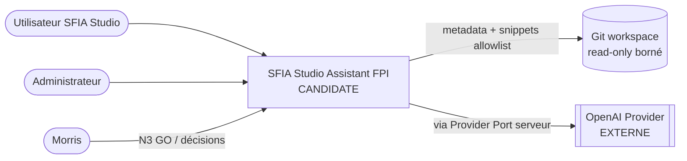
```mermaid
flowchart LR
  User([Utilisateur SFIA Studio])
  Admin([Administrateur])
  Morris([Morris])
  Studio[SFIA Studio Assistant FPI<br/>CANDIDATE]
  Git[(Git workspace<br/>read-only borné)]
  OpenAI[[OpenAI Provider<br/>EXTERNE]]
  User --> Studio
  Admin --> Studio
  Morris -->|N3 GO / décisions| Studio
  Studio -->|metadata + snippets allowlist| Git
  Studio -->|via Provider Port serveur| OpenAI
```

---

## 22. Diagramme containers

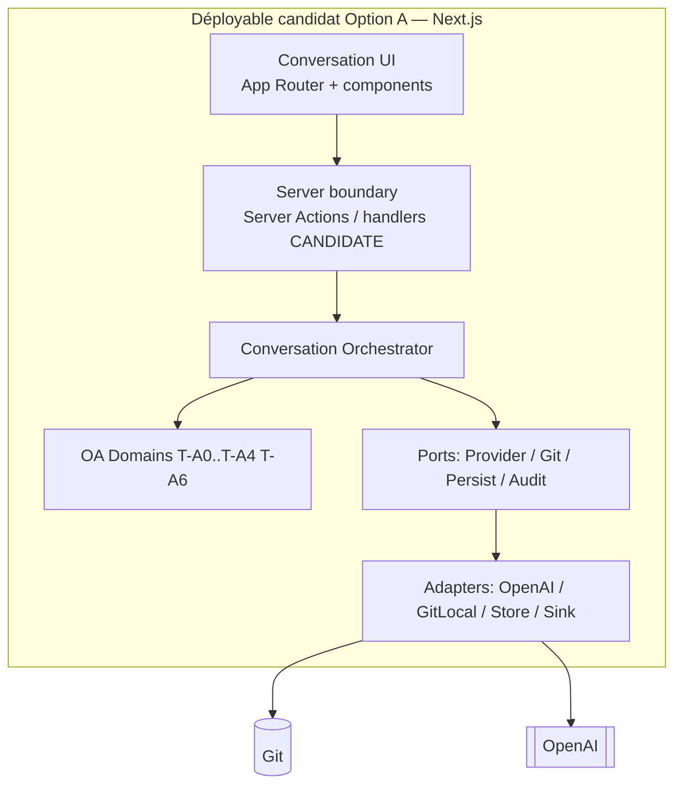
```mermaid
flowchart TB
  subgraph Deploy["Déployable candidat Option A — Next.js"]
    UI[Conversation UI<br/>App Router + components]
    SA[Server boundary<br/>Server Actions / handlers CANDIDATE]
    Orch[Conversation Orchestrator]
    Dom[OA Domains T-A0..T-A4 T-A6]
    Ports[Ports: Provider / Git / Persist / Audit]
    Adapters[Adapters: OpenAI / GitLocal / Store / Sink]
    UI --> SA --> Orch --> Dom
    Orch --> Ports --> Adapters
  end
  ExtGit[(Git)]
  ExtAI[[OpenAI]]
  Adapters --> ExtGit
  Adapters --> ExtAI
```

---

## 23. Diagramme composants

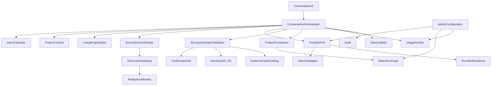
```mermaid
flowchart TB
  UI[ConversationUI]
  PC[ProjectContext]
  LPS[LivingProjectState]
  OR[ConversationOrchestrator]
  CL[IntentClassifier]
  SR[SourceDoctrineRouter]
  GG[GitContentGateway]
  RA[RedactionAllowlist]
  PP[ProviderPort]
  OA[OpenAIAdapter]
  SV[StructuredOutputValidation]
  N2[ConfirmationN2]
  N3[DecisionGO_N3]
  EV[EvidenceClaimLinking]
  PS[ProjectPersistence]
  RP[RetentionPurge]
  UF[UsageFinOps]
  AU[Audit]
  OB[Observability]
  PR[ProviderResilience]
  AD[AdminConfiguration]
  UI --> OR
  OR --> CL
  OR --> PC
  OR --> LPS
  OR --> SR
  SR --> GG --> RA
  OR --> PP --> OA
  OR --> SV
  SV --> N2
  SV --> N3
  SV --> EV
  OR --> PS
  PS --> RP
  OR --> UF
  OR --> AU
  OR --> OB
  PP --> PR
  AD --> PP
  AD --> RP
  AD --> UF
```

---

## 24. Domaines et responsabilités

| # | Domaine | Responsabilité | Entrées | Sorties | Déps OK | Déps interdites | Données | N | Erreur | Audit | Emplacement candidat | Statut |
|---|---|---|---|---|---|---|---|---|---|---|---|---|
| 1 | ConversationUI | Surface chat + panneaux | User events | Affichage états | OR, PC | Provider, secrets | UI state | N1–N3 | Messages UX | — | `app/` + `features/` + `components/` | Adaptation |
| 2 | ProjectContext | Résoudre Project isolé | projectId | Context | oa/project | Cross-project | Project | — | 404/deny | yes | `lib/oa/project` | Existant+adapt |
| 3 | LivingProjectState | LPS versionné | projectId | LPS snapshot/delta | T-A1 | Mutation silencieuse | LPS | N2 | Conflict | yes | `lib/oa/project` | Existant+persist |
| 4 | ConversationOrchestrator | Pipeline étapes | Request | Response + side-effects autorisés | tous domaines | SDK OpenAI direct | Correlation | N1–N3 | Localized | yes | **nouveau** `lib/assistant/orchestrator` *(candidat path)* | Nouveau |
| 5 | IntentClassifier | Hors-sujet + N1/N2/N3 | Message + context | Classification | UX rules | Provider-only decide | Class label | — | Ambigu→escalade | yes | nouveau + T-A3 | Nouveau |
| 6 | SourceDoctrineRouter | Doctrine/CKC/sources | Intent | Source set | T-A0/T-A2/sfia-context | v2.6 fallback | Pins | N2/N3 | Fail-closed | yes | `oa/doctrine`+platform | Existant |
| 7 | GitContentGateway | Lecture Git bornée | Paths | Snippets/meta | repository | Write Git | File meta | — | Deny | yes | `platform/repository` | Existant |
| 8 | RedactionAllowlist | Allowlist + redact | Content | Safe content | security | Bypass | RedactionRecord | — | Unknown fail-closed | yes | `platform/security` | Existant |
| 9 | ProviderPort | Contrat minimal | ProviderRequest | ProviderResponse | Resilience | Métier/Git/persist | Messages bornés | — | Normalized errors | yes | `platform/ai` | Existant aligné |
| 10 | OpenAIAdapter | Mapping SDK | Port request | Port response | openai pkg | Métier | Usage meta | — | Map errors | meta only | `openaiProvider.ts` | Existant candidat |
| 11 | StructuredOutputValidation | AF-02 | Raw output | Validated / reject | ajv? candidate | Partial apply | Schemas | N1 prog / N2–N3 strict | Fail-closed struct | yes | nouveau + oa ajv patterns | Adaptation |
| 12 | ConfirmationN2 | Drawer confirm | Delta | Confirm/Cancel | T-A3 | Silent apply | Confirmation | N2 | Cancel | yes | oa/decision + UI | Existant+UX |
| 13 | DecisionGO_N3 | Surface forte + GO | Proposal | Decision record | T-A3 | Free-text as GO | Decision | N3 | Reject incomplete | yes | oa/decision + UI | Existant+UX |
| 14 | EvidenceClaimLinking | Claim↔preuve | Claims | Linked evidence | T-A6 | Orphan claims | EvidenceReference | N2/N3 | Block incomplete | yes | oa/evidence-review | Existant |
| 15 | ProjectPersistence | Store Project-local | Entities | Persisted | Store port | Cross-tenant | See §39 | — | Conflict | yes | ADR persist | Candidat |
| 16 | RetentionPurge | TTL + delete | Policy | Purge result | Persist | Invent TTL value | RetentionPolicy | — | Partial purge flag | yes | nouveau | Candidat |
| 17 | UsageFinOps | Metering soft | Usage | Soft signals | Port usage | Hard invent | UsageRecord | N2 override | No fake estimate | yes | nouveau | Candidat |
| 18 | Audit | Preuves métier | Events | AuditEvent | Persist audit | Secrets in audit | AuditEvent | — | — | self | nouveau | Candidat |
| 19 | Observability | Logs/metrics/traces | Spans | Telemetry | Sink | PII/secrets | pipelineStage | — | — | limited | platform/observability | Adaptation |
| 20 | ProviderResilience | Timeout/retry/fallback | Port errors | Degraded/fail-closed | Port | Silent replay struct | Status | N1 deg / N2–N3 FC | Visible | yes | nouveau wrapping port | Candidat |
| 21 | AdminConfiguration | Model/TTL/softcap | Admin | Config audited | Audit | User free model | ModelConfiguration | — | Deny unauthorized | yes | nouveau | Candidat |

*Aucun dossier créé ce cycle.*

---

## 25. Règles de dépendance

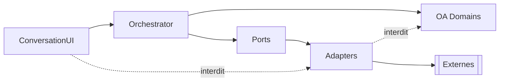
```mermaid
flowchart LR
  UI[ConversationUI] --> OR[Orchestrator]
  OR --> Dom[OA Domains]
  OR --> Ports[Ports]
  Ports --> Adapters[Adapters]
  Adapters --> Ext[[Externes]]
  UI -.->|interdit| Adapters
  Adapters -.->|interdit| Dom
```

**Autorisé :** UI → Orchestrator → Domains/Ports → Adapters → Externes.

**Interdit :**
- UI → OpenAI SDK / secrets ;
- Adapter OpenAI → Git / Persist / Decision métier ;
- Domains → SDK OpenAI ;
- N2/N3 apply sans Confirmation/Decision ;
- Lecture Git sans Allowlist/Redaction ;
- Cross-Project reads ;
- T-A5 real execution dans FPI.

---

## 26. Pipeline conversationnel

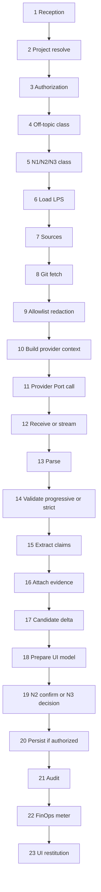
```mermaid
flowchart TD
  S1[1 Reception] --> S2[2 Project resolve]
  S2 --> S3[3 Authorization]
  S3 --> S4[4 Off-topic class]
  S4 --> S5[5 N1/N2/N3 class]
  S5 --> S6[6 Load LPS]
  S6 --> S7[7 Sources]
  S7 --> S8[8 Git fetch]
  S8 --> S9[9 Allowlist redaction]
  S9 --> S10[10 Build provider context]
  S10 --> S11[11 Provider Port call]
  S11 --> S12[12 Receive or stream]
  S12 --> S13[13 Parse]
  S13 --> S14[14 Validate progressive or strict]
  S14 --> S15[15 Extract claims]
  S15 --> S16[16 Attach evidence]
  S16 --> S17[17 Candidate delta]
  S17 --> S18[18 Prepare UI model]
  S18 --> S19[19 N2 confirm or N3 decision]
  S19 --> S20[20 Persist if authorized]
  S20 --> S21[21 Audit]
  S21 --> S22[22 FinOps meter]
  S22 --> S23[23 UI restitution]
```

| # | Étape | Composant | Entrée | Sortie | Validation | Erreur | Persist? | Métriques | Structurant? |
|---|---|---|---|---|---|---|---|---|---|
| 1 | Réception | UI→OR | UserMessage | Request | Authz base | Reject | non | recv | non |
| 2 | Project resolve | PC | projectId | Project | Exists+isol | Deny | non | | non |
| 3 | Autorisation | PC/AD | Actor | Allow | Role | Deny | audit | | non |
| 4 | Hors-sujet | CL | Text | In/Out scope | Rules | Mark off-topic | non (UX-07) | | non |
| 5 | Classif N1/N2/N3 | CL | Text+ctx | Level | Ambigu→escalade | Strict/escalade | audit | | gate |
| 6 | Load LPS | LPS | projectId | Snapshot | Version | Fail-closed N2/N3 | non | | si N2/N3 |
| 7 | Sources | SR | Intent | Sources | Doctrine pin | Fail-closed | non | | si struct |
| 8 | Git fetch | GG | Paths | Meta/snippets | Size TBD Tech | Deny | non | | opt |
| 9 | Allowlist/redact | RA | Content | Safe | Unknown FC | Deny | RedactionRecord | | opt |
| 10 | Build context | OR | Safe ctx | ProviderRequest | Bounds | Truncate/deny | non | | |
| 11 | Provider call | PP/PR | Request | Response/stream | Timeout cfg | See FPI-15 | non | latency/usage | |
| 12 | Receive | PP | Stream/full | Raw | — | Cancel | non | first_token | |
| 13 | Parse | SV | Raw | AST/text | Progressive/strict | Reject | non | | |
| 14 | Validate | SV | AST | OK/Reject | AF-02 | FC struct | non | validation | |
| 15 | Claims | EV | Output | Claims | Link required struct | Block | non | | struct |
| 16 | Evidence attach | EV | Claims | Linked | T-A6 | Block | non | | struct |
| 17 | Delta candidat | LPS | Valid N2 | LPSDeltaCandidate | Schema | Reject | non until confirm | | N2 |
| 18 | Prepare UI | OR | Result | ViewModel | — | Error VM | non | | |
| 19 | N2/N3 gate | N2/N3 | Candidate | Confirm/Decision | Explicit | Cancel/reject | on accept | | oui |
| 20 | Persist autorisée | PS | Approved | Stored | Isol | Rollback | oui | | |
| 21 | Audit | AU | Event | AuditEvent | No secrets | — | oui | | |
| 22 | FinOps meter | UF | Usage | Soft result | No fake $ | Signal missing | oui meta | | |
| 23 | Restitution | UI | VM | Render | — | Error UX | — | | |

**Étapes sans dépendance directe provider :** 1–10, 13–23 (sauf metering issu de la réponse). Classification et validation ne doivent pas être court-circuitées par l’adapter.

---

## 27. Classification N1/N2/N3

| Niveau | Exemples | Validation | Mutation | UI |
|---|---|---|---|---|
| N1 free-talk Project | Question LPS, explication | Progressive | Aucune | Chat |
| N1 hors-sujet | Off-topic | Progressive | Non mémorisé Project | Message |
| N2 | Delta LPS, export structurant | Stricte | Après confirm drawer | Drawer |
| N3 | Décision Morris, GO | Stricte | Après surface forte + GO explicite | Surface N3 |

**Ambiguïté (R-TECH-AF02-BOUNDARY-01 OPEN) :** escalade ou traitement strict ; jamais apply depuis partiel.

Formalisation candidate (réserve reste OPEN) :
- Propriétaire classification : Orchestrator + IntentClassifier (pas l’adapter).
- Priorité : si doute structurant → N2/N3 path strict.
- Preuve d’escalade : AuditEvent `classification_escalated`.

---

## 28. Validation structurée (AF-02=C)

### N1 non structurant
Tolérance texte partiel · aucune mutation/décision · progressive · fallback borné FPI-15.

### N2/N3 structurant — schéma obligatoire (conceptuel)
Champs candidats : `actionType`, `target`, `scope`, `before`, `after`, `evidenceRefs`, `reversibility`, `authority`, `classification`, `result`.

Rejet **fail-closed** si invalide. Aucune consommation partielle.

**AJV :** présent (`oa/*/ajv*`) — **recommandation d’étude candidate**, pas choix validé.

---

## 29. Séquence N1

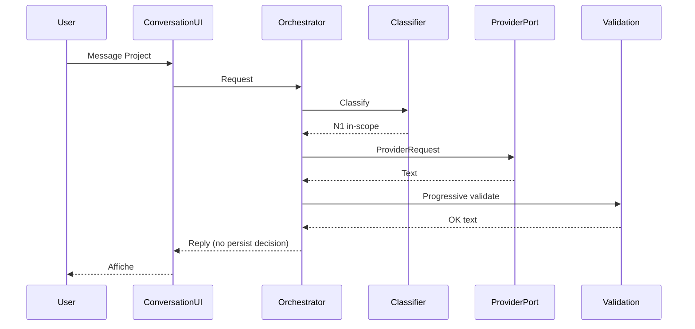
```mermaid
sequenceDiagram
  participant U as User
  participant UI as ConversationUI
  participant OR as Orchestrator
  participant CL as Classifier
  participant PP as ProviderPort
  participant SV as Validation
  U->>UI: Message Project
  UI->>OR: Request
  OR->>CL: Classify
  CL-->>OR: N1 in-scope
  OR->>PP: ProviderRequest
  PP-->>OR: Text
  OR->>SV: Progressive validate
  SV-->>OR: OK text
  OR-->>UI: Reply (no persist decision)
  UI-->>U: Affiche
```

---

## 30. Séquence N2

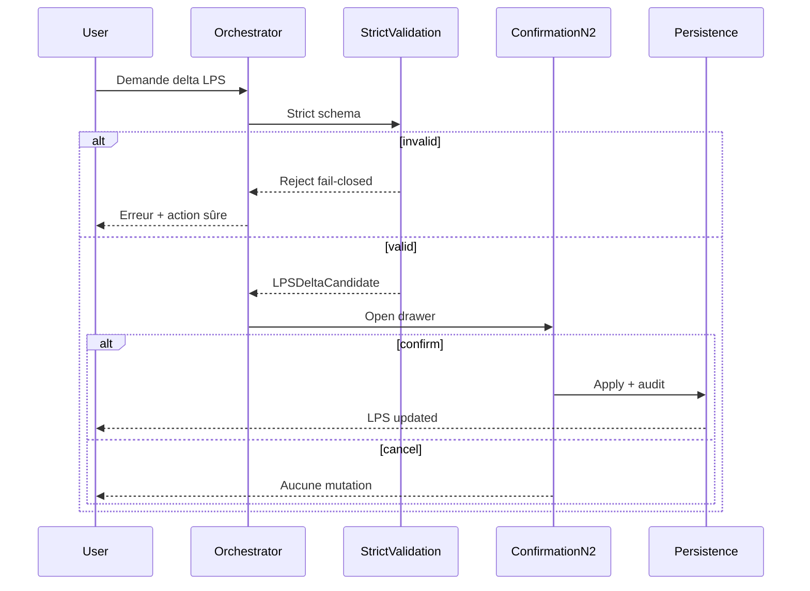
```mermaid
sequenceDiagram
  participant U as User
  participant OR as Orchestrator
  participant SV as StrictValidation
  participant N2 as ConfirmationN2
  participant PS as Persistence
  U->>OR: Demande delta LPS
  OR->>SV: Strict schema
  alt invalid
    SV-->>OR: Reject fail-closed
    OR-->>U: Erreur + action sûre
  else valid
    SV-->>OR: LPSDeltaCandidate
    OR->>N2: Open drawer
    alt confirm
      N2->>PS: Apply + audit
      PS-->>U: LPS updated
    else cancel
      N2-->>U: Aucune mutation
    end
  end
```

---

## 31. Séquence N3

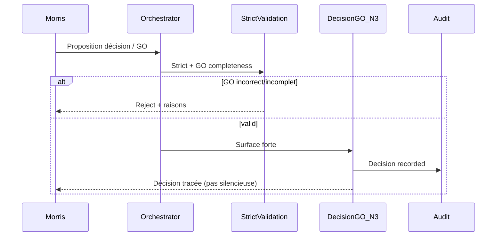
```mermaid
sequenceDiagram
  participant M as Morris
  participant OR as Orchestrator
  participant SV as StrictValidation
  participant N3 as DecisionGO_N3
  participant AU as Audit
  M->>OR: Proposition décision / GO
  OR->>SV: Strict + GO completeness
  alt GO incorrect/incomplet
    SV-->>M: Reject + raisons
  else valid
    OR->>N3: Surface forte
    N3->>AU: Decision recorded
    N3-->>M: Décision tracée (pas silencieuse)
  end
```

---

## 32. Séquence provider indisponible

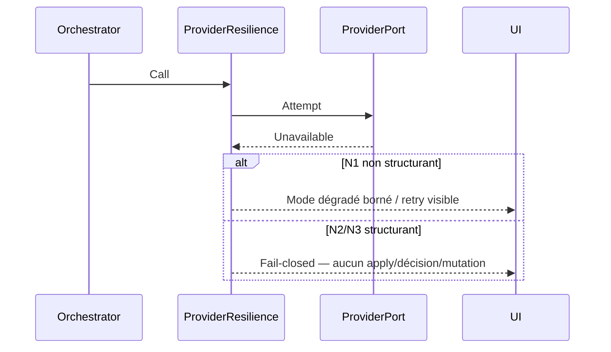
```mermaid
sequenceDiagram
  participant OR as Orchestrator
  participant PR as ProviderResilience
  participant PP as ProviderPort
  participant UI as UI
  OR->>PR: Call
  PR->>PP: Attempt
  PP-->>PR: Unavailable
  alt N1 non structurant
    PR-->>UI: Mode dégradé borné / retry visible
  else N2/N3 structurant
    PR-->>UI: Fail-closed — aucun apply/décision/mutation
  end
```

---

## 33. Git allowlist / redaction

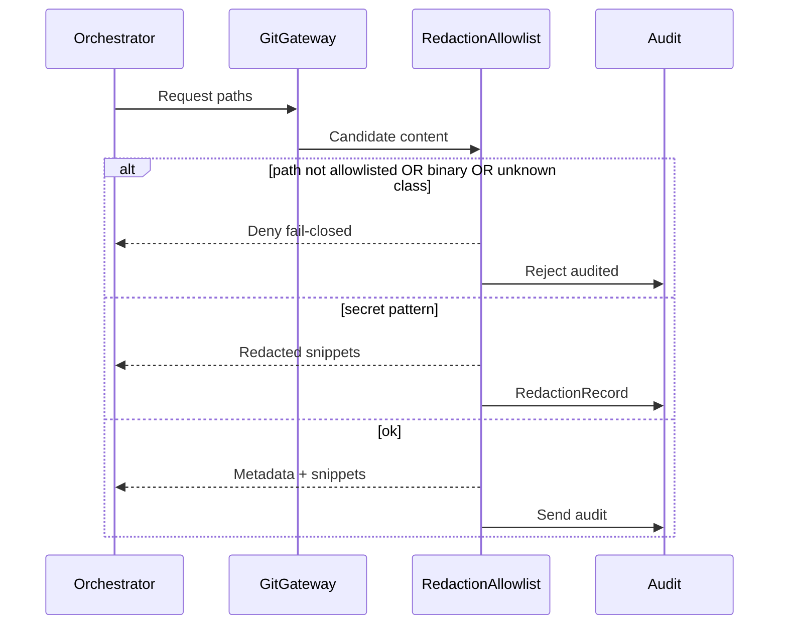
```mermaid
sequenceDiagram
  participant OR as Orchestrator
  participant GG as GitGateway
  participant RA as RedactionAllowlist
  participant AU as Audit
  OR->>GG: Request paths
  GG->>RA: Candidate content
  alt path not allowlisted OR binary OR unknown class
    RA-->>OR: Deny fail-closed
    RA->>AU: Reject audited
  else secret pattern
    RA-->>OR: Redacted snippets
    RA->>AU: RedactionRecord
  else ok
    RA-->>OR: Metadata + snippets
    RA->>AU: Send audit
  end
```

Bornes de taille : **à définir en implémentation / ADR** — aucune valeur inventée ici.

---

## 34. Provider Port (contrat conceptuel)

| Champ | Description |
|---|---|
| requestId / correlationId / projectId | Corrélation |
| mode | N1 \| N2 \| N3 |
| messages | Bornés, déjà redactés |
| structuredInstruction | Optionnel selon mode |
| modelRef | Identifiant **abstrait** admin (pas nom marketing imposé ici) |
| streaming | Autorisé N1 candidat ; structurant selon ADR-ASST-STREAM-01 |
| timeout | Configurable — valeur `TO_BE_DECIDED` |
| response | Text / structured payload candidate |
| usage | tokens nullable |
| providerStatus | ok \| degraded \| unavailable |
| errors | Codes normalisés |
| cancellation | Supporté |

**TO BE VERIFIED AGAINST OFFICIAL OPENAI DOCUMENTATION DURING IMPLEMENTATION PREPARATION** pour tout détail API/SDK/endpoint.

---

## 35. OpenAI Adapter

Responsabilités : mapping SDK · isolation secrets · mapping erreurs · extraction usage.

**Interdit :** choix métier · contourner validation · accès Git · persistance · décider Morris · exposer clé.

Aucun modèle/endpoint/région/tarif sélectionné par ce document.

---

## 36. Project Context

Isolation stricte par `projectId`. Chargement doctrine pin (T-A0). Refus cross-project. Aligné pages `app/projects/*` existantes (UI) + `oa/project` (domaine).

---

## 37. Living Project State

LPS versionné (T-A1). Lecture libre N1. Mutation uniquement via N2 confirmée. Delta candidat jamais appliqué silencieusement (UX + FPI).

---

## 38. Preuves et claims

Toute sortie structurante expose claims liés à EvidenceReference (T-A6). Claim orphelin → block. Expert panel consomme les mêmes liens (contrat UX).

---

## 39. Modèle conceptuel de données

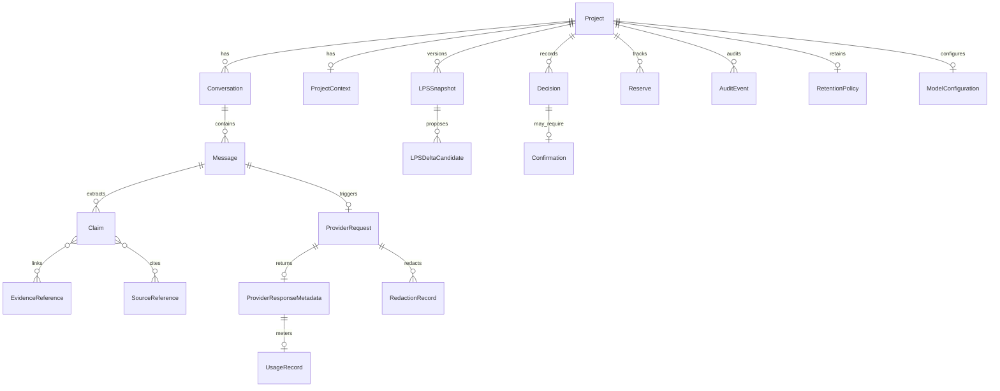
```mermaid
erDiagram
  Project ||--o{ Conversation : has
  Conversation ||--o{ Message : contains
  Project ||--o| ProjectContext : has
  Project ||--o{ LPSSnapshot : versions
  LPSSnapshot ||--o{ LPSDeltaCandidate : proposes
  Project ||--o{ Decision : records
  Decision ||--o| Confirmation : may_require
  Project ||--o{ Reserve : tracks
  Message ||--o{ Claim : extracts
  Claim }o--o{ EvidenceReference : links
  Claim }o--o{ SourceReference : cites
  Message ||--o| ProviderRequest : triggers
  ProviderRequest ||--o| ProviderResponseMetadata : returns
  ProviderResponseMetadata ||--o| UsageRecord : meters
  Project ||--o{ AuditEvent : audits
  Project ||--o| RetentionPolicy : retains
  Project ||--o| ModelConfiguration : configures
  ProviderRequest ||--o{ RedactionRecord : redacts
```

| Objet | ID | Scope | Champs conceptuels | Sensible? | Conservation | Mutabilité | Owner | Audit | Suppression | Exclusions |
|---|---|---|---|---|---|---|---|---|---|---|
| Project | projectId | self | name, pins | faible | durable produit | admin | Product | yes | soft/hard TBD | — |
| Conversation | conversationId | Project | createdAt | contenu | TTL policy | append | Assistant | yes | purge | secrets |
| Message | messageId | Conv | role, text, level | possible PII | TTL | immutable | Assistant | yes | purge | system prompt |
| ProjectContext | projectId | Project | doctrinePin, meta | — | durable | controlled | Product | yes | with project | — |
| LPSSnapshot | lpsId+ver | Project | state | métier | durable | versioned | Product | yes | governed | scores internes |
| LPSDeltaCandidate | deltaId | Project | before/after | métier | until confirm/reject | temp | Assistant | yes | drop on cancel | — |
| Decision | decisionId | Project | GO, authority | métier | durable | immutable | Morris/Product | yes | governed | — |
| Confirmation | confirmationId | Project | N2 payload | métier | with decision | consume-once | Product | yes | — | — |
| Reserve | reserveId | Project | status | — | durable | update | Product | yes | — | — |
| EvidenceReference | evidenceId | Project | uri/digest | — | durable | immutable | Product | yes | — | raw secrets |
| Claim | claimId | Message | text, status | — | with message/decision | update status | Product | yes | — | — |
| SourceReference | sourceId | Project | path/pin | path | durable | immutable | Product | yes | — | full files |
| ProviderRequest | requestId | Project | meta only | **no raw secrets** | short/audit | immutable | Tech | meta | redact | full prompt system |
| ProviderResponseMetadata | responseId | Request | usage, status | faible | audit | immutable | Tech | yes | — | raw chain-of-thought |
| UsageRecord | usageId | Project | tokens nullable | — | FinOps retain TBD | immutable | Admin | yes | — | tariffs inventés |
| AuditEvent | auditId | Project | type, corr | controlled | durable audit | immutable | Compliance | self | legal TBD | secrets |
| RetentionPolicy | policyId | Project | TTL config ref | — | durable | admin | Admin | yes | — | **no numeric default invented** |
| ModelConfiguration | configId | Project/Global | abstract modelRef | — | durable | admin audited | Admin | yes | — | user free choice |
| RedactionRecord | redactionId | Request | rules hit | meta | audit | immutable | Sec | yes | — | original secret |

---

## 40. Persistance

### Options
| Option | Pros | Cons | Fit FPI |
|---|---|---|---|
| Store local embarqué (fichier/SQLite-like) | Simple, Project-local, purge | Multi-instance non validé | **Bon candidat** |
| Base relationnelle externe | Mature, audit | Ops + service | Option B-ish |
| Fichiers structurés / append-only | Audit-friendly | Concurrence, query | Audit lane candidate |

**Recommandation candidate (NON DÉCIDÉE) :** store local embarqué Project-scoped pour opérationnel + lane audit append-only logique ; Git reste documentaire hors runtime chat.

**ADR-ASST-PERSIST-01** requis.

Séparation : opérationnel · audit · preuves · config · métriques · docs Git.

---

### Cycle de vie des données conversationnelles

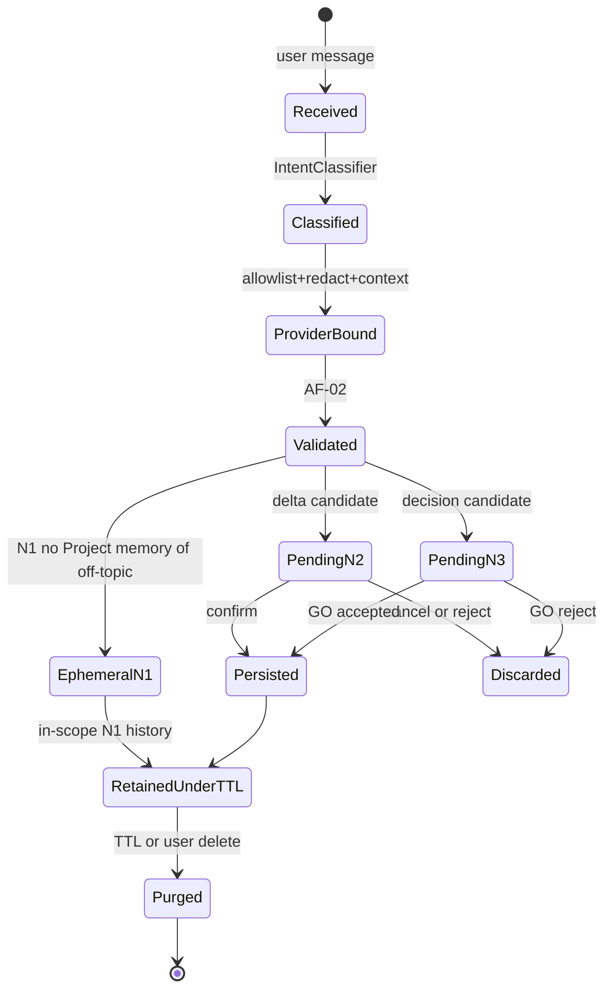
```mermaid
stateDiagram-v2
  [*] --> Received: user message
  Received --> Classified: IntentClassifier
  Classified --> ProviderBound: allowlist+redact+context
  ProviderBound --> Validated: AF-02
  Validated --> EphemeralN1: N1 no Project memory of off-topic
  Validated --> PendingN2: delta candidate
  Validated --> PendingN3: decision candidate
  PendingN2 --> Persisted: confirm
  PendingN2 --> Discarded: cancel or reject
  PendingN3 --> Persisted: GO accepted
  PendingN3 --> Discarded: GO reject
  EphemeralN1 --> RetainedUnderTTL: in-scope N1 history
  Persisted --> RetainedUnderTTL
  RetainedUnderTTL --> Purged: TTL or user delete
  Purged --> [*]
```

## 41. TTL et purge

- Politique TTL **Project** décidée (FPI-08=B).
- Durée : **CONFIG-ADMIN-NO-VALUE** · R-TECH-TTL-01 OPEN.
- Droits suppression utilisateur + purge admin.
- Hors-sujet non mémorisé.
- Sauvegardes futures doivent respecter purge (hypothèse ops).
- Mécanisme purge = **ADR-ASST-PURGE-01**.

---

## 42. Sécurité

Principes : deny-by-default paths · redact · server-only secrets · fail-closed structurant · isolation Project · pas de spoof GO · validation non contournable · pas d’appel provider browser.

**Sécurité non validée.**

---

## 43. Threat model (documentaire)

| Menace | Actif | Source | Vecteur | Impact | Préventif | Détectif | Fail-closed | Preuve | Résiduel | Gate |
|---|---|---|---|---|---|---|---|---|---|---|
| Prompt injection fichier Git | Intégrité décision | Fichier repo | Contenu hostile | Mauvaise action | Allowlist+human N2/N3 | Audit content hash | Struct | Audit | Moyen | Impl |
| Exfiltration secret | Secrets | Git/logs | Snippet | Fuite | Redaction+deny .env | RedactionRecord | Deny | Audit | Faible-moyen | Impl |
| Chemin non allowlist | Confid. | Attacker/tool | Path traversal | Fuite | pathPolicy | Deny log | Deny | Audit | Faible | — |
| Binaire | Disponibilité | Git | Binary upload | Token waste | Refuse binary | — | Deny | Audit | Faible | — |
| PII inutile | PII | User/Git | Over-share | RGPD | Minimisation | Review | — | — | Moyen | RGPD |
| Contamin. Projects | Isolation | Bug | Wrong id | Fuite cross | Scope checks | Tests | Deny | Audit | Faible | — |
| Spoof GO | Autorité | UI/API | Fake confirm | Fausse décision | N3 surface+authz | Audit | Reject | Decision | Moyen | Authz ADR |
| Contournement schema | Intégrité | Adapter | Partial apply | Mutation illégale | OR enforces SV | Reject metrics | FC | Audit | Faible | — |
| Provider from browser | Secrets | Client | SDK client | Key leak | Server-only import | Bundle scan | — | — | Faible si respect | CI future |
| Key exposure | Key | Env/logs | Log leak | Account abuse | No log key | Secret scan | — | — | Moyen | Ops |
| Model change unauthorized | Coût/qualité | Attacker | Admin API | Drift | Authz admin+audit | Audit config | Deny | Audit | Moyen | Authz |
| Replay N2/N3 | Intégrité | Network | Replay token | Double apply | Idempotency keys | Dedupe | Reject | Audit | Moyen | Impl |
| Double consommation | Intégrité | Race | Double confirm | Double mutation | Consume-once | Conflict | Reject | Audit | Moyen | Persist ADR |
| Sensitive logs | Confid. | Obs | Log body | Fuite | Redact logs | Review | — | — | Moyen | Obs ADR |
| Coût abusif | FinOps | User/loop | Flood | $ | Soft cap | Usage metrics | Soft warn | Usage | **Hard OPEN** | Pilot |
| Provider compromise | Intégrité | Provider | Bad output | Bad decision | Strict validate+human | Anomaly | FC struct | Audit | Moyen | — |
| Provider down | Dispo | Provider | Outage | Blocage | Degraded N1 | Status | FC struct | — | Moyen | — |
| Preuve falsifiée | Confiance | Attacker | Fake evidence | Fausse maturité | Digests T-A6 | Verify | Block | Evidence | Moyen | — |
| Purge incomplète TTL | RGPD | Bug | Orphan copies | Retention excess | Purge checklist | Audit purge | Flag | Audit | **TTL OPEN** | RGPD |

---

## 44. RGPD

**RGPD CONSIDERATIONS DOCUMENTED — VALIDATION PENDING**

Catégories : messages user · LPS métier · audit · usage meta · Git snippets · config admin.

Minimisation · finalité Assistant Project · isolation · durée configurable (pas de durée inventée) · suppression/purge · export candidat futur · logs redactés · provider = sous-traitance **à contractualiser hors ce cycle** · hors-sujet non stocké · pas d’avis juridique · pas de DPA/base légale inventée.

R-TECH-TTL-01 reste OPEN.

---

## 45. FinOps

Metering par requête (usage provider nullable) · estimation candidate seulement si fiable sinon signal « estimation indisponible » · soft cap configurable **sans valeur** · alerte · override soft aligné N2 · admin · audit · corrélation Project · interaction changement modèle audité.

Hard cap : **DEFER-BEFORE-PILOT** · R-TECH-FINOPS-HARD-01 OPEN.

Aucun tarif/quota/tokens/seuil/devise inventés.

---

## 46. Performance

Points de mesure : réception · resolve Project · Git · redaction · prep provider · first token · complete · validation · persist · UI.

Objectifs : **TO_BE_DECIDED** (pas de SLO inventé).

Distinctions : latence perçue / provider / locale · taille contexte · coût validation · streaming · timeout · annulation.

---

## 47. Résilience

Erreurs normalisées · timeout configurable (`TO_BE_DECIDED`) · retry borné (**nombre non inventé**) · circuit breaker **candidat** · cancellation · idempotence N2/N3 · déduplication · corrélation · reprise · provider status visible · dégradé N1 · fail-closed structurant · **pas de rejeu silencieux**.

Pas de file/bus décidé (AF-01).

---

## 48. Observabilité

Taxonomie candidate : correlationId · projectId · conversationId · requestId · decisionId · confirmationId · providerCallId · evidenceId · pipelineStage · classification · validationResult · providerStatus · usage · latency · retry · errorCode · redactionResult · allowlistResult · softCapResult.

Séparer : logs tech · métriques · traces · audit métier · preuves · UX Expert.

**Jamais logger :** prompt système · secrets · clé · scores internes · raisonnement interne · Git non autorisé · PII inutile.

Pas de plateforme obs choisie.

---

## 49. Audit

AuditEvent immutable Project-scoped pour : classif · allows/denies Git · provider meta · validation reject · confirm/cancel · decision/GO · purge · admin config · soft cap override.

---

## 50. Administration

Admin (pas user libre) : modelRef abstrait · TTL duration config · soft cap thresholds · allowlist adjustments (gouvernance future).

Tous changements audités (FPI-09).

---

## 51. Exploitabilité

Env candidats (non créés) : secret provider serveur · modelRef · TTL · softcap · feature flags.

Health/readiness candidats · purge jobs · backup/restore respectant purge · rollback déploiement monolith · **aucun .env créé** · **aucune CI créée**.

---

## 52. Déploiement candidat

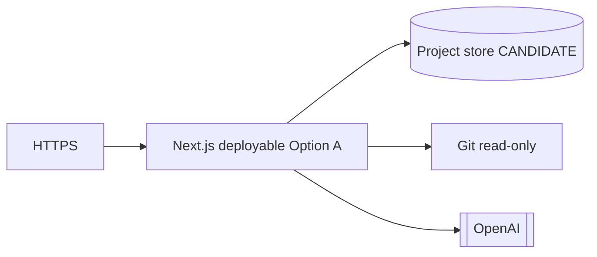
```mermaid
flowchart LR
  Edge[HTTPS] --> Next[Next.js deployable Option A]
  Next --> LocalStore[(Project store CANDIDATE)]
  Next --> GitRO[Git read-only]
  Next --> OpenAI[[OpenAI]]
```

Single deployable. Multi-instance : **non validé**.

---

## 53. DevOps fit

Fit avec scripts existants `lint/typecheck/test/e2e/build`. Extension future tests Assistant. Pas de workflow GitHub modifié ce cycle.

---

## 54. Stratégie de tests candidate

| Famille | Objectif | Composant | Simulé | Preuve | Risques |
|---|---|---|---|---|---|
| Unit pipeline steps | Local correctness | OR stages | ports | pass/fail | regressions |
| Classification | N1/N2/N3/hors-sujet | CL | — | cases | ambiguïté |
| Validation progressive | N1 | SV | — | partial ok | false strict |
| Validation stricte | N2/N3 | SV | — | reject | bypass |
| Ports | Contract | PP/GG | fake | conformance | lock-in |
| Adapter simulé | Mapping | OA fake | fake | usage/errors | live dependency |
| Allowlist/redaction | FPI-07 | RA | fixtures | deny/redact | leak |
| Project isolation | FPI-03 | PC/PS | two projects | deny cross | leak |
| TTL/purge | FPI-08 | RP | clock | deleted | orphans |
| FinOps soft | FPI-14 | UF | usage | warn | fake $ |
| Fallback | FPI-15 | PR | down | FC/degraded | silent replay |
| N1/N2/N3 E2E futurs | UX contracts | UI | fake provider | screens | drift Figma |
| Idempotence | Double confirm | N2/N3 | replay | single apply | double mut |
| Audit | Events | AU | — | presence | missing trail |
| Adversarial | Injection/secret | GG/RA/SV | hostile fixtures | deny | injection |
| Integration | Composition OA | Domains | memory | bridge | rewrite creep |

**Aucun test créé ce cycle.**

---

## 55. Compatibilité T-A0…T-A7

| Lot | Preuve repo | Réutilisation FPI | Adaptation | Hors FPI | Dette | Risque |
|---|---|---|---|---|---|---|
| T-A0 | `lib/oa/doctrine` + tests | AS-IS resolve | Bridging chat | — | Fixture registry | Pin stale |
| T-A1 | `lib/oa/project` | LPS/Project | Persist Project | — | Memory | Data loss |
| T-A2 | `lib/oa/cycle` | CKC/epistemic/trajectory | Bridging | — | UI gap | Wrong cycle |
| T-A3 | `lib/oa/decision` | N2/N3 | UX surfaces | — | — | Silent decide |
| T-A4 | `lib/oa/execution-contract` | Prep only | — | Cursor réel | — | Scope creep |
| T-A5 | `lib/oa/execution-attempt` fake | **Fake only** | — | **Real agents** | — | Accidental live |
| T-A6 | `lib/oa/evidence-review` | Claims/maturity | Chat proofs | — | — | Orphan claims |
| T-A7 | `lib/oa/execution-run` + `platform/t-a7` | Lecture bornée / statut | Pas completion claim | Live providers as « done » | INTERNAL_ONLY | Overclaim |

**FPI-02=B :** compose T-A0…T-A4 + T-A6 ; T-A5 hors ; anti-rewrite ; dette bridging chat explicite (Ops1 ≠ produit FPI).

---

## 56. Scénarios techniques

| # | Scénario | Acteur | Précond | Flux | Erreurs | Données | Audit | UI | Stop/FC | Réserve |
|---|---|---|---|---|---|---|---|---|---|---|
| 1 | N1 free-talk Project | User | Project | Pipeline N1 | Provider soft fail | Msg TTL | request | Reply | — | — |
| 2 | N1 hors sujet | User | — | Classify off | — | Non mémorisé Project | classif | Notice | — | — |
| 3 | N1 Git allowlist | User | Paths OK | GG+RA+PP | Deny path | Snippets | send | Reply+sources | — | — |
| 4 | N2 delta LPS | User | LPS | Strict+drawer | Invalid schema | Delta temp | confirm | Drawer | FC invalid | — |
| 5 | N2 annulé | User | Drawer open | Cancel | — | No mutate | cancel | Closed | — | — |
| 6 | N2 invalid provider | User | N2 | Strict reject | Schema fail | None | reject | Error+safe | FC | AF02 |
| 7 | N3 décision Morris | Morris | Authz | Surface+GO | Incomplete GO | Decision | decision | Strong UI | FC incomplete | — |
| 8 | N3 GO incorrect | Morris | — | Validate GO | Missing fields | None | reject | Reasons | FC | — |
| 9 | Provider down N1 | User | N1 | Degraded/retry | Unavailable | None struct | status | Visible degraded | No silent | — |
| 10 | Provider down N2/N3 | User | Struct | FC | Unavailable | No apply | status | Block+safe | FC | — |
| 11 | Git secret | System | File | Redact/deny | Secret hit | RedactionRecord | redact | Safe/deny | Deny raw | — |
| 12 | Path non autorisé | System | Bad path | Deny | PATH_NOT_ALLOWED | — | deny | Error | FC | — |
| 13 | Classif ambiguë | System | Borderline | Escalade/strict | Ambiguity | — | escalated | Ask/strict | Prefer strict | R-TECH-AF02-BOUNDARY-01 |
| 14 | Soft cap dépassé | User | Soft cfg | Warn+N2 override path | Soft exceed | UsageRecord | softcap | Warning | Soft only | R-TECH-FINOPS-HARD-01 |
| 15 | Delete conversation | User | Conv exists | Delete | — | Removed | delete | Updated list | — | — |
| 16 | Expiration TTL | System | Policy set | Purge job | Partial | Purged | purge | Gone | Flag partial | R-TECH-TTL-01 |
| 17 | Admin model change | Admin | Authz | Update modelRef | Deny user | ModelConfiguration | config | — | — | — |
| 18 | Audit décision/preuve | Auditor | Decision | Read audit | — | Audit+evidence | — | Expert | — | — |

---

## 57. Matrice de traçabilité décisions → composants

| Décision | Composants |
|---|---|
| AF-01=C | ConversationOrchestrator · Observability |
| AF-02=C | IntentClassifier · StructuredOutputValidation · R-TECH-AF02-BOUNDARY-01 |
| FPI-02=B | OA T-A0…T-A4,T-A6 · anti T-A5 real · bridging debt |
| FPI-03=B | ProjectPersistence · ProjectContext · LPS |
| FPI-07=B | GitContentGateway · RedactionAllowlist · Audit |
| FPI-08=B | RetentionPurge · AdminConfiguration · R-TECH-TTL-01 |
| FPI-09=B | AdminConfiguration · ProviderPort modelRef |
| FPI-10=B | ProviderPort · OpenAIAdapter |
| FPI-14=B | UsageFinOps · R-TECH-FINOPS-HARD-01 |
| FPI-15=B | ProviderResilience · UI status |
| UX N2/N3/GO | ConfirmationN2 · DecisionGO_N3 · ConversationUI |
| AF-04=B | Review Handoff process (hors runtime app) |

---

## 58. ADR candidates

Statut commun : **ADR CANDIDATE — NOT DECIDED — MORRIS DECISION REQUIRED**

| ID | Question | Options | Reco candidate | Gate |
|---|---|---|---|---|
| ADR-ASST-TOPO-01 | Topologie déploiement ? | A monolith · B split · C distributed | **A** | Décisions Archi |
| ADR-ASST-PERSIST-01 | Persistance physique ? | Embedded · RDBMS · files | **Embedded Project-local** | Décisions Archi |
| ADR-ASST-SERVER-01 | Frontière serveur Next (actions vs routes) ? | Server Actions · Route handlers · Hybrid | Hybrid minimal | Décisions Archi |
| ADR-ASST-PURGE-01 | Mécanisme purge TTL ? | Job · lazy · hybrid | Hybrid candidate | Avant pilote / RGPD |
| ADR-ASST-AUDIT-STORE-01 | Audit vs opérationnel ? | Same store · separate lane | Separate logical lane | Décisions Archi |
| ADR-ASST-STREAM-01 | Streaming ? | N1 only · all · none | N1 only candidate | Décisions Archi |
| ADR-ASST-VALIDATE-LIB-01 | Lib validation ? | ajv reuse · other · hand | Study ajv reuse | Décisions Archi |
| ADR-ASST-SECRETS-01 | Gestion secrets ? | Env server · secret manager | Env server FPI · manager later | Impl prep |
| ADR-ASST-ADMIN-AUTHZ-01 | Authz admin model/TTL/softcap ? | Existing auth · new role | Role admin audité | Avant admin UI |
| ADR-ASST-HEALTH-01 | Health/readiness ? | Minimal /live · deep deps | Minimal + provider optional probe | Impl |

Pas d’ADR artificielle hors besoin.

---

## 59. Risques

| Risque | Impact | Mitigation candidate |
|---|---|---|
| Rewrite déguisé via « composition » | Dette massive | FPI-02 anti-rewrite + revue |
| Confusion Ops1 = produit FPI | Scope creep | Bridging explicite |
| openai/ajv pris pour décision | Lock-in silencieux | ADR + anti-claims |
| TTL/hard cap oubliés avant pilote | RGPD/FinOps | Réserves OPEN gates |
| Ambiguïté N1/N2 | Mutation illégale | R-TECH-AF02-BOUNDARY-01 |
| Multi-instance accidentel | Corruption store | ADR persist + non-claim |

---

## 60. Dette

| Dette | Origine | Suivi |
|---|---|---|
| Bridging chat → OA | FPI-02 | Backlog futur |
| P0 fixtures vs libs avancées | Repo reality | Composition progressive |
| Fixture doctrine registry | T-A0 | Admin registry futur |
| Soft sans hard | FPI-14 | R-TECH-FINOPS-HARD-01 |
| TTL sans durée | FPI-08 | R-TECH-TTL-01 |
| Frontière AF-02 | AF-02=C | R-TECH-AF02-BOUNDARY-01 |
| Ops1 patterns parallèles | Inventaire | Ne pas merger silencieux |

---

## 61. Réversibilité

| Choix candidat | Réversible ? | Coût d’inversion |
|---|---|---|
| Topologie A | Oui vers B | Moyen si API interne propre |
| Embedded persist | Oui | Migration données |
| OpenAI-only port | Oui (port) | Adapter swap — multi-provider **hors FPI** |
| ajv | Oui | Schemas portables |
| Streaming N1 | Oui | UI + port flags |

---

## 62. Réserves

Maintenues OPEN (voir §10). Aucune nouvelle réserve **ouverte**. Aucune candidate OPEN inventée hors besoin ; si besoin futur → `CANDIDATE — NOT OPENED` sous GO Morris.

---

## 63. Conditions d’acceptation (architecture candidate)

- Inventaire repo reflété.
- Topologies A/B/C comparées + reco candidate.
- Pipeline et N1/N2/N3 complets.
- Provider Port borné sans modèle nommé.
- Données/persist/TTL/sécurité/RGPD/FinOps/obs/tests documentés.
- T-A0…T-A7 mappés ; T-A5 hors.
- ADR candidates listées NOT DECIDED.
- Réserves inchangées.
- Aucune implémentation.

---

## 64. Actions futures préparables

Après validation ChatGPT + GO décisions Architecture :
- sélection topologie/persist/ADR ;
- puis **cycle Backlog distinct** (GO Morris distinct) ;
- **pas** Delivery automatique.

---

## 65. Actions interdites (maintenant)

Code · packages · app/** · modèle nommé · appel OpenAI · Figma · Backlog · Delivery · fermer réserves · consommer ADR · commit/push projet · PR/merge.

---

## 66. Anti-claims

- Architecture **non** validée / **non** baseline / **non** production-ready.
- Backend Assistant **non** livré (P0 fixtures ; libs ≠ produit).
- OpenAI **non** intégré produit FPI · modèle **non** sélectionné · API **non** sélectionnée.
- Sécurité / RGPD / FinOps **non** validés.
- **Non** scalable / multi-instance revendiqué.
- Backlog / Delivery / code / tests exécutés / MVP / PR / merge **non** autorisés.
- openai/ajv **≠** décisions.

---

## 67. Verdict

**TECHNICAL ARCHITECTURE CANDIDATE COMPLETE —**
**REPOSITORY REALITY AND VALIDATED PREREQUISITES MAPPED —**
**CURRENT NEXT.JS FIXTURE-ONLY BASELINE PRESERVED —**
**TOPOLOGY ALTERNATIVES AND CANDIDATE RECOMMENDATION DOCUMENTED —**
**CONVERSATION PIPELINE, N1/N2/N3, PROVIDER PORT, DATA, PERSISTENCE, SECURITY, RGPD, FINOPS, RESILIENCE, OBSERVABILITY AND TEST STRATEGY DESIGNED —**
**T-A0…T-A7 COMPATIBILITY ANALYZED —**
**ADR CANDIDATES AND OPEN RESERVES DOCUMENTED —**
**DOCUMENT 100 CREATED WITH COMPLETE TECHNICAL ARCHITECTURE —**
**DOCUMENTS 14–16 AND 90–99 UNCHANGED —**
**APPLICATION, PACKAGE FILES AND FIGMA UNCHANGED —**
**NO CODE, OPENAI CALL, MODEL SELECTION, BACKLOG OR DELIVERY AUTHORIZED —**
**NO ARCHITECTURE DECISION CONSUMED —**
**READY FOR CHATGPT VALIDATION AND MORRIS TECHNICAL ARCHITECTURE DECISIONS**

---

## 68. Prochaine gate candidate

```text
GO DECISIONS ARCHITECTURE TECHNIQUE SFIA STUDIO — ASSISTANT SFIA NATIF OPENAI — VALIDATE CANDIDATE ARCHITECTURE AND SELECT ADR OPTIONS
```

Statut : **candidate uniquement — non consommée**.

Devra nommer : topologie · persistance · ADR retenues · réserves · différés · conséquences Backlog — **sans** ouvrir Delivery automatiquement.

**TECHNICAL ARCHITECTURE CANDIDATE READY — MORRIS ARCHITECTURE DECISION REQUIRED — NO DOWNSTREAM GATE CONSUMED**
````

---

## 52. Diff complet

```text
?? projects/sfia-studio/100-assistant-sfia-native-openai-technical-architecture.md
```

Aucun diff tracké app/14–16/90–99/method/prompts/package.

---

## 53. Hash et lignes

| Item | Valeur |
|---|---|
| **SHA-256** | `a6f98ffe79365ef3ee52986120cc5fc5ab7ee1a22ed76456c70050c2d2d45aca` |
| **Lignes** | 1184 |

---

## 54. Contrôle Mermaid

- **13** blocs `mermaid` présents
- Fermeture fences vérifiée
- Identifiants alignés Orchestrator / ProviderPort / ConfirmationN2 / etc.
- Revue syntaxique manuelle PASS (pas d’installation Mermaid)
- Aucun secret dans diagrammes

---

## 55. Absence modification 14–16

Aucun changement tracké sur documents 14–16.

---

## 56. Absence modification 90–99

Hashes PASS inchangés.

---

## 57. Absence modification app/**

Aucun fichier app tracké modifié. `app/.tmp-sfia-review/**` protégé non touché (reste untracked préexistant).

---

## 58. Absence package/lockfile

`package.json` / lockfiles non modifiés.

---

## 59. Absence code/migration/test

Aucun code, migration, schéma exécutable, test créé.

---

## 60. Absence décision consommée

Aucune ADR accepted · aucune réserve fermée/ouverte · aucune option topologie décidée.

---

## 61. Absence commit/push projet

Branche architecture locale seulement.

---

## 62. git diff --check exécuté

```text
(exit 0 — PASS)
DIFF_CHECK_EXIT:0
```

---

## 63. Local Git Truth final complet post-handoff

Pré-publish : HEAD=main=`8dc54db…` · branche architecture · doc 100 untracked · handoff parent `80a08585…`.

Post-handoff tip/blob : **externes** (rapport Cursor / AF-04=B).

---

## 64. Review Handoff

| Champ | Valeur |
|---|---|
| Parent attendu | `80a08585ccb751d48c3ddbc99ecbb11084487909` |
| Message | `docs(review-handoff): publish Assistant SFIA technical architecture candidate` |
| Publisher | `scripts/sfia/publish-review-handoff.sh` |
| AF-04=B | mono-commit · mono-fichier · FF · tip/blob externes |

---

## 65. Verdict

**TECHNICAL ARCHITECTURE CANDIDATE COMPLETE —**
**REPOSITORY REALITY AND VALIDATED PREREQUISITES MAPPED —**
**CURRENT NEXT.JS FIXTURE-ONLY BASELINE PRESERVED —**
**TOPOLOGY ALTERNATIVES AND CANDIDATE RECOMMENDATION DOCUMENTED —**
**CONVERSATION PIPELINE, N1/N2/N3, PROVIDER PORT, DATA, PERSISTENCE, SECURITY, RGPD, FINOPS, RESILIENCE, OBSERVABILITY AND TEST STRATEGY DESIGNED —**
**T-A0…T-A7 COMPATIBILITY ANALYZED —**
**ADR CANDIDATES AND OPEN RESERVES DOCUMENTED —**
**DOCUMENT 100 CREATED WITH COMPLETE TECHNICAL ARCHITECTURE —**
**DOCUMENTS 14–16 AND 90–99 UNCHANGED —**
**APPLICATION, PACKAGE FILES AND FIGMA UNCHANGED —**
**NO CODE, OPENAI CALL, MODEL SELECTION, BACKLOG OR DELIVERY AUTHORIZED —**
**NO ARCHITECTURE DECISION CONSUMED —**
**READY FOR CHATGPT VALIDATION AND MORRIS TECHNICAL ARCHITECTURE DECISIONS**

---

## 66. Prochaine gate candidate

```text
GO DECISIONS ARCHITECTURE TECHNIQUE SFIA STUDIO — ASSISTANT SFIA NATIF OPENAI — VALIDATE CANDIDATE ARCHITECTURE AND SELECT ADR OPTIONS
```

**TECHNICAL ARCHITECTURE CANDIDATE READY — MORRIS ARCHITECTURE DECISION REQUIRED — NO DOWNSTREAM GATE CONSUMED**

---

## Instruction ChatGPT

ChatGPT doit consulter `sfia/review-handoff` → `sfia-review-handoff/latest-chatgpt-review.md` au commit et blob finaux indiqués **extérieurement** dans le rapport Cursor, puis vérifier le contenu intégral du document 100 avant validation Architecture, consommation ADR, Backlog, Delivery, sélection modèle OpenAI ou implémentation.
