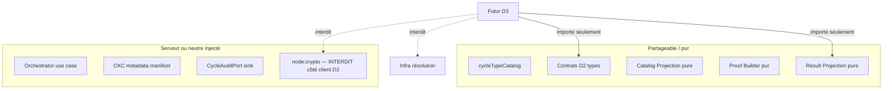
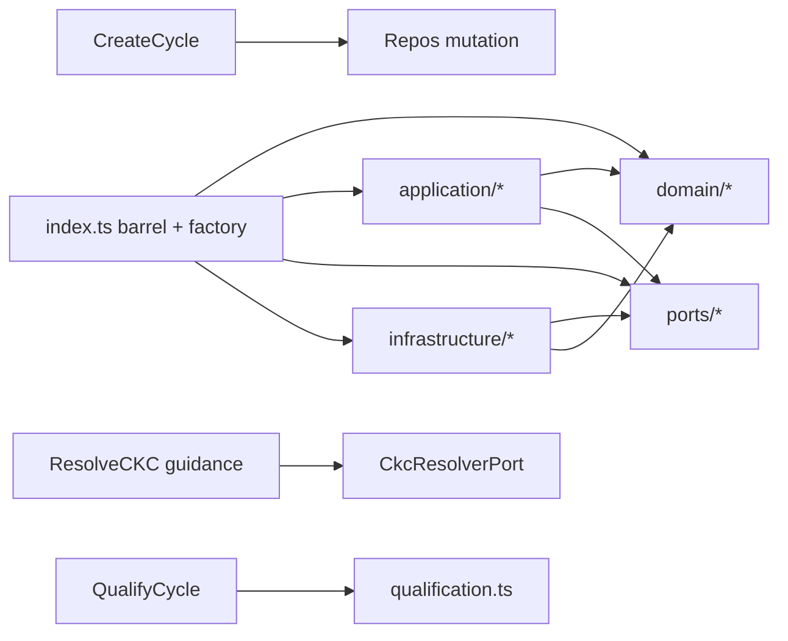
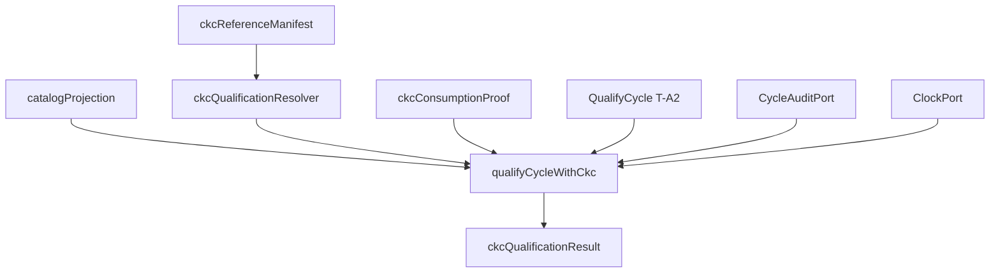
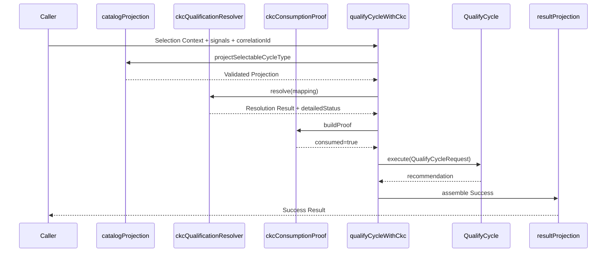
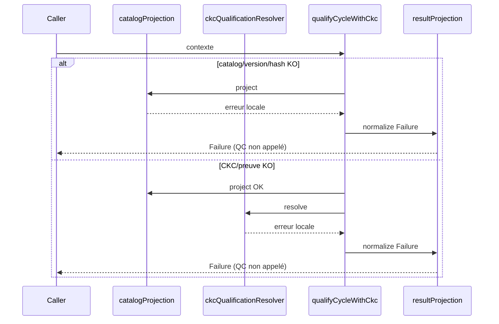
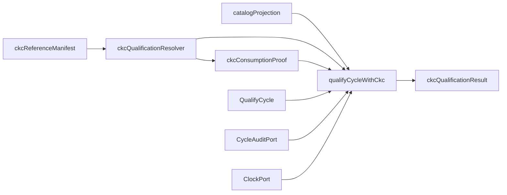
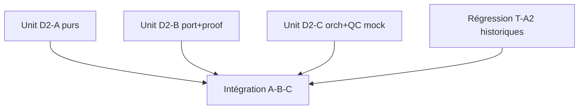
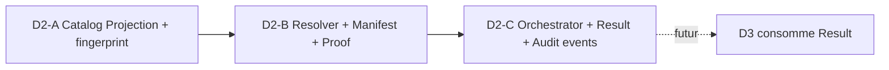

# SFIA Studio V3.1-D2 — Review pack Full — Architecture technique

## Meta

| Champ | Valeur |
|-------|--------|
| **Date/heure/fuseau** | 2026-08-01 16:32:34 CEST (+0200) |
| **Rôle Cursor** | Exécution cycle 6 Architecture technique (Critical / DOC) — sans implémentation |
| **Gate Morris** | GO ARCHITECTURE TECHNIQUE SFIA STUDIO V3.1-D2 — APPLY ADOPTED D-V3.1-D2-FA-01…12 — NO DELIVERY — NO D3 — NO UI — NO CREATECYCLE — NO METHOD PROMOTION |
| **Date gate** | 2026-08-01 16:16 CEST (+0200) |
| **Adoption FA** | FA-01=FA-C · FA-02=preuve autonome colocalisée · FA-03=résolution+projection T-A2 · FA-04=orch+Result Projection · FA-05=statut par resolver · FA-06=version/hash Catalog Projection · FA-07=correlationId+événements · FA-08=contrat unique D3 · FA-09=A/B/C · FA-10=adaptation T-A2 · FA-11=événements minimaux · FA-12=TA avant backlog · ok pour les recommandations |
| **Cycle** | 6 — Architecture technique |
| **Profil** | Critical |
| **Justification Critical** | Frontières modules, adaptation T-A2, hash, ports, wiring, slicing conditionnent Delivery ; mauvaise borne → dette. Critical ≠ code/Delivery. |
| **Typologie** | DOC |
| **CKC** | pilots/03-architecture-technique.md · candidate 0.1.0 · executionAuthority=false |
| **Template** | prompts/templates/sfia-cycle-execution-template.md |
| **Branche** | framing/sfia-studio-v3-1-d2-ckc-resolver-cadrage |
| **HEAD/main** | e1befcb80ed5e3c789a7de9036a8207d6b3e6771 |
| **Handoff pré tip/blob** | fa0ceebc6d60da18c607015ec6029506f0cdf7fb / 4e7648901f9616a83a4c2c794748d28e9125b6be |
| **Pre-check ChatGPT** | limitation déclarée — contrôle local Cursor PASS |
| **Content coverage** | all required fields yes · synthesis only : no · review pack verdict : complete |

## Anti-claims

Pas de TA adoptée · pas de backlog/Delivery/D3/UI/CreateCycle · pas de code/tests/method · pas de claims scalable/secure/production-ready/zero-debt · INHERITED-R-01 NOT LIFTED · QualifyCycle inchangé · Core only · reco TA non adoptées.

## Document 18 — Architecture technique (complet)

# 18 — V3.1-D2 CKC Resolver & QualifyCycle Bridge — Architecture technique

## A. Métadonnées

| Champ | Valeur |
|-------|--------|
| **Date/heure/fuseau** | 2026-08-01 16:29:26 CEST (+0200) |
| **Cycle projet** | 6 — Architecture technique |
| **Profil SFIA** | **Critical** |
| **Typologie** | DOC |
| **Gate Morris** | `GO ARCHITECTURE TECHNIQUE SFIA STUDIO V3.1-D2 — APPLY ADOPTED D-V3.1-D2-FA-01…12 — NO DELIVERY — NO D3 — NO UI — NO CREATECYCLE — NO METHOD PROMOTION` (2026-08-01 16:16 CEST +0200) |
| **Branche** | `framing/sfia-studio-v3-1-d2-ckc-resolver-cadrage` |
| **Base** | `main` @ `e1befcb80ed5e3c789a7de9036a8207d6b3e6771` |
| **CKC** | `pilots/03-architecture-technique.md` · candidate v0.1.0 · `executionAuthority=false` |
| **Statut** | `V3.1-D2 TECHNICAL ARCHITECTURE COMPLETE LOCALLY — READY FOR MORRIS ARBITRATION OF D-V3.1-D2-TA-01…12 — NO TA DECISION ADOPTED — NO BACKLOG — NO DELIVERY` |
| **Docs protégés** | 12–16 **inchangés** · 15 SHA `534904ea…` |
| **Code / tests / Delivery / D3** | **non** |

## B. Gate Morris et décision record FA

**Adoption FA (immédiatement antérieure au GO TA) :** formulation Morris FA-01…12 = recommandations candidates · « ok pour les recommandations ». Heure transcript **indisponible**. Enregistrement documentaire : 2026-08-01 16:29:26 CEST (+0200). GO TA : 2026-08-01 16:16 CEST.

| ID | Retenu |
|----|--------|
| FA-01 | **FA-C** |
| FA-02 | Preuve autonome logiquement, colocalisée composant 2 |
| FA-03 | Resolver = résolution + projection T-A2 |
| FA-04 | Normalisation orchestrateur + Result Projection |
| FA-05 | Statut détaillé produit par resolver, conservé ensuite |
| FA-06 | Version/hash dans Catalog Projection |
| FA-07 | correlationId + événements minimaux |
| FA-08 | Contrat résultat unique D3 |
| FA-09 | D2-A / D2-B / D2-C séparés · D2-D gated |
| FA-10 | Adaptation contrôlée T-A2 |
| FA-11 | Événements fonctionnels minimaux |
| FA-12 | Architecture technique avant backlog Delivery |

Voir [`17`](./17-v3-1-d2-ckc-resolver-qualify-cycle-bridge-functional-architecture.md) §B2 — `DECIDED — ADOPTED BY MORRIS`.

## C. Sources consultées

Gouvernance · CKC `03-architecture-technique` · routing matrix · §4.6 · framing 08/12–17/README · D1 · T-A2 intégral (`types`/`errors`/`invariants`/`qualification`/`ckcResolver`/`cycleAudit`/`resolveCycleKnowledgeContract`/`qualifyCycle`/`createCycle`/`memoryCkcResolver`/`observability`/`index`) · tests `oa/cycle/**` · `package.json`/`tsconfig`/`vitest`/`next.config` · handoff `fa0ceebc…`.

**Limite pre-check ChatGPT :** état local non inspecté directement par ChatGPT ; contrôle local Cursor obligatoire — **exécuté et conforme**.

## D. Git Truth

Branche framing @ `e1befcb8…` · main/origin/main alignés 0/0 · staged vide · 08/README modifiés · 15/16/17 non suivis · 77 WT · prune vide · branche projet distante absente · handoff tip `fa0ceebc…` blob `4e764890…` · doc15 `534904ea…`.

## E. CKC Architecture technique

Pilote `03-architecture-technique.md` · candidate · héritage §4.6 · guidance cognitive · **pas** d’autorité d’exécution. Dimensions 1–11 couvertes. Interdictions : stack par habitude · mono-option · benchmark inventé · sécu cosmétique · astronaut · code sous archi · claims scalable/secure/prod/zéro dette sans preuve.

## F. Architecture fonctionnelle adoptée

FA-C : (1) Catalog Projection (2) CKC Resolution and Consumption — resolver + proof logique distincte (3) Qualification Orchestrator (4) Read-only Result Projection (T) Error/Traceability Envelope.

## G. État technique actuel

### Observations confirmées localement

| Élément | Observation |
|---------|-------------|
| `cycleTypeCatalog.ts` | Domaine pur · 15 entrées · version `0.1.0-v3.1-d1` · mapping CKC · **pas de hash** · pas d’I/O |
| `CkcResolverPort` | `cycleTypeId`/`resolvedAt`/`correlationId?` → `CkcResolution` |
| `MemoryCkcResolver` | Registre mémoire indépendant catalogue · `randomBytes` · unavailable si absent · **pas** primary vs fallback · **pas** preuve D2 |
| `ResolveCycleKnowledgeContract` | Guidance · absent/unavailable = `ok:true` · ≠ fail-closed D2 |
| `QualifyCycle` | Recommandation · `isMorrisDecision=false` · ne résout pas CKC |
| `CycleAuditEvent` | Union T-A2 · `oa.ckc.resolved` / `oa.cycle.qualified` · pas d’événements D2 |
| `createInMemoryCycleServices` | Composition T-A2 + repos mutation |
| `node:crypto`/`randomBytes` | createCycle, trajectories, epistemic, **MemoryCkcResolver** |
| Socle | Next 15 · React 19 · TS strict · bundler · Vitest · **pas** de lib hash dédiée |

## H. Contraintes et NFR

| NFR | Exigence |
|-----|----------|
| Déterminisme | Mêmes entrées contractuelles → même résultat hors timestamps/IDs variables · hash reproductible · mapping stable |
| Testabilité | Domaine pur · clock/audit injectables · pas de Next obligatoire · fail-closed vérifiable |
| Compatibilité | QualifyCycle inchangé · adaptation T-A2 · API publique additive · pas de domaine parallèle |
| Sécurité | Pas de Markdown parse · refs typées · pas de secret · correlationId ≠ identité · pas de payload sensible |
| Performance | 15 entrées · pas de cache disproportionné · coût hash explicite · **aucun claim sans mesure** |
| Résilience | Fail-closed · pas de profil/`consumed=true` après échec · pas de mutation partielle |
| Observabilité | Événements minimaux · correlationId · pas de RUN readiness |
| DevOps | Next/Vitest/TS · pas de nouvelle dépendance sans justification · **pas de CI dans ce cycle** |

## I. Principes techniques

Les 25 principes du GO (catalogue autoritatif, no Markdown, QualifyCycle inchangé, adaptation T-A2, proof distincte, fail-closed avant QualifyCycle, `executionAuthority=false`, Core seul, contrat D3 unique, pas de mutation, noms sémantiques hors dette « D2 », API additive).

## J. Frontière serveur/client


```mermaid
flowchart TB
  subgraph shareable [Partageable / pur]
    Cat[cycleTypeCatalog]
    Types[Contrats D2 types]
    Proj[Catalog Projection pure]
    Proof[Proof Builder pur]
    ResProj[Result Projection pure]
  end
  subgraph serverish [Serveur ou neutre injecté]
    Orch[Orchestrator use case]
    Manifest[CKC metadata manifest]
    Audit[CycleAuditPort sink]
    Crypto[node:crypto — INTERDIT côté client D2]
  end
  D3[Futur D3] -->|importe seulement| Types
  D3 -->|importe seulement| ResProj
  D3 -.->|interdit| Crypto
  D3 -.->|interdit| ManifestInfra[Infra résolution]
```

- Modules purs : catalogue, projection, preuve, types résultat, mapping statut.
- Orchestrateur : neutre si dépendances injectées (clock/audit/resolver) — **pas** d’import `node:crypto`.
- Toute crypto/hash runtime Node : **adaptateur serveur** ou constante précalculée (HASH-A).
- Aucune route / Server Action / React dans ce cycle.

## K. Cartographie des modules actuels


```mermaid
flowchart LR
  index[index.ts barrel + factory]
  domain[domain/*]
  app[application/*]
  ports[ports/*]
  infra[infrastructure/*]
  index --> domain
  index --> app
  index --> ports
  index --> infra
  app --> domain
  app --> ports
  infra --> ports
  infra --> domain
  createCycle[CreateCycle] --> repos[Repos mutation]
  resolveCKC[ResolveCKC guidance] --> ckcPort[CkcResolverPort]
  qualify[QualifyCycle] --> qualDom[qualification.ts]
```

## L. Options de packaging technique

| | TA-P-A Extension répertoires existants | TA-P-B Sous-module sémantique borné | TA-P-C Domaine parallèle |
|--|--|--|--|
| Cohésion | Moyenne | Haute | Fausse isolation |
| Couplage T-A2 | Faible-moyen | Contrôlé | Duplication |
| API | Barrel existant | Facade bornée | Divergence |
| Dette | Fichiers nombreux | Structure nouvelle | **Élevée** |
| Slicing A/B/C | Possible par fichiers | Clair | Risqué |
| Réversibilité | Haute | Moyenne | Faible |

**Reco candidate : TA-P-A** — fichiers sémantiques sous `domain/`/`application/`/`ports/`/`infrastructure/` avec noms **métier** (ex. `catalogProjection`, `ckcConsumptionProof`, `qualifyCycleBridge`) — **pas** un package externe. TA-P-C **rejeté**. TA-P-B optionnellement si Morris veut façade plus stricte.

## M. Architecture cible candidate (non adoptée)

Nommage sémantique candidat (documentaire) :

| Rôle FA-C | Emplacement candidat | Nature |
|-----------|----------------------|--------|
| Catalog Projection | `domain/catalogProjection.ts` | Fonctions pures |
| catalogHash | `domain/catalogFingerprint.ts` (+ constante) | Pur |
| Contrats D2 | `domain/ckcQualificationContracts.ts` | Types |
| Resolver D2 | `ports/ckcQualificationResolver.ts` + infra adaptateur | Port + infra |
| Manifest CKC | `infrastructure/ckcReferenceManifest.ts` | Données typées |
| Proof Builder | `domain/ckcConsumptionProof.ts` | Pur |
| Orchestrator | `application/qualifyCycleWithCkc.ts` | Use case |
| Result Projection | `domain/ckcQualificationResult.ts` | Pur |
| Erreurs D2 | `domain/ckcQualificationErrors.ts` | Types + adaptateur |
| Factory | `createCkcQualificationServices` dans `index.ts` ou voisin | Composition |


```mermaid
flowchart TB
  CP[catalogProjection] --> OR[qualifyCycleWithCkc]
  RES[ckcQualificationResolver] --> OR
  PRF[ckcConsumptionProof] --> OR
  QC[QualifyCycle T-A2] --> OR
  OR --> RP[ckcQualificationResult]
  MAN[ckcReferenceManifest] --> RES
  AUD[CycleAuditPort] --> OR
  CLK[ClockPort] --> OR
```

**Imports interdits :** CreateCycle repos · Markdown FS · `node:crypto` dans modules purs · QualifyCycle modifié · UI.

### Séquence nominale technique


```mermaid
sequenceDiagram
  participant Caller
  participant CP as catalogProjection
  participant RES as ckcQualificationResolver
  participant PRF as ckcConsumptionProof
  participant OR as qualifyCycleWithCkc
  participant QC as QualifyCycle
  participant RP as resultProjection
  Caller->>OR: Selection Context + signals + correlationId
  OR->>CP: projectSelectableCycleType
  CP-->>OR: Validated Projection
  OR->>RES: resolve(mapping)
  RES-->>OR: Resolution Result + detailedStatus
  OR->>PRF: buildProof
  PRF-->>OR: consumed=true
  OR->>QC: execute(QualifyCycleRequest)
  QC-->>OR: recommendation
  OR->>RP: assemble Success
  RP-->>Caller: Success Result
```

### Séquence fail-closed technique


```mermaid
sequenceDiagram
  participant Caller
  participant CP as catalogProjection
  participant RES as ckcQualificationResolver
  participant OR as qualifyCycleWithCkc
  participant RP as resultProjection
  Caller->>OR: contexte
  alt catalog/version/hash KO
    OR->>CP: project
    CP-->>OR: erreur locale
    OR->>RP: normalize Failure
    RP-->>Caller: Failure (QC non appelé)
  else CKC/preuve KO
    OR->>CP: project OK
    OR->>RES: resolve
    RES-->>OR: erreur locale
    OR->>RP: normalize Failure
    RP-->>Caller: Failure (QC non appelé)
  end
```

## N. Mapping FA-C → technique

### Dépendances entre composants techniques


```mermaid
flowchart LR
  CP[catalogProjection] --> OR[qualifyCycleWithCkc]
  MAN[ckcReferenceManifest] --> RES[ckcQualificationResolver]
  RES --> OR
  RES --> PRF[ckcConsumptionProof]
  PRF --> OR
  QC[QualifyCycle] --> OR
  OR --> RP[ckcQualificationResult]
  AUD[CycleAuditPort] --> OR
  CLK[ClockPort] --> OR
```

| FA-C | Type | Entrées | Sorties | Deps OK | Deps interdites | Public? | Lot | Tests | Réversibilité |
|------|------|---------|---------|---------|-----------------|---------|-----|-------|---------------|
| Catalog Projection | domaine pur | Selection Context | Validated Projection / erreur | catalogue D1 | resolver, QC | oui (lecture) | A | purs | haute |
| Resolver (+ statut D2 + T-A2) | port+infra | mapping validé | Resolution Result | manifest | QC, CreateCycle | interne/port | B | unit+contrat | moyenne |
| Proof Builder | domaine pur | Resolution Result | Proof / erreur | aucun I/O | QC | interne | B | purs | haute |
| Orchestrator | application | contexte+signaux | assemblage | CP,RES,PRF,QC,clock,audit | repos écriture | façade | C | intégration | moyenne |
| Result Projection | domaine pur | pièces + erreurs | Success/Failure | aucun I/O | rules métier | **contrat D3** | C | purs | haute |
| Envelope T | transverse | correlationId | events/erreurs | audit port | IAM | via orch | A–C | unit | haute |

## O. Contrats et types TypeScript candidats

**Reco TYPE-B :** fichier `domain/ckcQualificationContracts.ts` (ou nom sémantique équivalent) exporté additivement via `index.ts`.

Types candidats (documentaires) :

- `CatalogSelectionContext`
- `ValidatedCycleTypeProjection`
- `D2DetailedCkcStatus` (statuts doc 16)
- `CkcQualificationResolution`
- `CkcConsumptionProof`
- `CkcQualificationSuccessResult` / `CkcQualificationFailureResult`
- Réutilisation : `CkcLevel`/`CkcStatus`/`CkcSource`/`QualifyCycleRequest`/`QualifyCycleRecommendation` T-A2

TYPE-C rejeté (perte primary/fallback/preuve). TYPE-A acceptable mais fichier `types.ts` déjà large.

## P. D2-A — Catalog Projection

API candidate pure :

- `projectSelectableCycleType(ctx) → ValidatedCycleTypeProjection | CatalogProjectionError`
- Réutilise `getCycleTypeById` / validateurs D1 existants
- Vérifie `catalogVersion` / `catalogHash` / lifecycle / sélectionnabilité
- Expose mapping CKC Core
- **N’appelle pas** resolver ni QualifyCycle

## Q. Version et catalogHash

Contenu contractuel de l’empreinte (candidat) :

`cycleTypeId` · `canonicalKey` · `lifecycleStatus` · `methodCycleNumber` · mapping CKC (level, primary, fallback, doctrine, executionAuthority, unavailableBehavior) · références.

**Labels/descriptions :** **exclure** de l’empreinte (changement i18n ≠ stale contractuel) — option à confirmer Morris via TA-03.

| | HASH-A constante+test | HASH-B sérialisation+adaptateur | HASH-C artefact build |
|--|--|--|--|
| Client-safe | Oui | Selon adaptateur | Oui si statique |
| Dérive | Manuelle | Faible | Pipeline |
| Dette | Faible | Crypto/env | CI/script |
| Proportion 15 entrées | **Bonne** | Moyenne | Disproportionnée |

**Reco candidate : HASH-A** — constante versionnée exportée + test de cohérence sur projection contractuelle. HASH-B en réserve si dérive manuelle observée. HASH-C déconseillé pour cette taille.

Algo : **non choisi** ici (SHA-256 vs autre) — si HASH-A, l’algo est hors runtime (empreinte figée).

## R. D2-B — CKC Resolution

**Reco PORT-B :** port spécialisé `CkcQualificationResolverPort` (fail-closed, detailed/fallback, statut D2) + projection vers champs T-A2 (`level`/`status`/`source`) sans casser `CkcResolverPort` historique.

PORT-A risque de rupture CreateCycle. PORT-C incompatible (guidance `ok` sur unavailable).

Flux : detailed → fallback synthetic → synthetic primaire · Core seul · `executionAuthority=false` forcé · pas de QualifyCycle.

## S. Source runtime des métadonnées CKC

| | CKC-S-A manifest typé | CKC-S-B enrichir D1 | CKC-S-C MemoryCkcResolver |
|--|--|--|--|
| Autorité | Registre contrôlé | Catalogue | Double source |
| Markdown | Non | Non | Non |
| Fallback détaillé | Oui si modélisé | Possible | **Non** |
| Preuve D2 | Compatible | Couplage | **Absente** |
| Impact D1 | Nul | **Fort** | Nul mais incorrect |

**Reco candidate : CKC-S-A** — manifest TypeScript des références autorisées (niveau, version, disponibilité, source). Paths Git = provenance, **pas** ouverts. CKC-S-C **rejeté** comme source autoritative produit. CKC-S-B nécessite GO D1 distinct.

## T. CKC Consumption Validator / Proof Builder

**Reco PROOF-A :** fonction pure domaine — reçoit résolution + contexte validé → Proof ou erreur. Aucune I/O. Colocalisé module Resolution+Consumption (FA-02). PROOF-C viole FA-02. PROOF-B inutile sans deps.

## U. Statuts détaillés et mapping T-A2

Resolver produit statut D2 (doc 16) **et** projection `CkcLevel`/`CkcStatus`/`CkcSource`. Proof + Success conservent le détail pour compenser perte primary/fallback dans T-A2. Pas de nouveaux enums T-A2.

## V. D2-C — Qualification Orchestrator

**Reco ORCH-A :** use case `QualifyCycleWithCkc` (nom candidat) injecté :

dépendances : CatalogProjection · CkcQualificationResolver · ProofBuilder · **QualifyCycle existant** · ClockPort · Audit · ResultProjection.

ORCH-B / ORCH-C **rejetés** (mélange responsabilités / guidance).

Règles : signaux 6 · pas `requestedProfile` · QualifyCycle **une fois** · stop si non consommé · normalisation FA-04.

## W. Réutilisation de QualifyCycle

Fonctionnellement **inchangé**. Orchestrateur appelle `execute(QualifyCycleRequest)`. Domaine `qualification.ts` non dupliqué. `isMorrisDecision=false` conservé.

## X. Read-only Result Projection

Fonctions pures assemblant Success/Failure (doc 16). Disclosures (fallback). Frontière unique D3. Aucune règle métier. Aucune persistance.

## Y. Erreurs et normalisation

**Reco ERR-B :** codes/erreurs D2 typés (`CATALOG_*`, `CKC_*`, `SIGNALS_*`, … doc 16) + adaptateur optionnel vers enveloppe `CycleStructuredError` si besoin de sink commun. ERR-A élargit fortement `CycleDetailCode` (risque dilution). ERR-C rejeté.

Flux : erreur locale composant → orchestrateur arrête → Result Projection émet Failure (pas de profil, pas `consumed=true`).

## Z. Traçabilité et événements

**Reco AUDIT-A :** extension **additive** de `CycleAuditEvent` avec événements D2 minimaux (catalog validated, resolution started/succeeded/failed, fallback used, consumption validated/rejected, qualification started/succeeded, result produced, request failed). AUDIT-C incompatible FA-07/11. AUDIT-B si union devient trop large.

Champs : `correlationId` obligatoire · `ts` · codes · **pas** de données sensibles.

## AA. Composition root et API publique

**Reco COMP-B :** factory/façade `createCkcQualificationServices` (nom candidat) — **sans** repos mutation. Réutilise `QualifyCycle` + clock + audit. COMP-A couple D2 à CreateCycle. COMP-C rejeté (UI).

Exports additifs via `index.ts` : contrats résultat + factory. **Pas** de breaking change obligatoire.

## AB. Déterminisme, horloge et identifiants

- `resolvedAt`/`qualifiedAt` : ClockPort injectable.
- `correlationId` : fourni par appelant ; absent → Failure.
- `ckcResolutionId` historique (`randomBytes`) : **ne pas** hériter pour logique déterministe D2 ; ID résultat read-only **optionnel** — si requis, générateur injecté ou dérivé déterministe du contexte (décision TA ouverte).
- Pas de dépendance à l’ordre d’un `Map` mutable pour le hash.

## AC. Sécurité

Analyse bornée : refs CKC via manifest typé · pas de FS/Markdown · pas de secrets · correlationId non-IAM · Failure sans fuite `internalCauseRef` côté D3 · pas d’exposition infra à D3.

**Aucun claim « sécurisé ».**

## AD. Performance et résilience

15 entrées · projection O(n) négligeable · hash constante (HASH-A) O(1) runtime · **aucune mesure** → **aucun claim perf**. Résilience = fail-closed documenté.

## AE. Observabilité et DevOps fit

Événements minimaux · journals mémoire/console existants · Vitest pour domaine · **pas** de CI/script dans ce cycle · **pas** de nouvelle dépendance proposée (HASH-A / WebCrypto non requis).

## AF. Compatibilité et migration T-A2

| Artefact | Stratégie |
|----------|-----------|
| QualifyCycle | Inchangé |
| ResolveCycleKnowledgeContract | Conservé pour CreateCycle/guidance · **non** utilisé comme exploitabilité D2 |
| CkcResolverPort / MemoryCkcResolver | Conservés historiques · non source autoritative D2 |
| CycleServices | Inchangé ou extension additive optionnelle |
| Tests historiques | Régression obligatoire en Delivery |

## AG. Stratégie de tests future (aucun test créé)

**D2-A :** version/hash · inconnu · lifecycle · stale · déterminisme fingerprint.

**D2-B :** detailed/synthetic/fallback · mapping invalide · ref non autorisée · executionAuthority · preuve · extension implicite · mapping T-A2.

**D2-C :** signaux · QC ×1 · QC jamais si amont KO · Critical/Capitalization · Success/Failure · correlationId · events.

**Intégration :** A→B→C · frontière unique · aucune mutation · coexistence factory T-A2 · régression.


```mermaid
flowchart TB
  unitA[Unit D2-A purs] --> int[Intégration A-B-C]
  unitB[Unit D2-B port+proof] --> int
  unitC[Unit D2-C orch+QC mock] --> int
  regr[Régression T-A2 historiques] --> int
```

## AH. Packaging D2-A / D2-B / D2-C


```mermaid
flowchart LR
  A[D2-A Catalog Projection + fingerprint] --> B[D2-B Resolver + Manifest + Proof]
  B --> C[D2-C Orchestrator + Result + Audit events]
  C -.->|futur| D3[D3 consomme Result]
```

Chaque lot : contrats de sortie testables · gate Morris Delivery distinct · D2-D gated.

## AI. Dépendances et impacts build

Aucune nouvelle dépendance runtime recommandée. Impact : fichiers TS additifs · typecheck/Vitest · attention imports `node:crypto` hors client. **package.json / CI non modifiés** dans ce cycle.

## AJ. Alternatives et trade-offs

Synthèse : packaging A vs B · HASH A/B/C · CKC-S A/B/C · PORT A/B/C · TYPE A/B/C · PROOF A/B/C · ORCH A/B/C · ERR A/B/C · AUDIT A/B/C · COMP A/B/C — voir §§ L–AA et decision pack.

**Recommandation technique candidate globale (non adoptée) :**

TA-P-A · Catalog Projection pure · HASH-A · CKC-S-A · PORT-B · TYPE-B · PROOF-A · ORCH-A · ERR-B · AUDIT-A · COMP-B · slicing A→B→C après arbitrage TA.

## AK. Decision pack Morris

Toutes : **NOT DECIDED — MORRIS DECISION REQUIRED.**

### D-V3.1-D2-TA-01 — Packaging

- Problème : où placer le code D2 sans domaine parallèle.
- Options : extension répertoires / sous-module borné / domaine parallèle.
- Reco : **extension sémantique (TA-P-A)** ; parallèle rejeté.
- NFR : cohésion, dette, réversibilité.
- Impact API : additive via barrel.
- Statut : NOT DECIDED — MORRIS DECISION REQUIRED

### D-V3.1-D2-TA-02 — Catalog Projection

- Options : fonctions pures / service applicatif / extension comportementale catalogue.
- Reco : **fonctions de domaine pures**.
- Statut : NOT DECIDED — MORRIS DECISION REQUIRED

### D-V3.1-D2-TA-03 — catalogHash

- Options : constante+test / sérialisation+adaptateur / artefact build.
- Reco : **HASH-A**.
- Statut : NOT DECIDED — MORRIS DECISION REQUIRED

### D-V3.1-D2-TA-04 — Source métadonnées CKC

- Options : manifest typé / enrichir D1 / MemoryCkcResolver.
- Reco : **CKC-S-A** ; Memory comme autorité **rejeté**.
- Statut : NOT DECIDED — MORRIS DECISION REQUIRED

### D-V3.1-D2-TA-05 — Resolver port

- Options : évoluer port / port D2+adaptateur / wrapper ResolveCKC.
- Reco : **PORT-B**.
- Statut : NOT DECIDED — MORRIS DECISION REQUIRED

### D-V3.1-D2-TA-06 — Placement contrats

- Options : types.ts / fichier dédié / T-A2 exclusive.
- Reco : **fichier domaine sémantique dédié (TYPE-B)**.
- Statut : NOT DECIDED — MORRIS DECISION REQUIRED

### D-V3.1-D2-TA-07 — Preuve

- Options : validator pur / service / orchestrateur.
- Reco : **PROOF-A**.
- Statut : NOT DECIDED — MORRIS DECISION REQUIRED

### D-V3.1-D2-TA-08 — Orchestration

- Options : nouveau use case / modifier QualifyCycle / modifier ResolveCKC.
- Reco : **ORCH-A** ; B/C rejetés.
- Statut : NOT DECIDED — MORRIS DECISION REQUIRED

### D-V3.1-D2-TA-09 — Erreurs

- Options : étendre CycleDetailCode / erreurs D2+adaptateur / génériques.
- Reco : **ERR-B**.
- Statut : NOT DECIDED — MORRIS DECISION REQUIRED

### D-V3.1-D2-TA-10 — Audit

- Options : extension CycleAuditEvent / port D2+adaptateur / aucun.
- Reco : **AUDIT-A**.
- Statut : NOT DECIDED — MORRIS DECISION REQUIRED

### D-V3.1-D2-TA-11 — Composition / API

- Options : étendre CycleServices / factory D2 séparée / depuis D3.
- Reco : **COMP-B** ; depuis D3 rejeté.
- Statut : NOT DECIDED — MORRIS DECISION REQUIRED

### D-V3.1-D2-TA-12 — Slicing / gate sortie

- Options : backlog A/B/C séparé / lot unique / Delivery directe.
- Reco : **backlog séparé après arbitrage TA** ; Delivery directe déconseillée.
- Statut : NOT DECIDED — MORRIS DECISION REQUIRED

Pour chaque décision : options et reco ci-dessus · dette/réversibilité documentées · impact D1 limité (sauf si CKC-S-B) · T-A2 préservé · D3 consomme résultat · **aucune adoption dans ce cycle**.

## AL. Questions ouvertes

- Nom exact des fichiers/modules sémantiques.
- Inclusion labels dans fingerprint.
- Algorithme si HASH-B choisi plus tard.
- Besoin d’un `qualificationResultId`.
- Étendue exacte des événements additifs vs port dédié si union grossit.
- Export public minimal pour D3 (types only vs helpers).
- Stratégie de versionnement `CYCLE_TYPE_CATALOG_VERSION` vs fingerprint.
- Migration progressive MemoryCkcResolver (tests only) vs dépréciation documentation.

## AM. Risques, dette et réversibilité

Sur-architecture · nommage « D2 » · types.ts surchargé · domaine parallèle · duplication T-A2 · port cassant · ResolveCKC mal réutilisé · double source CKC · Markdown · hash manuel divergent · sérialisation non canonique · `node:crypto` client · artefact build · random ID · correlationId perdu · erreurs diluées · audit/factory surchargés · D3↔infra · fail-open · mutation · package inutile · slicing non livrable · Delivery implicite · claims prod sans preuve · **INHERITED-R-01 ACCEPTED — STILL TRACEABLE — NOT LIFTED**.

Réversible facilement : HASH-A→B · AUDIT-A→B · COMP-B wiring. Coûteux : PORT-A cassant · domaine parallèle · enrichissement D1.

## AN. Backlog handoff candidat

Après arbitrage TA uniquement : préparer backlog D2-A/B/C testable — **non ouvert** ici.

## AO. Gates suivants candidats

```text
GO ARBITRATE SFIA STUDIO V3.1-D2 TECHNICAL ARCHITECTURE DECISION PACK —
DECIDE D-V3.1-D2-TA-01…12 —
NO BACKLOG —
NO DELIVERY —
NO D3 —
NO UI —
NO CREATECYCLE —
NO METHOD PROMOTION
```

Ultérieur (après arbitrage TA) :

```text
GO BACKLOG SFIA STUDIO V3.1-D2-A/B/C —
USE ADOPTED FUNCTIONAL AND TECHNICAL ARCHITECTURE —
PREPARE TESTABLE DELIVERY SLICES —
NO IMPLEMENTATION —
NO D3 —
NO UI —
NO CREATECYCLE —
NO METHOD PROMOTION
```

Ne pas exécuter sans nouveau GO Morris.

## AP. Critères d’acceptation AC-D2-TA-01…24

Respect FA-C · pas de domaine parallèle · QualifyCycle inchangé · ResolveCKC ≠ D2 fail-closed · catalogue autoritatif · no Markdown · source CKC typée · hash déterministe selon option · frontière serveur/client · pas de crypto client implicite · preuve isolable · resolver≠QC · orch≠recalcul · Success/Failure unique · erreurs structurées · correlationId · events mappés · pas de mutation · slicing testable · TS/Next/Vitest · pas de dep sans justification · réversibilité identifiée · **aucun code modifié** · décisions TA soumises à Morris.

## AQ. Scénarios techniques 1–30

Couvrent : import pur · hash stable/stale · labels · type inconnu · detailed/synthetic/fallback · ref non autorisée · executionAuthority · mismatch · preuve · signaux · QC ×1 / jamais · Critical · Capitalization · correlationId · event fallback · Failure normalisée · D3 types-only · coexistence factory · Memory non autoritatif · randomBytes isolé · extension CKC · aucune mutation · bundle client · tests A indépendants · rollback sans casser D1.

## AR. Verdict

```text
V3.1-D2 TECHNICAL ARCHITECTURE COMPLETE —
D-V3.1-D2-FA-01…12 RECORDED AS ADOPTED BY MORRIS —
FA-C TECHNICALLY MAPPED —
CURRENT D1 AND T-A2 BASELINE ANALYZED —
PACKAGING, HASH, CKC SOURCE, RESOLVER, PROOF, ORCHESTRATOR, ERROR, AUDIT AND COMPOSITION OPTIONS COMPARED —
SERVER CLIENT BOUNDARY DOCUMENTED —
NFR AND REVERSIBILITY DOCUMENTED —
D2-A D2-B AND D2-C TECHNICAL SLICING DOCUMENTED —
D-V3.1-D2-TA-01…12 PREPARED FOR MORRIS ARBITRATION —
NO TECHNICAL ARCHITECTURE DECISION ADOPTED —
NO IMPLEMENTATION —
NO TEST MODIFIED —
NO BACKLOG —
NO DELIVERY —
NO D3 —
NO UI —
NO FIGMA —
NO CREATECYCLE —
NO METHOD PROMOTION
```

**Statut :** `V3.1-D2 TECHNICAL ARCHITECTURE READY FOR MORRIS ARBITRATION — BACKLOG AND DELIVERY REQUIRE DISTINCT MORRIS GATES — D3 NOT OPENED`


## Document 17 — sections modifiées

### Document 17 — sections modifiées

#### A+B2

# 17 — V3.1-D2 CKC Resolver & QualifyCycle Bridge — Architecture fonctionnelle

## A. Métadonnées

| Champ | Valeur |
|-------|--------|
| **Date/heure/fuseau** | 2026-08-01 15:20:47 CEST (+0200) |
| **Cycle projet** | 3 — Architecture fonctionnelle |
| **Profil SFIA** | **Critical** |
| **Typologie** | DOC |
| **Gate Morris** | Formulation : « ok go architecture fonctionnelle D2 » — 2026-08-01 15:13 CEST (+0200) |
| **Branche** | `framing/sfia-studio-v3-1-d2-ckc-resolver-cadrage` |
| **Base** | `main` @ `e1befcb80ed5e3c789a7de9036a8207d6b3e6771` |
| **CKC** | Fallback : carte synthétique + §4.3 · method-candidate · `executionAuthority=false` |
| **Statut** | `FUNCTIONAL ARCHITECTURE ADOPTED — TECHNICAL ARCHITECTURE AUTHORIZED — NO DELIVERY — D3 NOT OPENED` |
| **Doc 15** | **strictement inchangé** |
| **Doc technique** | [`18-v3-1-d2-ckc-resolver-qualify-cycle-bridge-technical-architecture.md`](./18-v3-1-d2-ckc-resolver-qualify-cycle-bridge-technical-architecture.md) |
| **Code / UI / D3 / CreateCycle** | **non** |

## B. Gate Morris et autorité

**Autorisé (cycle FA historique) :** architecture fonctionnelle ; options FA-A/B/C ; decision pack D-V3.1-D2-FA ; traçabilité ; handoff.

**Interdit (cycle FA historique) :** architecture technique ; code ; Delivery ; D3 ; UI ; Figma ; CreateCycle ; D2-D ; adoption implicite des décisions FA ; promotion méthode.

**Justification Critical :** frontières structurantes catalogue / resolver / consommation / bridge / résultat / D3 ; mauvais découpage → duplication, fail-open, dette, incohérence T-A2. Critical ≠ autorité d’exécution ni Delivery.

## B2. Decision record Morris — FA adoptées · architecture technique autorisée

| Champ | Valeur |
|-------|--------|
| **Formulation réelle Morris** | `FA-01 = FA-C` · `FA-02 = preuve autonome logiquement, colocalisée dans le composant 2` · `FA-03 = resolver : résolution + projection T-A2` · `FA-04 = normalisation orchestrateur + Result Projection` · `FA-05 = statut détaillé produit par le resolver et conservé ensuite` · `FA-06 = contrôle version/hash dans Catalog Projection` · `FA-07 = correlationId + événements minimaux` · `FA-08 = contrat résultat unique pour D3` · `FA-09 = composants répartis clairement entre D2-A/B/C` · `FA-10 = adaptation contrôlée de T-A2` · `FA-11 = événements fonctionnels minimaux` · `FA-12 = architecture technique avant backlog Delivery` · « ok pour les recommandations » |
| **Adoption** | Immédiatement antérieure au GO architecture technique |
| **Heure d’adoption transcript** | **indisponible** |
| **Date documentaire d’enregistrement** | 2026-08-01 16:29:26 CEST (+0200) |
| **GO architecture technique** | 2026-08-01 16:16 CEST (+0200) — `GO ARCHITECTURE TECHNIQUE SFIA STUDIO V3.1-D2 — APPLY ADOPTED D-V3.1-D2-FA-01…12 — NO DELIVERY — NO D3 — NO UI — NO CREATECYCLE — NO METHOD PROMOTION` |
| **Option retenue** | **FA-C** (Catalog Projection · Resolution+Consumption · Orchestrator · Result Projection · Envelope T) |
| **Conséquence** | Architecture technique **autorisée** · Delivery / backlog / D3 / UI / CreateCycle / D2-D **fermés** |
| **Document 18** | [`18-…-technical-architecture.md`](./18-v3-1-d2-ckc-resolver-qualify-cycle-bridge-technical-architecture.md) |

## C. Sources consultées

Gouvernance · carte synthétique · routing matrix · §4.3 · framing 08/12–16/README · D1 · T-A2 ports/types/qualify/errors/MemoryCkcResolver (observations) · handoff `308130e…`.

## D. Héritage validé

#### AI+AM

## AI. Decision pack Morris

**Statut pack :** `DECIDED — ADOPTED BY MORRIS` pour D-V3.1-D2-FA-01…12 (formulation §B2). Options et trade-offs historiques **conservés**.

### D-V3.1-D2-FA-01 — Modèle de composants

- Options : FA-A / FA-B / FA-C
- Reco candidate : **FA-C**
- **Retenu :** FA-C
- Statut : **DECIDED — ADOPTED BY MORRIS**

### D-V3.1-D2-FA-02 — Propriétaire de la preuve

- Options : resolver / autonome / bridge
- Reco candidate : **autonome** (logique ; colocated en FA-C dans comp. 2)
- **Retenu :** preuve autonome logiquement, colocalisée dans le composant 2
- Statut : **DECIDED — ADOPTED BY MORRIS**

### D-V3.1-D2-FA-03 — Frontière du resolver

- Options : résolution only / + projection T-A2 / + consommation
- Reco candidate : **résolution + projection T-A2** ; consommation séparée logiquement (même comp. si FA-C)
- **Retenu :** résolution + projection T-A2
- Statut : **DECIDED — ADOPTED BY MORRIS**

### D-V3.1-D2-FA-04 — Point de normalisation des erreurs

- Options : chaque composant / orchestrateur / projection
- Reco candidate : **orchestrateur + projection résultat**
- **Retenu :** orchestrateur + Result Projection
- Statut : **DECIDED — ADOPTED BY MORRIS**

### D-V3.1-D2-FA-05 — Propriétaire du statut détaillé D2

- Options : resolver / preuve / résultat final only
- Reco candidate : **resolver** (produit) ; preuve et résultat le **conservent**
- **Retenu :** statut détaillé produit par le resolver et conservé ensuite
- Statut : **DECIDED — ADOPTED BY MORRIS**

### D-V3.1-D2-FA-06 — Point de contrôle version/hash

- Options : projection catalogue / bridge / double contrôle
- Reco candidate : **projection catalogue** (principal)
- **Retenu :** contrôle version/hash dans Catalog Projection
- Statut : **DECIDED — ADOPTED BY MORRIS**

### D-V3.1-D2-FA-07 — Modèle de traçabilité

- Options : correlationId minimal / +événements / enveloppe complète
- Reco candidate : **correlationId + événements fonctionnels minimaux**
- **Retenu :** correlationId + événements minimaux
- Statut : **DECIDED — ADOPTED BY MORRIS**

### D-V3.1-D2-FA-08 — Frontière D3

- Options : contrat unique / appels séparés / projection spécifique
- Reco candidate : **contrat résultat unique**
- **Retenu :** contrat résultat unique pour D3
- Statut : **DECIDED — ADOPTED BY MORRIS**

### D-V3.1-D2-FA-09 — Allocation D2-A/B/C

- Options : séparés par lot / partagés progressifs / lot unique
- Reco candidate : **composants séparés par lot**
- **Retenu :** composants répartis clairement entre D2-A/B/C · D2-D gated
- Statut : **DECIDED — ADOPTED BY MORRIS**

### D-V3.1-D2-FA-10 — Compatibilité T-A2

- Options : réutilisation directe / adaptation contrôlée / domaine parallèle
- Reco candidate : **adaptation contrôlée** ; domaine parallèle **rejeté** sauf preuve exceptionnelle
- **Retenu :** adaptation contrôlée de T-A2
- Statut : **DECIDED — ADOPTED BY MORRIS**

### D-V3.1-D2-FA-11 — Formalisation des événements

- Options : aucun / minimaux / audit complet
- Reco candidate : **événements fonctionnels minimaux**
- **Retenu :** événements fonctionnels minimaux
- Statut : **DECIDED — ADOPTED BY MORRIS**

### D-V3.1-D2-FA-12 — Gate de sortie

- Options : arbitrage puis archi technique / arbitrage puis backlog D2-A / Delivery directe
- Reco candidate : **arbitrage Morris puis architecture technique** (ou backlog D2-A si archi technique légère différée) — **pas** Delivery directe
- **Retenu :** architecture technique avant backlog Delivery
- Statut : **DECIDED — ADOPTED BY MORRIS**

## AJ. Questions réservées à l’architecture technique

Fichiers/modules · classes · CkcResolverPort · ResolveCycleKnowledgeContract · composition root · DI · TS contracts · enums · erreurs · hash algo · sérialisation · validation refs sans Markdown · source métadonnées · cache · perf · audit · tests · migration · packaging D2-A/B/C.

**Traitées comme options dans le document 18 — non tranchées ici.** Voir [`18`](./18-v3-1-d2-ckc-resolver-qualify-cycle-bridge-technical-architecture.md).

## AK. Risques et réserves

Sur-architecture · composants artificiels · chevauchements · confusion resolver/consommation/bridge · domaine parallèle · duplication T-A2 · perte primary/fallback · hash mal borné · correlationId perdu · normalisation trop tardive · fail-open · D3 multi-couplé · multi-CKC implicite · slicing non livrable · audit disproportionné · tech anticipée · Delivery implicite · **INHERITED-R-01 ACCEPTED — STILL TRACEABLE — NOT LIFTED**.

## AL. Gates suivants candidats

```text
GO ARCHITECTURE TECHNIQUE SFIA STUDIO V3.1-D2 —
APPLY ADOPTED D-V3.1-D2-FA-01…12 —
NO DELIVERY —
NO D3 —
NO UI —
NO CREATECYCLE —
NO METHOD PROMOTION
```

**Statut :** **consommé** (2026-08-01 16:16 CEST) — voir document 18.

Gate ultérieur (ne pas exécuter ici) : arbitrage decision pack D-V3.1-D2-TA-01…12.

## AM. Verdict

```text
V3.1-D2 FUNCTIONAL ARCHITECTURE ADOPTED —
D-V3.1-D2-FA-01…12 RECORDED AS ADOPTED BY MORRIS —
FA-C RETAINED —
TECHNICAL ARCHITECTURE AUTHORIZED —
NO DELIVERY —
NO D3 —
NO UI —
NO FIGMA —
NO CREATECYCLE —
NO METHOD PROMOTION
```

**Statut :** `FUNCTIONAL ARCHITECTURE ADOPTED — TECHNICAL ARCHITECTURE AUTHORIZED — BACKLOG AND DELIVERY REQUIRE DISTINCT MORRIS GATES — D3 NOT OPENED`


## Document 08 — complet

# 08 — Implementation backlog and slicing

## Stratégie

Plusieurs PR (lots), commits atomiques. Framing docs séparés. Pas de big-bang.

## Lot V1 / V2

**INTEGRATED ON MAIN** (V2-A3 PR #295 @ `3e8a437…`).

## Lot V3 — Cycle Recommendation

**CADRAGE + ARBITRATION COMPLETE** — [`12`](./12-v3-cycle-recommendation-cadrage.md).

## Lot V3.1 — Profile Qualification (conception)

**FUNCTIONAL DESIGN COMPLETE** — [`13`](./13-v3-1-profile-qualification-functional-design.md).

## Lot V3.1 — Cycle Type Catalog (architecture + adoption)

**DECISIONS ADOPTED** — [`14`](./14-v3-1-cycle-type-catalog-functional-architecture.md).

## Lot V3.1-D1 — Catalogue runtime + mapping CKC

**Statut Delivery initial :** `IMPLEMENTATION COMPLETE`.

**Statut QA initiale :** `FAIL historique` — [`01`](../first-user-visible-vertical-slice-v3-1-d1-cycle-type-catalog-runtime/01-qa-validation-report.md) (inchangé).

**Statut correctif :** `CORRECTIVE DELIVERY IMPLEMENTED` — [`02`](../first-user-visible-vertical-slice-v3-1-d1-cycle-type-catalog-runtime/02-corrective-delivery-report.md) (inchangé).

**Statut revalidation :** `QA REVALIDATION PASS — R-QA-01…09 CLOSED` — [`03`](../first-user-visible-vertical-slice-v3-1-d1-cycle-type-catalog-runtime/03-qa-revalidation-report.md) (inchangé).

**QA-G3 Morris :** **PASS** (2026-07-30 21:36 CEST).

**Statut PR / merge / capitalisation (historique) :** PR #296 + capitalisation #297 **mergées** · D1 **techniquement clos** sur `main`.

Docs :
- [`../first-user-visible-vertical-slice-v3-1-d1-cycle-type-catalog-runtime/README.md`](../first-user-visible-vertical-slice-v3-1-d1-cycle-type-catalog-runtime/README.md)
- rapports `01` / `02` / `03` / `04`

| Preuve | Résultat |
|--------|----------|
| 15 IDs / mapping CKC | conformes |
| Revalidation / readiness tests | 46/46 · 94/94 · 827/827 · typecheck/lint/build PASS |
| QA-G2 | vert |
| QA-G3 | **PASS Morris** |
| PR / merge / capitalisation | PR #296 + #297 mergées · D1 techniquement clos sur `main` @ `e1befcb8…` |
| D2 cadrage | **terminé et arbitré** — [`15`](./15-v3-1-d2-ckc-resolver-qualify-cycle-bridge-cadrage.md) · D-V3.1-D2-01…12 **ADOPTED BY MORRIS** |
| D2 conception fonctionnelle | **validée** — [`16`](./16-v3-1-d2-ckc-resolver-qualify-cycle-bridge-functional-design.md) |
| Architecture fonctionnelle D2 | **adoptée (FA-C)** — [`17`](./17-v3-1-d2-ckc-resolver-qualify-cycle-bridge-functional-architecture.md) · D-V3.1-D2-FA-01…12 **ADOPTED BY MORRIS** |
| Architecture technique D2 | **terminée localement** — [`18`](./18-v3-1-d2-ckc-resolver-qualify-cycle-bridge-technical-architecture.md) · D-V3.1-D2-TA-01…12 **NOT DECIDED — MORRIS DECISION REQUIRED** |
| Backlog D2-A/B/C | **non ouvert** |
| Delivery D2-A/B/C | **non ouvertes** |
| D2-D (extensions) | **gated** · non ouvert |
| D3 | **non ouvert** |

### Slicing CAT-08

| Lot | Contenu | Statut |
|-----|---------|--------|
| **V3.1-D1** | Catalogue · mapping · validateur | **intégré `main`** · capitalisation REX publiée |
| **V3.1-D2** | Projection · resolver · QualifyCycle bridge | **cadrage arbitré** · **conception validée** · **FA-C adoptée** · **architecture technique locale** · décisions TA **en attente Morris** · backlog/Delivery **fermés** · slicing **A→B→C** · D2-D gated |
| **V3.1-D3** | UI · état CKC | **non autorisé** · réserve Figma |

### Réserves QA

R-QA-01…09 **CLOSED**. QA-G3 PASS. Historique PR readiness conservé.

### Réserves D2

Orchestration CKC · consommation fail-closed · bridge QualifyCycle · Core-only · FA-C adoptée · decision pack TA en attente · questions ouvertes doc 18 — voir [`15`](./15-v3-1-d2-ckc-resolver-qualify-cycle-bridge-cadrage.md) / [`16`](./16-v3-1-d2-ckc-resolver-qualify-cycle-bridge-functional-design.md) / [`17`](./17-v3-1-d2-ckc-resolver-qualify-cycle-bridge-functional-architecture.md) / [`18`](./18-v3-1-d2-ckc-resolver-qualify-cycle-bridge-technical-architecture.md).

## Lot V3.2 / V4 / V5 / V6

**NOT AUTHORIZED.**


## README — complet

# First user-visible SFIA Studio vertical slice — Framing

| Champ | Valeur |
|-------|--------|
| **Statut** | `FRAMING LIVING — V3.1-D1 CLOSED — V3.1-D2 FA-C ADOPTED — TECHNICAL ARCHITECTURE COMPLETE LOCALLY — TA DECISIONS PENDING MORRIS — BACKLOG/DELIVERY/D3 NOT OPENED` |
| **Date** | 2026-08-01 16:29:26 CEST (+0200) |
| **Cycle courant** | 6 — Architecture technique V3.1-D2 |
| **Profil** | **Critical** |
| **Typologie** | DOC |
| **Gate courant** | Architecture technique D2 **consommé** (2026-08-01 16:16 CEST) |
| **Décisions D2 produit** | D-V3.1-D2-01…12 **ADOPTED BY MORRIS** |
| **Décisions D2-FA** | D-V3.1-D2-FA-01…12 **ADOPTED BY MORRIS** (FA-C) |
| **Décisions D2-TA** | D-V3.1-D2-TA-01…12 **NOT DECIDED — MORRIS DECISION REQUIRED** |
| **Base `main`** | `e1befcb80ed5e3c789a7de9036a8207d6b3e6771` |
| **Docs D2** | [`15`](./15-v3-1-d2-ckc-resolver-qualify-cycle-bridge-cadrage.md) (arbitré, **inchangé**) · [`16`](./16-v3-1-d2-ckc-resolver-qualify-cycle-bridge-functional-design.md) (validée, **inchangée**) · [`17`](./17-v3-1-d2-ckc-resolver-qualify-cycle-bridge-functional-architecture.md) (**FA adoptée**) · [`18`](./18-v3-1-d2-ckc-resolver-qualify-cycle-bridge-technical-architecture.md) (architecture technique locale) |
| **Docs protégées** | `12` / `13` / `14` / `15` / `16` **inchangés** (ce cycle) |
| **Réserve README** | `ACCEPTED MINOR DOCUMENTATION RESERVE — STILL TRACEABLE — NOT LIFTED` |

## Synthèse

| Lot | État |
|-----|------|
| V1 / V2 | intégrés `main` |
| V3 / V3.1 cadrage–conception–adoption | terminés (`12`/`13`/`14`) |
| **V3.1-D1** | **techniquement clos** sur `main` |
| **V3.1-D2 cadrage** | **arbitré** |
| **V3.1-D2 conception** | **validée** |
| **V3.1-D2 architecture fonctionnelle** | **FA-C adoptée** — doc 17 |
| **V3.1-D2 architecture technique** | **terminée localement** — doc 18 · **non adoptée** tant que TA non arbitré |
| Backlog D2-A/B/C | **fermé** |
| Delivery D2-A/B/C | **fermée** |
| D2-D extensions | **gated** |
| V3.1-D3 | **fermé** · réserve Figma |
| V3.2 / V4–V6 | non autorisés |

**INHERITED-R-01 (README) :** condensation framing — **ACCEPTED — STILL TRACEABLE — NOT LIFTED** — non bloquant — pas une autorisation Delivery/D3.

## Gate candidat suivant

```text
GO ARBITRATE SFIA STUDIO V3.1-D2 TECHNICAL ARCHITECTURE DECISION PACK —
DECIDE D-V3.1-D2-TA-01…12 —
NO BACKLOG —
NO DELIVERY —
NO D3 —
NO UI —
NO CREATECYCLE —
NO METHOD PROMOTION
```

## Verdict

`V3.1-D2 TECHNICAL ARCHITECTURE COMPLETE LOCALLY — READY FOR MORRIS ARBITRATION OF D-V3.1-D2-TA-01…12 — NO TA DECISION ADOPTED — NO BACKLOG — NO DELIVERY — D3 NOT OPENED`


## Rapport temporaire

Voir aussi `.tmp-sfia-review/v3-1-d2-technical-architecture-report.md` (même fond).

## État Git final

```
=== Git Truth Final 2026-08-01T16:32:15+02:00 ===
branch=framing/sfia-studio-v3-1-d2-ckc-resolver-cadrage
HEAD=e1befcb80ed5e3c789a7de9036a8207d6b3e6771
main=e1befcb80ed5e3c789a7de9036a8207d6b3e6771
origin/main=e1befcb80ed5e3c789a7de9036a8207d6b3e6771
lr=0	0
--- framing status ---
 M projects/sfia-studio/sfia-v3-delivery/v3-native-option-a/first-user-visible-vertical-slice-framing/08-implementation-backlog-and-slicing.md
 M projects/sfia-studio/sfia-v3-delivery/v3-native-option-a/first-user-visible-vertical-slice-framing/README.md
?? projects/sfia-studio/sfia-v3-delivery/v3-native-option-a/first-user-visible-vertical-slice-framing/15-v3-1-d2-ckc-resolver-qualify-cycle-bridge-cadrage.md
?? projects/sfia-studio/sfia-v3-delivery/v3-native-option-a/first-user-visible-vertical-slice-framing/16-v3-1-d2-ckc-resolver-qualify-cycle-bridge-functional-design.md
?? projects/sfia-studio/sfia-v3-delivery/v3-native-option-a/first-user-visible-vertical-slice-framing/17-v3-1-d2-ckc-resolver-qualify-cycle-bridge-functional-architecture.md
?? projects/sfia-studio/sfia-v3-delivery/v3-native-option-a/first-user-visible-vertical-slice-framing/18-v3-1-d2-ckc-resolver-qualify-cycle-bridge-technical-architecture.md
--- cached ---
wt_count=77
--- remote framing ---
From https://github.com/mcleland147/sfia-workspace
 * branch            sfia/review-handoff -> FETCH_HEAD
tip=fa0ceebc6d60da18c607015ec6029506f0cdf7fb
blob=4e7648901f9616a83a4c2c794748d28e9125b6be
534904ea71555d89388c03a72ef84418ea4ce6a1c67cbbb6c7a03a0f559bb9bc  projects/sfia-studio/sfia-v3-delivery/v3-native-option-a/first-user-visible-vertical-slice-framing/15-v3-1-d2-ckc-resolver-qualify-cycle-bridge-cadrage.md
d65088ac9a6546b8c77ca00981bc101e5d412431948c95b6455fc1adbb349bf4  projects/sfia-studio/sfia-v3-delivery/v3-native-option-a/first-user-visible-vertical-slice-framing/16-v3-1-d2-ckc-resolver-qualify-cycle-bridge-functional-design.md
mermaid18=8

```

## Verdict

```text
V3.1-D2 TECHNICAL ARCHITECTURE COMPLETE —
D-V3.1-D2-FA-01…12 RECORDED AS ADOPTED BY MORRIS —
FA-C TECHNICALLY MAPPED —
CURRENT D1 AND T-A2 BASELINE ANALYZED —
PACKAGING, HASH, CKC SOURCE, RESOLVER, PROOF, ORCHESTRATOR, ERROR, AUDIT AND COMPOSITION OPTIONS COMPARED —
SERVER CLIENT BOUNDARY DOCUMENTED —
NFR AND REVERSIBILITY DOCUMENTED —
D2-A D2-B AND D2-C TECHNICAL SLICING DOCUMENTED —
D-V3.1-D2-TA-01…12 PREPARED FOR MORRIS ARBITRATION —
NO TECHNICAL ARCHITECTURE DECISION ADOPTED —
NO IMPLEMENTATION —
NO TEST MODIFIED —
NO BACKLOG —
NO DELIVERY —
NO D3 —
NO UI —
NO FIGMA —
NO CREATECYCLE —
NO METHOD PROMOTION
```

**Statut :** `V3.1-D2 TECHNICAL ARCHITECTURE READY FOR MORRIS ARBITRATION — BACKLOG AND DELIVERY REQUIRE DISTINCT MORRIS GATES — D3 NOT OPENED`

## Review pack completeness

- gate Morris complete : yes
- FA decisions complete : yes
- Critical justification complete : yes
- CKC complete : yes
- Git Truth complete : yes
- pre-check limitation declared : yes
- source documents complete : yes
- technical baseline complete : yes
- created document full content : yes
- modified sections complete : yes
- diagrams complete : yes
- NFR complete : yes
- server/client boundary complete : yes
- packaging options complete : yes
- FA-C mapping complete : yes
- contracts complete : yes
- hash options complete : yes
- resolver options complete : yes
- CKC source options complete : yes
- proof complete : yes
- errors complete : yes
- audit complete : yes
- composition complete : yes
- determinism complete : yes
- security complete : yes
- performance/resilience complete : yes
- migration complete : yes
- tests future complete : yes
- slicing complete : yes
- decision pack complete : yes
- risks and reserves complete : yes
- final Git state complete : yes
- temporary report full content : yes
- synthesis only : no
- review pack verdict : complete
