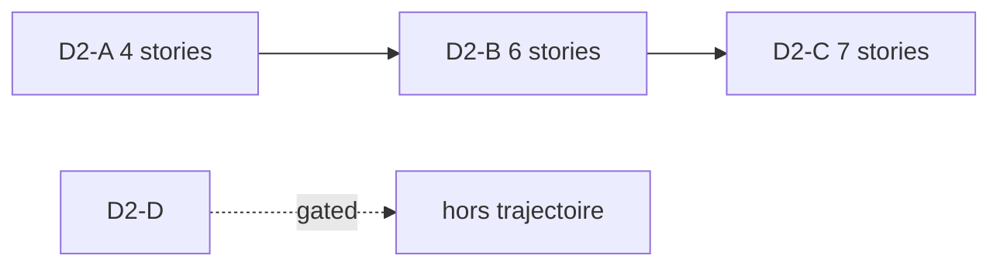

# SFIA Studio V3.1-D2 — Review pack Full — Delivery Backlog

## Meta

| Champ | Valeur |
|-------|--------|
| **Date/heure/fuseau** | 2026-08-01 16:59:56 CEST (+0200) |
| **Rôle Cursor** | Exécution cycle 5 Backlog / user stories (Standard / DOC) — sans implémentation |
| **Gate Morris** | GO BACKLOG SFIA STUDIO V3.1-D2-A/B/C — APPLY ADOPTED D-V3.1-D2-TA-01…12 — PREPARE TESTABLE DELIVERY SLICES — NO IMPLEMENTATION — NO D3 — NO UI — NO CREATECYCLE — NO METHOD PROMOTION |
| **Date gate** | 2026-08-01 16:45 CEST (+0200) |
| **Adoption TA** | TA-01=TA-P-A · TA-02=fonctions pures · TA-03=HASH-A · TA-04=CKC-S-A · TA-05=PORT-B · TA-06=TYPE-B · TA-07=PROOF-A · TA-08=ORCH-A · TA-09=ERR-B · TA-10=AUDIT-A · TA-11=COMP-B · TA-12=backlog A/B/C séparé · ok pour les recommandations |
| **Cycle** | 5 — Backlog / user stories |
| **Profil** | Standard — découpage d’architectures déjà arbitrées ; pas de nouvelle stack/code/Delivery |
| **Typologie** | DOC |
| **CKC** | Fallback carte synthétique + §4.5 · method-candidate · executionAuthority=false |
| **Template** | prompts/templates/sfia-cycle-execution-template.md |
| **Branche** | framing/sfia-studio-v3-1-d2-ckc-resolver-cadrage |
| **HEAD/main** | e1befcb80ed5e3c789a7de9036a8207d6b3e6771 |
| **Handoff pré tip/blob** | 84963516cc9f3685a0c7a2d2986224952522e98a / 92130ad0fbe65302a1338cde169c09adfb03b83a |
| **Pre-check ChatGPT** | limitation déclarée — contrôle local PASS |
| **Stories** | 17 (A4 · B6 · C7) |
| **Content coverage** | all required yes · synthesis only : no · review pack verdict : complete |

## Anti-claims

Backlog ≠ Delivery · aucune story Delivery authorized · pas de code/tests/branche projet · pas D3/UI/CreateCycle/D2-D · pas d’estimations · INHERITED-R-01 NOT LIFTED · TA non rouvertes.

## Document 19 — Backlog (complet)

# 19 — V3.1-D2-A/B/C — Backlog de Delivery

## A. Métadonnées

| Champ | Valeur |
|-------|--------|
| **Date/heure/fuseau** | 2026-08-01 16:55:05 CEST (+0200) |
| **Cycle projet** | 5 — Backlog / user stories |
| **Profil SFIA** | **Standard** |
| **Typologie** | DOC |
| **Gate Morris** | `GO BACKLOG SFIA STUDIO V3.1-D2-A/B/C — APPLY ADOPTED D-V3.1-D2-TA-01…12 — PREPARE TESTABLE DELIVERY SLICES — NO IMPLEMENTATION — NO D3 — NO UI — NO CREATECYCLE — NO METHOD PROMOTION` (2026-08-01 16:45 CEST) |
| **Branche** | `framing/sfia-studio-v3-1-d2-ckc-resolver-cadrage` |
| **Base** | `main` @ `e1befcb80ed5e3c789a7de9036a8207d6b3e6771` |
| **CKC** | Fallback carte synthétique + §4.5 · method-candidate · `executionAuthority=false` |
| **Statut** | `V3.1-D2 DELIVERY BACKLOG COMPLETE LOCALLY — READY FOR MORRIS VALIDATION — NO DELIVERY AUTHORIZED` |
| **Stories** | D2-A×4 · D2-B×6 · D2-C×7 = **17** |
| **Code / Delivery / D3** | **non** |

## B. Gate Morris et décision record TA

Adoption immédiatement antérieure au GO Backlog — formulation Morris TA-01…12 = recommandations · « ok pour les recommandations » · heure transcript **indisponible** · enregistrement documentaire 2026-08-01 16:55:05 CEST (+0200) · GO Backlog 16:45 CEST.

| ID | Retenu |
|----|--------|
| TA-01 | TA-P-A |
| TA-02 | Fonctions domaine pures |
| TA-03 | HASH-A |
| TA-04 | CKC-S-A |
| TA-05 | PORT-B |
| TA-06 | TYPE-B |
| TA-07 | PROOF-A |
| TA-08 | ORCH-A |
| TA-09 | ERR-B |
| TA-10 | AUDIT-A |
| TA-11 | COMP-B |
| TA-12 | Backlog A→B→C séparé |

Voir [`18`](./18-v3-1-d2-ckc-resolver-qualify-cycle-bridge-technical-architecture.md) §B2 — `DECIDED — ADOPTED BY MORRIS`.

## C. Sources consultées

Gouvernance · carte synthétique · routing · §4.5 · framing 08/12–18/README · D1/T-A2 chemins confirmés · handoff `84963516…`.

**Limite pre-check ChatGPT :** état local non inspecté par ChatGPT ; contrôle Cursor **PASS**.

## D. Git Truth

framing @ `e1befcb8…` · main 0/0 · staged vide · 15–18 non suivis · 08/README modifiés · 77 WT · handoff tip `84963516…` blob `92130ad0…` · doc15 `534904ea…` · doc16 `d65088ac…`.

## E. CKC Backlog et fallback

Pilote détaillé **absent** → fallback `02-fifteen-cycles-synthetic-map.md` + §4.5 · finalité stories testables · risque stories fourre-tout · `executionAuthority=false`.

## F. Héritage fonctionnel et technique adopté

FA-C · docs 15–17 · TA-01…12 · QualifyCycle inchangé · Core-only · D2-D gated · pas de domaine parallèle.

## G. Objectif du backlog

Découper D2-A/B/C en stories testables pour futurs prompts Delivery — **sans** implémenter ni autoriser Delivery.

## H. Principes de découpage

Une story = un résultat vérifiable · pas de fourre-tout « implémenter D2-A » · INVEST · dépendances explicites · pas d’exigence inventée · pas d’implémentation anticipée · backlog ≠ autorisation Delivery · ordre A→B→C.

## I. Périmètre global inclus

Contrats · fingerprint · Catalog Projection · manifest · port/resolver · erreurs · preuve · events · Result Projection · signaux · orch · factory read-only · tests futurs documentés.

## J. Hors périmètre global

Code · tests exécutés · package/CI · D3/UI/Figma · CreateCycle/mutation · Markdown parse · multi-CKC · D2-D · API/Server Action · nouveau package · rouvrir TA · Delivery.

## K. Ordonnancement D2-A → D2-B → D2-C


```mermaid
flowchart LR
  A[D2-A 4 stories] --> B[D2-B 6 stories]
  B --> C[D2-C 7 stories]
  D2D[D2-D] -.->|gated| X[hors trajectoire]
```

B n’entre en Delivery qu’après A intégré/validé. C après A+B. Chaque incrément = GO Delivery distinct.

### Challenge d’ordonnancement (non adopté)

Option alternative : démarrer BL-D2-B-04 en parallèle de BL-D2-B-03 après B-02, et BL-D2-C-01 en parallèle de fin B si contrats preuve stables.

**Impact :** accélération locale possible · **dette :** intégration plus risquée · **risque :** contrats instables.

**Ordre retenu :** A-01→…→A-04 · B-01→…→B-06 · C-01→…→C-07. Aucune adoption d’ordre alternatif.

## L. Vue des épics

| Epic | Stories | Profil candidat | Objectif |
|------|---------|-----------------|----------|
| **D2-A** | A-01…A-04 | Standard | Projection catalogue + fingerprint |
| **D2-B** | B-01…B-06 | Critical | Résolution + preuve |
| **D2-C** | C-01…C-07 | Critical | Bridge + résultat unique |

## M. Epic D2-A — Catalog Projection

Objectif : projection pure déterministe du catalogue D1 avec version et empreinte contractuelle.

**Critères de sortie D2-A :** contracts · fingerprint protégé · Catalog Projection · erreurs catalogue · tests · aucun resolver/profil/mutation · validable indépendamment.

## N. Stories D2-A

### BL-D2-A-01 — Contrats D2 et projection contractuelle du fingerprint

| Champ | Valeur |
|-------|--------|
| **ID** | `BL-D2-A-01` |
| **Epic** | D2-A Catalog Projection |
| **Résultat vérifiable** | Contrats TypeScript D2 dans fichier domaine sémantique dédié ; projection fingerprint contractuelle ; labels/descriptions exclus ; aucune résolution CKC ; aucune dépendance Next/infra. |
| **Formulation** | En tant que développeur D2, je veux des contrats D2 typés et une définition d’empreinte contractuelle, afin d’ancrer Catalog Projection sans surcharger types.ts. |
| **Justification** | TYPE-B + HASH-A exigent une base de contrats avant constante et projection. |
| **Décisions héritées** | TYPE-B · HASH-A · TA-P-A · FA-C |
| **Préconditions** | TA-01…12 adoptées · catalogue D1 stable · docs 16–18 |
| **Périmètre inclus** | Fichier contrats sémantique · types Selection Context / Validated Projection / fingerprint fields · exclusion labels |
| **Hors périmètre** | Resolver · QualifyCycle · factory · hash constante · UI · D3 |
| **Contrats** | CatalogSelectionContext · fingerprint field set · ValidatedCycleTypeProjection (squelette) |
| **Fichiers candidats** | `domain/ckcQualificationContracts.ts` · export additif `index.ts` si nécessaire |
| **Dépendances** | Aucune story D2 antérieure |
| **Tests futurs** | Compilation TS · tests de type/contrat · absence import infra/node:crypto |
| **Preuves de fin** | Diff limité · typecheck futur · review pack Delivery |
| **Risques** | Surcharge types.ts · duplication T-A2 · domaine parallèle |
| **Stop conditions** | Besoin d’enrichir D1 · rupture API publique · nouveau package |
| **Réversibilité** | Haute — fichier dédié isolable |
| **Profil Delivery candidat** | Standard |
| **Gate Morris** | GO DELIVERY D2-A |
| **Statut** | `BACKLOG READY — DELIVERY NOT AUTHORIZED` |

**Critères d’acceptation :**

1. Given TypeScript strict, When les contrats D2 sont déclarés dans un fichier dédié, Then ils compilent sans étendre domain/types.ts de façon fourre-tout.
2. Given le fingerprint contractuel, When on liste ses champs, Then seuls cycleTypeId, canonicalKey, lifecycleStatus, methodCycleNumber, mapping CKC, références, fallback, doctrineStatus, executionAuthority, unavailableBehavior sont inclus.
3. Given labels/descriptions, When l’empreinte est définie, Then ils sont explicitement exclus.
4. Given les contrats, When on inspecte les imports, Then aucun import infrastructure, Next ou node:crypto n’existe.
5. Given T-A2, When on compare, Then pas de duplication complète des types historiques ; adaptation contrôlée seulement.

### BL-D2-A-02 — Constante catalogFingerprint et garde de cohérence

| Champ | Valeur |
|-------|--------|
| **ID** | `BL-D2-A-02` |
| **Epic** | D2-A Catalog Projection |
| **Résultat vérifiable** | Constante versionnée exposée ; test de cohérence avec projection contractuelle ; changement contractuel sans MAJ empreinte → échec test ; pas d’artefact build ; pas de crypto runtime. |
| **Formulation** | En tant que développeur D2, je veux une empreinte HASH-A testée, afin de détecter les drifts catalogue sans package crypto. |
| **Justification** | HASH-A adopté ; 15 entrées — constante + test proportionné. |
| **Décisions héritées** | HASH-A · TA-P-A |
| **Préconditions** | BL-D2-A-01 |
| **Périmètre inclus** | Constante fingerprint · test cohérence · doc mécanisme simple |
| **Hors périmètre** | HASH-B/C · script CI · dépendance crypto · resolver |
| **Contrats** | catalogFingerprint constant + projection contractuelle |
| **Fichiers candidats** | `domain/catalogFingerprint.ts` · tests `__tests__/oa/cycle/**` |
| **Dépendances** | BL-D2-A-01 |
| **Tests futurs** | Même projection → même empreinte · changement champ contractuel → fail · changement label → pas d’obligation MAJ |
| **Preuves de fin** | Tests fingerprint verts · aucune dep ajoutée |
| **Risques** | Dérive manuelle · sérialisation non documentée |
| **Stop conditions** | HASH-A exige artefact/package non adopté |
| **Réversibilité** | Haute → HASH-B possible plus tard |
| **Profil Delivery candidat** | Standard |
| **Gate Morris** | GO DELIVERY D2-A |
| **Statut** | `BACKLOG READY — DELIVERY NOT AUTHORIZED` |

**Critères d’acceptation :**

1. Given deux projections contractuelles identiques, When on compare à la constante, Then elles correspondent.
2. Given un champ contractuel modifié sans MAJ constante, When le test de garde s’exécute, Then il échoue.
3. Given un label/description modifié seulement, When le test s’exécute, Then aucune obligation de changer l’empreinte.
4. Given le module fingerprint, When on inspecte, Then aucune dépendance crypto runtime ni script CI n’est ajouté.

### BL-D2-A-03 — Catalog Projection pure et fail-closed catalogue

| Champ | Valeur |
|-------|--------|
| **ID** | `BL-D2-A-03` |
| **Epic** | D2-A Catalog Projection |
| **Résultat vérifiable** | Fonction pure (cycleTypeId, catalogVersion, catalogHash, correlationId) → Validated Projection ou erreur D2 locale ; validations version/hash/existence/lifecycle/sélectionnabilité ; aucun resolver/QC. |
| **Formulation** | En tant que consommateur D2, je veux une projection catalogue fail-closed, afin de bloquer les contextes stale avant résolution CKC. |
| **Justification** | FA-06 + TA-02 ; point de contrôle version/hash. |
| **Décisions héritées** | TA-02 · HASH-A · FA-06 · ERR-B |
| **Préconditions** | BL-D2-A-01 · BL-D2-A-02 |
| **Périmètre inclus** | catalogProjection pure · erreurs catalogue · mapping CKC exposé |
| **Hors périmètre** | Resolver · preuve · QualifyCycle · factory complète |
| **Contrats** | ValidatedCycleTypeProjection · erreurs CATALOG_* |
| **Fichiers candidats** | `domain/catalogProjection.ts` |
| **Dépendances** | BL-D2-A-01 · BL-D2-A-02 |
| **Tests futurs** | nominal · version KO · hash stale · type inconnu · deprecated · unavailable · correlationId absent · mapping invalide |
| **Preuves de fin** | Tests purs · typecheck |
| **Risques** | Lifecycle mal mappé · fail-open accidentel |
| **Stop conditions** | Modification contrat D1 requise · parsing Markdown |
| **Réversibilité** | Haute |
| **Profil Delivery candidat** | Standard |
| **Gate Morris** | GO DELIVERY D2-A |
| **Statut** | `BACKLOG READY — DELIVERY NOT AUTHORIZED` |

**Critères d’acceptation :**

1. Given un type sélectionnable et version/hash valides, When projectSelectableCycleType, Then Validated Projection est retournée avec mapping CKC.
2. Given version incompatible ou hash stale, When projection, Then erreur catalogue structurée et aucun appel resolver.
3. Given type inconnu/deprecated/unavailable, When projection, Then fail-closed avec code approprié.
4. Given correlationId absent, When projection, Then erreur locale (pas de parcours silencieux).
5. Given la fonction, When imports inspectés, Then aucun QualifyCycle ni resolver.

### BL-D2-A-04 — Validation et régression D2-A

| Champ | Valeur |
|-------|--------|
| **ID** | `BL-D2-A-04` |
| **Epic** | D2-A Catalog Projection |
| **Résultat vérifiable** | Suite tests D2-A complète ; tests D1 conservés ; exports additifs strictement nécessaires ; pas d’import serveur dans logique pure ; preuves typecheck/lint/tests/build futurs. |
| **Formulation** | En tant que reviewer, je veux une validation D2-A indépendante, afin de livrer A sans B/C. |
| **Justification** | Critères de sortie D2-A ; non-régression D1. |
| **Décisions héritées** | TA-P-A · COMP-B (pas de factory complète dans A) |
| **Préconditions** | BL-D2-A-01…03 |
| **Périmètre inclus** | Tests D2-A · exports additifs minimaux · checklist sortie A |
| **Hors périmètre** | Factory D2 complète · D2-B/C · UI |
| **Contrats** | Exports publics minimaux contrats/projection/fingerprint |
| **Fichiers candidats** | `index.ts` (additif) · tests `__tests__/oa/cycle/**` |
| **Dépendances** | BL-D2-A-01…03 |
| **Tests futurs** | Suite A · régression cycleTypeCatalog · absence node:crypto dans purs |
| **Preuves de fin** | Rapport Delivery A · suite verte · build futur |
| **Risques** | Export trop large · couplage prématuré factory |
| **Stop conditions** | Inclusion resolver/QC dans A |
| **Réversibilité** | Moyenne |
| **Profil Delivery candidat** | Standard |
| **Gate Morris** | GO DELIVERY D2-A |
| **Statut** | `BACKLOG READY — DELIVERY NOT AUTHORIZED` |

**Critères d’acceptation :**

1. Given D2-A implémenté, When tests D2-A et D1 s’exécutent, Then tous passent sans ignore.
2. Given barrel index, When exports D2-A ajoutés, Then ils sont additifs et minimaux.
3. Given modules purs A, When graphe d’imports, Then aucun import serveur/crypto.
4. Given critères sortie A, When checklist, Then contracts+fingerprint+projection+erreurs catalogue présents ; aucun resolver/profil/mutation.


## O. Epic D2-B — CKC Resolution and Consumption

Objectif : résoudre CKC Core depuis mapping validé ; statut D2 + projection T-A2 + preuve structurée.

**Critères de sortie D2-B :** manifest · port · resolver fail-closed · preuve · erreurs · events · tests · aucun QC · aucun résultat D3 final · validable après A.

## P. Stories D2-B

### BL-D2-B-01 — Manifest CKC typé et contrôle de cohérence D1

| Champ | Valeur |
|-------|--------|
| **ID** | `BL-D2-B-01` |
| **Epic** | D2-B CKC Resolution and Consumption |
| **Résultat vérifiable** | Manifest statique typé (référence, niveau, version, statut, source, disponibilité) ; aucun Markdown ; test cohérence catalogue↔manifest. |
| **Formulation** | En tant que développeur D2, je veux un registre CKC typé, afin de résoudre sans parser Markdown ni lire des chemins. |
| **Justification** | CKC-S-A adopté. |
| **Décisions héritées** | CKC-S-A · TA-P-A |
| **Préconditions** | BL-D2-A-04 intégré/validé |
| **Périmètre inclus** | ckcReferenceManifest · test cohérence D1 |
| **Hors périmètre** | Enrichissement contrat D1 · MemoryCkcResolver comme autorité · Markdown |
| **Contrats** | CkcReferenceManifest entries |
| **Fichiers candidats** | `infrastructure/ckcReferenceManifest.ts` · tests |
| **Dépendances** | BL-D2-A-04 |
| **Tests futurs** | primaires D1 autorisées · fallbacks autorisés · ref inconnue · niveau incohérent · orphelin documenté |
| **Preuves de fin** | Tests cohérence · diff limité |
| **Risques** | Double source vs catalogue · dérive manuelle |
| **Stop conditions** | Story exige enrichir contrat D1 |
| **Réversibilité** | Moyenne |
| **Profil Delivery candidat** | Critical |
| **Gate Morris** | GO DELIVERY D2-B (après A) |
| **Statut** | `BACKLOG READY — DELIVERY NOT AUTHORIZED` |

**Critères d’acceptation :**

1. Given catalogue D1, When manifest est validé, Then toutes références primary/fallback D1 sont autorisées.
2. Given référence inconnue, When contrôle, Then détection d’erreur.
3. Given le manifest, When runtime, Then aucun contenu Markdown n’est chargé et aucun chemin arbitraire n’est lu.

### BL-D2-B-02 — Port resolver D2 spécialisé

| Champ | Valeur |
|-------|--------|
| **ID** | `BL-D2-B-02` |
| **Epic** | D2-B CKC Resolution and Consumption |
| **Résultat vérifiable** | Port D2 borné ; entrée projection validée + traçabilité ; sortie detailed/synthetic/fallback/unresolved_* + projection T-A2 ; CkcResolverPort historique inchangé ; pas de QualifyCycle. |
| **Formulation** | En tant qu’architecte, je veux un port D2 distinct, afin de préserver le port guidance T-A2. |
| **Justification** | PORT-B adopté. |
| **Décisions héritées** | PORT-B · FA-03 |
| **Préconditions** | BL-D2-B-01 · contrats A |
| **Périmètre inclus** | Interface port D2 · types résolution D2 |
| **Hors périmètre** | Modification CkcResolverPort · wrapper ResolveCKC · QC |
| **Contrats** | CkcQualificationResolverPort · CkcQualificationResolution |
| **Fichiers candidats** | `ports/ckcQualificationResolver.ts` |
| **Dépendances** | BL-D2-B-01 · BL-D2-A-01 |
| **Tests futurs** | Contrat port · non-régression CkcResolverPort |
| **Preuves de fin** | Diff ports · tests contrat |
| **Risques** | Élargissement cassant du port historique |
| **Stop conditions** | Modification fonctionnelle port historique requise sans GO |
| **Réversibilité** | Moyenne |
| **Profil Delivery candidat** | Critical |
| **Gate Morris** | GO DELIVERY D2-B |
| **Statut** | `BACKLOG READY — DELIVERY NOT AUTHORIZED` |

**Critères d’acceptation :**

1. Given le port D2, When déclaré, Then il accepte projection validée + correlationId et produit statuts détaillés D2 + projection T-A2.
2. Given CkcResolverPort historique, When Delivery B, Then il reste inchangé.
3. Given le port D2, When dépendances, Then QualifyCycle n’est pas référencé.

### BL-D2-B-03 — Resolver Core detailed / synthetic / fallback

| Champ | Valeur |
|-------|--------|
| **ID** | `BL-D2-B-03` |
| **Epic** | D2-B CKC Resolution and Consumption |
| **Résultat vérifiable** | Stratégie résolution docs 16–18 ; detailed prioritaire ; fallback substitution ; synthetic primaire sans second fallback ; fail-closed ; executionAuthority=false ; pas d’extension ; pas de randomBytes pour décision. |
| **Formulation** | En tant que consommateur D2, je veux une résolution Core fail-closed, afin d’obtenir un statut détaillé exploitable uniquement si valide. |
| **Justification** | Cœur D2-B ; FA fail-closed. |
| **Décisions héritées** | PORT-B · CKC-S-A · FA-03 · FA-05 |
| **Préconditions** | BL-D2-B-02 |
| **Périmètre inclus** | Adaptateur infra resolver · mapping T-A2 · statut D2 |
| **Hors périmètre** | QualifyCycle · multi-CKC · Memory comme autorité |
| **Contrats** | Resolution Result · detailed statuses |
| **Fichiers candidats** | adaptateur sous `infrastructure/` · utilise manifest |
| **Dépendances** | BL-D2-B-01 · BL-D2-B-02 |
| **Tests futurs** | detailed · synthetic · fallback · both invalid · ref non autorisée · executionAuthority=true · extension implicite |
| **Preuves de fin** | Tests résolution · pas de random dans décision |
| **Risques** | Perte primary/fallback · fail-open · héritage MemoryCkcResolver |
| **Stop conditions** | Extension multi-CKC · randomBytes requis pour décision métier |
| **Réversibilité** | Moyenne |
| **Profil Delivery candidat** | Critical |
| **Gate Morris** | GO DELIVERY D2-B |
| **Statut** | `BACKLOG READY — DELIVERY NOT AUTHORIZED` |

**Critères d’acceptation :**

1. Given detailed valide, When resolve, Then resolved_detailed + fallbackUsed=false + executionAuthority=false.
2. Given detailed KO et fallback OK, When resolve, Then resolved_fallback_synthetic + disclosure fallback.
3. Given aucune source valide, When resolve, Then unresolved_* fail-closed, pas de profil.
4. Given executionAuthority=true ou extension implicite, When resolve, Then rejet.
5. Given la décision fonctionnelle, When code, Then aucun randomBytes n’influence le statut.

### BL-D2-B-04 — Erreurs D2 et adaptation T-A2

| Champ | Valeur |
|-------|--------|
| **ID** | `BL-D2-B-04` |
| **Epic** | D2-B CKC Resolution and Consumption |
| **Résultat vérifiable** | Erreurs D2 typées ; adaptateur enveloppe T-A2 si utile ; codes doc 16 ; blocking/retryable/recoverable ; pas d’exception générique ; pas de mélange CycleInstance. |
| **Formulation** | En tant que développeur, je veux des erreurs D2 structurées, afin de normaliser Failures sans fuites. |
| **Justification** | ERR-B adopté. |
| **Décisions héritées** | ERR-B · FA-04 |
| **Préconditions** | Contrats A · port B (BL-D2-B-02) |
| **Périmètre inclus** | ckcQualificationErrors · mapping codes |
| **Hors périmètre** | ERR-C · élargissement massif CycleDetailCode sans besoin |
| **Contrats** | Erreurs D2 typées · adaptateur optionnel |
| **Fichiers candidats** | `domain/ckcQualificationErrors.ts` |
| **Dépendances** | BL-D2-B-02 (préparation parallèle possible après B-02 ; intégration ordonnée) |
| **Tests futurs** | Codes catalogue/CKC · pas de fuite internalCauseRef vers D3 |
| **Preuves de fin** | Tests erreurs |
| **Risques** | Dilution codes CycleInstance · fuite info |
| **Stop conditions** | Exceptions génériques comme contrat |
| **Réversibilité** | Haute |
| **Profil Delivery candidat** | Critical |
| **Gate Morris** | GO DELIVERY D2-B |
| **Statut** | `BACKLOG READY — DELIVERY NOT AUTHORIZED` |

**Critères d’acceptation :**

1. Given codes fonctionnels doc 16, When erreurs D2, Then ils sont typés et mappables.
2. Given erreur interne, When exposition, Then message sûr sans fuite.
3. Given CycleInstance errors, When D2 errors, Then pas de mélange implicite.

### BL-D2-B-05 — Consumption Proof Builder pur

| Champ | Valeur |
|-------|--------|
| **ID** | `BL-D2-B-05` |
| **Epic** | D2-B CKC Resolution and Consumption |
| **Résultat vérifiable** | Validator/builder pur ; consumed=true seulement après validation complète ; champs preuve adoptés ; statut D2+T-A2 conservés ; version/hash/correlationId ; pas I/O/profil/mutation. |
| **Formulation** | En tant que bridge, je veux une preuve structurée, afin de n’appeler QualifyCycle qu’après consommation valide. |
| **Justification** | PROOF-A · FA-02/04. |
| **Décisions héritées** | PROOF-A · FA-02 · FA-05 |
| **Préconditions** | BL-D2-B-03 · BL-D2-B-04 |
| **Périmètre inclus** | ckcConsumptionProof pur |
| **Hors périmètre** | Preuve dans orchestrateur · I/O · profil |
| **Contrats** | CkcConsumptionProof |
| **Fichiers candidats** | `domain/ckcConsumptionProof.ts` |
| **Dépendances** | BL-D2-B-03 · BL-D2-B-04 |
| **Tests futurs** | nominal detailed/synthetic/fallback · incomplète · mismatch · doctrine invalide · authority · correlationId · consumed après échec interdit |
| **Preuves de fin** | Tests purs preuve |
| **Risques** | consumed=true trop tôt · confusion resolver/preuve |
| **Stop conditions** | I/O dans proof · appel QC |
| **Réversibilité** | Haute |
| **Profil Delivery candidat** | Critical |
| **Gate Morris** | GO DELIVERY D2-B |
| **Statut** | `BACKLOG READY — DELIVERY NOT AUTHORIZED` |

**Critères d’acceptation :**

1. Given résolution valide complète, When buildProof, Then consumed=true avec statut D2 + projection T-A2.
2. Given preuve incomplète ou mismatch, When buildProof, Then erreur et consumed≠true.
3. Given échec, When résultat, Then aucune preuve consumed=true.
4. Given le module, When imports, Then aucune I/O/Next.

### BL-D2-B-06 — Événements résolution/consommation et validation D2-B

| Champ | Valeur |
|-------|--------|
| **ID** | `BL-D2-B-06` |
| **Epic** | D2-B CKC Resolution and Consumption |
| **Résultat vérifiable** | Extension additive CycleAuditEvent pour events B ; CycleAuditPort conservé ; tests B ; non-régression T-A2 ; pas de factory mutation. |
| **Formulation** | En tant qu’opérateur, je veux des événements minimaux B, afin de tracer résolution/consommation sans audit prod. |
| **Justification** | AUDIT-A · FA-07/11. |
| **Décisions héritées** | AUDIT-A |
| **Préconditions** | BL-D2-B-01…05 |
| **Périmètre inclus** | Events resolution/consumption · suite tests B · checklist sortie B |
| **Hors périmètre** | Modèle audit complet · factory CreateCycle · D2-C orch |
| **Contrats** | CycleAuditEvent additif |
| **Fichiers candidats** | `ports/cycleAudit.ts` (additif) · tests |
| **Dépendances** | BL-D2-B-01…05 |
| **Tests futurs** | events started/succeeded/failed/fallback/validated/rejected · régression oa.ckc.resolved historique |
| **Preuves de fin** | Suite B verte · non-régression T-A2 |
| **Risques** | Union audit surchargée |
| **Stop conditions** | Port audit breaking · events sensibles |
| **Réversibilité** | Moyenne |
| **Profil Delivery candidat** | Critical |
| **Gate Morris** | GO DELIVERY D2-B |
| **Statut** | `BACKLOG READY — DELIVERY NOT AUTHORIZED` |

**Critères d’acceptation :**

1. Given résolution/consommation, When audit, Then events minimaux B émis avec correlationId.
2. Given CycleAuditPort, When extension, Then additive et non breaking pour events historiques.
3. Given checklist sortie B, When validation, Then manifest+port+resolver+preuve+erreurs+events ; aucun QC ; aucun résultat D3 final.


## Q. Epic D2-C — QualifyCycle Bridge and Result Projection

Objectif : orchestrer A+B+QualifyCycle ; Success/Failure read-only unique.

**Critères de sortie D2-C :** bridge · contrat unique · QC inchangé · erreurs normalisées · events · factory read-only · intégration · aucune mutation · aucun D3.

## R. Stories D2-C

### BL-D2-C-01 — Result Projection pure

| Champ | Valeur |
|-------|--------|
| **ID** | `BL-D2-C-01` |
| **Epic** | D2-C QualifyCycle Bridge and Result Projection |
| **Résultat vérifiable** | Fonctions pures Success/Failure ; contrat unique ; statut D2 + preuve en succès ; pas de profil/consumed en Failure ; disclosures ; pas de règle qualification ; pas d’infra. |
| **Formulation** | En tant que futur D3, je veux un contrat résultat unique, afin de consommer D2 sans appeler resolver/QC. |
| **Justification** | FA-08 · Result Projection. |
| **Décisions héritées** | FA-08 · COMP-B (contrat) |
| **Préconditions** | BL-D2-B-06 |
| **Périmètre inclus** | ckcQualificationResult · Success/Failure builders |
| **Hors périmètre** | Règles profil · infra · UI |
| **Contrats** | D2 Success/Failure Result |
| **Fichiers candidats** | `domain/ckcQualificationResult.ts` |
| **Dépendances** | BL-D2-B-05/06 · contrats A |
| **Tests futurs** | Success conserve preuve · Failure sans profil/consumed · disclosures fallback |
| **Preuves de fin** | Tests purs résultat |
| **Risques** | Règle métier glissée dans projection |
| **Stop conditions** | Import infra · recalcul profil |
| **Réversibilité** | Haute |
| **Profil Delivery candidat** | Critical |
| **Gate Morris** | GO DELIVERY D2-C (après A+B) |
| **Statut** | `BACKLOG READY — DELIVERY NOT AUTHORIZED` |

**Critères d’acceptation :**

1. Given pièces succès, When assemble, Then Success Result unique avec statut D2 + preuve.
2. Given erreur, When assemble Failure, Then aucun recommendedProfile exploitable ni consumed=true.
3. Given module, When imports, Then aucun infra/QC.

### BL-D2-C-02 — Validation des six signaux

| Champ | Valeur |
|-------|--------|
| **ID** | `BL-D2-C-02` |
| **Epic** | D2-C QualifyCycle Bridge and Result Projection |
| **Résultat vérifiable** | Six signaux T-A2 obligatoires/explicites ; absence≠false ; requestedProfile non exposé ; objective/scope non scorés ; SIGNALS_INCOMPLETE avant QC. |
| **Formulation** | En tant que bridge, je veux valider les signaux avant QC, afin d’éviter un appel QualifyCycle invalide. |
| **Justification** | Doc 16 signaux · fail-closed. |
| **Décisions héritées** | ORCH-A · FA bridge |
| **Préconditions** | BL-D2-C-01 · QualifyCycleRequest T-A2 |
| **Périmètre inclus** | Validation signaux pure ou helper orch |
| **Hors périmètre** | requestedProfile · scoring parallèle |
| **Contrats** | Qualification Input / signaux |
| **Fichiers candidats** | helper dans domain ou application (candidat) |
| **Dépendances** | BL-D2-C-01 |
| **Tests futurs** | complets · incomplets · absence vs false · requestedProfile rejeté |
| **Preuves de fin** | Tests signaux |
| **Risques** | Absence traitée comme false |
| **Stop conditions** | Exposition requestedProfile dans parcours D2 |
| **Réversibilité** | Haute |
| **Profil Delivery candidat** | Critical |
| **Gate Morris** | GO DELIVERY D2-C |
| **Statut** | `BACKLOG READY — DELIVERY NOT AUTHORIZED` |

**Critères d’acceptation :**

1. Given un signal manquant, When validation, Then SIGNALS_INCOMPLETE et QC non appelé.
2. Given absence de booléen, When validation, Then ce n’est pas équivalent à false.
3. Given requestedProfile, When parcours D2, Then non exposé/rejeté.

### BL-D2-C-03 — Use case QualifyCycle Bridge

| Champ | Valeur |
|-------|--------|
| **ID** | `BL-D2-C-03` |
| **Epic** | D2-C QualifyCycle Bridge and Result Projection |
| **Résultat vérifiable** | Use case injecté read-only ; CP→resolver→proof→QC×1 si validé ; QC jamais si échec amont ; pas de duplication recommendProfile ; isMorrisDecision=false ; pas de mutation. |
| **Formulation** | En tant que système D2, je veux orchestrer A+B+QC, afin de produire une recommandation seulement après CKC consommé. |
| **Justification** | ORCH-A cœur D2-C. |
| **Décisions héritées** | ORCH-A · FA-C · COMP-B deps |
| **Préconditions** | BL-D2-C-01 · BL-D2-C-02 · A+B intégrés |
| **Périmètre inclus** | qualifyCycleWithCkc use case |
| **Hors périmètre** | modifier QualifyCycle/ResolveCKC · CreateCycle · mutation |
| **Contrats** | Orchestration I/O → Result |
| **Fichiers candidats** | `application/qualifyCycleWithCkc.ts` |
| **Dépendances** | BL-D2-A-03 · BL-D2-B-03/05 · BL-D2-C-01/02 |
| **Tests futurs** | Light/Standard/Critical/Capitalization · signaux KO · stale · CKC KO · fallback · erreur QC · correlationId perdu · QC×1 |
| **Preuves de fin** | Tests use case avec QC mock |
| **Risques** | Fail-open · double appel QC · duplication règles |
| **Stop conditions** | Modification fonctionnelle QualifyCycle |
| **Réversibilité** | Moyenne |
| **Profil Delivery candidat** | Critical |
| **Gate Morris** | GO DELIVERY D2-C |
| **Statut** | `BACKLOG READY — DELIVERY NOT AUTHORIZED` |

**Critères d’acceptation :**

1. Given parcours nominal, When execute, Then QC appelé exactement une fois après preuve valide.
2. Given échec amont, When execute, Then QC jamais appelé et Failure produit.
3. Given QualifyCycle, When Delivery C, Then fonctionnellement inchangé.
4. Given isMorrisDecision, When résultat, Then false.
5. Given deps, When factory wiring, Then aucun repository mutation.

### BL-D2-C-04 — Normalisation des erreurs bout en bout

| Champ | Valeur |
|-------|--------|
| **ID** | `BL-D2-C-04` |
| **Epic** | D2-C QualifyCycle Bridge and Result Projection |
| **Résultat vérifiable** | Orchestrateur arrête le flux ; Result Projection construit Failure ; origine/code conservés ; erreur interne masquée ; retryable/recoverable ; pas de résultat partiel exploitable. |
| **Formulation** | En tant que consommateur, je veux des Failures normalisées, afin de traiter les erreurs sans ambiguïté. |
| **Justification** | FA-04 · ERR-B. |
| **Décisions héritées** | FA-04 · ERR-B |
| **Préconditions** | BL-D2-C-01 · BL-D2-C-03 · BL-D2-B-04 |
| **Périmètre inclus** | Chemin normalisation orch→Result |
| **Hors périmètre** | Exceptions brutes vers D3 |
| **Contrats** | D2 Failure Result |
| **Fichiers candidats** | qualifyCycleWithCkc + ckcQualificationResult |
| **Dépendances** | BL-D2-C-01 · BL-D2-C-03 |
| **Tests futurs** | chaque famille d’erreur amont → Failure · pas de profil |
| **Preuves de fin** | Tests normalisation |
| **Risques** | Normalisation trop tardive · fuite |
| **Stop conditions** | Résultat partiel avec profil |
| **Réversibilité** | Haute |
| **Profil Delivery candidat** | Critical |
| **Gate Morris** | GO DELIVERY D2-C |
| **Statut** | `BACKLOG READY — DELIVERY NOT AUTHORIZED` |

**Critères d’acceptation :**

1. Given erreur locale composant, When orch, Then flux arrêté et Failure normalisé.
2. Given erreur interne, When Failure, Then message sûr.
3. Given Failure, When champs, Then pas de recommendedProfile exploitable ni consumed=true.

### BL-D2-C-05 — Événements qualification et résultat

| Champ | Valeur |
|-------|--------|
| **ID** | `BL-D2-C-05` |
| **Epic** | D2-C QualifyCycle Bridge and Result Projection |
| **Résultat vérifiable** | Events additifs : qualification started/succeeded · result produced · request failed ; correlationId ; pas de données sensibles ; pas d’audit prod. |
| **Formulation** | En tant qu’observateur, je veux des events C minimaux, afin de tracer le bridge sans RUN readiness. |
| **Justification** | AUDIT-A · FA-07/11. |
| **Décisions héritées** | AUDIT-A |
| **Préconditions** | BL-D2-C-03 |
| **Périmètre inclus** | Events C additifs sur CycleAuditEvent |
| **Hors périmètre** | Audit production complet |
| **Contrats** | CycleAuditEvent additif |
| **Fichiers candidats** | `ports/cycleAudit.ts` |
| **Dépendances** | BL-D2-C-03 |
| **Tests futurs** | events émis · correlationId · pas de payload sensible |
| **Preuves de fin** | Tests audit C |
| **Risques** | Union surchargée · claim prod |
| **Stop conditions** | Données sensibles dans events |
| **Réversibilité** | Moyenne |
| **Profil Delivery candidat** | Critical |
| **Gate Morris** | GO DELIVERY D2-C |
| **Statut** | `BACKLOG READY — DELIVERY NOT AUTHORIZED` |

**Critères d’acceptation :**

1. Given succès/échec D2, When audit, Then events C minimaux avec correlationId.
2. Given events, When contenu, Then aucune donnée sensible et aucun claim production-ready.

### BL-D2-C-06 — Factory/façade D2 read-only

| Champ | Valeur |
|-------|--------|
| **ID** | `BL-D2-C-06` |
| **Epic** | D2-C QualifyCycle Bridge and Result Projection |
| **Résultat vérifiable** | Factory/façade séparée ; deps resolver D2 + clock + audit + QualifyCycle ; pas de repos mutation ; pas CreateCycle ; API additive ; D3 peut importer contrats sans infra. |
| **Formulation** | En tant qu’intégrateur, je veux une façade read-only, afin de composer D2 sans CreateCycle. |
| **Justification** | COMP-B adopté. |
| **Décisions héritées** | COMP-B |
| **Préconditions** | BL-D2-C-03…05 |
| **Périmètre inclus** | createCkcQualificationServices (nom candidat) · exports additifs |
| **Hors périmètre** | Extension CycleServices mutation · construction depuis D3/UI |
| **Contrats** | Factory API publique additive |
| **Fichiers candidats** | composition près de `index.ts` · exports `index.ts` |
| **Dépendances** | BL-D2-C-03 |
| **Tests futurs** | Factory sans repos écriture · coexistence createInMemoryCycleServices |
| **Preuves de fin** | Tests composition · review imports |
| **Risques** | Couplage CreateCycle · fuite infra vers D3 |
| **Stop conditions** | Exposition repositories mutation |
| **Réversibilité** | Moyenne |
| **Profil Delivery candidat** | Critical |
| **Gate Morris** | GO DELIVERY D2-C |
| **Statut** | `BACKLOG READY — DELIVERY NOT AUTHORIZED` |

**Critères d’acceptation :**

1. Given factory D2, When créée, Then aucun repository mutation ni CreateCycle n’est exposé.
2. Given exports, When D3 futur, Then contrats résultat importables sans infrastructure.
3. Given API, When changement, Then additif ou arbitrage Morris explicite.

### BL-D2-C-07 — Validation intégrée D2-A→B→C

| Champ | Valeur |
|-------|--------|
| **ID** | `BL-D2-C-07` |
| **Epic** | D2-C QualifyCycle Bridge and Result Projection |
| **Résultat vérifiable** | Parcours nominal/fallback/fail-closed ; QC×1 succès ; QC jamais échec amont ; aucune mutation ; coexistence T-A2 ; typecheck/lint/tests/build futurs ; contrat D3 unique sans UI. |
| **Formulation** | En tant que reviewer, je veux une validation bout en bout, afin de clôturer D2-C sans ouvrir D3. |
| **Justification** | Critères sortie D2-C. |
| **Décisions héritées** | TA-12 · FA-C |
| **Préconditions** | BL-D2-C-01…06 · A+B intégrés |
| **Périmètre inclus** | Tests intégration A→B→C · checklist sortie C |
| **Hors périmètre** | UI D3 · Delivery D2-D · CreateCycle |
| **Contrats** | Success/Failure unique vérifié |
| **Fichiers candidats** | tests `__tests__/oa/cycle/**` |
| **Dépendances** | BL-D2-C-01…06 |
| **Tests futurs** | intégration · régression oa/cycle · suite complète future |
| **Preuves de fin** | Rapport Delivery C · preuves commandes futures |
| **Risques** | Big-bang · ignore tests · snapshot aveugle |
| **Stop conditions** | Mutation détectée · D3 UI inclus |
| **Réversibilité** | Faible une fois intégré — tests protègent |
| **Profil Delivery candidat** | Critical |
| **Gate Morris** | GO DELIVERY D2-C |
| **Statut** | `BACKLOG READY — DELIVERY NOT AUTHORIZED` |

**Critères d’acceptation :**

1. Given parcours nominal/fallback, When intégration, Then Success et QC×1.
2. Given échec amont, When intégration, Then Failure et QC=0.
3. Given services T-A2 historiques, When coexistence, Then non-régression.
4. Given checklist sortie C, When validation, Then bridge+Failure/Success+factory+events ; aucune mutation ; aucun D3.


## S. Dépendances inter-stories

```text
A-01 → A-02 → A-03 → A-04
A-04 → B-01 → B-02 → B-03 → B-04 → B-05 → B-06
B-06 → C-01 → C-02 → C-03 → C-04 → C-05 → C-06 → C-07
```

## T. Matrice story → architecture adoptée

| Story | FA-C / TA clés |
|-------|----------------|
| A-01 | TYPE-B · HASH-A · TA-P-A |
| A-02 | HASH-A |
| A-03 | TA-02 · FA-06 · ERR-B |
| A-04 | Sortie A · non-régression D1 |
| B-01 | CKC-S-A |
| B-02 | PORT-B · FA-03 |
| B-03 | PORT-B · CKC-S-A · FA-05 |
| B-04 | ERR-B · FA-04 |
| B-05 | PROOF-A · FA-02 |
| B-06 | AUDIT-A · FA-07/11 |
| C-01 | FA-08 Result Projection |
| C-02 | Signaux · fail-closed |
| C-03 | ORCH-A |
| C-04 | FA-04 normalisation |
| C-05 | AUDIT-A |
| C-06 | COMP-B |
| C-07 | Intégration A→B→C · TA-12 |

## U. Matrice story → fichiers candidats

| Story | Fichiers candidats (non autorisés ce cycle) |
|-------|---------------------------------------------|
| A-01 | `domain/ckcQualificationContracts.ts` · `index.ts` additif |
| A-02 | `domain/catalogFingerprint.ts` · tests |
| A-03 | `domain/catalogProjection.ts` |
| A-04 | `index.ts` · tests oa/cycle |
| B-01 | `infrastructure/ckcReferenceManifest.ts` |
| B-02 | `ports/ckcQualificationResolver.ts` |
| B-03 | adaptateur `infrastructure/*Resolver*` |
| B-04 | `domain/ckcQualificationErrors.ts` |
| B-05 | `domain/ckcConsumptionProof.ts` |
| B-06 | `ports/cycleAudit.ts` additif · tests |
| C-01 | `domain/ckcQualificationResult.ts` |
| C-02 | helper domain/application |
| C-03 | `application/qualifyCycleWithCkc.ts` |
| C-04 | orch + result |
| C-05 | `ports/cycleAudit.ts` |
| C-06 | factory composition · `index.ts` |
| C-07 | tests intégration |

**Règles :** recommandations de backlog seulement · futur Delivery confirme Git · noms métier stables · pas de sous-domaine externe.

## V. Matrice story → tests futurs

| Story | Domaine | Contrat | Adaptateur | Use case | Intégration | Non-régression |
|-------|---------|---------|------------|----------|-------------|----------------|
| A-01 | ● | ● | | | | |
| A-02 | ● | ● | | | | D1 |
| A-03 | ● | | | | | |
| A-04 | | | | | ● | D1/oa |
| B-01 | | ● | ● | | | D1 |
| B-02 | | ● | | | | port hist. |
| B-03 | | | ● | | | |
| B-04 | ● | ● | | | | |
| B-05 | ● | | | | | |
| B-06 | | | | | ● | audit hist. |
| C-01 | ● | ● | | | | |
| C-02 | ● | | | | | |
| C-03 | | | | ● | | QualifyCycle |
| C-04 | | | | ● | | |
| C-05 | | | | | ● | |
| C-06 | | | | | ● | CycleServices |
| C-07 | | | | | ● | suite oa/cycle |

Contrôles globaux futurs : tests ciblés · suite oa/cycle · suite complète · typecheck · lint · build — **non exécutés** ici.

## W. Matrice story → risques

| Story | Risque principal |
|-------|------------------|
| A-01 | Domaine parallèle / types.ts |
| A-02 | Drift fingerprint manuel |
| A-03 | Fail-open catalogue |
| A-04 | Export trop large |
| B-01 | Double source / enrichir D1 |
| B-02 | Casser port historique |
| B-03 | Fail-open CKC / random |
| B-04 | Fuite erreur |
| B-05 | consumed trop tôt |
| B-06 | Audit surchargé |
| C-01 | Règle métier dans projection |
| C-02 | absence=false |
| C-03 | Double QC / modifier QC |
| C-04 | Résultat partiel |
| C-05 | Données sensibles |
| C-06 | Mutation via factory |
| C-07 | Big-bang / ignore tests |

## X. Critères d’entrée Delivery

**D2-A :** backlog validé Morris · doc 19 · TA adoptées · archi adoptée · branche/base explicites · main à jour · fichiers A confirmés · profil requalifié · tests identifiés · handoff courant · pas de réserve bloquante.

**D2-B :** A intégré/validé · contrats A stables · fingerprint+projection dispo · tests A verts · REX/post-merge A · GO B distinct.

**D2-C :** A+B intégrés/validés · preuve+resolver+events B · GO C distinct.

## Y. Critères de sortie par incrément

Voir §§ M/O/Q. Preuves Delivery futures : Git Truth · diff limité · tests complets · pas d’ignore · pas de package · pas CreateCycle/mutation · non-régression · review Full · handoff.

## Z. Profils Delivery candidats

| Incrément | Profil candidat | Justification |
|-----------|-----------------|---------------|
| D2-A | **Standard** | Purs · pas resolver/orch · risque fingerprint |
| D2-B | **Critical** | Fail-closed · preuve · authority · statut |
| D2-C | **Critical** | Orchestration · QC · frontière D3 · mutation |

Recommandations de backlog — chaque Delivery requalifie repo-informed.

## AA. Gates Morris futurs

```text
GO DELIVERY SFIA STUDIO V3.1-D2-A CATALOG PROJECTION —
USE VALIDATED BACKLOG AND ADOPTED TA-01…12 —
IMPLEMENT CONTRACTS, CATALOG FINGERPRINT AND PURE CATALOG PROJECTION —
NO D2-B — NO D2-C — NO D3 — NO UI — NO CREATECYCLE — NO METHOD PROMOTION
```

D2-B/C : gates distincts après intégration amont. **D2-D :** aucun gate.

## AB. Stratégie de branches, commits et PR candidate

Branche Delivery distincte par incrément · PR par incrément · commits atomiques · pas de big-bang · B sur A intégré · C sur B intégré · **aucune création** dans ce cycle.

## AC. Stratégie QA future

Tests domaine/contrat/adaptateur/use case/intégration/non-régression · suites A/B/C · contrôles globaux · pas de snapshot aveugle · revalidation profil Critical pour B/C.

## AD. Anti-claims

- Backlog ≠ Delivery autorisée
- Aucune story `DELIVERY AUTHORIZED`
- Aucune implémentation / test modifié / branche projet
- Aucun D3 / UI / CreateCycle / multi-CKC / D2-D
- Aucune estimation jours/points/heures
- QualifyCycle / ResolveCKC / D1 non modifiés ici
- INHERITED-R-01 NOT LIFTED

## AE. Risques et réserves

Stories fourre-tout (évitées) · drift fingerprint · double source CKC · fail-open · consumed prématuré · factory mutation · big-bang · rouvrir TA · **INHERITED-R-01 ACCEPTED — STILL TRACEABLE — NOT LIFTED**.

## AF. Readiness du backlog

READY si : 17 stories à résultat vérifiable · AC complets · deps explicites · fichiers candidats · tests futurs · profils justifiés · A/B/C séparés · pas D2-D · pas d’implémentation · pas Delivery · TA non rouvertes · review pack + handoff.

**Statut readiness local :** `BACKLOG COMPLETE LOCALLY — AWAITING MORRIS VALIDATION`

## AG. Verdict

```text
V3.1-D2 DELIVERY BACKLOG COMPLETE —
D-V3.1-D2-TA-01…12 RECORDED AS ADOPTED BY MORRIS —
D2-A D2-B AND D2-C DECOMPOSED INTO TESTABLE STORIES —
DEPENDENCIES AND ACCEPTANCE CRITERIA DOCUMENTED —
CANDIDATE FILES AND FUTURE TESTS DOCUMENTED —
DELIVERY PROFILES RECOMMENDED —
D2-A TO D2-B TO D2-C ORDER PRESERVED —
D2-D NOT OPENED —
NO IMPLEMENTATION —
NO TEST MODIFIED —
NO BRANCH CREATED —
NO BACKLOG DELIVERY EXECUTED —
NO DELIVERY AUTHORIZED —
NO D3 —
NO UI —
NO FIGMA —
NO CREATECYCLE —
NO METHOD PROMOTION
```

**Statut :** `V3.1-D2 DELIVERY BACKLOG READY FOR MORRIS VALIDATION — D2-A DELIVERY REQUIRES DISTINCT MORRIS GO — D2-B AND D2-C REMAIN CLOSED — D3 NOT OPENED`


## Document 18 — sections modifiées

#### Métadonnées statut

# 18 — V3.1-D2 CKC Resolver & QualifyCycle Bridge — Architecture technique

## A. Métadonnées

| Champ | Valeur |
|-------|--------|
| **Date/heure/fuseau** | 2026-08-01 16:29:26 CEST (+0200) |
| **Cycle projet** | 6 — Architecture technique |
| **Profil SFIA** | **Critical** |
| **Typologie** | DOC |
| **Gate Morris** | `GO ARCHITECTURE TECHNIQUE SFIA STUDIO V3.1-D2 — APPLY ADOPTED D-V3.1-D2-FA-01…12 — NO DELIVERY — NO D3 — NO UI — NO CREATECYCLE — NO METHOD PROMOTION` (2026-08-01 16:16 CEST +0200) |
| **Branche** | `framing/sfia-studio-v3-1-d2-ckc-resolver-cadrage` |
| **Base** | `main` @ `e1befcb80ed5e3c789a7de9036a8207d6b3e6771` |
| **CKC** | `pilots/03-architecture-technique.md` · candidate v0.1.0 · `executionAuthority=false` |
| **Statut** | `TECHNICAL ARCHITECTURE ADOPTED — BACKLOG D2-A/B/C AUTHORIZED — NO DELIVERY — D3 NOT OPENED` |
| **Doc backlog** | [`19-v3-1-d2-a-b-c-delivery-backlog.md`](./19-v3-1-d2-a-b-c-delivery-backlog.md) |
| **Docs protégés** | 12–16 **inchangés** · 15 SHA `534904ea…` |
| **Code / tests / Delivery / D3** | **non** |

## B. Gate Morris et décision record FA


## B2. Decision record Morris — TA adoptées · Backlog autorisé

| Champ | Valeur |
|-------|--------|
| **Formulation réelle Morris** | `TA-01 = TA-P-A` · `TA-02 = fonctions de domaine pures` · `TA-03 = HASH-A` · `TA-04 = CKC-S-A` · `TA-05 = PORT-B` · `TA-06 = TYPE-B` · `TA-07 = PROOF-A` · `TA-08 = ORCH-A` · `TA-09 = ERR-B` · `TA-10 = AUDIT-A` · `TA-11 = COMP-B` · `TA-12 = backlog D2-A/B/C séparé après arbitrage` · « ok pour les recommandations » |
| **Adoption** | Immédiatement antérieure au GO Backlog |
| **Heure d’adoption transcript** | **indisponible** |
| **Date documentaire d’enregistrement** | 2026-08-01 16:55:05 CEST (+0200) |
| **GO Backlog** | 2026-08-01 16:45 CEST (+0200) — `GO BACKLOG SFIA STUDIO V3.1-D2-A/B/C — APPLY ADOPTED D-V3.1-D2-TA-01…12 — PREPARE TESTABLE DELIVERY SLICES — NO IMPLEMENTATION — NO D3 — NO UI — NO CREATECYCLE — NO METHOD PROMOTION` |
| **Option globale retenue** | TA-P-A · HASH-A · CKC-S-A · PORT-B · TYPE-B · PROOF-A · ORCH-A · ERR-B · AUDIT-A · COMP-B · backlog A→B→C |
| **Conséquence** | Backlog D2-A/B/C **autorisé** · Delivery / D3 / UI / CreateCycle / D2-D **fermés** · aucune implémentation |
| **Document 19** | [`19-v3-1-d2-a-b-c-delivery-backlog.md`](./19-v3-1-d2-a-b-c-delivery-backlog.md) |

## C. Sources consultées


## AK. Decision pack Morris

**Statut pack :** `DECIDED — ADOPTED BY MORRIS` pour D-V3.1-D2-TA-01…12 (formulation §B2). Options et trade-offs historiques **conservés**.

### D-V3.1-D2-TA-01 — Packaging

- Problème : où placer le code D2 sans domaine parallèle.
- Options : extension répertoires / sous-module borné / domaine parallèle.
- Reco : **extension sémantique (TA-P-A)** ; parallèle rejeté.
- **Retenu :** TA-P-A
- NFR : cohésion, dette, réversibilité.
- Impact API : additive via barrel.
- Statut : **DECIDED — ADOPTED BY MORRIS**

### D-V3.1-D2-TA-02 — Catalog Projection

- Options : fonctions pures / service applicatif / extension comportementale catalogue.
- Reco : **fonctions de domaine pures**.
- **Retenu :** fonctions de domaine pures
- Statut : **DECIDED — ADOPTED BY MORRIS**

### D-V3.1-D2-TA-03 — catalogHash

- Options : constante+test / sérialisation+adaptateur / artefact build.
- Reco : **HASH-A**.
- **Retenu :** HASH-A (labels/descriptions exclus)
- Statut : **DECIDED — ADOPTED BY MORRIS**

### D-V3.1-D2-TA-04 — Source métadonnées CKC

- Options : manifest typé / enrichir D1 / MemoryCkcResolver.
- Reco : **CKC-S-A** ; Memory comme autorité **rejeté**.
- **Retenu :** CKC-S-A
- Statut : **DECIDED — ADOPTED BY MORRIS**

### D-V3.1-D2-TA-05 — Resolver port

- Options : évoluer port / port D2+adaptateur / wrapper ResolveCKC.
- Reco : **PORT-B**.
- **Retenu :** PORT-B
- Statut : **DECIDED — ADOPTED BY MORRIS**

### D-V3.1-D2-TA-06 — Placement contrats

- Options : types.ts / fichier dédié / T-A2 exclusive.
- Reco : **fichier domaine sémantique dédié (TYPE-B)**.
- **Retenu :** TYPE-B
- Statut : **DECIDED — ADOPTED BY MORRIS**

### D-V3.1-D2-TA-07 — Preuve

- Options : validator pur / service / orchestrateur.
- Reco : **PROOF-A**.
- **Retenu :** PROOF-A
- Statut : **DECIDED — ADOPTED BY MORRIS**

### D-V3.1-D2-TA-08 — Orchestration

- Options : nouveau use case / modifier QualifyCycle / modifier ResolveCKC.
- Reco : **ORCH-A** ; B/C rejetés.
- **Retenu :** ORCH-A
- Statut : **DECIDED — ADOPTED BY MORRIS**

### D-V3.1-D2-TA-09 — Erreurs

- Options : étendre CycleDetailCode / erreurs D2+adaptateur / génériques.
- Reco : **ERR-B**.
- **Retenu :** ERR-B
- Statut : **DECIDED — ADOPTED BY MORRIS**

### D-V3.1-D2-TA-10 — Audit

- Options : extension CycleAuditEvent / port D2+adaptateur / aucun.
- Reco : **AUDIT-A**.
- **Retenu :** AUDIT-A
- Statut : **DECIDED — ADOPTED BY MORRIS**

### D-V3.1-D2-TA-11 — Composition / API

- Options : étendre CycleServices / factory D2 séparée / depuis D3.
- Reco : **COMP-B** ; depuis D3 rejeté.
- **Retenu :** COMP-B
- Statut : **DECIDED — ADOPTED BY MORRIS**

### D-V3.1-D2-TA-12 — Slicing / gate sortie

- Options : backlog A/B/C séparé / lot unique / Delivery directe.
- Reco : **backlog séparé après arbitrage TA** ; Delivery directe déconseillée.
- **Retenu :** backlog D2-A/B/C séparé
- Statut : **DECIDED — ADOPTED BY MORRIS**

Pour chaque décision : options et reco historiques conservés · **retenues adoptées** · dette/réversibilité documentées · T-A2 préservé · D3 consomme résultat · Delivery **non autorisée** dans ce cycle.


## AN. Backlog handoff candidat

Backlog D2-A/B/C : voir [`19`](./19-v3-1-d2-a-b-c-delivery-backlog.md) — **autorisé** ; Delivery **fermée**.

## AO. Gates suivants candidats

```text
GO BACKLOG SFIA STUDIO V3.1-D2-A/B/C —
APPLY ADOPTED D-V3.1-D2-TA-01…12 —
PREPARE TESTABLE DELIVERY SLICES —
NO IMPLEMENTATION —
NO D3 —
NO UI —
NO CREATECYCLE —
NO METHOD PROMOTION
```

**Statut :** **consommé** (2026-08-01 16:45 CEST) — voir document 19.

Gate Delivery candidat (ne pas exécuter) : GO DELIVERY V3.1-D2-A …

## AP. Critères d’acceptation AC-D2-TA-01…24

Respect FA-C · pas de domaine parallèle · QualifyCycle inchangé · ResolveCKC ≠ D2 fail-closed · catalogue autoritatif · no Markdown · source CKC typée · hash déterministe selon option · frontière serveur/client · pas de crypto client implicite · preuve isolable · resolver≠QC · orch≠recalcul · Success/Failure unique · erreurs structurées · correlationId · events mappés · pas de mutation · slicing testable · TS/Next/Vitest · pas de dep sans justification · réversibilité identifiée · **aucun code modifié** · décisions TA soumises à Morris.

## AQ. Scénarios techniques 1–30

Couvrent : import pur · hash stable/stale · labels · type inconnu · detailed/synthetic/fallback · ref non autorisée · executionAuthority · mismatch · preuve · signaux · QC ×1 / jamais · Critical · Capitalization · correlationId · event fallback · Failure normalisée · D3 types-only · coexistence factory · Memory non autoritatif · randomBytes isolé · extension CKC · aucune mutation · bundle client · tests A indépendants · rollback sans casser D1.

## AR. Verdict

```text
V3.1-D2 TECHNICAL ARCHITECTURE ADOPTED —
D-V3.1-D2-TA-01…12 RECORDED AS ADOPTED BY MORRIS —
BACKLOG D2-A/B/C AUTHORIZED —
NO IMPLEMENTATION —
NO DELIVERY —
NO D3 —
NO UI —
NO FIGMA —
NO CREATECYCLE —
NO METHOD PROMOTION
```

**Statut :** `TECHNICAL ARCHITECTURE ADOPTED — BACKLOG D2-A/B/C AUTHORIZED — DELIVERY REQUIRES DISTINCT MORRIS GO — D3 NOT OPENED`


## Document 08 — complet

# 08 — Implementation backlog and slicing

## Stratégie

Plusieurs PR (lots), commits atomiques. Framing docs séparés. Pas de big-bang.

## Lot V1 / V2

**INTEGRATED ON MAIN** (V2-A3 PR #295 @ `3e8a437…`).

## Lot V3 — Cycle Recommendation

**CADRAGE + ARBITRATION COMPLETE** — [`12`](./12-v3-cycle-recommendation-cadrage.md).

## Lot V3.1 — Profile Qualification (conception)

**FUNCTIONAL DESIGN COMPLETE** — [`13`](./13-v3-1-profile-qualification-functional-design.md).

## Lot V3.1 — Cycle Type Catalog (architecture + adoption)

**DECISIONS ADOPTED** — [`14`](./14-v3-1-cycle-type-catalog-functional-architecture.md).

## Lot V3.1-D1 — Catalogue runtime + mapping CKC

**Statut Delivery initial :** `IMPLEMENTATION COMPLETE`.

**Statut QA initiale :** `FAIL historique` — [`01`](../first-user-visible-vertical-slice-v3-1-d1-cycle-type-catalog-runtime/01-qa-validation-report.md) (inchangé).

**Statut correctif :** `CORRECTIVE DELIVERY IMPLEMENTED` — [`02`](../first-user-visible-vertical-slice-v3-1-d1-cycle-type-catalog-runtime/02-corrective-delivery-report.md) (inchangé).

**Statut revalidation :** `QA REVALIDATION PASS — R-QA-01…09 CLOSED` — [`03`](../first-user-visible-vertical-slice-v3-1-d1-cycle-type-catalog-runtime/03-qa-revalidation-report.md) (inchangé).

**QA-G3 Morris :** **PASS** (2026-07-30 21:36 CEST).

**Statut PR / merge / capitalisation (historique) :** PR #296 + capitalisation #297 **mergées** · D1 **techniquement clos** sur `main`.

Docs :
- [`../first-user-visible-vertical-slice-v3-1-d1-cycle-type-catalog-runtime/README.md`](../first-user-visible-vertical-slice-v3-1-d1-cycle-type-catalog-runtime/README.md)
- rapports `01` / `02` / `03` / `04`

| Preuve | Résultat |
|--------|----------|
| 15 IDs / mapping CKC | conformes |
| Revalidation / readiness tests | 46/46 · 94/94 · 827/827 · typecheck/lint/build PASS |
| QA-G2 | vert |
| QA-G3 | **PASS Morris** |
| PR / merge / capitalisation | PR #296 + #297 mergées · D1 techniquement clos sur `main` @ `e1befcb8…` |
| D2 cadrage | **terminé et arbitré** — [`15`](./15-v3-1-d2-ckc-resolver-qualify-cycle-bridge-cadrage.md) · D-V3.1-D2-01…12 **ADOPTED BY MORRIS** |
| D2 conception fonctionnelle | **validée** — [`16`](./16-v3-1-d2-ckc-resolver-qualify-cycle-bridge-functional-design.md) |
| Architecture fonctionnelle D2 | **adoptée (FA-C)** — [`17`](./17-v3-1-d2-ckc-resolver-qualify-cycle-bridge-functional-architecture.md) · D-V3.1-D2-FA-01…12 **ADOPTED BY MORRIS** |
| Architecture technique D2 | **adoptée** — [`18`](./18-v3-1-d2-ckc-resolver-qualify-cycle-bridge-technical-architecture.md) · D-V3.1-D2-TA-01…12 **ADOPTED BY MORRIS** |
| Backlog D2-A/B/C | **terminé localement** — [`19`](./19-v3-1-d2-a-b-c-delivery-backlog.md) · prêt pour validation Morris · **Delivery non autorisée** |
| Delivery D2-A | **non ouverte** |
| Delivery D2-B | **non ouverte** |
| Delivery D2-C | **non ouverte** |
| D2-D (extensions) | **gated** · non ouvert |
| D3 | **non ouvert** |

### Slicing CAT-08

| Lot | Contenu | Statut |
|-----|---------|--------|
| **V3.1-D1** | Catalogue · mapping · validateur | **intégré `main`** · capitalisation REX publiée |
| **V3.1-D2** | Projection · resolver · QualifyCycle bridge | **cadrage arbitré** · **conception validée** · **FA-C adoptée** · **TA adoptée** · **backlog local 17 stories** · Delivery A/B/C **fermées** · slicing **A→B→C** · D2-D gated |
| **V3.1-D3** | UI · état CKC | **non autorisé** · réserve Figma |

### Réserves QA

R-QA-01…09 **CLOSED**. QA-G3 PASS. Historique PR readiness conservé.

### Réserves D2

Orchestration CKC · fail-closed · bridge QualifyCycle · Core-only · FA-C+TA adoptées · backlog 19 prêt validation · Delivery fermée — voir [`15`](./15-v3-1-d2-ckc-resolver-qualify-cycle-bridge-cadrage.md) / [`16`](./16-v3-1-d2-ckc-resolver-qualify-cycle-bridge-functional-design.md) / [`17`](./17-v3-1-d2-ckc-resolver-qualify-cycle-bridge-functional-architecture.md) / [`18`](./18-v3-1-d2-ckc-resolver-qualify-cycle-bridge-technical-architecture.md) / [`19`](./19-v3-1-d2-a-b-c-delivery-backlog.md).

## Lot V3.2 / V4 / V5 / V6

**NOT AUTHORIZED.**


## README — complet

# First user-visible SFIA Studio vertical slice — Framing

| Champ | Valeur |
|-------|--------|
| **Statut** | `FRAMING LIVING — V3.1-D1 CLOSED — V3.1-D2 FA+TA ADOPTED — BACKLOG COMPLETE LOCALLY — DELIVERY/D3 NOT OPENED` |
| **Date** | 2026-08-01 16:55:05 CEST (+0200) |
| **Cycle courant** | 5 — Backlog / user stories V3.1-D2-A/B/C |
| **Profil** | **Standard** |
| **Typologie** | DOC |
| **Gate courant** | Backlog D2 **consommé** (2026-08-01 16:45 CEST) |
| **Décisions D2 produit** | D-V3.1-D2-01…12 **ADOPTED BY MORRIS** |
| **Décisions D2-FA** | D-V3.1-D2-FA-01…12 **ADOPTED BY MORRIS** (FA-C) |
| **Décisions D2-TA** | D-V3.1-D2-TA-01…12 **ADOPTED BY MORRIS** |
| **Backlog** | [`19`](./19-v3-1-d2-a-b-c-delivery-backlog.md) — 17 stories (A×4 · B×6 · C×7) · ordre A→B→C · **Delivery non autorisée** |
| **Base `main`** | `e1befcb80ed5e3c789a7de9036a8207d6b3e6771` |
| **Docs D2** | [`15`](./15-v3-1-d2-ckc-resolver-qualify-cycle-bridge-cadrage.md) · [`16`](./16-v3-1-d2-ckc-resolver-qualify-cycle-bridge-functional-design.md) · [`17`](./17-v3-1-d2-ckc-resolver-qualify-cycle-bridge-functional-architecture.md) · [`18`](./18-v3-1-d2-ckc-resolver-qualify-cycle-bridge-technical-architecture.md) (**TA adoptée**) · [`19`](./19-v3-1-d2-a-b-c-delivery-backlog.md) |
| **Docs protégées** | `12`–`17` **inchangés** (ce cycle) |
| **Réserve README** | `ACCEPTED MINOR DOCUMENTATION RESERVE — STILL TRACEABLE — NOT LIFTED` |

## Synthèse

| Lot | État |
|-----|------|
| V1 / V2 | intégrés `main` |
| V3 / V3.1 cadrage–conception–adoption | terminés (`12`/`13`/`14`) |
| **V3.1-D1** | **techniquement clos** sur `main` |
| **V3.1-D2 FA/TA** | **adoptées** |
| **V3.1-D2 backlog** | **terminé localement** — validation Morris requise |
| Delivery D2-A/B/C | **fermées** |
| D2-D extensions | **gated** |
| V3.1-D3 | **fermé** · réserve Figma |
| V3.2 / V4–V6 | non autorisés |

**INHERITED-R-01 (README) :** condensation framing — **ACCEPTED — STILL TRACEABLE — NOT LIFTED**.

## Gate candidat suivant

```text
GO DELIVERY SFIA STUDIO V3.1-D2-A CATALOG PROJECTION —
USE VALIDATED BACKLOG AND ADOPTED TA-01…12 —
IMPLEMENT CONTRACTS, CATALOG FINGERPRINT AND PURE CATALOG PROJECTION —
NO D2-B — NO D2-C — NO D3 — NO UI — NO CREATECYCLE — NO METHOD PROMOTION
```

## Verdict

`V3.1-D2 DELIVERY BACKLOG COMPLETE LOCALLY — READY FOR MORRIS VALIDATION — NO DELIVERY AUTHORIZED — D2-B/C CLOSED — D3 NOT OPENED`


## Rapport temporaire

`.tmp-sfia-review/v3-1-d2-backlog-report.md`

## État Git final

```
=== Git Truth Final 2026-08-01T16:59:55+02:00 ===
branch=framing/sfia-studio-v3-1-d2-ckc-resolver-cadrage
HEAD=e1befcb80ed5e3c789a7de9036a8207d6b3e6771
main=e1befcb80ed5e3c789a7de9036a8207d6b3e6771
origin/main=e1befcb80ed5e3c789a7de9036a8207d6b3e6771
lr=0	0
 M projects/sfia-studio/sfia-v3-delivery/v3-native-option-a/first-user-visible-vertical-slice-framing/08-implementation-backlog-and-slicing.md
 M projects/sfia-studio/sfia-v3-delivery/v3-native-option-a/first-user-visible-vertical-slice-framing/README.md
?? projects/sfia-studio/sfia-v3-delivery/v3-native-option-a/first-user-visible-vertical-slice-framing/15-v3-1-d2-ckc-resolver-qualify-cycle-bridge-cadrage.md
?? projects/sfia-studio/sfia-v3-delivery/v3-native-option-a/first-user-visible-vertical-slice-framing/16-v3-1-d2-ckc-resolver-qualify-cycle-bridge-functional-design.md
?? projects/sfia-studio/sfia-v3-delivery/v3-native-option-a/first-user-visible-vertical-slice-framing/17-v3-1-d2-ckc-resolver-qualify-cycle-bridge-functional-architecture.md
?? projects/sfia-studio/sfia-v3-delivery/v3-native-option-a/first-user-visible-vertical-slice-framing/18-v3-1-d2-ckc-resolver-qualify-cycle-bridge-technical-architecture.md
?? projects/sfia-studio/sfia-v3-delivery/v3-native-option-a/first-user-visible-vertical-slice-framing/19-v3-1-d2-a-b-c-delivery-backlog.md
cached:
wt_count=77
 * branch            sfia/review-handoff -> FETCH_HEAD
tip=84963516cc9f3685a0c7a2d2986224952522e98a
blob=92130ad0fbe65302a1338cde169c09adfb03b83a
534904ea71555d89388c03a72ef84418ea4ce6a1c67cbbb6c7a03a0f559bb9bc  projects/sfia-studio/sfia-v3-delivery/v3-native-option-a/first-user-visible-vertical-slice-framing/15-v3-1-d2-ckc-resolver-qualify-cycle-bridge-cadrage.md
d65088ac9a6546b8c77ca00981bc101e5d412431948c95b6455fc1adbb349bf4  projects/sfia-studio/sfia-v3-delivery/v3-native-option-a/first-user-visible-vertical-slice-framing/16-v3-1-d2-ckc-resolver-qualify-cycle-bridge-functional-design.md
968add603817539b01196b00b5f6f37d1031638b544a8b94e4a2bdb5f98e3af5  projects/sfia-studio/sfia-v3-delivery/v3-native-option-a/first-user-visible-vertical-slice-framing/17-v3-1-d2-ckc-resolver-qualify-cycle-bridge-functional-architecture.md

```

## Verdict

```text
V3.1-D2 DELIVERY BACKLOG COMPLETE —
D-V3.1-D2-TA-01…12 RECORDED AS ADOPTED BY MORRIS —
D2-A D2-B AND D2-C DECOMPOSED INTO TESTABLE STORIES —
DEPENDENCIES AND ACCEPTANCE CRITERIA DOCUMENTED —
CANDIDATE FILES AND FUTURE TESTS DOCUMENTED —
DELIVERY PROFILES RECOMMENDED —
D2-A TO D2-B TO D2-C ORDER PRESERVED —
D2-D NOT OPENED —
NO IMPLEMENTATION —
NO TEST MODIFIED —
NO BRANCH CREATED —
NO BACKLOG DELIVERY EXECUTED —
NO DELIVERY AUTHORIZED —
NO D3 —
NO UI —
NO FIGMA —
NO CREATECYCLE —
NO METHOD PROMOTION
```

**Statut :** `V3.1-D2 DELIVERY BACKLOG READY FOR MORRIS VALIDATION — D2-A DELIVERY REQUIRES DISTINCT MORRIS GO — D2-B AND D2-C REMAIN CLOSED — D3 NOT OPENED`

## Review pack completeness

- gate Morris complete : yes
- TA decisions complete : yes
- profile justification complete : yes
- CKC fallback complete : yes
- Git Truth complete : yes
- pre-check limitation declared : yes
- source documents complete : yes
- adopted architecture complete : yes
- created document full content : yes
- modified sections complete : yes
- epics complete : yes
- D2-A stories complete : yes
- D2-B stories complete : yes
- D2-C stories complete : yes
- acceptance criteria complete : yes
- dependencies complete : yes
- candidate files complete : yes
- future tests complete : yes
- risk matrix complete : yes
- entry criteria complete : yes
- exit criteria complete : yes
- candidate profiles complete : yes
- future branch/PR strategy complete : yes
- future QA strategy complete : yes
- final Git state complete : yes
- temporary report full content : yes
- synthesis only : no
- review pack verdict : complete
