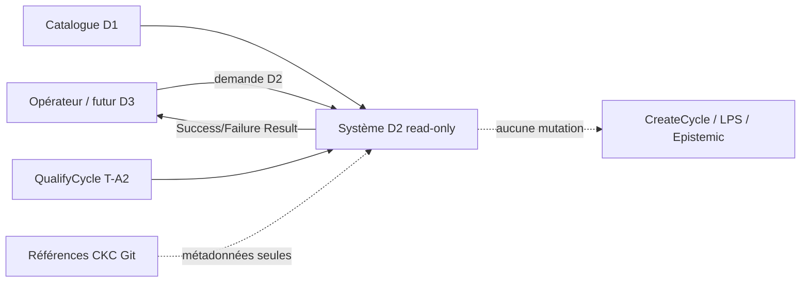
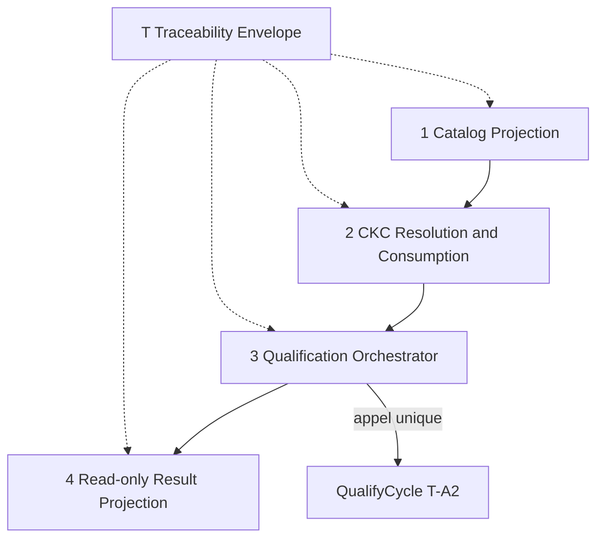
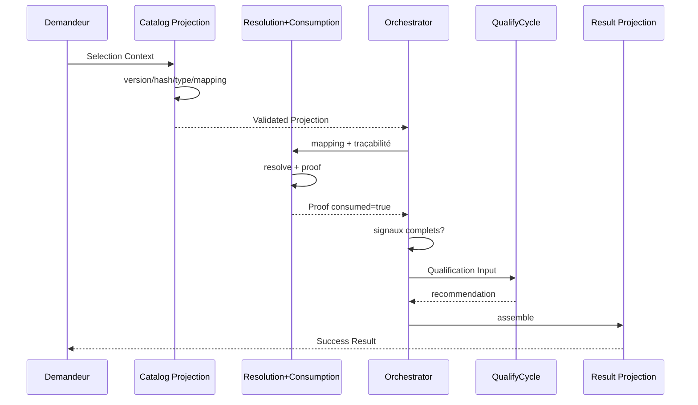
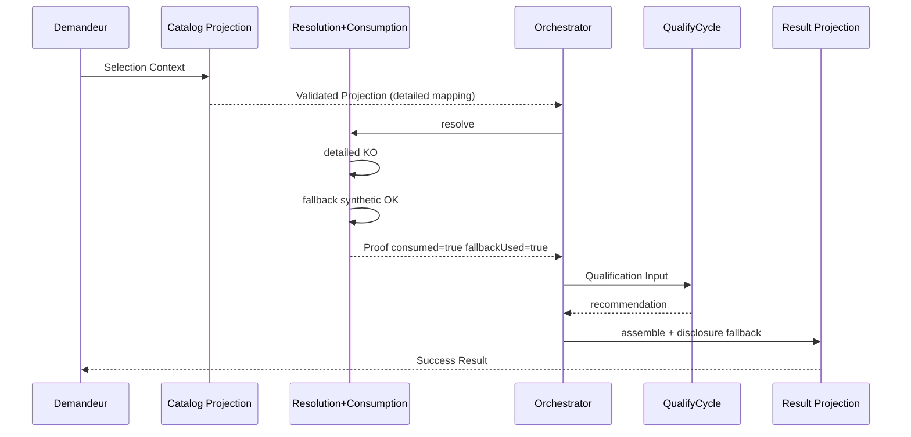
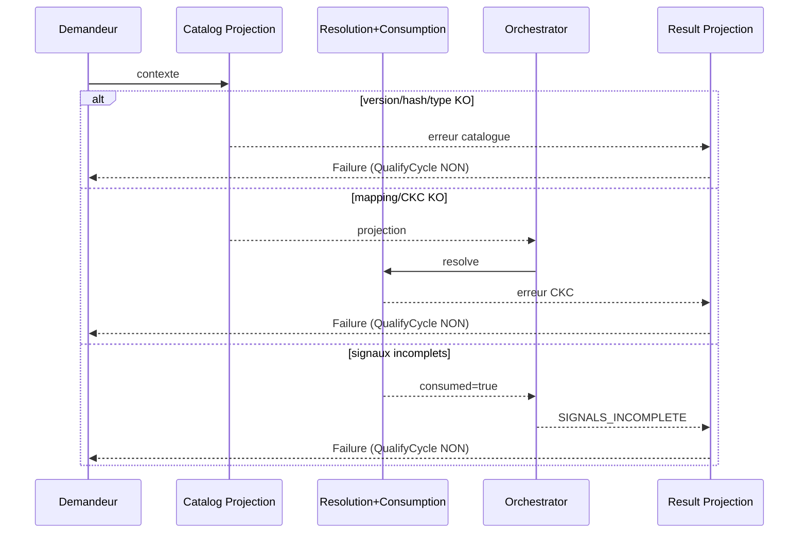
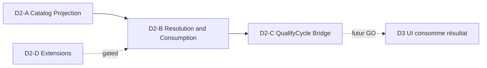

# SFIA Studio V3.1-D2 — Review pack Full — Architecture fonctionnelle

## Meta

| Champ | Valeur |
|-------|--------|
| **Date/heure/fuseau** | 2026-08-01 15:23:33 CEST (+0200) |
| **Rôle Cursor** | Exécution cycle 3 Architecture fonctionnelle (Critical / DOC) — sans implémentation |
| **Gate Morris (formulation réelle)** | « ok go architecture fonctionnelle D2 » |
| **Date gate** | 2026-08-01 15:13 CEST (+0200) |
| **Interprétation** | GO ARCHITECTURE FONCTIONNELLE SFIA STUDIO V3.1-D2 CKC RESOLVER AND QUALIFYCYCLE BRIDGE — USE VALIDATED FUNCTIONAL DESIGN — DEFINE COMPONENT RESPONSIBILITIES, CONTRACT BOUNDARIES, DATA FLOWS, STATUS MAPPING, CONSUMPTION PROOF AND SLICING — NO TECHNICAL ARCHITECTURE — NO DELIVERY — NO D3 — NO UI — NO FIGMA — NO CREATECYCLE — NO METHOD PROMOTION |
| **Cycle** | 3 — Architecture fonctionnelle |
| **Profil** | Critical |
| **Justification Critical** | Frontières structurantes catalogue / projection / resolver / consommation / bridge / résultat / D3 ; mauvais découpage → duplication, fail-open, dette, incohérence T-A2. Critical ≠ exécution / Delivery. |
| **Typologie** | DOC |
| **CKC** | Pilote détaillé absent → fallback carte synthétique `02-fifteen-cycles-synthetic-map.md` + §4.3 · method-candidate · executionAuthority=false |
| **Template** | prompts/templates/sfia-cycle-execution-template.md |
| **Branche** | framing/sfia-studio-v3-1-d2-ckc-resolver-cadrage |
| **HEAD / main / origin/main** | e1befcb80ed5e3c789a7de9036a8207d6b3e6771 |
| **Handoff pré-cycle tip** | 308130e026dfa03de0b9c016941235206423998a |
| **Handoff pré-cycle blob** | b78323babf0dab135ce48c31f1d63dd7536aa057 |
| **Content coverage** | gate Morris complete : yes · Critical justification : yes · CKC fallback : yes · Git Truth : yes · sources : yes · FD validation : yes · doc 17 full : yes · modified sections : yes · diagrams : yes · components/responsibilities/boundaries/contracts/flows : yes · statuses/T-A2/proof : yes · D3/slicing/options/decision pack : yes · tech questions : yes · risks : yes · final Git : yes · temporary report : yes · synthesis only : no · review pack verdict : complete |

## Git Truth initial

Branche framing @ e1befcb8… · main/origin/main alignés 0/0 · staged vide · 08/README modifiés · 15/16 non suivis · 77 worktrees · handoff tip/blob attendus · doc 15 SHA-256 534904ea… **inchangé**.

## Handoff source

Branche sfia/review-handoff · latest-chatgpt-review.md · tip 308130e… · blob b78323ba… (conception fonctionnelle D2).

## Sources consultées

Gouvernance · CKC carte synthétique + routing matrix + §4.3 · framing 08/12–16/README · D1 · T-A2 ports/application/domain (observations) · handoff.

## Conception fonctionnelle validée

Doc 16 validée par Morris 15:13 CEST · statut FUNCTIONAL DESIGN VALIDATED — FUNCTIONAL ARCHITECTURE AUTHORIZED · règles/AC/scénarios inchangés · D-V3.1-D2-01…12 héritées ADOPTED BY MORRIS.

## Fichiers créés / modifiés

| Fichier | Action |
|---------|--------|
| 17-…-functional-architecture.md | **créé** |
| 16-…-functional-design.md | validation B2 + statut seulement |
| 08-implementation-backlog-and-slicing.md | état D2 FA |
| README.md | cycle 3 / FA locale |
| 15-…-cadrage.md | **inchangé** (SHA 534904ea…) |

## Anti-claims

- Pas d’architecture technique ouverte
- Pas de Delivery D2-A/B/C
- Pas de D3 / UI / Figma / CreateCycle
- Pas de décision FA adoptée
- Pas d’extensions multi-CKC
- Pas de code / tests produit / method/**
- INHERITED-R-01 NOT LIFTED
- QualifyCycle inchangé
- Core CKC only
- Recommandation candidate FA-C non adoptée


## Document 17 — Architecture fonctionnelle (complet)

# 17 — V3.1-D2 CKC Resolver & QualifyCycle Bridge — Architecture fonctionnelle

## A. Métadonnées

| Champ | Valeur |
|-------|--------|
| **Date/heure/fuseau** | 2026-08-01 15:20:47 CEST (+0200) |
| **Cycle projet** | 3 — Architecture fonctionnelle |
| **Profil SFIA** | **Critical** |
| **Typologie** | DOC |
| **Gate Morris** | Formulation : « ok go architecture fonctionnelle D2 » — 2026-08-01 15:13 CEST (+0200) |
| **Branche** | `framing/sfia-studio-v3-1-d2-ckc-resolver-cadrage` |
| **Base** | `main` @ `e1befcb80ed5e3c789a7de9036a8207d6b3e6771` |
| **CKC** | Fallback : carte synthétique + §4.3 · method-candidate · `executionAuthority=false` |
| **Statut** | `V3.1-D2 FUNCTIONAL ARCHITECTURE COMPLETE LOCALLY — READY FOR MORRIS ARBITRATION OF D-V3.1-D2-FA-01…12 — NO FA DECISION ADOPTED — NO TECHNICAL ARCHITECTURE — NO DELIVERY` |
| **Doc 15** | **strictement inchangé** |
| **Code / UI / D3 / CreateCycle** | **non** |

## B. Gate Morris et autorité

**Autorisé :** architecture fonctionnelle ; options FA-A/B/C ; decision pack D-V3.1-D2-FA ; traçabilité ; handoff.

**Interdit :** architecture technique ; code ; Delivery ; D3 ; UI ; Figma ; CreateCycle ; D2-D ; adoption implicite des décisions FA ; promotion méthode.

**Justification Critical :** frontières structurantes catalogue / resolver / consommation / bridge / résultat / D3 ; mauvais découpage → duplication, fail-open, dette, incohérence T-A2. Critical ≠ autorité d’exécution ni Delivery.

## C. Sources consultées

Gouvernance · carte synthétique · routing matrix · §4.3 · framing 08/12–16/README · D1 · T-A2 ports/types/qualify/errors/MemoryCkcResolver (observations) · handoff `308130e…`.

## D. Héritage validé

| Source | Statut |
|--------|--------|
| D1 catalogue | Intégré `main` |
| D-V3.1-D2-01…12 | `ADOPTED BY MORRIS` (doc 15) |
| Doc 16 | Validée par Morris 15:13 CEST — règles/AC/scénarios **inchangés** |
| T-A2 QualifyCycle | Inchangé — observation |
| Ports CKC T-A2 | Observation — non décision FA |

## E. Problème d’architecture fonctionnelle

Comment structurer les responsabilités pour réaliser le parcours read-only du doc 16 sans chevauchement, sans fail-open, sans sur-architecture, et en préservant le slicing D2-A→B→C ?

## F. Objectifs et principes

Respecter les 20 principes du GO (Git contractuel, no Markdown parse, catalogue autoritatif, type sélectionné, resolver ≠ profil, QualifyCycle ≠ CKC, bridge sans duplication, consumed avant exploitabilité, fail-closed avant QualifyCycle, preuve structurée, statut D2 + projection T-A2, `executionAuthority=false`, `isMorrisDecision=false`, read-only, Core seul, fallback substitution, extensions fermées, D3 consomme résultat, responsabilités vérifiables).

## G. Vue de contexte


```mermaid
flowchart LR
  Actor[Opérateur / futur D3] -->|demande D2| D2[Système D2 read-only]
  D1[Catalogue D1] --> D2
  T-A2[QualifyCycle T-A2] --> D2
  CKCrefs[Références CKC Git] -.->|métadonnées seules| D2
  D2 -->|Success/Failure Result| Actor
  D2 -.->|aucune mutation| Forbidden[CreateCycle / LPS / Epistemic]
```

## H. Carte des composants fonctionnels

### Recommandation candidate (non adoptée) — modèle FA-C


```mermaid
flowchart TB
  CP[1 Catalog Projection]
  RC[2 CKC Resolution and Consumption]
  QO[3 Qualification Orchestrator]
  RP[4 Read-only Result Projection]
  TE[T Traceability Envelope]
  CP --> RC
  RC --> QO
  QO --> RP
  TE -.-> CP
  TE -.-> RC
  TE -.-> QO
  TE -.-> RP
  QO -->|appel unique| QC[QualifyCycle T-A2]
```

Variantes étudiées : FA-A (3) · FA-B (5) · FA-C (4) — §AH.

## I. Responsabilités et exclusions (FA-C candidate)

### 1 — Cycle Type Catalog Projection (D2-A)

| Inclut | Exclut |
|--------|--------|
| Version/hash check | Résolution CKC |
| Type sélectionnable + lifecycle | Preuve consumed |
| Mapping CKC Core exposé | QualifyCycle / profil |
| Erreurs catalogue | Mutations |

### 2 — CKC Resolution and Consumption (D2-B)

| Inclut | Exclut |
|--------|--------|
| Priorité detailed/fallback/synthetic | Profil / QualifyCycle |
| Statut détaillé D2 + projection T-A2 | Extensions multi-CKC |
| Invariants + preuve structurée | Assemblage résultat D3 |
| `executionAuthority=false` | UI |

**Sous-responsabilités logiques (même composant FA-C) :** Resolver · Consumption Validator/Proof Builder — séparables en FA-B.

### 3 — Profile Qualification Orchestrator (D2-C)

| Inclut | Exclut |
|--------|--------|
| Enchaînement + signaux | Recalcul profil |
| Bloquer si non consommé | Création cycle |
| Appel unique QualifyCycle | Parsing CKC |

### 4 — D2 Read-only Result Projection (D2-C)

| Inclut | Exclut |
|--------|--------|
| Assemblage Success/Failure | Règles métier |
| Disclosures / réserves | Persistance |
| Contrat unique pour D3 | Multi-appels internes |

### T — Error and Traceability Envelope (transverse)

correlationId · horodatages · codes · blocking/retryable/recoverable · événements fonctionnels · pas d’IAM.

## J. Frontières et dépendances

```text
Catalog Projection ──▶ Resolution+Consumption ──▶ Orchestrator ──▶ Result Projection
                              │                        │
                              │                        └──▶ QualifyCycle (externe T-A2)
                              └── interdit d’appeler QualifyCycle
```

Dépendances **interdites** : Catalog → QualifyCycle ; Resolver → Result sans orchestrateur ; Result → Resolver ; tout → CreateCycle.

## K. Contrats d’entrée

### Catalog Selection Context

`cycleTypeId` · `catalogVersion` · `catalogHash` · `correlationId`

### Qualification Input (vers QualifyCycle uniquement)

`signals` (6) · `cycleTypeId` · `objective?`/`scope?` non scorés · **pas** `requestedProfile`

## L. Contrats de sortie

### Validated Cycle Type Projection

type + label + description + lifecycle + mapping CKC + version + hash + correlationId

### CKC Resolution Result

statut détaillé D2 · level/status/source T-A2 · refs · fallbackUsed · doctrineStatus · `executionAuthority=false` · resolvedAt · correlationId · exploitable

### CKC Consumption Proof

Champs doc 16 §P — `consumed=true` **uniquement** si resolved_* valide

### D2 Success / Failure Result

Conforme doc 16 §R — Success assemblé par Result Projection ; Failure normalisé (voir FA-04)

## M. Flux nominal bout en bout


```mermaid
sequenceDiagram
  participant A as Demandeur
  participant CP as Catalog Projection
  participant RC as Resolution+Consumption
  participant QO as Orchestrator
  participant QC as QualifyCycle
  participant RP as Result Projection
  A->>CP: Selection Context
  CP->>CP: version/hash/type/mapping
  CP-->>QO: Validated Projection
  QO->>RC: mapping + traçabilité
  RC->>RC: resolve + proof
  RC-->>QO: Proof consumed=true
  QO->>QO: signaux complets?
  QO->>QC: Qualification Input
  QC-->>QO: recommendation
  QO->>RP: assemble
  RP-->>A: Success Result
```

## N. Flux detailed

Mapping detailed + primary OK → `resolved_detailed` · fallbackUsed=false · preuve · QualifyCycle si signaux OK.

## O. Flux synthetic primaire

Mapping synthetic + primary OK → `resolved_synthetic` · fallbackUsed=false.

## P. Flux fallback synthetic

Detailed KO + fallback OK → `resolved_fallback_synthetic` · fallbackUsed=true · disclosure obligatoire · QualifyCycle autorisé.


```mermaid
sequenceDiagram
  participant A as Demandeur
  participant CP as Catalog Projection
  participant RC as Resolution+Consumption
  participant QO as Orchestrator
  participant QC as QualifyCycle
  participant RP as Result Projection
  A->>CP: Selection Context
  CP-->>QO: Validated Projection (detailed mapping)
  QO->>RC: resolve
  RC->>RC: detailed KO
  RC->>RC: fallback synthetic OK
  RC-->>QO: Proof consumed=true fallbackUsed=true
  QO->>QC: Qualification Input
  QC-->>QO: recommendation
  QO->>RP: assemble + disclosure fallback
  RP-->>A: Success Result
```

## Q. Flux fail-closed


```mermaid
sequenceDiagram
  participant A as Demandeur
  participant CP as Catalog Projection
  participant RC as Resolution+Consumption
  participant QO as Orchestrator
  participant RP as Result Projection
  A->>CP: contexte
  alt version/hash/type KO
    CP-->>RP: erreur catalogue
    RP-->>A: Failure (QualifyCycle NON)
  else mapping/CKC KO
    CP-->>QO: projection
    QO->>RC: resolve
    RC-->>RP: erreur CKC
    RP-->>A: Failure (QualifyCycle NON)
  else signaux incomplets
    RC-->>QO: consumed=true
    QO-->>RP: SIGNALS_INCOMPLETE
    RP-->>A: Failure (QualifyCycle NON)
  end
```

**Règle centrale :** aucun échec antérieur à la qualification n’appelle QualifyCycle ; aucun Failure avec profil exploitable ou `consumed=true`.

## R. Projection catalogue D1

Propriétaire : composant 1 · source autoritative D1 · erreurs : VERSION/STALE/UNKNOWN/NOT_SELECTABLE.

## S. Résolution CKC Core

Propriétaire : composant 2 (sous-rôle Resolver) · priorités doc 16 · produit statut D2 + projection T-A2 · n’appelle pas QualifyCycle.

## T. Validation et preuve de consommation

Propriétaire logique : Consumption Validator (FA-C : dans composant 2 ; FA-B : composant autonome) · `consumed=true` seulement après invariants · refuse extensions implicites.

## U. Bridge QualifyCycle

= Orchestrator (composant 3) · orchestration seule · QualifyCycle inchangé.

## V. Projection du résultat read-only

= composant 4 · assemble Success/Failure · frontière unique D3.

## W. Statuts D2 et mapping T-A2

Reprise **stricte** doc 16 §O.

| Où | Qui |
|----|-----|
| Statut détaillé D2 | Resolver (comp. 2) |
| Projection T-A2 | Resolver (comp. 2) |
| Compensation primary/fallback | Statut D2 conservé dans Proof + Success Result |
| Exposition D3 | Result Projection |

Pas de nouveaux enums T-A2.

## X. Erreurs, normalisation et recovery

**Recommandation candidate (FA-04) :** normalisation dans **Orchestrator + Result Projection** — chaque composant émet une erreur locale ; l’orchestrateur/projection produit le Failure Result unique.

Codes : inchangés vs doc 16 §S · mapping T-A2 candidat inchangé.

## Y. Version, hash et correlationId

| Concern | Responsable candidat |
|---------|----------------------|
| Fournir version/hash attendus | Demandeur / contexte |
| Vérifier version/hash | Catalog Projection (premier contrôle) |
| Hash de référence conceptuel | Catalogue D1 (algo → tech) |
| Stale vs CKC invalid | Codes distincts `CATALOG_*` vs `CKC_*` |
| correlationId entrée | obligatoire ; absent → Failure |
| Propagation | Envelope T sur tous contrats |

Double contrôle borné (catalogue + orchestrateur) = option FA-06 — reco candidate : **projection catalogue** comme point principal.

## Z. Traçabilité et événements fonctionnels

Événements candidats (minimaux, non preuve production) :

| Événement | Obligatoire? |
|-----------|--------------|
| catalog projection validated | oui |
| CKC resolution started/succeeded/failed | oui |
| CKC fallback used | oui si fallback |
| CKC consumption validated/rejected | oui |
| profile qualification started/succeeded | oui si appelé |
| D2 result produced / request failed | oui |

Données : correlationId · cycleTypeId? · statut? · code? · pas de données sensibles.

## AA. Frontière D2/D3

```text
D3 ──lit──▶ D2 Success Result | D2 Failure Result
D3 ──interdit──▶ appels séparés resolver/QualifyCycle / recalcul / extensions
```

**Reco candidate FA-08 :** contrat résultat **unique**.

## AB. Extensibilité multi-CKC / D2-D

Core seul · zéro extension · fallback substitution · pas de collection d’extensions · D2-D fermé · extensibilité documentaire seulement.

## AC. Allocation D2-A / D2-B / D2-C


```mermaid
flowchart LR
  D2A[D2-A Catalog Projection] --> D2B[D2-B Resolution and Consumption]
  D2B --> D2C[D2-C QualifyCycle Bridge]
  D2C -.->|futur GO| D3[D3 UI consomme résultat]
  D2D[D2-D Extensions] -.->|gated| D2B
```

| Lot | Composants FA-C | Sortie |
|-----|-----------------|--------|
| **D2-A** | Catalog Projection (+ envelope partiel) | Validated Cycle Type Projection |
| **D2-B** | Resolution + Consumption | Proof ou Failure CKC |
| **D2-C** | Orchestrator + Result Projection | Success/Failure D2 |
| **D2-D** | — | **gated** |

**Reco FA-09 :** composants **strictement séparés par lot** avec contrats progressifs.

## AD. Dépendances et ordre

D1 → D2-A → D2-B → D2-C → (D3 futur) · T-A2 QualifyCycle requis dès D2-C · D2-D après GO.

## AE. Invariants d’architecture fonctionnelle

1. Un propriétaire unique par responsabilité.
2. Fail-closed avant QualifyCycle.
3. Statut D2 + T-A2 toujours co-présents en succès CKC.
4. `executionAuthority=false` / `isMorrisDecision=false`.
5. Aucune mutation.
6. Aucune extension active.
7. Indépendance framework/protocole/stockage.

## AF. Critères d’acceptation d’architecture

AC-D2-FA-01…20 — conformes au GO (propriétaire unique, catalogue ne résout pas, resolver sans profil, consumed après invariants, bridge sans duplication T-A2, statut D2+T-A2, fallback visible, échec bloque QualifyCycle, pas de profil/consumed en Failure, version/hash/correlationId, frontière D3 unique, pas de mutation, authority false, pas d’extensions, slicing distinct, indépendance tech, perte T-A2 documentée, normalisation erreurs, événements non production-ready, décisions FA soumises à Morris).

## AG. Scénarios de validation architecturale

| # | Scénario | Composants | QualifyCycle | Résultat |
|---|----------|------------|--------------|----------|
| 1 | Detailed → Light | 1→2→3→QC→4 | oui | Success Light |
| 2 | Synthetic → Standard | idem | oui | Success Standard |
| 3 | Fallback + disclosure | idem | oui | Success + fallbackUsed |
| 4 | Critical + CKC OK | idem | oui | Success Critical |
| 5 | Version incompatible | 1→4 | non | Failure |
| 6 | Hash stale | 1→4 | non | Failure |
| 7 | Type non sélectionnable | 1→4 | non | Failure |
| 8 | Mapping invalide | 1→2→4 | non | Failure |
| 9 | Résolution incohérente | 1→2→4 | non | Failure |
| 10 | executionAuthority=true | 1→2→4 | non | Failure |
| 11 | Preuve incomplète | 1→2→4 | non | Failure |
| 12 | Signaux incomplets | 1→2→3→4 | non | Failure |
| 13 | Critical+lowRiskBounded | 1→2→3→QC→4 | oui | Critical (T-A2) |
| 14 | Capitalization | idem | oui | capitalizationViaCycleTypeId |
| 15 | Erreur interne | *→4 | non si avant QC | Failure |
| 16 | D3 appelle QC direct | — | interdit | Anti-claim |
| 17 | Extension implicite | 2→4 | non | Failure |
| 18 | correlationId perdu | *→4 | non | Failure |
| 19 | Mismatch statut/T-A2 | 2→4 | non | Failure |
| 20 | consumed après échec | 2/4 | non | Invariant cassé → Failure |

## AH. Options et trade-offs

| Critère | FA-A (3) | FA-B (5) | FA-C (4) |
|---------|----------|----------|----------|
| Simplicité | Haute | Basse | Moyenne |
| Cohésion preuve | Risque couplage resolver | Haute | Haute si sous-rôles clairs |
| Couplage | Moyen-élevé | Faible | Moyen |
| Testabilité | Moyenne | Haute | Haute |
| Sur-architecture | Faible | Risque | Contrôlé |
| Slicing A/B/C | Moins net | Très net | Net |
| Compatibilité T-A2 | OK | OK | OK |
| Impact D3 | Bridge chargé | Clair | Clair |
| Dette | Moyenne si grossit | Contrats nombreux | Équilibrée |

### Challenge — propriétaire de la preuve

| Option | Cohésion | Fail-closed | Slicing |
|--------|----------|-------------|---------|
| Resolver seul | Risque mélange | Moyen | B flou |
| Autonome | Haute | Haute | B net (FA-B) |
| Bridge | Mauvaise | Risque late | C pollué |

**Reco candidate :** preuve = **responsabilité autonome logique** ; sous FA-C elle vit dans le composant 2 comme Validator distinct du Resolver ; sous FA-B = composant 3 dédié.

### Recommandation candidate globale (non adoptée)

**FA-C** — quatre composants : équilibre Critical / anti-sur-architecture ; preuve distincte logiquement dans Resolution+Consumption ; orchestrateur mince ; projection résultat séparée pour D3.

## AI. Decision pack Morris

Toutes : **NOT DECIDED — MORRIS DECISION REQUIRED.**

### D-V3.1-D2-FA-01 — Modèle de composants

- Options : FA-A / FA-B / FA-C
- Reco candidate : **FA-C**
- Statut : NOT DECIDED — MORRIS DECISION REQUIRED

### D-V3.1-D2-FA-02 — Propriétaire de la preuve

- Options : resolver / autonome / bridge
- Reco candidate : **autonome** (logique ; colocated en FA-C dans comp. 2)
- Statut : NOT DECIDED — MORRIS DECISION REQUIRED

### D-V3.1-D2-FA-03 — Frontière du resolver

- Options : résolution only / + projection T-A2 / + consommation
- Reco candidate : **résolution + projection T-A2** ; consommation séparée logiquement (même comp. si FA-C)
- Statut : NOT DECIDED — MORRIS DECISION REQUIRED

### D-V3.1-D2-FA-04 — Point de normalisation des erreurs

- Options : chaque composant / orchestrateur / projection
- Reco candidate : **orchestrateur + projection résultat**
- Statut : NOT DECIDED — MORRIS DECISION REQUIRED

### D-V3.1-D2-FA-05 — Propriétaire du statut détaillé D2

- Options : resolver / preuve / résultat final only
- Reco candidate : **resolver** (produit) ; preuve et résultat le **conservent**
- Statut : NOT DECIDED — MORRIS DECISION REQUIRED

### D-V3.1-D2-FA-06 — Point de contrôle version/hash

- Options : projection catalogue / bridge / double contrôle
- Reco candidate : **projection catalogue** (principal)
- Statut : NOT DECIDED — MORRIS DECISION REQUIRED

### D-V3.1-D2-FA-07 — Modèle de traçabilité

- Options : correlationId minimal / +événements / enveloppe complète
- Reco candidate : **correlationId + événements fonctionnels minimaux**
- Statut : NOT DECIDED — MORRIS DECISION REQUIRED

### D-V3.1-D2-FA-08 — Frontière D3

- Options : contrat unique / appels séparés / projection spécifique
- Reco candidate : **contrat résultat unique**
- Statut : NOT DECIDED — MORRIS DECISION REQUIRED

### D-V3.1-D2-FA-09 — Allocation D2-A/B/C

- Options : séparés par lot / partagés progressifs / lot unique
- Reco candidate : **composants séparés par lot**
- Statut : NOT DECIDED — MORRIS DECISION REQUIRED

### D-V3.1-D2-FA-10 — Compatibilité T-A2

- Options : réutilisation directe / adaptation contrôlée / domaine parallèle
- Reco candidate : **adaptation contrôlée** ; domaine parallèle **rejeté** sauf preuve exceptionnelle
- Statut : NOT DECIDED — MORRIS DECISION REQUIRED

### D-V3.1-D2-FA-11 — Formalisation des événements

- Options : aucun / minimaux / audit complet
- Reco candidate : **événements fonctionnels minimaux**
- Statut : NOT DECIDED — MORRIS DECISION REQUIRED

### D-V3.1-D2-FA-12 — Gate de sortie

- Options : arbitrage puis archi technique / arbitrage puis backlog D2-A / Delivery directe
- Reco candidate : **arbitrage Morris puis architecture technique** (ou backlog D2-A si archi technique légère différée) — **pas** Delivery directe
- Statut : NOT DECIDED — MORRIS DECISION REQUIRED

## AJ. Questions réservées à l’architecture technique

Fichiers/modules · classes · CkcResolverPort · ResolveCycleKnowledgeContract · composition root · DI · TS contracts · enums · erreurs · hash algo · sérialisation · validation refs sans Markdown · source métadonnées · cache · perf · audit · tests · migration · packaging D2-A/B/C.

**Aucune tranchée ici.**

## AK. Risques et réserves

Sur-architecture · composants artificiels · chevauchements · confusion resolver/consommation/bridge · domaine parallèle · duplication T-A2 · perte primary/fallback · hash mal borné · correlationId perdu · normalisation trop tardive · fail-open · D3 multi-couplé · multi-CKC implicite · slicing non livrable · audit disproportionné · tech anticipée · Delivery implicite · **INHERITED-R-01 ACCEPTED — STILL TRACEABLE — NOT LIFTED**.

## AL. Gates suivants candidats

```text
GO ARBITRATE SFIA STUDIO V3.1-D2 FUNCTIONAL ARCHITECTURE DECISION PACK —
DECIDE D-V3.1-D2-FA-01…12 —
NO TECHNICAL ARCHITECTURE —
NO DELIVERY —
NO D3 —
NO UI —
NO CREATECYCLE —
NO METHOD PROMOTION
```

Ne pas exécuter sans nouveau GO Morris.

## AM. Verdict

```text
V3.1-D2 FUNCTIONAL ARCHITECTURE COMPLETE —
VALIDATED FUNCTIONAL DESIGN CONSUMED —
COMPONENT RESPONSIBILITIES AND CONTRACT BOUNDARIES DOCUMENTED —
NOMINAL FALLBACK AND FAIL-CLOSED FLOWS DOCUMENTED —
DETAILED D2 STATUS AND T-A2 MAPPING PRESERVED —
STRUCTURED CKC CONSUMPTION PROOF ARCHITECTED —
QUALIFYCYCLE REMAINS UNCHANGED —
CORE CKC ONLY —
MULTI-CKC EXTENSIONS NOT OPENED —
D2-A D2-B AND D2-C FUNCTIONAL ALLOCATION DOCUMENTED —
FA-A FA-B AND FA-C COMPARED —
D-V3.1-D2-FA-01…12 PREPARED FOR MORRIS ARBITRATION —
NO FUNCTIONAL ARCHITECTURE DECISION ADOPTED —
NO TECHNICAL ARCHITECTURE —
NO IMPLEMENTATION —
NO DELIVERY —
NO D3 —
NO UI —
NO FIGMA —
NO CREATECYCLE —
NO METHOD PROMOTION
```

**Statut :** `V3.1-D2 FUNCTIONAL ARCHITECTURE READY FOR MORRIS ARBITRATION — TECHNICAL ARCHITECTURE AND DELIVERY REQUIRE DISTINCT MORRIS GATES — D3 NOT OPENED`


## Document 16 — sections modifiées

### Document 16 — sections modifiées (extrait)

#### A. Métadonnées — statut

# 16 — V3.1-D2 CKC Resolver & QualifyCycle Bridge — Conception fonctionnelle

## A. Métadonnées

| Champ | Valeur |
|-------|--------|
| **Date/heure/fuseau** | 2026-08-01 15:05:34 CEST (+0200) |
| **Cycle projet** | 2 — Conception fonctionnelle |
| **Profil SFIA** | Standard |
| **Typologie** | DOC |
| **Gate Morris** | `GO CONCEPTION FONCTIONNELLE SFIA STUDIO V3.1-D2 CKC RESOLVER AND QUALIFYCYCLE BRIDGE — APPLY ADOPTED D-V3.1-D2-01…12 — NO ARCHITECTURE — NO DELIVERY — NO D3 — NO UI — NO CREATECYCLE — NO METHOD PROMOTION` (2026-08-01 14:58 CEST +0200) |
| **Branche** | `framing/sfia-studio-v3-1-d2-ckc-resolver-cadrage` |
| **Base** | `main` @ `e1befcb80ed5e3c789a7de9036a8207d6b3e6771` |
| **CKC** | `pilots/02-conception-fonctionnelle.md` · method-candidate · `executionAuthority=false` |
| **Statut** | `FUNCTIONAL DESIGN VALIDATED — FUNCTIONAL ARCHITECTURE AUTHORIZED — NO TECHNICAL ARCHITECTURE — NO DELIVERY — D3 NOT OPENED` |
| **Code / UI / D3 / CreateCycle** | **non** |


#### B2. Validation Morris

## B2. Validation Morris — architecture fonctionnelle autorisée

| Champ | Valeur |
|-------|--------|
| **Formulation réelle Morris** | « ok go architecture fonctionnelle D2 » |
| **Date/heure** | 2026-08-01 15:13 CEST (+0200) |
| **Interprétation** | `GO ARCHITECTURE FONCTIONNELLE SFIA STUDIO V3.1-D2 …` — conception fonctionnelle **validée** ; architecture fonctionnelle **autorisée** |
| **Document d’architecture** | [`17-v3-1-d2-ckc-resolver-qualify-cycle-bridge-functional-architecture.md`](./17-v3-1-d2-ckc-resolver-qualify-cycle-bridge-functional-architecture.md) |
| **Architecture technique** | **fermée** |
| **Delivery D2 / D3 / UI / CreateCycle** | **fermés** |
| **Règles / AC / scénarios de ce document 16** | **inchangés** — non rouverts |

## C. Sources consultées

#### AE. Statut final

NO CREATECYCLE —
NO METHOD PROMOTION
```

**Statut :** `FUNCTIONAL DESIGN VALIDATED — FUNCTIONAL ARCHITECTURE AUTHORIZED — TECHNICAL ARCHITECTURE AND DELIVERY REQUIRE DISTINCT MORRIS GO — D3 NOT OPENED`


## Document 08 — contenu complet après mise à jour

# 08 — Implementation backlog and slicing

## Stratégie

Plusieurs PR (lots), commits atomiques. Framing docs séparés. Pas de big-bang.

## Lot V1 / V2

**INTEGRATED ON MAIN** (V2-A3 PR #295 @ `3e8a437…`).

## Lot V3 — Cycle Recommendation

**CADRAGE + ARBITRATION COMPLETE** — [`12`](./12-v3-cycle-recommendation-cadrage.md).

## Lot V3.1 — Profile Qualification (conception)

**FUNCTIONAL DESIGN COMPLETE** — [`13`](./13-v3-1-profile-qualification-functional-design.md).

## Lot V3.1 — Cycle Type Catalog (architecture + adoption)

**DECISIONS ADOPTED** — [`14`](./14-v3-1-cycle-type-catalog-functional-architecture.md).

## Lot V3.1-D1 — Catalogue runtime + mapping CKC

**Statut Delivery initial :** `IMPLEMENTATION COMPLETE`.

**Statut QA initiale :** `FAIL historique` — [`01`](../first-user-visible-vertical-slice-v3-1-d1-cycle-type-catalog-runtime/01-qa-validation-report.md) (inchangé).

**Statut correctif :** `CORRECTIVE DELIVERY IMPLEMENTED` — [`02`](../first-user-visible-vertical-slice-v3-1-d1-cycle-type-catalog-runtime/02-corrective-delivery-report.md) (inchangé).

**Statut revalidation :** `QA REVALIDATION PASS — R-QA-01…09 CLOSED` — [`03`](../first-user-visible-vertical-slice-v3-1-d1-cycle-type-catalog-runtime/03-qa-revalidation-report.md) (inchangé).

**QA-G3 Morris :** **PASS** (2026-07-30 21:36 CEST).

**Statut PR / merge / capitalisation (historique) :** PR #296 + capitalisation #297 **mergées** · D1 **techniquement clos** sur `main`.

Docs :
- [`../first-user-visible-vertical-slice-v3-1-d1-cycle-type-catalog-runtime/README.md`](../first-user-visible-vertical-slice-v3-1-d1-cycle-type-catalog-runtime/README.md)
- rapports `01` / `02` / `03` / `04`

| Preuve | Résultat |
|--------|----------|
| 15 IDs / mapping CKC | conformes |
| Revalidation / readiness tests | 46/46 · 94/94 · 827/827 · typecheck/lint/build PASS |
| QA-G2 | vert |
| QA-G3 | **PASS Morris** |
| PR / merge / capitalisation | PR #296 + #297 mergées · D1 techniquement clos sur `main` @ `e1befcb8…` |
| D2 cadrage | **terminé et arbitré** — [`15`](./15-v3-1-d2-ckc-resolver-qualify-cycle-bridge-cadrage.md) · D-V3.1-D2-01…12 **ADOPTED BY MORRIS** |
| D2 conception fonctionnelle | **validée** — [`16`](./16-v3-1-d2-ckc-resolver-qualify-cycle-bridge-functional-design.md) · GO Morris 2026-08-01 15:13 CEST |
| Architecture fonctionnelle D2 | **terminée localement** — [`17`](./17-v3-1-d2-ckc-resolver-qualify-cycle-bridge-functional-architecture.md) · D-V3.1-D2-FA-01…12 **NOT DECIDED — MORRIS DECISION REQUIRED** |
| Architecture technique D2 | **non ouverte** |
| Delivery D2-A/B/C | **non ouvertes** |
| D2-D (extensions) | **gated** · non ouvert |
| D3 | **non ouvert** |

### Slicing CAT-08

| Lot | Contenu | Statut |
|-----|---------|--------|
| **V3.1-D1** | Catalogue · mapping · validateur | **intégré `main`** · capitalisation REX publiée |
| **V3.1-D2** | Projection · resolver · QualifyCycle bridge | **cadrage arbitré** · **conception validée** · **architecture fonctionnelle locale** · décisions FA **en attente Morris** · architecture technique/Delivery **non ouvertes** · slicing **A→B→C** · D2-D gated |
| **V3.1-D3** | UI · état CKC | **non autorisé** · réserve Figma |

### Réserves QA

R-QA-01…09 **CLOSED**. QA-G3 PASS. Historique PR readiness conservé.

### Réserves D2

Orchestration CKC · consommation fail-closed · bridge QualifyCycle · Core-only (extensions fermées) · decision pack FA en attente · questions architecture technique réservées — voir [`15`](./15-v3-1-d2-ckc-resolver-qualify-cycle-bridge-cadrage.md) / [`16`](./16-v3-1-d2-ckc-resolver-qualify-cycle-bridge-functional-design.md) / [`17`](./17-v3-1-d2-ckc-resolver-qualify-cycle-bridge-functional-architecture.md).

## Lot V3.2 / V4 / V5 / V6

**NOT AUTHORIZED.**


## README framing — contenu complet après mise à jour

# First user-visible SFIA Studio vertical slice — Framing

| Champ | Valeur |
|-------|--------|
| **Statut** | `FRAMING LIVING — V3.1-D1 CLOSED — V3.1-D2 FRAMING ARBITRATED — FUNCTIONAL DESIGN VALIDATED — FUNCTIONAL ARCHITECTURE COMPLETE LOCALLY — FA DECISIONS PENDING MORRIS — TECHNICAL ARCHITECTURE/DELIVERY/D3 NOT OPENED` |
| **Date** | 2026-08-01 15:22:06 CEST (+0200) |
| **Cycle courant** | 3 — Architecture fonctionnelle V3.1-D2 |
| **Profil** | **Critical** |
| **Typologie** | DOC |
| **Gate courant** | Architecture fonctionnelle D2 **consommé** (formulation « ok go architecture fonctionnelle D2 » — 2026-08-01 15:13 CEST) |
| **Décisions D2 produit** | D-V3.1-D2-01…12 **ADOPTED BY MORRIS** |
| **Décisions D2-FA** | D-V3.1-D2-FA-01…12 **NOT DECIDED — MORRIS DECISION REQUIRED** |
| **Base `main`** | `e1befcb80ed5e3c789a7de9036a8207d6b3e6771` |
| **Docs D2** | [`15`](./15-v3-1-d2-ckc-resolver-qualify-cycle-bridge-cadrage.md) (arbitré, **inchangé**) · [`16`](./16-v3-1-d2-ckc-resolver-qualify-cycle-bridge-functional-design.md) (**validée**) · [`17`](./17-v3-1-d2-ckc-resolver-qualify-cycle-bridge-functional-architecture.md) (architecture fonctionnelle locale) |
| **Docs protégées** | `12` / `13` / `14` / `15` **inchangés** (ce cycle) |
| **Réserve README** | `ACCEPTED MINOR DOCUMENTATION RESERVE — STILL TRACEABLE — NOT LIFTED` |

## Synthèse

| Lot | État |
|-----|------|
| V1 / V2 | intégrés `main` |
| V3 / V3.1 cadrage–conception–adoption | terminés (`12`/`13`/`14`) |
| **V3.1-D1** | **techniquement clos** sur `main` |
| **V3.1-D2 cadrage** | **arbitré** — décisions 01…12 adoptées |
| **V3.1-D2 conception fonctionnelle** | **validée** — doc 16 |
| **V3.1-D2 architecture fonctionnelle** | **terminée localement** — doc 17 · **non adoptée** tant que FA non arbitré |
| Architecture technique D2 | **non ouverte** |
| Delivery D2-A/B/C | **fermées** |
| D2-D extensions | **gated** |
| V3.1-D3 | **fermé** · réserve Figma |
| V3.2 / V4–V6 | non autorisés |

**INHERITED-R-01 (README) :** condensation framing — **ACCEPTED — STILL TRACEABLE — NOT LIFTED** — non bloquant — pas une autorisation Delivery/D3.

## Gate candidat suivant

```text
GO ARBITRATE SFIA STUDIO V3.1-D2 FUNCTIONAL ARCHITECTURE DECISION PACK —
DECIDE D-V3.1-D2-FA-01…12 —
NO TECHNICAL ARCHITECTURE —
NO DELIVERY —
NO D3 —
NO UI —
NO CREATECYCLE —
NO METHOD PROMOTION
```

## Verdict

`V3.1-D2 FUNCTIONAL ARCHITECTURE COMPLETE LOCALLY — READY FOR MORRIS ARBITRATION OF D-V3.1-D2-FA-01…12 — NO FA DECISION ADOPTED — NO TECHNICAL ARCHITECTURE — NO DELIVERY — D3 NOT OPENED`


## Rapport temporaire

Contenu intégral : `.tmp-sfia-review/v3-1-d2-functional-architecture-report.md` (reproduit ci-dessus via doc 17 + sections modifiées + état Git).

## État Git final

```
=== Git Truth Final 2026-08-01T15:23:32+02:00 ===
branch=framing/sfia-studio-v3-1-d2-ckc-resolver-cadrage
HEAD=e1befcb80ed5e3c789a7de9036a8207d6b3e6771
main=e1befcb80ed5e3c789a7de9036a8207d6b3e6771
origin/main=e1befcb80ed5e3c789a7de9036a8207d6b3e6771
lr=0	0
--- status project framing ---
 M projects/sfia-studio/sfia-v3-delivery/v3-native-option-a/first-user-visible-vertical-slice-framing/08-implementation-backlog-and-slicing.md
 M projects/sfia-studio/sfia-v3-delivery/v3-native-option-a/first-user-visible-vertical-slice-framing/README.md
?? projects/sfia-studio/sfia-v3-delivery/v3-native-option-a/first-user-visible-vertical-slice-framing/15-v3-1-d2-ckc-resolver-qualify-cycle-bridge-cadrage.md
?? projects/sfia-studio/sfia-v3-delivery/v3-native-option-a/first-user-visible-vertical-slice-framing/16-v3-1-d2-ckc-resolver-qualify-cycle-bridge-functional-design.md
?? projects/sfia-studio/sfia-v3-delivery/v3-native-option-a/first-user-visible-vertical-slice-framing/17-v3-1-d2-ckc-resolver-qualify-cycle-bridge-functional-architecture.md
--- cached ---
--- wt count ---
77
--- prune ---
--- remote framing ---
From https://github.com/mcleland147/sfia-workspace
 * branch            sfia/review-handoff -> FETCH_HEAD
tip_pre=308130e026dfa03de0b9c016941235206423998a
blob_pre=b78323babf0dab135ce48c31f1d63dd7536aa057
doc15=534904ea71555d89388c03a72ef84418ea4ce6a1c67cbbb6c7a03a0f559bb9bc  projects/sfia-studio/sfia-v3-delivery/v3-native-option-a/first-user-visible-vertical-slice-framing/15-v3-1-d2-ckc-resolver-qualify-cycle-bridge-cadrage.md

```

## Verdict

```text
V3.1-D2 FUNCTIONAL ARCHITECTURE COMPLETE —
VALIDATED FUNCTIONAL DESIGN CONSUMED —
COMPONENT RESPONSIBILITIES AND CONTRACT BOUNDARIES DOCUMENTED —
NOMINAL FALLBACK AND FAIL-CLOSED FLOWS DOCUMENTED —
DETAILED D2 STATUS AND T-A2 MAPPING PRESERVED —
STRUCTURED CKC CONSUMPTION PROOF ARCHITECTED —
QUALIFYCYCLE REMAINS UNCHANGED —
CORE CKC ONLY —
MULTI-CKC EXTENSIONS NOT OPENED —
D2-A D2-B AND D2-C FUNCTIONAL ALLOCATION DOCUMENTED —
FA-A FA-B AND FA-C COMPARED —
D-V3.1-D2-FA-01…12 PREPARED FOR MORRIS ARBITRATION —
NO FUNCTIONAL ARCHITECTURE DECISION ADOPTED —
NO TECHNICAL ARCHITECTURE —
NO IMPLEMENTATION —
NO DELIVERY —
NO D3 —
NO UI —
NO FIGMA —
NO CREATECYCLE —
NO METHOD PROMOTION
```

**Statut :** `V3.1-D2 FUNCTIONAL ARCHITECTURE READY FOR MORRIS ARBITRATION — TECHNICAL ARCHITECTURE AND DELIVERY REQUIRE DISTINCT MORRIS GATES — D3 NOT OPENED`

**Gate suivant candidat (ne pas exécuter) :**

```text
GO ARBITRATE SFIA STUDIO V3.1-D2 FUNCTIONAL ARCHITECTURE DECISION PACK —
DECIDE D-V3.1-D2-FA-01…12 —
NO TECHNICAL ARCHITECTURE —
NO DELIVERY —
NO D3 —
NO UI —
NO CREATECYCLE —
NO METHOD PROMOTION
```

## Review pack completeness

- gate Morris complete : yes
- Critical justification complete : yes
- CKC fallback complete : yes
- Git Truth complete : yes
- source documents complete : yes
- functional design validation complete : yes
- created document full content : yes
- modified sections complete : yes
- diagrams complete : yes
- components complete : yes
- responsibilities complete : yes
- boundaries complete : yes
- contracts complete : yes
- flows complete : yes
- fail-closed complete : yes
- statuses and T-A2 mapping complete : yes
- consumption proof complete : yes
- traceability complete : yes
- D3 boundary complete : yes
- slicing complete : yes
- options complete : yes
- decision pack complete : yes
- technical architecture questions complete : yes
- risks and reserves complete : yes
- final Git state complete : yes
- temporary report full content : yes
- synthesis only : no
- review pack verdict : complete
