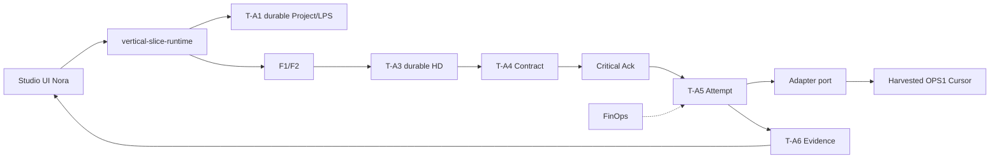
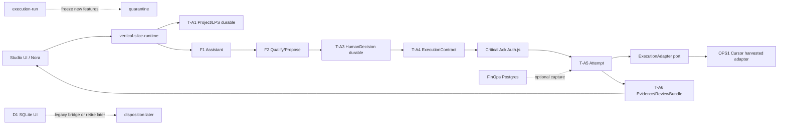
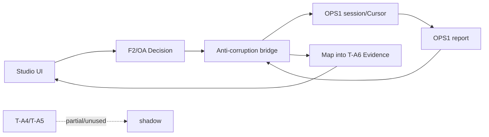

# ChatGPT Review Pack — FULL
## Cycle 6 Architecture technique Critical — SFIA Studio Runtime Convergence Audit

| Field | Value |
| --- | --- |
| **Role** | READ-ONLY exhaustive convergence audit |
| **Pack level** | FULL |
| **Synthesis-only** | NO |
| **Timestamp CEST** | 2026-08-12 18:53:32 CEST (+0200) |
| **Timestamp UTC** | 2026-08-12 16:53:32 UTC |
| **Cycle** | **6 — Architecture technique** |
| **Profil** | Critical |
| **Typologie** | EVOL — audit préalable à convergence structurée |
| **GO** | Morris audit read-only authorized by current request |
| **R-T-A3-1** | ACCEPTED / CLOSED BY MORRIS |
| **R-T-A3-2** | ACCEPTED / CLOSED BY MORRIS — BOUNDED SQLITE HARD CLOSURE |
| **Product persistence** | NOT_SELECTED |
| **crossStoreDurable** | false |
| **productionRollbackProven** | false |
| **Gate D** | NOT CONSUMED |
| **Cursor REAL** | 0 |
| **Review Pack** | FULL |
| **Outbound remote identity** | Placeholder — FINAL REMOTE IDENTITY VERIFIED EXTERNALLY AFTER CONTENT FREEZE |

---

# A. Executive summary

SFIA Studio today is a **working fixture vertical slice** on `/studio` (create project → Nora F1 chat → F2 proposal/Morris demo gate → F3 fixture T-A4→T-A5→T-A6 UI reinjection) on a **process-local Memory OA stack**, plus **parallel** durable engines (OPS1 Cursor/SQLite, D1 SQLite, FinOps Postgres, execution-run memory) that are **not** the F3 authority chain.

The shortest path to a Morris-usable v0.1 is **not** more micro-hardening of parallel engines; it is **convergence**: decide Product persistence, durable-bind Project + HumanDecision, harvest OPS1 Cursor behind T-A5 `ExecutionAdapter`, bind Critical Ack for REAL, then Gate D for a bounded read-only REAL.

**RECOMMENDATION — NOT DECIDED — MORRIS DECISION REQUIRED:** Option 1 — OA Native Backbone + Harvest OPS1 Cursor.

Dirty local candidate `delivery/sfia-studio-f3-real-prerequisites` (SHA `082326a1aa521c9f53308ce1a85fda79a170ceab81a56692b6d2149e1895e6ab`) adds Auth.js + critical-ack Sqlite journal wiring — **not on HEAD/main** — useful prerequisite evidence, not baseline.

---

# B. Audit scope / Git Truth

| Check | Result |
| --- | --- |
| Worktree | `…/f3-real-prerequisites-delivery` |
| Branch | `delivery/sfia-studio-f3-real-prerequisites` |
| HEAD | `4b1a058050ae81d56cb6d96b88e8a57380799a86` |
| origin/main | `4b1a058050ae81d56cb6d96b88e8a57380799a86` |
| Staged | EMPTY |
| Remote delivery | ABSENT |
| Dirty tracked F3 candidate | YES (expected; not cleaned) |
| Candidate SHA BEFORE/AFTER | `082326a1aa521c9f53308ce1a85fda79a170ceab81a56692b6d2149e1895e6ab` / `082326a1aa521c9f53308ce1a85fda79a170ceab81a56692b6d2149e1895e6ab` MATCH |
| Manifest | `.tmp-sfia-review/r-t-a3-2-option-a-delivery/candidate-manifest.txt` (40 files) |
| Template blob | `b9ce0a9fe57bb0f675afb8505ee0584180f830d7` |
| Inbound handoff | tip `c5efa822…` blob `2f9405af…` |
| PR range inspected | #234–#333 inclusive via `gh` (100/100; 97 merged; #271–#273 closed unmerged) |
| OA TS files counted | ~337 under `lib/oa` |
| Product mutations this cycle | **0** |
| Project Git writes | **0** |
| Cursor REAL / Gate D | **0 / NOT CONSUMED** |

Method sources read: cycle execution template, routing guide, operating model, rules/guardrails, v2.5 cycles method candidate, CKC posture for Critical Architecture.

---

# C. Timeline architectures (PR #234–#333)

| PR range | Generation | Intention | Current role |
| --- | --- | --- | --- |
| #234 | Pre-OPS1 | Governed GPT slice close | historical/support |
| #235–#253 | OPS1 I1–I6 | Session→gate→Cursor→report | **LEGACY_BUT_REUSABLE** (live `/ops1`) |
| #254 | D1 / Control Tower | SQLite intake | parallel durable UI |
| #255–#257 | Shared platform | AI/security/obs/tools | ACTIVE_SUPPORTING |
| #258–#267 | OA T-A0…T-A6 | Native Option A engine | **ACTIVE_CANONICAL_CANDIDATE** (Memory) |
| #268–#291 | CI + T-A7 framing/foundations | HARD/readiness | ACTIVE_SUPPORTING; cutover not done |
| #292–#304 | Vertical-slice + D2-A/B/C | Visible project + CKC/qualify | ACTIVE_CANONICAL UX path |
| #305–#311 | execution-run D2-D | Parallel run coordinator | PARALLEL (not F3 chain) |
| #312–#327 | FinOps T0–T7 | Cost control Postgres | PARALLEL durable transverse |
| #328 | OPS1 continuity bridge | Workspace link to OPS1 | legacy bridge |
| #329–#333 | F1→F2→F3 fixture | Assistant + native fixture authority chain | WIRED_UI + FIXTURE_ONLY on main |

Dirty-only (not main): `lib/oa/critical-ack/**`, `auth.ts`, NextAuth route, durable launch markers — F3 REAL prerequisites candidate.

---

# D. Current runtime map

Canonical Studio composition:

```
createRuntimeApplicationService (globalThis singleton)
  → createLocalVerticalSliceServices (T-A1 Memory Project/LPS + doctrine FS)
  → wireOaStack:
       Cycle Memory | CKC qualify | MemoryAuthorityResolver
       Decision Memory | SqliteAuthorityAttemptJournal (candidate)
       ExecutionContract Memory | ExecutionAttempt + F3 TestExecutionAdapter
       EvidenceReview Memory | createProductionAcknowledgeCritical (candidate)
```

Parallel compositions (not in wireOaStack for Nora):
- `composeExecutionRun*` (+ optional FinOps T7 shadow)
- OPS1 orchestrator + Cursor adapters
- D1 actions over `d1.sqlite`

UI surfaces: `/studio/projects/*` (Nora), `/ops1/*`, `/projects/*` (D1), Auth route (candidate).

---

# E. User journey map

| Hop | Status |
| --- | --- |
| User → Project create/view | EXISTS+WIRED (process-local) |
| Project → LPS | EXISTS+WIRED (process-local) |
| LPS → F1 context chat | EXISTS+WIRED |
| F1 → F2 propose | EXISTS+WIRED |
| F2 → Morris decide | EXISTS+WIRED + PROCESS_LOCAL + demo authority |
| Morris → T-A3 HD | EXISTS+WIRED (Memory) |
| T-A3 → T-A4 contract | EXISTS+WIRED (fixture prepare) |
| T-A4 → F3 → T-A5 | EXISTS+WIRED + FIXTURE_ONLY |
| T-A5 → adapter | FIXTURE_ONLY (`adp:f3-test-fixture`); REAL via OPS1 only |
| → T-A6 Evidence | EXISTS+WIRED (Memory); UI DTO reinjection |
| Evidence → LPS write-back | **MISSING** |
| Critical Ack Auth.js | EXISTS on candidate BUT NOT WIRED to Nora UI |
| Cycle create from F2 | EXISTS BUT NOT WIRED |
| Cursor REAL via Nora | MISSING / BLOCKED BY DECISION |
| Durable F2/HD/Contract | BLOCKED BY PERSISTENCE |

---

# F. Reachability matrix

See also artifact `reachability-matrix.md` (inline summary in §D/E).

Class counts (approx): ACTIVE_CANONICAL ~7; ACTIVE_SUPPORTING ~4; WIRED_UI ~3; FIXTURE_ONLY ~2; PROCESS_LOCAL ~8; DURABLE_LOCAL ~2 (D1 + candidate journal); DURABLE_SHARED ~1 (FinOps PG); PARALLEL ~4; LEGACY_BUT_REUSABLE ~1 (OPS1); HISTORICAL_DOC ~schemas/docs.

---

# G. Persistence map

Full table in audit artifact; key topology:

- **Studio OA product path:** almost entirely **Memory / process-local** (Project, LPS, Decision, Contract, Attempt, Evidence, F2 proposals).
- **Only durable on Studio candidate stack:** Sqlite authority/attempt journal (pilot-bounded; ≠ Product persistence selected).
- **Durable elsewhere:** D1 SQLite projects; OPS1 SQLite; FinOps PostgreSQL (cost domain).
- **Doctrine:** filesystem package registry (read-durable).

Implication: chat F2 GO and fixture F3 proofs **do not survive restart** and are **not REAL-eligible decisionRefs**.

---

# H. Authority / security map

| Control | Observed |
| --- | --- |
| Morris decides | Method + F2 gate UI; demo authority `LOCAL_PROCESS_MORRIS_DEMO_AUTHORITY` on Studio path |
| Authn | Auth.js GitHub on **candidate only**; not Nora-bound |
| Authz | MemoryAuthorityResolver; Authn≠Authz explicit |
| Critical Ack | Candidate composition `createProductionAcknowledgeCritical`; UI unwired |
| Confirmations | T-A3 Memory confirmations used by F3 fixture |
| Fail-closed REAL | OPS1 Cursor REAL fail-closed if flag≠1; F3 rejects hostile REAL fields |
| Silent REAL→FIXTURE | Forbidden in OPS1 and F3 wiring comments; fixture is explicit |
| Secrets | OPS1 secret boundaries exist; not audited as “secure” claim |
| Sandbox | OPS1 `.sfia-exec` worktrees for Cursor |

**No “secure for REAL Studio” claim** — Critical Ack/UI/durable HD still gaps.

---

# I. Execution engines comparison

| Engine | Authority model | Adapter | Durable | UI | Role vs F3 |
| --- | --- | --- | --- | --- | --- |
| T-A4/T-A5/T-A6 (OA) | Contract→Attempt→Evidence | TestExecutionAdapter in Studio | Memory (+ journal candidate) | Nora F3 | **target chain** |
| OPS1 | Session/gates/allowlist | Cursor fixture + REAL | SQLite | `/ops1` | harvest candidate for Cursor |
| execution-run | Provider lanes | Fake/fixture providers | Memory | none in Nora | parallel; freeze growth |

---

# J. OPS1 disposition analysis

- **Still live and useful** for Cursor REAL process, worktree sandbox, report reinjection patterns.
- **Not** the F3 native authority chain (F3-D03 / governance docs).
- **Credible target role:** encapsulated **ExecutionAdapter** implementation behind T-A5 port; OPS1 UI growth **STOP DOING** until disposition decided.
- Disposition = **MORRIS DECISION REQUIRED** (harvest vs dual-shell vs later retire).

---

# K. execution-run disposition analysis

- Parallel D2-D coordinator; optional FinOps shadow hook.
- **Not** wired to F1/F2/F3.
- Credible role: quarantine; mine ideas later; **no new independent features** until convergence decided.
- Disposition = **MORRIS DECISION REQUIRED**.

---

# L. FinOps isolation analysis

- Correctly isolable as **transverse cost/control** with Postgres durability.
- **Must not** be conflated with Product persistence.
- Optional future: capture hooks on Attempt launch — after Product path works.
- New FinOps lots without user-visible Studio dependency: **STOP DOING recommendation**.

---

# M. Reusable foundations

| Foundation | Reuse verdict |
| --- | --- |
| T-A0 doctrine resolve/digest | KEEP — called on project create |
| T-A1 Project/LPS ports + domain | KEEP — right product base; needs durable adapter |
| T-A2/CKC/qualify | KEEP — F2 uses qualify; wire createCycle later |
| T-A3 Decision/Confirmation/Authority ports | KEEP — right backbone; needs durable + real authority |
| T-A4 ExecutionContract | KEEP — consumable by F3; needs durable + REAL fields path |
| T-A5 Attempt + ExecutionAdapter port | KEEP — swap fixture for harvested Cursor adapter |
| T-A6 Evidence/ReviewBundle/Recommend | KEEP — UI reinjection exists; add LPS write-back |
| T-A7 HARD/readiness markers | KEEP as honesty rails |
| Shared platform AI/security/obs | KEEP |
| Vertical-slice runtime composition | KEEP as Studio composition root |
| OPS1 Cursor spawn/worktree | HARVEST into adapter |
| F1/F2/F3 UI flow | KEEP — replace demo/fixture bindings progressively |
| Auth.js + critical-ack candidate | PROMOTE via Delivery after Architecture decisions |
| FinOps Postgres | KEEP isolated |
| D1 SQLite project UI | LEGACY disposition later |
| Modeled JSON examples | schema/docs only |

---

# N. Orphans / parallel systems / debt

- Dual project UIs: `/studio` Memory vs `/projects` D1
- Dual execution: Nora F3 fixture vs OPS1 Cursor
- execution-run unused by product assistant
- Cycle services wired but F2 doesn't create CycleInstances
- Critical Ack composed (candidate) without UI
- Process-local proposal/decision vs durable journal only for attempts/acks
- Documentation “v3-native” naming ≠ authorization to reopen SFIA v3.0 product cutover

---

# O. Ligaments missing

See `ligaments.md`. Top blockers for usable v0.1:

1. **L1** Durable Project/LPS
2. **L2** Durable HumanDecision
3. **L6** Cursor adapter harvest into T-A5
4. **L7** Critical Ack UI binding
5. **L8** Exact REAL contract prep from HD
6. **L4** Live contextSnapshot
7. **L9** Evidence reinjection beyond ephemeral panel state

---

# P. Capabilities usable today

### On main (HEAD) without Cursor REAL
1. `/studio/projects/new` create process-local project + LPS view
2. Nora F1 chat if OpenAI configured (else blocked; no silent demo unless forced)
3. F2 qualification + proposal + Morris demo gate
4. F3 fixture prepare → confirm/execute → see evidence/recommendation cards
5. Navigate OPS1 separately for fixture Cursor (not Studio-bound)
6. FinOps not user-facing Studio journey

### On dirty candidate only
7. Auth.js route + production Critical Ack composition + Sqlite journal markers (server); **no Nora Critical Ack UX**

### Impossible today
- Restart-safe Studio project/decision
- REAL-eligible decisionRef for Gate D
- Cursor REAL from Nora
- Evidence durable + LPS write-back
- Claiming product READY / T-A6 COMPLETE

---

# Q. Target architecture options

## Option 1 — OA Native Backbone + Harvest OPS1 Cursor
**(RECOMMENDATION CANDIDATE)**


```mermaid
flowchart LR
  UI[Studio UI Nora] --> VS[vertical-slice-runtime]
  VS --> TA1[T-A1 durable Project/LPS]
  VS --> F12[F1/F2]
  F12 --> TA3[T-A3 durable HD]
  TA3 --> TA4[T-A4 Contract]
  TA4 --> ACK[Critical Ack]
  ACK --> TA5[T-A5 Attempt]
  TA5 --> ADP[Adapter port]
  ADP --> CUR[Harvested OPS1 Cursor]
  TA5 --> TA6[T-A6 Evidence]
  TA6 --> UI
  FIN[FinOps] -.-> TA5
```

Pros: aligns with F3 doctrine; reuses wired UI; clear authority; harvests REAL Cursor without dual product engines.
Cons: requires persistence Architecture; adapter work; residual parallel UIs until disposition.
Reversibility: high via ports.

## Option 2 — Dual-Shell (OA front + OPS1 execution)
Pros: faster opportunistic REAL via OPS1.
Cons: deepens parallel engines; weaker single Evidence/authority story; fights F3-D03 intent.
Reversibility: poor.

FinOps-as-Product-persistence third peer **not** proposed (violates isolation + NOT_SELECTED).

---

# R. Recommendation candidate

```
RECOMMENDATION — NOT DECIDED — MORRIS DECISION REQUIRED

Adopt Option 1 as architecture target candidate:
- Canonical backbone = T-A0→T-A7 + vertical-slice + F1/F2/F3
- Harvest OPS1 Cursor into T-A5 ExecutionAdapter
- Quarantine execution-run feature growth
- Keep FinOps transverse/isolated
- Decide Product persistence technology in a dedicated Architecture gate
- Promote dirty critical-ack/Auth.js via explicit Delivery after decisions
- Do not reopen SFIA v3.0 cutover; do not couple F3 to FinOps PG
```

Criteria fit: shortest usable path; max reuse; reduce parallel engines; fail-closed authority; evolutive after v0.1.

---

# S. Candidate product roadmap (capability-guided)

| Milestone | User capability | Reuse | Ligaments | Morris decisions | Probable cycles | Exit criteria | Deferred |
| --- | --- | --- | --- | --- | --- | --- | --- |
| **R0** | Architecture/convergence decided | audit | — | Option 1/2; persistence; OPS1/execution-run disposition | Architecture | Written GO on target + dispositions | implementation |
| **R1** | Durable project open/create + live context | T-A1 ports, VS UI | L1,L4,L10 | Product persistence choice | Delivery | Restart-safe project/LPS; contextSnapshot resolvable | multi-region |
| **R2** | Contextual assistant usable daily | F1, platform AI | history persistence optional | — | Delivery/Light | Chat with durable project context | advanced tools |
| **R3** | F2 proposal + durable HD Morris gate | F2, T-A3 | L2,L3,L5 | Authority binding rules | Delivery Critical | accepted+current decisionRef survives restart | demo authority gone |
| **R4** | Exact ExecutionContract + Gate D ready | T-A4, candidate ack | L7,L8,L11 | Gate D exact | Cadrage+Delivery | contract id/version/fingerprint frozen from HD | REAL launch |
| **R5** | First Cursor REAL read-only from product | T-A5 port + OPS1 harvest | L6 | Gate D GO | Execution Critical | Evidence of REAL path; no silent fixture | writes |
| **R6** | Evidence/ReviewBundle + UI/LPS reinjection | T-A6 | L9,L12 | — | Delivery | durable evidence visible in workspace | maturity auto |
| **R7** | First bounded local WRITE Cursor | adapter allowlist | stop conditions | new Gate | Execution Critical | scoped write + review | broad Git publish |
| **R8** | Daily-usable readiness/history | T-A7 honesty, journal | polish | — | mixed | NOT_READY honest; restart-safe core loop | full cutover |

Roadmap = **CANDIDATE ONLY**.

---

# T. MUST / SHOULD / LATER

**MUST for v0.1 usable**
- R0 decisions
- Durable Project/LPS
- Durable HumanDecision
- Nora path without demo-only authority for structuring decisions
- Harvested REAL adapter behind T-A5 (for R5)
- Critical Ack bound for Critical REAL
- Evidence visible reinjection

**SHOULD after first usage**
- CycleInstance binding
- LPS write-back from ReviewBundle
- OPS1 UI disposition
- D1 UI disposition
- FinOps optional capture on Attempts

**LATER**
- execution-run absorption
- multi-instance HA
- productionRollbackProven
- broad WRITE Git/PR automation
- SFIA v3.0 cutover

**LEGACY disposition decision required**
- OPS1 product UI
- D1 `/projects` stack
- execution-run feature stream

---

# U. STOP DOING (recommendation only)

Until R0 decided, avoid new cycles that deepen parallel engines without Studio user-visible dependency:
- new FinOps feature lots
- new independent execution-run features
- OPS1 feature expansion beyond harvest needs
- T-A7 hardening without user-visible dependency
- F3 REAL attempts without durable HD + Gate D
- Product persistence selection by implementers

---

# V. Morris decisions (max 7)

1. **Architecture target:** Option 1 vs Option 2?
2. **Product persistence technology** for Project/LPS/Decision/(Contract/Attempt/Evidence as needed) — without implying FinOps coupling?
3. **OPS1 disposition:** harvest-as-adapter vs dual-shell vs other?
4. **execution-run disposition:** quarantine now?
5. **Adopt candidate roadmap R0→R8** (or amend)?
6. **Promote dirty F3 REAL prerequisites (Auth.js/critical-ack)** into Delivery after R0?
7. **D1 `/projects` disposition:** maintain bridge / freeze / plan retire?

---

# W. Reserves / anti-claims

- Architecture **not** validated
- Persistence **not** selected
- OPS1 **not** deprecated by this audit
- execution-run **not** deleted
- Product **not** READY
- Cursor REAL **not** ready on Nora
- Gate D **not** ready / not consumed
- Candidate dirty ≠ baseline
- SFIA v3.0 **not** reopened
- Fixture success ≠ functional READY
- FinOps Postgres ≠ Product persistence
- Sqlite journal ≠ global persistence platform

---

# X. Integrity evidence

| Item | Value |
| --- | --- |
| Candidate SHA BEFORE | `082326a1aa521c9f53308ce1a85fda79a170ceab81a56692b6d2149e1895e6ab` |
| Candidate SHA AFTER | `082326a1aa521c9f53308ce1a85fda79a170ceab81a56692b6d2149e1895e6ab` |
| Staged | EMPTY |
| Product mutations | 0 |
| Tracked writes | 0 |
| Project Git writes | 0 |
| saveProposal/recordF2Decision/Build/Confirm/Ack/Start/launch | 0 |
| Cursor REAL | 0 |
| Gate D | NOT CONSUMED |
| Analysis volume | PR #234–#333; ~337 OA TS files; 3 parallel stacks; 12 ligaments; 2 architecture options |

Auxiliary artifacts under `.tmp-sfia-review/sfia-studio-runtime-convergence-audit/`:
- PRECHECK.txt
- reachability-matrix.md
- persistence-map.md
- ligaments.md
- architecture-options.md
- candidate-sha-before.txt / after.txt

---


---

# APPENDIX — FULL INLINE ARTIFACTS

## Artifact: PRECHECK.txt

```
PRECHECK=OK
BRANCH=delivery/sfia-studio-f3-real-prerequisites
HEAD=4b1a058050ae81d56cb6d96b88e8a57380799a86
ORIGIN_MAIN=4b1a058050ae81d56cb6d96b88e8a57380799a86
STAGED=EMPTY
REMOTE_DELIVERY=ABSENT
CANDIDATE_SHA=082326a1aa521c9f53308ce1a85fda79a170ceab81a56692b6d2149e1895e6ab
CANDIDATE_SHA_MATCH=YES
INBOUND_HANDOFF_TIP=c5efa822a2a9c59ac0996f228801779a66b6c149
INBOUND_HANDOFF_BLOB=2f9405afa26ea5a3ef96239f16cb5df7f2805e4e
DIRTY_F3_CANDIDATE=YES
CRITICAL_ACK_ON_HEAD=NO
CURSOR_REAL=0
GATE_D=NOT_CONSUMED
PRODUCT_MUTATIONS=0
TIMESTAMP_CEST=2026-08-12 18:53:32 CEST (+0200)
```

## Artifact: reachability-matrix.md

```
# Reachability / Wiring Matrix

| Subsystem | Path | Classification |
| --- | --- | --- |
| Doctrine T-A0 | lib/oa/doctrine | ACTIVE_SUPPORTING |
| Project/LPS T-A1 | lib/oa/project | ACTIVE_CANONICAL_CANDIDATE + PROCESS_LOCAL |
| Cycle/CKC T-A2 | lib/oa/cycle | ACTIVE_SUPPORTING + WIRED_SERVER_ONLY (UI-orphan for createCycle) |
| Decision T-A3 | lib/oa/decision | ACTIVE_CANONICAL_CANDIDATE + PROCESS_LOCAL |
| ExecutionContract T-A4 | lib/oa/execution-contract | ACTIVE_CANONICAL_CANDIDATE + PROCESS_LOCAL |
| ExecutionAttempt T-A5 | lib/oa/execution-attempt | ACTIVE_CANONICAL_CANDIDATE + FIXTURE_ONLY (adapter) |
| EvidenceReview T-A6 | lib/oa/evidence-review | ACTIVE_CANONICAL_CANDIDATE + PROCESS_LOCAL |
| Critical-ack journal | lib/oa/critical-ack (dirty only) | WIRED_SERVER_ONLY + DURABLE_LOCAL (candidate) |
| Auth.js GitHub | app/auth.ts (dirty only) | WIRED_SERVER_ONLY (candidate; no Nora UI) |
| Vertical-slice runtime | lib/vertical-slice-runtime | ACTIVE_CANONICAL_CANDIDATE + PROCESS_LOCAL |
| F1 Assistant | features/project-assistant | WIRED_UI_REACHABLE |
| F2 Proposal/Gate | features/project-assistant/f2 | WIRED_UI_REACHABLE + PROCESS_LOCAL |
| F3 Fixture slice | features/project-assistant/f3 | WIRED_UI_REACHABLE + FIXTURE_ONLY |
| OPS1 Cursor REAL | lib/ops1 | LEGACY_BUT_REUSABLE + PARALLEL_ARCHITECTURE |
| execution-run D2-D | lib/oa/execution-run | PARALLEL_ARCHITECTURE |
| FinOps T0–T7 | lib/oa/finops | PARALLEL_ARCHITECTURE + DURABLE_SHARED (Postgres; not Product persistence) |
| D1 Project SQLite | lib/d1 | PARALLEL_ARCHITECTURE + DURABLE_LOCAL |
| Shared platform | lib/platform | ACTIVE_SUPPORTING |
| T-A7 HARD foundation | lib/platform/t-a7 | ACTIVE_SUPPORTING |
| Modeled schemas | sfia-v3-modeled | HISTORICAL_DOC_ONLY / schema reference |
```

## Artifact: persistence-map.md

```
# Persistence Map (observed)

| Aggregate | Interface | Implementation | Backend | Durable | Restart-safe | Multi-instance | Product caller |
| --- | --- | --- | --- | --- | --- | --- | --- |
| Project | ProjectRepositoryPort | MemoryProjectRepository | process memory | NO | NO | NO | vertical-slice-core |
| LPS | LivingProjectStateRepositoryPort | MemoryLivingProjectStateRepository | process memory | NO | NO | NO | vertical-slice-core |
| Cycle/Trajectory/Epistemic | Cycle* ports | Memory* | process memory | NO | NO | NO | wireOaStack (server) |
| HumanDecision/Confirmation | DecisionRepositoryPort | MemoryDecisionRepository | process memory | NO | NO | NO | F2 recordF2Decision |
| Authority resolver | AuthorityResolverPort | MemoryAuthorityResolver | process memory | NO | NO | NO | F2/F3 |
| F2 Proposal | (no port) | proposalStore Map globalThis | process memory | NO | NO | NO | F2 orchestrate |
| ExecutionContract | ExecutionContractRepositoryPort | MemoryExecutionContractStore | process memory | NO | NO | NO | F3 prepare/confirm |
| ExecutionAttempt | AttemptRepositoryPort | MemoryAttemptStore | process memory | NO | NO | NO | F3 execute |
| Authority/Attempt journal | AuthorityAttemptJournalPort | SqliteAuthorityAttemptJournal (dirty) / Memory (tests) | SQLite D1 file | YES (pilot-bounded) | YES (process epoch) | NO | wireOaStack Confirm/Start/Ack (candidate) |
| Evidence/ReviewBundle/Claim/Maturity | Evidence* ports | Memory* | process memory | NO | NO | NO | F3 ingest |
| Doctrine package | DoctrinePackageRepositoryPort | FilesystemDoctrinePackageRepository | filesystem fixtures | YES (files) | YES | YES (read) | create project |
| D1 Project | d1 tables | better-sqlite | d1.sqlite | YES | YES | NO | /projects D1 UI (parallel) |
| OPS1 session/report | ops1 sqlite | SQLite | ops1.sqlite | YES | YES | NO | /ops1 UI |
| ExecutionRun | RunRepository | MemoryExecutionRunStore | process memory | NO | NO | NO | composeExecutionRun* (not F1–F3) |
| FinOps ledgers/config/reviews | FinOps ports | createPostgresFinOps* | PostgreSQL | YES | YES | YES (pool) | FinOps compose / T7 shadow — NOT Product persistence |

Product persistence = NOT_SELECTED (explicit). FinOps Postgres ≠ Product persistence. Sqlite journal ≠ platform globale.
```

## Artifact: ligaments.md

```
# Missing / Partial Ligaments

| ID | Ligament | Links | Partial exists? | Build/Reuse/Adapt | Size | Morris gate? |
| --- | --- | --- | --- | --- | --- | --- |
| L1 | Durable Project+LPS repository adapter behind existing ports | UI create/get ↔ T-A1 | Ports+Memory yes; durable impl NO | Build adapter; reuse ports | M | YES — Product persistence choice |
| L2 | Durable HumanDecision+Confirmation repository | F2 decide ↔ T-A3 ↔ T-A4 decisionRefs | Ports+Memory yes; durable NO | Build adapter | M | YES — same persistence decision / Architecture C |
| L3 | Durable or restart-safe Proposal binding OR proposal→HD materialization | F2 proposal ↔ HD | process-local Map only | Adapt recordF2Decision + durable HD | S–M | YES if durable HD |
| L4 | Live contextSnapshot binder (projectId/lps/doctrineDigest) | F2 ProposalDto completeness | Needs live project | Reuse getProjectRuntime | S | NO if project durable exists |
| L5 | CycleInstance binding from F2 qualification | F2 ↔ T-A2 createCycle | cycleServices wired but unused by F2 UI | Wire application service | M | Maybe (cycle lifecycle) |
| L6 | T-A5 ExecutionAdapter bridge harvesting OPS1 Cursor REAL | T-A5 port ↔ OPS1 spawnRealCursor | OPS1 adapter exists; F3 uses TestExecutionAdapter only | Adapt anti-corruption | M | YES — REAL adapter authorization / Gate D later |
| L7 | Critical Ack UI + Server Action binding | Nora ↔ acknowledgeCritical + Auth.js | composed on candidate; no UI action | Build UI+action | S–M | YES for Critical REAL |
| L8 | Exact ExecutionContract builder from approved F2/HD | F2/HD ↔ BuildExecutionContract | F3 fixture builder exists | Adapt prepare path for REAL fields | M | Gate D |
| L9 | Evidence→LPS / workspace reinjection | T-A6 ↔ LPS/UI durable view | UI DTO reinjection only | Build application write-back | M | Maybe |
| L10 | Persistence abstraction / composition switch | Memory vs durable backends | factories are Memory-hardcoded in wireOaStack | Adapt composition root | M | YES |
| L11 | Identity/authority binding Auth.js subject→actor | Auth.js ↔ AuthorityResolver | githubSubjectActorBinding on candidate | Reuse candidate | S | Partially decided (R-T-A3-1 closed) |
| L12 | Restart reconciliation coordinator | journal + attempts + authority | candidate reconcile* present | Reuse candidate | S–M | Bounded already for journal |

Labels are observations — not deletion/adoption decisions.
```

## Artifact: architecture-options.md

```
# Target Architecture Options (CANDIDATE — NOT DECIDED)

## Option 1 — OA Native Backbone + Harvest OPS1 Cursor (RECOMMENDED CANDIDATE)


```mermaid
flowchart LR
  UI[Studio UI / Nora] --> VS[vertical-slice-runtime]
  VS --> TA1[T-A1 Project/LPS durable]
  VS --> F1[F1 Assistant]
  F1 --> F2[F2 Qualify/Propose]
  F2 --> TA3[T-A3 HumanDecision durable]
  TA3 --> TA4[T-A4 ExecutionContract]
  TA4 --> ACK[Critical Ack Auth.js]
  ACK --> TA5[T-A5 Attempt]
  TA5 --> ADP[ExecutionAdapter port]
  ADP --> CUR[OPS1 Cursor harvested adapter]
  TA5 --> TA6[T-A6 Evidence/ReviewBundle]
  TA6 --> UI
  FIN[FinOps Postgres] -.->|optional capture| TA5
  ER[execution-run] -.->|freeze new features| X[quarantine]
  D1[D1 SQLite UI] -.->|legacy bridge or retire later| Y[disposition later]
```

- Backbone: T-A0→T-A7 + F1/F2/F3 + vertical-slice composition
- OPS1 role: harvest Cursor REAL/worktree/sandbox into T-A5 adapter; freeze OPS1 product UI growth
- execution-run: quarantine / no new independent features; optional later absorption of provider ideas
- FinOps: remain transverse cost subsystem; optional shadow capture; NOT Product persistence
- Persistence topology candidate: durable Project+Decision(+Contract/Attempt/Evidence as needed) behind existing ports — technology UNDECIDED
- Pros: shortest path to usable Studio; reuses OA authority chain already UI-wired; fail-closed REAL story
- Cons: needs persistence Architecture decision; adapter harvest work; dual UI (OPS1/D1) residual until disposition
- Debt: temporary coexistence of parallel UIs
- Reversibility: high if ports kept; adapters swappable
- Calendar: fastest to R5–R6 if persistence decided early

## Option 2 — Dual-Shell Continuity (OA governance + OPS1 execution shell)


```mermaid
flowchart LR
  UI[Studio UI] --> F2[F2/OA Decision]
  F2 --> BRIDGE[Anti-corruption bridge]
  BRIDGE --> OPS1[OPS1 session/Cursor]
  OPS1 --> REP[OPS1 report]
  REP --> BRIDGE
  BRIDGE --> TA6[Map into T-A6 Evidence]
  TA6 --> UI
  OA[T-A4/T-A5] -.->|partial/unused| Z[shadow]
```

- Backbone: keep OPS1 as execution engine; OA as decision/governance front
- Pros: Cursor REAL already exists in OPS1; less adapter porting
- Cons: perpetuates parallel engines; F3-D03 says execution-run/OPS1 not F3 authority chain; higher long-term debt; harder single Evidence model
- Debt: high coexistence
- Reversibility: poorer (deepens OPS1 product dependency)
- Calendar: maybe faster first REAL demo; slower coherent Studio v0.1

## Option 3 — Not proposed as equal peer
A pure “FinOps Postgres as Product persistence + execution-run as primary engine” option is **rejected as a third peer option** because FinOps is cost-control transverse, Product persistence is NOT_SELECTED, and F3 doctrine targets T-A4→T-A5→T-A6. Studying FinOps Postgres as *capacity* remains allowed without selecting it.
```

# Y. Handoff evidence

Pending publish in-cycle:
- branch `sfia/review-handoff`
- file `sfia-review-handoff/latest-chatgpt-review.md`
- message `docs(review-handoff): publish sfia studio runtime convergence audit`

---

# Z. Verdict

```
SFIA STUDIO RUNTIME CONVERGENCE AUDIT COMPLETE —
CURRENT ARCHITECTURE MAPPED —
INTEGRATION GAPS IDENTIFIED —
TARGET ARCHITECTURE OPTIONS READY —
PRODUCT ROADMAP CANDIDATE READY FOR MORRIS DECISION —
NO IMPLEMENTATION AUTHORIZED —
CURSOR REAL 0 —
GATE D NOT CONSUMED —
PRODUCT MUTATIONS 0 —
CANDIDATE BYTE-IDENTICAL —
READY FOR MORRIS ARCHITECTURE / PRODUCT ROADMAP DECISION
```

Instruction ChatGPT: re-read handoff from Git before any architecture/roadmap decision. Cursor-copied report alone is insufficient.
