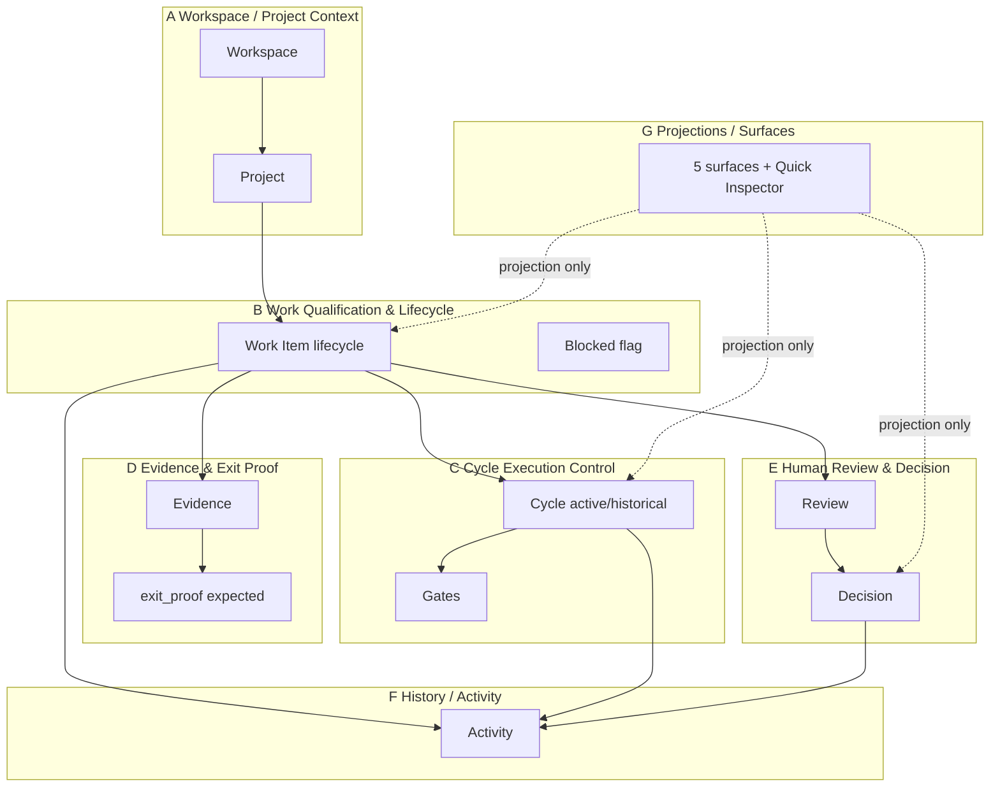
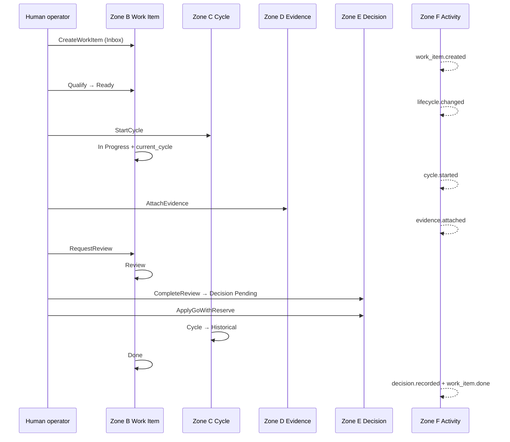

# SFIA Review Pack FULL — SFIA Task Manager Cycle 3 Functional Architecture

**Timestamp (Europe/Paris):** 2026-08-20 13:19:13 CEST

**Pack type:** FULL — Cycle 3 Architecture fonctionnelle

**Profil:** Standard

**Typologie:** DOC

---

## Morris GO (exact)

GO MORRIS — OPEN CYCLE 3 ARCHITECTURE FONCTIONNELLE — STANDARD — INCLUDE R-DOC-01 TRACKING CORRECTION — NO FIGMA / TECH ARCH / BACKLOG / DELIVERY

---

## Repository / Git truth

| Field | Value |
|-------|-------|
| Repository | mcleland147/sfia-workspace |
| Base current main / HEAD | `32cce29f452e7db95d52ed71c578b1fc11d11b17` |
| Prior Task Manager merge | `db13f125785b248d1c3f059eb975e364558d0860` |
| Prior Task Manager project commit | `2f6ebccfd91de05089845aae7c53ad9d6d4427bb` |
| Branch | `project/sfia-task-manager-cycle-3-functional-architecture` |
| HEAD | `32cce29f452e7db95d52ed71c578b1fc11d11b17` |
| Remote project branch | **ABSENT** |
| Project commit | **NO / NOT AUTHORIZED** |
| Project push | **NO / NOT AUTHORIZED** |
| PR | **NO / NOT AUTHORIZED** |
| Staged | **NONE** |

### Local Git Truth (initial)

- Started on `main` at `db13f125` (behind)
- `git fetch` → `origin/main` = `32cce29f`
- ff-only pull to `32cce29f`
- Ancestors verified: `db13f125` and `2f6ebccf` are ancestors of main
- Created branch `project/sfia-task-manager-cycle-3-functional-architecture` @ `32cce29f`

---

## Sources read

1. `method/sfia-fast-track/core/sfia-cycle-routing-guide.md`
2. `method/sfia-fast-track/documentation/capitalization/cycle-knowledge-contracts/02-fifteen-cycles-synthetic-map.md`
3. `method/sfia-fast-track/documentation/capitalization/sfia-v2/sfia-v2.5-project-cycles-method-candidate.md` (§4.3)
4. `prompts/templates/sfia-cycle-execution-template.md`
5. `method/sfia-fast-track/core/sfia-chatgpt-cursor-operating-model.md`
6. `method/sfia-fast-track/core/sfia-rules-and-guardrails.md`
7. `method/sfia-fast-track/core/sfia-knowledge-layer.md`
8. `projects/sfia-task-manager/README.md`
9. `projects/sfia-task-manager/00-framing/2026-08-19-project-framing.md`
10. `projects/sfia-task-manager/01-functional/2026-08-19-m1-functional-spec.md`
11. Historical handoff `02b5f2f9` — Cycle 2 post-merge (immutable ref)

### CKC

| Field | Value |
|-------|-------|
| Cycle | 3 — Architecture fonctionnelle |
| Detailed pilot | absent |
| Fallback | synthetic map + method §4.3 |
| Status | method-candidate |
| Authority | none |

---

## Files created / modified

| Path | Action |
|------|--------|
| `projects/sfia-task-manager/02-architecture/2026-08-20-m1-functional-architecture.md` | **CREATED** |
| `projects/sfia-task-manager/README.md` | **MODIFIED** (R-DOC-01 + Cycle 3 tracking) |

Framing + functional spec: **READ-ONLY / UNCHANGED**

---

## Architecture summary

### Goals

Explicit functional responsibilities, no double ownership, reconstructible flows, prepare future UX/backlog/tech-arch without executing them, preserve human decision boundary.

### Responsibility zones (A–G)

| Zone | Name |
|------|------|
| A | Workspace / Project Context |
| B | Work Qualification & Lifecycle |
| C | Cycle Execution Control |
| D | Evidence & Exit Proof |
| E | Human Review & Decision |
| F | History / Activity |
| G | Functional Projections / Surfaces |

### Coverage

| Item | Status |
|------|--------|
| Objects | **8/8** |
| Lifecycle states | **7/7** preserved |
| Surfaces | **5/5 + Quick Inspector** |
| I1–I12 | **MAPPED** (I5+FQ04 non-blocking reserve) |
| AC01–AC16 | **MAPPED / NOT DEMONSTRATED** |
| AC demonstrated | **0/16** |
| FQ01 | **DECIDED BY MORRIS** |
| FQ02–FQ05 | **OPEN** |
| Framing open decisions | **11/11 OPEN** |
| AFQ01 | OPEN — NON BLOCKING (Git refs stay on Cycle) |
| AFQ02 | OPEN — NON BLOCKING (Quick Inspector under Workboard) |
| M1 | **NOT READY** |

### Flows preserved

- Nominal E2E ending GO WITH RESERVE → Done
- E01 Cannot Ready
- Blocked orthogonal
- E04 remain In Progress
- NO-GO → In Progress + same active Cycle
- REPLAN new trajectory
- Done guards I1/I2

### Explicit non-decisions

No Figma, technical architecture, persistence/database, auth, backlog, delivery/code.

---

## R-DOC-01

| Field | Value |
|-------|-------|
| Before (main) | "Cycle 2 validated and committed locally… PR readiness / project push" |
| After (candidate) | Cycle 2 INTEGRATED ON MAIN via PR #368; Cycle 3 AUTHORIZED; next = Morris architecture review |
| Status | **CORRECTED IN CYCLE 3 CANDIDATE — NOT YET INTEGRATED** |

### README diff

```diff
diff --git a/projects/sfia-task-manager/README.md b/projects/sfia-task-manager/README.md
index 353752c4..8a20fb44 100644
--- a/projects/sfia-task-manager/README.md
+++ b/projects/sfia-task-manager/README.md
@@ -2,7 +2,7 @@

 **Project path:** `projects/sfia-task-manager/`

-**Status:** M1 / FUNCTIONAL DESIGN VALIDATED
+**Status:** M1 / FUNCTIONAL ARCHITECTURE IN PROGRESS

 **Operational process baseline:** SFIA v2.6

@@ -16,12 +16,20 @@ M1 fonctionnel + UX d'une boucle de gestion de travail gouvernée par SFIA.

 ## Current cycle

-Cycle 2 — Conception fonctionnelle — Standard — VALIDATED BY MORRIS
+Cycle 3 — Architecture fonctionnelle — Standard — AUTHORIZED BY MORRIS
+
+## Prior milestone
+
+Cycle 2 — Conception fonctionnelle — VALIDATED BY MORRIS — INTEGRATED ON MAIN via PR #368

 ## Functional specification

 - `01-functional/2026-08-19-m1-functional-spec.md` — M1 functional specification (validated by Morris)

+## Functional architecture
+
+- `02-architecture/2026-08-20-m1-functional-architecture.md` — M1 functional architecture (candidate / Morris review required)
+
 ## Key validated decisions

 - GO M1 functional contract — Morris
@@ -36,11 +44,14 @@ Cycle 2 — Conception fonctionnelle — Standard — VALIDATED BY MORRIS
 - aucune persistence choisie
 - aucun GO delivery

+## Maturity
+
+M1 NOT READY — AC demonstrated 0/16
+
 ## Next step

-Cycle 2 validated and committed locally.
-Next project integration step requires a distinct Morris GO for PR readiness / project push.
-No downstream cycle is authorized.
+Morris review of Cycle 3 functional architecture.
+No Figma, technical architecture, backlog or delivery is authorized.

 ## SFIA references


```

---

## Git validations

```
git diff --name-status:
M	projects/sfia-task-manager/README.md

git diff --stat:
 projects/sfia-task-manager/README.md | 21 ++++++++++++++++-----
 1 file changed, 16 insertions(+), 5 deletions(-)

git diff --check: PASS (after trailing-whitespace strip on architecture doc)
staged: NONE
```

---

## Governance

| Item | Status |
|------|--------|
| Figma | NOT EXECUTED |
| Technical architecture | NOT EXECUTED / NOT DECIDED |
| Persistence/database | NOT DECIDED |
| Auth | NOT DECIDED |
| Backlog | NOT EXECUTED |
| Delivery/code | NOT EXECUTED |
| Downstream cycle | NONE / NOT AUTHORIZED |
| Project commit | NO / NOT AUTHORIZED |

---

## Next gate

**MORRIS ARCHITECTURE REVIEW / PROJECT COMMIT DECISION**

---

## Review pack content coverage

| Requirement | Status |
|-------------|--------|
| Created file full content | YES |
| README complete | YES |
| Synthesis only | NO |
| Review pack verdict | **COMPLETE** |

---

## Verdict

**ARCHITECTURE FUNCTIONNELLE CANDIDATE COMPLETE — READY FOR MORRIS ARCHITECTURE REVIEW / PROJECT COMMIT DECISION — PROJECT COMMIT NOT AUTHORIZED**

---

## README — complete content after modification

```markdown
# SFIA Task Manager

**Project path:** `projects/sfia-task-manager/`

**Status:** M1 / FUNCTIONAL ARCHITECTURE IN PROGRESS

**Operational process baseline:** SFIA v2.6

## Purpose

Transformer une intention de travail en travail qualifié, exécuté dans un cycle SFIA borné, vérifié par des preuves et clôturé par une décision humaine, avec historique et prochaine action explicites.

## Initial scope

M1 fonctionnel + UX d'une boucle de gestion de travail gouvernée par SFIA.

## Current cycle

Cycle 3 — Architecture fonctionnelle — Standard — AUTHORIZED BY MORRIS

## Prior milestone

Cycle 2 — Conception fonctionnelle — VALIDATED BY MORRIS — INTEGRATED ON MAIN via PR #368

## Functional specification

- `01-functional/2026-08-19-m1-functional-spec.md` — M1 functional specification (validated by Morris)

## Functional architecture

- `02-architecture/2026-08-20-m1-functional-architecture.md` — M1 functional architecture (candidate / Morris review required)

## Key validated decisions

- GO M1 functional contract — Morris
- GO UX contract — Morris
- modèle central Work Item + Cycle
- décision humaine obligatoire pour clôture
- one active Cycle maximum par Work Item en M1
- workflow M1 défini
- cinq surfaces métier M1
- Git/evidence manuels en M1
- aucune architecture technique choisie
- aucune persistence choisie
- aucun GO delivery

## Maturity

M1 NOT READY — AC demonstrated 0/16

## Next step

Morris review of Cycle 3 functional architecture.
No Figma, technical architecture, backlog or delivery is authorized.

## SFIA references

- `docs/foundation/sfia-engineering-principles.md`
- `method/sfia-fast-track/core/sfia-cycle-routing-guide.md`
- `method/sfia-fast-track/core/sfia-chatgpt-cursor-operating-model.md`
- `method/sfia-fast-track/core/sfia-rules-and-guardrails.md`
- `method/sfia-fast-track/documentation/capitalization/sfia-v2/sfia-v2-project-bootstrap-standard.md`
- `method/sfia-fast-track/documentation/capitalization/sfia-v2/sfia-v2-design-figma-cycle-standard.md`
- `method/sfia-fast-track/ui/figma-design-first-ui-method.md`

## Explicit separation

Ce projet n'est pas SFIA Studio v3 et ne doit pas être assimilé à SFIA Studio sans décision Morris dédiée.

```

---

## Functional architecture — complete created content

```markdown
# SFIA Task Manager — M1 Functional Architecture

**Projet :** SFIA Task Manager
**Chemin :** `projects/sfia-task-manager/02-architecture/2026-08-20-m1-functional-architecture.md`
**Cycle :** Cycle 3 — Architecture fonctionnelle
**Profil :** Standard
**Typologie :** DOC
**Baseline process :** SFIA v2.6
**Source framing :** `projects/sfia-task-manager/00-framing/2026-08-19-project-framing.md`
**Source spec fonctionnelle :** `projects/sfia-task-manager/01-functional/2026-08-19-m1-functional-spec.md`
**Statut :** FUNCTIONAL ARCHITECTURE — MORRIS REVIEW REQUIRED

---

## 1. Purpose / authority / scope

### Objectif

Transformer la conception fonctionnelle validée du Cycle 2 en **structure fonctionnelle explicite** : frontières de responsabilité, ownership des objets et états, flux métier, interactions fonctionnelles, projections/surfaces, règles transverses et points d’arbitrage — **sans** décider d’architecture technique, de Figma, de backlog ou de delivery.

### Décision Morris ouvrant ce cycle (exact)

GO MORRIS — OPEN CYCLE 3 ARCHITECTURE FONCTIONNELLE — STANDARD — INCLUDE R-DOC-01 TRACKING CORRECTION — NO FIGMA / TECH ARCH / BACKLOG / DELIVERY

### Distinction architecture fonctionnelle vs technique

| Ce document **est** | Ce document **n’est pas** |
|---------------------|---------------------------|
| Découpage de **responsabilités métier/logiques** | Choix de services, packages, microservices ou monolithe |
| Ownership fonctionnel des 8 objets M1 | Schéma de base de données ou modèle ORM |
| Contrats d’interaction sémantiques | Endpoints REST/GraphQL, classes, queues |
| Mapping surfaces = projections | Layout pixel, design tokens, Figma nodes |
| Préparation conceptuelle d’UX / backlog / tech arch **futurs** | Exécution de ces cycles |

Les « domaines », « modules » ou « boundaries » ci-dessous sont des **zones de responsabilité fonctionnelle**. Ils ne constituent **pas** un bounded context technique, un schéma de persistence ni une architecture de déploiement.

### État M1

| Élément | Valeur |
|---------|--------|
| M1 | **NOT READY** |
| AC demonstrated | **0/16** |
| Cycle 2 functional design | VALIDATED BY MORRIS — INTEGRATED ON MAIN (PR #368) |
| Architecture technique | **NOT DECIDED** |
| Figma / backlog / delivery | **NOT AUTHORIZED** par ce GO |

### Hiérarchie des sources produit

1. Git main courant
2. Décisions Morris explicites (dont FQ01 / NO-GO)
3. Spec fonctionnelle Cycle 2 validée
4. Framing historique (baseline ; formulations obsolètes ne reprennent pas le dessus)
5. Guidance CKC candidate (sans autorité d’exécution)
6. Hypothèses Cursor (explicitement qualifiées)

**Exemple supersession :** le framing §10 peut encore décrire NO-GO de façon ouverte ; la règle applicable est celle de la spec (FQ01 DECIDED BY MORRIS) : NO-GO → In Progress, même Cycle Active, Blocked orthogonal, REPLAN = nouvelle trajectoire.

---

## 2. Architecture goals

**Question directrice :** Quelles sont les grandes responsabilités fonctionnelles du produit, comment interagissent-elles, et comment permettent-elles d’exécuter la boucle M1 end-to-end sans ambiguïté d’ownership ?

| Objectif | Mesure de succès Cycle 3 |
|----------|--------------------------|
| Responsabilités explicites | Zones A–G sans double ownership d’état |
| Éviter double source de vérité | Matrice state/authority sans collision |
| Flux reconstructibles | E2E + exceptions + contrat Activity |
| Préparer aval sans l’exécuter | Downstream candidates only — NOT AUTHORIZED |
| Conserver human decision boundary | Decision zone = seule autorité de verdict structurant |

---

## 3. Functional principles (dérivés — AF-P1–AF-P12)

| ID | Principe | Origine |
|----|----------|---------|
| AF-P1 | Work Item est l’autorité fonctionnelle de son lifecycle courant | Spec G, I1–I2 |
| AF-P2 | Un Work Item a au maximum un Cycle actif | I3 |
| AF-P3 | Cycle porte le contrat d’exécution borné ; Cycles passés = historiques non écrasés | I4, F |
| AF-P4 | Blocked est une condition orthogonale au lifecycle | Spec I |
| AF-P5 | Evidence fournit la matière de preuve ; elle ne décide pas | Spec O, J |
| AF-P6 | Gate contrôle une progression ; human gate jamais auto-approuvé | I6, N |
| AF-P7 | Decision est l’autorité du verdict humain structurant | I1, J |
| AF-P8 | Activity permet la reconstruction historique | I5, Q, J15 |
| AF-P9 | Surfaces UI = projections / points d’interaction ; pas sources de vérité métier distinctes | Framing §13, AF-P1 |
| AF-P10 | Git refs manuels/informationnels en M1 | I11 |
| AF-P11 | Aucun composant ne peut autonomously expand scope ni prendre une décision structurante | I12, I1, I6 |
| AF-P12 | M1 reconstructible de l’intention initiale jusqu’à la Decision finale | AC15, Q |

Ces principes restent **FUNCTIONAL** — aucune traduction en services, tables, classes, queues, APIs ou composants techniques.

---

## 4. Functional domains / responsibility zones

Découpage de **responsabilités**, pas d’architecture logicielle.

| Zone | Nom | Couverture |
|------|-----|------------|
| **A** | Workspace / Project Context | Organisation, contexte Project, regroupement |
| **B** | Work Qualification & Lifecycle | Work Item, qualification, lifecycle 7 états, next_action, Blocked orthogonal |
| **C** | Cycle Execution Control | Cycle, contrat d’exécution, scope/guardrails, gates/stop, I3 |
| **D** | Evidence & Exit Proof | Evidence, expected vs actual, relation exit_proof ; aucune Decision auto |
| **E** | Human Review & Decision | Review completion, Decision, GO / GO WITH RESERVE / NO-GO / REPLAN |
| **F** | History / Activity | Activity, reconstruction, conservation Cycles/Evidence/Decision historiques |
| **G** | Functional Projections / Surfaces | Workboard, Work Item, Cycle Workspace, Review & Decision, Project, Quick Inspector |


```mermaid
flowchart TB
  subgraph A["A Workspace / Project Context"]
    WS[Workspace]
    PR[Project]
  end
  subgraph B["B Work Qualification & Lifecycle"]
    WI[Work Item lifecycle]
    BL[Blocked flag]
  end
  subgraph C["C Cycle Execution Control"]
    CY[Cycle active/historical]
    GT[Gates]
  end
  subgraph D["D Evidence & Exit Proof"]
    EV[Evidence]
    XP[exit_proof expected]
  end
  subgraph E["E Human Review & Decision"]
    RV[Review]
    DC[Decision]
  end
  subgraph F["F History / Activity"]
    ACT[Activity]
  end
  subgraph G["G Projections / Surfaces"]
    SUR[5 surfaces + Quick Inspector]
  end
  WS --> PR --> WI
  WI --> CY
  CY --> GT
  WI --> EV
  EV --> XP
  WI --> RV --> DC
  WI --> ACT
  CY --> ACT
  DC --> ACT
  SUR -.->|projection only| WI
  SUR -.->|projection only| CY
  SUR -.->|projection only| DC
```

**Règle zone G :** les surfaces **affichent et déclenchent** des interactions ; elles **ne possèdent pas** le lifecycle, le verdict, ni l’historique.

Aucun 9e objet métier structurel n’est introduit.

---

## 5. Object ownership matrix

| Objet | Responsabilité | Autorité d’état / attribut | Dépendances | Modifié par | Ne possède PAS |
|-------|----------------|---------------------------|-------------|-------------|----------------|
| **Workspace** | Conteneur organisationnel M1 | Existence / métadonnées contextuelles minimales | — | Création / édition contexte | Lifecycle WI, Decision, Evidence |
| **Project** | Regroupement sous intention produit | Identité Project, lien WI enfants | Workspace | CreateProject, édition intention | Lifecycle WI, Cycle actif |
| **Work Item** | Unité de travail gouvernée | `status` lifecycle, `next_action`, flag Blocked (+ reason/unblock), champs qualification/Ready, `current_cycle` ref | Project | Transitions lifecycle, Block/Unblock, décisions qui changent status | Verdict Decision, contenu Evidence, contrat Cycle interne |
| **Cycle** | Exécution bornée | Active/Closed(Historical), contrat (profile, scope, guardrails, gates, exit_proof cycle, git_refs manuels) | Work Item | StartCycle, clôture GO/GO WITH RESERVE/REPLAN, progression documentée | Lifecycle WI hors effets Decision, verdict humain |
| **Gate** | Point de contrôle avant progression | Statut gate (pending/satisfied/failed/waived) | Cycle | Satisfaction / échec / waive humain | Decision de clôture WI, Evidence contenu |
| **Evidence** | Matière de preuve manuelle | Records Evidence attachés (type, provenance) | Work Item / Cycle | AttachEvidence | Verdict, lifecycle, gate auto-approval |
| **Decision** | Verdict humain structurant | verdict, author, date, reason/reserve | Work Item en Decision Pending | RecordDecision / Apply* | Contenu Evidence, ownership lifecycle hors effets autorisés |
| **Activity** | Journal structurel reconstructible | Append-only events | Tous objets structurels | Chaque interaction structurelle | Mutation d’états métier (lecture/reconstruction seulement) |

### Focus ownership clés

| Élément | Autorité |
|---------|----------|
| Lifecycle | **Work Item** (zone B) |
| next_action | **Work Item** (zone B) — I7 |
| Blocked | **Work Item** flag orthogonal (zone B) — I8 |
| current_cycle | **Work Item** référence ; état Active/Historical = **Cycle** (zone C) |
| Execution contract | **Cycle** (zone C) |
| Gate status | **Gate** sous Cycle (zone C) |
| Evidence records | **Evidence** (zone D) |
| exit_proof expected | Défini sur **Work Item** à Ready ; comparé en Review (zones B + D + E) |
| Decision verdict | **Decision** (zone E) |
| Activity history | **Activity** (zone F) |
| Git refs | Manuel sur **Cycle** — informationnel (AF-P10) |

---

## 6. State / authority matrix

| État / attribut | Zone autorité | Objet autorité | Zones lecture OK | Interdit |
|-----------------|---------------|----------------|------------------|----------|
| Work Item lifecycle `status` | B | Work Item | G, E (effets), C (préconditions) | Surface ne « force » pas status |
| Blocked flag + champs | B | Work Item | G | Traiter Blocked comme colonne lifecycle |
| `current_cycle` | B (réf) + C (état Cycle) | Work Item + Cycle | G | 2e Cycle actif (I3) |
| Cycle Active / Historical | C | Cycle | B, E, F, G | Écraser Cycle historique (I4) |
| Gate status | C | Gate | B, G | Auto-approve human gate (I6) |
| Evidence records | D | Evidence | E, G, F | Evidence décide Done |
| exit_proof expected / satisfaction | B définit ; D/E évaluent | Work Item + Evidence path | E | Done sans satisfaction (I2) |
| Decision verdict | E | Decision | F, G | Auto-verdict (I1) |
| Activity history | F | Activity | G | Suppression qui brise reconstruction |
| Git refs manuels | C | Cycle | G | Write Git produit M1 (I11, E15) |

---

## 7. Functional interaction contracts

Contrats **sémantiques** — pas méthodes, classes ni endpoints.

| Interaction | Initiateur | Préconditions | Lit | Modifie | Invariants | Résultat | Activity | Failure |
|-------------|------------|---------------|-----|---------|------------|----------|----------|---------|
| CreateProject | Operator | Workspace | Workspace | Project | — | Project visible | project-related / structure | title manquant |
| CreateWorkItem | Operator | Project exists | Project | Work Item Inbox + next_action | I7 | WI Inbox | work_item.created | no project |
| QualifyWorkItem | Operator | Inbox | WI | → Qualified | I7 | Qualified | lifecycle.changed | objective vide |
| PrepareWorkItemForReady | Operator | Qualified | WI | → Ready + champs structurels | I9, I10 | Ready | lifecycle.changed | **E01** reste Qualified |
| StartCycle | Operator | Ready ; gates OK | WI, Gates | Cycle Active ; WI → In Progress ; current_cycle | I3 | In Progress + Cycle | cycle.started, lifecycle.changed | **E02**, **E03** |
| BlockWorkItem | Operator | Non-Done | WI | Blocked=true + reason/unblock/next_action | I8 | Flag on ; status inchangé | work_item.blocked | **E07**, **E08** |
| UnblockWorkItem | Operator | Blocked | WI | Flag cleared | I8 | Unblocked | work_item.unblocked | condition non satisfaite sans override |
| AttachEvidence | Operator | In Progress ou Review | WI/Cycle | Evidence record | I5 | Evidence linked | evidence.attached | — |
| RequestReview | Operator | In Progress ; evidence si requise | WI, Evidence, exit_proof | → Review | I10 path | Review | lifecycle.changed | **E04** reste In Progress |
| CompleteReview | Operator | Review | WI, Evidence | → Decision Pending | — | Decision Pending | review.completed | — |
| RecordDecision | Decision authority | Decision Pending | WI, Evidence, exit_proof | Decision record | I1 | Decision historisée | decision.recorded | champs manquants |
| ApplyGo | Decision authority | Decision Pending ; exit_proof OK | Decision, Cycle | Cycle historical ; WI Done | I1, I2, I4 | Done | work_item.done, cycle.closed | **E05**, **E06** |
| ApplyGoWithReserve | Decision authority | + reserve text | Decision, Cycle | Done + reserve | I1, I2 | Done with reserve | + reserve | **E10** |
| ApplyNoGo | Decision authority | Decision Pending | Decision, Cycle, WI | WI → In Progress ; Cycle **reste Active** | FQ01, E16 | In Progress same Cycle | decision.nogo_applied, lifecycle.changed | **E16** si mauvais outcome |
| ApplyReplan | Decision authority | Decision Pending + reason | Decision, Cycle, WI | Cycle historical ; WI Qualified **ou** Ready | I4, I5 | New trajectory | replan.executed, cycle.closed | **E11**, **E12** |
| ReconstructHistory | Operator | WI exists | Activity, Cycles, Decisions, Evidence | — (read) | I5, AF-P12 | Timeline reconstructible | — | gap visible |

---

## 8. End-to-end functional flow (nominal)

Scénario cible : Project → Work Item → Inbox → Qualified → Ready → Cycle Active → In Progress → Evidence → Review → Decision Pending → **GO WITH RESERVE** → Done.


```mermaid
sequenceDiagram
  participant Op as Human operator
  participant B as Zone B Work Item
  participant C as Zone C Cycle
  participant D as Zone D Evidence
  participant E as Zone E Decision
  participant F as Zone F Activity
  Op->>B: CreateWorkItem (Inbox)
  F-->>F: work_item.created
  Op->>B: Qualify → Ready
  F-->>F: lifecycle.changed
  Op->>C: StartCycle
  B->>B: In Progress + current_cycle
  F-->>F: cycle.started
  Op->>D: AttachEvidence
  F-->>F: evidence.attached
  Op->>B: RequestReview
  B->>B: Review
  Op->>E: CompleteReview → Decision Pending
  Op->>E: ApplyGoWithReserve
  C->>C: Cycle → Historical
  B->>B: Done
  F-->>F: decision.recorded + work_item.done
```

| Étape | Ownership | État | Activity |
|-------|-----------|------|----------|
| Create Project | A | Project exists | structure |
| Create WI | B | Inbox | work_item.created |
| Qualify / Ready | B | Qualified → Ready | lifecycle.changed |
| Start Cycle | C + B | Cycle Active ; In Progress | cycle.started |
| Evidence | D | proofs attached | evidence.attached |
| Review | B + E | Review → Decision Pending | review.completed |
| GO WITH RESERVE | E | Done ; Cycle historical ; reserve | decision + done |
| History | F | reconstructible | append-only |

Gate/Evidence/Decision : Gate bloque StartCycle si non OK ; Evidence nourrit Review ; Decision seule clôture positivement.

---

## 9. Exceptional flows

### A. Cannot Ready (E01)

- Champs structurels absents → transition Qualified → Ready **refusée**
- Work Item **reste Qualified**
- Raison visible (liste des champs)
- next_action : remplir les champs

### B. Blocked

- Flag Blocked ; lifecycle **inchangé**
- reason + unblock condition + next_action obligatoires (I8)
- Cycle actif inchangé (sauf REPLAN ultérieur)
- Zone B ownership

### C. Missing evidence (E04)

- In Progress → Review **refusée**
- Reste **In Progress**
- Cycle inchangé
- next_action : attacher evidence manquante

### D. NO-GO (E16 / FQ01)

- Decision Pending → **In Progress**
- **Même** `current_cycle` **Active** (pas de clôture Cycle)
- Decision + Activity historisées
- reason + next_action obligatoires
- Blocked **orthogonal** (pas automatique)
- Refuse : fermeture Cycle, nouveau Cycle, Qualified/Ready/Cancelled, reste Decision Pending

### E. REPLAN

- Cycle courant → **historical**
- Work Item → **Qualified** ou **Ready** selon cause
- Nouveau Cycle distinct **seulement** à une reprise future In Progress (jamais réutiliser ID)
- Evidence/Decision passées conservées (I5)

### F. Done guard

- Done uniquement via GO / GO WITH RESERVE + exit_proof satisfied (I1, I2)
- Refuse Done sans verdict humain (E06) ou sans exit_proof (E05)

---

## 10. Surfaces responsibility matrix

| Surface | Objectif fonctionnel | Objets consommés | Actions métier exposées | Affiche | Ne possède PAS |
|---------|----------------------|------------------|-------------------------|---------|----------------|
| **Workboard** | Vue kanban workflow M1 | WI, Project, Blocked | Navigation, create WI, aperçu Blocked/next_action | Colonnes = lifecycle | Verdict Decision, contrat Cycle |
| **Work Item** | Détail / qualification | WI, Project, champs Ready | Qualify, Ready prep, Block/Unblock | Intent, scope, next_action | Auto-decision, Evidence ownership |
| **Cycle Workspace** | Exécution cycle actif | Cycle, Gates, git_refs, WI | Progress, gates update, attach evidence entry | Contrat, gates, refs manuels | Lifecycle hors Start/Review path, Decision |
| **Review & Decision** | Preuve vs expected + verdict | Evidence, exit_proof, Decision, WI | Complete review, Record/Apply Decision | Expected vs actual, reserves | Création Project, écrasement historique |
| **Project** | Agrégation projet | Project, WI list | Create Project, filtrer WI | État agrégé courant | Cycle internals, Decision |
| **Quick Inspector** | Aperçu transversal Workboard | WI sélectionné | Consultation rapide | title, project, profile, blocked, next_action, gate | Source de vérité séparée ; **pas** 6e domaine métier |

Aucune frame, layout pixel, token, couleur, design component ou Figma node.

---

## 11. History reconstruction contract

Chaîne reconstructible minimale :

```
initial intent
→ qualification
→ execution contract (Ready + Cycle)
→ work / progression
→ evidence
→ review
→ decision (GO / GO WITH RESERVE / NO-GO / REPLAN)
→ reserves (si applicable)
→ final / current state
```

| Cas | Reconstructibilité |
|-----|-------------------|
| NO-GO | Decision NO-GO + retour Decision Pending → In Progress + `cycle_id` inchangé |
| REPLAN | Cycle closed historical + target Qualified/Ready + lien ancien/nouveau Cycle si reprise |
| Blocked | events blocked/unblocked sans changement de colonne lifecycle |

**Pas** d’obligation d’event sourcing technique. Activity append-only fonctionnelle suffit (AF-P8).

---

## 12. Invariant-to-architecture traceability

| ID | Règle | Zone | Objet autorité | Flow(s) | Mécanisme fonctionnel | Réserve |
|----|-------|------|----------------|---------|----------------------|---------|
| I1 | Done requires human verdict | E | Decision | ApplyGo* | Pas de Done sans Decision | — |
| I2 | Done requires exit proof | D+E | WI exit_proof + Evidence path | ApplyGo* | E05 | — |
| I3 | One active Cycle | C | Cycle / WI current_cycle | StartCycle | E02 | — |
| I4 | Past Cycle never overwritten | C+E | Cycle | REPLAN, GO* | Nouveau Cycle id | — |
| I5 | Evidence/Decision historical | D+E+F | Evidence, Decision, Activity | REPLAN, NO-GO, Done | Append / no silent delete | FQ04 OPEN (policy delete) |
| I6 | Human gate never auto-approved | C | Gate | StartCycle, gates | E13 | — |
| I7 | Unfinished WI has next_action | B | Work Item | all non-Done | E09 | — |
| I8 | Blocked has reason+unblock | B | Work Item | Block/Unblock | E07/E08 | — |
| I9 | Profile explicit before Ready | B+C | WI / Cycle profile | PrepareReady | E01 | — |
| I10 | Scope visible before execution | B+C | WI scope | Ready, Review | E01 | — |
| I11 | Git refs manual only | C | Cycle git_refs | Cycle Workspace | E15 | Framing open #11 |
| I12 | No autonomous scope expansion | B+E | WI / Decision | edits / Decision | E14 | — |

**I1–I12 : MAPPED.** Réserve non bloquante : I5 + FQ04 (détail suppression Evidence).

---

## 13. AC impact matrix

| AC | Zone principale | Flow | Architecture coverage | Proof |
|----|-----------------|------|----------------------|-------|
| AC01 | A | CreateProject | SPECIFIED / MAPPED | NOT DEMONSTRATED |
| AC02 | B | CreateWorkItem | SPECIFIED / MAPPED | NOT DEMONSTRATED |
| AC03 | B | QualifyWorkItem | SPECIFIED / MAPPED | NOT DEMONSTRATED |
| AC04 | B | PrepareReady / E01 | SPECIFIED / MAPPED | NOT DEMONSTRATED |
| AC05 | C | StartCycle | SPECIFIED / MAPPED | NOT DEMONSTRATED |
| AC06 | C | StartCycle / I3 | SPECIFIED / MAPPED | NOT DEMONSTRATED |
| AC07 | C | Gates / transitions | SPECIFIED / MAPPED | NOT DEMONSTRATED |
| AC08 | B | Block/Unblock | SPECIFIED / MAPPED | NOT DEMONSTRATED |
| AC09 | D | AttachEvidence | SPECIFIED / MAPPED | NOT DEMONSTRATED |
| AC10 | B+D+E | Review visibility | SPECIFIED / MAPPED | NOT DEMONSTRATED |
| AC11 | E | RecordDecision / ApplyGo* | SPECIFIED / MAPPED | NOT DEMONSTRATED |
| AC12 | E+D | Done guards | SPECIFIED / MAPPED | NOT DEMONSTRATED |
| AC13 | E+C | ApplyReplan | SPECIFIED / MAPPED | NOT DEMONSTRATED |
| AC14 | G | Workboard / Project | SPECIFIED / MAPPED | NOT DEMONSTRATED |
| AC15 | F | ReconstructHistory | SPECIFIED / MAPPED | NOT DEMONSTRATED |
| AC16 | E+B | No auto structural | SPECIFIED / MAPPED | NOT DEMONSTRATED |

**AC demonstrated : 0/16** — le Cycle 3 ne démontre aucun AC.

---

## 14. Open decisions / questions

### Preserved FQ (spec Cycle 2)

| # | Question | Impact architecture | Statut |
|---|----------|---------------------|--------|
| FQ01 | NO-GO return status | Zones B+C+E — règle appliquée | **DECIDED BY MORRIS** |
| FQ02 | Taxonomie `type` WI | Zone B qualification ; frontière reste opaque | **OPEN — NON BLOCKING** |
| FQ03 | Échelle `priority` | Affichage Workboard uniquement | **OPEN — NON BLOCKING** |
| FQ04 | Suppression Evidence post-Decision | I5 conservation ; pas de policy persistence | **OPEN — NON BLOCKING** |
| FQ05 | Suppression/archivage Project/WI | Intégrité historique ; sémantique archive OPEN | **OPEN — NON BLOCKING** |

### Framing open decisions (11/11)

Toutes **OPEN** — aucune fermée. Impact : architecture technique, frontend, persistence, auth, hosting, a11y, tokens, Figma, Git native restent hors Cycle 3.

### Architecture functional questions découvertes

| # | Question | Pourquoi | Statut |
|---|----------|----------|--------|
| AFQ01 | Faut-il un « module » fonctionnel distinct pour Git refs au-delà du Cycle contract ? | Spec place git_refs sur Cycle ; surface Cycle Workspace les affiche | **OPEN — NON BLOCKING** — ownership reste Cycle (zone C) ; pas de 9e objet |
| AFQ02 | Quick Inspector est-il une zone G autonome ou un aspect Workboard ? | Framing : transversal Workboard, pas 6e domaine | **OPEN — NON BLOCKING** — traité comme projection transversale G sous Workboard |

Aucune **MORRIS DECISION REQUIRED — BLOCKING** découverte pour poursuivre ce Cycle 3.

---

## 15. Functional architecture decision register

| ID | Décision | Qualification |
|----|----------|---------------|
| AF-D1 | 7 responsibility zones A–G | **DERIVED FROM VALIDATED CONTRACT** |
| AF-D2 | 8 objets inchangés ; pas de 9e objet | **DERIVED FROM VALIDATED CONTRACT** |
| AF-D3 | Surfaces = projections (AF-P9) | **DERIVED FROM VALIDATED CONTRACT** |
| AF-D4 | Work Item authority lifecycle + Blocked | **DERIVED FROM VALIDATED CONTRACT** |
| AF-D5 | Cycle authority execution contract + I3/I4 | **DERIVED FROM VALIDATED CONTRACT** |
| AF-D6 | Decision authority human verdicts | **DERIVED FROM VALIDATED CONTRACT** |
| AF-D7 | NO-GO → In Progress + same active Cycle | **MORRIS DECISION ALREADY CONSUMED** (FQ01) |
| AF-D8 | REPLAN = sole new-trajectory outcome | **MORRIS DECISION ALREADY CONSUMED** / spec L |
| AF-D9 | E04 remain In Progress | **MORRIS DECISION ALREADY CONSUMED** / spec E04 |
| AF-D10 | FQ02–FQ05 remain OPEN | **OPEN — NON BLOCKING** |
| AF-D11 | AFQ01–AFQ02 non blocking | **OPEN — NON BLOCKING** |
| AF-D12 | Aucune architecture technique / Figma / backlog / delivery | **Explicit non-decision** (GO Morris) |

Aucun ADR technique. Aucune « décision d’architecture Cursor » structurante auto-consommée.

---

## 16. Explicit non-decisions / OUT OF SCOPE

**NON DECIDED / OUT OF SCOPE :**

- frontend framework (React, Next.js, Vue, Svelte, …)
- backend architecture
- APIs / protocol (REST, GraphQL, …)
- database / persistence / schema
- event sourcing / CQRS (techniques)
- microservices / monolith
- packages / modules code
- auth / RBAC technique
- hosting / cloud / CI/CD
- Figma / design tokens / layout pixel
- backlog / user stories
- delivery / implementation / tests applicatifs
- Git native integration
- agent / Cursor product integration

---

## 17. Downstream impact

Cette architecture fonctionnelle **prépare** conceptuellement :

| Candidat | Utilité future | Statut |
|----------|----------------|--------|
| UX/UI (Cycle 4 candidate) | Surfaces G déjà mappées aux interactions | **NOT AUTHORIZED** |
| Backlog (Cycle 5 candidate) | Interaction contracts découpables en stories | **NOT AUTHORIZED** |
| Architecture technique | Zones A–F comme entrée éventuelle | **NOT AUTHORIZED** |

**Downstream candidates only — NOT AUTHORIZED.** Aucune sélection finale sans Morris.

---

## 18. Exit proof Cycle 3

| Critère | Statut |
|---------|--------|
| 8 objets ownership sans contradiction majeure | PASS |
| Responsibility zones A–G explicites | PASS |
| 5 surfaces + Quick Inspector mappés | PASS |
| Nominal E2E cohérent | PASS |
| NO-GO, REPLAN, Blocked, E04 cohérents | PASS |
| I1–I12 tracés | PASS (I5+FQ04 réserve non bloquante) |
| AC01–AC16 mappés ; **0/16 demonstrated** | PASS |
| Aucune architecture technique décidée | PASS |
| FQ02–FQ05 OPEN | PASS |
| Ambiguïtés structurelles remontées (AFQ01–02 non blocking) | PASS |
| Aucune Morris decision bloquante masquée | PASS |

**Présentation :** READY FOR MORRIS ARCHITECTURE REVIEW — **PROJECT COMMIT NOT AUTHORIZED** par le GO actuel.

---

## Explicit separation

Ce projet n’est **pas** SFIA Studio v3. SFIA v2.6 = baseline process. M1 **NOT READY**. Architecture **fonctionnelle** uniquement.

```
