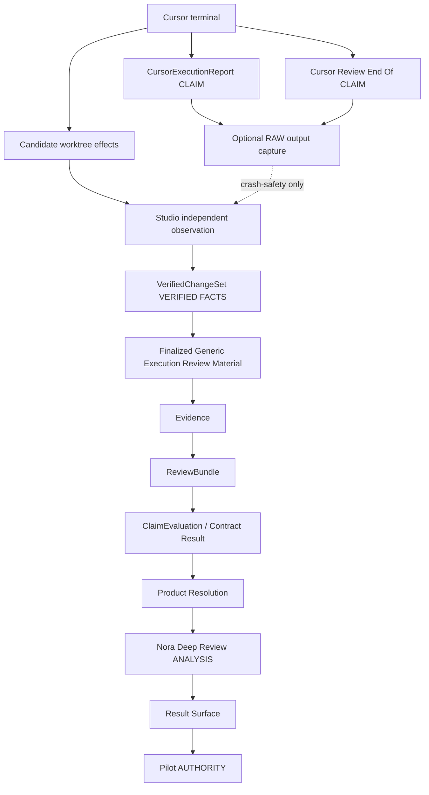
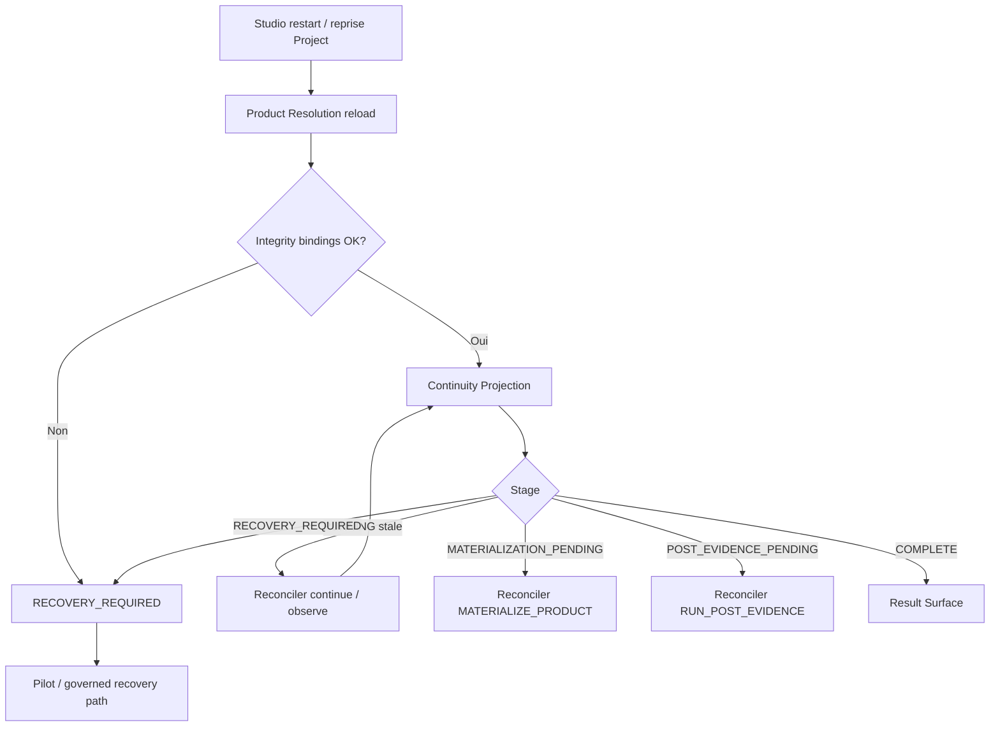
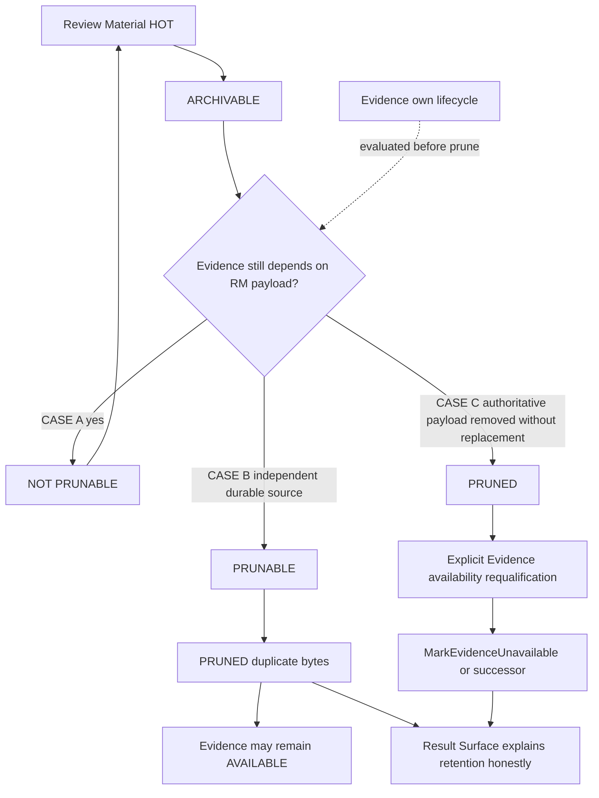

# SFIA Studio — Review Pack FULL
## GENERIC-EXECUTION-REVIEW-RESULT-ARCHITECTURE-01 — MICRO-CORRECTION / NORMALIZATION PASS

| Métadonnée | Valeur |
| --- | --- |
| **Timestamp** | 2026-09-29T11:43:52+0200 |
| **Repo** | https://github.com/mcleland147/sfia-workspace.git |
| **Branche** | `sfia-studio/generic-execution-review-result-architecture-01` |
| **HEAD** | `6f47f74dc9b515c4c79624b21772223ba02c76cd` |
| **origin/main** | `6f47f74dc9b515c4c79624b21772223ba02c76cd` |
| **Ahead / Behind** | 0 / 0 |
| **Nature** | MICRO-CORRECTION / NORMALIZATION PASS |
| **Input Critical Review handoff** | `ee423841f44609d7ec1918832cd5e54bc84f5102` |
| **Input verified** | **YES** (blob `2719125cd26a174cb63b2d69c3017603e03bfba6`) |
| **D-ER** | 01…15 **INCHANGÉES** sur le fond |
| **Roadmap** | **NO CHANGE** |
| **runtime v3** | **NON ADOPTED** |
| **READY FOR REAL** | **NO** |
| **Delivery slicing** | **TBD** |

---

## Git status

```
 M .tmp-sfia-review/chatgpt-review.md
 M projects/sfia-studio/convergence/sfia-studio-convergence-roadmap.md
?? projects/sfia-studio/convergence/sfia-studio-generic-execution-review-result-architecture.md
```

Staged: none. Dirty = chantier candidate (arch + roadmap tip Pass 0 + pack).

---

## MC-01 — Parity normalization

Contrat de lecture : une ligne = une valeur parmi FULL | PARTIAL | ABSENT | NOT_APPLICABLE.

### #17 full validation expectation

- **BEFORE Parity :** `ABSENT / PARTIAL`
- **AFTER Parity :** `PARTIAL`
- **Anchor :** « report fields partiels » / CURRENT « Faible / process »
- **Justification :** empreinte native partielle déjà présente (champs report) mais full validation non disciplinée → **PARTIAL** (pas ABSENT)

### #25 CursorExecutionReport

- **BEFORE Parity :** `FULL / PARTIAL`
- **AFTER Parity :** `PARTIAL`
- **Anchor :** `cursorExecutionReport` + Resolution CLAIM ; « Présent largement générique »
- **Justification :** structure générique vivante mais enrichissement sémantique encore incomplet → **PARTIAL** (pas FULL)

### #32 allowed claims

- **BEFORE Parity :** `ABSENT / PARTIAL`
- **AFTER Parity :** `PARTIAL`
- **Anchor :** « anti-claim discipline partielle »
- **Justification :** discipline partielle native / documentaire → **PARTIAL** (pas ABSENT)

### #33 forbidden / anti-claims

- **BEFORE Parity :** `ABSENT / PARTIAL`
- **AFTER Parity :** `PARTIAL`
- **Anchor :** capitalisations / docs ; « Faible natif »
- **Justification :** anti-claims présents en discipline documentaire, non systématiques runtime → **PARTIAL** (pas ABSENT)

### Quatre lignes complètes APRÈS correction

```
| 17 | full validation expectation | Attente full validation | Faible / process | report fields partiels | **PARTIAL** | Full validation non disciplinée / non systématique | Exigence contractuelle quand applicable | **HARVEST** / **COMPLETE** |
| 25 | CursorExecutionReport | Rapport machine process | Présent largement générique | `cursorExecutionReport` + Resolution CLAIM | **PARTIAL** | Structure générique présente ; enrichissement sémantique encore incomplet (≠ Evidence) | KEEP CLAIM + COMPLETE champs utiles | **KEEP** / **COMPLETE** |
| 32 | allowed claims | Claims autorisés process | Faible natif | anti-claim discipline partielle | **PARTIAL** | Sur-réclame / discipline non systématique | Allowed claims contractuels | **HARVEST** / **COMPLETE** |
| 33 | forbidden / anti-claims | Anti-claims process | Faible natif | capitalisations / docs | **PARTIAL** | Anti-claims non runtime systématiques | Anti-claims dans reporting + Surface | **HARVEST** / **COMPLETE** |
```

**Composite parity remaining = 0**

---

## MC-02 — Worker neutralization

### Implicit TARGET selections REMOVED

| Before | After |
| --- | --- |
| `Reconciler complet / worker` | `Reconciler complet + continuation autonome TBD (mécanisme OPEN DESIGN DETAIL)` |
| `Reconciler/worker autonome` | `Reconciler + mécanisme de continuation autonome à définir` |
| `Reconciler/worker ; ne pas normaliser « Recharger »` | `Reconciler + continuation autonome TBD ; ne pas normaliser « Recharger »` |
| D-ER-08 dette : `correction = worker/serveur ou continue…` (lisible comme menu cible) | `mécanisme anti-stall piloté par le Reconciler — OPEN DESIGN DETAIL (options ouvertes : worker vs continuation serveur vs autre — aucune sélection)` |

### CURRENT facts KEPT

(poll sans worker, aucun worker après exhaust, diagramme exhaust sans worker, etc.)

### OPEN options KEPT

§37 item 2 : worker vs continue serveur vs autre — owner Reconciler, mécanisme non sélectionné.

### Confirmed

- Reconciler owner = **YES**
- anti-stall mechanism selected = **NO**
- OPEN DESIGN DETAIL preserved = **YES**

### All `worker` occurrences after pass

```
L189: - une **UI de continuité** qui peut s’arrêter (poll) sans worker autonome.
L229: | Cause architecturale **haute confiance** : poll TrajectorySurface exhausté (≤ 8 `continue`) **sans worker autonome** après exhaust | **AUDIT INFERENCE** — **HIGH-CONFIDENCE ARCHITECTURAL CAUSE** |
L284:   S -->|exhaust sans worker| T[UI peut rester pending<br/>Pilot recharge]
L305: | TrajectorySurface | Poll RUNNING jusqu’à **8** continues — **pas de worker** après exhaust | **CURRENT IMPLEMENTED FACT** |
L378: - TrajectorySurface : boucle `for (i < 8)` tant que stage `RUNNING` — **aucun worker serveur** après exhaust du poll UI
L420: | S4 | UI poll ≤8 sans worker post-exhaust | CURRENT FACT | Progression peut stall → Pilot « Recharger » |
L508: **Dette :** poll UI 8 without worker = **non conforme** à la cible ; mécanisme anti-stall piloté par le Reconciler — implémentation **OPEN DESIGN DETAIL** (ex. options ouvertes : worker vs continuation serveur vs autre — **aucune sélection**).
L1261: 2. Mécanisme exact anti-stall (**worker** vs continue serveur vs autre) — principe D-ER-08 fixe l’owner, pas l’implémentation.
L1455: | `reconcileGovernedExecution` | Execute/continue deterministic | reconciler module | UI poll peut stall avant continue ultérieur | Owner progression bout-en-bout | **KEEP** / **COMPLETE** | D-ER-08 | No worker post UI poll | E3 |
```

---

## Sections modifiées (intégrales)

### D-ER-08 (extrait)

```markdown
### D-ER-08 — Reconciler owns progression déterministe

**Décision :** `reconcileGovernedExecution` (ou successeur) **possède** la progression post-accept Attempt → materialization → post-Evidence.
**UI :** projection + intent — **pas** owner.
**Dette :** poll UI 8 without worker = **non conforme** à la cible ; mécanisme anti-stall piloté par le Reconciler — implémentation **OPEN DESIGN DETAIL** (ex. options ouvertes : worker vs continuation serveur vs autre — **aucune sélection**).
```

### §15 — lignes #17/#25/#32/#33 (voir aussi matrice contextuelle)

La matrice §15 complète reste inchangée hors cells Parity/gap des 4 lignes. Extraits :

```
| 17 | full validation expectation | Attente full validation | Faible / process | report fields partiels | **PARTIAL** | Full validation non disciplinée / non systématique | Exigence contractuelle quand applicable | **HARVEST** / **COMPLETE** |
| 25 | CursorExecutionReport | Rapport machine process | Présent largement générique | `cursorExecutionReport` + Resolution CLAIM | **PARTIAL** | Structure générique présente ; enrichissement sémantique encore incomplet (≠ Evidence) | KEEP CLAIM + COMPLETE champs utiles | **KEEP** / **COMPLETE** |
| 32 | allowed claims | Claims autorisés process | Faible natif | anti-claim discipline partielle | **PARTIAL** | Sur-réclame / discipline non systématique | Allowed claims contractuels | **HARVEST** / **COMPLETE** |
| 33 | forbidden / anti-claims | Anti-claims process | Faible natif | capitalisations / docs | **PARTIAL** | Anti-claims non runtime systématiques | Anti-claims dans reporting + Surface | **HARVEST** / **COMPLETE** |
```

### §25.2

```markdown
### 25.2 CURRENT vs TARGET post-terminal

| Étape | CURRENT | TARGET |
| --- | --- | --- |
| Executor claims | Report (+ process REO externe) | Report + **Cursor Review End Of** CLAIM exigés |
| Verify | verifyWorkspaceFileEffects + policies | VerifiedChangeSet **avant** RM finalisé |
| Review Material | docs_write-named / Artifact-centric | Generic RM multi-`reviewItems[]` |
| Evidence/RB/CE | vivants | KEEP |
| Post-Evidence Nora | tools OFF | Deep Review read-only tools |
| Progression | Reconciler + UI poll | Reconciler complet + continuation autonome TBD (mécanisme OPEN DESIGN DETAIL) |
```

### §32 Ponts transitionnels (table)

```markdown
## 32. Ponts transitionnels

| Bridge | Rôle | Exit |
| --- | --- | --- |
| persist/ingest `docs_write*` | Compat Evidence path | Generic Review Material + ingest générique |
| policy `docs_write` dans verifier | Oracle actuel | Policies d’effet génériques + VerifiedChangeSet |
| UI « Recharger résultat produit » | Continue manuel | Reconciler + mécanisme de continuation autonome à définir |
| Legacy M3/M4 rematerialize docs_write | Recovery vieux EC | Sunset quand plus d’EC legacy |
| post_execution tools OFF | Safe analysis minimale | Deep Review read-only tools bornés |
| Naming paths `docs-write-artifact` | Storage actuel | Rename neutre sous Review Material |

**Règle (D-ER-13/14) :** chaque bridge a une **exit condition** ; pas de dual-stack permanent.
```

### Risques (snippet R2)

```markdown
| # | Guarantee / semantic dimension | External v2.6 proven behavior | CURRENT Studio native support | CURRENT source / implementation anchor | Parity | Gap / risk | TARGET native behavior | Disposition |
| --- | --- | --- | --- | --- | --- | --- | --- | --- |
| 1 | objective | Mission objective explicite dans le contrat externe | Présent | EC mission inputs / inspectionDisclosure | **FULL** | Drift si projection omet | Conserver comme WHAT autoritaire | **KEEP** |
| 2 | context | Contexte mission riche | Présent | EC context inputs | **FULL** | Compactage excessif | Conserver + lisible Pilot/Cursor | **KEEP** |
| 3 | cycle/profile qualification when applicable | Cycle / profil process qualifiés | Partiel (cycle bindings Product ; profil process ≠ runtime) | CycleInstance / EC bindings | **PARTIAL** | Confusion process vs Product cycle | Qualifier Product cycle sans importer process profile comme doctrine | **COMPLETE** |
| 4 | sources | Sources listées | Présent | EC source refs | **FULL** | Sources non grounded | Sources + grounding | **KEEP** / **COMPLETE** |
| 5 | source grounding | Grounding explicite | Présent (partiel selon missions) | mission semantic inputs | **PARTIAL** | Grounding faible → revue floue | Exiger grounding quand sources critiques | **COMPLETE** |
| 6 | repository identity | Repo cible identifié | Présent (Project repository binding) | Project / workspace binding | **FULL** | Multi-repo non traité | Repo Project unique par binding | **KEEP** |
| 7 | base / HEAD truth | Base/HEAD truth process | Partiel (worktree base SHA ; HEAD live variable) | gateway worktree prepare | **PARTIAL** | Confusion logical vs WT HEAD | Base SHA explicite + vérité observée Studio | **COMPLETE** |
| 8 | scope IN | Scope inclus explicite | Partiel | EC scope / files boundaries | **PARTIAL** | Scope flou → effets hors intention | Scope IN contractuel clair | **COMPLETE** |
| 9 | scope OUT | Scope exclu explicite | Partiel / souvent implicite | EC boundaries | **PARTIAL** | OUT silencieux | Scope OUT explicite quand pertinent | **COMPLETE** |
| 10 | files / path boundaries | Bornes chemins | Partiel (overlays / allowlists) | gateway overlays + verifier | **PARTIAL** | Overlay docs_write-centric | Bornes génériques effets/chemin | **GENERALIZE** |
| 11 | authorized technical effects | Effets autorisés process | Présent (allowlists / capabilities techniques) | EC surface + gateway | **PARTIAL** | Taxonomy Product encore branchée | Effects techniques only (≠ Product category) | **KEEP** / **COMPLETE** |
| 12 | forbidden effects | Interdits process | Partiel | stop / policy / allowlist | **PARTIAL** | Interdits non unifiés | Forbidden effects explicites + fail-closed | **COMPLETE** |
| 13 | expected outputs | EO process | Présent | EC expectedOutputs | **FULL** | EO = Artifact-only mental model | EO génériques (y compris non-fichier) | **COMPLETE** |
| 14 | acceptance criteria | Critères acceptation | Présent | EC acceptance | **FULL** | Critères trop docs-centric | Critères génériques ContractResult | **KEEP** / **COMPLETE** |
| 15 | validation plan | Plan validation | Présent | EC validationPlan input | **PARTIAL** | Plan non exécuté / non observé | Plan + observation Studio | **COMPLETE** |
| 16 | targeted validations | Validations ciblées | Partiel | report validationEffects / verifier | **PARTIAL** | Validations claim-only | Validations revendiquées + faits Studio | **COMPLETE** |
| 17 | full validation expectation | Attente full validation | Faible / process | report fields partiels | **PARTIAL** | Full validation non disciplinée / non systématique | Exigence contractuelle quand applicable | **HARVEST** / **COMPLETE** |
| 18 | authority | Authority process | Présent | HumanDecision / effective authority | **FULL** | — | KEEP authority Product | **KEEP** |
| 19 | Confirmation | Confirmation gates | Présent | Confirmation / inspection | **FULL** | — | KEEP | **KEEP** |
| 20 | reversibility | Reversibility qualifiée | Présent | EC reversibility | **PARTIAL** | Sous-exploité en Result Surface | Exposer honnêtement | **COMPLETE** |
| 21 | stop conditions | Stop conditions process | Partiel | EC / report blockers | **PARTIAL** | Stop non matérialisé en Result | Stop conditions contractuelles + surface | **COMPLETE** |
| 22 | Fake / Real qualification where applicable | Qualification Fake/Real process | Partiel (gateway REAL gates) | REAL launch gates / harness | **PARTIAL** | Confusion preuve | Fake/Real explicite hors READY inventé | **KEEP** / **COMPLETE** |
| 23 | Evidence requirements | Exigences Evidence process | Partiel | EC / Evidence domain | **PARTIAL** | Evidence trop Artifact-centric | Evidence requirements génériques | **COMPLETE** |
| 24 | report requirements | Exigences de rapport process | Partiel (string list `reportRequirements`) | contractMissionSemantics / projection | **PARTIAL** | N’exige pas encore systématiquement Review End Of | Exiger Report + Review End Of | **COMPLETE** |
| 25 | CursorExecutionReport | Rapport machine process | Présent largement générique | `cursorExecutionReport` + Resolution CLAIM | **PARTIAL** | Structure générique présente ; enrichissement sémantique encore incomplet (≠ Evidence) | KEEP CLAIM + COMPLETE champs utiles | **KEEP** / **COMPLETE** |
| 26 | Cursor Review End Of | Fin de revue exécuteur process | Absent comme CLAIM natif systématique | process externe historique | **ABSENT** | Studio pourrait « inventer » REO | Cursor produit REO CLAIM ; native binding Studio | **HARVEST** / **COMPLETE** |
| 27 | deviations | Écarts rapportés | Partiel dans report | report deviations | **PARTIAL** | Deviations ignorées en CE | Deviations claim + évaluation | **COMPLETE** |
| 28 | blockers | Blockers process | Partiel | report blockers | **PARTIAL** | Blockers non visibles Pilot | Blockers → Result Surface | **COMPLETE** |
| 29 | reservations | Réserves process | Partiel | report reservations / Memory | **PARTIAL** | Confusion Reservation Product | Reservations claim + Product reserves distincts | **COMPLETE** |
| 30 | Git proof when applicable | Preuve Git process | Partiel (Evidence git sources / GCEC) | Evidence git / verifier | **PARTIAL** | Git proof confondu avec PASS Product | Git facts Studio + CE rules | **HARVEST** / **COMPLETE** |
| 31 | final Cursor verdict | Verdict final exécuteur | Partiel (report status) | CursorExecutionReport status | **PARTIAL** | Verdict Cursor ≠ Product PASS | Verdict CLAIM explicite | **COMPLETE** |
| 32 | allowed claims | Claims autorisés process | Faible natif | anti-claim discipline partielle | **PARTIAL** | Sur-réclame / discipline non systématique | Allowed claims contractuels | **HARVEST** / **COMPLETE** |
| 33 | forbidden / anti-claims | Anti-claims process | Faible natif | capitalisations / docs | **PARTIAL** | Anti-claims non runtime systématiques | Anti-claims dans reporting + Surface | **HARVEST** / **COMPLETE** |
| 34 | Review Pack semantics useful to native review | Pack revue riche (garanties review) | Partiel (Review Material docs_write ; Resolution) | persist docs_write / Resolution | **PARTIAL** | Artifact-centric | **HARVEST** garanties utiles → Generic RM + REO CLAIM | **HARVEST** |
| 35 | external Review Handoff transport | Branche `sfia/review-handoff` / `.tmp-sfia-review` / copy-paste | **Ne doit pas** être runtime Product | process v2.6 publisher | **NOT_APPLICABLE** (à ne pas importer) | Tentation d’importer le bus Git | **DO NOT IMPORT INTO STUDIO RUNTIME** | **N/A** |

**Règle éditoriale :**

- **HARVEST SEMANTICS** ≠ **IMPORT EXTERNAL TRANSPORT**
- Lignes 34 = **HARVEST** ; ligne 35 = **DO NOT IMPORT**
- Ne pas modifier le template v2.6 dans ce cycle.

---

## 16. Cursor Generalist / HOW

### 16.1 Rôle

**CURRENT IMPLEMENTED FACT** + **TARGET KEEP** :

Cursor, via surface generalist, choisit le **HOW** (outils, séquence, édition) **dans** le contrat autorisé (allowlist, worktree, authority).

### 16.2 Non-rôles

| Non-rôle | Raison |
| --- | --- |
| Owner d’autorité Product | Pilot / HD / Confirmation |
| Producer d’Evidence automatique | Report = CLAIM |
| Catégorie de tâche Product | Surface ≠ taxonomy |
| Guarantor de PASS métier | ContractResult / Evidence |

### 16.3 Overlay d’enforcement

Le gateway applique des overlays techniques (chemins scellés, worktree, caps) **sans** remplacer la mission EC.

---

## 17. Isolated worktree

### 17.1 Décision

**D-ER-02 / CURRENT KEEP** : isolated detached git worktree.

### 17.2 Propriétés

| Propriété | Valeur cible/current |
| --- | --- |
| Isolation | Effets hors managed root nominal |
| Detached | Base SHA / head de préparation |
| Oracle | Observation filesystem + policies |
| Cleanup | Retention/GC — **OPEN DESIGN DETAIL** partiel |

### 17.3 Anti-claims worktree

Worktree isolé **≠** preuve Git remote · **≠** commit/push autorisé · **≠** merge.

---

## 18. CursorExecutionReport — modèle de claim

### 18.1 Nature

**CURRENT + TARGET (D-ER-03) :** **CLAIM**.

### 18.2 Contenu typique

- statut / summary / assertions exécuteur
- refs Attempt / process
- éventuelles listes d’effets **revendiqués** (non faits)

### 18.3 Discipline

| Action | Autorisé ? |
| --- | --- |
| Afficher comme Claim sur Result Surface | Oui |
| Convertir auto en Evidence | **Non** |
| Satisfaire ER sans verifier | **Non** |
| Overrider NOT_PROVEN | **Non** |

---

## 19. Studio VerifiedChangeSet

### 19.1 Définition cible

**TARGET (D-ER-06) :** objet/sémantique Studio décrivant les **effets vérifiés** dans le worktree (et bornes associées), indépendamment de la narration Cursor.

### 19.2 Harvest CURRENT

`verifyWorkspaceFileEffects` :

1. observe le worktree ;
2. applique policies (dont policy `docs_write` séparée — **dette**) ;
3. produit un résultat de vérification consommable par completion / Evidence.

### 19.3 Cible

| Aspect | Cible |
| --- | --- |
| Nom/sémantique Product | VerifiedChangeSet |
| Policies | génériques par **effet technique**, pas par taxonomie Product |
| Liaison | Review Material + Evidence |
| Fail-closed | unknown / hors allowlist → reject ou NOT_PROVEN selon couche |

---

## 20. Generic Execution Review Material

### 20.1 Définition cible

**TARGET (D-ER-04) :** payload opérationnel **temporairement durable** permettant à Studio / Nora / Pilote de **revoir** le résultat d’exécution — **sans** nommage `docs_write`, **sans** modèle Artifact-centric.

Ce n’est **pas** : Product Truth principal ; HumanDecision ; Evidence automatique ; Product Result automatique ; Git commit ; second workflow.

### 20.2 Modèle conceptuel (non schema)

**OPEN DESIGN DETAIL — FINAL SCHEMA NOT ADOPTED**

```text
ExecutionReviewMaterial
  bindings
    - projectId / cycleInstanceId / executionContractId / attemptId
    - repositoryRef / baseSha
  executorClaims
    - cursorExecutionReportRef
    - cursorReviewEndOfRef
  verifiedEffects
    - verifiedChangeSetRef
    - gitFacts[]
    - validationFacts[]
  reviewItems[]   # générique — Artifact n’est qu’un type possible
    - file | diff | validation output | test output | log
    - artifact | git result | external result | other reviewable
  blockers[]
  reservations[]
  completeness    # FULL | PARTIAL
  retention       # HOT → ARCHIVABLE → PRUNABLE → PRUNED
```

**Règle dure :** Review Material peut exister avec **0 Artifact** et **0 changed file** si l’exécution produit d’autres effets gouvernés / reviewables (analyse read-only, commit, push, PR, merge, validation, action externe, …).

### 20.3 Ordre conceptuel vs capture raw

| Concept | Rôle |
| --- | --- |
| **RAW EXECUTION OUTPUT CAPTURE** | Stockage technique éventuel **précoce** des sorties Cursor (crash-safety) — **OPEN DESIGN DETAIL** |
| **FINALIZED EXECUTION REVIEW MATERIAL** | Composition reviewable **après** observation Studio / VerifiedChangeSet |

### 20.4 Disposition CURRENT

| Asset | Disposition |
| --- | --- |
| `persistDocsWriteArtifactReviewMaterial` | **HARVEST → GENERALIZE** (sortir du mono-Artifact / docs_write) |
| paths `docs-write-artifact` | **TRANSITIONAL** puis retire naming Product |

---

## 21. Native Review End Of

### 21.1 Définition (producteur + épistémologie)

**TARGET (D-ER-05) :**

| Aspect | Décision |
| --- | --- |
| **Producteur** | **Cursor / EXECUTOR** — à la fin de l’exécution Cursor |
| **Statut** | **CLAIM** (avec `CursorExecutionReport`) |
| **Native** | binding / stockage / consommation **Studio** |
| **≠ Native** | Studio **ne produit pas** le contenu Review End Of |

```text
Cursor execution
  ├── CursorExecutionReport     [CLAIM]
  ├── Cursor Review End Of      [CLAIM]
  └── candidate worktree effects

Studio independent verification
  → VerifiedChangeSet           [VERIFIED FACTS]
  → Evidence / …
Nora Review                     [ANALYSIS / RECOMMENDATION]
HumanDecision                   [AUTHORITY]
```

### 21.2 Contenu sémantique cible (CLAIM)

Selon `reportRequirements` applicables : verdict Cursor ; timestamp ; repository / base ; objectif ; scope traité ; work performed ; files/effects ; validations ; full validation si applicable ; Git proof si applicable ; deviations ; blockers ; reservations ; stop conditions ; claims ; points nécessitant revue.

### 21.3 Ce que ce n’est pas

| Non-définition | Raison |
| --- | --- |
| Studio Verified Facts | Facts = oracle Studio (VerifiedChangeSet / Evidence) |
| Evidence / ClaimEvaluation / Nora Analysis | Couches distinctes (D-ER-11) |
| Export markdown vers ChatGPT externe | Transport process ≠ architecture Product |
| Duplicate d’Evidence | Review End Of = CLAIM ; Review Material ≠ Evidence |
| Producteur Studio du contenu | Contredit D-ER-05 |

### 21.4 Harvest autorisé / transport interdit

- **HARVEST :** discipline sémantique des revues externes historiques (séparation claim/fact, fail-closed, anti-claims, richesse Review End Of).
- **DO NOT IMPORT :** canal `.tmp-sfia-review` / branche `sfia/review-handoff` / copy-paste ChatGPT↔Cursor comme bus runtime Product.

**OPEN DESIGN DETAIL :** packaging physique Report ↔ Review End Of.

---

## 22. Articulation Evidence / ReviewBundle / ClaimEvaluation

### 22.1 Rôles

| Objet | Rôle | Qualification |
| --- | --- | --- |
| Evidence | Fait durable traçable | CURRENT KEEP |
| ReviewBundle | Ensemble d’Evidence pour revue / freeze | CURRENT KEEP |
| ClaimEvaluation (ContractResult) | Qualification EC vs Evidence | CURRENT KEEP / GENERALIZE criteria |
| VerifiedChangeSet | Oracle d’effets Studio en amont | TARGET (+ harvest verifier) |
| CursorExecutionReport | Claim exécuteur | CURRENT KEEP |
| Cursor Review End Of | Claim exécuteur | TARGET COMPLETE (native binding) |
| Review Material | Payload review (post-verify finalized) | TARGET GENERALIZE |

### 22.2 Ordre épistémique cible

```text
Claim (CursorExecutionReport + Cursor Review End Of)
  → Studio observation
  → VerifiedChangeSet [VERIFIED FACTS]
  → Finalized Execution Review Material
  → Evidence(s)
  → ReviewBundle (freeze)
  → ClaimEvaluation
  → Nora Analysis
  → HumanDecision / Pilot
```

### 22.3 NOT_PROVEN

**CURRENT + TARGET :** insuffisance / ambiguïté / no applicable rule → **NOT_PROVEN** (soft) plutôt que PASS inventé.
**REAL OBSERVATION NoteLite :** NOT_PROVEN préservé quand Evidence insuffisante.

---

## 23. Product Resolution

### 23.1 CURRENT

**CURRENT IMPLEMENTED FACT :** `resolveProductExecutionContext` compose un `ProductExecutionContext` typé (EC, Attempt, cursorReport CLAIM, artifact, Evidence, RB, CE, postEvidence, …). Fail-closed sur mismatch de lineage.
**Limitation :** modèle encore **trop Artifact-centric** / docs_write-named pour le chargement review.

### 23.2 TARGET (D-ER-07)

Un seul chemin de résolution générique :

- charge **Generic Execution Review Material** (executorClaims + verifiedEffects + reviewItems[]) — **pas** mono-Artifact ;
- expose Claim (`Report` + **Review End Of**) / Fact / Analysis / Authority distincts ;
- sert Continuity, Result Surface, Nora tools read-only, Reconciler ;
- couvre missions **sans** Artifact fichier.

### 23.3 Dette

Artifact load via `loadDocsWriteArtifactReviewMaterial` = **TRANSITIONAL DEBT** explicite (bridge, pas modèle cible).

---

## 24. Continuity / Reconciler

### 24.1 Continuity Projection

**CURRENT IMPLEMENTED FACT** — stages :

`PRE_EXECUTION` → `ATTEMPT_ACCEPTED` → `RUNNING` → `PRODUCT_MATERIALIZATION_PENDING` → `POST_EVIDENCE_PENDING` → `POST_EVIDENCE_COMPLETE`
(+ `RECOVERY_REQUIRED` via integrity / bindings codes)

Projection **READ-ONLY**, dérivée — **pas** un state machine persisté parallèle.

### 24.2 Reconciler

**CURRENT :** `reconcileGovernedExecution` exécute les next deterministic actions selon intent `execute` | `continue`.
**TARGET (D-ER-08) :** owner unique de la progression déterministe jusqu’au post-Evidence nominal (ou RECOVERY_REQUIRED).

### 24.3 UI

TrajectorySurface applique le résultat Reconciler ; poll borné **8** continues pendant `RUNNING`.
**Écart cible :** stall possible — voir NoteLite gap.

---

## 25. Progression nominale post-terminale

### 25.1 Diagramme — TARGET NOMINAL FLOW


```mermaid
flowchart TD
  A[Cursor terminal] --> B[CursorExecutionReport CLAIM]
  A --> C[Cursor Review End Of CLAIM]
  A --> D[Candidate worktree effects]
  B --> E[Optional RAW output capture]
  C --> E
  D --> F[Studio independent observation]
  E -.->|crash-safety only| F
  F --> G[VerifiedChangeSet VERIFIED FACTS]
  G --> H[Finalized Generic Execution Review Material]
  H --> I[Evidence]
  I --> J[ReviewBundle]
  J --> K[ClaimEvaluation / Contract Result]
  K --> L[Product Resolution]
  L --> M[Nora Deep Review ANALYSIS]
  M --> N[Result Surface]
  N --> O[Pilot AUTHORITY]
```

### 25.2 CURRENT vs TARGET post-terminal

| Étape | CURRENT | TARGET |
| --- | --- | --- |
| Executor claims | Report (+ process REO externe) | Report + **Cursor Review End Of** CLAIM exigés |
| Verify | verifyWorkspaceFileEffects + policies | VerifiedChangeSet **avant** RM finalisé |
| Review Material | docs_write-named / Artifact-centric | Generic RM multi-`reviewItems[]` |
| Evidence/RB/CE | vivants | KEEP |
| Post-Evidence Nora | tools OFF | Deep Review read-only tools |
| Progression | Reconciler + UI poll | Reconciler complet + continuation autonome TBD (mécanisme OPEN DESIGN DETAIL) |

---

## 26. Nora Deep Review

### 26.1 CURRENT

**CURRENT IMPLEMENTED FACT :** shared cognitive core ; `post_execution` désactive tools / MemoryB / hosted search / product tools. Analyse contract-first possible sans tools.

### 26.2 TARGET (D-ER-09)

| Capacité | Autorisé |
| --- | --- |
| Lire Evidence / RB / CE / Review Material / VerifiedChangeSet | Oui (borné) |
| Lire artifact logique autorisé | Oui (borné) |
| Muter Project / Execute / Git | **Non** |
| Hosted search / MemoryB | **Non** (sauf décision future distincte) |
| Remplacer Pilot authority | **Non** |

### 26.3 Sortie Nora

Analysis only → alimente Result Surface ; **≠** Authority.

---

## 27. Result Surface / parcours Pilot

### 27.1 Exigence

**TARGET (D-ER-10) :** always explain.

### 27.2 Contenu minimal expliqué

- Claim exécuteur (et limites)
- Facts vérifiés / Evidence ids
- ContractResult / NOT_PROVEN reasons
- Analysis Nora (si présente)
- Authority / next deterministic action / recovery
- CTA clairs (continue / correct / stop / recharge seulement si dette UI encore présente)

### 27.3 Journey Pilot cible

```text
Inspect EC → Confirm → Execute → Follow continuity → Read Result Surface
  → Accept / Request correction / Stop / Replan
```

Correction = **gouvernée** (nouveau HD/EC selon règles) — NoteLite : correction **non re-testée**.

---

## 28. Restart / recovery

### 28.1 Diagramme — RESTART/RECOVERY FLOW


```mermaid
flowchart TD
  A[Studio restart / reprise Project] --> B[Product Resolution reload]
  B --> C{Integrity bindings OK?}
  C -->|Non| D[RECOVERY_REQUIRED]
  D --> E[Pilot / governed recovery path]
  C -->|Oui| F[Continuity Projection]
  F --> G{Stage}
  G -->|RUNNING stale| H[Reconciler continue / observe]
  G -->|MATERIALIZATION_PENDING| I[Reconciler MATERIALIZE_PRODUCT]
  G -->|POST_EVIDENCE_PENDING| J[Reconciler RUN_POST_EVIDENCE]
  G -->|COMPLETE| K[Result Surface]
  G -->|RECOVERY_REQUIRED| D
  H --> F
```

### 28.2 CURRENT anchors

- Integrity codes → `RECOVERY_REQUIRED` (**CURRENT FACT**)
- Recovery continuity paths préservés (NELC / continuity macros)
- Restart ne doit **pas** relaunch Cursor silencieusement (discipline docs_write REAL historique)

### 28.3 TARGET

Reconciler + Resolution suffisent à reprendre sans CTA magique ; UI recharge = **dette** si encore nécessaire.

---

## 29. Retention / GC

### 29.1 Diagramme — RETENTION FLOW


```mermaid
flowchart TD
  RM1[Review Material HOT] --> RM2[ARCHIVABLE]
  RM2 --> RM3{Evidence still depends on RM payload?}
  RM3 -->|CASE A yes| RM4[NOT PRUNABLE]
  RM4 --> RM1
  RM3 -->|CASE B independent durable source| RM5[PRUNABLE]
  RM5 --> RM6[PRUNED duplicate bytes]
  RM6 --> EVOK[Evidence may remain AVAILABLE]
  RM3 -->|CASE C authoritative payload removed without replacement| RM7[PRUNED]
  RM7 --> EVREQ[Explicit Evidence availability requalification]
  EVREQ --> MUE[MarkEvidenceUnavailable or successor]
  EV[Evidence own lifecycle] -.->|evaluated before prune| RM3
  RM6 --> SURF[Result Surface explains retention honestly]
  MUE --> SURF
```

### 29.2 CURRENT

Evidence : `retentionClass`, availability, `MarkEvidenceUnavailable`.
Review Material générique lifecycle : **pas encore** premier-class séparé.

### 29.3 TARGET (D-ER-12)

| Objet | Lifecycle |
| --- | --- |
| Review Material | HOT → ARCHIVABLE → PRUNABLE → PRUNED |
| Evidence | propre `status` / `availability` / `provenance` / `retentionClass` |

**Invariant :** `PRUNE REVIEW MATERIAL ≠ AUTOMATICALLY MarkEvidenceUnavailable`.

TTL / scheduler / GC implementation = **OPEN DESIGN DETAIL**.

---

## 30. Chemins logiques vs physiques

| Couche | Exemple NoteLite / pattern | Rôle |
| --- | --- | --- |
| **Logical target** | `projects/notelite/01-cadrage/...` | Autorité Product / EC / Pilot |
| **Physical storage** | `.sfia-exec/.../docs-write-artifact/...` | Runtime storage / review bytes |
| **Worktree path** | prepared WT + sealed absolute | Enforcement Cursor |

**Règles :**

- EC / ExpectedOutputs raisonnent en **logique repo-relative** ;
- instructions Cursor peuvent recevoir absolu scellé sous WT ;
- Review Material doit **relier** logique ↔ physique sans exposer un faux « Product path » `.sfia-exec` comme cible métier ;
- naming `docs-write-artifact` = **TRANSITIONAL**.

---

## 31. Retirement des taxonomies spécialisées

### 31.1 Objet de retirement (Product model)

Exemples à **RETIRE FROM PRODUCT MODEL** :

- `docs_write`
- `code_write`
- `read`
- `read_only`
- toute taxonomie de tâche Product homologue

### 31.2 Ce qui n’est pas retiré automatiquement

| Asset technique | Disposition typique |
| --- | --- |
| Verifier filesystem | KEEP / GENERALIZE |
| Worktree isolation | KEEP |
| Git lifecycle evidence sources | KEEP / HARVEST comme effects |
| Allowlists / RO enforcement | KEEP |
| ContractResult engine | KEEP / GENERALIZE rules |

### 31.3 Interdiction de renommage trompeur

**Ne pas** créer des catégories Product :

- `generic_read`
- `generic_write`
- `generic_code`

La généricité est le **modèle** (un EC generalist), pas un nouvel enum.

---

## 32. Ponts transitionnels

| Bridge | Rôle | Exit |
| --- | --- | --- |
| persist/ingest `docs_write*` | Compat Evidence path | Generic Review Material + ingest générique |
| policy `docs_write` dans verifier | Oracle actuel | Policies d’effet génériques + VerifiedChangeSet |
| UI « Recharger résultat produit » | Continue manuel | Reconciler + mécanisme de continuation autonome à définir |
| Legacy M3/M4 rematerialize docs_write | Recovery vieux EC | Sunset quand plus d’EC legacy |
| post_execution tools OFF | Safe analysis minimale | Deep Review read-only tools bornés |
| Naming paths `docs-write-artifact` | Storage actuel | Rename neutre sous Review Material |

**Règle (D-ER-13/14) :** chaque bridge a une **exit condition** ; pas de dual-stack permanent.

---

## 33. Anti-architecture

Pratiques **rejetées** (TARGET + discipline CURRENT) :

1. Catalogue Product de tâches (`docs_write` et homologues) comme architecture durable.
2. Catégories Product `generic_read|write|code`.
3. Report → Evidence automatique.
4. Second moteur Resolution / ContractResult / Execution « parallèle ».
5. UI owner du workflow (sequence locale Select→Start→Complete→Materialize).
6. Transport externe de revue comme cœur Product.
7. PASS sur narration / resultRef seul / Evidence available seul sans critères.
8. Big bang rewrite sans bridges à exit.
9. Présenter TARGET comme IMPLEMENTED.
10. Inventer un delivery plan N-lots dans ce document.
11. runtime v3 smuggled comme adopté.
12. READY FOR REAL implicite.

---

## 34. Frontière future de promotion Git

| Couche | État |
| --- | --- |
| Ce document | **DOCUMENTARY CANDIDATE PENDING GIT INTEGRATION** |
| Autorité commit/push/PR | **Distinct Morris GO** après revue |
| Promotion doctrine / Build Doctrine / C1 | **NON** autorisée ici |
| Promotion runtime v3 | **NON ADOPTED** — hors frontière |
| Preuve REAL cible générique | **FUTURE PROOF** — GO distinct ; READY FOR REAL = NO aujourd’hui |

---

## 35. Stratégie de migration

**TARGET (D-ER-13/14)** — séquence logique (≠ delivery lots) :

1. **Freeze sémantique** : EC generalist + Claim/Fact/Analysis/Authority (déjà largement ancré).
2. **Generalize Review Material** : harvest persist docs_write → API neutre.
3. **Introduce VerifiedChangeSet** sémantique au-dessus du verifier.
4. **Unify Product Resolution** load path.
5. **Harden Reconciler progression** (éliminer stall poll-only).
6. **Enable Nora Deep Review read-only tools**.
7. **Result Surface always-explain** parity.
8. **Retire Product taxonomies** du prepare/UI/naming nominal.
9. **Retention HOT→PRUNED** Review Material (distinct Evidence lifecycle).
10. **Exit proofs** (section 38) avant claims de complétude.

**DELIVERY SLICING** de ces étapes = **TBD** (D-ER-15).

---

## 36. Risques / réserves

| ID | Risque | Mitigation |
| --- | --- | --- |
| R1 | Dual-stack prolongé (spécialisé + générique) | Exit conditions obligatoires ; D-ER-14 |
| R2 | Stall UI post-REAL (NoteLite-class) | Reconciler + continuation autonome TBD ; ne pas normaliser « Recharger » |
| R3 | Confusion Claim/Fact | D-ER-11 + Result Surface |
| R4 | Sur-claim REAL | Anti-claims ; READY FOR REAL=NO |
| R5 | Renommage `generic_*` Product | Interdiction explicite |
| R6 | Deep Review tools trop larges | Allowlist read-only stricte |
| R7 | GC agressif casse reprise | Tombstones + availability honesty |
| R8 | Delivery plan inventé | D-ER-15 TBD |
| R9 | runtime v3 confusion | Bannière NON ADOPTED |
| R10 | Correction gouvernée non re-testée (NoteLite) | Ne pas clore cycle sur pause |
```

### Open design detail #2 (kept OPEN)

```
2. Mécanisme exact anti-stall (**worker** vs continue serveur vs autre) — principe D-ER-08 fixe l’owner, pas l’implémentation.
```

---

## Unified diff — micro-passe uniquement

```diff
--- a/projects/sfia-studio/convergence/sfia-studio-generic-execution-review-result-architecture.md
+++ b/projects/sfia-studio/convergence/sfia-studio-generic-execution-review-result-architecture.md
@@ -505,7 +505,7 @@

 **Décision :** `reconcileGovernedExecution` (ou successeur) **possède** la progression post-accept Attempt → materialization → post-Evidence.
 **UI :** projection + intent — **pas** owner.
-**Dette :** poll UI 8 without worker = **non conforme** à la cible ; correction = worker/serveur ou continue autonome bornée — **OPEN DESIGN DETAIL** sur le mécanisme exact.
+**Dette :** poll UI 8 without worker = **non conforme** à la cible ; mécanisme anti-stall piloté par le Reconciler — implémentation **OPEN DESIGN DETAIL** (ex. options ouvertes : worker vs continuation serveur vs autre — **aucune sélection**).

 ### D-ER-09 — Nora Deep Review avec outils read-only bornés

@@ -664,7 +664,7 @@
 | 14 | acceptance criteria | Critères acceptation | Présent | EC acceptance | **FULL** | Critères trop docs-centric | Critères génériques ContractResult | **KEEP** / **COMPLETE** |
 | 15 | validation plan | Plan validation | Présent | EC validationPlan input | **PARTIAL** | Plan non exécuté / non observé | Plan + observation Studio | **COMPLETE** |
 | 16 | targeted validations | Validations ciblées | Partiel | report validationEffects / verifier | **PARTIAL** | Validations claim-only | Validations revendiquées + faits Studio | **COMPLETE** |
-| 17 | full validation expectation | Attente full validation | Faible / process | report fields partiels | **ABSENT** / **PARTIAL** | Full validation non disciplinada | Exigence contractuelle quand applicable | **HARVEST** / **COMPLETE** |
+| 17 | full validation expectation | Attente full validation | Faible / process | report fields partiels | **PARTIAL** | Full validation non disciplinée / non systématique | Exigence contractuelle quand applicable | **HARVEST** / **COMPLETE** |
 | 18 | authority | Authority process | Présent | HumanDecision / effective authority | **FULL** | — | KEEP authority Product | **KEEP** |
 | 19 | Confirmation | Confirmation gates | Présent | Confirmation / inspection | **FULL** | — | KEEP | **KEEP** |
 | 20 | reversibility | Reversibility qualifiée | Présent | EC reversibility | **PARTIAL** | Sous-exploité en Result Surface | Exposer honnêtement | **COMPLETE** |
@@ -672,15 +672,15 @@
 | 22 | Fake / Real qualification where applicable | Qualification Fake/Real process | Partiel (gateway REAL gates) | REAL launch gates / harness | **PARTIAL** | Confusion preuve | Fake/Real explicite hors READY inventé | **KEEP** / **COMPLETE** |
 | 23 | Evidence requirements | Exigences Evidence process | Partiel | EC / Evidence domain | **PARTIAL** | Evidence trop Artifact-centric | Evidence requirements génériques | **COMPLETE** |
 | 24 | report requirements | Exigences de rapport process | Partiel (string list `reportRequirements`) | contractMissionSemantics / projection | **PARTIAL** | N’exige pas encore systématiquement Review End Of | Exiger Report + Review End Of | **COMPLETE** |
-| 25 | CursorExecutionReport | Rapport machine process | Présent largement générique | `cursorExecutionReport` + Resolution CLAIM | **FULL** / **PARTIAL** enrichissement | Enrichir ≠ Evidence | KEEP CLAIM + COMPLETE champs utiles | **KEEP** / **COMPLETE** |
+| 25 | CursorExecutionReport | Rapport machine process | Présent largement générique | `cursorExecutionReport` + Resolution CLAIM | **PARTIAL** | Structure générique présente ; enrichissement sémantique encore incomplet (≠ Evidence) | KEEP CLAIM + COMPLETE champs utiles | **KEEP** / **COMPLETE** |
 | 26 | Cursor Review End Of | Fin de revue exécuteur process | Absent comme CLAIM natif systématique | process externe historique | **ABSENT** | Studio pourrait « inventer » REO | Cursor produit REO CLAIM ; native binding Studio | **HARVEST** / **COMPLETE** |
 | 27 | deviations | Écarts rapportés | Partiel dans report | report deviations | **PARTIAL** | Deviations ignorées en CE | Deviations claim + évaluation | **COMPLETE** |
 | 28 | blockers | Blockers process | Partiel | report blockers | **PARTIAL** | Blockers non visibles Pilot | Blockers → Result Surface | **COMPLETE** |
 | 29 | reservations | Réserves process | Partiel | report reservations / Memory | **PARTIAL** | Confusion Reservation Product | Reservations claim + Product reserves distincts | **COMPLETE** |
 | 30 | Git proof when applicable | Preuve Git process | Partiel (Evidence git sources / GCEC) | Evidence git / verifier | **PARTIAL** | Git proof confondu avec PASS Product | Git facts Studio + CE rules | **HARVEST** / **COMPLETE** |
 | 31 | final Cursor verdict | Verdict final exécuteur | Partiel (report status) | CursorExecutionReport status | **PARTIAL** | Verdict Cursor ≠ Product PASS | Verdict CLAIM explicite | **COMPLETE** |
-| 32 | allowed claims | Claims autorisés process | Faible natif | anti-claim discipline partielle | **ABSENT** / **PARTIAL** | Sur-réclame | Allowed claims contractuels | **HARVEST** / **COMPLETE** |
-| 33 | forbidden / anti-claims | Anti-claims process | Faible natif | capitalisations / docs | **ABSENT** / **PARTIAL** | Anti-claims non runtime | Anti-claims dans reporting + Surface | **HARVEST** / **COMPLETE** |
+| 32 | allowed claims | Claims autorisés process | Faible natif | anti-claim discipline partielle | **PARTIAL** | Sur-réclame / discipline non systématique | Allowed claims contractuels | **HARVEST** / **COMPLETE** |
+| 33 | forbidden / anti-claims | Anti-claims process | Faible natif | capitalisations / docs | **PARTIAL** | Anti-claims non runtime systématiques | Anti-claims dans reporting + Surface | **HARVEST** / **COMPLETE** |
 | 34 | Review Pack semantics useful to native review | Pack revue riche (garanties review) | Partiel (Review Material docs_write ; Resolution) | persist docs_write / Resolution | **PARTIAL** | Artifact-centric | **HARVEST** garanties utiles → Generic RM + REO CLAIM | **HARVEST** |
 | 35 | external Review Handoff transport | Branche `sfia/review-handoff` / `.tmp-sfia-review` / copy-paste | **Ne doit pas** être runtime Product | process v2.6 publisher | **NOT_APPLICABLE** (à ne pas importer) | Tentation d’importer le bus Git | **DO NOT IMPORT INTO STUDIO RUNTIME** | **N/A** |

@@ -997,7 +997,7 @@
 | Review Material | docs_write-named / Artifact-centric | Generic RM multi-`reviewItems[]` |
 | Evidence/RB/CE | vivants | KEEP |
 | Post-Evidence Nora | tools OFF | Deep Review read-only tools |
-| Progression | Reconciler + UI poll | Reconciler complet / worker |
+| Progression | Reconciler + UI poll | Reconciler complet + continuation autonome TBD (mécanisme OPEN DESIGN DETAIL) |

 ---

@@ -1177,7 +1177,7 @@
 | --- | --- | --- |
 | persist/ingest `docs_write*` | Compat Evidence path | Generic Review Material + ingest générique |
 | policy `docs_write` dans verifier | Oracle actuel | Policies d’effet génériques + VerifiedChangeSet |
-| UI « Recharger résultat produit » | Continue manuel | Reconciler/worker autonome |
+| UI « Recharger résultat produit » | Continue manuel | Reconciler + mécanisme de continuation autonome à définir |
 | Legacy M3/M4 rematerialize docs_write | Recovery vieux EC | Sunset quand plus d’EC legacy |
 | post_execution tools OFF | Safe analysis minimale | Deep Review read-only tools bornés |
 | Naming paths `docs-write-artifact` | Storage actuel | Rename neutre sous Review Material |
@@ -1241,7 +1241,7 @@
 | ID | Risque | Mitigation |
 | --- | --- | --- |
 | R1 | Dual-stack prolongé (spécialisé + générique) | Exit conditions obligatoires ; D-ER-14 |
-| R2 | Stall UI post-REAL (NoteLite-class) | Reconciler/worker ; ne pas normaliser « Recharger » |
+| R2 | Stall UI post-REAL (NoteLite-class) | Reconciler + continuation autonome TBD ; ne pas normaliser « Recharger » |
 | R3 | Confusion Claim/Fact | D-ER-11 + Result Surface |
 | R4 | Sur-claim REAL | Anti-claims ; READY FOR REAL=NO |
 | R5 | Renommage `generic_*` Product | Interdiction explicite |
```

---

## Recherche globale résultats

| Recherche | Résultat |
| --- | --- |
| `FULL / PARTIAL` / `**FULL** / **PARTIAL**` as Parity | 0 — ['(none)'] |
| `ABSENT / PARTIAL` as Parity | 0 — ['(none)'] |
| `Reconciler complet / worker` / `Reconciler/worker*` | 0 — ['(none)'] |

---

## Validations M-01…M-32

| ID | Result |
| --- | --- |
| M-01 Git Truth | **PASS** |
| M-02 Only arch project file modified this pass | **PASS** |
| M-03 Roadmap NO CHANGE | **PASS** |
| M-04 #17/#25/#32/#33 single Parity | **PASS** |
| M-05 Domain FULL/PARTIAL/ABSENT/NOT_APPLICABLE | **PASS** |
| M-06 No FULL/PARTIAL composite | **PASS** |
| M-07 No ABSENT/PARTIAL composite | **PASS** |
| M-08 #17 justified | **PASS** (PARTIAL) |
| M-09 #25 justified | **PASS** (PARTIAL) |
| M-10 #32 justified | **PASS** (PARTIAL) |
| M-11 #33 justified | **PASS** (PARTIAL) |
| M-12 No TARGET worker selection | **PASS** |
| M-13 worker kept = CURRENT or OPEN only | **PASS** |
| M-14 D-ER-08 Reconciler owner / mechanism OPEN | **PASS** |
| M-15 No anti-stall solution newly chosen | **PASS** |
| M-16 No D-ER fund change | **PASS** |
| M-17 No D-ER added | **PASS** |
| M-18 Delivery slicing TBD | **PASS** |
| M-19 runtime v3 NON ADOPTED | **PASS** |
| M-20 READY FOR REAL NO | **PASS** |
| M-21 No code | **PASS** |
| M-22 No REAL | **PASS** |
| M-23 No project commit | **PASS** |
| M-24 No project push | **PASS** |
| M-25 No PR | **PASS** |
| M-26 No merge | **PASS** |
| M-27 git diff --check | **PASS** |
| M-28 FULL/PARTIAL as Parity = 0 | **PASS** |
| M-29 ABSENT/PARTIAL as Parity = 0 | **PASS** |
| M-30 Reconciler/worker TARGET phrases = 0 | **PASS** |
| M-31 OPEN worker vs serveur kept | **PASS** |
| M-32 Document coherent | **PASS** |

---

## Roadmap

**ROADMAP NO CHANGE**

---

## Réserves / Anti-claims

- ≠ READY FOR PROJECT GIT INTEGRATION (appartient à ChatGPT Final Review)
- ≠ READY FOR DELIVERY / REAL / MERGE
- ≠ runtime v3 ADOPTED
- ≠ anti-stall mechanism selected
- ≠ Delivery slicing adopted
- ≠ new D-ER / architecture reopen

## Verdict Review Pack

**ARCHITECTURE TRUTH-SYNC MICRO-CORRECTION READY FOR CHATGPT FINAL REVIEW**

---

# FIN REVIEW PACK FULL — MICRO-CORRECTION / NORMALIZATION PASS
