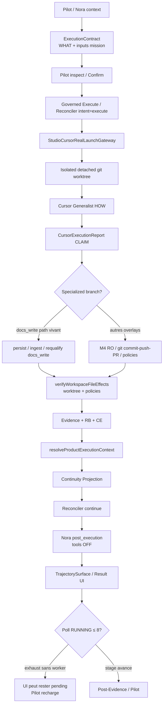
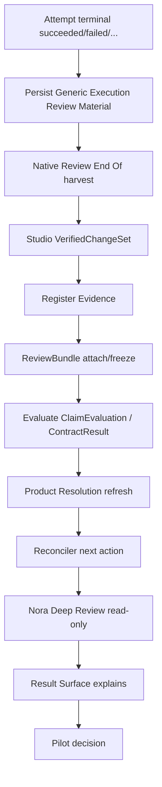
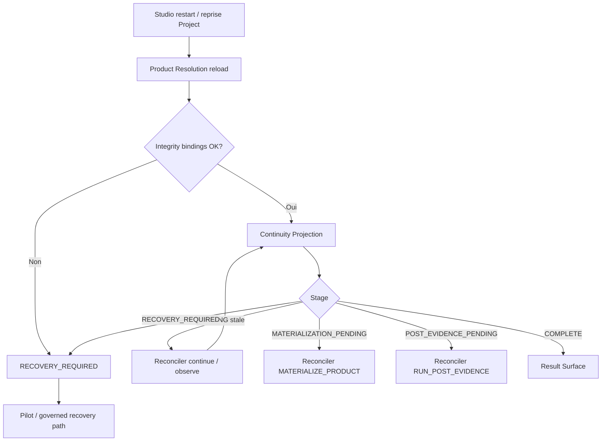
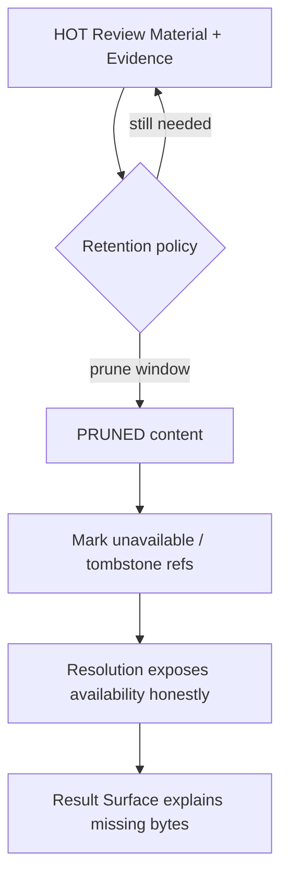
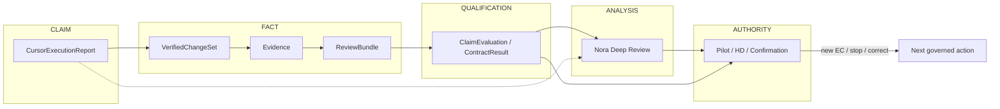
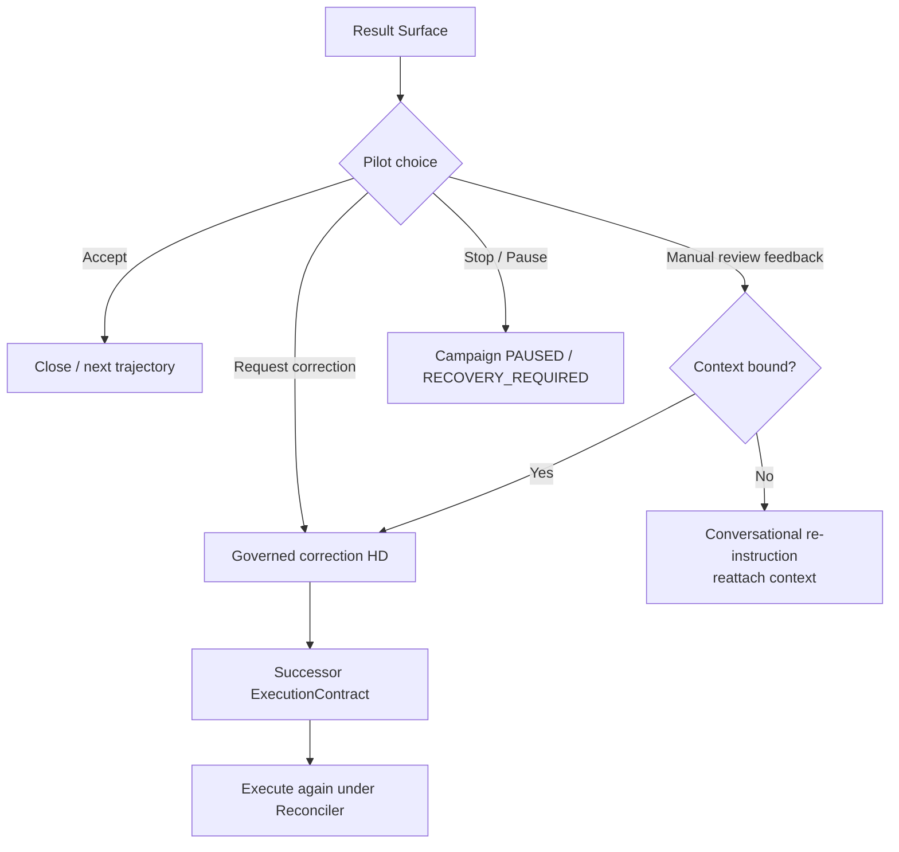

# SFIA Studio — Review Pack FULL
## GENERIC EXECUTION / REVIEW / RESULT — ARCHITECTURE TRUTH-SYNC

| Métadonnée | Valeur |
| --- | --- |
| **Timestamp** | 2026-09-29T11:08:54+0200 |
| **Repo** | https://github.com/mcleland147/sfia-workspace.git |
| **Branche projet** | `sfia-studio/generic-execution-review-result-architecture-01` |
| **HEAD** | `6f47f74dc9b515c4c79624b21772223ba02c76cd` |
| **origin/main** | `6f47f74dc9b515c4c79624b21772223ba02c76cd` |
| **Cycle** | 6 — Architecture technique · DOC / EVOL · CRITICAL |
| **CKC** | `cyc:technical-architecture` · `projects/sfia-studio/sfia-v3-framing/ckc/06-architecture-technique.md` · CONTENT VALIDATED BY MORRIS · guidance only · ≠ execution authority |
| **Profil** | CRITICAL |
| **Qualification** | ARCHITECTURE / DOCUMENTARY TRUTH-SYNC · informed by prior BOUNDED REAL NoteLite · **ZERO NEW REAL** this cycle |
| **Capacité v3 concernée** | Generic Execution → Execution Review → Evidence → Nora → Result → Pilot |
| **Roadmap lien** | tip 2026-09-29 `GENERIC-EXECUTION-REVIEW-RESULT-ARCHITECTURE-01 truth-sync` |
| **Statut document** | ADOPTED TARGET ARCHITECTURE BY MORRIS — DOCUMENTARY CANDIDATE PENDING GIT INTEGRATION |
| **≠** | Build Doctrine · v3 global doctrine promotion · runtime v3 ADOPTED · Delivery authorization · READY FOR REAL |

---

## git status (au moment du Review Pack)

```
 M .tmp-sfia-review/chatgpt-review.md
 M projects/sfia-studio/convergence/sfia-studio-convergence-roadmap.md
?? projects/sfia-studio/convergence/sfia-studio-generic-execution-review-result-architecture.md
```

---

## Qualification cycle

- Type : **6 — Architecture technique**
- Nature : **EVOL / DOC** — truth-sync architecture Product Execution / Review / Result
- Fake / Real applicable : **OUI** (architecture informée par campagne REAL NoteLite antérieure)
- Nouvelle exécution REAL ce cycle : **NON**
- Fake/mock/fixture créé : **NON**
- Niveau preuve entrée : **BOUNDED REAL PROOF** sous-chaîne NoteLite
- Niveau preuve produit ce cycle : **ARCHITECTURE / DOCUMENTARY TRUTH-SYNC**
- GO Morris REAL : **NON**
- Delivery slicing : **TBD AFTER ARCHITECTURE REVIEW** — **NOT ADOPTED** (hypothèse 5 lots **NOT ADOPTED**)
- runtime v3 : **NON ADOPTED**
- READY FOR REAL : **NO**

---

## Sources lues (gouvernance / doctrine / process)

- `projects/sfia-studio/convergence/sfia-studio-convergence-build-doctrine.md`
- `projects/sfia-studio/convergence/sfia-studio-convergence-roadmap.md`
- `projects/sfia-studio/product-completion/01-product-completion-cadrage.md`
- `projects/sfia-studio/sfia-v3-framing/32-living-project-state-and-dynamic-trajectory.md`
- `projects/sfia-studio/sfia-v3-framing/33-epistemology-provenance-and-contradiction-model.md`
- `projects/sfia-studio/sfia-v3-framing/34-agent-capabilities-reversibility-and-execution-governance.md`
- `projects/sfia-studio/sfia-v3-framing/35-artifact-evidence-debt-and-controlled-learning.md`
- `projects/sfia-studio/sfia-v3-framing/ckc/06-architecture-technique.md`
- `projects/sfia-studio/convergence/sfia-studio-native-execution-loop-convergence-01-capitalisation.md`
- assets / références continuity PRODUCT-CONTINUITY-SHARED-KNOWLEDGE-01 présents sur main
- `prompts/templates/sfia-cycle-execution-template.md` (process only)
- `method/sfia-fast-track/core/sfia-cycle-routing-guide.md` (process only)

## Code audité (main @ 6f47f74d — lecture seule)

- ExecutionContract domain / generalistExecutionSurface / projectExecutionContractToCursorPrompt
- studioCursorGeneralistAgent / studioCursorRealLaunchGateway / studioGitWorktreeWorkspace
- cursorExecutionReport / verifyWorkspaceFileEffects
- deriveActualExecutionWorkFromProductContext / w3aProductExecutionSemantics / missionContractSemanticInputs
- persistDocsWriteArtifactReviewMaterial / ingestDocsWriteArtifactEvidence / completeBoundedDocsWriteLaunch
- governedExecuteAuthorizedContract / materializeW3bProductTerminal / resolveProductExecutionContext
- deriveGovernedExecutionContinuityProjection / reconcileGovernedExecution
- w3cPostEvidenceLoop / postEvidenceNoraAnalysis
- noraCognitiveCompletion / runNoraAgentsTurn / productExecutionAgentsTools
- evidence-review domain types / ReviewBundle / ClaimEvaluation semantics
- TrajectorySurface result rendering + poll RUNNING
- tests structurants continuity / native loop / generalist / workspace verification / post-execution UI / recovery / parity

## Décisions Morris tracées (ADOPTED 2026-09-29)

D-ER-01 … D-ER-15 (intégralité dans le document architecture §12).

Résumé :
1. ONE GENERIC PRODUCT EXECUTION MODEL — retire taxonomies Product `docs_write` / `code_write` / `read` / `read_only` / … — **interdit** `generic_read|write|code` Product
2. KEEP isolated Git worktree
3. CursorExecutionReport = CLAIM
4. Generic Execution Review Material (TARGET)
5. Native Review End Of (harvest sémantique ≠ transport externe)
6. Studio VerifiedChangeSet
7. ONE Product Resolution path
8. Reconciler owns deterministic progression
9. Nora Deep post-execution review (shared core + RO tools)
10. Result Surface always explains
11. Claim / Fact / Analysis / Authority separation
12. Review Material retention HOT→PRUNED
13. Migration without big bang
14. No parallel architecture
15. Delivery slicing NOT YET ADOPTED

---

## Findings confirmés (audit main)

| Finding | Qualification |
| --- | --- |
| A. Generic Execution Surface (quartet) EXISTS | CURRENT IMPLEMENTED FACT — KEEP |
| B. Cursor Generalist EXISTS | CURRENT — KEEP |
| C. EC riche WHAT EXISTS | CURRENT — KEEP / COMPLETE |
| D. Specialized semantics persistent (docs_write family + overlays) | CURRENT + TRANSITIONAL — HARVEST/GENERALIZE/RETIRE FROM PRODUCT MODEL |
| E. CursorExecutionReport largement générique | CURRENT — KEEP / COMPLETE as CLAIM |
| F. Isolated detached worktree | CURRENT — KEEP |
| G. verifyWorkspaceFileEffects observe worktree + policy docs_write | CURRENT — HARVEST / GENERALIZE |
| H. Durable review persist mono-artifact docs_write-centric | CURRENT — GENERALIZE |
| I. materializeW3b branches docs_write / generic | CURRENT — KEEP orchestration / GENERALIZE branches |
| J. Shared Product Resolution | CURRENT — KEEP / COMPLETE |
| K. Continuity Projection read-only | CURRENT — KEEP |
| L. Server Reconciler | CURRENT — KEEP |
| M. Shared Nora cognitive core | CURRENT — KEEP |
| N. post_execution tools/MemoryB/hosted search OFF | CURRENT — KEEP posture / COMPLETE RO review tools |
| O. Result rendering in TrajectorySurface | CURRENT — KEEP / EXTRACT / COMPLETE |
| P. Evidence retentionClass / availability | CURRENT — KEEP / REUSE |
| NoteLite post-terminal UI stall + Recharger | REAL OBSERVATION + HIGH-CONFIDENCE ARCHITECTURAL CAUSE ≠ proven instance root cause |
| Poll UI ≤8 / no autonomous worker post-exhaust | CURRENT IMPLEMENTED FACT / AUDIT INFERENCE |

## Findings ajustés

- Aucune **ARCHITECTURE SOURCE CONTRADICTION** matérielle entre le brief Morris et main @ `6f47f74d`.
- Les taxonomies `code_write` / `read` / `read_only` sont traitées comme **exemples de modèles Product à retirer** même si l’empreinte code `docs_write` domine actuellement (non réduit à docs_write seul).
- Gap NoteLite post-terminal : **HIGH-CONFIDENCE ARCHITECTURAL CAUSE** documentée ; **≠ PROVEN INSTANCE ROOT CAUSE** (traces runtime instance Exactes non utilisées comme preuve forensique).

## Réserves

- Document = **documentary candidate** — pas encore intégré Git projet.
- Schema final Execution Review Material = **OPEN DESIGN DETAIL**.
- API finale outils Nora review = **OPEN DESIGN DETAIL**.
- Model / reasoning upgrade Nora = **OPEN DESIGN DETAIL**.
- TTL / quota / GC scheduler = **OPEN DESIGN DETAIL**.
- Delivery slicing = **TBD**.
- NoteLite correction governed / finalization = **non relancées** · campagne **PAUSED**.

## Open design details

Voir document architecture §37.

---

## Fichiers créés / modifiés (scope autorisé uniquement)

| Path | Action |
| --- | --- |
| `projects/sfia-studio/convergence/sfia-studio-generic-execution-review-result-architecture.md` | **CREATED** |
| `projects/sfia-studio/convergence/sfia-studio-convergence-roadmap.md` | **MODIFIED** (tip 2026-09-29 only) |
| `.tmp-sfia-review/chatgpt-review.md` | **RESET** (ce Review Pack) |

**Aucun** fichier `app/**`, Build Doctrine, C1, framing, method, prompts, tests, CI modifié.

---

## Validations V-01 … V-43

| ID | Résultat |
| --- | --- |
| V-01 git diff --check | **PASS** |
| V-02 seuls fichiers projet autorisés | **PASS** (arch + roadmap ; pack local) |
| V-03 CURRENT/TARGET/TRANSITIONAL/RETIRE | **PASS** |
| V-04 component matrix | **PASS** (§9 + annexe disposition) |
| V-05 six flux diagrammes | **PASS** (6 Mermaid) |
| V-06 Review Material ≠ Evidence | **PASS** |
| V-07 Cursor report ≠ Evidence | **PASS** |
| V-08 Nora ≠ HumanDecision | **PASS** |
| V-09 Artifact ≠ universal result | **PASS** |
| V-10 exécution sans Artifact couverte | **PASS** |
| V-11 Product cible générique | **PASS** |
| V-12 docs_write pas seul legacy | **PASS** |
| V-13 code_write/read/read_only couverts | **PASS** |
| V-14 capabilities ≠ Product categories | **PASS** |
| V-15 pas de generic_read/write/code Product | **PASS** |
| V-16 worktree KEEP | **PASS** |
| V-17 Cursor Generalist KEEP | **PASS** |
| V-18 Product Resolution KEEP/COMPLETE | **PASS** |
| V-19 Reconciler owner | **PASS** |
| V-20 UI ≠ state-machine owner | **PASS** |
| V-21 post-terminal gap NoteLite qualifié | **PASS** |
| V-22 high-confidence ≠ proven instance RC | **PASS** |
| V-23 Nora shared core | **PASS** |
| V-24 no second Nora | **PASS** |
| V-25 review tools RO / Attempt/Project-bound | **PASS** |
| V-26 model upgrade OPEN | **PASS** |
| V-27 retention Review Material | **PASS** |
| V-28 purge ne casse pas Evidence | **PASS** |
| V-29 logical/worktree/durable/promotion distingués | **PASS** |
| V-30 .sfia-exec ≠ business target | **PASS** |
| V-31 SUCCESS/NOT_PROVEN/FAIL/STOP/TIMEOUT/recovery | **PASS** |
| V-32 aucun terminal → rien | **PASS** |
| V-33 v2.6 parity analysée | **PASS** |
| V-34 external handoff transport non importé runtime | **PASS** |
| V-35 migration sans big-bang | **PASS** |
| V-36 dettes avec exit conditions | **PASS** |
| V-37 aucun plan 5 lots | **PASS** |
| V-38 DELIVERY SLICING = TBD | **PASS** |
| V-39 NoteLite PAUSED / non finalisé | **PASS** |
| V-40 aucun nouveau REAL revendiqué | **PASS** |
| V-41 runtime v3 NON ADOPTED | **PASS** |
| V-42 READY FOR REAL jamais revendiqué | **PASS** |
| V-43 Roadmap ⇄ architecture cohérents | **PASS** |

---

## Anti-claims

- ≠ full REAL E2E proven
- ≠ READY FOR REAL
- ≠ generic execution path fully REAL-proven
- ≠ NoteLite cycle finalized
- ≠ Git promotion proven
- ≠ runtime v3 ADOPTED
- ≠ Delivery authorized / Delivery plan adopted
- ≠ Build Doctrine mutated
- ≠ project commit / push / PR / merge this cycle
- ≠ 5-lot Delivery plan adopted

---

## Verdict Review Pack

**ARCHITECTURE TRUTH-SYNC READY FOR CHATGPT CRITICAL REVIEW**

NEXT STEP (post-pack) : ChatGPT Critical Review of architecture truth-sync.
Après validation Morris seulement : Delivery slicing design.

---

# CONTENU COMPLET — DOCUMENT ARCHITECTURE CRÉÉ

Path : `projects/sfia-studio/convergence/sfia-studio-generic-execution-review-result-architecture.md`

```markdown
# SFIA Studio — Architecture de référence : Generic Execution → Execution Review → Evidence → Nora → Result → Pilot

| Métadonnée | Valeur |
| --- | --- |
| **Projet** | SFIA Studio |
| **Titre** | Generic Execution / Execution Review / Evidence / Nora / Result / Pilot — Architecture de référence |
| **Rôle documentaire** | **CURRENT ARCHITECTURE REFERENCE** (cible adoptée + cartographie factuelle du code) |
| **Chaîne couverte** | `GENERIC EXECUTION → EXECUTION REVIEW → EVIDENCE → NORA → RESULT → PILOT` |
| **Statut** | **ADOPTED TARGET ARCHITECTURE BY MORRIS** — **DOCUMENTARY CANDIDATE PENDING GIT INTEGRATION** |
| **Décisions datées** | **2026-09-29** |
| **Base main auditée** | `6f47f74dc9b515c4c79624b21772223ba02c76cd` |
| **Qualification épistémique** | Assertions étiquetées : `CURRENT IMPLEMENTED FACT` · `REAL OBSERVATION` · `AUDIT INFERENCE` · `TARGET ARCHITECTURE — ADOPTED BY MORRIS` · `TRANSITIONAL DEBT` · `OPEN DESIGN DETAIL` · `FUTURE PROOF` |
| **runtime v3** | **NON ADOPTED** |
| **READY FOR REAL** | **NO** |
| **Delivery slicing** | **NOT ADOPTED / TBD** — aucun plan en N lots inventé |
| **Autorité d’exécution** | Ce document **n’autorise pas** commit / push / PR / REAL / Execute |
| **Nature** | Référence d’architecture Product — **≠** doctrine · **≠** Build Doctrine · **≠** C1 · **≠** baseline v2.6 · **≠** promotion runtime v3 |

---

## Légende épistémique (obligatoire)

| Tag | Signification |
| --- | --- |
| **CURRENT IMPLEMENTED FACT** | Observé dans le code / runtime sur main `6f47f74d` (ou preuve Git/CI associée) |
| **REAL OBSERVATION** | Observation de campagne REAL bornée (NoteLite) — scope testé uniquement |
| **AUDIT INFERENCE** | Inférence d’architecture à partir du code / des seams — **≠** preuve d’instance |
| **TARGET ARCHITECTURE — ADOPTED BY MORRIS** | Cible adoptée le 2026-09-29 — **≠** implémenté tant que non tagué autrement |
| **TRANSITIONAL DEBT** | Pont / legacy vivant à retirer ou généraliser sous conditions |
| **OPEN DESIGN DETAIL** | Décision d’architecture encore ouverte |
| **FUTURE PROOF** | Preuve de sortie / critère d’exit futur — non réalisé |

**Règle éditoriale :** ne jamais présenter une assertion **TARGET** comme **IMPLEMENTED**. Ne jamais inventer de preuve REAL au-delà des faits NoteLite bornés ci-dessous.

---

## 1. Métadonnées / statut

### 1.1 Objet

Ce document fixe la **référence d’architecture Product** pour le circuit générique d’exécution gouvernée dans SFIA Studio, après requalification de la trajectoire spécialisée (`docs_write` et taxonomies Product homologues) vers un modèle **Generic Product Execution** centré sur :

1. un **ExecutionContract** sémantique unique (WHAT) ;
2. un exécuteur **Cursor Generalist** (HOW) en **worktree isolé** ;
3. un **CursorExecutionReport** = **CLAIM** ;
4. une **Generic Execution Review Material** + **Native Review End Of** ;
5. un **Studio VerifiedChangeSet** (vérité Studio, pas narration Cursor) ;
6. **Evidence / ReviewBundle / ClaimEvaluation** ;
7. **Product Resolution** unique + **Reconciler** ;
8. **Nora** (analyse profonde bornée) ;
9. **Result Surface** → décision Pilot.

### 1.2 Statut décisionnel

| Élément | Qualification |
| --- | --- |
| Cible architecturale D-ER-01…15 | **TARGET ARCHITECTURE — ADOPTED BY MORRIS** (2026-09-29) |
| Intégration Git de ce document | **DOCUMENTARY CANDIDATE PENDING GIT INTEGRATION** |
| Implémentation complète de la cible | **NON** — voir matrice CURRENT/TARGET |
| runtime v3 | **NON ADOPTED** |
| READY FOR REAL (boucle générique cible) | **NO** |
| Delivery slicing (lots) | **TBD** — **D-ER-15** |

### 1.3 Anti-confusion de maturité

| Claim interdit | État |
| --- | --- |
| « Architecture cible déjà livrée » | **FAUX** — cible adoptée ≠ code convergé |
| « Generic loop REAL-proven » | **FAUX** — NoteLite prouve un chemin borné, pas la cible complète |
| « runtime v3 ADOPTED » | **FAUX** |
| « Delivery plan 5 lots » | **FAUX** — non adopté ; TBD |

---

## 2. Déclaration exécutive d’architecture

### 2.1 Circuit nominal cible

**TARGET ARCHITECTURE — ADOPTED BY MORRIS**

```text
Pilot / Nora context
  → ExecutionContract (WHAT générique Product)
  → Pilot inspection + Confirmation / authority
  → Governed Execute
  → Cursor Generalist HOW (isolated detached git worktree)
  → CursorExecutionReport (CLAIM)
  → Generic Execution Review Material
  → Native Review End Of (harvest sémantique Studio)
  → Studio VerifiedChangeSet (oracle Studio)
  → Evidence + ReviewBundle + ClaimEvaluation
  → Product Resolution (unique)
  → Reconciler (progression déterministe)
  → Nora Deep Review (outils read-only bornés)
  → Result Surface (explique toujours)
  → Pilot decision / continue / correct / stop
```

### 2.2 Invariant central

**TARGET ARCHITECTURE — ADOPTED BY MORRIS** · partiellement **CURRENT IMPLEMENTED FACT** sur le backbone OA / NELC :

- L’**ExecutionContract** est le **seul WHAT Product** pour inspection Pilot, projection mission Cursor, binding d’enforcement, évaluation de résultat et analyse post-exécution.
- **Cursor** possède le **HOW** à l’intérieur du contrat autorisé.
- Les **catégories techniques** (effets, policies, overlays) ne sont **pas** des **catégories de tâche Product**.
- **Claim ≠ Fact ≠ Analysis ≠ Authority**.

### 2.3 Verdict de requalification

La spécialisation Product par taxonomie de tâche (`docs_write`, et homologues `code_write` / `read` / `read_only` comme exemples de taxonomies Product à retirer) est **architecture de transition**, pas architecture cible.

La cible adoptée est **un modèle Product générique** + **capabilities/effects techniques** en enforcement — **sans** inventer de nouvelles catégories Product du type `generic_read` / `generic_write` / `generic_code`.

---

## 3. Périmètre / hors-périmètre

### 3.1 In scope

| Thème | Qualification |
| --- | --- |
| Modèle Product Execution générique | TARGET + CURRENT backbone |
| ExecutionContract semantics / projection Cursor | CURRENT + TARGET |
| Isolated worktree + Real launch gateway | CURRENT KEEP |
| Claim / Evidence / RB / CE / VerifiedChangeSet | CURRENT partiel + TARGET |
| Generic Execution Review Material + Native Review End Of | TARGET (+ harvest CURRENT) |
| Product Resolution + Continuity + Reconciler | CURRENT partiel + TARGET |
| Nora post-Evidence / Deep Review | CURRENT partiel + TARGET |
| Result Surface / Pilot journey | TARGET (+ surfaces CURRENT) |
| Restart / recovery / retention / GC | CURRENT partiel + TARGET |
| Retirement des taxonomies Product spécialisées | TARGET + TRANSITIONAL DEBT |
| Frontière Git promotion future | OPEN / FUTURE |

### 3.2 Out of scope (explicite)

| Hors-périmètre | Note |
| --- | --- |
| Adoption runtime v3 | **NON ADOPTED** — non décidé ici |
| Plan de delivery en N lots | **TBD** — D-ER-15 |
| Doctrine / Build Doctrine / C1 rewrite | Non autorisé par ce document |
| Invention de catégories Product `generic_*` | **INTERDIT** |
| Preuves REAL au-delà de NoteLite borné | **INTERDIT** |
| Autorité push / PR / merge | Distinct Morris GO |
| MealFlow / autres campagnes | Non autorisées par ce document |

---

## 4. Sources / base de preuve

| Source | Nature | Usage |
| --- | --- | --- |
| Main `6f47f74dc9b515c4c79624b21772223ba02c76cd` | Git / code Product | **CURRENT IMPLEMENTED FACT** |
| Audit code (generalist surface, EC, gateway, verifier, continuity, Nora, Evidence) | Lecture code | **CURRENT IMPLEMENTED FACT** / **AUDIT INFERENCE** |
| NoteLite REAL (scope testé) | Campagne Product REAL | **REAL OBSERVATION** bornée |
| Capitalisations convergence (NELC #527, docs_write, ContractResult, continuity) | REX documentaire | Contexte / harvest — ne pas sur-réclamer |
| Décisions Morris D-ER-01…15 (2026-09-29) | Gouvernance architecture | **TARGET ARCHITECTURE — ADOPTED BY MORRIS** |

**Hiérarchie :** Git/code > REAL borné > audit inference > cible adoptée > open detail. Une cible adoptée **ne remplace pas** un fait d’implémentation manquant.

---

## 5. Contexte / pourquoi la requalification

### 5.1 Trajectoire historique (résumé factuel)

**CURRENT IMPLEMENTED FACT** / capitalisations :

1. Chemins Product spécialisés (`docs_write` en tête) ont permis des preuves REAL bornées et l’intégration de seams Evidence / RB / ContractResult.
2. `NATIVE-EXECUTION-LOOP-CONVERGENCE-01` (PR **#527**) a convergent un circuit natif autour d’un EC sémantique + projection Cursor généraliste + report enrichi — **déterministe**, **≠ READY FOR REAL**.
3. `PRODUCT-CONTINUITY-SHARED-KNOWLEDGE-01` (ancre main `6f47f74d` / PR **#540**) a introduit Product Resolution + Continuity Projection + Reconciler comme owners de progression.

### 5.2 Problème structurant

**AUDIT INFERENCE** (validé comme motive de décision Morris) :

Le Product modèle actuel **mélange** encore :

- des **taxonomies de tâche Product** (`docs_write`, et patterns homologues `code_write` / `read` / `read_only`) ;
- des **capabilities / effects techniques** ;
- des **ponts de materialization / ingest** nommés par effet ;
- une **UI de continuité** qui peut s’arrêter (poll) sans worker autonome.

Résultat : la richesse sémantique du contrat généraliste coexiste avec des branches spécialisées qui **empêchent** de traiter Execution Review / Result / Pilot comme un circuit générique unique.

### 5.3 Requalification adoptée

**TARGET ARCHITECTURE — ADOPTED BY MORRIS** :

Retirer les taxonomies Product spécialisées du **modèle Product** ; conserver / généraliser les **mécanismes techniques** utiles (worktree, verifier, Evidence, RB, CE, Resolution, Reconciler) ; introduire **Execution Review Material** générique + **VerifiedChangeSet** Studio + **Native Review End Of** ; garder Claim/Fact/Analysis/Authority séparés.

---

## 6. NoteLite — observations REAL bornées

> Toutes les assertions de cette section sont **REAL OBSERVATION** au **scope testé NoteLite** uniquement.
> **≠** preuve de la cible D-ER complète. **≠** READY FOR REAL générique.

### 6.1 Chaîne PROVEN AT TESTED SCOPE

| Étape | Observation |
| --- | --- |
| EC → Attempt REAL | **PROVEN** |
| Cursor REAL | **PROVEN** |
| Attempt `succeeded` | **PROVEN** |
| Evidence / RB / CE durables (recovery path) | **PROVEN** |
| Product Resolution | **PROVEN** (chemin de résolution) |
| Nora post-Evidence | **PROVEN** |
| Nora conversationnelle ensuite | **PROVEN** |
| Transfert d’ID Pilot | **NON** — conversation sans transfert d’ID Pilot **PROVEN AT TESTED SCOPE** |

### 6.2 NOT_PROVEN

Lorsque l’Evidence est insuffisante, le statut **NOT_PROVEN** est **préservé** — **REAL OBSERVATION** alignée avec la sémantique fail-closed ContractResult.

### 6.3 Gap UI / continuité (qualification honnête)

| Élément | Qualification |
| --- | --- |
| UI restée sur **materialization pending** | **REAL OBSERVATION** |
| Pilot a cliqué **« Recharger résultat produit »** pour continuer | **REAL OBSERVATION** |
| Cause architecturale **haute confiance** : poll TrajectorySurface exhausté (≤ 8 `continue`) **sans worker autonome** après exhaust | **AUDIT INFERENCE** — **HIGH-CONFIDENCE ARCHITECTURAL CAUSE** |
| Cause racine **d’instance** prouvée pour ce run Exact | **≠ PROVEN INSTANCE ROOT CAUSE** |

### 6.4 Chemins artifact / logique

| Couche | Valeur observée |
| --- | --- |
| Artifact physique (campagne) | sous `.sfia-exec/.../docs-write-artifact/...` |
| Cible logique | `projects/notelite/01-cadrage/...` |

**REAL OBSERVATION** : dualité logical vs physical path déjà visible ; la cible architecture (section 30) doit la traiter sans coller la taxonomie `docs_write` au modèle Product.

### 6.5 Review manuelle / binding conversationnel

| Observation | Qualification |
| --- | --- |
| Feedback de review manuel initialement **sans contexte** | **REAL OBSERVATION** |
| Ré-instruction naturelle a **reattaché** le contexte | **REAL OBSERVATION** |
| Lecture | faiblesse de **binding conversationnel** — **≠** rupture de Product Resolution |

### 6.6 État campagne

| Élément | État |
| --- | --- |
| Campagne | **PAUSED** |
| Correction gouvernée | **non re-testée** |
| Cycle | **non finalisé** |

---

## 7. Carte d’architecture actuelle (CURRENT)

### 7.1 Diagramme — CURRENT EXECUTION FLOW


```mermaid
flowchart TD
  A[Pilot / Nora context] --> B[ExecutionContract<br/>WHAT + inputs mission]
  B --> C[Pilot inspect / Confirm]
  C --> D[Governed Execute / Reconciler intent=execute]
  D --> E[StudioCursorRealLaunchGateway]
  E --> F[Isolated detached git worktree]
  F --> G[Cursor Generalist HOW]
  G --> H[CursorExecutionReport CLAIM]
  H --> I{Specialized branch?}
  I -->|docs_write path vivant| J[persist / ingest / requalify docs_write]
  I -->|autres overlays| K[M4 RO / git commit-push-PR / policies]
  J --> L[verifyWorkspaceFileEffects<br/>worktree + policies]
  K --> L
  L --> M[Evidence + RB + CE]
  M --> N[resolveProductExecutionContext]
  N --> O[Continuity Projection]
  O --> P[Reconciler continue]
  P --> Q[Nora post_execution<br/>tools OFF]
  Q --> R[TrajectorySurface / Result UI]
  R --> S{Poll RUNNING ≤ 8?}
  S -->|exhaust sans worker| T[UI peut rester pending<br/>Pilot recharge]
  S -->|stage avance| U[Post-Evidence / Pilot]
```

**Qualification :** diagramme = synthèse **CURRENT IMPLEMENTED FACT** + **AUDIT INFERENCE** sur seams spécialisées encore vivantes.

### 7.2 Composants CURRENT (résumé)

| Composant | Rôle CURRENT | Qualification |
| --- | --- | --- |
| `generalistExecutionSurface` | Quartet `cap/action/target/scope` Cursor Generalist | **CURRENT IMPLEMENTED FACT** |
| ExecutionContract | objective/context/scope/expectedOutputs/acceptance/validation/authority/reversibility via inputs + top-level | **CURRENT IMPLEMENTED FACT** |
| `projectExecutionContractToCursorPrompt` | Projette WHAT ; HOW laissé à Cursor | **CURRENT IMPLEMENTED FACT** |
| `StudioCursorRealLaunchGateway` | Lance `cursor agent` en worktree isolé détaché | **CURRENT IMPLEMENTED FACT** |
| `CursorExecutionReport` | CLAIM enrichi — **≠ Evidence** | **CURRENT IMPLEMENTED FACT** |
| `verifyWorkspaceFileEffects` | Observe le worktree puis applique policies (policy `docs_write` séparée) | **CURRENT IMPLEMENTED FACT** |
| Specialized `docs_write` | persist / ingest / requalify ; materialize branches | **CURRENT IMPLEMENTED FACT** / **TRANSITIONAL DEBT** |
| M4 RO / M4 git commit/push/PR | Chemins spécialisés encore présents | **CURRENT IMPLEMENTED FACT** / **TRANSITIONAL DEBT** |
| `resolveProductExecutionContext` | Shared Product Resolution EXISTS | **CURRENT IMPLEMENTED FACT** |
| Artifact load | encore nommé / branché `docs_write` | **TRANSITIONAL DEBT** |
| Continuity + `reconcileGovernedExecution` | Own continue | **CURRENT IMPLEMENTED FACT** |
| TrajectorySurface | Poll RUNNING jusqu’à **8** continues — **pas de worker** après exhaust | **CURRENT IMPLEMENTED FACT** |
| Nora shared core | `post_execution` désactive tools / MemoryB / hosted search / product tools | **CURRENT IMPLEMENTED FACT** |
| Evidence | `retentionClass` / availability / `MarkEvidenceUnavailable` | **CURRENT IMPLEMENTED FACT** |
| Stages | `PRE_EXECUTION` … `RECOVERY_REQUIRED` ; integrity codes → `RECOVERY_REQUIRED` | **CURRENT IMPLEMENTED FACT** |

---

## 8. Constatations d’implémentation actuelles

### 8.1 Surface généraliste Product

**CURRENT IMPLEMENTED FACT** — module `generalistExecutionSurface` :

| Token | Valeur |
| --- | --- |
| Capability | `cap:studio.cursor.generalist` |
| Action | `studio.cursor.generalist.execute` |
| Target | `studio.cursor.generalist.workspace` |
| Scope | `studio.cursor.generalist.authorized_contract` |

Ces tokens décrivent la **surface de contrat Product générique** — **pas** un catalogue de tâches Product, **pas** l’infrastructure AgentDescriptor seule.

### 8.2 ExecutionContract — champs sémantiques

**CURRENT IMPLEMENTED FACT** : EC porte (via inputs + champs top-level) au minimum :

- `objective` / `context` / `scope`
- `expectedOutputs` / `acceptance` / `validation`
- `authority` / `reversibility`

**AUDIT INFERENCE** : la richesse sémantique est déjà **généraliste** ; la spécialisation résiduelle vit surtout dans les **branches post-report** (persist/ingest/materialize nommées) et dans des overlays techniques.

### 8.3 Projection EC → Cursor

**CURRENT IMPLEMENTED FACT** : `projectExecutionContractToCursorPrompt` projette le **WHAT** inspectable ; le **HOW** reste responsabilité Cursor dans le contrat autorisé.

### 8.4 Launch REAL

**CURRENT IMPLEMENTED FACT** : `StudioCursorRealLaunchGateway` exécute Cursor en **isolated detached git worktree**.

### 8.5 Report = CLAIM

**CURRENT IMPLEMENTED FACT** : `CursorExecutionReport` est traité comme **CLAIM** (disclosure `CLAIM_NOT_EVIDENCE` dans Product Resolution) — **≠** Evidence automatique.

### 8.6 Verifier

**CURRENT IMPLEMENTED FACT** : `verifyWorkspaceFileEffects` observe le worktree complet puis applique des **policies** ; la policy `docs_write` est **séparée** (spécialisation technique encore vivante).

### 8.7 Spécialisations encore vivantes

**CURRENT IMPLEMENTED FACT** / **TRANSITIONAL DEBT** :

| Spécialisation | Manifestation |
| --- | --- |
| `docs_write` | persist artifact / ingest Evidence / requalify ; materialize branches |
| M4 read-only | chemin RO spécialisé |
| M4 git commit / push / PR | chemins lifecycle Git spécialisés |
| Artifact naming | `docs-write-artifact` paths sous `.sfia-exec` |

**Note éditoriale :** `docs_write` **n’est pas** le seul legacy Product taxonomy — `code_write`, `read`, `read_only` sont des **exemples** de taxonomies Product à retirer du modèle Product (même si leur empreinte code varie). **Ne pas** les remplacer par `generic_read` / `generic_write` / `generic_code` comme catégories Product.

### 8.8 Product Resolution

**CURRENT IMPLEMENTED FACT** : `resolveProductExecutionContext` **EXISTS** et compose EC / Attempt / report / artifact / Evidence / RB / CE / post-Evidence.

**TRANSITIONAL DEBT** : chargement artifact encore branché sur helpers **docs_write-named** (`loadDocsWriteArtifactReviewMaterial`, etc.).

### 8.9 Continuity / Reconciler / UI poll

**CURRENT IMPLEMENTED FACT** :

- Projection stages : `PRE_EXECUTION` | `ATTEMPT_ACCEPTED` | `RUNNING` | `PRODUCT_MATERIALIZATION_PENDING` | `POST_EVIDENCE_PENDING` | `POST_EVIDENCE_COMPLETE` | `RECOVERY_REQUIRED`
- `reconcileGovernedExecution` own `execute` / `continue`
- TrajectorySurface : boucle `for (i < 8)` tant que stage `RUNNING` — **aucun worker serveur** après exhaust du poll UI

**AUDIT INFERENCE** : seam critique pour le gap NoteLite « materialization pending ».

### 8.10 Nora

**CURRENT IMPLEMENTED FACT** : cœur cognitif partagé ; mode `post_execution` = tools OFF, MemoryB OFF, hosted search OFF, product tools OFF.

### 8.11 Evidence retention / availability

**CURRENT IMPLEMENTED FACT** : Evidence expose `retentionClass` / availability ; `MarkEvidenceUnavailable` existe.

---

## 9. Matrice composants CURRENT / TARGET

| Composant | CURRENT | TARGET (ADOPTED) | Écart |
| --- | --- | --- | --- |
| Product task taxonomy | Spécialisées vivantes (`docs_write` + homologues) | **Une** modèle Product générique — taxonomies tâche **retirées** | Majeur |
| EC surface | Generalist quartet + inputs riches | **KEEP** + clarifier WHAT-only | Faible |
| Cursor HOW | Generalist en worktree | **KEEP** | Faible |
| Report | CLAIM | **KEEP CLAIM** | Nul (discipline) |
| Review Material | docs_write-named persist | **Generic Execution Review Material** | Majeur |
| Review End Of | Transport / process externes historiques + harvest partiel | **Native Review End Of** (harvest sémantique, pas transport) | Majeur |
| VerifiedChangeSet | Verifier policies spécialisées | **Studio VerifiedChangeSet** générique | Moyen |
| Evidence/RB/CE | Vivants ; règles encore partiellement spécialisées | **KEEP** backbone ; critères génériques | Moyen |
| Product Resolution | EXISTS ; artifact docs_write-named | **Un** chemin générique | Moyen |
| Reconciler | Own continue ; UI poll borné | Owner progression déterministe **bout-en-bout** | Moyen |
| Nora Deep Review | post_execution tools OFF | Deep Review + **outils read-only bornés** | Moyen |
| Result Surface | Surfaces partielles / pending gaps | **Toujours expliquer** Claim/Fact/Analysis/Authority | Moyen |
| Retention Review Material | Partiel Evidence | HOT→PRUNED pour Review Material | Moyen |
| Delivery slicing | N/A | **TBD** | Open |

---

## 10. Problèmes / seams

| # | Seam | Qualification | Impact |
| --- | --- | --- | --- |
| S1 | Taxonomies Product spécialisées encore dans le modèle / naming | TRANSITIONAL DEBT | Empêche circuit Review/Result générique |
| S2 | Artifact load docs_write-named dans Product Resolution | TRANSITIONAL DEBT | Couplage faux « Product = docs_write » |
| S3 | Policy verifier séparée par effet | CURRENT + dette | Oracle non unifié en VerifiedChangeSet |
| S4 | UI poll ≤8 sans worker post-exhaust | CURRENT FACT | Progression peut stall → Pilot « Recharger » |
| S5 | Nora post_execution sans outils | CURRENT FACT | Deep Review cible non atteinte |
| S6 | Binding conversationnel review faible | REAL OBSERVATION NoteLite | UX review context-free initiale |
| S7 | Logical path vs physical `.sfia-exec` path | REAL + CURRENT | Confusion Pilot / audit si non articulé |
| S8 | Materialize branches spécialisées | TRANSITIONAL DEBT | Parallelisme de chemins post-terminal |
| S9 | Tentation de recréer `generic_*` Product categories | Anti-architecture | Interdit (D-ER-01 / §33) |
| S10 | Sur-réclamer NoteLite comme preuve cible | Risque épistémique | Anti-claims §41 |

---

## 11. Principes adoptés

**TARGET ARCHITECTURE — ADOPTED BY MORRIS**

1. **Un modèle Product Execution générique** — pas de catalogue de tâches Product.
2. **WHAT (EC) ≠ HOW (Cursor)** — Cursor libre dans le contrat autorisé.
3. **Claim ≠ Evidence ≠ Analysis ≠ Authority**.
4. **Studio owns Fact** (VerifiedChangeSet / Evidence) — Cursor owns Claim.
5. **Un Product Resolution** — pas de second knowledge store.
6. **Reconciler owns progression déterministe** — UI n’est pas workflow owner.
7. **Native Review End Of** = harvest sémantique interne — **≠** reproduction du transport ChatGPT↔Cursor externe.
8. **Nora explique et analyse** — ne devient pas owner d’autorité d’exécution.
9. **Result Surface always explains** — y compris NOT_PROVEN / RECOVERY_REQUIRED.
10. **Migration sans big bang** — bridges transitionnels avec exit.
11. **Pas d’architecture parallèle** durable.
12. **runtime v3 reste NON ADOPTED** ; **READY FOR REAL = NO** jusqu’à preuve gouvernée distincte.
13. **Delivery slicing = TBD**.
14. **Retirer taxonomies Product** (`docs_write`, `code_write`, `read`, `read_only`, …) **sans** inventer `generic_read|write|code` Product.

---

## 12. Décisions D-ER-01 … D-ER-15 (complètes)

> Toutes : **TARGET ARCHITECTURE — ADOPTED BY MORRIS** (2026-09-29), sauf mention d’ancrage CURRENT.

### D-ER-01 — Un modèle Product générique ; retirer les taxonomies de tâche Product spécialisées

**Décision :** Le Product Execution Model ne classe **pas** les missions par taxonomie de tâche (`docs_write`, `code_write`, `read`, `read_only`, …).
**Conserve :** capabilities / effects / policies **techniques** comme enforcement.
**Interdit :** inventer des catégories Product `generic_read` / `generic_write` / `generic_code`.
**Exit :** plus aucune branche Product mission nommée par taxonomie de tâche dans le chemin nominal.

### D-ER-02 — Conserver le worktree isolé

**Décision :** **KEEP** isolated detached git worktree via gateway REAL.
**Motif :** borne d’effet, reproductibilité, oracle filesystem, non-contamination du managed root.
**CURRENT :** déjà implémenté (`StudioCursorRealLaunchGateway`).

### D-ER-03 — Le Report reste CLAIM

**Décision :** `CursorExecutionReport` = **CLAIM** uniquement.
**Jamais :** Evidence automatique / PASS métier par narration.
**CURRENT :** disclosure Product Resolution `CLAIM_NOT_EVIDENCE`.

### D-ER-04 — Generic Execution Review Material

**Décision :** Introduire une **Generic Execution Review Material** (payload durable de revue) indépendante des noms `docs_write-*`.
**Contenu minimal cible :** refs Attempt/EC, report claim ref, artifact refs logiques, verifier/Changeset refs, métadonnées de complétude.
**Disposition CURRENT persist docs_write :** **HARVEST → GENERALIZE**.

### D-ER-05 — Native Review End Of

**Décision :** **Native Review End Of** = fin de revue **native Studio** par **harvest sémantique** (contrats, claims, facts, analyses) — **pas** un transport externe (copy/paste ChatGPT↔Cursor) érigé en architecture Product.
**Harvest :** sémantique utile des process externes historiques **autorisée** ; mécanismes de transport **non** productisés.

### D-ER-06 — Studio VerifiedChangeSet

**Décision :** Studio produit un **VerifiedChangeSet** (ensemble d’effets observés/validés) comme vérité d’effet — oracle Studio, policies génériques, fail-closed.
**CURRENT harvest :** `verifyWorkspaceFileEffects` + policies.
**Cible :** un objet/sémantique Product stable, pas une policy `docs_write` comme centre.

### D-ER-07 — Un chemin Product Resolution

**Décision :** **Un** `resolveProductExecutionContext` (ou successeur générique équivalent) — pas de résolution parallèle par taxonomie.
**CURRENT :** EXISTS.
**Dette :** retirer dépendances artifact docs_write-named.

### D-ER-08 — Reconciler owns progression déterministe

**Décision :** `reconcileGovernedExecution` (ou successeur) **possède** la progression post-accept Attempt → materialization → post-Evidence.
**UI :** projection + intent — **pas** owner.
**Dette :** poll UI 8 without worker = **non conforme** à la cible ; correction = worker/serveur ou continue autonome bornée — **OPEN DESIGN DETAIL** sur le mécanisme exact.

### D-ER-09 — Nora Deep Review avec outils read-only bornés

**Décision :** Après Evidence, Nora peut faire une **Deep Review** avec **outils read-only bornés** (lecture Evidence/RB/CE/changeset/artifact autorisés) — sans mutation Product, sans tools d’exécution.
**CURRENT :** `post_execution` tools OFF — **écart cible**.
**Non-but :** MemoryB / hosted search / product mutation tools en post_execution.

### D-ER-10 — Result Surface always explains

**Décision :** La Result Surface explique **toujours** l’état épistémique : Claim / Fact / Analysis / Authority / NOT_PROVEN / RECOVERY_REQUIRED / next action.
**Interdit :** silence, faux PASS, ou CTA opaque sans raison.

### D-ER-11 — Séparation Claim / Fact / Analysis / Authority

**Décision :**
- **Claim** = CursorExecutionReport / assertions exécuteur
- **Fact** = VerifiedChangeSet + Evidence
- **Analysis** = Nora (post_execution / Deep Review)
- **Authority** = HD / Confirmation / effective authority / Pilot
**Jamais** fusionner ces couches dans un seul « résultat ».

### D-ER-12 — Retention Review Material HOT → PRUNED

**Décision :** Review Material suit une classe de rétention **HOT → PRUNED** (et indisponibilité explicite alignée Evidence).
**CURRENT harvest :** `retentionClass` / `MarkEvidenceUnavailable` sur Evidence.
**Cible :** politique cohérente Review Material + Evidence — détails GC = **OPEN DESIGN DETAIL**.

### D-ER-13 — Migration sans big bang

**Décision :** Bridges transitionnels autorisés **avec exit conditions**.
**Interdit :** freeze durable de dual-stack Product taxonomy + generic model.

### D-ER-14 — Pas d’architecture parallèle

**Décision :** Pas de second moteur Execution / Review / Resolution « générique » à côté du spécialisé.
**Méthode :** généraliser le chemin unique ; retirer le spécialisé du modèle Product.

### D-ER-15 — Delivery slicing NON adopté / TBD

**Décision :** **Aucun** découpage delivery (ex. « 5 lots ») n’est adopté par ce document.
**DELIVERY SLICING = TBD**.
Toute proposition de lots = décision Morris ultérieure distincte.

---

## 13. Modèle Generic Product Execution

### 13.1 Définition

**TARGET ARCHITECTURE — ADOPTED BY MORRIS**

Un **Generic Product Execution** est :

1. un **ExecutionContract** générique (surface generalist + sémantique mission) ;
2. autorisé par authority / confirmations ;
3. exécuté par **Cursor Generalist** dans un **worktree isolé** ;
4. rapporté comme **CLAIM** ;
5. revu via **Generic Execution Review Material** + **Native Review End Of** ;
6. factualisé via **Studio VerifiedChangeSet** → Evidence/RB/CE ;
7. exposé via **Product Resolution** ;
8. progressé par **Reconciler** ;
9. analysé par **Nora** ;
10. décidé par **Pilot** sur **Result Surface**.

### 13.2 Product task categories vs technical capabilities/effects

| Couche | Exemples | Statut cible |
| --- | --- | --- |
| **Product task categories** | `docs_write`, `code_write`, `read`, `read_only`, … | **RETIRE FROM PRODUCT MODEL** |
| **Technical capabilities / effects / policies** | workspace file effects, git lifecycle proofs, allowlists, RO enforcement | **KEEP / GENERALIZE** comme enforcement — **≠** catégories Product |
| **Forbidden Product renames** | `generic_read`, `generic_write`, `generic_code` | **NE PAS INTRODUIRE** |

### 13.3 Conséquence pour prepare / inspect / execute

Prepare/inspect/execute raisonnent sur **mission sémantique EC** + **contraintes d’enforcement**, jamais sur un enum de « type de tâche Product ».

---

## 14. Sémantique ExecutionContract

### 14.1 Rôle

**CURRENT + TARGET :** unique pivot WHAT Product.

### 14.2 Contenu sémantique (CURRENT FACT ancré)

| Famille | Contenu typique |
| --- | --- |
| Mission | objective, context, scope |
| Outcomes | expectedOutputs, acceptance, validation |
| Gouvernance | authority, reversibility, confirmations |
| Surface exécuteur | quartet generalist |
| Bindings | decision / cycle / project |

### 14.3 Projection

| Projection | Owner | Contenu |
| --- | --- | --- |
| Pilot inspection | Studio | WHAT lisible |
| Cursor prompt | `projectExecutionContractToCursorPrompt` | WHAT ; **pas** HOW exhaustif |
| Enforcement overlay | Gateway / policies | Bornes techniques — **pas** mission Product |
| Bound snapshot | Attempt | Base ContractResult |

### 14.4 Interdits

- Injecter le HOW Studio dans le WHAT Pilot comme si c’était la mission.
- Faire d’une policy technique une catégorie Product.
- PASS ContractResult sur live EC non bound.

---

## 15. Matrice de parité EC → Cursor vs v2.6

| Dimension | v2.6 (harvest) | CURRENT native (6f47f74d) | TARGET |
| --- | --- | --- | --- |
| Richesse sémantique mission | Haute (externe) | Native inputs + inspection | **KEEP / COMPLETE** native |
| Transport revue | Externe ChatGPT↔Cursor | Partiel native | **Native Review End Of** (harvest sémantique) |
| Pivot | Templates / process | ExecutionContract | **EC unique** |
| HOW | Cursor | Cursor Generalist | **KEEP** |
| Preuve effet | Variable / process | Verifier + Evidence spécialisée | **VerifiedChangeSet** générique |
| Claim vs Evidence | Discipline process | CLAIM disclosure | **KEEP strict** |
| Disposition v2.6 | — | **HARVEST** baseline fonctionnelle | Pas de re-baseline Product |

**Note :** v2.6 reste **HARVEST** — **≠** runtime à réadopter.

---

## 16. Cursor Generalist / HOW

### 16.1 Rôle

**CURRENT IMPLEMENTED FACT** + **TARGET KEEP** :

Cursor, via surface generalist, choisit le **HOW** (outils, séquence, édition) **dans** le contrat autorisé (allowlist, worktree, authority).

### 16.2 Non-rôles

| Non-rôle | Raison |
| --- | --- |
| Owner d’autorité Product | Pilot / HD / Confirmation |
| Producer d’Evidence automatique | Report = CLAIM |
| Catégorie de tâche Product | Surface ≠ taxonomy |
| Guarantor de PASS métier | ContractResult / Evidence |

### 16.3 Overlay d’enforcement

Le gateway applique des overlays techniques (chemins scellés, worktree, caps) **sans** remplacer la mission EC.

---

## 17. Isolated worktree

### 17.1 Décision

**D-ER-02 / CURRENT KEEP** : isolated detached git worktree.

### 17.2 Propriétés

| Propriété | Valeur cible/current |
| --- | --- |
| Isolation | Effets hors managed root nominal |
| Detached | Base SHA / head de préparation |
| Oracle | Observation filesystem + policies |
| Cleanup | Retention/GC — **OPEN DESIGN DETAIL** partiel |

### 17.3 Anti-claims worktree

Worktree isolé **≠** preuve Git remote · **≠** commit/push autorisé · **≠** merge.

---

## 18. CursorExecutionReport — modèle de claim

### 18.1 Nature

**CURRENT + TARGET (D-ER-03) :** **CLAIM**.

### 18.2 Contenu typique

- statut / summary / assertions exécuteur
- refs Attempt / process
- éventuelles listes d’effets **revendiqués** (non faits)

### 18.3 Discipline

| Action | Autorisé ? |
| --- | --- |
| Afficher comme Claim sur Result Surface | Oui |
| Convertir auto en Evidence | **Non** |
| Satisfaire ER sans verifier | **Non** |
| Overrider NOT_PROVEN | **Non** |

---

## 19. Studio VerifiedChangeSet

### 19.1 Définition cible

**TARGET (D-ER-06) :** objet/sémantique Studio décrivant les **effets vérifiés** dans le worktree (et bornes associées), indépendamment de la narration Cursor.

### 19.2 Harvest CURRENT

`verifyWorkspaceFileEffects` :

1. observe le worktree ;
2. applique policies (dont policy `docs_write` séparée — **dette**) ;
3. produit un résultat de vérification consommable par completion / Evidence.

### 19.3 Cible

| Aspect | Cible |
| --- | --- |
| Nom/sémantique Product | VerifiedChangeSet |
| Policies | génériques par **effet technique**, pas par taxonomie Product |
| Liaison | Review Material + Evidence |
| Fail-closed | unknown / hors allowlist → reject ou NOT_PROVEN selon couche |

---

## 20. Generic Execution Review Material

### 20.1 Définition cible

**TARGET (D-ER-04) :** matériau durable permettant Native Review End Of + Product Resolution + Nora, **sans** nommage `docs_write`.

### 20.2 Contenu minimal cible

- identity (reviewMaterialId)
- project / cycle / EC / Attempt bindings
- claim report ref
- logical artifact targets + physical storage refs
- VerifiedChangeSet ref
- completeness (`FULL` / `PARTIAL`)
- retentionClass
- createdAt / provenance

### 20.3 Disposition CURRENT

| Asset | Disposition |
| --- | --- |
| `persistDocsWriteArtifactReviewMaterial` | **HARVEST → GENERALIZE** |
| paths `docs-write-artifact` | **TRANSITIONAL** puis retire naming Product |

---

## 21. Native Review End Of

### 21.1 Définition

**TARGET (D-ER-05) :** point architectural où Studio a **récolté** claim + facts + bindings suffisants pour Evidence/RB/CE et handoff Nora/Pilot — **en natif**.

### 21.2 Ce que ce n’est pas

| Non-définition | Raison |
| --- | --- |
| Export markdown vers ChatGPT externe | Transport process ≠ architecture Product |
| Bouton « envoyer au reviewer externe » comme cœur | Hors modèle cible |
| Duplicate d’Evidence | Review Material ≠ Evidence |

### 21.3 Harvest autorisé

Importer la **discipline sémantique** des revues externes historiques (séparation claim/fact, fail-closed, anti-claims) — **pas** leur canal.

---

## 22. Articulation Evidence / ReviewBundle / ClaimEvaluation

### 22.1 Rôles

| Objet | Rôle | Qualification |
| --- | --- | --- |
| Evidence | Fait durable traçable | CURRENT KEEP |
| ReviewBundle | Ensemble d’Evidence pour revue / freeze | CURRENT KEEP |
| ClaimEvaluation (ContractResult) | Qualification EC vs Evidence | CURRENT KEEP / GENERALIZE criteria |
| VerifiedChangeSet | Oracle d’effets Studio en amont | TARGET (+ harvest verifier) |
| Report | Claim | CURRENT KEEP |

### 22.2 Ordre épistémique cible

```text
Claim (Report)
  → Review Material
  → VerifiedChangeSet
  → Evidence(s)
  → ReviewBundle (freeze)
  → ClaimEvaluation
```

### 22.3 NOT_PROVEN

**CURRENT + TARGET :** insuffisance / ambiguïté / no applicable rule → **NOT_PROVEN** (soft) plutôt que PASS inventé.
**REAL OBSERVATION NoteLite :** NOT_PROVEN préservé quand Evidence insuffisante.

---

## 23. Product Resolution

### 23.1 CURRENT

**CURRENT IMPLEMENTED FACT :** `resolveProductExecutionContext` compose un `ProductExecutionContext` typé (EC, Attempt, cursorReport CLAIM, artifact, Evidence, RB, CE, postEvidence, …). Fail-closed sur mismatch de lineage.

### 23.2 TARGET (D-ER-07)

Un seul chemin de résolution générique :

- charge Review Material générique (plus docs_write-named) ;
- expose Claim/Fact/Analysis/Authority distincts ;
- sert Continuity, Result Surface, Nora tools read-only, Reconciler.

### 23.3 Dette

Artifact load via `loadDocsWriteArtifactReviewMaterial` = **TRANSITIONAL DEBT** explicite.

---

## 24. Continuity / Reconciler

### 24.1 Continuity Projection

**CURRENT IMPLEMENTED FACT** — stages :

`PRE_EXECUTION` → `ATTEMPT_ACCEPTED` → `RUNNING` → `PRODUCT_MATERIALIZATION_PENDING` → `POST_EVIDENCE_PENDING` → `POST_EVIDENCE_COMPLETE`
(+ `RECOVERY_REQUIRED` via integrity / bindings codes)

Projection **READ-ONLY**, dérivée — **pas** un state machine persisté parallèle.

### 24.2 Reconciler

**CURRENT :** `reconcileGovernedExecution` exécute les next deterministic actions selon intent `execute` | `continue`.
**TARGET (D-ER-08) :** owner unique de la progression déterministe jusqu’au post-Evidence nominal (ou RECOVERY_REQUIRED).

### 24.3 UI

TrajectorySurface applique le résultat Reconciler ; poll borné **8** continues pendant `RUNNING`.
**Écart cible :** stall possible — voir NoteLite gap.

---

## 25. Progression nominale post-terminale

### 25.1 Diagramme — TARGET NOMINAL FLOW


```mermaid
flowchart TD
  A[Attempt terminal succeeded/failed/...] --> B[Persist Generic Execution Review Material]
  B --> C[Native Review End Of harvest]
  C --> D[Studio VerifiedChangeSet]
  D --> E[Register Evidence]
  E --> F[ReviewBundle attach/freeze]
  F --> G[Evaluate ClaimEvaluation / ContractResult]
  G --> H[Product Resolution refresh]
  H --> I[Reconciler next action]
  I --> J[Nora Deep Review read-only]
  J --> K[Result Surface explains]
  K --> L[Pilot decision]
```

### 25.2 CURRENT vs TARGET post-terminal

| Étape | CURRENT | TARGET |
| --- | --- | --- |
| Persist material | docs_write-named | Generic Review Material |
| Verify | verifyWorkspaceFileEffects + policies | VerifiedChangeSet |
| Evidence/RB/CE | vivants | KEEP |
| Post-Evidence Nora | tools OFF | Deep Review read-only tools |
| Progression | Reconciler + UI poll | Reconciler complet / worker |

---

## 26. Nora Deep Review

### 26.1 CURRENT

**CURRENT IMPLEMENTED FACT :** shared cognitive core ; `post_execution` désactive tools / MemoryB / hosted search / product tools. Analyse contract-first possible sans tools.

### 26.2 TARGET (D-ER-09)

| Capacité | Autorisé |
| --- | --- |
| Lire Evidence / RB / CE / Review Material / VerifiedChangeSet | Oui (borné) |
| Lire artifact logique autorisé | Oui (borné) |
| Muter Project / Execute / Git | **Non** |
| Hosted search / MemoryB | **Non** (sauf décision future distincte) |
| Remplacer Pilot authority | **Non** |

### 26.3 Sortie Nora

Analysis only → alimente Result Surface ; **≠** Authority.

---

## 27. Result Surface / parcours Pilot

### 27.1 Exigence

**TARGET (D-ER-10) :** always explain.

### 27.2 Contenu minimal expliqué

- Claim exécuteur (et limites)
- Facts vérifiés / Evidence ids
- ContractResult / NOT_PROVEN reasons
- Analysis Nora (si présente)
- Authority / next deterministic action / recovery
- CTA clairs (continue / correct / stop / recharge seulement si dette UI encore présente)

### 27.3 Journey Pilot cible

```text
Inspect EC → Confirm → Execute → Follow continuity → Read Result Surface
  → Accept / Request correction / Stop / Replan
```

Correction = **gouvernée** (nouveau HD/EC selon règles) — NoteLite : correction **non re-testée**.

---

## 28. Restart / recovery

### 28.1 Diagramme — RESTART/RECOVERY FLOW


```mermaid
flowchart TD
  A[Studio restart / reprise Project] --> B[Product Resolution reload]
  B --> C{Integrity bindings OK?}
  C -->|Non| D[RECOVERY_REQUIRED]
  D --> E[Pilot / governed recovery path]
  C -->|Oui| F[Continuity Projection]
  F --> G{Stage}
  G -->|RUNNING stale| H[Reconciler continue / observe]
  G -->|MATERIALIZATION_PENDING| I[Reconciler MATERIALIZE_PRODUCT]
  G -->|POST_EVIDENCE_PENDING| J[Reconciler RUN_POST_EVIDENCE]
  G -->|COMPLETE| K[Result Surface]
  G -->|RECOVERY_REQUIRED| D
  H --> F
```

### 28.2 CURRENT anchors

- Integrity codes → `RECOVERY_REQUIRED` (**CURRENT FACT**)
- Recovery continuity paths préservés (NELC / continuity macros)
- Restart ne doit **pas** relaunch Cursor silencieusement (discipline docs_write REAL historique)

### 28.3 TARGET

Reconciler + Resolution suffisent à reprendre sans CTA magique ; UI recharge = **dette** si encore nécessaire.

---

## 29. Retention / GC

### 29.1 Diagramme — RETENTION FLOW


```mermaid
flowchart TD
  A[HOT Review Material + Evidence] --> B{Retention policy}
  B -->|still needed| A
  B -->|prune window| C[PRUNED content]
  C --> D[Mark unavailable / tombstone refs]
  D --> E[Resolution exposes availability honestly]
  E --> F[Result Surface explains missing bytes]
```

### 29.2 CURRENT

Evidence : `retentionClass`, availability, `MarkEvidenceUnavailable`.

### 29.3 TARGET (D-ER-12)

Review Material **HOT → PRUNED** cohérent avec Evidence.
Détails TTL / GC jobs = **OPEN DESIGN DETAIL**.

---

## 30. Chemins logiques vs physiques

| Couche | Exemple NoteLite / pattern | Rôle |
| --- | --- | --- |
| **Logical target** | `projects/notelite/01-cadrage/...` | Autorité Product / EC / Pilot |
| **Physical storage** | `.sfia-exec/.../docs-write-artifact/...` | Runtime storage / review bytes |
| **Worktree path** | prepared WT + sealed absolute | Enforcement Cursor |

**Règles :**

- EC / ExpectedOutputs raisonnent en **logique repo-relative** ;
- instructions Cursor peuvent recevoir absolu scellé sous WT ;
- Review Material doit **relier** logique ↔ physique sans exposer un faux « Product path » `.sfia-exec` comme cible métier ;
- naming `docs-write-artifact` = **TRANSITIONAL**.

---

## 31. Retirement des taxonomies spécialisées

### 31.1 Objet de retirement (Product model)

Exemples à **RETIRE FROM PRODUCT MODEL** :

- `docs_write`
- `code_write`
- `read`
- `read_only`
- toute taxonomie de tâche Product homologue

### 31.2 Ce qui n’est pas retiré automatiquement

| Asset technique | Disposition typique |
| --- | --- |
| Verifier filesystem | KEEP / GENERALIZE |
| Worktree isolation | KEEP |
| Git lifecycle evidence sources | KEEP / HARVEST comme effects |
| Allowlists / RO enforcement | KEEP |
| ContractResult engine | KEEP / GENERALIZE rules |

### 31.3 Interdiction de renommage trompeur

**Ne pas** créer des catégories Product :

- `generic_read`
- `generic_write`
- `generic_code`

La généricité est le **modèle** (un EC generalist), pas un nouvel enum.

---

## 32. Ponts transitionnels

| Bridge | Rôle | Exit |
| --- | --- | --- |
| persist/ingest `docs_write*` | Compat Evidence path | Generic Review Material + ingest générique |
| policy `docs_write` dans verifier | Oracle actuel | Policies d’effet génériques + VerifiedChangeSet |
| UI « Recharger résultat produit » | Continue manuel | Reconciler/worker autonome |
| Legacy M3/M4 rematerialize docs_write | Recovery vieux EC | Sunset quand plus d’EC legacy |
| post_execution tools OFF | Safe analysis minimale | Deep Review read-only tools bornés |
| Naming paths `docs-write-artifact` | Storage actuel | Rename neutre sous Review Material |

**Règle (D-ER-13/14) :** chaque bridge a une **exit condition** ; pas de dual-stack permanent.

---

## 33. Anti-architecture

Pratiques **rejetées** (TARGET + discipline CURRENT) :

1. Catalogue Product de tâches (`docs_write` et homologues) comme architecture durable.
2. Catégories Product `generic_read|write|code`.
3. Report → Evidence automatique.
4. Second moteur Resolution / ContractResult / Execution « parallèle ».
5. UI owner du workflow (sequence locale Select→Start→Complete→Materialize).
6. Transport externe de revue comme cœur Product.
7. PASS sur narration / resultRef seul / Evidence available seul sans critères.
8. Big bang rewrite sans bridges à exit.
9. Présenter TARGET comme IMPLEMENTED.
10. Inventer un delivery plan N-lots dans ce document.
11. runtime v3 smuggled comme adopté.
12. READY FOR REAL implicite.

---

## 34. Frontière future de promotion Git

| Couche | État |
| --- | --- |
| Ce document | **DOCUMENTARY CANDIDATE PENDING GIT INTEGRATION** |
| Autorité commit/push/PR | **Distinct Morris GO** après revue |
| Promotion doctrine / Build Doctrine / C1 | **NON** autorisée ici |
| Promotion runtime v3 | **NON ADOPTED** — hors frontière |
| Preuve REAL cible générique | **FUTURE PROOF** — GO distinct ; READY FOR REAL = NO aujourd’hui |

---

## 35. Stratégie de migration

**TARGET (D-ER-13/14)** — séquence logique (≠ delivery lots) :

1. **Freeze sémantique** : EC generalist + Claim/Fact/Analysis/Authority (déjà largement ancré).
2. **Generalize Review Material** : harvest persist docs_write → API neutre.
3. **Introduce VerifiedChangeSet** sémantique au-dessus du verifier.
4. **Unify Product Resolution** load path.
5. **Harden Reconciler progression** (éliminer stall poll-only).
6. **Enable Nora Deep Review read-only tools**.
7. **Result Surface always-explain** parity.
8. **Retire Product taxonomies** du prepare/UI/naming nominal.
9. **Retention HOT→PRUNED** Review Material.
10. **Exit proofs** (section 38) avant claims de complétude.

**DELIVERY SLICING** de ces étapes = **TBD** (D-ER-15).

---

## 36. Risques / réserves

| ID | Risque | Mitigation |
| --- | --- | --- |
| R1 | Dual-stack prolongé (spécialisé + générique) | Exit conditions obligatoires ; D-ER-14 |
| R2 | Stall UI post-REAL (NoteLite-class) | Reconciler/worker ; ne pas normaliser « Recharger » |
| R3 | Confusion Claim/Fact | D-ER-11 + Result Surface |
| R4 | Sur-claim REAL | Anti-claims ; READY FOR REAL=NO |
| R5 | Renommage `generic_*` Product | Interdiction explicite |
| R6 | Deep Review tools trop larges | Allowlist read-only stricte |
| R7 | GC agressif casse reprise | Tombstones + availability honesty |
| R8 | Delivery plan inventé | D-ER-15 TBD |
| R9 | runtime v3 confusion | Bannière NON ADOPTED |
| R10 | Correction gouvernée non re-testée (NoteLite) | Ne pas clore cycle sur pause |

---

## 37. Open design details

**OPEN DESIGN DETAIL** (non bloquants pour l’adoption de la cible, bloquants pour certaines claims d’implémentation) :

1. Forme exacte persistée du **VerifiedChangeSet** (aggregate vs value object vs Evidence sourceKind).
2. Mécanisme exact anti-stall (**worker** vs continue serveur vs autre) — principe D-ER-08 fixe l’owner, pas l’implémentation.
3. Schéma exact **Generic Execution Review Material** (IDs, storage root neutre).
4. Allowlist précise des **outils Nora Deep Review**.
5. TTL / jobs **HOT→PRUNED** et interaction avec worktree GC.
6. UX exacte Result Surface (composants) — exigence = always explain.
7. Mapping des anciens EC `docs_write` en reprise (compat window).
8. **DELIVERY SLICING** (D-ER-15).

---

## 38. Future exit proofs

**FUTURE PROOF** — exemples de preuves de sortie (aucune n’est claimée aujourd’hui) :

| Exit | Contenu minimal |
| --- | --- |
| E1 Generic Review Material | Persist/load sans symbole `docs_write` sur chemin nominal |
| E2 VerifiedChangeSet | Au moins une mission non-docs produisant Changeset→Evidence→CE cohérent |
| E3 No UI stall | Attempt REAL long > poll legacy avance sans clic « Recharger » |
| E4 Nora Deep Review | Lecture Evidence via tool read-only borné + analysis |
| E5 Taxonomy retirement | Prepare/Execute nominal sans action Product `cursor.docs_write.apply` |
| E6 Retention | HOT→PRUNED observable + Surface explique unavailable |
| E7 Bounded REAL cible | Campagne REAL distincte sous Morris GO — encore **READY FOR REAL = NO** |

---

## 39. Critical path

Ordre de dépendance architectural (≠ lots delivery) :

1. Discipline Claim/Fact/Analysis/Authority (**D-ER-11**) — déjà partiellement ancrée
2. Generic Review Material (**D-ER-04**)
3. VerifiedChangeSet (**D-ER-06**) branché Evidence
4. Product Resolution générique (**D-ER-07**)
5. Reconciler progression complète (**D-ER-08**)
6. Nora Deep Review (**D-ER-09**)
7. Result Surface always-explain (**D-ER-10**)
8. Retirement taxonomies Product (**D-ER-01**)
9. Retention Review Material (**D-ER-12**)
10. Exit proofs / éventuel READY FOR REAL futur (GO distinct)

Worktree isolé (**D-ER-02**) et Report CLAIM (**D-ER-03**) sont **prérequis déjà largement satisfaits** — les garder stables pendant la migration.

---

## 40. Delivery boundary TBD

**D-ER-15 / TARGET :**

- **DELIVERY SLICING = TBD**
- Ce document **n’adopte pas** de plan en 5 lots (ni autre N).
- Toute macro/lot future doit être une **décision Morris distincte**, dérivée de ce référentiel — pas l’inverse.

---

## 41. Anti-claims

Ce document et l’adoption D-ER **≠** :

- architecture cible **implémentée** bout-en-bout
- READY FOR REAL
- generic loop REAL-proven au-delà de NoteLite borné
- NoteLite cycle finalisé / correction re-testée
- preuve d’instance root-cause du stall UI (seulement cause architecturale haute confiance)
- runtime v3 ADOPTED
- global L5
- doctrine / Build Doctrine / C1 / framing promotion
- delivery plan adopté
- autorité commit/push/PR
- E2E Product Journey COMPLETE
- retirement déjà effectué de `docs_write` / `code_write` / `read` / `read_only`
- introduction de catégories Product `generic_*`
- Nora Deep Review tools déjà ON
- VerifiedChangeSet déjà objet Product premier

---

## 42. Resume anchors / prochaine décision

### 42.1 Anchors de reprise

| Anchor | Valeur |
| --- | --- |
| Document | `projects/sfia-studio/convergence/sfia-studio-generic-execution-review-result-architecture.md` |
| Décisions | D-ER-01 … D-ER-15 @ 2026-09-29 |
| Base main audit | `6f47f74dc9b515c4c79624b21772223ba02c76cd` |
| REAL borné | NoteLite — PAUSED ; NOT_PROVEN preserved ; UI recharge gap |
| Backbone KEEP | EC generalist · worktree · Report CLAIM · Evidence/RB/CE · Resolution · Reconciler |
| Dette nommée | docs_write persist/ingest · UI poll 8 · post_execution tools OFF · artifact naming |

### 42.2 Prochaine décision (gouvernance)

| Décision | Statut |
| --- | --- |
| Intégration Git de ce document | **PENDING** — Morris GO distinct |
| Première tranche d’implémentation | **TBD** (pas de slicing adopté) |
| Campagne REAL générique | **NOT AUTHORIZED** — READY FOR REAL = NO |
| runtime v3 | **NON ADOPTED** — ne pas rouvrir ici |

### 42.3 Question de reprise recommandée

> Quelle **première** exit condition (E1–E7) Morris autorise-t-il à poursuivre en construction, **sans** adopter encore un découpage delivery global ?

---

## Annexes

### A. Diagramme — EPISTEMIC FLOW


```mermaid
flowchart LR
  subgraph CLAIM
    R[CursorExecutionReport]
  end
  subgraph FACT
    V[VerifiedChangeSet]
    E[Evidence]
    RB[ReviewBundle]
  end
  subgraph QUALIFICATION
    CE[ClaimEvaluation / ContractResult]
  end
  subgraph ANALYSIS
    N[Nora Deep Review]
  end
  subgraph AUTHORITY
    P[Pilot / HD / Confirmation]
  end
  R --> V
  V --> E --> RB --> CE
  CE --> N
  R -.-> N
  N --> P
  CE --> P
  P -->|new EC / stop / correct| X[Next governed action]
```

### B. Diagramme — REVIEW/CORRECTION FLOW


```mermaid
flowchart TD
  A[Result Surface] --> B{Pilot choice}
  B -->|Accept| C[Close / next trajectory]
  B -->|Request correction| D[Governed correction HD]
  D --> E[Successor ExecutionContract]
  E --> F[Execute again under Reconciler]
  B -->|Manual review feedback| G{Context bound?}
  G -->|No| H[Conversational re-instruction<br/>reattach context]
  G -->|Yes| D
  B -->|Stop / Pause| I[Campaign PAUSED / RECOVERY_REQUIRED]
```

**Note NoteLite :** feedback review initialement context-free → re-instruction naturelle reattach — **≠** Product Resolution break.

### C. Matrice de disposition détaillée

| Asset | Current responsibility | Implementation evidence | Limitation | Target | Disposition | Dependencies | Transitional debt | Exit condition |
| --- | --- | --- | --- | --- | --- | --- | --- | --- |
| OA ExecutionContract backbone | Pivot WHAT durable | EC domain + NELC on main | Spécialisations encore branchées post-EC | Unique WHAT Product | **KEEP** | — | Low | EC nominal sans taxonomy Product |
| `generalistExecutionSurface` quartet | Surface Product générique | `generalistExecutionSurface.ts` | Coexiste avec legacy actions docs_write | Surface unique | **KEEP** / **COMPLETE** | D-ER-01 | Legacy actions encore adressables | Prepare nominal = quartet only |
| EC semantic inputs (objective/context/EO/…) | Mission semantics | EC fields + inputs | Pont typé optionnel encore dette NELC | Mission-first authority | **KEEP** / **COMPLETE** | Inspection UI | D1 typed bridge optionnel | Inspection↔projection parity stable |
| `projectExecutionContractToCursorPrompt` | Projette WHAT→prompt | projection module | Ne doit pas absorber HOW Studio | Projection WHAT-only | **KEEP** | EC | — | Tests parity inspection↔prompt |
| `StudioCursorRealLaunchGateway` | Launch REAL WT isolé | gateway + M4 REAL tests | Overlays encore spécialisables | Launch générique + overlays enforcement | **KEEP** | Worktree | Overlay docs_write paths | Launch sans branche Product taxonomy |
| Isolated detached git worktree | Borne d’effet | gateway prepare WT | GC/retention partiels | KEEP isolation | **KEEP** | D-ER-02 | Cleanup policy open | Cleanup deterministic documenté |
| `CursorExecutionReport` | Claim exécuteur | report persistence + Resolution disclosure | Enrichissement ≠ Evidence | CLAIM strict | **KEEP** | D-ER-03 | — | Aucun auto-promote Evidence |
| `verifyWorkspaceFileEffects` | Oracle filesystem | verifier application | Policy docs_write séparée | Socle VerifiedChangeSet | **HARVEST** / **GENERALIZE** | D-ER-06 | Policy-per-taxonomy | VerifiedChangeSet API neutre |
| Studio VerifiedChangeSet | — (absent comme objet Product nommé) | N/A | Manquant | Oracle Fact Studio | **COMPLETE** (à créer sémantiquement) | verifier harvest | — | E2 exit proof |
| `persistDocsWriteArtifactReviewMaterial` | Persist review bytes + claim | f3 persist module | Naming + couplage docs_write | Generic Execution Review Material | **HARVEST** / **GENERALIZE** | D-ER-04 | paths `.sfia-exec/.../docs-write-artifact` | E1 sans symbole docs_write nominal |
| `ingestDocsWriteArtifactEvidence` | Evidence artifact | ingest module | Spécialisé effet | Ingest générique depuis Changeset/Material | **GENERALIZE** | Evidence domain | docs_write source tags | Ingest nominal générique |
| docs_write requalify / rematerialize EO | Compat ContractResult / Git proofs | rematerialize helpers | Ancre taxonomy | Critères EC génériques | **TRANSITIONAL** / **RETIRE FROM PRODUCT MODEL** | ContractResult registry | Legacy EC window | Plus d’appel nominal |
| M4 RO specialized path | Read-only enforcement / missions | M4 RO codepaths | Lu comme tâche Product possible | Enforcement technique only | **GENERALIZE** / **RETIRE FROM PRODUCT MODEL** | allowlists | RO-as-taxonomy | RO = policy, pas Product category |
| M4 git commit/push/PR paths | Lifecycle Git effects | M4 git modules | Spécialisé ; authority sensible | Effects techniques gouvernés | **KEEP** (technique) / **RETIRE FROM PRODUCT MODEL** (si exposé comme tâche) | Evidence git sources | Product-facing naming | Git = effect class ≠ Product task |
| materialize branches on docs_write | Post-terminal product materialization | materialize* docs_write-linked | Parallel paths | Reconciler MATERIALIZE générique | **GENERALIZE** | D-ER-08 | docs_write triggers | Materialize via stage only |
| ContractResult / ClaimEvaluation engine | Qualify EC vs Evidence | EvaluateContractResult + registry | Rules encore partiellement spécialisées | Engine unique générique | **KEEP** / **GENERALIZE** | bound snapshot | specialized assessors | Rules sans Product taxonomy |
| Evidence retentionClass / availability | Rétention Evidence | Evidence domain + MarkEvidenceUnavailable | Review Material non aligné | HOT→PRUNED cohérent | **KEEP** / **COMPLETE** | D-ER-12 | Review Material retention | E6 |
| `MarkEvidenceUnavailable` | Transition disponibilité | application service | — | KEEP + mirror Review Material | **KEEP** | Retention | — | Unavailable visible Result Surface |
| `resolveProductExecutionContext` | Shared Product Resolution | w2 resolve module | Artifact load docs_write-named | Unique generic resolution | **KEEP** / **GENERALIZE** | D-ER-07 | loadDocsWrite* | Resolution sans import docs_write |
| Continuity Projection stages | Derive stage/next action | deriveGovernedExecutionContinuityProjection | Non persisté (voulu) | KEEP derived | **KEEP** | Resolution | — | Stage matrix stable |
| `reconcileGovernedExecution` | Execute/continue deterministic | reconciler module | UI poll peut stall avant continue ultérieur | Owner progression bout-en-bout | **KEEP** / **COMPLETE** | D-ER-08 | No worker post UI poll | E3 |
| TrajectorySurface poll ≤8 | UX observe RUNNING | TrajectorySurface `for i<8` | Exhaust → pending possible | UI projection only | **TRANSITIONAL** | Reconciler | Pilot « Recharger » | Plus de dépendance poll pour avancer |
| Nora shared cognitive core | Conversation + post_execution | noraCognitiveCompletion | post_execution tools OFF | Shared core KEEP | **KEEP** | — | — | Modes clairement séparés |
| Nora post_execution tools OFF | Safe analysis minimale | mode gate | Bloque Deep Review riche | Read-only tools bornés | **GENERALIZE** (tools) | D-ER-09 | tools OFF bridge | E4 |
| Result / Trajectory surfaces | Exposent pending/outcomes | pre-m6 UI | Pas always-explain complet | Always explain Claim/Fact/Analysis/Authority | **COMPLETE** / **GENERALIZE** | D-ER-10 | CTA opaque / pending silencieux | Checklist explainability |
| Legacy Product taxonomies (`docs_write`, `code_write`, `read`, `read_only`) | Historique mission typing | actions/caps/legacy prepare | Contredit modèle générique | Retrait du modèle Product | **RETIRE FROM PRODUCT MODEL** | D-ER-01 | Bridges §32 | E5 |
| External review transport (ChatGPT↔Cursor process) | Process construction historique | capitalisations / process | Non Product architecture | Harvest sémantique only | **HARVEST** / **RETIRE LATER** (process) | D-ER-05 | Encore utilisé en construction | Native Review End Of en usage réel |
| v2.6 canonical contract logic | Baseline fonctionnelle harvest | framing / capitalisations | Pas runtime | Harvest only | **HARVEST** | — | — | Pas de re-baseline |
| runtime v3 | — | — | NON ADOPTED | Hors adoption | **RETIRE LATER** / hors scope (non adopté) | — | Tentation promotion | Décision Morris distincte seulement |
| Delivery slicing plan | — | — | Non adopté | TBD | **TBD** (pas une disposition code) | D-ER-15 | Invention de lots | Morris slicing decision |

---

### D. Synthèse disposition (compte)

| Disposition | Lecture |
| --- | --- |
| **KEEP** | Backbone à préserver (EC, WT, Report CLAIM, Evidence/RB/CE, Resolution, Reconciler, Nora core) |
| **COMPLETE** | Manques cibles à combler (VerifiedChangeSet nommé, always-explain, progression autonome) |
| **HARVEST** | Extraire sémantique (v2.6, verifier, persist docs_write, external review discipline) |
| **GENERALIZE** | Étendre hors naming/taxonomie spécialisée |
| **TRANSITIONAL** | Pont autorisé avec exit |
| **RETIRE FROM PRODUCT MODEL** | Taxonomies tâche Product et expositions Product homologues |
| **RETIRE LATER** | Process/runtime non Product ou non adoptés — ne pas smuggle |

---

### E. Index des décisions D-ER

| ID | Titre court |
| --- | --- |
| D-ER-01 | Modèle Product générique — retire taxonomies tâche |
| D-ER-02 | Keep isolated worktree |
| D-ER-03 | Report = CLAIM |
| D-ER-04 | Generic Execution Review Material |
| D-ER-05 | Native Review End Of |
| D-ER-06 | Studio VerifiedChangeSet |
| D-ER-07 | Un Product Resolution |
| D-ER-08 | Reconciler owns progression |
| D-ER-09 | Nora Deep Review read-only tools |
| D-ER-10 | Result Surface always explains |
| D-ER-11 | Claim/Fact/Analysis/Authority |
| D-ER-12 | Review Material HOT→PRUNED |
| D-ER-13 | Migration without big bang |
| D-ER-14 | No parallel architecture |
| D-ER-15 | Delivery slicing TBD |

---

*Fin du document — Architecture de référence Generic Execution / Execution Review / Evidence / Nora / Result / Pilot — ADOPTED TARGET BY MORRIS — DOCUMENTARY CANDIDATE PENDING GIT INTEGRATION — base main `6f47f74d` — 2026-09-29.*
```

---

# ROADMAP — TIP AJOUTÉ (ligne metadata 2026-09-29)

Path : `projects/sfia-studio/convergence/sfia-studio-convergence-roadmap.md`

## Tip courant (extrait)

| **Timestamp maintenance GENERIC-EXECUTION-REVIEW-RESULT-ARCHITECTURE-01 truth-sync** | 2026-09-29 — **GENERIC EXECUTION / REVIEW / RESULT — ARCHITECTURE TRUTH-SYNC** · Cycle **6 — Architecture technique** · DOC / EVOL · CRITICAL · CKC `cyc:technical-architecture` / `ckc/06-architecture-technique.md` (**CONTENT VALIDATED BY MORRIS** · guidance only · **≠** execution authority) · Morris decisions **D-ER-01…D-ER-15 ADOPTED** (2026-09-29) · **CURRENT main** `origin/main` @ `6f47f74dc9b515c4c79624b21772223ba02c76cd` · capacité **PRODUCT-CONTINUITY-SHARED-KNOWLEDGE-01** = **INTEGRATED ON MAIN** via PR **#540** merge `6f47f74d…` (head `47fcab2b…`) · campagne **NoteLite bounded REAL** = **RÉALISÉE AT TESTED SCOPE** puis **PAUSED** à ce point (correction governed **non relancée** · cycle NoteLite **non finalisé**) · findings bornés : EC→Attempt REAL→Cursor REAL→terminal succeeded→durable Evidence/RB/CE→Product Resolution→Nora post-Evidence→Nora conversationnelle **sans transfer d’IDs Pilote** · **NOT_PROVEN** honesty préservée · gap nominal post-terminal / UI « qualification en cours » + clic « Recharger résultat produit » = **HIGH-CONFIDENCE ARCHITECTURAL CAUSE** (poll UI ≤8 / pas de worker autonome) **≠ PROVEN INSTANCE ROOT CAUSE** · **ADOPTED TARGET** = un modèle Product d’exécution **générique** · **toutes** taxonomies de tâche Product spécialisées (`docs_write`, `code_write`, `read`, `read_only`, …) = **RETIRE FROM PRODUCT MODEL** · capabilities/effects techniques = **enforcement-only possibles** · **interdit** inventer `generic_read` / `generic_write` / `generic_code` comme catégories Product · isolated Git worktree = **KEEP** · Cursor Generalist = **KEEP** · CursorExecutionReport = **CLAIM KEEP** · Generic Execution Review Material = **TARGET** · Native Review End Of = **TARGET** (harvest sémantique · **≠** import transport `.tmp-sfia-review` / `sfia/review-handoff`) · Studio VerifiedChangeSet = **TARGET** · Product Resolution = **KEEP / COMPLETE** · Continuity Projection + Reconciler = **KEEP** (Reconciler = owner progression déterministe) · Nora Deep Review = **TARGET** sur shared cognitive core (**≠** second Nora) · Result Surface = **KEEP / COMPLETE** · Review Material retention HOT→PRUNED = **TARGET** · document architecture = `projects/sfia-studio/convergence/sfia-studio-generic-execution-review-result-architecture.md` (**ADOPTED TARGET BY MORRIS — DOCUMENTARY CANDIDATE PENDING GIT INTEGRATION**) · ancienne hypothèse **5 lots Delivery** = **NOT ADOPTED** · **DELIVERY SLICING = TBD AFTER ARCHITECTURE REVIEW** · future Delivery = **DISTINCT Morris GO** · future REAL / READY FOR REAL = **DISTINCT Morris GO** · **READY FOR REAL = NO** · runtime v3 = **NON ADOPTED** · **≠** code Product modifié ce cycle · **≠** Delivery authorized · **≠** NoteLite finalized · **≠** full E2E REAL proven · **CURRENT REPOSITORY TRUTH = RESOLVE FROM GIT / `origin/main` / PR evidence** · **next** = ChatGPT Critical Review of architecture truth-sync → puis seulement Delivery slicing design |

## Diff unifié complet (roadmap)

```diff
diff --git a/projects/sfia-studio/convergence/sfia-studio-convergence-roadmap.md b/projects/sfia-studio/convergence/sfia-studio-convergence-roadmap.md
index 0fc62239..75b2974e 100644
--- a/projects/sfia-studio/convergence/sfia-studio-convergence-roadmap.md
+++ b/projects/sfia-studio/convergence/sfia-studio-convergence-roadmap.md
@@ -4,6 +4,7 @@
 | --- | --- |
 | **Rôle** | Roadmap **vivante** de convergence vers l’utilisation complète de la doctrine produit SFIA Studio v3 |
 | **Statut** | **VALIDATED — ACTIVE LIVING ROADMAP** |
+| **Timestamp maintenance GENERIC-EXECUTION-REVIEW-RESULT-ARCHITECTURE-01 truth-sync** | 2026-09-29 — **GENERIC EXECUTION / REVIEW / RESULT — ARCHITECTURE TRUTH-SYNC** · Cycle **6 — Architecture technique** · DOC / EVOL · CRITICAL · CKC `cyc:technical-architecture` / `ckc/06-architecture-technique.md` (**CONTENT VALIDATED BY MORRIS** · guidance only · **≠** execution authority) · Morris decisions **D-ER-01…D-ER-15 ADOPTED** (2026-09-29) · **CURRENT main** `origin/main` @ `6f47f74dc9b515c4c79624b21772223ba02c76cd` · capacité **PRODUCT-CONTINUITY-SHARED-KNOWLEDGE-01** = **INTEGRATED ON MAIN** via PR **#540** merge `6f47f74d…` (head `47fcab2b…`) · campagne **NoteLite bounded REAL** = **RÉALISÉE AT TESTED SCOPE** puis **PAUSED** à ce point (correction governed **non relancée** · cycle NoteLite **non finalisé**) · findings bornés : EC→Attempt REAL→Cursor REAL→terminal succeeded→durable Evidence/RB/CE→Product Resolution→Nora post-Evidence→Nora conversationnelle **sans transfer d’IDs Pilote** · **NOT_PROVEN** honesty préservée · gap nominal post-terminal / UI « qualification en cours » + clic « Recharger résultat produit » = **HIGH-CONFIDENCE ARCHITECTURAL CAUSE** (poll UI ≤8 / pas de worker autonome) **≠ PROVEN INSTANCE ROOT CAUSE** · **ADOPTED TARGET** = un modèle Product d’exécution **générique** · **toutes** taxonomies de tâche Product spécialisées (`docs_write`, `code_write`, `read`, `read_only`, …) = **RETIRE FROM PRODUCT MODEL** · capabilities/effects techniques = **enforcement-only possibles** · **interdit** inventer `generic_read` / `generic_write` / `generic_code` comme catégories Product · isolated Git worktree = **KEEP** · Cursor Generalist = **KEEP** · CursorExecutionReport = **CLAIM KEEP** · Generic Execution Review Material = **TARGET** · Native Review End Of = **TARGET** (harvest sémantique · **≠** import transport `.tmp-sfia-review` / `sfia/review-handoff`) · Studio VerifiedChangeSet = **TARGET** · Product Resolution = **KEEP / COMPLETE** · Continuity Projection + Reconciler = **KEEP** (Reconciler = owner progression déterministe) · Nora Deep Review = **TARGET** sur shared cognitive core (**≠** second Nora) · Result Surface = **KEEP / COMPLETE** · Review Material retention HOT→PRUNED = **TARGET** · document architecture = `projects/sfia-studio/convergence/sfia-studio-generic-execution-review-result-architecture.md` (**ADOPTED TARGET BY MORRIS — DOCUMENTARY CANDIDATE PENDING GIT INTEGRATION**) · ancienne hypothèse **5 lots Delivery** = **NOT ADOPTED** · **DELIVERY SLICING = TBD AFTER ARCHITECTURE REVIEW** · future Delivery = **DISTINCT Morris GO** · future REAL / READY FOR REAL = **DISTINCT Morris GO** · **READY FOR REAL = NO** · runtime v3 = **NON ADOPTED** · **≠** code Product modifié ce cycle · **≠** Delivery authorized · **≠** NoteLite finalized · **≠** full E2E REAL proven · **CURRENT REPOSITORY TRUTH = RESOLVE FROM GIT / `origin/main` / PR evidence** · **next** = ChatGPT Critical Review of architecture truth-sync → puis seulement Delivery slicing design |
 | **Timestamp maintenance NATIVE-EXECUTION-LOOP-CONVERGENCE-01 post-merge verification** | 2026-09-26 — **NATIVE EXECUTION LOOP CONVERGENCE — POST-MERGE VERIFICATION / ROADMAP TRUTH-SYNC / CAPITALISATION** · Macro **NATIVE-EXECUTION-LOOP-CONVERGENCE-01** · **SAME MACRO / NO MICRO-CYCLE** · Cycle **15** · Capitalisation / REX · DOC · CRITICAL · Morris GO **POST-MERGE / DOCUMENTARY TRUTH-SYNC / CAPITALISATION** **CONSUMED** (local docs only · **≠** project commit/push/PR) · protected path authorization = Convergence Roadmap + capitalisation asset under `convergence/**` **ONLY** · Build Doctrine / C1 / framing / method / prompts = **READ ONLY** · PR **#527 MERGED** · product head `5a05a2a7082bc140393f18647a56f1ed23cef73c` · merge/main `e486e81f2443bb9837b4bbdc1967cf5d1368f4d9` · pre-merge CI **#614** run `36261815679` **SUCCESS / Required Gate PASS** · post-merge CI **#615** run `36262627727` **SUCCESS / Required Gate PASS** · Product head→merge app parity **ZERO** · capacité **NATIVE EXECUTION LOOP CONVERGENCE** = **INTEGRATED ON MAIN / POST-MERGE VERIFIED** · proof = **DETERMINISTIC / LOCAL + PR/CI INTEGRATION ONLY** · **ZERO NEW REAL** · runtime v3 = **NON ADOPTED** · Product Completion = historical **COMPLETE/CLOSED** (**≠** newly completed by NELC) · remaining governed debts = **D1** optional first-class typed EC input bridge · optional mid-turn repository SHA stamp · future bounded REAL under **distinct Morris GO** · **next activity** = MealFlow semantic reservation campaign (**observation / qualification** · **NOT STARTED / NOT AUTHORIZED** by this documentary sync) · **NEXT MACRO CAPABILITY** = **NOT YET DETERMINED** · future bounded REAL of native loop = **OPEN GOVERNED PROOF OPTION / DISTINCT MORRIS GO** (**≠** auto-selected next capability) · **≠** READY FOR REAL · **≠** Product READY · **≠** runtime v3 ADOPTED · repository truth = **RESOLVE FROM GIT / PR evidence** · capitalisation asset = `projects/sfia-studio/convergence/sfia-studio-native-execution-loop-convergence-01-capitalisation.md` (**LOCAL DOCUMENTARY CANDIDATE** until distinct Git integration GO) |
 | **Timestamp maintenance CYCLE-RESERVATION-PILOTING-01 post-merge verification** | 2026-09-25 — **CYCLE RESERVATION MANAGEMENT & GATE-AWARE PILOTING — POST-MERGE VERIFICATION / ROADMAP TRUTH-SYNC** · Macro **CYCLE-RESERVATION-PILOTING-01** · Cycle **14** · Post-merge · DOC · CRITICAL · Morris GO **POST-MERGE DOCUMENTARY TRUTH-SYNC — ROADMAP PROTECTED PATH ONLY** **CONSUMED** · PR **#518 MERGED** · product head `f0874ec05fec4237a6f39311b90c9233debce5f5` · merge/main `29f1597951bd6e4d779cc728f46396e28b8f5aa0` · PR CI **#595** run `36100845339` **SUCCESS / Required Gate PASS** · post-merge CI **#596** run `36101841229` **SUCCESS / Required Gate PASS** · capacité **CYCLE RESERVATION MANAGEMENT & GATE-AWARE PILOTING** = **INTEGRATED ON MAIN / POST-MERGE VERIFIED** · same-macro construction reserves = **ZERO** at reviewed scope · protected Roadmap truth-sync = local documentary candidate under this cycle until Git integration · Product Completion = historical **COMPLETE/CLOSED** (**≠** newly completed) · Nora Cognitive Completion = **NOT COMPLETE** · global semantic Reservation quality = **NOT PROVEN** · READY FOR REAL global = **NO** · runtime v3 = **NON ADOPTED** · **next** = MealFlow semantic reservation campaign (**observation / qualification** · **NOT STARTED** by this documentary sync · **≠** new macro pre-authorized) · Git / PR evidence remains authoritative · **CURRENT REPOSITORY TRUTH = RESOLVE FROM GIT / `origin/main` / PR evidence** |
 | **Timestamp maintenance CYCLE-RESERVATION-PILOTING-01 known-reserves closure** | 2026-09-25 — **CYCLE RESERVATION MANAGEMENT & GATE-AWARE PILOTING — KNOWN RESERVES CLOSED / MACRO PR READINESS PASS / ROADMAP TRUTH-SYNC** · Macro **CYCLE-RESERVATION-PILOTING-01** · Cycle Delivery / same-macro closure · EVOL · CRITICAL · Morris GO **CONSUMED** for R1/R2/R3 only · protected path authorization = Roadmap file **ONLY** under `convergence/**` · Build Doctrine / framing / C1 = **READ ONLY** · **PR #516** SFIA Studio — durable cycle journal and conversation continuity · merge `dc462d9f43661fb63f222f37691e80efb8650157` · capacité **PROJECT CONVERSATIONAL CONTINUITY & CYCLE JOURNAL** · status **INTEGRATED ON MAIN / POST-MERGE VERIFIED** · **PR #517** SFIA Studio — pilotability and journal semantic integrity · merge/current main `385c764458c5212913388d5e0e5b80f5390c23db` · capacité **PILOTABILITY & JOURNAL SEMANTIC INTEGRITY** · status **INTEGRATED ON MAIN / POST-MERGE VERIFIED** · post-merge CI #594 attempt 2 **SUCCESS / Required Gate PASS** · **CURRENT CONSTRUCTION STATE** = capacité **CYCLE RESERVATION MANAGEMENT & GATE-AWARE PILOTING** · branch `feat/sfia-studio-cycle-reservation-piloting-01` · base `385c764458c5212913388d5e0e5b80f5390c23db` · state **LOCAL CANDIDATE / SAME-MACRO COMPLETE / CONTENT READY FOR PRODUCT GIT INTEGRATION** · **LOCAL CANDIDATE / NOT YET INTEGRATED ON MAIN** · **NOT YET COMMITTED / PUSHED / OPENED AS PR** · proof scope (local candidate): reservationDelta · Memory Sujets/Réserves · gate-aware FINALIZE · Treat with Nora · Pilot-confirmed resolution · Defer + HumanDecision · bounded REAL Reservation proof · Pilot/Morris authority separation Option A · generic non-Morris Pilot proof · canonical Pilot env `SFIA_STUDIO_LOCAL_PILOT_AUTHORITY` + deprecated legacy alias · historical HD `authority:"morris"` immutable compatibility · R1 legacy env naming = **CLOSED BY CANONICAL PILOT ENV + DEPRECATED COMPATIBILITY ALIAS** · R2 historical morris HD = **CLOSED AS IMMUTABLE HISTORICAL COMPATIBILITY** · R3 Roadmap truth-sync = **CURRENT TO LOCAL CANDIDATE STATE** · runtime v3 = **NON ADOPTED** · Product Completion = historical **COMPLETE/CLOSED** (**≠** newly completed by this macro) · Nora Cognitive Completion = **≠** newly COMPLETE · global semantic reservation quality = **≠** PROVEN · READY FOR REAL global = **NO** · **CURRENT PRIORITY** = this Reservation macro local candidate · **next after eventual integration** = MealFlow semantic reservation campaign (**NOT STARTED / NOT AUTHORIZED** by this truth-sync) · **≠** current macro integrated on main · **≠** product commit/push/PR/merge · **≠** runtime v3 ADOPTED · **≠** READY FOR REAL · **CURRENT REPOSITORY TRUTH = RESOLVE FROM GIT / `origin/main` / PR evidence** |
```

---

# FIN REVIEW PACK FULL
