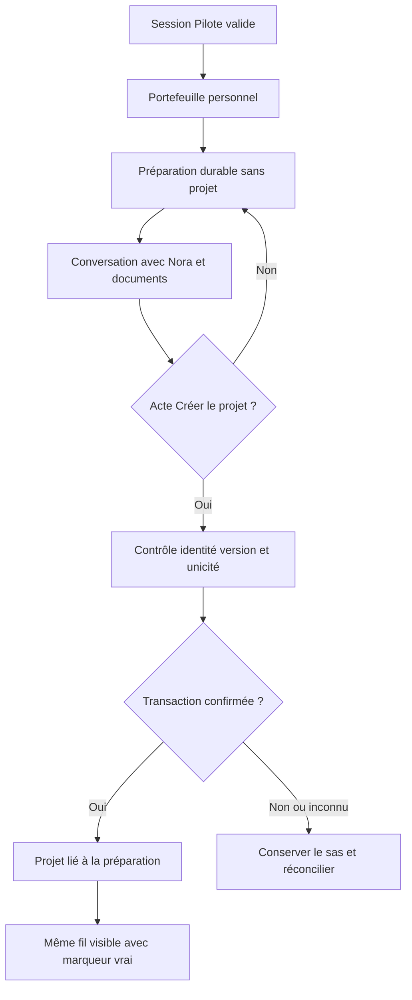

# SFIA Review Pack Full — Studio Next ML1 continuité D1–D2 — 2026-11-04

- Timestamp (Europe/Paris offset): `2026-11-04T10:42:31.010623+01:00`
- Cycle: `8 / INC / Critical`
- Macro-lot: ML1 entrée & continuité (même lot)
- Product version: `NO RELEASE` ; STABLE `NOT AVAILABLE` ; RC `NOT AVAILABLE`
- Lane: DEV local only
- Review Pack: Full, mono-cycle, reset artefact `.tmp-sfia-review/chatgpt-review.md`
- Project Git publish: **FORBIDDEN** this cycle (handoff L3 only)
- Secret handling: no `.env.local` content; credential-like literals expurgated

## 1. Git Truth Check

- branch: `sfia/next-access-preparation-continuity`
- HEAD: `61a6765a4e8d92760aab595b61b66aa2425906c6`
- origin/main: `61a6765a4e8d92760aab595b61b66aa2425906c6`
- baseline declared: `main@61a6765a4e8d92760aab595b61b66aa2425906c6`
- HEAD matches baseline: `True`
- remotes: origin → github.com/mcleland147/sfia-workspace (URL credential-expurgated)
- project commit/push/PR/merge this cycle: **none**
- dirty/untracked ML1 worktree: **PRESERVED**

### git status --short
```
M .tmp-sfia-review/chatgpt-review.md
 M projects/sfia-studio-next/construction/ml1-entree-et-continuite/specification-technique.md
?? projects/sfia-studio-next/CHANGELOG.md
?? projects/sfia-studio-next/construction/delivery-history.md
?? projects/sfia-studio-next/web/
```

### git diff --stat HEAD
```
.tmp-sfia-review/chatgpt-review.md                 | 4595 +++++++++++++++++++-
 .../specification-technique.md                     |   17 +
 2 files changed, 4485 insertions(+), 127 deletions(-)
```

### untracked (exclude-standard)
```
projects/sfia-studio-next/CHANGELOG.md
projects/sfia-studio-next/construction/delivery-history.md
projects/sfia-studio-next/web/.gitignore
projects/sfia-studio-next/web/README.md
projects/sfia-studio-next/web/docs/ux-figma-pending.md
projects/sfia-studio-next/web/drizzle.config.ts
projects/sfia-studio-next/web/eslint.config.mjs
projects/sfia-studio-next/web/next.config.ts
projects/sfia-studio-next/web/package-lock.json
projects/sfia-studio-next/web/package.json
projects/sfia-studio-next/web/playwright.config.ts
projects/sfia-studio-next/web/postcss.config.mjs
projects/sfia-studio-next/web/public/file.svg
projects/sfia-studio-next/web/public/globe.svg
projects/sfia-studio-next/web/public/next.svg
projects/sfia-studio-next/web/public/vercel.svg
projects/sfia-studio-next/web/public/window.svg
projects/sfia-studio-next/web/src/app/api/auth/[...all]/route.ts
projects/sfia-studio-next/web/src/app/api/dev/login/route.ts
projects/sfia-studio-next/web/src/app/api/portfolio/route.ts
projects/sfia-studio-next/web/src/app/api/preparations/[preparationId]/create-project/route.ts
projects/sfia-studio-next/web/src/app/api/preparations/[preparationId]/documents/route.ts
projects/sfia-studio-next/web/src/app/api/preparations/[preparationId]/messages/route.ts
projects/sfia-studio-next/web/src/app/api/preparations/[preparationId]/reconcile/route.ts
projects/sfia-studio-next/web/src/app/api/preparations/[preparationId]/route.ts
projects/sfia-studio-next/web/src/app/api/preparations/route.ts
projects/sfia-studio-next/web/src/app/api/projects/[projectId]/route.ts
projects/sfia-studio-next/web/src/app/favicon.ico
projects/sfia-studio-next/web/src/app/globals.css
projects/sfia-studio-next/web/src/app/layout.tsx
projects/sfia-studio-next/web/src/app/login/page.tsx
projects/sfia-studio-next/web/src/app/page.tsx
projects/sfia-studio-next/web/src/app/portfolio/page.tsx
projects/sfia-studio-next/web/src/app/preparations/[preparationId]/page.tsx
projects/sfia-studio-next/web/src/app/projects/[projectId]/page.tsx
projects/sfia-studio-next/web/src/db/client.ts
projects/sfia-studio-next/web/src/db/migrations/001_initial_studio_core.sql
projects/sfia-studio-next/web/src/db/migrations/002_session_auth_mode.sql
projects/sfia-studio-next/web/src/db/schema.ts
projects/sfia-studio-next/web/src/domains/boundaries/non-effects.ts
projects/sfia-studio-next/web/src/domains/conversation/nora-adapter.ts
projects/sfia-studio-next/web/src/domains/conversation/service.ts
projects/sfia-studio-next/web/src/domains/document/service.ts
projects/sfia-studio-next/web/src/domains/identity/portfolio.ts
projects/sfia-studio-next/web/src/domains/identity/provision-pilot.ts
projects/sfia-studio-next/web/src/domains/identity/session.ts
projects/sfia-studio-next/web/src/domains/preparation/create-project.ts
projects/sfia-studio-next/web/src/domains/preparation/project-context.ts
projects/sfia-studio-next/web/src/domains/preparation/service.ts
projects/sfia-studio-next/web/src/lib/auth.ts
projects/sfia-studio-next/web/src/lib/fingerprint.ts
projects/sfia-studio-next/web/src/lib/ids.ts
projects/sfia-studio-next/web/src/lib/product-version.ts
projects/sfia-studio-next/web/tailwind.config.ts
projects/sfia-studio-next/web/test-results/.last-run.json
projects/sfia-studio-next/web/tests/e2e/artifacts/ml1-continuity-1793783465162.png
projects/sfia-studio-next/web/tests/e2e/artifacts/ml1-continuity-1793785201773.png
projects/sfia-studio-next/web/tests/e2e/ml1-smoke.spec.ts
projects/sfia-studio-next/web/tests/integration/create-project.pg.test.ts
projects/sfia-studio-next/web/tests/integration/identity-session.pg.test.ts
projects/sfia-studio-next/web/tests/unit/fingerprint.test.ts
projects/sfia-studio-next/web/tests/unit/non-effects.test.ts
projects/sfia-studio-next/web/tsconfig.json
projects/sfia-studio-next/web/vitest.config.ts
```

## 2. Defects from prior ChatGPT review — confirmation on local code

| Defect | Verdict | Evidence |
| --- | --- | --- |
| A. Better Auth session not consumed by Studio | **CONFIRMED then FIXED** | was: `resolveStudioSession` only `sfia_studio_session`; now Better Auth `getSession` first + `ensurePilotForAuthUser` |
| B. Cross-prep idempotency orphans on CONFLICT | **CONFIRMED then FIXED** | was: project insert before `recordCommand`; now advisory xact lock + prior check before mutations; late race throws rollback |
| C. Portfolio reopen required `preparationId` query | **CONFIRMED then FIXED** | was: project page `searchParams.get('preparationId')`; now `GET /api/projects/:projectId` |

## 3. Changes this cycle (continuity pack)

- D1: `provision-pilot.ts`, Better Auth `databaseHooks`, `resolveStudioSession` bridge, DEV gate loopback+forwarded loopback-only
- D2: `create-project.ts` advisory lock + reconcile prep binding
- Continuité: `project-context.ts`, API route, project page, Playwright portfolio path
- Docs: CHANGELOG, delivery-history DELIV-03, spec §14, README
- Login: GitHub button via status+`sign-in/social` (lint-safe)
- Hygiene: removed hardcoded DATABASE_URL fallback from `vitest.config.ts`

## 4. ENV-01 / Versioning

- ENV ROUTING COMPLETE — DEV LOCAL VERIFIED: Docker `sfia-next-dev-pg` `127.0.0.1:5433` UP; app `127.0.0.1:3100`
- RECETTE/STABLE: NOT AVAILABLE / not touched
- Secrets (names only): `DATABASE_URL`, `BETTER_AUTH_SECRET`, `BETTER_AUTH_URL`, `STUDIO_DEV_TEST_LOGIN`, `STUDIO_LANE`, `STUDIO_PORT` = configured; `GITHUB_CLIENT_ID/SECRET` = missing → OAuth LIVE BLOCKED; `OPENAI_API_KEY` = not observed configured → Nora LIVE NOT RUN / fixture FAKE
- Version: NO RELEASE / 0.0.0-dev technical only

## 5. Fake / Real qualification

| Boundary | Adapter | Availability | Proof level | Claim allowed |
| --- | --- | --- | --- | --- |
| GitHub OAuth LIVE | Better Auth social | secrets missing | BLOCKED | no LIVE PASS |
| Identity→Pilot deterministic | ensurePilotForAuthUser + accounts row | DEV PG | PASS simulated | not LIVE OAuth |
| DEV login | createDevTestSession | loopback+DEV | PASS FAKE | not OAuth |
| PostgreSQL | drizzle/postgres.js | Docker DEV | REAL PASS | lane DEV only |
| Nora | Agents SDK / fixture | no key observed | FAKE fixture | no LIVE stream claim |
| Browser | Playwright | local chromium | REAL browser + FAKE identity | continuity path PASS |
| Figma native | pending doc | not re-fetched this cycle | REVIEW INCONCLUSIVE — RUNTIME SCREENSHOT REQUIRED for pixel fidelity | no exhaustive visual claim |

## 6. Commands executed (expurgated)

```
npm run test:unit          → 3 passed
npm run test:integration   → 21 passed (create-project 17 + identity-session 4)
npm run test:e2e           → 1 passed (portfolio reopen by projectId)
npx tsc --noEmit           → exit 0
npm run build              → compiled successfully; routes include /api/projects/[projectId]
npm run lint               → No ESLint warnings or errors
npm audit --omit=dev       → postcss via next (high); fix would force next@16 — OUT of safe patch scope this cycle; classified inherited
```

## 7. QA oracles A01–A16 (this cycle)

| Oracle | Status | Note |
| --- | --- | --- |
| A01 | PASS | prep without project |
| A02 | PARTIAL | Nora fixture FAKE; LIVE NOT RUN |
| A03 | PASS | create via dedicated command |
| A04 | PASS | concurrent same prep + A04c cross-prep concurrent |
| A05 | PARTIAL | replay ALREADY_CREATED; crash inject not done |
| A06 | PASS | stale revision CONFLICT |
| A07 | PASS | same thread after create |
| A08 | PASS | document identity survives |
| A09 | PASS | AVAILABLE only after persist; A09b FAILED inject |
| A10 | PASS | pilot isolation + A10c shared key string across pilots |
| A11 | OUT | Git D9 |
| A12 | PASS | homonyms |
| A13 | BLOCKED | OAuth LIVE |
| A14 | PASS | portfolio reopen without prep query (Playwright) |
| A15 | PARTIAL | layout/screenshot taken; Figma pixel not claimed |
| A16 | PARTIAL | new client read; full crash inject OUT |
| DATA-01 restore | OUT |

## 8. Coverage flags

- created/unpublished files full content: **yes** (except justified exceptions below)
- modified sections/diff useful: **yes** (spec §14 + continuity sources)
- synthesis only: **no**
- generated exceptions justified: **yes**
- review pack reset and single-cycle: **yes**
- handoff remote SHA and reread: **yes**
- handoff before: `62ed6e519fd530e2e3851155901cf6daeec834fd`
- handoff after: `d0fb5cf1ed2055c0ce32142461fedf5c3bc65c02`
- handoff blob: `deeb4bddde80f0bfda564b202a585916e59f588c`
- remote reread equality: yes
- push note: first attempt Internal Server Error / commit_refs_rules; retry succeeded fast-forward `62ed6e51..d0fb5cf1`

## 9. Generated / binary exceptions (not inlined)

| path | sha256 | bytes | reason |
| --- | --- | --- | --- |
| `projects/sfia-studio-next/web/package-lock.json` | `6968853ccd3d35e78d8ec5f6123808359abcd46380aee6905050ecdcd3685c54` | 358565 | binary/generated/lockfile — not inlined |
| `projects/sfia-studio-next/web/public/file.svg` | `2b67812c325c199a02536cdbeea0c593a72f707d323b72ee3e08dbab06753bd4` | 391 | binary/generated/lockfile — not inlined |
| `projects/sfia-studio-next/web/public/globe.svg` | `b614b9bf183925957661ac851498fe1d8029fd43a62fbfed86f9e2624a57e7cf` | 1035 | binary/generated/lockfile — not inlined |
| `projects/sfia-studio-next/web/public/next.svg` | `55995dfad6ecb4945a1e856ddca03c5e16aa5bf13fd21b4df6a74ae79357bcfc` | 1375 | binary/generated/lockfile — not inlined |
| `projects/sfia-studio-next/web/public/vercel.svg` | `f081337b2fee635b455b63275406a3e7f39d6a014e25ad90dab5a67e62a12ac4` | 128 | binary/generated/lockfile — not inlined |
| `projects/sfia-studio-next/web/public/window.svg` | `644768c4aaeb4767bce293344eeb0c125fb804a94d801440424072202d85e3a1` | 385 | binary/generated/lockfile — not inlined |
| `projects/sfia-studio-next/web/src/app/favicon.ico` | `2b8ad2d33455a8f736fc3a8ebf8f0bdea8848ad4c0db48a2833bd0f9cd775932` | 25931 | binary/generated/lockfile — not inlined |
| `projects/sfia-studio-next/web/tests/e2e/artifacts/ml1-continuity-1793783465162.png` | `b6068b7dc3eada8d89004273c550267a7301df37a039ad5610916b751bcf3ee0` | 94179 | binary/generated/lockfile — not inlined |
| `projects/sfia-studio-next/web/tests/e2e/artifacts/ml1-continuity-1793785201773.png` | `290b3f287bd3ba0942b58d5b813ed53579acec9e170ce639b8b026219bfa767b` | 109154 | binary/generated/lockfile — not inlined |

## 10. Critical continuity sources (also included in §11 full tree)

- `projects/sfia-studio-next/web/src/lib/auth.ts`
- `projects/sfia-studio-next/web/src/domains/identity/session.ts`
- `projects/sfia-studio-next/web/src/domains/identity/provision-pilot.ts`
- `projects/sfia-studio-next/web/src/domains/preparation/create-project.ts`
- `projects/sfia-studio-next/web/src/domains/preparation/project-context.ts`
- `projects/sfia-studio-next/web/src/app/api/projects/[projectId]/route.ts`
- `projects/sfia-studio-next/web/src/app/projects/[projectId]/page.tsx`
- `projects/sfia-studio-next/web/src/app/api/dev/login/route.ts`
- `projects/sfia-studio-next/web/src/app/login/page.tsx`
- `projects/sfia-studio-next/web/tests/integration/identity-session.pg.test.ts`
- `projects/sfia-studio-next/web/tests/integration/create-project.pg.test.ts`
- `projects/sfia-studio-next/web/tests/e2e/ml1-smoke.spec.ts`

## 11. Full unpublished / local manuscript sources

### `projects/sfia-studio-next/CHANGELOG.md`

```md
# Changelog — SFIA Studio Next (product)

No promoted product release yet.

## Unreleased
## Unreleased — local corrective continuité D1–D2 2026-11-04

- D1: Better Auth session → PilotId bridge (`ensurePilotForAuthUser` + `resolveStudioSession`); DEV login remains isolated adapter; loopback gate also checks `x-forwarded-*` (non-loopback rejected).
- D2: `pg_advisory_xact_lock(pilotId, idempotencyKey)` before mutations; cross-preparation same-key CONFLICT leaves zero orphans; reconcile binds key to `preparationId`.
- Continuité: `GET /api/projects/:projectId` owner-scoped reopen without `preparationId` query; portfolio → project Playwright path.
- Proof: unit 3 PASS; integration 21 PASS; Playwright 1 PASS; `next build` PASS; `tsc --noEmit` PASS.
- STABLE/RC still NOT AVAILABLE / NO RELEASE.

## Unreleased — local corrective consolidation critique 2026-11-04

- Security: Next.js upgraded 15.1.3 → 15.5.29 (patched 15.5 line).
- D2: idempotency fingerprint evaluated under preparation lock; conflict on same key/different payload.
- D4: document edits require owner + preparationId; SAVING→AVAILABLE/FAILED honest states.
- D3: OpenAI Agents SDK behind adapter when key present; fixture FAKE otherwise; no MemorySession authority.
- D1: session `auth_mode` provenance; Better Auth mount; DEV login loopback/DEV-lane fail-closed.
- Proof: Vitest integration 13 PASS; Playwright browser smoke PASS (DEV fake login).
- STABLE/RC still NOT AVAILABLE / NO RELEASE.

- Local DEV construction of access / preparation / Nora / first document / explicit project creation.
- **STABLE: NOT AVAILABLE**
- **No RC attributed** until Morris gate on a frozen candidate.
```

### `projects/sfia-studio-next/construction/delivery-history.md`

```md
# SFIA Studio Next — Delivery history

Append-only logical journal of Cursor product deliveries.
**Product STABLE: NOT AVAILABLE.** Entries may be `NO RELEASE`.

## delivery_id: DELIV-2026-11-04-ML1-LOCAL-01

| Field | Value |
| --- | --- |
| Date | 2026-11-04 (Europe/Paris) |
| Macro-lot | R5 / entrée & continuité (premier vertical) |
| Type | INC / nouvelle capacité, pré-1.0 |
| Branch | `sfia/next-access-preparation-continuity` (local only — not published) |
| Base | `origin/main@61a6765a4e8d92760aab595b61b66aa2425906c6` |
| Working tree | local uncommitted construction under `projects/sfia-studio-next/web` |
| Product version target | `NO RELEASE` (proposal `0.1.0-rc.1` not attributed) |
| Lane | DEV (`127.0.0.1:3100`, Postgres `5433`) |
| Schema revision | `001_initial_studio_core` |
| Tests | Vitest unit + PostgreSQL integration (see web test run) |
| Evidence limits | GitHub OAuth LIVE BLOCKED without secrets; OpenAI LIVE optional; Figma native pending; RECETTE NOT AVAILABLE |
| Status | LOCAL CONSTRUCTION — no project push/PR/merge |

## delivery_id: DELIV-2026-11-04-ML1-LOCAL-02-CRITIQUE

| Field | Value |
| --- | --- |
| Date | 2026-11-04 (Europe/Paris) |
| Macro-lot | R5 / ML1 consolidation critique (same lot) |
| Type | INC corrective / same vertical |
| Branch | `sfia/next-access-preparation-continuity` (local only — not published) |
| Base | `origin/main@61a6765a4e8d92760aab595b61b66aa2425906c6` |
| Changes | Next 15.5.29; D2 fingerprint under lock; D4 prep-scoped docs + SAVING; D3 Agents SDK adapter; D1 authMode + Better Auth mount + loopback DEV login; Playwright smoke PASS |
| Product version | `NO RELEASE` |
| Lane | DEV |
| Schema | `001_initial_studio_core` + `002_session_auth_mode` |
| Tests | unit 3 PASS; integration 13 PASS; Playwright 1 PASS |
| Status | LOCAL CORRECTIVE — no project push/PR/merge |

## delivery_id: DELIV-2026-11-04-ML1-LOCAL-03-CONTINUITE

| Field | Value |
| --- | --- |
| Date | 2026-11-04 (Europe/Paris) |
| Macro-lot | R5 / ML1 continuité D1–D2 (same lot) |
| Type | INC corrective / same vertical |
| Branch | `sfia/next-access-preparation-continuity` (local only — not published) |
| Base | `origin/main@61a6765a4e8d92760aab595b61b66aa2425906c6` |
| Changes | Better Auth→PilotId session bridge; advisory-lock atomic idempotency across preparations; project reopen by projectId API/UI; Playwright portfolio path |
| Product version | `NO RELEASE` |
| Lane | DEV |
| Schema | unchanged (`001` + `002`) |
| Tests | unit 3 PASS; integration 21 PASS; Playwright 1 PASS; build+tsc PASS |
| Status | LOCAL CORRECTIVE — no project push/PR/merge |
```

### `projects/sfia-studio-next/construction/ml1-entree-et-continuite/specification-technique.md`

```md
# SFIA Studio Next — R5 / ML1 — Spécification technique candidate

> **État Git au versement (2026-11-04) :** publication documentaire candidate sur `docs/next-r5-delivery-preparation-20261104`, base `main@a0b80b9ecd64149ed51f87235ae246e197e66462`. Ni `VALIDATED SPEC`, ni merge, ni GO Cursor. Les formules `NOT ON GIT` et `NO GIT WRITE` dans les historiques décrivent leur état à la rédaction, pas cette publication.

## Entrer, dialoguer et créer un projet avec continuité

| Champ | Qualification |
|---|---|
| Version | **v0.3 — proposition technique groupée après revue (2026-11-04)** |
| Nature | **D0 / conception technique candidate révisée après revue de cohérence R2–R4** ; pas une exécution, pas un prompt Cursor |
| Statut | **DOCUMENTED / REVIEWED CANDIDATE WITH OPEN DECISIONS / NOT VALIDATED SPEC / NOT IMPLEMENTED** |
| GO constaté | Morris autorise la consolidation documentaire R5 et la préparation de la spécification ML1 ; **aucune autorisation de code, PR, merge ou promotion** n'en découle ; la publication documentaire candidate est autorisée séparément le 2026-11-04 |
| Dépôt | `mcleland147/sfia-workspace`, `main@a0b80b9ecd64149ed51f87235ae246e197e66462` ; PR #646 `MERGED` ; local/worktrees **NON OBSERVÉS** |
| Référentiel de delivery | [`../reference-delivery-r5.md`](../reference-delivery-r5.md) — référence de préparation R5 candidate |
| Traçabilité | [matrice ML1](matrice-tracabilite.md) et [inventaire R2](inventaire-r2.csv) |
| Runtime Next | **N/A — NON IMPLÉMENTÉ** ; zéro test Next exécuté, zéro preuve BROWSER/LIVE/REAL |

> **Règle de lecture** — Les sections « **INVARIANT VALIDÉ** » restituent les contraintes des sources R1–R4 et de leurs décisions. Les sections « **PROPOSITION TECHNIQUE R5** » décrivent une solution candidate à discuter au bon niveau avant qu'elle devienne une spécification approuvée. Les **questions ouvertes** ne sont pas des détails autorisés à improviser dans Cursor. Aucun nom d'API, nom de table ou état technique proposé ci-dessous n'est une décision d'implémentation déjà adoptée.

## 1. Résultat utilisateur, frontière et définition de terminé

**Résultat produit attendu** : un Pilote s'authentifie, consulte son portefeuille personnel, ouvre un sas, travaille utilement avec Nora sans projet/cycle/dépôt préexistant, retrouve son travail après interruption, décide explicitement de créer le projet, puis continue le **même fil visible**, avec documents et acquis réellement conservés et sans création ou transfert fictif.

**E2E propriétaire :** [R1 §2.30 — E2E 01 sas→projet](https://github.com/mcleland147/sfia-workspace/blob/main/projects/sfia-studio-next/cadrage/vision-produit.md). Interfaces : E2E 03 (Nora utile), E2E 04 (continuité), E2E 07 (droits sur sources), sans prétendre réaliser entièrement ces trois E2E dans ML1.

**IN ML1** :

- Identité Studio/session et isolation de deux Pilotes ; portefeuille non conversationnel, navigation vers un projet existant et accès au sas ; pas de permission Git déduite de la connexion.
- Préparation persistée et récupérable avant création ; messages utiles, aperçu de projet propositionnel ; acte explicite de création et résultat vérifié.
- Conversation Nora effectivement utilisable sans cycle ni méthode obligatoire ; contexte du bon propriétaire, provenance et limites exposées.
- Création de projet avec unicité, transaction, relecture après perte d'accusé, erreurs/refus, lien durable à la préparation ; transition du fil avec marqueur vrai.
- **Premier document produit dans le sas**, avec identité et état de conservation honnêtes. Le modèle d'identité/version doit permettre ML2, mais **pas** la bibliothèque documentaire et la révision avancée complètes.
- Fondations opérationnelles nécessaires à une première verticale utilisable : PostgreSQL, migrations, secrets et DEV/RECETTE isolés ; STABLE seulement après décision distincte selon ENV-01.
- Tests et preuves de ML1 pendant sa construction, y compris les cas négatifs de R4 QA A01–A16 et la conformité R3 sur les surfaces réellement livrées.

**OUT ML1 — frontières positives à préserver** :

- Gestion détaillée des sujets/connaissances et révision documentaire complète (**ML2**) ; cycle, CKI actif, méthode/trajectoire et décision gouvernée complète (**ML3**) ; intégration Git complète (**ML4**) ; contrat d'exécution/dispatch Cursor, preuves D8 et acceptation finale (**ML5**).
- Suppression/transfert/partage d'un projet : non défini comme fonction de navigation par `RG-ACC-024` ; ne pas créer une capacité implicite.
- Tout effecteur externe initié par du texte Nora ou une simple navigation ; pas d'ouverture automatique de cycle, dépôt ou tentative.

**Condition de complétude ML1** : l'E2E 01 doit être réellement démontré en RECETTE sur un SHA figé avec autorité correcte, DB PostgreSQL, parcours navigateur, reprise après coupure et non-duplication. Le verdict reste borné aux fonctions et dépendances réellement qualifiées ; R6 et ADOPTED restent distincts.

## 2. Références canoniques et couverture

| Axe | Sources propriétaires ; portée concrète |
|---|---|
| R1 | `cadrage/vision-produit.md` §2.30 (E2E 01) + interfaces §§2.32, 2.33, 2.36 et addendum §2.41. |
| R2 D1 | `conception-fonctionnelle/acces-et-portefeuille.md`, **25 `RG-ACC-001..025` et 24 `PF-ACC-01..24`** inventoriés : couverture ML1 ou frontière négative/interface. |
| R2 D2 | `conception-fonctionnelle/creation-de-projet-et-continuite-du-sas.md`, **27 `RG-CRE-001..027` et 27 `PF-CRE-01..27`**, dont le complément documentaire du sas `CRE-027`. |
| R2 D3/D4 | D3 `RG-CONV-001..006`, `RG-CTX-001..008`, `RG-AUTH-001`, `RG-UX-*` pertinents ; D4 `RG-KNOW-002/006/011/014/015/016..020`, PF de reprise. Pas d'appropriation complète de D3/D4 par ML1. |
| R3 | `ux-ui/espace-projet-interaction-pilote-nora.md`, `contrat-transposition-figma-code.md`, manifeste `index-geometrie-frames-r3.json` ; Figma `fileKey=itgvCulInEnFY6DvgIegvP`, page 01 `94:49` ; voir §6. |
| R4 | `architecture-technique/cadrage-r4.md` §§5.3.3–5.3.9 et §8.1 ; décision ADR **R4-01/R4-02**, frontières R4-03/R4-04, politique **DATA-01**, gouvernance **ENV-01**. |
| QA | `A01..A16` du cadrage R4 §5.3.9 ; **oracles candidats non exécutés**, répartis aux fonctionnalités §7. |
| Référentiel | La matrice ML1 v0.3 détaille les liaisons R1/R2/R3/R4/QA ; le CSV vérifie les **103 identifiants D1/D2**, sans garantir 103 comportements déjà couverts. |

**Règle de couverture :** chaque fonctionnalité ci-dessous hérite des exigences identifiées ; les renvois plusieurs-à-plusieurs sont autorisés. Aucun `PF` ne devient un test PASS par la seule présence dans le tableau. Les frontières négatives ou différées sont conservées avec propriétaire et exit.

## 3. Architecture de la capacité — décisions acquises et propositions

### 3.1. Frontières fonctionnelles et propriétaires

**INVARIANTS VALIDÉS R4 :** application neuve **modulaire**, un propriétaire de vérité par objet/effet ; **préparation durable indépendante du projet**, rattachement transactionnel lors de la création explicite ; **PostgreSQL** dès le premier incrément R5 ; pas de base concurrente pour la vérité transactionnelle du produit ; aucun effet externe autorisé par Nora seule ; Git facultatif.

| Responsabilité | Domaine propriétaire | Contrat ML1 | Interdiction |
|---|---|---|---|
| Identité, session et portfolio | D1 | Résoudre un Pilote et une session valides ; lire seulement ses projets et préparations | Pas de token de dépôt ou de HumanDecision déduit de l'authentification |
| Préparation et création | D2 | Accepter, versionner, créer et rattacher une préparation au projet du même Pilote | Pas de projet créé par une réponse Nora, une lecture ou un clic non dédié |
| Conversation, messages, activité cognitive et contexte | **D3** | Produire et conserver durablement les messages et leur statut ; composer le contexte du bon sas/projet avec contrôle d'accès | Pas de délégation de propriété des messages à D4 ni de second moteur d'autorité |
| Documents, connaissance, acquis et provenance | **D4** | Posséder l'identité/version des ressources documentaires et la connaissance durable ; fournir des références/provenances à D3 | Pas de copie de la vérité de conversation ou de déclaration de sauvegarde fictive |
| Décisions humaines et cycles | D6 / D5 | Interfaces de non-effet et refus si action hors ML1 | Aucune création implicite de GO, mandat, cycle ou méthode |
| Git/exécution | D9 / D7 / D8 | Interfaces hors portée, aucune dépendance de démarrage | Pas de création de dépôt, commande Cursor ni preuve d'effet inventée |

**PROPOSITION TECHNIQUE R5** : implémenter ces frontières comme des **modules logiques d'une seule application web**, raccordés à un noyau transactionnel PostgreSQL et à des adaptateurs pour les services externes éventuellement utilisés. Il ne s'agit pas d'un microservice par domaine. La **stack web, l'ORM, la bibliothèque d'authentification, le protocole agent et l'outil de migration ne sont pas choisis par R4** : leur sélection technique est à instruire dans ML1, sans copier ceux de l'ancien Studio par inertie.

### 3.2. Flux nominal et synchronisation


```mermaid
flowchart TD
    A[Session Pilote valide] --> B[Portefeuille personnel]
    B --> C[Préparation durable sans projet]
    C --> D[Conversation avec Nora et documents]
    D --> E{Acte Créer le projet ?}
    E -- Non --> C
    E -- Oui --> F[Contrôle identité version et unicité]
    F --> G{Transaction confirmée ?}
    G -- Oui --> H[Projet lié à la préparation]
    H --> I[Même fil visible avec marqueur vrai]
    G -- Non ou inconnu --> J[Conserver le sas et réconcilier]
```

**À garantir** : chaque transition UI repose sur la lecture du propriétaire de l'état, pas sur un message d'IA ou l'optimisme client ; les données et opérations non couvertes par la transaction conservent leurs états réels.

## 4. Spécifications techniques par fonctionnalité

### 4.1. Identité Studio et session — `ML1-IDENTITY`

**R2 :** `RG-ACC-001..007`, `RG-ACC-015/021`, `PF-ACC-01..04`, `PF-ACC-10/13/17/24` et `RG-CRE-009`. **QA :** `A10`, plus sécurité négative dans `A01/A03/A14`.

**Comportement contractuel :** un Pilote connecté a une identité interne stable ; une session expirée/révoquée ne lui permet ni lecture privée ni création ; deux comptes utilisant éventuellement un dépôt commun voient des préparations et projets disjoints. Les droits de dépôt Git ne sont jamais inférés de la simple connexion Studio. Une identité ne devient pas un acte d'autorité D6.

**Proposition technique à évaluer** :

- Utiliser une connexion GitHub personnelle **pour l'identité Studio**, avec un mécanisme de session serveur et une identité interne immuable ; choisir au lot les modalités concrètes de validation, stockage/rotation des sessions et de révocation, sous les garanties R2/ENV-01.
- Associer les ressources persistantes à l'ID interne du Pilote, pas au nom d'affichage ni à un identifiant de dépôt. Toute requête/commande protégée revalide session et propriété côté serveur ; contrôles répétés après changement de session.
- Une session web contient au plus les références nécessaires à la vérification et ne constitue pas le registre de projet ni la vérité du sas. Exclure de la réponse client et des journaux les secrets d'authentification.

**Erreurs / observations** : session invalide → refus et reconnexion ; propriétaire différent → refus sans fuite d'existence ; authentification externe indisponible → impossibilité d'effectuer la commande protégée, sans emprunter des credentials d'une autre lane. **Tests de construction** : deux comptes, session expirée, réutilisation d'URL, requête forgeable, droits retirés, absence d'accès au projet tiers.

**Décision ouverte de lot** : méthode d'identité/session concrète et persistance des sessions. **Aucun changement d'architecture R4 n'est requis tant que l'isolation, la révocation et l'indépendance Git sont démontrées.**

### 4.2. Portefeuille et navigation — `ML1-PORTFOLIO` / `ML1-SAS-ENTRY`

**R2 :** `RG-ACC-008..014/016..018/020/022..025`, `PF-ACC-05/07..09/11..15/20/21`. **QA :** `A01`, `A12`, `A14`, `A15`.

**Contrats de lecture** : l'API de portefeuille — forme à choisir — récupère les **projets effectivement persistés appartenant à la session courante**, leurs statuts s'ils sont connus, et les liens utiles pour retrouver les préparations non créées. Le cockpit ne possède **pas** de Nora globale ni de cycle créé par navigation. Une route périmée ne fabrique ni fiche projet ni réponse rassurante fictive.

**Contrats d'état UI** : connecté/sans projet/plusieurs projets/session expirée/liste indisponible/projet supprimé ou inaccessible ; lorsqu'une donnée de progression n'est pas connue, ne pas produire une valeur de secours. Un titre projet homonyme n'est jamais un identifiant. Toute carte/aperçu respecte le même filtre d'accès que l'ouverture détaillée.

**Hors portée explicite** : supprimer, transférer ou partager un projet. Le contrôle négatif doit vérifier qu'aucune action sensible n'est autorisée par la navigation.

**Proposition technique** : query backend dédiée, pagination/recherche seulement si nécessaire au cas réel ; gestion d'URL/version de route indépendante de la session cognitive ; contrôle de permissions à chaque ouverture. Ne pas installer une couche de recherche ou un cache autorisant si PostgreSQL suffit à la première verticale.

### 4.3. Préparation durable et conversation initiale — `ML1-SAS-DURABLE` / `ML1-NORA-PREVIEW`

**R2 :** `RG-CRE-001..007/015/016/019/022/023/026`, `PF-CRE-01..06/13/17/20/21/23/26`, `RG-CONV-001..006`, `RG-CTX-001..008`, D4 `RG-KNOW-002/006/011/014/015`. **QA :** `A01`, `A02`, `A06`, `A11`, `A13`, `A16`.

**Invariants** :

- Préparation persistée, personnelle, **sans projet obligatoire**. Navigation, abandon ou déconnexion ne convertissent pas la préparation en projet.
- Nora peut investiguer, produire et proposer un aperçu utile **sans** formulaire exhaustif, ouverture de cycle ni méthode imposée. Un nom, une trajectoire ou un résumé proposé restent des propositions non autorisantes.
- **D3 conserve la vérité des conversations/messages** (ordre, statut, corrélation de génération, lien au sas/projet). **D4 conserve la vérité des documents et connaissances** (identité de ressource/version, source, provenance, état des octets). Les deux partagent la transaction PostgreSQL lorsque nécessaire, sans double propriétaire. Le modèle consomme une **sélection** de contexte ; le fil visible n'exige pas la réinjection du transcript entier.
- Source externe non disponible/révoquée : ne pas reconstituer ses données, permissions ou faits ; les métadonnées de provenance restent bornées à ce qui est légitime.

**Proposition technique d'interface** (noms conceptuels uniquement) :

| Opération logique | Entrées minimales | Sortie / garantie | Échecs à prévoir |
|---|---|---|---|
| Ouvrir/reprendre préparation | identité, `preparationId?` | préparation existante ou nouvelle identité durable, aucun Project | `FORBIDDEN`, `NOT_FOUND`, `UNAVAILABLE` |
| Ajouter un message utilisateur | `preparationId`, contenu, version ou clé de requête | message accepté avec identité/ordre/état de persistance | session perdue, collision, rejet, ACK perdu |
| Demander une réponse Nora | conversation courante, contexte autorisé, limites et ressources disponibles | réponse reliée à son message et au bon contexte, événements réellement connus | fournisseur indisponible, interruption, sortie partielle |
| Consulter l'aperçu | préparation et sa version actuelle | représentation propositionnelle et sa provenance | version obsolète, champs manquants |

**Contrat d'intégration cognitive minimal recommandé (candidat R5)** :

1. L'entrée utilisateur obtient une identité et un état de persistance D3 **avant** l'appel au fournisseur ; une clé de requête évite la duplication au renouvellement du transport.
2. Un identifiant de génération corrèle fournisseur, conversation, message produit et éventuelles sorties partielles. Les fragments affichés pendant le streaming sont **provisoires** tant que leur état durable n'est pas confirmé.
3. Une réponse terminée est enregistrée comme telle uniquement après confirmation de sa conservation ; interruption, timeout et sortie perdue restent `PARTIAL`, `FAILED` ou `UNKNOWN` selon observation. **Pas de relance automatique du fournisseur après ACK perdu** sans stratégie vérifiable de déduplication.
4. Une demande suivante récupère une sélection de messages D3 et d'acquis D4 **sous les droits actuels**, sans seconde base propriétaire de mémoire ni transformation d'une citation en autorisation.
5. Aucun outil exposé à Nora dans ML1 ne peut appeler la commande D2 `CréerProjet`, créer un cycle, une ressource Git ou déclencher Cursor.

**À arrêter avant code**, dans le contrat d'exécution du lot : fournisseur/API/SDK, contrat des événements de streaming, stratégie d'annulation effectivement supportée, budgets/erreurs et politique de conservation des sorties. Une vraie conversation Nora devra être observée en RECETTE ; un stub seul ne suffit pas à déclarer E2E 01 complet.

**Reprise réelle** : après reload, nouvelle conversation ou redémarrage serveur, relire la préparation/messages/ressources persistés ; afficher ce qui est sauvé et les limites du reste. L'absence de fournisseur Nora ne doit pas détruire le sas ou la conversation déjà enregistrée.

### 4.4. Création explicite et transactionnelle — `ML1-CREATE`

**R2 :** `RG-CRE-008..014/016/020/024/025`, `PF-CRE-07..12/14/16/24/25`, `RG-ACC-002/005`, ADR R4-02 ; **QA :** `A03`, `A04`, `A05`, `A06`, `A10`, `A12`, `A15`.

**INVARIANTS VALIDÉS** : l'acte « Créer le projet » est dédié, imputable au Pilote et distinct d'un accord conversationnel. Projet et association à la préparation ont un **point de validation transactionnel commun**. Une préparation ne fonde pas deux projets du même acte intentionnel ; un double clic ou une réponse perdue doit retrouver le résultat existant ou exposer une incertitude vraie, jamais fabriquer un doublon ou annoncer un succès sans constat. Pas de cycle, mandat ou dépôt Git créé à cet effet.

**PROPOSITION TECHNIQUE R5 — contrat logique de commande** :

```text
CréerProjet (nom illustratif, API/route NON DÉCIDÉES)
  acteur : identité Studio relue côté serveur
  contexte : preparationId
  contrôle : expectedCreationRevision de l'aperçu inspecté (non la révision de chaque message)
  opération : idempotencyKey stable + empreinte canonique des données approuvées
  données approuvées : informations minimales du projet affichées au Pilote

Résultat logique proposé :
  CREATED(projectRef, preparationRef, committedAt)
  ALREADY_CREATED(projectRef, preparationRef)
  CONFLICT(actualPreparationRevision)
  FORBIDDEN / SESSION_INVALID / INVALID_REQUEST
  NOT_CONFIRMED_OR_UNKNOWN (avant une réconciliation fiable)
```

**Séquence transactionnelle candidate** :

1. Vérifier côté serveur la session, la propriété de la préparation et la provenance de la **commande dédiée** (aucun outil Nora ne possède cette capacité) ; protéger la mutation contre CSRF et rejeu selon le mode de session retenu. Une indication client « bouton cliqué » ne suffit pas comme preuve.
2. Chercher d'abord le **résultat durable de la même clé d'idempotence** dans son contexte : si l'empreinte est identique, retourner le résultat déjà committé ; si elle diffère, répondre `CONFLICT`. Cette recherche précède le refus de version devenue obsolète pour qu'un replay après commit reste idempotent.
3. À défaut d'opération antérieure, vérifier `expectedCreationRevision` contre la version des **champs de création effectivement inspectés** — pas chaque message — et les informations minimales approuvées.
4. Dans **une transaction PostgreSQL**, vérifier l'unicité réelle par préparation, insérer le projet et son owner, enregistrer le lien préparation→projet, la clé/empreinte et le résultat de commande ; assurer les contraintes SQL même face à deux requêtes simultanées.
5. Confirmer puis relire l'état durable pour afficher `CREATED`/`ALREADY_CREATED`. La relecture de réconciliation est **sans effet** ; si l'existence reste invérifiable, conserver `UNKNOWN`, sans seconde création automatique ni faux marqueur.
6. Garantir que l'horizon de conservation de la déduplication couvre effectivement la durée pendant laquelle la même préparation peut être réutilisée : une expiration arbitraire de clé ne doit jamais rouvrir la possibilité d'un deuxième projet.

**Contraintes d'intégrité nécessaires**, à traduire en DDL selon le modèle final : unicité effective de l'association création/préparation ; FK et propriété cohérentes ; clé d'opération dédupliquée dans son contexte ; version de préparation protégée contre écrasement concurrent ; audit expurgé de l'acte. La stratégie précise (`UNIQUE`, isolation, locks, upsert, représentation du résultat) est à choisir et **prouver avec de vraies transactions PostgreSQL**.

**Postconditions** : le projet retrouvé appartient au Pilote, l'association est stable, le portefeuille le retrouve, l'UI passe au contexte projet **uniquement si l'effet est confirmé**, le fil de préparation est toujours accessible. Une transaction ratée ne modifie pas les faits ni la vérité de l'aperçu.

**Erreurs discriminantes** : deux clics simultanés ; timeout **après** commit ; timeout **avant** commit ; version périmée ; changement de compte ; noms identiques ; ressources du sas encore `SAVING` ; suppression de session pendant l'acte.

### 4.5. Continuité du fil et réhydratation — `ML1-CONTINUITY`

**R2 :** `RG-CRE-017..024/026`, `PF-CRE-15..23/25`, D3 `RG-CTX-002/004/006`, D4 `RG-KNOW-006/011/015`. **QA :** `A05`, `A07`, `A11`, `A13`, `A16`.

**Contrat** : après création confirmée, la conversation initiale du sas reste visible et ordonnée dans l'espace projet ; un marqueur explicite précise le passage, fondé sur un fait transactionnel ; les acquis et sources conservent leur qualification, sans transformation des hypothèses en décisions ou faits. En état inconnu, rester dans le sas jusqu'à réconciliation.

**Proposition technique** : les identifiants de préparation et conversation ont une durée indépendante de l'objet Project ; le contexte projet se **résout** depuis un lien transactionnel plutôt que par duplication du transcript. L'identité technique de conversation strictement inchangée est une **solution candidate**, pas une obligation fonctionnelle R2 : c'est la **continuité du même fil visible** qui est validée. Une projection UI peut exploiter les mêmes messages et la date de création, sous contrôle d'accès courant.

**Épreuves pertinentes** : recharge serveur après commit, nouvelle session, message parti avant crash, ressource inaccessible, réouverture depuis portefeuille et ordre des messages. Distinction impérative entre message visible sauvegardé et contexte que le modèle a effectivement rechargé pour générer sa réponse.

### 4.6. Premier document du sas — `ML1-SAS-DOCUMENT`

**R2 :** `RG-CRE-027`, `PF-CRE-27`, D4 `RG-KNOW-016..020`, `RG-KNOW-006/014/015`, addendum R1 §2.41. **QA :** `A08`, `A09`, `A13`, `A16`.

**Contrat** : Nora peut produire un contenu documentaire avant l'existence d'un Project ; l'identité de ressource, son propriétaire, sa version, sa provenance et l'état d'enregistrement sont réels. Au moment de la création, la ressource devient retrouvable depuis le projet **sans** copie ou nouvelle vérité officielle. `SAVING`/`SAVED`/`FAILED`/`UNKNOWN` désignent ici des **catégories conceptuelles de véracité** reprises de R2, pas une table déjà décidée.

**Proposition technique** : métadonnées canoniques/version chez D4 ; **pour le premier document textuel ML1**, privilégier le contenu et son identité/version dans PostgreSQL pour limiter les états distribués. Une sortie vers un stockage de fichiers/objets reste **une option à motiver par volumétrie, nature des pièces et coût**, sans l'introduire seulement par héritage. Le contrat doit garder une abstraction de ressource stable pour ML2 ; confirmer séparément la réussite de chaque stockage réellement utilisé. Une écriture des octets échouée ne devient pas `SAVED` au motif que le texte figure dans Nora. L'association sas→projet ne doit pas dépendre d'une sauvegarde de document non indispensable (arbitrage R4 A et politique DATA-01).

**Ne pas construire ML2 dans ML1** : pas de gestion complète des bibliothèques, de comparaison visuelle avancée des versions ni de moteur de workflow documentaire ; seulement une identité/écriture/lecture minimale saine et extensible.

### 4.7. Obligations transversales de sécurité, données et robustesse

- **Séparation des comptes** : session serveur et vérification de propriété sur requêtes, objets et relations ; pas de fuite dans erreurs, listes, journaux, URL et éventuelle mémoire du fournisseur Nora.
- **Versions et concurrence** : audit des actes, contrôle optimistic/transactionnel approprié, idempotence sur commandes à effet, reprise sur état réellement persisté ; ne pas prétendre qu'une transaction SQL englobe les effets d'un fournisseur externe.
- **Provenance et épistémologie** : source candidate ≠ `main`, réponse Nora ≠ décision, brouillon ≠ document sauvegardé, état client ≠ vérité persistante.
- **DATA-01** : préparations sans purge automatique ; archivage non destructif après **90 jours** d'inactivité ; corbeille après suppression **30 jours** ; logs techniques non critiques **environ 14 jours** ; sauvegardes chiffrées et tests de restauration selon politique de lane. Les détails de minimisation, effacement légal, stockage de preuves et copies de sauvegarde sont des réserves à instruire lors du mécanisme réel. N'inventer ni tâche planifiée ni purge déjà en fonctionnement.
- **ENV-01** : secrets, identités de test et DSN isolés par lane ; refus explicite en cas de configuration incorrecte ; pas d'accès à STABLE par commodité. Fondations opérationnelles intégrées dans ML1, pas micro-projet d'infrastructure.

## 5. Modèle de données conceptuel et contrats d'intégrité

Ce tableau **n'est pas un DDL approuvé**. Il identifie les données dont ML1 doit garantir l'existence et la cohérence ; **noms des tables, colonnes, indices et API seront précisés au sein du lot avant leur création**.

| Concept durable | Identité et portée attendues | Invariant / mécanisme à concevoir | Propriétaire logique |
|---|---|---|---|
| Pilote Studio | ID interne stable + identité externe vérifiée | séparation de comptes, session/révocation vérifiables | D1 |
| Préparation | ID, owner, état, version, dates, données propositionnelles | existe sans projet ; durable ; archive selon DATA-01 | D2 |
| Conversation/message/génération | ID durable, owner, préparation/contexte résolus, ordre, état, corrélation fournisseur | D3 est **propriétaire unique des messages** ; aucun succès affiché depuis un fragment provisoire | **D3** |
| Projet | ID stable, owner, données minimales et dates | projet personnel et réellement enregistré ; homonymie possible | D2 avec lecture D1 |
| Association création | preparationRef↔projectRef + opération de création | transaction et contrainte d'unicité, pas de duplication de fil | D2 |
| Opération à effet | référence stable et issue observable | déduplication, statut connu/inconnu, corrélation avec acte | D2 |
| Ressource documentaire/version | ID ressource, ID version, propriétaire, provenance, état | **D4 est propriétaire** ; pas de sauvegarde fictive ni de doublon après création ; stockage de contenu réellement contrôlé | **D4** |

**Arbitrages techniques ordinaires à documenter dans le lot** : format d'identifiant, clefs étrangères et uniques, contrôle de version, comportement de la session web, protocole des réponses Nora, gestion de fichiers. **Arbitrages Morris nécessaires** si ces choix créent une seconde autorité persistante, changent le parcours fonctionnel, altèrent le modèle V-A ou affaiblissent la sécurité ; ils ne sont pas acquis par cette proposition.

## 6. Contrat UX R3 — source native consommée au moment du développement

**Sources validées** : [Figma Next](https://www.figma.com/design/itgvCulInEnFY6DvgIegvP), page 01 `94:49` ; [contrat de transposition R3](https://github.com/mcleland147/sfia-workspace/blob/main/projects/sfia-studio-next/ux-ui/contrat-transposition-figma-code.md) ; index version v0.3 du 2026-11-03, blob `9d75cba6560896c279712982cd56b41488209685` (**223 frames, 901 blocs de premier niveau**). Les `node-id` ci-dessous sont ceux **du snapshot Git** : les nœuds natifs restent mutables.

| Surface de ML1 | Identifiants Figma précis du snapshot | Contrat de rendu/comportement |
|---|---|---|
| Portefeuille et entrée sas | `94:50` (01), `158:264` (64), `158:336` (65), `158:912` (73) | cockpit sans Nora globale ; vide/liste/retour ; navigation bornée |
| Connexion et session | `158:120` (62), `158:192` (63), `162:241` (121) | connexion, session perdue, état en cours, aucune fuite |
| Sas et aperçu | `94:135` (02), `159:145` (74), `159:217` (75), `159:289` (76) | conversation avant création, reprise, clarification, aperçu propositionnel |
| Création et cas limites | `159:361` (77), `159:433` (78), `159:505` (79), `159:577` (80), `159:649` (81), `159:937` (85), `159:1009` (86) | en cours, effet incertain, échec, déjà créé, homonyme, refus |
| Continuité et conversation | `94:214` (03), `96:262` (13), `96:370` (14), `159:1153` (88), `161:216` (109), `161:288` (110) | même fil visible, marqueur « Projet créé » fondé sur commit, reprise |
| Document du sas | `159:721` (82), `162:457` (124) | document avant création, inspection proportionnée ; sans bibliothèque ML2 complète |
| Variantes et composition | `94:1037` (10, 1280), `238:440` (199, 1280), `238:471` (200, 390), `238:581` (204, 1280) | exemples de contenu long/compact ; variantes applicables à requalifier selon composants |
| Index R3 | `169:275` et `264:401` | **INDEX DE REVUE, PAS ÉCRAN PRODUIT À CODER** |

**Méthode retenue pour le dispositif** : **pas d'extraction préalable de tous les composants Figma**. Au moment de développer la surface concernée, **Cursor** consulte directement Figma et son contrat R3, vérifie l'accès aux propriétés natives, extrait **les seules propriétés utiles** (parenté, géométrie, auto-layout, contraintes, typographie, variables, états, actions), les consigne avec la référence et implémente des composants partagés. Une simple capture ou un nom de frame ne suffit pas à garantir la précision de transposition. **Accès natif impossible → STOP ciblé de l'UX concernée**, sans design improvisé ; les travaux indépendants peuvent continuer.

**Rail 240/246 px — réserve desktop non bloquante pendant la préparation** : frames 01/02 desktop (1680 px) : 246 px ; frame 03 desktop (1680 px) : 240 px. L'écart n'est **pas mobile**. Il est examiné **lors de l'implémentation du composant rail partagé** ; s'il provoque une contradiction contractuelle réelle, la remonter à Morris plutôt que choisir une valeur silencieusement. Le seuil d'écart de boîte `≤2px` décrit dans R3 reste candidat, pas ratifié. Aucune exclusion globale du responsive n'est décidée.

**Contrôle de fidélité** : états/variantes applicables, captures runtime aux viewports de référence, mesures et différences, clavier/focus/zoom, reflow et long contenu selon R3 ; lien à la version de code et à la version Figma consultées. Une capture n'établit **ni** la transaction DB, **ni** la véracité des données, **ni** la qualité cognitive Nora.

## 7. Contrat QA — oracles maintenant, scripts exécutables avec le runtime

Les **16 scénarios QA `A01–A16`** appartiennent au cadrage R4 §5.3.9. Les références détaillées sont dans la **matrice ML1 v0.3** ; ici, la traduction en responsabilités et en **preuves attendues**. Aucun test n'est encore écrit ou exécuté.

| QA | Vérification attendue (oracle) | Fonctionnalités ML1 | Niveau de preuve à préparer **pendant la construction** |
|---|---|---|---|
| A01 | Sas sans projet et sans Git | préparation, portefeuille | DB réelle + BROWSER |
| A02 | Nora utile avant projet sans cycle/méthode | Nora, préparation | BROWSER + **au moins une interaction Nora LIVE réelle pour un verdict ML1 complet** ; sinon réserve explicite |
| A03 | Seul l'acte dédié crée | création | intégration + BROWSER positif/négatif |
| A04 | Deux clics simultanés, un projet | création | concurrence PostgreSQL réelle |
| A05 | ACK perdu après commit : même projet retrouvé | création | injection de panne / restart / DB |
| A06 | Version de préparation obsolète refusée sans perte de contexte | création, aperçu | concurrence + BROWSER |
| A07 | Même fil, marqueur vrai, reload | continuité | BROWSER + DB |
| A08 | Brouillon avant/après création sans copie fictive | document sas, continuité | DB + BROWSER |
| A09 | `SAVING` / échec ne donne pas une fausse sauvegarde | document sas | panne stockage + BROWSER |
| A10 | Deux comptes isolés | identité et toutes lectures | sécurité DB + navigateur deux comptes |
| A11 | Source révoquée non réinjectée | contexte/provenance | **ML1 :** contrôle générique des sources et de non-réutilisation si l'accès est testable ; **ML4 :** effet Git réel sur révocation. Ne pas déclarer `A11 FULL PASS` en ML1 |
| A12 | Projets homonymes restent distincts | création, portefeuille | DB + BROWSER |
| A13 | Reprise d'acquis pertinents en nouvelle conversation | D3/D4, continuité | intégration + BROWSER + LIVE ciblé selon capacité |
| A14 | Cockpit/projet : bon contexte, pas de Nora globale | portefeuille, session | BROWSER + reload |
| A15 | Création sans effet secondaire cycle/CKI/Git/Cursor/mandat | création, frontières | vérifications négatives des propriétaires disponibles |
| A16 | Redémarrage/restauration réconcilie la réalité | préparation, document, projet | redémarrage réel et restauration test d'une sauvegarde cohérente sur lane isolée ; limites DATA-01 tracées |

**Gates probatoires ML1 :** `A01–A10`, `A12–A16` sont à réaliser sur les capacités effectivement couvertes ; `A11` est **scindé** entre non-réutilisation générique démontrable dans ML1 et révocation Git réelle à ML4. Toute réserve sur un autre scénario est signalée par son oracle, sans « PASS » agrégé. Pour le verdict **vertical ML1 complet**, Nora doit être observée en appel réel borné, non seulement mockée ; ce GO ne vaut pas autorisation de REAL Git/Cursor.

**Principe de réalisation des tests** : les cas R2 et R4 donnent dès maintenant le **résultat attendu**. Les données d'essai, comptes, fixtures de panne, scripts, assertions techniques et moteurs de test sont déterminés **quand les APIs, migrations et environnements ont été réellement définis et construits** ; pas d'écriture de tests fictifs contre une interface spéculative. Les tests intègrent le même macro-lot que le code et la documentation. Ajouter les scénarios pertinents découverts par l'implémentation (migration, fuite, timestamp, sauvegarde, streaming) en les reliant à la source R2/R4 ; ne pas créer un catalogue concurrent.

**Niveaux de preuve séparés** : `DESIGN ONLY` aujourd'hui ; ensuite `DETERMINISTIC`, `INTEGRATION`, `BROWSER`, `LIVE` si Nora réellement appelée. **REAL Cursor/Git : N/A pour le nominal ML1**. Un test vert mocké ne prouve pas les performances/live du modèle ; une réponse Nora textuelle n'est pas un oracle d'unicité DB. Un test ne devient `COVERAGE VERIFIED` qu'après exécution et trace rattachée à un SHA/environnement ; `BEHAVIOR PROVEN` exige l'observation demandée ; `ADOPTED` relève d'un gate humain ultérieur.

## 8. ENV-01 / DATA-01 — intégration dans le macro-lot

**DEV** : configuration et DB isolées, liberté de travail et migrations dans la branche autorisée après gate, secrets hors Git, pas d'accès en écriture à RECETTE/STABLE. **RECETTE** : build sans hot reload d'un SHA figé ; DB/comptes de test propres ; schéma et données identifiés ; rapport des A01–A16 applicables avec résultats et écarts. **STABLE** : aucune existence revendiquée avant validation et promotion gouvernées ; la lane ne partage pas de DB ni de clé de session avec les deux autres.

**Ordre de livraison requis** : qualification + mandat → développement/test/documentation en DEV → SHA candidat + manifeste → déploiement RECETTE → recette Morris → corrections en DEV et nouveau SHA si nécessaire → contrôle PR/merge sous GO distinct → post-merge et éventuelle promotion STABLE sous GO distinct. Une correction ne modifie pas silencieusement le candidat figé.

**Dépendance au premier incrément** : PostgreSQL avec droits isolés, stratégie de migration, restauration et démarrage probants. Le plan DATA-01 s'applique au niveau pertinent ; les mécanismes de conservation et suppression devront être implémentés et prouvés selon l'exit du lot, puis repris en R6 pour les garanties transverses. Aucun service d'archivage ou backup n'est présenté comme déjà déployé.

## 9. Arbitrages ouverts, décisions ordinaires et conditions de STOP

| Objet | Qualification aujourd'hui | Traitement proposé |
|---|---|---|
| Framework applicatif, ORM, migrations | **CHOIX TECHNIQUE OUVERT**, R4 n'impose pas de noms | Comparer sobrement en ML1 au regard des contrats D1–D4 et ENV-01 ; justifier la sélection avant implémentation |
| Authentification et sessions | **CHOIX TECHNIQUE OUVERT** avec isolation/révocation validées | Sélection documentée et tests multi-comptes ; pivot de frontière d'autorité → Morris |
| Fournisseur/SDK Nora, streaming, budget, mémoire | **CHOIX TECHNIQUE OUVERT**, comportement R2 validé | Définir une solution minimale live, reprise/contexte véridiques et gestion d'échec ; aucune dépendance Cursor imposée |
| Modèle SQL et stockage de documents | **CHOIX TECHNIQUE OUVERT** sous V-A/PostgreSQL | Décrire tables/contraintes/migrations et référence stable D4 dans ML1 ; changement de V-A → Morris |
| Actions exactes des boutons/routage API | Fonctionnel R2/R3 validé, technique non choisi | Choisir noms/routes/payloads cohérents avec l'implémentation ; pas de navigation autorisante |
| Rail desktop 240/246, tokens, tolérances | **RÉSERVE VISUELLE NON BLOQUANTE EN D0** | Résoudre lors du composant concerné ; arbitrer si variation réelle et structurante, documenter le verdict |
| Figma direct | **Accès Cursor annoncé par Morris, capacités natives non vérifiées dans ce tour** | Contrôler lecture native juste avant UI ; STOP ciblé si nœuds/propriétés indisponibles |
| QA / test harness / jeux de données | **ORACLES DOCUMENTÉS, TESTS NON CODÉS** | Définir les assertions, fixtures et outils avec les APIs/DB/lanes réelles ; pas de test préalable fictif |
| Git/cycle/autorité/effet externe complet | **HORS PÉRIMÈTRE POSITIF** | Tests de non-effet ML1 ; intégration positive chez ML3–ML5 ; ne pas fermer les exigences transverses prématurément |
| Statut R5 | **PRÉPARATION**, code absent | Validation du contrat et GO de construction **séparés** ; aucune approbation déduite du présent brouillon |

**STOP structurant** : contradiction avec R1–R4 validés, deuxième vérité transactionnelle, mutation Git/Cursor induite, tentative de décision automatisée, fuite inter-Pilotes, projet créé sans acte ou sans preuve, incapacité de vérifier l'unicité DB. **STOP ciblé UX** : accès natif Figma nécessaire indisponible ou écart structurel non arbitrable sans toucher le contrat validé. **QA non écrite avant code** n'est pas un STOP à la **préparation documentaire**, mais demeure un STOP pour toute déclaration de couverture vérifiée.

## 10. Gate de revue, entrée en construction et suite

**Pour soumettre ML1 en `VALIDATED SPEC` :**

1. Morris confirme le **périmètre IN/OUT** et le caractère suffisant du premier vertical « portefeuille + sas + Nora + projet + première ressource documentaire ».
2. Les **contrats techniques à effet** sont arrêtés au niveau suffisant : stack web choisie et justifiée, session/révocation, fournisseur et protocole Nora, modèle SQL (unicité, contraintes, migrations et déduplication durable), cycle de vie du document et interfaces d'API. **Aucun choix de package n'est adopté par le présent texte** ; une sélection ordinaire peut être intégrée à la revue du lot, un pivot R4/autorité retourne à Morris.
3. La matrice R1/R2/R3/R4/QA identifie les propriétaires, les gaps réellement bloquants, les interfaces différées et les oracles de sortie ; **aucune extraction exhaustive Figma ni script QA fictif n'est requis à cette étape**.
4. ENV-01, données, droits, sécurité, coûts/risques/failure/restart et preuve cible sont explicites ; aucun GO Git/Cursor n'est confondu avec la validation du document.

**Après validation de la spécification et mandat D3 distinct :** ChatGPT devra alors relire le guide de routage et le template SFIA v2.6 **depuis Git au bon SHA** ; produire un prompt Cursor complet sous contrat, avec vérification du repo/branche/HEAD/base locale par Cursor, sources canoniques, bornage IN/OUT, STOP, tests et Review Pack/handoff. **Ce prompt n'est PAS produit par le présent travail.**

**Suite utilisateur rendue possible** : une fois ML1 réellement qualifié, ML2 pourra enrichir production documentaire et capitalisation **sur les mêmes identités de ressources** ; ML3 développera gouvernance et trajectoire ; ML4 les sources Git facultatives ; ML5 la réalisation/proof sous autorité. Les gates de promotion et l'adoption du runtime restent la responsabilité de Morris.

---

**Verdict historique v0.2 (avant sélection candidate) : `ML1 — TECHNICAL SPEC REVIEWED / CONTRACT GAPS CORRECTED / IMPLEMENTATION SELECTIONS OPEN`.** La proposition v0.3 figure au §12 ; publication documentaire sur branche Git, **pas de validation de stack ni GO de construction**.


## 11. Annexes de revue D0 — corrections et questions restantes

**Corrections traitées dans cette candidate v0.2 :** D3 propriétaire de conversation/messages, D4 propriétaire des documents/connaissances ; idempotence avec empreinte de requête, vérification de version sur l'aperçu inspecté et relecture avant rejet ; conservation de la garantie d'unicité indépendamment de la durée de clé ; proposition sobre PostgreSQL pour le premier document textuel ; protocole minimal de réponse Nora ; `A11` partiel tant que Git n'est pas implémenté ; LIVE Nora requis pour un verdict de capacité complète ; extraction Figma dans le lot, juste avant la surface UX concernée.

**À spécifier avant mandat D3 :** choix effectif de stack et de migrations ; contrat d'auth GitHub/session/révocation et secrets ; protocole fournisseur Nora/streaming et coût/budget ; DDL et concurrence PostgreSQL ; définition des endpoints et erreurs ; jeux de données et harnais de tests cohérents avec les interfaces choisies. **Ces éléments sont ouverts, et non autorisés implicitement à Cursor par la seule présence de ce brouillon.**

**Gate Morris :** confirmer le périmètre vertical et, lorsque les sélections concrètes seront soumises, accepter la spécification technique complète. La validation de cette candidate, l'autorisation Git, le contrat Cursor, la recette et le merge restent des actes distincts.

## 12. Choix techniques ML1 — proposition groupée à arbitrer (D0, 2026-11-04)

> **Statut : PROPOSITION TECHNIQUE R5 NON VALIDÉE.** Les ADR R4-01…04, DATA-01 et ENV-01 sont les contraintes approuvées ; les noms de frameworks, bibliothèques et structures proposés ci-dessous **ne sont pas des décisions Morris** ni une permission de coder. Comparaison fondée sur la baseline Git `main@a0b80b9`, la branche de préparation et la documentation officielle consultée le 2026-11-04. Les versions exactes des dépendances et compatibilités seront vérifiées et épinglées **au premier build**, pas devinées dans la présente conception.

### 12.1. Ensemble technique recommandé pour le premier vertical

| Frontière | Proposition prioritaire | Alternative sérieuse | Critère déterminant pour ML1 |
| --- | --- | --- | --- |
| Web + serveur | **Next.js App Router + React + TypeScript strict**, exécution **Node.js**, application modulaire avec route handlers pour les commandes et lectures protégées | React/Vite + API Fastify séparée | Une base de déploiement à gérer et tester ; séparation **logique** D1–D4, sans deuxième backend par inertie ; future exploitation locale puis serveur |
| Session / identité | **Better Auth + OAuth GitHub** pour le *login Studio*, sessions durables et révocables en PostgreSQL | Auth.js avec persistance de session équivalente | D1 `RG-ACC-001..007` ; isolation inter-Pilotes, expiration/révocation et absence de droit Git induit ; ne pas construire son propre protocole OAuth |
| SQL / migrations | **PostgreSQL + Drizzle ORM + node-postgres**, migrations SQL vérifiées et versionnées | PostgreSQL + Prisma ou SQL typé direct | Requêtes et transactions explicites, contraintes uniques et index DB réellement prouvés ; aucune double base métier |
| Cognitive / streaming | **OpenAI Agents SDK TypeScript** derrière un adaptateur D3, sans `MemorySession` ni `OpenAIConversationsSession` comme source autonome de vérité | OpenAI SDK Responses API direct sous le **même contrat D3** | Nora utile en streaming avec erreurs/reprise honnêtes ; D3/PostgreSQL restent propriétaires des conversations, messages et statuts |
| Document du sas | **Texte/Markdown versionné en PostgreSQL** (D4, sauvegarde et disponibilité observées), avec limites de taille et rendu sécurisé | Stockage objet dès ML1 si volume réel l'exige | Identité de document et de version conservée après création sans recopie et sans second référentiel |
| Tests / UX | **Vitest** pour contrat/domaine + vraie PostgreSQL d'intégration/concurrence + **Playwright** pour parcours navigateur et contrôle Figma ciblé | Autres runners à équivalence démontrée | A01–A16, relecture de session, crash, transactions, capture browser comparée au contrat R3 ; tests avec le code, pas scripts fictifs en amont |

**Argument de convergence :** ces choix partagent TypeScript côté UI/serveur, une unique base transactionnelle et des adaptateurs clairement bornés pour auth, fournisseur IA et éventuels contenus externes. La variante « frontend React + API séparée » n'est pas interdite, mais créerait dès ML1 deux déploiements, deux configurations et davantage de contrats d'intégration pour un bénéfice non démontré au niveau de charge attendu. **Un monolithe déployable n'est pas un monolithe métier indifférencié** : les responsabilités D1–D4 restent indépendantes au niveau des modules et des tests.

### 12.2. Frontières et flux d'implémentation proposés

```text
UI Figma R3 / navigateur
      |
      +--> Session & portfolio D1 (session serveur -> PilotId stable)
      |        |-- GitHub OAuth d'identité uniquement
      |
      +--> Préparation / création D2
      |        |-- transaction PostgreSQL + relation unique preparation -> project
      |        |-- idempotencyKey + empreinte + expectedCreationRevision
      |
      +--> Conversation D3
      |        |-- messages, événements et statuts durables en PostgreSQL
      |        +-- adaptateur Agents SDK (streaming, outils ML1 lecture seule)
      |
      +--> Document / connaissances initiales D4
               |-- documentId + revisionId + état réel de persistance
               +-- contenus textuels PostgreSQL et provenance
```

- **Transport :** les handlers HTTP/stream revalident la session, l'identité de la préparation/projet et les droits côté serveur. Les *server actions* éventuelles sont elles aussi des points d'entrée publics à autoriser ; l'UX ne crée aucune autorité implicite. Les chemins API exacts restent à déterminer au code selon la convention de nommage Next.
- **D1 :** le fournisseur d'identité externe ne possède ni projets, ni décisions, ni permissions Git. Un identifiant interne stable de Pilote et les sessions applicables sont rattachés à PostgreSQL. Les jetons Git personnels et les droits d'agent D9 restent hors ML1.
- **D2 :** création par **commande dédiée**, pas depuis un outil textuel Nora ; transaction avec contrainte d'unicité `preparationId` et résultat idempotent durable. Réconcilier **en lecture seule** l'effet en cas d'ACK perdu ; ne pas re-créer par retry aveugle. Un nom de projet n'est jamais une clé unique.
- **D3 :** le message utilisateur est durablement enregistré avant l'appel IA ; le rendu stream reste **provisoire** tant que la réponse n'est pas finalisée et conservée. La reprise restitue les messages durables et les acquis D4 pertinents selon les droits actuels. Le SDK est **un moteur d'inférence/outillage**, pas le propriétaire de la mémoire ni le registre D6.
- **D4 :** le document du sas possède une identité/version stables avant et après création ; le statut `SAVING`, `AVAILABLE`, `FAILED` ou `UNKNOWN` est déduit de l'état réel des données, jamais d'une réponse Nora. Les extensions documentaires ML2 restent possibles sans remplacer D4.
- **Sécurité :** les futurs outils SDK à effet externe ne sont **pas exposés en ML1**. Tout outil de lecture est autorisé selon sa source et son contexte ; une capacité d'écriture Git/Runner ou de création indirecte via Nora est hors lot. Secrets hors Git, cookies/sessions sécurisés, isolation des lanes et traces expurgées ; ne pas laisser l'export automatique de traces IA divulguer prompts ou documents sensibles sans politique validée.

### 12.3. Garanties relationnelles à transposer en DDL lors du même macro-lot

Modèle **conceptuel non adopté**, sans figer les noms physiques de tables :

| Objet/propriétaire | Contraintes à démontrer en base réelle | Preuve discriminante |
| --- | --- | --- |
| Pilote/session — D1 | Identité externe vérifiée `UNIQUE` dans la portée du fournisseur ; session révoquée inopérante | Deux Pilotes A/B, reconnexion, accès refusé |
| Préparation — D2 | `ownerId` vérifié côté serveur, révision de création stable | Préparation retrouvée après restart |
| Projet + lien — D2 | Projet identifié durablement, **une seule liaison par préparation** ; même transaction avec résultat de création | Double clic et ACK perdu (`A04/A05`) |
| Commande idempotente — D2 | Clé unique dans portée du Pilote + empreinte de demande ; replay identique stable ; demande contradictoire refusée | Rejeu concurrent, évolution d'aperçu |
| Conversation/messages — D3 | Identité de fil durable et ordre explicite, demande corrélée, unicité du message logique | Streaming interrompu, réouverture, absence de doublon |
| Documents/révisions — D4 | Identifiant stable et versions non écrasées, contenu réellement disponible, contrôle de propriété | `A08/A09` et retour sas→projet |

La transaction de création couvre `Project + lien préparation→projet + résultat de commande`, pas les octets des services externes ni l'appel IA. Privilégier contraintes SQL + tests de concurrence plutôt qu'une logique « si absence, insérer » vulnérable au double clic. Les migrations et restaurations suivent DATA-01/ENV-01, **aucune migration à exécuter directement en STABLE sans gate**.

### 12.4. Contrainte d'usage de l'Agents SDK — éviter une deuxième vérité

Le SDK propose une gestion de session pouvant persister automatiquement l'historique ; en ML1, **ne pas activer une session indépendante** ou une conversation hébergée comme mémoire canonique en parallèle de D3. Composer explicitement l'entrée à partir de PostgreSQL D3 et des références D4 autorisées ; appeler le runtime avec cette entrée ; persister le résultat final ou l'interruption dans la seule vérité D3. Les états internes du SDK peuvent aider à calculer/reprendre un run **si leur persistance et corrélation sont prouvées**, mais ne deviennent ni un deuxième transcript, ni un HumanDecision, ni une garantie de STOP.

Une alternative recevable est l'API Responses directe : si le SDK introduit une dépendance de session, de journalisation ou de replay non maîtrisable, remplacer **l'adaptateur** avant implémentation de la capacité, sans changer les contrats D3/R4. Aucune migration d'autorité ni deuxième modèle d'exécution ne serait justifié.

### 12.5. Livraison et contrats de preuve

| Étape du vertical | Condition observable pour le premier lot |
| --- | --- |
| DEV | Application et PostgreSQL démarrent sur lane isolée ; secrets vérifiés ; données de test identifiées ; migrations réversibles ou restauration bornée |
| Tests D1/D2 | Deux Pilotes isolés ; double clic / conflit / timeout post-commit ; aucune création implicite, aucun Git/cycle |
| Tests D3/D4 | Nora répond via fournisseur réellement disponible, streaming et messages durables ; documents du sas sauvegardés/repris avec leur vraie version et sans transfert fictif |
| UX R3 | Cursor consulte directement les frames concernés, relève les mesures natives utiles juste avant leur code, puis compare les captures navigateur et teste clavier/reflow |
| QA | Scénarios `A01–A16` reliés aux tests/proofs réellement exécutés, avec `A11` Git explicitement **partiel** tant que D9/ML4 n'est pas implémenté ; aucune preuve LIVE/REAL déclarée sur mock |
| ENV/version | Manifeste candidat `source_sha/build_id/schema_revision` réel, version `-rc.N` **si décidée** ; `STABLE = NOT AVAILABLE` avant promotion ; `construction/delivery-history.md` créé par Cursor dans ce premier lot, non rempli de fausses livraisons |
| Gates | GO D3 Cursor, mise à disposition RECETTE, PR, merge et promotion STABLE distincts, avec décisions Morris à chaque point protégé |

### 12.6. Arbitrages à présenter à Morris avant le mandat Cursor

1. **Paquet de stack :** confirmer ou rejeter le choix intégré Next.js/TypeScript Node + Better Auth GitHub + Drizzle/PostgreSQL (ou énoncer une contrainte réelle imposant une alternative). Ce n'est pas une réouverture de R4-01/02.
2. **Nora :** confirmer l'Agents SDK TypeScript comme moteur D3 **sans mémoire indépendante**, ou préférer l'API Responses directe pour réduire la surface SDK. Les deux doivent satisfaire les mêmes garanties métier et de reprise.
3. **Version de premier candidat :** proposer `0.1.0-rc.1` **seulement lorsque le premier build RECETTE existe et que Morris valide le point de départ**. Avant cela, `NOT AVAILABLE` : n'assigner aucun numéro à de simples documents Git.

**Ce qui ne nécessite pas un nouveau gate indépendant :** le nom physique des migrations, l'outillage précis des tests, l'organisation des composants React et les tailles d'écran déjà contractées, **s'ils suivent exactement les décisions validées et ne changent pas les responsabilités ou la sécurité**. Ces détails relèveront de l'exécution D3 dans le contrat validé et de sa revue intégrée, sans micro-cycles préparatoires.

### 12.7. Sources externes utilisées pour comparer les options (références techniques, non décisions SFIA)

- Next.js, route handlers et déploiement Node : https://nextjs.org/docs/app/getting-started/route-handlers et https://nextjs.org/docs/app/getting-started/deploying
- Next.js, sécurité des route handlers/actions : https://nextjs.org/docs/app/guides/authentication
- Better Auth, GitHub OAuth et adaptateur PostgreSQL : https://better-auth.com/docs/installation et https://better-auth.com/docs/adapters/drizzle
- Drizzle PostgreSQL, transactions et contraintes : https://orm.drizzle.team/docs/get-started-postgresql, https://orm.drizzle.team/docs/transactions et https://orm.drizzle.team/docs/indexes-constraints
- OpenAI Agents SDK TypeScript, sessions et streaming : https://openai.github.io/openai-agents-js/ , https://openai.github.io/openai-agents-js/guides/sessions/ et https://openai.github.io/openai-agents-js/guides/streaming/
- Playwright, comparaisons de captures navigateur : https://playwright.dev/docs/next/test-snapshots

**Verdict historique de proposition du §12 : `ML1 STACK PACKAGE PROPOSED`.** L'**acceptation de principe de Morris** et les réserves restantes sont qualifiées au §13 : `TECHNICAL DIRECTION ACCEPTED IN PRINCIPLE / NO D3 GO / NO CODE / NO RUNTIME / NO LIVE PROOF`.

## 13. Acceptation de principe de la stack et garde-fous d'extension — 2026-11-04

**Décision exprimée par Morris :** le paquet technique recommandé au §12 est **accepté sur le principe**. Ceci confirme la direction de conception ML1 mais **ne valide pas les versions de packages, le schéma SQL, les endpoints, un contrat d'exécution Cursor ou une release**. La spécification demeure candidate jusqu'à validation du périmètre d'exécution, et aucun runtime Next n'existe.

**Vérification de compatibilité avec la suite du produit (sans concevoir ML2–ML5) :**

- **D4 / ML2 :** le stockage PostgreSQL des premières ressources textuelles doit préserver `resourceId`, versions, origine et permissions ; les fonctionnalités documentaires futures peuvent l'étendre sans remplacer cette vérité ou recopier le contenu au passage sas→projet.
- **D5 et D6 / ML3 :** `projectId` et identité Pilote stables permettront d'y rattacher trajectoire, cycles, CKI et HumanDecision. Leur propriétaire reste D5/D6 : le clic de création du projet ne crée ni cycle, ni mandat, ni décision métier générique.
- **D9 / ML4 :** GitHub OAuth Better Auth n'est **que l'authentification Studio**. Les droits Git (GitHub App privilégiée par R4), scopes, révocations et provenance appartiennent au domaine Git, facultatif. Aucun jeton de login ne devient un jeton de mutation Git.
- **D7 et D8 / ML5 :** Next.js/Node héberge l'interface et l'API du produit, mais **une requête HTTP ou son streaming ne doit jamais devenir le moteur durable d'une réalisation externe longue**. D7 pourra utiliser un adaptateur/worker distinct si l'implémentation le justifie, avec état et autorisations D6/D7 persistés et corrélés ; D8 reste propriétaire des preuves et verdicts. Le runtime Agents SDK de Nora n'est ni le moteur d'exécution D7 ni une autorité D6.
- **Sécurité et exploitation :** source unique D3 pour messages, D4 pour documents ; gestion explicite des traces IA, sessions révoquées, identités/scopes et secrets propres à chaque lane. PostgreSQL transactionnel reste le socle ; les vues/index futurs sont dérivés.
- **UX R3 :** source Figma native consultée par Cursor juste avant le code UX concerné ; attention au rail partagé desktop 240/246 px au moment de son implémentation, sans pré-extraction globale ni tolérance arbitraire.
- **Versioning / ENV-01 :** premier numéro applicatif et préversion pas encore attribués ; `STABLE = NOT AVAILABLE` jusqu'à promotion réellement observée. L'historique de chaque delivery commence avec le premier lot de code ; l'accord de principe ne vaut pas une release.

Les limites sont **compatibilité architecturale vérifiée au niveau documentaire**, pas tests d'intégration avec des capacités inexistantes. Les nouvelles dépendances/versions seront contrôlées sur le premier environnement réel. **Aucun pivot R4 demandé**.

**Suite et gates :** PR documentaire autorisée par Morris le 2026-11-04 après audit compact ; ouverture ≠ checks PASS ≠ merge ; autorisation de Cursor D3 séparée. Voir [revue documentaire et audit final](revue-coherence-technique.md).


## 14. Implémentation locale DEV (working tree — 2026-11-04, continuité D1–D2)

> **Statut :** working tree local sur `sfia/next-access-preparation-continuity` ; **pas de push projet** ; comportement ci-dessous = code réellement présent après correctif continuité.

| Choix | Valeur |
| --- | --- |
| Application | `projects/sfia-studio-next/web` — Next.js **15.5.29** + React 19 + TypeScript |
| Auth D1 | **Better Auth = autorité de session OAuth** ; `resolveStudioSession` consomme d'abord la session Better Auth puis provisionne `PilotId` via `github accountId` (`ensurePilotForAuthUser`) ; cookie DEV `sfia_studio_session` = adaptateur test isolé (`auth_mode=dev-test-login`) ; gate loopback + `x-forwarded-*` non-loopback rejetés |
| SQL | PostgreSQL 16 Docker DEV `:5433` ; migrations `001_initial_studio_core`, `002_session_auth_mode` (inchangées ce cycle) |
| D2 | `pg_advisory_xact_lock(hashtext(pilotId), hashtext(idempotencyKey))` **avant** mutations ; fingerprint + `preparationId` sous ce verrou ; collision inter-préparations → `CONFLICT` sans orphelin ; reconcile lie clé **et** préparation |
| Continuité | `GET /api/projects/:projectId` owner-scoped → préparation liée + messages + documents ; page projet **sans** query `preparationId` |
| D3 | `@openai/agents` adapter ; fixture FAKE without key ; no MemorySession authority |
| D4 | owner+preparationId authorization ; SAVING→AVAILABLE/FAILED ; réouverture par projectId conserve IDs |
| Version produit | `NO RELEASE` / STABLE `NOT AVAILABLE` ; package `0.0.0-dev` |
| Preuves | unit 3 ; integration 21 (dont A04c/A04d + identity provisioning) ; Playwright portfolio→projectId ; build+tsc ; OAuth LIVE BLOCKED sans secrets ; Figma rail 246 native (94:50) PENDING capture exhaustive |
```

### `projects/sfia-studio-next/web/.gitignore`

```text
# See https://help.github.com/articles/ignoring-files/ for more about ignoring files.

# dependencies
/node_modules
/.pnp
.pnp.*
.yarn/*
!.yarn/patches
!.yarn/plugins
!.yarn/releases
!.yarn/versions

# testing
/coverage

# next.js
/.next/
/out/

# production
/build

# misc
.DS_Store
*.pem

# debug
npm-debug.log*
yarn-debug.log*
yarn-error.log*
.pnpm-debug.log*

# env files (can opt-in for committing if needed)
.env*

# vercel
.vercel

# typescript
*.tsbuildinfo
next-env.d.ts

.env.local
.env.*.local
```

### `projects/sfia-studio-next/web/README.md`

```md
# SFIA Studio — web application (DEV lane)

Technical package under `projects/sfia-studio-next/web`.
**Product STABLE version: NOT AVAILABLE.** `package.json` version `0.0.0-dev` is technical only (`NO RELEASE`).

## Prerequisites

- Node ≥ 20
- Docker PostgreSQL DEV: container `sfia-next-dev-pg` on `127.0.0.1:5433`
- `.env.local` (not committed) — see `.env.example`

## Start DEV (port 3100)

```bash
# Postgres
docker start sfia-next-dev-pg || docker run -d --name sfia-next-dev-pg \
  -e POSTGRES_USER=sfia_next_dev \
  -e POSTGRES_PASSWORD='<local-dev-only>' \
  -e POSTGRES_DB=sfia_next_dev \
  -p 127.0.0.1:5433:5432 postgres:16-alpine

# Migrate
docker exec -i sfia-next-dev-pg psql -U sfia_next_dev -d sfia_next_dev \
  < src/db/migrations/001_initial_studio_core.sql

# App
npm install
npm run dev
```

Open `http://127.0.0.1:3100`. With `STUDIO_DEV_TEST_LOGIN=1`, use Pilote A/B on `/login`.
**DEV login is not GitHub OAuth proof.**

## Stack

- Next.js 15.5.29 (patched 15.5 line)
- Better Auth = OAuth session authority → PilotId provisioning; DEV loopback login adapter (not OAuth proof)
- OpenAI Agents SDK adapter (LIVE only with key)
- Project reopen: `GET /api/projects/:projectId` (owner-scoped, no `preparationId` query required)

## Tests

```bash
npm run test:unit
npm run test:integration
npm run test:e2e
```

## Fake / Real boundaries

| Boundary | Status |
|---|---|
| GitHub OAuth | BLOCKED without client secrets; simulated identity→Pilot tests are NOT LIVE proof |
| PostgreSQL | REAL DEV container on 5433 |
| Nora | Deterministic fixture unless `OPENAI_API_KEY` set (LIVE bounded) |
| Browser | Playwright REAL local browser + DEV fake identity |
| Figma native | PENDING — see `docs/ux-figma-pending.md` |
| RECETTE/STABLE | NOT AVAILABLE |
```

### `projects/sfia-studio-next/web/docs/ux-figma-pending.md`

```md
# UX Figma — native extraction status

Figma file `itgvCulInEnFY6DvgIegvP` page `94:49`.

## Extracted 2026-11-04 (MCP native metadata)

- Frame `94:50` « 01 · Portefeuille et choix du projet » 1680×970
- Rail `94:51` « Barre latérale produit » **width=246** (not 240) × height 970
- Surface produit starts at x=246

Code rail width set to **246** from this native read. Full component fidelity (tokens, cards, typography, all ML1 frames) and runtime screenshot comparison remain incomplete.

Verdict UX overall:

`PARTIAL NATIVE EXTRACT (rail 246) — REVIEW INCONCLUSIVE FOR FULL R3 FIDELITY — RUNTIME SCREENSHOT REQUIRED`
```

### `projects/sfia-studio-next/web/drizzle.config.ts`

```ts
import { defineConfig } from "drizzle-kit";

export default defineConfig({
  schema: "./src/db/schema.ts",
  out: "./src/db/migrations",
  dialect: "postgresql",
  dbCredentials: {
    url: process.env.DATABASE_URL!,
  },
});
```

### `projects/sfia-studio-next/web/eslint.config.mjs`

```js
import { dirname } from "path";
import { fileURLToPath } from "url";
import { FlatCompat } from "@eslint/eslintrc";

const __filename = fileURLToPath(import.meta.url);
const __dirname = dirname(__filename);

const compat = new FlatCompat({
  baseDirectory: __dirname,
});

const eslintConfig = [
  ...compat.extends("next/core-web-vitals", "next/typescript"),
];

export default eslintConfig;
```

### `projects/sfia-studio-next/web/next-env.d.ts`

```ts
/// <reference types="next" />
/// <reference types="next/image-types/global" />
/// <reference path="./.next/types/routes.d.ts" />

// NOTE: This file should not be edited
// see https://nextjs.org/docs/app/api-reference/config/typescript for more information.
```

### `projects/sfia-studio-next/web/next.config.ts`

```ts
import type { NextConfig } from "next";

const nextConfig: NextConfig = {
  /* config options here */
};

export default nextConfig;
```

### `projects/sfia-studio-next/web/package.json`

```json
{
  "name": "sfia-studio-web",
  "version": "0.0.0-dev",
  "private": true,
  "scripts": {
    "dev": "next dev --turbopack -p 3100 -H 127.0.0.1",
    "build": "next build",
    "start": "next start -p 3100 -H 127.0.0.1",
    "lint": "next lint",
    "db:migrate": "docker exec -i sfia-next-dev-pg psql -U sfia_next_dev -d sfia_next_dev < src/db/migrations/001_initial_studio_core.sql",
    "test": "vitest run",
    "test:unit": "vitest run tests/unit",
    "test:integration": "vitest run tests/integration",
    "test:e2e": "playwright test"
  },
  "dependencies": {
    "@openai/agents": "^0.21.0",
    "better-auth": "^1.7.16",
    "drizzle-orm": "^0.45.4",
    "next": "^15.5.29",
    "postgres": "^3.4.5",
    "react": "^19.0.0",
    "react-dom": "^19.0.0",
    "uuid": "^14.0.3",
    "zod": "^4.6.7"
  },
  "devDependencies": {
    "@eslint/eslintrc": "^3",
    "@playwright/test": "^1.64.1",
    "@types/node": "^20",
    "@types/react": "^19",
    "@types/react-dom": "^19",
    "@types/uuid": "^10.0.0",
    "@vitest/coverage-v8": "^3.2.4",
    "dotenv": "^18.0.9",
    "drizzle-kit": "^0.31.11",
    "eslint": "^9",
    "eslint-config-next": "^15.5.29",
    "playwright": "^1.64.1",
    "postcss": "^8",
    "tailwindcss": "^3.4.1",
    "tsx": "^4.23.15",
    "typescript": "^5",
    "vitest": "^3.2.4"
  },
  "description": "SFIA Studio web application (technical package version ≠ product release)",
  "engines": {
    "node": ">=20"
  }
}
```

### `projects/sfia-studio-next/web/playwright.config.ts`

```ts
import { defineConfig } from "@playwright/test";

export default defineConfig({
  testDir: "tests/e2e",
  timeout: 60_000,
  use: {
    baseURL: "http://127.0.0.1:3100",
    trace: "on-first-retry",
  },
  webServer: {
    command: "npm run dev",
    url: "http://127.0.0.1:3100/login",
    reuseExistingServer: true,
    timeout: 120_000,
  },
});
```

### `projects/sfia-studio-next/web/postcss.config.mjs`

```js
/** @type {import('postcss-load-config').Config} */
const config = {
  plugins: {
    tailwindcss: {},
  },
};

export default config;
```

### `projects/sfia-studio-next/web/src/app/api/auth/[...all]/route.ts`

```ts
import { auth, githubOAuthStatus } from "@/lib/auth";
import { toNextJsHandler } from "better-auth/next-js";

const handler = toNextJsHandler(auth);

export const GET = async (req: Request) => {
  const url = new URL(req.url);
  // Status probe without pretending LIVE success when secrets missing.
  if (url.pathname.endsWith("/api/auth/github") || url.pathname.endsWith("/api/auth/status")) {
    const status = githubOAuthStatus();
    if (!status.configured && url.pathname.endsWith("/api/auth/status")) {
      return Response.json(status);
    }
    if (!status.configured && url.pathname.endsWith("/api/auth/github")) {
      return Response.json(status, { status: 503 });
    }
  }
  return handler.GET(req);
};

export const POST = handler.POST;
```

### `projects/sfia-studio-next/web/src/app/api/dev/login/route.ts`

```ts
import { NextResponse } from "next/server";
import { createDevTestSession, STUDIO_SESSION_COOKIE } from "@/domains/identity/session";

export async function POST(req: Request) {
  try {
    const body = (await req.json().catch(() => ({}))) as { pilot?: "a" | "b" };
    const which = body.pilot === "b" ? "b" : "a";
    const { token, pilotId } = await createDevTestSession(which, {
      host: req.headers.get("host"),
      forwardedHost: req.headers.get("x-forwarded-host"),
      forwardedFor: req.headers.get("x-forwarded-for"),
      realIp: req.headers.get("x-real-ip"),
    });
    const res = NextResponse.json({
      ok: true,
      pilotId,
      authMode: "dev-test-login",
      notice: "FAKE/REAL: DEV test login — NOT GitHub OAuth proof — loopback/DEV only",
    });
    res.cookies.set(STUDIO_SESSION_COOKIE, token, {
      httpOnly: true,
      sameSite: "lax",
      path: "/",
      secure: false,
    });
    return res;
  } catch (e) {
    const msg = e instanceof Error ? e.message : "FORBIDDEN";
    const status = msg.includes("DISABLED") || msg.includes("FORBIDDEN") ? 403 : 500;
    return NextResponse.json({ error: msg }, { status });
  }
}
```

### `projects/sfia-studio-next/web/src/app/api/portfolio/route.ts`

```ts
import { NextResponse } from "next/server";
import { requireStudioSession } from "@/domains/identity/session";
import { loadPortfolio } from "@/domains/identity/portfolio";

export async function GET() {
  try {
    const session = await requireStudioSession();
    const portfolio = await loadPortfolio(session.pilotId);
    return NextResponse.json({ session: { pilotId: session.pilotId, displayName: session.displayName, authMode: session.authMode }, portfolio });
  } catch {
    return NextResponse.json({ error: "SESSION_INVALID" }, { status: 401 });
  }
}
```

### `projects/sfia-studio-next/web/src/app/api/preparations/[preparationId]/create-project/route.ts`

```ts
import { NextResponse } from "next/server";
import { requireStudioSession } from "@/domains/identity/session";
import { createProjectCommand } from "@/domains/preparation/create-project";
import { probeCreateProjectSideEffects } from "@/domains/boundaries/non-effects";

export async function POST(req: Request, ctx: { params: Promise<{ preparationId: string }> }) {
  try {
    const session = await requireStudioSession();
    const { preparationId } = await ctx.params;
    const body = (await req.json()) as {
      expectedCreationRevision?: number;
      projectName?: string;
      previewSummary?: string;
      idempotencyKey?: string;
    };
    if (
      typeof body.expectedCreationRevision !== "number" ||
      !body.projectName ||
      !body.idempotencyKey
    ) {
      return NextResponse.json({ error: "INVALID_REQUEST" }, { status: 400 });
    }
    const result = await createProjectCommand({
      pilotId: session.pilotId,
      preparationId,
      expectedCreationRevision: body.expectedCreationRevision,
      projectName: body.projectName,
      previewSummary: body.previewSummary ?? "",
      idempotencyKey: body.idempotencyKey,
    });
    const sideEffects = probeCreateProjectSideEffects();
    const status =
      result.status === "CREATED"
        ? 201
        : result.status === "ALREADY_CREATED"
          ? 200
          : result.status === "CONFLICT"
            ? 409
            : result.status === "FORBIDDEN"
              ? 403
              : 400;
    return NextResponse.json({ ...result, sideEffects }, { status });
  } catch {
    return NextResponse.json({ error: "SESSION_INVALID" }, { status: 401 });
  }
}
```

### `projects/sfia-studio-next/web/src/app/api/preparations/[preparationId]/documents/route.ts`

```ts
import { NextResponse } from "next/server";
import { requireStudioSession } from "@/domains/identity/session";
import { listDocuments, savePreparationDocument } from "@/domains/document/service";

export async function GET(_: Request, ctx: { params: Promise<{ preparationId: string }> }) {
  try {
    const session = await requireStudioSession();
    const { preparationId } = await ctx.params;
    const documents = await listDocuments(session.pilotId, preparationId);
    return NextResponse.json({ documents });
  } catch {
    return NextResponse.json({ error: "SESSION_INVALID" }, { status: 401 });
  }
}

export async function POST(req: Request, ctx: { params: Promise<{ preparationId: string }> }) {
  try {
    const session = await requireStudioSession();
    const { preparationId } = await ctx.params;
    const body = (await req.json()) as {
      title?: string;
      contentMarkdown?: string;
      documentId?: string;
    };
    if (typeof body.contentMarkdown !== "string") {
      return NextResponse.json({ error: "INVALID_REQUEST" }, { status: 400 });
    }
    const result = await savePreparationDocument(
      session.pilotId,
      preparationId,
      body.title ?? "Document du sas",
      body.contentMarkdown,
      body.documentId,
    );
    return NextResponse.json(result, { status: result.status === "AVAILABLE" ? 200 : 500 });
  } catch {
    return NextResponse.json({ error: "SESSION_INVALID" }, { status: 401 });
  }
}
```

### `projects/sfia-studio-next/web/src/app/api/preparations/[preparationId]/messages/route.ts`

```ts
import { NextResponse } from "next/server";
import { requireStudioSession } from "@/domains/identity/session";
import { listMessages, postUserMessageAndNora } from "@/domains/conversation/service";

export async function GET(_: Request, ctx: { params: Promise<{ preparationId: string }> }) {
  try {
    const session = await requireStudioSession();
    const { preparationId } = await ctx.params;
    const messages = await listMessages(session.pilotId, preparationId);
    return NextResponse.json({ messages });
  } catch {
    return NextResponse.json({ error: "SESSION_INVALID" }, { status: 401 });
  }
}

export async function POST(req: Request, ctx: { params: Promise<{ preparationId: string }> }) {
  try {
    const session = await requireStudioSession();
    const { preparationId } = await ctx.params;
    const body = (await req.json()) as { content?: string };
    if (!body.content?.trim()) return NextResponse.json({ error: "INVALID_REQUEST" }, { status: 400 });
    const result = await postUserMessageAndNora(session.pilotId, preparationId, body.content.trim());
    const messages = await listMessages(session.pilotId, preparationId);
    return NextResponse.json({ ...result, messages });
  } catch {
    return NextResponse.json({ error: "SESSION_INVALID" }, { status: 401 });
  }
}
```

### `projects/sfia-studio-next/web/src/app/api/preparations/[preparationId]/reconcile/route.ts`

```ts
import { NextResponse } from "next/server";
import { requireStudioSession } from "@/domains/identity/session";
import { reconcileCreateProject } from "@/domains/preparation/create-project";

export async function GET(req: Request, ctx: { params: Promise<{ preparationId: string }> }) {
  try {
    const session = await requireStudioSession();
    const { preparationId } = await ctx.params;
    const key = new URL(req.url).searchParams.get("idempotencyKey") ?? undefined;
    const result = await reconcileCreateProject(session.pilotId, preparationId, key);
    return NextResponse.json(result);
  } catch {
    return NextResponse.json({ error: "SESSION_INVALID" }, { status: 401 });
  }
}
```

### `projects/sfia-studio-next/web/src/app/api/preparations/[preparationId]/route.ts`

```ts
import { NextResponse } from "next/server";
import { requireStudioSession } from "@/domains/identity/session";
import { getPreparationContext, updatePreview } from "@/domains/preparation/service";
import { listMessages } from "@/domains/conversation/service";
import { listDocuments } from "@/domains/document/service";

export async function GET(_: Request, ctx: { params: Promise<{ preparationId: string }> }) {
  try {
    const session = await requireStudioSession();
    const { preparationId } = await ctx.params;
    const data = await getPreparationContext(session.pilotId, preparationId);
    const msgs = await listMessages(session.pilotId, preparationId);
    const docs = await listDocuments(session.pilotId, preparationId);
    return NextResponse.json({ ...data, messages: msgs, documents: docs });
  } catch (e) {
    const code = (e as { code?: string }).code;
    if (code === "NOT_FOUND") return NextResponse.json({ error: "NOT_FOUND" }, { status: 404 });
    return NextResponse.json({ error: "SESSION_INVALID" }, { status: 401 });
  }
}

export async function PATCH(req: Request, ctx: { params: Promise<{ preparationId: string }> }) {
  try {
    const session = await requireStudioSession();
    const { preparationId } = await ctx.params;
    const body = (await req.json()) as { previewName?: string; previewSummary?: string };
    const rev = await updatePreview(
      session.pilotId,
      preparationId,
      body.previewName ?? "",
      body.previewSummary ?? "",
    );
    return NextResponse.json({ creationRevision: rev });
  } catch {
    return NextResponse.json({ error: "SESSION_INVALID" }, { status: 401 });
  }
}
```

### `projects/sfia-studio-next/web/src/app/api/preparations/route.ts`

```ts
import { NextResponse } from "next/server";
import { requireStudioSession } from "@/domains/identity/session";
import { openOrCreatePreparation } from "@/domains/preparation/service";

export async function POST() {
  try {
    const session = await requireStudioSession();
    const prep = await openOrCreatePreparation(session.pilotId);
    return NextResponse.json({ preparationId: prep.id, status: prep.status, creationRevision: prep.creationRevision });
  } catch {
    return NextResponse.json({ error: "SESSION_INVALID" }, { status: 401 });
  }
}
```

### `projects/sfia-studio-next/web/src/app/api/projects/[projectId]/route.ts`

```ts
import { NextResponse } from "next/server";
import { requireStudioSession } from "@/domains/identity/session";
import { getOwnedProjectContext } from "@/domains/preparation/project-context";

export async function GET(_: Request, ctx: { params: Promise<{ projectId: string }> }) {
  try {
    const session = await requireStudioSession();
    const { projectId } = await ctx.params;
    const data = await getOwnedProjectContext(session.pilotId, projectId);
    return NextResponse.json({
      project: data.project,
      preparation: data.preparation,
      conversation: data.conversation,
      link: data.link,
      messages: data.messages,
      documents: data.documents,
    });
  } catch (e) {
    const code = (e as { code?: string }).code;
    if (code === "NOT_FOUND") return NextResponse.json({ error: "NOT_FOUND" }, { status: 404 });
    if (code === "SESSION_INVALID") {
      return NextResponse.json({ error: "SESSION_INVALID" }, { status: 401 });
    }
    return NextResponse.json({ error: "INTERNAL" }, { status: 500 });
  }
}
```

### `projects/sfia-studio-next/web/src/app/globals.css`

```css
@tailwind base;
@tailwind components;
@tailwind utilities;

:root {
  --bg: #0f1419;
  --panel: #171d25;
  --rail: #12171e;
  --ink: #e8eef6;
  --muted: #9aa7b8;
  --accent: #3d8bfd;
  --line: #2a3442;
  --ok: #3ecf8e;
  --warn: #e6b84d;
  --bad: #e35d6a;
}

html, body {
  background: radial-gradient(1200px 600px at 10% -10%, #1a2433 0%, var(--bg) 55%);
  color: var(--ink);
  min-height: 100%;
}

* { box-sizing: border-box; }

a { color: var(--accent); text-decoration: none; }
a:hover { text-decoration: underline; }

.btn {
  background: var(--accent);
  color: white;
  border: 0;
  border-radius: 8px;
  padding: 0.55rem 0.9rem;
  font-weight: 600;
  cursor: pointer;
}
.btn.secondary { background: transparent; border: 1px solid var(--line); color: var(--ink); }
.btn:disabled { opacity: 0.5; cursor: not-allowed; }

.panel {
  background: color-mix(in srgb, var(--panel) 92%, black);
  border: 1px solid var(--line);
  border-radius: 12px;
}

.input, .textarea {
  width: 100%;
  background: #0c1016;
  border: 1px solid var(--line);
  color: var(--ink);
  border-radius: 8px;
  padding: 0.6rem 0.75rem;
}
.textarea { min-height: 96px; resize: vertical; }

.muted { color: var(--muted); }
```

### `projects/sfia-studio-next/web/src/app/layout.tsx`

```tsx
import type { Metadata } from "next";
import "./globals.css";
import { PRODUCT_VERSIONING } from "@/lib/product-version";

export const metadata: Metadata = {
  title: "SFIA Studio",
  description: "SFIA Studio Next — accès, sas et continuité",
};

export default function RootLayout({ children }: { children: React.ReactNode }) {
  return (
    <html lang="fr">
      <body>
        <div className="min-h-screen flex">
          <aside
            className="hidden md:flex flex-col gap-4 p-4 border-r border-[var(--line)]"
            style={{ width: 246, background: "var(--rail)" }}
            aria-label="Navigation Studio"
          >
            <div>
              <div className="text-lg font-semibold tracking-tight">SFIA Studio</div>
              <div className="text-xs muted mt-1">
                {PRODUCT_VERSIONING.releaseStatus} · STABLE {PRODUCT_VERSIONING.productStableVersion}
              </div>
            </div>
            <nav className="flex flex-col gap-2 text-sm">
              <a href="/portfolio">Portefeuille</a>
              <a href="/login">Connexion</a>
            </nav>
            <p className="text-xs muted mt-auto">
              Nora n&apos;est pas globale. Le login Studio n&apos;accorde aucun droit de dépôt Git.
            </p>
          </aside>
          <main className="flex-1 p-4 md:p-8">{children}</main>
        </div>
      </body>
    </html>
  );
}
```

### `projects/sfia-studio-next/web/src/app/login/page.tsx`

```tsx
"use client";

import { useState } from "react";
import { useRouter } from "next/navigation";

export default function LoginPage() {
  const router = useRouter();
  const [notice, setNotice] = useState<string>("");
  const [busy, setBusy] = useState(false);

  async function startGitHubOAuth() {
    setBusy(true);
    setNotice("");
    try {
      const statusRes = await fetch("/api/auth/status");
      const status = await statusRes.json().catch(() => ({}));
      if (!status.configured) {
        setNotice(
          "GitHub OAuth BLOCKED — secrets clients absents. Pas de preuve LIVE dans ce cycle.",
        );
        setBusy(false);
        return;
      }
      const res = await fetch("/api/auth/sign-in/social", {
        method: "POST",
        headers: { "Content-Type": "application/json" },
        body: JSON.stringify({ provider: "github", callbackURL: "/portfolio" }),
      });
      const data = await res.json().catch(() => ({}));
      if (data?.url) {
        window.location.assign(data.url);
        return;
      }
      setNotice(data?.message ?? data?.error ?? "Échec démarrage OAuth GitHub");
    } catch (e) {
      setNotice(String(e));
    } finally {
      setBusy(false);
    }
  }

  async function devLogin(pilot: "a" | "b") {
    setBusy(true);
    setNotice("");
    const res = await fetch("/api/dev/login", {
      method: "POST",
      headers: { "Content-Type": "application/json" },
      body: JSON.stringify({ pilot }),
    });
    const data = await res.json();
    setBusy(false);
    if (!res.ok) {
      setNotice(data.error ?? "Échec");
      return;
    }
    setNotice(data.notice);
    router.push("/portfolio");
  }

  return (
    <div className="max-w-xl mx-auto panel p-6 space-y-4">
      <h1 className="text-2xl font-semibold">Connexion Studio</h1>
      <p className="muted text-sm">
        GitHub OAuth sert uniquement l&apos;identité Studio. Aucun droit de dépôt n&apos;est accordé.
      </p>
      <div className="panel p-4 space-y-2">
        <div className="font-medium">GitHub OAuth</div>
        <p className="text-sm muted">
          Statut: <code>/api/auth/status</code> — BLOCKED si secrets absents. LIVE non inventé.
        </p>
        <button type="button" className="btn secondary" disabled={busy} onClick={startGitHubOAuth}>
          Continuer avec GitHub
        </button>
      </div>
      <div className="panel p-4 space-y-3">
        <div className="font-medium">DEV test login</div>
        <p className="text-sm muted">
          Fake/Real: connecteur de test local — <strong>pas</strong> une preuve OAuth GitHub.
        </p>
        <div className="flex gap-2">
          <button className="btn" disabled={busy} onClick={() => devLogin("a")}>
            Pilote A (DEV)
          </button>
          <button className="btn secondary" disabled={busy} onClick={() => devLogin("b")}>
            Pilote B (DEV)
          </button>
        </div>
      </div>
      {notice ? <p className="text-sm">{notice}</p> : null}
    </div>
  );
}
```

### `projects/sfia-studio-next/web/src/app/page.tsx`

```tsx
import { redirect } from "next/navigation";

export default function Home() {
  redirect("/portfolio");
}
```

### `projects/sfia-studio-next/web/src/app/portfolio/page.tsx`

```tsx
"use client";

import { useEffect, useState } from "react";
import { useRouter } from "next/navigation";

type PortfolioResponse = {
  session?: { displayName: string; authMode: string };
  portfolio?:
    | { kind: "empty"; openPreparations: number }
    | { kind: "ready"; projects: Array<{ id: string; name: string }>; openPreparations: number }
    | { kind: "unavailable"; reason: string };
  error?: string;
};

export default function PortfolioPage() {
  const router = useRouter();
  const [data, setData] = useState<PortfolioResponse | null>(null);
  const [error, setError] = useState<string>("");

  useEffect(() => {
    fetch("/api/portfolio")
      .then(async (r) => {
        const j = await r.json();
        if (r.status === 401) {
          router.push("/login");
          return;
        }
        setData(j);
      })
      .catch((e) => setError(String(e)));
  }, [router]);

  async function startPreparation() {
    const res = await fetch("/api/preparations", { method: "POST" });
    const j = await res.json();
    if (res.ok) router.push(`/preparations/${j.preparationId}`);
    else setError(j.error ?? "échec");
  }

  if (error) {
    return <div className="panel p-6">Portefeuille indisponible: {error}</div>;
  }
  if (!data) return <div className="muted">Chargement du portefeuille…</div>;

  const p = data.portfolio;
  return (
    <div className="space-y-6 max-w-3xl">
      <header className="space-y-1">
        <h1 className="text-2xl font-semibold">Portefeuille</h1>
        <p className="muted text-sm">
          {data.session?.displayName} · mode {data.session?.authMode}. Aucune Nora globale ici.
        </p>
      </header>

      <div className="flex gap-2">
        <button className="btn" onClick={startPreparation}>
          Ouvrir un sas (sans projet)
        </button>
      </div>

      {p?.kind === "empty" && (
        <div className="panel p-5">
          <div className="font-medium">Aucun projet persisté</div>
          <p className="muted text-sm mt-1">
            État vide distinct d&apos;une erreur. Préparations ouvertes: {p.openPreparations}.
          </p>
        </div>
      )}
      {p?.kind === "unavailable" && (
        <div className="panel p-5">
          <div className="font-medium">Portefeuille indisponible</div>
          <p className="muted text-sm mt-1">{p.reason}</p>
        </div>
      )}
      {p?.kind === "ready" && (
        <ul className="space-y-2">
          {p.projects.map((proj) => (
            <li key={proj.id} className="panel p-4 flex justify-between items-center">
              <div>
                <div className="font-medium">{proj.name}</div>
                <div className="text-xs muted">{proj.id}</div>
              </div>
              <a className="btn secondary" href={`/projects/${proj.id}`}>
                Ouvrir
              </a>
            </li>
          ))}
        </ul>
      )}
    </div>
  );
}
```

### `projects/sfia-studio-next/web/src/app/preparations/[preparationId]/page.tsx`

```tsx
"use client";

import { useCallback, useEffect, useMemo, useState } from "react";
import { useParams, useRouter } from "next/navigation";

type Msg = { id: string; role: string; content: string; status: string };
type Doc = {
  document: { id: string; title: string; projectId: string | null };
  latestRevision: { id: string; revisionNumber: number; status: string; contentMarkdown: string } | null;
};

export default function PreparationPage() {
  const params = useParams<{ preparationId: string }>();
  const router = useRouter();
  const preparationId = params.preparationId;
  const [messages, setMessages] = useState<Msg[]>([]);
  const [docs, setDocs] = useState<Doc[]>([]);
  const [draft, setDraft] = useState("");
  const [docText, setDocText] = useState("# Notes du sas\n");
  const [docId, setDocId] = useState<string | undefined>();
  const [previewName, setPreviewName] = useState("");
  const [previewSummary, setPreviewSummary] = useState("");
  const [creationRevision, setCreationRevision] = useState(1);
  const [projectId, setProjectId] = useState<string | null>(null);
  const [status, setStatus] = useState("");
  const [busy, setBusy] = useState(false);
  const idempotencyKey = useMemo(() => `create-${preparationId}`, [preparationId]);

  const reload = useCallback(async () => {
    const res = await fetch(`/api/preparations/${preparationId}`);
    if (res.status === 401) {
      router.push("/login");
      return;
    }
    const j = await res.json();
    setMessages(j.messages ?? []);
    setDocs(j.documents ?? []);
    setPreviewName(j.preparation?.previewName ?? "");
    setPreviewSummary(j.preparation?.previewSummary ?? "");
    setCreationRevision(j.preparation?.creationRevision ?? 1);
    setProjectId(j.project?.id ?? null);
    const first = j.documents?.[0];
    if (first) {
      setDocId(first.document.id);
      setDocText(first.latestRevision?.contentMarkdown ?? docText);
    }
  }, [preparationId, router, docText]);

  useEffect(() => {
    reload();
    // eslint-disable-next-line react-hooks/exhaustive-deps
  }, [preparationId]);

  async function sendMessage() {
    if (!draft.trim()) return;
    setBusy(true);
    const res = await fetch(`/api/preparations/${preparationId}/messages`, {
      method: "POST",
      headers: { "Content-Type": "application/json" },
      body: JSON.stringify({ content: draft }),
    });
    const j = await res.json();
    setBusy(false);
    if (res.ok) {
      setDraft("");
      setMessages(j.messages ?? []);
      setStatus(`Nora ${j.noraMode} · ${j.status}`);
    } else setStatus(j.error ?? "échec message");
  }

  async function saveDoc() {
    setBusy(true);
    const res = await fetch(`/api/preparations/${preparationId}/documents`, {
      method: "POST",
      headers: { "Content-Type": "application/json" },
      body: JSON.stringify({ title: "Document du sas", contentMarkdown: docText, documentId: docId }),
    });
    const j = await res.json();
    setBusy(false);
    if (j.status === "AVAILABLE") {
      setDocId(j.documentId);
      setStatus(`Document AVAILABLE rev ${j.revisionNumber}`);
      await reload();
    } else setStatus(`Document ${j.status}: ${j.reason ?? ""}`);
  }

  async function savePreview() {
    const res = await fetch(`/api/preparations/${preparationId}`, {
      method: "PATCH",
      headers: { "Content-Type": "application/json" },
      body: JSON.stringify({ previewName, previewSummary }),
    });
    const j = await res.json();
    if (res.ok) {
      setCreationRevision(j.creationRevision);
      setStatus(`Aperçu révision ${j.creationRevision}`);
    }
  }

  async function createProject() {
    setBusy(true);
    const res = await fetch(`/api/preparations/${preparationId}/create-project`, {
      method: "POST",
      headers: { "Content-Type": "application/json" },
      body: JSON.stringify({
        expectedCreationRevision: creationRevision,
        projectName: previewName || "Projet sans titre",
        previewSummary,
        idempotencyKey,
      }),
    });
    const j = await res.json();
    setBusy(false);
    setStatus(`${j.status}${j.projectId ? ` → ${j.projectId}` : ""}`);
    if (j.projectId) {
      setProjectId(j.projectId);
      router.push(`/projects/${j.projectId}`);
    }
    await reload();
  }

  return (
    <div className="grid lg:grid-cols-[1.4fr_1fr] gap-4">
      <section className="panel p-4 space-y-4">
        <header>
          <h1 className="text-xl font-semibold">Sas de préparation</h1>
          <p className="text-xs muted">
            {preparationId}
            {projectId ? ` · lié au projet ${projectId}` : " · sans projet"}
          </p>
        </header>
        <div className="space-y-3 max-h-[48vh] overflow-auto pr-1">
          {messages.map((m) => (
            <div key={m.id} className="panel p-3">
              <div className="text-xs muted mb-1">
                {m.role} · {m.status}
              </div>
              <div className="whitespace-pre-wrap text-sm">{m.content}</div>
            </div>
          ))}
        </div>
        <div className="space-y-2">
          <textarea className="textarea" value={draft} onChange={(e) => setDraft(e.target.value)} placeholder="Écrire à Nora…" />
          <button className="btn" disabled={busy} onClick={sendMessage}>
            Envoyer
          </button>
        </div>
      </section>

      <section className="space-y-4">
        <div className="panel p-4 space-y-3">
          <h2 className="font-medium">Aperçu de création (non autorisant)</h2>
          <input className="input" value={previewName} onChange={(e) => setPreviewName(e.target.value)} placeholder="Nom du projet" />
          <textarea className="textarea" value={previewSummary} onChange={(e) => setPreviewSummary(e.target.value)} placeholder="Résumé inspecté" />
          <div className="text-xs muted">Révision création: {creationRevision}</div>
          <div className="flex gap-2 flex-wrap">
            <button className="btn secondary" disabled={busy} onClick={savePreview}>
              Enregistrer l&apos;aperçu
            </button>
            <button className="btn" disabled={busy || !!projectId} onClick={createProject}>
              Créer le projet
            </button>
          </div>
        </div>
        <div className="panel p-4 space-y-3">
          <h2 className="font-medium">Document du sas</h2>
          <textarea className="textarea min-h-[180px]" value={docText} onChange={(e) => setDocText(e.target.value)} />
          <button className="btn secondary" disabled={busy} onClick={saveDoc}>
            Sauvegarder le document
          </button>
          {docs[0]?.latestRevision && (
            <p className="text-xs muted">
              {docs[0].document.id} · rev {docs[0].latestRevision.revisionNumber} · {docs[0].latestRevision.status}
              {docs[0].document.projectId ? ` · project ${docs[0].document.projectId}` : ""}
            </p>
          )}
        </div>
        {status ? <p className="text-sm muted">{status}</p> : null}
      </section>
    </div>
  );
}
```

### `projects/sfia-studio-next/web/src/app/projects/[projectId]/page.tsx`

```tsx
"use client";

import { useEffect, useState } from "react";
import { useParams, useRouter } from "next/navigation";

type Msg = { id: string; role: string; content: string; status: string };
type Doc = {
  document: { id: string; title: string };
  latestRevision?: {
    revisionNumber: number;
    status: string;
    contentMarkdown: string;
  } | null;
};

export default function ProjectPage() {
  const params = useParams<{ projectId: string }>();
  const router = useRouter();
  const [messages, setMessages] = useState<Msg[]>([]);
  const [documents, setDocuments] = useState<Doc[]>([]);
  const [meta, setMeta] = useState<string>("Chargement…");
  const [error, setError] = useState<string>("");

  useEffect(() => {
    async function load() {
      const res = await fetch(`/api/projects/${params.projectId}`);
      if (res.status === 401) {
        router.push("/login");
        return;
      }
      if (res.status === 404) {
        setError("Projet introuvable ou non autorisé pour ce Pilote.");
        setMeta("");
        return;
      }
      if (!res.ok) {
        setError("Impossible de charger le projet.");
        setMeta("");
        return;
      }
      const j = await res.json();
      setMessages(j.messages ?? []);
      setDocuments(j.documents ?? []);
      setMeta(
        `Projet créé · marqueur fondé sur commit DB · préparation ${j.preparation?.id ?? "liée"} · réouverture par projectId`,
      );
      setError("");
    }
    load();
  }, [params.projectId, router]);

  if (error) {
    return (
      <div className="max-w-3xl space-y-4">
        <h1 className="text-2xl font-semibold">Projet</h1>
        <p className="text-xs muted">{params.projectId}</p>
        <div className="panel p-4">{error}</div>
        <a className="btn secondary inline-block" href="/portfolio">
          Retour portefeuille
        </a>
      </div>
    );
  }

  return (
    <div className="max-w-3xl space-y-4">
      <h1 className="text-2xl font-semibold">Projet</h1>
      <p className="text-xs muted">{params.projectId}</p>
      <div className="panel p-4">
        <div className="font-medium">Continuité du fil</div>
        <p className="text-sm muted mt-1">{meta}</p>
      </div>
      <div className="space-y-2">
        {messages.map((m) => (
          <div key={m.id} className="panel p-3">
            <div className="text-xs muted mb-1">
              {m.role} · {m.status}
            </div>
            <div className="whitespace-pre-wrap text-sm">{m.content}</div>
          </div>
        ))}
      </div>
      {documents.length > 0 && (
        <div className="space-y-2">
          <div className="font-medium">Documents</div>
          {documents.map((d) => (
            <div key={d.document.id} className="panel p-3 text-sm">
              <div className="text-xs muted mb-1">
                {d.document.title} · {d.document.id} · v{d.latestRevision?.revisionNumber ?? "?"} ·{" "}
                {d.latestRevision?.status ?? "—"}
              </div>
              <div className="whitespace-pre-wrap">{d.latestRevision?.contentMarkdown ?? ""}</div>
            </div>
          ))}
        </div>
      )}
      <a className="btn secondary inline-block" href="/portfolio">
        Retour portefeuille
      </a>
    </div>
  );
}
```

### `projects/sfia-studio-next/web/src/db/client.ts`

```ts
import { drizzle } from "drizzle-orm/postgres-js";
import postgres from "postgres";
import * as schema from "./schema";

const url = process.env.DATABASE_URL;
if (!url) {
  throw new Error("DATABASE_URL missing — refuse to start without explicit lane DSN");
}

const globalForDb = globalThis as unknown as { __sfiaSql?: ReturnType<typeof postgres> };

export const sql =
  globalForDb.__sfiaSql ??
  postgres(url, {
    max: 10,
    idle_timeout: 20,
    connect_timeout: 10,
  });

if (process.env.NODE_ENV !== "production") {
  globalForDb.__sfiaSql = sql;
}

export const db = drizzle(sql, { schema });
export type Db = typeof db;
```

### `projects/sfia-studio-next/web/src/db/migrations/001_initial_studio_core.sql`

```sql
CREATE TABLE IF NOT EXISTS pilots (
  id text PRIMARY KEY,
  github_user_id text,
  display_name text NOT NULL,
  created_at timestamptz NOT NULL DEFAULT now()
);
CREATE UNIQUE INDEX IF NOT EXISTS pilots_github_user_id_uidx ON pilots(github_user_id);

CREATE TABLE IF NOT EXISTS users (
  id text PRIMARY KEY,
  name text NOT NULL,
  email text NOT NULL UNIQUE,
  email_verified boolean NOT NULL DEFAULT false,
  image text,
  created_at timestamptz NOT NULL DEFAULT now(),
  updated_at timestamptz NOT NULL DEFAULT now(),
  pilot_id text REFERENCES pilots(id)
);

CREATE TABLE IF NOT EXISTS sessions (
  id text PRIMARY KEY,
  expires_at timestamptz NOT NULL,
  token text NOT NULL UNIQUE,
  created_at timestamptz NOT NULL DEFAULT now(),
  updated_at timestamptz NOT NULL DEFAULT now(),
  ip_address text,
  user_agent text,
  user_id text NOT NULL REFERENCES users(id),
  revoked_at timestamptz
);
CREATE INDEX IF NOT EXISTS sessions_user_id_idx ON sessions(user_id);

CREATE TABLE IF NOT EXISTS accounts (
  id text PRIMARY KEY,
  account_id text NOT NULL,
  provider_id text NOT NULL,
  user_id text NOT NULL REFERENCES users(id),
  access_token text,
  refresh_token text,
  id_token text,
  access_token_expires_at timestamptz,
  refresh_token_expires_at timestamptz,
  scope text,
  password text,
  created_at timestamptz NOT NULL DEFAULT now(),
  updated_at timestamptz NOT NULL DEFAULT now()
);

CREATE TABLE IF NOT EXISTS verifications (
  id text PRIMARY KEY,
  identifier text NOT NULL,
  value text NOT NULL,
  expires_at timestamptz NOT NULL,
  created_at timestamptz NOT NULL DEFAULT now(),
  updated_at timestamptz NOT NULL DEFAULT now()
);

CREATE TABLE IF NOT EXISTS preparations (
  id text PRIMARY KEY,
  owner_pilot_id text NOT NULL REFERENCES pilots(id),
  status text NOT NULL DEFAULT 'OPEN',
  creation_revision integer NOT NULL DEFAULT 1,
  preview_name text NOT NULL DEFAULT '',
  preview_summary text NOT NULL DEFAULT '',
  created_at timestamptz NOT NULL DEFAULT now(),
  updated_at timestamptz NOT NULL DEFAULT now()
);
CREATE INDEX IF NOT EXISTS preparations_owner_idx ON preparations(owner_pilot_id);

CREATE TABLE IF NOT EXISTS projects (
  id text PRIMARY KEY,
  owner_pilot_id text NOT NULL REFERENCES pilots(id),
  name text NOT NULL,
  created_at timestamptz NOT NULL DEFAULT now()
);
CREATE INDEX IF NOT EXISTS projects_owner_idx ON projects(owner_pilot_id);

CREATE TABLE IF NOT EXISTS preparation_project_links (
  preparation_id text PRIMARY KEY REFERENCES preparations(id),
  project_id text NOT NULL REFERENCES projects(id),
  attached_at timestamptz NOT NULL DEFAULT now()
);

CREATE TABLE IF NOT EXISTS create_project_commands (
  id text PRIMARY KEY,
  pilot_id text NOT NULL REFERENCES pilots(id),
  idempotency_key text NOT NULL,
  fingerprint text NOT NULL,
  preparation_id text NOT NULL REFERENCES preparations(id),
  project_id text REFERENCES projects(id),
  result text NOT NULL,
  created_at timestamptz NOT NULL DEFAULT now()
);
CREATE UNIQUE INDEX IF NOT EXISTS create_project_commands_pilot_key_uidx
  ON create_project_commands(pilot_id, idempotency_key);

CREATE TABLE IF NOT EXISTS conversations (
  id text PRIMARY KEY,
  preparation_id text NOT NULL REFERENCES preparations(id),
  project_id text REFERENCES projects(id),
  owner_pilot_id text NOT NULL REFERENCES pilots(id),
  created_at timestamptz NOT NULL DEFAULT now()
);
CREATE INDEX IF NOT EXISTS conversations_prep_idx ON conversations(preparation_id);

CREATE TABLE IF NOT EXISTS messages (
  id text PRIMARY KEY,
  conversation_id text NOT NULL REFERENCES conversations(id),
  role text NOT NULL,
  content text NOT NULL,
  status text NOT NULL,
  generation_id text,
  ordinal integer NOT NULL,
  created_at timestamptz NOT NULL DEFAULT now()
);
CREATE INDEX IF NOT EXISTS messages_conversation_idx ON messages(conversation_id);

CREATE TABLE IF NOT EXISTS documents (
  id text PRIMARY KEY,
  preparation_id text NOT NULL REFERENCES preparations(id),
  project_id text REFERENCES projects(id),
  owner_pilot_id text NOT NULL REFERENCES pilots(id),
  title text NOT NULL,
  created_at timestamptz NOT NULL DEFAULT now()
);
CREATE INDEX IF NOT EXISTS documents_prep_idx ON documents(preparation_id);

CREATE TABLE IF NOT EXISTS document_revisions (
  id text PRIMARY KEY,
  document_id text NOT NULL REFERENCES documents(id),
  revision_number integer NOT NULL,
  content_markdown text NOT NULL,
  status text NOT NULL,
  created_at timestamptz NOT NULL DEFAULT now()
);
CREATE UNIQUE INDEX IF NOT EXISTS document_revisions_doc_rev_uidx
  ON document_revisions(document_id, revision_number);
```

### `projects/sfia-studio-next/web/src/db/migrations/002_session_auth_mode.sql`

```sql
ALTER TABLE sessions ADD COLUMN IF NOT EXISTS auth_mode text NOT NULL DEFAULT 'unknown';
```

### `projects/sfia-studio-next/web/src/db/schema.ts`

```ts
import {
  pgTable,
  text,
  timestamp,
  integer,
  uniqueIndex,
  index,
  boolean,
} from "drizzle-orm/pg-core";

/** D1 — Studio pilot identity (internal stable id). */
export const pilots = pgTable(
  "pilots",
  {
    id: text("id").primaryKey(),
    githubUserId: text("github_user_id"),
    displayName: text("display_name").notNull(),
    createdAt: timestamp("created_at", { withTimezone: true }).notNull().defaultNow(),
  },
  (t) => [uniqueIndex("pilots_github_user_id_uidx").on(t.githubUserId)],
);

/** Better Auth core tables (minimal subset used with drizzle adapter). */
export const users = pgTable("users", {
  id: text("id").primaryKey(),
  name: text("name").notNull(),
  email: text("email").notNull().unique(),
  emailVerified: boolean("email_verified").notNull().default(false),
  image: text("image"),
  createdAt: timestamp("created_at", { withTimezone: true }).notNull().defaultNow(),
  updatedAt: timestamp("updated_at", { withTimezone: true }).notNull().defaultNow(),
  pilotId: text("pilot_id").references(() => pilots.id),
});

export const sessions = pgTable(
  "sessions",
  {
    id: text("id").primaryKey(),
    expiresAt: timestamp("expires_at", { withTimezone: true }).notNull(),
    token: text("token").notNull().unique(),
    createdAt: timestamp("created_at", { withTimezone: true }).notNull().defaultNow(),
    updatedAt: timestamp("updated_at", { withTimezone: true }).notNull().defaultNow(),
    ipAddress: text("ip_address"),
    userAgent: text("user_agent"),
    userId: text("user_id")
      .notNull()
      .references(() => users.id),
    revokedAt: timestamp("revoked_at", { withTimezone: true }),
    authMode: text("auth_mode").notNull().default("unknown"),
  },
  (t) => [index("sessions_user_id_idx").on(t.userId)],
);

export const accounts = pgTable("accounts", {
  id: text("id").primaryKey(),
  accountId: text("account_id").notNull(),
  providerId: text("provider_id").notNull(),
  userId: text("user_id")
    .notNull()
    .references(() => users.id),
  accessToken: text("access_token"),
  refreshToken: text("refresh_token"),
  idToken: text("id_token"),
  accessTokenExpiresAt: timestamp("access_token_expires_at", { withTimezone: true }),
  refreshTokenExpiresAt: timestamp("refresh_token_expires_at", { withTimezone: true }),
  scope: text("scope"),
  password: text("password"),
  createdAt: timestamp("created_at", { withTimezone: true }).notNull().defaultNow(),
  updatedAt: timestamp("updated_at", { withTimezone: true }).notNull().defaultNow(),
});

export const verifications = pgTable("verifications", {
  id: text("id").primaryKey(),
  identifier: text("identifier").notNull(),
  value: text("value").notNull(),
  expiresAt: timestamp("expires_at", { withTimezone: true }).notNull(),
  createdAt: timestamp("created_at", { withTimezone: true }).notNull().defaultNow(),
  updatedAt: timestamp("updated_at", { withTimezone: true }).notNull().defaultNow(),
});

/** D2 — durable preparation without project. */
export const preparations = pgTable(
  "preparations",
  {
    id: text("id").primaryKey(),
    ownerPilotId: text("owner_pilot_id")
      .notNull()
      .references(() => pilots.id),
    status: text("status").notNull().default("OPEN"), // OPEN | ATTACHED
    creationRevision: integer("creation_revision").notNull().default(1),
    previewName: text("preview_name").notNull().default(""),
    previewSummary: text("preview_summary").notNull().default(""),
    createdAt: timestamp("created_at", { withTimezone: true }).notNull().defaultNow(),
    updatedAt: timestamp("updated_at", { withTimezone: true }).notNull().defaultNow(),
  },
  (t) => [index("preparations_owner_idx").on(t.ownerPilotId)],
);

export const projects = pgTable(
  "projects",
  {
    id: text("id").primaryKey(),
    ownerPilotId: text("owner_pilot_id")
      .notNull()
      .references(() => pilots.id),
    name: text("name").notNull(),
    createdAt: timestamp("created_at", { withTimezone: true }).notNull().defaultNow(),
  },
  (t) => [index("projects_owner_idx").on(t.ownerPilotId)],
);

export const preparationProjectLinks = pgTable(
  "preparation_project_links",
  {
    preparationId: text("preparation_id")
      .primaryKey()
      .references(() => preparations.id),
    projectId: text("project_id")
      .notNull()
      .references(() => projects.id),
    attachedAt: timestamp("attached_at", { withTimezone: true }).notNull().defaultNow(),
  },
);

export const createProjectCommands = pgTable(
  "create_project_commands",
  {
    id: text("id").primaryKey(),
    pilotId: text("pilot_id")
      .notNull()
      .references(() => pilots.id),
    idempotencyKey: text("idempotency_key").notNull(),
    fingerprint: text("fingerprint").notNull(),
    preparationId: text("preparation_id")
      .notNull()
      .references(() => preparations.id),
    projectId: text("project_id").references(() => projects.id),
    result: text("result").notNull(), // CREATED | ALREADY_CREATED | CONFLICT | ...
    createdAt: timestamp("created_at", { withTimezone: true }).notNull().defaultNow(),
  },
  (t) => [
    uniqueIndex("create_project_commands_pilot_key_uidx").on(t.pilotId, t.idempotencyKey),
  ],
);

/** D3 — conversation / messages. */
export const conversations = pgTable(
  "conversations",
  {
    id: text("id").primaryKey(),
    preparationId: text("preparation_id")
      .notNull()
      .references(() => preparations.id),
    projectId: text("project_id").references(() => projects.id),
    ownerPilotId: text("owner_pilot_id")
      .notNull()
      .references(() => pilots.id),
    createdAt: timestamp("created_at", { withTimezone: true }).notNull().defaultNow(),
  },
  (t) => [index("conversations_prep_idx").on(t.preparationId)],
);

export const messages = pgTable(
  "messages",
  {
    id: text("id").primaryKey(),
    conversationId: text("conversation_id")
      .notNull()
      .references(() => conversations.id),
    role: text("role").notNull(), // user | assistant | system
    content: text("content").notNull(),
    status: text("status").notNull(), // COMPLETE | FAILED | INTERRUPTED | UNKNOWN | PENDING
    generationId: text("generation_id"),
    ordinal: integer("ordinal").notNull(),
    createdAt: timestamp("created_at", { withTimezone: true }).notNull().defaultNow(),
  },
  (t) => [index("messages_conversation_idx").on(t.conversationId)],
);

/** D4 — documents / revisions. */
export const documents = pgTable(
  "documents",
  {
    id: text("id").primaryKey(),
    preparationId: text("preparation_id")
      .notNull()
      .references(() => preparations.id),
    projectId: text("project_id").references(() => projects.id),
    ownerPilotId: text("owner_pilot_id")
      .notNull()
      .references(() => pilots.id),
    title: text("title").notNull(),
    createdAt: timestamp("created_at", { withTimezone: true }).notNull().defaultNow(),
  },
  (t) => [index("documents_prep_idx").on(t.preparationId)],
);

export const documentRevisions = pgTable(
  "document_revisions",
  {
    id: text("id").primaryKey(),
    documentId: text("document_id")
      .notNull()
      .references(() => documents.id),
    revisionNumber: integer("revision_number").notNull(),
    contentMarkdown: text("content_markdown").notNull(),
    status: text("status").notNull(), // SAVING | AVAILABLE | FAILED | UNKNOWN
    createdAt: timestamp("created_at", { withTimezone: true }).notNull().defaultNow(),
  },
  (t) => [
    uniqueIndex("document_revisions_doc_rev_uidx").on(t.documentId, t.revisionNumber),
  ],
);

export const schemaRevision = "001_initial_studio_core";
```

### `projects/sfia-studio-next/web/src/domains/boundaries/non-effects.ts`

```ts
/**
 * Negative-boundary helpers for D5–D9 in this increment.
 * They assert absence — they do not fabricate empty services.
 */

export type SideEffectProbe = {
  cycleCreated: false;
  humanDecisionCreated: false;
  cursorMandateCreated: false;
  gitRepositoryOpened: false;
  externalExecutionStarted: false;
};

export function probeCreateProjectSideEffects(): SideEffectProbe {
  return {
    cycleCreated: false,
    humanDecisionCreated: false,
    cursorMandateCreated: false,
    gitRepositoryOpened: false,
    externalExecutionStarted: false,
  };
}

export function assertNoImplicitEffects(probe: SideEffectProbe = probeCreateProjectSideEffects()) {
  const bad = Object.entries(probe).filter(([, v]) => v !== false);
  if (bad.length) {
    throw new Error(`Unexpected side effects: ${bad.map(([k]) => k).join(",")}`);
  }
  return true;
}
```

### `projects/sfia-studio-next/web/src/domains/conversation/nora-adapter.ts`

```ts
import { newId } from "@/lib/ids";

export type NoraGenerateInput = {
  userText: string;
  contextSnippets: string[];
};

export type NoraGenerateResult = {
  content: string;
  status: "COMPLETE" | "FAILED" | "INTERRUPTED" | "UNKNOWN";
  generationId: string;
  mode: "deterministic-fixture" | "openai-agents-sdk-live";
  streamingProvisional?: boolean;
};

const SYSTEM_INSTRUCTIONS =
  "Tu es Nora, copilote SFIA Studio. Tu analyses et proposes. " +
  "Tu ne crées jamais de projet, cycle, dépôt Git ni mandat. " +
  "Aucun outil à effet externe n'est disponible. Réponds en français, concis.";

/**
 * D3 adapter — OpenAI Agents SDK behind this boundary when LIVE key present.
 * NEVER activates MemorySession / ConversationsSession as authority.
 * Without OPENAI_API_KEY: deterministic fixture only (NOT LIVE proof).
 */
export async function generateNoraReply(input: NoraGenerateInput): Promise<NoraGenerateResult> {
  const generationId = newId("gen");
  const key = process.env.OPENAI_API_KEY?.trim();
  if (!key) {
    const ctx = input.contextSnippets.slice(0, 3).join(" | ");
    return {
      generationId,
      mode: "deterministic-fixture",
      status: "COMPLETE",
      streamingProvisional: false,
      content:
        `Nora (fixture FAKE, not LIVE): j'ai bien noté « ${input.userText.slice(0, 240)} ». ` +
        `Je peux clarifier l'intention et proposer un aperçu de projet sans créer quoi que ce soit. ` +
        (ctx ? `Contexte autorisé: ${ctx.slice(0, 200)}` : "Aucun acquis supplémentaire chargé."),
    };
  }

  try {
    // Dynamic import keeps fixture path free of SDK side-effects when no key.
    const { Agent, run } = await import("@openai/agents");
    const agent = new Agent({
      name: "Nora",
      instructions: SYSTEM_INSTRUCTIONS,
      // No tools → no D5–D9 side effects via Nora.
    });

    const prompt =
      `${input.userText}\n\nContexte autorisé (borné):\n` +
      (input.contextSnippets.length ? input.contextSnippets.join("\n") : "(vide)");

    // Non-streamed finalization: only COMPLETE after SDK result is obtained.
    // Streaming UI may show provisional fragments separately; PG commit happens in service.
    const result = await run(agent, prompt, {
      maxTurns: 1,
    });

    const content =
      typeof result.finalOutput === "string"
        ? result.finalOutput.trim()
        : String(result.finalOutput ?? "").trim();

    if (!content) {
      return {
        generationId,
        mode: "openai-agents-sdk-live",
        status: "UNKNOWN",
        streamingProvisional: false,
        content: "Réponse Agents SDK vide — état UNKNOWN, aucun effet métier.",
      };
    }
    return {
      generationId,
      mode: "openai-agents-sdk-live",
      status: "COMPLETE",
      streamingProvisional: false,
      content,
    };
  } catch (e) {
    const msg = e instanceof Error ? e.message : "interrupted";
    const status = /timeout|abort/i.test(msg) ? ("INTERRUPTED" as const) : ("FAILED" as const);
    return {
      generationId,
      mode: "openai-agents-sdk-live",
      status,
      streamingProvisional: false,
      content: `Nora LIVE ${status}: ${msg}. Message utilisateur déjà persisté.`,
    };
  }
}
```

### `projects/sfia-studio-next/web/src/domains/conversation/service.ts`

```ts
import { and, asc, eq } from "drizzle-orm";
import { db } from "@/db/client";
import { conversations, messages } from "@/db/schema";
import { newId } from "@/lib/ids";
import { generateNoraReply } from "./nora-adapter";
import { getPreparationContext } from "@/domains/preparation/service";

export async function listMessages(pilotId: string, preparationId: string) {
  const ctx = await getPreparationContext(pilotId, preparationId);
  if (!ctx.conversation) return [];
  return db
    .select()
    .from(messages)
    .where(eq(messages.conversationId, ctx.conversation.id))
    .orderBy(asc(messages.ordinal));
}

export async function postUserMessageAndNora(
  pilotId: string,
  preparationId: string,
  content: string,
) {
  const ctx = await getPreparationContext(pilotId, preparationId);
  if (!ctx.conversation) throw Object.assign(new Error("NOT_FOUND"), { code: "NOT_FOUND" });

  const existing = await listMessages(pilotId, preparationId);
  const nextOrdinal = (existing.at(-1)?.ordinal ?? 0) + 1;

  // Persist user message BEFORE provider call
  const userMsgId = newId("msg");
  await db.insert(messages).values({
    id: userMsgId,
    conversationId: ctx.conversation.id,
    role: "user",
    content,
    status: "COMPLETE",
    ordinal: nextOrdinal,
  });

  const contextSnippets = existing
    .filter((m) => m.status === "COMPLETE")
    .slice(-6)
    .map((m) => `${m.role}: ${m.content.slice(0, 200)}`);

  const reply = await generateNoraReply({ userText: content, contextSnippets });

  const assistantId = newId("msg");
  await db.insert(messages).values({
    id: assistantId,
    conversationId: ctx.conversation.id,
    role: "assistant",
    content: reply.content,
    status: reply.status,
    generationId: reply.generationId,
    ordinal: nextOrdinal + 1,
  });

  // Optional: propose preview fields when empty (non-authorizing)
  return {
    userMessageId: userMsgId,
    assistantMessageId: assistantId,
    noraMode: reply.mode,
    status: reply.status,
  };
}

export async function getConversationId(pilotId: string, preparationId: string) {
  const row = (
    await db
      .select()
      .from(conversations)
      .where(and(eq(conversations.preparationId, preparationId), eq(conversations.ownerPilotId, pilotId)))
      .limit(1)
  )[0];
  return row?.id ?? null;
}
```

### `projects/sfia-studio-next/web/src/domains/document/service.ts`

```ts
import { and, desc, eq } from "drizzle-orm";
import { db } from "@/db/client";
import { documentRevisions, documents } from "@/db/schema";
import { newId } from "@/lib/ids";
import { getPreparationContext } from "@/domains/preparation/service";

const MAX_DOC_CHARS = 100_000;

export async function savePreparationDocument(
  pilotId: string,
  preparationId: string,
  title: string,
  contentMarkdown: string,
  documentId?: string,
  opts?: { injectPersistFailure?: boolean },
) {
  if (contentMarkdown.length > MAX_DOC_CHARS) {
    return { status: "FAILED" as const, reason: "content too large" };
  }
  const ctx = await getPreparationContext(pilotId, preparationId);
  if (!ctx.preparation) throw Object.assign(new Error("NOT_FOUND"), { code: "NOT_FOUND" });

  let docId = documentId;
  if (!docId) {
    docId = newId("doc");
    await db.insert(documents).values({
      id: docId,
      preparationId,
      projectId: ctx.project?.id ?? null,
      ownerPilotId: pilotId,
      title: title || "Document du sas",
    });
  } else {
    // Authorization: owner AND durable preparation context (not owner-only).
    const owned = (
      await db
        .select()
        .from(documents)
        .where(
          and(
            eq(documents.id, docId),
            eq(documents.ownerPilotId, pilotId),
            eq(documents.preparationId, preparationId),
          ),
        )
        .limit(1)
    )[0];
    if (!owned) return { status: "FAILED" as const, reason: "FORBIDDEN" };
  }

  const last = (
    await db
      .select()
      .from(documentRevisions)
      .where(eq(documentRevisions.documentId, docId))
      .orderBy(desc(documentRevisions.revisionNumber))
      .limit(1)
  )[0];
  const revisionNumber = (last?.revisionNumber ?? 0) + 1;
  const revisionId = newId("drev");

  // Honest lifecycle: insert SAVING first; promote to AVAILABLE only after durable confirm.
  try {
    await db.insert(documentRevisions).values({
      id: revisionId,
      documentId: docId,
      revisionNumber,
      contentMarkdown,
      status: "SAVING",
    });

    if (opts?.injectPersistFailure) {
      await db
        .update(documentRevisions)
        .set({ status: "FAILED" })
        .where(eq(documentRevisions.id, revisionId));
      return {
        status: "FAILED" as const,
        reason: "injected persist failure",
        documentId: docId,
        revisionId,
        revisionNumber,
      };
    }

    await db
      .update(documentRevisions)
      .set({ status: "AVAILABLE" })
      .where(eq(documentRevisions.id, revisionId));
  } catch (e) {
    try {
      await db
        .update(documentRevisions)
        .set({ status: "FAILED" })
        .where(eq(documentRevisions.id, revisionId));
    } catch {
      // best-effort status mark
    }
    return {
      status: "FAILED" as const,
      reason: e instanceof Error ? e.message : "persist failed",
      documentId: docId,
      revisionId,
      revisionNumber,
    };
  }

  return {
    status: "AVAILABLE" as const,
    documentId: docId,
    revisionId,
    revisionNumber,
  };
}

export async function listDocuments(pilotId: string, preparationId: string) {
  const docs = await db
    .select()
    .from(documents)
    .where(and(eq(documents.preparationId, preparationId), eq(documents.ownerPilotId, pilotId)));
  const out = [];
  for (const d of docs) {
    const rev = (
      await db
        .select()
        .from(documentRevisions)
        .where(eq(documentRevisions.documentId, d.id))
        .orderBy(desc(documentRevisions.revisionNumber))
        .limit(1)
    )[0];
    out.push({ document: d, latestRevision: rev ?? null });
  }
  return out;
}
```

### `projects/sfia-studio-next/web/src/domains/identity/portfolio.ts`

```ts
import { eq } from "drizzle-orm";
import { db } from "@/db/client";
import { projects, preparations, preparationProjectLinks } from "@/db/schema";

export type PortfolioState =
  | { kind: "empty"; projects: []; openPreparations: number }
  | {
      kind: "ready";
      projects: Array<{ id: string; name: string; createdAt: Date }>;
      openPreparations: number;
    }
  | { kind: "unavailable"; reason: string };

export async function loadPortfolio(pilotId: string): Promise<PortfolioState> {
  try {
    const owned = await db
      .select({
        id: projects.id,
        name: projects.name,
        createdAt: projects.createdAt,
      })
      .from(projects)
      .where(eq(projects.ownerPilotId, pilotId));

    const openPreps = await db
      .select({ id: preparations.id })
      .from(preparations)
      .where(eq(preparations.ownerPilotId, pilotId));

    const attached = await db.select({ preparationId: preparationProjectLinks.preparationId }).from(preparationProjectLinks);
    const attachedSet = new Set(attached.map((a) => a.preparationId));
    const openCount = openPreps.filter((p) => !attachedSet.has(p.id)).length;

    if (owned.length === 0) {
      return { kind: "empty", projects: [], openPreparations: openCount };
    }
    return { kind: "ready", projects: owned, openPreparations: openCount };
  } catch (e) {
    return { kind: "unavailable", reason: e instanceof Error ? e.message : "unknown" };
  }
}
```

### `projects/sfia-studio-next/web/src/domains/identity/provision-pilot.ts`

```ts
import { and, eq } from "drizzle-orm";
import { db } from "@/db/client";
import { accounts, pilots, users } from "@/db/schema";
import { newId } from "@/lib/ids";

/**
 * Stable GitHub account id → PilotId mapping.
 * Source of truth: verified provider account row (server), never client-supplied PilotId.
 */
export async function ensurePilotForAuthUser(userId: string): Promise<{
  pilotId: string;
  displayName: string;
  githubUserId: string | null;
}> {
  const user = (await db.select().from(users).where(eq(users.id, userId)).limit(1))[0];
  if (!user) {
    throw new Error("AUTH_USER_MISSING");
  }

  if (user.pilotId) {
    const pilot = (await db.select().from(pilots).where(eq(pilots.id, user.pilotId)).limit(1))[0];
    if (pilot) {
      return {
        pilotId: pilot.id,
        displayName: pilot.displayName,
        githubUserId: pilot.githubUserId,
      };
    }
  }

  const githubAccount = (
    await db
      .select()
      .from(accounts)
      .where(and(eq(accounts.userId, userId), eq(accounts.providerId, "github")))
      .limit(1)
  )[0];

  const githubUserId = githubAccount?.accountId ?? null;
  const displayName = user.name?.trim() || user.email || "Pilote";

  let pilot =
    githubUserId != null
      ? (
          await db.select().from(pilots).where(eq(pilots.githubUserId, githubUserId)).limit(1)
        )[0]
      : undefined;

  if (!pilot) {
    const pilotId = newId("pilot");
    await db.insert(pilots).values({
      id: pilotId,
      githubUserId,
      displayName,
    });
    pilot = (await db.select().from(pilots).where(eq(pilots.id, pilotId)).limit(1))[0];
  }

  await db.update(users).set({ pilotId: pilot.id, updatedAt: new Date() }).where(eq(users.id, userId));

  return {
    pilotId: pilot.id,
    displayName: pilot.displayName,
    githubUserId: pilot.githubUserId,
  };
}
```

### `projects/sfia-studio-next/web/src/domains/identity/session.ts`

```ts
import { and, eq, isNull, gt } from "drizzle-orm";
import { headers } from "next/headers";
import { db } from "@/db/client";
import { pilots, sessions, users } from "@/db/schema";
import { auth } from "@/lib/auth";
import { newId } from "@/lib/ids";
import { cookies } from "next/headers";
import { ensurePilotForAuthUser } from "@/domains/identity/provision-pilot";

export type AuthMode = "github-oauth" | "dev-test-login" | "unknown";

export type StudioSession = {
  pilotId: string;
  displayName: string;
  sessionId: string;
  authMode: AuthMode;
};

const COOKIE = "sfia_studio_session";

/**
 * Single Studio session resolver.
 * Authority order:
 * 1. Better Auth session cookie (GitHub OAuth) → Pilot via users.pilotId / provision
 * 2. DEV-only `sfia_studio_session` cookie (explicit test adapter, not OAuth proof)
 */
export async function resolveStudioSession(): Promise<StudioSession | null> {
  const fromBetterAuth = await resolveBetterAuthStudioSession();
  if (fromBetterAuth) return fromBetterAuth;
  return resolveDevAdapterSession();
}

async function resolveBetterAuthStudioSession(): Promise<StudioSession | null> {
  try {
    const h = await headers();
    const result = await auth.api.getSession({ headers: h });
    if (!result?.session?.id || !result.user?.id) return null;

    const sessionRow = (
      await db
        .select({
          id: sessions.id,
          revokedAt: sessions.revokedAt,
          expiresAt: sessions.expiresAt,
          authMode: sessions.authMode,
        })
        .from(sessions)
        .where(eq(sessions.id, result.session.id))
        .limit(1)
    )[0];

    if (!sessionRow) return null;
    if (sessionRow.revokedAt) return null;
    if (sessionRow.expiresAt <= new Date()) return null;

    const linked = await ensurePilotForAuthUser(result.user.id);
    const authMode = (sessionRow.authMode as AuthMode) || "github-oauth";
    return {
      pilotId: linked.pilotId,
      displayName: linked.displayName,
      sessionId: sessionRow.id,
      authMode: authMode === "dev-test-login" ? "dev-test-login" : "github-oauth",
    };
  } catch {
    // Better Auth misconfig / missing secret must not crash every API — fall through to DEV adapter.
    return null;
  }
}

async function resolveDevAdapterSession(): Promise<StudioSession | null> {
  const jar = await cookies();
  const token = jar.get(COOKIE)?.value;
  if (!token) return null;

  const rows = await db
    .select({
      sessionId: sessions.id,
      revokedAt: sessions.revokedAt,
      expiresAt: sessions.expiresAt,
      authMode: sessions.authMode,
      pilotId: pilots.id,
      displayName: pilots.displayName,
    })
    .from(sessions)
    .innerJoin(users, eq(sessions.userId, users.id))
    .innerJoin(pilots, eq(users.pilotId, pilots.id))
    .where(and(eq(sessions.token, token), isNull(sessions.revokedAt), gt(sessions.expiresAt, new Date())))
    .limit(1);

  const row = rows[0];
  if (!row?.pilotId) return null;

  // DEV adapter cookie must never be treated as GitHub OAuth.
  if (row.authMode !== "dev-test-login") return null;

  return {
    pilotId: row.pilotId,
    displayName: row.displayName,
    sessionId: row.sessionId,
    authMode: "dev-test-login",
  };
}

export async function requireStudioSession(): Promise<StudioSession> {
  const s = await resolveStudioSession();
  if (!s) {
    const err = new Error("SESSION_INVALID");
    (err as Error & { code: string }).code = "SESSION_INVALID";
    throw err;
  }
  return s;
}

export async function revokeSession(sessionId: string): Promise<void> {
  await db
    .update(sessions)
    .set({ revokedAt: new Date(), updatedAt: new Date() })
    .where(eq(sessions.id, sessionId));
}

export type DevLoginGateInput = {
  host?: string | null;
  /** Reject when any of these proxy headers are present — Host alone is forgeable. */
  forwardedHost?: string | null;
  forwardedFor?: string | null;
  realIp?: string | null;
};

function isLoopbackHost(value: string | null | undefined): boolean {
  const host = (value ?? "").toLowerCase().split(",")[0]?.trim() ?? "";
  if (!host) return false;
  return (
    host.startsWith("127.0.0.1") ||
    host.startsWith("localhost") ||
    host.startsWith("[::1]") ||
    host === "::1"
  );
}

function assertDevTestLoginAllowed(gate: DevLoginGateInput) {
  if (process.env.STUDIO_DEV_TEST_LOGIN !== "1") {
    throw new Error("DEV_TEST_LOGIN_DISABLED");
  }
  if (process.env.STUDIO_LANE && process.env.STUDIO_LANE !== "DEV") {
    throw new Error("DEV_TEST_LOGIN_LANE_FORBIDDEN");
  }
  // Host alone is forgeable. Next DEV may set x-forwarded-* to loopback — allow only if
  // every present forwarding signal is itself loopback. Non-loopback forward = reject.
  if (!isLoopbackHost(gate.host)) {
    throw new Error("DEV_TEST_LOGIN_HOST_FORBIDDEN");
  }
  if (gate.forwardedHost && !isLoopbackHost(gate.forwardedHost)) {
    throw new Error("DEV_TEST_LOGIN_PROXY_FORBIDDEN");
  }
  if (gate.forwardedFor && !isLoopbackHost(gate.forwardedFor)) {
    throw new Error("DEV_TEST_LOGIN_PROXY_FORBIDDEN");
  }
  if (gate.realIp && !isLoopbackHost(gate.realIp)) {
    throw new Error("DEV_TEST_LOGIN_PROXY_FORBIDDEN");
  }
}

/** DEV-ONLY test login — Fake/Real: NOT GitHub OAuth proof. Loopback + DEV lane only. */
export async function createDevTestSession(
  which: "a" | "b",
  gate: DevLoginGateInput | string | null = null,
): Promise<{ token: string; pilotId: string; sessionId: string }> {
  const normalized: DevLoginGateInput =
    typeof gate === "string" || gate == null ? { host: gate } : gate;
  assertDevTestLoginAllowed(normalized);

  const label = which === "a" ? "Pilot A (DEV)" : "Pilot B (DEV)";
  const email = which === "a" ? "dev+pilot-a@studio.local" : "dev+pilot-b@studio.local";
  const githubMarker = which === "a" ? "dev-github-a" : "dev-github-b";

  let pilot = (
    await db.select().from(pilots).where(eq(pilots.githubUserId, githubMarker)).limit(1)
  )[0];
  if (!pilot) {
    const pilotId = newId("pilot");
    await db.insert(pilots).values({
      id: pilotId,
      githubUserId: githubMarker,
      displayName: label,
    });
    pilot = (await db.select().from(pilots).where(eq(pilots.id, pilotId)).limit(1))[0];
  }

  let user = (await db.select().from(users).where(eq(users.email, email)).limit(1))[0];
  if (!user) {
    const userId = newId("user");
    await db.insert(users).values({
      id: userId,
      name: label,
      email,
      emailVerified: true,
      pilotId: pilot.id,
    });
    user = (await db.select().from(users).where(eq(users.id, userId)).limit(1))[0];
  } else if (!user.pilotId) {
    await db.update(users).set({ pilotId: pilot.id }).where(eq(users.id, user.id));
  }

  const token = newId("sess");
  const sessionId = newId("sid");
  const expiresAt = new Date(Date.now() + 1000 * 60 * 60 * 24 * 7);
  await db.insert(sessions).values({
    id: sessionId,
    token,
    userId: user.id,
    expiresAt,
    authMode: "dev-test-login",
  });

  return { token, pilotId: pilot.id, sessionId };
}

export { COOKIE as STUDIO_SESSION_COOKIE };
```

### `projects/sfia-studio-next/web/src/domains/preparation/create-project.ts`

```ts
import { and, eq, sql } from "drizzle-orm";
import { db } from "@/db/client";
import {
  conversations,
  createProjectCommands,
  documents,
  preparationProjectLinks,
  preparations,
  projects,
} from "@/db/schema";
import { creationFingerprint } from "@/lib/fingerprint";
import { newId } from "@/lib/ids";

export type CreateProjectInput = {
  pilotId: string;
  preparationId: string;
  expectedCreationRevision: number;
  projectName: string;
  previewSummary: string;
  idempotencyKey: string;
};

export type CreateProjectResult =
  | { status: "CREATED"; projectId: string; preparationId: string; committedAt: Date }
  | { status: "ALREADY_CREATED"; projectId: string; preparationId: string; committedAt: Date }
  | { status: "CONFLICT"; actualCreationRevision: number; reason: string }
  | { status: "FORBIDDEN" }
  | { status: "INVALID_REQUEST"; reason: string };

type Tx = Parameters<Parameters<typeof db.transaction>[0]>[0];

async function loadCommandUnderLock(
  tx: Tx,
  pilotId: string,
  idempotencyKey: string,
) {
  return (
    await tx
      .select()
      .from(createProjectCommands)
      .where(
        and(
          eq(createProjectCommands.pilotId, pilotId),
          eq(createProjectCommands.idempotencyKey, idempotencyKey),
        ),
      )
      .limit(1)
  )[0];
}

function fingerprintConflict(reason: string): CreateProjectResult {
  return { status: "CONFLICT", actualCreationRevision: -1, reason };
}

/**
 * Atomic create-project:
 * 1. Serialize all creates for the same (pilotId, idempotencyKey) via advisory xact lock
 *    BEFORE any project/link mutation — covers cross-preparation collisions.
 * 2. Evaluate prior command + fingerprint under that lock.
 * 3. Only then mutate preparation/project. CONFLICT paths never insert orphans.
 * 4. If a late race is detected after mutation, throw to ROLLBACK the transaction.
 */
export async function createProjectCommand(input: CreateProjectInput): Promise<CreateProjectResult> {
  const name = input.projectName.trim();
  if (!name) return { status: "INVALID_REQUEST", reason: "projectName required" };
  if (!input.idempotencyKey) return { status: "INVALID_REQUEST", reason: "idempotencyKey required" };

  const fingerprint = creationFingerprint({
    preparationId: input.preparationId,
    projectName: name,
    previewSummary: input.previewSummary,
    expectedCreationRevision: input.expectedCreationRevision,
  });

  try {
    return await db.transaction(async (tx) => {
      // Cross-preparation serialization for this idempotency key (pilot-scoped).
      await tx.execute(
        sql`select pg_advisory_xact_lock(hashtext(${input.pilotId}), hashtext(${input.idempotencyKey}))`,
      );

      const prior = await loadCommandUnderLock(tx, input.pilotId, input.idempotencyKey);
      if (prior) {
        if (prior.fingerprint !== fingerprint || prior.preparationId !== input.preparationId) {
          // Different preparation or payload — reject with ZERO mutations in this TX.
          return fingerprintConflict(
            prior.preparationId !== input.preparationId
              ? "idempotency key already used for another preparation"
              : "idempotency fingerprint mismatch under lock",
          );
        }
        if (prior.projectId) {
          return {
            status: "ALREADY_CREATED" as const,
            projectId: prior.projectId,
            preparationId: prior.preparationId,
            committedAt: prior.createdAt,
          };
        }
      }

      // Serialize concurrent creates for this preparation.
      const locked = await tx.execute(
        sql`select id, creation_revision from preparations where id = ${input.preparationId} and owner_pilot_id = ${input.pilotId} for update`,
      );
      const rows = locked as unknown as Array<{ id: string; creation_revision: number }>;
      const prepRow = rows[0];
      if (!prepRow) return { status: "FORBIDDEN" as const };

      const existingLink = (
        await tx
          .select()
          .from(preparationProjectLinks)
          .where(eq(preparationProjectLinks.preparationId, input.preparationId))
          .limit(1)
      )[0];

      if (existingLink) {
        // Preparation already attached: record replay under same key/fingerprint only.
        if (prior && prior.fingerprint !== fingerprint) {
          return fingerprintConflict("idempotency fingerprint mismatch on attached preparation");
        }
        if (!prior) {
          await tx.insert(createProjectCommands).values({
            id: newId("cmd"),
            pilotId: input.pilotId,
            idempotencyKey: input.idempotencyKey,
            fingerprint,
            preparationId: input.preparationId,
            projectId: existingLink.projectId,
            result: "ALREADY_CREATED",
          });
        }
        return {
          status: "ALREADY_CREATED" as const,
          projectId: existingLink.projectId,
          preparationId: input.preparationId,
          committedAt: existingLink.attachedAt,
        };
      }

      if (Number(prepRow.creation_revision) !== input.expectedCreationRevision) {
        return {
          status: "CONFLICT" as const,
          actualCreationRevision: Number(prepRow.creation_revision),
          reason: "expectedCreationRevision stale",
        };
      }

      const projectId = newId("proj");
      const now = new Date();
      await tx.insert(projects).values({
        id: projectId,
        ownerPilotId: input.pilotId,
        name,
        createdAt: now,
      });
      await tx.insert(preparationProjectLinks).values({
        preparationId: input.preparationId,
        projectId,
        attachedAt: now,
      });
      await tx
        .update(preparations)
        .set({ status: "ATTACHED", updatedAt: now })
        .where(eq(preparations.id, input.preparationId));
      await tx
        .update(conversations)
        .set({ projectId })
        .where(eq(conversations.preparationId, input.preparationId));
      await tx
        .update(documents)
        .set({ projectId })
        .where(eq(documents.preparationId, input.preparationId));

      // Record command AFTER mutations but still inside TX. Unique violation / fingerprint
      // mismatch must ROLLBACK — never return CONFLICT after orphan inserts.
      const inserted = await tx
        .insert(createProjectCommands)
        .values({
          id: newId("cmd"),
          pilotId: input.pilotId,
          idempotencyKey: input.idempotencyKey,
          fingerprint,
          preparationId: input.preparationId,
          projectId,
          result: "CREATED",
          createdAt: now,
        })
        .onConflictDoNothing({
          target: [createProjectCommands.pilotId, createProjectCommands.idempotencyKey],
        })
        .returning();

      if (inserted.length === 0) {
        const raced = await loadCommandUnderLock(tx, input.pilotId, input.idempotencyKey);
        if (
          !raced ||
          raced.fingerprint !== fingerprint ||
          raced.preparationId !== input.preparationId
        ) {
          throw new Error("IDEMPOTENCY_RACE_ROLLBACK");
        }
        // Same claim won elsewhere under advisory lock — should be unreachable; rollback safe.
        throw new Error("IDEMPOTENCY_RACE_ROLLBACK");
      }

      return {
        status: "CREATED" as const,
        projectId,
        preparationId: input.preparationId,
        committedAt: now,
      };
    });
  } catch (e) {
    if (e instanceof Error && e.message === "IDEMPOTENCY_RACE_ROLLBACK") {
      return fingerprintConflict("idempotency race rolled back — no orphan mutations");
    }
    throw e;
  }
}

/**
 * Read-only reconciliation after lost ACK — never mutates.
 * When idempotencyKey is provided, the stored preparationId on the command MUST match
 * the requested preparationId — never return project A as confirmation for preparation B.
 */
export async function reconcileCreateProject(
  pilotId: string,
  preparationId: string,
  idempotencyKey?: string,
) {
  const prep = (
    await db
      .select()
      .from(preparations)
      .where(and(eq(preparations.id, preparationId), eq(preparations.ownerPilotId, pilotId)))
      .limit(1)
  )[0];
  if (!prep) {
    return { status: "FORBIDDEN" as const };
  }

  if (idempotencyKey) {
    const cmd = (
      await db
        .select()
        .from(createProjectCommands)
        .where(
          and(
            eq(createProjectCommands.pilotId, pilotId),
            eq(createProjectCommands.idempotencyKey, idempotencyKey),
          ),
        )
        .limit(1)
    )[0];
    if (cmd?.projectId) {
      if (cmd.preparationId !== preparationId) {
        return {
          status: "CONFLICT" as const,
          reason: "idempotency key belongs to another preparation",
          commandPreparationId: cmd.preparationId,
        };
      }
      return {
        status: "ALREADY_CREATED" as const,
        projectId: cmd.projectId,
        preparationId: cmd.preparationId,
      };
    }
  }
  const link = (
    await db
      .select()
      .from(preparationProjectLinks)
      .where(eq(preparationProjectLinks.preparationId, preparationId))
      .limit(1)
  )[0];
  if (link) {
    const proj = (
      await db
        .select()
        .from(projects)
        .where(and(eq(projects.id, link.projectId), eq(projects.ownerPilotId, pilotId)))
        .limit(1)
    )[0];
    if (proj) return { status: "ALREADY_CREATED" as const, projectId: proj.id, preparationId };
  }
  return { status: "NOT_CONFIRMED_OR_UNKNOWN" as const };
}
```

### `projects/sfia-studio-next/web/src/domains/preparation/project-context.ts`

```ts
import { and, eq } from "drizzle-orm";
import { db } from "@/db/client";
import { preparationProjectLinks, projects } from "@/db/schema";
import { listMessages } from "@/domains/conversation/service";
import { listDocuments } from "@/domains/document/service";
import { getPreparationContext } from "@/domains/preparation/service";

/**
 * Owner-scoped project reopen: durable projectId → linked preparation + same thread + documents.
 * Client never supplies preparationId as authority.
 */
export async function getOwnedProjectContext(pilotId: string, projectId: string) {
  const project = (
    await db
      .select()
      .from(projects)
      .where(and(eq(projects.id, projectId), eq(projects.ownerPilotId, pilotId)))
      .limit(1)
  )[0];

  if (!project) {
    const err = new Error("NOT_FOUND");
    (err as Error & { code: string }).code = "NOT_FOUND";
    throw err;
  }

  const link = (
    await db
      .select()
      .from(preparationProjectLinks)
      .where(eq(preparationProjectLinks.projectId, projectId))
      .limit(1)
  )[0];

  if (!link) {
    const err = new Error("NOT_FOUND");
    (err as Error & { code: string }).code = "NOT_FOUND";
    throw err;
  }

  const ctx = await getPreparationContext(pilotId, link.preparationId);
  const messages = await listMessages(pilotId, link.preparationId);
  const documents = await listDocuments(pilotId, link.preparationId);

  return {
    project,
    preparation: ctx.preparation,
    conversation: ctx.conversation,
    link,
    messages,
    documents,
  };
}
```

### `projects/sfia-studio-next/web/src/domains/preparation/service.ts`

```ts
import { and, eq } from "drizzle-orm";
import { db } from "@/db/client";
import {
  conversations,
  preparationProjectLinks,
  preparations,
  projects,
} from "@/db/schema";
import { newId } from "@/lib/ids";

export async function openOrCreatePreparation(pilotId: string, preparationId?: string) {
  if (preparationId) {
    const existing = await db
      .select()
      .from(preparations)
      .where(and(eq(preparations.id, preparationId), eq(preparations.ownerPilotId, pilotId)))
      .limit(1);
    if (!existing[0]) {
      const err = new Error("NOT_FOUND");
      (err as Error & { code: string }).code = "NOT_FOUND";
      throw err;
    }
    return existing[0];
  }

  const id = newId("prep");
  await db.insert(preparations).values({
    id,
    ownerPilotId: pilotId,
    status: "OPEN",
    creationRevision: 1,
    previewName: "",
    previewSummary: "",
  });
  const convId = newId("conv");
  await db.insert(conversations).values({
    id: convId,
    preparationId: id,
    ownerPilotId: pilotId,
  });
  return (await db.select().from(preparations).where(eq(preparations.id, id)).limit(1))[0];
}

export async function updatePreview(
  pilotId: string,
  preparationId: string,
  previewName: string,
  previewSummary: string,
) {
  const prep = await openOrCreatePreparation(pilotId, preparationId);
  const nextRev = prep.creationRevision + 1;
  await db
    .update(preparations)
    .set({
      previewName,
      previewSummary,
      creationRevision: nextRev,
      updatedAt: new Date(),
    })
    .where(and(eq(preparations.id, preparationId), eq(preparations.ownerPilotId, pilotId)));
  return nextRev;
}

export async function getPreparationContext(pilotId: string, preparationId: string) {
  const prep = await openOrCreatePreparation(pilotId, preparationId);
  const link = (
    await db
      .select()
      .from(preparationProjectLinks)
      .where(eq(preparationProjectLinks.preparationId, preparationId))
      .limit(1)
  )[0];
  let project = null;
  if (link) {
    project = (
      await db
        .select()
        .from(projects)
        .where(and(eq(projects.id, link.projectId), eq(projects.ownerPilotId, pilotId)))
        .limit(1)
    )[0];
  }
  const conv = (
    await db
      .select()
      .from(conversations)
      .where(and(eq(conversations.preparationId, preparationId), eq(conversations.ownerPilotId, pilotId)))
      .limit(1)
  )[0];
  return { preparation: prep, project: project ?? null, conversation: conv ?? null, link: link ?? null };
}
```

### `projects/sfia-studio-next/web/src/lib/auth.ts`

```ts
import { betterAuth } from "better-auth";
import { drizzleAdapter } from "better-auth/adapters/drizzle";
import { db } from "@/db/client";
import * as schema from "@/db/schema";
import { ensurePilotForAuthUser } from "@/domains/identity/provision-pilot";
import { eq } from "drizzle-orm";

/**
 * Better Auth is the single session authority for GitHub OAuth Studio identity.
 * GitHub OAuth is wired only when client credentials exist — never fabricate PASS without secrets.
 * Mapping uses our plural tables via explicit schema model names.
 * PilotId is provisioned from the verified GitHub account id (server-side), never from the client.
 */
const githubConfigured = Boolean(
  process.env.GITHUB_CLIENT_ID?.trim() && process.env.GITHUB_CLIENT_SECRET?.trim(),
);

export const auth = betterAuth({
  database: drizzleAdapter(db, {
    provider: "pg",
    schema: {
      user: schema.users,
      session: schema.sessions,
      account: schema.accounts,
      verification: schema.verifications,
    },
  }),
  secret: process.env.BETTER_AUTH_SECRET,
  baseURL: process.env.BETTER_AUTH_URL,
  socialProviders: githubConfigured
    ? {
        github: {
          clientId: process.env.GITHUB_CLIENT_ID!,
          clientSecret: process.env.GITHUB_CLIENT_SECRET!,
          // Studio identity only — no repo scopes requested.
        },
      }
    : {},
  databaseHooks: {
    user: {
      create: {
        after: async (user) => {
          await ensurePilotForAuthUser(user.id);
        },
      },
    },
    session: {
      create: {
        before: async (session) => {
          // Mark Better Auth sessions as github-oauth (DEV adapter uses its own insert path).
          return {
            data: {
              ...session,
              authMode: "github-oauth",
            },
          };
        },
        after: async (session) => {
          // Ensure Pilot exists even if user.create hook already ran before account link.
          if (session.userId) {
            await ensurePilotForAuthUser(session.userId);
            // Belt: persist authMode if adapter dropped the before hook field.
            await db
              .update(schema.sessions)
              .set({ authMode: "github-oauth", updatedAt: new Date() })
              .where(eq(schema.sessions.id, session.id));
          }
        },
      },
    },
  },
});

export function githubOAuthStatus() {
  return {
    provider: "github-oauth-studio-identity-only",
    configured: githubConfigured,
    status: githubConfigured
      ? "CONFIGURED — LIVE proof still requires successful callback"
      : "BLOCKED — missing GITHUB_CLIENT_ID/SECRET",
    note: "Login grants Studio identity only — never repository rights.",
  };
}
```

### `projects/sfia-studio-next/web/src/lib/fingerprint.ts`

```ts
import { createHash } from "crypto";

export type CreationApproval = {
  preparationId: string;
  projectName: string;
  previewSummary: string;
  expectedCreationRevision: number;
};

/** Canonical fingerprint of approved creation fields (not full Nora transcript). */
export function creationFingerprint(approval: CreationApproval): string {
  const canonical = JSON.stringify({
    preparationId: approval.preparationId,
    projectName: approval.projectName.trim(),
    previewSummary: approval.previewSummary.trim(),
    expectedCreationRevision: approval.expectedCreationRevision,
  });
  return createHash("sha256").update(canonical).digest("hex");
}
```

### `projects/sfia-studio-next/web/src/lib/ids.ts`

```ts
import { randomUUID } from "crypto";

export function newId(prefix?: string): string {
  const id = randomUUID();
  return prefix ? `${prefix}_${id}` : id;
}
```

### `projects/sfia-studio-next/web/src/lib/product-version.ts`

```ts
/**
 * Single technical source of application version metadata.
 * package.json "version" is technical only — NOT a product release / STABLE claim.
 * Product STABLE version: NOT AVAILABLE until Morris promotion gate.
 */
export const PRODUCT_VERSIONING = {
  technicalPackageVersion: "0.0.0-dev",
  productStableVersion: "NOT AVAILABLE",
  releaseCandidateProposal: "0.1.0-rc.1", // proposal only — NOT attributed
  releaseStatus: "NO RELEASE",
  laneDefault: "DEV",
} as const;

export function buildManifest(input: {
  sourceSha: string;
  buildId: string;
  schemaRevision: string;
  lane: string;
}) {
  return {
    ...PRODUCT_VERSIONING,
    ...input,
    generatedAt: new Date().toISOString(),
  };
}
```

### `projects/sfia-studio-next/web/tailwind.config.ts`

```ts
import type { Config } from "tailwindcss";

export default {
  content: [
    "./src/pages/**/*.{js,ts,jsx,tsx,mdx}",
    "./src/components/**/*.{js,ts,jsx,tsx,mdx}",
    "./src/app/**/*.{js,ts,jsx,tsx,mdx}",
  ],
  theme: {
    extend: {
      colors: {
        background: "var(--background)",
        foreground: "var(--foreground)",
      },
    },
  },
  plugins: [],
} satisfies Config;
```

### `projects/sfia-studio-next/web/tests/e2e/ml1-smoke.spec.ts`

```ts
import { test, expect } from "@playwright/test";
import path from "path";

test("DEV fake login → sas → message → document → create → portfolio reopen by projectId", async ({
  page,
  context,
}) => {
  await page.goto("/login");
  await page.getByRole("button", { name: "Pilote A (DEV)" }).click();
  await page.waitForURL("**/portfolio");
  await expect(page.getByRole("heading", { name: "Portefeuille" })).toBeVisible();
  await expect(page.getByText("Aucune Nora globale", { exact: false })).toBeVisible();

  await page.getByRole("button", { name: "Ouvrir un sas (sans projet)" }).click();
  await page.waitForURL("**/preparations/**");

  await page.getByPlaceholder("Écrire à Nora…").fill("Bonjour Nora depuis Playwright");
  await page.getByRole("button", { name: "Envoyer" }).click();
  await expect(page.getByText("Nora (fixture FAKE, not LIVE)", { exact: false })).toBeVisible({
    timeout: 15000,
  });

  await page.getByPlaceholder("Nom du projet").fill("Projet Playwright");
  await page.getByPlaceholder("Résumé inspecté").fill("résumé test");
  await page.getByRole("button", { name: "Enregistrer l'aperçu" }).click();

  const doc = page.locator("textarea").nth(2);
  await doc.fill("# Document Playwright\ncontenu");
  await page.getByRole("button", { name: "Sauvegarder le document" }).click();
  await expect(page.getByText("AVAILABLE", { exact: false })).toBeVisible({ timeout: 10000 });

  await page.getByRole("button", { name: "Créer le projet" }).click();
  await page.waitForURL("**/projects/**", { timeout: 15000 });
  const projectUrl = page.url();
  const projectId = projectUrl.split("/projects/")[1]?.split(/[?#]/)[0];
  expect(projectId).toBeTruthy();
  await expect(page.getByText("marqueur", { exact: false })).toBeVisible();
  await expect(page.getByText("Bonjour Nora depuis Playwright", { exact: true })).toBeVisible();

  // Portfolio → open by projectId only (no preparationId query).
  await page.goto("/portfolio");
  await expect(page.getByRole("heading", { name: "Portefeuille" })).toBeVisible();
  await expect(page.getByText(projectId!, { exact: true })).toBeVisible();
  await page.locator(`a[href="/projects/${projectId}"]`).click();
  await page.waitForURL(`**/projects/${projectId}`);
  expect(page.url()).not.toContain("preparationId=");
  await expect(page.getByText("réouverture par projectId", { exact: false })).toBeVisible();
  await expect(page.getByText("Bonjour Nora depuis Playwright", { exact: true })).toBeVisible();
  await expect(page.getByText("Document Playwright", { exact: false })).toBeVisible();

  await page.reload();
  await expect(page.getByText("Bonjour Nora depuis Playwright", { exact: true })).toBeVisible();

  // New browser context (fresh session) of same DEV pilot A — reopen by id.
  const page2 = await context.newPage();
  await page2.goto("/login");
  await page2.getByRole("button", { name: "Pilote A (DEV)" }).click();
  await page2.waitForURL("**/portfolio");
  await page2.goto(`/projects/${projectId}`);
  await expect(page2.getByText("Bonjour Nora depuis Playwright", { exact: true })).toBeVisible();

  // Pilot B cannot read Pilot A's project.
  const bContext = await context.browser()!.newContext();
  const pageB = await bContext.newPage();
  await pageB.goto("/login");
  await pageB.getByRole("button", { name: "Pilote B (DEV)" }).click();
  await pageB.waitForURL("**/portfolio");
  await pageB.goto(`/projects/${projectId}`);
  await expect(pageB.getByText("non autorisé", { exact: false })).toBeVisible();
  await expect(pageB.getByText("Bonjour Nora depuis Playwright")).toHaveCount(0);
  await bContext.close();

  const shot = path.join("tests/e2e/artifacts", `ml1-continuity-${Date.now()}.png`);
  await page.screenshot({ path: shot, fullPage: true });
});
```

### `projects/sfia-studio-next/web/tests/integration/create-project.pg.test.ts`

```ts
import { beforeAll, describe, expect, it } from "vitest";
import { config } from "dotenv";
config({ path: ".env.local" });

import { eq } from "drizzle-orm";
import { db } from "@/db/client";
import { pilots, preparations, projects, preparationProjectLinks } from "@/db/schema";
import { newId } from "@/lib/ids";
import { createProjectCommand, reconcileCreateProject } from "@/domains/preparation/create-project";
import { openOrCreatePreparation, updatePreview } from "@/domains/preparation/service";
import { savePreparationDocument, listDocuments } from "@/domains/document/service";
import { postUserMessageAndNora, listMessages } from "@/domains/conversation/service";

async function seedPilot(label: string) {
  const id = newId("pilot");
  await db.insert(pilots).values({ id, displayName: label, githubUserId: `gh-${id}` });
  return id;
}

describe("PostgreSQL create-project contracts", () => {
  beforeAll(() => {
    if (!process.env.DATABASE_URL) throw new Error("DATABASE_URL required");
  });

  it("A01/A03: preparation without project; create only via dedicated command", async () => {
    const pilotId = await seedPilot("A01");
    const prep = await openOrCreatePreparation(pilotId);
    expect(prep.status).toBe("OPEN");
    const links = await db.select().from(preparationProjectLinks).where(eq(preparationProjectLinks.preparationId, prep.id));
    expect(links).toHaveLength(0);
  });

  it("A04: concurrent creates yield a single project", async () => {
    const pilotId = await seedPilot("A04");
    const prep = await openOrCreatePreparation(pilotId);
    await updatePreview(pilotId, prep.id, "Concurrent", "summary");
    const refreshed = (await db.select().from(preparations).where(eq(preparations.id, prep.id)))[0];
    const key = newId("idem");
    const input = {
      pilotId,
      preparationId: prep.id,
      expectedCreationRevision: refreshed.creationRevision,
      projectName: "Concurrent",
      previewSummary: "summary",
      idempotencyKey: key,
    };
    const [r1, r2] = await Promise.all([createProjectCommand(input), createProjectCommand(input)]);
    const statuses = [r1.status, r2.status].sort();
    expect(statuses).toContain("CREATED");
    expect(statuses.every((s) => s === "CREATED" || s === "ALREADY_CREATED")).toBe(true);
    const projectIds = [r1.status !== "CONFLICT" && r1.status !== "FORBIDDEN" && r1.status !== "INVALID_REQUEST" ? r1.projectId : null,
      r2.status !== "CONFLICT" && r2.status !== "FORBIDDEN" && r2.status !== "INVALID_REQUEST" ? r2.projectId : null].filter(Boolean);
    expect(new Set(projectIds).size).toBe(1);
    const all = await db.select().from(projects).where(eq(projects.ownerPilotId, pilotId));
    expect(all).toHaveLength(1);
  });

  it("A05: replay after commit returns same project (lost ACK)", async () => {
    const pilotId = await seedPilot("A05");
    const prep = await openOrCreatePreparation(pilotId);
    await updatePreview(pilotId, prep.id, "AckLost", "s");
    const refreshed = (await db.select().from(preparations).where(eq(preparations.id, prep.id)))[0];
    const key = newId("idem");
    const first = await createProjectCommand({
      pilotId,
      preparationId: prep.id,
      expectedCreationRevision: refreshed.creationRevision,
      projectName: "AckLost",
      previewSummary: "s",
      idempotencyKey: key,
    });
    expect(first.status).toBe("CREATED");
    const second = await createProjectCommand({
      pilotId,
      preparationId: prep.id,
      expectedCreationRevision: refreshed.creationRevision,
      projectName: "AckLost",
      previewSummary: "s",
      idempotencyKey: key,
    });
    expect(second.status).toBe("ALREADY_CREATED");
    if (first.status === "CREATED" && second.status === "ALREADY_CREATED") {
      expect(second.projectId).toBe(first.projectId);
    }
    const recon = await reconcileCreateProject(pilotId, prep.id, key);
    expect(recon.status).toBe("ALREADY_CREATED");
  });

  it("A06: stale expectedCreationRevision conflicts without destroying prep", async () => {
    const pilotId = await seedPilot("A06");
    const prep = await openOrCreatePreparation(pilotId);
    await updatePreview(pilotId, prep.id, "Stale", "one");
    const mid = (await db.select().from(preparations).where(eq(preparations.id, prep.id)))[0];
    await updatePreview(pilotId, prep.id, "Stale", "two");
    const result = await createProjectCommand({
      pilotId,
      preparationId: prep.id,
      expectedCreationRevision: mid.creationRevision,
      projectName: "Stale",
      previewSummary: "one",
      idempotencyKey: newId("idem"),
    });
    expect(result.status).toBe("CONFLICT");
    const still = (await db.select().from(preparations).where(eq(preparations.id, prep.id)))[0];
    expect(still.status).toBe("OPEN");
  });

  it("A08/A09: document identity survives create; AVAILABLE only after persist", async () => {
    const pilotId = await seedPilot("A08");
    const prep = await openOrCreatePreparation(pilotId);
    const saved = await savePreparationDocument(pilotId, prep.id, "Doc", "# hello");
    expect(saved.status).toBe("AVAILABLE");
    await updatePreview(pilotId, prep.id, "DocProj", "s");
    const refreshed = (await db.select().from(preparations).where(eq(preparations.id, prep.id)))[0];
    const created = await createProjectCommand({
      pilotId,
      preparationId: prep.id,
      expectedCreationRevision: refreshed.creationRevision,
      projectName: "DocProj",
      previewSummary: "s",
      idempotencyKey: newId("idem"),
    });
    expect(created.status).toBe("CREATED");
    const docs = await listDocuments(pilotId, prep.id);
    expect(docs[0]?.document.id).toBe(saved.documentId);
    expect(docs[0]?.document.projectId).toBeTruthy();
    expect(docs[0]?.latestRevision?.status).toBe("AVAILABLE");
  });

  it("A10: two pilots are isolated", async () => {
    const a = await seedPilot("A10a");
    const b = await seedPilot("A10b");
    const prepA = await openOrCreatePreparation(a);
    await updatePreview(a, prepA.id, "OnlyA", "s");
    const refreshed = (await db.select().from(preparations).where(eq(preparations.id, prepA.id)))[0];
    await createProjectCommand({
      pilotId: a,
      preparationId: prepA.id,
      expectedCreationRevision: refreshed.creationRevision,
      projectName: "OnlyA",
      previewSummary: "s",
      idempotencyKey: newId("idem"),
    });
    const bProjects = await db.select().from(projects).where(eq(projects.ownerPilotId, b));
    expect(bProjects).toHaveLength(0);
    await expect(openOrCreatePreparation(b, prepA.id)).rejects.toBeTruthy();
  });

  it("A02/A07: nora message persists; same thread after create", async () => {
    const pilotId = await seedPilot("A02");
    const prep = await openOrCreatePreparation(pilotId);
    await postUserMessageAndNora(pilotId, prep.id, "Bonjour Nora, idée de projet analytics");
    const before = await listMessages(pilotId, prep.id);
    expect(before.length).toBeGreaterThanOrEqual(2);
    await updatePreview(pilotId, prep.id, "Analytics", "idée");
    const refreshed = (await db.select().from(preparations).where(eq(preparations.id, prep.id)))[0];
    await createProjectCommand({
      pilotId,
      preparationId: prep.id,
      expectedCreationRevision: refreshed.creationRevision,
      projectName: "Analytics",
      previewSummary: "idée",
      idempotencyKey: newId("idem"),
    });
    const after = await listMessages(pilotId, prep.id);
    expect(after.map((m) => m.id)).toEqual(before.map((m) => m.id));
  });

  it("A12: homonyms remain distinct projects", async () => {
    const pilotId = await seedPilot("A12");
    const p1 = await openOrCreatePreparation(pilotId);
    const p2 = await openOrCreatePreparation(pilotId);
    await updatePreview(pilotId, p1.id, "SameName", "a");
    await updatePreview(pilotId, p2.id, "SameName", "b");
    const r1 = (await db.select().from(preparations).where(eq(preparations.id, p1.id)))[0];
    const r2 = (await db.select().from(preparations).where(eq(preparations.id, p2.id)))[0];
    const c1 = await createProjectCommand({
      pilotId,
      preparationId: p1.id,
      expectedCreationRevision: r1.creationRevision,
      projectName: "SameName",
      previewSummary: "a",
      idempotencyKey: newId("idem"),
    });
    const c2 = await createProjectCommand({
      pilotId,
      preparationId: p2.id,
      expectedCreationRevision: r2.creationRevision,
      projectName: "SameName",
      previewSummary: "b",
      idempotencyKey: newId("idem"),
    });
    expect(c1.status).toBe("CREATED");
    expect(c2.status).toBe("CREATED");
    if (c1.status === "CREATED" && c2.status === "CREATED") {
      expect(c1.projectId).not.toBe(c2.projectId);
    }
  });

  it("A16: new db client still reads committed truth", async () => {
    const pilotId = await seedPilot("A16");
    const prep = await openOrCreatePreparation(pilotId);
    const again = await openOrCreatePreparation(pilotId, prep.id);
    expect(again.id).toBe(prep.id);
  });

  it("A04b: same idempotency key with different fingerprint => CONFLICT under lock", async () => {
    const pilotId = await seedPilot("A04b");
    const prep = await openOrCreatePreparation(pilotId);
    await updatePreview(pilotId, prep.id, "FpOne", "one");
    const refreshed = (await db.select().from(preparations).where(eq(preparations.id, prep.id)))[0];
    const key = newId("idem");
    const first = await createProjectCommand({
      pilotId,
      preparationId: prep.id,
      expectedCreationRevision: refreshed.creationRevision,
      projectName: "FpOne",
      previewSummary: "one",
      idempotencyKey: key,
    });
    expect(first.status).toBe("CREATED");
    const second = await createProjectCommand({
      pilotId,
      preparationId: prep.id,
      expectedCreationRevision: refreshed.creationRevision,
      projectName: "FpTwo",
      previewSummary: "two",
      idempotencyKey: key,
    });
    expect(second.status).toBe("CONFLICT");
    const all = await db.select().from(projects).where(eq(projects.ownerPilotId, pilotId));
    expect(all).toHaveLength(1);
  });

  it("A04c: two preparations, same key, concurrent — loser leaves zero mutations", async () => {
    const pilotId = await seedPilot("A04c");
    const prepA = await openOrCreatePreparation(pilotId);
    const prepB = await openOrCreatePreparation(pilotId);
    await updatePreview(pilotId, prepA.id, "CrossA", "sa");
    await updatePreview(pilotId, prepB.id, "CrossB", "sb");
    const rA = (await db.select().from(preparations).where(eq(preparations.id, prepA.id)))[0];
    const rB = (await db.select().from(preparations).where(eq(preparations.id, prepB.id)))[0];
    const key = newId("idem");

    const inputA = {
      pilotId,
      preparationId: prepA.id,
      expectedCreationRevision: rA.creationRevision,
      projectName: "CrossA",
      previewSummary: "sa",
      idempotencyKey: key,
    };
    const inputB = {
      pilotId,
      preparationId: prepB.id,
      expectedCreationRevision: rB.creationRevision,
      projectName: "CrossB",
      previewSummary: "sb",
      idempotencyKey: key,
    };

    const [ra, rb] = await Promise.all([
      createProjectCommand(inputA),
      createProjectCommand(inputB),
    ]);
    const statuses = [ra.status, rb.status].sort();
    expect(statuses).toEqual(["CONFLICT", "CREATED"]);

    const winner = ra.status === "CREATED" ? ra : rb.status === "CREATED" ? rb : null;
    const loserPrepId = ra.status === "CONFLICT" ? prepA.id : prepB.id;
    expect(winner).toBeTruthy();

    const loserLink = await db
      .select()
      .from(preparationProjectLinks)
      .where(eq(preparationProjectLinks.preparationId, loserPrepId));
    expect(loserLink).toHaveLength(0);

    const loserPrep = (
      await db.select().from(preparations).where(eq(preparations.id, loserPrepId))
    )[0];
    expect(loserPrep.status).toBe("OPEN");

    const ownerProjects = await db
      .select()
      .from(projects)
      .where(eq(projects.ownerPilotId, pilotId));
    expect(ownerProjects).toHaveLength(1);

    // Second concurrent wave with a fresh key on two new preps — race repetition.
    const prepC = await openOrCreatePreparation(pilotId);
    const prepD = await openOrCreatePreparation(pilotId);
    await updatePreview(pilotId, prepC.id, "CrossC", "sc");
    await updatePreview(pilotId, prepD.id, "CrossD", "sd");
    const rC = (await db.select().from(preparations).where(eq(preparations.id, prepC.id)))[0];
    const rD = (await db.select().from(preparations).where(eq(preparations.id, prepD.id)))[0];
    const key2 = newId("idem");
    const [rc, rd] = await Promise.all([
      createProjectCommand({
        pilotId,
        preparationId: prepC.id,
        expectedCreationRevision: rC.creationRevision,
        projectName: "CrossC",
        previewSummary: "sc",
        idempotencyKey: key2,
      }),
      createProjectCommand({
        pilotId,
        preparationId: prepD.id,
        expectedCreationRevision: rD.creationRevision,
        projectName: "CrossD",
        previewSummary: "sd",
        idempotencyKey: key2,
      }),
    ]);
    expect([rc.status, rd.status].sort()).toEqual(["CONFLICT", "CREATED"]);
    const loser2 = rc.status === "CONFLICT" ? prepC.id : prepD.id;
    expect(
      await db
        .select()
        .from(preparationProjectLinks)
        .where(eq(preparationProjectLinks.preparationId, loser2)),
    ).toHaveLength(0);
  });

  it("A04d: reconcile with prep B + key owned by prep A never returns project A for B", async () => {
    const pilotId = await seedPilot("A04d");
    const prepA = await openOrCreatePreparation(pilotId);
    const prepB = await openOrCreatePreparation(pilotId);
    await updatePreview(pilotId, prepA.id, "ReconA", "a");
    const rA = (await db.select().from(preparations).where(eq(preparations.id, prepA.id)))[0];
    const key = newId("idem");
    const created = await createProjectCommand({
      pilotId,
      preparationId: prepA.id,
      expectedCreationRevision: rA.creationRevision,
      projectName: "ReconA",
      previewSummary: "a",
      idempotencyKey: key,
    });
    expect(created.status).toBe("CREATED");

    const reconB = await reconcileCreateProject(pilotId, prepB.id, key);
    expect(reconB.status).toBe("CONFLICT");
    if (reconB.status === "CONFLICT") {
      expect(reconB.commandPreparationId).toBe(prepA.id);
    }
    const reconA = await reconcileCreateProject(pilotId, prepA.id, key);
    expect(reconA.status).toBe("ALREADY_CREATED");
    if (created.status === "CREATED" && reconA.status === "ALREADY_CREATED") {
      expect(reconA.projectId).toBe(created.projectId);
    }
  });

  it("A10c: two pilots may reuse the same idempotency key string independently", async () => {
    const a = await seedPilot("A10c-a");
    const b = await seedPilot("A10c-b");
    const prepA = await openOrCreatePreparation(a);
    const prepB = await openOrCreatePreparation(b);
    await updatePreview(a, prepA.id, "SharedKey", "a");
    await updatePreview(b, prepB.id, "SharedKey", "b");
    const rA = (await db.select().from(preparations).where(eq(preparations.id, prepA.id)))[0];
    const rB = (await db.select().from(preparations).where(eq(preparations.id, prepB.id)))[0];
    const key = "literally-same-string-key";
    const ca = await createProjectCommand({
      pilotId: a,
      preparationId: prepA.id,
      expectedCreationRevision: rA.creationRevision,
      projectName: "SharedKey",
      previewSummary: "a",
      idempotencyKey: key,
    });
    const cb = await createProjectCommand({
      pilotId: b,
      preparationId: prepB.id,
      expectedCreationRevision: rB.creationRevision,
      projectName: "SharedKey",
      previewSummary: "b",
      idempotencyKey: key,
    });
    expect(ca.status).toBe("CREATED");
    expect(cb.status).toBe("CREATED");
    if (ca.status === "CREATED" && cb.status === "CREATED") {
      expect(ca.projectId).not.toBe(cb.projectId);
    }
  });

  it("A10b: same pilot cannot revise document from another preparation", async () => {
    const pilotId = await seedPilot("A10b");
    const p1 = await openOrCreatePreparation(pilotId);
    const p2 = await openOrCreatePreparation(pilotId);
    const saved = await savePreparationDocument(pilotId, p1.id, "Doc1", "# a");
    expect(saved.status).toBe("AVAILABLE");
    const cross = await savePreparationDocument(
      pilotId,
      p2.id,
      "Doc1",
      "# hack",
      saved.documentId,
    );
    expect(cross.status).toBe("FAILED");
    expect(cross.reason).toBe("FORBIDDEN");
  });

  it("A09b: injected persist failure yields FAILED not AVAILABLE", async () => {
    const pilotId = await seedPilot("A09b");
    const prep = await openOrCreatePreparation(pilotId);
    const failed = await savePreparationDocument(pilotId, prep.id, "X", "# x", undefined, {
      injectPersistFailure: true,
    });
    expect(failed.status).toBe("FAILED");
  });

  it("reconcile foreign preparation is FORBIDDEN", async () => {
    const a = await seedPilot("recA");
    const b = await seedPilot("recB");
    const prepA = await openOrCreatePreparation(a);
    const result = await reconcileCreateProject(b, prepA.id);
    expect(result.status).toBe("FORBIDDEN");
  });

  it("project reopen by projectId resolves same preparation thread (owner only)", async () => {
    const { getOwnedProjectContext } = await import("@/domains/preparation/project-context");
    const a = await seedPilot("projCtxA");
    const b = await seedPilot("projCtxB");
    const prep = await openOrCreatePreparation(a);
    await postUserMessageAndNora(a, prep.id, "message for reopen");
    await updatePreview(a, prep.id, "Reopen", "s");
    const refreshed = (await db.select().from(preparations).where(eq(preparations.id, prep.id)))[0];
    const created = await createProjectCommand({
      pilotId: a,
      preparationId: prep.id,
      expectedCreationRevision: refreshed.creationRevision,
      projectName: "Reopen",
      previewSummary: "s",
      idempotencyKey: newId("idem"),
    });
    expect(created.status).toBe("CREATED");
    if (created.status !== "CREATED") return;

    const ctx = await getOwnedProjectContext(a, created.projectId);
    expect(ctx.preparation.id).toBe(prep.id);
    expect(ctx.messages.some((m) => m.content.includes("message for reopen"))).toBe(true);

    await expect(getOwnedProjectContext(b, created.projectId)).rejects.toMatchObject({
      code: "NOT_FOUND",
    });
  });
});
```

### `projects/sfia-studio-next/web/tests/integration/identity-session.pg.test.ts`

```ts
import { beforeAll, describe, expect, it } from "vitest";
import { config } from "dotenv";
config({ path: ".env.local" });

import { eq } from "drizzle-orm";
import { db } from "@/db/client";
import { accounts, pilots, sessions, users } from "@/db/schema";
import { newId } from "@/lib/ids";
import { ensurePilotForAuthUser } from "@/domains/identity/provision-pilot";
import { createDevTestSession, revokeSession } from "@/domains/identity/session";

describe("D1 identity → Pilot provisioning (simulated OAuth association)", () => {
  beforeAll(() => {
    if (!process.env.DATABASE_URL) throw new Error("DATABASE_URL required");
    process.env.STUDIO_DEV_TEST_LOGIN = "1";
    process.env.STUDIO_LANE = "DEV";
  });

  it("same GitHub account id maps to the same PilotId on repeat", async () => {
    const githubUserId = `gh-sim-${newId("acct")}`;
    const userId1 = newId("user");
    await db.insert(users).values({
      id: userId1,
      name: "Sim OAuth User",
      email: `${userId1}@sim.local`,
      emailVerified: true,
    });
    await db.insert(accounts).values({
      id: newId("acct"),
      accountId: githubUserId,
      providerId: "github",
      userId: userId1,
    });

    const first = await ensurePilotForAuthUser(userId1);
    const again = await ensurePilotForAuthUser(userId1);
    expect(again.pilotId).toBe(first.pilotId);
    expect(again.githubUserId).toBe(githubUserId);

    // Second auth user with same GitHub account id (re-link / re-login shape) → same Pilot.
    const userId2 = newId("user");
    await db.insert(users).values({
      id: userId2,
      name: "Sim OAuth User Relink",
      email: `${userId2}@sim.local`,
      emailVerified: true,
    });
    await db.insert(accounts).values({
      id: newId("acct"),
      accountId: githubUserId,
      providerId: "github",
      userId: userId2,
    });
    const relinked = await ensurePilotForAuthUser(userId2);
    expect(relinked.pilotId).toBe(first.pilotId);

    const u1 = (await db.select().from(users).where(eq(users.id, userId1)))[0];
    const u2 = (await db.select().from(users).where(eq(users.id, userId2)))[0];
    expect(u1.pilotId).toBe(first.pilotId);
    expect(u2.pilotId).toBe(first.pilotId);
  });

  it("two GitHub accounts yield isolated PilotIds", async () => {
    const mk = async (label: string) => {
      const githubUserId = `gh-iso-${newId("acct")}`;
      const userId = newId("user");
      await db.insert(users).values({
        id: userId,
        name: label,
        email: `${userId}@iso.local`,
        emailVerified: true,
      });
      await db.insert(accounts).values({
        id: newId("acct"),
        accountId: githubUserId,
        providerId: "github",
        userId,
      });
      return ensurePilotForAuthUser(userId);
    };
    const a = await mk("Iso A");
    const b = await mk("Iso B");
    expect(a.pilotId).not.toBe(b.pilotId);
  });

  it("DEV login gate rejects non-loopback Host/proxy; allows Next loopback forwards; revoke works", async () => {
    await expect(
      createDevTestSession("a", {
        host: "127.0.0.1:3100",
        forwardedFor: "1.2.3.4",
      }),
    ).rejects.toThrow(/PROXY_FORBIDDEN/);

    await expect(
      createDevTestSession("a", {
        host: "127.0.0.1:3100",
        forwardedHost: "evil.example.com",
      }),
    ).rejects.toThrow(/PROXY_FORBIDDEN/);

    await expect(
      createDevTestSession("a", { host: "evil.example.com" }),
    ).rejects.toThrow(/HOST_FORBIDDEN/);

    // Next DEV often mirrors loopback into x-forwarded-* — still allowed.
    const created = await createDevTestSession("a", {
      host: "127.0.0.1:3100",
      forwardedHost: "127.0.0.1:3100",
      forwardedFor: "127.0.0.1",
    });
    expect(created.pilotId).toBeTruthy();
    await revokeSession(created.sessionId);
    const row = (await db.select().from(sessions).where(eq(sessions.id, created.sessionId)))[0];
    expect(row.revokedAt).toBeTruthy();
    expect(row.authMode).toBe("dev-test-login");
  });

  it("pilot row exists after provisioning and is stable by github_user_id unique index", async () => {
    const githubUserId = `gh-stable-${newId("acct")}`;
    const userId = newId("user");
    await db.insert(users).values({
      id: userId,
      name: "Stable",
      email: `${userId}@stable.local`,
      emailVerified: true,
    });
    await db.insert(accounts).values({
      id: newId("acct"),
      accountId: githubUserId,
      providerId: "github",
      userId,
    });
    const linked = await ensurePilotForAuthUser(userId);
    const pilotsFound = await db
      .select()
      .from(pilots)
      .where(eq(pilots.githubUserId, githubUserId));
    expect(pilotsFound).toHaveLength(1);
    expect(pilotsFound[0].id).toBe(linked.pilotId);
  });
});
```

### `projects/sfia-studio-next/web/tests/unit/fingerprint.test.ts`

```ts
import { describe, expect, it } from "vitest";
import { creationFingerprint } from "@/lib/fingerprint";

describe("creationFingerprint", () => {
  it("is stable for same approved fields", () => {
    const a = creationFingerprint({
      preparationId: "prep_1",
      projectName: " Alpha ",
      previewSummary: "s",
      expectedCreationRevision: 2,
    });
    const b = creationFingerprint({
      preparationId: "prep_1",
      projectName: "Alpha",
      previewSummary: "s",
      expectedCreationRevision: 2,
    });
    expect(a).toBe(b);
  });

  it("changes when revision changes", () => {
    const a = creationFingerprint({
      preparationId: "prep_1",
      projectName: "Alpha",
      previewSummary: "s",
      expectedCreationRevision: 2,
    });
    const b = creationFingerprint({
      preparationId: "prep_1",
      projectName: "Alpha",
      previewSummary: "s",
      expectedCreationRevision: 3,
    });
    expect(a).not.toBe(b);
  });
});
```

### `projects/sfia-studio-next/web/tests/unit/non-effects.test.ts`

```ts
import { describe, expect, it } from "vitest";
import { assertNoImplicitEffects, probeCreateProjectSideEffects } from "@/domains/boundaries/non-effects";

describe("D5-D9 non-effects", () => {
  it("reports no implicit cycle/git/cursor effects", () => {
    expect(assertNoImplicitEffects(probeCreateProjectSideEffects())).toBe(true);
  });
});
```

### `projects/sfia-studio-next/web/tsconfig.json`

```json
{
  "compilerOptions": {
    "target": "ES2017",
    "lib": ["dom", "dom.iterable", "esnext"],
    "allowJs": true,
    "skipLibCheck": true,
    "strict": true,
    "noEmit": true,
    "esModuleInterop": true,
    "module": "esnext",
    "moduleResolution": "bundler",
    "resolveJsonModule": true,
    "isolatedModules": true,
    "jsx": "preserve",
    "incremental": true,
    "plugins": [
      {
        "name": "next"
      }
    ],
    "paths": {
      "@/*": ["./src/*"]
    }
  },
  "include": ["next-env.d.ts", "**/*.ts", "**/*.tsx", ".next/types/**/*.ts"],
  "exclude": ["node_modules"]
}
```

### `projects/sfia-studio-next/web/tsconfig.tsbuildinfo`

```tsbuildinfo
{"fileNames":["./node_modules/typescript/lib/lib.es5.d.ts","./node_modules/typescript/lib/lib.es2015.d.ts","./node_modules/typescript/lib/lib.es2016.d.ts","./node_modules/typescript/lib/lib.es2017.d.ts","./node_modules/typescript/lib/lib.es2018.d.ts","./node_modules/typescript/lib/lib.es2019.d.ts","./node_modules/typescript/lib/lib.es2020.d.ts","./node_modules/typescript/lib/lib.es2021.d.ts","./node_modules/typescript/lib/lib.es2022.d.ts","./node_modules/typescript/lib/lib.es2023.d.ts","./node_modules/typescript/lib/lib.es2024.d.ts","./node_modules/typescript/lib/lib.esnext.d.ts","./node_modules/typescript/lib/lib.dom.d.ts","./node_modules/typescript/lib/lib.dom.iterable.d.ts","./node_modules/typescript/lib/lib.es2015.core.d.ts","./node_modules/typescript/lib/lib.es2015.collection.d.ts","./node_modules/typescript/lib/lib.es2015.generator.d.ts","./node_modules/typescript/lib/lib.es2015.iterable.d.ts","./node_modules/typescript/lib/lib.es2015.promise.d.ts","./node_modules/typescript/lib/lib.es2015.proxy.d.ts","./node_modules/typescript/lib/lib.es2015.reflect.d.ts","./node_modules/typescript/lib/lib.es2015.symbol.d.ts","./node_modules/typescript/lib/lib.es2015.symbol.wellknown.d.ts","./node_modules/typescript/lib/lib.es2016.array.include.d.ts","./node_modules/typescript/lib/lib.es2016.intl.d.ts","./node_modules/typescript/lib/lib.es2017.arraybuffer.d.ts","./node_modules/typescript/lib/lib.es2017.date.d.ts","./node_modules/typescript/lib/lib.es2017.object.d.ts","./node_modules/typescript/lib/lib.es2017.sharedmemory.d.ts","./node_modules/typescript/lib/lib.es2017.string.d.ts","./node_modules/typescript/lib/lib.es2017.intl.d.ts","./node_modules/typescript/lib/lib.es2017.typedarrays.d.ts","./node_modules/typescript/lib/lib.es2018.asyncgenerator.d.ts","./node_modules/typescript/lib/lib.es2018.asynciterable.d.ts","./node_modules/typescript/lib/lib.es2018.intl.d.ts","./node_modules/typescript/lib/lib.es2018.promise.d.ts","./node_modules/typescript/lib/lib.es2018.regexp.d.ts","./node_modules/typescript/lib/lib.es2019.array.d.ts","./node_modules/typescript/lib/lib.es2019.object.d.ts","./node_modules/typescript/lib/lib.es2019.string.d.ts","./node_modules/typescript/lib/lib.es2019.symbol.d.ts","./node_modules/typescript/lib/lib.es2019.intl.d.ts","./node_modules/typescript/lib/lib.es2020.bigint.d.ts","./node_modules/typescript/lib/lib.es2020.date.d.ts","./node_modules/typescript/lib/lib.es2020.promise.d.ts","./node_modules/typescript/lib/lib.es2020.sharedmemory.d.ts","./node_modules/typescript/lib/lib.es2020.string.d.ts","./node_modules/typescript/lib/lib.es2020.symbol.wellknown.d.ts","./node_modules/typescript/lib/lib.es2020.intl.d.ts","./node_modules/typescript/lib/lib.es2020.number.d.ts","./node_modules/typescript/lib/lib.es2021.promise.d.ts","./node_modules/typescript/lib/lib.es2021.string.d.ts","./node_modules/typescript/lib/lib.es2021.weakref.d.ts","./node_modules/typescript/lib/lib.es2021.intl.d.ts","./node_modules/typescript/lib/lib.es2022.array.d.ts","./node_modules/typescript/lib/lib.es2022.error.d.ts","./node_modules/typescript/lib/lib.es2022.intl.d.ts","./node_modules/typescript/lib/lib.es2022.object.d.ts","./node_modules/typescript/lib/lib.es2022.string.d.ts","./node_modules/typescript/lib/lib.es2022.regexp.d.ts","./node_modules/typescript/lib/lib.es2023.array.d.ts","./node_modules/typescript/lib/lib.es2023.collection.d.ts","./node_modules/typescript/lib/lib.es2023.intl.d.ts","./node_modules/typescript/lib/lib.es2024.arraybuffer.d.ts","./node_modules/typescript/lib/lib.es2024.collection.d.ts","./node_modules/typescript/lib/lib.es2024.object.d.ts","./node_modules/typescript/lib/lib.es2024.promise.d.ts","./node_modules/typescript/lib/lib.es2024.regexp.d.ts","./node_modules/typescript/lib/lib.es2024.sharedmemory.d.ts","./node_modules/typescript/lib/lib.es2024.string.d.ts","./node_modules/typescript/lib/lib.esnext.array.d.ts","./node_modules/typescript/lib/lib.esnext.collection.d.ts","./node_modules/typescript/lib/lib.esnext.intl.d.ts","./node_modules/typescript/lib/lib.esnext.disposable.d.ts","./node_modules/typescript/lib/lib.esnext.promise.d.ts","./node_modules/typescript/lib/lib.esnext.decorators.d.ts","./node_modules/typescript/lib/lib.esnext.iterator.d.ts","./node_modules/typescript/lib/lib.esnext.float16.d.ts","./node_modules/typescript/lib/lib.esnext.error.d.ts","./node_modules/typescript/lib/lib.esnext.sharedmemory.d.ts","./node_modules/typescript/lib/lib.decorators.d.ts","./node_modules/typescript/lib/lib.decorators.legacy.d.ts","./.next/types/routes.d.ts","./node_modules/@types/react/global.d.ts","./node_modules/csstype/index.d.ts","./node_modules/@types/react/index.d.ts","./node_modules/next/dist/styled-jsx/types/css.d.ts","./node_modules/next/dist/styled-jsx/types/macro.d.ts","./node_modules/next/dist/styled-jsx/types/style.d.ts","./node_modules/next/dist/styled-jsx/types/global.d.ts","./node_modules/next/dist/styled-jsx/types/index.d.ts","./node_modules/next/dist/shared/lib/amp.d.ts","./node_modules/next/amp.d.ts","./node_modules/next/dist/server/get-page-files.d.ts","./node_modules/@types/node/compatibility/disposable.d.ts","./node_modules/@types/node/compatibility/indexable.d.ts","./node_modules/@types/node/compatibility/iterators.d.ts","./node_modules/@types/node/compatibility/index.d.ts","./node_modules/@types/node/globals.typedarray.d.ts","./node_modules/@types/node/buffer.buffer.d.ts","./node_modules/@types/node/globals.d.ts","./node_modules/@types/node/web-globals/abortcontroller.d.ts","./node_modules/@types/node/web-globals/domexception.d.ts","./node_modules/@types/node/web-globals/events.d.ts","./node_modules/undici-types/header.d.ts","./node_modules/undici-types/readable.d.ts","./node_modules/undici-types/file.d.ts","./node_modules/undici-types/fetch.d.ts","./node_modules/undici-types/formdata.d.ts","./node_modules/undici-types/connector.d.ts","./node_modules/undici-types/client.d.ts","./node_modules/undici-types/errors.d.ts","./node_modules/undici-types/dispatcher.d.ts","./node_modules/undici-types/global-dispatcher.d.ts","./node_modules/undici-types/global-origin.d.ts","./node_modules/undici-types/pool-stats.d.ts","./node_modules/undici-types/pool.d.ts","./node_modules/undici-types/handlers.d.ts","./node_modules/undici-types/balanced-pool.d.ts","./node_modules/undici-types/agent.d.ts","./node_modules/undici-types/mock-interceptor.d.ts","./node_modules/undici-types/mock-agent.d.ts","./node_modules/undici-types/mock-client.d.ts","./node_modules/undici-types/mock-pool.d.ts","./node_modules/undici-types/mock-errors.d.ts","./node_modules/undici-types/proxy-agent.d.ts","./node_modules/undici-types/env-http-proxy-agent.d.ts","./node_modules/undici-types/retry-handler.d.ts","./node_modules/undici-types/retry-agent.d.ts","./node_modules/undici-types/api.d.ts","./node_modules/undici-types/interceptors.d.ts","./node_modules/undici-types/util.d.ts","./node_modules/undici-types/cookies.d.ts","./node_modules/undici-types/patch.d.ts","./node_modules/undici-types/websocket.d.ts","./node_modules/undici-types/eventsource.d.ts","./node_modules/undici-types/filereader.d.ts","./node_modules/undici-types/diagnostics-channel.d.ts","./node_modules/undici-types/content-type.d.ts","./node_modules/undici-types/cache.d.ts","./node_modules/undici-types/index.d.ts","./node_modules/@types/node/web-globals/fetch.d.ts","./node_modules/@types/node/assert.d.ts","./node_modules/@types/node/assert/strict.d.ts","./node_modules/@types/node/async_hooks.d.ts","./node_modules/@types/node/buffer.d.ts","./node_modules/@types/node/child_process.d.ts","./node_modules/@types/node/cluster.d.ts","./node_modules/@types/node/console.d.ts","./node_modules/@types/node/constants.d.ts","./node_modules/@types/node/crypto.d.ts","./node_modules/@types/node/dgram.d.ts","./node_modules/@types/node/diagnostics_channel.d.ts","./node_modules/@types/node/dns.d.ts","./node_modules/@types/node/dns/promises.d.ts","./node_modules/@types/node/domain.d.ts","./node_modules/@types/node/events.d.ts","./node_modules/@types/node/fs.d.ts","./node_modules/@types/node/fs/promises.d.ts","./node_modules/@types/node/http.d.ts","./node_modules/@types/node/http2.d.ts","./node_modules/@types/node/https.d.ts","./node_modules/@types/node/inspector.generated.d.ts","./node_modules/@types/node/module.d.ts","./node_modules/@types/node/net.d.ts","./node_modules/@types/node/os.d.ts","./node_modules/@types/node/path.d.ts","./node_modules/@types/node/perf_hooks.d.ts","./node_modules/@types/node/process.d.ts","./node_modules/@types/node/punycode.d.ts","./node_modules/@types/node/querystring.d.ts","./node_modules/@types/node/readline.d.ts","./node_modules/@types/node/readline/promises.d.ts","./node_modules/@types/node/repl.d.ts","./node_modules/@types/node/sea.d.ts","./node_modules/@types/node/stream.d.ts","./node_modules/@types/node/stream/promises.d.ts","./node_modules/@types/node/stream/consumers.d.ts","./node_modules/@types/node/stream/web.d.ts","./node_modules/@types/node/string_decoder.d.ts","./node_modules/@types/node/test.d.ts","./node_modules/@types/node/timers.d.ts","./node_modules/@types/node/timers/promises.d.ts","./node_modules/@types/node/tls.d.ts","./node_modules/@types/node/trace_events.d.ts","./node_modules/@types/node/tty.d.ts","./node_modules/@types/node/url.d.ts","./node_modules/@types/node/util.d.ts","./node_modules/@types/node/v8.d.ts","./node_modules/@types/node/vm.d.ts","./node_modules/@types/node/wasi.d.ts","./node_modules/@types/node/worker_threads.d.ts","./node_modules/@types/node/zlib.d.ts","./node_modules/@types/node/index.d.ts","./node_modules/@types/react/canary.d.ts","./node_modules/@types/react/experimental.d.ts","./node_modules/@types/react-dom/index.d.ts","./node_modules/@types/react-dom/client.d.ts","./node_modules/@types/react-dom/canary.d.ts","./node_modules/@types/react-dom/experimental.d.ts","./node_modules/next/dist/lib/fallback.d.ts","./node_modules/next/dist/compiled/webpack/webpack.d.ts","./node_modules/next/dist/server/config.d.ts","./node_modules/next/dist/lib/load-custom-routes.d.ts","./node_modules/next/dist/shared/lib/image-config.d.ts","./node_modules/next/dist/build/webpack/plugins/subresource-integrity-plugin.d.ts","./node_modules/next/dist/server/body-streams.d.ts","./node_modules/next/dist/server/lib/cache-control.d.ts","./node_modules/next/dist/lib/setup-exception-listeners.d.ts","./node_modules/next/dist/lib/worker.d.ts","./node_modules/next/dist/lib/constants.d.ts","./node_modules/next/dist/client/components/app-router-headers.d.ts","./node_modules/next/dist/build/rendering-mode.d.ts","./node_modules/next/dist/server/lib/router-utils/build-prefetch-segment-data-route.d.ts","./node_modules/next/dist/server/require-hook.d.ts","./node_modules/next/dist/server/lib/experimental/ppr.d.ts","./node_modules/next/dist/build/webpack/plugins/app-build-manifest-plugin.d.ts","./node_modules/next/dist/lib/page-types.d.ts","./node_modules/next/dist/build/segment-config/app/app-segment-config.d.ts","./node_modules/next/dist/build/segment-config/pages/pages-segment-config.d.ts","./node_modules/next/dist/build/analysis/get-page-static-info.d.ts","./node_modules/next/dist/build/webpack/loaders/get-module-build-info.d.ts","./node_modules/next/dist/build/webpack/plugins/middleware-plugin.d.ts","./node_modules/next/dist/server/node-polyfill-crypto.d.ts","./node_modules/next/dist/server/node-environment-baseline.d.ts","./node_modules/next/dist/server/node-environment-extensions/error-inspect.d.ts","./node_modules/next/dist/server/node-environment-extensions/random.d.ts","./node_modules/next/dist/server/node-environment-extensions/date.d.ts","./node_modules/next/dist/server/node-environment-extensions/web-crypto.d.ts","./node_modules/next/dist/server/node-environment-extensions/node-crypto.d.ts","./node_modules/next/dist/server/node-environment.d.ts","./node_modules/next/dist/build/page-extensions-type.d.ts","./node_modules/next/dist/build/webpack/plugins/flight-manifest-plugin.d.ts","./node_modules/next/dist/server/instrumentation/types.d.ts","./node_modules/next/dist/lib/coalesced-function.d.ts","./node_modules/next/dist/shared/lib/router/utils/middleware-route-matcher.d.ts","./node_modules/next/dist/server/lib/router-utils/types.d.ts","./node_modules/next/dist/shared/lib/modern-browserslist-target.d.ts","./node_modules/next/dist/shared/lib/constants.d.ts","./node_modules/next/dist/trace/types.d.ts","./node_modules/next/dist/trace/trace.d.ts","./node_modules/next/dist/trace/shared.d.ts","./node_modules/next/dist/trace/index.d.ts","./node_modules/next/dist/build/load-jsconfig.d.ts","./node_modules/@next/env/dist/index.d.ts","./node_modules/next/dist/build/webpack/plugins/telemetry-plugin/use-cache-tracker-utils.d.ts","./node_modules/next/dist/build/webpack/plugins/telemetry-plugin/telemetry-plugin.d.ts","./node_modules/next/dist/telemetry/storage.d.ts","./node_modules/next/dist/build/build-context.d.ts","./node_modules/next/dist/shared/lib/bloom-filter.d.ts","./node_modules/next/dist/build/webpack-config.d.ts","./node_modules/next/dist/server/route-kind.d.ts","./node_modules/next/dist/server/route-definitions/route-definition.d.ts","./node_modules/next/dist/build/swc/generated-native.d.ts","./node_modules/next/dist/build/swc/types.d.ts","./node_modules/next/dist/server/dev/parse-version-info.d.ts","./node_modules/next/dist/next-devtools/shared/types.d.ts","./node_modules/next/dist/server/dev/dev-indicator-server-state.d.ts","./node_modules/next/dist/server/lib/parse-stack.d.ts","./node_modules/next/dist/next-devtools/server/shared.d.ts","./node_modules/next/dist/next-devtools/shared/stack-frame.d.ts","./node_modules/next/dist/next-devtools/dev-overlay/utils/get-error-by-type.d.ts","./node_modules/@types/react/jsx-runtime.d.ts","./node_modules/next/dist/next-devtools/dev-overlay/container/runtime-error/render-error.d.ts","./node_modules/next/dist/next-devtools/dev-overlay/shared.d.ts","./node_modules/next/dist/server/dev/hot-reloader-types.d.ts","./node_modules/next/dist/server/lib/cache-handlers/types.d.ts","./node_modules/next/dist/server/lib/route-cache-key.d.ts","./node_modules/next/dist/server/response-cache/types.d.ts","./node_modules/next/dist/server/resume-data-cache/cache-store.d.ts","./node_modules/next/dist/server/resume-data-cache/resume-data-cache.d.ts","./node_modules/next/dist/server/render-result.d.ts","./node_modules/next/dist/server/lib/i18n-provider.d.ts","./node_modules/next/dist/server/web/next-url.d.ts","./node_modules/next/dist/compiled/@edge-runtime/cookies/index.d.ts","./node_modules/next/dist/server/web/spec-extension/cookies.d.ts","./node_modules/next/dist/server/web/spec-extension/request.d.ts","./node_modules/next/dist/server/after/builtin-request-context.d.ts","./node_modules/next/dist/server/web/spec-extension/fetch-event.d.ts","./node_modules/next/dist/server/web/spec-extension/response.d.ts","./node_modules/next/dist/build/segment-config/middleware/middleware-config.d.ts","./node_modules/next/dist/server/web/types.d.ts","./node_modules/next/dist/build/webpack/plugins/pages-manifest-plugin.d.ts","./node_modules/next/dist/shared/lib/router/utils/parse-url.d.ts","./node_modules/next/dist/server/base-http/node.d.ts","./node_modules/next/dist/build/webpack/plugins/next-font-manifest-plugin.d.ts","./node_modules/next/dist/server/route-definitions/locale-route-definition.d.ts","./node_modules/next/dist/server/route-definitions/pages-route-definition.d.ts","./node_modules/next/dist/shared/lib/mitt.d.ts","./node_modules/next/dist/client/with-router.d.ts","./node_modules/next/dist/client/router.d.ts","./node_modules/next/dist/client/route-loader.d.ts","./node_modules/next/dist/client/page-loader.d.ts","./node_modules/next/dist/shared/lib/router/router.d.ts","./node_modules/next/dist/shared/lib/router-context.shared-runtime.d.ts","./node_modules/next/dist/shared/lib/loadable-context.shared-runtime.d.ts","./node_modules/next/dist/shared/lib/loadable.shared-runtime.d.ts","./node_modules/next/dist/shared/lib/image-config-context.shared-runtime.d.ts","./node_modules/next/dist/shared/lib/hooks-client-context.shared-runtime.d.ts","./node_modules/next/dist/shared/lib/head-manager-context.shared-runtime.d.ts","./node_modules/next/dist/server/route-definitions/app-page-route-definition.d.ts","./node_modules/next/dist/build/webpack/loaders/metadata/types.d.ts","./node_modules/next/dist/build/webpack/loaders/next-app-loader/index.d.ts","./node_modules/next/dist/server/lib/app-dir-module.d.ts","./node_modules/next/dist/server/web/spec-extension/adapters/request-cookies.d.ts","./node_modules/next/dist/server/async-storage/draft-mode-provider.d.ts","./node_modules/next/dist/server/web/spec-extension/adapters/headers.d.ts","./node_modules/next/dist/server/app-render/cache-signal.d.ts","./node_modules/next/dist/server/app-render/dynamic-rendering.d.ts","./node_modules/next/dist/server/request/fallback-params.d.ts","./node_modules/next/dist/server/app-render/work-unit-async-storage-instance.d.ts","./node_modules/next/dist/server/response-cache/index.d.ts","./node_modules/next/dist/server/lib/lazy-result.d.ts","./node_modules/next/dist/server/lib/implicit-tags.d.ts","./node_modules/next/dist/server/app-render/work-unit-async-storage.external.d.ts","./node_modules/next/dist/shared/lib/deep-readonly.d.ts","./node_modules/next/dist/shared/lib/router/utils/parse-relative-url.d.ts","./node_modules/next/dist/server/app-render/app-render.d.ts","./node_modules/next/dist/shared/lib/server-inserted-html.shared-runtime.d.ts","./node_modules/next/dist/shared/lib/amp-context.shared-runtime.d.ts","./node_modules/next/dist/server/route-modules/app-page/vendored/contexts/entrypoints.d.ts","./node_modules/next/dist/server/route-modules/app-page/module.compiled.d.ts","./node_modules/next/dist/client/components/error-boundary.d.ts","./node_modules/next/dist/client/components/layout-router.d.ts","./node_modules/next/dist/client/components/render-from-template-context.d.ts","./node_modules/next/dist/server/app-render/action-async-storage-instance.d.ts","./node_modules/next/dist/server/app-render/action-async-storage.external.d.ts","./node_modules/next/dist/client/components/client-page.d.ts","./node_modules/next/dist/client/components/client-segment.d.ts","./node_modules/next/dist/server/request/search-params.d.ts","./node_modules/next/dist/client/components/hooks-server-context.d.ts","./node_modules/next/dist/client/components/http-access-fallback/error-boundary.d.ts","./node_modules/next/dist/lib/metadata/types/alternative-urls-types.d.ts","./node_modules/next/dist/lib/metadata/types/extra-types.d.ts","./node_modules/next/dist/lib/metadata/types/metadata-types.d.ts","./node_modules/next/dist/lib/metadata/types/manifest-types.d.ts","./node_modules/next/dist/lib/metadata/types/opengraph-types.d.ts","./node_modules/next/dist/lib/metadata/types/twitter-types.d.ts","./node_modules/next/dist/lib/metadata/types/metadata-interface.d.ts","./node_modules/next/dist/lib/metadata/types/resolvers.d.ts","./node_modules/next/dist/lib/metadata/types/icons.d.ts","./node_modules/next/dist/lib/metadata/resolve-metadata.d.ts","./node_modules/next/dist/lib/metadata/metadata.d.ts","./node_modules/next/dist/lib/framework/boundary-components.d.ts","./node_modules/next/dist/server/app-render/rsc/preloads.d.ts","./node_modules/next/dist/server/app-render/rsc/postpone.d.ts","./node_modules/next/dist/server/app-render/rsc/taint.d.ts","./node_modules/next/dist/shared/lib/segment-cache/segment-value-encoding.d.ts","./node_modules/next/dist/server/app-render/collect-segment-data.d.ts","./node_modules/next/dist/next-devtools/userspace/app/segment-explorer-node.d.ts","./node_modules/next/dist/server/app-render/entry-base.d.ts","./node_modules/next/dist/build/templates/app-page.d.ts","./node_modules/@types/react/jsx-dev-runtime.d.ts","./node_modules/@types/react/compiler-runtime.d.ts","./node_modules/next/dist/server/route-modules/app-page/vendored/rsc/entrypoints.d.ts","./node_modules/@types/react-dom/static.d.ts","./node_modules/@types/react-dom/server.d.ts","./node_modules/next/dist/server/route-modules/app-page/vendored/ssr/entrypoints.d.ts","./node_modules/next/dist/server/route-modules/app-page/module.d.ts","./node_modules/next/dist/server/web/adapter.d.ts","./node_modules/next/dist/server/use-cache/cache-life.d.ts","./node_modules/next/dist/server/app-render/types.d.ts","./node_modules/next/dist/client/components/router-reducer/router-reducer-types.d.ts","./node_modules/next/dist/client/flight-data-helpers.d.ts","./node_modules/next/dist/client/components/router-reducer/fetch-server-response.d.ts","./node_modules/next/dist/shared/lib/app-router-context.shared-runtime.d.ts","./node_modules/next/dist/server/route-modules/pages/vendored/contexts/entrypoints.d.ts","./node_modules/next/dist/server/route-modules/pages/module.compiled.d.ts","./node_modules/next/dist/build/templates/pages.d.ts","./node_modules/next/dist/server/route-modules/pages/module.d.ts","./node_modules/next/dist/next-devtools/userspace/pages/pages-dev-overlay-setup.d.ts","./node_modules/next/dist/server/render.d.ts","./node_modules/next/dist/server/route-definitions/pages-api-route-definition.d.ts","./node_modules/next/dist/server/route-matches/pages-api-route-match.d.ts","./node_modules/next/dist/server/route-matchers/route-matcher.d.ts","./node_modules/next/dist/server/route-matcher-providers/route-matcher-provider.d.ts","./node_modules/next/dist/server/route-matcher-managers/route-matcher-manager.d.ts","./node_modules/next/dist/server/normalizers/normalizer.d.ts","./node_modules/next/dist/server/normalizers/locale-route-normalizer.d.ts","./node_modules/next/dist/server/normalizers/request/pathname-normalizer.d.ts","./node_modules/next/dist/server/normalizers/request/suffix.d.ts","./node_modules/next/dist/server/normalizers/request/rsc.d.ts","./node_modules/next/dist/server/normalizers/request/prefetch-rsc.d.ts","./node_modules/next/dist/server/normalizers/request/next-data.d.ts","./node_modules/next/dist/server/normalizers/request/segment-prefix-rsc.d.ts","./node_modules/next/dist/build/static-paths/types.d.ts","./node_modules/next/dist/server/base-server.d.ts","./node_modules/next/dist/server/lib/async-callback-set.d.ts","./node_modules/next/dist/shared/lib/router/utils/route-regex.d.ts","./node_modules/next/dist/shared/lib/router/utils/route-matcher.d.ts","./node_modules/@img/colour/index.d.ts","./node_modules/sharp/dist/index.d.mts","./node_modules/next/dist/server/image-optimizer.d.ts","./node_modules/next/dist/server/next-server.d.ts","./node_modules/next/dist/server/lib/types.d.ts","./node_modules/next/dist/server/lib/lru-cache.d.ts","./node_modules/next/dist/server/lib/dev-bundler-service.d.ts","./node_modules/next/dist/server/dev/static-paths-worker.d.ts","./node_modules/next/dist/server/dev/next-dev-server.d.ts","./node_modules/next/dist/server/next.d.ts","./node_modules/next/dist/server/lib/render-server.d.ts","./node_modules/next/dist/server/lib/router-server.d.ts","./node_modules/next/dist/shared/lib/router/utils/path-match.d.ts","./node_modules/next/dist/server/lib/router-utils/filesystem.d.ts","./node_modules/next/dist/server/lib/router-utils/setup-dev-bundler.d.ts","./node_modules/next/dist/server/lib/router-utils/router-server-context.d.ts","./node_modules/next/dist/server/route-modules/route-module.d.ts","./node_modules/next/dist/server/load-components.d.ts","./node_modules/next/dist/server/route-definitions/app-route-route-definition.d.ts","./node_modules/next/dist/server/async-storage/work-store.d.ts","./node_modules/next/dist/server/web/http.d.ts","./node_modules/next/dist/server/route-modules/app-route/shared-modules.d.ts","./node_modules/next/dist/client/components/redirect-status-code.d.ts","./node_modules/next/dist/client/components/redirect-error.d.ts","./node_modules/next/dist/build/templates/app-route.d.ts","./node_modules/next/dist/server/route-modules/app-route/module.d.ts","./node_modules/next/dist/server/route-modules/app-route/module.compiled.d.ts","./node_modules/next/dist/build/segment-config/app/app-segments.d.ts","./node_modules/next/dist/build/utils.d.ts","./node_modules/next/dist/build/turborepo-access-trace/types.d.ts","./node_modules/next/dist/build/turborepo-access-trace/result.d.ts","./node_modules/next/dist/build/turborepo-access-trace/helpers.d.ts","./node_modules/next/dist/build/turborepo-access-trace/index.d.ts","./node_modules/next/dist/export/routes/types.d.ts","./node_modules/next/dist/export/types.d.ts","./node_modules/next/dist/export/worker.d.ts","./node_modules/next/dist/build/worker.d.ts","./node_modules/next/dist/build/index.d.ts","./node_modules/next/dist/server/lib/incremental-cache/index.d.ts","./node_modules/next/dist/server/after/after.d.ts","./node_modules/next/dist/server/after/after-context.d.ts","./node_modules/next/dist/server/app-render/work-async-storage-instance.d.ts","./node_modules/next/dist/server/app-render/work-async-storage.external.d.ts","./node_modules/next/dist/server/request/params.d.ts","./node_modules/next/dist/server/route-matches/route-match.d.ts","./node_modules/next/dist/server/request-meta.d.ts","./node_modules/next/dist/cli/next-test.d.ts","./node_modules/next/dist/server/config-shared.d.ts","./node_modules/next/dist/server/base-http/index.d.ts","./node_modules/next/dist/server/api-utils/index.d.ts","./node_modules/next/dist/types.d.ts","./node_modules/next/dist/shared/lib/html-context.shared-runtime.d.ts","./node_modules/next/dist/shared/lib/utils.d.ts","./node_modules/next/dist/pages/_app.d.ts","./node_modules/next/app.d.ts","./node_modules/next/dist/server/web/spec-extension/unstable-cache.d.ts","./node_modules/next/dist/server/web/spec-extension/revalidate.d.ts","./node_modules/next/dist/server/web/spec-extension/unstable-no-store.d.ts","./node_modules/next/dist/server/use-cache/cache-tag.d.ts","./node_modules/next/cache.d.ts","./node_modules/next/dist/shared/lib/runtime-config.external.d.ts","./node_modules/next/config.d.ts","./node_modules/next/dist/pages/_document.d.ts","./node_modules/next/document.d.ts","./node_modules/next/dist/shared/lib/dynamic.d.ts","./node_modules/next/dynamic.d.ts","./node_modules/next/dist/pages/_error.d.ts","./node_modules/next/error.d.ts","./node_modules/next/dist/shared/lib/head.d.ts","./node_modules/next/head.d.ts","./node_modules/next/dist/server/request/cookies.d.ts","./node_modules/next/dist/server/request/headers.d.ts","./node_modules/next/dist/server/request/draft-mode.d.ts","./node_modules/next/headers.d.ts","./node_modules/next/dist/shared/lib/get-img-props.d.ts","./node_modules/next/dist/client/image-component.d.ts","./node_modules/next/dist/shared/lib/image-external.d.ts","./node_modules/next/image.d.ts","./node_modules/next/dist/client/link.d.ts","./node_modules/next/link.d.ts","./node_modules/next/dist/client/components/redirect.d.ts","./node_modules/next/dist/client/components/not-found.d.ts","./node_modules/next/dist/client/components/forbidden.d.ts","./node_modules/next/dist/client/components/unauthorized.d.ts","./node_modules/next/dist/client/components/unstable-rethrow.server.d.ts","./node_modules/next/dist/client/components/unstable-rethrow.d.ts","./node_modules/next/dist/client/components/navigation.react-server.d.ts","./node_modules/next/dist/client/components/unrecognized-action-error.d.ts","./node_modules/next/dist/client/components/navigation.d.ts","./node_modules/next/navigation.d.ts","./node_modules/next/router.d.ts","./node_modules/next/dist/client/script.d.ts","./node_modules/next/script.d.ts","./node_modules/next/dist/server/web/spec-extension/user-agent.d.ts","./node_modules/next/dist/compiled/@edge-runtime/primitives/url.d.ts","./node_modules/next/dist/server/web/spec-extension/image-response.d.ts","./node_modules/next/dist/compiled/@vercel/og/satori/index.d.ts","./node_modules/next/dist/compiled/@vercel/og/emoji/index.d.ts","./node_modules/next/dist/compiled/@vercel/og/types.d.ts","./node_modules/next/dist/server/after/index.d.ts","./node_modules/next/dist/server/request/root-params.d.ts","./node_modules/next/dist/server/request/connection.d.ts","./node_modules/next/server.d.ts","./node_modules/next/types/global.d.ts","./node_modules/next/types/compiled.d.ts","./node_modules/next/types.d.ts","./node_modules/next/index.d.ts","./node_modules/next/image-types/global.d.ts","./next-env.d.ts","./node_modules/drizzle-kit/index.d.mts","./drizzle.config.ts","./next.config.ts","./node_modules/playwright-core/types/protocol.d.ts","./node_modules/playwright-core/types/structs.d.ts","./node_modules/zod/v4/core/json-schema.d.cts","./node_modules/zod/v4/core/standard-schema.d.cts","./node_modules/zod/v4/core/registries.d.cts","./node_modules/zod/v4/core/to-json-schema.d.cts","./node_modules/zod/v4/core/util.d.cts","./node_modules/zod/v4/core/versions.d.cts","./node_modules/zod/v4/core/schemas.d.cts","./node_modules/zod/v4/core/checks.d.cts","./node_modules/zod/v4/core/errors.d.cts","./node_modules/zod/v4/core/core.d.cts","./node_modules/zod/v4/core/parse.d.cts","./node_modules/zod/v4/core/memoizer.d.cts","./node_modules/zod/v4/core/regexes.d.cts","./node_modules/zod/v4/locales/ar.d.cts","./node_modules/zod/v4/locales/az.d.cts","./node_modules/zod/v4/locales/be.d.cts","./node_modules/zod/v4/locales/bg.d.cts","./node_modules/zod/v4/locales/bn.d.cts","./node_modules/zod/v4/locales/ca.d.cts","./node_modules/zod/v4/locales/ckb.d.cts","./node_modules/zod/v4/locales/cs.d.cts","./node_modules/zod/v4/locales/da.d.cts","./node_modules/zod/v4/locales/de.d.cts","./node_modules/zod/v4/locales/el.d.cts","./node_modules/zod/v4/locales/en.d.cts","./node_modules/zod/v4/locales/eo.d.cts","./node_modules/zod/v4/locales/es.d.cts","./node_modules/zod/v4/locales/fa.d.cts","./node_modules/zod/v4/locales/fi.d.cts","./node_modules/zod/v4/locales/fr.d.cts","./node_modules/zod/v4/locales/fr-ca.d.cts","./node_modules/zod/v4/locales/gu.d.cts","./node_modules/zod/v4/locales/he.d.cts","./node_modules/zod/v4/locales/hi.d.cts","./node_modules/zod/v4/locales/hr.d.cts","./node_modules/zod/v4/locales/hu.d.cts","./node_modules/zod/v4/locales/hy.d.cts","./node_modules/zod/v4/locales/id.d.cts","./node_modules/zod/v4/locales/is.d.cts","./node_modules/zod/v4/locales/it.d.cts","./node_modules/zod/v4/locales/ja.d.cts","./node_modules/zod/v4/locales/ka.d.cts","./node_modules/zod/v4/locales/kh.d.cts","./node_modules/zod/v4/locales/km.d.cts","./node_modules/zod/v4/locales/kn.d.cts","./node_modules/zod/v4/locales/ko.d.cts","./node_modules/zod/v4/locales/lt.d.cts","./node_modules/zod/v4/locales/mk.d.cts","./node_modules/zod/v4/locales/ms.d.cts","./node_modules/zod/v4/locales/ne.d.cts","./node_modules/zod/v4/locales/nl.d.cts","./node_modules/zod/v4/locales/nn.d.cts","./node_modules/zod/v4/locales/no.d.cts","./node_modules/zod/v4/locales/ota.d.cts","./node_modules/zod/v4/locales/ps.d.cts","./node_modules/zod/v4/locales/pl.d.cts","./node_modules/zod/v4/locales/pt.d.cts","./node_modules/zod/v4/locales/pt-br.d.cts","./node_modules/zod/v4/locales/ro.d.cts","./node_modules/zod/v4/locales/ru.d.cts","./node_modules/zod/v4/locales/sk.d.cts","./node_modules/zod/v4/locales/sl.d.cts","./node_modules/zod/v4/locales/sv.d.cts","./node_modules/zod/v4/locales/ta.d.cts","./node_modules/zod/v4/locales/tg.d.cts","./node_modules/zod/v4/locales/th.d.cts","./node_modules/zod/v4/locales/tk.d.cts","./node_modules/zod/v4/locales/tr.d.cts","./node_modules/zod/v4/locales/ua.d.cts","./node_modules/zod/v4/locales/uk.d.cts","./node_modules/zod/v4/locales/ur.d.cts","./node_modules/zod/v4/locales/uz.d.cts","./node_modules/zod/v4/locales/vi.d.cts","./node_modules/zod/v4/locales/zh-cn.d.cts","./node_modules/zod/v4/locales/zh-tw.d.cts","./node_modules/zod/v4/locales/yo.d.cts","./node_modules/zod/v4/locales/index.d.cts","./node_modules/zod/v4/core/doc.d.cts","./node_modules/zod/v4/core/compile.d.cts","./node_modules/zod/v4/core/api.d.cts","./node_modules/zod/v4/core/json-schema-processors.d.cts","./node_modules/zod/v4/core/json-schema-generator.d.cts","./node_modules/zod/v4/core/index.d.cts","./node_modules/zod/v4/classic/errors.d.cts","./node_modules/zod/v4/classic/parse.d.cts","./node_modules/zod/v4/classic/schemas.d.cts","./node_modules/zod/v4/classic/checks.d.cts","./node_modules/zod/v4/classic/compat.d.cts","./node_modules/zod/v4/classic/from-json-schema.d.cts","./node_modules/zod/v4/classic/deep-partial.d.cts","./node_modules/zod/v4/classic/in-out.d.cts","./node_modules/zod/v4/classic/iso.d.cts","./node_modules/zod/v4/classic/coerce.d.cts","./node_modules/zod/v4/classic/external.d.cts","./node_modules/zod/index.d.cts","./node_modules/zod/v3/helpers/typealiases.d.cts","./node_modules/zod/v3/helpers/util.d.cts","./node_modules/zod/v3/zoderror.d.cts","./node_modules/zod/v3/locales/en.d.cts","./node_modules/zod/v3/errors.d.cts","./node_modules/zod/v3/helpers/parseutil.d.cts","./node_modules/zod/v3/helpers/enumutil.d.cts","./node_modules/zod/v3/helpers/errorutil.d.cts","./node_modules/zod/v3/helpers/partialutil.d.cts","./node_modules/zod/v3/standard-schema.d.cts","./node_modules/zod/v3/types.d.cts","./node_modules/zod/v3/external.d.cts","./node_modules/zod/v3/index.d.cts","./node_modules/playwright-core/types/types.d.ts","./node_modules/playwright-core/index.d.ts","./node_modules/playwright/types/test.d.ts","./node_modules/playwright/test.d.ts","./node_modules/@playwright/test/index.d.ts","./playwright.config.ts","./node_modules/source-map-js/source-map.d.ts","./node_modules/postcss/lib/previous-map.d.ts","./node_modules/postcss/lib/input.d.ts","./node_modules/postcss/lib/css-syntax-error.d.ts","./node_modules/postcss/lib/declaration.d.ts","./node_modules/postcss/lib/root.d.ts","./node_modules/postcss/lib/warning.d.ts","./node_modules/postcss/lib/lazy-result.d.ts","./node_modules/postcss/lib/no-work-result.d.ts","./node_modules/postcss/lib/processor.d.ts","./node_modules/postcss/lib/result.d.ts","./node_modules/postcss/lib/document.d.ts","./node_modules/postcss/lib/rule.d.ts","./node_modules/postcss/lib/node.d.ts","./node_modules/postcss/lib/comment.d.ts","./node_modules/postcss/lib/container.d.ts","./node_modules/postcss/lib/at-rule.d.ts","./node_modules/postcss/lib/list.d.ts","./node_modules/postcss/lib/postcss.d.ts","./node_modules/postcss/lib/postcss.d.mts","./node_modules/tailwindcss/types/generated/corepluginlist.d.ts","./node_modules/tailwindcss/types/generated/colors.d.ts","./node_modules/tailwindcss/types/config.d.ts","./node_modules/tailwindcss/types/index.d.ts","./tailwind.config.ts","./node_modules/@vitest/spy/dist/index.d.ts","./node_modules/@vitest/utils/node_modules/@vitest/pretty-format/dist/index.d.ts","./node_modules/@vitest/utils/dist/types.d.ts","./node_modules/@vitest/utils/dist/helpers.d.ts","./node_modules/tinyrainbow/dist/index-8b61d5bc.d.ts","./node_modules/tinyrainbow/dist/node.d.ts","./node_modules/@vitest/utils/dist/index.d.ts","./node_modules/@vitest/utils/dist/types.d-bcelap-c.d.ts","./node_modules/@vitest/utils/dist/diff.d.ts","./node_modules/@vitest/expect/dist/index.d.ts","./node_modules/vite/types/hmrpayload.d.ts","./node_modules/vite/dist/node/chunks/modulerunnertransport.d.ts","./node_modules/vite/types/customevent.d.ts","./node_modules/@types/estree/index.d.ts","./node_modules/rollup/dist/rollup.d.ts","./node_modules/rollup/dist/parseast.d.ts","./node_modules/vite/types/hot.d.ts","./node_modules/vite/dist/node/module-runner.d.ts","./node_modules/vite/node_modules/esbuild/lib/main.d.ts","./node_modules/vite/types/internal/terseroptions.d.ts","./node_modules/vite/types/internal/csspreprocessoroptions.d.ts","./node_modules/vite/types/internal/lightningcssoptions.d.ts","./node_modules/vite/types/importglob.d.ts","./node_modules/vite/types/metadata.d.ts","./node_modules/vite/dist/node/index.d.ts","./node_modules/@vitest/runner/dist/tasks.d-cksck4of.d.ts","./node_modules/@vitest/runner/dist/types.d.ts","./node_modules/@vitest/utils/dist/error.d.ts","./node_modules/@vitest/runner/dist/index.d.ts","./node_modules/vitest/optional-types.d.ts","./node_modules/vitest/dist/chunks/environment.d.cl3nlxbe.d.ts","./node_modules/@vitest/mocker/dist/registry.d-d765pazg.d.ts","./node_modules/@vitest/mocker/dist/types.d-d_arzrdy.d.ts","./node_modules/@vitest/mocker/dist/index.d.ts","./node_modules/@vitest/utils/dist/source-map.d.ts","./node_modules/vite-node/dist/trace-mapping.d-dlvdeqop.d.ts","./node_modules/vite-node/dist/index.d-dgmxd2u7.d.ts","./node_modules/vite-node/dist/index.d.ts","./node_modules/@vitest/pretty-format/dist/index.d.ts","./node_modules/@vitest/snapshot/node_modules/@vitest/pretty-format/dist/index.d.ts","./node_modules/@vitest/snapshot/dist/environment.d-dhdq1csl.d.ts","./node_modules/@vitest/snapshot/dist/rawsnapshot.d-lfsmjfud.d.ts","./node_modules/@vitest/snapshot/dist/index.d.ts","./node_modules/@vitest/snapshot/dist/environment.d.ts","./node_modules/vitest/dist/chunks/config.d.d2roskhv.d.ts","./node_modules/vitest/dist/chunks/worker.d.1gmbbd7g.d.ts","./node_modules/@types/deep-eql/index.d.ts","./node_modules/assertion-error/index.d.ts","./node_modules/@types/chai/index.d.ts","./node_modules/@vitest/runner/dist/utils.d.ts","./node_modules/tinybench/dist/index.d.ts","./node_modules/vitest/dist/chunks/benchmark.d.bwvbvtda.d.ts","./node_modules/vite-node/dist/client.d.ts","./node_modules/vitest/dist/chunks/coverage.d.s9rmnxie.d.ts","./node_modules/@vitest/snapshot/dist/manager.d.ts","./node_modules/vitest/dist/chunks/reporters.d.bflkqcl6.d.ts","./node_modules/vitest/dist/chunks/vite.d.cmlllifp.d.ts","./node_modules/vitest/dist/config.d.ts","./node_modules/vitest/config.d.ts","./node_modules/dotenv/dist/index.d.ts","./vitest.config.ts","./node_modules/better-auth/dist/types/helper.d.mts","./node_modules/@better-auth/core/dist/types/helper.d.mts","./node_modules/@better-auth/core/dist/db/adapter/get-default-field-name.d.mts","./node_modules/@better-auth/core/dist/db/adapter/get-default-model-name.d.mts","./node_modules/@better-auth/core/dist/types/database.d.mts","./node_modules/@better-auth/core/dist/db/plugin.d.mts","./node_modules/@better-auth/core/dist/utils/error-codes.d.mts","./node_modules/@better-auth/core/dist/db/schema/session.d.mts","./node_modules/@better-auth/core/dist/db/schema/user.d.mts","./node_modules/@better-auth/core/dist/db/schema/verification.d.mts","./node_modules/@better-auth/core/dist/env/logger.d.mts","./node_modules/@better-auth/core/dist/db/schema/account.d.mts","./node_modules/@better-auth/core/dist/error/codes.d.mts","./node_modules/better-call/dist/standard-schema.d.mts","./node_modules/better-call/dist/error.d.mts","./node_modules/@better-auth/core/dist/error/index.d.mts","./node_modules/@better-auth/core/dist/db/schema-diff.d.mts","./node_modules/@better-auth/core/dist/db/schema-check.d.mts","./node_modules/better-call/dist/cookies.d.mts","./node_modules/better-call/dist/helper.d.mts","./node_modules/better-call/dist/openapi.d.mts","./node_modules/better-call/dist/endpoint.d.mts","./node_modules/rou3/dist/index.d.mts","./node_modules/better-call/dist/context.d.mts","./node_modules/better-call/dist/middleware.d.mts","./node_modules/better-call/dist/router.d.mts","./node_modules/better-call/dist/to-response.d.mts","./node_modules/better-call/dist/index.d.mts","./node_modules/@better-auth/core/dist/types/cookie.d.mts","./node_modules/@better-auth/core/dist/types/secret.d.mts","./node_modules/jose/dist/types/types.d.ts","./node_modules/jose/dist/types/jwe/compact/decrypt.d.ts","./node_modules/jose/dist/types/jwe/flattened/decrypt.d.ts","./node_modules/jose/dist/types/jwe/general/decrypt.d.ts","./node_modules/jose/dist/types/jwe/general/encrypt.d.ts","./node_modules/jose/dist/types/jws/compact/verify.d.ts","./node_modules/jose/dist/types/jws/flattened/verify.d.ts","./node_modules/jose/dist/types/jws/general/verify.d.ts","./node_modules/jose/dist/types/jwt/verify.d.ts","./node_modules/jose/dist/types/jwt/decrypt.d.ts","./node_modules/jose/dist/types/jwe/compact/encrypt.d.ts","./node_modules/jose/dist/types/jwe/flattened/encrypt.d.ts","./node_modules/jose/dist/types/jws/compact/sign.d.ts","./node_modules/jose/dist/types/jws/flattened/sign.d.ts","./node_modules/jose/dist/types/jws/general/sign.d.ts","./node_modules/jose/dist/types/jwt/sign.d.ts","./node_modules/jose/dist/types/jwt/encrypt.d.ts","./node_modules/jose/dist/types/jwk/thumbprint.d.ts","./node_modules/jose/dist/types/jwk/embedded.d.ts","./node_modules/jose/dist/types/jwks/local.d.ts","./node_modules/jose/dist/types/jwks/remote.d.ts","./node_modules/jose/dist/types/jwt/unsecured.d.ts","./node_modules/jose/dist/types/key/export.d.ts","./node_modules/jose/dist/types/key/import.d.ts","./node_modules/jose/dist/types/util/decode_protected_header.d.ts","./node_modules/jose/dist/types/util/decode_jwt.d.ts","./node_modules/jose/dist/types/util/errors.d.ts","./node_modules/jose/dist/types/key/generate_key_pair.d.ts","./node_modules/jose/dist/types/key/generate_secret.d.ts","./node_modules/jose/dist/types/util/base64url.d.ts","./node_modules/jose/dist/types/index.d.ts","./node_modules/@better-auth/core/dist/oauth2/oauth-provider.d.mts","./node_modules/@better-auth/core/dist/oauth2/authorization-params.d.mts","./node_modules/@better-auth/core/dist/oauth2/basic-credentials.d.mts","./node_modules/@better-auth/core/dist/oauth2/client-assertion.d.mts","./node_modules/@better-auth/core/dist/oauth2/token-endpoint-auth.d.mts","./node_modules/@better-auth/core/dist/oauth2/client-credentials-token.d.mts","./node_modules/@better-auth/core/dist/oauth2/create-authorization-url.d.mts","./node_modules/@better-auth/core/dist/oauth2/dpop.d.mts","./node_modules/@better-auth/core/dist/oauth2/refresh-access-token.d.mts","./node_modules/@better-auth/core/dist/oauth2/utils.d.mts","./node_modules/@better-auth/core/dist/oauth2/validate-authorization-code.d.mts","./node_modules/@better-auth/core/dist/oauth2/verify.d.mts","./node_modules/@better-auth/core/dist/oauth2/verify-id-token.d.mts","./node_modules/@better-auth/core/dist/oauth2/index.d.mts","./node_modules/@better-auth/core/dist/types/context.d.mts","./node_modules/@better-fetch/fetch/dist/index.d.ts","./node_modules/nanostores/atom/index.d.ts","./node_modules/nanostores/map/index.d.ts","./node_modules/nanostores/map-creator/index.d.ts","./node_modules/nanostores/clean-stores/index.d.ts","./node_modules/nanostores/task/index.d.ts","./node_modules/nanostores/computed/index.d.ts","./node_modules/nanostores/deep-map/path.d.ts","./node_modules/nanostores/deep-map/index.d.ts","./node_modules/nanostores/effect/index.d.ts","./node_modules/nanostores/keep-mount/index.d.ts","./node_modules/nanostores/lifecycle/index.d.ts","./node_modules/nanostores/listen-keys/index.d.ts","./node_modules/nanostores/index.d.ts","./node_modules/@better-auth/core/dist/types/plugin-client.d.mts","./node_modules/@better-auth/core/dist/index.d.mts","./node_modules/@better-auth/core/dist/api/index.d.mts","./node_modules/kysely/dist/util/type-error.d.ts","./node_modules/kysely/dist/operation-node/operation-node.d.ts","./node_modules/kysely/dist/operation-node/identifier-node.d.ts","./node_modules/kysely/dist/operation-node/check-constraint-node.d.ts","./node_modules/kysely/dist/operation-node/column-node.d.ts","./node_modules/kysely/dist/operation-node/default-value-node.d.ts","./node_modules/kysely/dist/operation-node/generated-node.d.ts","./node_modules/kysely/dist/operation-node/schemable-identifier-node.d.ts","./node_modules/kysely/dist/operation-node/table-node.d.ts","./node_modules/kysely/dist/operation-node/references-node.d.ts","./node_modules/kysely/dist/operation-node/column-definition-node.d.ts","./node_modules/kysely/dist/operation-node/add-column-node.d.ts","./node_modules/kysely/dist/operation-node/drop-column-node.d.ts","./node_modules/kysely/dist/operation-node/rename-column-node.d.ts","./node_modules/kysely/dist/operation-node/raw-node.d.ts","./node_modules/kysely/dist/operation-node/alter-column-node.d.ts","./node_modules/kysely/dist/operation-node/foreign-key-constraint-node.d.ts","./node_modules/kysely/dist/operation-node/primary-key-constraint-node.d.ts","./node_modules/kysely/dist/operation-node/unique-constraint-node.d.ts","./node_modules/kysely/dist/operation-node/constraint-node.d.ts","./node_modules/kysely/dist/operation-node/add-constraint-node.d.ts","./node_modules/kysely/dist/operation-node/drop-constraint-node.d.ts","./node_modules/kysely/dist/operation-node/modify-column-node.d.ts","./node_modules/kysely/dist/operation-node/drop-index-node.d.ts","./node_modules/kysely/dist/operation-node/add-index-node.d.ts","./node_modules/kysely/dist/operation-node/rename-constraint-node.d.ts","./node_modules/kysely/dist/operation-node/alter-table-node.d.ts","./node_modules/kysely/dist/operation-node/value-node.d.ts","./node_modules/kysely/dist/operation-node/add-value-node.d.ts","./node_modules/kysely/dist/operation-node/rename-value-node.d.ts","./node_modules/kysely/dist/operation-node/alter-type-node.d.ts","./node_modules/kysely/dist/operation-node/where-node.d.ts","./node_modules/kysely/dist/operation-node/create-index-node.d.ts","./node_modules/kysely/dist/operation-node/create-schema-node.d.ts","./node_modules/kysely/dist/query-builder/delete-result.d.ts","./node_modules/kysely/dist/query-builder/insert-result.d.ts","./node_modules/kysely/dist/query-builder/merge-result.d.ts","./node_modules/kysely/dist/query-builder/update-result.d.ts","./node_modules/kysely/dist/util/type-utils.d.ts","./node_modules/kysely/dist/operation-node/create-table-node.d.ts","./node_modules/kysely/dist/operation-node/value-list-node.d.ts","./node_modules/kysely/dist/operation-node/create-type-node.d.ts","./node_modules/kysely/dist/operation-node/from-node.d.ts","./node_modules/kysely/dist/operation-node/group-by-item-node.d.ts","./node_modules/kysely/dist/operation-node/group-by-node.d.ts","./node_modules/kysely/dist/operation-node/having-node.d.ts","./node_modules/kysely/dist/operation-node/on-node.d.ts","./node_modules/kysely/dist/operation-node/join-node.d.ts","./node_modules/kysely/dist/operation-node/limit-node.d.ts","./node_modules/kysely/dist/operation-node/offset-node.d.ts","./node_modules/kysely/dist/operation-node/collate-node.d.ts","./node_modules/kysely/dist/operation-node/order-by-item-node.d.ts","./node_modules/kysely/dist/operation-node/order-by-node.d.ts","./node_modules/kysely/dist/operation-node/alias-node.d.ts","./node_modules/kysely/dist/operation-node/select-all-node.d.ts","./node_modules/kysely/dist/operation-node/reference-node.d.ts","./node_modules/kysely/dist/operation-node/simple-reference-expression-node.d.ts","./node_modules/kysely/dist/operation-node/selection-node.d.ts","./node_modules/kysely/dist/operation-node/common-table-expression-name-node.d.ts","./node_modules/kysely/dist/operation-node/common-table-expression-node.d.ts","./node_modules/kysely/dist/operation-node/with-node.d.ts","./node_modules/kysely/dist/operation-node/select-modifier-node.d.ts","./node_modules/kysely/dist/operation-node/operation-node-source.d.ts","./node_modules/kysely/dist/expression/expression.d.ts","./node_modules/kysely/dist/util/explainable.d.ts","./node_modules/kysely/dist/operation-node/explain-node.d.ts","./node_modules/kysely/dist/operation-node/set-operation-node.d.ts","./node_modules/kysely/dist/operation-node/fetch-node.d.ts","./node_modules/kysely/dist/operation-node/top-node.d.ts","./node_modules/kysely/dist/operation-node/select-query-node.d.ts","./node_modules/kysely/dist/operation-node/create-view-node.d.ts","./node_modules/kysely/dist/operation-node/drop-schema-node.d.ts","./node_modules/kysely/dist/operation-node/drop-table-node.d.ts","./node_modules/kysely/dist/operation-node/drop-type-node.d.ts","./node_modules/kysely/dist/operation-node/drop-view-node.d.ts","./node_modules/kysely/dist/operation-node/column-update-node.d.ts","./node_modules/kysely/dist/operation-node/on-conflict-node.d.ts","./node_modules/kysely/dist/operation-node/on-duplicate-key-node.d.ts","./node_modules/kysely/dist/operation-node/or-action-node.d.ts","./node_modules/kysely/dist/operation-node/output-node.d.ts","./node_modules/kysely/dist/operation-node/returning-node.d.ts","./node_modules/kysely/dist/operation-node/insert-query-node.d.ts","./node_modules/kysely/dist/operation-node/update-query-node.d.ts","./node_modules/kysely/dist/operation-node/using-node.d.ts","./node_modules/kysely/dist/operation-node/delete-query-node.d.ts","./node_modules/kysely/dist/operation-node/when-node.d.ts","./node_modules/kysely/dist/operation-node/merge-query-node.d.ts","./node_modules/kysely/dist/operation-node/query-node.d.ts","./node_modules/kysely/dist/operation-node/refresh-materialized-view-node.d.ts","./node_modules/kysely/dist/operation-node/root-operation-node.d.ts","./node_modules/kysely/dist/util/query-id.d.ts","./node_modules/kysely/dist/query-compiler/compiled-query.d.ts","./node_modules/kysely/dist/query-compiler/query-compiler.d.ts","./node_modules/kysely/dist/util/abort.d.ts","./node_modules/kysely/dist/driver/database-connection.d.ts","./node_modules/kysely/dist/driver/driver.d.ts","./node_modules/kysely/dist/dialect/database-introspector.d.ts","./node_modules/kysely/dist/dialect/dialect-adapter.d.ts","./node_modules/kysely/dist/dialect/dialect.d.ts","./node_modules/kysely/dist/driver/connection-provider.d.ts","./node_modules/kysely/dist/plugin/kysely-plugin.d.ts","./node_modules/kysely/dist/query-executor/query-executor.d.ts","./node_modules/kysely/dist/util/compilable.d.ts","./node_modules/kysely/dist/parser/default-value-parser.d.ts","./node_modules/kysely/dist/schema/column-definition-builder.d.ts","./node_modules/kysely/dist/operation-node/data-type-node.d.ts","./node_modules/kysely/dist/parser/data-type-parser.d.ts","./node_modules/kysely/dist/schema/foreign-key-constraint-builder.d.ts","./node_modules/kysely/dist/schema/alter-column-builder.d.ts","./node_modules/kysely/dist/schema/alter-table-executor.d.ts","./node_modules/kysely/dist/schema/alter-table-add-foreign-key-constraint-builder.d.ts","./node_modules/kysely/dist/schema/alter-table-drop-constraint-builder.d.ts","./node_modules/kysely/dist/query-builder/select-query-builder-expression.d.ts","./node_modules/kysely/dist/operation-node/binary-operation-node.d.ts","./node_modules/kysely/dist/operation-node/operator-node.d.ts","./node_modules/kysely/dist/parser/value-parser.d.ts","./node_modules/kysely/dist/util/column-type.d.ts","./node_modules/kysely/dist/parser/binary-operation-parser.d.ts","./node_modules/kysely/dist/query-builder/join-builder.d.ts","./node_modules/kysely/dist/dynamic/dynamic-table-builder.d.ts","./node_modules/kysely/dist/parser/table-parser.d.ts","./node_modules/kysely/dist/parser/join-parser.d.ts","./node_modules/kysely/dist/dynamic/dynamic-reference-builder.d.ts","./node_modules/kysely/dist/parser/select-parser.d.ts","./node_modules/kysely/dist/parser/collate-parser.d.ts","./node_modules/kysely/dist/query-builder/order-by-item-builder.d.ts","./node_modules/kysely/dist/parser/order-by-parser.d.ts","./node_modules/kysely/dist/parser/group-by-parser.d.ts","./node_modules/kysely/dist/query-builder/where-interface.d.ts","./node_modules/kysely/dist/query-builder/having-interface.d.ts","./node_modules/kysely/dist/parser/set-operation-parser.d.ts","./node_modules/kysely/dist/util/streamable.d.ts","./node_modules/kysely/dist/operation-node/and-node.d.ts","./node_modules/kysely/dist/operation-node/or-node.d.ts","./node_modules/kysely/dist/operation-node/parens-node.d.ts","./node_modules/kysely/dist/expression/expression-wrapper.d.ts","./node_modules/kysely/dist/query-builder/order-by-interface.d.ts","./node_modules/kysely/dist/query-builder/no-result-error.d.ts","./node_modules/kysely/dist/util/executable.d.ts","./node_modules/kysely/dist/query-builder/select-query-builder.d.ts","./node_modules/kysely/dist/parser/coalesce-parser.d.ts","./node_modules/kysely/dist/operation-node/partition-by-item-node.d.ts","./node_modules/kysely/dist/operation-node/partition-by-node.d.ts","./node_modules/kysely/dist/operation-node/over-node.d.ts","./node_modules/kysely/dist/operation-node/aggregate-function-node.d.ts","./node_modules/kysely/dist/parser/partition-by-parser.d.ts","./node_modules/kysely/dist/query-builder/over-builder.d.ts","./node_modules/kysely/dist/query-builder/aggregate-function-builder.d.ts","./node_modules/kysely/dist/query-builder/function-module.d.ts","./node_modules/kysely/dist/operation-node/case-node.d.ts","./node_modules/kysely/dist/query-builder/case-builder.d.ts","./node_modules/kysely/dist/operation-node/json-path-leg-node.d.ts","./node_modules/kysely/dist/operation-node/json-path-node.d.ts","./node_modules/kysely/dist/operation-node/json-operator-chain-node.d.ts","./node_modules/kysely/dist/operation-node/json-reference-node.d.ts","./node_modules/kysely/dist/query-builder/json-path-builder.d.ts","./node_modules/kysely/dist/parser/tuple-parser.d.ts","./node_modules/kysely/dist/parser/select-from-parser.d.ts","./node_modules/kysely/dist/expression/expression-builder.d.ts","./node_modules/kysely/dist/parser/expression-parser.d.ts","./node_modules/kysely/dist/parser/reference-parser.d.ts","./node_modules/kysely/dist/schema/alter-table-add-index-builder.d.ts","./node_modules/kysely/dist/schema/unique-constraint-builder.d.ts","./node_modules/kysely/dist/schema/primary-key-constraint-builder.d.ts","./node_modules/kysely/dist/schema/check-constraint-builder.d.ts","./node_modules/kysely/dist/schema/drop-column-builder.d.ts","./node_modules/kysely/dist/schema/alter-table-builder.d.ts","./node_modules/kysely/dist/schema/create-index-builder.d.ts","./node_modules/kysely/dist/schema/create-schema-builder.d.ts","./node_modules/kysely/dist/schema/create-table-add-index-builder.d.ts","./node_modules/kysely/dist/schema/create-table-builder.d.ts","./node_modules/kysely/dist/schema/drop-index-builder.d.ts","./node_modules/kysely/dist/schema/drop-schema-builder.d.ts","./node_modules/kysely/dist/schema/drop-table-builder.d.ts","./node_modules/kysely/dist/query-executor/query-executor-provider.d.ts","./node_modules/kysely/dist/raw-builder/raw-builder.d.ts","./node_modules/kysely/dist/schema/create-view-builder.d.ts","./node_modules/kysely/dist/schema/drop-view-builder.d.ts","./node_modules/kysely/dist/schema/create-type-builder.d.ts","./node_modules/kysely/dist/schema/drop-type-builder.d.ts","./node_modules/kysely/dist/schema/refresh-materialized-view-builder.d.ts","./node_modules/kysely/dist/query-finalizer.d.ts","./node_modules/kysely/dist/schema/alter-type-add-value-builder.d.ts","./node_modules/kysely/dist/schema/alter-type-builder.d.ts","./node_modules/kysely/dist/schema/schema-module.d.ts","./node_modules/kysely/dist/dynamic/dynamic.d.ts","./node_modules/kysely/dist/operation-node/primitive-value-list-node.d.ts","./node_modules/kysely/dist/operation-node/values-node.d.ts","./node_modules/kysely/dist/parser/insert-values-parser.d.ts","./node_modules/kysely/dist/parser/update-set-parser.d.ts","./node_modules/kysely/dist/parser/returning-parser.d.ts","./node_modules/kysely/dist/query-builder/returning-interface.d.ts","./node_modules/kysely/dist/query-builder/on-conflict-builder.d.ts","./node_modules/kysely/dist/query-builder/output-interface.d.ts","./node_modules/kysely/dist/query-builder/insert-query-builder.d.ts","./node_modules/kysely/dist/query-builder/update-query-builder.d.ts","./node_modules/kysely/dist/query-builder/delete-query-builder.d.ts","./node_modules/kysely/dist/query-builder/cte-builder.d.ts","./node_modules/kysely/dist/parser/with-parser.d.ts","./node_modules/kysely/dist/parser/delete-from-parser.d.ts","./node_modules/kysely/dist/parser/update-parser.d.ts","./node_modules/kysely/dist/query-builder/merge-query-builder.d.ts","./node_modules/kysely/dist/parser/merge-into-parser.d.ts","./node_modules/kysely/dist/query-creator.d.ts","./node_modules/kysely/dist/util/log.d.ts","./node_modules/kysely/dist/parser/savepoint-parser.d.ts","./node_modules/kysely/dist/util/provide-controlled-connection.d.ts","./node_modules/kysely/dist/kysely.d.ts","./node_modules/kysely/dist/raw-builder/sql.d.ts","./node_modules/kysely/dist/query-executor/query-executor-base.d.ts","./node_modules/kysely/dist/query-executor/default-query-executor.d.ts","./node_modules/kysely/dist/query-executor/noop-query-executor.d.ts","./node_modules/kysely/dist/operation-node/list-node.d.ts","./node_modules/kysely/dist/operation-node/default-insert-value-node.d.ts","./node_modules/kysely/dist/operation-node/unary-operation-node.d.ts","./node_modules/kysely/dist/operation-node/function-node.d.ts","./node_modules/kysely/dist/operation-node/tuple-node.d.ts","./node_modules/kysely/dist/operation-node/matched-node.d.ts","./node_modules/kysely/dist/operation-node/cast-node.d.ts","./node_modules/kysely/dist/operation-node/operation-node-visitor.d.ts","./node_modules/kysely/dist/query-compiler/default-query-compiler.d.ts","./node_modules/kysely/dist/driver/aborted-transaction-error.d.ts","./node_modules/kysely/dist/driver/default-connection-provider.d.ts","./node_modules/kysely/dist/driver/single-connection-provider.d.ts","./node_modules/kysely/dist/driver/dummy-driver.d.ts","./node_modules/kysely/dist/dialect/dialect-adapter-base.d.ts","./node_modules/kysely/dist/dialect/sqlite/sqlite-dialect-config.d.ts","./node_modules/kysely/dist/dialect/sqlite/sqlite-dialect.d.ts","./node_modules/kysely/dist/dialect/sqlite/sqlite-driver.d.ts","./node_modules/kysely/dist/dialect/sqlite/sqlite-query-compiler.d.ts","./node_modules/kysely/dist/dialect/sqlite/sqlite-introspector.d.ts","./node_modules/kysely/dist/dialect/sqlite/sqlite-adapter.d.ts","./node_modules/kysely/dist/dialect/mysql/mysql-dialect-config.d.ts","./node_modules/kysely/dist/dialect/mysql/mysql-dialect.d.ts","./node_modules/kysely/dist/dialect/mysql/mysql-driver.d.ts","./node_modules/kysely/dist/dialect/mysql/mysql-query-compiler.d.ts","./node_modules/kysely/dist/dialect/mysql/mysql-introspector.d.ts","./node_modules/kysely/dist/dialect/mysql/mysql-adapter.d.ts","./node_modules/kysely/dist/dialect/postgres/postgres-dialect-config.d.ts","./node_modules/kysely/dist/dialect/postgres/postgres-driver.d.ts","./node_modules/kysely/dist/dialect/postgres/postgres-dialect.d.ts","./node_modules/kysely/dist/dialect/postgres/postgres-query-compiler.d.ts","./node_modules/kysely/dist/dialect/postgres/postgres-introspector.d.ts","./node_modules/kysely/dist/dialect/postgres/postgres-adapter.d.ts","./node_modules/kysely/dist/dialect/mssql/mssql-adapter.d.ts","./node_modules/kysely/dist/dialect/mssql/mssql-dialect-config.d.ts","./node_modules/kysely/dist/dialect/mssql/mssql-dialect.d.ts","./node_modules/kysely/dist/dialect/mssql/mssql-driver.d.ts","./node_modules/kysely/dist/dialect/mssql/mssql-introspector.d.ts","./node_modules/kysely/dist/dialect/mssql/mssql-query-compiler.d.ts","./node_modules/kysely/dist/dialect/pglite/pglite-adapter.d.ts","./node_modules/kysely/dist/dialect/pglite/pglite-dialect-config.d.ts","./node_modules/kysely/dist/dialect/pglite/pglite-driver.d.ts","./node_modules/kysely/dist/dialect/pglite/pglite-dialect.d.ts","./node_modules/kysely/dist/plugin/camel-case/camel-case-plugin.d.ts","./node_modules/kysely/dist/plugin/deduplicate-joins/deduplicate-joins-plugin.d.ts","./node_modules/kysely/dist/plugin/with-schema/with-schema-plugin.d.ts","./node_modules/kysely/dist/plugin/parse-json-results/parse-json-results-plugin.d.ts","./node_modules/kysely/dist/plugin/handle-empty-in-lists/handle-empty-in-lists.d.ts","./node_modules/kysely/dist/plugin/handle-empty-in-lists/handle-empty-in-lists-plugin.d.ts","./node_modules/kysely/dist/plugin/safe-null-comparison/safe-null-comparison-plugin.d.ts","./node_modules/kysely/dist/operation-node/operation-node-transformer.d.ts","./node_modules/kysely/dist/util/infer-result.d.ts","./node_modules/kysely/dist/util/log-once.d.ts","./node_modules/kysely/dist/parser/unary-operation-parser.d.ts","./node_modules/kysely/dist/index.d.ts","./node_modules/@better-auth/core/dist/types/plugin.d.mts","./node_modules/@standard-schema/spec/dist/index.d.ts","./node_modules/@better-auth/core/dist/types/index.d.mts","./node_modules/@better-auth/core/dist/db/adapter/get-field-attributes.d.mts","./node_modules/@better-auth/core/dist/db/adapter/get-field-name.d.mts","./node_modules/@better-auth/core/dist/db/adapter/get-id-field.d.mts","./node_modules/@better-auth/core/dist/db/adapter/get-model-name.d.mts","./node_modules/@better-auth/core/dist/db/adapter/types.d.mts","./node_modules/@better-auth/core/dist/db/adapter/factory.d.mts","./node_modules/@better-auth/core/dist/db/adapter/utils.d.mts","./node_modules/@better-auth/core/dist/db/adapter/index.d.mts","./node_modules/@better-auth/core/dist/db/schema/rate-limit.d.mts","./node_modules/@better-auth/core/dist/social-providers/apple.d.mts","./node_modules/@better-auth/core/dist/social-providers/atlassian.d.mts","./node_modules/@better-auth/core/dist/social-providers/cloudflare.d.mts","./node_modules/@better-auth/core/dist/social-providers/cognito.d.mts","./node_modules/@better-auth/core/dist/social-providers/discord.d.mts","./node_modules/@better-auth/core/dist/social-providers/facebook.d.mts","./node_modules/@better-auth/core/dist/social-providers/figma.d.mts","./node_modules/@better-auth/core/dist/social-providers/github.d.mts","./node_modules/@better-auth/core/dist/social-providers/microsoft-entra-id.d.mts","./node_modules/@better-auth/core/dist/social-providers/google.d.mts","./node_modules/@better-auth/core/dist/social-providers/huggingface.d.mts","./node_modules/@better-auth/core/dist/social-providers/slack.d.mts","./node_modules/@better-auth/core/dist/social-providers/spotify.d.mts","./node_modules/@better-auth/core/dist/social-providers/twitch.d.mts","./node_modules/@better-auth/core/dist/social-providers/twitter.d.mts","./node_modules/@better-auth/core/dist/social-providers/dropbox.d.mts","./node_modules/@better-auth/core/dist/social-providers/kick.d.mts","./node_modules/@better-auth/core/dist/social-providers/linear.d.mts","./node_modules/@better-auth/core/dist/social-providers/linkedin.d.mts","./node_modules/@better-auth/core/dist/social-providers/gitlab.d.mts","./node_modules/@better-auth/core/dist/social-providers/tiktok.d.mts","./node_modules/@better-auth/core/dist/social-providers/reddit.d.mts","./node_modules/@better-auth/core/dist/social-providers/roblox.d.mts","./node_modules/@better-auth/core/dist/social-providers/salesforce.d.mts","./node_modules/@better-auth/core/dist/social-providers/vk.d.mts","./node_modules/@better-auth/core/dist/social-providers/zoom.d.mts","./node_modules/@better-auth/core/dist/social-providers/notion.d.mts","./node_modules/@better-auth/core/dist/social-providers/kakao.d.mts","./node_modules/@better-auth/core/dist/social-providers/naver.d.mts","./node_modules/@better-auth/core/dist/social-providers/line.d.mts","./node_modules/@better-auth/core/dist/social-providers/paybin.d.mts","./node_modules/@better-auth/core/dist/social-providers/paypal.d.mts","./node_modules/@better-auth/core/dist/social-providers/polar.d.mts","./node_modules/@better-auth/core/dist/social-providers/railway.d.mts","./node_modules/@better-auth/core/dist/social-providers/vercel.d.mts","./node_modules/@better-auth/core/dist/social-providers/wechat.d.mts","./node_modules/@better-auth/core/dist/social-providers/index.d.mts","./node_modules/@better-auth/core/dist/types/init-options.d.mts","./node_modules/@better-auth/core/dist/db/type.d.mts","./node_modules/@better-auth/core/dist/db/database-index.d.mts","./node_modules/@better-auth/core/dist/db/get-tables.d.mts","./node_modules/@better-auth/core/dist/db/schema/shared.d.mts","./node_modules/@better-auth/core/dist/db/index.d.mts","./node_modules/better-auth/dist/db/field.d.mts","./node_modules/better-auth/dist/client/path-to-object.d.mts","./node_modules/better-auth/dist/types/models.d.mts","./node_modules/better-auth/dist/types/api.d.mts","./node_modules/better-auth/dist/types/plugins.d.mts","./node_modules/better-auth/dist/types/adapter.d.mts","./node_modules/better-auth/dist/types/index.d.mts","./node_modules/@better-auth/core/dist/utils/is-api-error.d.mts","./node_modules/better-auth/dist/utils/is-api-error.d.mts","./node_modules/better-auth/dist/api/dispatch.d.mts","./node_modules/better-auth/dist/api/middlewares/authorization.d.mts","./node_modules/better-auth/dist/api/middlewares/origin-check.d.mts","./node_modules/better-auth/dist/api/middlewares/index.d.mts","./node_modules/better-auth/dist/api/routes/account.d.mts","./node_modules/better-auth/dist/api/routes/callback.d.mts","./node_modules/better-auth/dist/api/routes/email-verification.d.mts","./node_modules/better-auth/dist/api/routes/error.d.mts","./node_modules/better-auth/dist/api/routes/ok.d.mts","./node_modules/better-auth/dist/api/routes/password.d.mts","./node_modules/better-auth/dist/api/routes/session.d.mts","./node_modules/better-auth/dist/api/routes/sign-in.d.mts","./node_modules/better-auth/dist/api/routes/sign-out.d.mts","./node_modules/better-auth/dist/api/routes/sign-up.d.mts","./node_modules/better-auth/dist/api/routes/update-session.d.mts","./node_modules/better-auth/dist/api/routes/update-user.d.mts","./node_modules/better-auth/dist/api/routes/index.d.mts","./node_modules/better-auth/dist/api/state/oauth.d.mts","./node_modules/better-auth/dist/api/state/session-source.d.mts","./node_modules/better-auth/dist/api/state/should-session-refresh.d.mts","./node_modules/@better-auth/core/dist/env/color-depth.d.mts","./node_modules/@better-auth/core/dist/env/env-impl.d.mts","./node_modules/@better-auth/core/dist/env/index.d.mts","./node_modules/@better-auth/core/dist/utils/ip.d.mts","./node_modules/better-auth/dist/api/index.d.mts","./node_modules/better-auth/dist/types/auth.d.mts","./node_modules/better-auth/dist/client/types.d.mts","./node_modules/better-auth/dist/auth/full.d.mts","./node_modules/better-auth/dist/state.d.mts","./node_modules/better-auth/dist/oauth2/state.d.mts","./node_modules/better-auth/dist/utils/hide-metadata.d.mts","./node_modules/better-auth/dist/utils/url.d.mts","./node_modules/better-auth/dist/utils/index.d.mts","./node_modules/@better-auth/core/dist/async_hooks/index.d.mts","./node_modules/@better-auth/core/dist/context/endpoint-context.d.mts","./node_modules/@better-auth/core/dist/context/global.d.mts","./node_modules/@better-auth/core/dist/context/request-state.d.mts","./node_modules/@better-auth/core/dist/context/transaction.d.mts","./node_modules/@better-auth/core/dist/context/index.d.mts","./node_modules/@better-auth/telemetry/dist/index.d.mts","./node_modules/@better-auth/core/dist/utils/id.d.mts","./node_modules/@better-auth/core/dist/utils/json.d.mts","./node_modules/better-auth/dist/index.d.mts","./node_modules/@better-auth/drizzle-adapter/dist/index.d.mts","./node_modules/better-auth/dist/adapters/drizzle-adapter/index.d.mts","./node_modules/postgres/types/index.d.ts","./node_modules/drizzle-orm/entity.d.ts","./node_modules/drizzle-orm/logger.d.ts","./node_modules/drizzle-orm/casing.d.ts","./node_modules/drizzle-orm/subquery.d.ts","./node_modules/drizzle-orm/table.d.ts","./node_modules/drizzle-orm/operations.d.ts","./node_modules/drizzle-orm/query-builders/select.types.d.ts","./node_modules/drizzle-orm/sql/sql.d.ts","./node_modules/drizzle-orm/utils.d.ts","./node_modules/drizzle-orm/sql/expressions/conditions.d.ts","./node_modules/drizzle-orm/sql/expressions/select.d.ts","./node_modules/drizzle-orm/sql/expressions/index.d.ts","./node_modules/drizzle-orm/sql/functions/aggregate.d.ts","./node_modules/drizzle-orm/query-builders/query-builder.d.ts","./node_modules/drizzle-orm/sql/functions/vector.d.ts","./node_modules/drizzle-orm/sql/functions/index.d.ts","./node_modules/drizzle-orm/sql/index.d.ts","./node_modules/drizzle-orm/gel-core/checks.d.ts","./node_modules/drizzle-orm/gel-core/sequence.d.ts","./node_modules/drizzle-orm/gel-core/columns/int.common.d.ts","./node_modules/drizzle-orm/gel-core/columns/bigintt.d.ts","./node_modules/drizzle-orm/gel-core/columns/boolean.d.ts","./node_modules/drizzle-orm/gel-core/columns/bytes.d.ts","./node_modules/drizzle-orm/gel-core/columns/custom.d.ts","./node_modules/drizzle-orm/gel-core/columns/date-duration.d.ts","./node_modules/drizzle-orm/gel-core/columns/decimal.d.ts","./node_modules/drizzle-orm/gel-core/columns/double-precision.d.ts","./node_modules/drizzle-orm/gel-core/columns/duration.d.ts","./node_modules/drizzle-orm/gel-core/columns/integer.d.ts","./node_modules/drizzle-orm/gel-core/columns/json.d.ts","./node_modules/drizzle-orm/gel-core/columns/date.common.d.ts","./node_modules/drizzle-orm/gel-core/columns/localdate.d.ts","./node_modules/drizzle-orm/gel-core/columns/localtime.d.ts","./node_modules/drizzle-orm/gel-core/columns/real.d.ts","./node_modules/drizzle-orm/gel-core/columns/relative-duration.d.ts","./node_modules/drizzle-orm/gel-core/columns/smallint.d.ts","./node_modules/drizzle-orm/gel-core/columns/text.d.ts","./node_modules/drizzle-orm/gel-core/columns/timestamp.d.ts","./node_modules/drizzle-orm/gel-core/columns/timestamptz.d.ts","./node_modules/drizzle-orm/gel-core/columns/uuid.d.ts","./node_modules/drizzle-orm/gel-core/columns/all.d.ts","./node_modules/drizzle-orm/gel-core/indexes.d.ts","./node_modules/drizzle-orm/gel-core/roles.d.ts","./node_modules/drizzle-orm/gel-core/policies.d.ts","./node_modules/drizzle-orm/gel-core/primary-keys.d.ts","./node_modules/drizzle-orm/gel-core/unique-constraint.d.ts","./node_modules/drizzle-orm/gel-core/table.d.ts","./node_modules/drizzle-orm/gel-core/foreign-keys.d.ts","./node_modules/drizzle-orm/gel-core/columns/common.d.ts","./node_modules/drizzle-orm/gel-core/columns/bigint.d.ts","./node_modules/drizzle-orm/gel-core/columns/index.d.ts","./node_modules/drizzle-orm/gel-core/view-base.d.ts","./node_modules/drizzle-orm/cache/core/types.d.ts","./node_modules/drizzle-orm/relations.d.ts","./node_modules/drizzle-orm/session.d.ts","./node_modules/drizzle-orm/gel-core/query-builders/count.d.ts","./node_modules/drizzle-orm/query-promise.d.ts","./node_modules/drizzle-orm/runnable-query.d.ts","./node_modules/drizzle-orm/gel-core/query-builders/query.d.ts","./node_modules/drizzle-orm/gel-core/query-builders/raw.d.ts","./node_modules/drizzle-orm/gel-core/subquery.d.ts","./node_modules/drizzle-orm/gel-core/db.d.ts","./node_modules/drizzle-orm/gel-core/session.d.ts","./node_modules/drizzle-orm/gel-core/query-builders/delete.d.ts","./node_modules/drizzle-orm/gel-core/query-builders/update.d.ts","./node_modules/drizzle-orm/gel-core/query-builders/insert.d.ts","./node_modules/drizzle-orm/gel-core/query-builders/refresh-materialized-view.d.ts","./node_modules/drizzle-orm/gel-core/query-builders/select.d.ts","./node_modules/drizzle-orm/gel-core/query-builders/index.d.ts","./node_modules/drizzle-orm/gel-core/dialect.d.ts","./node_modules/drizzle-orm/gel-core/query-builders/query-builder.d.ts","./node_modules/drizzle-orm/gel-core/view-common.d.ts","./node_modules/drizzle-orm/gel-core/view.d.ts","./node_modules/drizzle-orm/gel-core/query-builders/select.types.d.ts","./node_modules/drizzle-orm/gel-core/alias.d.ts","./node_modules/drizzle-orm/gel-core/schema.d.ts","./node_modules/drizzle-orm/gel-core/utils.d.ts","./node_modules/drizzle-orm/gel-core/index.d.ts","./node_modules/drizzle-orm/mysql-core/checks.d.ts","./node_modules/drizzle-orm/mysql-core/columns/binary.d.ts","./node_modules/drizzle-orm/mysql-core/columns/boolean.d.ts","./node_modules/drizzle-orm/mysql-core/columns/char.d.ts","./node_modules/drizzle-orm/mysql-core/columns/custom.d.ts","./node_modules/drizzle-orm/mysql-core/columns/date.d.ts","./node_modules/drizzle-orm/mysql-core/columns/datetime.d.ts","./node_modules/drizzle-orm/mysql-core/columns/decimal.d.ts","./node_modules/drizzle-orm/mysql-core/columns/double.d.ts","./node_modules/drizzle-orm/mysql-core/columns/enum.d.ts","./node_modules/drizzle-orm/mysql-core/columns/float.d.ts","./node_modules/drizzle-orm/mysql-core/columns/int.d.ts","./node_modules/drizzle-orm/mysql-core/columns/json.d.ts","./node_modules/drizzle-orm/mysql-core/columns/mediumint.d.ts","./node_modules/drizzle-orm/mysql-core/columns/real.d.ts","./node_modules/drizzle-orm/mysql-core/columns/serial.d.ts","./node_modules/drizzle-orm/mysql-core/columns/smallint.d.ts","./node_modules/drizzle-orm/mysql-core/columns/text.d.ts","./node_modules/drizzle-orm/mysql-core/columns/time.d.ts","./node_modules/drizzle-orm/mysql-core/columns/date.common.d.ts","./node_modules/drizzle-orm/mysql-core/columns/timestamp.d.ts","./node_modules/drizzle-orm/mysql-core/columns/tinyint.d.ts","./node_modules/drizzle-orm/mysql-core/columns/varbinary.d.ts","./node_modules/drizzle-orm/mysql-core/columns/varchar.d.ts","./node_modules/drizzle-orm/mysql-core/columns/year.d.ts","./node_modules/drizzle-orm/mysql-core/columns/all.d.ts","./node_modules/drizzle-orm/mysql-core/indexes.d.ts","./node_modules/drizzle-orm/mysql-core/primary-keys.d.ts","./node_modules/drizzle-orm/mysql-core/unique-constraint.d.ts","./node_modules/drizzle-orm/mysql-core/table.d.ts","./node_modules/drizzle-orm/mysql-core/foreign-keys.d.ts","./node_modules/drizzle-orm/mysql-core/columns/common.d.ts","./node_modules/drizzle-orm/mysql-core/columns/bigint.d.ts","./node_modules/drizzle-orm/mysql-core/columns/index.d.ts","./node_modules/drizzle-orm/migrator.d.ts","./node_modules/drizzle-orm/mysql-core/query-builders/delete.d.ts","./node_modules/drizzle-orm/mysql-core/subquery.d.ts","./node_modules/drizzle-orm/mysql-core/view-base.d.ts","./node_modules/drizzle-orm/mysql-core/query-builders/select.d.ts","./node_modules/drizzle-orm/mysql-core/query-builders/query-builder.d.ts","./node_modules/drizzle-orm/mysql-core/query-builders/update.d.ts","./node_modules/drizzle-orm/mysql-core/query-builders/insert.d.ts","./node_modules/drizzle-orm/mysql-core/dialect.d.ts","./node_modules/drizzle-orm/mysql-core/query-builders/count.d.ts","./node_modules/drizzle-orm/mysql-core/query-builders/index.d.ts","./node_modules/drizzle-orm/mysql-core/query-builders/query.d.ts","./node_modules/drizzle-orm/mysql-core/db.d.ts","./node_modules/drizzle-orm/mysql-core/session.d.ts","./node_modules/drizzle-orm/mysql-core/view-common.d.ts","./node_modules/drizzle-orm/mysql-core/view.d.ts","./node_modules/drizzle-orm/mysql-core/query-builders/select.types.d.ts","./node_modules/drizzle-orm/mysql-core/alias.d.ts","./node_modules/drizzle-orm/mysql-core/schema.d.ts","./node_modules/drizzle-orm/mysql-core/utils.d.ts","./node_modules/drizzle-orm/mysql-core/index.d.ts","./node_modules/drizzle-orm/pg-core/checks.d.ts","./node_modules/drizzle-orm/pg-core/columns/bigserial.d.ts","./node_modules/drizzle-orm/pg-core/columns/boolean.d.ts","./node_modules/drizzle-orm/pg-core/columns/char.d.ts","./node_modules/drizzle-orm/pg-core/columns/cidr.d.ts","./node_modules/drizzle-orm/pg-core/columns/custom.d.ts","./node_modules/drizzle-orm/pg-core/columns/date.common.d.ts","./node_modules/drizzle-orm/pg-core/columns/date.d.ts","./node_modules/drizzle-orm/pg-core/columns/double-precision.d.ts","./node_modules/drizzle-orm/pg-core/columns/inet.d.ts","./node_modules/drizzle-orm/pg-core/sequence.d.ts","./node_modules/drizzle-orm/pg-core/columns/int.common.d.ts","./node_modules/drizzle-orm/pg-core/columns/integer.d.ts","./node_modules/drizzle-orm/pg-core/columns/timestamp.d.ts","./node_modules/drizzle-orm/pg-core/columns/interval.d.ts","./node_modules/drizzle-orm/pg-core/columns/json.d.ts","./node_modules/drizzle-orm/pg-core/columns/jsonb.d.ts","./node_modules/drizzle-orm/pg-core/columns/line.d.ts","./node_modules/drizzle-orm/pg-core/columns/macaddr.d.ts","./node_modules/drizzle-orm/pg-core/columns/macaddr8.d.ts","./node_modules/drizzle-orm/pg-core/columns/numeric.d.ts","./node_modules/drizzle-orm/pg-core/columns/point.d.ts","./node_modules/drizzle-orm/pg-core/columns/postgis_extension/geometry.d.ts","./node_modules/drizzle-orm/pg-core/columns/real.d.ts","./node_modules/drizzle-orm/pg-core/columns/serial.d.ts","./node_modules/drizzle-orm/pg-core/columns/smallint.d.ts","./node_modules/drizzle-orm/pg-core/columns/smallserial.d.ts","./node_modules/drizzle-orm/pg-core/columns/text.d.ts","./node_modules/drizzle-orm/pg-core/columns/time.d.ts","./node_modules/drizzle-orm/pg-core/columns/uuid.d.ts","./node_modules/drizzle-orm/pg-core/columns/varchar.d.ts","./node_modules/drizzle-orm/pg-core/columns/vector_extension/bit.d.ts","./node_modules/drizzle-orm/pg-core/columns/vector_extension/halfvec.d.ts","./node_modules/drizzle-orm/pg-core/columns/vector_extension/sparsevec.d.ts","./node_modules/drizzle-orm/pg-core/columns/vector_extension/vector.d.ts","./node_modules/drizzle-orm/pg-core/columns/all.d.ts","./node_modules/drizzle-orm/pg-core/indexes.d.ts","./node_modules/drizzle-orm/pg-core/roles.d.ts","./node_modules/drizzle-orm/pg-core/policies.d.ts","./node_modules/drizzle-orm/pg-core/primary-keys.d.ts","./node_modules/drizzle-orm/pg-core/unique-constraint.d.ts","./node_modules/drizzle-orm/pg-core/table.d.ts","./node_modules/drizzle-orm/pg-core/foreign-keys.d.ts","./node_modules/drizzle-orm/pg-core/columns/common.d.ts","./node_modules/drizzle-orm/pg-core/columns/bigint.d.ts","./node_modules/drizzle-orm/pg-core/columns/enum.d.ts","./node_modules/drizzle-orm/pg-core/columns/index.d.ts","./node_modules/drizzle-orm/pg-core/view-base.d.ts","./node_modules/drizzle-orm/pg-core/session.d.ts","./node_modules/drizzle-orm/pg-core/query-builders/delete.d.ts","./node_modules/drizzle-orm/pg-core/query-builders/update.d.ts","./node_modules/drizzle-orm/pg-core/query-builders/insert.d.ts","./node_modules/drizzle-orm/pg-core/query-builders/refresh-materialized-view.d.ts","./node_modules/drizzle-orm/pg-core/subquery.d.ts","./node_modules/drizzle-orm/pg-core/query-builders/select.d.ts","./node_modules/drizzle-orm/pg-core/query-builders/index.d.ts","./node_modules/drizzle-orm/pg-core/dialect.d.ts","./node_modules/drizzle-orm/pg-core/query-builders/query-builder.d.ts","./node_modules/drizzle-orm/pg-core/view-common.d.ts","./node_modules/drizzle-orm/pg-core/view.d.ts","./node_modules/drizzle-orm/pg-core/query-builders/select.types.d.ts","./node_modules/drizzle-orm/pg-core/alias.d.ts","./node_modules/drizzle-orm/pg-core/schema.d.ts","./node_modules/drizzle-orm/pg-core/utils.d.ts","./node_modules/drizzle-orm/pg-core/utils/array.d.ts","./node_modules/drizzle-orm/pg-core/utils/index.d.ts","./node_modules/drizzle-orm/pg-core/index.d.ts","./node_modules/drizzle-orm/singlestore-core/columns/binary.d.ts","./node_modules/drizzle-orm/singlestore-core/columns/boolean.d.ts","./node_modules/drizzle-orm/singlestore-core/columns/char.d.ts","./node_modules/drizzle-orm/singlestore-core/columns/custom.d.ts","./node_modules/drizzle-orm/singlestore-core/columns/date.d.ts","./node_modules/drizzle-orm/singlestore-core/columns/datetime.d.ts","./node_modules/drizzle-orm/singlestore-core/columns/decimal.d.ts","./node_modules/drizzle-orm/singlestore-core/columns/double.d.ts","./node_modules/drizzle-orm/singlestore-core/columns/enum.d.ts","./node_modules/drizzle-orm/singlestore-core/columns/float.d.ts","./node_modules/drizzle-orm/singlestore-core/columns/int.d.ts","./node_modules/drizzle-orm/singlestore-core/columns/json.d.ts","./node_modules/drizzle-orm/singlestore-core/columns/mediumint.d.ts","./node_modules/drizzle-orm/singlestore-core/columns/real.d.ts","./node_modules/drizzle-orm/singlestore-core/columns/serial.d.ts","./node_modules/drizzle-orm/singlestore-core/columns/smallint.d.ts","./node_modules/drizzle-orm/singlestore-core/columns/text.d.ts","./node_modules/drizzle-orm/singlestore-core/columns/time.d.ts","./node_modules/drizzle-orm/singlestore-core/columns/date.common.d.ts","./node_modules/drizzle-orm/singlestore-core/columns/timestamp.d.ts","./node_modules/drizzle-orm/singlestore-core/columns/tinyint.d.ts","./node_modules/drizzle-orm/singlestore-core/columns/varbinary.d.ts","./node_modules/drizzle-orm/singlestore-core/columns/varchar.d.ts","./node_modules/drizzle-orm/singlestore-core/columns/vector.d.ts","./node_modules/drizzle-orm/singlestore-core/columns/year.d.ts","./node_modules/drizzle-orm/singlestore-core/columns/all.d.ts","./node_modules/drizzle-orm/singlestore-core/indexes.d.ts","./node_modules/drizzle-orm/singlestore-core/primary-keys.d.ts","./node_modules/drizzle-orm/singlestore-core/unique-constraint.d.ts","./node_modules/drizzle-orm/singlestore-core/table.d.ts","./node_modules/drizzle-orm/singlestore-core/columns/common.d.ts","./node_modules/drizzle-orm/singlestore-core/columns/bigint.d.ts","./node_modules/drizzle-orm/singlestore-core/columns/index.d.ts","./node_modules/drizzle-orm/singlestore-core/query-builders/delete.d.ts","./node_modules/drizzle-orm/singlestore-core/query-builders/update.d.ts","./node_modules/drizzle-orm/singlestore-core/query-builders/insert.d.ts","./node_modules/drizzle-orm/singlestore-core/dialect.d.ts","./node_modules/drizzle-orm/cache/core/index.d.ts","./node_modules/drizzle-orm/singlestore/session.d.ts","./node_modules/drizzle-orm/singlestore/driver.d.ts","./node_modules/drizzle-orm/singlestore-core/query-builders/count.d.ts","./node_modules/drizzle-orm/singlestore-core/subquery.d.ts","./node_modules/drizzle-orm/singlestore-core/query-builders/select.d.ts","./node_modules/drizzle-orm/singlestore-core/query-builders/query-builder.d.ts","./node_modules/drizzle-orm/singlestore-core/query-builders/index.d.ts","./node_modules/drizzle-orm/singlestore-core/db.d.ts","./node_modules/drizzle-orm/singlestore-core/session.d.ts","./node_modules/drizzle-orm/singlestore-core/query-builders/select.types.d.ts","./node_modules/drizzle-orm/singlestore-core/alias.d.ts","./node_modules/drizzle-orm/singlestore-core/schema.d.ts","./node_modules/drizzle-orm/singlestore-core/utils.d.ts","./node_modules/drizzle-orm/singlestore-core/index.d.ts","./node_modules/drizzle-orm/sqlite-core/checks.d.ts","./node_modules/drizzle-orm/sqlite-core/columns/custom.d.ts","./node_modules/drizzle-orm/sqlite-core/indexes.d.ts","./node_modules/drizzle-orm/sqlite-core/primary-keys.d.ts","./node_modules/drizzle-orm/sqlite-core/unique-constraint.d.ts","./node_modules/drizzle-orm/sqlite-core/view-base.d.ts","./node_modules/drizzle-orm/sqlite-core/query-builders/count.d.ts","./node_modules/drizzle-orm/sqlite-core/query-builders/query.d.ts","./node_modules/drizzle-orm/sqlite-core/subquery.d.ts","./node_modules/drizzle-orm/sqlite-core/db.d.ts","./node_modules/drizzle-orm/sqlite-core/query-builders/raw.d.ts","./node_modules/drizzle-orm/sqlite-core/session.d.ts","./node_modules/drizzle-orm/sqlite-core/query-builders/delete.d.ts","./node_modules/drizzle-orm/sqlite-core/query-builders/update.d.ts","./node_modules/drizzle-orm/sqlite-core/query-builders/insert.d.ts","./node_modules/drizzle-orm/sqlite-core/query-builders/select.d.ts","./node_modules/drizzle-orm/sqlite-core/query-builders/index.d.ts","./node_modules/drizzle-orm/sqlite-core/dialect.d.ts","./node_modules/drizzle-orm/sqlite-core/query-builders/query-builder.d.ts","./node_modules/drizzle-orm/sqlite-core/view.d.ts","./node_modules/drizzle-orm/sqlite-core/utils.d.ts","./node_modules/drizzle-orm/sqlite-core/columns/integer.d.ts","./node_modules/drizzle-orm/sqlite-core/columns/numeric.d.ts","./node_modules/drizzle-orm/sqlite-core/columns/real.d.ts","./node_modules/drizzle-orm/sqlite-core/columns/text.d.ts","./node_modules/drizzle-orm/sqlite-core/columns/all.d.ts","./node_modules/drizzle-orm/sqlite-core/table.d.ts","./node_modules/drizzle-orm/sqlite-core/foreign-keys.d.ts","./node_modules/drizzle-orm/sqlite-core/columns/common.d.ts","./node_modules/drizzle-orm/sqlite-core/columns/blob.d.ts","./node_modules/drizzle-orm/sqlite-core/columns/index.d.ts","./node_modules/drizzle-orm/sqlite-core/query-builders/select.types.d.ts","./node_modules/drizzle-orm/sqlite-core/alias.d.ts","./node_modules/drizzle-orm/sqlite-core/index.d.ts","./node_modules/drizzle-orm/column-builder.d.ts","./node_modules/drizzle-orm/column.d.ts","./node_modules/drizzle-orm/alias.d.ts","./node_modules/drizzle-orm/errors.d.ts","./node_modules/drizzle-orm/view-common.d.ts","./node_modules/drizzle-orm/index.d.ts","./node_modules/drizzle-orm/cache/core/cache.d.ts","./node_modules/drizzle-orm/pg-core/query-builders/count.d.ts","./node_modules/drizzle-orm/pg-core/query-builders/query.d.ts","./node_modules/drizzle-orm/pg-core/query-builders/raw.d.ts","./node_modules/drizzle-orm/pg-core/db.d.ts","./node_modules/drizzle-orm/postgres-js/session.d.ts","./node_modules/drizzle-orm/postgres-js/driver.d.ts","./node_modules/drizzle-orm/postgres-js/index.d.ts","./src/db/schema.ts","./src/db/client.ts","./src/lib/ids.ts","./src/domains/identity/provision-pilot.ts","./src/lib/auth.ts","./node_modules/better-auth/dist/integrations/next-js.d.mts","./src/app/api/auth/[...all]/route.ts","./src/domains/identity/session.ts","./src/app/api/dev/login/route.ts","./src/domains/identity/portfolio.ts","./src/app/api/portfolio/route.ts","./src/domains/preparation/service.ts","./src/app/api/preparations/route.ts","./node_modules/@openai/agents-core/dist/shims/interface.d.ts","./node_modules/@openai/agents-core/dist/shims/config-node.d.ts","./node_modules/zod/v4/classic/index.d.cts","./node_modules/zod/v4/index.d.cts","./node_modules/@modelcontextprotocol/core/dist/schemas-dbhuy3cl.d.mts","./node_modules/@modelcontextprotocol/core/dist/auth-b7cipdzf.d.mts","./node_modules/@modelcontextprotocol/core/dist/internal.d.mts","./node_modules/@modelcontextprotocol/client/dist/index-bcnzs4ap.d.mts","./node_modules/@modelcontextprotocol/client/dist/types-cbjss2ra.d.mts","./node_modules/@modelcontextprotocol/client/dist/client-btiwjvaf.d.mts","./node_modules/eventsource/dist/index.d.ts","./node_modules/@modelcontextprotocol/client/dist/index.d.mts","./node_modules/@openai/agents-core/dist/logger.d.ts","./node_modules/@openai/agents-core/dist/types/protocol.d.ts","./node_modules/@openai/agents-core/dist/utils/customdata.d.ts","./node_modules/@openai/agents-core/dist/items.d.ts","./node_modules/@openai/agents-core/dist/handoff.d.ts","./node_modules/@openai/agents-core/dist/types/aliases.d.ts","./node_modules/@openai/agents-core/dist/toolguardrail.d.ts","./node_modules/@openai/agents-core/dist/runstateidentity.d.ts","./node_modules/@openai/agents-core/dist/usage.d.ts","./node_modules/@openai/agents-core/dist/computer.d.ts","./node_modules/@openai/agents-core/dist/model.d.ts","./node_modules/@openai/agents-core/dist/runner/items.d.ts","./node_modules/@openai/agents-core/dist/runner/toolusetracker.d.ts","./node_modules/@openai/agents-core/dist/runner/steps.d.ts","./node_modules/@openai/agents-core/dist/runner/conversation.d.ts","./node_modules/@openai/agents-core/dist/tracing/traces.d.ts","./node_modules/@openai/agents-core/dist/tracing/processor.d.ts","./node_modules/@openai/agents-core/dist/tracing/spans.d.ts","./node_modules/@openai/agents-core/dist/runner/runconfig.d.ts","./node_modules/@openai/agents-core/dist/memory/session.d.ts","./node_modules/@openai/agents-core/dist/events.d.ts","./node_modules/@openai/agents-core/dist/agenttoolinvocation.d.ts","./node_modules/@openai/agents-core/dist/result.d.ts","./node_modules/@openai/agents-core/dist/runner/blockedoutputpersistence.d.ts","./node_modules/@openai/agents-core/dist/runner/sessionpersistence.d.ts","./node_modules/@openai/agents-core/dist/runner/types.d.ts","./node_modules/@openai/agents-core/dist/runstate.d.ts","./node_modules/@openai/agents-core/dist/errors.d.ts","./node_modules/@openai/agents-core/dist/utils/standardschema.d.ts","./node_modules/@openai/agents-core/dist/utils/zodcompat.d.ts","./node_modules/@openai/agents-core/dist/types/helpers.d.ts","./node_modules/@openai/agents-core/dist/types/providerdata.d.ts","./node_modules/@openai/agents-core/dist/types/index.d.ts","./node_modules/@openai/agents-core/dist/runcontext.d.ts","./node_modules/@openai/agents-core/dist/guardrail.d.ts","./node_modules/@openai/agents-core/dist/lifecycle.d.ts","./node_modules/@openai/agents-core/dist/tracing/config.d.ts","./node_modules/@openai/agents-core/dist/tracing/utils.d.ts","./node_modules/@openai/agents-core/dist/tracing/context.d.ts","./node_modules/@openai/agents-core/dist/tracing/provider.d.ts","./node_modules/@openai/agents-core/dist/tracing/createspans.d.ts","./node_modules/@openai/agents-core/dist/tracing/index.d.ts","./node_modules/@openai/agents-core/dist/sandbox/permissions.d.ts","./node_modules/@openai/agents-core/dist/sandbox/users.d.ts","./node_modules/@openai/agents-core/dist/sandbox/entries/types.d.ts","./node_modules/@openai/agents-core/dist/sandbox/entries/factories.d.ts","./node_modules/@openai/agents-core/dist/sandbox/entries/guards.d.ts","./node_modules/@openai/agents-core/dist/sandbox/entries/index.d.ts","./node_modules/@openai/agents-core/dist/sandbox/pathgrants.d.ts","./node_modules/@openai/agents-core/dist/sandbox/manifest.d.ts","./node_modules/@openai/agents-core/dist/editor.d.ts","./node_modules/@openai/agents-core/dist/sandbox/snapshot.d.ts","./node_modules/@openai/agents-core/dist/sandbox/session.d.ts","./node_modules/@openai/agents-core/dist/sandbox/client.d.ts","./node_modules/@openai/agents-core/dist/runner/outputguardrailblockedmessage.d.ts","./node_modules/@openai/agents-core/dist/runner/errorhandlers.d.ts","./node_modules/@openai/agents-core/dist/runner/tracing.d.ts","./node_modules/@openai/agents-core/dist/runner/modelsettingsmerge.d.ts","./node_modules/@openai/agents-core/dist/runner/modelsettings.d.ts","./node_modules/@openai/agents-core/dist/run.d.ts","./node_modules/@openai/agents-core/dist/agenttoolinput.d.ts","./node_modules/@openai/agents-core/dist/agent.d.ts","./node_modules/@openai/agents-core/dist/shell.d.ts","./node_modules/@openai/agents-core/dist/toolinputerror.d.ts","./node_modules/@openai/agents-core/dist/tooloutputerror.d.ts","./node_modules/@openai/agents-core/dist/utils/toolcallers.d.ts","./node_modules/@openai/agents-core/dist/tool.d.ts","./node_modules/@openai/agents-core/dist/mcputil.d.ts","./node_modules/@openai/agents-core/dist/mcptoolcache.d.ts","./node_modules/@openai/agents-core/dist/mcp.d.ts","./node_modules/@openai/agents-core/dist/mcpshared.d.ts","./node_modules/@openai/agents-core/dist/shims/mcp-server/node.d.ts","./node_modules/@openai/agents-core/dist/shims/shims-node.d.ts","./node_modules/@openai/agents-core/dist/shims/shims.d.ts","./node_modules/@openai/agents-core/dist/helpers/message.d.ts","./node_modules/@openai/agents-core/dist/config.d.ts","./node_modules/@openai/agents-core/dist/utils/applydiff.d.ts","./node_modules/@openai/agents-core/dist/mcpservers.d.ts","./node_modules/@openai/agents-core/dist/defaultmodel.d.ts","./node_modules/@openai/agents-core/dist/providers.d.ts","./node_modules/@openai/agents-core/dist/runner/modelretry.d.ts","./node_modules/@openai/agents-core/dist/utils/toolguardrails.d.ts","./node_modules/@openai/agents-core/dist/memory/historymutations.d.ts","./node_modules/@openai/agents-core/dist/memory/memorysession.d.ts","./node_modules/@openai/agents-core/dist/index.d.ts","./node_modules/openai/internal/builtin-types.d.mts","./node_modules/openai/internal/types.d.mts","./node_modules/openai/internal/headers.d.mts","./node_modules/openai/internal/shim-types.d.mts","./node_modules/openai/core/streaming.d.mts","./node_modules/openai/internal/request-options.d.mts","./node_modules/openai/internal/utils/log.d.mts","./node_modules/openai/internal/data-residency.d.mts","./node_modules/openai/resources/shared.d.mts","./node_modules/openai/core/error.d.mts","./node_modules/openai/pagination.d.mts","./node_modules/openai/internal/parse.d.mts","./node_modules/openai/core/api-promise.d.mts","./node_modules/openai/core/pagination.d.mts","./node_modules/openai/auth/types.d.mts","./node_modules/openai/internal/auth/x509-transport-registry.d.mts","./node_modules/openai/internal/uploads.d.mts","./node_modules/openai/internal/to-file.d.mts","./node_modules/openai/core/uploads.d.mts","./node_modules/openai/core/resource.d.mts","./node_modules/openai/resources/completions.d.mts","./node_modules/openai/resources/chat/completions/messages.d.mts","./node_modules/openai/resources/chat/completions/index.d.mts","./node_modules/openai/resources/chat/completions.d.mts","./node_modules/openai/error.d.mts","./node_modules/openai/lib/eventemitter.d.mts","./node_modules/openai/lib/eventstream.d.mts","./node_modules/openai/lib/abstractchatcompletionrunner.d.mts","./node_modules/openai/lib/chat-completions/streaming.d.mts","./node_modules/openai/lib/chatcompletionstream.d.mts","./node_modules/openai/resources/responses/input-items.d.mts","./node_modules/openai/resources/responses/input-tokens.d.mts","./node_modules/openai/streaming.d.mts","./node_modules/openai/lib/responsesparser.d.mts","./node_modules/openai/lib/responses/eventtypes.d.mts","./node_modules/openai/lib/responses/responsestream.d.mts","./node_modules/openai/resources/responses/responses.d.mts","./node_modules/openai/lib/parser.d.mts","./node_modules/openai/lib/chatcompletionstreamingrunner.d.mts","./node_modules/openai/lib/jsonschema.d.mts","./node_modules/openai/lib/runnablefunction.d.mts","./node_modules/openai/lib/chatcompletionrunner.d.mts","./node_modules/openai/resources/chat/completions/completions.d.mts","./node_modules/openai/resources/chat/chat.d.mts","./node_modules/openai/resources/chat/index.d.mts","./node_modules/openai/resources/admin/organization/admin-api-keys.d.mts","./node_modules/openai/resources/admin/organization/external-storage.d.mts","./node_modules/openai/resources/admin/organization/audit-logs.d.mts","./node_modules/openai/resources/admin/organization/certificates.d.mts","./node_modules/openai/resources/admin/organization/data-retention.d.mts","./node_modules/openai/resources/admin/organization/external-keys.d.mts","./node_modules/openai/resources/admin/organization/invites.d.mts","./node_modules/openai/resources/admin/organization/roles.d.mts","./node_modules/openai/resources/admin/organization/spend-alerts.d.mts","./node_modules/openai/resources/admin/organization/spend-limit.d.mts","./node_modules/openai/resources/admin/organization/usage.d.mts","./node_modules/openai/resources/admin/organization/groups/roles.d.mts","./node_modules/openai/resources/admin/organization/groups/users.d.mts","./node_modules/openai/resources/admin/organization/groups/groups.d.mts","./node_modules/openai/resources/admin/organization/projects/api-keys.d.mts","./node_modules/openai/resources/admin/organization/projects/certificates.d.mts","./node_modules/openai/resources/admin/organization/projects/data-retention.d.mts","./node_modules/openai/resources/admin/organization/projects/hosted-tool-permissions.d.mts","./node_modules/openai/resources/admin/organization/projects/model-permissions.d.mts","./node_modules/openai/resources/admin/organization/projects/rate-limits.d.mts","./node_modules/openai/resources/admin/organization/projects/roles.d.mts","./node_modules/openai/resources/admin/organization/projects/service-tier-settings.d.mts","./node_modules/openai/resources/admin/organization/projects/spend-alerts.d.mts","./node_modules/openai/resources/admin/organization/projects/spend-limit.d.mts","./node_modules/openai/resources/admin/organization/projects/groups/roles.d.mts","./node_modules/openai/resources/admin/organization/projects/groups/groups.d.mts","./node_modules/openai/resources/admin/organization/projects/service-accounts/api-keys.d.mts","./node_modules/openai/resources/admin/organization/projects/service-accounts/service-accounts.d.mts","./node_modules/openai/resources/admin/organization/users/roles.d.mts","./node_modules/openai/resources/admin/organization/users/users.d.mts","./node_modules/openai/resources/admin/organization/projects/users/roles.d.mts","./node_modules/openai/resources/admin/organization/projects/users/users.d.mts","./node_modules/openai/resources/admin/organization/projects/projects.d.mts","./node_modules/openai/resources/admin/organization/workload-identity-providers/federation-rules.d.mts","./node_modules/openai/resources/admin/organization/workload-identity-providers/workload-identity-providers.d.mts","./node_modules/openai/resources/admin/organization/organization.d.mts","./node_modules/openai/resources/admin/admin.d.mts","./node_modules/openai/resources/audio/speech.d.mts","./node_modules/openai/resources/audio/transcriptions.d.mts","./node_modules/openai/resources/audio/translations.d.mts","./node_modules/openai/resources/audio/voice-consents.d.mts","./node_modules/openai/resources/audio/voices.d.mts","./node_modules/openai/resources/audio/audio.d.mts","./node_modules/openai/resources/batches.d.mts","./node_modules/openai/resources/beta/threads/messages.d.mts","./node_modules/openai/resources/beta/threads/runs/steps.d.mts","./node_modules/openai/lib/assistantstream.d.mts","./node_modules/openai/resources/beta/threads/runs/runs.d.mts","./node_modules/openai/resources/beta/threads/threads.d.mts","./node_modules/openai/resources/beta/assistants.d.mts","./node_modules/openai/resources/beta/agents/sessions/turns/items.d.mts","./node_modules/openai/resources/beta/agents/sessions/turns/turns.d.mts","./node_modules/openai/resources/beta/agents/automations/invocations.d.mts","./node_modules/openai/resources/beta/agents/automations/automations.d.mts","./node_modules/openai/resources/files.d.mts","./node_modules/openai/lib/beta/agents/files.d.mts","./node_modules/openai/resources/beta/agents/environments/files.d.mts","./node_modules/openai/resources/beta/agents/environments/templates.d.mts","./node_modules/openai/resources/beta/agents/environments/environments.d.mts","./node_modules/openai/resources/beta/agents/sessions/turns/index.d.mts","./node_modules/openai/resources/beta/agents/sessions/turns.d.mts","./node_modules/openai/lib/beta/agents/agent-turn-result.d.mts","./node_modules/openai/lib/beta/agents/result-artifacts.d.mts","./node_modules/openai/resources/beta/agents/sessions/artifacts.d.mts","./node_modules/openai/resources/beta/agents/sessions/events.d.mts","./node_modules/openai/resources/beta/agents/sessions/items.d.mts","./node_modules/openai/resources/beta/agents/sessions/traces.d.mts","./node_modules/openai/resources/beta/agents/sessions/subagents/items.d.mts","./node_modules/openai/resources/beta/agents/sessions/subagents/turns/items.d.mts","./node_modules/openai/resources/beta/agents/sessions/subagents/turns/turns.d.mts","./node_modules/openai/resources/beta/agents/sessions/subagents/subagents.d.mts","./node_modules/openai/lib/beta/agents/parsed-agent-turn-result.d.mts","./node_modules/openai/lib/beta/agents/output-format-types.d.mts","./node_modules/openai/lib/beta/agents/tool-error.d.mts","./node_modules/openai/lib/agents/agent-session-stream.d.mts","./node_modules/openai/lib/beta/agents/agent-session-create-stream.d.mts","./node_modules/openai/resources/beta/agents/sessions/sessions.d.mts","./node_modules/openai/resources/beta/agents/vaults/credentials.d.mts","./node_modules/openai/resources/beta/agents/vaults/vaults.d.mts","./node_modules/openai/resources/beta/agents/agents.d.mts","./node_modules/openai/resources/beta/chatkit/threads.d.mts","./node_modules/openai/resources/beta/chatkit/sessions.d.mts","./node_modules/openai/resources/beta/chatkit/chatkit.d.mts","./node_modules/openai/resources/beta/responses/input-items.d.mts","./node_modules/openai/resources/beta/responses/input-tokens.d.mts","./node_modules/openai/resources/beta/responses/responses.d.mts","./node_modules/openai/resources/beta/realtime/sessions.d.mts","./node_modules/openai/resources/beta/realtime/transcription-sessions.d.mts","./node_modules/openai/resources/beta/realtime/realtime.d.mts","./node_modules/openai/resources/beta/beta.d.mts","./node_modules/openai/resources/containers/files/content.d.mts","./node_modules/openai/resources/containers/files/files.d.mts","./node_modules/openai/resources/containers/containers.d.mts","./node_modules/openai/resources/content-provenance-checks.d.mts","./node_modules/openai/resources/conversations/items.d.mts","./node_modules/openai/resources/conversations/conversations.d.mts","./node_modules/openai/resources/decisions.d.mts","./node_modules/openai/resources/embeddings.d.mts","./node_modules/openai/resources/graders/grader-models.d.mts","./node_modules/openai/resources/evals/runs/output-items.d.mts","./node_modules/openai/resources/evals/runs/runs.d.mts","./node_modules/openai/resources/evals/evals.d.mts","./node_modules/openai/resources/fine-tuning/methods.d.mts","./node_modules/openai/resources/fine-tuning/alpha/graders.d.mts","./node_modules/openai/resources/fine-tuning/alpha/alpha.d.mts","./node_modules/openai/resources/fine-tuning/checkpoints/permissions.d.mts","./node_modules/openai/resources/fine-tuning/checkpoints/checkpoints.d.mts","./node_modules/openai/resources/fine-tuning/jobs/checkpoints.d.mts","./node_modules/openai/resources/fine-tuning/jobs/jobs.d.mts","./node_modules/openai/resources/fine-tuning/fine-tuning.d.mts","./node_modules/openai/resources/graders/graders.d.mts","./node_modules/openai/resources/images.d.mts","./node_modules/openai/resources/live/sessions.d.mts","./node_modules/openai/resources/live/forks/forks.d.mts","./node_modules/openai/resources/live/sideband/sideband.d.mts","./node_modules/openai/resources/live/live.d.mts","./node_modules/openai/resources/models.d.mts","./node_modules/openai/resources/moderations.d.mts","./node_modules/openai/resources/realtime/calls.d.mts","./node_modules/openai/resources/realtime/client-secrets.d.mts","./node_modules/openai/resources/realtime/translations/client-secrets.d.mts","./node_modules/openai/resources/realtime/translations/translations.d.mts","./node_modules/openai/resources/realtime/realtime.d.mts","./node_modules/openai/resources/safety/alerts.d.mts","./node_modules/openai/resources/safety/cases.d.mts","./node_modules/openai/resources/safety/safety.d.mts","./node_modules/openai/resources/skills/content.d.mts","./node_modules/openai/resources/skills/versions/content.d.mts","./node_modules/openai/resources/skills/versions/versions.d.mts","./node_modules/openai/resources/skills/skills.d.mts","./node_modules/openai/resources/uploads/parts.d.mts","./node_modules/openai/resources/uploads/uploads.d.mts","./node_modules/openai/resources/vector-stores/files.d.mts","./node_modules/openai/resources/vector-stores/file-batches.d.mts","./node_modules/openai/resources/vector-stores/vector-stores.d.mts","./node_modules/openai/resources/videos.d.mts","./node_modules/openai/resources/webhooks/event-types.d.mts","./node_modules/openai/resources/webhooks/webhooks.d.mts","./node_modules/openai/resources/index.d.mts","./node_modules/openai/internal/provider.d.mts","./node_modules/openai/client.d.mts","./node_modules/openai/internal/runner-diagnostics.d.mts","./node_modules/openai/helpers/computer.d.mts","./node_modules/openai/azure.d.mts","./node_modules/openai/internal/bedrock.d.mts","./node_modules/openai/bedrock.d.mts","./node_modules/openai/index.d.mts","./node_modules/@openai/agents-openai/dist/responseswebsocketconnection.d.ts","./node_modules/@openai/agents-openai/dist/responsestransportutils.d.ts","./node_modules/@openai/agents-openai/dist/openaiclient.d.ts","./node_modules/@openai/agents-openai/dist/openairesponsesconverter.d.ts","./node_modules/@openai/agents-openai/dist/openairesponsesmodel.d.ts","./node_modules/@openai/agents-openai/dist/openaiprovider.d.ts","./node_modules/@openai/agents-openai/dist/responseswebsocketsession.d.ts","./node_modules/@openai/agents-openai/dist/openaiitemids.d.ts","./node_modules/@openai/agents-openai/dist/openaichatcompletionsmodel.d.ts","./node_modules/openai/resources/chat.d.mts","./node_modules/@openai/agents-openai/dist/rawmodelevents.d.ts","./node_modules/@openai/agents-openai/dist/defaults.d.ts","./node_modules/@openai/agents-openai/dist/openaitracingexporter.d.ts","./node_modules/@openai/agents-openai/dist/types/providerdata.d.ts","./node_modules/@openai/agents-openai/dist/tools.d.ts","./node_modules/@openai/agents-openai/dist/memory/openaisessionapi.d.ts","./node_modules/@openai/agents-openai/dist/memory/openaiconversationssession.d.ts","./node_modules/@openai/agents-openai/dist/memory/openairesponsescompactionsession.d.ts","./node_modules/@openai/agents-openai/dist/index.d.ts","./node_modules/@openai/agents-realtime/dist/items.d.ts","./node_modules/@openai/agents-realtime/dist/clientmessages.d.ts","./node_modules/@openai/agents-realtime/dist/transportlayerevents.d.ts","./node_modules/@openai/agents-realtime/dist/guardrail.d.ts","./node_modules/@types/ws/index.d.mts","./node_modules/@openai/agents-realtime/dist/transportlayer.d.ts","./node_modules/@openai/agents-core/dist/utils/typeguards.d.ts","./node_modules/@openai/agents-core/dist/utils/smartstring.d.ts","./node_modules/@openai/agents-core/dist/utils/tools.d.ts","./node_modules/@openai/agents-core/dist/utils/base64.d.ts","./node_modules/@openai/agents-core/dist/utils/mcpapproval.d.ts","./node_modules/@openai/agents-core/dist/tooling.d.ts","./node_modules/@openai/agents-core/dist/utils/toolsearch.d.ts","./node_modules/@openai/agents-core/dist/toolidentity.d.ts","./node_modules/@openai/agents-core/dist/utils/index.d.ts","./node_modules/@openai/agents-realtime/dist/openairealtimebase.d.ts","./node_modules/@openai/agents-realtime/dist/realtimesessionevents.d.ts","./node_modules/@openai/agents-realtime/dist/realtimesession.d.ts","./node_modules/@openai/agents-realtime/dist/realtimeagent.d.ts","./node_modules/@openai/agents-realtime/dist/utils.d.ts","./node_modules/@openai/agents-realtime/dist/openairealtimewebrtc.d.ts","./node_modules/@openai/agents-realtime/dist/shims/shims-node.d.ts","./node_modules/@openai/agents-realtime/dist/shims/shims.d.ts","./node_modules/@openai/agents-realtime/dist/openairealtimewebsocket.d.ts","./node_modules/@openai/agents-realtime/dist/openairealtimesip.d.ts","./node_modules/@openai/agents-realtime/dist/tool.d.ts","./node_modules/@openai/agents-realtime/dist/index.d.ts","./node_modules/@openai/agents/dist/index.d.ts","./src/domains/conversation/nora-adapter.ts","./src/domains/conversation/service.ts","./src/domains/document/service.ts","./src/app/api/preparations/[preparationid]/route.ts","./src/lib/fingerprint.ts","./src/domains/preparation/create-project.ts","./src/domains/boundaries/non-effects.ts","./src/app/api/preparations/[preparationid]/create-project/route.ts","./src/app/api/preparations/[preparationid]/documents/route.ts","./src/app/api/preparations/[preparationid]/messages/route.ts","./src/app/api/preparations/[preparationid]/reconcile/route.ts","./src/domains/preparation/project-context.ts","./src/app/api/projects/[projectid]/route.ts","./src/lib/product-version.ts","./tests/e2e/ml1-smoke.spec.ts","./node_modules/vitest/dist/chunks/worker.d.ckwwzbsj.d.ts","./node_modules/vitest/dist/chunks/global.d.mamajcmj.d.ts","./node_modules/vitest/dist/chunks/mocker.d.be_2ls6u.d.ts","./node_modules/vitest/dist/chunks/suite.d.fvehnv49.d.ts","./node_modules/expect-type/dist/utils.d.ts","./node_modules/expect-type/dist/overloads.d.ts","./node_modules/expect-type/dist/branding.d.ts","./node_modules/expect-type/dist/messages.d.ts","./node_modules/expect-type/dist/index.d.ts","./node_modules/vitest/dist/index.d.ts","./tests/integration/create-project.pg.test.ts","./tests/integration/identity-session.pg.test.ts","./tests/unit/fingerprint.test.ts","./tests/unit/non-effects.test.ts","./src/app/layout.tsx","./src/app/page.tsx","./src/app/login/page.tsx","./src/app/portfolio/page.tsx","./src/app/preparations/[preparationid]/page.tsx","./src/app/projects/[projectid]/page.tsx","./.next/types/cache-life.d.ts","./.next/types/validator.ts","./.next/types/app/layout.ts","./.next/types/app/page.ts","./.next/types/app/api/auth/[...all]/route.ts","./.next/types/app/api/dev/login/route.ts","./.next/types/app/api/portfolio/route.ts","./.next/types/app/api/preparations/route.ts","./.next/types/app/api/preparations/[preparationid]/route.ts","./.next/types/app/api/preparations/[preparationid]/create-project/route.ts","./.next/types/app/api/preparations/[preparationid]/documents/route.ts","./.next/types/app/api/preparations/[preparationid]/messages/route.ts","./.next/types/app/api/preparations/[preparationid]/reconcile/route.ts","./.next/types/app/api/projects/[projectid]/route.ts","./.next/types/app/login/page.ts","./.next/types/app/portfolio/page.ts","./.next/types/app/preparations/[preparationid]/page.ts","./.next/types/app/projects/[projectid]/page.ts","./node_modules/@types/json-schema/index.d.ts","./node_modules/@types/json5/index.d.ts","./node_modules/@types/uuid/index.d.ts","./node_modules/@types/ws/index.d.ts"],"fileIdsList":[[100,146,493,1480],[100,146,493,1482],[100,146,493,1484],[100,146,493,1830],[100,146,493,1831],[100,146,493,1832],[100,146,493,1833],[100,146,493,1826],[100,146,493,1486],[100,146,493,1835],[100,146,339,1852],[100,146,339,1854],[100,146,339,1853],[100,146,339,1855],[100,146,339,1856],[100,146,339,1857],[100,146,446,447,448,449],[100,146],[83,100,146,493,496,1480,1482,1484,1486,1826,1830,1831,1832,1833,1835,1852,1853,1854,1855,1856,1857],[100,146,500],[83,100,146,497,498],[100,146,497],[100,146,715,717,722,732,766,779,780,796,1066,1074,1114,1118],[100,145,146],[100,146,732,780,1066,1161],[100,146,1161],[100,146,1162,1163,1164,1165],[100,146,1066,1074,1113,1161],[100,146,707,708,1066,1067,1068,1069,1070,1071,1074,1113],[100,146,1114],[100,146,1066,1113,1114,1118],[100,146,707,708,1066,1067,1068,1069,1070,1071,1072,1073,1113,1114],[100,146,1066,1074,1113,1114],[100,146,1066,1113,1114,1115],[100,146,710,712,713,714,716,1075,1114,1116,1117],[100,146,706,721,1066,1113],[100,146,720,1066,1113,1114],[100,146,599,706,1066,1113,1114],[100,146,599],[100,146,706,1065,1066,1113],[100,146,715,1148,1149],[100,146,711,796],[100,146,711,717,719],[100,146,706,709,733,734,780,795,1064,1066,1113],[100,146,706,1066],[100,146,706,766,770,1066],[100,146,706,766,779,1066],[100,146,765],[100,146,766,767,768,769,770,771,772,773,774,775,776,777,778],[100,146,706,765,780,1066],[100,146,769],[100,146,766],[100,146,706,765,766,770,779,1066],[100,146,765,766,780,1066],[100,146,732,765,773],[100,146,765,766,779],[100,146,766,779],[100,146,599,706,717,765,766,779,796,1066,1076,1077,1078,1079,1080,1081,1082,1083,1084,1085,1086,1087,1088,1089,1090,1091,1092,1093,1094,1095,1096,1097,1098,1099,1100,1101,1102,1103,1104,1105,1106,1107,1108,1109,1110,1111],[100,146,765,766,769,779],[100,146,766,770,779],[100,146,717,766,779,796],[100,146,706,712,713,714,715,716,722,732,733,734,766,779,1064,1074,1113,1114,1118],[100,146,712,713,732,1118],[100,146,706,709,733,734,780,795,1064,1065,1113],[100,146,706,709,712,713,714,715,716,732,780,797,1063,1064,1074,1075,1112,1114,1118],[100,146,706,781,794,1113],[100,146,706,710,711,732,780,797,1063,1113,1118],[100,146,1066,1113],[100,146,720],[100,146,717,796,1074],[100,146,717,796,1112,1118],[100,146,1494,1495],[100,146,1490,1493],[100,146,1494,1495,1496,1497],[100,146,1490],[100,146,1491,1492],[100,146,1500,1502,1503,1509,1519,1520,1521,1527,1528,1531,1532,1533,1534,1540,1558,1559,1565,1568],[100,146,599,1531,1565],[100,146,1500,1529,1532],[100,146,1509],[100,146,1500,1532],[100,146,1500,1505,1525,1531,1532,1533,1560],[100,146,1502,1531,1560],[100,146,1500,1509,1531,1532,1560],[100,146,1502,1531,1532,1560,1565],[100,146,1500],[100,146,1499,1500,1502,1503,1505,1507,1508,1509,1518,1519,1520,1521,1525,1526,1527,1531,1532,1533,1534,1538,1540,1549,1558,1560,1561,1565,1566,1568,1572,1573,1574,1575,1576,1577,1578,1579,1580,1581,1582],[100,146,1500,1501,1560],[100,146,1500,1531,1532,1560,1565,1572],[100,146,1499,1505,1531,1532,1540,1560,1565,1566,1567,1569],[100,146,1568],[100,146,599,1499,1505,1566,1568],[100,146,1569],[100,146,1501,1531,1532,1560,1568],[100,146,1518,1531],[100,146,1499,1518,1531],[100,146,1507,1531,1532],[100,146,1500,1503,1507,1508,1531,1565],[100,146,1487,1502,1503,1505,1509,1519,1520,1525,1531,1532,1533,1560,1572],[100,146,1503,1509,1510,1517,1518,1521,1524,1525,1531,1532,1533,1534,1540,1552,1553,1554,1555,1557,1560],[100,146,1502,1507,1531],[100,146,1500,1502,1518,1525,1526,1531,1533],[100,146,1502,1509,1510,1531,1532,1560],[100,146,1502,1509,1521,1525,1526,1531,1532,1560],[100,146,1502,1526,1531],[100,146,1500,1507,1509],[100,146,1509,1511,1556,1560],[100,146,1532,1560],[100,146,1502,1510,1518,1521,1522,1525,1531,1532],[100,146,599,1502,1509,1525,1531],[100,146,1560],[100,146,1503,1507,1509,1514,1516,1540,1560,1565],[100,146,1500,1502,1503,1509,1510,1513,1514,1516,1517,1523,1531,1565],[100,146,599,1500,1502,1505,1506,1507,1509,1510,1511,1512,1514,1516,1520,1524,1531,1532,1533,1560,1565],[100,146,1548,1550,1551],[100,146,1543],[100,146,1543,1544,1545],[100,146,1541,1542],[100,146,1542,1546,1547],[100,146,1546,1548,1549,1550,1552,1565],[100,146,1498,1568,1569],[100,145,146,151,157,176,179,182,1487,1488,1570],[100,146,1571],[100,146,1500,1501,1502,1505,1508,1521,1526,1527,1528,1530,1531,1532,1549,1558,1560,1561,1562,1563,1564],[100,146,1500,1531,1532,1560],[100,146,1565,1806],[100,146,1526],[100,146,1514,1516],[100,146,1514,1516,1531,1538],[100,146,1514,1515,1516,1535,1536,1537,1538,1539],[100,146,1514,1515,1516,1536],[100,146,1515],[100,146,1500,1503,1504,1527,1528,1560,1565],[100,146,1500,1504,1509,1529,1530],[100,146,1504,1565],[100,146,1534,1575,1801,1802,1803,1804,1805,1807,1808],[100,146,1530],[100,146,1065,1526],[100,146,1500,1505,1532,1560],[100,146,1531,1560,1565],[100,146,1806],[100,146,1528],[100,146,1778],[100,146,1778,1780,1781,1782,1784,1786,1787,1788,1790,1792,1793],[100,146,1583,1778,1791],[100,146,1583,1775,1778,1791],[100,146,1583,1778,1783],[100,146,1775],[100,146,1583,1778,1780],[100,146,1583,1775],[100,146,1583,1620,1775,1776,1777,1778,1779],[100,146,1583],[100,146,1583,1620,1785],[100,146,1583,1780,1781],[100,146,599,1583,1775,1789],[100,146,1531],[100,146,1583,1795,1796,1797,1798,1800,1810,1811,1812,1813,1814,1815,1818,1819,1820],[100,146,1583,1795,1796,1797,1799,1800,1809],[100,146,1796,1800,1810,1812,1813,1818],[100,146,1796,1800,1810],[100,146,1796,1797,1800,1810,1817],[100,146,1583,1812],[100,146,1572,1583,1795,1796,1798,1800,1810,1811,1813],[100,146,1583,1795,1796,1797,1798,1812,1813],[100,146,1799],[100,146,1816],[100,146,1583,1796],[100,146,1572,1795,1796,1797],[100,146,1583,1795,1796],[100,146,1583,1795,1797,1813],[100,146,1583,1794,1821],[100,146,616],[100,146,690,691],[100,143,146],[146],[100,146,151,179],[100,146,147,152,157,165,176,187],[100,146,147,148,157,165],[95,96,97,100,146],[100,146,149,188],[100,146,150,151,158,166],[100,146,151,176,184],[100,146,152,154,157,165],[100,145,146,153],[100,146,154,155],[100,146,156,157],[100,145,146,157],[100,146,157,158,159,176,187],[100,146,157,158,159,172,176,179],[100,146,154,157,160,165,176,187],[100,146,157,158,160,161,165,176,184,187],[100,146,160,162,176,184,187],[98,99,100,101,102,103,104,142,143,144,145,146,147,148,149,150,151,152,153,154,155,156,157,158,159,160,161,162,163,164,165,166,167,168,169,170,171,172,173,174,175,176,177,178,179,180,181,182,183,184,185,186,187,188,189,190,191,192,193],[100,146,157,163],[100,146,164,187,192],[100,146,154,157,165,176],[100,146,166],[100,146,167],[100,145,146,168],[100,143,144,145,146,147,148,149,150,151,152,153,154,155,156,157,158,159,160,161,162,163,164,165,166,167,168,169,170,171,172,173,174,175,176,177,178,179,180,181,182,183,184,185,186,187,188,189,190,191,192,193],[100,146,170],[100,146,171],[100,146,157,172,173],[100,146,172,174,188,190],[100,146,157,176,177,179],[100,146,178,179],[100,146,176,177],[100,146,179],[100,146,180],[100,143,146,176,181],[100,146,157,182,183],[100,146,182,183],[100,146,151,165,176,184],[100,146,185],[100,146,165,186],[100,146,160,171,187],[100,146,151,188],[100,146,176,189],[100,146,164,190],[100,146,191],[100,141,146],[100,141,146,157,159,168,176,179,187,190,192],[100,146,176,193],[86,100,146,197,198,200],[86,100,146],[86,90,100,146,195,196,197,198,199,441,489],[86,90,100,146,195,196,200,441,489],[86,100,146,198,200,356],[86,100,146,198,200],[86,90,100,146,196,197,200,441,489],[86,90,100,146,195,197,200,441,489],[84,85,100,146],[100,146,157,160,162,165,176,184,187,193,194],[100,146,644,649,650,652],[100,146,675,676],[100,146,650,652,669,670,671],[100,146,650],[100,146,650,652,669],[100,146,650,669],[100,146,684],[100,146,645,684,685],[100,146,645,684],[100,146,645,651],[100,146,646],[100,146,645,646,647,649],[100,146,645],[100,146,1171],[100,146,717,732,796],[100,146,587,599,705,717,720,732,779,796,797,1118,1121,1125,1127,1128,1129,1130,1131,1132,1133,1134,1135,1136,1137,1138,1139,1140,1141,1142,1143,1144,1145,1146,1147,1150,1151,1170],[100,146,732],[100,146,1129,1130],[100,146,599,732,779],[100,146,599,732],[100,146,599,717,732,796,1121,1125],[100,146,1132,1133,1134,1135,1136,1137,1138,1139,1140,1141,1142,1143],[100,146,599,705,717,732,796,1118,1121,1125],[100,146,599,717,732,796,1118],[100,146,717,796,1125,1153],[100,146,705,717,732,781,796,1112,1154],[100,146,705,717,796,1118,1119,1120,1121,1125,1153],[100,146,1118],[100,146,599,705,711,717,720,732,765,779,796,1112,1118,1121,1122,1123,1124,1125,1150,1152,1153,1154,1155,1156,1157,1158,1159,1160,1166,1167,1168,1169],[100,146,717,796,1156],[100,146,599,717,720,796],[100,146,1074],[100,146,705,732],[100,146,717,720,796,1121,1122,1123,1152],[100,146,705,717,796,1112,1121,1122,1123,1124,1153,1154],[100,146,705,717,796,1118],[100,146,1156,1157,1158,1159],[100,146,1126],[100,146,717,796],[100,146,718,719,723,724,726,727,729],[100,146,718,719,723,724,725,728,729],[100,146,718],[100,146,718,719,723,724,725,726,728,729,730,731],[100,146,724,726,728],[100,146,726],[100,146,726,729],[100,146,187,194],[100,146,184],[100,146,1174,1178,1181,1227,1461],[100,146,1174,1226,1465],[100,146,1466],[100,146,1174,1182,1461],[100,146,1174,1181,1182,1251,1306,1373,1425,1459,1461],[100,146,1174,1178,1181,1182,1460],[100,146,1174],[100,146,1220,1225,1247],[100,146,1174,1190,1220],[100,146,1194,1195,1196,1197,1198,1199,1200,1201,1202,1203,1205,1206,1207,1208,1209,1210,1211,1212,1213,1223],[100,146,1174,1193,1222,1460,1461],[100,146,1174,1222,1460,1461],[100,146,1174,1181,1182,1215,1220,1221,1460,1461],[100,146,1174,1181,1182,1220,1222,1460,1461],[100,146,1174,1222,1460],[100,146,1174,1220,1222,1460,1461],[100,146,1193,1194,1195,1196,1197,1198,1199,1200,1201,1202,1203,1205,1206,1207,1208,1209,1210,1211,1212,1213,1222,1223],[100,146,1174,1192,1222,1460],[100,146,1174,1204,1222,1460,1461],[100,146,1174,1204,1220,1222,1460,1461],[100,146,1174,1177,1181,1182,1187,1220,1224,1225,1227,1229,1232,1233,1234,1236,1242,1243,1247,1466],[100,146,1174,1181,1182,1220,1224,1227,1242,1246,1247],[100,146,1174,1220,1224],[100,146,1191,1192,1215,1216,1217,1218,1219,1220,1221,1224,1234,1235,1236,1242,1243,1245,1246,1248,1249,1250],[100,146,1174,1181,1220,1224],[100,146,1174,1181,1216,1220],[100,146,1174,1181,1220,1236],[100,146,1174,1177,1180,1181,1220,1230,1231,1236,1243,1247],[100,146,1237,1238,1239,1240,1241,1244,1247],[100,146,1174,1177,1178,1180,1181,1187,1215,1220,1222,1230,1231,1236,1238,1243,1244,1247],[100,146,1174,1177,1181,1187,1224,1234,1241,1243,1247],[100,146,1174,1181,1182,1220,1227,1230,1231,1236,1243],[100,146,1174,1181,1228,1230,1231],[100,146,1174,1181,1230,1231,1236,1243,1246],[100,146,1174,1177,1180,1181,1182,1187,1220,1224,1225,1226,1230,1231,1234,1236,1243,1247],[100,146,1177,1178,1179,1180,1181,1182,1187,1220,1224,1225,1236,1241,1246],[100,146,1174,1177,1178,1180,1181,1182,1220,1222,1225,1230,1231,1236,1243,1247,1461],[100,146,1174,1181,1192,1220],[100,146,1174,1182,1190,1226,1227,1228,1235,1243,1247,1466],[100,146,1177,1180,1181],[100,146,1174,1178,1191,1214,1215,1217,1218,1219,1221,1222,1460],[100,146,1177,1181,1191,1215,1217,1218,1219,1220,1221,1224,1225,1246,1251,1460,1461],[100,146,1174,1181],[100,146,1174,1180,1181,1182,1187,1222,1225,1244,1245,1460],[100,146,1174,1175,1177,1178,1179,1182,1190,1227,1230,1460,1461,1462,1463,1464],[100,146,1281,1289,1302],[100,146,1174,1181,1281],[100,146,1253,1254,1255,1256,1257,1258,1259,1260,1261,1262,1263,1264,1265,1266,1267,1268,1269,1270,1272,1273,1274,1275,1276,1284],[100,146,1174,1283,1460,1461],[100,146,1174,1182,1283,1460,1461],[100,146,1174,1181,1182,1281,1282,1460,1461],[100,146,1174,1181,1182,1281,1283,1460,1461],[100,146,1174,1182,1281,1283,1460,1461],[100,146,1253,1254,1255,1256,1257,1258,1259,1260,1261,1262,1263,1264,1265,1266,1267,1268,1269,1270,1272,1273,1274,1275,1276,1283,1284],[100,146,1174,1263,1283,1460,1461],[100,146,1174,1182,1271,1460,1461],[100,146,1174,1177,1181,1182,1227,1281,1288,1289,1294,1295,1296,1297,1299,1302,1466],[100,146,1174,1181,1182,1227,1281,1283,1286,1287,1292,1293,1299,1302],[100,146,1174,1281,1285],[100,146,1252,1278,1279,1280,1281,1282,1285,1288,1294,1296,1298,1299,1300,1301,1303,1304,1305],[100,146,1174,1181,1281,1285],[100,146,1174,1181,1281,1289,1299],[100,146,1174,1177,1181,1182,1230,1281,1283,1294,1299,1302],[100,146,1287,1290,1291,1292,1293,1302],[100,146,1174,1178,1181,1187,1226,1230,1231,1281,1283,1291,1292,1294,1299,1302],[100,146,1174,1177,1288,1290,1294,1302],[100,146,1174,1181,1182,1227,1230,1281,1294,1299],[100,146,1174,1177,1180,1181,1182,1187,1226,1230,1278,1281,1285,1288,1289,1294,1299,1302],[100,146,1177,1178,1179,1180,1181,1182,1187,1281,1285,1289,1290,1299,1301],[100,146,1174,1177,1181,1182,1226,1230,1281,1283,1294,1299,1302,1461],[100,146,1174,1281,1301],[100,146,1174,1181,1182,1226,1227,1294,1298,1302,1466],[100,146,1177,1180,1181,1187,1291],[100,146,1174,1178,1252,1277,1278,1279,1280,1282,1283,1460],[100,146,1177,1252,1278,1279,1280,1281,1282,1289,1290,1301,1306,1465],[100,146,1174,1180,1181,1187,1285,1289,1291,1300,1460],[100,146,1177,1178,1181,1461],[100,146,1348,1354,1367],[100,146,1174,1190,1348],[100,146,1308,1309,1310,1311,1312,1314,1315,1316,1319,1320,1321,1322,1323,1324,1325,1326,1327,1328,1329,1330,1331,1332,1333,1334,1335,1336,1337,1338,1339,1340,1341,1351],[100,146,1174,1318,1350,1460,1461],[100,146,1174,1350,1460,1461],[100,146,1174,1182,1350,1460,1461],[100,146,1174,1181,1182,1343,1348,1349,1460,1461],[100,146,1174,1181,1182,1348,1350,1460,1461],[100,146,1174,1350,1460],[100,146,1174,1182,1313,1350,1460,1461],[100,146,1174,1182,1348,1350,1460,1461],[100,146,1308,1309,1310,1311,1312,1314,1315,1316,1318,1319,1320,1321,1322,1323,1324,1325,1326,1327,1328,1329,1330,1331,1332,1333,1334,1335,1336,1337,1338,1339,1340,1341,1350,1351,1352],[100,146,1174,1317,1350,1460],[100,146,1174,1320,1350,1460,1461],[100,146,1174,1348,1350,1460,1461],[100,146,1174,1313,1320,1348,1350,1460,1461],[100,146,1174,1182,1313,1348,1350,1460,1461],[100,146,1174,1177,1181,1182,1227,1348,1353,1354,1355,1359,1360,1362,1363,1366,1367,1466,1467,1468,1469],[100,146,1174,1181,1182,1227,1286,1348,1353,1355,1362,1366,1367],[100,146,1174,1348,1353],[100,146,1307,1317,1343,1344,1345,1346,1347,1348,1349,1353,1355,1360,1362,1363,1365,1366,1368,1369,1370,1372,1470],[100,146,1174,1181,1348,1353],[100,146,1174,1181,1344,1348],[100,146,1174,1181,1182,1348,1355],[100,146,1174,1177,1180,1181,1187,1226,1230,1231,1348,1355,1363,1367],[100,146,1356,1357,1358,1359,1361,1364,1367],[100,146,1174,1177,1178,1180,1181,1187,1226,1230,1231,1343,1348,1350,1355,1357,1363,1364,1367],[100,146,1174,1177,1181,1353,1360,1361,1363,1367],[100,146,1174,1181,1182,1227,1230,1231,1348,1355,1363],[100,146,1174,1181,1230,1231,1355,1363,1366],[100,146,1174,1177,1180,1181,1182,1187,1226,1230,1231,1348,1353,1354,1355,1360,1363,1367],[100,146,1177,1178,1179,1180,1181,1182,1187,1348,1353,1354,1355,1361,1366],[100,146,1174,1177,1178,1180,1181,1182,1187,1226,1230,1231,1348,1350,1354,1355,1363,1367,1461],[100,146,1174,1181,1182,1317,1348,1352,1366],[100,146,1174,1182,1190,1226,1227,1228,1363,1367,1466,1470],[100,146,1177,1180,1181,1187,1364],[100,146,1174,1178,1307,1342,1343,1345,1346,1347,1349,1350,1460],[100,146,1177,1181,1307,1343,1345,1346,1347,1348,1349,1353,1354,1366,1373,1460,1461],[100,146,1371],[100,146,1174,1180,1181,1182,1187,1350,1354,1364,1365,1460],[100,146,1173,1174,1182,1470,1471],[100,146,1471,1472],[100,146,1173,1174,1175,1181,1182,1226,1227,1355,1363,1367,1373,1411],[100,146,1174,1190],[100,146,1177,1178,1179,1181,1182,1460,1461],[100,146,1174,1178,1181,1182,1185,1461,1465],[100,146,1460],[100,146,1465],[100,146,1403,1421],[100,146,1374,1375,1376,1377,1378,1379,1380,1381,1382,1383,1384,1385,1386,1387,1388,1389,1390,1391,1393,1394,1395,1396,1397,1398,1405],[100,146,1174,1404,1460,1461],[100,146,1174,1182,1404,1460,1461],[100,146,1174,1182,1403,1460,1461],[100,146,1174,1181,1182,1403,1404,1460,1461],[100,146,1174,1182,1403,1404,1460,1461],[100,146,1174,1182,1190,1404,1460,1461],[100,146,1374,1375,1376,1377,1378,1379,1380,1381,1382,1383,1384,1385,1386,1387,1388,1389,1390,1391,1393,1394,1395,1396,1397,1398,1404,1405],[100,146,1174,1384,1404,1460,1461],[100,146,1174,1182,1392,1460,1461],[100,146,1174,1177,1181,1227,1403,1410,1413,1414,1415,1418,1420,1421,1466],[100,146,1174,1181,1182,1227,1286,1403,1404,1407,1408,1409,1420,1421],[100,146,1400,1401,1402,1403,1406,1410,1415,1418,1419,1420,1422,1423,1424],[100,146,1174,1181,1403,1406],[100,146,1174,1403,1406],[100,146,1174,1181,1403,1420],[100,146,1174,1177,1181,1182,1230,1403,1404,1410,1420,1421],[100,146,1407,1408,1409,1416,1417,1421],[100,146,1174,1178,1181,1230,1231,1403,1404,1408,1410,1420,1421],[100,146,1174,1177,1410,1415,1416,1421],[100,146,1174,1177,1180,1181,1182,1187,1226,1230,1403,1406,1410,1415,1420,1421],[100,146,1177,1178,1179,1180,1181,1182,1187,1403,1406,1416,1420],[100,146,1174,1177,1181,1182,1230,1403,1404,1410,1420,1421,1461],[100,146,1174,1403],[100,146,1174,1181,1182,1226,1227,1410,1419,1421,1466],[100,146,1177,1180,1181,1187,1417],[100,146,1174,1178,1399,1400,1401,1402,1404,1460],[100,146,1177,1181,1400,1401,1402,1403,1425,1460,1461],[100,146,1174,1175,1182,1227,1410,1412,1419,1466],[100,146,1174,1175,1181,1182,1226,1227,1410,1411,1420,1421],[100,146,1181,1461],[100,146,1183,1184],[100,146,1186,1188],[100,146,1181,1187,1461],[100,146,1181,1185,1189],[100,146,1174,1176,1177,1178,1180,1182,1461],[100,146,1431,1452,1457],[100,146,1174,1181,1452],[100,146,1427,1447,1448,1449,1450,1455],[100,146,1174,1182,1454,1460,1461],[100,146,1174,1181,1182,1452,1453,1460,1461],[100,146,1174,1181,1182,1452,1454,1460,1461],[100,146,1427,1447,1448,1449,1450,1454,1455],[100,146,1174,1182,1446,1452,1454,1460,1461],[100,146,1174,1454,1460,1461],[100,146,1174,1182,1452,1454,1460,1461],[100,146,1174,1177,1181,1182,1227,1431,1432,1433,1434,1437,1442,1443,1452,1457,1466],[100,146,1174,1181,1182,1227,1286,1437,1442,1452,1456,1457],[100,146,1174,1452,1456],[100,146,1426,1428,1429,1430,1434,1435,1437,1442,1443,1445,1446,1452,1453,1456,1458],[100,146,1174,1181,1452,1456],[100,146,1174,1181,1437,1445,1452],[100,146,1174,1177,1180,1181,1182,1230,1231,1437,1443,1452,1454,1457],[100,146,1438,1439,1440,1441,1444,1457],[100,146,1174,1177,1180,1181,1182,1187,1230,1231,1428,1437,1439,1443,1444,1452,1454,1457],[100,146,1174,1177,1434,1441,1443,1457],[100,146,1174,1181,1182,1227,1230,1231,1437,1443,1452],[100,146,1174,1181,1228,1230,1231,1443],[100,146,1174,1177,1180,1181,1182,1187,1226,1230,1231,1431,1434,1437,1443,1452,1456,1457],[100,146,1177,1178,1179,1180,1181,1182,1187,1431,1437,1441,1445,1452,1456],[100,146,1174,1177,1180,1181,1182,1230,1231,1431,1437,1443,1452,1454,1457,1461],[100,146,1174,1181,1226,1227,1228,1230,1435,1436,1443,1457,1466],[100,146,1177,1180,1181,1187,1444],[100,146,1174,1178,1426,1428,1429,1430,1451,1453,1454,1460],[100,146,1174,1452,1454],[100,146,1177,1181,1426,1428,1429,1430,1431,1445,1452,1453,1459],[100,146,1174,1180,1181,1187,1431,1444,1454,1460],[100,146,1174,1179,1181,1182,1461],[100,146,1175,1178,1181,1461,1466],[100,146,1842,1843],[100,146,1842,1843,1844,1845],[100,146,1842,1844],[100,146,1842],[100,146,735,736,737,738,739,740,741,742,743,744,745,746,747,748,749,750,751,752,753,754,755,756,757,758,759,760,761,762,763,764],[100,146,735],[100,146,895,1005],[100,146,1005],[100,146,890,893,894,895,1005],[100,146,895,1005,1023],[100,146,890,893,894,895,896,1005,1043],[100,146,889,892,893,1043],[100,146,894,1005],[100,146,809,810,824,847,848,884,1018],[100,146,891,892],[100,146,890,893,894,895,896,1005,1030],[100,146,889,890,891,892,893,1030],[100,146,830,1018],[100,146,1041],[100,146,890,893,894,895,896,1005,1049],[100,146,889,890,891,892,893,1049],[100,146,890,893,894,895,896,1005,1036],[100,146,889,890,891,892,893,1036],[100,146,1018],[100,146,890,893,894,895,896,1005,1024],[100,146,890,891,892,893,1024],[100,146,876,1011,1018],[100,146,889,891],[100,146,891,892,893,897],[100,146,836,890,891,892],[100,146,892,893],[100,146,892,897],[100,146,854,860],[100,146,851,860],[100,146,917,920],[100,146,798,836,861,899,904,912,913,914,915,918,933,937,946,948,953,954,955,957,958],[100,146,798,799,836,851,861,915,930,931,932,957,958],[100,146,799,851,860],[100,146,798,799,800,801,802,803,804,805,806,807,808,809,810,811,812,813,814,815,816,817,818,819,820,821,822,823,824,825,826,827,828,829,830,831,832,833,834,835,836,837,838,839,840,841,842,843,844,845,846,847,848,849,850,851,852,853,854,855,856,857,858,859,860,861,862,863,864,865,866,867,868,869,870,871,872,873,874,875,876,877,878,879,880,881,882,883,884,885,886,887,888,889,890,891,892,893,894,895,896,897,898,899,900,902,903,905,906,911,912,913,914,915,916,917,918,919,920,921,922,923,924,926,927,929,930,931,932,933,934,935,936,937,939,940,941,942,945,946,947,948,949,950,951,952,953,956,957,958,963,964,965,966,968,969,970,971,972,973,974,975,976,977,978,979,982,983,984,985,986,987,989,990,991,992,993,994,996,999,1001,1002,1005,1006,1008,1009,1010,1011,1012,1013,1014,1015,1016,1017,1018,1019,1020,1021,1022,1023,1024,1025,1026,1027,1028,1029,1030,1031,1032,1033,1034,1035,1036,1037,1038,1039,1040,1041,1042,1043,1044,1045,1046,1047,1048,1049,1050,1051,1052,1053,1054,1055,1056,1057,1058,1059,1060,1061,1062],[100,146,836,861,889,891,892,893,894,896,898,899,900,946,948,972,982,983,1001,1002,1003,1004],[100,146,799,808],[100,146,799,817],[100,146,799,800,812],[100,146,799,825],[100,146,799,829,849,850,941],[100,146,799],[100,146,799,802,812],[100,146,799,800,806,809,810,811,813,818,819,820,821,822,823],[100,146,799,800,805,826,827],[100,146,799,883],[100,146,799,800],[100,146,799,801,802,803,804,807],[100,146,799,802,806],[100,146,799,856],[100,146,801,814,815,816],[100,146,799,800,806,812,829],[100,146,799,806,808,817,822,836],[100,146,799,805,838],[100,146,799,802,805,812,867],[100,146,799,829,840,845,846,849,850,858,863,866,877,878,881],[100,146,799,802],[100,146,799,805,806],[100,146,799,806],[100,146,799,805],[100,146,799,862],[100,146,799,800,802,806,807],[100,146,799,841],[100,146,799,802,806,858,863,866,874,875,876,877,878],[100,146,799,844],[100,146,799,825,912],[100,146,799,912,949],[100,146,799,853,950,951],[100,146,799,806,845,851,858,866,877,878,883],[100,146,799,800,802,829,873],[100,146,799,873],[100,146,799,800,801,802,803,804,805,806,807,808,809,810,811,812,813,814,815,816,818,819,820,821,822,823,824,825,826,827,828,829,830,831,837,838,839,840,841,842,843,844,845,846,847,848,849,850,851,852,853,855,856,857,858,859,863,864,865,866,867,868,869,870,871,872,873,874,875,876,877,878,879,880,881,882,883,884,886,888,903,911,912,930,931,932,939,940,941,942,947,949,950,951,952,984,985,1010,1011,1012,1013,1014,1015,1016],[100,146,799,800,801,802,803,804,805,806,807,808,809,810,811,812,813,814,815,816,818,819,820,821,822,823,824,825,826,827,828,829,830,831,837,838,839,840,841,842,843,844,845,846,847,848,849,850,851,852,853,855,856,857,858,859,863,864,865,866,867,868,869,870,871,872,873,874,875,876,877,878,879,880,881,882,883,884,886,903,911,912,930,931,932,939,940,941,942,947,949,950,951,952,984,985,1010,1011,1012,1013,1014,1015,1016],[100,146,799,848],[100,146,799,849],[100,146,799,849,850,939,940],[100,146,799,854],[100,146,799,939],[100,146,799,800,802],[100,146,799,829,845,849,850,855,861,862,863,866,867,877,878,879,880,882,884],[100,146,799,802,806,852],[100,146,799,855],[100,146,812,821,824,828,830,831,837,839,868,869,870,871,872,885,886],[100,146,799,829,840,841,842,843,845,846,847,849,850,855,858,859,863,864,865,866],[100,146,799,806,851,852,854],[100,146,802,853],[100,146,799,829,840,845,846,850,858,863,866,873,877,878],[100,146,799,838,984],[100,146,799,857],[100,146,798,799,836,860,861,911,912,913,914,958],[100,146,958],[100,146,799,861,903],[100,146,799,861],[100,146,832,836,918,994],[100,146,799,851,861,910,956],[100,146,841,956,958],[100,146,802,913,914,956,985],[100,146,836,845,916,918],[100,146,834,836,918,999],[100,146,849,861,920,923,957,958],[100,146,920,939,958],[100,146,799,802,836,851,853,854,861,910,912,914,920,924,952,957],[100,146,832,833,834,835,921],[100,146,812],[100,146,836,918,937],[100,146,836,855,861,914,920,937,956,957],[100,146,861,864,956],[100,146,799,806,836,851,861,917,957],[100,146,836,913,958],[100,146,912,957,958,1012],[100,146,835,836,918,993],[100,146,836,873,913,914,956,958],[100,146,799,825,861,910,957],[100,146,836,857,861,900,992,993,994,995,1001],[100,146,836,887,892,898],[100,146,836,887,892,898,1056],[100,146,838,911,912,984],[100,146,836,887,888,891,892],[100,146,836,851,861,915,924,934,942,944,957,958],[100,146,798,861,913,915,933,947,958],[100,146,857,860],[100,146,798,832,836,860,861,862,882,888,889,891,898,899,900,913,915,918,919,921,924,926,929,934,936,957,958,988,989,991],[100,146,798,836,861,910,914,933,938,945,958],[100,146,915,958],[100,146,798,833,836,860,861,862,879,888,889,891,898,899,900,914,921,929,936,957,986,987,988,989,990,991],[100,146,836,845,860,915,957,958],[100,146,799,851,861,950,952],[100,146,834,836,860,861,884,888,889,891,899,900,913,915,918,919,921,936,957,958,986,987,988,989,991,993],[100,146,885],[100,146,836,860,861,874,914,915,926,957,958,987],[100,146,861,924],[100,146,849,860,922],[100,146,836,956,957,988],[100,146,860,861,924,934,941,943],[100,146,914,921,988],[100,146,861,867],[100,146,798,836,861,862,865,866,867,888,889,891,898,899,900,910,913,914,915,918,919,921,924,925,926,927,928,929,933,934,936,957,958],[100,146,798,835,836,860,861,862,880,888,889,891,898,899,900,913,915,918,919,921,924,926,929,934,936,957,958,987,988,989,991],[100,146,836,915,957,958],[100,146,887,888],[100,146,799,800,801,802,803,804,805,806,807,808,809,810,811,812,813,814,815,816,818,819,820,821,822,823,824,825,826,827,828,829,830,831,837,838,839,840,841,842,843,844,845,846,847,848,849,850,851,852,853,855,856,857,858,859,863,864,865,866,867,868,869,870,871,872,873,874,875,876,877,878,879,880,881,882,883,884,886,887,888,889,890,903,911,912,930,931,932,939,940,941,942,947,949,950,951,952,984,985,1010,1011,1012,1013,1014,1015,1016,1017],[100,146,887,888,889],[100,146,833,858,898,899,918,921,937,955,992,995,996,997,998,1000],[100,146,887,888,889,890,891,892,895,897,898,1007],[100,146,889,895,898,1007],[100,146,887,888,889,891,892,895,897,898,899],[100,146,899],[100,146,887,888,889,891,892,895,897,898],[100,146,799,860,887,888,889,891,892,899,900],[100,146,812,861,888,889,891,892,898,972],[100,146,973],[100,146,813,860,901,904],[100,146,807,824,860,888,889,891,899,900,905],[100,146,824,830,860,861,888,889,891,899,900,958],[100,146,824,860,861,888,889,891,899,900,902,904,905,906,907,908,909,957,959,960,961,962,963],[100,146,824,860,888,889,891,899,900],[100,146,828,888,899,979],[100,146,828,888,899,979,980],[100,146,801,860],[100,146,807,808,860,861,901],[100,146,830,836,860,861,888,889,891,899,900,915,956,958],[100,146,831,860,888,889,891,899,900],[100,146,822,830,860],[100,146,837,860,861,888,889,891,899,900,902,904,905,957,960,961,962,967],[100,146,839,860,888,889,891,899,900],[100,146,860,868,888,889,891,899,900,937,973],[100,146,810,860],[100,146,821,860,888,889,891,899,900],[100,146,860,869,888,889,891,899,900],[100,146,860,870,888,889,891,899,900],[100,146,860,871,888,889,891,899,900],[100,146,860,872,888,889,891,899,900],[100,146,807,814,860],[100,146,815,860],[100,146,860,886,888,889,891,899,900],[100,146,898,899,964,965,966,968,969,970,971,974,975,976,977,978,981],[100,146,816,860],[100,146,892],[100,146,836],[100,146,889],[100,146,836,885,891,935],[100,146,861],[100,146,832,833,834,835,836,889,900],[100,146,836,889],[100,146,891,892,897],[100,146,891],[100,146,798,832,833,834,835],[100,146,783,784],[100,146,782,783,786],[100,146,782,783,788],[100,146,783],[100,146,787,794],[100,146,782,783,784,785,786,787,789,790,791,792,793],[100,146,782],[92,100,146],[100,146,444],[100,146,451],[100,146,204,218,219,220,222,438],[100,146,204,243,245,247,248,251,438,440],[100,146,204,208,210,211,212,213,214,427,438,440],[100,146,438],[100,146,219,322,408,417,434],[100,146,204],[100,146,201,434],[100,146,255],[100,146,254,438,440],[100,146,160,304,322,351,495],[100,146,160,315,331,417,433],[100,146,160,368],[100,146,421],[100,146,420,421,422],[100,146,420],[94,100,146,160,201,204,208,211,215,216,217,219,223,231,232,361,386,418,438,441],[100,146,204,221,239,243,244,249,250,438,495],[100,146,221,495],[100,146,232,239,302,438,495],[100,146,495],[100,146,204,221,222,495],[100,146,246,495],[100,146,215,419,426],[100,146,171,263,434],[100,146,263,434],[86,100,146,263],[86,100,146,323],[100,146,319,366,434,477,478],[100,146,414,471,472,473,474,476],[100,146,413],[100,146,413,414],[100,146,212,362,363,364],[100,146,362,365,366],[100,146,475],[100,146,362,366],[86,100,146,205,465],[86,100,146,187],[86,100,146,221,292],[86,100,146,221],[100,146,290,294],[86,100,146,291,443],[86,90,100,146,160,194,195,196,197,200,441,487,488],[100,146,160,268],[100,146,160,208,271,362,372,387,408,423,424,438,439,495],[100,146,231,425],[100,146,441],[100,146,203],[86,100,146,304,318,330,340,342,433],[100,146,171,304,318,339,340,341,433,494],[100,146,333,334,335,336,337,338],[100,146,335],[100,146,339],[100,146,261,262,263,265],[86,100,146,256,257,258,264],[100,146,261,264],[100,146,259],[100,146,260],[86,100,146,263,291,443],[86,100,146,263,442,443],[86,100,146,263,443],[100,146,387,430],[100,146,430],[100,146,160,439,443],[100,146,327],[100,145,146,326],[100,146,233,272,310,312,314,315,316,317,359,362,433,436,439],[100,146,233,348,362,366],[100,146,315,433],[86,100,146,315,324,325,327,328,329,330,331,332,343,344,345,346,347,349,350,433,434,495],[100,146,309],[100,146,160,171,233,234,271,286,316,359,360,361,366,387,408,429,438,439,440,441,495],[100,146,433],[100,145,146,219,313,316,361,429,431,432,439],[100,146,315],[100,145,146,271,276,305,306,307,308,309,310,311,312,314,433,434],[100,146,160,276,277,305,439,440],[100,146,219,361,362,387,429,433,439],[100,146,160,438,440],[100,146,160,176,436,439,440],[100,146,160,171,187,201,208,221,233,234,236,272,273,278,283,286,312,316,362,372,374,377,379,382,383,384,385,386,408,428,429,434,436,438,439,440],[100,146,160,176],[100,146,204,205,206,208,213,216,221,239,428,436,437,441,443,495],[100,146,160,176,187,251,253,255,256,257,258,265,495],[100,146,171,187,201,243,253,282,283,284,285,312,362,377,386,387,394,397,398,408,429,434,436],[100,146,215,216,231,361,386,429,438],[100,146,160,187,205,208,312,392,436,438],[100,146,303],[100,146,160,395,396,405],[100,146,436,438],[100,146,310,313],[100,146,312,316,428,443],[100,146,160,171,237,243,285,377,387,394,397,400,436],[100,146,252,253,428],[100,146,160,215,231,243,401],[100,146,204,236,403,428,438],[100,146,160,187,438],[100,146,160,221,235,236,237,248,266,402,404,428,438],[94,100,146,233,316,407,441,443],[100,146,160,171,187,208,215,223,231,234,272,278,282,283,284,285,286,312,362,374,387,388,390,393,408,428,429,434,435,436,443],[100,146,160,176,215,394,399,405,436],[100,146,226,227,228,229,230],[100,146,273,378],[100,146,380],[100,146,378],[100,146,380,381],[100,146,160,208,211,212,271,439],[100,146,160,171,203,205,233,272,286,316,370,371,408,436,440,441,443],[100,146,160,171,187,207,212,312,371,435,439],[100,146,305],[100,146,306],[100,146,307],[100,146,434],[100,146,252,268,269],[100,146,160,208,252,268,272],[100,146,267,269],[100,146,270],[100,146,252,253],[100,146,252,287],[100,146,252],[100,146,273,376,435],[100,146,375],[100,146,253,434,435],[100,146,373,435],[100,146,253,434],[100,146,359],[100,146,208,213,272,301,304,310,312,316,318,321,352,355,358,362,407,428,436,439],[100,146,295,298,299,300,319,320,366],[86,100,146,197,200,263,353,354],[86,100,146,197,200,263,353,354,357],[100,146,416],[100,146,219,277,315,316,327,331,362,407,409,410,411,412,414,415,418,428,433,438],[100,146,366],[100,146,370],[100,146,160,272,288,367,369,372,407,436,441,443],[100,146,295,296,297,298,299,300,319,320,366,442],[94,100,146,160,171,187,234,252,253,268,286,312,316,405,406,408,428,429,438,439,441],[100,146,277,279,282,429],[100,146,160,273,438],[100,146,160],[100,146,276,315],[100,146,275],[100,146,277,278],[100,146,274,276,438],[100,146,160,207,277,279,280,281,438,439],[86,100,146,362,363,365],[100,146,238],[86,100,146,205],[86,100,146,434],[86,94,100,146,286,316,441,443],[100,146,205,465,466],[86,100,146,294],[86,100,146,171,187,203,250,289,291,293,443],[100,146,221,434,439],[100,146,389,434],[100,146,362],[86,100,146,158,160,171,203,239,245,294,441,442],[86,100,146,195,196,197,200,441,489],[86,87,88,89,90,100,146],[100,146,151],[100,146,240,241,242],[100,146,240],[86,90,100,146,160,162,171,194,195,196,197,200,201,203,234,339,400,438,440,443,489],[100,146,453],[100,146,455],[100,146,457],[100,146,459],[100,146,461,462,463],[100,146,467],[91,93,100,146,445,450,452,454,456,458,460,464,468,470,480,481,483,493,494,495,496],[100,146,469],[100,146,479],[100,146,291],[100,146,482],[100,145,146,277,279,280,282,330,434,484,485,486,489,490,491,492],[100,146,194],[100,146,1584,1586,1589,1598,1769],[100,146,1584,1586,1589,1769,1773],[100,146,1584,1585,1586,1589,1590,1591,1593,1596,1597,1598,1599,1602,1604,1620,1626,1627,1665,1671,1672,1683,1718,1721,1722,1724,1725,1726,1730,1738,1739,1740,1744,1745,1746,1751,1754,1758,1760,1763,1764,1766,1767,1768],[100,146,1585,1595,1769],[100,146,1592],[100,146,1589,1595,1596,1769],[100,146,1769],[100,146,1587,1769],[100,146,1600,1601],[100,146,1593],[100,146,1620,1769,1770],[100,146,1593,1596,1597,1602,1769,1771,1772,1774],[100,146,1585,1586,1587,1598],[100,146,1585,1608,1768,1769],[100,146,1589,1594,1769],[100,146,1585,1589,1593],[100,146,1584,1585,1586,1588],[100,146,1620,1725],[100,146,1584],[100,146,1584,1587,1589,1769],[100,146,1589,1769],[100,146,1589,1604,1607,1610,1622,1624,1625,1775],[100,146,1589,1701,1702,1705,1708],[100,146,1587,1589,1610,1673,1674,1676,1677,1678],[100,146,1585,1586,1588,1589,1701,1703,1705,1708],[100,146,1689,1708],[100,146,1589,1593,1600,1683,1685,1769],[100,146,1690,1700,1708],[100,146,1690],[100,146,1587,1589,1690,1692],[100,146,1588,1626],[100,146,1607,1611,1621,1624,1775],[100,146,1587,1589,1607,1611,1612,1622,1624,1625,1626,1775],[100,146,1587,1607,1611,1613,1621,1624,1775],[100,146,1608,1609],[100,146,1592,1607,1620],[100,146,1620],[100,146,1587,1589,1610,1617,1618,1620,1775],[100,146,1585,1586,1589,1607,1616,1620,1621],[100,146,1622,1623,1625],[100,146,1597],[100,146,1603,1664],[100,146,1589,1596,1597,1603],[100,146,1589,1597,1603,1630],[100,146,1589,1596,1603],[100,146,1589,1596,1597,1603,1640,1641],[100,146,1589,1596,1597,1603,1636],[100,146,1603,1629,1630,1631,1632,1633,1634,1635,1636,1637,1638,1639,1642,1658,1661,1663],[100,146,1589,1597,1603],[100,146,1589,1596,1597,1603,1653],[100,146,1589,1596,1597,1603,1643,1644,1645,1646,1647,1648,1649,1650,1651,1652,1654,1656,1660],[100,146,1589,1596,1597,1603,1655],[100,146,1589,1596,1597,1603,1636,1658],[100,146,1589,1596,1597,1603,1659],[100,146,1589,1596,1603,1639],[100,146,1589,1596,1597,1603,1657],[100,146,1589,1596,1597,1603,1662],[100,146,1603,1666,1667,1668,1669,1670],[100,146,1588,1589,1596,1602,1603,1667,1671],[100,146,1589,1596,1602,1603,1667,1671],[100,146,1589,1596,1597,1602,1603],[100,146,1589,1596,1602,1603],[100,146,1589,1592,1596,1597,1603,1672],[100,146,1589,1596,1597,1603,1680,1682,1687,1705,1707,1708],[100,146,1589,1596,1597,1603,1681,1682,1708],[100,146,1589,1596,1597,1603,1682],[100,146,1589,1596,1597,1603,1685,1686,1708,1769],[100,146,1589,1596,1597,1600,1603,1684,1767],[100,146,1589,1596,1597,1603,1708],[100,146,1589,1596,1597,1603,1690,1691],[100,146,1588,1589,1596,1603,1708],[100,146,1589,1597,1603,1708],[100,146,1589,1596,1597,1603,1680,1692,1693,1694,1695,1699,1701,1703,1704,1705,1708],[100,146,1589,1596,1597,1603,1696,1698,1708],[100,146,1589,1596,1597,1603,1680,1697],[100,146,1688],[100,146,1679,1680],[100,146,1589,1596,1597,1603,1679,1708],[100,146,1589,1596,1597,1603,1706,1707],[100,146,1589,1596,1597,1603,1706],[100,146,1589,1592,1596,1597,1603,1673,1674,1675,1676,1677],[100,146,1603,1677,1678,1708,1711,1714,1717],[100,146,1603,1709,1710],[100,146,1589,1596,1603,1709],[100,146,1589,1596,1597,1603,1711],[100,146,1592,1603,1715,1716,1717],[100,146,1589,1597,1603,1714],[100,146,1589,1596,1603,1714],[100,146,1588,1589,1596,1597,1603,1712,1713,1714],[100,146,1589,1592,1596,1597,1603,1678],[100,146,1588,1589,1592,1596,1597,1603,1673,1674,1675,1676,1677,1678],[100,146,1589,1592,1596,1597,1603,1674],[100,146,1588,1589,1592,1596,1603,1673,1675,1676,1677,1678],[100,146,1628],[100,146,1592,1603,1626],[100,146,1606],[100,146,1588,1589,1592,1596,1597,1603,1604,1605,1611,1613,1621,1622,1624,1625,1626],[100,146,1605,1626],[100,146,1589,1597,1603,1626],[100,146,1606,1627],[100,146,1588,1589,1596,1603,1604,1626],[100,146,1589,1596,1597,1603,1620,1720],[100,146,1589,1596,1597,1602,1603,1719],[100,146,1589,1592,1596,1603,1620,1723],[100,146,1589,1596,1597,1603,1620,1724],[100,146,1589,1592,1596,1603,1725],[100,146,1589,1592,1596,1597,1603,1620,1727,1729],[100,146,1589,1596,1597,1603,1729],[100,146,1589,1592,1596,1597,1603,1620,1626,1727,1728],[100,146,1603,1732],[100,146,1589,1596,1603,1727],[100,146,1603,1734],[100,146,1603,1731,1733,1735,1737],[100,146,1589,1592,1596,1597,1603,1731,1736],[100,146,1603,1727],[100,146,1592,1603,1620,1727],[100,146,1588,1589,1596,1602,1603,1740],[100,146,1592,1604,1620,1628,1665,1671,1672,1683,1718,1721,1722,1724,1725,1726,1730,1738,1739,1740,1744,1745,1746,1751,1754,1758,1760,1763,1764,1766],[100,146,1603,1744],[100,146,1589,1596,1603,1620,1725,1741,1742,1743,1744],[100,146,1589,1596,1603,1744],[100,146,1589,1596,1603,1620,1751],[100,146,1589,1596,1603,1620,1748,1751],[100,146,1592,1603,1620,1667,1747,1748,1750,1751],[100,146,1589,1596,1603,1751],[100,146,1603,1749,1751],[100,146,1589,1597,1603,1620],[100,146,1589,1592,1596,1603,1620],[100,146,1588,1589,1592,1596,1597,1603,1614,1615,1617,1619,1620],[100,146,1603,1752,1753],[100,146,1589,1596,1597,1602,1603,1755,1757],[100,146,1589,1596,1597,1602,1603,1756],[100,146,1589,1596,1603,1683,1759],[100,146,1589,1596,1597,1602,1603,1761,1763],[100,146,1589,1596,1597,1602,1603,1763],[100,146,1589,1592,1596,1597,1603,1761,1762],[100,146,1589,1596,1603,1766],[100,146,1586,1589,1596,1597,1603,1765],[100,146,1588],[100,146,613],[100,146,147,158,176,503,504,599,612],[100,146,615],[100,146,614],[100,146,634],[100,146,632,634],[100,146,623,631,632,633,635,637],[100,146,621],[100,146,624,629,634,637],[100,146,620,637],[100,146,624,625,628,629,630,637],[100,146,624,625,626,628,629,637],[100,146,621,622,623,624,625,629,630,631,633,634,635,637],[100,146,637],[100,146,619,621,622,623,624,625,626,628,629,630,631,632,633,634,635,636],[100,146,619,637],[100,146,624,626,627,629,630,637],[100,146,628,637],[100,146,629,630,634,637],[100,146,622,632],[100,146,176],[100,146,658,667,668],[100,146,657,658],[100,146,176,194,391],[100,146,639,640],[100,146,638,641],[100,146,648],[100,113,117,146,187],[100,113,146,176,187],[100,108,146],[100,110,113,146,184,187],[100,146,165,184],[100,108,146,194],[100,110,113,146,165,187],[100,105,106,109,112,146,157,176,187],[100,113,120,146],[100,105,111,146],[100,113,134,135,146],[100,109,113,146,179,187,194],[100,134,146,194],[100,107,108,146,194],[100,113,146],[100,107,108,109,110,111,112,113,114,115,117,118,119,120,121,122,123,124,125,126,127,128,129,130,131,132,133,135,136,137,138,139,140,146],[100,113,128,146],[100,113,120,121,146],[100,111,113,121,122,146],[100,112,146],[100,105,108,113,146],[100,113,117,121,122,146],[100,117,146],[100,111,113,116,146,187],[100,105,110,113,120,146],[100,108,113,134,146,192,194],[100,146,679,680],[100,146,679],[100,146,654],[100,146,157,158,160,161,162,165,176,184,187,193,194,638,654,655,656,658,659,661,662,663,664,665,666,667,668],[100,146,654,655,656,660],[100,146,656],[100,146,658,668],[100,146,653,701,1839],[100,146,672,693,694,1839],[100,146,652,672,682,686,687,1839],[100,146,696],[100,146,673],[100,146,653,672,674,682,686,695,1839],[100,146,677],[100,146,149,158,176,650,652,668,672,674,677,678,681,682,686,688,689,692,695,697,698,700,1839],[100,146,672,693,694,695,1839],[100,146,668,699,700],[100,146,672,674,681,686,688,1839],[100,146,192,689],[100,146,149,158,176,650,652,668,672,673,674,677,678,681,682,686,687,688,689,692,693,694,695,696,697,698,699,700,1839],[100,146,149,158,176,192,644,650,652,653,668,672,673,674,677,678,681,682,686,687,688,689,692,693,694,695,696,697,698,699,700,1838,1839,1840,1841,1846],[100,146,598],[100,146,602,603],[100,146,600,601,602,604,605,610],[100,146,601,602],[100,146,610],[100,146,611],[100,146,602],[100,146,600,601,602,605,606,607,608,609],[100,146,600,601,612],[100,146,587],[100,146,587,590],[100,146,509,581,585,587,588,589,590,591,592,593,594,595,596,597],[100,146,505,507,590],[100,146,587,588],[100,146,506,512,587,589],[100,146,507,509,511,512,513,514],[100,146,509,511,513,514],[100,146,511,514],[100,146,509,511,513],[100,146,506,509,511,512,514],[100,146,505,507,508,509,510,511,512,513,514,515,516,517,581,582,583,584,585,586],[100,146,505,507,508,511],[100,146,507,508,511],[100,146,511],[100,146,505,506,508,509,510,512,513,514],[100,146,505,506,507,511,587],[100,146,511,512,513,514],[100,146,598,1489],[100,146,513],[100,146,518,519,520,521,522,523,524,525,526,527,528,529,530,531,532,533,534,535,536,537,538,539,540,541,542,543,544,545,546,547,548,549,550,551,552,553,554,555,556,557,558,559,560,561,562,563,564,565,566,567,568,569,570,571,572,573,574,575,576,577,578,579,580],[100,146,617],[100,146,1478,1479],[100,146,493,1481],[100,146,493,1481,1483],[100,146,493,1481,1828,1829],[100,146,493,1481,1825],[100,146,493,1481,1824],[100,146,493,1481,1828],[100,146,493,1481,1485,1824,1825],[100,146,493,1481,1485],[100,146,493,1481,1834],[100,146,497,1836],[86,100,146,480],[100,146,480],[100,146,1173,1473,1474],[100,146,1373],[100,146,1476,1822],[100,146,1465,1474,1475,1476,1485,1823],[100,146,1465,1474,1475,1476,1485],[100,146,1465,1474,1475],[100,146,1465,1474,1475,1476],[100,146,464,1465,1474,1475,1476,1477,1478],[100,146,1465,1474,1475,1476,1827],[100,146,1465,1474,1475,1485,1824,1825],[100,146,1170,1172,1465,1474,1475,1477],[100,146,642],[100,146,167,617],[100,146,703,1465,1474,1475,1476,1485,1824,1825,1828,1834,1847],[100,146,703,1465,1474,1475,1476,1477,1481,1847],[100,146,1827,1847],[100,146,1829,1847],[100,146,167,702,703]],"fileInfos":[{"version":"c430d44666289dae81f30fa7b2edebf186ecc91a2d4c71266ea6ae76388792e1","affectsGlobalScope":true,"impliedFormat":1},{"version":"45b7ab580deca34ae9729e97c13cfd999df04416a79116c3bfb483804f85ded4","impliedFormat":1},{"version":"3facaf05f0c5fc569c5649dd359892c98a85557e3e0c847964caeb67076f4d75","impliedFormat":1},{"version":"e44bb8bbac7f10ecc786703fe0a6a4b952189f908707980ba8f3c8975a760962","impliedFormat":1},{"version":"5e1c4c362065a6b95ff952c0eab010f04dcd2c3494e813b493ecfd4fcb9fc0d8","impliedFormat":1},{"version":"68d73b4a11549f9c0b7d352d10e91e5dca8faa3322bfb77b661839c42b1ddec7","impliedFormat":1},{"version":"5efce4fc3c29ea84e8928f97adec086e3dc876365e0982cc8479a07954a3efd4","impliedFormat":1},{"version":"feecb1be483ed332fad555aff858affd90a48ab19ba7272ee084704eb7167569","impliedFormat":1},{"version":"ee7bad0c15b58988daa84371e0b89d313b762ab83cb5b31b8a2d1162e8eb41c2","impliedFormat":1},{"version":"27bdc30a0e32783366a5abeda841bc22757c1797de8681bbe81fbc735eeb1c10","impliedFormat":1},{"version":"8fd575e12870e9944c7e1d62e1f5a73fcf23dd8d3a321f2a2c74c20d022283fe","impliedFormat":1},{"version":"2ab096661c711e4a81cc464fa1e6feb929a54f5340b46b0a07ac6bbf857471f0","impliedFormat":1},{"version":"080941d9f9ff9307f7e27a83bcd888b7c8270716c39af943532438932ec1d0b9","affectsGlobalScope":true,"impliedFormat":1},{"version":"2e80ee7a49e8ac312cc11b77f1475804bee36b3b2bc896bead8b6e1266befb43","affectsGlobalScope":true,"impliedFormat":1},{"version":"c57796738e7f83dbc4b8e65132f11a377649c00dd3eee333f672b8f0a6bea671","affectsGlobalScope":true,"impliedFormat":1},{"version":"dc2df20b1bcdc8c2d34af4926e2c3ab15ffe1160a63e58b7e09833f616efff44","affectsGlobalScope":true,"impliedFormat":1},{"version":"515d0b7b9bea2e31ea4ec968e9edd2c39d3eebf4a2d5cbd04e88639819ae3b71","affectsGlobalScope":true,"impliedFormat":1},{"version":"0559b1f683ac7505ae451f9a96ce4c3c92bdc71411651ca6ddb0e88baaaad6a3","affectsGlobalScope":true,"impliedFormat":1},{"version":"0dc1e7ceda9b8b9b455c3a2d67b0412feab00bd2f66656cd8850e8831b08b537","affectsGlobalScope":true,"impliedFormat":1},{"version":"ce691fb9e5c64efb9547083e4a34091bcbe5bdb41027e310ebba8f7d96a98671","affectsGlobalScope":true,"impliedFormat":1},{"version":"8d697a2a929a5fcb38b7a65594020fcef05ec1630804a33748829c5ff53640d0","affectsGlobalScope":true,"impliedFormat":1},{"version":"4ff2a353abf8a80ee399af572debb8faab2d33ad38c4b4474cff7f26e7653b8d","affectsGlobalScope":true,"impliedFormat":1},{"version":"fb0f136d372979348d59b3f5020b4cdb81b5504192b1cacff5d1fbba29378aa1","affectsGlobalScope":true,"impliedFormat":1},{"version":"d15bea3d62cbbdb9797079416b8ac375ae99162a7fba5de2c6c505446486ac0a","affectsGlobalScope":true,"impliedFormat":1},{"version":"68d18b664c9d32a7336a70235958b8997ebc1c3b8505f4f1ae2b7e7753b87618","affectsGlobalScope":true,"impliedFormat":1},{"version":"eb3d66c8327153d8fa7dd03f9c58d351107fe824c79e9b56b462935176cdf12a","affectsGlobalScope":true,"impliedFormat":1},{"version":"38f0219c9e23c915ef9790ab1d680440d95419ad264816fa15009a8851e79119","affectsGlobalScope":true,"impliedFormat":1},{"version":"69ab18c3b76cd9b1be3d188eaf8bba06112ebbe2f47f6c322b5105a6fbc45a2e","affectsGlobalScope":true,"impliedFormat":1},{"version":"a680117f487a4d2f30ea46f1b4b7f58bef1480456e18ba53ee85c2746eeca012","affectsGlobalScope":true,"impliedFormat":1},{"version":"2f11ff796926e0832f9ae148008138ad583bd181899ab7dd768a2666700b1893","affectsGlobalScope":true,"impliedFormat":1},{"version":"4de680d5bb41c17f7f68e0419412ca23c98d5749dcaaea1896172f06435891fc","affectsGlobalScope":true,"impliedFormat":1},{"version":"954296b30da6d508a104a3a0b5d96b76495c709785c1d11610908e63481ee667","affectsGlobalScope":true,"impliedFormat":1},{"version":"ac9538681b19688c8eae65811b329d3744af679e0bdfa5d842d0e32524c73e1c","affectsGlobalScope":true,"impliedFormat":1},{"version":"0a969edff4bd52585473d24995c5ef223f6652d6ef46193309b3921d65dd4376","affectsGlobalScope":true,"impliedFormat":1},{"version":"9e9fbd7030c440b33d021da145d3232984c8bb7916f277e8ffd3dc2e3eae2bdb","affectsGlobalScope":true,"impliedFormat":1},{"version":"811ec78f7fefcabbda4bfa93b3eb67d9ae166ef95f9bff989d964061cbf81a0c","affectsGlobalScope":true,"impliedFormat":1},{"version":"717937616a17072082152a2ef351cb51f98802fb4b2fdabd32399843875974ca","affectsGlobalScope":true,"impliedFormat":1},{"version":"d7e7d9b7b50e5f22c915b525acc5a49a7a6584cf8f62d0569e557c5cfc4b2ac2","affectsGlobalScope":true,"impliedFormat":1},{"version":"71c37f4c9543f31dfced6c7840e068c5a5aacb7b89111a4364b1d5276b852557","affectsGlobalScope":true,"impliedFormat":1},{"version":"576711e016cf4f1804676043e6a0a5414252560eb57de9faceee34d79798c850","affectsGlobalScope":true,"impliedFormat":1},{"version":"89c1b1281ba7b8a96efc676b11b264de7a8374c5ea1e6617f11880a13fc56dc6","affectsGlobalScope":true,"impliedFormat":1},{"version":"74f7fa2d027d5b33eb0471c8e82a6c87216223181ec31247c357a3e8e2fddc5b","affectsGlobalScope":true,"impliedFormat":1},{"version":"d6d7ae4d1f1f3772e2a3cde568ed08991a8ae34a080ff1151af28b7f798e22ca","affectsGlobalScope":true,"impliedFormat":1},{"version":"063600664504610fe3e99b717a1223f8b1900087fab0b4cad1496a114744f8df","affectsGlobalScope":true,"impliedFormat":1},{"version":"934019d7e3c81950f9a8426d093458b65d5aff2c7c1511233c0fd5b941e608ab","affectsGlobalScope":true,"impliedFormat":1},{"version":"52ada8e0b6e0482b728070b7639ee42e83a9b1c22d205992756fe020fd9f4a47","affectsGlobalScope":true,"impliedFormat":1},{"version":"3bdefe1bfd4d6dee0e26f928f93ccc128f1b64d5d501ff4a8cf3c6371200e5e6","affectsGlobalScope":true,"impliedFormat":1},{"version":"59fb2c069260b4ba00b5643b907ef5d5341b167e7d1dbf58dfd895658bda2867","affectsGlobalScope":true,"impliedFormat":1},{"version":"639e512c0dfc3fad96a84caad71b8834d66329a1f28dc95e3946c9b58176c73a","affectsGlobalScope":true,"impliedFormat":1},{"version":"368af93f74c9c932edd84c58883e736c9e3d53cec1fe24c0b0ff451f529ceab1","affectsGlobalScope":true,"impliedFormat":1},{"version":"af3dd424cf267428f30ccfc376f47a2c0114546b55c44d8c0f1d57d841e28d74","affectsGlobalScope":true,"impliedFormat":1},{"version":"995c005ab91a498455ea8dfb63aa9f83fa2ea793c3d8aa344be4a1678d06d399","affectsGlobalScope":true,"impliedFormat":1},{"version":"959d36cddf5e7d572a65045b876f2956c973a586da58e5d26cde519184fd9b8a","affectsGlobalScope":true,"impliedFormat":1},{"version":"965f36eae237dd74e6cca203a43e9ca801ce38824ead814728a2807b1910117d","affectsGlobalScope":true,"impliedFormat":1},{"version":"3925a6c820dcb1a06506c90b1577db1fdbf7705d65b62b99dce4be75c637e26b","affectsGlobalScope":true,"impliedFormat":1},{"version":"0a3d63ef2b853447ec4f749d3f368ce642264246e02911fcb1590d8c161b8005","affectsGlobalScope":true,"impliedFormat":1},{"version":"8cdf8847677ac7d20486e54dd3fcf09eda95812ac8ace44b4418da1bbbab6eb8","affectsGlobalScope":true,"impliedFormat":1},{"version":"8444af78980e3b20b49324f4a16ba35024fef3ee069a0eb67616ea6ca821c47a","affectsGlobalScope":true,"impliedFormat":1},{"version":"3287d9d085fbd618c3971944b65b4be57859f5415f495b33a6adc994edd2f004","affectsGlobalScope":true,"impliedFormat":1},{"version":"b4b67b1a91182421f5df999988c690f14d813b9850b40acd06ed44691f6727ad","affectsGlobalScope":true,"impliedFormat":1},{"version":"df83c2a6c73228b625b0beb6669c7ee2a09c914637e2d35170723ad49c0f5cd4","affectsGlobalScope":true,"impliedFormat":1},{"version":"436aaf437562f276ec2ddbee2f2cdedac7664c1e4c1d2c36839ddd582eeb3d0a","affectsGlobalScope":true,"impliedFormat":1},{"version":"8e3c06ea092138bf9fa5e874a1fdbc9d54805d074bee1de31b99a11e2fec239d","affectsGlobalScope":true,"impliedFormat":1},{"version":"87dc0f382502f5bbce5129bdc0aea21e19a3abbc19259e0b43ae038a9fc4e326","affectsGlobalScope":true,"impliedFormat":1},{"version":"b1cb28af0c891c8c96b2d6b7be76bd394fddcfdb4709a20ba05a7c1605eea0f9","affectsGlobalScope":true,"impliedFormat":1},{"version":"2fef54945a13095fdb9b84f705f2b5994597640c46afeb2ce78352fab4cb3279","affectsGlobalScope":true,"impliedFormat":1},{"version":"ac77cb3e8c6d3565793eb90a8373ee8033146315a3dbead3bde8db5eaf5e5ec6","affectsGlobalScope":true,"impliedFormat":1},{"version":"56e4ed5aab5f5920980066a9409bfaf53e6d21d3f8d020c17e4de584d29600ad","affectsGlobalScope":true,"impliedFormat":1},{"version":"4ece9f17b3866cc077099c73f4983bddbcb1dc7ddb943227f1ec070f529dedd1","affectsGlobalScope":true,"impliedFormat":1},{"version":"0a6282c8827e4b9a95f4bf4f5c205673ada31b982f50572d27103df8ceb8013c","affectsGlobalScope":true,"impliedFormat":1},{"version":"1c9319a09485199c1f7b0498f2988d6d2249793ef67edda49d1e584746be9032","affectsGlobalScope":true,"impliedFormat":1},{"version":"e3a2a0cee0f03ffdde24d89660eba2685bfbdeae955a6c67e8c4c9fd28928eeb","affectsGlobalScope":true,"impliedFormat":1},{"version":"811c71eee4aa0ac5f7adf713323a5c41b0cf6c4e17367a34fbce379e12bbf0a4","affectsGlobalScope":true,"impliedFormat":1},{"version":"51ad4c928303041605b4d7ae32e0c1ee387d43a24cd6f1ebf4a2699e1076d4fa","affectsGlobalScope":true,"impliedFormat":1},{"version":"60037901da1a425516449b9a20073aa03386cce92f7a1fd902d7602be3a7c2e9","affectsGlobalScope":true,"impliedFormat":1},{"version":"d4b1d2c51d058fc21ec2629fff7a76249dec2e36e12960ea056e3ef89174080f","affectsGlobalScope":true,"impliedFormat":1},{"version":"22adec94ef7047a6c9d1af3cb96be87a335908bf9ef386ae9fd50eeb37f44c47","affectsGlobalScope":true,"impliedFormat":1},{"version":"196cb558a13d4533a5163286f30b0509ce0210e4b316c56c38d4c0fd2fb38405","affectsGlobalScope":true,"impliedFormat":1},{"version":"73f78680d4c08509933daf80947902f6ff41b6230f94dd002ae372620adb0f60","affectsGlobalScope":true,"impliedFormat":1},{"version":"c5239f5c01bcfa9cd32f37c496cf19c61d69d37e48be9de612b541aac915805b","affectsGlobalScope":true,"impliedFormat":1},{"version":"8e7f8264d0fb4c5339605a15daadb037bf238c10b654bb3eee14208f860a32ea","affectsGlobalScope":true,"impliedFormat":1},{"version":"782dec38049b92d4e85c1585fbea5474a219c6984a35b004963b00beb1aab538","affectsGlobalScope":true,"impliedFormat":1},{"version":"fa04b496f7a4da388ce88dfc31a179b600ec805075e24640513f693a572b044a","affectsGlobalScope":true},{"version":"7e29f41b158de217f94cb9676bf9cbd0cd9b5a46e1985141ed36e075c52bf6ad","affectsGlobalScope":true,"impliedFormat":1},{"version":"ac51dd7d31333793807a6abaa5ae168512b6131bd41d9c5b98477fc3b7800f9f","impliedFormat":1},{"version":"045c1b395851aa71ef76393398466330fe1eeebc113c8085eefc6d84abea3a88","impliedFormat":1},{"version":"acd8fd5090ac73902278889c38336ff3f48af6ba03aa665eb34a75e7ba1dccc4","impliedFormat":1},{"version":"d6258883868fb2680d2ca96bc8b1352cab69874581493e6d52680c5ffecdb6cc","impliedFormat":1},{"version":"1b61d259de5350f8b1e5db06290d31eaebebc6baafd5f79d314b5af9256d7153","impliedFormat":1},{"version":"f258e3960f324a956fc76a3d3d9e964fff2244ff5859dcc6ce5951e5413ca826","impliedFormat":1},{"version":"643f7232d07bf75e15bd8f658f664d6183a0efaca5eb84b48201c7671a266979","impliedFormat":1},{"version":"0f6666b58e9276ac3a38fdc80993d19208442d6027ab885580d93aec76b4ef00","impliedFormat":1},{"version":"05fd364b8ef02fb1e174fbac8b825bdb1e5a36a016997c8e421f5fab0a6da0a0","impliedFormat":1},{"version":"631eff75b0e35d1b1b31081d55209abc43e16b49426546ab5a9b40bdd40b1f60","impliedFormat":1},{"version":"70521b6ab0dcba37539e5303104f29b721bfb2940b2776da4cc818c07e1fefc1","affectsGlobalScope":true,"impliedFormat":1},{"version":"ab41ef1f2cdafb8df48be20cd969d875602483859dc194e9c97c8a576892c052","affectsGlobalScope":true,"impliedFormat":1},{"version":"d153a11543fd884b596587ccd97aebbeed950b26933ee000f94009f1ab142848","affectsGlobalScope":true,"impliedFormat":1},{"version":"21d819c173c0cf7cc3ce57c3276e77fd9a8a01d35a06ad87158781515c9a438a","impliedFormat":1},{"version":"98cffbf06d6bab333473c70a893770dbe990783904002c4f1a960447b4b53dca","affectsGlobalScope":true,"impliedFormat":1},{"version":"ba481bca06f37d3f2c137ce343c7d5937029b2468f8e26111f3c9d9963d6568d","affectsGlobalScope":true,"impliedFormat":1},{"version":"6d9ef24f9a22a88e3e9b3b3d8c40ab1ddb0853f1bfbd5c843c37800138437b61","affectsGlobalScope":true,"impliedFormat":1},{"version":"1db0b7dca579049ca4193d034d835f6bfe73096c73663e5ef9a0b5779939f3d0","affectsGlobalScope":true,"impliedFormat":1},{"version":"9798340ffb0d067d69b1ae5b32faa17ab31b82466a3fc00d8f2f2df0c8554aaa","affectsGlobalScope":true,"impliedFormat":1},{"version":"f26b11d8d8e4b8028f1c7d618b22274c892e4b0ef5b3678a8ccbad85419aef43","affectsGlobalScope":true,"impliedFormat":1},{"version":"5929864ce17fba74232584d90cb721a89b7ad277220627cc97054ba15a98ea8f","impliedFormat":1},{"version":"763fe0f42b3d79b440a9b6e51e9ba3f3f91352469c1e4b3b67bfa4ff6352f3f4","impliedFormat":1},{"version":"25c8056edf4314820382a5fdb4bb7816999acdcb929c8f75e3f39473b87e85bc","impliedFormat":1},{"version":"c464d66b20788266e5353b48dc4aa6bc0dc4a707276df1e7152ab0c9ae21fad8","impliedFormat":1},{"version":"78d0d27c130d35c60b5e5566c9f1e5be77caf39804636bc1a40133919a949f21","impliedFormat":1},{"version":"c6fd2c5a395f2432786c9cb8deb870b9b0e8ff7e22c029954fabdd692bff6195","impliedFormat":1},{"version":"1d6e127068ea8e104a912e42fc0a110e2aa5a66a356a917a163e8cf9a65e4a75","impliedFormat":1},{"version":"5ded6427296cdf3b9542de4471d2aa8d3983671d4cac0f4bf9c637208d1ced43","impliedFormat":1},{"version":"7f182617db458e98fc18dfb272d40aa2fff3a353c44a89b2c0ccb3937709bfb5","impliedFormat":1},{"version":"cadc8aced301244057c4e7e73fbcae534b0f5b12a37b150d80e5a45aa4bebcbd","impliedFormat":1},{"version":"385aab901643aa54e1c36f5ef3107913b10d1b5bb8cbcd933d4263b80a0d7f20","impliedFormat":1},{"version":"9670d44354bab9d9982eca21945686b5c24a3f893db73c0dae0fd74217a4c219","impliedFormat":1},{"version":"0b8a9268adaf4da35e7fa830c8981cfa22adbbe5b3f6f5ab91f6658899e657a7","impliedFormat":1},{"version":"11396ed8a44c02ab9798b7dca436009f866e8dae3c9c25e8c1fbc396880bf1bb","impliedFormat":1},{"version":"ba7bc87d01492633cb5a0e5da8a4a42a1c86270e7b3d2dea5d156828a84e4882","impliedFormat":1},{"version":"4893a895ea92c85345017a04ed427cbd6a1710453338df26881a6019432febdd","impliedFormat":1},{"version":"c21dc52e277bcfc75fac0436ccb75c204f9e1b3fa5e12729670910639f27343e","impliedFormat":1},{"version":"13f6f39e12b1518c6650bbb220c8985999020fe0f21d818e28f512b7771d00f9","impliedFormat":1},{"version":"9b5369969f6e7175740bf51223112ff209f94ba43ecd3bb09eefff9fd675624a","impliedFormat":1},{"version":"4fe9e626e7164748e8769bbf74b538e09607f07ed17c2f20af8d680ee49fc1da","impliedFormat":1},{"version":"24515859bc0b836719105bb6cc3d68255042a9f02a6022b3187948b204946bd2","impliedFormat":1},{"version":"ea0148f897b45a76544ae179784c95af1bd6721b8610af9ffa467a518a086a43","impliedFormat":1},{"version":"24c6a117721e606c9984335f71711877293a9651e44f59f3d21c1ea0856f9cc9","impliedFormat":1},{"version":"dd3273ead9fbde62a72949c97dbec2247ea08e0c6952e701a483d74ef92d6a17","impliedFormat":1},{"version":"405822be75ad3e4d162e07439bac80c6bcc6dbae1929e179cf467ec0b9ee4e2e","impliedFormat":1},{"version":"0db18c6e78ea846316c012478888f33c11ffadab9efd1cc8bcc12daded7a60b6","impliedFormat":1},{"version":"e61be3f894b41b7baa1fbd6a66893f2579bfad01d208b4ff61daef21493ef0a8","impliedFormat":1},{"version":"bd0532fd6556073727d28da0edfd1736417a3f9f394877b6d5ef6ad88fba1d1a","impliedFormat":1},{"version":"89167d696a849fce5ca508032aabfe901c0868f833a8625d5a9c6e861ef935d2","impliedFormat":1},{"version":"615ba88d0128ed16bf83ef8ccbb6aff05c3ee2db1cc0f89ab50a4939bfc1943f","impliedFormat":1},{"version":"a4d551dbf8746780194d550c88f26cf937caf8d56f102969a110cfaed4b06656","impliedFormat":1},{"version":"8bd86b8e8f6a6aa6c49b71e14c4ffe1211a0e97c80f08d2c8cc98838006e4b88","impliedFormat":1},{"version":"317e63deeb21ac07f3992f5b50cdca8338f10acd4fbb7257ebf56735bf52ab00","impliedFormat":1},{"version":"4732aec92b20fb28c5fe9ad99521fb59974289ed1e45aecb282616202184064f","impliedFormat":1},{"version":"2e85db9e6fd73cfa3d7f28e0ab6b55417ea18931423bd47b409a96e4a169e8e6","impliedFormat":1},{"version":"c46e079fe54c76f95c67fb89081b3e399da2c7d109e7dca8e4b58d83e332e605","impliedFormat":1},{"version":"bf67d53d168abc1298888693338cb82854bdb2e69ef83f8a0092093c2d562107","impliedFormat":1},{"version":"b52476feb4a0cbcb25e5931b930fc73cb6643fb1a5060bf8a3dda0eeae5b4b68","affectsGlobalScope":true,"impliedFormat":1},{"version":"e2677634fe27e87348825bb041651e22d50a613e2fdf6a4a3ade971d71bac37e","impliedFormat":1},{"version":"7394959e5a741b185456e1ef5d64599c36c60a323207450991e7a42e08911419","impliedFormat":1},{"version":"8c0bcd6c6b67b4b503c11e91a1fb91522ed585900eab2ab1f61bba7d7caa9d6f","impliedFormat":1},{"version":"8cd19276b6590b3ebbeeb030ac271871b9ed0afc3074ac88a94ed2449174b776","affectsGlobalScope":true,"impliedFormat":1},{"version":"696eb8d28f5949b87d894b26dc97318ef944c794a9a4e4f62360cd1d1958014b","impliedFormat":1},{"version":"3f8fa3061bd7402970b399300880d55257953ee6d3cd408722cb9ac20126460c","impliedFormat":1},{"version":"35ec8b6760fd7138bbf5809b84551e31028fb2ba7b6dc91d95d098bf212ca8b4","affectsGlobalScope":true,"impliedFormat":1},{"version":"5524481e56c48ff486f42926778c0a3cce1cc85dc46683b92b1271865bcf015a","impliedFormat":1},{"version":"68bd56c92c2bd7d2339457eb84d63e7de3bd56a69b25f3576e1568d21a162398","affectsGlobalScope":true,"impliedFormat":1},{"version":"3e93b123f7c2944969d291b35fed2af79a6e9e27fdd5faa99748a51c07c02d28","impliedFormat":1},{"version":"9d19808c8c291a9010a6c788e8532a2da70f811adb431c97520803e0ec649991","impliedFormat":1},{"version":"87aad3dd9752067dc875cfaa466fc44246451c0c560b820796bdd528e29bef40","impliedFormat":1},{"version":"4aacb0dd020eeaef65426153686cc639a78ec2885dc72ad220be1d25f1a439df","impliedFormat":1},{"version":"f0bd7e6d931657b59605c44112eaf8b980ba7f957a5051ed21cb93d978cf2f45","impliedFormat":1},{"version":"8db0ae9cb14d9955b14c214f34dae1b9ef2baee2fe4ce794a4cd3ac2531e3255","affectsGlobalScope":true,"impliedFormat":1},{"version":"15fc6f7512c86810273af28f224251a5a879e4261b4d4c7e532abfbfc3983134","impliedFormat":1},{"version":"58adba1a8ab2d10b54dc1dced4e41f4e7c9772cbbac40939c0dc8ce2cdb1d442","impliedFormat":1},{"version":"641942a78f9063caa5d6b777c99304b7d1dc7328076038c6d94d8a0b81fc95c1","impliedFormat":1},{"version":"1123a83f35cf56c97de746f0a7250012153c61a167e4a61668bf50e558162d14","impliedFormat":1},{"version":"855cd5f7eb396f5f1ab1bc0f8580339bff77b68a770f84c6b254e319bbfd1ac7","impliedFormat":1},{"version":"5650cf3dace09e7c25d384e3e6b818b938f68f4e8de96f52d9c5a1b3db068e86","impliedFormat":1},{"version":"1354ca5c38bd3fd3836a68e0f7c9f91f172582ba30ab15bb8c075891b91502b7","affectsGlobalScope":true,"impliedFormat":1},{"version":"7e20d899c28ca26a2a7afc98beaa69e63ff7fba0a8bc47b4e3bf3ede5e09e424","impliedFormat":1},{"version":"2d2fcaab481b31a5882065c7951255703ddbe1c0e507af56ea42d79ac3911201","impliedFormat":1},{"version":"a192fe8ec33f75edbc8d8f3ed79f768dfae11ff5735e7fe52bfa69956e46d78d","impliedFormat":1},{"version":"ca867399f7db82df981d6915bcbb2d81131d7d1ef683bc782b59f71dda59bc85","affectsGlobalScope":true,"impliedFormat":1},{"version":"372413016d17d804e1d139418aca0c68e47a83fb6669490857f4b318de8cccb3","affectsGlobalScope":true,"impliedFormat":1},{"version":"9e043a1bc8fbf2a255bccf9bf27e0f1caf916c3b0518ea34aa72357c0afd42ec","impliedFormat":1},{"version":"b4f70ec656a11d570e1a9edce07d118cd58d9760239e2ece99306ee9dfe61d02","impliedFormat":1},{"version":"3bc2f1e2c95c04048212c569ed38e338873f6a8593930cf5a7ef24ffb38fc3b6","impliedFormat":1},{"version":"6e70e9570e98aae2b825b533aa6292b6abd542e8d9f6e9475e88e1d7ba17c866","impliedFormat":1},{"version":"f9d9d753d430ed050dc1bf2667a1bab711ccbb1c1507183d794cc195a5b085cc","impliedFormat":1},{"version":"9eece5e586312581ccd106d4853e861aaaa1a39f8e3ea672b8c3847eedd12f6e","impliedFormat":1},{"version":"085f552d005479e2e6a7311cdbbe5d8c55c497b4d19274285df161ee9684cd9c","impliedFormat":1},{"version":"37ba7b45141a45ce6e80e66f2a96c8a5ab1bcef0fc2d0f56bb58df96ec67e972","impliedFormat":1},{"version":"45650f47bfb376c8a8ed39d4bcda5902ab899a3150029684ee4c10676d9fbaee","impliedFormat":1},{"version":"007faacc9268357caa21d24169f3f3f2497af3e9241308df2d89f6e6d9bb3f2e","affectsGlobalScope":true,"impliedFormat":1},{"version":"74cf591a0f63db318651e0e04cb55f8791385f86e987a67fd4d2eaab8191f730","impliedFormat":1},{"version":"5eab9b3dc9b34f185417342436ec3f106898da5f4801992d8ff38ab3aff346b5","impliedFormat":1},{"version":"12ed4559eba17cd977aa0db658d25c4047067444b51acfdcbf38470630642b23","affectsGlobalScope":true,"impliedFormat":1},{"version":"f3ffabc95802521e1e4bcba4c88d8615176dc6e09111d920c7a213bdda6e1d65","impliedFormat":1},{"version":"809821b8a065e3234a55b3a9d7846231ed18d66dd749f2494c66288d890daf7f","impliedFormat":1},{"version":"ae56f65caf3be91108707bd8dfbccc2a57a91feb5daabf7165a06a945545ed26","impliedFormat":1},{"version":"a136d5de521da20f31631a0a96bf712370779d1c05b7015d7019a9b2a0446ca9","impliedFormat":1},{"version":"c3b41e74b9a84b88b1dca61ec39eee25c0dbc8e7d519ba11bb070918cfacf656","affectsGlobalScope":true,"impliedFormat":1},{"version":"4737a9dc24d0e68b734e6cfbcea0c15a2cfafeb493485e27905f7856988c6b29","affectsGlobalScope":true,"impliedFormat":1},{"version":"36d8d3e7506b631c9582c251a2c0b8a28855af3f76719b12b534c6edf952748d","impliedFormat":1},{"version":"1ca69210cc42729e7ca97d3a9ad48f2e9cb0042bada4075b588ae5387debd318","impliedFormat":1},{"version":"f5ebe66baaf7c552cfa59d75f2bfba679f329204847db3cec385acda245e574e","impliedFormat":1},{"version":"ed59add13139f84da271cafd32e2171876b0a0af2f798d0c663e8eeb867732cf","affectsGlobalScope":true,"impliedFormat":1},{"version":"b7c5e2ea4a9749097c347454805e933844ed207b6eefec6b7cfd418b5f5f7b28","impliedFormat":1},{"version":"b1810689b76fd473bd12cc9ee219f8e62f54a7d08019a235d07424afbf074d25","impliedFormat":1},{"version":"865a2612f5ec073dd48d454307ccabb04c48f8b96fda9940c5ebfe6b4b451f51","impliedFormat":1},{"version":"2e07abf27aa06353d46f4448c0bbac73431f6065eef7113128a5cd804d0c384d","impliedFormat":1},{"version":"dfb24c6874a941ebd8947c97efb27c6b40f4a48218ce7433d1d088d1245b6d58","impliedFormat":1},{"version":"bc03c3c352f689e38c0ddd50c39b1e65d59273991bfc8858a9e3c0ebb79c023b","impliedFormat":1},{"version":"ed91c87062f8720dfb894f41e364d0c189eb3fa40501f93cf36691e06f5d3261","impliedFormat":1},{"version":"9894dafe342b976d251aac58e616ac6df8db91fb9d98934ff9dd103e9e82578f","impliedFormat":1},{"version":"413df52d4ea14472c2fa5bee62f7a40abd1eb49be0b9722ee01ee4e52e63beb2","impliedFormat":1},{"version":"db6d2d9daad8a6d83f281af12ce4355a20b9a3e71b82b9f57cddcca0a8964a96","impliedFormat":1},{"version":"829b9e6028b29e6a8b1c01ddb713efe59da04d857089298fa79acbdb3cfcfdef","impliedFormat":1},{"version":"24f8562308dd8ba6013120557fa7b44950b619610b2c6cb8784c79f11e3c4f90","impliedFormat":1},{"version":"5f90b8c733a1bda63e42160b15a2301051e83a6f9d5332a59d16eb12f463270d","impliedFormat":1},{"version":"a86f82d646a739041d6702101afa82dcb935c416dd93cbca7fd754fd0282ce1f","impliedFormat":1},{"version":"ad0d1d75d129b1c80f911be438d6b61bfa8703930a8ff2be2f0e1f8a91841c64","impliedFormat":1},{"version":"ce75b1aebb33d510ff28af960a9221410a3eaf7f18fc5f21f9404075fba77256","impliedFormat":1},{"version":"e3b0c44298fc1c149afbf4c8996fb92427ae41e4649b934ca495991b7852b855","impliedFormat":1},{"version":"496bbf339f3838c41f164238543e9fe5f1f10659cb30b68903851618464b98ba","impliedFormat":1},{"version":"5178eb4415a172c287c711dc60a619e110c3fd0b7de01ed0627e51a5336aa09c","impliedFormat":1},{"version":"ca6e5264278b53345bc1ce95f42fb0a8b733a09e3d6479c6ccfca55cdc45038c","impliedFormat":1},{"version":"9e2739b32f741859263fdba0244c194ca8e96da49b430377930b8f721d77c000","impliedFormat":1},{"version":"fb1d8e814a3eeb5101ca13515e0548e112bd1ff3fb358ece535b93e94adf5a3a","impliedFormat":1},{"version":"ffa495b17a5ef1d0399586b590bd281056cee6ce3583e34f39926f8dcc6ecdb5","impliedFormat":1},{"version":"98b18458acb46072947aabeeeab1e410f047e0cacc972943059ca5500b0a5e95","impliedFormat":1},{"version":"361e2b13c6765d7f85bb7600b48fde782b90c7c41105b7dab1f6e7871071ba20","impliedFormat":1},{"version":"c86fe861cf1b4c46a0fb7d74dffe596cf679a2e5e8b1456881313170f092e3fa","impliedFormat":1},{"version":"b6db56e4903e9c32e533b78ac85522de734b3d3a8541bf24d256058d464bf04b","impliedFormat":1},{"version":"24daa0366f837d22c94a5c0bad5bf1fd0f6b29e1fae92dc47c3072c3fdb2fbd5","impliedFormat":1},{"version":"570bb5a00836ffad3e4127f6adf581bfc4535737d8ff763a4d6f4cc877e60d98","impliedFormat":1},{"version":"889c00f3d32091841268f0b994beba4dceaa5df7573be12c2c829d7c5fbc232c","impliedFormat":1},{"version":"65f43099ded6073336e697512d9b80f2d4fec3182b7b2316abf712e84104db00","impliedFormat":1},{"version":"e3b0c44298fc1c149afbf4c8996fb92427ae41e4649b934ca495991b7852b855","impliedFormat":1},{"version":"e3b0c44298fc1c149afbf4c8996fb92427ae41e4649b934ca495991b7852b855","impliedFormat":1},{"version":"8e609bb71c20b858c77f0e9f90bb1319db8477b13f9f965f1a1e18524bf50881","impliedFormat":1},{"version":"acf5a2ac47b59ca07afa9abbd2b31d001bf7448b041927befae2ea5b1951d9f9","impliedFormat":1},{"version":"8e609bb71c20b858c77f0e9f90bb1319db8477b13f9f965f1a1e18524bf50881","impliedFormat":1},{"version":"d71291eff1e19d8762a908ba947e891af44749f3a2cbc5bd2ec4b72f72ea795f","impliedFormat":1},{"version":"c0480e03db4b816dff2682b347c95f2177699525c54e7e6f6aa8ded890b76be7","impliedFormat":1},{"version":"27ab780875bcbb65e09da7496f2ca36288b0c541abaa75c311450a077d54ec15","impliedFormat":1},{"version":"b620391fe8060cf9bedc176a4d01366e6574d7a71e0ac0ab344a4e76576fcbb8","impliedFormat":1},{"version":"380647d8f3b7f852cca6d154a376dbf8ac620a2f12b936594504a8a852e71d2f","impliedFormat":1},{"version":"208c9af9429dd3c76f5927b971263174aaa4bc7621ddec63f163640cbd3c473c","impliedFormat":1},{"version":"6459054aabb306821a043e02b89d54da508e3a6966601a41e71c166e4ea1474f","impliedFormat":1},{"version":"a23185bc5ef590c287c28a91baf280367b50ae4ea40327366ad01f6f4a8edbc5","impliedFormat":1},{"version":"bb37588926aba35c9283fe8d46ebf4e79ffe976343105f5c6d45f282793352b2","impliedFormat":1},{"version":"002eae065e6960458bda3cf695e578b0d1e2785523476f8a9170b103c709cd4f","impliedFormat":1},{"version":"c83bb0c9c5645a46c68356c2f73fdc9de339ce77f7f45a954f560c7e0b8d5ebb","impliedFormat":1},{"version":"05c97cddbaf99978f83d96de2d8af86aded9332592f08ce4a284d72d0952c391","impliedFormat":1},{"version":"72179f9dd22a86deaad4cc3490eb0fe69ee084d503b686985965654013f1391b","impliedFormat":1},{"version":"2e6114a7dd6feeef85b2c80120fdbfb59a5529c0dcc5bfa8447b6996c97a69f5","impliedFormat":1},{"version":"7b6ff760c8a240b40dab6e4419b989f06a5b782f4710d2967e67c695ef3e93c4","impliedFormat":1},{"version":"c8f004e6036aa1c764ad4ec543cf89a5c1893a9535c80ef3f2b653e370de45e6","impliedFormat":1},{"version":"dd80b1e600d00f5c6a6ba23f455b84a7db121219e68f89f10552c54ba46e4dc9","impliedFormat":1},{"version":"b064c36f35de7387d71c599bfcf28875849a1dbc733e82bd26cae3d1cd060521","impliedFormat":1},{"version":"6a148329edecbda07c21098639ef4254ef7869fb25a69f58e5d6a8b7b69d4236","impliedFormat":1},{"version":"8de9fe97fa9e00ec00666fa77ab6e91b35d25af8ca75dabcb01e14ad3299b150","impliedFormat":1},{"version":"f63ab283a1c8f5c79fabe7ca4ef85f9633339c4f0e822fce6a767f9d59282af2","impliedFormat":1},{"version":"dba114fb6a32b355a9cfc26ca2276834d72fe0e94cd2c3494005547025015369","impliedFormat":1},{"version":"a54c996c8870ef1728a2c1fa9b8eaec0bf4a8001cd2583c02dd5869289465b10","impliedFormat":1},{"version":"3e7efde639c6a6c3edb9847b3f61e308bf7a69685b92f665048c45132f51c218","impliedFormat":1},{"version":"df45ca1176e6ac211eae7ddf51336dc075c5314bc5c253651bae639defd5eec5","impliedFormat":1},{"version":"3754982006a3b32c502cff0867ca83584f7a43b1035989ca73603f400de13c96","impliedFormat":1},{"version":"a30ae9bb8a8fa7b90f24b8a0496702063ae4fe75deb27da731ed4a03b2eb6631","impliedFormat":1},{"version":"f974e4a06953682a2c15d5bd5114c0284d5abf8bc0fe4da25cb9159427b70072","impliedFormat":1},{"version":"50256e9c31318487f3752b7ac12ff365c8949953e04568009c8705db802776fb","impliedFormat":1},{"version":"7d73b24e7bf31dfb8a931ca6c4245f6bb0814dfae17e4b60c9e194a631fe5f7b","impliedFormat":1},{"version":"413586add0cfe7369b64979d4ec2ed56c3f771c0667fbde1bf1f10063ede0b08","impliedFormat":1},{"version":"06472528e998d152375ad3bd8ebcb69ff4694fd8d2effaf60a9d9f25a37a097a","impliedFormat":1},{"version":"50b5bc34ce6b12eccb76214b51aadfa56572aa6cc79c2b9455cdbb3d6c76af1d","impliedFormat":1},{"version":"b7e16ef7f646a50991119b205794ebfd3a4d8f8e0f314981ebbe991639023d0e","impliedFormat":1},{"version":"b838d4c72740eb0afd284bf7575b74c624b105eff2e8c7b4aeead57e7ac320ff","impliedFormat":1},{"version":"a401617604fa1f6ce437b81689563dfdc377069e4c58465dbd8d16069aede0a5","impliedFormat":1},{"version":"e9dd71cf12123419c60dab867d44fbee5c358169f99529121eaef277f5c83531","impliedFormat":1},{"version":"5b6a189ba3a0befa1f5d9cb028eb9eec2af2089c32f04ff50e2411f63d70f25d","impliedFormat":1},{"version":"d6e73f8010935b7b4c7487b6fb13ea197cc610f0965b759bec03a561ccf8423a","impliedFormat":1},{"version":"8c848e5d0edf1dacc0ce45dcf6a17eebca9375233cd6ae954705cb4f59f8c9ef","impliedFormat":1},{"version":"201f6a42eecca012e44701fa52b8e0067785cf58b4de00fbd92575c54b748551","impliedFormat":1},{"version":"824c76aec8d8c7e65769688cbee102238c0ef421ed6686f41b2a7d8e7e78a931","impliedFormat":1},{"version":"75b868be3463d5a8cfc0d9396f0a3d973b8c297401d00bfb008a42ab16643f13","impliedFormat":1},{"version":"15a234e5031b19c48a69ccc1607522d6e4b50f57d308ecb7fe863d44cd9f9eb3","impliedFormat":1},{"version":"d682336018141807fb602709e2d95a192828fcb8d5ba06dda3833a8ea98f69e3","impliedFormat":1},{"version":"6124e973eab8c52cabf3c07575204efc1784aca6b0a30c79eb85fe240a857efa","impliedFormat":1},{"version":"0d891735a21edc75df51f3eb995e18149e119d1ce22fd40db2b260c5960b914e","impliedFormat":1},{"version":"3b414b99a73171e1c4b7b7714e26b87d6c5cb03d200352da5342ab4088a54c85","impliedFormat":1},{"version":"4fbd3116e00ed3a6410499924b6403cc9367fdca303e34838129b328058ede40","impliedFormat":1},{"version":"b01bd582a6e41457bc56e6f0f9de4cb17f33f5f3843a7cf8210ac9c18472fb0f","impliedFormat":1},{"version":"0a437ae178f999b46b6153d79095b60c42c996bc0458c04955f1c996dc68b971","impliedFormat":1},{"version":"74b2a5e5197bd0f2e0077a1ea7c07455bbea67b87b0869d9786d55104006784f","impliedFormat":1},{"version":"4a7baeb6325920044f66c0f8e5e6f1f52e06e6d87588d837bdf44feb6f35c664","impliedFormat":1},{"version":"6dcf60530c25194a9ee0962230e874ff29d34c59605d8e069a49928759a17e0a","impliedFormat":1},{"version":"7274fbffbd7c9589d8d0ffba68157237afd5cecff1e99881ea3399127e60572f","impliedFormat":1},{"version":"1a42d2ec31a1fe62fdc51591768695ed4a2dc64c01be113e7ff22890bebb5e3f","impliedFormat":1},{"version":"1a82deef4c1d39f6882f28d275cad4c01f907b9b39be9cbc472fcf2cf051e05b","impliedFormat":1},{"version":"c5426dbfc1cf90532f66965a7aa8c1136a78d4d0f96d8180ecbfc11d7722f1a5","impliedFormat":1},{"version":"65a15fc47900787c0bd18b603afb98d33ede930bed1798fc984d5ebb78b26cf9","impliedFormat":1},{"version":"9d202701f6e0744adb6314d03d2eb8fc994798fc83d91b691b75b07626a69801","impliedFormat":1},{"version":"de9d2df7663e64e3a91bf495f315a7577e23ba088f2949d5ce9ec96f44fba37d","impliedFormat":1},{"version":"c7af78a2ea7cb1cd009cfb5bdb48cd0b03dad3b54f6da7aab615c2e9e9d570c5","impliedFormat":1},{"version":"1ee45496b5f8bdee6f7abc233355898e5bf9bd51255db65f5ff7ede617ca0027","impliedFormat":1},{"version":"0c7c947ff881c4274c0800deaa0086971e0bfe51f89a33bd3048eaa3792d4876","affectsGlobalScope":true,"impliedFormat":1},{"version":"db01d18853469bcb5601b9fc9826931cc84cc1a1944b33cad76fd6f1e3d8c544","affectsGlobalScope":true,"impliedFormat":1},{"version":"a8f8e6ab2fa07b45251f403548b78eaf2022f3c2254df3dc186cb2671fe4996d","affectsGlobalScope":true,"impliedFormat":1},{"version":"fa6c12a7c0f6b84d512f200690bfc74819e99efae69e4c95c4cd30f6884c526e","impliedFormat":1},{"version":"f1c32f9ce9c497da4dc215c3bc84b722ea02497d35f9134db3bb40a8d918b92b","impliedFormat":1},{"version":"b73c319af2cc3ef8f6421308a250f328836531ea3761823b4cabbd133047aefa","affectsGlobalScope":true,"impliedFormat":1},{"version":"e433b0337b8106909e7953015e8fa3f2d30797cea27141d1c5b135365bb975a6","impliedFormat":1},{"version":"15b36126e0089bfef173ab61329e8286ce74af5e809d8a72edcafd0cc049057f","impliedFormat":1},{"version":"ddff7fc6edbdc5163a09e22bf8df7bef75f75369ebd7ecea95ba55c4386e2441","impliedFormat":1},{"version":"106c6025f1d99fd468fd8bf6e5bda724e11e5905a4076c5d29790b6c3745e50c","impliedFormat":1},{"version":"a57b1802794433adec9ff3fed12aa79d671faed86c49b09e02e1ac41b4f1d33a","impliedFormat":1},{"version":"ad10d4f0517599cdeca7755b930f148804e3e0e5b5a3847adce0f1f71bbccd74","impliedFormat":1},{"version":"1042064ece5bb47d6aba91648fbe0635c17c600ebdf567588b4ca715602f0a9d","impliedFormat":1},{"version":"c49469a5349b3cc1965710b5b0f98ed6c028686aa8450bcb3796728873eb923e","impliedFormat":1},{"version":"4a889f2c763edb4d55cb624257272ac10d04a1cad2ed2948b10ed4a7fda2a428","impliedFormat":1},{"version":"7bb79aa2fead87d9d56294ef71e056487e848d7b550c9a367523ee5416c44cfa","impliedFormat":1},{"version":"72d63643a657c02d3e51cd99a08b47c9b020a565c55f246907050d3c8a5e77fb","impliedFormat":1},{"version":"1d415445ea58f8033ba199703e55ff7483c52ac6742075b803bd3e7bbe9f5d61","impliedFormat":1},{"version":"d6406c629bb3efc31aedb2de809bef471e475c86c7e67f3ef9b676b5d7e0d6b2","impliedFormat":1},{"version":"27ff4196654e6373c9af16b6165120e2dd2169f9ad6abb5c935af5abd8c7938c","impliedFormat":1},{"version":"f438e39833e6bd41b4b4fee9c8c3ca2bc8ac63619eaf8044edf716b698ef865e","impliedFormat":1},{"version":"8c030e515014c10a2b98f9f48408e3ba18023dfd3f56e3312c6c2f3ae1f55a16","impliedFormat":1},{"version":"dafc31e9e8751f437122eb8582b93d477e002839864410ff782504a12f2a550c","impliedFormat":1},{"version":"754498c5208ce3c5134f6eabd49b25cf5e1a042373515718953581636491f3c3","impliedFormat":1},{"version":"9c82171d836c47486074e4ca8e059735bf97b205e70b196535b5efd40cbe1bc5","impliedFormat":1},{"version":"f56bdc6884648806d34bc66d31cdb787c4718d04105ce2cd88535db214631f82","impliedFormat":1},{"version":"633d58a237f4bb25ec7d565e4ffa32cecdcee8660ac12189c4351c52557cee9e","impliedFormat":1},{"version":"2e4f37ffe8862b14d8e24ae8763daaa8340c0df0b859d9a9733def0eee7562d9","impliedFormat":1},{"version":"13283350547389802aa35d9f2188effaeac805499169a06ef5cd77ce2a0bd63f","impliedFormat":1},{"version":"ce791f6ea807560f08065d1af6014581eeb54a05abd73294777a281b6dfd73c2","impliedFormat":1},{"version":"6ac6715916fa75a1f7ebdfeacac09513b4d904b667d827b7535e84ff59679aff","impliedFormat":1},{"version":"49f95e989b4632c6c2a578cc0078ee19a5831832d79cc59abecf5160ea71abad","impliedFormat":1},{"version":"9666533332f26e8995e4d6fe472bdeec9f15d405693723e6497bf94120c566c8","impliedFormat":1},{"version":"ce0df82a9ae6f914ba08409d4d883983cc08e6d59eb2df02d8e4d68309e7848b","impliedFormat":1},{"version":"796273b2edc72e78a04e86d7c58ae94d370ab93a0ddf40b1aa85a37a1c29ecd7","impliedFormat":1},{"version":"5df15a69187d737d6d8d066e189ae4f97e41f4d53712a46b2710ff9f8563ec9f","impliedFormat":1},{"version":"e17cd049a1448de4944800399daa4a64c5db8657cc9be7ef46be66e2a2cd0e7c","impliedFormat":1},{"version":"43fa6ea8714e18adc312b30450b13562949ba2f205a1972a459180fa54471018","impliedFormat":1},{"version":"6e89c2c177347d90916bad67714d0fb473f7e37fb3ce912f4ed521fe2892cd0d","impliedFormat":1},{"version":"43ba4f2fa8c698f5c304d21a3ef596741e8e85a810b7c1f9b692653791d8d97a","impliedFormat":1},{"version":"4d4927cbee21750904af7acf940c5e3c491b4d5ebc676530211e389dd375607a","impliedFormat":1},{"version":"72105519d0390262cf0abe84cf41c926ade0ff475d35eb21307b2f94de985778","impliedFormat":1},{"version":"8a97e578a9bc40eb4f1b0ca78f476f2e9154ecbbfd5567ee72943bab37fc156a","impliedFormat":1},{"version":"c857e0aae3f5f444abd791ec81206020fbcc1223e187316677e026d1c1d6fe08","impliedFormat":1},{"version":"ccf6dd45b708fb74ba9ed0f2478d4eb9195c9dfef0ff83a6092fa3cf2ff53b4f","impliedFormat":1},{"version":"2d7db1d73456e8c5075387d4240c29a2a900847f9c1bff106a2e490da8fbd457","impliedFormat":1},{"version":"2b15c805f48e4e970f8ec0b1915f22d13ca6212375e8987663e2ef5f0205e832","impliedFormat":1},{"version":"f22d05663d873ee7a600faf78abb67f3f719d32266803440cf11d5db7ac0cab2","impliedFormat":1},{"version":"d93c544ad20197b3976b0716c6d5cd5994e71165985d31dcab6e1f77feb4b8f2","impliedFormat":1},{"version":"35069c2c417bd7443ae7c7cafd1de02f665bf015479fec998985ffbbf500628c","impliedFormat":1},{"version":"a8b1c79a833ee148251e88a2553d02ce1641d71d2921cce28e79678f3d8b96aa","impliedFormat":1},{"version":"126d4f950d2bba0bd45b3a86c76554d4126c16339e257e6d2fabf8b6bf1ce00c","impliedFormat":1},{"version":"7e0b7f91c5ab6e33f511efc640d36e6f933510b11be24f98836a20a2dc914c2d","impliedFormat":1},{"version":"045b752f44bf9bbdcaffd882424ab0e15cb8d11fa94e1448942e338c8ef19fba","impliedFormat":1},{"version":"2894c56cad581928bb37607810af011764a2f511f575d28c9f4af0f2ef02d1ab","impliedFormat":1},{"version":"0a72186f94215d020cb386f7dca81d7495ab6c17066eb07d0f44a5bf33c1b21a","impliedFormat":1},{"version":"2d3cc2211f352f46ea6b7cf2c751c141ffcdf514d6e7ae7ee20b7b6742da313f","impliedFormat":1},{"version":"c75445151ff8b77d9923191efed7203985b1a9e09eccf4b054e7be864e27923d","impliedFormat":1},{"version":"0aedb02516baf3e66b2c1db9fef50666d6ed257edac0f866ea32f1aa05aa474f","impliedFormat":1},{"version":"fa8a8fbf91ee2a4779496225f0312aac6635b0f21aa09cdafa4283fe32d519c5","affectsGlobalScope":true,"impliedFormat":1},{"version":"0e8aef93d79b000deb6ec336b5645c87de167168e184e84521886f9ecc69a4b5","impliedFormat":1},{"version":"c30436b130b6218b7714314dc41d3f459590db4bdf099eecd51cb1bda32109a8","impliedFormat":1},{"version":"20fa37b636fdcc1746ea0738f733d0aed17890d1cd7cb1b2f37010222c23f13e","impliedFormat":1},{"version":"d90b9f1520366d713a73bd30c5a9eb0040d0fb6076aff370796bc776fd705943","impliedFormat":1},{"version":"efcce61e435bbf26e26a95115cf1313a0d236937b8be3854d7975fa9b75b12e3","affectsGlobalScope":true,"impliedFormat":1},{"version":"72b0ced59987170ebaa22b5fe0fa205437809b94c6d6e9e1ffd94ca5bb9c62b2","affectsGlobalScope":true,"impliedFormat":1},{"version":"bef86adb77316505c6b471da1d9b8c9e428867c2566270e8894d4d773a1c4dc2","impliedFormat":1},{"version":"de7052bfee2981443498239a90c04ea5cc07065d5b9bb61b12cb6c84313ad4ef","impliedFormat":1},{"version":"a3e7d932dc9c09daa99141a8e4800fc6c58c625af0d4bbb017773dc36da75426","impliedFormat":1},{"version":"43e96a3d5d1411ab40ba2f61d6a3192e58177bcf3b133a80ad2a16591611726d","impliedFormat":1},{"version":"4a2edd238d9104eac35b60d727f1123de5062f452b70ed8e0366cb36387dfdfd","impliedFormat":1},{"version":"ca921bf56756cb6fe957f6af693a35251b134fb932dc13f3dfff0bb7106f80b4","impliedFormat":1},{"version":"fee92c97f1aa59eb7098a0cc34ff4df7e6b11bae71526aca84359a2575f313d8","impliedFormat":1},{"version":"0bd0297484aacea217d0b76e55452862da3c5d9e33b24430e0719d1161657225","impliedFormat":1},{"version":"2ab6d334bcbf2aff3acfc4fd8c73ecd82b981d3c3aa47b3f3b89281772286904","impliedFormat":1},{"version":"d07cbc787a997d83f7bde3877fec5fb5b12ce8c1b7047eb792996ed9726b4dde","impliedFormat":1},{"version":"6ac6715916fa75a1f7ebdfeacac09513b4d904b667d827b7535e84ff59679aff","impliedFormat":1},{"version":"4805f6161c2c8cefb8d3b8bd96a080c0fe8dbc9315f6ad2e53238f9a79e528a6","impliedFormat":1},{"version":"b83cb14474fa60c5f3ec660146b97d122f0735627f80d82dd03e8caa39b4388c","impliedFormat":1},{"version":"f374cb24e93e7798c4d9e83ff872fa52d2cdb36306392b840a6ddf46cb925cb6","impliedFormat":1},{"version":"49179c6a23701c642bd99abe30d996919748014848b738d8e85181fc159685ff","impliedFormat":1},{"version":"b73cbf0a72c8800cf8f96a9acfe94f3ad32ca71342a8908b8ae484d61113f647","impliedFormat":1},{"version":"bae6dd176832f6423966647382c0d7ba9e63f8c167522f09a982f086cd4e8b23","impliedFormat":1},{"version":"20865ac316b8893c1a0cc383ccfc1801443fbcc2a7255be166cf90d03fac88c9","impliedFormat":1},{"version":"c9958eb32126a3843deedda8c22fb97024aa5d6dd588b90af2d7f2bfac540f23","impliedFormat":1},{"version":"461d0ad8ae5f2ff981778af912ba71b37a8426a33301daa00f21c6ccb27f8156","impliedFormat":1},{"version":"e927c2c13c4eaf0a7f17e6022eee8519eb29ef42c4c13a31e81a611ab8c95577","impliedFormat":1},{"version":"fcafff163ca5e66d3b87126e756e1b6dfa8c526aa9cd2a2b0a9da837d81bbd72","impliedFormat":1},{"version":"70246ad95ad8a22bdfe806cb5d383a26c0c6e58e7207ab9c431f1cb175aca657","impliedFormat":1},{"version":"f00f3aa5d64ff46e600648b55a79dcd1333458f7a10da2ed594d9f0a44b76d0b","impliedFormat":1},{"version":"772d8d5eb158b6c92412c03228bd9902ccb1457d7a705b8129814a5d1a6308fc","impliedFormat":1},{"version":"45490817629431853543adcb91c0673c25af52a456479588b6486daba34f68bb","impliedFormat":1},{"version":"802e797bcab5663b2c9f63f51bdf67eff7c41bc64c0fd65e6da3e7941359e2f7","impliedFormat":1},{"version":"8b4327413e5af38cd8cb97c59f48c3c866015d5d642f28518e3a891c469f240e","impliedFormat":1},{"version":"8514c62ce38e58457d967e9e73f128eedc1378115f712b9eef7127f7c88f82ae","impliedFormat":1},{"version":"a6ead4af7c572e1b49311ba1bc356ccf4f351a7ebccf9a9d1ea65feb33fb2089","impliedFormat":1},{"version":"4b20fcf10a5413680e39f5666464859fc56b1003e7dfe2405ced82371ebd49b6","impliedFormat":1},{"version":"1d17ba45cfbe77a9c7e0df92f7d95f3eefd49ee23d1104d0548b215be56945ad","impliedFormat":1},{"version":"f7d628893c9fa52ba3ab01bcb5e79191636c4331ee5667ecc6373cbccff8ae12","impliedFormat":1},{"version":"2467b00d963828f540f4acd7910f4c04cfe4b489550e6bb682212f65583bca5b","impliedFormat":1},{"version":"b837d41bb8d39398690458f45cc445160dad36ec0db5ba0463d114e560d49d85","impliedFormat":99},{"version":"ac47421bbc96f79b2de2475223ca0512a9ff9f3d1f6c01823ffb2ac4c49e1d64","impliedFormat":1},{"version":"23a2cd76b68dbc15605465236c82bcce7d0a7a6d7a164171eef47e4a3d9f14c3","impliedFormat":1},{"version":"d663134457d8d669ae0df34eabd57028bddc04fc444c4bc04bc5215afc91e1f4","impliedFormat":1},{"version":"e91f7b1344577a02f051b9b471f33044fef8334a76dc9e1de003d17595a5219b","impliedFormat":1},{"version":"3af3584f79c57853028ef9421ec172539e1fe01853296dc05a9d615ade4ffaf6","impliedFormat":1},{"version":"f82579d87701d639ff4e3930a9b24f4ee13ca74221a9a3a792feb47f01881a9c","impliedFormat":1},{"version":"d7e5d5245a8ba34a274717d085174b2c9827722778129b0081fefd341cca8f55","impliedFormat":1},{"version":"d9d32f94056181c31f553b32ce41d0ef75004912e27450738d57efcd2409c324","impliedFormat":1},{"version":"752513f35f6cff294ffe02d6027c41373adf7bfa35e593dbfd53d95c203635ee","impliedFormat":1},{"version":"6c800b281b9e89e69165fd11536195488de3ff53004e55905e6c0059a2d8591e","impliedFormat":1},{"version":"7d4254b4c6c67a29d5e7f65e67d72540480ac2cfb041ca484847f5ae70480b62","impliedFormat":1},{"version":"1a7e2ea171726446850ec72f4d1525d547ff7e86724cc9e7eec509725752a758","impliedFormat":1},{"version":"8c901126d73f09ecdea4785e9a187d1ac4e793e07da308009db04a7283ec2f37","impliedFormat":1},{"version":"c1de754ab5f3b0f4036d6893c74a0fc984c7fcb07936086f19bbe2974406775b","impliedFormat":1},{"version":"408e2239c45d5ffea474f4b21bb8982c254b6e00055d6dcbdaeb1b879e3c3932","impliedFormat":1},{"version":"94fe3281392e1015b22f39535878610b4fa6f1388dc8d78746be3bc4e4bb8950","impliedFormat":1},{"version":"2652448ac55a2010a1f71dd141f828b682298d39728f9871e1cdf8696ef443fd","impliedFormat":1},{"version":"06c25ddfc2242bd06c19f66c9eae4c46d937349a267810f89783680a1d7b5259","impliedFormat":1},{"version":"120599fd965257b1f4d0ff794bc696162832d9d8467224f4665f713a3119078b","impliedFormat":1},{"version":"5433f33b0a20300cca35d2f229a7fc20b0e8477c44be2affeb21cb464af60c76","impliedFormat":1},{"version":"db036c56f79186da50af66511d37d9fe77fa6793381927292d17f81f787bb195","impliedFormat":1},{"version":"bd4131091b773973ca5d2326c60b789ab1f5e02d8843b3587effe6e1ea7c9d86","impliedFormat":1},{"version":"c7f6485931085bf010fbaf46880a9b9ec1a285ad9dc8c695a9e936f5a48f34b4","impliedFormat":1},{"version":"14f6b927888a1112d662877a5966b05ac1bf7ed25d6c84386db4c23c95a5363b","impliedFormat":1},{"version":"6ac6715916fa75a1f7ebdfeacac09513b4d904b667d827b7535e84ff59679aff","impliedFormat":1},{"version":"0427df5c06fafc5fe126d14b9becd24160a288deff40e838bfbd92a35f8d0d00","impliedFormat":1},{"version":"90c54a02432d04e4246c87736e53a6a83084357acfeeba7a489c5422b22f5c7a","impliedFormat":1},{"version":"49c346823ba6d4b12278c12c977fb3a31c06b9ca719015978cb145eb86da1c61","impliedFormat":1},{"version":"bfac6e50eaa7e73bb66b7e052c38fdc8ccfc8dbde2777648642af33cf349f7f1","impliedFormat":1},{"version":"92f7c1a4da7fbfd67a2228d1687d5c2e1faa0ba865a94d3550a3941d7527a45d","impliedFormat":1},{"version":"f53b120213a9289d9a26f5af90c4c686dd71d91487a0aa5451a38366c70dc64b","impliedFormat":1},{"version":"f1ede1eb78b9afff3224a947395f6860fc0cf6102a11a7be119bd82e306c5fdf","impliedFormat":1},{"version":"e168dbb93e622df0f3040ffaa1ebdb0b47655ff3cd32717d2def6adf706587cc","impliedFormat":1},{"version":"57d67b72e06059adc5e9454de26bbfe567d412b962a501d263c75c2db430f40e","impliedFormat":1},{"version":"6511e4503cf74c469c60aafd6589e4d14d5eb0a25f9bf043dcbecdf65f261972","impliedFormat":1},{"version":"ec1ca97598eda26b7a5e6c8053623acbd88e43be7c4d29c77ccd57abc4c43999","impliedFormat":1},{"version":"899c28fff8a33a5825e1d6a9265e84dda4882822df67765820c49000209e4d62","impliedFormat":1},{"version":"a67b87d0281c97dfc1197ef28dfe397fc2c865ccd41f7e32b53f647184cc7307","impliedFormat":1},{"version":"771ffb773f1ddd562492a6b9aaca648192ac3f056f0e1d997678ff97dbb6bf9b","impliedFormat":1},{"version":"232f70c0cf2b432f3a6e56a8dc3417103eb162292a9fd376d51a3a9ea5fbbf6f","impliedFormat":1},{"version":"a47e6d954d22dd9ebb802e7e431b560ed7c581e79fb885e44dc92ed4f60d4c07","impliedFormat":1},{"version":"f019e57d2491c159d47a107fd90219a1734bdd2e25cd8d1db3c8fae5c6b414c4","impliedFormat":1},{"version":"8a0e762ceb20c7e72504feef83d709468a70af4abccb304f32d6b9bac1129b2c","impliedFormat":1},{"version":"d1c9bf292a54312888a77bb19dba5e2503ad803f5393beafd45d78d2f4fe9b48","impliedFormat":1},{"version":"9252d498a77517aab5d8d4b5eb9d71e4b225bbc7123df9713e08181de63180f6","impliedFormat":1},{"version":"d9c46395b3980848a6c4b2f44e986d27d07faee3b3b4b1f214793255b8c64f2a","impliedFormat":1},{"version":"35e6379c3f7cb27b111ad4c1aa69538fd8e788ab737b8ff7596a1b40e96f4f90","impliedFormat":1},{"version":"1fffe726740f9787f15b532e1dc870af3cd964dbe29e191e76121aa3dd8693f2","impliedFormat":1},{"version":"3be035da7bee86b4c3abf392e0edaa44fc6e45092995eefe36b39118c8a84068","affectsGlobalScope":true,"impliedFormat":1},{"version":"8f828825d077c2fa0ea606649faeb122749273a353daab23924fe674e98ba44c","impliedFormat":1},{"version":"8cc87e467cfbce715e75f7645e3f59858c940ddf1cc8a28edd0dfc581f57a319","impliedFormat":1},{"version":"616775f16134fa9d01fc677ad3f76e68c051a056c22ab552c64cc281a9686790","impliedFormat":1},{"version":"65c24a8baa2cca1de069a0ba9fba82a173690f52d7e2d0f1f7542d59d5eb4db0","impliedFormat":1},{"version":"f9fe6af238339a0e5f7563acee3178f51db37f32a2e7c09f85273098cee7ec49","impliedFormat":1},{"version":"407a06ba04eede4074eec470ecba2784cbb3bf4e7de56833b097dd90a2aa0651","impliedFormat":1},{"version":"77e71242e71ebf8528c5802993697878f0533db8f2299b4d36aa015bae08a79c","impliedFormat":1},{"version":"98a787be42bd92f8c2a37d7df5f13e5992da0d967fab794adbb7ee18370f9849","impliedFormat":1},{"version":"5c96bad5f78466785cdad664c056e9e2802d5482ca5f862ed19ba34ffbb7b3a4","impliedFormat":1},{"version":"81d8603ac527e75cfec72bb9391228b58f161c2b33514a9d814c7f3ebd3ef466","impliedFormat":1},{"version":"5f3dc10ae646f375776b4e028d2bed039a93eebbba105694d8b910feebbe8b9c","impliedFormat":1},{"version":"bb0cd7862b72f5eba39909c9889d566e198fcaddf7207c16737d0c2246112678","impliedFormat":1},{"version":"4545c1a1ceca170d5d83452dd7c4994644c35cf676a671412601689d9a62da35","impliedFormat":1},{"version":"320f4091e33548b554d2214ce5fc31c96631b513dffa806e2e3a60766c8c49d9","impliedFormat":1},{"version":"a2d648d333cf67b9aeac5d81a1a379d563a8ffa91ddd61c6179f68de724260ff","impliedFormat":1},{"version":"d90d5f524de38889d1e1dbc2aeef00060d779f8688c02766ddb9ca195e4a713d","impliedFormat":1},{"version":"a3f41ed1b4f2fc3049394b945a68ae4fdefd49fa1739c32f149d32c0545d67f5","impliedFormat":1},{"version":"bad68fd0401eb90fe7da408565c8aee9c7a7021c2577aec92fa1382e8876071a","impliedFormat":1},{"version":"47699512e6d8bebf7be488182427189f999affe3addc1c87c882d36b7f2d0b0e","impliedFormat":1},{"version":"fec01479923e169fb52bd4f668dbeef1d7a7ea6e6d491e15617b46f2cacfa37d","impliedFormat":1},{"version":"8a8fb3097ba52f0ae6530ec6ab34e43e316506eb1d9aa29420a4b1e92a81442d","impliedFormat":1},{"version":"44e09c831fefb6fe59b8e65ad8f68a7ecc0e708d152cfcbe7ba6d6080c31c61e","impliedFormat":1},{"version":"1c0a98de1323051010ce5b958ad47bc1c007f7921973123c999300e2b7b0ecc0","impliedFormat":1},{"version":"4655709c9cb3fd6db2b866cab7c418c40ed9533ce8ea4b66b5f17ec2feea46a9","impliedFormat":1},{"version":"87affad8e2243635d3a191fa72ef896842748d812e973b7510a55c6200b3c2a4","impliedFormat":1},{"version":"ad036a85efcd9e5b4f7dd5c1a7362c8478f9a3b6c3554654ca24a29aa850a9c5","impliedFormat":1},{"version":"fedebeae32c5cdd1a85b4e0504a01996e4a8adf3dfa72876920d3dd6e42978e7","impliedFormat":1},{"version":"3eecb25bb467a948c04874d70452b14ae7edb707660aac17dc053e42f2088b00","impliedFormat":1},{"version":"cdf21eee8007e339b1b9945abf4a7b44930b1d695cc528459e68a3adc39a622e","impliedFormat":1},{"version":"330896c1a2b9693edd617be24fbf9e5895d6e18c7955d6c08f028f272b37314d","impliedFormat":1},{"version":"1d9c0a9a6df4e8f29dc84c25c5aa0bb1da5456ebede7a03e03df08bb8b27bae6","impliedFormat":1},{"version":"84380af21da938a567c65ef95aefb5354f676368ee1a1cbb4cae81604a4c7d17","impliedFormat":1},{"version":"1af3e1f2a5d1332e136f8b0b95c0e6c0a02aaabd5092b36b64f3042a03debf28","impliedFormat":1},{"version":"30d8da250766efa99490fc02801047c2c6d72dd0da1bba6581c7e80d1d8842a4","impliedFormat":1},{"version":"03566202f5553bd2d9de22dfab0c61aa163cabb64f0223c08431fb3fc8f70280","impliedFormat":1},{"version":"5f0292a40df210ab94b9fb44c8b775c51e96777e14e073900e392b295ca1061b","impliedFormat":1},{"version":"bc9ee0192f056b3d5527bcd78dc3f9e527a9ba2bdc0a2c296fbc9027147df4b2","impliedFormat":1},{"version":"8627ad129bcf56e82adff0ab5951627c993937aa99f5949c33240d690088b803","impliedFormat":1},{"version":"1de80059b8078ea5749941c9f863aa970b4735bdbb003be4925c853a8b6b4450","impliedFormat":1},{"version":"1d079c37fa53e3c21ed3fa214a27507bda9991f2a41458705b19ed8c2b61173d","impliedFormat":1},{"version":"5bf5c7a44e779790d1eb54c234b668b15e34affa95e78eada73e5757f61ed76a","impliedFormat":1},{"version":"5835a6e0d7cd2738e56b671af0e561e7c1b4fb77751383672f4b009f4e161d70","impliedFormat":1},{"version":"5c634644d45a1b6bc7b05e71e05e52ec04f3d73d9ac85d5927f647a5f965181a","impliedFormat":1},{"version":"4b7f74b772140395e7af67c4841be1ab867c11b3b82a51b1aeb692822b76c872","impliedFormat":1},{"version":"27be6622e2922a1b412eb057faa854831b95db9db5035c3f6d4b677b902ab3b7","impliedFormat":1},{"version":"a68d4b3182e8d776cdede7ac9630c209a7bfbb59191f99a52479151816ef9f9e","impliedFormat":99},{"version":"39644b343e4e3d748344af8182111e3bbc594930fff0170256567e13bbdbebb0","impliedFormat":99},{"version":"ed7fd5160b47b0de3b1571c5c5578e8e7e3314e33ae0b8ea85a895774ee64749","impliedFormat":99},{"version":"63a7595a5015e65262557f883463f934904959da563b4f788306f699411e9bac","impliedFormat":1},{"version":"ecbaf0da125974be39c0aac869e403f72f033a4e7fd0d8cd821a8349b4159628","impliedFormat":1},{"version":"4ba137d6553965703b6b55fd2000b4e07ba365f8caeb0359162ad7247f9707a6","impliedFormat":1},{"version":"ceec3c81b2d81f5e3b855d9367c1d4c664ab5046dff8fd56552df015b7ccbe8f","affectsGlobalScope":true,"impliedFormat":1},{"version":"8fac4a15690b27612d8474fb2fc7cc00388df52d169791b78d1a3645d60b4c8b","affectsGlobalScope":true,"impliedFormat":1},{"version":"064ac1c2ac4b2867c2ceaa74bbdce0cb6a4c16e7c31a6497097159c18f74aa7c","impliedFormat":1},{"version":"3dc14e1ab45e497e5d5e4295271d54ff689aeae00b4277979fdd10fa563540ae","impliedFormat":1},{"version":"1d63055b690a582006435ddd3aa9c03aac16a696fac77ce2ed808f3e5a06efab","impliedFormat":1},{"version":"b789bf89eb19c777ed1e956dbad0925ca795701552d22e68fd130a032008b9f9","impliedFormat":1},"85ae5aee75f011967cf2d25cbc342f62d69314e9d925f7f4aa3456fc2cffcca6",{"version":"8dc29269f669320b2fc499e9175aa1ee855a4f006ccaf2a8e6f85ad2de1ba9df","impliedFormat":99},{"version":"af8ad36ceda0ec674dafe068b16a15c810b1c3a1591a3115599bb4a9d21b5c56","signature":"7d35d1a0606d8bef01f74bcc9b550636bb9b3be02ed5a8f4ed39615ed3f98413"},{"version":"614bce25b089c3f19b1e17a6346c74b858034040154c6621e7d35303004767cc","signature":"435a1e418e8338be3f39614b96b81a9aa2700bc8c27bc6b98f064ff9ce17c363"},{"version":"ccd722dea5eca655cf111348ec27a38a376d467407c4cc763d31514550d04d5d","impliedFormat":1},{"version":"c9b9179b7291c8562eb0fb781219ddbdcf36149ebd7bd355e5b4a553d6b60b81","impliedFormat":1},{"version":"d1fc2d317157b161af800631bb01668bf08307bf2a0ff053f743aeca3a368465","impliedFormat":1},{"version":"835fb2909ce458740fb4a49fc61709896c6864f5ce3db7f0a88f06c720d74d02","impliedFormat":1},{"version":"6e5857f38aa297a859cab4ec891408659218a5a2610cd317b6dcbef9979459cc","impliedFormat":1},{"version":"2ef8ffe86811721c62038c3de3c2cb27e5555f252b9c71ae1a877f1335485aea","impliedFormat":1},{"version":"404660f2aeed19fc2af51f287dad86556beeeff2075768b01832092de4397c38","impliedFormat":1},{"version":"204b47598070c8d2b26921cdd7cb5b55804bd73ad1a60428750ef95b35c97ec4","impliedFormat":1},{"version":"85605c7095abac45fb2be5b15d1a0a806586113321eb923c28ad7fd0764ed7db","impliedFormat":1},{"version":"c7d7e274be439bd604580d994bdfb305221e471e061d3178f430c09d417f9536","impliedFormat":1},{"version":"c140211fba71b3a847b15da4a70776ed904198e7e4dc8c32df22742235072c4c","impliedFormat":1},{"version":"ce51a3572f75b0f8fc07a11828876ac28cf606a780a2d4c6b3bbcee79e48a90b","impliedFormat":1},{"version":"a8fed1298e1a1aeb2b689c56fe4200c6bf48491cabe47f54a1caa22fa9ebcc6e","impliedFormat":1},{"version":"c7d1e897d7751e2f2f7e41ee6db87a567418a0e9d307c580029e8565a76cb1f8","impliedFormat":1},{"version":"bae85faf965874160673777542d5def87f22c71125d3b71267b1384b0532a4c4","impliedFormat":1},{"version":"e0bfe601a9fdf6defe94ed62dc60ac71597566001a1f86e705c95e431a9c816d","impliedFormat":1},{"version":"e0bfe601a9fdf6defe94ed62dc60ac71597566001a1f86e705c95e431a9c816d","impliedFormat":1},{"version":"e0bfe601a9fdf6defe94ed62dc60ac71597566001a1f86e705c95e431a9c816d","impliedFormat":1},{"version":"e0bfe601a9fdf6defe94ed62dc60ac71597566001a1f86e705c95e431a9c816d","impliedFormat":1},{"version":"e0bfe601a9fdf6defe94ed62dc60ac71597566001a1f86e705c95e431a9c816d","impliedFormat":1},{"version":"e0bfe601a9fdf6defe94ed62dc60ac71597566001a1f86e705c95e431a9c816d","impliedFormat":1},{"version":"e0bfe601a9fdf6defe94ed62dc60ac71597566001a1f86e705c95e431a9c816d","impliedFormat":1},{"version":"e0bfe601a9fdf6defe94ed62dc60ac71597566001a1f86e705c95e431a9c816d","impliedFormat":1},{"version":"e0bfe601a9fdf6defe94ed62dc60ac71597566001a1f86e705c95e431a9c816d","impliedFormat":1},{"version":"e0bfe601a9fdf6defe94ed62dc60ac71597566001a1f86e705c95e431a9c816d","impliedFormat":1},{"version":"e0bfe601a9fdf6defe94ed62dc60ac71597566001a1f86e705c95e431a9c816d","impliedFormat":1},{"version":"e0bfe601a9fdf6defe94ed62dc60ac71597566001a1f86e705c95e431a9c816d","impliedFormat":1},{"version":"e0bfe601a9fdf6defe94ed62dc60ac71597566001a1f86e705c95e431a9c816d","impliedFormat":1},{"version":"e0bfe601a9fdf6defe94ed62dc60ac71597566001a1f86e705c95e431a9c816d","impliedFormat":1},{"version":"e0bfe601a9fdf6defe94ed62dc60ac71597566001a1f86e705c95e431a9c816d","impliedFormat":1},{"version":"e0bfe601a9fdf6defe94ed62dc60ac71597566001a1f86e705c95e431a9c816d","impliedFormat":1},{"version":"e0bfe601a9fdf6defe94ed62dc60ac71597566001a1f86e705c95e431a9c816d","impliedFormat":1},{"version":"e0bfe601a9fdf6defe94ed62dc60ac71597566001a1f86e705c95e431a9c816d","impliedFormat":1},{"version":"e0bfe601a9fdf6defe94ed62dc60ac71597566001a1f86e705c95e431a9c816d","impliedFormat":1},{"version":"e0bfe601a9fdf6defe94ed62dc60ac71597566001a1f86e705c95e431a9c816d","impliedFormat":1},{"version":"e0bfe601a9fdf6defe94ed62dc60ac71597566001a1f86e705c95e431a9c816d","impliedFormat":1},{"version":"e0bfe601a9fdf6defe94ed62dc60ac71597566001a1f86e705c95e431a9c816d","impliedFormat":1},{"version":"e0bfe601a9fdf6defe94ed62dc60ac71597566001a1f86e705c95e431a9c816d","impliedFormat":1},{"version":"e0bfe601a9fdf6defe94ed62dc60ac71597566001a1f86e705c95e431a9c816d","impliedFormat":1},{"version":"e0bfe601a9fdf6defe94ed62dc60ac71597566001a1f86e705c95e431a9c816d","impliedFormat":1},{"version":"e0bfe601a9fdf6defe94ed62dc60ac71597566001a1f86e705c95e431a9c816d","impliedFormat":1},{"version":"e0bfe601a9fdf6defe94ed62dc60ac71597566001a1f86e705c95e431a9c816d","impliedFormat":1},{"version":"e0bfe601a9fdf6defe94ed62dc60ac71597566001a1f86e705c95e431a9c816d","impliedFormat":1},{"version":"e0bfe601a9fdf6defe94ed62dc60ac71597566001a1f86e705c95e431a9c816d","impliedFormat":1},{"version":"e0bfe601a9fdf6defe94ed62dc60ac71597566001a1f86e705c95e431a9c816d","impliedFormat":1},{"version":"e0bfe601a9fdf6defe94ed62dc60ac71597566001a1f86e705c95e431a9c816d","impliedFormat":1},{"version":"e0bfe601a9fdf6defe94ed62dc60ac71597566001a1f86e705c95e431a9c816d","impliedFormat":1},{"version":"e0bfe601a9fdf6defe94ed62dc60ac71597566001a1f86e705c95e431a9c816d","impliedFormat":1},{"version":"e0bfe601a9fdf6defe94ed62dc60ac71597566001a1f86e705c95e431a9c816d","impliedFormat":1},{"version":"e0bfe601a9fdf6defe94ed62dc60ac71597566001a1f86e705c95e431a9c816d","impliedFormat":1},{"version":"e0bfe601a9fdf6defe94ed62dc60ac71597566001a1f86e705c95e431a9c816d","impliedFormat":1},{"version":"e0bfe601a9fdf6defe94ed62dc60ac71597566001a1f86e705c95e431a9c816d","impliedFormat":1},{"version":"e0bfe601a9fdf6defe94ed62dc60ac71597566001a1f86e705c95e431a9c816d","impliedFormat":1},{"version":"e0bfe601a9fdf6defe94ed62dc60ac71597566001a1f86e705c95e431a9c816d","impliedFormat":1},{"version":"e0bfe601a9fdf6defe94ed62dc60ac71597566001a1f86e705c95e431a9c816d","impliedFormat":1},{"version":"e0bfe601a9fdf6defe94ed62dc60ac71597566001a1f86e705c95e431a9c816d","impliedFormat":1},{"version":"e0bfe601a9fdf6defe94ed62dc60ac71597566001a1f86e705c95e431a9c816d","impliedFormat":1},{"version":"e0bfe601a9fdf6defe94ed62dc60ac71597566001a1f86e705c95e431a9c816d","impliedFormat":1},{"version":"e0bfe601a9fdf6defe94ed62dc60ac71597566001a1f86e705c95e431a9c816d","impliedFormat":1},{"version":"e0bfe601a9fdf6defe94ed62dc60ac71597566001a1f86e705c95e431a9c816d","impliedFormat":1},{"version":"e0bfe601a9fdf6defe94ed62dc60ac71597566001a1f86e705c95e431a9c816d","impliedFormat":1},{"version":"e0bfe601a9fdf6defe94ed62dc60ac71597566001a1f86e705c95e431a9c816d","impliedFormat":1},{"version":"e0bfe601a9fdf6defe94ed62dc60ac71597566001a1f86e705c95e431a9c816d","impliedFormat":1},{"version":"e0bfe601a9fdf6defe94ed62dc60ac71597566001a1f86e705c95e431a9c816d","impliedFormat":1},{"version":"e0bfe601a9fdf6defe94ed62dc60ac71597566001a1f86e705c95e431a9c816d","impliedFormat":1},{"version":"e0bfe601a9fdf6defe94ed62dc60ac71597566001a1f86e705c95e431a9c816d","impliedFormat":1},{"version":"e0bfe601a9fdf6defe94ed62dc60ac71597566001a1f86e705c95e431a9c816d","impliedFormat":1},{"version":"e0bfe601a9fdf6defe94ed62dc60ac71597566001a1f86e705c95e431a9c816d","impliedFormat":1},{"version":"e0bfe601a9fdf6defe94ed62dc60ac71597566001a1f86e705c95e431a9c816d","impliedFormat":1},{"version":"e0bfe601a9fdf6defe94ed62dc60ac71597566001a1f86e705c95e431a9c816d","impliedFormat":1},{"version":"e0bfe601a9fdf6defe94ed62dc60ac71597566001a1f86e705c95e431a9c816d","impliedFormat":1},{"version":"e0bfe601a9fdf6defe94ed62dc60ac71597566001a1f86e705c95e431a9c816d","impliedFormat":1},{"version":"e0bfe601a9fdf6defe94ed62dc60ac71597566001a1f86e705c95e431a9c816d","impliedFormat":1},{"version":"e0bfe601a9fdf6defe94ed62dc60ac71597566001a1f86e705c95e431a9c816d","impliedFormat":1},{"version":"e0bfe601a9fdf6defe94ed62dc60ac71597566001a1f86e705c95e431a9c816d","impliedFormat":1},{"version":"e0bfe601a9fdf6defe94ed62dc60ac71597566001a1f86e705c95e431a9c816d","impliedFormat":1},{"version":"e0bfe601a9fdf6defe94ed62dc60ac71597566001a1f86e705c95e431a9c816d","impliedFormat":1},{"version":"e0bfe601a9fdf6defe94ed62dc60ac71597566001a1f86e705c95e431a9c816d","impliedFormat":1},{"version":"8fdac54b93a59a6627b74c680e2df92f8f66b0b7d2699c9dd2a10484066a1c22","impliedFormat":1},{"version":"55fadfc733db7198f557af11bf55ae955db6257e17262351a9cdb8a98af4a9f9","impliedFormat":1},{"version":"ff49687860a57d46828bccbedd739e192ead2421a59bb04024529e8e80c6264e","impliedFormat":1},{"version":"d5063dd2ce061414ebb1ec3608295d6681d3153a427b715bd515813c621b3cf1","impliedFormat":1},{"version":"b147d5d4e973ea9725631a6bd49d3dffd0c28c521b20b7bf44456daa86723395","impliedFormat":1},{"version":"14e1da8984e72f3837de4aec8bc6d29e9ecce4dc260ac6ef4ca4e5e4f93add01","impliedFormat":1},{"version":"99003dbd8309d6cfda98e4bacb264ad40bfc197ede6af95370b0f3177076eb6a","impliedFormat":1},{"version":"be7e9393805753e479746c81dcfe4287063d83ffa30e0284f7a016775af2c1d2","impliedFormat":1},{"version":"f49bf9fcde399132c5760eefb0714cee3f8e96cd30fcec8c535e2cee57870d63","impliedFormat":1},{"version":"9943ae429279a7a4bab6bacc828f9416ee0eed92a370d4c22d5b4235b0c9bd66","impliedFormat":1},{"version":"5490cbcd192227f9a1f61bdf7000da8b47635fc0cdec9e1879b932586b6d2e8e","impliedFormat":1},{"version":"487178767be2789fa2f765d0e77fc5abad8212f7d5dfbe255011dd8e8bb5306c","impliedFormat":1},{"version":"2316301dd223d31962d917999acf8e543e0119c5d24ec984c9f22cb23247160c","impliedFormat":1},{"version":"a3eb5de45edf334745bb6347979b6f9eb44bab235910afb551d44eb05a84a233","impliedFormat":1},{"version":"bfa8e3563e561377191b49bcfb4cea149286a2b843058c1236dce8c3b541564d","impliedFormat":1},{"version":"b8495ee8dbff077d31e9365c73f170709106d7bc6e17a163c7568bb485c8368c","impliedFormat":1},{"version":"e818471014c77c103330aee11f00a7a00b37b35500b53ea6f337aefacd6174c9","impliedFormat":1},{"version":"88c4f1da1a1a6f8ca005fa1a4241897da754b7120fdb731b51a4434232bbcb42","impliedFormat":1},{"version":"31506fd6e72c0d09e082b2f0b3741e6bbe90670361c9560ef998bdb1e56edc3e","impliedFormat":1},{"version":"d3cfde44f8089768ebb08098c96d01ca260b88bccf238d55eee93f1c620ff5a5","impliedFormat":1},{"version":"293eadad9dead44c6fd1db6de552663c33f215c55a1bfa2802a1bceed88ff0ec","impliedFormat":1},{"version":"d5aefcc5d3381ee4fc8b31672dc34ee8c587c95f17666c43e7b74eda31fb8af2","impliedFormat":1},{"version":"fec412ded391a7239ef58f455278154b62939370309c1fed322293d98c8796a6","impliedFormat":1},{"version":"e3498cf5e428e6c6b9e97bd88736f26d6cf147dedbfa5a8ad3ed8e05e059af8a","impliedFormat":1},{"version":"dba3f34531fd9b1b6e072928b6f885aa4d28dd6789cbd0e93563d43f4b62da53","impliedFormat":1},{"version":"f672c876c1a04a223cf2023b3d91e8a52bb1544c576b81bf64a8fec82be9969c","impliedFormat":1},{"version":"e4b03ddcf8563b1c0aee782a185286ed85a255ce8a30df8453aade2188bbc904","impliedFormat":1},{"version":"2329d90062487e1eaca87b5e06abcbbeeecf80a82f65f949fd332cfcf824b87b","impliedFormat":1},{"version":"25b3f581e12ede11e5739f57a86e8668fbc0124f6649506def306cad2c59d262","impliedFormat":1},{"version":"93c3e73824ad57f98fd23b39335dbdae2db0bd98199b0dc0b9ccc60bf3c5134a","impliedFormat":1},{"version":"a9ebb67d6bbead6044b43714b50dcb77b8f7541ffe803046fdec1714c1eba206","impliedFormat":1},{"version":"833e92c058d033cde3f29a6c7603f517001d1ddd8020bc94d2067a3bc69b2a8e","impliedFormat":1},{"version":"c458c9da21dde7732dd440f4f2f861ec66ef89813955a591157ec30e4a90186e","impliedFormat":1},{"version":"7a8ec10b0834eb7183e4bfcd929838ac77583828e343211bb73676d1e47f6f01","impliedFormat":1},{"version":"7e2cbb3666ddd7b5c45240f28deb693e134eacb9ddffe037bd0af64beafc843b","affectsGlobalScope":true,"impliedFormat":1},{"version":"3f00324f263189b385c3a9383b1f4dae6237697bcf0801f96aa35c340512d79c","impliedFormat":1},{"version":"ec8997c2e5cea26befc76e7bf990750e96babb16977673a9ff3b5c0575d01e48","impliedFormat":1},{"version":"0ea6622542153421da6c4c75fdd42c441003410df70b454239142ee6d5cc658c","signature":"50f8a125795ffacae7f3107820dc660812d53c75c1d9c3ac82fd3d4ee1073958"},{"version":"402e5c534fb2b85fa771170595db3ac0dd532112c8fa44fc23f233bc6967488b","impliedFormat":1},{"version":"52dcc257df5119fb66d864625112ce5033ac51a4c2afe376a0b299d2f7f76e4a","impliedFormat":1},{"version":"e5bab5f871ef708d52d47b3e5d0aa72a08ee7a152f33931d9a60809711a2a9a3","impliedFormat":1},{"version":"e16dc2a81595736024a206c7d5c8a39bfe2e6039208ef29981d0d95434ba8fcf","impliedFormat":1},{"version":"38cb107048cd8ba54a70014ef9a30cf57bee0d9f10a0ca4cefa974056e1ee460","impliedFormat":1},{"version":"19ee8416e6473ed6c7adb868fa796b5653cf0fa2a337658e677eaa0d134388c3","impliedFormat":1},{"version":"1328ab4e442614b28cdb3d4b414cf68325c0da0dca07287a338d0654b7a00261","impliedFormat":1},{"version":"a039dc21f045919f3cbee2ec13812cc6cc3eebc99dae4be00973230f468d19a6","impliedFormat":1},{"version":"3fbe57af01460e49dcd29df55d6931e1672bc6f1be0fb073d11410bc16f9037d","impliedFormat":1},{"version":"f760be449e8562ec5c09bb5187e8e1eabf3c113c0c58cddda53ef8c69f3e2131","impliedFormat":1},{"version":"44325ed13294fce6ab825b82947bbeed2611db7dad9d9135260192f375e5a189","impliedFormat":1},{"version":"e392e8fb5b514eafc585601c1d781485aa6dd6a320e75daf1064a4c6918a1b45","impliedFormat":1},{"version":"46e4a36e8ddbdfb4e7330e11c81c970dc8b218611df9183d39c41c5f8c653b55","impliedFormat":1},{"version":"3cc8a3d123b6b232d48d34b51b785f9da8d193f5b5817fa521fcd2f3b9315c55","impliedFormat":1},{"version":"6332f565867cf4a740a70e30f31cefba37ef7cebcf74f22eab8d744fde6d193e","impliedFormat":1},{"version":"9a195d8476f48523446ece812e5450b5b1ec8c3b6abf99efb8ee2479524f6f56","impliedFormat":1},{"version":"17f2922d41ddd032830a91371c948cd9ce903b35c95adca72271a54584f19b0b","impliedFormat":1},{"version":"3eed76ede2a1a14d7c9bb0a642041282dcc264811139d3dd275c9fe14efc9840","impliedFormat":1},{"version":"354a7f8e1287d9d6b7561bc97fdd8cbc2f7c1dd79e4cb37b942e8a5cfaff1085","impliedFormat":1},{"version":"8d369483f0c2b9ee388129cfdb6a43bc8112b377e86a41884bd06e19ce04f4c1","impliedFormat":99},{"version":"b558c9a18ea4e6e4157124465c3ef1063e64640da139e67be5edb22f534f2f08","impliedFormat":1},{"version":"01374379f82be05d25c08d2f30779fa4a4c41895a18b93b33f14aeef51768692","impliedFormat":1},{"version":"b0dee183d4e65cf938242efaf3d833c6b645afb35039d058496965014f158141","impliedFormat":1},{"version":"c0bbbf84d3fbd85dd60d040c81e8964cc00e38124a52e9c5dcdedf45fea3f213","impliedFormat":1},{"version":"223f2def401123e32ac5664f79c73bdaa8b3a77caf466a304bff919a2a28c16f","signature":"3f0de5cae09e28d4214f342128d61a37dcaa4ada3b1a7d839816f7b75519dd67"},{"version":"04471dc55f802c29791cc75edda8c4dd2a121f71c2401059da61eff83099e8ab","impliedFormat":99},{"version":"5c54a34e3d91727f7ae840bfe4d5d1c9a2f93c54cb7b6063d06ee4a6c3322656","impliedFormat":99},{"version":"db4da53b03596668cf6cc9484834e5de3833b9e7e64620cf08399fe069cd398d","impliedFormat":99},{"version":"ac7c28f153820c10850457994db1462d8c8e462f253b828ad942a979f726f2f9","impliedFormat":99},{"version":"f9b028d3c3891dd817e24d53102132b8f696269309605e6ed4f0db2c113bbd82","impliedFormat":99},{"version":"fb7c8d90e52e2884509166f96f3d591020c7b7977ab473b746954b0c8d100960","impliedFormat":99},{"version":"0bff51d6ed0c9093f6955b9d8258ce152ddb273359d50a897d8baabcb34de2c4","impliedFormat":99},{"version":"ef13c73d6157a32933c612d476c1524dd674cf5b9a88571d7d6a0d147544d529","impliedFormat":99},{"version":"13918e2b81c4288695f9b1f3dcc2468caf0f848d5c1f3dc00071c619d34ff63a","impliedFormat":99},{"version":"120a80aa556732f684db3ed61aeff1d6671e1655bd6cba0aa88b22b88ac9a6b1","affectsGlobalScope":true,"impliedFormat":99},{"version":"a7ca8df4f2931bef2aa4118078584d84a0b16539598eaadf7dce9104dfaa381c","impliedFormat":1},{"version":"10073cdcf56982064c5337787cc59b79586131e1b28c106ede5bff362f912b70","impliedFormat":99},{"version":"72950913f4900b680f44d8cab6dd1ea0311698fc1eefb014eb9cdfc37ac4a734","impliedFormat":1},{"version":"1308e2c2d902bc9e308e41bbf30ed92a23a424a3cf14391cad9d8d8c1ca2c973","impliedFormat":1},{"version":"3e49c34e3ff1defbcc3c869db68532b5cb3f0cf7cc3011779fa40a380a0aacce","affectsGlobalScope":true,"impliedFormat":1},{"version":"a660aa95476042d3fdcc1343cf6bb8fdf24772d31712b1db321c5a4dcc325434","impliedFormat":1},{"version":"36977c14a7f7bfc8c0426ae4343875689949fb699f3f84ecbe5b300ebf9a2c55","impliedFormat":1},{"version":"ff0a83c9a0489a627e264ffcb63f2264b935b20a502afa3a018848139e3d8575","impliedFormat":99},{"version":"e078310f23f0ccfa28a6ac81b5fad81f27150e921f92ab6e648caab42e2d9a14","affectsGlobalScope":true,"impliedFormat":1},{"version":"f582b0fcbf1eea9b318ab92fb89ea9ab2ebb84f9b60af89328a91155e1afce72","impliedFormat":1},{"version":"960bd764c62ac43edc24eaa2af958a4b4f1fa5d27df5237e176d0143b36a39c6","affectsGlobalScope":true,"impliedFormat":1},{"version":"4ec16d7a4e366c06a4573d299e15fe6207fc080f41beac5da06f4af33ea9761e","impliedFormat":1},{"version":"59f8dc89b9e724a6a667f52cdf4b90b6816ae6c9842ce176d38fcc973669009e","affectsGlobalScope":true,"impliedFormat":1},{"version":"e4af494f7a14b226bbe732e9c130d8811f8c7025911d7c58dd97121a85519715","impliedFormat":1},{"version":"cbb1c5ba5dbabe42c19ca31b83e48fec95895484fe1d1a8fb649b69ea224c5b8","impliedFormat":99},{"version":"45cec9a1ba6549060552eead8959d47226048e0b71c7d0702ae58b7e16a28912","impliedFormat":99},{"version":"6907b09850f86610e7a528348c15484c1e1c09a18a9c1e98861399dfe4b18b46","impliedFormat":99},{"version":"12deea8eaa7a4fc1a2908e67da99831e5c5a6b46ad4f4f948fd4759314ea2b80","impliedFormat":99},{"version":"f0a8b376568a18f9a4976ecb0855187672b16b96c4df1c183a7e52dc1b5d98e8","impliedFormat":99},{"version":"8124828a11be7db984fcdab052fd4ff756b18edcfa8d71118b55388176210923","impliedFormat":99},{"version":"092944a8c05f9b96579161e88c6f211d5304a76bd2c47f8d4c30053269146bc8","impliedFormat":99},{"version":"b34b5f6b506abb206b1ea73c6a332b9ee9c8c98be0f6d17cdbda9430ecc1efab","impliedFormat":99},{"version":"75d4c746c3d16af0df61e7b0afe9606475a23335d9f34fcc525d388c21e9058b","impliedFormat":99},{"version":"fa959bf357232201c32566f45d97e70538c75a093c940af594865d12f31d4912","impliedFormat":99},{"version":"d2c52abd76259fc39a30dfae70a2e5ce77fd23144457a7ff1b64b03de6e3aec7","impliedFormat":99},{"version":"e6233e1c976265e85aa8ad76c3881febe6264cb06ae3136f0257e1eab4a6cc5a","impliedFormat":99},{"version":"f73e2335e568014e279927321770da6fe26facd4ac96cdc22a56687f1ecbb58e","impliedFormat":99},{"version":"317878f156f976d487e21fd1d58ad0461ee0a09185d5b0a43eedf2a56eb7e4ea","impliedFormat":99},{"version":"5c54a34e3d91727f7ae840bfe4d5d1c9a2f93c54cb7b6063d06ee4a6c3322656","impliedFormat":99},{"version":"5c54a34e3d91727f7ae840bfe4d5d1c9a2f93c54cb7b6063d06ee4a6c3322656","impliedFormat":99},{"version":"324ac98294dab54fbd580c7d0e707d94506d7b2c3d5efe981a8495f02cf9ad96","impliedFormat":99},{"version":"9ec72eb493ff209b470467e24264116b6a8616484bca438091433a545dfba17e","impliedFormat":99},{"version":"d6ee22aba183d5fc0c7b8617f77ee82ecadc2c14359cc51271c135e23f6ed51f","impliedFormat":99},{"version":"49747416f08b3ba50500a215e7a55d75268b84e31e896a40313c8053e8dec908","impliedFormat":99},{"version":"81e634f1c5e1ca309e7e3dc69e2732eea932ef07b8b34517d452e5a3e9a36fa3","impliedFormat":99},{"version":"34f39f75f2b5aa9c84a9f8157abbf8322e6831430e402badeaf58dd284f9b9a6","impliedFormat":99},{"version":"427fe2004642504828c1476d0af4270e6ad4db6de78c0b5da3e4c5ca95052a99","impliedFormat":1},{"version":"2eeffcee5c1661ddca53353929558037b8cf305ffb86a803512982f99bcab50d","impliedFormat":99},{"version":"9afb4cb864d297e4092a79ee2871b5d3143ea14153f62ef0bb04ede25f432030","affectsGlobalScope":true,"impliedFormat":99},{"version":"891694d3694abd66f0b8872997b85fd8e52bc51632ce0f8128c96962b443189f","impliedFormat":99},{"version":"69bf2422313487956e4dacf049f30cb91b34968912058d244cb19e4baa24da97","impliedFormat":99},{"version":"971a2c327ff166c770c5fb35699575ba2d13bba1f6d2757309c9be4b30036c8e","impliedFormat":99},{"version":"4f45e8effab83434a78d17123b01124259fbd1e335732135c213955d85222234","impliedFormat":99},{"version":"7bd51996fb7717941cbe094b05adc0d80b9503b350a77b789bbb0fc786f28053","impliedFormat":99},{"version":"b62006bbc815fe8190c7aee262aad6bff993e3f9ade70d7057dfceab6de79d2f","impliedFormat":99},{"version":"13497c0d73306e27f70634c424cd2f3b472187164f36140b504b3756b0ff476d","impliedFormat":99},{"version":"a23a08b626aa4d4a1924957bd8c4d38a7ffc032e21407bbd2c97413e1d8c3dbd","impliedFormat":99},{"version":"c320fe76361c53cad266b46986aac4e68d644acda1629f64be29c95534463d28","impliedFormat":99},{"version":"7bbff6783e96c691a41a7cf12dd5486b8166a01b0c57d071dbcfca55c9525ec4","impliedFormat":99},{"version":"f40c997a341c68b8e85c22329a29a32fd907d94e3488c52fd5d1e60486baf850","impliedFormat":1},{"version":"c1e82e0c9d94e80d8e56719f01f52966a4923a3280779ee05b06e5be46acc9b6","signature":"4b96dd19fd2949d28ce80e913412b0026dc421e5bf6c31d87c7b5eb11b5753b4"},{"version":"87c26edab8c4ca3029038320fc053a59df370dacdb86aef7507601de741793f1","impliedFormat":99},{"version":"fcf65ddfdf30619923eed8d2a73038a500f9d7944ca3904fb6ce735cba6c8a38","impliedFormat":99},{"version":"5f61616e417a0111b1c19157b6e29e55db9e01b219255e005047b2d8f7c319ed","impliedFormat":99},{"version":"573df05689ee64f6208a8ea6857c138d47401289064b005059caa77eaad983a0","impliedFormat":99},{"version":"38b896bf475aaf09401be257c3b34ab9cbe8d412a5a2036dc5ed3a219461391f","impliedFormat":99},{"version":"4bfe42d76acf39738f61fabb815ec707b3bcd6d3ce02163de5b4b8d8d881e41f","impliedFormat":99},{"version":"ebccd64fd8f86f7e00856c4c4c31e8313f16107c9e3d56129c173779b1ad2530","impliedFormat":99},{"version":"ec881c40e9b99c32d5d0492eb31b74aa43198466e5fa587c835a2466a8020ae7","impliedFormat":99},{"version":"66776a915c20b46292bfb708d5cccbd70a923fc9b17dfa08a6459109e4695159","impliedFormat":99},{"version":"066b254d575c86c89fa507b67982f5e662cc27fbdfaed041fc4168f16e8e85c1","impliedFormat":99},{"version":"8038bd48a10bf5705975d1f09d87cb850795cab956c2fa93cac5e115e6498829","impliedFormat":99},{"version":"68d40e680dbf8b9ee970185b38c4b8ed1249b27b2aca16dbdc91f02ed142265b","impliedFormat":99},{"version":"f816d42e830dfd03b68f89192bb6f1db0d458b94434db2a666fd775a34ef27a4","impliedFormat":99},{"version":"b9f9f77327ef54fc055ab78fc6fc6c93b88410621fd9b2374bb956022018a62a","impliedFormat":99},{"version":"cc46c4d31cceaf4834012789f9d7e62e94a09de1bb59fc26c0af0d24c498a12f","impliedFormat":99},{"version":"ac40e86b992eb0c0c48f2f6d21b8a9fb2857bfd2517afb014d52ed055c540382","impliedFormat":99},{"version":"cabb9ac0290132da8c5b6809d6848b008cd09b800171b735da45b410c5652ddb","impliedFormat":99},{"version":"8611128222d801153d6c8e1ac5dc19192e5b8fa7f23737d4006b3d0240af58c8","impliedFormat":99},{"version":"8c8a1629deb81ca5682a1391b85208611eeb221909636aa630649dd52816c369","impliedFormat":99},{"version":"82951b2b4f5a2b077602a87a2bb8ced8a6dd4529528af8bdd0da47fd15f638cc","impliedFormat":99},{"version":"4ce67e8552035a55ceaf56fae27255d51e75a1b0a5a460aa3d4fc68557247e43","impliedFormat":99},{"version":"92aab173be0c6de3564220021a7ab87449f67486d60a57fa76006f70f6142d28","impliedFormat":99},{"version":"7cc2f59acf4d07fcd68059196e3eebf2bf78baef1af616ee8a2ab7a8ae3a3a3c","impliedFormat":99},{"version":"3b51456ad5b10596e081ed06cb7bcb69e066d3e7bdcae447796d29c46fcf799e","impliedFormat":99},{"version":"039f48a2c2f6f902165e7e614ff33a2efdc5ff79891c02de010a30d8fa95d603","impliedFormat":99},{"version":"0f6d778069588fec39aca7626d47f8c346d81b5d1c564078d671b1002b1c76ee","impliedFormat":99},{"version":"6a8ab860d18807ef3ebcbba3c436ae6432640a8e9fd3b3e965d3b923d7ab1043","impliedFormat":99},{"version":"936297b2bbd8f0cdf39e11a5bc37431b6cafc3405d4a42627fec1d48b24f0a7a","impliedFormat":99},{"version":"c4bb64345d84f0c69c546e7e96e912c73a544854c7cde7b346e1ed115dcd4a88","impliedFormat":99},{"version":"025ad88edfbf190a423ad1527e09f5bd4a091f00e6d671d286367306d110a16a","impliedFormat":99},{"version":"b610c40048992e8608916a8ac30de735c514a1f9208853da89b316e386914fad","impliedFormat":99},{"version":"5ca068709e941dc06beaa00f712f43bb19e2e078d89d037a5610b031ce376a71","impliedFormat":99},{"version":"67716f950a2aba6f3fb6942a3982c9ff549d3e07ac61d3379ff1331089c0d54c","impliedFormat":99},{"version":"0a883b311f8cb604d6536cd74a25dd4de8b43f3a670e8b2cce69b6dc7c20fdc6","impliedFormat":99},{"version":"3f1ab87f163cb39a13aed7c93cab4dfc4ece2cbfaa8b504d7986f9b688df83b5","impliedFormat":99},{"version":"6a66de4cd57759b09ded4d711ac213e94e976ae978b57040772e870455ef6974","impliedFormat":99},{"version":"2aa9b75072f6458ebd66193970cf4113f0808255fd715eef43da7d7f83e1968e","impliedFormat":99},{"version":"1c72a1be65597024dc79c0e88c7bc15388abe31ee22e0a9b45bbcbd63892b52c","impliedFormat":99},{"version":"7d52f8610ba3907f7c13392a1a7b0abf81c7ddc1a88b23d72c3053a21581b60d","impliedFormat":99},{"version":"a0ed373095c796e2bd8cece0704b2f3c2344bc5de42fc5333f92f94e9e981126","impliedFormat":99},{"version":"b08c258c8c3883ebc690fb0f066a5e24fa9d36d404de110c8c6f8af209622553","impliedFormat":99},{"version":"518e83b8718cd5514e7c1f7fb27e720e5396e383f46d3e047b2befbcc119ad21","impliedFormat":99},{"version":"1b29a0bd51632ece118e300324f40896558c4583da5c61d33a75b03a7366744c","impliedFormat":99},{"version":"68da9ae2195c7af081edcec6e751c1ee0ad146883ca52f1418068a4aad1a92a6","impliedFormat":99},{"version":"ae50d965910ca06f9f8f47b3b0fbf38064a0581a8263f0cbd41920544b72f93a","impliedFormat":99},{"version":"743f4591119ffdfa7c90297af7aa617d887b45d9d803188749b916553f16538c","impliedFormat":99},{"version":"a6e2471321693a320be475517bfe34693aee5e776623b39e2d65ad1ec61c68a3","impliedFormat":99},{"version":"b53e6017f30437096813ba5b191ba8f207cc68b5c49fc7d5c373a5977eb3b227","impliedFormat":99},{"version":"3be6e994180df1fa1a57706eb9070f905b88a31133ad962052685c6d864f986d","impliedFormat":99},{"version":"8ee019582cfb775345530144dcefa2a1b9bd3b97e24d3b031cdf199cf3d885ff","impliedFormat":99},{"version":"589cce09cb9171d4291f410f6a7663958f49ed23b59e535d8723f5ee520c2992","impliedFormat":99},{"version":"49c22d8554467ebcabc59a63d6aff38cfb6f7fefae09a076d9f23669e4476131","impliedFormat":99},{"version":"b3f84b26ba193ac2bc1c7b763fb27872d5d203a835d558208cde67111045a581","impliedFormat":99},{"version":"628ca54de58a9b32d40fdfb0bd36055bb8ac8856d9c97b6f3e6fbd38dad69d0e","impliedFormat":99},{"version":"e2a3ee25f43d163379f1fb2ea7ae3bba1703c8e08f6723eb7c3ece5122de34f8","impliedFormat":99},{"version":"0e4ce4a9164bf67596140289ead94c6328839aa770d3d5fd150f555f90b3e0f8","impliedFormat":99},{"version":"956e8af41b74a382beb0e71f43c8c0520069c52ef42b1437e8f56038ce3d29ca","impliedFormat":99},{"version":"28c819853632e67bfcefaa28284cc903a097d91ac8a363e7e0130029f9652525","impliedFormat":99},{"version":"2f02419c9c770e6db38f361c0a6baeced4a84024e3c3af6ae30740c0c77e3a2a","impliedFormat":99},{"version":"5191f81538f064a1a28b0b59b413f4435e71421168fea5e0afb5ebd5ed41a265","impliedFormat":99},{"version":"1decd2094835e939269d137c31570d789f9d190cd40d520f18df46dc98e6d474","impliedFormat":99},{"version":"f6250fff32ee29d4fc6130633fe96228553b0c842e661f8c8a0cba643d3b2947","impliedFormat":99},{"version":"7c97e3fd68d3f7b6b1098f7c1a3dba7f3663304f1d18175021c7936d601d2325","impliedFormat":99},{"version":"9c487a1f1f481dac8af947b5d249c9bd3d645c5abf6d06d312b83e8af0150efe","impliedFormat":99},{"version":"d4c3a0f45e33f77505abb1fa40f69ab17ea53d3a03a0ee3ce9c58e7f5b3a9dfc","impliedFormat":99},{"version":"9612e0f27a9b224cab3e088cbab332b32ee7b61efda283d0f78a7b0331407469","impliedFormat":99},{"version":"f8e5a8f7fc339b8830071eb07f32f442dc6596ea9e791b92e320044ab5819790","impliedFormat":99},{"version":"cc51c6cf53ad91462f6a376306439b82412a83f7893f8147fdeb535a05c92aec","impliedFormat":99},{"version":"e7d03b4d49c4b0ee3a1001c04aad643c036cced670f1b73d352ad115b8c71991","impliedFormat":99},{"version":"0b21ce21e006900b1e51edcd55a810aee32a825bb352da6c334a27bace8c5975","impliedFormat":99},{"version":"9d691fca3900777b8d138ffd2c53b3d5861e1b24bb7798e10cc8b970f51de5ec","impliedFormat":99},{"version":"1bd0b86fe99354a222159d81bcf7e9081d8bab8e1fa61264a7d8eaa74b7739a0","impliedFormat":99},{"version":"b0c0325518d2648054d2171283d5bb9312ecc51ae97c55be0d3c4a2394c0729b","impliedFormat":99},{"version":"870b99dad89e3d90b7b9f4210a24b427fb34e20cd0045a34876709e4e4d066cb","impliedFormat":99},{"version":"9b6ca881cc74792fa92945e23bab16614aa4e25eec83ed80faea7f12966af6cd","impliedFormat":99},{"version":"514a82008f6730ee4b35fbf2406eb1649efd43b2b34a52c250864e97ead4db40","impliedFormat":99},{"version":"867ffa1b6f61dfda558cace8fab91789fa3f8fa7337efd51f9f4b0fd2aa735c8","impliedFormat":99},{"version":"5461fe7d2b7000684b4d78ec62fbd292fb59a0f1e99341c1802206735e6d096a","impliedFormat":99},{"version":"b511969dbd0b7d001b507286b601159a634bc4bd949390d2f0c828dca6bfa5ad","impliedFormat":99},{"version":"f716830d40aecee8c38765b778841f3c731d6459b4d929a39106cb21702dd492","impliedFormat":99},{"version":"0bb96d1b7886f8348ee457c22db99c258f563e6e4371410c8c0137c54f8b6332","impliedFormat":99},{"version":"107dec9919e26cd898658841caac2186b3b10ca2e81ba0ecc9407ac989b0b860","impliedFormat":99},{"version":"690138b0042f732e3554d55b599388585ad80281efa71ad580399c41840ce20c","impliedFormat":99},{"version":"4c6e0318142a862c8fdb56be67265dc8e509a49d3b442ba259bdb9bdaa2d0824","impliedFormat":99},{"version":"dcc56cb59e47493e8938b01619214fa6e932e4b037598ab0d3714482a8138c48","impliedFormat":99},{"version":"d691e5c69ab2dbdb36b1c1ba36b35980728a3e465044e7e184e5078bdf5cd6bf","impliedFormat":99},{"version":"ee10a6b8d4948616a923e953b40dd564d87f4c6c960353a4ab40f9ac5953508a","impliedFormat":99},{"version":"5ef0c8bee1adc599571640546ba182a04c0f28fcce74affd4aa7c56ffb2978c0","impliedFormat":99},{"version":"64d285f3024d8542ad28882811694e81e47f49556dee4bf5b07e059ae29ec194","impliedFormat":99},{"version":"ea205a3dbda879eaf9528e615ed37d0f19fe8069648735714ce474c22e13cf30","impliedFormat":99},{"version":"7f28d28d35cbfc6ade6c482f700293dc897ada39090844f0cf6c0ab91e4e3e40","impliedFormat":99},{"version":"60452530d8b60d6033fbd35d607277fa7f83ee6e3839f0bcf278236b40f89369","impliedFormat":99},{"version":"bf5b821d038d69cc211d6dee6cca0968eba5f98377ff25fe5a87f47b43e808b0","impliedFormat":99},{"version":"bf1655c135bd654637f98f934f9a9eb4d6450194ca2f4968b79263608da59fdd","impliedFormat":99},{"version":"3ab79c9fa3fcdc07699266440374593caa65a59cd1cb94da6e2b58c475706c08","impliedFormat":99},{"version":"03fe713f6d3e69f47d4871545b2cd40e1f714b11e3945f6ab1e05361cad19192","impliedFormat":99},{"version":"25ea3ca113eb33c517ace8bd6555e8caf1c99d34dea7b3a48b074bdc5e7cc735","impliedFormat":99},{"version":"d5f83721da8ee61cd1620f0e4abc9d60453b4ef0b25945172bbd478ff6e3adcb","impliedFormat":99},{"version":"597536b4c8e7e309dd823f61206ff169ca90a3d68245343a5226a8d20f7a9ffd","impliedFormat":99},{"version":"cfed3c4118baa2ae69ec0da47b5fa722c49e5915c1cb7ffa8d5b53b678b641ca","impliedFormat":99},{"version":"3b5f9ed01add914f4bf2220544cdd4099583c2a72895b2ea495e9284be88b894","impliedFormat":99},{"version":"575425068684056c113b93ec316870eca50195835f04179630997e7b075164d4","impliedFormat":99},{"version":"cd412f3fd6a15ab86a06c90d67804687dce293bde113897ec7fb499007b76eda","impliedFormat":99},{"version":"1fffc635777e6b7edc2caf5e8473fd161ba8fe5605ae84b64746a2a34045e6e3","impliedFormat":99},{"version":"f6f35852e407d4c04e578478e743c8101227037abd405ad71564e8430d4e4c1c","impliedFormat":99},{"version":"e6b48a1fd926d5e116b969100322b1eb4464f57d7bcf9026baa1608bcc888846","impliedFormat":99},{"version":"063929189f06ac3087123f98ce8736eea5c2a4cecbaa46c54b58118608fb8708","impliedFormat":99},{"version":"95e249a5d61382550bbf6341cb31a3114b0c10c232b0fbac97da74f83275dbab","impliedFormat":99},{"version":"34880c694bdb6f266bf484dbc60bd887890ab1c8d6807459fdf93f6ab0b0c792","impliedFormat":99},{"version":"d490c69a03b97298294b4d2159175f2f9b62a7dfcd81efc63ea3505c60fc0ac8","impliedFormat":99},{"version":"be52bab796f86d92d7b54fdacb2274a89a96ba0af742d980431c3d744dedb81f","impliedFormat":99},{"version":"192c5216915009a218118ea951b02b5dda4beca10cfa7e26e0e7dc07f89f17b3","impliedFormat":99},{"version":"e06f1dbc167fd37808d2f36aee8ef3bfae734d13fc4afcd9994072a30099df0b","impliedFormat":99},{"version":"7e0693b9604ff4fd358a2f21db90982fce11a4ff216eeae85e326f108d648d68","impliedFormat":99},{"version":"69d5a40440e664ec9493c61169414208472583f342346fb31dcbebad23c6a780","impliedFormat":99},{"version":"3d1efa91afa616c307864fa93f9e7777672bf90ac79c16936969efbc6629cbc1","impliedFormat":99},{"version":"722d99f854a33867a3397fe397924c0de326741e9d7830876481ccf87643a133","impliedFormat":99},{"version":"e1931b1d807a5ad33cfcac16136f1f64bb923e285d56339a7f5f91a20dff3bf9","impliedFormat":99},{"version":"0c4e55d5ee917d3efca585b9eb138df9eb9cd38ec5a8ab258fc0e4fe8d54abd6","impliedFormat":99},{"version":"a41283ab6303ab1d21729da5723952e1b7d9d1bf379b9cce09132403f6f0f07d","impliedFormat":99},{"version":"dd693a36f441a1337e9a34b6da2cfdc53d7cd9dbf0d1cde334cab196c3e6f17a","impliedFormat":99},{"version":"a943758f6093e44aaa225c8d3098c999a9a10433dd496409299358b1adbc5d99","impliedFormat":99},{"version":"d79c44f9b9e797d3f86bc4308605c5bdc751c2ed5290e355b43b575f2bdb8ecc","impliedFormat":99},{"version":"5d47f6bdf9e15c56f36aaf226561a711b2420262381efe216eb1d7a4242d26cc","impliedFormat":99},{"version":"1557f6fa35f1fc5d23911982761a7ddc4fbe9322eda575f6dadca8d5515e0cee","impliedFormat":99},{"version":"ded4768515ff723001ca99221ec8a7b751a4f90af8be95c885ec8a21efa548d4","impliedFormat":99},{"version":"86a6b6352a6a47fa8698f68119eb716ea951f541128d108382137e3d85900162","impliedFormat":99},{"version":"2fc9c7c6695b151ffd3ed667d6d793c2f656461978e840eff1d1350fc0bb1ebb","impliedFormat":99},{"version":"aa0af7166f48f67765f96dc70c1d7f9f55ae264b96cadf5b6077b2bc0aa2b5dd","impliedFormat":99},{"version":"1ebe079cc9ed9ec4cd11d02c70f209caf16e9dd8e1e801a36648ce711bb3c404","impliedFormat":99},{"version":"4d590f0e0b4abaf693f94d08b5c414928f2571aea5ac6efb97e4646e195dac48","impliedFormat":99},{"version":"913bba1b40a85cedb07183d90c30a6ec8adef8900bd7b7814f26350813e288fb","impliedFormat":99},{"version":"a7f7075525374b4f93ee4f3f2e6c475e31a5af9fc5265de52d3167826d28abec","impliedFormat":99},{"version":"b864079910dbf273badc3367d21910e6f8887705defda6d51882084ef5b6ebb5","impliedFormat":99},{"version":"5e1fbca4c7648ff481cd7dda46ca8651239f4898bbed3d5066b8d6db0f60c555","impliedFormat":99},{"version":"0fd72d2cd43f9da04478aa6cbb922c27fda6b4a0ca7235aee8f6a933941bae92","impliedFormat":99},{"version":"28a5fc04797c6992303791a4b79ed99431bf2af90b77842948e3e8bc0f681d97","impliedFormat":99},{"version":"20a397ebeea68a193465caeb8f1b3225c49c6bdc4545a0ca6521fa684ef2fc5b","impliedFormat":99},{"version":"9edb51982e31faae66cef7076aacce409cab4637f0ec6e6851331fc87d9fa872","impliedFormat":99},{"version":"8a954a3b53672645d10a61e617272cd309bd7dc442f914427291ea8a2cb3c599","impliedFormat":99},{"version":"69e56ac933cbb0a62cbed3436a44068445460c3a246ae5b7b70e010dd3d8e0e5","impliedFormat":99},{"version":"dbafd3b17be2ca81493a6d6daf7afb6d04b83dd3b80c556ae5973e9a375aa6ff","impliedFormat":99},{"version":"8ea7264ce539f97f4720250a14695a1f82c3ac33ed66617991438cfb3d41947f","impliedFormat":99},{"version":"abf4fe7ebd8771a5c9d963754ae0c088c159e0e12ff77ed2e48f69d86ed50be5","impliedFormat":99},{"version":"050985cfd782bb62131bdc040cd444f65bbd35ca1b45e3eefde79ef713ddeb1b","impliedFormat":99},{"version":"cd935cd60191b79134684160cf08d5ab555512b7befd5f88b449681f7e037a3e","impliedFormat":99},{"version":"5e61341da5f93b211c8c11f6ca709a2dda33feded2cb3e1481d0b727aed23cd7","impliedFormat":99},{"version":"3df29fc79cceaa80012df2005f745c1b635a41dda0766ddd29ac8e078c4216f8","impliedFormat":99},{"version":"bb8aac29b972b3826d70b106373ed2600bfa8377ddd5672b0b5e256f361acfb9","impliedFormat":99},{"version":"721e984c6181cf2f1587226d11d2265f5bd1450da58e7598845ae15cee0465b4","impliedFormat":99},{"version":"bfa5dd71d432e277bbf3c44b3dd91db853fd833da21f43cc3a0a2dc324b7af47","impliedFormat":99},{"version":"987f95fafbf1296cd653459ac69b3a73cc4f7f37f38a1c769902bcaabd516452","impliedFormat":99},{"version":"5f3f4c3ea0ce78180d0482cfc808410092b441b727bee9a26d26ef09decb64c3","impliedFormat":99},{"version":"6b1c226b8c0d272c37948df86f81f100157b7cef9d97d2651f1d8e740a2be268","impliedFormat":99},{"version":"3e1e6a7a6e3d0615d046dd62062c557404c9e1c622dfbef4fa83d17c628e314a","impliedFormat":99},{"version":"ded6a76ae5fa6fc3f7f860a187f3b1c81b5bafb953be192501a937307dc739b9","impliedFormat":99},{"version":"af281cbafea45d41f7ef45876f104cd28952dc2f07d803cfa100d89f08f58ad6","impliedFormat":99},{"version":"a9e3299c6098d323bcd9787e2ac5e4d74457e5427c305ebd432e52ed13dd23c0","impliedFormat":99},{"version":"3b8ddc84907c11d89e5240f8299e87fe506a1c18764fb9d546b02f9e347f93e4","impliedFormat":99},{"version":"4b5186a238a3fbfeca1b14fe6b234b8bd5b93ac89a47984715f76f8919e29d96","impliedFormat":99},{"version":"e284b0d144003a25e3b7da92c55d80a085531c0c84a77a62f1a3e2bfe82454b1","impliedFormat":99},{"version":"e09a001b1588cde9f5e77560730c5ec6ea346ea09da2d65b3a02629e390d0923","impliedFormat":99},{"version":"77a38dc0e4afa289c6ceaf9121c7718fac9231904ff5f30c0c1201524fb25f23","impliedFormat":99},{"version":"2505ab6e616e35b2a63dcc8cafd3d6092c6e0109b206cec1be7d80cd450cfb7e","impliedFormat":99},{"version":"c2d66e86bd5f13ad098ddb98ab863bcf0d15b323cc9bce6ff56e20eb50648926","impliedFormat":99},{"version":"9176301c0f3a72cdf7e53a94c639324ac5ef854ec0a72a511bce7b1b38cd0e63","impliedFormat":99},{"version":"f206326d67a0dd819fd4473350c150a270959932297aff71d6204f94a869e14d","impliedFormat":99},{"version":"05ec4ee3055f601ad3f932832a0b7fb5842fafa6d3a4f29b200c49e0c8d36bc4","impliedFormat":99},{"version":"6335dfc1f7c285b25ca643890becb12d22fd24079624d91b660f31a3ef130f8a","impliedFormat":99},{"version":"e0e3a4eb638ceb6583ebfa8a83fb27d5ca98ba93ce00d396dd09d41630834a68","impliedFormat":99},{"version":"54927a5dc7fa2c1d7b8232c756d658d051f2c0620533c4048343e671d18c7983","impliedFormat":99},{"version":"8ff6d24bddad8f2bb8ac0ae129760dd1df427765f4f6199390347c0009ff9b48","impliedFormat":99},{"version":"cf0430d48488f45abbb7184e36b580c1933cc8078581c038583e16cdfa80863d","impliedFormat":99},{"version":"aeb0806490c71f371a75629556f469419997367aafa673ae2e86705652f39227","impliedFormat":99},{"version":"66d52f90f25ff0e00f4b29db67c6858aead5d383b2a219eba01f6003946be0ee","impliedFormat":99},{"version":"0db51b9c351d7c2313296e5879fbad8f20af8b9061885c8590ae0216ff6154a2","impliedFormat":99},{"version":"1c6454d7f733067337f1685a06c4981a78d1925ae0381bcd09f2c43b73755aaf","impliedFormat":99},{"version":"fa7cfbc437c87d93860a4a1304a12e8fa9a28a24695e1f4c36d266b4cbdf4e7b","impliedFormat":99},{"version":"b445ce66b11750fb2172525591647d30b75ec8d003a93ee3efc12954ffb8d5ec","impliedFormat":99},{"version":"a36860808f7994a6ce2c965e11e7a971ae9b438422ffefe9471ed4f3ba3ef3f6","impliedFormat":99},{"version":"4afe4410e572d10448fb1f7f254bc2eca329e00180e75529be8b22465718b2c4","impliedFormat":99},{"version":"6d57f0ab1e858b12895e1eca5e6f407a835c13038fadd5f85134740e6e32b613","impliedFormat":99},{"version":"4b723991831575759271327b04d834bd2ddbb05be2654f1b51764e90b30ed9ab","impliedFormat":99},{"version":"5d6ef65ccf14b0d51af503adffccdbaa846848cf0fe82310816cf82eb364d107","impliedFormat":99},{"version":"fdb1cc1f11cb865bae9256320311b77990baa814b32807ebfa895905b9374efb","impliedFormat":99},{"version":"9b5b0307708be404e5a57064c23191a450675030583c945b4f88c0e47d443396","impliedFormat":99},{"version":"76b46bc550a30d493920f9ed32925a37c9a1c3af00d43cb7f2d059c2c9510090","impliedFormat":99},{"version":"478ab638019416cda85683cd3d9387f2dbed5c306484e304351abbc6951d6ba2","impliedFormat":99},{"version":"c434368d6c93f804ef9d2075b0284eb487b30a9250a2a6ec05578f2417b1c39f","impliedFormat":99},{"version":"08e4dc2c469a7afbff088b4fc311f62205d5e9e9c237c6b0f63a438822720141","impliedFormat":99},{"version":"7c2e45e5e6c2a935dadfb410917ccff5e000693fea718e2dab1619fcdf436821","impliedFormat":99},{"version":"7b6ae8994d485350989d50cae27221f2d9929d60677b8c5de4ceb81baf480d3e","impliedFormat":99},{"version":"ad88dd542b5dd460e1a0cfd782808cd4e9a0b5856a15e56fbc4fb10e15393f46","impliedFormat":99},{"version":"1b73e07644fd461e91cef847ab69dca0d5e3377b7686ca9ee48daf1f448be15c","impliedFormat":99},{"version":"3341c5f124cb81bd35b6e0208affb98dcabe4e936ffb1481e1bcc018987489f0","impliedFormat":99},{"version":"a4fd1c983504d251988ad2e8629dc110228a591e1bc9f85e57b35895e8141cf3","impliedFormat":99},{"version":"8e82daa0bb799f366cfc646fcd65e507d3db4921082426dc45b78cedcb60f71c","impliedFormat":99},{"version":"a2f99636b48361b7e10c232cdeeb3aede976279f950b7f84e8b970471a0dc606","impliedFormat":99},{"version":"63b5ee9c318633af095468942069be01f40104e9cf34a4b692322ff3cd021d61","impliedFormat":99},{"version":"bddecda3271cc5aaf904e94c2b65c23cb7528e27567ef31d1302bc8845374e56","impliedFormat":99},{"version":"23306c0e57b32fdf724bb0aba128d0023fd57b856490b1cd69bdc0de2acc334a","impliedFormat":99},{"version":"4df175087aed418f42fd5cf507c1f57f0972484cadbe0f6c38cabd0c6b3576ce","impliedFormat":99},{"version":"f2e094f75559752d2644c31e9a5dc9d2339ebc84ddbc8d18a07bae4085729bde","impliedFormat":99},{"version":"bdf02af0ee2ef7249d9a0fe2d100c24ef25c034e8972adc3faebe7e3677ebb57","impliedFormat":99},{"version":"e2192d1609aa60c15512dfcb6900e515e49ab3cc28a1c98ddc8945e474a330a7","impliedFormat":99},{"version":"dae95e0dc4233f2061a4f4f8a5a4c3320bb2e4e7ae46e1dc4b7c077219391590","impliedFormat":99},{"version":"acc1e28219b83d788ef0e28b8d7ff1f3a8fc7df6a49ec141402e044badc84108","impliedFormat":99},{"version":"bf9dd4894c38e969bc3ce73e91f9c9d73b71cf4e113773fbdb0080ce625cbe9c","impliedFormat":99},{"version":"e9f94a086b52c2f522f2bc9ecf7539d7bffc390578cc41db9547005b93df5d88","impliedFormat":99},{"version":"a88a10de03a60ef375312405dbcde78f7582218aaac3450d5f3271e566ce988d","impliedFormat":99},{"version":"21621a0ad82598cdb7063efaca4fe8608eeb767f8a52d18c83a5a3c35b7f8786","impliedFormat":99},{"version":"ff8aa66760ac580deb3553e05d43eebe71a392f874597e3b61317dd2ed3fa4df","impliedFormat":99},{"version":"f3983ffdad35bf9234e36a691bf959934b723134c070fa5dffccffe046009e2f","impliedFormat":99},{"version":"2d8c69bb71790264bc61c5858afcfd00d5bd7bca6c9c38185f07896661053790","impliedFormat":99},{"version":"0396db572d4384fab79c5ad3b2cf330f167496da87da0e61a3f55e803f0fcc4b","impliedFormat":99},{"version":"9eb195a59362d107cf8f1d92d704fcd034bd92796f72cf031ad0525d88e36d4f","impliedFormat":99},{"version":"b60a1aeffa207842414020d16c86854f99bebff51832478b00451c1770fc9708","impliedFormat":99},{"version":"178ae1eaa5cd24618fec31c62ee6b66f5f57d76b075d9d8b34cc0db5543c0fec","impliedFormat":99},{"version":"4f31b5dbde1dcb81687ef4e06c2636809f6a0517615876bc937fa266f42e87b4","impliedFormat":99},{"version":"33d7dde5b3614d1f000ab11f9be2cb0f032615b726ca8537afc272db0b522a7e","impliedFormat":99},{"version":"97b8ea7292ec9f0828af2d58952ea17497a73943eaa0a2dd3046a4e07a530c61","impliedFormat":99},{"version":"ebba07507741f7d53d05cbb59a8dea0b3b75aba278810b4d2696776f95b779e1","impliedFormat":99},{"version":"f278958ac0fde187482abb825e61be120427e8aecb42a9155f0144767a29a358","impliedFormat":99},{"version":"cf35b9aa3b45b2098ec7033db87d004913ac7bf1ce52c9c8154fa86477e9046e","impliedFormat":99},{"version":"f1ed3c47e29aa4c5d67b9bee6e467b675204ea02e4477d34d1ac199b256b937c","impliedFormat":99},{"version":"f7a7233cef5a86a5c2c5e4dab11b46e0688707bd066a80aa5249e6cd6e0211f6","impliedFormat":99},{"version":"354126b46c623665e6aac86b6deb693dc43499dbd71bf655aa5f6bcd7753dae0","impliedFormat":99},{"version":"1f1d4396e7a118ba9e1f49f290b29d0aa946e91fc8180909b1d64b2998b08953","impliedFormat":99},{"version":"534f6fde91eb366097dbf65174356c88c2726d513c55f0f60b2098fc3f6e87ab","impliedFormat":99},{"version":"bc8d8ff31066bbfb937d223a528d545abfba45a0a646b141e2a15dd1948026e9","impliedFormat":99},{"version":"5c840682cf2d211808e4f0dc5cd32da409352e8b3d11d7e9ba25c92796932cdf","impliedFormat":99},{"version":"a942df7a2652437a70175a8e47df8d0530198612535714a6c0a9ebb016836965","impliedFormat":99},{"version":"92cac1096a9aadf47382e8642249bfaf4a2a369ecbeaa0d5a1ffc8b1ebc678ba","impliedFormat":99},{"version":"46b25c26bc3816d779c0353b3c1f6b83eeda1030b99401472a4341a9ab94138f","impliedFormat":99},{"version":"0ba4da683fe4d459827bca4e9c2befc46b9fe589353a08d874440dc6b1119df9","impliedFormat":99},{"version":"a5ed548aea7fdd435b68149641d20d0c823ae4341afc4c5c027d246a321e358b","impliedFormat":99},{"version":"c831a507ce1fa56d927c77b0296eaebbe63208dc2e10bea30ee19c19d3832ac9","impliedFormat":99},{"version":"0e0775f99d5750b8ea2409b6d5783ecb7465552176022512c4ab695e2cc07b25","impliedFormat":99},{"version":"998b22c2762b4c5dda982144f4273439478216601e1dbf607f8da50f90028302","impliedFormat":99},{"version":"de07059049dbb4d7b800fad4f5919c62c0c572d021f2cde9b4cb92d9d312464b","impliedFormat":99},{"version":"b006db5c3868f18e051c60c815dd8d18b42f0bd1f2a4732e8baab08e56443fa4","impliedFormat":99},{"version":"f6162b05c0a5b26d3446503c022652af632a803010319ff6c65ddb425c88c1da","impliedFormat":99},{"version":"ce99d9af9d4091b04b4c2266c06f38d7f39e5614616973e0d17f01a36212c516","impliedFormat":99},{"version":"683d6670b189946e434870d4a82deb2753a07957f232edb1182ead2d467a9938","impliedFormat":99},{"version":"afbf6dde412faa5825df13ab00b8eabe1358558603d6e4c34b4ff83c06128500","impliedFormat":99},{"version":"9468d74878264e4ed6214c0127326482d3d81d8b39c2ffb3ef0887348cfc116c","impliedFormat":99},{"version":"5d761b75b6780d20af311198f88e4a894243753acf28338ce7cc0cb1d5e3bfca","impliedFormat":99},{"version":"4c02021950d7f559417399582f74b4f23e7acf96bf4abfc8511ca9f349e7b090","impliedFormat":99},{"version":"0c63a48e820d966b34028bf5eee2535302e1440df953dc093292839b688a710d","impliedFormat":99},{"version":"448a1d960c3243442ffb6ddec7087a5dbd062a8b2fdbbc39f6ced3f5b7dd1cef","impliedFormat":99},{"version":"c01a88ada696e9f65a4dd8248bd9a568a3f1ce0c2eaa5e7f8696a2c3b3573654","impliedFormat":99},{"version":"e41b177c27055573d6b4d0821f232826676832a9ae2b7d2d0cc6223f44829c05","impliedFormat":99},{"version":"9235105279d1e63c87e3ea34fb6b20eb4968d7696c4783236a2d8ab5e924807f","impliedFormat":99},{"version":"fb3a41f5d7c41e4195119f98b0df0018e7e04a1b025d7b10ed82741f65c0493d","impliedFormat":99},{"version":"d61942814392614f73786dfb74a9663c3c011c395216cbdc4928b5592f943c79","impliedFormat":99},{"version":"9dfbe916e48a8172cc0db07e20248214755205bbd16cd5bc0672dc2cbd80a429","impliedFormat":99},{"version":"cfb85bf0a694c3e0630400fdb2c1f135132b500c152aee6b9ae9d842637378f8","impliedFormat":99},{"version":"2067e20e971aec9f9c3b7a80aa3f2ce908fa690d29614956ab939d4137527d46","impliedFormat":99},{"version":"1975773c40751abe613978073cbd7e0ebb7ea644c808a7cd3cb6e8599dcc0b5b","impliedFormat":99},{"version":"96d9d39942e466689610a85371849cbabd2fd6bba016183a912afe6be86d0e7e","impliedFormat":99},{"version":"91c6c7e7a38c1ea1f9b4796955ee6ecbf135bb32ec801171fc0d5bf344921b77","impliedFormat":99},{"version":"09c32efa60298297d010db79f7602ed4788c49dceb8c1ae80225b9a7b0cd92fb","impliedFormat":99},{"version":"50c9de22bf683fb55a2d48f578ceca30ccf605143cb5ca5763b87b7a7061fa9e","impliedFormat":99},{"version":"e2a322bf283f243d2fc39f5beab09023ce20017530e3ddfcb52dcebb73b3f465","impliedFormat":99},{"version":"04d1e7f8b10c77604c2e0a3f593949b2f501eb3163f5904495e8af82eb6da5e2","impliedFormat":99},{"version":"dab12a3d837d00c8ae11e927e1757136adf8a44764ef884501985c1eed831a21","impliedFormat":99},{"version":"644138acb3a1d3ec60a1f9f581bb3a66bd0e218091df98a496da83ef51b17cfc","impliedFormat":99},{"version":"52677e8175f66b1d6b684e8249f7b12af8932267f0b2f363ab973fb94ee4d319","impliedFormat":99},{"version":"09822179e2710f1c5b4a5ca2e7f5e019774eff8a52b0ca3be139f9ebeb84f60a","impliedFormat":99},{"version":"e79e2a142059318f9b75e32481955ac4d3017926ca05f2e7feb7ae51c5d3c24a","impliedFormat":99},{"version":"7a0fce5d7d17f9d4996825c43c4e91ee86f7370e26bb0fa62e09fd717475100b","impliedFormat":99},{"version":"37a93661925a7bccfef808b8404d40baaf5acfa48d082be935cd653511e9c998","impliedFormat":99},{"version":"38d4541d87cd7b2c32f7a358979967c23776fdc21de8ae39b17a847cdead375c","impliedFormat":99},{"version":"169e85d24d912b06ad8c811fd2636cfdebf5bd15e161e5ad9aec658844880e47","impliedFormat":99},{"version":"558e3414e50481bab4b9ce66e28bb11a38dd73302e690441994ad2742b9a4be9","impliedFormat":99},{"version":"154ea75fc8ceea46876e4fa82f28b2a7c302d7688ddf58978416d1d3766561c1","impliedFormat":99},{"version":"ea1c13dd1aa847e2eb07814fa7f3f303a9d853484d1a1d3e7812db2623aa523b","impliedFormat":99},{"version":"652ccc3f1acbd628b8a36ea7a463d145fd37cc9f8941d259fc4b38c394029fc7","impliedFormat":99},{"version":"c9f95e2f5326df254b2c867de54f7264763065fa4d29f5f9d10960d97352afcf","impliedFormat":99},{"version":"59e6446d76c9c7a1cf516435f942c5e122b3fa9c80d4962c4eeae63f3bb605af","impliedFormat":99},{"version":"ee28654c6c98fe6b359d34465dbe1f9798d1e7a6ed5ece29daf19de11cb8323e","impliedFormat":99},{"version":"68d524e37e75f230102cd0444befe3e17a8c85438060a552322e7e400519f2c3","impliedFormat":99},{"version":"282d6f2f2150a26e8c5cce93eaf68e829a8683171ba13e92ad7dc8b28a12c623","impliedFormat":99},{"version":"34b95fa727e92d0a2fbe45e37352127297aedd9af64e56dfb324ff1280517f3c","impliedFormat":99},{"version":"3a8fdb116dfabf01e23e057ec0554404165e6305d89b19c42254c9cea8d7c336","impliedFormat":99},{"version":"fe82f6f1a9fc8b28ab2c0aa69bc6d1dbd7dc8d539b20968d966ea4d71cd6da3d","impliedFormat":99},{"version":"8410d93fcabe8cd7d0fc47c0065e6cfba7fcdac41f937aef67c6fedf596ce07c","impliedFormat":99},{"version":"955178ae4128c70c668292191025b15782f05c5ec55bac9b33cc0da6ed44bed2","impliedFormat":99},{"version":"86f78da3b6260b5df42134a64f4c6c9cbeee4d97d8cf45ec9fe42294f1368f3c","impliedFormat":99},{"version":"24f9ad6e29187a2a5d56f4903f1218776a20520bd21e2a39a4c7e052fa1c1e0d","impliedFormat":99},{"version":"63310e90fe40fb7a431b9ff640d54b70ef30d31b23a634890799569521cc2a02","impliedFormat":99},{"version":"4531a7b2f11a80690eb2cb9203313e8622b0402075599dc7ef09a9665fdc21cd","impliedFormat":99},{"version":"02353129e38fd07cc487b5f822ac710ec117e43e479e9f9f8039418ed3291ff5","impliedFormat":99},{"version":"54bd44d1d220488406919d2ddbdb92cef690c8ebfe41d2cdc61a8aaf26d6396c","impliedFormat":99},{"version":"9a57e54a7ea46dd1c97ea3e893c4478a1fafdb08b867bcaf45ab650116287481","impliedFormat":99},{"version":"88f2b0ad065d1ff42736c1efeb0e14061b3091d9376c272672be3f27d167a152","impliedFormat":99},{"version":"11eac6e39404eb8517023ba4e60a88f5a793aaebdde8f6d0640c4e9a0fedfef3","impliedFormat":99},{"version":"1535449dde8841b8c9cfd76eeccca70d9d0273b008a5c2643f5aeb389af7b0e4","impliedFormat":99},{"version":"be922b6a92064b78554dfbf46decbddf5a0b023f49a656a7865e17ab0bf710c8","impliedFormat":99},{"version":"6faa6dfa634b33e3183c43a949ab6d4746f4a336520c0e5038c971b504f283a7","impliedFormat":99},{"version":"7396a885096e1f2229c2294c7214218fa4fdfbed08c4ce3a04f304a03fca3d42","affectsGlobalScope":true,"impliedFormat":99},{"version":"5e86377e839d204f7e5e46b8f30b03863ecda01401c3d73e71faefd6be7df1c5","impliedFormat":99},{"version":"e5ebac068d7310a784856e0b26dbc8dcf2e5a700d916d270c3289cdfaabb1abf","impliedFormat":99},{"version":"7eb38bbd7a61b9df6680ec1ee9b27d60fd14b01ff4b91eb4412a6c4fff4a386f","impliedFormat":99},{"version":"2c0b6ecefb1757ad6ce6d2414b3c268cb9092cff307f6794c75e27f7b1b3b358","impliedFormat":99},{"version":"10f2d3d9c642a1e734adad62f07866c3217b1f5f89f9f3f47d3fd6a295bef8d9","impliedFormat":99},{"version":"4894b371550ff623685722b8fc3064eec2a1353d0a4f7a4f46707b446d3cd607","impliedFormat":99},{"version":"1306e750b3d9089eddb926279035e88119bff73ba6d12bcd1ac3907eef2bc235","impliedFormat":99},{"version":"f97a6ead0f9c40bd2bf83cdae4aa47655aea300282afd44998180d9cf62b7d76","impliedFormat":99},{"version":"a5d1b10c57d14126c7a312e2bb28763c745a87c4f5c005ec6b9ad79aa16850ae","impliedFormat":99},{"version":"33b25938d78614b92778d270bde2c971ecd7f369ef6c990d13e247eb2c7882ad","impliedFormat":99},{"version":"ef325176a8c255a9a55bec7c23d6289c98b00ebfd67112bd4b915c679d721b1d","impliedFormat":99},{"version":"70ac06efc174ed1dfcf385483051b5d0d01cc13b6956a50713a914855026bc8f","impliedFormat":99},{"version":"091ee4738f2d947cd0b43b27343622d29cf04e004432be28e3f03d7ec2d1cca3","impliedFormat":99},{"version":"4239d929d5613cde65a4ed8ad03edc11122694fc5896c47c9f0ca428e3dcfbcb","impliedFormat":99},{"version":"d42324105a86823efd2cd911afee2d827efdf189c7205df24e8b1235da74d8b0","impliedFormat":99},{"version":"793014c8196d3044e2d425d7de6339e130a8f81136c5876e2e88e1b8279dbea5","impliedFormat":99},{"version":"f484d86f2d58a5136858a258bba2e10f7dfe2956574178c6cae436e95379e8a0","impliedFormat":99},{"version":"e98f338fc55bb05ad3056cb5cb30e28c07966caf6e5dd7b95347515c74eb77da","impliedFormat":99},{"version":"7c8c756d16a19c9876b4b3a0ec3731db183b3ffcd5a8f4f691ee7d5262b90d0c","impliedFormat":99},{"version":"b09eefc95f09a9a9c61e4f2ed3c1e22069c703493f8e231bc76d3c6cf7ab1422","impliedFormat":99},{"version":"00da72214b446abfb8da05a5fc433b31995997effd61fa44f8b15324e6db8985","impliedFormat":99},{"version":"351a0ccae69df3b665bc4586fcb1fa9025971a5b4ad5c9d3f0fac5b7bf1b6ee7","impliedFormat":99},{"version":"4d00d8248c0672e82b2b14839e0447e585b566f6ad4fe8a25cafa1861158611e","impliedFormat":99},{"version":"25e91e675a657b2830f82b0429660c13d515d55731335d880e845ab1e22daeb6","impliedFormat":99},{"version":"6ebc52f05b7c287e0f77f0406f2fdefc9828082490ccdca69603eb70d9313448","impliedFormat":99},{"version":"774a6eb661aad32b5f9b73bf9d08af7f9204a4bc67a583494caf43fa09fb2af9","impliedFormat":99},{"version":"36f968d82039bc69fe31f86ea6a7de03123472a1c1b9afea0906cc2dd83aab08","impliedFormat":99},{"version":"3c936cf9744484df14028acc464c3031f2250c087958625e57df1a45357b43e7","impliedFormat":99},{"version":"10e60194c0ff87af61d3101f3d393e6826410495ddf43ae218a20ad04f350c54","impliedFormat":99},{"version":"8d0843731e50843853631fcbb46377ab4ba5d3806f2b924b6dfe7728b30f370f","impliedFormat":99},{"version":"d6525120a824ad4e2f2a710b6d075c95c79f2edde88b82b8af4d50604e23f2f8","impliedFormat":99},{"version":"e50938b988bfcd953c9e2fa9848c7bb85aed376972ff1cd3530d81b4553bd277","impliedFormat":99},{"version":"2f4620eeb98e884074a0ba924445a69b29654da70dcff2e3f84f58092741e6f7","impliedFormat":99},{"version":"2c94d2217244dd31275ca5e404560c5c2105b5f06f8985d0f039f39caa1e9e30","impliedFormat":99},{"version":"8d87d4671e54167e45c44cdf789ffd8ab6389fa618ef1c6898e95b41ae155208","impliedFormat":99},{"version":"f98281902838651a46917355f08fe4f6169621032b746cd8e7dfb59bf786883b","impliedFormat":99},{"version":"158a3dde39df292e4be786fdd690d650ff14bca7393df783657fbaaae8891a2b","impliedFormat":99},{"version":"7ed8198ab86d78f9d2d29daf24986f88801773affe5d539c8de82f1b8fe020e0","impliedFormat":99},{"version":"78dc76bd9afff09e5cea823d477657d25be9b0e1da7582df7df6e713abc6b7e0","impliedFormat":99},{"version":"d3910b3e615e157793e4a1554b1ee0a235c9ffee07fff047e171f7d0c2be4900","impliedFormat":99},{"version":"1422cbd197004d0a6857dc1b35c8a1ee3b902d508497d6aeeb198fdb64810d61","impliedFormat":99},{"version":"667514a0b45b9137a724df446646e49c6c5ff8e6c52b51faf7e7d97c07876339","impliedFormat":99},{"version":"b80c4069d400aaa6e3ac5b40f108879118ad703c19d88ef3ed5dd9ee90ae748b","impliedFormat":99},{"version":"e40e07466ebdc1526bb5727c8883c942d1fd93f7c78561c674a88e761a66d480","impliedFormat":99},{"version":"464cdb7e830cc1ed8ce4f62f8467ba59cbedc0da1f52e1e7216d6a0e4203fa20","impliedFormat":99},{"version":"49b648e8d6ec2e7f70fa97cfe4cc0398ae733c202713cb419496a5d6c9af1030","impliedFormat":99},{"version":"48e71c4acbd91b10f45fb1030d3091d8ad379519aa312dada855d2caf73afcb8","impliedFormat":99},{"version":"6db6e7d7657a7179c726e06ad5c23e8f410a64a76972337af524555987c5f59c","impliedFormat":99},{"version":"656c848efef6f8a41277ef0a1130550a77ecb41ea211e055e0f4af0af9fb0ada","impliedFormat":99},{"version":"3d7da4d5ea5bdeb22813c7b670133490a65b471b271a4b75bf99988907628d83","impliedFormat":99},{"version":"05c811914dd75723518d9e11ab4e406bf49ea23b21ca4b0c014f529630cd6bfc","impliedFormat":99},{"version":"15fb890ec11fdc7312c2f8dc4c0c19793f36f2b0549d2ec246ac080a2554b47f","impliedFormat":99},{"version":"8d6112324c0df6b5b2b3751d59d49f42c50cea1e541648f10cfa3ca6c59d4116","impliedFormat":99},{"version":"02baa11702bc10e70c9f5829936779aeb8f7152f7852e3d91b81a723620ca129","impliedFormat":99},{"version":"2b6cf5f7e4b87a9d212aa0b043a4e0203f75aa7a505457838c5c12ef3c5cccf8","impliedFormat":99},{"version":"e9214291673a507e06de72638d08cb77a5a83946ff371fe3118231fd14b66148","impliedFormat":99},{"version":"09949a01affc32445e16e0360269d2a7c3f925c2e67789934fbbaf5658669765","impliedFormat":99},{"version":"79df098e81a1c666f1ed0c427aec0f98015e4bcbedf9169b53d25603665b7cab","impliedFormat":99},{"version":"8988cd11528db2c7f952931b652337c91fd72644f9ce72ee930aa88df7ec3d35","impliedFormat":99},{"version":"bdd14f07b4eca0b4b5203b85b8dbc4d084c749fa590bee5ea613e1641dcd3b29","impliedFormat":99},{"version":"2768c17a393a730725479ff57eb3d4458b1d8dc32d63331931e5e11dede4c5a0","impliedFormat":99},{"version":"ee152d5da9cbf83c1b80b97ca2e2650a995d418dcd5569489ddec96cfbb230f5","impliedFormat":99},{"version":"246593264003e87573a7dde2c37edb3ead04ee42f08423a61d7ea9ae097bb2ce","impliedFormat":99},{"version":"8a1093040e8c68f2e891b0be21d50c2cbf25f7ac83c10123c2c3cbc6e72794b9","impliedFormat":99},{"version":"3df6db71a92775a1999b0c4ad9fca600c42243a605e222efa415707d90d81480","impliedFormat":99},{"version":"67cdc28c585b6d2328a5faa1669a05633c453190b105d4cbd64cd2fe24ebcd82","impliedFormat":99},{"version":"d4779b48bc0a6e6f741d7b772d81b59aaafcb85b04bc1b1dd0939dd671628cf2","impliedFormat":99},{"version":"50703ad29f71929aa8eeb93d244fb3dc9a845c8a7c6e935b405c01760b242909","impliedFormat":99},{"version":"0f08cf770e4679d217788f8379514e56c7a324fda3ca13637a94989eb310b393","impliedFormat":99},{"version":"41c8cd3f32559d5ccdeb6cf4e677c01bafe05c635df2ba809e7c0ac27108e4d2","impliedFormat":99},{"version":"6c7fe38441a48a5026dccbacd3ddee9e7c8a25fcd88ed1b2378bc733e5310aa9","impliedFormat":99},{"version":"68bc75312eb6dfd515131e2487e40a18a073b044cb8b843443974c0de960e904","impliedFormat":99},{"version":"4e42d1945c5430eef80f560de1f0fcc40e2cb3e668f99c5fb6067228c2e51709","impliedFormat":99},{"version":"406b25052ac5054f65dbfc3704261cc98c169094342dc87f645944c41171e01f","impliedFormat":99},{"version":"4927cbe6eb61f9ef6736a80999854a5062183885bb2e85e0ed25f506d24da9f8","impliedFormat":99},{"version":"42a938ccc69f0f1c10155b2befa9be48fc1c83687f096c0b50c0d3fcd2a46278","impliedFormat":99},{"version":"b2a6054edc816061e260c5df755843d38ac2932a6a405e5437bbfffc44fe7401","impliedFormat":99},{"version":"e9de239114982723cdb11a0fcc06acfba48ad24d66db3d7181de13c3c13a6fab","impliedFormat":99},{"version":"2a9ffb7bec5d823570d870d51c4055b5a26c1977dab4b319203722f904baf310","impliedFormat":99},{"version":"631f1e38700af5a2255c8192131bcc3f9b8e2cc1a768fe8403ebfc3a3c3df02a","impliedFormat":99},{"version":"d48e70b82460777ad9134d9fbc3c0b2416dbef7411b14e43336200652ad94153","impliedFormat":99},{"version":"a5aa44489f2c0b68fb843912561828e30d357fb79ea5da8b396707af37230a83","impliedFormat":99},{"version":"3e577ec7e0e78c37b2fdb39f45eb0103e84459f18bf2dc0d7b2c5d8c5063c09d","impliedFormat":99},{"version":"1d6eb4973310f65d6c30bf4c1ee633f60395d27bcb90e52de91c5d58369efc7a","impliedFormat":99},{"version":"6a54efec6e8b2acad193f6f742d08927a3a7aaf9814c317d5f6acc518dd214c4","impliedFormat":99},{"version":"c3e5adaabf4c63648d0d087f639591b6326474262f1fe87c7ab83dc78f3e5fba","impliedFormat":99},{"version":"489a29a6baac991dffbe61467e80411bfb08a5fe1432ced642dce528413a0db5","impliedFormat":99},{"version":"0b7b8cf05d2f03f1b9a711ea77d19178811e77cdb296af26d5a391a84de91cfd","impliedFormat":99},{"version":"1de62ba989005e1d6eaef3c1fa564d3ccb6ba1b76c01e0f882a364e33d5f7ad1","impliedFormat":99},{"version":"800b38f7cf260cd36987c177d341fe381ee380c2665d2e996bc7d6b52cbe57ac","impliedFormat":99},{"version":"df5e8dab51e44f53b72dd1d5b097ef76526d1f397e3d1973421e7389cacd74c2","impliedFormat":99},{"version":"67b266a2cfd4d90674db72e5c1555de5b3604f9f50cfffa272c2862cbf854b0b","impliedFormat":99},{"version":"968c2ff112d90f591fdf0dd32e57caadf69999486fb2d5ea5aa329b48a24af2f","impliedFormat":99},{"version":"005a287788ff955b88f204db115e0460c2d594678c462f34f6a37defa82c441c","impliedFormat":99},{"version":"5f2cdab54c03d7eef6859f31dabea688487ba3e02a6c3701af636dc135514b6f","impliedFormat":99},{"version":"f547b3290ad155b2f2c0667f1388de94caf34d30a898e3b8a903cd7f279bf83c","impliedFormat":99},{"version":"418d4532000a0c4f730c33edd34c5f3c8203e99f8dd1bfd8f1de33cd0d2ecb52","impliedFormat":99},{"version":"19a90359e95f4a1dc173dbd2c1755fd10af20d5899965c3de62b0d7b2da7c9dd","impliedFormat":99},{"version":"8e57298273831bad9a04a99f255c7fa837ed653267767a27d913d80fbe886e92","impliedFormat":99},{"version":"04a37d42f9cb1267078a08a3f52d83e025ae828d564e9fd892330b52398ce9fe","impliedFormat":99},{"version":"6eb287028f8becc44ebe663fd3934eb7c0c0af0087b48e7e882e9f25a96f448e","impliedFormat":99},{"version":"9ea31f68ce29121ac1fc914e35e086bd4d22e6abadd0c2ecd45b07e7c12d7058","impliedFormat":99},{"version":"a5b988cef508894bdcd38001182d1d591528b2332fd29d0cb2c73b38b9fe81da","impliedFormat":99},{"version":"6e94675abf429f872ea996d8f98f1b5d49fce888bad08e4f5d91a41d0e362c38","impliedFormat":99},{"version":"8e6264dfab3f44f8820eb9a626247c40363a0248147e3ebff9c4fed0e6d01f8a","impliedFormat":99},{"version":"ab3d7fa66f2449a047f20b67773753b0d14400b763e308db634c9d2699171cff","impliedFormat":99},{"version":"56b1d1eb66e4c4d567fe91f9cee46ccb5c56c0e1b05f2a5d9a882582b317d187","impliedFormat":99},{"version":"801e5ee4a65bcdd7406e15f689f322643422644e8b1af581e20efa678669c795","impliedFormat":99},{"version":"f41f9487e5324c580ad9e494e558b76d613189d8cc72f04cac2f25b842e9ada2","impliedFormat":99},{"version":"ad3a03f7b21e5f12f03614ad2d5a3b35c48e9ccc0c3580017752ecab5a281257","impliedFormat":99},{"version":"3c3539a4b3c433e7a808fff8cf680db47842ddfd7b51ecd1d40190c121e179f0","impliedFormat":99},{"version":"d04f4a94e53c9ca4ee888daf21b20f3adaa69d854ea3e77b32b5a66d13fe7fc7","impliedFormat":99},{"version":"b5331a6ad1ebfc3c62aa9c2a286340d17d3c5fdd2d8cf16f371d5840458c8c21","impliedFormat":99},{"version":"1ec5e9ac410217231a9574ec86ebb6b8b0675c28ed6584e40fd1d8f043ab932b","impliedFormat":99},{"version":"88fcdc6b6b2d3937134f83f91e96143eaaa40c5e0837db31056ececd085f4edc","impliedFormat":99},{"version":"8f5a8c1e5078b1ee2da68809eaab3f1574929845b058130fc558f4fdf1efeac6","impliedFormat":99},{"version":"cdeabff0041ad484af47806a7fe8e8edef9e887919ae290d7f20bd9a0e83cf26","impliedFormat":99},{"version":"bc5e97522f23fad54d0847e2e1f1c048ac464218de81056f805ed0708ae2b011","impliedFormat":99},{"version":"fb992332b20d622a802b842b3b35720f32e52a761d6f57c9b78a9a41f0d4380c","impliedFormat":99},{"version":"84dc2949a5847347a8c5896c7e8ae529763a09eb43a75fb8ca1bc8a34314238e","impliedFormat":99},{"version":"e12c797b53afc29997d63d2d662fef1b33339536a7df10215918b7a20b8301bf","impliedFormat":99},{"version":"ade9ca5fc4b932c77ef562d5482d10b5b55e9b6bde0643403473913f884ad740","impliedFormat":99},{"version":"24545851be68cc0cece97ffb79d5d2587d39ec7130a3f54b46be176654b8787a","impliedFormat":99},{"version":"16f1fb628ffaa47e3bb814f79143a48481c05447b971ae8d2138db45b2b2cd25","impliedFormat":99},{"version":"e858999fb852be15150b1947fd3149d00c4b7eaa2801725be00495d02f236270","impliedFormat":99},{"version":"2f3a37c5485000d24ea77f8fe32746cd7fa85e78c940974496a5eab5077c7731","impliedFormat":99},{"version":"5c492afb040c3012d0ba789ce5532800ab0af296b08280d69d5d47074601748e","impliedFormat":99},{"version":"c946229f371c4c4ffac7cda2d71e4c9c31d2db2c599631abb90cc6a0e0b17258","impliedFormat":99},{"version":"9d417f559b7d9f056f97a72e6b54fe23a1d809800f9f9e150fc54d6263325b94","impliedFormat":99},{"version":"ad66be119ca66dcd738eb4cfb92562a3ea6796631a87b6d096fde75a0a72e49e","impliedFormat":99},{"version":"6c659950acba61ab4bc40bfb0f6a642e893a06aeb95e4383901c62842261bdf5","impliedFormat":99},{"version":"f8532dec01e4beba218953a414ab1302e0a45a338727389288e46c1bebf4120f","impliedFormat":99},{"version":"37c2bbdbfe476c00a9fdad6825336802175e1aaf9abbee4d89afde035175bcd2","impliedFormat":99},{"version":"e160c6b326bbf966e66acf29278e5c996225872f2849b58ae747c2af1a940d56","impliedFormat":99},{"version":"24d870fdf5585a7e75125f8d4bb4a7721f021fd00f55ff19e24f1d71f631b0b7","impliedFormat":99},{"version":"7343783188265de11f653523dfd3a0b3a9ce03f571bf1d4e054cd9006e3c99f7","impliedFormat":99},{"version":"71e8ebca66386659457190613d0a85e756c60c6083df13e15dba071d3be36612","impliedFormat":99},{"version":"cccac4065f8ebcbbf2366af3f81478faef73061663913b3b9c2998b7f873e668","impliedFormat":99},{"version":"b0246ea167b1147ce0de394c919d997c6f998415a4379eb5a0f2fbb9791da623","impliedFormat":99},{"version":"06a0a05221ed3df721a1186a85228ef08208cbf8487df2bf1dbf1baeb99b6392","impliedFormat":99},{"version":"1a06077e17f49de1728171c58f8fffc673af9c09dce90e4ae662b0c5a8725feb","impliedFormat":99},{"version":"88540d6591ca8bd5a28f9a67c2b0a213241dfba6ae0687a5de1d24f57b49ab9a","impliedFormat":99},{"version":"f13967622baf36b54bc556b9c670007df2e2642c4ef685209b1fcfc53dfb8aac","impliedFormat":99},{"version":"31a88b49a864bbd08786c30837565e9494f284065effda956a5bc30c003b520e","impliedFormat":99},{"version":"d51e1af504216f68350d001baef42b14de9aa2f8e287c9ff35aacb6c67460947","impliedFormat":99},{"version":"33af28e07377f61b1e74b0668fffcfab4e9615d39b950500137f2e44c845247c","impliedFormat":99},{"version":"fd1a9ae3a61b2274bf5efb90376a5c16e88b6458a190a90c218ba471bda266fc","impliedFormat":99},{"version":"3d5f3396c23627b6f3d9948aeeb8c795e86d83bbd105f40393b8fb4e633e3cb9","impliedFormat":99},{"version":"e60f6c6df0b5d1ae0fa647d8f810f6d063fb08fa406ec3e45a9f0255f3976da9","impliedFormat":99},{"version":"11a1580a430457871596587dbc0e9b8d0f2619806f4074c79fc1fdbf6c545d49","impliedFormat":99},{"version":"2730a3579c592e46a6a2d9c8fdc01583b97321de93c8e476abc7c76c501f42ce","impliedFormat":99},{"version":"1b4d1116f4eac8583481c11b082e02fcc07faa16cd89f0e7209c019f82442e06","impliedFormat":99},{"version":"a08c5e1241eaa47a0084abed4f352f4963b4ebb7dd1773163b292f1f33e19e2d","impliedFormat":99},{"version":"ef98a7b9eda8c1b18be051ae26bc973c1eb231a60166bab87f626a870bc1493e","impliedFormat":99},{"version":"0cbec3de3664133f11eae709a3621b46b8d6296d6df621a05ed0dc3093555b9f","impliedFormat":99},{"version":"cc80c2599d69731eb9b8a9cf1b2a250d9723ce87406609e2299b299ffcb57e7c","impliedFormat":99},{"version":"52843ff7ab0587961dc14e7eccedfe05827520044533ee39ff87b4dff19dd196","impliedFormat":99},{"version":"a02c8fdc1f9050a13dd67543d668ec3521caf750921b3df701c2472055f6ee14","impliedFormat":99},{"version":"e1130ba3dd8519cc3c7ff4194767bc3b6fa63e5c1bab430f3f4bfa3b74e724dc","impliedFormat":99},{"version":"605d217fef2137fddd64c637308bfcc29adbbf5777adc8c2a9b98fe70ffd3ea1","impliedFormat":99},{"version":"3dad5b401f9f126dcc248db6c97c90e47e640e463c457c0c29f08f9e968693b4","impliedFormat":99},{"version":"e68896df96de42b65ddc7f6d0d14accbc4c3dd2784b0a445508e2f76dbb15fd0","impliedFormat":99},{"version":"5dd5149b2b4ffe71287c3c312ccc84325b3e85e530c0a6819c83f6140bee9ec6","impliedFormat":99},{"version":"caf920399cd8f59cfb6f4f213f54a163704f537783a9f6f21e00a6daa0c8f4d8","impliedFormat":99},{"version":"5adeec92a9356320714c2214ee4869fd93fb5470ef0499cd089d30d120f0d618","impliedFormat":99},{"version":"c908b3d91d1d9349831214fa6e1112e1bdb599765042ac717347d65f2f5a076d","impliedFormat":99},{"version":"c48de546b30e94e2ed110d25ab16787a0f7f3fd636a8ca35d4648ac2d6c27bde","impliedFormat":99},{"version":"cacbb7829fdc44382199306cc9b516eb44df1b26bd984c2516b11933ac8049f8","impliedFormat":1},{"version":"c6fe327c538417b8dd5b9bb32abcd7911534b10da3a4514f3445cdb28cf3abf2","impliedFormat":99},{"version":"0065cdb7ac9f5b19921632de63f888ec2cc11ad57f7fc868f44bf0faad2fce3e","impliedFormat":99},{"version":"8c1adc3171d0287f3a26f4891a7d1834c89999573a9b444aa5ff519dcc43a2b7","impliedFormat":99},{"version":"a829052855dca3affb8e2ef0afa0f013b03fa9b55762348b1fba76d9c2741c99","impliedFormat":99},{"version":"27aee784c447854a4719f11058579e49f08faa70d06d8e30abe00f5e25538de6","impliedFormat":99},{"version":"8e10049294ca78d6ddffe8628ec671f165bd06db35b858e6c6ce6eeaeb546ba3","impliedFormat":99},{"version":"531de62ccf432c13c76004416714ecd03e6fde98d70d283c1ee2578a25784edf","impliedFormat":99},{"version":"5a2cf4cd852a58131b320da62269b2143850920ce27e8fdec41fed5c2c54ec95","impliedFormat":99},{"version":"99813a55d43aa2535ca273996466414a14a9b6948018050e370f0c65909f77ad","impliedFormat":99},{"version":"6a99940a8a76a1aa20ae6f2afd8e909e47e0b17df939e7cf5a585171480655ff","impliedFormat":99},{"version":"043195af0b52aadd10713870dd60369df0377ed153104b26e6bac1213b19f63e","impliedFormat":99},{"version":"ad17a36132569045ab97c8e5badf8febb556011a8ed7b2776ff823967d6d5aca","impliedFormat":99},{"version":"698d2b22251dbbfc0735e2d6ed350addead9ad031fac48b8bb316e0103d865db","impliedFormat":99},{"version":"7298d28b75c52e89c0b3e5681eac19e14480132cd30baaba5e5ca10211a740ef","impliedFormat":99},{"version":"ff10facf373a13d2864ff4de38c4892d74be27d9c6468dac49c08adabbf9b0eb","impliedFormat":99},{"version":"97b1cf4599cc3bc2e84b997aa1af60d91ca489d96bea0e20aaff0e52a5504b29","impliedFormat":99},{"version":"853dfbcd0999d3edc6be547d83dc0e0d75bf44530365b9583e75519d35984c35","impliedFormat":99},{"version":"9c80bed388d4ed47080423402db9cb1b35a31449045a83a0487f4dfde3d9d747","impliedFormat":99},{"version":"f29bc6a122a4a26c4e23289daae3aa845a18af10da90989cb8b51987e962b7be","impliedFormat":99},{"version":"3a1f39e098971c10633a064bd7a5dbdec464fcf3864300772763c16aa24457f9","impliedFormat":99},{"version":"20e614d6e045d687c3f7d707561b7655ad6177e859afc0c55649b7e346704c77","impliedFormat":99},{"version":"aa0ae1910ba709bc9db460bdc89a6a24d262be1fbea99451bedac8cbbc5fb0cd","impliedFormat":99},{"version":"161d113c2a8b8484de2916480c7ba505c81633d201200d12678f7f91b7a086f0","impliedFormat":99},{"version":"b998a57d4f43e32ac50a1a11f4505e1d7f71c3b87f155c140debe40df10386c8","impliedFormat":99},{"version":"5710e8ed9797ae0042e815eb8f87df2956cb1bf912939c9b98eeb58494a63c13","impliedFormat":99},{"version":"a6bb421dccfec767dbd3e99180b24c07c4a216c0fd549f54a3313f6ce3f9d2c7","impliedFormat":99},{"version":"3b6f1be46f573b1c1f3e6cd949890bfb96b40ff90b6f313e425a379c1c4d5d77","impliedFormat":99},{"version":"28a2c54d0a78d32c29f7279ca04dc6c7860c008579e4e3033938c0ed0201eb9a","impliedFormat":99},{"version":"c2714a402843287624210a47ebea2b1c8dd3ad1438f448633f6831e31eaf37b8","impliedFormat":99},{"version":"b89945ec6707415d739f3e76f2820982d4927dc6b681910b3c433b5ad261b817","impliedFormat":99},{"version":"a72d5822fb2a2c1ef985b30aed889f4c00342c90e12318762fccc550c6a599cf","impliedFormat":99},{"version":"c8616ab60eda93ca87fbb20aada1d6a6cdbcd2cb181a70a2d7728a3cb0613391","impliedFormat":99},{"version":"eeddfd3e0b09890822068de5248d38144f8328e74b5292847eb4e558d8aba8cb","impliedFormat":99},{"version":"d4dc0b6592543314c8549c71e35ad2ec4a57904662d905ff9585836bde1c855a","impliedFormat":99},{"version":"56e1687a174cd10912a35a4676af434bb213aafa5d4371040986c578afe644ab","impliedFormat":99},{"version":"470c280cc484340b97d0942e0c3aa312399eba3849ceb95312d0d7413bac7458","impliedFormat":99},{"version":"ae183f4a6300aad2be92cdbd4dd12d8bcd36eddf8dd1846f998c237235fe0c33","impliedFormat":99},{"version":"4b0eeffddaf51b967e95926a825a6ba1205b81b3a8fecddbe21eaf0e86bdee91","impliedFormat":99},{"version":"bf3ec0d42e33e487c359a989b30e1c9e90fa06de484dc4751e93fb34a9b5cf90","impliedFormat":99},{"version":"7b9656a61d83df1a46c38c2984dbf96dd057bf48f477ddf3f8990311ab98ec23","impliedFormat":99},{"version":"366b85ddb698f3a035e0caa68dc9fef39a85c4368c0810eaf937c3a3c63ac31e","impliedFormat":99},{"version":"d440ee730bc60a5c605903842e398863e7ecdb7a91fc32a9152f14061bf6cc17","impliedFormat":99},{"version":"a12c86c4a691608d19a75320946c80bbce38bb62c091dda32572aee7158edd38","impliedFormat":99},{"version":"3109cb3f8ab0308d2944c26742b6a8a02b4a4ffc23f479a81f0e945d6a6721dd","impliedFormat":99},{"version":"a2289c12a987f2a06f4cf049afde4fdc9455a4af37913445148865938c6eb613","impliedFormat":99},{"version":"55933c1450edcfaf166429425dbbad0a27c0ae8672d5ab5d427e46946a6f2f63","impliedFormat":99},{"version":"6c684fda6998db4112e82367c9e82e27996dc8086a10d58ac9b51d89770d5f9d","impliedFormat":99},{"version":"5c4b4dd983471fcaed17ad3241c98a1f880729f1ca579ddbcdae7e0bf04035df","impliedFormat":99},{"version":"9e430429c7e9e70071a836ac91a1bf6e6651f91d47d9f4baf0a92eefc6130818","impliedFormat":99},{"version":"b3db7f6d7ef72669dc83fa1ff7b90a2ec31d1d8f82778f2a00ef6d101f5247e5","impliedFormat":99},{"version":"354f61bd2a5acaf20462bc4d61048aa25f8fc0dd04dfe3d2f30bdbabbab54e7d","impliedFormat":99},{"version":"d51756340928e549f076c832d7bc2b4180385597b0b4daaa50e422bed53e1a72","impliedFormat":99},{"version":"32c6e3ef96f2bcbc1db7d7f891459241657633aa663cab6812fb28ade7c90608","impliedFormat":99},{"version":"ac2ea00eb8f73665842e57e729e14c6d3feabe9859dc5e87a1ed451b20b889e4","impliedFormat":99},{"version":"730cb342a128f5a8a036ffbd6dbc1135b623ce2100cefe1e1817bb8845bc7100","impliedFormat":99},{"version":"78e387f16df573a98dd51b3c86d023ddbd5bf68e510711a9fee8340e7ccc3703","impliedFormat":99},{"version":"e2381c64702025b4d57b005e94ed0b994b5592488d76f1e5f67f59d1860ebb70","impliedFormat":99},{"version":"d7dfcb039ff9cff38ccd48d2cc1ba95ca45c316670eddbcf81784e21b7128692","impliedFormat":99},{"version":"acaf0a60eb243938f7742df08bf5d52482fbea033fd27141ee3a6d878bbb0d3d","impliedFormat":99},{"version":"fb89aeecfc8eb28f5677c2c89bced74d13442b7f4ebd01ce2ce92127d1b36d69","impliedFormat":99},{"version":"9e91cb0a5bd7aefa2b94a2872828d6d2321df0ca44412e74d99e8b94e579b7d8","impliedFormat":99},{"version":"a56827adea79fb04ecb27671b6a3529fe74c6937ebb9ca9bdd53b7bd0e8c861b","impliedFormat":99},{"version":"192c1a207b44af476190ae66920636de5d56c33b57206bbc2421adc23f673e2e","impliedFormat":99},{"version":"e5aa35b3740170492e06e60989d35a222cfda2148507c650ea55753f726c9213","impliedFormat":99},{"version":"057aa42f6983120c35373aed62b219ffcbd7b476b2df08709139a9eb8dfeed26","impliedFormat":99},{"version":"95a0c46b4675d4d02de6a7c167738f1176b53b26ebec9ccfe8e5d9acb0dc7aee","impliedFormat":99},{"version":"94ad4d9745811c482ae3bad61e5b206e0904f77e0dacf783199193a3df9f6ce6","impliedFormat":99},{"version":"407dc18ecd25802296fade17be81d0d4f499ae75fe88ed132f94e7efdad269e2","impliedFormat":99},{"version":"77dabe31d44c48782c529d5c9acddc41f799bf9b424b259596131efc77355478","impliedFormat":99},{"version":"f6dfe21d867aa5e13bc53d536b69b66427f571707a01e7c3604dc51ded097313","impliedFormat":99},{"version":"4ecd02d0e4ccf7befb9c28802c6c208060e33291d56fd1868900ca295c399077","impliedFormat":99},{"version":"37ada75be4b3f6b888f538091020d81b2a0ad721dc42734f70f639fa4703a5c8","impliedFormat":99},{"version":"aa73ff0024d5434a3e87ea2824f6faece7aad7b9f6c22bd399268241ca051dc7","impliedFormat":99},{"version":"4c9fb50b0697756bab3e4095f28839cf5b55430a4744d2ebbaf850ec8dca54d8","impliedFormat":99},{"version":"782868b723c055c5612c4a243f72a78a8b3c0c3b707ae04954e36e8ab966df4c","impliedFormat":99},{"version":"3de9d9ad4876972e7599fc0b3bddb0fddb1923be75787480a599045a30f14292","impliedFormat":99},{"version":"0f4b3c05937bbdb9cf954722ddc97cd72624e3b810f6f2cf4be334adb1796ec1","impliedFormat":99},{"version":"9fc243c4c87d8560348501080341e923be2e70bf7b5e09a1b26c585d97ae8535","impliedFormat":99},{"version":"4f97089fe15655ae448c9d005bb9a87cc4e599b155edc9e115738c87aa788464","impliedFormat":99},{"version":"f948d562d0a8085f1bd17b50798d5032529a75c147f40adfeb4fd3e453368643","impliedFormat":99},{"version":"22929f9874783b059156ee3cfa864d6f718e1abf9c139f298a037ae0274186f6","impliedFormat":99},{"version":"c72a7c316459b2e872ca4a9aca36cc05d1354798cee10077c57ff34a34440ac2","impliedFormat":99},{"version":"3e5bbf8893b975875f5325ebf790ab1ab38a4173f295ffea2ed1f108d9b1512c","impliedFormat":99},{"version":"9e4a38448c1d26d4503cf408cc96f81b7440a3f0a95d2741df2459fe29807f67","impliedFormat":99},{"version":"84124d21216da35986f92d4d7d1192ca54620baeca32b267d6d7f08b5db00df9","impliedFormat":99},{"version":"efba354914a2dc1056a55510188b6ced85ead18c5d10cc8a767b534e2db4b11b","impliedFormat":99},{"version":"25f5bf39f0785a2976d0af5ac02f5c18ca759cde62bc48dd1d0d99871d9ad86f","impliedFormat":99},{"version":"e711fa7718a2060058ff98ac6bff494c1615b9d42c4f03aa9c8270bc34927164","impliedFormat":99},{"version":"e324b2143fa6e32fac37ed9021b88815e181b045a9f17dbb555b72d55e47cdc1","impliedFormat":99},{"version":"3e90ea83e3803a3da248229e3027a01428c3b3de0f3029f86c121dc76c5cdcc2","impliedFormat":99},{"version":"9368c3e26559a30ad3431d461f3e1b9060ab1d59413f9576e37e19aaf2458041","impliedFormat":99},{"version":"915e5bb8e0e5e65f1dc5f5f36b53872ffcdcaef53903e1c5db7338ea0d57587a","impliedFormat":99},{"version":"92cf986f065f18496f7fcb4f135bff8692588c5973e6c270d523191ef13525ad","impliedFormat":99},{"version":"652f2bd447e7135918bc14c74b964e5fe48f0ba10ff05e96ed325c45ac2e65fb","impliedFormat":99},{"version":"cc2156d0ec0f00ff121ce1a91e23bd2f35b5ab310129ad9f920ddaf1a18c2a4d","impliedFormat":99},{"version":"7b371e5d6e44e49b5c4ff88312ae00e11ab798cfcdd629dee13edc97f32133d8","impliedFormat":99},{"version":"e9166dab89930e97bb2ce6fc18bcc328de1287b1d6e42c2349a0f136fc1f73e6","impliedFormat":99},{"version":"6dc0813d9091dfaed7d19df0c5a079ee72e0248ce5e412562c5633913900be25","impliedFormat":99},{"version":"e704c601079399b3f2ec4acdfc4c761f5fe42f533feaaab7d2c1c1528248ca3e","impliedFormat":99},{"version":"49104d28daa32b15716179e61d76b343635c40763d75fe11369f681a8346b976","impliedFormat":99},{"version":"04cd3418706b1851d2c1d394644775626529c23e615a829b8abfe26ec0ee3aef","impliedFormat":99},{"version":"21e459e9485fc48f21708d946c102e4aaa4a87b4c9ad178e1c5667e3ff6bbc59","impliedFormat":99},{"version":"97e685ac984fc93dcdae6c24f733a7a466274c103fdcf5d3b028eaa9245f59d6","impliedFormat":99},{"version":"68526ea8f3bbf75a95f63a3629bebe3eb8a8d2f81af790ce40bc6aad352a0c12","impliedFormat":99},{"version":"fdfd8c7050f46bb79eae64ca3ece0caf632830fbf326e1e904df352977b60317","impliedFormat":99},{"version":"b5428f35f4ebf7ea46652b0158181d9c709e40a0182e93034b291a9dc53718d8","impliedFormat":99},{"version":"0afcd28553038bca2db622646c1e7fcf3fb6a1c4d3b919ef205a6014edeeae0f","impliedFormat":99},{"version":"ee016606dd83ceedc6340f36c9873fbc319a864948bc88837e71bd3b99fdb4f6","impliedFormat":99},{"version":"0e09ffe659fdd2e452e1cbe4159a51059ae4b2de7c9a02227553f69b82303234","impliedFormat":99},{"version":"4126cb6e6864f09ca50c23a6986f74e8744e6216f08c0e1fe91ab16260dab248","impliedFormat":99},{"version":"4927dba9193c224e56aa3e71474d17623d78a236d58711d8f517322bd752b320","impliedFormat":99},{"version":"3d3f189177511d1452e7095471e3e7854b8c44d94443485dc21f6599c2161921","impliedFormat":99},{"version":"bb0519ff5ef245bbf829d51ad1f90002de702b536691f25334136864be259ec5","impliedFormat":99},{"version":"a64e28f2333ea0324632cf81fd73dc0f7090525547a76308cb1dfe5dab96596a","impliedFormat":99},{"version":"883f9faa0229f5d114f8c89dadd186d0bdf60bdafe94d67d886e0e3b81a3372e","impliedFormat":99},{"version":"d204b9ae964f73721d593e97c54fc55f7fd67de826ce9e9f14b1e762190f23d1","impliedFormat":99},{"version":"91830d20b424859e5582a141efe9a799dc520b5cce17d61b579fb053c9a6cd85","impliedFormat":99},{"version":"68115cdc58303bad32e2b6d59e821ccaada2c3fb63f964df7bd4b2ebd6735e80","impliedFormat":99},{"version":"ee27e47098f1d0955c8a70a50ab89eb0d033d28c5f2d76e071d8f52a804afe07","impliedFormat":99},{"version":"7957b11f126c6af955dc2e08a1288013260f9ec2776ff8cc69045270643bf43e","impliedFormat":99},{"version":"7acda36e46d3aab69093c27bc9765fe8db307840d804858d1b416bd04af6a948","impliedFormat":99},{"version":"85059ed9b6605d92c753daf3a534855ba944be69ff1a12ab4eca28cefbabd07a","impliedFormat":99},{"version":"687208233ae7a969baa2d0c565c9f24eb4cb1e64d6cfb30f71afec9e929e58c2","impliedFormat":99},{"version":"ea68a96f4e2ba9ca97d557b7080fbdb7f6e6cf781bb6d2e084e54da2ac2bb36c","impliedFormat":99},{"version":"fdae6a221872468d5b6ef3ee06a5ede1b7b3168b6c8346d0bf389fe0490b5269","impliedFormat":99},{"version":"424df1d45a2602f93010cb92967dfe76c3fcadad77d59deb9ca9f7ab76995d40","impliedFormat":99},{"version":"21f96085ed19d415725c5a7d665de964f8283cacef43957de10bdd0333721cc4","impliedFormat":99},{"version":"e8d4da9e0859c6d41c4f1c3f4d0e70446554ba6a6ab91e470f01af6a2dcac9bf","impliedFormat":99},{"version":"2e2421a3eec7afefa5a1344a6852d6fee6304678e2d4ee5380b7805f0ac8b58a","impliedFormat":99},{"version":"a10fd5d76a2aaba572bec4143a35ff58912e81f107aa9e6d97f0cd11e4f12483","impliedFormat":99},{"version":"1215f54401c4af167783d0f88f5bfb2dcb6f0dacf48495607920229a84005538","impliedFormat":99},{"version":"476f8eb2ea60d8ad6b2e9a056fdda655b13fd891b73556b85ef0e2af4f764180","impliedFormat":99},{"version":"2fe93aef0ee58eaa1b22a9b93c8d8279fe94490160703e1aabeff026591f8300","impliedFormat":99},{"version":"bbb02e695c037f84947e56da3485bb0d0da9493ed005fa59e4b3c5bc6d448529","impliedFormat":99},{"version":"ba666b3ab51c8bc916c0cebc11a23f4afec6c504c767fd5f0228358f7d285322","impliedFormat":99},{"version":"c10972922d1887fe48ed1722e04ab963e85e1ac12263a167edef9b804a2af097","impliedFormat":99},{"version":"6efeacbd1759ea57a4c7264eb766c531ae0ab2c00385294be58bc5031ef43ad1","impliedFormat":99},{"version":"1c261f5504d0175be4f1b6b99f101f4c3a129a5a29fc768e65c52d6861ca5784","impliedFormat":99},{"version":"f0e69b5877b378d47cbac219992b851e2bbc0f7e3a3d3579d67496dabd341ec4","impliedFormat":99},{"version":"b5ea27f19a54feca5621f5ba36a51026128ea98e7777e5d47f08b79637527cf5","impliedFormat":99},{"version":"27d065f5610a5a3e91f4941e5ebedea19507945bff28c94677909620424aa382","impliedFormat":99},{"version":"c133db4b6c17a96db7fa36607c59151dec1e5364d9444cbe15e8c0ea4943861e","impliedFormat":99},{"version":"3a0514f77606d399838431166a0da6dbd9f3c7914eae5bbfbd603e3b6a552959","impliedFormat":99},{"version":"fa568f8d605595e1cffbfca3e8c8c492cf88ae2c6ed151f6c64acf0f9e8c25d8","impliedFormat":99},{"version":"c76fb65cb2eb09a0ee91f02ff5b43a607b94a12c34d16d005b2c0afc62870766","impliedFormat":99},{"version":"cf7af60a0d4308a150df0ab01985aabb1128638df2c22dd81a2f5b74495a3e45","impliedFormat":99},{"version":"0291865a9ce360953eaa52512c9ffab4c7c3cfc69a3f022b303601a502455670","impliedFormat":99},{"version":"42d8c168ca861f0a5b3c4c1a91ff299f07e07c2dd31532cd586fd1ee7b5e3ae6","impliedFormat":99},{"version":"a29faa7cb35193109ec1777562ca52c72e7382ffe9916b26859b5874ad61ff29","impliedFormat":99},{"version":"15bdf2eeef95500ba9f1602896e288cb425e50462b77a07fa4ca23f1068abb21","impliedFormat":99},{"version":"452db58fd828ab87401f6cecc9a44e75fa40716cc4be80a6f66cf0a43c5a60cc","impliedFormat":99},{"version":"54592d0215a3fd239a6aa773b1e1a448dc598b7be6ce9554629cd006ee63a9d6","impliedFormat":99},{"version":"9ee28966bb038151e21e240234f81c6ba5be6fde90b07a9e57d4d84ae8bc030c","impliedFormat":99},{"version":"2fe1c1b2b8a41c22a4e44b0ac7316323d1627d8c72f3f898fa979e8b60d83753","impliedFormat":99},{"version":"956e43b28b5244b27fdb431a1737a90f68c042e162673769330947a8d727d399","impliedFormat":99},{"version":"92a2034da56c329a965c55fd7cffb31ccb293627c7295a114a2ccd19ab558d28","impliedFormat":99},{"version":"c1b7957cd42a98ab392ef9027565404e5826d290a2b3239a81fbac51970b2e63","impliedFormat":99},{"version":"4861ee34a633706bcbba4ea64216f52c82c0b972f3e790b14cf02202994d87c5","impliedFormat":99},{"version":"7af4e33f8b95528de005282d6cca852c48d293655dd7118ad3ce3d4e2790146f","impliedFormat":99},{"version":"df345b8d5bf736526fb45ae28992d043b2716838a128d73a47b18efffe90ffa7","impliedFormat":99},{"version":"d22c5b9861c5fc08ccd129b5fc3dcdc7536e053c0c1d463f3ab39820f751c923","impliedFormat":99},{"version":"dcc38f415a89780b34d827b45493d6dbadb05447d194feb4498172e508c416ac","impliedFormat":99},{"version":"7e917e3b599572a2dd9cfa58ff1f68fda9e659537c077a2c08380b2f2b14f523","impliedFormat":99},{"version":"20b108e922abd1c1966c3f7eb79e530d9ac2140e5f51bfa90f299ad5a3180cf9","impliedFormat":99},{"version":"2bc82315d4e4ed88dc470778e2351a11bc32d57e5141807e4cdb612727848740","impliedFormat":99},{"version":"e2dd1e90801b6cd63705f8e641e41efd1e65abd5fce082ef66d472ba1e7b531b","impliedFormat":99},{"version":"a3cb22545f99760ba147eec92816f8a96222fbb95d62e00706a4c0637176df28","impliedFormat":99},{"version":"287671a0fe52f3e017a58a7395fd8e00f1d7cd9af974a8c4b2baf35cfda63cfa","impliedFormat":99},{"version":"e2cdad7543a43a2fb6ed9b5928821558a03665d3632c95e3212094358ae5896b","impliedFormat":99},{"version":"326a980e72f7b9426be0805774c04838e95195b467bea2072189cefe708e9be7","impliedFormat":99},{"version":"e3588e9db86c6eaa572c313a23bf10f7f2f8370e62972996ac79b99da065acaa","impliedFormat":99},{"version":"1f4700278d1383d6b53ef1f5aecd88e84d1b7e77578761838ffac8e305655c29","impliedFormat":99},{"version":"6362a4854c52419f71f14d3fee88b3b434d1e89dcd58a970e9a82602c0fd707a","impliedFormat":99},{"version":"fb1cc1e09d57dfeb315875453a228948b904cbe1450aaf8fda396ff58364a740","impliedFormat":99},{"version":"50652ed03ea16011bb20e5fa5251301bb7e88c80a6bf0c2ea7ed469be353923b","impliedFormat":99},{"version":"d388e0c1c9a42d59ce88412d3f6ce111f63ce2ff558e0a3f84510092431dfee0","impliedFormat":99},{"version":"35ea0a1e995aef5ae19b1553548a793c76eb31bdf7fef30bc74656660c3a09c3","impliedFormat":99},{"version":"56f4ae4e34cbff1e4158ccada4feea68a357bae86adb3bedaa65260d0af579df","impliedFormat":99},{"version":"6eebdacf8e85b2cf70ad7a2f43ead1f8acccfd214ab57ff1d989e9e35661015d","impliedFormat":99},{"version":"a4f90a12cbfac13b45d256697ce70a6b4227790ca2bf3898ffd2359c19eab4eb","impliedFormat":99},{"version":"4a6c2ac831cff2d8fa846dfb010ee5f7afce3f1b9bd294298ee54fdc555f1161","impliedFormat":99},{"version":"a8d491b4eb728dab387933a518d9e1f32d5c9d5a5225ff134d847b0c8cc9c8ce","impliedFormat":99},{"version":"668f628ae1f164dcf6ea8f334ea6a629d5d1a8e7a2754245720a8326ff7f1dc0","impliedFormat":99},{"version":"5105c00e1ae2c0a17c4061e552fa9ec8c74ec41f69359b8719cb88523781018e","impliedFormat":99},{"version":"d2c033af6f2ea426de4657177f0e548ee5bed6756c618a8b3b296c424e542388","impliedFormat":99},{"version":"2d4530d6228c27906cb4351f0b6af52ff761a7fab728622c5f67e946f55f7f00","impliedFormat":99},{"version":"ec359d001e98bf56b0e06b4882bd1421fd088d4d181dff3138f52175c0582a51","impliedFormat":99},{"version":"45be28de10e6f91aacb29fbd2955ba65a0fd3d1b5fddefece9c381043e91e68d","impliedFormat":99},{"version":"77dabe31d44c48782c529d5c9acddc41f799bf9b424b259596131efc77355478","impliedFormat":99},{"version":"6801ebe0b7ab3b24832bc352e939302f481496b5d90b3bc128c00823990d7c7d","impliedFormat":99},{"version":"0abb1feddc76a0283c7e8e8910c28b366612a71f8bfdd5ca42271d7ad96e50b2","impliedFormat":99},{"version":"ac56b2f316b70d6a727fdbbcfa8d124bcd1798c293487acb2b27a43b5c886bb0","impliedFormat":99},{"version":"d849376baf73ec0b17ffd29de702a2fdbbe0c0390ec91bebf12b6732bf430d29","impliedFormat":99},{"version":"40dcd290c10cc7b04a55f7ee5c76f77250f48022cea1624eba2c0589753993b4","impliedFormat":99},{"version":"0f9c9f7d13a5cf1c63eb56318b6ae4dfa2accef1122b2e88b5ed1c22a4f24e3b","impliedFormat":99},{"version":"9c4178832d47d29c9af3b1377c6b019f7813828887b80bb96777393f700eb260","impliedFormat":99},{"version":"dddb8672a0a6d0e51958d539beb906669a0f1d3be87425aaa0ae3141a9ad6402","impliedFormat":99},{"version":"6b514d5159d0d189675a1d5a707ba068a6da6bc097afb2828aae0c98d8b32f08","impliedFormat":99},{"version":"39d7dbcfec85393fedc8c7cf62ee93f7e97c67605279492b085723b54ccaca8e","impliedFormat":99},{"version":"81882f1fa8d1e43debb7fa1c71f50aa14b81de8c94a7a75db803bb714a9d4e27","impliedFormat":99},{"version":"c727a1218e119f1549b56dd0057e721d67cfa456c060174bac8a5594d95cdb2d","impliedFormat":99},{"version":"bca335fd821572e3f8f1522f6c3999b0bc1fe3782b4d443c317df57c925543ed","impliedFormat":99},{"version":"73332a05f142e33969f9a9b4fb9c12b08b57f09ada25eb3bb94194ca035dc83d","impliedFormat":99},{"version":"c366621e6a8febe9bbca8c26275a1272d99a45440156ca11c860df7aa9d97e6d","impliedFormat":99},{"version":"d9397a54c21d12091a2c9f1d6e40d23baa327ae0b5989462a7a4c6e88e360781","impliedFormat":99},{"version":"dc0e2f7f4d1f850eb20e226de8e751d29d35254b36aa34412509e74d79348b75","impliedFormat":99},{"version":"af3102f6aec26d237c750decefdc7a37d167226bb1f90af80e1e900ceb197659","impliedFormat":99},{"version":"dea1773a15722931fbfe48c14a2a1e1ad4b06a9d9f315b6323ee112c0522c814","impliedFormat":99},{"version":"b26e3175cf5cee8367964e73647d215d1bf38be594ac5362a096c611c0e2eea8","impliedFormat":99},{"version":"4280093ace6386de2a0d941b04cff77dda252f59a0c08282bd3d41ccc79f1a50","impliedFormat":99},{"version":"fe17427083904947a4125a325d5e2afa3a3d34adaedf6630170886a74803f4a2","impliedFormat":99},{"version":"0246f9f332b3c3171dcdd10edafab6eccb918c04b2509a74e251f82e8d423fb7","impliedFormat":99},{"version":"f6ef33c2ff6bbdf1654609a6ca52e74600d16d933fda1893f969fc922160d4d7","impliedFormat":99},{"version":"1abd22816a0d992fd33b3465bf17a5c8066bf13a8c6ca4fc0cd28884b495762d","impliedFormat":99},{"version":"82032a08169ea01cf01aa5fd3f7a02f1f417697df5e42fc27d811d23450bc28d","impliedFormat":99},{"version":"9c8cbd1871126e98602502444cffb28997e6aa9fbc62d85a844d9fd142e9ae1b","impliedFormat":99},{"version":"b0e20abc4a73df8f97b3f1223cc330e9ba3b2062db1908aa2a97754a792139ac","impliedFormat":99},{"version":"bc1f2428d738ab789339030078adf313100471c37d8d69f6cf512a5715333afc","impliedFormat":99},{"version":"dc500c6a23c9432849c82478bdab762fa7bdf9245298c2279a7063dd05ae9f9a","impliedFormat":99},{"version":"cd1b6a2503fc554dcab602e053565c4696e4262b641b897664d840a61f519229","impliedFormat":99},{"version":"af1580cd202df0e33fc592fe1d75d720c15930a4127a87633542b33811316724","impliedFormat":99},{"version":"538608f9242fbf4260d694f19c95b454f855152ab3b882ac72114f19b08984d2","impliedFormat":99},{"version":"cd0e1083bd8ae52661544329c311836abdda5d5dda89fc5d7ab038956c0394e8","impliedFormat":99},{"version":"9ea6fea875302b2bb3976f7431680affc45a4319499d057ce12be04e4f487bf9","impliedFormat":99},{"version":"66e0c3f9875da7be383d0c78c8b8940b6ebae3c6a0fbfd7e77698b5e8ade3b05","impliedFormat":99},{"version":"da38d326fe6a72491cad23ea22c4c94dfc244363b6a3ec8a03b5ad5f4ee6337b","impliedFormat":99},{"version":"9742dc7ead36bcc08712e54b7d27083ed6144973b82c763106a876a9180920da","impliedFormat":99},{"version":"517a31c520e08c51cfe6d372bc0f5a6bf7bd6287b670bcaa180a1e05c6d4c4da","impliedFormat":99},{"version":"0263d94b7d33716a01d3e3a348b56c2c59e6d897d89b4210bdbf27311127223c","impliedFormat":99},{"version":"d0120e583750834bf1951c8b9936781a98426fe8d3ad3d951f96e12f43090469","impliedFormat":99},{"version":"a2e6a99c0fb4257e9301d592da0834a2cb321b9b1e0a81498424036109295f8b","impliedFormat":99},{"version":"c6b5ae9f99f1fccadc23d56307a28c8490c48e687678f2cafa006b3b9b8e73e4","impliedFormat":99},{"version":"eae178ee8d7292bcd23be2b773dda60b055bc008a0ddce2acc1bfe30cc36cf04","impliedFormat":99},{"version":"e0b5f197fb47b39a4689ad356b8488e335bbf399b283492c0ffae0cfda88837b","impliedFormat":99},{"version":"adb7aa4b8d8b423d0d7e78b6a8affb88c3a32a98e21cd54fcafd570ad8588d0c","impliedFormat":99},{"version":"643e22362c15304f344868ec0e7c0b4a1bc2b56c8b81d5b9f0ee0a6f3c690fff","impliedFormat":99},{"version":"ead5220d1cd43d1f84829c5734bd540d0e80ef6f50218a4ee03b5ec3cf178bcd","impliedFormat":99},{"version":"4e095c719ab15aa641872ab286d8be229562c4b3dc4eec79888bc4e8e0426ed8","impliedFormat":99},{"version":"6022afc443d2fe0af44f2f5912a0bdd7d17e32fd1d49e6c5694cbc2c0fa11a8f","impliedFormat":99},{"version":"6dd3f823ac463041d89c84d7bbf74931a38d874a9716040492ac7a16c7d2f023","impliedFormat":99},{"version":"a5bf6d947ce6a4f1935e692c376058493dbfbd9f69d9b60bbaf43fd5d22c324b","impliedFormat":99},{"version":"4927ef881b202105603e8416d63f317a1f1ea47d321e32826b9b20a44caa55e2","impliedFormat":99},{"version":"914d11655546eba92ac24d73e6efdb350738bcf4a9a161a2b96e904bad4de809","impliedFormat":99},{"version":"f9fdd2efc37eefc321338d39b5bd341b2aa82292b72610cb900f205f6803ff66","impliedFormat":99},{"version":"687208233ae7a969baa2d0c565c9f24eb4cb1e64d6cfb30f71afec9e929e58c2","impliedFormat":99},{"version":"ab043784438ef8945a95124d2325308554c8b53dc92ce801f09702e79234282a","impliedFormat":99},{"version":"3fb3501967b0f0224023736d0ad41419482b88a69122e5cb46a50ae5635adb6a","impliedFormat":99},{"version":"06d66a6723085295f3f0ecd254a674478c4dba80e7b01c23a9693a586682252f","impliedFormat":99},{"version":"cc411cd97607f993efb008c8b8a67207e50fdd927b7e33657e8e332c2326c9f3","impliedFormat":99},{"version":"b144c6cdf6525af185cd417dc85fd680a386f0840d7135932a8b6839fdee4da6","impliedFormat":99},{"version":"e8dfa804c81c6b3e3dc411ea7cea81adf192fe20b7c6db21bf5574255f1c9c0e","impliedFormat":99},{"version":"572ee8f367fe4068ccb83f44028ddb124c93e3b2dcc20d65e27544d77a0b84d3","impliedFormat":99},{"version":"7d604c1d876ef8b7fec441cf799296fd0d8f66844cf2232d82cf36eb2ddff8fe","impliedFormat":99},{"version":"7b86b536d3e8ca578f8fbc7e48500f89510925aeda67ed82d5b5a3213baf5685","impliedFormat":99},{"version":"861596a3b58ade9e9733374bd6b45e5833b8b80fd2eb9fe504368fc8f73ae257","impliedFormat":99},{"version":"a3da7cf20826f3344ad9a8a56da040186a1531cace94e2788a2db795f277df94","impliedFormat":99},{"version":"900a9da363740d29e4df6298e09fad18ae01771d4639b4024aa73841c6a725da","impliedFormat":99},{"version":"442f6a9e83bb7d79ff61877dc5f221eea37f1d8609d8848dfbc6228ebc7a8e90","impliedFormat":99},{"version":"4e979a85e80e332414f45089ff02f396683c0b5919598032a491eb7b981fedfd","impliedFormat":99},{"version":"6d3496cac1c65b8a645ecbb3e45ec678dd4d39ce360eecbcb6806a33e3d9a7ae","impliedFormat":99},{"version":"9909129eb7301f470e49bbf19f62a6e7dcdfe9c39fdc3f5030fd1578565c1d28","impliedFormat":99},{"version":"95cdad1f759b74b014cea71cf1a68567b17e4165ec8139930305ba1e21b10a0c","impliedFormat":99},{"version":"7e4fc245cc369ba9c1a39df427563e008b8bfe5bf73c6c3f5d3a928d926a8708","impliedFormat":99},{"version":"3aa7c4c9a6a658802099fb7f72495b9ba80d8203b2a35c4669ddfcbbe4ff402b","impliedFormat":99},{"version":"d39330cb139d83d5fa5071995bb615ea48aa093018646d4985acd3c04b4e443d","impliedFormat":99},{"version":"663800dc36a836040573a5bb161d044da01e1eaf827ccc71a40721c532125a80","impliedFormat":99},{"version":"f28691d933673efd0f69ac7eae66dea47f44d8aa29ec3f9e8b3210f3337d34df","impliedFormat":99},{"version":"ae89fb16575dc616df3ff907c6338d94cfa731881ecef82155b21ab4134b3826","impliedFormat":99},{"version":"687208233ae7a969baa2d0c565c9f24eb4cb1e64d6cfb30f71afec9e929e58c2","impliedFormat":99},{"version":"418ec48301149dd2c0db1dbd83305ae61fb8517accebdd4b02e72d66b27b6cc7","impliedFormat":99},{"version":"6b7c511d20403a5a1e3f5099056bc55973479960ceff56c066ff0dd14174c53c","impliedFormat":99},{"version":"48b83bd0962dac0e99040e91a49f794d341c7271e1744d84e1077e43ecda9e04","impliedFormat":99},{"version":"b8fd98862aa6e7ea8fe0663309f15b15f54add29d610e70d62cbccff39ea5065","impliedFormat":99},{"version":"ffa53626a9de934a9447b4152579a54a61b2ea103dbbf02b0f65519bfef98cdd","impliedFormat":99},{"version":"d171a70a6e5ff6700fa3e2f0569a15b12401ad9bc5f4d650f8b844f7f20ef977","impliedFormat":99},{"version":"b6e9b15869788861fff21ec7f371bda9a2e1a1b15040cc005db4d2e792ece5ca","impliedFormat":99},{"version":"22c844fbe7c52ee4e27da1e33993c3bbb60f378fa27bb8348f32841baecb9086","impliedFormat":99},{"version":"dee6934166088b55fe84eae24de63d2e7aae9bfe918dfe635b252f682ceca95a","impliedFormat":99},{"version":"c39b9c4f5cc37a8ed51bef12075f5d023135e11a9b215739fd0dd87ee8da804a","impliedFormat":99},{"version":"db027bc9edef650cff3cbe542959f0d4ef8532073308c04a5217af25fc4f5860","impliedFormat":99},{"version":"a4e026fe4d88d36f577fbd38a390bd846a698206b6d0ca669a70c226e444af1b","impliedFormat":99},{"version":"b5a0d4f7a2d54acbe0d05f4d9f5c9efaaeddc06c3ee0ca0c66aba037e1dca34b","impliedFormat":99},{"version":"fa910f88f55844718a277ee9519206abce66629de2692676c3e2ad1c9278bdfd","impliedFormat":99},{"version":"a886a5af337cce28fe3e956fd0ed921345933163f5b14f739266ba9400b92484","impliedFormat":99},{"version":"9ae87bd743e93b6384efbfa306bde1fa70b6ff27533983e1e1fe08a4ef7037b8","impliedFormat":99},{"version":"5f7c0a4aad7a3406db65d674a5de9e36e0d08773f638b0f49d70e441de7127c0","impliedFormat":99},{"version":"29062edaa0d16f06627831f95681877b49c576c0a439ccd1a2f2a8173774d6b2","impliedFormat":99},{"version":"49fcfda71ea42a9475b530479a547f93d4e88c2deb0c713845243f5c08af8d76","impliedFormat":99},{"version":"6d640d840f53fb5f1613829a7627096717b9b0d98356fb86bb771b6168299e2e","impliedFormat":99},{"version":"cee41a6af55d502f3863fe3238a75108dea16ac9c7339e96c2974ad3babd6d78","impliedFormat":99},{"version":"6bd4aa523d61e94da44cee0ee0f3b6c8d5f1a91ef0bd9e8a8cf14530b0a1a6df","impliedFormat":99},{"version":"e3ee1b2216275817b78d5ae0a448410089bc1bd2ed05951eb1958b66affbdec0","impliedFormat":99},{"version":"17da8f27c18a2a07c1a48feb81887cb69dacc0af77c3257217016dacf9202151","impliedFormat":99},{"version":"8395cc6350a8233a4da1c471bdac6b63d5ed0a0605da9f1e0c50818212145b5b","impliedFormat":99},{"version":"b58dda762d6bd8608d50e1a9cc4b4a1663a9d4aa50a9476d592a6ecdc6194af4","impliedFormat":99},{"version":"bc14cb4f3868dab2a0293f54a8fe10aa23c0428f37aece586270e35631dd6b67","impliedFormat":99},{"version":"2ac845b89cae82a74e549c7c1d9f983f993033ba14376ea83cd13b3e38a8537a","impliedFormat":99},{"version":"93b20228d68c7f7ac1583e9c59d839d1bb16a8fda1292d4a469129631c1833bb","impliedFormat":99},{"version":"b478cef88033c3b939a6b8a9076af57fc7030e7fd957557f82f2f57eddfc2b51","impliedFormat":99},{"version":"2fac70f99da22181acfda399eed248b47395a8eeb33c9c82d75ca966aee58912","impliedFormat":99},{"version":"32872405477017b8cff359a4313f6948bb1fb724adb22afb8cf1b180affa5f65","signature":"69d6eed825179c8623928b4c4fe40aecb775a1ed9064b53f1837239568e8d5d8"},{"version":"7b85871fef598b0afaf4efca59ea996c3ece1dfc4cbf170ad792054a87fb8669","signature":"f6e64728b88da1a00563590c8c7330ce6708dd0a9bd6487ea7c319acb4a30dda"},{"version":"381c9aaa2f44ea98c44c84f8765f8137ec09c65bdb006df3a75aa47a68ed5aac","signature":"335178f6d739c25776ebb115387991575f15f8c13e56eb6e1c085ae8768efe78"},{"version":"12bd6468b6e0a870717e96a61b772079c6c306a417bd83966d42fde15b55615b","signature":"728897c5b5474e0150e9631cc3ded06180ecae80cb0b859fdea1237fd024531e"},{"version":"0ec02b0a531fc9d3da1ed7d0168238de83782effba410682b066b38f35d6b4a5","signature":"c86d78702f94fe39ea14f823847710e3c3603ef4fdcf4bcb187f53c8d78fd29a"},{"version":"5356fc809ae2aaae9621f52137cbb6b039831aa6325319caa69e45b95d50d5ae","impliedFormat":99},{"version":"e74285d4b64101ab56582f9b841059844d68818cc59c6f720df8f473d000bdff","signature":"6b28d48c410a74d3cb97ed8b62f50ef43d1336063e8d2609edd62132f6d97283"},{"version":"288064deb95ed4ef37eb1266f6350f237c20a027e8c682146e0887b81b461a0c","signature":"5d3362adadb9e50909073ef66b00f7f6e904416d391643ef342701691be1d299"},{"version":"f7bb90a127f219e5024be2960b13a0397cd617d2abe1f1f0ba5b04ec422e93d1","signature":"6bd871cb96e4d786e091bd9307f66c565da7948788d9a3e8d9d5cf7b435f8d85"},{"version":"31d40d488392db636ad0ea1abd4541fc8665e81563b7177dd333a8d9fd4f2819","signature":"23e70b5d7a9b76579ed81b31fbce71f94a474571b691c3dd75e59d051cb0cf6a"},{"version":"5ed19265ab4931adbec2afc941b148cba366dd4730c04a35ca34c4f941b21d09","signature":"86a38e615cfcfa61081a3de2293317ffdced63f59bcb27b8e1585f800f01d2ea"},{"version":"6081557fffcacb56c6f8a0a7c14617340ed0ecb1945664150b6ec168f33f5d64","signature":"935416d7fb91bf7c633e96c27a33580f7e2b444ae96917739a0064c9918000e9"},{"version":"a78e9e69f41824d570ff400502146a9ade4fca63fbe2a915801d0a5708f305cf","signature":"5223c656a846a7412c31e685877b2b864dcf458e570957e56766021d4fdace34"},{"version":"c6b8f5c73a7952788ece430e380252a0541223088f1467764d35c7128e735d9d","impliedFormat":1},{"version":"9ae59db252d0ede4ac72876c61a473a73ed41b206a4411f4b50efb7c38fb66dd","affectsGlobalScope":true,"impliedFormat":1},{"version":"628f7309657ea46102ae95ad7ebf168fc9c54495da2d6a3c2834e186543c5cc9","impliedFormat":1},{"version":"51a4d8450070d113bb1758ed730a5862e6e676a279a190f5e622d24a8942357a","impliedFormat":1},{"version":"57138295f48b9f7592684fab5d908d55e895205b0df8829af99ba3af5f9a11e5","impliedFormat":99},{"version":"aeb5b41422b3e1c9ec63ffabe112047a2d7bcd8e5ec68156759419a4c0048ed9","impliedFormat":99},{"version":"4c44ea010526fa879d579934f76c2845e86813e4eb3704e9d1bb076a74221008","impliedFormat":99},{"version":"61112fe34f46de61e9d0b271b7b11428821f39d36333839518a4116c3b465663","impliedFormat":99},{"version":"73c52f63402aacabafad536131b3f8001ea91c6c8cc9bff6310d133518cf0166","impliedFormat":99},{"version":"472d0a299933d1b26b164f1ac165f4ac1a1efb35e6209437203083693202b822","impliedFormat":99},{"version":"7ae48a41eb14b67618693cd9a9565c932c5685be8ce991372190894ea2ebcd48","impliedFormat":99},{"version":"aa6538526e5a4d3e30a36c65a8a44edcc06bccfbc85bcc211feb4b98fa904073","impliedFormat":99},{"version":"7b2edda8cfe4a7a317992b536d7c4d1c778030b068dfa44daf781eb04d37b7cf","impliedFormat":1},{"version":"d48d7bfdbac6315e62446f3b3c7fb9dc9cf8fa212ea8677046a492c901e11d39","impliedFormat":1},{"version":"1795a34067f8dea733cef8c0a29feb3783f5c69a31a6fc8a6bf126f3b9430fd2","impliedFormat":1},{"version":"9c9783399cc330051538dc0b465041be384ba917ed8c96afe05e1172017cd0d2","impliedFormat":1},{"version":"03d9b3c5642080f3524797b1ea425d54607af2f0638d0789bcf23734746d7104","impliedFormat":1},{"version":"a43c91c674559fafa22560a981759ff9c738cdbd99861ad70003de03b2aef246","impliedFormat":1},{"version":"89c775cea584383ab08e2f2d5ac8bc2f5fdcdafb6bb72d71ddd77feebe9ac573","impliedFormat":1},{"version":"a15c0a18c9cb38fb769c364a59c36b41b61e6058e12d80d48aecba9a21b16bf3","impliedFormat":1},{"version":"7e216897cdebcfac8f65a18a7b619f324be67df27e68040dc3cf2456347052d2","impliedFormat":1},{"version":"6b7a018d0689a8436d505e8cc1c9062d083c92f9a9f838c56b1e246c73ac2c06","impliedFormat":1},{"version":"453c40bd2bb75c73f8059f1973f3740819ea225c8884d2af66872c5bd21891f9","impliedFormat":1},{"version":"63e6ef5efb0b4aaf44103bfd8decb98adf7bcc704efad19fc1bd4482629ef43a","impliedFormat":1},{"version":"6e60fdb1da03ba438a25a52eb47a576c6f7249efb119422f5c9fb3ed77b8a756","impliedFormat":1},{"version":"194a6ca609437ff764370e499a39a162eb7396bcac27b867b7a28f33f98bfae8","impliedFormat":1},{"version":"3cf6c1d574098b91740b52c1e7fb56e01c61ab9c38763f22d49e7de92dbdd145","impliedFormat":1},{"version":"911d31f8d61b45f5ddf43e33d66ccfacc5e75ce6e483663529c3f37a6406af89","impliedFormat":1},{"version":"054b7fe1dd32ff23b7535f064cb9e568eb8720c2132bee08d358f89b93c0c149","impliedFormat":1},{"version":"586f05305347e724f9ee03f388fc70f73b350c01d69a912c9407b0cec4a61a92","impliedFormat":1},{"version":"56f7c72d121c9af214bbd031d9d8645239ebb3e8a58482ee31c430be74171ccf","impliedFormat":1},{"version":"60e2147ff0aec831952b218d3237f3fef0b11b1c669775314f5dd524ffc434b4","impliedFormat":1},{"version":"d476d2c5e6da1078b952886ab22ac6eaa26a6201fd1ed7017158c3878c338a30","impliedFormat":1},{"version":"9d00fa71217b6f607092e338a3a1b8df91dbca204693f2f8c072611e480fdfd9","impliedFormat":1},{"version":"bdf7b272f03a24346a95b8ba8a416a3484e461d55261554a8e1393b0568d8f35","impliedFormat":1},{"version":"ee8ee0256d95b04ca6697faab2effd91480f27ccc7bdd4723304b6df63a95d7e","impliedFormat":1},{"version":"2ed092291f7bfa2577c13de09bdfbd6d9e38dbed8ca6c930cb03daa7dd2fc1c8","impliedFormat":1},{"version":"bfcc395d9009e69bcb4f98caaca04e4423fa279c21f163cb618517ec029ffa66","impliedFormat":1},{"version":"3e7a930de7a15c87e27a275627b72fb19cca6957893fd2fcd8916416e0a1337e","impliedFormat":1},{"version":"c948fd0b0c72dda7ecabdcdd072643c3a3dbbf0f2c40d0724dc50d3a897afc10","impliedFormat":1},{"version":"1c4addd23db8288593dda70064fd1f90b934bc2394e10b1a311a7a51e98aa776","impliedFormat":1},{"version":"63d833a7562d295f29a15fbe6f9da7b78fd112e14f6e28d8fd629400da380251","impliedFormat":1},{"version":"1fa01edfe8525fcb0f09be0df780b566cdb2c973cb63441ded658993f5e9b625","impliedFormat":1},{"version":"2af3053adc06ae331e2ad6a40d11adab2e369db8ba4c7e017a29b1e3d78e5150","impliedFormat":1},{"version":"0e8ede94f86d9c8268550407c9d88d0fb2ac5da81404fc3101701cfa352f7f5f","impliedFormat":1},{"version":"552adf9c9f0c5cbe02cfd8dd5e50571a7d6f4fe0762ad9fe0147a4bd75119c38","impliedFormat":1},{"version":"7b4e71f3c51a72695030457e188f5f9e3a099838b6253943e1f5474294277b56","impliedFormat":1},{"version":"b43d2291301bbd66d4c6e199ff078d7e57ea48284f1f41fd159b343c8bb7d898","impliedFormat":1},{"version":"e7486eb35de6b5de1ae01c91720dd43ee83774c270dc599cd706734847121d1e","impliedFormat":1},{"version":"80f8559181e4a8c675725a957f2b8c68cd913bdc62c2753c6b372f70c12be9c9","impliedFormat":1},{"version":"a4d83dd91abe5896793d0edd0dcce1ea46fd8e327ff3d32d1f61d766a60a6506","impliedFormat":1},{"version":"78de9d28b26d008aaa832043e156e71578136b435c7d4e23afadc58ef149f2bd","impliedFormat":1},{"version":"4f97dd728e14e0fc2458ab3339b5b33dfb08361dd93bf0dc12074facb93f4cf9","impliedFormat":1},{"version":"7fa490ce8be0d3b62c1e6c7b7a6e9fb6890900c3a6c024a867b17673e1d3057d","impliedFormat":1},{"version":"9441c7b3b6dbdf7227bc30a12b9dcb48e4d6e0a6e5f4b3bf4624c7ded0e56a37","impliedFormat":1},{"version":"c574baa6bb2717b3a006f751477ca1f20175a4c6fee4ee6e4d0be96bcb7eb685","impliedFormat":1},{"version":"1cb1224ddd5589ca4490228a1e1f89ae1673797f729c8eb41f6721ad9c9e607e","impliedFormat":1},{"version":"3b873c26d1572c5f19336e3ece9ff18c8c5cdb0f7bc99fee9f05bbb612b5e500","impliedFormat":1},{"version":"7e20710e427f622ef89b782d7e55f5f7e425cb4221be9bf148a6a870cf78ea4d","impliedFormat":1},{"version":"5386bebe0440f44ab6454f7499641a624c2a0b78a82e8ff7aa8417d4438bcd4e","impliedFormat":1},{"version":"fc4e1107b52921c062e64749e9d7d39432d82c9100472525314cea1e38d31968","impliedFormat":1},{"version":"77d13516f3cca0f27a852766944841276471dd57356acb79c4ba82809bfeeccf","impliedFormat":1},{"version":"ca7603a2f1cca7f3d882a0035ccf06fe817aa244a6e33e596e7fa4396c44518b","impliedFormat":1},{"version":"ce220894119bb7087ced0aacbdcd55b54daa4e00b86a5443f96733d6161627a4","impliedFormat":1},{"version":"184168e428a9cce7c4f4e494830ab250f8336a67db32adffbd398d258a7adf7e","impliedFormat":1},{"version":"9b70c2c55f7586d38ca5fa372e0811293c4d1e12cde307da8eff57cea55e4707","impliedFormat":1},{"version":"69ca220611646d514825648f132677027528fb4cad790af54ea8e36d56aa5f35","impliedFormat":1},{"version":"77135934b0a273877cd333f3f03995eb75900b1360fd01595dd174a906e9d8a4","impliedFormat":1},{"version":"6bc213d24e662b68c8fa081c4913174a5ef8d991571ded6f3fc2e718518f36ec","impliedFormat":1},{"version":"c49f9c24281afdf9e6776d6f3714d64467cb81ddb9f57be43d0612160e8a8229","impliedFormat":1},{"version":"7af5a52bf97b887b98831ec206f4ce10d0d7f1d845b110a9b13ef6508bcbd22a","impliedFormat":1},{"version":"7c98ec3e4c9b035c6961df4b0718be469081eb1147d58b640acea4e528d2835c","impliedFormat":1},{"version":"42bcfcdb125888e277a42198f93b2576ba95dd0c0559ac903d8ca7e19e55ded9","impliedFormat":1},{"version":"e0b457b77d4d32915ef6a6a48bd60615a4dda00d4956678a55e25238d7ce6da4","impliedFormat":1},{"version":"9bcee98b86077a6023cadc084d452b625e52b5c37fad7a2abefa4d053f64a40f","impliedFormat":1},{"version":"83fa09ddd0b024e780898e7b3cb7df20fcacf38c67ba545a3d2c5077fcedb5f3","impliedFormat":1},{"version":"0ec1986398abaebd5470b3b0c9d7ffa953c42150f484e439430dfd3c95aae8af","impliedFormat":1},{"version":"d8f784e351245958aa796081d911c8c075744091868de72b5f9b8e25d9b87cf6","impliedFormat":1},{"version":"6dc81156078ad7c9c14e0163f51bb3c07901b048e293612a80c5e3c793c0d4a4","impliedFormat":1},{"version":"9ab4060fc50f10aaf971400caf13b08b8ca8684bb2597a42bed539c75ceba494","impliedFormat":1},{"version":"f87ed1fdd297599f69f90515926538ed12ae3d396598cd49541af28867abe48d","impliedFormat":1},{"version":"813babfed699bb23feda621e45049b422b9f4e121a53873514437f477720317a","impliedFormat":1},{"version":"ad3c3864866fdca55860ec793369680787a31a1e73f2d95108a8a538de076736","impliedFormat":1},{"version":"f29fe12e6969923cf12f9d74fd8074826aa9f4f0895776fcba81d2184f6fe8a9","impliedFormat":1},{"version":"0c6679d3442f02fd60b30f33d82b541c627690987f79baeb7f4bcd0e6467deeb","impliedFormat":1},{"version":"d77a0ef9cc6b76b39d0dd2bfa61b98f27f636141ffa03b0c8fe259352d78fe1c","impliedFormat":1},{"version":"390a98be2272880653f008b3d7c149b047f8faf99cf79bebc394097e8fb7b5ef","impliedFormat":1},{"version":"4cac5d732c6be4de5b986dbd3e7042af5e820f399fa4978a0f6a2d542edbc713","impliedFormat":1},{"version":"8154dfcea4b3d0718d1de8b3b2d89bb55202cee1a89fe46947a325fae65e2fe3","impliedFormat":1},{"version":"d5a3f8dd899c0e141e00ef24dab1ec833ee1e6636a3a47c5b0988db8d75ba70b","impliedFormat":1},{"version":"a21239110c67a903b4d72df3fa1e449652a52dc9951489797ccd9f34fcb494ff","impliedFormat":1},{"version":"af822df54daa70de39934a1049a851f450dbb6aa10853cc720e0eab996805bcf","impliedFormat":1},{"version":"710740cdee469e677581aeba2ea1003e78677297a45e38124462bfae5a274502","impliedFormat":1},{"version":"bbbe074c4b884cffd4456131e0656fe4d91d540f1748360b07dadcfc623d59a0","impliedFormat":1},{"version":"a43e16dbdb2900d968616f2b3ab19918c8c34218ff30e630ac04cf21e1f17f0d","impliedFormat":1},{"version":"af3ccc7a5278a8527889f2fbdb2e90e5f62dae43e6d24628f5a4a6fee1af3944","impliedFormat":1},{"version":"36dde8ae54a9ddfe55548dc41ac6c7adf7d116132f875c20f9232e95d45828a9","impliedFormat":1},{"version":"86d4ff8ba66b5ea1df375fe6092d2b167682ccd5dd0d9b003a7d30d95a0cda32","impliedFormat":99},{"version":"39da28d25bd10fcce8f5f3999904392f11b70daa962e85f7b6ef8629a0bf40a7","impliedFormat":99},{"version":"2b5368217b57528a60433558585186a925d9842fe64c1262adde8eac5cb8de33","impliedFormat":99},{"version":"d4035ccd106cfbdfa9b53085de61412de2b3ee866abc1cb3ee342d19777aa5ae","impliedFormat":99},{"version":"44171c5dd70e1925014e954ba9dbec7a362c0d235f1b5d6ebe05821119701481","impliedFormat":99},{"version":"6125750e2ed26fc88bfa74a54cddff032dd50a8d11e2b6713f5aa2482715ab38","impliedFormat":99},{"version":"75133d015a98f0ff3f575f0c3d7ddb299d11b1612f03034f71e52dfae1876bba","impliedFormat":99},{"version":"0c7d95ec4c3ded14aa99d22fe354ee9e5fd1207b79a8f2b91e31a263ef6dee7b","impliedFormat":99},{"version":"2c2349580f5cc85697fab2ec6d788f35decc2d33def2a3ab202a7728eda055a3","impliedFormat":99},{"version":"17c51065e7822de999ed5ff702aead6057c172067e485e8ffe9721bfe5010f0a","impliedFormat":99},{"version":"5c9a2aec7cf29c39450fe23930e192bb58a90b36c3f169481c3ef25f2fcf79e2","impliedFormat":99},{"version":"ff7eb70a22f3f533cd604caa0fe9965fb8970722ebe11011d3b491f8bb0e4578","impliedFormat":99},{"version":"82e23a5d9f36ccdac5322227cd970a545b8c23179f2035388a1524f82f96d8d0","impliedFormat":99},{"version":"ddd3ffe36f22b90f05e9260717b02251a41c487ea47d33b6bc02dd2bcda975ba","impliedFormat":99},{"version":"c8b410924461b0cda89b50a2a7fd3a0889f99d7b587e9dc6953f045d76990ffa","impliedFormat":99},{"version":"95bf654a464e21c92ca7b8c364a061cc4693e7231aec830d7715cea6dd599db7","impliedFormat":99},{"version":"8b0bdd9b93607e5961ac071b84e673470aa58de7dda52f8bd1bb3cf0b1884ab7","impliedFormat":99},{"version":"3be0fe3413b371104a33bdfd29887f61e09134109dadad66cd3a7f0a864e813e","impliedFormat":99},{"version":"f43d7600dd15e9e8d8dd1a54770e6c6cec07a12048abba57c9db848fc86cfa1e","impliedFormat":99},{"version":"493c39c5f9e9c050c10930448fda1be8de10a0d9b34dcd24ff17a1713c282162","impliedFormat":99},{"version":"a56b1b558a0bfbe2d5e8ea296e44bb9f9033d68f98c292c9a6b5a76dc8e1e1e9","impliedFormat":99},{"version":"01d784aafdf865a147805dd5f501bd09a0b449093d294e68774a82ad0d73bc97","impliedFormat":99},{"version":"a737863adbc6a4cdca2622e3e3bfd2f2e2c82c26c82411407289a43a33bfe808","impliedFormat":99},{"version":"e6ad9376e7d088ce1dc6d3183ba5f0b3fb67ee586aa824cc8519b52f2341307a","impliedFormat":99},{"version":"2eaf0dcaaa03f1cce8c4069c98d198b4730d6e842d393031328aefd1ed7becb1","impliedFormat":99},{"version":"ce159449139e8af16bfd00e7fab08009380d001efaf51880168896cef177d6fa","impliedFormat":99},{"version":"6df8ee7a9acf7c6185bc50727b96eefa24613e29989963ce4babee97d558f5a1","impliedFormat":99},{"version":"3bfa1e411b97653b422d7378376f6bee6a9fb2e31e1bab5d998f010b74b1c191","impliedFormat":99},{"version":"00b33f8d3867c14d1880cff3877d1f5a5dc20bfd3f9e571017c376cb358f8006","impliedFormat":99},{"version":"b116197bb6d1330a27eb4b9e1e0e6d9a64f5c6b1ac29fb2f73da311568b27509","impliedFormat":99},{"version":"bd68787bbbdff6773a0bd37a17669acc27084f882fb713cd25bbccdea65d25e6","impliedFormat":99},{"version":"636651e98df7c317b5dbf53f4ed6d9f56f59040554f7f9a0f5b924b9289b3cc2","impliedFormat":99},{"version":"0a5531e092bdc62311c4928a412f4270033e9f1b114ba1ce2d26fb8b90fc8a9f","impliedFormat":99},{"version":"c83d7f9de3e8f12b10d03110bed095b72fe28ae0ec940d4b2ddd69539abc4228","impliedFormat":99},{"version":"450b620f3f41cb05c63c6f903c28aadf364c649a3cc9d8b595ae48f22dfff746","impliedFormat":99},{"version":"eccc00d0224581c72e5f8de0f5406757539803f9ad84a8b1345f61b871532a68","impliedFormat":99},{"version":"61e479f14f1b4e8121229880a4bf7de8ced7e678cc7a81b7111d83edf129b9cb","impliedFormat":99},{"version":"14c5c78331ef5859adf39a058075001c396f140635337d58b7213b77a5f44f61","impliedFormat":99},{"version":"934d6ac26bbbcb3b4ef40a869fe08f84cf97447175f943407683785e82bc9b3e","impliedFormat":99},{"version":"c49417ea7e898b9bad77679037b22c24ed685fc9883b633aaa15547669ada552","impliedFormat":99},{"version":"292c0deee2f9ffa73231b9d2190d32b86b0d1c1596d6c51121a8d7954b48d832","impliedFormat":99},{"version":"776262c2861b8423885127bb015beb2f51d96f8ac3cd003cde9a2179dc59636d","impliedFormat":99},{"version":"c70fe4e5e87a6105ae6019807a5947c6ed23c7455dee8a3a618d93a548856229","impliedFormat":99},{"version":"2e26d0935f644b745cc91b4ae41bce63e36847388c5e6bfeb536b3cdd8f8e23a","impliedFormat":99},{"version":"c5f0e5421fb949dc47fa4e387c5bb93313e2b5a871f1d3876c854be8960bcbbf","impliedFormat":99},{"version":"b0144147ed3cf1d144739edc074f446d5f678b4d51bef6c3e7ce2dc5be83d99c","impliedFormat":99},{"version":"4a69db0ce2cccf73242148ccd75d84e71ae63576862611daf6374e08403c07ec","impliedFormat":99},{"version":"48fef2305e67602850c49690675510c78be563e8e3a35f9d0b89de7b981bf6e5","impliedFormat":99},{"version":"3cd5996d18c0127fc9a2d11a9215d143e352911d34de81349f2fa73d5321e8ed","impliedFormat":99},{"version":"e600e54a07ac7bcf9f0fd67722865bda454f5325ca4742e08e7c321a848fc5b0","impliedFormat":99},{"version":"292c68c3794eae683262bfd6b1669f385bfde9a277752742e51064b7e2c9ecd3","impliedFormat":99},{"version":"902d051c1231bb0f448266637de51912453ca47c305b665424cdbe18cca1b498","impliedFormat":99},{"version":"43ca7e2f1722acc159b39398f27938c76adad1158853b00b73db468ae8ec1943","impliedFormat":99},{"version":"9dcc64030462d4608ccc36a60551a777cdb42e20b2dafb51e19c74cc1a01acd8","impliedFormat":99},{"version":"f98aa2f7ce884c8cdac01878869fefa658bed6cc9d07d0c8044d6f203f8c0d43","impliedFormat":99},{"version":"357df39f5358044bcd518ce144602a7f7c864172cb1fb2902dae94cb6647f1e6","impliedFormat":99},{"version":"21c208ac148f96beffabcef73797c929f7b6d38dc1203d544b2bf7ec3462a1db","impliedFormat":99},{"version":"f59cff7e743737976989ab0669fde0e722a7ae8b4063ab1fe9e211ee711ec688","impliedFormat":99},{"version":"b18e58ced3ca6db08c94d505ecd028ab1a25c8b9e6d4db215d972ec53b68de74","impliedFormat":99},{"version":"d1f461fccaa17393ba5105706053e0bd31cd0ca39df000748c104013c46c46c2","impliedFormat":99},{"version":"36f7988b78e571d1c4fb25c0505c9afdade276abacf2fdfb4bb214f284f3157f","impliedFormat":99},{"version":"c4bb4f8d6dfff722a008022b3157c8e921b114d6befd8651add3028df40a00e4","impliedFormat":99},{"version":"a6d7338f7fd9035f468bc64f071edbf8ad8c6363c3bfb875c3e1c0f4f5f36b5f","impliedFormat":99},{"version":"d479a5591022bf7b46d90d10e23cbf004b2e1a30ad9b675dbd96721aafb78441","impliedFormat":99},{"version":"4d49ab38e9e403fb06f9afc9bdc9c8d4712649b69e617033f2c58b9e12b9fcdc","impliedFormat":99},{"version":"4513997810620aaa60f2f874d5525092b56c7f59d5101de9d9ae0a77d60f1ed3","impliedFormat":99},{"version":"87ef87ddd02a7a8d632acebf7ec77fd082dd9dab7c813878b02dedb27820823d","impliedFormat":99},{"version":"fac628e868e9946933a91b5496f7867c9b1d57517cd79d4ae0d1acfbb140c383","impliedFormat":99},{"version":"5d0f5df4f4a45c63512a56d1ee43d9093ba8e5cbdcb4ad18d2694bd42f24b678","impliedFormat":99},{"version":"242cda707d18d4bd715c1916eed6ef3ab3d3c107bce17c771c803ff898dabd8c","impliedFormat":99},{"version":"539b3f904a6f22abb76156e2f22dea1edf3d8e6580aa41c98b320e9d45b71dd0","impliedFormat":99},{"version":"fc72234878bd535b24812c003a0c278e36168ff420fd92511c7fcd744d194118","impliedFormat":99},{"version":"30af1f6902ae27183c4c61ff8041fabc54408899d465e52dabbc223ac1ebab75","impliedFormat":99},{"version":"634231edfcf6f00bf1fa8be749c7b415fcb7265684ec164fe21ee3fa14d4b3d2","impliedFormat":99},{"version":"bd50e44cf0dd4bb5478da41b412e6c25c6ad054efa8ff20f88ffa3a910cd4d29","impliedFormat":99},{"version":"121cf1f1c42afca44d5aeedb4469d525ffeb013b78031c4a9089d64acb7a1394","impliedFormat":99},{"version":"f3d33dc277379423e3f78fad270823c75db1e0fc065ced85bc222c22a67c77fd","impliedFormat":99},{"version":"e02c48d989193086d491583bdba63e06cda4d6701a64bf8e29064b9eefeaf0f3","impliedFormat":99},{"version":"4531eda10713d16975d7ea377c82c8d7776610e9819cb55dc2bfea6ff85a7a9c","impliedFormat":99},{"version":"2777ff7b2ff9a44c59b71c5f8b54c2199e102e2718f29045e7ac421846e54976","impliedFormat":99},{"version":"a4003f7c9009f5c97c8c38e68a8dcb354ae1afaa35149668eb18ebbeced9d14c","impliedFormat":99},{"version":"37f61ebbaac9cc1bee0e3c11bf9a9b5207f8e1aa066eedb2860f108961987a49","impliedFormat":99},{"version":"1aee95379a0d40eee495220e7a27a7f98eb64018131e2c0c40a79c36e721d868","impliedFormat":99},{"version":"9d08d41573c2bd3447b6e610dc2ba3926ec51802d1d13c8f56109e0c4bfa5e96","impliedFormat":99},{"version":"13cd7b257dd724a52efda0532df1910604c9058bef0f9940d580e1de8436024b","impliedFormat":99},{"version":"c5cfb4896bbd79c7abdb40f1d7020a78dd596453e8dc7ce450fd6449f2c0b319","impliedFormat":99},{"version":"0c176495ae0342cd8159ab53bd3f3b4f463ad5e40ea61aa342c2ebf0464e02e5","impliedFormat":99},{"version":"35ca15ebf50089fad8b71380cc082857ffc1b7eed972ed2f22329b9a1a4c1399","impliedFormat":99},{"version":"9488c26c9c797769088d92503c8af8504a5222c34f5e5d5bf2883d8606b932d7","impliedFormat":99},{"version":"4d9b94a48628a7ffea69d5fcb80997d1844bdb4fb47b034be5091649da8676ea","impliedFormat":99},{"version":"5922f9bd65f7b5a8ac5a352ea3b6d19a3478e71f13ec223832693de8e6c342a6","impliedFormat":99},{"version":"d8548350c0658b4b273117a637d2240758be3ce00d2aa166d31f85cde38892f4","impliedFormat":99},{"version":"b0fa9bd05c9de2b2faebe85398c5a6207a7dfa64a77d632b36e5453e74849dbf","impliedFormat":99},{"version":"50dca1568ec16bd8962579b08141a988d6fe6df260ff6ced8b085272c7a69178","impliedFormat":99},{"version":"bbf34c7b2689c2f0e7f0cbf9163578a47d96400e323aa17907c121fafb917e70","impliedFormat":99},{"version":"f976d5cbcf485919ba0ce3d103ca2b2e0c7b62657e38917908912a71f16a964a","impliedFormat":99},{"version":"467b32fb574398b8f47e2f6b26d457d5e56637d126e3d70a1223d6c518541472","impliedFormat":99},{"version":"9922ba2c38eaa5c6b97dfd1643d71a048bd9ecdbba38761a106436b4ad47ac1a","impliedFormat":99},{"version":"2aeb385037c0ac84b49e3c03252685aec84f60c60fd1de26abc982c4c3e507b9","impliedFormat":99},{"version":"c6a82c93aae58093a34ec6c6343719f9bbc096a7598ef83e028c19b6f355651e","impliedFormat":99},{"version":"384f4a2ca3bfba464e31666a333b8929776bb8c5b6a98572fde395ba347e44ba","impliedFormat":99},{"version":"a00479b407badbfa7abe07d4594809ed99c3de39588bbca9801d90d5fac8182c","impliedFormat":99},{"version":"1f74b448daccd8c862509acac951905787aa01b321c9f1d60ef6fa8b46e88ff0","impliedFormat":99},{"version":"b9dae7e499e2727f2d2bce4209bb303437b71b536f7a1277a61e38b6e01c519f","impliedFormat":99},{"version":"26eb45fddbba2d61a5e108f0ca71c9e6ca2f4c99145fa478fa6473e0b7e2fa4f","impliedFormat":99},{"version":"3eda687306c83ee11cfc64b484424d92e64547679e286553e3cbebfc5041df41","impliedFormat":99},{"version":"b68c3e9474d458c333f9d1e37dd0ce517e821dec8f935358a2f0ea8fa7043100","impliedFormat":99},{"version":"be320e6e2ae8161c5847cbffc8a289d2947ef3bc98ce20247645caf9ecb84c2f","impliedFormat":99},{"version":"5e9a05e173902bace08280ea63cce933c6de61ebf4bac87c7c0b09ee2cd3eb8e","impliedFormat":99},{"version":"319340a1e3406816e8cf4a8bd650674232d162e389332b73e55e773356271371","impliedFormat":99},{"version":"556c67e8c105e3c36a0d3b6dc6699f0e7f13d0c604587bff861ae2c6d6dc10b1","impliedFormat":99},{"version":"4c325d571752048892769fe6e7b07918a4cb0692586022ebf84924732a44b2cf","impliedFormat":99},{"version":"3b39d8cf068597cf79bc54eaee54786d42552efc9f38b61569b2d2a862ab025a","impliedFormat":99},{"version":"252e1debe5247d04f9ce7528aae17a9d12fef992e8b805b528e1387eb6725e13","impliedFormat":99},{"version":"f9b73fc84190052ef1c44c31576ff0db389fb9945206535aaa8620a5ad640e95","impliedFormat":99},{"version":"4c80d3bea876f9c1691274752132d65d4244642febdb3c099628fe680d628150","impliedFormat":99},{"version":"9591ab802e47d6226cbc75015b7cfffbe5dbec8c050e5ca5b0433373a1cc1e4e","impliedFormat":99},{"version":"832231fbba10f2a912476a9236fa7faa1634cbc69324552228be2596f545c875","impliedFormat":99},{"version":"2ccbc04f1754d50ff31220ad08861cc59707632a0f7aa2b0fc4ccc37bdc14743","impliedFormat":99},{"version":"618eef18b4517afd8d26cb9095491ba3f933be4341b3b075407d9b9bbae946a1","impliedFormat":99},{"version":"b1ddd0a3621e6d22f907c3e27d47ad2da8ebdd463b4edd308cff4563d2710a62","impliedFormat":99},{"version":"88874cc4db0bf8d3e15bdcd7b843a667c5717285c622604f5930eb393827357a","impliedFormat":99},{"version":"66c2e6fa0fbe8b79a15dd40990527f618380749e22227c5f721833e1a9c3825d","impliedFormat":99},{"version":"62fdda9784bd54d01c51419b511a71f6c262939f93d94d7ff3936bcfa21e4ce7","impliedFormat":99},{"version":"e4cb202bd92451554d3f43e211269507b3201eb95ef6bf9d7c16f0e0985164cf","impliedFormat":99},{"version":"c7329d6db4e8df1dd3ed34d94ad836cd728a4166eff90be3b130e545086c2d29","impliedFormat":99},{"version":"32563899782c456f03cadc7a9508b9b6468dd678404b093bd7557d6c6e143218","impliedFormat":99},{"version":"f613a93e0685802f7f7e248156ae93ff9088d45abeff0b21b656520699b79f06","impliedFormat":99},{"version":"b9efca769e0cc35c68c9655182b140180683b55e26a94ba35461fe1700099be4","impliedFormat":99},{"version":"7c1d7e77b072f279cacb074e3c32eee6a1a4928d7b7d504372b246386723d07d","impliedFormat":99},{"version":"fd297611f537b94ec0c562708094434217ffc32ce484e5afbc3555be04c865ca","impliedFormat":99},{"version":"fc391876e409d362cc43a7468226a9eb83440de09873b284bf09fbfb261ec259","impliedFormat":99},{"version":"d06f5012d5ac1bc25c5033f7e916fe42cc0253d6b523b9747809b71676069370","impliedFormat":99},{"version":"d0638195f7b77f5880f6b38473ce205e15de6e3bf7e32a4c42356f68bb216a55","impliedFormat":99},{"version":"e8950b99eae8590df7845b89b3908f8edfd03c001b8d26ee092e6d7b9a000e64","impliedFormat":99},{"version":"4ecb0eb653de7093f2eb589cea5b35fdea6e2bbd62bc3d9fafdc5702850f7714","impliedFormat":99},{"version":"8e8edb60dcba8ab4ba60f363f2265eb4d35d0a728f3b00cd7bdd357e3a377fb6","impliedFormat":99},{"version":"bfd4ed22d415e1408bccd9564fe8b8998726451e0e58079e57c463877308f963","impliedFormat":99},{"version":"ba5d6eea7db7f039203221d81225f8301c38c77de6c12f370e1c4edf5ae58eea","impliedFormat":99},{"version":"27b78ece43149d4b33a988078be8890b96ba6c61583c87247065cbe456285677","impliedFormat":99},{"version":"7d53d9af8cc65d558758cf5409b80e92a24474a301312809b11641c49f2c9814","impliedFormat":99},{"version":"9895bf430b50e244d4ce9e8bb150792e345cc0b2538fdd9842422b638319ed30","impliedFormat":99},{"version":"7223848594711560d02bf66193bf615f30b7714cc6b930123a4e819b54b78910","impliedFormat":99},{"version":"aab2a77d139b07c8f5bb65d92a79c1cd8e5ebc276d17d41ccd27e194172b2b11","impliedFormat":99},{"version":"54a6a3e98b7ec00fec7bd7e42ad50c16014805576ccbe33bfee04f0aac9965da","impliedFormat":99},{"version":"729cdf2b8855fdbe3d793614fd65604074cba7b9e5c793876d9ca701afd8f103","impliedFormat":99},{"version":"9ef5705943e376ff178e28f7f62f4c7e2119388c5670ea7dcec3f8f049930220","impliedFormat":99},{"version":"953ee863def1b11f321dcb17a7a91686aa582e69dd4ec370e9e33fbad2adcfd3","impliedFormat":99},{"version":"b5a1e8e1e050f51d7d20df4413da6da331ad8736b549d34475126a515952444c","impliedFormat":99},{"version":"e452b617664fc3d2db96f64ef3addadb8c1ef275eff7946373528b1d6c86a217","impliedFormat":99},{"version":"de8ea97a3a9e18b95e7209fd08200f5dc455f8a822663c44b54b3425c3c215d4","impliedFormat":99},{"version":"2f722a3a421baf9a7c175d8ae6a3118dfd14c5f36474e03f99e3df5800065030","impliedFormat":99},{"version":"e4b82b107c21c81a169789df505db2d8df85d1b415dd6d1c7dd8865705e873bd","impliedFormat":99},{"version":"058b8b948d7af40c9dd0e430ee823fafcbf4ec224a7dd3ace0afc916495d5c10","impliedFormat":99},{"version":"f216cb46ebeff3f767183626f70d18242307b2c3aab203841ae1d309277aad6b","impliedFormat":99},{"version":"d6d95f96dd5b374484fd000228288cbcfb80aa47cb74ebd3e19ea94a36e8260a","impliedFormat":99},{"version":"3df412544d1da4cb96d85c49a1c5369327b799ab131f158f8f216656e3b673ba","impliedFormat":99},{"version":"d00f7fafe656b6bd5efcea903a9d8635d61c831b3e4a52b30c02abfed008acb1","impliedFormat":99},{"version":"bfb13e86d85a337972f7476736d14e6313baf3d498a9fb26d1154fbfb118c22f","impliedFormat":99},{"version":"d7d27712634ed332b3ac681f7f7a06863d0d8a0e29118be93e7a318ef84ac749","impliedFormat":99},{"version":"fe5eb6ba42f1622fdd5e376a7b42c7bd19c7dd53a465455f8e8a7cd69100fd59","impliedFormat":99},{"version":"46b986d68fdf74a2419dbbe868943e590ac427df3fcdf93b0e0eb4f56b7cc8ec","impliedFormat":99},{"version":"9d76e2a956ed26bd2a956a2319702b73809457d3ca41d74dae42f9e989137024","impliedFormat":99},{"version":"9652faaf8064f655e85f4979f909618a07a4c5df41b51b76bc2263486e900c4a","impliedFormat":99},{"version":"c591c0f2061f2d19235b1e3b86c613ab2bc2c3971e15e880f3fbb0ede8d45673","impliedFormat":99},{"version":"24976f5d4884d1f5087f9a6def36f70a7e0c3749452a93f4838036821ec070f3","impliedFormat":99},{"version":"6eca63d49115027ce7527d63e3ea1d990e3d31473b075130249246563780f929","impliedFormat":99},{"version":"a4fe8913d2af21b1bec4c7b4c8fc3d0d46a78a66746cd50607737788b1e9769d","impliedFormat":99},{"version":"54a479d87a67db2d135235edae8886a143b9319f08d8fb93c6e6f85ac1ca06a6","impliedFormat":99},{"version":"8248e9b8ab5efcffbb448504eb298ac3749256c62b681a3702dac423586aecc5","impliedFormat":99},{"version":"516d9fc5a77fb1892bd19336f4a08b6b27d0538068faedc8f08e4d9c2fe49c60","impliedFormat":99},{"version":"58c5a2a520ae555e0573873a5e6303b0f1a1e70f3b376e5ac9094eaad0623d8a","impliedFormat":99},{"version":"5f8217240c95e3f3007d9968104904616287f30d853bac73874759c1dfad4017","impliedFormat":99},{"version":"74ce3733381f91a8f400330d9c057e6d5a908b45d7f99419ccb1cb5b229b54b3","impliedFormat":99},{"version":"b1b776c6f0e465a71f37d4a94159e20ebdc3a3c493b6981b66934b5dab58fcac","impliedFormat":99},{"version":"de73a5300abc9e2aecdf9616dd51bfb0e966250750557a35505750afad13d7c8","impliedFormat":99},{"version":"d643246ac4c7c49d3fbbc163bf6cacceb398b9e32422f5eaa68486c22efd0c6d","impliedFormat":99},{"version":"e610b71de2296fc5faed861548364357c8ef6803102fd6ec79468b017a873500","impliedFormat":99},{"version":"64e9bcba0a1c9ce780a8eafe2f6cd5746754c1e6f2cdee9e9776167e785d94a5","impliedFormat":99},{"version":"84bfb254a89f2c6e0392c62b31fe493eb87910435f456c6e4b93947e5bbbda33","impliedFormat":99},{"version":"3e1c1cacb79b729a4ef88271ea431ed103cd6ae8e2cb26dc8dd33233b80f6d01","impliedFormat":99},{"version":"e5d7eaeaba642684dfb09a9f5a609019119f65c8fd59f4c75b0bd033e7a2007c","impliedFormat":99},{"version":"d13a00388ba22f5dd8dc8b5c508c196eb33690aeb559ce2dba8800bf403a727d","impliedFormat":99},{"version":"08d325ed3dea26787ed35852c53608fc54641b092b3164610765f5f7f59078ea","impliedFormat":99},{"version":"ce635c6b94204be41cd41cec8fe5ebf166b03f701a962c0a01d3ebff5d44f98c","impliedFormat":99},{"version":"2676a8e8061e544104af7a38694f75ddee3b571256be98e66fcdeeebaf2365a7","impliedFormat":99},{"version":"9e225a59e77b8acf99d4691d6b7166bcc37b4783d4b1c173ffa26fdc2849e6f4","impliedFormat":99},{"version":"7bbed88ee7bf634a2d389ef1b9bc4b366721153f82bbccae8ce1a8d77f7866fc","impliedFormat":99},{"version":"72d741635a455aae90516ef220d0d7b801ce0983613aa36b2a471fff83ece3c6","impliedFormat":99},{"version":"b4e4518bf3e22f7285c9336b446b7d731857abd7477faf34f95e6ad29d4f1b20","impliedFormat":99},{"version":"f1c8c1849cc94593aca8166c049cae8df927c047067916cb926a507c40cc0e25","impliedFormat":99},{"version":"6bd5441f5980d00ec4ec8ec52d0d7ff80d84662b4a7cfe6f5329612d40d253d6","impliedFormat":99},{"version":"600c6b1f83df8d90e6cb35aacddc68a1d89df631254d0fb2bb47f3c3e6904131","impliedFormat":1},{"version":"0815dc320f823ba6c518befde08170c0c4bae854ef0beb812a0c9a12bd66c12f","impliedFormat":1},{"version":"ae235692be80a4b9fcc7a27ef03f8a55b00825fdec8b9b1ae21e9e7fb0027c24","impliedFormat":1},{"version":"2c41ce84415f5c84e5f58f06c4444980c6758183186d15c6b737500884d8ae87","impliedFormat":1},{"version":"09759a2b9cd605aa1a251917f9b350e887c7ca02904db897ec33397c56403477","impliedFormat":1},{"version":"fd783e797364b4ba8cd20377aad4e872a3793db951442c749cd7c916d2c4b0ae","impliedFormat":1},{"version":"5044891ef6e7a5d4ed33e69daacfcf859c14c1356be1a9a18005b9b69b345f1b","impliedFormat":1},{"version":"e3830fa90878d7c915d9ccca280c7b9acd8ffd492c986893de8d70b3928f9ba3","impliedFormat":1},{"version":"4732365659ebc0ccd6e552c47f31901bd19989f453f9f4e98f68b8af09a4fae4","impliedFormat":1},{"version":"0021786c122b3f078811d3ae47bcd73be58f43eb967ad8b0474d9ff741c6e6e0","impliedFormat":99},{"version":"19029e57297c0a42467d6c0128880e933dacd6119330779d0aad99a45e73749b","impliedFormat":1},{"version":"98b186910d79201a204b89fe082f8f85586c89d6d83fd83e576e6683b5f1bb53","impliedFormat":1},{"version":"955cbb9b8c4394a740351e11599b44e9823560551bf22dcb70de1f1a0d0d66c9","impliedFormat":1},{"version":"36836b9472c13a3f94cafbbd3a55cce6cfc7eeb98e9e17d8211f8072300f5755","impliedFormat":1},{"version":"917a6087e9249dd4c1ff7691de9c3fc623dc70f6d3560e1a63e65e1dda64c576","impliedFormat":1},{"version":"675c7d15d6a4a3d60739b128047591649b905f8a618f79bff23f5f575b4dcc6b","impliedFormat":1},{"version":"dc58e10a2328931682afbf27e335462bdfeb3d670296044ed7a9f5c408c161d8","impliedFormat":1},{"version":"65740df0867f7eee10c67531a48d59ea437d9ba201ce947004a1f1973859dde7","impliedFormat":1},{"version":"c9c857d392c33a14a47446b7a5d20e2be311e5affffaff06240b873e690d5a83","impliedFormat":1},{"version":"dbf696824113298141bec3c6b80864068397d1729e6fd84271ef70ec82f480fa","impliedFormat":1},{"version":"d06f811ca2e1fb6cb49f86701a438180981cfc0992147758ef3b2b696324e674","impliedFormat":1},{"version":"79d6f7b0f306903acb57595520a1e27c1ab6c26812aa1455013a8393cd18fa94","impliedFormat":1},{"version":"6c8e2e946cf85ac6a1bbc44a91343ad82a5f4de73ce169deb6533acc981b7dee","impliedFormat":1},{"version":"41b2a25018200d1deef82999c2f44a23bd4b8618aa788fff90292ce25366fa68","impliedFormat":99},{"version":"25d0709dda8c76af80a348e994aaa0aaf1a8141ec7eb3d83fb2d39a00f1585d2","impliedFormat":1},{"version":"19cd3de26c9c704a2e69d377fff336681d0896fbe453c5b7ada21555955ec0d9","impliedFormat":1},{"version":"adde62aa13b99f66e4072304aeba64af8cb5845fb191e287dfdc8c03e56e6645","impliedFormat":1},{"version":"3256f98ea68937249ac4e68757f11ded0ff7cac641d00ef2d4c7dc667cb4a3fb","impliedFormat":1},{"version":"adbfcf6f9ef87b3f4480915ac54f4b078db946ba05b15969456d31bc3df95054","impliedFormat":1},{"version":"4599a6bf4d584752521657b15f927bc11055eeeb5153303a6f71b91dd5400994","impliedFormat":1},{"version":"45024b9b18bf337117cd9f2266af5da6cd784fd4e1d857cc316d10cf3d8158a8","impliedFormat":1},{"version":"ad10b98cce75f94a315bc921c8f4dc6ce4e954a654f71f102840512757cac604","impliedFormat":1},{"version":"c1d58fced67393dc81b93799b2db852f574d6b2f6c64c3c650a38d641117fca6","impliedFormat":1},{"version":"d0e5fb214e664eb0ef22581457c7d7ab62eac08a3887d87066a8c725f0268fba","impliedFormat":1},{"version":"0a62887e73fc2aafeb9c301c3e21d0f66729f1797f8884c8fe38a387e01c77ec","impliedFormat":1},{"version":"37994236b3e60e4e51db9d8ab3dfe9c52a31ab0473e188dab83c61c8a874f901","impliedFormat":1},{"version":"4907aa3e77e0720396641c5a30050a98d0c0aa72109d1bca185dc9d7b78b45bd","impliedFormat":1},{"version":"3fc791e5c46112276f6c90e94585d17f97932aca3cc552bc197078efada479bb","impliedFormat":1},{"version":"9eb764fb7f5a54b5a668549ec1058bc5b7c5fd5dba83a7a9f63ca3a329e3778d","impliedFormat":1},{"version":"824696bda926a1895fe949010cf7bab73371dfe63cdeefa2d67b08682f0550bb","impliedFormat":1},{"version":"0c76440607425f6c11252b2110cff3b74ed797124b68f0103681f4b892d08888","impliedFormat":1},{"version":"d77a0ef9cc6b76b39d0dd2bfa61b98f27f636141ffa03b0c8fe259352d78fe1c","impliedFormat":1},{"version":"274c3635b7cfa38e468a25a902f04700ad1ad5b58326d4de60889ba12e10cd08","impliedFormat":1},{"version":"8f54ef9be19133968d96d8e7b98ef7cbf2689b0054d6432501c0da06caffe0a2","impliedFormat":1},{"version":"760851b393bbee8ad6a4182830d5c109af60b684494a5dc341629eac997710a0","impliedFormat":1},{"version":"334a39eebd85dabeb48d6dda26b6a6c54844bce3b70cf5dbcea08b7249291e0c","impliedFormat":1},{"version":"e7462c4e2ee28e12272eb714869e629cb02b3439c09ab3fb531ba04eacbf84fe","impliedFormat":1},{"version":"3eaa174ed70bd31ae947d5289e979be4793365d44bd4a347fd4c99ea4a2f190d","signature":"b0c7df5ff0af5f05a89487e4fc06698a93375c1d6e30611ca202d096c6640374"},{"version":"7180ca938c3ca05459c285f2e492acfe40e4201bb40756f6cb1de7445f38936f","signature":"e3432586c973eea827e38affeaf0623e436302b924fe82d5d82fa8b0a251d2de"},{"version":"cfc4a31a828471be2b52e40aaffa5b46a17a0427014fce2019e1b21f17d0eb72","signature":"d52cafd1f7424a00a31da2bc17f0cdc2d6e32119e48cbdd85a9daf06298bee3b"},{"version":"b7b4f271c20d779172bc029c53363c95e8419b4cb60e4c65ae8326181eb5b83c","signature":"35d5ba0942b3ea84dd98e29398bf0c3a560fe8b2ee3311071057b0bdcef8c4a6"},{"version":"ff03d7de345f0b4ead46d4ca298a0381fbbc519a89a781af797d1d342172af1b","signature":"5ed5476708dce29d7c52e0192ec990e3721fe10f5258780253d263349e2f71fa"},{"version":"59a20490ee689e5e0a524017135a5ab1fe0f05dda565d5070b253320efd72ae3","signature":"d9b12ac7b09479fd141da2b87f3cd7f34b46dc020e129a4cd8b78d6ce69a9863"},{"version":"1ede5caa4154d2822c9121f5256f64fc864dba886c4b593b60c7545ab5fc0913","signature":"eac28fbae1314fadbc1b5dec9b071fe33cf2ddc0a4b7c640f599aafa18269cab"},{"version":"9193178e2b81c8b94a8693e26662576f2029413c53c13e5262b2a3476147750a","signature":"10fc588f22a28ad759bbcc6dab6e081b56930052778a59b22b76ee84575e3790"},{"version":"899144d9dd407929752308ef806bda9a83fd162350b583be0b94516cd6794ee5","signature":"35f09d345a40ee62f7a46d5bcc8a7a64fff28d44d41c5773c7195ff0044eabd9"},{"version":"47c83bae7557c35e026789110dede9ee63dac8d75c6cfd01075237ec73321cac","signature":"d0ec54591a67d04b0caeb8b7ee22c070edca60ec23d5c3d6d196b00e10fcf72a"},{"version":"3cbe736f5d2014a2574b6af88f393bc87906d5754c4c7411ba9b4d4ff0bed347","signature":"78ee82a7a370fc67d43c78fddd0e5ea842c18971f76fce59e322607b5fe34100"},{"version":"d4390bb8e3e66482be042c3dc4d33c659270b7e8feb6c21e27260c1b05c6eb8f","signature":"187b6bbf6478932bdd4b71b77f3cfff7cbb0b74630c9739f3ab69fa4e5ddb7ab"},{"version":"a70a027b2c8b981f6b889617d4bc3565fbb96a00d31b2649f3b04f6de03255a7","signature":"7c4829fbcd50640c668570eb68a3ff34d60e9f827b943d011010d6cbe0a84e99"},{"version":"938175a86f5f9ab088b8a5e5cefff7421b23e9300995e03e030e1dae680f8594","signature":"703dc7b3a44fec7d361214fb7bf9c9fa73a35abe03df92d53ecaef0be76db96b"},{"version":"d0a9c8b8c05381116227855706febd51574a7d4f46eeac4cd16459b6af1a7692","signature":"8e609bb71c20b858c77f0e9f90bb1319db8477b13f9f965f1a1e18524bf50881"},{"version":"bf7a2d0f6d9e72d59044079d61000c38da50328ccdff28c47528a1a139c610ec","impliedFormat":99},{"version":"e58c0b5226aff07b63be6ac6e1bec9d55bc3d2bda3b11b9b68cccea8c24ae839","affectsGlobalScope":true,"impliedFormat":99},{"version":"5a88655bf852c8cc007d6bc874ab61d1d63fba97063020458177173c454e9b4a","impliedFormat":99},{"version":"7e4dfae2da12ec71ffd9f55f4641a6e05610ce0d6784838659490e259e4eb13c","impliedFormat":99},{"version":"dd51e53752b310bd20c9b1a87bbf12b1fe2be7fe40f505b43199496481096275","impliedFormat":1},{"version":"a87be4662442b3feeffc331ecafe6b36cafd08727e2d7f2425a5099577e7fd18","impliedFormat":1},{"version":"cd4cd9220a1ba793bc935e76d8e5481c110a90d9868ae7866a182ee71cdb6abb","impliedFormat":1},{"version":"0a7fb8619b10bc05fd933ca9ac1c8b2ab2220be7a57b57565c3ac158595494ef","impliedFormat":1},{"version":"c4a5f91feb9c5a6b2a91089d959c38391b79a961db3b9cc73b8877d57ad7dcdc","impliedFormat":1},{"version":"13573a613314e40482386fe9c7934f9d86f3e06f19b840466c75391fb833b99b","impliedFormat":99},{"version":"40ec1185a8c79bf4541c2e222e224d48d9895dab72c207e947c1e647d8aa3f73","signature":"8e609bb71c20b858c77f0e9f90bb1319db8477b13f9f965f1a1e18524bf50881"},{"version":"625caaaeaa25195d267bc5bdcf4f0d0caebeb0e9b4da9c6ae9efdb943f8deae0","signature":"8e609bb71c20b858c77f0e9f90bb1319db8477b13f9f965f1a1e18524bf50881"},{"version":"73af4cb59d01db110762db32cf692655ab828a54442b00bba1cfd14f64720916","signature":"8e609bb71c20b858c77f0e9f90bb1319db8477b13f9f965f1a1e18524bf50881"},{"version":"1bbacd8650e46f7012eb3c1a70d1758cd12705deabe5f00443023b4dd01291bc","signature":"8e609bb71c20b858c77f0e9f90bb1319db8477b13f9f965f1a1e18524bf50881"},{"version":"d76f1e40c928ba6c09fccb754de55ce3bd5dfca95c0bb9762e7847bcb10185f3","signature":"d50234446709c93924529c0508fb514f3a19916424febb911dd43644b268c3ce"},{"version":"d4850d876786e29d4a2faeb6577ca43d3f02a7f639b904955ac6a8f9f1e3ba31","signature":"f5b5d4d2565e15fa4ea35249f6dfac49afe8d18383b09d6f2732010ea11ff387"},{"version":"aec23e28050224dc4af548488d71cd8cd79a765f3a34c6c73e6207bde9681c5c","signature":"45b373ad2e114de335dd3eaf62f9658266d71c2f34537489f88f3b4815fa72f8"},{"version":"d491861f93d1f89272a052e2b5d0f4f49c5efe774ca0bd42c2c462bbf72b0411","signature":"e876dfb7709841a1ed136e986b63134345f0c4051919bc60eb063fec590bce22"},{"version":"76bc2da8abac43883dad5b9c86941e0304fa669a271d770d7062e61eca8d8460","signature":"3a2a468c212cfb070f9da51fa338c0aaca3754292e3700135f9aff1631039144"},{"version":"e16f03d9e8a19a5e895a25c75ccdc1137a860b805ca84e8336d0e1f8363301c1","signature":"3d26a8b119b62596b82428203c4cb0ca56ad05d26c3dfdcefcdf3c011fe7074d"},"2552a31fad45a9ed1bde87e51b038dc0e786cd364b597162263abbf57018949b",{"version":"b0e7bcb44a7ba63cca42f797af4acce1c401ed2b86dc318d33c549a02693bce1","signature":"8e609bb71c20b858c77f0e9f90bb1319db8477b13f9f965f1a1e18524bf50881"},{"version":"503c9db18a620d66e46707be5d81ac2e69f2e7956937a28d552f1259717abb92","signature":"89b0f68f8f0b901f9dfff2b9e7255520283a783d6af7f2bc2953d771232317a2"},{"version":"b4a6c4d57e51bbbd7256c30d201899742764bc26cb06942b6429da9dec6a1f3c","signature":"89b0f68f8f0b901f9dfff2b9e7255520283a783d6af7f2bc2953d771232317a2"},{"version":"af131ccc88550b8587cf1756df9601a5096bbe63ddec208440f08309a1b1aef0","signature":"89b0f68f8f0b901f9dfff2b9e7255520283a783d6af7f2bc2953d771232317a2"},{"version":"ad30bf82cab88934b4a80cc499021fd6c7f67080046903974dd79a448ee24e47","signature":"89b0f68f8f0b901f9dfff2b9e7255520283a783d6af7f2bc2953d771232317a2"},{"version":"3bc7782610606ab6ae78fcc7f50446aebcfe217c25ef188b177c9ac0da2e1817","signature":"89b0f68f8f0b901f9dfff2b9e7255520283a783d6af7f2bc2953d771232317a2"},{"version":"5e9f113f6c645bf3ce066efd3df1f510dbc713564f806efb5e6674648f53109c","signature":"89b0f68f8f0b901f9dfff2b9e7255520283a783d6af7f2bc2953d771232317a2"},{"version":"f245c55c2c8ba35ea32567296ff9d555f8de3d488811683ba8fb9de7af76012e","signature":"89b0f68f8f0b901f9dfff2b9e7255520283a783d6af7f2bc2953d771232317a2"},{"version":"27656c5be724a8509257da82499b8093c47e926068c9a9306182182c5bc7326b","signature":"89b0f68f8f0b901f9dfff2b9e7255520283a783d6af7f2bc2953d771232317a2"},{"version":"36e0608fbea2ede4b45a27d5187bb69c190761ff51539f9bb6620d003014c037","signature":"89b0f68f8f0b901f9dfff2b9e7255520283a783d6af7f2bc2953d771232317a2"},{"version":"98ff97411c949a80ff54c12331cd6350583444e96aee97438105b070f4ddcd31","signature":"89b0f68f8f0b901f9dfff2b9e7255520283a783d6af7f2bc2953d771232317a2"},{"version":"fc5dacc5b9aead4ee1775c33f8d2f42cc0421e913205661303d8ce21f625d2c2","signature":"89b0f68f8f0b901f9dfff2b9e7255520283a783d6af7f2bc2953d771232317a2"},{"version":"2d12b391150ba574ea0f384a48e9dd8c285e43621aa9c067404d4bfb9ec9c08a","signature":"89b0f68f8f0b901f9dfff2b9e7255520283a783d6af7f2bc2953d771232317a2"},{"version":"17aba2a050bf59556e351eec7215d9f2cbe0d30cb9372dfc8978f9cd63554e98","signature":"89b0f68f8f0b901f9dfff2b9e7255520283a783d6af7f2bc2953d771232317a2"},{"version":"10b1cd173bd21885106569348690b30fee752cdb9f85ec4a5ea8b72a3e2f0744","signature":"89b0f68f8f0b901f9dfff2b9e7255520283a783d6af7f2bc2953d771232317a2"},{"version":"2cd6b939a7e559bb1c3e315fc4ef89529dfbf8971a4ac60bf188d07b0f93e6aa","signature":"89b0f68f8f0b901f9dfff2b9e7255520283a783d6af7f2bc2953d771232317a2"},{"version":"4432900471f0441f4a6ee39b8d672d14ce189fde373b58fe59a442c1f77c5258","signature":"89b0f68f8f0b901f9dfff2b9e7255520283a783d6af7f2bc2953d771232317a2"},{"version":"f3d8c757e148ad968f0d98697987db363070abada5f503da3c06aefd9d4248c1","impliedFormat":1},{"version":"96d14f21b7652903852eef49379d04dbda28c16ed36468f8c9fa08f7c14c9538","impliedFormat":1},{"version":"f874ea4d0091b0a44362a5f74d26caab2e66dec306c2bf7e8965f5106e784c3b","impliedFormat":1},{"version":"0143cefdb56a076f7f6cc2520a60469e0b349452f7882c5c2688f69032a8424c","impliedFormat":1}],"root":[83,499,501,502,618,643,704,[1474,1478],[1480,1486],[1823,1837],[1848,1875]],"options":{"allowJs":true,"esModuleInterop":true,"jsx":1,"module":99,"skipLibCheck":true,"strict":true,"target":4},"referencedMap":[[1862,1],[1863,2],[1864,3],[1867,4],[1868,5],[1869,6],[1870,7],[1866,8],[1865,9],[1871,10],[1860,11],[1872,12],[1861,13],[1873,14],[1874,15],[1875,16],[1858,17],[83,18],[1859,19],[501,20],[499,21],[502,22],[797,23],[1161,24],[1162,25],[1163,26],[1166,27],[1164,26],[1165,28],[1072,29],[707,30],[708,30],[1067,31],[1068,30],[1069,31],[1070,30],[1074,32],[1071,33],[1073,30],[1115,30],[1116,34],[1118,35],[710,30],[722,36],[721,37],[716,38],[1075,38],[712,38],[1117,39],[713,38],[714,38],[1114,40],[1148,18],[1149,18],[1150,41],[715,18],[717,42],[720,43],[796,44],[767,39],[768,18],[769,45],[771,46],[772,47],[773,48],[779,49],[766,50],[774,46],[770,51],[775,52],[776,53],[778,54],[777,55],[1076,56],[1077,57],[1078,57],[1079,56],[1080,57],[1091,57],[1081,56],[1082,57],[1083,57],[1095,57],[1085,56],[1086,57],[1112,58],[1103,57],[1092,57],[1105,57],[1093,57],[1094,57],[1084,59],[1104,57],[1102,57],[1106,57],[1107,57],[1108,57],[1109,57],[1097,57],[1098,57],[1099,57],[1087,57],[1088,57],[1096,57],[1089,57],[1090,57],[1110,60],[1100,57],[1111,57],[1101,61],[780,62],[733,63],[709,18],[706,18],[1066,64],[1113,65],[795,66],[1064,67],[734,18],[711,18],[1168,18],[1151,68],[1126,69],[1169,18],[1171,70],[1167,71],[781,18],[391,18],[1496,72],[1494,73],[1498,74],[1495,18],[1492,75],[1493,76],[1491,75],[245,18],[1560,77],[1559,78],[1520,18],[1508,79],[1574,18],[1577,80],[1549,81],[1526,82],[1519,83],[1533,84],[1503,85],[1573,86],[1583,87],[1502,88],[1534,89],[1499,18],[1568,90],[1576,91],[1569,92],[1567,93],[1566,94],[1581,95],[1582,96],[1518,97],[1509,98],[1578,80],[1521,99],[1558,100],[1532,101],[1522,102],[1513,103],[1554,104],[1510,105],[1579,106],[1557,107],[1556,80],[1553,108],[1517,80],[1523,109],[1512,110],[1511,111],[1555,112],[1524,113],[1525,114],[1506,111],[1552,115],[1544,116],[1545,116],[1546,117],[1543,118],[1548,119],[1547,18],[1541,18],[1551,120],[1550,18],[1542,18],[1561,86],[1488,18],[1487,18],[1570,121],[1571,122],[1572,123],[1565,124],[1505,125],[1808,126],[1806,18],[1562,127],[1563,127],[1535,18],[1537,128],[1539,129],[1540,130],[1515,128],[1538,131],[1516,132],[1514,132],[1536,18],[1504,86],[1529,133],[1531,134],[1500,39],[1530,135],[1507,86],[1575,18],[1804,18],[1501,18],[1809,136],[1805,137],[1802,18],[1527,138],[1564,18],[1580,139],[1803,140],[1807,141],[1801,142],[1528,39],[1787,143],[1794,144],[1792,145],[1793,146],[1791,18],[1784,147],[1778,148],[1783,18],[1781,149],[1779,150],[1780,151],[1788,152],[1786,153],[1777,18],[1776,18],[1782,154],[1790,155],[1789,148],[1796,156],[1798,152],[1821,157],[1795,39],[1810,158],[1819,159],[1815,160],[1818,161],[1813,162],[1812,163],[1811,164],[1816,165],[1817,166],[1820,167],[1800,168],[1797,169],[1814,170],[1822,171],[617,172],[1065,18],[692,173],[690,18],[657,18],[1876,18],[1877,18],[143,174],[144,174],[145,24],[100,175],[146,176],[147,177],[148,178],[95,18],[98,179],[96,18],[97,18],[149,180],[150,181],[151,182],[152,183],[153,184],[154,185],[155,185],[156,186],[157,187],[158,188],[159,189],[101,18],[99,18],[160,190],[161,191],[162,192],[194,193],[163,194],[164,195],[165,196],[166,197],[167,198],[168,199],[169,200],[170,201],[171,202],[172,203],[173,203],[174,204],[175,18],[176,205],[178,206],[177,207],[179,208],[180,209],[181,210],[182,211],[183,212],[184,213],[185,214],[186,215],[187,216],[188,217],[189,218],[190,219],[191,220],[102,18],[103,18],[104,18],[142,221],[192,222],[193,223],[199,224],[198,225],[200,226],[197,227],[357,228],[356,229],[195,230],[354,18],[196,231],[84,18],[86,232],[353,225],[263,225],[1878,18],[1799,233],[1879,233],[653,234],[677,235],[675,18],[676,18],[682,18],[672,236],[669,237],[670,238],[693,239],[684,18],[687,240],[686,241],[698,241],[685,242],[683,18],[644,18],[652,243],[671,243],[647,244],[650,245],[678,244],[651,246],[646,18],[645,18],[691,18],[1172,247],[1128,248],[1152,249],[1129,250],[1131,251],[1130,248],[1132,252],[1133,253],[1134,254],[1135,250],[1144,255],[1136,250],[1137,253],[1138,256],[1139,257],[1140,253],[1141,254],[1142,254],[1143,254],[1145,18],[1146,18],[1147,18],[1155,258],[1120,259],[1154,260],[1119,261],[1170,262],[1479,248],[1157,263],[1156,264],[1124,265],[1122,266],[1153,267],[705,18],[1125,268],[1121,269],[1123,269],[1158,18],[1160,270],[1127,271],[1159,272],[728,273],[723,18],[726,274],[719,275],[724,18],[732,276],[729,277],[725,278],[730,279],[718,18],[731,18],[85,18],[703,280],[500,281],[1462,282],[1466,283],[1411,284],[1226,18],[1176,285],[1460,286],[1461,287],[1174,18],[1463,288],[1248,289],[1191,290],[1214,291],[1223,292],[1194,292],[1195,293],[1196,293],[1222,294],[1197,295],[1198,293],[1204,296],[1199,297],[1200,293],[1201,293],[1224,298],[1193,299],[1202,292],[1203,297],[1205,300],[1206,300],[1207,297],[1208,293],[1209,292],[1210,293],[1211,301],[1212,301],[1213,293],[1235,302],[1243,303],[1221,304],[1251,305],[1215,306],[1217,307],[1218,304],[1229,308],[1237,309],[1242,310],[1239,311],[1244,312],[1232,313],[1233,314],[1240,315],[1241,316],[1247,317],[1238,318],[1216,288],[1249,319],[1192,288],[1236,320],[1234,321],[1220,322],[1219,304],[1250,323],[1225,324],[1245,18],[1246,325],[1465,326],[1175,288],[1286,18],[1303,327],[1252,328],[1277,329],[1284,330],[1253,330],[1254,330],[1255,331],[1283,332],[1256,333],[1271,330],[1257,334],[1258,334],[1259,331],[1260,330],[1261,331],[1262,330],[1285,335],[1263,330],[1264,330],[1265,336],[1266,330],[1267,330],[1268,336],[1269,331],[1270,330],[1272,337],[1273,336],[1274,330],[1275,331],[1276,330],[1298,338],[1294,339],[1282,340],[1306,341],[1278,342],[1279,340],[1295,343],[1287,344],[1296,345],[1293,346],[1291,347],[1297,348],[1290,349],[1302,350],[1292,351],[1304,352],[1299,353],[1288,354],[1281,355],[1280,340],[1305,356],[1289,324],[1300,18],[1301,357],[1179,358],[1368,359],[1307,360],[1342,361],[1351,362],[1308,363],[1309,363],[1310,364],[1311,363],[1350,365],[1312,366],[1313,367],[1314,368],[1315,363],[1352,369],[1353,370],[1316,363],[1318,371],[1319,362],[1321,372],[1322,373],[1323,373],[1324,364],[1325,363],[1326,363],[1327,369],[1328,364],[1329,364],[1330,373],[1331,363],[1332,362],[1333,363],[1334,364],[1335,374],[1320,375],[1336,363],[1337,364],[1338,363],[1339,363],[1340,363],[1341,363],[1470,376],[1363,377],[1349,378],[1373,379],[1343,380],[1345,381],[1346,378],[1467,382],[1356,383],[1362,384],[1358,385],[1364,386],[1468,387],[1469,314],[1359,388],[1361,389],[1367,390],[1357,391],[1344,288],[1369,392],[1317,288],[1355,393],[1360,394],[1348,395],[1347,378],[1370,396],[1371,18],[1372,397],[1354,324],[1365,18],[1366,398],[1472,399],[1473,400],[1471,401],[1187,402],[1180,403],[1230,288],[1227,404],[1231,405],[1228,406],[1422,407],[1399,408],[1405,409],[1374,409],[1375,409],[1376,410],[1404,411],[1377,412],[1392,409],[1378,413],[1379,413],[1380,410],[1381,409],[1382,414],[1383,409],[1406,415],[1384,409],[1385,409],[1386,416],[1387,409],[1388,409],[1389,416],[1390,410],[1391,409],[1393,417],[1394,416],[1395,409],[1396,410],[1397,409],[1398,409],[1419,418],[1410,419],[1425,420],[1400,421],[1401,422],[1414,423],[1407,424],[1418,425],[1409,426],[1417,427],[1416,428],[1421,429],[1408,430],[1423,431],[1420,432],[1415,433],[1403,434],[1402,422],[1424,435],[1413,436],[1412,437],[1183,438],[1185,439],[1184,438],[1186,438],[1189,440],[1188,441],[1190,442],[1181,443],[1458,444],[1426,445],[1451,446],[1455,447],[1454,448],[1427,449],[1456,450],[1447,451],[1448,447],[1449,452],[1450,453],[1435,454],[1443,455],[1453,456],[1459,457],[1428,458],[1429,456],[1432,459],[1438,460],[1442,461],[1440,462],[1444,463],[1433,464],[1436,465],[1441,466],[1457,467],[1439,468],[1437,469],[1434,470],[1452,471],[1430,472],[1446,473],[1431,324],[1445,474],[1177,324],[1178,475],[1182,476],[1464,18],[1497,18],[1844,477],[1846,478],[1845,479],[1843,480],[1842,18],[765,481],[736,482],[745,482],[737,482],[746,482],[738,482],[739,482],[753,482],[752,482],[754,482],[755,482],[747,482],[740,482],[748,482],[741,482],[749,482],[742,482],[744,482],[751,482],[750,482],[756,482],[743,482],[757,482],[762,482],[763,482],[758,482],[735,18],[764,18],[760,482],[759,482],[761,482],[894,18],[1023,483],[895,484],[896,485],[1042,486],[1043,18],[1044,487],[1045,488],[1046,489],[1047,490],[1035,486],[1030,491],[1031,492],[1032,493],[1034,489],[1033,494],[1048,495],[1049,491],[1051,496],[1050,497],[1041,486],[1036,491],[1038,498],[1037,499],[1040,489],[1039,500],[1029,486],[1024,491],[1025,501],[1026,502],[1028,489],[1027,503],[1019,18],[897,491],[892,504],[1020,505],[893,506],[1022,507],[1021,508],[920,509],[917,510],[983,511],[956,512],[933,513],[861,514],[1063,515],[1005,516],[809,517],[818,518],[822,519],[826,520],[942,521],[851,522],[813,523],[824,524],[828,525],[930,522],[911,522],[947,526],[1016,522],[801,527],[848,527],[808,528],[802,527],[873,522],[856,529],[857,530],[817,531],[830,532],[831,527],[837,533],[839,534],[868,535],[903,522],[1011,522],[803,522],[882,536],[810,537],[819,527],[821,538],[869,527],[870,539],[871,540],[872,540],[863,541],[865,520],[814,542],[840,522],[1013,522],[804,522],[841,522],[842,543],[843,522],[800,522],[879,544],[845,545],[951,546],[949,522],[950,547],[952,548],[846,522],[1010,522],[1015,522],[884,549],[820,517],[847,522],[874,550],[875,551],[844,522],[860,522],[1059,552],[1017,553],[799,18],[912,522],[876,522],[931,522],[849,554],[850,555],[877,522],[941,556],[932,522],[939,557],[940,558],[815,559],[984,522],[885,560],[812,522],[853,561],[807,529],[886,540],[811,537],[823,527],[827,520],[878,562],[887,563],[805,527],[852,522],[859,522],[867,564],[855,565],[864,522],[854,566],[806,540],[866,522],[1014,522],[1012,522],[816,527],[880,567],[881,522],[838,522],[825,522],[985,568],[883,522],[829,522],[858,569],[915,570],[938,571],[922,18],[904,572],[901,573],[997,574],[957,575],[925,576],[986,577],[919,578],[1000,579],[924,580],[943,581],[958,582],[988,583],[1003,584],[955,585],[921,586],[928,587],[918,588],[954,589],[1062,590],[998,591],[987,592],[913,593],[996,594],[1052,595],[1053,595],[1057,596],[1056,597],[898,598],[1055,595],[1058,595],[1054,595],[945,599],[948,600],[995,601],[994,602],[832,18],[946,603],[927,604],[992,605],[833,18],[916,606],[953,607],[999,608],[834,18],[935,609],[990,610],[934,611],[923,612],[991,613],[944,614],[989,615],[910,616],[937,617],[993,618],[835,18],[926,619],[889,620],[1018,621],[890,622],[1001,623],[1008,624],[1009,625],[1007,626],[972,627],[899,628],[979,629],[973,630],[1006,631],[906,632],[908,633],[959,634],[964,635],[909,636],[907,636],[980,637],[981,638],[962,639],[902,640],[965,641],[966,642],[967,643],[968,644],[976,645],[974,646],[963,647],[969,648],[970,649],[971,650],[977,651],[975,652],[905,653],[961,654],[978,655],[982,656],[960,657],[891,658],[914,659],[900,660],[936,661],[862,662],[1060,663],[1061,18],[1002,664],[1004,665],[888,18],[929,666],[798,18],[836,667],[782,18],[785,668],[787,669],[789,670],[788,671],[790,672],[794,673],[791,668],[792,671],[793,671],[784,671],[783,674],[786,18],[93,675],[445,676],[450,17],[452,677],[221,678],[249,679],[428,680],[244,681],[232,18],[213,18],[219,18],[418,682],[281,683],[220,18],[386,684],[254,685],[255,686],[352,687],[415,688],[369,689],[422,690],[423,691],[421,692],[420,18],[419,693],[251,694],[222,695],[302,18],[303,696],[217,18],[233,697],[223,698],[286,697],[283,697],[206,697],[247,699],[246,18],[427,700],[437,18],[212,18],[328,701],[329,702],[323,225],[473,18],[331,18],[332,703],[324,704],[479,705],[477,706],[472,18],[414,707],[413,18],[471,708],[325,225],[365,709],[363,710],[474,18],[478,18],[476,711],[475,18],[364,712],[466,713],[469,714],[293,715],[292,716],[291,717],[482,225],[290,718],[275,18],[485,18],[488,18],[487,225],[489,719],[202,18],[424,720],[425,721],[426,722],[235,18],[211,723],[201,18],[344,225],[204,724],[343,725],[342,726],[333,18],[334,18],[341,18],[336,18],[339,727],[335,18],[337,728],[340,729],[338,728],[218,18],[209,18],[210,697],[264,730],[265,731],[262,732],[260,733],[261,734],[257,18],[350,703],[371,703],[444,735],[453,736],[457,737],[431,738],[430,18],[278,18],[490,739],[440,740],[326,741],[327,742],[318,743],[308,18],[349,744],[309,745],[351,746],[346,747],[345,18],[347,18],[362,748],[432,749],[433,750],[311,751],[315,752],[306,753],[410,754],[439,755],[285,756],[387,757],[207,758],[438,759],[203,681],[258,18],[266,760],[399,761],[256,18],[398,762],[94,18],[393,763],[234,18],[304,764],[388,18],[208,18],[267,18],[397,765],[216,18],[273,766],[314,767],[429,768],[313,18],[396,18],[259,18],[401,769],[268,770],[402,771],[214,18],[404,772],[406,773],[405,774],[237,18],[395,758],[408,775],[394,776],[400,777],[225,18],[228,18],[226,18],[230,18],[227,18],[229,18],[231,778],[224,18],[379,779],[378,18],[384,780],[380,781],[383,782],[382,782],[385,780],[381,781],[272,783],[372,784],[436,785],[492,18],[461,786],[463,787],[310,18],[462,788],[434,749],[491,789],[330,749],[215,18],[312,790],[269,791],[270,792],[271,793],[301,794],[409,794],[287,794],[373,795],[288,795],[253,796],[252,18],[377,797],[376,798],[375,799],[374,800],[435,801],[322,802],[359,803],[321,804],[355,805],[358,806],[417,807],[416,808],[412,809],[368,810],[370,811],[367,812],[407,813],[361,18],[449,18],[360,814],[411,18],[274,815],[307,816],[305,817],[276,818],[279,819],[486,18],[277,820],[280,820],[447,18],[446,18],[448,18],[484,18],[282,821],[320,225],[92,18],[366,822],[250,18],[239,823],[316,18],[455,225],[465,824],[300,225],[459,703],[299,825],[442,826],[298,824],[205,18],[467,827],[296,225],[297,225],[289,18],[238,18],[295,828],[294,829],[236,830],[317,202],[284,202],[403,18],[390,831],[389,18],[451,18],[348,832],[319,225],[443,833],[87,225],[90,834],[91,835],[88,225],[89,18],[248,836],[243,837],[242,18],[241,838],[240,18],[441,839],[454,840],[456,841],[458,842],[460,843],[464,844],[498,845],[468,845],[497,846],[470,847],[480,848],[481,849],[483,850],[493,851],[496,723],[495,18],[494,852],[1598,18],[1772,853],[1774,854],[1769,855],[1596,856],[1593,857],[1597,858],[1603,859],[1588,860],[1602,861],[1608,862],[1771,863],[1775,864],[1599,865],[1773,866],[1584,18],[1591,18],[1586,18],[1595,867],[1768,868],[1589,869],[1770,870],[1587,208],[1601,871],[1585,221],[1600,872],[1590,873],[1611,874],[1703,875],[1675,876],[1704,877],[1690,878],[1684,879],[1701,880],[1700,881],[1691,882],[1702,18],[1612,883],[1625,884],[1613,885],[1622,886],[1609,18],[1610,887],[1623,18],[1621,888],[1618,889],[1619,890],[1617,891],[1624,892],[1594,893],[1665,894],[1629,895],[1631,896],[1632,895],[1633,897],[1634,895],[1630,895],[1642,898],[1640,899],[1641,895],[1635,895],[1664,900],[1643,895],[1644,901],[1645,897],[1654,902],[1653,899],[1646,897],[1647,897],[1661,903],[1648,895],[1649,899],[1655,897],[1656,904],[1650,897],[1651,895],[1652,897],[1659,905],[1660,906],[1636,895],[1637,895],[1638,897],[1639,907],[1657,905],[1658,908],[1662,895],[1663,909],[1671,910],[1666,897],[1667,911],[1668,912],[1669,913],[1670,914],[1672,915],[1708,916],[1682,917],[1681,918],[1687,919],[1685,920],[1686,921],[1692,922],[1693,923],[1694,924],[1705,925],[1696,924],[1699,926],[1697,924],[1698,927],[1695,901],[1689,928],[1688,929],[1679,924],[1680,930],[1706,931],[1707,932],[1678,933],[1718,934],[1711,935],[1710,936],[1709,937],[1717,938],[1715,897],[1716,897],[1712,939],[1713,940],[1714,941],[1673,942],[1676,943],[1674,944],[1677,945],[1785,946],[1627,947],[1607,948],[1626,949],[1606,950],[1605,951],[1628,952],[1604,953],[1721,954],[1719,897],[1720,955],[1722,914],[1724,956],[1723,957],[1725,958],[1726,897],[1730,959],[1728,960],[1729,961],[1683,913],[1733,962],[1732,963],[1735,964],[1734,895],[1738,965],[1736,901],[1737,966],[1731,967],[1727,968],[1739,967],[1740,969],[1767,970],[1742,971],[1744,972],[1741,973],[1743,971],[1745,895],[1746,897],[1747,974],[1748,975],[1751,976],[1749,977],[1750,978],[1614,979],[1615,980],[1620,981],[1752,897],[1753,897],[1754,982],[1592,18],[1755,897],[1758,983],[1756,897],[1757,984],[1759,914],[1760,985],[1762,986],[1761,987],[1763,988],[1764,913],[1765,989],[1766,990],[1616,991],[614,992],[503,18],[504,992],[613,993],[616,994],[615,995],[635,996],[633,997],[634,998],[622,999],[623,997],[630,1000],[621,1001],[626,1002],[636,18],[627,1003],[632,1004],[638,1005],[637,1006],[620,1007],[628,1008],[629,1009],[624,1010],[631,996],[625,1011],[1173,1012],[659,1013],[658,1014],[727,18],[392,1015],[619,18],[641,1016],[640,18],[639,18],[642,1017],[694,18],[648,18],[649,1018],[81,18],[82,18],[13,18],[14,18],[16,18],[15,18],[2,18],[17,18],[18,18],[19,18],[20,18],[21,18],[22,18],[23,18],[24,18],[3,18],[25,18],[26,18],[4,18],[27,18],[31,18],[28,18],[29,18],[30,18],[32,18],[33,18],[34,18],[5,18],[35,18],[36,18],[37,18],[38,18],[6,18],[42,18],[39,18],[40,18],[41,18],[43,18],[7,18],[44,18],[49,18],[50,18],[45,18],[46,18],[47,18],[48,18],[8,18],[54,18],[51,18],[52,18],[53,18],[55,18],[9,18],[56,18],[57,18],[58,18],[60,18],[59,18],[61,18],[62,18],[10,18],[63,18],[64,18],[65,18],[11,18],[66,18],[67,18],[68,18],[69,18],[70,18],[1,18],[71,18],[72,18],[12,18],[76,18],[74,18],[79,18],[78,18],[73,18],[77,18],[75,18],[80,18],[120,1019],[130,1020],[119,1019],[140,1021],[111,1022],[110,1023],[139,852],[133,1024],[138,1025],[113,1026],[127,1027],[112,1028],[136,1029],[108,1030],[107,852],[137,1031],[109,1032],[114,1033],[115,18],[118,1033],[105,18],[141,1034],[131,1035],[122,1036],[123,1037],[125,1038],[121,1039],[124,1040],[134,852],[116,1041],[117,1042],[126,1043],[106,1012],[129,1035],[128,1033],[132,18],[135,1044],[696,1045],[680,1046],[681,1045],[679,18],[655,1047],[668,1048],[661,1049],[662,18],[656,1047],[654,18],[660,1050],[666,18],[664,18],[665,18],[663,18],[667,1051],[702,1052],[695,1053],[688,1054],[697,1055],[674,1056],[1839,1057],[1840,1058],[699,1059],[1841,1060],[700,1061],[689,1062],[1838,1063],[701,1064],[1847,1065],[673,18],[599,1066],[604,1067],[611,1068],[606,18],[607,18],[605,1069],[608,1070],[600,18],[601,18],[612,1071],[603,1072],[609,18],[610,1073],[602,1074],[591,1075],[597,1076],[592,1076],[594,1076],[588,1075],[598,1077],[593,1078],[595,1076],[1489,1066],[596,1076],[589,1079],[590,1080],[584,1081],[512,1082],[583,1083],[514,1084],[582,18],[513,1085],[587,1086],[586,1087],[585,1088],[505,18],[516,1089],[515,1082],[517,18],[507,1083],[511,1090],[506,18],[508,1091],[509,1092],[510,18],[1490,1093],[518,1094],[519,1094],[520,1094],[521,1094],[522,1094],[523,1094],[524,1094],[525,1094],[526,1094],[527,1094],[528,1094],[529,1094],[530,1094],[531,1094],[532,1094],[533,1094],[535,1094],[534,1094],[536,1094],[537,1094],[538,1094],[539,1094],[540,1094],[541,1094],[542,1094],[581,1095],[543,1094],[544,1094],[545,1094],[546,1094],[547,1094],[548,1094],[549,1094],[550,1094],[551,1094],[552,1094],[553,1094],[554,1094],[555,1094],[556,1094],[557,1094],[558,1094],[560,1094],[559,1094],[562,1094],[561,1094],[563,1094],[564,1094],[565,1094],[566,1094],[567,1094],[568,1094],[569,1094],[570,1094],[571,1094],[572,1094],[573,1094],[574,1094],[575,1094],[576,1094],[577,1094],[580,1094],[578,1094],[579,1094],[618,1096],[1480,1097],[1482,1098],[1484,1099],[1830,1100],[1831,1101],[1832,1102],[1833,1103],[1826,1104],[1486,1105],[1835,1106],[1852,1107],[1854,1108],[1853,1109],[1855,1108],[1856,1108],[1857,1108],[1475,1110],[1474,1111],[1829,18],[1823,1112],[1824,1113],[1825,1114],[1483,1115],[1477,1116],[1481,1117],[1828,1118],[1834,1119],[1485,1116],[1478,1120],[1827,836],[1476,836],[1836,18],[643,1121],[1837,1122],[1848,1123],[1849,1124],[1850,1125],[1851,1126],[704,1127]],"affectedFilesPendingEmit":[1862,1863,1864,1867,1868,1869,1870,1866,1865,1871,1860,1872,1861,1873,1874,1875,1859,501,502,618,1480,1482,1484,1830,1831,1832,1833,1826,1486,1835,1852,1854,1853,1855,1856,1857,1475,1474,1829,1823,1824,1825,1483,1477,1481,1828,1834,1485,1478,1827,1476,1836,643,1837,1848,1849,1850,1851,704],"version":"5.9.3"}
```

### `projects/sfia-studio-next/web/vitest.config.ts`

```ts
import { defineConfig } from "vitest/config";
import path from "path";
import { config } from "dotenv";

config({ path: path.resolve(__dirname, ".env.local") });

export default defineConfig({
  test: {
    environment: "node",
    include: ["tests/**/*.test.ts"],
    fileParallelism: false,
    sequence: { concurrent: false },
    env: {
      // DATABASE_URL must come from .env.local / process env — never hardcode credentials here.
      STUDIO_DEV_TEST_LOGIN: process.env.STUDIO_DEV_TEST_LOGIN ?? "1",
      STUDIO_LANE: process.env.STUDIO_LANE ?? "DEV",
    },
  },
  resolve: {
    alias: {
      "@": path.resolve(__dirname, "./src"),
    },
  },
});
```

## 12. Final Cursor verdict (pre-handoff)

- Local corrective continuity complete on dirty branch; no project publish.
- Status candidate: `READY FOR CHATGPT REVIEW` **after** handoff remote verify.
- Gates still open: project push/PR/merge, RC, RECETTE, STABLE, OAuth LIVE, Nora LIVE.

## 13. Handoff remote verification

- Branch: `sfia/review-handoff`
- Path: `sfia-review-handoff/latest-chatgpt-review.md`
- Commit before: `62ed6e519fd530e2e3851155901cf6daeec834fd`
- Commit after: `d0fb5cf1ed2055c0ce32142461fedf5c3bc65c02`
- Blob: `deeb4bddde80f0bfda564b202a585916e59f588c`
- Fast-forward only: yes
- Remote content SHA256 equals local pack: yes
- Project branch untouched by handoff publish

**Verdict:** `READY FOR CHATGPT REVIEW`
